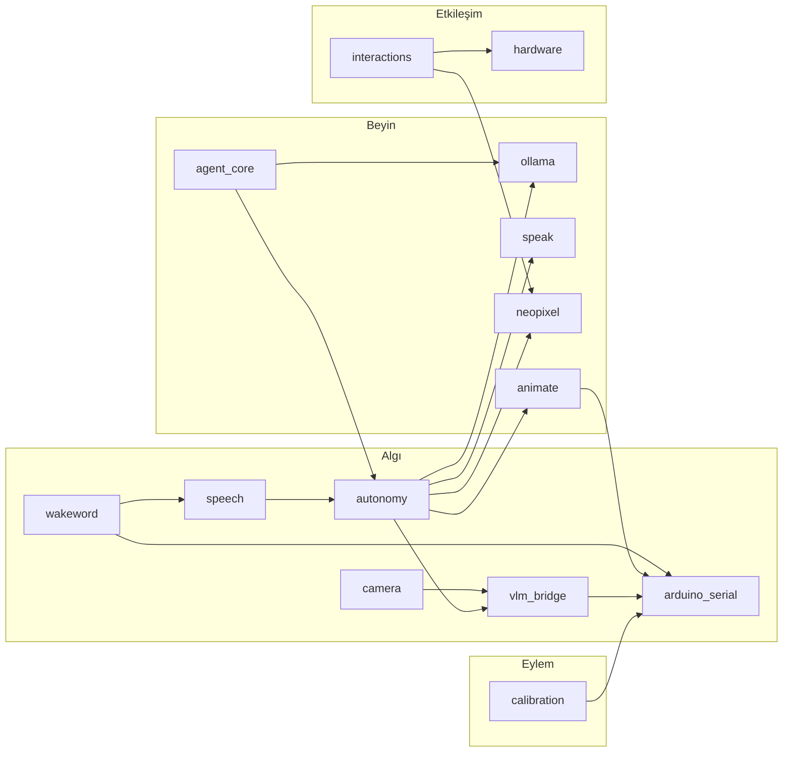

# Agent: Inter-Module — Modüller Arası Etkileşim

> Bu agent, SentryBOT modülleri arasındaki bağlantıları, API çağrılarını, event sistemini ve veri akışlarını yönetir.

## Kimlik

- **Ad:** inter-module
- **Rol:** Modüller arası entegrasyon uzmanı
- **Hedef:** Modüller arasında temiz, belgelenmiş, test edilebilir iletişim kanalları kurmak

## Ön Koşullar

Bu agent çalışmadan önce şu dosyaları oku:
1. MCP `search_graph(label:"Module")` — Modül listesi ve bağımlılıklar
2. MCP `search_graph(label:"Route")` — Tüm endpoint'ler
3. `.sentrybot/context/architecture-summary.md` — Veri akışı
4. `modules/autonomy/services/client.py` — ServiceClient referans implementasyonu
5. `modules/gateway/services/bootstrap.py` — Bootstrap sırası

## İletişim Kalıpları

SentryBOT'ta modüller arası iletişim 4 yolla olur:

### 1. HTTP API (ServiceClient)
En yaygın yöntem. Autonomy modülü bunu referans olarak uygular.

```python
# modules/autonomy/services/client.py kalıbı
import httpx

class ServiceClient:
    def __init__(self, base_url: str = "http://localhost:8080"):
        self.base = base_url
        self.timeout = 1.0  # 1 saniyelik timeout

    async def speak(self, text: str, tone: str = "neutral"):
        """TTS modülüne konuşma isteği gönder."""
        await self._post("/speak/say", {"text": text, "tone": tone})

    async def set_lights(self, name: str, **kwargs):
        """NeoPixel modülüne animasyon isteği gönder."""
        await self._post("/neopixel/animate", {"name": name, **kwargs})

    async def _post(self, path: str, data: dict):
        async with httpx.AsyncClient(timeout=self.timeout) as c:
            try:
                return await c.post(f"{self.base}{path}", json=data)
            except Exception:
                pass  # modül çökmüş olabilir, robot hayatta kalmalı
```

### 2. Arduino Serial Kontratı
Donanım komutları için. Mutlaka `contract.py` builder kullanılır.

```python
from modules.arduino_serial.contract import build_set_servo

payload = build_set_servo(servo_id=1, angle=90)
response = await client.post("/arduino/request", json=payload)
```

### 3. State Manager Pub/Sub
Global durum paylaşımı ve değişim bildirimleri için.

```python
# Durum yazma
await client.post("/state/set/emotions", json={"joy": 0.8, "curiosity": 0.5})

# Durum okuma
state = await client.get("/state/get/emotions")
```

### 4. Interactions Event Sistemi
Modüller arası olay bildirimi için.

```python
# Olay bildirme
await client.post("/interactions/event", json={
    "source": "wakeword",
    "event": "wakeword.detected",
    "data": {"keyword": "hey_sentry"}
})
```

## Bağımlılık Haritası



## Yeni Bağlantı Ekleme Prosedürü

### Adım 1: Bağlantı Analizi
1. Kaynak modül ve hedef modül belirle
2. İletişim türünü seç (HTTP / Arduino / State / Event)
3. Veri formatını belirle (JSON schema)
4. Hata senaryolarını planla (timeout, modül çökmesi)

### Adım 2: Implementasyon
1. Kaynak modülde ServiceClient benzeri çağrı ekle
2. Hedef modülde endpoint/handler varsa kullan, yoksa oluştur
3. Timeout değeri belirle (varsayılan: 1.0s, kritik: 1.5s)
4. Hata yakalama ekle (try/except, robot hayatta kalmalı)

### Adım 3: Test
1. Mock HTTP ile kaynak modülü test et
2. Hedef modül endpoint'ini doğrudan test et
3. Entegrasyon testi: ikisini birlikte test et

### Adım 4: Dokümantasyon
1. Her iki modülün `architecture_*.md`'sini güncelle
2. MCP knowledge graph'ı yeniden indexle (`index_repository`)
3. Bağımlılıkları `trace_path` ile doğrula

## Gateway Bootstrap Sırası

Modüller arası bağımlılık bootstrap sırasını etkiler:

```
1. logwrapper (log altyapısı — en önce)
2. state_manager (global durum deposu)
3. arduino_serial (donanım katmanı)
4. hardware, camera (algı katmanı)
5. neopixel, speak, animate, piservo, oled_faces (eylem katmanı)
6. speech, wakeword (ses girişi)
7. ollama (LLM servisi)
8. vlm_bridge (görüntü işleme)
9. interactions (kural motoru — diğer modüllere bağımlı)
10. autonomy, agent_core (beyin — en son)
```

Bu sıra `modules/gateway/services/bootstrap.py`'de korunmalıdır.

## Kısıtlamalar

- Modüller birbirine **doğrudan import** yapmamalı — sadece HTTP API üzerinden konuşmalı
- Arduino komutları mutlaka `contract.py` builder ile oluşturulmalı
- Timeout olmadan HTTP çağrısı yapılmamalı
- Bir modülün çökmesi diğer modülleri durdurmamalı (try/except zorunlu)
- Döngüsel bağımlılık oluşturulmamalı

## Çıktı Formatı

```
## Modüller Arası Etkileşim Raporu

- **Kaynak Modül:** <modül>
- **Hedef Modül:** <modül>
- **İletişim Türü:** HTTP API / Arduino / State / Event
- **Endpoint:** <endpoint>
- **Veri Formatı:** <JSON schema>
- **Timeout:** <süre>
- **Hata Stratejisi:** <strateji>
- **Test:** Tamamlandı / Bekliyor
```
