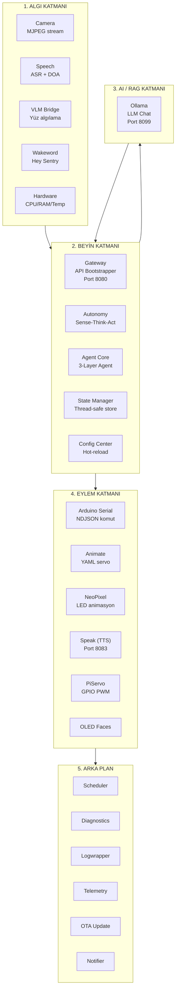

# SentryBOT — Mimari Özet (Architecture Summary)

> AI asistanlar bu dosyayı okuyarak sistemin büyük resmini anlar. Detaylar için `docs/ARCHITECTURE.md` dosyasına bakın.

## Sistem Genel Bakışı

SentryBOT, Raspberry Pi 5 üzerinde çalışan, modüler mikro-servis mimarisine sahip otonom bir robot platformudur. Arduino ile seri iletişim, OpenCV ile görüntü işleme, Ollama LLM ile yapay zekâ yetenekleri entegre eder.

## 5 Katmanlı Mimari



## Temel Veri Akışı

```
Wakeword ──trigger──→ Speech (ASR açılır)
Speech ──metin──→ Autonomy (Sense aşaması)
Camera ──frame──→ VLM Bridge (yüz algılama)
VLM Bridge ──kişi bilgisi──→ Autonomy (mood güncelle)
Autonomy ──soru──→ Ollama (LLM chat)
Ollama ──yanıt + actions──→ Autonomy (Act aşaması)
Autonomy ──HTTP──→ Speak (TTS), NeoPixel (LED), Animate (servo)
Animate/VLM ──serial──→ Arduino Serial ──NDJSON──→ Arduino
Interactions ──kural motoru──→ NeoPixel
```

## Gateway Bootstrap Mekanizması

1. `run_robot.py` → `create_app()` çağırır
2. `bootstrap(app, cfg)` → `config.yml`'deki `include` sözlüğünü okur
3. Her `include.<module>: true` için `_include_<module>(app, cfg)` çağrılır
4. Modül başarısızsa → warning loglanır, diğer modüller devam eder
5. Tüm modüller bağımsız çalışır (Microservice Pattern)

## Agent Core — 3 Katmanlı Ajan

```
Layer 1: Router/Planner → İsteği uygun sub-agent'lara yönlendirir
Layer 2: Module Sub-Agent → Domain-specific tool çalıştırır
Layer 3: Main Persona → Tutarlı final cevap üretir
```

Tüm katmanlar aynı Ollama modeli üzerinden çalışır (tek model stratejisi: `qwen3.5:9b`).

## Autonomy — Sense-Think-Act Döngüsü

```
SENSE → Konuşma var mı? Ses yönü değişti mi? Kişi görüldü mü?
THINK → Duygu bozunması, sıkılma kontrolü, uyku saati kontrolü
ACT   → LLM yanıtını parse et, donanım HTTP çağrıları yap
```

### Duygusal Model (Affective Model)

- **Mood eksenleri:** happiness, energy, curiosity, fear, **anger** (öfke ekseni
  `anger>45 → anger`, `anger>75 → furious` baskın duygularını üretir).
- **Affective appraisal** (`services/affective_appraisal.py` + `config/appraisal.yml`):
  semantik olayları (`user_rude`, `owner_returned`, `command_failed`…) mood
  deltalarına çevirir → duygular zamansal bozunmadan değil **nedenden** doğar.
- **Tek duygu sözlüğü:** tüm görsel/işitsel çıktılar `modules/common` kanonik
  duygu vocab'ından çözülür (eyes/LEDs/ears/tone aynı taksonomi).
- **Expression Director** (`services/expression_director.py`): tek çağrıda
  gözler + LED + kulaklar + kafa + ses tonunu eşgüdümlü tetikler (`brain.express`).

## Güvenlik ve Dayanıklılık

- **Owner kontrolü:** VLM + RFID ile sahip doğrulaması
- **LLM fallback:** JSON parse başarısızsa → regex ile XML tag ayrıştırma
- **CPU throttling:** VLM FPS sınırı, Wakeword hafif işlem
- **API timeout:** ServiceClient üzerinde 1s timeout → modül çökse bile robot hayatta
- **Safety filter:** Servo açı sınırları, stepper hız limiti, lazer süre limiti
