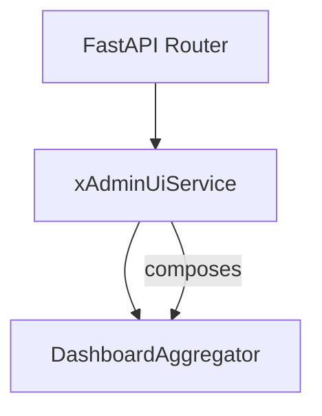
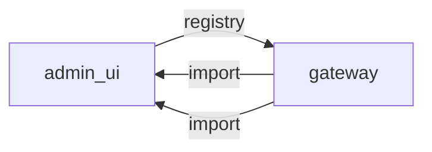

# admin_ui

> **Web yönetim paneli (statik dosyalar)**

## Kimlik
| Alan | Değer |
| --- | --- |
| Ana sınıf | `xAdminUiService` |
| Giriş noktası | `—` |
| Orkestratör | `—` |
| Ana dosya | `modules/admin_ui/xAdminUiService.py` |
| Katman | Etkileşim |
| Port | — |
| Arduino | Hayır |
| Sınıf sayısı | 2 |
| Endpoint sayısı | 12 |

## İsimlendirilmiş Bileşenler (Sınıflar)

#### `DashboardAggregator` — `modules/admin_ui/services/dashboard.py`
- **Görev:** —
- **Kalıtım:** —
- **Oluşturduğu bileşenler:** —
- **Metodlar:** `status_snapshot()`, `vision_snapshot()`, `people_snapshot()`, `profiles_snapshot()`, `config_snapshot()`, `hardware_snapshot()`, `logs_snapshot()`, `all_snapshots()`

#### `xAdminUiService` — `modules/admin_ui/xAdminUiService.py`
- **Görev:** —
- **Kalıtım:** —
- **Oluşturduğu bileşenler:** `DashboardAggregator`
- **Metodlar:** `mount_prefix()`, `snapshot()`


## API — Endpoint → Handler → Servis

| HTTP | Path | Handler | Çağırdığı servis | Açıklama |
| --- | --- | --- | --- | --- |
| GET | `/health` | `health()` | — | — |
| GET | `/ui` | `ui_index()` | — | — |
| GET | `/ui/{path:path}` | `ui_asset()` | — | — |
| GET | `/api/status` | `api_status()` | — | — |
| GET | `/api/vision` | `api_vision()` | — | — |
| GET | `/api/people` | `api_people()` | — | — |
| GET | `/api/profiles` | `api_profiles()` | — | — |
| GET | `/api/config` | `api_config()` | — | — |
| GET | `/api/hardware` | `api_hardware()` | — | — |
| GET | `/api/all` | `api_all()` | — | — |
| POST | `/api/profile/switch` | `api_profile_switch()` | — | — |
| GET | `/api/stream` | `api_stream()` | — | — |

## Config Bölümleri
- `enabled`
- `mount_prefix`
- `bind_lan_only`
- `allowed_networks`
- `auth`
- `sse`

## Dış İlişkiler (Bu modül → diğerleri)

| Hedef modül | Bağlantı tipi | Detay | Neden |
| --- | --- | --- | --- |
| [[gateway]] | registry | registry dependency: gateway | Tek port üzerinden tüm modül API'lerine erişir. |

## Gelen İlişkiler (Diğerleri → bu modül)

| Kaynak modül | Bağlantı tipi | Detay | Neden |
| --- | --- | --- | --- |
| [[gateway]] | import | api | `gateway` kod içinde `admin_ui` modülünü import eder (`api`) — Web yönetim paneli (statik dosyalar). |
| [[gateway]] | import | config_loader | `gateway` kod içinde `admin_ui` modülünü import eder (`config_loader`) — Web yönetim paneli (statik dosyalar). |

## İç Mimari (otomatik çıkarım)



## Modül Etkileşim Haritası



---

# Tam Kaynak Arşivi

### `modules/admin_ui/__init__.py` (11 satır)

```python
"""SentryBOT admin UI module.

Single LAN-only management surface served from ``/admin/*``. Exposes a vanilla
HTML + JS dashboard backed by aggregator endpoints and a Server-Sent Events
stream that fan-outs arbiter / vision / social status snapshots.
"""

from .services.dashboard import DashboardAggregator
from .xAdminUiService import xAdminUiService

__all__ = ["DashboardAggregator", "xAdminUiService"]
```

### `modules/admin_ui/api/__init__.py` (3 satır)

```python
from .router import get_router

__all__ = ["get_router"]
```

### `modules/admin_ui/api/router.py` (228 satır)

```python
"""FastAPI router that exposes the Admin UI surface.

Endpoints:

- ``GET /admin/ui`` and ``GET /admin/ui/{path:path}`` — serve the vanilla HTML
  bundle from :mod:`modules.admin_ui.static`.
- ``GET /admin/api/status`` — aggregated dashboard snapshot.
- ``GET /admin/api/vision`` — vision pipeline state.
- ``GET /admin/api/people`` — social database people view.
- ``GET /admin/api/profiles`` — realtime / subagent profile state.
- ``GET /admin/api/config`` — runtime registry keys.
- ``GET /admin/api/hardware`` — hardware presence map.
- ``POST /admin/api/profile/switch`` — atomically switch realtime profile.
- ``GET /admin/api/stream`` — SSE feed (status snapshots).
"""

from __future__ import annotations

import asyncio
import json
import logging
import time
from pathlib import Path
from typing import Any, Dict, Optional

from fastapi import APIRouter, FastAPI, HTTPException, Header, Request
from fastapi.responses import FileResponse, HTMLResponse, JSONResponse, Response, StreamingResponse
from fastapi.staticfiles import StaticFiles

from ..services.dashboard import DashboardAggregator
from ..services.lan_filter import is_allowed_client

logger = logging.getLogger("admin_ui.api")

_STATIC_DIR = Path(__file__).resolve().parent.parent / "static"


def _require_lan(request: Request, cfg: Dict[str, Any]) -> None:
    enforce = bool(cfg.get("bind_lan_only", True))
    networks = cfg.get("allowed_networks") or []
    remote_host = request.client.host if request.client else ""
    xff = request.headers.get("X-Forwarded-For")
    if not is_allowed_client(remote_host, xff, networks, enforce):
        raise HTTPException(status_code=403, detail="admin_ui: client outside LAN allowlist")


def _require_token(cfg: Dict[str, Any], provided: Optional[str]) -> None:
    auth_cfg = cfg.get("auth", {}) if isinstance(cfg.get("auth", {}), dict) else {}
    token = str(auth_cfg.get("token", "") or "").strip()
    if not token:
        return
    if provided != token:
        raise HTTPException(status_code=401, detail="admin_ui: invalid admin token")


def get_router(cfg: Dict[str, Any], aggregator: DashboardAggregator, started: Dict[str, Any]) -> APIRouter:
    router = APIRouter(prefix=str(cfg.get("mount_prefix", "/admin") or "/admin"), tags=["admin_ui"])
    auth_header = str(cfg.get("auth", {}).get("header", "X-Admin-Token") or "X-Admin-Token")

    def _gate(request: Request, token: Optional[str]) -> None:
        _require_lan(request, cfg)
        _require_token(cfg, token)

    @router.get("/health", summary="Admin UI health")
    def health(request: Request) -> Dict[str, Any]:
        _require_lan(request, cfg)
        return {
            "ok": True,
            "ts": time.time(),
            "lan_only": bool(cfg.get("bind_lan_only", True)),
            "auth_required": bool(cfg.get("auth", {}).get("token")),
            "mount_prefix": cfg.get("mount_prefix", "/admin"),
        }

    @router.get("/ui", summary="Serve admin dashboard")
    def ui_index(request: Request) -> Response:
        _require_lan(request, cfg)
        index = _STATIC_DIR / "index.html"
        if not index.exists():
            return HTMLResponse("<h1>Admin UI assets missing</h1>", status_code=500)
        return FileResponse(str(index))

    @router.get("/ui/{path:path}", summary="Serve admin dashboard asset")
    def ui_asset(path: str, request: Request) -> Response:
        _require_lan(request, cfg)
        candidate = (_STATIC_DIR / path).resolve()
        try:
            candidate.relative_to(_STATIC_DIR.resolve())
        except ValueError:
            raise HTTPException(status_code=404, detail="asset not found")
        if not candidate.exists() or not candidate.is_file():
            raise HTTPException(status_code=404, detail="asset not found")
        return FileResponse(str(candidate))

    @router.get("/api/status", summary="Aggregated status snapshot")
    def api_status(request: Request, token: Optional[str] = Header(default=None, alias=auth_header)) -> Dict[str, Any]:
        _gate(request, token)
        return aggregator.status_snapshot()

    @router.get("/api/vision", summary="Vision pipeline snapshot")
    def api_vision(request: Request, token: Optional[str] = Header(default=None, alias=auth_header)) -> Dict[str, Any]:
        _gate(request, token)
        return aggregator.vision_snapshot()

    @router.get("/api/people", summary="Social DB people snapshot")
    def api_people(request: Request, limit: int = 50, token: Optional[str] = Header(default=None, alias=auth_header)) -> Dict[str, Any]:
        _gate(request, token)
        return aggregator.people_snapshot(limit=max(1, min(500, int(limit))))

    @router.get("/api/profiles", summary="Realtime profile + subagent snapshot")
    def api_profiles(request: Request, token: Optional[str] = Header(default=None, alias=auth_header)) -> Dict[str, Any]:
        _gate(request, token)
        return aggregator.profiles_snapshot()

    @router.get("/api/config", summary="Runtime registry snapshot")
    def api_config(request: Request, token: Optional[str] = Header(default=None, alias=auth_header)) -> Dict[str, Any]:
        _gate(request, token)
        return aggregator.config_snapshot()

    @router.get("/api/hardware", summary="Hardware presence snapshot")
    def api_hardware(request: Request, token: Optional[str] = Header(default=None, alias=auth_header)) -> Dict[str, Any]:
        _gate(request, token)
        return aggregator.hardware_snapshot()

    @router.get("/api/all", summary="All snapshots in a single payload")
    def api_all(request: Request, token: Optional[str] = Header(default=None, alias=auth_header)) -> Dict[str, Any]:
        _gate(request, token)
        return aggregator.all_snapshots()

    @router.post("/api/profile/switch", summary="Atomically switch realtime profile")
    def api_profile_switch(
        request: Request,
        body: Dict[str, Any],
        token: Optional[str] = Header(default=None, alias=auth_header),
    ) -> Dict[str, Any]:
        _gate(request, token)
        mode = str((body or {}).get("name") or (body or {}).get("mode") or "").strip().lower()
        if not mode:
            raise HTTPException(status_code=400, detail="name required")
        autonomy = started.get("autonomy")
        agent = started.get("agent_core")
        if agent is None:
            agent = getattr(getattr(autonomy, "brain", None), "agent", None)
        vlm = started.get("vlm_bridge")
        applied: Dict[str, Any] = {}

        profile = None
        rt_cfg_source: Dict[str, Any] = {}
        if agent is not None and hasattr(agent, "config"):
            cfg_src = getattr(agent, "config", {})
            rt_cfg_src = cfg_src.get("realtime_profile", {}) if isinstance(cfg_src, dict) else {}
            if isinstance(rt_cfg_src, dict):
                rt_cfg_source = rt_cfg_src
                profiles_map = rt_cfg_src.get("profiles", {}) if isinstance(rt_cfg_src.get("profiles", {}), dict) else {}
                profile = profiles_map.get(mode)
                if not isinstance(profile, dict) or not profile:
                    cand = rt_cfg_src.get(mode)
                    profile = cand if isinstance(cand, dict) else None

        if isinstance(profile, dict) and agent is not None and hasattr(agent, "apply_realtime_profile"):
            applied["agent_core"] = agent.apply_realtime_profile(profile)
            if isinstance(rt_cfg_source, dict):
                rt_cfg_source["active"] = mode

        if vlm is not None and hasattr(vlm, "apply_realtime_profile"):
            applied["vlm_bridge"] = vlm.apply_realtime_profile(mode)

        base_url = str(started.get("gateway_base_url", "http://127.0.0.1:8080")).rstrip("/")
        ollama_np = None
        if isinstance(profile, dict):
            ollama_np = profile.get("ollama_num_predict") or profile.get("num_predict")

        if ollama_np is not None:
            try:
                import requests  # type: ignore

                r_ol = requests.post(
                    f"{base_url}/ollama/runtime/num_predict",
                    json={"num_predict": int(ollama_np)},
                    timeout=2.0,
                )
                applied["ollama"] = {"ok": r_ol.status_code == 200, "status": r_ol.status_code}
            except Exception as exc:
                applied["ollama"] = {"ok": False, "error": str(exc)}

        speak_chunk = None
        if isinstance(profile, dict):
            speak_chunk = profile.get("speak_max_chunk_chars") or profile.get("tts_max_chunk_chars")

        if speak_chunk is not None:
            applied["speak"] = {
                "hint": "Speak service uses /speak/say_stream max_chunk_chars per call; hot field not wired yet.",
                "max_chunk_chars": int(speak_chunk),
            }

        return {"ok": True, "profile": mode, "applied": applied}

    @router.get("/api/stream", summary="SSE stream of dashboard snapshots")
    async def api_stream(request: Request, token: Optional[str] = Header(default=None, alias=auth_header)) -> StreamingResponse:
        _gate(request, token)
        interval = max(0.25, float(cfg.get("sse", {}).get("interval_s", 1.0)))
        heartbeat = max(interval, float(cfg.get("sse", {}).get("heartbeat_s", 10.0)))

        async def _gen():
            last_beat = time.time()
            while True:
                if await request.is_disconnected():
                    break
                try:
                    payload = aggregator.status_snapshot()
                    yield f"event: status\ndata: {json.dumps(payload, default=str)}\n\n"
                except Exception as exc:
                    logger.debug("admin sse status failure: %s", exc)
                if (time.time() - last_beat) >= heartbeat:
                    yield ": keep-alive\n\n"
                    last_beat = time.time()
                await asyncio.sleep(interval)

        return StreamingResponse(_gen(), media_type="text/event-stream")

    return router


def mount(app: FastAPI, cfg: Dict[str, Any], started: Dict[str, Any]) -> APIRouter:
    aggregator = DashboardAggregator(started)
    router = get_router(cfg, aggregator, started)
    app.include_router(router)
    return router
```

### `modules/admin_ui/config/config.yml` (16 satır)

```yaml
enabled: true
mount_prefix: /admin
bind_lan_only: true
allowed_networks:
  - "127.0.0.1/32"
  - "::1/128"
  - "10.0.0.0/8"
  - "172.16.0.0/12"
  - "192.168.0.0/16"
  - "169.254.0.0/16"
auth:
  token: ""
  header: X-Admin-Token
sse:
  interval_s: 1.0
  heartbeat_s: 10.0
```

### `modules/admin_ui/config_loader.py` (14 satır)

```python
from __future__ import annotations
from pathlib import Path
from typing import Any, Dict
import yaml

_DEFAULT_CFG_PATH = Path(__file__).parent / "config" / "config.yml"


def load_config(path: str | None = None) -> Dict[str, Any]:
    p = Path(path) if path else _DEFAULT_CFG_PATH
    if not p.exists():
        p = _DEFAULT_CFG_PATH
    with open(p, "r", encoding="utf-8") as f:
        return yaml.safe_load(f) or {}
```

### `modules/admin_ui/services/__init__.py` (3 satır)

```python
from .dashboard import DashboardAggregator

__all__ = ["DashboardAggregator"]
```

### `modules/admin_ui/services/dashboard.py` (228 satır)

```python
"""Aggregates live status snapshots from the various subsystems.

The :class:`DashboardAggregator` does not own any state; it queries already
running services (passed in via ``started``) and produces JSON-serialisable
payloads consumed by both the polling REST endpoints and the SSE stream.

It is intentionally defensive: every accessor catches ``Exception`` so a
single misbehaving subsystem never breaks the dashboard.
"""

from __future__ import annotations

import logging
import time
from typing import Any, Dict, List, Optional

logger = logging.getLogger("admin_ui.dashboard")


def _safe_call(fn, default=None):
    if not callable(fn):
        return default
    try:
        return fn()
    except Exception as exc:  # pragma: no cover - defensive
        logger.debug("dashboard accessor failed: %s", exc)
        return default


class DashboardAggregator:
    def __init__(self, started: Dict[str, Any]):
        self.started = started

    # ------------------------------------------------------------------
    # Module accessors
    # ------------------------------------------------------------------
    def _agent(self) -> Optional[Any]:
        agent = self.started.get("agent_core")
        if agent is None:
            autonomy = self.started.get("autonomy")
            brain = getattr(autonomy, "brain", None) if autonomy is not None else None
            agent = getattr(brain, "agent", None) if brain is not None else None
        return agent

    def _progress(self) -> Optional[Any]:
        agent = self._agent()
        return getattr(agent, "progress", None) if agent is not None else None

    def _vlm_bridge(self) -> Optional[Any]:
        return self.started.get("vlm_bridge")

    def _runtime_registry(self) -> Optional[Any]:
        return self.started.get("runtime_registry")

    def _social_db(self) -> Optional[Any]:
        return self.started.get("social_db")

    def _state_manager(self) -> Optional[Any]:
        return self.started.get("state_manager")

    def _imx500_runner(self) -> Optional[Any]:
        return self.started.get("imx500_runner")

    def _onsensor_bus(self) -> Optional[Any]:
        return self.started.get("onsensor_bus")

    # ------------------------------------------------------------------
    # Snapshot builders
    # ------------------------------------------------------------------
    def status_snapshot(self) -> Dict[str, Any]:
        progress = self._progress()
        arbiters: Dict[str, Any] = {}
        if progress is not None and hasattr(progress, "arbiter_snapshot"):
            try:
                arbiters = progress.arbiter_snapshot() or {}
            except Exception as exc:
                logger.debug("arbiter_snapshot failed: %s", exc)

        operational = "unknown"
        state_mgr = self._state_manager()
        if state_mgr is not None:
            operational = _safe_call(getattr(state_mgr, "get_operational", None), default="unknown") or "unknown"

        imx_runner = self._imx500_runner()
        imx_status: Dict[str, Any] = {"available": False}
        if imx_runner is not None:
            imx_status = {
                "available": bool(getattr(imx_runner, "available", False)),
                "running": bool(getattr(imx_runner, "_thread", None) and imx_runner._thread.is_alive()),
            }

        bus = self._onsensor_bus()
        bus_stats = _safe_call(getattr(bus, "stats", None), default={}) if bus is not None else {}

        autonomy = self.started.get("autonomy")
        mood = None
        brain = getattr(autonomy, "brain", None) if autonomy is not None else None
        if brain is not None:
            mood_state = _safe_call(getattr(getattr(brain, "mood", None), "snapshot", None), default=None)
            if mood_state is not None:
                mood = mood_state

        return {
            "ts": time.time(),
            "operational": operational,
            "arbiters": arbiters,
            "mood": mood,
            "imx500": imx_status,
            "onsensor_bus": bus_stats,
            "modules": sorted([k for k, v in self.started.items() if v is not None]),
        }

    def vision_snapshot(self) -> Dict[str, Any]:
        proc = self._vlm_bridge()
        if proc is None:
            return {"available": False}
        modes = _safe_call(getattr(proc, "get_modes", None), default={}) or {}
        categories = _safe_call(getattr(proc, "get_mode_categories", None), default={}) or {}
        processing_mode = getattr(proc, "processing_mode", "unknown")
        follow_status = _safe_call(getattr(proc, "follow_status", None), default={}) or {}
        realtime = _safe_call(getattr(proc, "get_realtime_profile_status", None), default={}) or {}
        return {
            "available": True,
            "processing_mode": processing_mode,
            "modes": modes,
            "mode_categories": categories,
            "follow": follow_status,
            "realtime_profile": realtime,
            "remote_multimodal_enabled": bool(getattr(proc, "remote_mm_enabled", False)),
        }

    def people_snapshot(self, limit: int = 50) -> Dict[str, Any]:
        db = self._social_db()
        people: List[Dict[str, Any]] = []
        if db is not None and hasattr(db, "persons"):
            try:
                persons_repo = db.persons
                people_iter = []
                if hasattr(persons_repo, "list"):
                    people_iter = persons_repo.list(limit=limit) or []
                elif hasattr(persons_repo, "list_all"):
                    people_iter = persons_repo.list_all() or []
                for row in people_iter:
                    if isinstance(row, dict):
                        people.append(row)
                    elif hasattr(row, "__dict__"):
                        people.append({k: v for k, v in row.__dict__.items() if not k.startswith("_")})
            except Exception as exc:
                logger.debug("social_db.persons.list failed: %s", exc)
        if not people:
            proc = self._vlm_bridge()
            identity = getattr(proc, "person_identity", None) if proc is not None else None
            if identity is not None and hasattr(identity, "_records"):
                for rec in list(getattr(identity, "_records", {}).values())[:limit]:
                    people.append({
                        "person_id": getattr(rec, "person_id", ""),
                        "name": getattr(rec, "name", ""),
                        "recognition_level": getattr(rec, "recognition_level", 0),
                        "relationship": getattr(rec, "relationship", "unknown"),
                        "seen_count": getattr(rec, "seen_count", 0),
                        "last_seen": getattr(rec, "last_seen", None),
                    })
        return {"count": len(people), "people": people}

    def profiles_snapshot(self) -> Dict[str, Any]:
        agent = self._agent()
        profiles: List[str] = []
        active = "unknown"
        max_subagents = None
        if agent is not None:
            rt_cfg = getattr(agent, "config", {}).get("realtime_profile", {}) if isinstance(getattr(agent, "config", {}), dict) else {}
            active = str(rt_cfg.get("active", "unknown"))
            inner = rt_cfg.get("profiles", {})
            if isinstance(inner, dict):
                profiles = sorted(inner.keys())
            router = getattr(agent, "router", None)
            if router is not None:
                max_subagents = getattr(router, "max_subagents", None)
        return {
            "active": active,
            "profiles": profiles,
            "max_subagents": max_subagents,
        }

    def config_snapshot(self) -> Dict[str, Any]:
        reg = self._runtime_registry()
        if reg is None:
            return {"available": False, "keys": []}
        keys: List[Dict[str, Any]] = []
        try:
            if hasattr(reg, "list_keys"):
                for entry in reg.list_keys() or []:
                    keys.append(entry if isinstance(entry, dict) else {"key": str(entry)})
            elif hasattr(reg, "describe"):
                keys = list(reg.describe() or [])
        except Exception as exc:
            logger.debug("runtime registry list failed: %s", exc)
        return {"available": True, "keys": keys}

    def hardware_snapshot(self) -> Dict[str, Any]:
        arduino = self.started.get("arduino")
        esp = self.started.get("esp_link")
        camera = self.started.get("camera")
        neopixel = self.started.get("neopixel")
        return {
            "arduino": bool(arduino is not None),
            "esp_link": bool(esp is not None),
            "camera": bool(camera is not None),
            "neopixel": bool(neopixel is not None),
            "imx500": _safe_call(getattr(self._imx500_runner(), "available", None), default=False) if self._imx500_runner() is not None else False,
        }

    def     logs_snapshot(self, limit: int = 50) -> Dict[str, Any]:
        return {
            "ok": True,
            "url": "/logs/?n=50",
            "limit": int(limit),
        }

    def all_snapshots(self) -> Dict[str, Any]:
        return {
            "status": self.status_snapshot(),
            "vision": self.vision_snapshot(),
            "people": self.people_snapshot(),
            "profiles": self.profiles_snapshot(),
            "config": self.config_snapshot(),
            "hardware": self.hardware_snapshot(),
        }
```

### `modules/admin_ui/services/lan_filter.py` (73 satır)

```python
"""Helpers for restricting Admin UI access to LAN clients.

A request is accepted when its remote address (or ``X-Forwarded-For`` head)
falls inside one of the configured CIDR networks. Loopback addresses and link
local ranges are always permitted so local maintenance keeps working.
"""

from __future__ import annotations

import ipaddress
import logging
from typing import Iterable, Optional, Sequence

logger = logging.getLogger("admin_ui.lan_filter")


_DEFAULT_NETS = (
    "127.0.0.0/8",
    "::1/128",
    "10.0.0.0/8",
    "172.16.0.0/12",
    "192.168.0.0/16",
    "169.254.0.0/16",
    "fc00::/7",
    "fe80::/10",
)


def parse_networks(networks: Optional[Sequence[str]]) -> list:
    nets = []
    for raw in (networks or _DEFAULT_NETS):
        if not raw:
            continue
        try:
            nets.append(ipaddress.ip_network(str(raw), strict=False))
        except ValueError as exc:  # pragma: no cover - config issue
            logger.warning("ignoring invalid admin_ui network %r: %s", raw, exc)
    return nets


def _candidate_ips(remote: str, xff: Optional[str]) -> Iterable[str]:
    if xff:
        for token in xff.split(","):
            token = token.strip()
            if token:
                yield token
    if remote:
        yield remote


def is_allowed_client(
    remote_addr: str,
    xff_header: Optional[str],
    networks: Sequence[str],
    enforce: bool,
) -> bool:
    if not enforce:
        return True
    parsed_nets = parse_networks(networks)
    if not parsed_nets:
        return True
    for raw in _candidate_ips(remote_addr or "", xff_header):
        try:
            ip = ipaddress.ip_address(raw)
        except ValueError:
            continue
        for net in parsed_nets:
            try:
                if ip in net:
                    return True
            except TypeError:
                continue
    return False
```

### `modules/admin_ui/static/app.js` (159 satır)

```javascript
const $ = (sel) => document.querySelector(sel);

function pretty(obj) {
  try {
    return JSON.stringify(obj, null, 2);
  } catch {
    return String(obj);
  }
}

async function fetchJson(url) {
  const res = await fetch(url, { headers: { Accept: "application/json" } });
  if (!res.ok) throw new Error(`${res.status} ${res.url}`);
  return res.json();
}

function activateTab(id) {
  document.querySelectorAll(".tabs button").forEach((b) => {
    b.classList.toggle("active", b.dataset.tab === id);
  });
  document.querySelectorAll(".pane").forEach((p) => {
    p.classList.toggle("active", p.id === `pane-${id}`);
  });
}

let sseAbort = null;

function stopSse() {
  if (sseAbort) sseAbort.abort();
  sseAbort = null;
  $("#sse-state").textContent = "SSE idle";
}

function startSse() {
  stopSse();
  sseAbort = new AbortController();
  $("#sse-state").textContent = "SSE connecting…";
  fetch("/admin/api/stream", {
    headers: { Accept: "text/event-stream" },
    signal: sseAbort.signal,
  })
    .then(async (resp) => {
      if (!resp.ok) throw new Error("stream " + resp.status);
      $("#sse-state").textContent = "SSE connected";
      const reader = resp.body.getReader();
      const decoder = new TextDecoder();
      let buf = "";
      while (true) {
        const { value, done } = await reader.read();
        if (done) break;
        buf += decoder.decode(value, { stream: true });
        const parts = buf.split("\n\n");
        buf = parts.pop() || "";
        for (const chunk of parts) {
          chunk.split("\n").forEach((line) => {
            if (!line.startsWith("data:")) return;
            const raw = line.replace(/^data:\s*/, "").trim();
            try {
              const payload = JSON.parse(raw);
              $("#status-pre").textContent = pretty(payload);
            } catch {}
          });
        }
      }
    })
    .catch(() => {
      $("#sse-state").textContent = "SSE error / stopped";
    });
}

async function refreshAll() {
  try {
    const [status, vision, people, profiles, hw] = await Promise.all([
      fetchJson("/admin/api/status"),
      fetchJson("/admin/api/vision"),
      fetchJson("/admin/api/people"),
      fetchJson("/admin/api/profiles"),
      fetchJson("/admin/api/hardware"),
    ]);
    $("#status-pre").textContent = pretty(status);
    $("#vision-pre").textContent = pretty(vision);
    $("#people-pre").textContent = pretty(people);
    $("#hardware-pre").textContent = pretty(hw);

    $("#slider-subagents").value = profiles.max_subagents || 3;
    $("#slider-subagents-label").textContent = $("#slider-subagents").value;

    const pb = $("#profile-buttons");
    pb.innerHTML = "";
    (profiles.profiles || []).forEach((name) => {
      const btn = document.createElement("button");
      btn.textContent = name;
      btn.addEventListener("click", async () => {
        $("#profile-result").textContent = "Switching…";
        try {
          const resp = await fetch("/admin/api/profile/switch", {
            method: "POST",
            headers: { "Content-Type": "application/json" },
            body: JSON.stringify({ name }),
          });
          const data = await resp.json();
          $("#profile-result").textContent = pretty(data);
          await refreshAll();
        } catch (e) {
          $("#profile-result").textContent = String(e);
        }
      });
      pb.append(btn);
    });
  } catch (e) {
    $("#status-pre").textContent = "Refresh failed: " + e.message;
  }
}

async function refreshLogs() {
  try {
    const data = await fetchJson("/logs/?n=40");
    $("#logs-pre").textContent = pretty(data);
  } catch {
    $("#logs-pre").textContent = "Logs endpoint unavailable.";
  }
}

document.querySelectorAll(".tabs button").forEach((btn) => {
  btn.addEventListener("click", () => activateTab(btn.dataset.tab));
});

$("#sse-toggle").addEventListener("click", () => {
  if (sseAbort) {
    stopSse();
    $("#sse-toggle").textContent = "Start stream";
  } else {
    $("#sse-toggle").textContent = "Stop stream";
    startSse();
  }
});

$("#slider-subagents").addEventListener("input", async (ev) => {
  $("#slider-subagents-label").textContent = ev.target.value;
});

$("#slider-subagents").addEventListener("change", async (ev) => {
  const val = Number(ev.target.value);
  try {
    await fetch("/config/runtime/set", {
      method: "POST",
      headers: { "Content-Type": "application/json" },
      body: JSON.stringify({ key: "agent_core.max_subagents", value: val }),
    });
    $("#profile-result").textContent = `max_subagents ${val} requested`;
    await refreshAll();
  } catch (e) {
    $("#profile-result").textContent = String(e);
  }
});

setInterval(refreshAll, 4000);
setInterval(refreshLogs, 8000);
refreshAll().then(refreshLogs);
```

### `modules/admin_ui/static/index.html` (97 satır)

```html
<!DOCTYPE html>
<html lang="en">
<head>
  <meta charset="utf-8" />
  <meta name="viewport" content="width=device-width,initial-scale=1" />
  <title>SentryBOT Admin</title>
  <link rel="stylesheet" href="/admin/ui/style.css" />
</head>
<body>
  <header class="sb-top">
    <h1>SentryBOT operator console</h1>
    <p class="muted">LAN-only gateway view — status, vision, profiles, people, embedded config/logs.</p>
    <nav class="tabs" id="tabs">
      <button type="button" data-tab="status" class="active">Status</button>
      <button type="button" data-tab="vision">Vision</button>
      <button type="button" data-tab="people">People</button>
      <button type="button" data-tab="profiles">Profiles</button>
      <button type="button" data-tab="config">Config YAML</button>
      <button type="button" data-tab="logs">Logs</button>
      <button type="button" data-tab="hardware">Hardware</button>
    </nav>
  </header>

  <main>
    <section id="pane-status" class="pane active">
      <div class="row">
        <div class="card grow">
          <h2>Live status</h2>
          <pre id="status-pre" class="json"></pre>
        </div>
        <div class="card">
          <h2>SSE feed</h2>
          <p class="muted" id="sse-state">SSE idle</p>
          <button type="button" id="sse-toggle">Start stream</button>
        </div>
      </div>
    </section>

    <section id="pane-vision" class="pane">
      <div class="card">
        <h2>Vision pipeline</h2>
        <pre id="vision-pre" class="json"></pre>
      </div>
    </section>

    <section id="pane-people" class="pane">
      <div class="card">
        <h2>People (social snapshot)</h2>
        <pre id="people-pre" class="json"></pre>
      </div>
    </section>

    <section id="pane-profiles" class="pane">
      <div class="card">
        <h2>Realtime profile</h2>
        <p class="muted">Switches orchestrator presets from <code>config/agent.yaml</code>.</p>
        <div class="profiles-grid" id="profile-buttons"></div>
        <p class="muted" id="profile-result"></p>
        <hr />
        <label>Manual max_subagents<br />
          <input type="range" id="slider-subagents" min="1" max="6" value="3" />
          <span id="slider-subagents-label">3</span>
        </label>
      </div>
    </section>

    <section id="pane-config" class="pane">
      <div class="card">
        <h2>Config Center</h2>
        <iframe title="Config Center UI" src="/config/ui"></iframe>
      </div>
    </section>

    <section id="pane-logs" class="pane">
      <div class="card">
        <h2>Logs</h2>
        <p>Polling <code id="logs-url">/logs/?n=40</code></p>
        <pre id="logs-pre" class="json small"></pre>
      </div>
    </section>

    <section id="pane-hardware" class="pane">
      <div class="card">
        <h2>Hardware bridge</h2>
        <p>Open ESP dashboard when the microcontroller is reachable on the LAN:</p>
        <p><a id="esp-link" href="http://192.168.4.1" target="_blank" rel="noreferrer">http://192.168.4.1</a> (update host as needed)</p>
        <pre id="hardware-pre" class="json"></pre>
      </div>
    </section>
  </main>

  <footer class="sb-foot muted">
    <span id="poll-hint">Auto-refresh 4s · read-only dashboards</span>
  </footer>
  <script src="/admin/ui/app.js"></script>
</body>
</html>
```

### `modules/admin_ui/static/style.css` (126 satır)

```css
:root {
  color-scheme: dark;
  font-family: "Segoe UI", system-ui, sans-serif;
  background: #0d1117;
  color: #e6edf3;
}

body {
  margin: 0;
  min-height: 100vh;
  display: flex;
  flex-direction: column;
}

.sb-top,
.sb-foot {
  padding: 12px 20px;
  background: #161b22;
  border-bottom: 1px solid #30363d;
}

.sb-foot {
  border-top: 1px solid #30363d;
  border-bottom: none;
  margin-top: auto;
}

.muted {
  color: #8b949e;
  font-size: 0.9rem;
}

h1 {
  margin: 4px 0;
  font-size: 1.35rem;
}

main {
  flex: 1;
  padding: 16px 20px;
}

.tabs {
  display: flex;
  gap: 6px;
  flex-wrap: wrap;
  margin-top: 14px;
}

.tabs button {
  border: 1px solid #30363d;
  background: #21262d;
  color: #e6edf3;
  padding: 6px 12px;
  border-radius: 6px;
  cursor: pointer;
}

.tabs button.active {
  border-color: #58a6ff;
  box-shadow: 0 0 0 1px rgba(88, 166, 255, 0.35);
}

.pane {
  display: none;
}

.pane.active {
  display: block;
}

.row {
  display: flex;
  gap: 12px;
  flex-wrap: wrap;
}

.card {
  background: #161b22;
  border: 1px solid #30363d;
  border-radius: 8px;
  padding: 12px;
  margin-bottom: 12px;
  min-width: 280px;
}

.card.grow {
  flex: 1;
}

iframe {
  width: 100%;
  min-height: 520px;
  border: 1px solid #30363d;
  border-radius: 6px;
  background: #fff;
}

.json {
  background: #0d1117;
  border-radius: 6px;
  padding: 10px;
  overflow: auto;
  max-height: 420px;
  font-size: 12px;
  line-height: 1.4;
}

.json.small {
  max-height: 280px;
}

.profiles-grid {
  display: flex;
  gap: 8px;
  flex-wrap: wrap;
}

.profiles-grid button {
  cursor: pointer;
  padding: 8px 12px;
  border-radius: 6px;
  border: 1px solid #30363d;
  background: #21262d;
  color: #e6edf3;
}
```

### `modules/admin_ui/tests/test_admin_endpoints.py` (39 satır)

```python
"""Smoke covering the Admin UI HTTP surface."""

from __future__ import annotations

from fastapi import FastAPI
from fastapi.testclient import TestClient

from modules.admin_ui.api.router import mount


def test_admin_health_requires_lan_but_allows_loopback():
    app = FastAPI()
    started = {"gateway_base_url": "http://127.0.0.1:8099"}
    mount(
        app,
        {
            "mount_prefix": "/admin",
            "bind_lan_only": False,
            "auth": {},
        },
        started,
    )
    client = TestClient(app)
    resp = client.get("/admin/health")
    assert resp.status_code == 200
    payload = resp.json()
    assert payload.get("ok") is True


def test_static_ui_assets_exist():
    app = FastAPI()
    mount(app, {"bind_lan_only": False}, {"gateway_base_url": "http://127.0.0.1"})
    client = TestClient(app)
    r = client.get("/admin/ui")
    assert r.status_code == 200
    css = client.get("/admin/ui/style.css")
    assert css.status_code == 200
    js = client.get("/admin/ui/app.js")
    assert js.status_code == 200
```

### `modules/admin_ui/xAdminUiService.py` (26 satır)

```python
"""Admin UI service shim.

The Admin UI is gateway-bound; this class exists mainly so callers can ask the
aggregator for snapshots without having to know about the router internals.
"""

from __future__ import annotations

from typing import Any, Dict

from .config_loader import load_config
from .services.dashboard import DashboardAggregator


class xAdminUiService:
    def __init__(self, started: Dict[str, Any], config: Dict[str, Any] | None = None) -> None:
        self.config = load_config(None) if config is None else dict(config)
        self.started = started
        self.aggregator = DashboardAggregator(started)

    @property
    def mount_prefix(self) -> str:
        return str(self.config.get("mount_prefix", "/admin") or "/admin")

    def snapshot(self) -> Dict[str, Any]:
        return self.aggregator.all_snapshots()
```
