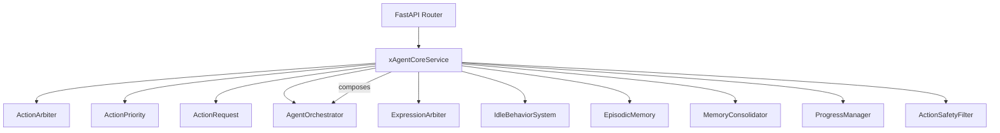
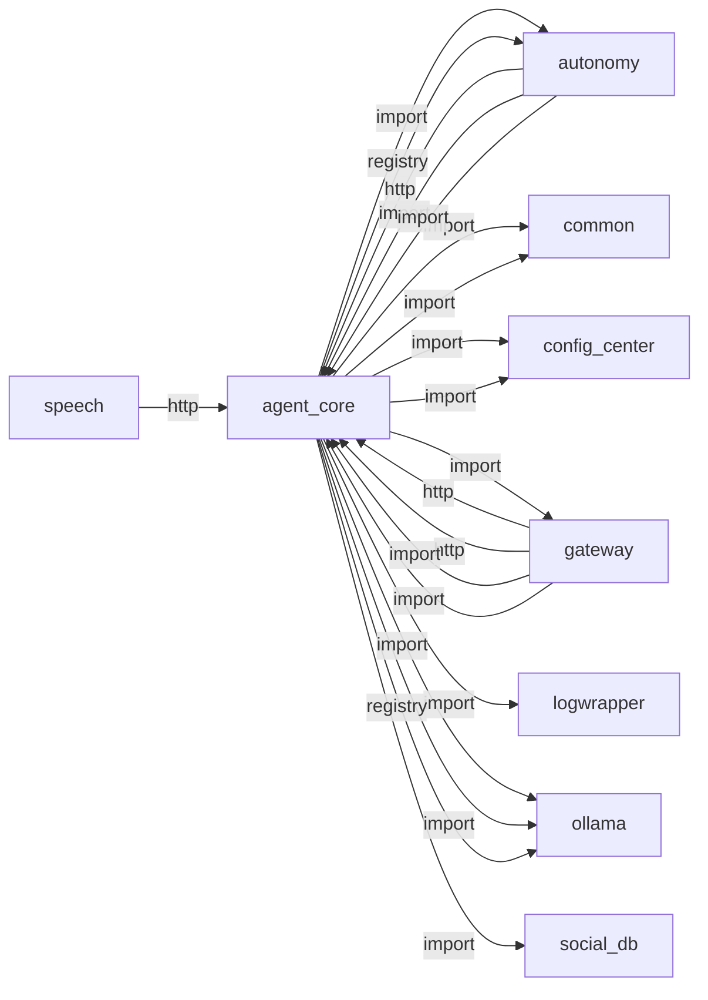
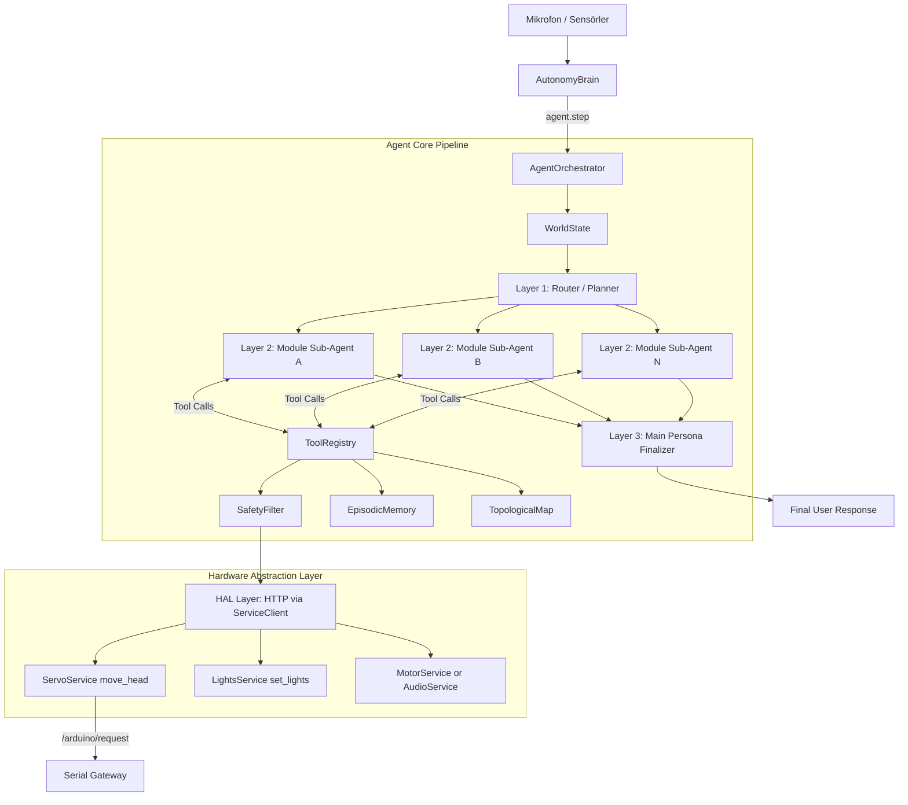

# agent_core

> **3-katmanlı ajan zekâ (Router→Sub-Agent→Persona), tool calling**

## Kimlik
| Alan | Değer |
| --- | --- |
| Ana sınıf | `xAgentCoreService` |
| Giriş noktası | `create_app()` |
| Orkestratör | `AgentOrchestrator` |
| Ana dosya | `modules/agent_core/xAgentCoreService.py` |
| Katman | Çekirdek |
| Port | — |
| Arduino | Hayır |
| Sınıf sayısı | 31 |
| Endpoint sayısı | 19 |

## İsimlendirilmiş Bileşenler (Sınıflar)

#### `ActionArbiter` — `modules/agent_core/services/action_arbiter.py`
- **Görev:** Thread-safe central arbiter for all robot actions.
- **Kalıtım:** —
- **Oluşturduğu bileşenler:** `Lock`
- **Metodlar:** `register_handler()`, `submit()`, `cancel()`, `cancel_by_source()`, `get_exclusive_status()`, `release_exclusive()`

#### `ActionPriority` — `modules/agent_core/services/action_arbiter.py`
- **Görev:** —
- **Kalıtım:** IntEnum
- **Oluşturduğu bileşenler:** —
- **Metodlar:** —

#### `ActionRequest` — `modules/agent_core/services/action_arbiter.py`
- **Görev:** A single action submitted to the arbiter.
- **Kalıtım:** —
- **Oluşturduğu bileşenler:** —
- **Metodlar:** `expired()`, `payload_hash()`

#### `AgentOrchestrator` — `modules/agent_core/services/agent.py`
- **Görev:** SentryBOT's Embodied AI - Native Tool Calling Edition.
- **Kalıtım:** —
- **Oluşturduğu bileşenler:** `WorldState`, `EpisodicMemory`, `TopologicalMap`, `ActionSafetyFilter`, `ToolExecutionArbiter`, `ActionArbiter`, `VisionArbiter`, `ExpressionArbiter`, `SpeechArbiter`, `ProgressManager`, `ToolRegistry`, `SensorFeedbackLoop`, `IdleBehaviorSystem`, `TriLayerRouter`, `Client`, `Client`
- **Metodlar:** `apply_realtime_profile()`, `start()`, `stop()`, `check_survival_drives()`, `route_preview()`, `step()`

#### `ExpressionArbiter` — `modules/agent_core/services/expression_arbiter.py`
- **Görev:** —
- **Kalıtım:** —
- **Oluşturduğu bileşenler:** `Lock`
- **Metodlar:** `claim_lights()`, `claim_oled()`, `release()`, `status()`

#### `IdleBehaviorSystem` — `modules/agent_core/services/idle_behavior.py`
- **Görev:** Lightweight background "life signs" that run without waking up the LLM
- **Kalıtım:** —
- **Oluşturduğu bileşenler:** —
- **Metodlar:** `start()`, `stop()`

#### `EpisodicMemory` — `modules/agent_core/services/memory.py`
- **Görev:** Long-term memory vector store / SQL DB for SentryBOT.
- **Kalıtım:** —
- **Oluşturduğu bileşenler:** —
- **Metodlar:** `remember()`, `search_memory()`

#### `MemoryConsolidator` — `modules/agent_core/services/memory_consolidator.py`
- **Görev:** —
- **Kalıtım:** —
- **Oluşturduğu bileşenler:** —
- **Metodlar:** `extract_facts()`, `consolidate()`

#### `ProgressManager` — `modules/agent_core/services/progress.py`
- **Görev:** Manages staged execution progress with TTS forwarding.
- **Kalıtım:** —
- **Oluşturduğu bileşenler:** —
- **Metodlar:** `attach_arbiters()`, `arbiter_snapshot()`, `set_speech_arbiter()`, `new_request()`, `is_active()`, `emit_ack()`, `emit_plan()`, `emit_tool_start()`, `emit_tool_done()`, `emit_tool_error()`, `emit_vlm_processing()`, `emit_vision_capture()`

#### `ActionSafetyFilter` — `modules/agent_core/services/safety_filter.py`
- **Görev:** Validates and clamps arguments for hardware tools to prevent damage.
- **Kalıtım:** —
- **Oluşturduğu bileşenler:** —
- **Metodlar:** `clamp_servo()`, `clamp_stepper()`, `clamp_laser_duration()`

#### `SemanticIndex` — `modules/agent_core/services/semantic_index.py`
- **Görev:** Reusable in-memory index over ``(id, text)`` documents.
- **Kalıtım:** —
- **Oluşturduğu bileşenler:** —
- **Metodlar:** `add()`, `search()`

#### `SensorFeedbackLoop` — `modules/agent_core/services/sensor_loop.py`
- **Görev:** Background thread that periodically reads real sensor data via ServiceClient
- **Kalıtım:** —
- **Oluşturduğu bileşenler:** —
- **Metodlar:** `start()`, `stop()`

#### `TopologicalMap` — `modules/agent_core/services/slam.py`
- **Görev:** A Graph-based spatial memory mapping rooms/locations as Nodes.
- **Kalıtım:** —
- **Oluşturduğu bileşenler:** —
- **Metodlar:** `save_map()`, `known_locations()`, `resolve_location()`, `add_node()`, `add_alias()`, `connect_nodes()`, `observe_transition()`, `get_location()`, `update_location()`, `pathfind()`

#### `SpeechArbiter` — `modules/agent_core/services/speech_arbiter.py`
- **Görev:** Thread-safe TTS arbitration layer.
- **Kalıtım:** —
- **Oluşturduğu bileşenler:** `Lock`, `Event`, `Event`, `Event`, `Event`
- **Metodlar:** `start()`, `stop()`, `set_speak_fn()`, `set_tts_state_callback()`, `set_stop_playback_fn()`, `interrupt_all()`, `enqueue()`, `enqueue_progress()`, `enqueue_final()`, `enqueue_safety()`, `cancel_by_token()`, `cancel_progress()`

#### `SpeechItem` — `modules/agent_core/services/speech_arbiter.py`
- **Görev:** A single TTS utterance submitted to the arbiter.
- **Kalıtım:** —
- **Oluşturduğu bileşenler:** —
- **Metodlar:** `expired()`

#### `SpeechPriority` — `modules/agent_core/services/speech_arbiter.py`
- **Görev:** —
- **Kalıtım:** —
- **Oluşturduğu bileşenler:** —
- **Metodlar:** —

#### `ToolExecutionArbiter` — `modules/agent_core/services/tool_execution_arbiter.py`
- **Görev:** Ensures non-conflicting tool execution.
- **Kalıtım:** —
- **Oluşturduğu bileşenler:** `Lock`
- **Metodlar:** `can_execute()`, `acquire()`, `release()`, `cancel()`, `is_group_busy()`, `get_status()`

#### `ToolRegistry` — `modules/agent_core/services/tools.py`
- **Görev:** Registers Python functions as native tools for the LLM.
- **Kalıtım:** —
- **Oluşturduğu bileşenler:** —
- **Metodlar:** `execute()`, `get_tool_schema()`, `get_tool_names()`, `move_head()`, `play_sound()`, `set_lights()`, `set_laser()`, `oled_face()`, `set_emotion()`, `interaction_event()`, `search_memory()`, `search_social_memory()`

#### `SubAgentProfile` — `modules/agent_core/services/tri_layer.py`
- **Görev:** —
- **Kalıtım:** —
- **Oluşturduğu bileşenler:** —
- **Metodlar:** —

#### `TriLayerRouter` — `modules/agent_core/services/tri_layer.py`
- **Görev:** Low-latency keyword router for module-level sub-agents.
- **Kalıtım:** —
- **Oluşturduğu bileşenler:** —
- **Metodlar:** `set_max()`, `route()`

#### `VisionArbiter` — `modules/agent_core/services/vision_arbiter.py`
- **Görev:** Allows at most one active VLM request at a time.
- **Kalıtım:** —
- **Oluşturduğu bileşenler:** `Lock`
- **Metodlar:** `acquire()`, `release()`, `status()`

#### `WorldState` — `modules/agent_core/services/world_state.py`
- **Görev:** Maintains the real-time context of the robot.
- **Kalıtım:** —
- **Oluşturduğu bileşenler:** —
- **Metodlar:** `update_state()`, `update_scene()`, `set_action_feedback()`, `get_state()`, `inject_world_state()`

#### `xAgentCoreService` — `modules/agent_core/xAgentCoreService.py`
- **Görev:** Servis başlatıcı — Agent Core modülünü hem kütüphane
- **Kalıtım:** —
- **Oluşturduğu bileşenler:** `AgentOrchestrator`
- **Metodlar:** `start()`, `stop()`


## API — Endpoint → Handler → Servis

| HTTP | Path | Handler | Çağırdığı servis | Açıklama |
| --- | --- | --- | --- | --- |
| GET | `/healthz` | `healthz()` | — | Stop queued/active TTS (wakeword barge-in). |
| POST | `/speech/interrupt` | `speech_interrupt()` | — | Stop queued/active TTS (wakeword barge-in). |
| POST | `/step` | `step()` | — | Tek bir agent adımı çalıştır (ReAct + Tool Calling + Safety). |
| POST | `/step_stream` | `step_stream()` | — | Stream agent progress as Server-Sent Events (SSE). |
| POST | `/route_preview` | `route_preview()` | — | Tri-layer router'in hangi sub-agentlari sececegini onizle. |
| GET | `/world_state` | `world_state()` | — | Anlık dünya durumunu döndür. |
| GET | `/memory/search` | `search_memory()` | — | Epizodik hafızada arama yap. |
| GET | `/slam/location` | `get_location()` | — | Robotun topolojik haritadaki konumunu döndür. |
| GET | `/slam/pathfind` | `pathfind()` | — | Hedef odaya yol bul (BFS). |
| GET | `/actions/status` | `actions_status()` | — | Get current action arbiter status and exclusive locks. |
| GET | `/arbiters/status` | `arbiters_status()` | — | Aggregate snapshot of every arbiter for admin/SSE consumers. |
| GET | `/arbiters/stream` | `arbiters_stream()` | — | Server-Sent Events feed with periodic arbiter snapshots. |
| POST | `/actions/queue` | `actions_queue()` | — | Submit an action to the action arbiter. |
| POST | `/actions/cancel` | `actions_cancel()` | — | Cancel a specific action by ID. |
| POST | `/progress` | `progress_push()` | — | Push external progress event into progress manager. |
| POST | `/events` | `events_push()` | — | Receive autonomy/vision events and queue prioritized actions. |
| GET | `/progress/latest` | `progress_latest()` | — | Get the latest progress event cache (if available). |
| GET | `/profile` | `get_profile()` | — | Return active realtime profile and available modes. |
| POST | `/profile/switch` | `switch_profile()` | — | Switch realtime profile atomically (e.g. 'fast', 'normal', 'rich'). |

## Config Bölümleri
- `server`
- `agent`
- `llm`
- `tri_layer`
- `safety`
- `sensor_loop`
- `action_arbiter`
- `speech_arbiter`
- `progress`
- `tool_execution`
- `idle`
- `memory`
- `slam`
- `realtime_profile`

## Dış İlişkiler (Bu modül → diğerleri)

| Hedef modül | Bağlantı tipi | Detay | Neden |
| --- | --- | --- | --- |
| [[autonomy]] | import | services | Alt sistem olarak otonomi beyin döngüsünü tetikler. |
| [[autonomy]] | registry | registry dependency: ollama, autonomy | Alt sistem olarak otonomi beyin döngüsünü tetikler. |
| [[common]] | import | vision_availability | `agent_core` içinde `vision_availability` import edilir; `common` modülünün yeteneğini kullanır (Kanonik duygu sözlüğü (eyes/LEDs/ears/tone tek taksonomi)). |
| [[common]] | import | emotion_vocab | `agent_core` → `common`: Kanonik duygu taksonomisi (tone/LED/yüz) için ortak sözlük. |
| [[config_center]] | import | agent_yaml_loader | `agent_core` → `config_center`: config/agent.yaml dosyasından ayar okur. |
| [[config_center]] | import | gemini_model | `agent_core` içinde `gemini_model` import edilir; `config_center` modülünün yeteneğini kullanır (Merkezi config okuma/yazma, hot-reload). |
| [[gateway]] | import | url | `agent_core` içinde `url` import edilir; `gateway` modülünün yeteneğini kullanır (FastAPI API bootstrapper, tüm modülleri mount eder). |
| [[logwrapper]] | import | init_logging | `agent_core` → `logwrapper`: Merkezi WebSocket log yayınına bağlanır. |
| [[ollama]] | import | services | Router ve Persona katmanı LLM çıkarımı için Ollama kullanır. |
| [[ollama]] | import | config_loader | Router ve Persona katmanı LLM çıkarımı için Ollama kullanır. |
| [[ollama]] | registry | registry dependency: ollama, autonomy | Router ve Persona katmanı LLM çıkarımı için Ollama kullanır. |
| [[social_db]] | import | get_default | Kullanıcı/tanıma verisi için sosyal hafızayı kullanır. |
| [[social_db]] | import | db | Kullanıcı/tanıma verisi için sosyal hafızayı kullanır. |
| [[speech]] | http | calls path `/speech/interrupt` | `agent_core` HTTP ile `speech` modülüne erişir: Ses tanıma (ASR) pipeline'ına istek gönderir. |
| [[vlm_bridge]] | http | calls path `/vlm/track` | Görsel araçlar ve vision context için VLM köprüsüne bağlanır. |
| [[vlm_bridge]] | http | calls path `/vlm/ask` | Görsel araçlar ve vision context için VLM köprüsüne bağlanır. |
| [[vlm_bridge]] | http | calls path `/vlm/follow/owner/start` | Görsel araçlar ve vision context için VLM köprüsüne bağlanır. |
| [[vlm_bridge]] | http | calls path `/vlm/follow/stop` | Görsel araçlar ve vision context için VLM köprüsüne bağlanır. |
| [[vlm_bridge]] | http | calls path `/vlm/focus/person` | Görsel araçlar ve vision context için VLM köprüsüne bağlanır. |
| [[vlm_bridge]] | http | calls path `/vlm/person/remember` | Görsel araçlar ve vision context için VLM köprüsüne bağlanır. |
| [[vlm_bridge]] | import | services | Görsel araçlar ve vision context için VLM köprüsüne bağlanır. |

## Gelen İlişkiler (Diğerleri → bu modül)

| Kaynak modül | Bağlantı tipi | Detay | Neden |
| --- | --- | --- | --- |
| [[autonomy]] | http | calls path `/agent` | Üst seviye ajan orkestrasyonu ve tool-calling entegrasyonu. |
| [[autonomy]] | import | services | Üst seviye ajan orkestrasyonu ve tool-calling entegrasyonu. |
| [[autonomy]] | import | config_loader | Üst seviye ajan orkestrasyonu ve tool-calling entegrasyonu. |
| [[gateway]] | http | calls path `/agent/speech/interrupt` | `gateway` → `agent_core`: Ses tanıma (ASR) pipeline'ına istek gönderir. |
| [[gateway]] | http | calls path `/agent` | `gateway` → `agent_core`: Ajan orkestrasyonu ve tool-calling çağrısı. |
| [[gateway]] | import | api | `gateway` kod içinde `agent_core` modülünü import eder (`api`) — 3-katmanlı ajan zekâ (Router→Sub-Agent→Persona), tool calling. |
| [[gateway]] | import | services | `gateway` kod içinde `agent_core` modülünü import eder (`services`) — 3-katmanlı ajan zekâ (Router→Sub-Agent→Persona), tool calling. |
| [[speech]] | http | calls path `/agent/speech/interrupt` | `speech` → `agent_core`: Ses tanıma (ASR) pipeline'ına istek gönderir. |

## İç Mimari (otomatik çıkarım)



## Modül Etkileşim Haritası



### Mimari diyagram 1


---

# Tam Kaynak Arşivi

### `modules/agent_core/MIGRATION_TRI_LAYER.md` (54 satır)

```markdown
# Agent Core Tri-Layer Migration Notes

This note explains how to migrate from the previous single-loop orchestration to the new tri-layer model.

## What Changed

1. Layer 1: Router/Planner selects module-level sub-agents.
2. Layer 2: Sub-agents execute focused reasoning with limited tool sets.
3. Layer 3: Main persona synthesizes the final user-facing response.

All three layers run on one Ollama model.

## New Config Keys

Use only `config/agent.yaml`.

```yaml
tri_layer:
  enabled: true
  router:
    max_subagents: 2
    default_modules: [autonomy, agent_core]
  subagent:
    max_steps: 2
  persona:
    num_predict: 220
```

## Environment Overrides

Strict mode keeps runtime behavior in YAML.

Only path override is supported:
- `AGENT_CFG=/absolute/path/to/agent.yaml`

## Remote Ollama Server (Single Model)

Set one model and one remote base URL:

- `agent.model: qwen3.5:9b`
- `agent.ollama_base_url: http://<remote-ollama-host>:11434`

The same model is used by router, sub-agents, and main persona.

Fallback policy (CLM): disabled in strict single-model mode.

## API Additions

- `POST /route_preview` returns selected sub-agents for a query.

## Backward Compatibility

- If no sub-agent is selected, orchestrator falls back to the native legacy tool loop.
- Existing `agent.step()` call sites continue to work without changes.
```

### `modules/agent_core/README.md` (122 satır)

```markdown
# Agent Core — Robotic AI Agent Module

**SentryBOT'un otonom ajan zekâ modülü.**

Sense -> Think -> Act dongusunu, tek Ollama modeli ile calisan **3 katmanli agent yapisiyla** yonetir:
1) Router/Planner
2) Modul bazli Sub-Agent'lar
3) Main Persona (son cevaplayici)

Her katman ayni modeli kullanir, ancak farkli sorumluluk ve prompt profiline sahiptir.

Varsayilan politika:
- Tek model: qwen3.5:9b
- Fallback kapali
- Provider yalnizca ollama

## Modül Yapısı

```
modules/agent_core/
├── xAgentCoreService.py      # Servis başlatıcı (FastAPI + class)
├── config_loader.py          # config/agent.yaml okuyucu
├── services/
│   ├── __init__.py           # Re-export proxy
│   ├── agent.py              # Ana orkestratör (Native ReAct Loop)
│   ├── safety_filter.py      # Donanım güvenlik sınırlayıcı (servolar vb.)
│   ├── memory.py             # SQLite epizodik bellek
│   ├── slam.py               # Topolojik harita + BFS yol bulma
│   ├── tools.py              # LLM araç tanımları (Ollama JSON Schema)
│   ├── world_state.py        # Sensör durumu
│   ├── sensor_loop.py        # Arka plan sensör okuyucu
│   ├── idle_behavior.py      # Boşta kalma efektleri
│   └── tri_layer.py          # Router + sub-agent profil tanimlari
├── architecture_agent_core.md# Mimari dokümantasyon
└── README.md                 # Bu dosya
```

## Özellikler

- **3-Layer Agent Pipeline:** Katman-1 istegi modul sub-agent'lara yonlendirir, Katman-2 uzman sub-agent'lar araci calistirir, Katman-3 main persona tek ve tutarli cevap uretir.
- **Tek Model Politikasi:** Router, sub-agent ve persona katmanlari ayni Ollama modeli uzerinden calisir.
- **Low-Latency Router:** Varsayilan keyword tabanli yonlendirme ek gecikme olmadan calisir.
- **Semantic Router:** Router artık token benzerliğini de hesaba katar; tam eşleşmeyen ama yakın isteklerde daha doğru modül seçimi sağlar.
- **Physical Safety First:** `ActionSafetyFilter` doğrudan donanım aletlerinin içine gömülüdür (Kafa çevirmeden önce direkt açı kontrolü yapılır).
- **Episodic Memory:** Robot konuştuğu her şeyi SQLite'a kaydeder ve `search_memory` tool'u ile geri çağırabilir.
- **Semantic Memory Ranking:** Arama sonuçları yalnızca eşleşme değil, alaka puanına göre sıralanır.
- **Runtime SLAM Learning:** Ajan yeni konum, bağlantı ve takma adları çalışma anında haritaya ekleyebilir.

## Bu Modül Ne Yapar?
- Gelen isteği planlar, uygun sub-agent'lara yönlendirir ve son cevabı üretir.
- Kısa süreli ve uzun süreli hafızayı yönetir.
- Topolojik harita üzerinden konum bulur ve yol planlar.
- Yeni araçları ve güvenlik sınırlarını LLM kullanımına sunar.

## Kullanım

### AutonomyBrain ile (Entegre mod — üretim)
```python
# brain.py içinde otomatik başlatılır:
self.agent = AgentOrchestrator(agent_cfg, autonomy_client=self.client)
self.agent.start()
```

### Kütüphane olarak (ReAct Loop)
```python
from modules.agent_core import AgentOrchestrator
agent = AgentOrchestrator(config, autonomy_client=client)

# Ajan tri-layer akista sub-agent'lari calistirir ve final personadan tek cevap dondurur.
result = agent.step("Ortamı tara ve bana kimlerin olduğunu söyle.")
print(result["text"])
```

## API Endpoint'leri

*(Executor ve router kaldırıldığı için API yapısı basitleştirildi)*

| Endpoint | Metod | Açıklama |
|---|---|---|
| `/healthz` | GET | Servis durumu (BUSY / IDLE) |
| `/step` | POST | Tek agent adımı (Native Tool Loop) |
| `/step_stream` | POST | SSE ile canlı durum + final cevap |
| `/route_preview` | POST | Tri-layer router secimini onizleme |
| `/world_state` | GET | Anlık dünya durumu (pil vb.) |
| `/memory/search` | GET | Epizodik hafıza arama |
| `/slam/location` | GET | Topolojik konum |
| `/slam/pathfind` | GET | BFS yol bulma |

`/memory/search` sonuçları artık önem puanına göre sıralanır. SLAM tarafı ise yeni düğüm, bağlantı ve alias öğrenmeyi destekler.

## Konfigürasyon (config/agent.yaml)

| Ayar | Açıklama |
|---|---|
| `agent.model` | Kullanılacak model (zorunlu: qwen3.5:9b) |
| `agent.request_timeout` | Ollama istemci timeout degeri (sn) |
| `agent.max_steps` | Legacy native loop maksimum adım sayısı |
| `tri_layer.enabled` | 3 katmanli mimari acik/kapali |
| `tri_layer.router.max_subagents` | Bir istek icin secilecek sub-agent sayisi |
| `tri_layer.subagent.max_steps` | Her sub-agent icin maksimum tool loop |
| `tri_layer.persona.num_predict` | Final persona katmaninda token hedefi |
| `llm.provider` | Zorunlu: ollama |
| `llm.single_model_mode` | Zorunlu: true |

### Konfigürasyon Yolu Override

- Varsayilan dosya: config/agent.yaml
- Ozel yol icin: AGENT_CFG ortam degiskeni

## Testler

```bash
# Proje ana dizininden:
$env:PYTHONPATH="."
pytest modules/agent_core/tests/ -v
```

## Migration

Tri-layer gecisi ve remote Ollama kurulumu icin:

- `modules/agent_core/MIGRATION_TRI_LAYER.md`
```

### `modules/agent_core/__init__.py` (26 satır)

```python
# SentryBOT Agent Core Module
# Hem kütüphane (import edilebilir) hem de servis (çalıştırılabilir).

from .services.agent import AgentOrchestrator
from .services.safety_filter import ActionSafetyFilter
from .services.memory import EpisodicMemory
from .services.slam import TopologicalMap
from .services.tools import ToolRegistry
from .services.world_state import WorldState
from .services.sensor_loop import SensorFeedbackLoop
from .services.idle_behavior import IdleBehaviorSystem
from .services.tri_layer import SubAgentProfile, TriLayerRouter, build_subagent_profiles

__all__ = [
    "AgentOrchestrator",
    "ActionSafetyFilter",
    "EpisodicMemory",
    "TopologicalMap",
    "ToolRegistry",
    "WorldState",
    "SensorFeedbackLoop",
    "IdleBehaviorSystem",
    "SubAgentProfile",
    "TriLayerRouter",
    "build_subagent_profiles",
]
```

### `modules/agent_core/api/__init__.py` (0 satır)

```python

```

### `modules/agent_core/api/router.py` (323 satır)

```python
from fastapi import APIRouter, Body, Query
from fastapi.responses import StreamingResponse
from typing import Dict, Any, Optional
import json
import queue
import threading
import time


def get_router(agent) -> APIRouter:
    router = APIRouter(prefix="/agent", tags=["Agent Core"])

    @router.get("/healthz")
    def healthz():
        state_str = "BUSY" if agent.is_busy else "IDLE"
        return {"ok": True, "state": state_str}

    @router.post("/speech/interrupt")
    def speech_interrupt():
        """Stop queued/active TTS (wakeword barge-in)."""
        cleared = agent.speech_arbiter.interrupt_all()
        return {"ok": True, "cleared": cleared}

    @router.post("/step")
    def step(query: str = Body(embed=True)):
        """Tek bir agent adımı çalıştır (ReAct + Tool Calling + Safety)."""
        result = agent.step(query)
        return result or {"text": "", "thoughts": "idle", "actions": []}

    @router.post("/step_stream")
    def step_stream(query: str = Body(embed=True)):
        """Stream agent progress as Server-Sent Events (SSE)."""
        event_q: queue.Queue[Dict[str, Any]] = queue.Queue()
        done = threading.Event()
        result_holder: Dict[str, Any] = {}

        def emit(event: Dict[str, Any]) -> None:
            event_q.put(event)

        def worker() -> None:
            try:
                res = agent.step(query, progress_cb=emit)
                result_holder["result"] = res or {"text": "", "thoughts": "idle", "actions": []}
            except Exception as exc:
                result_holder["error"] = str(exc)
            finally:
                done.set()
                event_q.put({"type": "_done"})

        thread = threading.Thread(target=worker, daemon=True)
        thread.start()

        waiting_messages = [
            "Beklemedeyim...",
            "Islem suruyor...",
            "Hala isliyorum...",
        ]
        cfg_agent = agent.config.get("agent", {}) if isinstance(getattr(agent, "config", {}), dict) else {}
        cfg_waiting = cfg_agent.get("waiting_messages")
        if isinstance(cfg_waiting, list) and cfg_waiting:
            waiting_messages = [str(m) for m in cfg_waiting if str(m).strip()]
        heartbeat_s = float(getattr(agent, "status_interval_s", 2.0))

        def _serialize(payload: Dict[str, Any]) -> str:
            return json.dumps(payload, ensure_ascii=True, default=str)

        def gen():
            last_beat = 0.0
            wait_idx = 0
            # send immediate ack
            yield f"data: {_serialize({'type': 'status', 'text': 'Istek alindi, islem basladi.'})}\n\n"
            while not done.is_set() or not event_q.empty():
                try:
                    event = event_q.get(timeout=0.2)
                    if event.get("type") == "_done":
                        break
                    yield f"data: {_serialize(event)}\n\n"
                except queue.Empty:
                    now = time.time()
                    if now - last_beat >= heartbeat_s:
                        last_beat = now
                        if waiting_messages:
                            msg = waiting_messages[wait_idx % len(waiting_messages)]
                            wait_idx += 1
                            yield f"data: {_serialize({'type': 'waiting', 'text': msg})}\n\n"

            if "error" in result_holder:
                yield f"data: {_serialize({'type': 'error', 'text': result_holder['error']})}\n\n"
            else:
                yield f"data: {_serialize({'type': 'final', 'result': result_holder.get('result')})}\n\n"

        return StreamingResponse(gen(), media_type="text/event-stream")

    @router.post("/route_preview")
    def route_preview(query: str = Body(embed=True)):
        """Tri-layer router'in hangi sub-agentlari sececegini onizle."""
        return agent.route_preview(query)

    @router.get("/world_state")
    def world_state():
        """Anlık dünya durumunu döndür."""
        return agent.world_state.get_state()

    @router.get("/memory/search")
    def search_memory(query: str, limit: int = 5):
        """Epizodik hafızada arama yap."""
        return {"results": agent.memory.search_memory(query, limit)}

    @router.get("/slam/location")
    def get_location():
        """Robotun topolojik haritadaki konumunu döndür."""
        return {"location": agent.slam.get_location()}

    @router.get("/slam/pathfind")
    def pathfind(destination: str):
        """Hedef odaya yol bul (BFS)."""
        path = agent.slam.pathfind(destination)
        return {"destination": destination, "path": path}

    # -----------------------------------------------------------------
    # Living Vision Agent: Action and Progress endpoints
    # -----------------------------------------------------------------

    @router.get("/actions/status")
    def actions_status():
        """Get current action arbiter status and exclusive locks."""
        if not hasattr(agent, 'action_arbiter') or agent.action_arbiter is None:
            return {"ok": False, "error": "action arbiter not available"}
        status = agent.action_arbiter.get_exclusive_status()
        return {
            "ok": True,
            "exclusive_locks": status,
            "vision_arbiter": agent.vision_arbiter.status() if hasattr(agent, "vision_arbiter") else {},
            "expression_arbiter": agent.expression_arbiter.status() if hasattr(agent, "expression_arbiter") else {},
            "speech": agent.speech_arbiter.get_status() if hasattr(agent, "speech_arbiter") else {},
        }

    @router.get("/arbiters/status")
    def arbiters_status():
        """Aggregate snapshot of every arbiter for admin/SSE consumers."""
        pm = getattr(agent, "progress_manager", None)
        if pm is None or not hasattr(pm, "arbiter_snapshot"):
            return {"ok": False, "error": "progress_manager unavailable"}
        snapshot = pm.arbiter_snapshot()
        return {"ok": True, **snapshot}

    @router.get("/arbiters/stream")
    def arbiters_stream(interval_s: float = Query(1.0, ge=0.2, le=10.0)):
        """Server-Sent Events feed with periodic arbiter snapshots."""
        pm = getattr(agent, "progress_manager", None)
        if pm is None or not hasattr(pm, "arbiter_snapshot"):
            return {"ok": False, "error": "progress_manager unavailable"}

        def gen():
            yield f"data: {json.dumps({'type': 'arbiter_status', 'snapshot': pm.arbiter_snapshot()}, default=str)}\n\n"
            while True:
                time.sleep(max(0.2, float(interval_s)))
                try:
                    payload = {"type": "arbiter_status", "snapshot": pm.arbiter_snapshot()}
                    yield f"data: {json.dumps(payload, default=str)}\n\n"
                except GeneratorExit:
                    break
                except Exception as exc:
                    yield f"data: {json.dumps({'type': 'error', 'error': str(exc)})}\n\n"
                    break

        return StreamingResponse(gen(), media_type="text/event-stream")

    @router.post("/actions/queue")
    def actions_queue(body: dict = Body(...)):
        """Submit an action to the action arbiter."""
        if not hasattr(agent, 'action_arbiter') or agent.action_arbiter is None:
            return {"ok": False, "error": "action arbiter not available"}
        
        from ..services.action_arbiter import ActionRequest
        
        action_type = str(body.get("type", "")).strip()
        priority = int(body.get("priority", 50))
        ttl_ms = int(body.get("ttl_ms", 5000))
        payload = body.get("payload", {})
        source = str(body.get("source", "agent_core")).strip()
        
        req = ActionRequest(
            type=action_type,
            source=source,
            priority=priority,
            ttl_ms=ttl_ms,
            payload=payload,
        )
        result = agent.action_arbiter.submit(req)
        return result

    @router.post("/actions/cancel")
    def actions_cancel(action_id: str = Body(embed=True)):
        """Cancel a specific action by ID."""
        if not hasattr(agent, 'action_arbiter') or agent.action_arbiter is None:
            return {"ok": False, "error": "action arbiter not available"}
        cancelled = agent.action_arbiter.cancel(action_id)
        return {"ok": cancelled, "action_id": action_id}

    @router.post("/progress")
    def progress_push(body: dict = Body(...)):
        """Push external progress event into progress manager."""
        if not hasattr(agent, 'progress_manager') or agent.progress_manager is None:
            return {"ok": False, "error": "progress manager not available"}
        try:
            agent.progress_manager.on_progress_event(dict(body))
            return {"ok": True}
        except Exception as exc:
            return {"ok": False, "error": str(exc)}

    @router.post("/events")
    def events_push(body: dict = Body(...)):
        """Receive autonomy/vision events and queue prioritized actions."""
        if not hasattr(agent, "action_arbiter") or agent.action_arbiter is None:
            return {"ok": False, "error": "action arbiter not available"}
        from ..services.action_arbiter import ActionRequest, ActionPriority
        event_type = str(body.get("type", "")).strip().lower()
        payload = body.get("payload", {}) if isinstance(body.get("payload", {}), dict) else {}
        pri_map = {
            "hazard_detected": int(ActionPriority.SAFETY),
            "owner_follow_intent": int(ActionPriority.OWNER_FOLLOW),
            "new_person_seen": int(ActionPriority.VLM_INTEREST),
            "idle_comment_request": int(ActionPriority.AUTONOMY_IDLE),
        }
        source_map = {
            "hazard_detected": "safety",
            "owner_follow_intent": "owner_follow",
            "new_person_seen": "vlm_bridge",
            "idle_comment_request": "autonomy",
        }
        req = ActionRequest(
            type="notification",
            source=source_map.get(event_type, "autonomy"),
            priority=pri_map.get(event_type, int(ActionPriority.AUTONOMY_IDLE)),
            ttl_ms=2000,
            cooldown_key=f"event:{event_type}",
            payload={"event_type": event_type, **payload},
        )
        result = agent.action_arbiter.submit(req)
        return {"ok": True, "result": result}

    @router.get("/progress/latest")
    def progress_latest():
        """Get the latest progress event cache (if available)."""
        if not hasattr(agent, 'progress_manager') or agent.progress_manager is None:
            return {"available": False, "progress": None}
        latest = agent.progress_manager.get_latest_event() if hasattr(agent.progress_manager, "get_latest_event") else {}
        if not latest:
            return {"available": False, "progress": None}
        return {
            "available": True,
            "progress": latest,
        }

    # -----------------------------------------------------------------
    # Realtime Performance Profile Switch
    # -----------------------------------------------------------------

    @router.get("/profile")
    def get_profile():
        """Return active realtime profile and available modes."""
        rt_cfg = agent.config.get("realtime_profile", {})
        active = str(rt_cfg.get("active", "fast"))
        known = [str(k) for k, v in rt_cfg.items() if isinstance(v, dict)]
        if not known:
            known = ["fast", "normal"]
        return {
            "ok": True,
            "active": active,
            "modes": known,
            "settings": rt_cfg.get(active, {}),
        }

    @router.post("/profile/switch")
    def switch_profile(
        mode: Optional[str] = Body(default=None, embed=True),
        mode_q: Optional[str] = Query(default=None, alias="mode"),
    ):
        """Switch realtime profile atomically (e.g. 'fast', 'normal', 'rich')."""
        mode_value = mode if mode is not None else mode_q
        mode = str(mode_value or "").strip().lower()
        rt_cfg_known = agent.config.get("realtime_profile", {}) if isinstance(getattr(agent, "config", {}), dict) else {}
        valid_modes = {str(k) for k, v in rt_cfg_known.items() if isinstance(v, dict)}
        if mode not in valid_modes:
            return {"ok": False, "error": f"Invalid mode '{mode}'. Allowed: {sorted(valid_modes)}"}

        rt_cfg = agent.config.get("realtime_profile", {})
        profile = rt_cfg.get(mode, {})
        if not profile:
            return {"ok": False, "error": f"Profile '{mode}' not configured."}

        rt_cfg["active"] = mode

        applied = {}
        if hasattr(agent, "apply_realtime_profile"):
            applied = agent.apply_realtime_profile(profile) or {}
        else:
            if hasattr(agent, "persona_num_predict"):
                agent.persona_num_predict = int(profile.get("num_predict_persona", agent.persona_num_predict))
            if hasattr(agent, "num_ctx"):
                agent.num_ctx = int(profile.get("num_ctx", agent.num_ctx))
            if hasattr(agent, "temperature"):
                agent.temperature = float(profile.get("temperature", agent.temperature))
            if hasattr(agent, "request_timeout"):
                agent.request_timeout = float(profile.get("request_timeout_s", agent.request_timeout))
            applied = {
                "num_predict_persona": getattr(agent, "persona_num_predict", None),
                "num_ctx": getattr(agent, "num_ctx", None),
                "temperature": getattr(agent, "temperature", None),
                "request_timeout_s": getattr(agent, "request_timeout", None),
            }

        return {
            "ok": True,
            "active": mode,
            "applied": applied,
        }

    # Removed legacy /executor/* endpoints since the queue is replaced by true Agentic loops

    return router
```

### `modules/agent_core/architecture_agent_core.md` (96 satır)

```markdown
# Agent Core — Mimari Dokümantasyon

## Genel Bakış

Agent Core, SentryBOT'un otonom karar verme, cevreyi algilama ve tool kullanma katmanidir.
Yeni surumde mimari **3 katmanli agent** modeline tasinmistir:

1. Router/Planner katmani
2. Modul bazli Sub-Agent katmani
3. Main Persona (final cevap) katmani

Bu uc katman da tek Ollama modeli uzerinden calisir, sadece sorumluluklari farklidir.

## Modül Yapısı

```
modules/agent_core/
├── xAgentCoreService.py      # Servis başlatıcı
├── config_loader.py          # config.yml okuyucu
├── config/
│   └── config.yml            # Modül ayarları
├── services/
│   ├── __init__.py           # Re-export proxy
│   ├── agent.py              # Ana orkestratör (Native ReAct Loop)
│   ├── safety_filter.py      # Donanım güvenlik sınırlayıcı (servolar vb.)
│   ├── memory.py             # SQLite epizodik bellek (Kalıcı bellek)
│   ├── slam.py               # Topolojik harita + BFS yol bulma
│   ├── tools.py              # LLM araç tanımları (10 adet Native Tool)
│   ├── world_state.py        # Sensör durumu (Pil, ultrasonik vb.)
│   ├── sensor_loop.py        # Arka plan sensör okuyucu (Thread)
│   ├── idle_behavior.py      # Boşta kalma nefes efekti
│   └── tri_layer.py          # Router + sub-agent profil tanimlari
├── architecture_agent_core.md# Mimari dokümantasyon
└── README.md                 # Genel bilgi
```

## Veri Akisi (Tri-Layer Agent Flow)


## Modüller Arası Etkileşim

| Modül | Agent Core ile İlişki |
|---|---|
| `autonomy` | Agent Core'u baslatir ve `agent.step()` cagrilarini yonetir. |
| `ollama` | Uc katmanin da ortak LLM backend'idir (tek model stratejisi). |
| `hardware` | Tool cagrilari SafetyFilter sonrasinda ServiceClient uzerinden gider. |
| `camera` / `vlm_bridge` | Gorsel baglami sub-agent katmanina saglar. |
| `speech` / `speak` / `wakeword` | Ses giris-cikis ve uyandirici akislarina domain uzmanligi verir. |
| `gateway` | Agent Core API endpoint'lerini dis sisteme acar. |

## Tasarım Kararları

### Neden Tri-Layer + Native Tool Calling?
Eski tek-katmanli tool loop, farkli domain sorumluluklarini ayni promptta biriktiriyordu.
Yeni yapida router istegi domain sub-agent'lara boler, final persona katmani ise tek bir tutarli cevap uretir.
Bu sayede:
- Modul bazli uzmanlasma artar.
- Prompt karmaşasi azalir.
- Tek model kullanildigi icin operasyonel maliyet ve deployment sadeligi korunur.
```

### `modules/agent_core/config/config.yml` (137 satır)

```yaml
# Agent Core Konfigurasyon Dosyası
# Bu dosya sadece Agent Core modülünün ayarlarını içerir.
# Diğer modüller kendi config.yml dosyalarını kullanır.

server:
  host: "0.0.0.0"
  port: 8120

agent:
  model: "qwen3.5:9b"
  temperature: 0.15
  num_ctx: 4096
  num_predict: 100      # sub-agent / tool-loop response budget
  cooldown_s: 0.2       # LLM çağrıları arasındaki minimum süre (saniye)
  request_timeout: 20   # Ollama HTTP timeout (s)
  status_interval_s: 1.0
  waiting_messages:
    - "Beklemedeyim..."
    - "Islem suruyor..."
    - "Hala isliyorum..."
  ollama_base_url: "http://127.0.0.1:11434"
  max_steps: 6          # Legacy native tool loop maksimum adımı
  max_tool_loops: 3     # Geriye uyumluluk için tutulur

llm:
  provider: "ollama"   # ollama | google_ai_studio
  clm_fallback_enabled: false
  clm_fallback_model: ""
  fallback_on_missing_model: false
  fallback_on_error: false

tri_layer:
  enabled: true
  router:
    max_subagents: 2
    default_modules:
      - autonomy
      - agent_core
  subagent:
    max_steps: 2
  persona:
    num_predict: 180
    system_prompt: |
      Sen SentryBOT companion robotusun. Kullanıcı duygu veya yüz/ışık ifadesi istediğinde
      (ör. sinirlen, mutlu ol, kızgın konuş, yüzünü değiştir, kırmızı yan) uygun aracı kullan:
      set_emotion (tam duygu), oled_face (yüz), set_lights (LED efekt+renk).
      Duygusal cevap verirken tonunu duyguya uydur.

safety:
  max_servo_angle: 180
  min_servo_angle: 0
  max_stepper_speed: 100
  laser_max_duration_s: 2.0

sensor_loop:
  poll_hz: 5.0           # Sensör okuma hızı (Hz)
  enabled: true

# Living Vision Agent configuration
action_arbiter:
  default_cooldown_s: 0.5
  dedup_window_s: 2.0

speech_arbiter:
  max_queue_size: 10
  dedup_window_s: 5.0

progress:
  enabled: true
  # Templates defined in progress.py

tool_execution:
  timeout_s: 22.0        # VLM calls: keep responsive with fallback
  retry_on_timeout: true
  max_retries: 1

idle:
  enabled: true
  breathe_interval_s: 15.0     # "Yaşam belirtisi" ışık aralığı

memory:
  db_name: "memory.db"         # data/ klasörü altında oluşturulur
  consolidation:
    enabled: true              # mine durable facts from dialogue after each turn
    fact_importance: 8         # episodic importance for consolidated facts

slam:
  map_file: "map.json"         # data/ klasörü altında oluşturulur

# ─── Realtime Performance Profile ───────────────────────────────────────────
# Remote GPU: 24GB VRAM, models are Q4 quantized.
# Switch between "fast" (low-latency, short output) and "normal" (balanced).
# Toggle via POST /agent/profile/switch (body: {"mode":"fast"}) or ?mode=fast
realtime_profile:
  active: "fast"               # fast | normal | rich

  fast:
    num_predict_chat: 100      # Ollama sohbet max token (kısa cevap)
    num_predict_persona: 120   # Agent persona sentezi max token
    num_predict_vlm: 256       # VLM scene analysis max token (JSON)
    num_predict_vlm_bridge: 100  # vlm_bridge llm_client kısa yorum
    num_ctx: 3072              # Daha küçük context = daha hızlı prefill
    temperature: 0.1
    request_timeout_s: 15
    ollama_chat_timeout_s: 12
    vlm_ask_timeout_s: 14
    max_subagents: 1
    subagent_workers: 1
    subagent_max_steps: 2

  normal:
    num_predict_chat: 180
    num_predict_persona: 180
    num_predict_vlm: 384
    num_predict_vlm_bridge: 160
    num_ctx: 4096
    temperature: 0.15
    request_timeout_s: 25
    ollama_chat_timeout_s: 20
    vlm_ask_timeout_s: 20
    max_subagents: 2
    subagent_workers: 2
    subagent_max_steps: 3

  rich:
    num_predict_chat: 240
    num_predict_persona: 260
    num_predict_vlm: 512
    num_predict_vlm_bridge: 220
    num_ctx: 6144
    temperature: 0.2
    request_timeout_s: 35
    ollama_chat_timeout_s: 28
    vlm_ask_timeout_s: 24
    max_subagents: 4
    subagent_workers: 3
    subagent_max_steps: 4
```

### `modules/agent_core/config_loader.py` (142 satır)

```python
from __future__ import annotations

import os
from typing import Any, Dict

from modules.config_center.agent_yaml_loader import load_agent_config, require_dict_section
from modules.config_center.gemini_model import DEFAULT_GEMINI_MODEL

_REQUIRED_OLLAMA_MODEL = "qwen3.5:9b"
_GOOGLE_PROVIDERS = frozenset({"google", "google_ai_studio", "gemini"})


def _to_float(raw: Any, fallback: float) -> float:
    try:
        return float(raw)
    except (TypeError, ValueError):
        return fallback


def _pick_model(agent_cfg: Dict[str, Any], llm_cfg: Dict[str, Any], ollama_cfg: Dict[str, Any]) -> str:
    candidates = (
        agent_cfg.get("model"),
        llm_cfg.get("model"),
        llm_cfg.get("primary_model"),
        ollama_cfg.get("model"),
    )
    for candidate in candidates:
        text = str(candidate or "").strip()
        if text:
            return text
    return ""


def _normalize_base_url(raw: Any) -> str:
    return str(raw or "").strip().rstrip("/")


def _enforce_google_policy(cfg: Dict[str, Any]) -> Dict[str, Any]:
    agent_cfg = require_dict_section(cfg, "agent")
    llm_cfg = require_dict_section(cfg, "llm")
    google_cfg = cfg.get("google_ai_studio", {}) if isinstance(cfg.get("google_ai_studio", {}), dict) else {}

    model = (
        str(google_cfg.get("model", "")).strip()
        or _pick_model(agent_cfg, llm_cfg, {})
        or DEFAULT_GEMINI_MODEL
    )
    request_timeout = _to_float(
        google_cfg.get("request_timeout", agent_cfg.get("request_timeout", 45.0)),
        45.0,
    )

    agent_cfg["model"] = model
    agent_cfg["request_timeout"] = request_timeout

    llm_cfg["provider"] = "google_ai_studio"
    llm_cfg["model"] = model
    llm_cfg["primary_model"] = model
    llm_cfg["single_model_mode"] = True
    llm_cfg["clm_fallback_enabled"] = False
    llm_cfg["clm_fallback_model"] = ""
    llm_cfg["fallback_on_missing_model"] = False
    llm_cfg["fallback_on_error"] = False

    cfg["google_ai_studio"] = {
        **google_cfg,
        "model": model,
        "request_timeout": request_timeout,
    }
    cfg["agent"] = agent_cfg
    cfg["llm"] = llm_cfg
    return cfg


def _enforce_ollama_policy(cfg: Dict[str, Any]) -> Dict[str, Any]:
    agent_cfg = require_dict_section(cfg, "agent")
    llm_cfg = require_dict_section(cfg, "llm")
    ollama_cfg = cfg.get("ollama", {}) if isinstance(cfg.get("ollama", {}), dict) else {}

    model = _pick_model(agent_cfg, llm_cfg, ollama_cfg) or _REQUIRED_OLLAMA_MODEL
    if model != _REQUIRED_OLLAMA_MODEL:
        raise ValueError(
            f"Ollama profile requires model '{_REQUIRED_OLLAMA_MODEL}', got '{model}'"
        )

    base_url = _normalize_base_url(
        agent_cfg.get("ollama_base_url")
        or llm_cfg.get("base_url")
        or ollama_cfg.get("base_url")
        or os.getenv("AGENT_OLLAMA_BASE_URL")
        or "http://127.0.0.1:11434"
    )
    if not base_url:
        raise ValueError("agent.ollama_base_url is required for ollama profile")

    request_timeout = _to_float(
        agent_cfg.get("request_timeout", ollama_cfg.get("request_timeout", 60.0)),
        60.0,
    )

    agent_cfg["model"] = model
    agent_cfg["ollama_base_url"] = base_url
    agent_cfg["request_timeout"] = request_timeout

    llm_cfg["provider"] = "ollama"
    llm_cfg["single_model_mode"] = True
    llm_cfg["model"] = model
    llm_cfg["primary_model"] = model
    llm_cfg["base_url"] = base_url
    llm_cfg["clm_fallback_enabled"] = False
    llm_cfg["clm_fallback_model"] = ""
    llm_cfg["fallback_on_missing_model"] = False
    llm_cfg["fallback_on_error"] = False

    cfg["ollama"] = {
        **ollama_cfg,
        "base_url": base_url,
        "model": model,
        "request_timeout": request_timeout,
    }
    cfg["agent"] = agent_cfg
    cfg["llm"] = llm_cfg
    return cfg


def _enforce_policy(cfg: Dict[str, Any]) -> Dict[str, Any]:
    llm_cfg = require_dict_section(cfg, "llm")
    provider = str(llm_cfg.get("provider", "ollama")).strip().lower() or "ollama"
    if provider in _GOOGLE_PROVIDERS:
        return _enforce_google_policy(cfg)
    return _enforce_ollama_policy(cfg)


def load_config(path: str | os.PathLike | None = None) -> Dict[str, Any]:
    cfg = load_agent_config(path)

    if not isinstance(cfg.get("tri_layer", {}), dict):
        cfg["tri_layer"] = {}
    if not isinstance(cfg.get("safety", {}), dict):
        cfg["safety"] = {}

    return _enforce_policy(cfg)
```

### `modules/agent_core/services/__init__.py` (27 satır)

```python
# Services namespace — re-exports core components for xAgentCoreService.
# Agent Core files live at module root (agent.py, memory.py, etc.)
# This proxy keeps the xService pattern consistent with other modules.

from .agent import AgentOrchestrator
from .memory import EpisodicMemory
from .slam import TopologicalMap
from .tools import ToolRegistry
from .world_state import WorldState
from .safety_filter import ActionSafetyFilter
from .sensor_loop import SensorFeedbackLoop
from .idle_behavior import IdleBehaviorSystem
from .tri_layer import SubAgentProfile, TriLayerRouter, build_subagent_profiles

__all__ = [
    "AgentOrchestrator",
    "EpisodicMemory",
    "TopologicalMap",
    "ToolRegistry",
    "WorldState",
    "ActionSafetyFilter",
    "SensorFeedbackLoop",
    "IdleBehaviorSystem",
    "SubAgentProfile",
    "TriLayerRouter",
    "build_subagent_profiles",
]
```

### `modules/agent_core/services/action_arbiter.py` (272 satır)

```python
"""Central action arbitration for SentryBOT.

Every physical or behavioural action (head move, speak, lights, VLM call, …)
is submitted here as an ``ActionRequest``.  The arbiter enforces:

* strict priority ordering
* TTL expiry (stale requests are dropped)
* cooldown per ``cooldown_key`` (prevents spam)
* payload dedup (identical payloads within a window are suppressed)
* single-writer guarantees for exclusive resources (e.g. TTS, VLM)
"""

from __future__ import annotations

import hashlib
import json
import logging
import threading
import time
import uuid
from dataclasses import dataclass, field
from enum import IntEnum
from typing import Any, Callable, Dict, List, Optional

logger = logging.getLogger("agent.action_arbiter")


# ── Priority constants ────────────────────────────────────────────────
class ActionPriority(IntEnum):
    IDLE = 20
    AUTONOMY_IDLE = 30
    GENERAL_SCENE = 35
    VLM_INTEREST = 50
    FRIEND = 60
    AGENT_TOOL = 65
    FAMILY = 70
    ACTIVE_SPEAKER = 75
    OWNER_FOLLOW = 85
    SAFETY = 95
    MANUAL = 100


# ── Source labels ─────────────────────────────────────────────────────
VALID_SOURCES = frozenset({
    "manual", "safety", "agent_core", "vlm_bridge",
    "autonomy", "speech", "wakeword", "scheduler",
    "owner_follow", "active_speaker",
})

# ── Action types ──────────────────────────────────────────────────────
VALID_ACTION_TYPES = frozenset({
    "head_move", "speak", "listen", "vision_capture",
    "vision_vlm_call", "vision_query", "lights", "oled_face", "animation",
    "sound", "follow", "follow_owner", "stop_follow", "look_around",
    "face_register", "face_focus", "idle_behavior", "tool_call", "notification",
})

# Exclusive resource groups – at most one active action per group.
_EXCLUSIVE_GROUPS: Dict[str, str] = {
    "speak": "tts",
    "vision_vlm_call": "vlm",
    "vision_query": "vlm",
    "head_move": "head",
    "look_around": "head",
    "face_focus": "head",
    "follow_owner": "head",
    "stop_follow": "head",
}


@dataclass
class ActionRequest:
    """A single action submitted to the arbiter."""

    action_id: str = field(default_factory=lambda: uuid.uuid4().hex[:12])
    type: str = "unknown"
    source: str = "autonomy"
    priority: int = 30
    ttl_ms: int = 5000
    cooldown_key: str = ""
    payload: Dict[str, Any] = field(default_factory=dict)
    created_at: float = field(default_factory=time.time)
    expires_at: float = 0.0

    def __post_init__(self) -> None:
        if self.expires_at <= 0.0:
            self.expires_at = self.created_at + (self.ttl_ms / 1000.0)

    @property
    def expired(self) -> bool:
        return time.time() > self.expires_at

    def payload_hash(self) -> str:
        raw = json.dumps(self.payload, sort_keys=True, default=str)
        return hashlib.md5(raw.encode()).hexdigest()[:10]


class ActionArbiter:
    """Thread-safe central arbiter for all robot actions."""

    def __init__(
        self,
        default_cooldown_s: float = 0.5,
        dedup_window_s: float = 2.0,
    ) -> None:
        self._lock = threading.Lock()
        self._default_cooldown_s = max(0.1, float(default_cooldown_s))
        self._dedup_window_s = max(0.2, float(dedup_window_s))

        # cooldown_key -> expiry timestamp
        self._cooldowns: Dict[str, float] = {}
        # (type, payload_hash) -> timestamp of last dispatch
        self._recent_dispatches: Dict[str, float] = {}
        # resource_group -> (source, expiry)
        self._exclusive_locks: Dict[str, tuple] = {}
        # registered dispatch callbacks: type -> callable
        self._dispatch_handlers: Dict[str, Callable[[ActionRequest], Any]] = {}
        # cancelled action IDs
        self._cancelled: set = set()

    # ── Registration ──────────────────────────────────────────────────
    def register_handler(
        self, action_type: str, handler: Callable[[ActionRequest], Any]
    ) -> None:
        self._dispatch_handlers[action_type] = handler

    # ── Submit ────────────────────────────────────────────────────────
    def submit(self, request: ActionRequest) -> Dict[str, Any]:
        """Submit an action request.  Returns status dict."""
        with self._lock:
            return self._evaluate(request)

    def cancel(self, action_id: str) -> bool:
        with self._lock:
            self._cancelled.add(action_id)
            return True

    def cancel_by_source(self, source: str) -> int:
        """Cancel all pending actions from a source (best effort)."""
        # Since we dispatch immediately, this mainly clears exclusive locks.
        count = 0
        with self._lock:
            for group, (locked_source, _exp) in list(self._exclusive_locks.items()):
                if locked_source == source:
                    del self._exclusive_locks[group]
                    count += 1
        return count

    # ── Query ─────────────────────────────────────────────────────────
    def get_exclusive_status(self) -> Dict[str, Any]:
        with self._lock:
            now = time.time()
            result = {}
            for group, (src, exp) in self._exclusive_locks.items():
                result[group] = {
                    "source": src,
                    "expires_in_s": round(max(0, exp - now), 2),
                    "active": exp > now,
                }
            return result

    # ── Internal ──────────────────────────────────────────────────────
    def _evaluate(self, req: ActionRequest) -> Dict[str, Any]:
        now = time.time()

        # 1. Check cancellation
        if req.action_id in self._cancelled:
            self._cancelled.discard(req.action_id)
            return {"ok": False, "reason": "cancelled"}

        # 2. TTL check
        if req.expired:
            return {"ok": False, "reason": "expired"}

        # 3. Cooldown check
        if req.cooldown_key:
            until = self._cooldowns.get(req.cooldown_key, 0.0)
            if now < until:
                return {"ok": False, "reason": "cooldown", "retry_after_s": round(until - now, 2)}

        # 4. Payload dedup
        dedup_key = f"{req.type}:{req.payload_hash()}"
        last = self._recent_dispatches.get(dedup_key, 0.0)
        if now - last < self._dedup_window_s:
            return {"ok": False, "reason": "duplicate"}

        # 5. Exclusive resource check
        group = _EXCLUSIVE_GROUPS.get(req.type)
        if group:
            locked = self._exclusive_locks.get(group)
            if locked:
                locked_source, locked_exp = locked
                if locked_exp > now:
                    # Compare priority – higher wins
                    locked_priority = self._source_base_priority(locked_source)
                    if req.priority < locked_priority:
                        return {
                            "ok": False,
                            "reason": "resource_locked",
                            "group": group,
                            "locked_by": locked_source,
                        }
                    # Higher priority request overrides
                    logger.info(
                        "Action %s overrides %s lock on '%s' (pri %d > %d)",
                        req.action_id, locked_source, group,
                        req.priority, locked_priority,
                    )
            # Acquire lock
            self._exclusive_locks[group] = (req.source, req.expires_at)

        # 6. Dispatch
        self._recent_dispatches[dedup_key] = now
        if req.cooldown_key:
            self._cooldowns[req.cooldown_key] = now + self._default_cooldown_s

        # Garbage-collect old entries periodically
        if len(self._recent_dispatches) > 200:
            self._gc(now)

        handler = self._dispatch_handlers.get(req.type)
        dispatch_result = None
        if handler:
            try:
                dispatch_result = handler(req)
            except Exception as exc:
                logger.warning("Action handler for '%s' failed: %s", req.type, exc)
                return {"ok": False, "reason": "handler_error", "error": str(exc)}

        logger.debug(
            "Action dispatched: type=%s source=%s pri=%d id=%s",
            req.type, req.source, req.priority, req.action_id,
        )
        return {"ok": True, "action_id": req.action_id, "result": dispatch_result}

    def release_exclusive(self, group: str) -> None:
        """Manually release an exclusive resource lock."""
        with self._lock:
            self._exclusive_locks.pop(group, None)

    @staticmethod
    def _source_base_priority(source: str) -> int:
        _MAP = {
            "manual": ActionPriority.MANUAL,
            "safety": ActionPriority.SAFETY,
            "owner_follow": ActionPriority.OWNER_FOLLOW,
            "active_speaker": ActionPriority.ACTIVE_SPEAKER,
            "agent_core": ActionPriority.AGENT_TOOL,
            "vlm_bridge": ActionPriority.VLM_INTEREST,
            "autonomy": ActionPriority.AUTONOMY_IDLE,
            "scheduler": ActionPriority.AUTONOMY_IDLE,
            "speech": ActionPriority.ACTIVE_SPEAKER,
            "wakeword": ActionPriority.ACTIVE_SPEAKER,
        }
        return _MAP.get(source, ActionPriority.IDLE)

    def _gc(self, now: float) -> None:
        cutoff = now - self._dedup_window_s * 3
        self._recent_dispatches = {
            k: v for k, v in self._recent_dispatches.items() if v > cutoff
        }
        self._cooldowns = {k: v for k, v in self._cooldowns.items() if v > now}
        expired_groups = [
            g for g, (_, exp) in self._exclusive_locks.items() if exp <= now
        ]
        for g in expired_groups:
            del self._exclusive_locks[g]
        if len(self._cancelled) > 100:
            self._cancelled.clear()


__all__ = ["ActionArbiter", "ActionRequest", "ActionPriority"]
```

### `modules/agent_core/services/agent.py` (1246 satır)

```python
import logging
import os
import time
import json
import concurrent.futures
from typing import Any, Dict, List, Optional, Tuple, Callable

from .world_state import WorldState
from .memory import EpisodicMemory
from .slam import TopologicalMap
from .tools import ToolRegistry
from .safety_filter import ActionSafetyFilter
from .sensor_loop import SensorFeedbackLoop
from .idle_behavior import IdleBehaviorSystem
from .tri_layer import SubAgentProfile, TriLayerRouter, build_subagent_profiles
from .progress import ProgressManager
from .speech_arbiter import SpeechArbiter
from .action_arbiter import ActionArbiter
from .tool_execution_arbiter import ToolExecutionArbiter
from .vision_arbiter import VisionArbiter
from .expression_arbiter import ExpressionArbiter

logger = logging.getLogger("agent.orchestrator")

# If ollama library is available.
try:
    import ollama
except ImportError:
    ollama = None

try:
    from modules.ollama.services.clients import create_llm_client  # type: ignore
    from modules.ollama.config_loader import load_config as load_ollama_runtime_config  # type: ignore
except Exception:
    create_llm_client = None  # type: ignore
    load_ollama_runtime_config = None  # type: ignore


class AgentOrchestrator:
    """
    SentryBOT's Embodied AI - Native Tool Calling Edition.
    Runs an autonomous loop up to MAX_STEPS allowing unrestricted
    tool use (e.g. database search -> look around -> move head) in one reasoning pass.
    """

    def __init__(self, config: dict, autonomy_client=None):
        """
        Args:
            config: The agent.yaml config dict.
            autonomy_client: ServiceClient used to trigger real hardware.
        """
        self.config = config
        self.autonomy_client = autonomy_client

        actions_cfg = config.get("actions", {}) if isinstance(config.get("actions", {}), dict) else {}
        try:
            from modules.gateway.url import resolve_config_url, resolve_gateway_base_url

            default_gw = resolve_gateway_base_url(self.config)
            raw_gw = str(actions_cfg.get("gateway_base_url", default_gw)).strip()
            self._gateway_base_url = resolve_config_url(raw_gw, default_gw).rstrip("/")
        except Exception:
            self._gateway_base_url = str(
                actions_cfg.get("gateway_base_url", "http://127.0.0.1:8080")
            ).rstrip("/")
        self._action_http_timeout_s = float(actions_cfg.get("http_timeout_s", 2.5))

        # LLM settings
        agent_cfg = config.get("agent", {})
        self.model = agent_cfg.get("model", "llama3.2:3b-q4_K_M")
        self.temperature = agent_cfg.get("temperature", 0.15)
        self.num_ctx = agent_cfg.get("num_ctx", 4096)
        self.cooldown = agent_cfg.get("cooldown_s", 1.0)
        llm_cfg = config.get("llm", {}) if isinstance(config.get("llm", {}), dict) else {}
        self.llm_provider = str(llm_cfg.get("provider", "ollama")).strip().lower() or "ollama"
        self.clm_fallback_enabled = bool(llm_cfg.get("clm_fallback_enabled", True))
        self.clm_fallback_model = str(
            llm_cfg.get("clm_fallback_model", agent_cfg.get("clm_fallback_model", ""))
        ).strip()
        self.fallback_on_missing_model = bool(llm_cfg.get("fallback_on_missing_model", True))
        self.fallback_on_error = bool(llm_cfg.get("fallback_on_error", True))
        self.request_timeout = self._safe_float(
            agent_cfg.get("request_timeout", agent_cfg.get("ollama_request_timeout", 60.0)),
            fallback=60.0,
            minimum=1.0,
        )
        self.status_interval_s = self._safe_float(
            agent_cfg.get("status_interval_s", 2.0),
            fallback=2.0,
            minimum=0.2,
        )
        self.max_steps = self._safe_int(
            agent_cfg.get("max_steps", agent_cfg.get("max_tool_loops", 10)),
            fallback=10,
            minimum=1,
        )
        self.ollama_base_url = self._resolve_ollama_base_url(agent_cfg)

        if self.llm_provider != "ollama":
            logger.info(
                "Agent Core running in provider mode: %s (limited tool-calling adaptation enabled)",
                self.llm_provider,
            )

        self.ollama_client = None
        self.provider_client = None
        self.provider_name = self.llm_provider
        self._cached_model_names: List[str] = []
        self._cached_model_names_ts = 0.0

        if ollama:
            try:
                self.ollama_client = ollama.Client(host=self.ollama_base_url, timeout=self.request_timeout)
            except Exception as exc:
                logger.warning("Ollama client init failed for host %s: %s", self.ollama_base_url, exc)
                try:
                    self.ollama_client = ollama.Client(host=self.ollama_base_url)
                except Exception:
                    self.ollama_client = None

        if self.llm_provider != "ollama" and create_llm_client:
            try:
                self.provider_client, self.provider_name = create_llm_client(self.config)
                logger.info(
                    "LLM provider client ready: %s (model=%s)",
                    self.provider_name,
                    getattr(self.provider_client, "model", ""),
                )
            except Exception as exc:
                logger.error(
                    "Provider client init failed for %s: %s",
                    self.llm_provider,
                    exc,
                )

        # Subsystems
        self.world_state = WorldState()
        self.memory = EpisodicMemory()
        self.memory_consolidator = self._build_memory_consolidator()
        self.slam = TopologicalMap()
        self.safety_filter = ActionSafetyFilter(config)
        self.tool_execution_arbiter = ToolExecutionArbiter()
        # ── Living Vision Agent: Arbiter & Progress subsystems ──
        # Instantiated before ToolRegistry so vlm tools can lock the vision arbiter.
        self.action_arbiter = ActionArbiter()
        self.vision_arbiter = VisionArbiter()
        self.expression_arbiter = ExpressionArbiter()
        self.speech_arbiter = SpeechArbiter()
        self.progress_manager = ProgressManager(speech_arbiter=self.speech_arbiter)
        self.progress_manager.attach_arbiters(
            action_arbiter=self.action_arbiter,
            vision_arbiter=self.vision_arbiter,
            expression_arbiter=self.expression_arbiter,
            tool_execution_arbiter=self.tool_execution_arbiter,
        )

        self.tool_registry = ToolRegistry(
            client=self.autonomy_client,
            memory=self.memory,
            slam=self.slam,
            world_state=self.world_state,
            safety_filter=self.safety_filter,
            tool_execution_arbiter=self.tool_execution_arbiter,
            vision_arbiter=self.vision_arbiter,
            vlm_ask_timeout_s=float((config.get("tool_execution", {}) or {}).get("timeout_s", 22.0)),
            gateway_base_url=self._gateway_base_url,
        )

        # Background threads
        self.sensor_loop = SensorFeedbackLoop(self.world_state, client=autonomy_client)
        self.idle_system = IdleBehaviorSystem(self, client=autonomy_client)
        if self.autonomy_client and hasattr(self.autonomy_client, "set_stt_suppressed"):
            self.speech_arbiter.set_tts_state_callback(
                lambda active: self.autonomy_client.set_stt_suppressed(bool(active))
            )
        if self.autonomy_client and hasattr(self.autonomy_client, "stop_speaking"):
            self.speech_arbiter.set_stop_playback_fn(self.autonomy_client.stop_speaking)
        self._register_action_handlers()

        self.last_run = 0.0
        self.is_busy = False
        self._active_progress_token: str = ""

        # Short-term conversational/reasoning memory across steps
        self.chat_history = []
        self.max_history = agent_cfg.get("max_history", 10)

        # MARK: Tri-layer agent settings (router -> sub-agents -> main persona)
        tri_cfg = self.config.get("tri_layer", {}) if isinstance(self.config.get("tri_layer", {}), dict) else {}
        router_cfg = tri_cfg.get("router", {}) if isinstance(tri_cfg.get("router", {}), dict) else {}
        subagent_cfg = tri_cfg.get("subagent", {}) if isinstance(tri_cfg.get("subagent", {}), dict) else {}
        persona_cfg = tri_cfg.get("persona", {}) if isinstance(tri_cfg.get("persona", {}), dict) else {}

        default_modules = router_cfg.get("default_modules", ["autonomy", "agent_core"])
        if not isinstance(default_modules, list):
            default_modules = ["autonomy", "agent_core"]
        if not self._vision_input_available():
            default_modules = [m for m in default_modules if str(m).strip().lower() != "vlm_bridge"]

        profile_overrides = tri_cfg.get("profiles") if isinstance(tri_cfg.get("profiles"), dict) else None
        self.subagent_profiles = build_subagent_profiles(profile_overrides)
        self.router = TriLayerRouter(
            profiles=self.subagent_profiles,
            max_subagents=self._safe_int(router_cfg.get("max_subagents", 2), fallback=2, minimum=1),
            default_modules=default_modules,
        )

        self.tri_layer_enabled = bool(tri_cfg.get("enabled", True))
        self.subagent_max_steps = self._safe_int(subagent_cfg.get("max_steps", 2), fallback=2, minimum=1)
        # Number of worker threads for running sub-agents in parallel to reduce latency
        self.subagent_workers = self._safe_int(subagent_cfg.get("workers", 2), fallback=2, minimum=1)
        # Persona system prompt can be overridden via config.tri_layer.persona.system_prompt
        self.persona_system_prompt = str(persona_cfg.get("system_prompt", "")).strip()
        default_persona_np = persona_cfg.get("num_predict", 180)
        self.persona_num_predict = self._safe_int(default_persona_np, fallback=180, minimum=64)
        self.chat_num_predict = self._safe_int(agent_cfg.get("num_predict", 100), fallback=100, minimum=48)

        # Apply active realtime profile overrides at startup
        rt_cfg = self.config.get("realtime_profile", {}) if isinstance(self.config.get("realtime_profile", {}), dict) else {}
        active_profile_name = str(rt_cfg.get("active", "")).strip().lower()
        profiles_map = rt_cfg.get("profiles", {}) if isinstance(rt_cfg.get("profiles", {}), dict) else {}
        active_profile = profiles_map.get(active_profile_name, {}) if active_profile_name else {}
        if not isinstance(active_profile, dict) or not active_profile:
            active_profile = rt_cfg.get(active_profile_name, {}) if active_profile_name else {}
        if isinstance(active_profile, dict) and active_profile:
            self.apply_realtime_profile(active_profile)

        self.last_routed_subagents: List[str] = []

    def _build_memory_consolidator(self):
        """Wire the consolidator to episodic memory and (if present) social_db.

        This is the bridge that lets durable facts mined from dialogue land in
        both the episodic store and the speaker's social record.
        """
        from .memory_consolidator import MemoryConsolidator

        social_db = None
        try:
            from modules.social_db import get_default as _social_default  # type: ignore

            social_db = _social_default()
        except Exception:
            social_db = None
        return MemoryConsolidator(memory=self.memory, social_db=social_db)

    def _current_speaker(self):
        """Best-effort identity of who is currently talking (or None)."""
        try:
            state = getattr(self.world_state, "state", {}) or {}
            speaker = state.get("speaker") or state.get("current_person")
            if speaker and str(speaker).strip().lower() not in {"unknown", "none"}:
                return str(speaker).strip()
        except Exception:
            pass
        return None

    def _register_action_handlers(self) -> None:
        """Bind ActionArbiter actions to concrete side effects.

        ``head_move`` and the vision-oriented action types are routed through
        the VLM bridge HTTP surface so the unified :class:`HeadControlArbiter`
        and :class:`VisionArbiter` arbitrate every request.
        """
        def _handle_speak(req):
            text = str(req.payload.get("text", "")).strip()
            if not text:
                return {"ok": False, "reason": "missing_text"}
            # Forward the emotional tone so prosody survives the queue hop;
            # previously it was dropped here, flattening every utterance.
            tone = req.payload.get("tone")
            if not isinstance(tone, (dict, str)) or tone == "":
                tone = None
            self.speech_arbiter.enqueue(
                text=text,
                priority=max(1, min(100, int(req.priority))),
                category="final" if req.priority >= 60 else "progress",
                language=str(req.payload.get("language", "") or ""),
                tone=tone,
            )
            return {"ok": True}

        def _http_post(path: str, payload: Optional[Dict[str, Any]] = None) -> Dict[str, Any]:
            try:
                import requests  # type: ignore
            except Exception as exc:
                return {"ok": False, "reason": "no_requests", "error": str(exc)}
            url = f"{self._gateway_base_url}{path}"
            try:
                resp = requests.post(
                    url,
                    json=payload or {},
                    timeout=self._action_http_timeout_s,
                )
                if resp.status_code != 200:
                    return {"ok": False, "reason": "http_error", "status": resp.status_code}
                try:
                    return {"ok": True, "data": resp.json()}
                except Exception:
                    return {"ok": True, "data": {}}
            except Exception as exc:
                return {"ok": False, "reason": "http_exception", "error": str(exc)}

        def _handle_head(req):
            pan = self.safety_filter.clamp_servo(int(req.payload.get("pan", 90)))
            tilt = self.safety_filter.clamp_servo(int(req.payload.get("tilt", 90)))
            drive = int(req.payload.get("drive", 0) or 0)
            return _http_post(
                "/vlm/track",
                {"head_pan": pan, "head_tilt": tilt, "drive": drive},
            )

        def _handle_lights(req):
            if not self.autonomy_client:
                return {"ok": False, "reason": "no_client"}
            if not self.expression_arbiter.claim_lights(req.source, force=req.priority >= 90):
                return {"ok": False, "reason": "lights_locked"}
            try:
                effect = str(req.payload.get("effect", "BREATHE"))
                color = req.payload.get("color")
                return self.autonomy_client.set_neopixel(effect, color=color if isinstance(color, list) else None)
            finally:
                self.expression_arbiter.release(req.source)

        def _handle_vision_query(req):
            question = str(req.payload.get("question", "")).strip()
            if not question:
                return {"ok": False, "reason": "missing_question"}
            return _http_post("/vlm/ask", {"question": question})

        def _handle_follow_owner(req):
            return _http_post("/vlm/follow/owner/start", {})

        def _handle_stop_follow(req):
            return _http_post("/vlm/follow/stop", {})

        def _handle_look_around(req):
            steps = req.payload.get("steps") if isinstance(req.payload, dict) else None
            if not isinstance(steps, list) or not steps:
                steps = [(60, 90), (90, 90), (120, 90), (90, 90)]
            last: Dict[str, Any] = {}
            for entry in steps:
                if isinstance(entry, dict):
                    pan = entry.get("pan", 90)
                    tilt = entry.get("tilt", 90)
                else:
                    try:
                        pan, tilt = entry
                    except Exception:
                        continue
                last = _http_post(
                    "/vlm/track",
                    {
                        "head_pan": self.safety_filter.clamp_servo(int(pan or 90)),
                        "head_tilt": self.safety_filter.clamp_servo(int(tilt or 90)),
                    },
                )
            return last

        def _handle_face_focus(req):
            name = str(req.payload.get("name", "")).strip()
            if not name:
                return {"ok": False, "reason": "missing_name"}
            return _http_post("/vlm/focus/person", {"name": name})

        def _handle_face_register(req):
            name = str(req.payload.get("name", "")).strip()
            relationship = str(req.payload.get("relationship", "known")).strip() or "known"
            level = int(req.payload.get("recognition_level", 2) or 2)
            if not name:
                return {"ok": False, "reason": "missing_name"}
            return _http_post(
                "/vlm/person/remember",
                {"name": name, "relationship": relationship, "recognition_level": level},
            )

        self.action_arbiter.register_handler("speak", _handle_speak)
        self.action_arbiter.register_handler("head_move", _handle_head)
        self.action_arbiter.register_handler("lights", _handle_lights)
        self.action_arbiter.register_handler("vision_query", _handle_vision_query)
        self.action_arbiter.register_handler("follow_owner", _handle_follow_owner)
        self.action_arbiter.register_handler("stop_follow", _handle_stop_follow)
        self.action_arbiter.register_handler("look_around", _handle_look_around)
        self.action_arbiter.register_handler("face_focus", _handle_face_focus)
        self.action_arbiter.register_handler("face_register", _handle_face_register)

    def apply_realtime_profile(self, profile: Dict[str, Any]) -> Dict[str, Any]:
        """Apply runtime-safe realtime profile values without restart.

        Supports atomic swaps for chat/persona ``num_predict``, context window,
        temperature, request timeout, sub-agent fan-out (``max_subagents``) and
        the sub-agent worker pool size.
        """
        if not isinstance(profile, dict):
            return {}

        applied: Dict[str, Any] = {}
        if "num_predict_persona" in profile:
            self.persona_num_predict = self._safe_int(profile.get("num_predict_persona"), fallback=self.persona_num_predict, minimum=64)
            applied["num_predict_persona"] = self.persona_num_predict
        if "num_predict_chat" in profile:
            self.chat_num_predict = self._safe_int(profile.get("num_predict_chat"), fallback=self.chat_num_predict, minimum=48)
            applied["num_predict_chat"] = self.chat_num_predict
        if "num_ctx" in profile:
            self.num_ctx = self._safe_int(profile.get("num_ctx"), fallback=self.num_ctx, minimum=512)
            applied["num_ctx"] = self.num_ctx
        if "temperature" in profile:
            self.temperature = self._safe_float(profile.get("temperature"), fallback=self.temperature, minimum=0.0)
            applied["temperature"] = self.temperature
        if "request_timeout_s" in profile:
            self.request_timeout = self._safe_float(profile.get("request_timeout_s"), fallback=self.request_timeout, minimum=1.0)
            applied["request_timeout_s"] = self.request_timeout
        if "max_subagents" in profile:
            value = self._safe_int(profile.get("max_subagents"), fallback=getattr(self.router, "max_subagents", 2), minimum=1)
            if hasattr(self.router, "set_max"):
                applied["max_subagents"] = self.router.set_max(value)
            else:
                self.router.max_subagents = value
                applied["max_subagents"] = self.router.max_subagents
        if "subagent_workers" in profile:
            self.subagent_workers = self._safe_int(profile.get("subagent_workers"), fallback=self.subagent_workers, minimum=1)
            applied["subagent_workers"] = self.subagent_workers
        if "subagent_max_steps" in profile:
            self.subagent_max_steps = self._safe_int(profile.get("subagent_max_steps"), fallback=self.subagent_max_steps, minimum=1)
            applied["subagent_max_steps"] = self.subagent_max_steps

        # Keep tool VLM ask timeout aligned with active profile.
        if hasattr(self, "tool_registry") and self.tool_registry is not None:
            vlm_timeout = profile.get("vlm_ask_timeout_s", profile.get("request_timeout_s"))
            if vlm_timeout is not None:
                try:
                    self.tool_registry.vlm_ask_timeout_s = self._safe_float(vlm_timeout, fallback=self.tool_registry.vlm_ask_timeout_s, minimum=2.0)
                    applied["vlm_ask_timeout_s"] = self.tool_registry.vlm_ask_timeout_s
                except Exception:
                    pass

        # Refresh ollama client timeout for subsequent chat calls.
        if ollama:
            try:
                self.ollama_client = ollama.Client(host=self.ollama_base_url, timeout=self.request_timeout)
            except Exception:
                pass

        # Propagate low-latency chat timeout to autonomy ServiceClient, if present.
        if self.autonomy_client is not None and hasattr(self.autonomy_client, "request_timeouts"):
            chat_timeout = profile.get("ollama_chat_timeout_s")
            if chat_timeout is not None:
                try:
                    self.autonomy_client.request_timeouts["ollama_chat_s"] = float(chat_timeout)
                    applied["ollama_chat_timeout_s"] = float(chat_timeout)
                except Exception:
                    pass

        return applied

    @staticmethod
    def _safe_int(value: Any, fallback: int, minimum: int = 1) -> int:
        try:
            return max(minimum, int(value))
        except (TypeError, ValueError):
            return max(minimum, int(fallback))

    @staticmethod
    def _safe_float(value: Any, fallback: float, minimum: float = 0.0) -> float:
        try:
            return max(minimum, float(value))
        except (TypeError, ValueError):
            return max(minimum, float(fallback))

    def start(self):
        """Start background subsystems."""
        self.sensor_loop.start()
        self.idle_system.start()
        self.speech_arbiter.start()
        logger.info("AgentOrchestrator subsystems started.")

    def stop(self):
        self.sensor_loop.stop()
        self.idle_system.stop()
        self.speech_arbiter.stop()
        logger.info("AgentOrchestrator subsystems stopped.")

    def check_survival_drives(self):
        """Overrides logic if critical limits are reached."""
        bat = self.world_state.get_state().get("battery_percent", 100)
        if bat < 15:
            logger.warning("SURVIVAL DRIVE: Low Battery (%s%%)!", bat)
            return "[CRITICAL] Battery is severely low. Do not engage in lengthy tasks. Find a charger or warn the user."
        return None

    def _append_history(self, role: str, content: str, tool_calls=None, tool_name=None):
        msg = {"role": role, "content": content}
        if tool_calls is not None:
            msg["tool_calls"] = tool_calls
        if tool_name is not None:
            msg["name"] = tool_name

        self.chat_history.append(msg)
        # Keep last N * 2 turns
        limit = self.max_history * 2
        if len(self.chat_history) > limit:
            self.chat_history = self.chat_history[-limit:]

    @staticmethod
    def _emit_progress(progress_cb: Optional[Callable[[Dict[str, Any]], None]], payload: Dict[str, Any]) -> None:
        if not progress_cb:
            return
        try:
            progress_cb(payload)
        except Exception:
            pass

    @staticmethod
    def _safe_log_warning(message: str, *args: Any) -> None:
        try:
            logger.warning(message, *args)
        except Exception:
            pass

    def route_preview(self, user_prompt: str) -> Dict[str, Any]:
        modules = self.router.route(user_prompt)
        return {
            "enabled": self.tri_layer_enabled,
            "modules": modules,
            "available": sorted(self.subagent_profiles.keys()),
        }

    def _get_active_persona_model(self) -> str:
        """Resolve the model for the native tool loop."""
        llm_model = str(self.config.get("llm", {}).get("model", "")).strip()
        if llm_model:
            return llm_model
        return str(self.model)

    def _build_plan_summary(self, user_prompt: str, modules: List[str]) -> List[Dict[str, str]]:
        """Build a small planner summary describing which modules will run and why.

        This is a lightweight, non-LLM plan exposed to callers so planner output
        is available immediately before longer reasoning runs.
        """
        plan: List[Dict[str, str]] = []
        for m in modules:
            profile = self.subagent_profiles.get(m)
            if profile:
                plan.append({
                    "module": m,
                    "goal": profile.goal,
                })
            else:
                plan.append({"module": m, "goal": "Execute domain-specific reasoning."})
        return plan

    def _camera_input_available(self) -> bool:
        try:
            from modules.common.vision_availability import camera_live_available
            from modules.gateway.url import resolve_gateway_base_url

            return camera_live_available(resolve_gateway_base_url(), timeout_s=0.35)
        except Exception:
            return False

    def _vision_input_available(self) -> bool:
        try:
            from modules.common.vision_availability import vision_input_available
            from modules.gateway.url import resolve_gateway_base_url

            return vision_input_available(resolve_gateway_base_url(), timeout_s=0.5)
        except Exception:
            return False

    def _resolve_ollama_base_url(self, agent_cfg: Dict[str, Any]) -> str:
        llm_cfg = self.config.get("llm", {}) or {}
        value = (
            llm_cfg.get("base_url")
            or agent_cfg.get("ollama_base_url")
            or os.getenv("AGENT_OLLAMA_BASE_URL")
            or os.getenv("OLLAMA_BASE_URL")
            or os.getenv("OLLAMA_HOST")
            or "http://127.0.0.1:11434"
        )
        return str(value).strip().rstrip("/")

    @staticmethod
    def _strip_code_fence(content: str) -> str:
        text = str(content or "").strip()
        if text.startswith("```") and text.endswith("```"):
            lines = text.splitlines()
            if len(lines) >= 3:
                return "\n".join(lines[1:-1]).strip()
        return text

    def _build_provider_tool_instruction(self, tools: List[Dict[str, Any]]) -> str:
        names = [str(t.get("function", {}).get("name", "")).strip() for t in tools]
        names = [n for n in names if n]
        if not names:
            return ""
        joined = ", ".join(names)
        return (
            "You may choose at most one tool from this list: "
            f"{joined}. "
            "If a tool is required, reply with ONLY strict JSON: "
            '{"tool":"tool_name","arguments":{...}}. '
            "If no tool is needed, reply with plain text only."
        )

    def _parse_provider_tool_call(self, content: str, tools: List[Dict[str, Any]]) -> Optional[Dict[str, Any]]:
        if not content or not tools:
            return None

        allowed = {
            str(t.get("function", {}).get("name", "")).strip()
            for t in tools
            if str(t.get("function", {}).get("name", "")).strip()
        }
        cleaned = self._strip_code_fence(content)
        try:
            data = json.loads(cleaned)
        except Exception:
            return None

        if not isinstance(data, dict):
            return None

        tool_name = str(data.get("tool", "")).strip()
        if tool_name not in allowed:
            return None

        arguments = data.get("arguments", {})
        if not isinstance(arguments, dict):
            arguments = {}

        return {
            "function": {
                "name": tool_name,
                "arguments": arguments,
            }
        }

    def _list_ollama_models(self) -> List[str]:
        now = time.time()
        if now - self._cached_model_names_ts < 30.0 and self._cached_model_names:
            return list(self._cached_model_names)

        names: List[str] = []
        if self.ollama_client is not None and hasattr(self.ollama_client, "list"):
            try:
                raw = self.ollama_client.list()  # type: ignore[attr-defined]
                items = raw.get("models", []) if isinstance(raw, dict) else []
                for item in items:
                    if not isinstance(item, dict):
                        continue
                    name = str(item.get("name", "")).strip()
                    if name:
                        names.append(name)
            except Exception:
                names = []

        self._cached_model_names = names
        self._cached_model_names_ts = now
        return list(names)

    def _pick_runtime_model(self, preferred_model: str) -> str:
        model = str(preferred_model or "").strip()
        if self.llm_provider != "ollama":
            return model

        if not self.clm_fallback_enabled or not self.fallback_on_missing_model:
            return model

        fallback = str(self.clm_fallback_model or "").strip()
        if not model or not fallback or fallback == model:
            return model

        available = self._list_ollama_models()
        if available and model not in available and fallback in available:
            logger.warning("Primary model '%s' is missing. Switching to fallback '%s'.", model, fallback)
            return fallback
        return model

    def _chat_via_provider(
        self,
        model: str,
        messages: List[Dict[str, Any]],
        tools: Optional[List[Dict[str, Any]]],
        options: Optional[Dict[str, Any]],
    ) -> Dict[str, Any]:
        if self.provider_client is None:
            raise RuntimeError(f"Provider client not initialized for {self.llm_provider}")

        provider_messages: List[Dict[str, str]] = []
        for msg in messages:
            role = str(msg.get("role", "user"))
            content = str(msg.get("content", ""))
            provider_messages.append({"role": role, "content": content})

        tool_list = tools or []
        if tool_list and provider_messages:
            tool_instruction = self._build_provider_tool_instruction(tool_list)
            if tool_instruction:
                provider_messages[-1] = {
                    "role": provider_messages[-1]["role"],
                    "content": f"{provider_messages[-1]['content']}\n\n{tool_instruction}",
                }

        response = self.provider_client.chat(
            messages=provider_messages,
            options=options,
            model=model or None,
        )
        content = str(response.get("message", {}).get("content", "")).strip()

        parsed_tool = self._parse_provider_tool_call(content, tool_list)
        if parsed_tool is not None:
            return {
                "message": {
                    "content": "",
                    "tool_calls": [parsed_tool],
                }
            }
        return {"message": {"content": content}}

    def _chat(
        self,
        model: str,
        messages: List[Dict[str, Any]],
        tools: Optional[List[Dict[str, Any]]] = None,
        options: Optional[Dict[str, Any]] = None,
    ) -> Dict[str, Any]:
        kwargs: Dict[str, Any] = {
            "model": model,
            "messages": messages,
        }
        if tools is not None:
            kwargs["tools"] = tools
        if options is not None:
            kwargs["options"] = options

        selected_model = self._pick_runtime_model(model)
        kwargs["model"] = selected_model

        if self.llm_provider != "ollama":
            if self.provider_client is None:
                raise RuntimeError(
                    f"Provider '{self.llm_provider}' selected but client is not initialized"
                )
            return self._chat_via_provider(selected_model, messages, tools, options)

        if self.ollama_client is None and ollama is None:
            raise RuntimeError("Ollama provider selected but ollama client is unavailable")

        try:
            if self.ollama_client is not None:
                return self.ollama_client.chat(**kwargs)
            return ollama.chat(**kwargs)
        except Exception as exc:
            fallback = str(self.clm_fallback_model or "").strip()
            if (
                self.clm_fallback_enabled
                and self.fallback_on_error
                and fallback
                and fallback != selected_model
            ):
                logger.warning(
                    "Primary model '%s' failed (%s). Retrying with fallback '%s'.",
                    selected_model,
                    exc,
                    fallback,
                )
                kwargs["model"] = fallback
                if self.ollama_client is not None:
                    return self.ollama_client.chat(**kwargs)
                return ollama.chat(**kwargs)
            raise

    @staticmethod
    def _extract_tool_arguments(raw_arguments: Any) -> Dict[str, Any]:
        if isinstance(raw_arguments, dict):
            return raw_arguments
        if isinstance(raw_arguments, str) and raw_arguments.strip():
            try:
                parsed = json.loads(raw_arguments)
                if isinstance(parsed, dict):
                    return parsed
            except Exception:
                return {}
        return {}

    def _run_native_history_loop(self, active_model: str, messages: List[Dict[str, Any]]) -> Tuple[str, int]:
        tools = self.tool_registry.get_tool_schema()
        final_text = ""
        step_idx = 0

        for step_idx in range(self.max_steps):
            try:
                response = self._chat(
                    model=active_model,
                    messages=messages,
                    tools=tools,
                    options={
                        "temperature": self.temperature,
                        "num_ctx": self.num_ctx,
                        "num_predict": self.chat_num_predict,
                    },
                )
            except Exception as exc:
                logger.error("LLM tool loop crashed: %s", exc)
                final_text = "System fault during cognitive cycle."
                break

            msg = response.get("message", {})
            messages.append(msg)

            tool_calls = msg.get("tool_calls")
            if tool_calls:
                log_tc = [
                    {
                        "name": t.get("function", {}).get("name"),
                        "args": t.get("function", {}).get("arguments"),
                    }
                    for t in tool_calls
                ]
                logger.info("Agent Loop [%s/%s] Using tools: %s", step_idx + 1, self.max_steps, log_tc)
                self._append_history("assistant", msg.get("content", ""), tool_calls=tool_calls)

                for tool in tool_calls:
                    fn_name = str(tool.get("function", {}).get("name", ""))
                    fn_args = self._extract_tool_arguments(tool.get("function", {}).get("arguments", {}))

                    tool_result_str = self.tool_registry.execute(fn_name, fn_args)
                    tool_msg = {
                        "role": "tool",
                        "content": tool_result_str,
                        "name": fn_name,
                    }
                    messages.append(tool_msg)
                    self._append_history("tool", tool_result_str, tool_name=fn_name)
                continue

            final_text = str(msg.get("content", ""))
            self._append_history("assistant", final_text)
            logger.info("Agent Final Response: %s", final_text)
            break

        if not final_text:
            final_text = "Task completed using internal tools."

        return final_text, step_idx + 1

    def _run_subagent(
        self,
        profile: SubAgentProfile,
        user_prompt: str,
        world_context: str,
        survival_override: Optional[str],
        active_model: str,
        progress_cb: Optional[Callable[[Dict[str, Any]], None]] = None,
    ) -> Dict[str, Any]:
        self._emit_progress(
            progress_cb,
            {"type": "subagent_start", "module": profile.module, "role": profile.role},
        )
        allowed_tools = [name for name in profile.allowed_tools if name in self.tool_registry.get_tool_names()]
        tools = self.tool_registry.get_tool_schema(include=allowed_tools)

        # MARK: Layer-2 prompt keeps each sub-agent narrow and module-focused.
        system_prompt = (
            "You are a focused module sub-agent in a tri-layer robotics system. "
            "Stay inside your module scope and keep outputs concise.\n"
            f"Module: {profile.module}\n"
            f"Role: {profile.role}\n"
            f"Goal: {profile.goal}\n"
            "Use tools only when needed. Do not roleplay as main persona."
        )

        user_payload = (
            "[Original Request]\n"
            f"{user_prompt}\n\n"
            "[World State]\n"
            f"{world_context}"
        )
        if survival_override:
            user_payload += f"\n\n[Safety Override]\n{survival_override}"

        messages: List[Dict[str, Any]] = [
            {"role": "system", "content": system_prompt},
            {"role": "user", "content": user_payload},
        ]

        final_text = ""
        used_tools: List[str] = []
        steps_taken = 0
        max_steps = self.subagent_max_steps if tools else 1

        try:
            from modules.ollama.services.clients import GoogleAIStudioClient  # type: ignore

            if GoogleAIStudioClient.is_rate_limited(
                str(getattr(self.provider_client, "api_key", ""))
            ):
                return {
                    "module": profile.module,
                    "text": "Sub-agent skipped (LLM rate limit cooldown).",
                    "tools": [],
                    "steps": 0,
                }
        except Exception:
            pass

        for idx in range(max_steps):
            try:
                response = self._chat(
                    model=active_model,
                    messages=messages,
                    tools=tools if tools else None,
                    options={
                        "temperature": self.temperature,
                        "num_ctx": self.num_ctx,
                        "num_predict": self.chat_num_predict,
                    },
                )
            except Exception as exc:
                self._safe_log_warning("Sub-agent '%s' failed: %s", profile.module, exc)
                final_text = "Sub-agent execution failed."
                steps_taken = idx + 1
                break

            msg = response.get("message", {})
            messages.append(msg)
            steps_taken = idx + 1

            tool_calls = msg.get("tool_calls") or []
            if not tool_calls:
                final_text = str(msg.get("content", "")).strip()
                break

            for tool in tool_calls:
                fn_name = str(tool.get("function", {}).get("name", ""))
                fn_args = self._extract_tool_arguments(tool.get("function", {}).get("arguments", {}))
                tool_result_str = self.tool_registry.execute(fn_name, fn_args)
                used_tools.append(fn_name)
                messages.append(
                    {
                        "role": "tool",
                        "name": fn_name,
                        "content": tool_result_str,
                    }
                )

        if not final_text:
            final_text = f"Sub-agent '{profile.module}' completed."

        self._emit_progress(
            progress_cb,
            {"type": "subagent_done", "module": profile.module, "steps": steps_taken},
        )

        return {
            "module": profile.module,
            "text": final_text,
            "tools": used_tools,
            "steps": steps_taken,
        }

    def _synthesize_main_persona(
        self,
        user_prompt: str,
        reports: List[Dict[str, Any]],
        survival_override: Optional[str],
        active_model: str,
        session_language: Optional[str] = None,
    ) -> str:
        # MARK: Layer-3 is the only layer that speaks as the main persona.
        # Use configurable persona system prompt when provided; otherwise use a neutral default
        lang_rule = self._language_directive(session_language)
        if self.persona_system_prompt:
            system_prompt = f"{self.persona_system_prompt}\n\n{lang_rule}"
        else:
            system_prompt = (
                "You are the final response layer. Combine sub-agent findings into one direct answer for the user. "
                "Do not expose internal chain details unless the user explicitly asks. "
                "Prioritize safety constraints when present.\n\n"
                f"{lang_rule}"
            )

        compact_reports = self._compact_subagent_reports(reports)
        user_payload = {
            "request": user_prompt,
            "safety_override": survival_override or "",
            "subagent_reports": compact_reports,
        }

        messages = [
            {"role": "system", "content": system_prompt},
            {"role": "user", "content": json.dumps(user_payload, ensure_ascii=True)},
        ]
        adaptive_persona_np = self._adaptive_persona_num_predict(user_prompt=user_prompt, report_count=len(compact_reports))

        try:
            response = self._chat(
                model=active_model,
                messages=messages,
                options={
                    "temperature": self.temperature,
                    "num_ctx": self.num_ctx,
                    "num_predict": adaptive_persona_np,
                },
            )
            final_text = str(response.get("message", {}).get("content", "")).strip()
            if final_text:
                return final_text
        except Exception as exc:
            logger.warning("Main persona synthesis failed: %s", exc)

        if reports:
            return str(reports[0].get("text", ""))
        return "Task completed using internal tools."

    def _compact_subagent_reports(self, reports: List[Dict[str, Any]]) -> List[Dict[str, Any]]:
        compact: List[Dict[str, Any]] = []
        for r in reports:
            if not isinstance(r, dict):
                continue
            text = str(r.get("text", "")).strip()
            compact.append(
                {
                    "module": str(r.get("module", "")),
                    "text": text[:320],
                    "tools": list(dict.fromkeys([str(t) for t in (r.get("tools") or [])]))[:6],
                }
            )
        return compact

    @staticmethod
    def _normalize_session_language(language: Optional[str]) -> str:
        raw = str(language or "tr").strip().lower()
        if raw.startswith("en"):
            return "en"
        if raw.startswith("tr"):
            return "tr"
        return "tr"

    @classmethod
    def _language_directive(cls, language: Optional[str]) -> str:
        lang = cls._normalize_session_language(language)
        if lang == "en":
            return (
                "The user is speaking English. Reply ONLY in English. "
                "Do not use Turkish words or sentences."
            )
        return (
            "Kullanıcı Türkçe konuşuyor. Yalnızca Türkçe yanıt ver. "
            "İngilizce kelime veya cümle kullanma."
        )

    def _adaptive_persona_num_predict(self, user_prompt: str, report_count: int) -> int:
        """Small adaptive budget to reduce latency without clipping useful answers."""
        base = int(self.persona_num_predict)
        prompt = str(user_prompt or "").strip()
        short_prompt = len(prompt) <= 40
        is_direct_question = "?" in prompt or len(prompt.split()) <= 6
        if short_prompt and is_direct_question and report_count <= 1:
            return max(72, min(base, 120))
        if report_count >= 3:
            return min(256, max(base, 160))
        return base

    def step(
        self,
        user_prompt: str = "",
        progress_cb: Optional[Callable[[Dict[str, Any]], None]] = None,
        language: Optional[str] = None,
        speaker: Optional[str] = None,
    ) -> Optional[Dict[str, Any]]:
        """
        One complete Agent thought cycle with staged execution.

        Stage 1: Immediate ack (100-500ms, template based)
        Stage 2: Plan summary
        Stage 3: Tool execution with progress
        Stage 4: Final persona response
        """
        now = time.time()
        if now - self.last_run < self.cooldown:
            return None
        self.last_run = now

        if self.is_busy or not user_prompt:
            return None

        self.is_busy = True
        previous_hook = self.tool_registry.status_hook

        # Bridge active speaker into world state so consolidation and tools
        # can attribute facts to the right person during this turn.
        if speaker and str(speaker).strip().lower() not in {"unknown", "none", ""}:
            try:
                self.world_state.update_state({"speaker": str(speaker).strip()})
            except Exception:
                pass

        session_language = self._normalize_session_language(language)

        # ── Create progress token for this request lifecycle ──
        progress_token = self.progress_manager.new_request(language=session_language)
        self._active_progress_token = progress_token

        # Build a unified progress callback that routes through ProgressManager
        def _unified_progress_cb(event: Dict[str, Any]) -> None:
            event["token"] = progress_token
            self.progress_manager.on_progress_event(event)
            # Also call the original callback if provided
            if progress_cb:
                try:
                    progress_cb(event)
                except Exception:
                    pass

        self.tool_registry.status_hook = _unified_progress_cb

        try:
            # ── Stage 1: Immediate acknowledgement ──
            self.progress_manager.emit_ack(progress_token)

            # 1. Collect world & survival context
            survival_override = self.check_survival_drives()
            world_context = self.world_state.inject_world_state("")

            lang_rule = self._language_directive(session_language)
            full_prompt = f"{user_prompt}\n\n[{lang_rule}]\n\n[World State]\n{world_context}"
            if survival_override:
                full_prompt += f"\n\n{survival_override}"

            self._append_history("user", full_prompt)
            active_model = self._get_active_persona_model()

            if self.llm_provider == "ollama" and not ollama:
                logger.error("Ollama library not found. Native tool loop requires 'ollama' package.")
                return {"text": "System Error: Missing ollama backend."}

            if self.llm_provider != "ollama" and self.provider_client is None:
                logger.error("Provider '%s' selected but provider client is unavailable.", self.llm_provider)
                return {"text": "System Error: Missing provider client backend."}

            final_text = ""
            total_steps = 0
            subagent_reports: List[Dict[str, Any]] = []

            if self.tri_layer_enabled:
                self.last_routed_subagents = self.router.route(user_prompt)
                logger.info("Tri-layer route selected: %s", self.last_routed_subagents)

                # ── Stage 2: Plan summary ──
                plan_summary = self._build_plan_summary(user_prompt, self.last_routed_subagents)
                self.progress_manager.emit_plan(progress_token, plan_summary)
                self._emit_progress(_unified_progress_cb, {"type": "plan", "plan": plan_summary})

                # ── Stage 3: Sub-agent execution with progress ──
                if self.last_routed_subagents:
                    with concurrent.futures.ThreadPoolExecutor(max_workers=min(len(self.last_routed_subagents), self.subagent_workers)) as ex:
                        futures = {}
                        for module_name in self.last_routed_subagents:
                            profile = self.subagent_profiles.get(module_name)
                            if not profile:
                                continue
                            fut = ex.submit(
                                self._run_subagent,
                                profile,
                                user_prompt,
                                world_context,
                                survival_override,
                                active_model,
                                _unified_progress_cb,
                            )
                            futures[fut] = module_name

                        for fut in concurrent.futures.as_completed(futures):
                            try:
                                report = fut.result()
                            except Exception as exc:
                                self._safe_log_warning("Sub-agent %s failed in executor: %s", futures.get(fut), exc)
                                continue
                            subagent_reports.append(report)
                            total_steps += int(report.get("steps", 0))

                if subagent_reports:
                    try:
                        from modules.ollama.services.clients import GoogleAIStudioClient  # type: ignore

                        gemini_limited = GoogleAIStudioClient.is_rate_limited(
                            str(getattr(self.provider_client, "api_key", ""))
                        )
                    except Exception:
                        gemini_limited = False

                    if gemini_limited:
                        if session_language == "en":
                            final_text = (
                                "AI quota is exhausted right now. Can you try again in a minute or two?"
                            )
                        else:
                            final_text = (
                                "Şu an yapay zeka kotası dolu. Bir iki dakika sonra tekrar dener misin?"
                            )
                        self._append_history("assistant", final_text)
                    else:
                        self._emit_progress(_unified_progress_cb, {"type": "persona_start"})
                        final_text = self._synthesize_main_persona(
                            user_prompt=user_prompt,
                            reports=subagent_reports,
                            survival_override=survival_override,
                            active_model=active_model,
                            session_language=session_language,
                        )
                        self._append_history("assistant", final_text)
                else:
                    messages = list(self.chat_history)
                    final_text, total_steps = self._run_native_history_loop(active_model, messages)
            else:
                messages = list(self.chat_history)
                final_text, total_steps = self._run_native_history_loop(active_model, messages)

            # ── Stage 4: Final — cancel stale progress, deliver response ──
            self.progress_manager.emit_final(progress_token)

            # 4. Save to episodic long-term memory + consolidate durable facts
            self.memory.remember("dialogue", f"User: {user_prompt} | Bot: {final_text}")
            try:
                self.memory_consolidator.consolidate(user_prompt, speaker=self._current_speaker())
            except Exception:
                logger.debug("memory consolidation failed", exc_info=True)

            # 5. Return dict matching AutonomyBrain expectations (but empty plan/actions)
            return {
                "text": final_text,
                "thoughts": f"Tri-layer executed with {total_steps} internal steps.",
                "actions": [],
                "plan": plan_summary if 'plan_summary' in locals() else [],
                "route": self.last_routed_subagents,
                "subagents": subagent_reports,
            }

        finally:
            self.progress_manager.emit_final(progress_token)
            self.tool_registry.status_hook = previous_hook
            self._active_progress_token = ""
            self.is_busy = False
```

### `modules/agent_core/services/expression_arbiter.py` (39 satır)

```python
"""Expression arbitration for lights/OLED conflicts."""

from __future__ import annotations

import threading
from typing import Dict, Any


class ExpressionArbiter:
    def __init__(self) -> None:
        self._lock = threading.Lock()
        self._lights_owner = ""
        self._oled_owner = ""

    def claim_lights(self, source: str, force: bool = False) -> bool:
        with self._lock:
            if self._lights_owner and self._lights_owner != source and not force:
                return False
            self._lights_owner = source
            return True

    def claim_oled(self, source: str, force: bool = False) -> bool:
        with self._lock:
            if self._oled_owner and self._oled_owner != source and not force:
                return False
            self._oled_owner = source
            return True

    def release(self, source: str) -> None:
        with self._lock:
            if self._lights_owner == source:
                self._lights_owner = ""
            if self._oled_owner == source:
                self._oled_owner = ""

    def status(self) -> Dict[str, Any]:
        with self._lock:
            return {"lights_owner": self._lights_owner, "oled_owner": self._oled_owner}
```

### `modules/agent_core/services/idle_behavior.py` (67 satır)

```python
"""
Production-ready Idle Behavior System for Agent Core.

CONFLICT RESOLUTION:
  AutonomyBrain already has its own IdleBehaviorPlanner (autonomy/services/idle_behaviors.py)
  which handles boredom-based idle actions (LOOK_AROUND, BLINK, STRETCH, etc.).

  This module does NOT duplicate that system. Instead, it provides:
  1. A "life signs" background heartbeat (breathing lights) when the agent
     is truly idle AND AutonomyBrain's own idle planner isn't active.
  2. It defers to AutonomyBrain for all LLM-driven idle decisions.
"""
import logging
import time
import threading
from typing import Optional

logger = logging.getLogger("agent.idle")

class IdleBehaviorSystem:
    """
    Lightweight background "life signs" that run without waking up the LLM
    and without conflicting with AutonomyBrain's idle planner.
    """

    def __init__(self, agent_orchestrator, client=None):
        """
        Args:
            agent_orchestrator: The Agent (to check if busy).
            client: ServiceClient for direct NeoPixel/OLED calls.
        """
        self.agent = agent_orchestrator
        self.client = client
        self.running = False
        self.thread: Optional[threading.Thread] = None

    def start(self):
        if self.running:
            return
        self.running = True
        self.thread = threading.Thread(target=self._idle_loop, daemon=True)
        self.thread.start()
        logger.info("Agent idle heartbeat system started.")

    def stop(self):
        self.running = False

    def _idle_loop(self):
        last_breathe = time.time()

        while self.running:
            now = time.time()

            # Only trigger if agent is truly idle and client is available
            if (
                self.client
                and not self.agent.is_busy
            ):
                # Gentle breathing lights every 15s (non-intrusive life sign)
                if now - last_breathe > 15.0:
                    try:
                        self.client.set_neopixel("BREATHE", emotions=["neutral"], duration=3.0)
                    except Exception:
                        pass
                    last_breathe = now

            time.sleep(2.0)  # Check every 2s (very low CPU)
```

### `modules/agent_core/services/memory.py` (172 satır)

```python
import sqlite3
import logging
from datetime import datetime
from typing import List, Dict, Any
import os

logger = logging.getLogger("agent.memory")

class EpisodicMemory:
    """
    Long-term memory vector store / SQL DB for SentryBOT.
    Stores events, dialogue, and robot states so the Agent can recall the past.
    """
    def __init__(self, db_path: str = None):
        if db_path is None:
            # Resolve relative to project root (3 levels up from this file)
            base = os.path.dirname(os.path.abspath(__file__))
            project_root = os.path.abspath(os.path.join(base, "..", "..", ".."))
            db_path = os.path.join(project_root, "data", "memory.db")
        if db_path != ":memory:":
            os.makedirs(os.path.dirname(db_path), exist_ok=True)
        self.db_path = db_path
        self._conn = None
        if db_path == ":memory:":
            self._conn = sqlite3.connect(db_path, check_same_thread=False)
        self._init_db()

    def _get_conn(self):
        if self._conn:
            return self._conn
        return sqlite3.connect(self.db_path)

    def _init_db(self):
        conn = self._get_conn()
        try:
            cursor = conn.cursor()
            cursor.execute('''
                CREATE TABLE IF NOT EXISTS episodes (
                    id INTEGER PRIMARY KEY AUTOINCREMENT,
                    timestamp TEXT,
                    event_type TEXT,
                    content TEXT,
                    importance INTEGER
                )
            ''')
            conn.commit()
        finally:
            if not self._conn:
                conn.close()

    def __del__(self):
        if self._conn:
            self._conn.close()

    def remember(self, event_type: str, content: str, importance: int = 1):
        """
        Save an event to long-term memory.
        event_type: 'dialogue', 'action', 'observation', 'error'
        """
        now = datetime.now().isoformat()
        conn = self._get_conn()
        try:
            cursor = conn.cursor()
            cursor.execute(
                'INSERT INTO episodes (timestamp, event_type, content, importance) VALUES (?, ?, ?, ?)',
                (now, event_type, content, importance)
            )
            conn.commit()
        finally:
            if not self._conn:
                conn.close()
            
    def search_memory(self, query: str, limit: int = 5) -> List[Dict[str, Any]]:
        """Retrieve matching memory logs.

        Fast path: SQL ``LIKE`` for exact substring hits. When that is sparse we
        fall back to TF-IDF cosine semantic ranking over recent episodes, which
        recalls relevant memories even without a literal keyword match.
        """
        conn = self._get_conn()
        try:
            cursor = conn.cursor()
            cursor.execute(
                '''
                SELECT timestamp, event_type, content 
                FROM episodes 
                WHERE content LIKE ? 
                ORDER BY timestamp DESC LIMIT ?
                ''',
                (f"%{query}%", limit)
            )
            results = cursor.fetchall()

            # semantic-lite fallback when LIKE results are sparse
            if len(results) < limit:
                cursor.execute(
                    '''
                    SELECT timestamp, event_type, content, importance
                    FROM episodes
                    ORDER BY timestamp DESC
                    LIMIT 300
                    '''
                )
                semantic_rows = cursor.fetchall()
            else:
                semantic_rows = []
        finally:
            if not self._conn:
                conn.close()

        out = [{"time": r[0], "type": r[1], "content": r[2]} for r in results]
        if len(out) >= limit:
            return out[:limit]

        seen = {(x["time"], x["type"], x["content"]) for x in out}
        out.extend(self._semantic_rank(query=query, rows=semantic_rows, limit=limit, seen=seen))
        return out[:limit]

    def _semantic_rank(
        self,
        query: str,
        rows: List[Any],
        limit: int,
        seen: set[tuple[str, str, str]],
    ) -> List[Dict[str, Any]]:
        from .semantic_index import rank as _tfidf_rank

        if not rows or not str(query).strip():
            return []

        # Build candidate docs (most-recent first), skipping already-returned rows.
        candidates: List[tuple[str, str, str, Any]] = []
        for row in rows:
            try:
                ts, ev_type, content, importance = row
            except Exception:
                continue
            key = (str(ts), str(ev_type), str(content))
            if key in seen:
                continue
            candidates.append((str(ts), str(ev_type), str(content), importance))

        if not candidates:
            return []

        docs = [c[2] for c in candidates]
        ranked = _tfidf_rank(query, docs, top_k=len(docs))
        total = max(1, len(candidates))

        scored: List[tuple[float, Dict[str, Any]]] = []
        for doc_idx, similarity in ranked:
            ts, ev_type, content, importance = candidates[doc_idx]
            recency = (total - doc_idx) / total  # candidates are recent-first
            try:
                imp = max(0.0, min(1.0, float(importance) / 10.0))
            except Exception:
                imp = 0.0
            score = (0.7 * similarity) + (0.2 * recency) + (0.1 * imp)
            scored.append(
                (
                    score,
                    {
                        "time": ts,
                        "type": ev_type,
                        "content": content,
                        "score": round(score, 4),
                    },
                )
            )

        scored.sort(key=lambda item: item[0], reverse=True)
        return [entry for _, entry in scored[:limit]]
```

### `modules/agent_core/services/memory_consolidator.py` (75 satır)

```python
"""Memory consolidation: turn raw dialogue into durable, recallable facts.

Episodic memory stores everything flat; this layer mines high-value, long-lived
facts ("my name is …", "I have a dog named …", "I work as …") and persists them
with high importance so semantic recall surfaces them first. When a social_db
handle is available it mirrors facts onto the speaker's relationship record,
bridging the previously disconnected episodic and social memory silos.
"""

from __future__ import annotations

import logging
from typing import Any, Dict, List, Optional

logger = logging.getLogger("agent.memory_consolidator")


class MemoryConsolidator:
    def __init__(self, memory: Any = None, social_db: Any = None, learner: Any = None) -> None:
        self.memory = memory
        self.social_db = social_db
        self._learner = learner

    def _get_learner(self):
        if self._learner is not None:
            return self._learner
        try:
            from modules.autonomy.services.preference_learner import PreferenceLearner

            self._learner = PreferenceLearner()
        except Exception:
            self._learner = None
        return self._learner

    def extract_facts(self, text: str) -> List[str]:
        learner = self._get_learner()
        if learner is not None:
            return learner.extract_facts(text)
        return []

    def consolidate(self, text: str, speaker: Optional[str] = None) -> List[str]:
        facts = self.extract_facts(text)
        if not facts:
            return []
        for fact in facts:
            self._store_episodic(fact)
            if speaker:
                self._store_social(speaker, fact)
        return facts

    def _store_episodic(self, fact: str) -> None:
        if self.memory is None:
            return
        try:
            self.memory.remember("fact", fact, importance=8)
        except Exception:
            logger.debug("failed to store fact in episodic memory", exc_info=True)

    def _store_social(self, speaker: str, fact: str) -> None:
        if self.social_db is None:
            return
        try:
            person = self.social_db.persons.upsert(name=speaker)
            person_id = None
            if isinstance(person, dict):
                person_id = person.get("id") or person.get("person_id")
            else:
                person_id = getattr(person, "id", None) or getattr(person, "person_id", None)
            if person_id and hasattr(self.social_db, "moments"):
                self.social_db.moments.add_or_boost(person_id, fact, salience=0.75)
        except Exception:
            logger.debug("failed to mirror fact into social_db", exc_info=True)


__all__ = ["MemoryConsolidator"]
```

### `modules/agent_core/services/progress.py` (384 satır)

```python
"""Staged execution progress system for SentryBOT Agent Core.

Provides immediate acknowledgement (100-500ms), plan summary,
tool start/done notifications, and final persona response events.

Progress events are forwarded to SpeechArbiter so the robot never
stays silent during long tool/VLM operations.
"""

from __future__ import annotations

import logging
import random
import time
from typing import Any, Callable, Dict, List, Optional

from .tool_progress import plan_goal_should_speak, subagent_module_should_speak, tool_result_succeeded

logger = logging.getLogger("agent.progress")


# ── Progress event types ──────────────────────────────────────────────
PROGRESS_TYPES = frozenset({
    "ack",               # immediate acknowledgement
    "plan",              # plan summary
    "tool_start",        # tool execution started
    "tool_done",         # tool execution completed
    "tool_error",        # tool execution failed
    "vision_capture_done",  # camera frame captured
    "vlm_processing",    # VLM inference in progress
    "final",             # final persona response ready
    "status",            # generic status
    "subagent_start",    # sub-agent started
    "subagent_done",     # sub-agent completed
    "persona_start",     # persona synthesis started
    "arbiter_status",    # periodic arbiter snapshot for admin UI
})


# ── Template-based immediate acks (no LLM needed) ────────────────────
_ACK_TEMPLATES_TR = [
    "Tamam, bakıyorum.",
    "Anladım, işleme alıyorum.",
    "Hemen kontrol ediyorum.",
    "Bir saniye, üzerinde çalışıyorum.",
]

_ACK_TEMPLATES_EN = [
    "Okay, let me check.",
    "Got it, working on that.",
    "One moment, I'm on it.",
    "Sure, give me a second.",
]

_TOOL_START_TEMPLATES_TR: Dict[str, str] = {
    "get_vision": "Görüş verisini alıyorum.",
    "get_visual_context": "Çevreyi inceliyorum, son görüntü önbelleğine bakıyorum.",
    "get_sensor_data": "Sensör verilerini okuyorum.",
    "search_memory": "Hafızamı tarıyorum.",
    "move_head": "Kafamı çeviriyorum.",
    "set_lights": "Işıkları ayarlıyorum.",
    "focus_person": "Kişiye odaklanıyorum.",
    "ask_vlm_about_scene": "Sahneyi analiz ediyorum.",
    "describe_scene": "Sahneyi yorumluyorum.",
    "remember_person": "Kişiyi hafızama kaydediyorum.",
}

_TOOL_DONE_TEMPLATES_TR: Dict[str, str] = {
    "get_vision": "Görüntüyü aldım.",
    "get_visual_context": "Görüntüyü aldım, şimdi kişileri kontrol ediyorum.",
    "get_sensor_data": "Sensör verileri geldi.",
    "search_memory": "Hafıza taraması tamamlandı.",
    "ask_vlm_about_scene": "Sahne analizi tamamlandı.",
}

_VLM_PROCESSING_TEMPLATES_TR = [
    "Görüntüyü işliyorum, biraz bekle.",
    "Sahneyi yorumluyorum.",
]

_TOOL_START_TEMPLATES_EN: Dict[str, str] = {
    "get_vision": "Fetching vision data.",
    "get_visual_context": "Checking the latest vision cache.",
    "get_sensor_data": "Reading sensor data.",
    "search_memory": "Searching my memory.",
    "move_head": "Turning my head.",
    "set_lights": "Adjusting the lights.",
    "focus_person": "Focusing on the person.",
    "ask_vlm_about_scene": "Analyzing the scene.",
    "describe_scene": "Describing what I see.",
    "remember_person": "Saving this person to memory.",
}

_TOOL_DONE_TEMPLATES_EN: Dict[str, str] = {
    "get_vision": "Image captured.",
    "get_visual_context": "Got the view, checking people now.",
    "get_sensor_data": "Sensor data received.",
    "search_memory": "Memory search complete.",
    "ask_vlm_about_scene": "Scene analysis complete.",
}

_VLM_PROCESSING_TEMPLATES_EN = [
    "Processing the image, one moment.",
    "Analyzing the scene.",
]


class ProgressManager:
    """Manages staged execution progress with TTS forwarding.

    Usage::

        pm = ProgressManager(speech_arbiter=arbiter)
        token = pm.new_request()

        pm.emit_ack(token)         # immediate 100-500ms
        pm.emit_plan(token, [...]) # plan summary
        pm.emit_tool_start(token, "get_vision")
        pm.emit_tool_done(token, "get_vision")
        pm.emit_final(token)       # cancel stale, mark done
    """

    def __init__(
        self,
        speech_arbiter: Optional[Any] = None,
        speak_fn: Optional[Callable[..., Any]] = None,
    ) -> None:
        self._speech_arbiter = speech_arbiter
        self._speak_fn = speak_fn
        self._active_tokens: Dict[str, float] = {}  # token -> created_at
        self._token_languages: Dict[str, str] = {}  # token -> session language (tr|en)
        self._last_progress_text: Dict[str, str] = {}  # token -> last spoken text
        self._latest_event: Dict[str, Any] = {}
        # Optional arbiter references injected after construction.
        self._action_arbiter: Optional[Any] = None
        self._vision_arbiter: Optional[Any] = None
        self._expression_arbiter: Optional[Any] = None
        self._tool_execution_arbiter: Optional[Any] = None

    def attach_arbiters(
        self,
        *,
        action_arbiter: Optional[Any] = None,
        vision_arbiter: Optional[Any] = None,
        expression_arbiter: Optional[Any] = None,
        tool_execution_arbiter: Optional[Any] = None,
    ) -> None:
        """Wire arbiter references so :meth:`arbiter_snapshot` can read them."""
        if action_arbiter is not None:
            self._action_arbiter = action_arbiter
        if vision_arbiter is not None:
            self._vision_arbiter = vision_arbiter
        if expression_arbiter is not None:
            self._expression_arbiter = expression_arbiter
        if tool_execution_arbiter is not None:
            self._tool_execution_arbiter = tool_execution_arbiter

    def arbiter_snapshot(self) -> Dict[str, Any]:
        """Build a defensive snapshot of every arbiter status.

        Designed for SSE feeds and admin dashboards. Missing arbiters simply
        report ``{}`` instead of raising, so the snapshot keeps working in
        degraded environments.
        """
        out: Dict[str, Any] = {"timestamp": time.time()}
        try:
            out["action"] = self._action_arbiter.get_exclusive_status() if self._action_arbiter else {}
        except Exception:
            out["action"] = {}
        try:
            out["speech"] = self._speech_arbiter.get_status() if self._speech_arbiter and hasattr(self._speech_arbiter, "get_status") else {}
        except Exception:
            out["speech"] = {}
        try:
            out["vision"] = self._vision_arbiter.status() if self._vision_arbiter else {}
        except Exception:
            out["vision"] = {}
        try:
            out["expression"] = self._expression_arbiter.status() if self._expression_arbiter else {}
        except Exception:
            out["expression"] = {}
        try:
            out["tool_execution"] = self._tool_execution_arbiter.get_status() if self._tool_execution_arbiter else {}
        except Exception:
            out["tool_execution"] = {}
        return out

    def set_speech_arbiter(self, arbiter: Any) -> None:
        self._speech_arbiter = arbiter

    def new_request(self, language: str = "tr") -> str:
        """Create a new cancel token for a request lifecycle."""
        import uuid
        token = uuid.uuid4().hex[:10]
        self._active_tokens[token] = time.time()
        lang = str(language or "tr").strip().lower()
        if lang.startswith("en"):
            lang = "en"
        elif lang.startswith("tr"):
            lang = "tr"
        else:
            lang = "tr"
        self._token_languages[token] = lang
        return token

    def _lang_for(self, token: str) -> str:
        return self._token_languages.get(token, "tr")

    def is_active(self, token: str) -> bool:
        return token in self._active_tokens

    # ── Stage 1: Immediate Ack ────────────────────────────────────────
    def emit_ack(self, token: str, custom_text: str = "") -> None:
        """Emit an immediate acknowledgement (template-based, no LLM)."""
        if custom_text:
            text = custom_text
        elif self._lang_for(token) == "en":
            text = random.choice(_ACK_TEMPLATES_EN)
        else:
            text = random.choice(_ACK_TEMPLATES_TR)
        self._speak_progress(token, text, event_type="ack")

    # ── Stage 2: Plan Summary ────────────────────────────────────────
    def emit_plan(self, token: str, plan: List[Dict[str, str]]) -> None:
        """Emit a brief plan summary."""
        if not plan:
            return
        # Build a short natural summary
        parts = []
        for step in plan[:3]:
            goal = step.get("goal", "")
            if goal and plan_goal_should_speak(goal):
                parts.append(goal)
        if parts:
            if self._lang_for(token) == "en":
                summary = "My plan: " + ", ".join(parts[:2]) + "."
            else:
                summary = "Planım: " + ", ".join(parts[:2]) + "."
            self._speak_progress(token, summary, event_type="plan")

    # ── Stage 3: Tool Progress ───────────────────────────────────────
    def emit_tool_start(self, token: str, tool_name: str) -> None:
        # Do not speak before execution — static lines must match real tool outcomes.
        logger.debug("tool_start %s (no TTS until success)", tool_name)

    def emit_tool_done(self, token: str, tool_name: str, result: str = "") -> None:
        if not tool_result_succeeded(tool_name, result):
            logger.debug("tool_done %s skipped TTS (no usable result)", tool_name)
            return
        templates = _TOOL_DONE_TEMPLATES_EN if self._lang_for(token) == "en" else _TOOL_DONE_TEMPLATES_TR
        text = templates.get(tool_name)
        if text:
            self._speak_progress(token, text, event_type="tool_done")

    def emit_tool_error(self, token: str, tool_name: str, error: str = "") -> None:
        if self._lang_for(token) == "en":
            text = f"There was a problem while running {tool_name}."
        else:
            text = f"{tool_name} çalışırken bir sorun oldu."
        self._speak_progress(token, text, event_type="tool_error")

    def emit_vlm_processing(self, token: str) -> None:
        templates = _VLM_PROCESSING_TEMPLATES_EN if self._lang_for(token) == "en" else _VLM_PROCESSING_TEMPLATES_TR
        text = random.choice(templates)
        self._speak_progress(token, text, event_type="vlm_processing")

    def emit_vision_capture(self, token: str) -> None:
        if self._lang_for(token) == "en":
            text = "Image captured, processing now."
        else:
            text = "Görüntüyü aldım, şimdi işliyorum."
        self._speak_progress(token, text, event_type="vision_capture_done")

    # ── Stage 4: Final ───────────────────────────────────────────────
    def emit_final(self, token: str) -> None:
        """Mark request as final – cancel all stale progress messages."""
        self._cancel_stale(token)
        self._active_tokens.pop(token, None)
        self._token_languages.pop(token, None)
        self._last_progress_text.pop(token, None)

    def cancel_stale(self, token: str = "") -> None:
        """Cancel stale progress messages for a specific token or all."""
        self._cancel_stale(token)

    # ── Raw progress callback (for Agent Core integration) ────────────
    def on_progress_event(self, event: Dict[str, Any]) -> None:
        """Handle a raw progress event from AgentOrchestrator.

        This is the bridge between agent.step(progress_cb=...) and
        the staged TTS system.
        """
        event_type = str(event.get("type", "")).strip()
        token = str(event.get("token", "")).strip()
        self._latest_event = {
            "timestamp": time.time(),
            "token": token,
            "event": dict(event),
        }

        if event_type == "status":
            text = str(event.get("text", "")).strip()
            if text:
                self._speak_progress(token, text, event_type="status")

        elif event_type == "tool_done":
            tool = str(event.get("tool", "")).strip()
            if tool and token:
                self.emit_tool_done(token, tool, str(event.get("result", "")))

        elif event_type == "tool_error":
            tool = str(event.get("tool", "")).strip()
            error = str(event.get("error", "")).strip()
            if token:
                self.emit_tool_error(token, tool, error)

        elif event_type == "plan":
            plan = event.get("plan", [])
            if isinstance(plan, list) and token:
                self.emit_plan(token, plan)

        elif event_type == "subagent_start":
            module = str(event.get("module", "")).strip()
            if module and token and subagent_module_should_speak(module):
                if self._lang_for(token) == "en":
                    msg = f"Running the {module} module."
                else:
                    msg = f"{module} modülünü çalıştırıyorum."
                self._speak_progress(token, msg, "subagent_start")

        elif event_type == "subagent_done":
            pass  # silent

        elif event_type == "persona_start":
            if token:
                if self._lang_for(token) == "en":
                    msg = "Putting the answer together."
                else:
                    msg = "Sonuçları birleştirip yanıt hazırlıyorum."
                self._speak_progress(token, msg, "persona_start")

    # ── Internal ──────────────────────────────────────────────────────
    def _speak_progress(self, token: str, text: str, event_type: str = "progress") -> None:
        if not text:
            return

        # Dedup: don't repeat the same text for the same token
        if token:
            last = self._last_progress_text.get(token, "")
            if last == text:
                return
            self._last_progress_text[token] = text

        # Route to SpeechArbiter if available
        if self._speech_arbiter is not None and hasattr(self._speech_arbiter, "enqueue_progress"):
            self._speech_arbiter.enqueue_progress(
                text, cancel_token=token, language=self._lang_for(token),
            )
            return

        # Fallback: direct speak_fn
        if self._speak_fn:
            try:
                self._speak_fn(text=text)
            except Exception as exc:
                logger.debug("Progress speak_fn failed: %s", exc)
            return

        logger.debug("Progress [%s]: %s", event_type, text)

    def _cancel_stale(self, token: str) -> None:
        if self._speech_arbiter is not None:
            if token and hasattr(self._speech_arbiter, "cancel_by_token"):
                self._speech_arbiter.cancel_by_token(token)
            elif hasattr(self._speech_arbiter, "cancel_progress"):
                self._speech_arbiter.cancel_progress()

    def get_latest_event(self) -> Dict[str, Any]:
        if not self._latest_event:
            return {}
        return dict(self._latest_event)


__all__ = ["ProgressManager", "PROGRESS_TYPES"]
```

### `modules/agent_core/services/safety_filter.py` (27 satır)

```python
import logging
from typing import Dict, Any

logger = logging.getLogger("agent.safety_filter")

class ActionSafetyFilter:
    """
    Validates and clamps arguments for hardware tools to prevent damage.
    """
    def __init__(self, config: Dict[str, Any] = None):
        if config is None:
            config = {}
        safety = config.get("safety", {})
        self.max_servo = safety.get("max_servo_angle", 180)
        self.min_servo = safety.get("min_servo_angle", 0)
        self.max_stepper = safety.get("max_stepper_speed", 100)
        self.max_laser = safety.get("laser_max_duration_s", 2.0)

    def clamp_servo(self, angle: int) -> int:
        return max(self.min_servo, min(int(angle), self.max_servo))

    def clamp_stepper(self, speed: int) -> int:
        sign = 1 if speed >= 0 else -1
        return min(abs(int(speed)), self.max_stepper) * sign

    def clamp_laser_duration(self, duration: float) -> float:
        return min(float(duration), self.max_laser)
```

### `modules/agent_core/services/semantic_index.py` (107 satır)

```python
"""Dependency-light semantic retrieval (TF-IDF + cosine).

A pragmatic stand-in for a full embedding store (FAISS/Chroma) that needs **no**
extra dependencies, so it runs anywhere SentryBOT does — including a bare PC dev
checkout. It ranks documents against a query by TF-IDF cosine similarity, which
handles common-word noise (via IDF) and document length (via cosine) far better
than substring/Jaccard matching.

Unicode-aware tokenisation keeps Turkish text (ç, ğ, ı, ö, ş, ü) intact.
"""

from __future__ import annotations

import math
import re
from collections import Counter
from typing import Dict, List, Sequence, Tuple

_TOKEN_RE = re.compile(r"\w+", re.UNICODE)


def tokenize(text: str) -> List[str]:
    return [t for t in _TOKEN_RE.findall(str(text).lower()) if len(t) > 1]


def _tf(tokens: Sequence[str]) -> Dict[str, float]:
    counts = Counter(tokens)
    total = float(sum(counts.values())) or 1.0
    return {term: count / total for term, count in counts.items()}


def _idf(corpus_tokens: Sequence[Sequence[str]]) -> Dict[str, float]:
    n_docs = len(corpus_tokens)
    df: Counter = Counter()
    for tokens in corpus_tokens:
        for term in set(tokens):
            df[term] += 1
    # smoothed idf so a term in every doc still has a small positive weight
    return {term: math.log((1 + n_docs) / (1 + count)) + 1.0 for term, count in df.items()}


def _tfidf_vec(tokens: Sequence[str], idf: Dict[str, float]) -> Dict[str, float]:
    tf = _tf(tokens)
    return {term: freq * idf.get(term, 0.0) for term, freq in tf.items()}


def _cosine(a: Dict[str, float], b: Dict[str, float]) -> float:
    if not a or not b:
        return 0.0
    # iterate over the smaller vector for the dot product
    if len(a) > len(b):
        a, b = b, a
    dot = sum(weight * b.get(term, 0.0) for term, weight in a.items())
    if dot == 0.0:
        return 0.0
    na = math.sqrt(sum(w * w for w in a.values()))
    nb = math.sqrt(sum(w * w for w in b.values()))
    if na == 0.0 or nb == 0.0:
        return 0.0
    return dot / (na * nb)


def rank(query: str, documents: Sequence[str], top_k: int = 5) -> List[Tuple[int, float]]:
    """Return ``[(doc_index, cosine_score), ...]`` sorted by descending relevance.

    Only documents with a positive similarity are returned. IDF is computed over
    the supplied document set plus the query.
    """
    q_tokens = tokenize(query)
    if not q_tokens or not documents:
        return []

    doc_tokens = [tokenize(d) for d in documents]
    idf = _idf(doc_tokens + [q_tokens])
    q_vec = _tfidf_vec(q_tokens, idf)

    scored: List[Tuple[int, float]] = []
    for idx, tokens in enumerate(doc_tokens):
        if not tokens:
            continue
        score = _cosine(q_vec, _tfidf_vec(tokens, idf))
        if score > 0.0:
            scored.append((idx, score))

    scored.sort(key=lambda item: item[1], reverse=True)
    return scored[: max(0, int(top_k))]


class SemanticIndex:
    """Reusable in-memory index over ``(id, text)`` documents."""

    def __init__(self) -> None:
        self._ids: List[str] = []
        self._texts: List[str] = []

    def add(self, doc_id: str, text: str) -> None:
        self._ids.append(str(doc_id))
        self._texts.append(str(text))

    def __len__(self) -> int:
        return len(self._ids)

    def search(self, query: str, top_k: int = 5) -> List[Tuple[str, float]]:
        return [(self._ids[i], score) for i, score in rank(query, self._texts, top_k)]


__all__ = ["tokenize", "rank", "SemanticIndex"]
```

### `modules/agent_core/services/sensor_loop.py` (102 satır)

```python
"""
Production-ready Async Sensor Feedback Loop.
Polls real hardware sensors via ServiceClient HTTP calls.
Runs in a daemon thread to never block the main agent or autonomy loop.
"""
import threading
import time
import logging
from typing import Optional

logger = logging.getLogger("agent.sensors")


class SensorFeedbackLoop:
    """
    Background thread that periodically reads real sensor data via ServiceClient
    and pushes updates into the WorldState for LLM context injection.
    """

    def __init__(self, world_state, client=None, poll_hz: float = 5.0):
        """
        Args:
            world_state: The shared WorldState instance.
            client: ServiceClient from AutonomyBrain (for real sensor reads).
            poll_hz: Polling frequency in Hz (default 5 = every 200ms).
        """
        self.world_state = world_state
        self.client = client
        self.poll_interval = 1.0 / max(0.1, poll_hz)
        self.running = False
        self.thread: Optional[threading.Thread] = None

    def start(self):
        if self.running:
            return
        self.running = True
        self.thread = threading.Thread(target=self._poll_loop, daemon=True)
        self.thread.start()
        logger.info("Sensor feedback loop started (interval=%.2fs).", self.poll_interval)

    def stop(self):
        self.running = False
        if self.thread:
            self.thread.join(timeout=2.0)
        logger.info("Sensor feedback loop stopped.")

    def _poll_loop(self):
        """
        Background loop reading real sensors through ServiceClient.
        Updates WorldState atomically so the agent always sees consistent data.
        """
        while self.running:
            updates = {}
            try:
                if self.client:
                    # ── Ultrasonic distance ──
                    ultra = self.client.read_sensor("ultra_read")
                    if ultra and isinstance(ultra, dict):
                        dist = ultra.get("cm", ultra.get("distance", -1))
                        updates["distance_front_cm"] = float(dist) if dist is not None else -1

                    # ── IMU (Inertial Measurement Unit) ──
                    imu = self.client.read_sensor("imu_read")
                    if imu and isinstance(imu, dict):
                        updates["imu_pitch"] = float(imu.get("pitch", 0))
                        updates["imu_roll"] = float(imu.get("roll", 0))

                    # ── RFID Last ──
                    rfid = self.client.read_sensor("rfid_last")
                    if rfid and isinstance(rfid, dict):
                        uid = rfid.get("uid")
                        if uid:
                            updates["last_rfid"] = str(uid)

                    # ── Vision (person detection) ──
                    try:
                        vision = self.client.get_latest_vision_results(limit=1)
                        if vision and isinstance(vision, list) and len(vision) > 0:
                            latest = vision[0]
                            updates["person_detected"] = bool(latest.get("name") or latest.get("label"))
                            updates["person_name"] = str(latest.get("name", "")) if latest.get("name") else None
                        else:
                            updates["person_detected"] = False
                    except Exception:
                        pass

                    # ── Continuous environment perception (VLM scene cache) ──
                    try:
                        ctx = self.client.get_visual_context()
                        if isinstance(ctx, dict) and ctx.get("available") and ctx.get("context"):
                            self.world_state.update_scene(ctx)
                    except Exception:
                        pass

                # Apply all updates atomically
                if updates:
                    self.world_state.update_state(updates)

            except Exception as e:
                logger.error("Sensor poll error: %s", e)

            time.sleep(self.poll_interval)
```

### `modules/agent_core/services/slam.py` (158 satır)

```python
import json
import os
from typing import List, Dict, Any
import logging
import re

logger = logging.getLogger("agent.slam")

class TopologicalMap:
    """
    A Graph-based spatial memory mapping rooms/locations as Nodes.
    Agent uses this to navigate ('go to bedroom', 'where am i').
    """
    def __init__(self, map_file: str = None):
        if map_file is None:
            base = os.path.dirname(os.path.abspath(__file__))
            project_root = os.path.abspath(os.path.join(base, "..", "..", ".."))
            map_file = os.path.join(project_root, "data", "map.json")
        self.map_file = map_file
        # Default nodes if map is empty
        self.nodes = {
            "base_station": {"neighbors": ["living_room"], "description": "The charging dock."},
            "living_room": {"neighbors": ["base_station", "kitchen", "hallway"], "description": "Center of the house."},
            "kitchen": {"neighbors": ["living_room"], "description": "Food and water."},
            "hallway": {"neighbors": ["living_room", "bedroom"], "description": "Connecting corridor."},
            "bedroom": {"neighbors": ["hallway"], "description": "Owner's resting area."}
        }
        self.current_location = "base_station"
        self.aliases: Dict[str, str] = {
            "dock": "base_station",
            "charger": "base_station",
            "living": "living_room",
            "bed": "bedroom",
        }
        self._load_map()

    def _load_map(self):
        try:
            with open(self.map_file, "r") as f:
                saved = json.load(f)
                self.nodes = saved.get("nodes", self.nodes)
                self.current_location = saved.get("current_location", self.current_location)
                self.aliases = saved.get("aliases", self.aliases)
        except (FileNotFoundError, json.JSONDecodeError):
            logger.info("No saved map found. Using default topomap.")

    def save_map(self):
        import os
        os.makedirs(os.path.dirname(self.map_file), exist_ok=True)
        with open(self.map_file, "w") as f:
            json.dump(
                {
                    "nodes": self.nodes,
                    "current_location": self.current_location,
                    "aliases": self.aliases,
                },
                f,
                indent=2,
            )

    @staticmethod
    def _slug(text: str) -> str:
        return re.sub(r"[^a-z0-9_]+", "_", str(text).strip().lower()).strip("_")

    def known_locations(self) -> List[str]:
        return sorted(self.nodes.keys())

    def resolve_location(self, name: str) -> str | None:
        key = self._slug(name)
        if not key:
            return None
        if key in self.nodes:
            return key
        alias_hit = self.aliases.get(key)
        if alias_hit in self.nodes:
            return alias_hit
        for node in self.nodes:
            if key in node:
                return node
        return None

    def add_node(self, name: str, description: str = "") -> str:
        node = self._slug(name)
        if not node:
            return ""
        if node not in self.nodes:
            self.nodes[node] = {"neighbors": [], "description": description or f"Learned node: {node}"}
        if description:
            self.nodes[node]["description"] = description
        self.save_map()
        return node

    def add_alias(self, alias: str, node: str) -> bool:
        node_key = self.resolve_location(node)
        alias_key = self._slug(alias)
        if not node_key or not alias_key:
            return False
        self.aliases[alias_key] = node_key
        self.save_map()
        return True

    def connect_nodes(self, src: str, dst: str, bidirectional: bool = True) -> bool:
        src_key = self.resolve_location(src) or self.add_node(src)
        dst_key = self.resolve_location(dst) or self.add_node(dst)
        if not src_key or not dst_key:
            return False
        if dst_key not in self.nodes[src_key]["neighbors"]:
            self.nodes[src_key]["neighbors"].append(dst_key)
        if bidirectional and src_key not in self.nodes[dst_key]["neighbors"]:
            self.nodes[dst_key]["neighbors"].append(src_key)
        self.save_map()
        return True

    def observe_transition(self, to_location: str, from_location: str | None = None) -> bool:
        src = self.resolve_location(from_location) if from_location else self.current_location
        dst = self.resolve_location(to_location) or self.add_node(to_location)
        if not src or not dst:
            return False
        self.connect_nodes(src, dst, bidirectional=True)
        self.current_location = dst
        self.save_map()
        return True

    def get_location(self) -> str:
        return self.current_location

    def update_location(self, new_loc: str) -> bool:
        resolved = self.resolve_location(new_loc) or self.add_node(new_loc)
        if resolved in self.nodes:
            self.current_location = resolved
            self.save_map()
            return True
        return False

    def pathfind(self, target: str) -> List[str]:
        """BFS pathfinding from current_location to target."""
        target_node = self.resolve_location(target)
        if target_node not in self.nodes:
            return []
            
        queue = [[self.current_location]]
        visited = set([self.current_location])
        
        while queue:
            path = queue.pop(0)
            node = path[-1]
            
            if node == target_node:
                return path
                
            for neighbor in self.nodes.get(node, {}).get("neighbors", []):
                if neighbor not in visited:
                    visited.add(neighbor)
                    new_path = list(path)
                    new_path.append(neighbor)
                    queue.append(new_path)
                    
        return []
```

### `modules/agent_core/services/speech_arbiter.py` (364 satır)

```python
"""Speech arbitration for SentryBOT.

Ensures only one TTS utterance plays at a time, manages a priority queue,
cancels stale progress messages when final response arrives, and sets an
echo-guard flag so Vosk can pause during TTS playback.
"""

from __future__ import annotations

import logging
import threading
import time
import uuid
from dataclasses import dataclass, field
from typing import Any, Callable, Dict, List, Optional

logger = logging.getLogger("agent.speech_arbiter")


# ── Priority tiers ────────────────────────────────────────────────────
class SpeechPriority:
    SAFETY = 95
    FINAL_RESPONSE = 60
    PROGRESS = 30
    IDLE = 15


@dataclass
class SpeechItem:
    """A single TTS utterance submitted to the arbiter."""

    text: str
    priority: int = SpeechPriority.PROGRESS
    category: str = "progress"  # progress | final | safety | idle
    cancel_token: str = ""
    item_id: str = field(default_factory=lambda: uuid.uuid4().hex[:10])
    created_at: float = field(default_factory=time.time)
    max_age_s: float = 10.0  # auto-expire if queued too long
    language: str = ""
    tone: Optional[Dict[str, Any]] = None

    @property
    def expired(self) -> bool:
        return time.time() - self.created_at > self.max_age_s


class SpeechArbiter:
    """Thread-safe TTS arbitration layer.

    Usage::

        arbiter = SpeechArbiter(speak_fn=my_tts_function)
        arbiter.start()

        # Submit speech items
        arbiter.enqueue("Bakıyorum...", priority=SpeechPriority.PROGRESS,
                        category="progress", cancel_token="req_123")

        # When final answer arrives, cancel stale progress and speak final
        arbiter.cancel_by_token("req_123")
        arbiter.enqueue("İşte sonuç...", priority=SpeechPriority.FINAL_RESPONSE,
                        category="final")
    """

    def __init__(
        self,
        speak_fn: Optional[Callable[..., Any]] = None,
        max_queue_size: int = 10,
    ) -> None:
        self._speak_fn = speak_fn
        self._max_queue = max(3, int(max_queue_size))

        self._lock = threading.Lock()
        self._queue: List[SpeechItem] = []
        self._processing = threading.Event()
        self._stop_event = threading.Event()
        self._worker: Optional[threading.Thread] = None

        # Echo guard: set True while TTS is playing so Vosk can pause
        self.tts_active = threading.Event()

        # Dedup: last spoken text hash within window
        self._recent_texts: Dict[str, float] = {}
        self._dedup_window_s = 5.0

        # Currently speaking item (for external query)
        self._current_item: Optional[SpeechItem] = None
        self._tts_state_callback: Optional[Callable[[bool], Any]] = None
        self._stop_playback_fn: Optional[Callable[[], Any]] = None
        self._interrupt_flag = threading.Event()

    # ── Lifecycle ─────────────────────────────────────────────────────
    def start(self) -> None:
        if self._worker and self._worker.is_alive():
            return
        self._stop_event.clear()
        self._worker = threading.Thread(target=self._run, daemon=True, name="speech_arbiter")
        self._worker.start()
        logger.info("SpeechArbiter started.")

    def stop(self) -> None:
        self._stop_event.set()
        self._processing.set()  # wake up worker
        if self._worker:
            self._worker.join(timeout=2.0)
        logger.info("SpeechArbiter stopped.")

    def set_speak_fn(self, fn: Callable[..., Any]) -> None:
        self._speak_fn = fn

    def set_tts_state_callback(self, fn: Callable[[bool], Any]) -> None:
        self._tts_state_callback = fn

    def set_stop_playback_fn(self, fn: Callable[[], Any]) -> None:
        self._stop_playback_fn = fn

    def interrupt_all(self) -> int:
        """Cancel queued TTS and stop current speaker output (wakeword barge-in)."""
        self._interrupt_flag.set()
        cleared = self.clear_queue()
        self.cancel_progress()
        if self._stop_playback_fn is not None:
            try:
                self._stop_playback_fn()
            except Exception as exc:
                logger.debug("stop_playback_fn failed: %s", exc)
        with self._lock:
            self._current_item = None
        self.tts_active.clear()
        if self._tts_state_callback is not None:
            try:
                self._tts_state_callback(False)
            except Exception:
                pass
        logger.info("SpeechArbiter interrupted (cleared=%d)", cleared)
        return cleared

    # ── Submit ────────────────────────────────────────────────────────
    def enqueue(
        self,
        text: str,
        priority: int = SpeechPriority.PROGRESS,
        category: str = "progress",
        cancel_token: str = "",
        language: str = "",
        tone: Optional[Dict[str, Any]] = None,
        max_age_s: float = 10.0,
    ) -> Optional[str]:
        """Add a speech item to the queue. Returns item_id or None if rejected."""
        text = str(text or "").strip()
        if not text:
            return None

        # Dedup check
        now = time.time()
        text_key = text[:80].lower()
        with self._lock:
            last = self._recent_texts.get(text_key, 0.0)
            if now - last < self._dedup_window_s:
                return None

        item = SpeechItem(
            text=text,
            priority=priority,
            category=category,
            cancel_token=cancel_token,
            language=language,
            tone=tone,
            max_age_s=max_age_s,
        )

        with self._lock:
            # Drop expired items
            self._queue = [i for i in self._queue if not i.expired]

            # Enforce max queue size – drop lowest priority
            if len(self._queue) >= self._max_queue:
                self._queue.sort(key=lambda x: x.priority)
                if item.priority <= self._queue[0].priority:
                    return None  # reject
                self._queue.pop(0)  # drop lowest

            self._queue.append(item)
            self._queue.sort(key=lambda x: -x.priority)  # highest first

        self._processing.set()  # wake worker
        return item.item_id

    def enqueue_progress(
        self,
        text: str,
        cancel_token: str = "",
        language: str = "",
    ) -> Optional[str]:
        """Convenience: enqueue a progress-level message."""
        return self.enqueue(
            text=text,
            priority=SpeechPriority.PROGRESS,
            category="progress",
            cancel_token=cancel_token,
            language=language,
            max_age_s=8.0,
        )

    def enqueue_final(self, text: str, language: str = "", tone: Optional[Dict] = None) -> Optional[str]:
        """Convenience: enqueue a final-response-level message."""
        # Final answer should preempt stale progress chatter.
        self.cancel_progress()
        text = str(text or "").strip()
        if not text:
            return None

        # Micro-staging for long final answers: speak first clause ASAP, then remainder.
        first_chunk = text
        remainder = ""
        if len(text) > 140:
            cut = max(text.find(". "), text.find("? "), text.find("! "))
            if 40 < cut < 220:
                first_chunk = text[: cut + 1].strip()
                remainder = text[cut + 1 :].strip()

        first_id = self.enqueue(
            text=first_chunk,
            priority=SpeechPriority.FINAL_RESPONSE,
            category="final",
            language=language,
            tone=tone,
            max_age_s=30.0,
        )
        if remainder:
            self.enqueue(
                text=remainder,
                priority=SpeechPriority.FINAL_RESPONSE - 1,
                category="final",
                language=language,
                tone=tone,
                max_age_s=30.0,
            )
        return first_id

    def enqueue_safety(self, text: str) -> Optional[str]:
        """Convenience: enqueue a safety-level message (highest priority)."""
        return self.enqueue(
            text=text,
            priority=SpeechPriority.SAFETY,
            category="safety",
            max_age_s=15.0,
        )

    # ── Cancel ────────────────────────────────────────────────────────
    def cancel_by_token(self, cancel_token: str) -> int:
        """Cancel all queued items with the given cancel_token."""
        if not cancel_token:
            return 0
        count = 0
        with self._lock:
            before = len(self._queue)
            self._queue = [i for i in self._queue if i.cancel_token != cancel_token]
            count = before - len(self._queue)
        if count:
            logger.debug("Cancelled %d speech items with token '%s'", count, cancel_token)
        return count

    def cancel_progress(self) -> int:
        """Cancel all queued progress messages."""
        count = 0
        with self._lock:
            before = len(self._queue)
            self._queue = [i for i in self._queue if i.category != "progress"]
            count = before - len(self._queue)
        return count

    def clear_queue(self) -> int:
        with self._lock:
            count = len(self._queue)
            self._queue.clear()
            return count

    # ── Query ─────────────────────────────────────────────────────────
    def is_speaking(self) -> bool:
        return self.tts_active.is_set()

    def queue_size(self) -> int:
        with self._lock:
            return len(self._queue)

    def get_status(self) -> Dict[str, Any]:
        with self._lock:
            return {
                "speaking": self.tts_active.is_set(),
                "queue_size": len(self._queue),
                "current": self._current_item.text[:60] if self._current_item else None,
            }

    # ── Worker ────────────────────────────────────────────────────────
    def _run(self) -> None:
        while not self._stop_event.is_set():
            self._processing.wait(timeout=1.0)
            self._processing.clear()

            while not self._stop_event.is_set():
                item = self._pop_next()
                if item is None:
                    break
                self._dispatch(item)

    def _pop_next(self) -> Optional[SpeechItem]:
        with self._lock:
            # Remove expired
            self._queue = [i for i in self._queue if not i.expired]
            if not self._queue:
                return None
            # Already sorted by priority (highest first)
            return self._queue.pop(0)

    def _dispatch(self, item: SpeechItem) -> None:
        if self._interrupt_flag.is_set():
            self._interrupt_flag.clear()
            return
        if not self._speak_fn:
            logger.debug("No speak_fn set, dropping: %s", item.text[:40])
            return

        # Record for dedup
        text_key = item.text[:80].lower()
        with self._lock:
            self._recent_texts[text_key] = time.time()
            self._current_item = item
            # GC old dedup entries
            if len(self._recent_texts) > 50:
                cutoff = time.time() - self._dedup_window_s * 2
                self._recent_texts = {
                    k: v for k, v in self._recent_texts.items() if v > cutoff
                }

        self.tts_active.set()
        if self._tts_state_callback is not None:
            try:
                self._tts_state_callback(True)
            except Exception:
                pass
        try:
            if self._interrupt_flag.is_set():
                return
            kwargs: Dict[str, Any] = {"text": item.text}
            if item.tone:
                kwargs["tone"] = item.tone
            if item.language:
                kwargs["language"] = item.language
            self._speak_fn(**kwargs)
        except Exception as exc:
            logger.warning("TTS dispatch failed: %s", exc)
        finally:
            self.tts_active.clear()
            if self._tts_state_callback is not None:
                try:
                    self._tts_state_callback(False)
                except Exception:
                    pass
            with self._lock:
                self._current_item = None


__all__ = ["SpeechArbiter", "SpeechItem", "SpeechPriority"]
```

### `modules/agent_core/services/tool_execution_arbiter.py` (113 satır)

```python
"""Tool execution arbiter for SentryBOT Agent Core.

Prevents conflicting tool executions:
* At most one VLM call at a time
* Safety actions cannot be interrupted by agent tools
* Idle behaviors yield to active user requests
* Cancellable task support
"""

from __future__ import annotations

import logging
import threading
import time
from typing import Any, Callable, Dict, Optional, Set

logger = logging.getLogger("agent.tool_arbiter")

# Resource groups — at most one active task per group
_TOOL_GROUPS: Dict[str, str] = {
    "get_visual_context": "vlm",
    "ask_vlm_about_scene": "vlm",
    "describe_scene": "vlm",
    "get_vision": "vlm",
    "move_head": "head",
    "focus_person": "head",
    "set_lights": "lights",
    "set_neopixel": "lights",
}


class ToolExecutionArbiter:
    """Ensures non-conflicting tool execution."""

    def __init__(self) -> None:
        self._lock = threading.Lock()
        self._active_groups: Dict[str, str] = {}  # group -> tool_name
        self._active_since: Dict[str, float] = {}  # group -> start_time
        self._cancelled: Set[str] = set()  # tool call IDs

    def can_execute(self, tool_name: str, call_id: str = "") -> bool:
        """Check if a tool can execute right now."""
        if call_id and call_id in self._cancelled:
            return False
        group = _TOOL_GROUPS.get(tool_name)
        if not group:
            return True
        with self._lock:
            active = self._active_groups.get(group)
            if active:
                started = self._active_since.get(group, 0)
                # Auto-expire after 60s (safety valve)
                if time.time() - started > 60:
                    del self._active_groups[group]
                    self._active_since.pop(group, None)
                    return True
                return False
            return True

    def acquire(self, tool_name: str) -> bool:
        """Mark a tool as actively running."""
        group = _TOOL_GROUPS.get(tool_name)
        if not group:
            return True
        with self._lock:
            if group in self._active_groups:
                started = self._active_since.get(group, 0)
                if time.time() - started > 60:
                    pass  # expired, allow override
                else:
                    return False
            self._active_groups[group] = tool_name
            self._active_since[group] = time.time()
            return True

    def release(self, tool_name: str) -> None:
        """Mark a tool as finished."""
        group = _TOOL_GROUPS.get(tool_name)
        if not group:
            return
        with self._lock:
            if self._active_groups.get(group) == tool_name:
                del self._active_groups[group]
                self._active_since.pop(group, None)

    def cancel(self, call_id: str) -> None:
        with self._lock:
            self._cancelled.add(call_id)
            if len(self._cancelled) > 100:
                self._cancelled.clear()

    def is_group_busy(self, group: str) -> bool:
        with self._lock:
            if group not in self._active_groups:
                return False
            started = self._active_since.get(group, 0)
            if time.time() - started > 60:
                return False
            return True

    def get_status(self) -> Dict[str, Any]:
        with self._lock:
            now = time.time()
            return {
                group: {
                    "tool": tool,
                    "elapsed_s": round(now - self._active_since.get(group, now), 1),
                }
                for group, tool in self._active_groups.items()
            }


__all__ = ["ToolExecutionArbiter"]
```

### `modules/agent_core/services/tool_progress.py` (74 satır)

```python
from __future__ import annotations

VISION_TOOLS = frozenset({
    "get_vision",
    "get_visual_context",
    "describe_scene",
    "ask_vlm_about_scene",
    "focus_person",
    "remember_person",
})

_FAILURE_MARKERS = (
    "error",
    "unavailable",
    "not available",
    "disconnected",
    "failed",
    "resource busy",
    "vision busy",
    "no matching",
    "no visual",
    "may not be active",
    "endpoint returned error",
    "continue with text-only",
    "vision results unavailable",
    "no known locations",
)

_VISION_SUCCESS_MARKERS = (
    "camera sees:",
    "vision:",
    "scene:",
    "people:",
    "hazards:",
    "importance:",
    "visual context refreshed",
    "görüntü işleme gecikti",
    "önümde",
)


def tool_result_succeeded(tool_name: str, result: str) -> bool:
    """Return True only when a tool actually produced a usable outcome."""
    text = str(result or "").strip()
    if not text:
        return False
    lowered = text.lower()
    if lowered.startswith("error"):
        return False
    if any(marker in lowered for marker in _FAILURE_MARKERS):
        return False

    name = str(tool_name or "").strip()
    if name in VISION_TOOLS:
        return any(marker in lowered for marker in _VISION_SUCCESS_MARKERS)
    return True


def plan_goal_should_speak(goal: str) -> bool:
    """Skip speculative vision/camera plan lines before any tool runs."""
    text = str(goal or "").strip().lower()
    if not text:
        return False
    blocked = (
        "camera", "vision", "visual", "kamera", "görüntü", "görüntüyü",
        "image", "scene", "sahne", "look", "see", "vlm",
    )
    return not any(word in text for word in blocked)


def subagent_module_should_speak(module: str) -> bool:
    """Do not announce vision-heavy modules before tools prove hardware works."""
    mod = str(module or "").strip().lower()
    return mod not in {"camera", "vlm_bridge", "vlm", "vision_bridge"}
```

### `modules/agent_core/services/tools.py` (928 satır)

```python
from typing import Dict, Any, Callable, List, Optional
import logging
import json

logger = logging.getLogger("agent.tools")

class ToolRegistry:
    """
    Registers Python functions as native tools for the LLM.
    Provides the JSON schemas for Ollama.
    """
    def __init__(
        self,
        client,
        memory,
        slam,
        world_state,
        safety_filter,
        tool_execution_arbiter=None,
        vision_arbiter=None,
        vlm_ask_timeout_s: float = 22.0,
        gateway_base_url: str = "",
    ):
        self.client = client
        self.memory = memory
        self.slam = slam
        self.world_state = world_state
        self.safety = safety_filter
        self.tool_execution_arbiter = tool_execution_arbiter
        self.vision_arbiter = vision_arbiter
        self.vlm_ask_timeout_s = float(vlm_ask_timeout_s)
        if gateway_base_url:
            gw = str(gateway_base_url).rstrip("/")
        else:
            try:
                from modules.gateway.url import resolve_gateway_base_url

                gw = resolve_gateway_base_url()
            except Exception:
                gw = "http://127.0.0.1:8080"
        self._gateway_base_url = gw
        self.status_hook: Optional[Callable[[Dict[str, Any]], None]] = None

        self.tools: Dict[str, Callable] = {}
        self.schemas: List[Dict[str, Any]] = []

        self._register_all()

    # ── Vision arbitration helpers ───────────────────────────────────
    _VLM_TOOL_NAMES: frozenset = frozenset({
        "get_vision",
        "get_visual_context",
        "describe_scene",
        "ask_vlm_about_scene",
        "focus_person",
    })

    def _url(self, path: str) -> str:
        return f"{self._gateway_base_url}/{str(path).lstrip('/')}"

    def _camera_input_available(self) -> bool:
        try:
            from modules.common.vision_availability import camera_live_available

            return camera_live_available(self._gateway_base_url, timeout_s=0.5)
        except Exception:
            return False

    def _vision_input_available(self) -> bool:
        try:
            from modules.common.vision_availability import vision_input_available

            return vision_input_available(self._gateway_base_url, timeout_s=0.6)
        except Exception:
            return False

    def _vision_unavailable_message(self) -> str:
        return "Görüş verisi şu an kullanılamıyor (kamera veya uzak VLM cache yok); görme araçları devre dışı."

    def _acquire_vision(self, tool_name: str) -> bool:
        if self.vision_arbiter is None or tool_name not in self._VLM_TOOL_NAMES:
            return True
        try:
            return bool(self.vision_arbiter.acquire(f"tool:{tool_name}", ttl_s=20.0))
        except Exception:
            return True

    def _release_vision(self, tool_name: str) -> None:
        if self.vision_arbiter is None or tool_name not in self._VLM_TOOL_NAMES:
            return
        try:
            self.vision_arbiter.release(f"tool:{tool_name}")
        except Exception:
            pass

    def _register(self, func: Callable, schema: Dict[str, Any]):
        name = schema["function"]["name"]
        self.tools[name] = func
        self.schemas.append(schema)

    def execute(self, tool_name: str, kwargs: Dict[str, Any]) -> str:
        """Executes the mapped tool and returns the string result."""
        if tool_name not in self.tools:
            return f"Error: Tool '{tool_name}' not found."

        acquired = False
        vision_held = False
        try:
            if self.tool_execution_arbiter is not None:
                if not self.tool_execution_arbiter.acquire(tool_name):
                    self._emit_status({
                        "type": "tool_error",
                        "tool": tool_name,
                        "error": "resource_busy",
                    })
                    return f"Error executing {tool_name}: resource busy"
                acquired = True
            if tool_name in self._VLM_TOOL_NAMES and not self._vision_input_available():
                self._emit_status({
                    "type": "tool_error",
                    "tool": tool_name,
                    "error": "camera_unavailable",
                })
                return self._vision_unavailable_message()
            if not self._acquire_vision(tool_name):
                self._emit_status({
                    "type": "tool_error",
                    "tool": tool_name,
                    "error": "vision_busy",
                })
                return f"Error executing {tool_name}: vision arbiter busy"
            vision_held = tool_name in self._VLM_TOOL_NAMES
            logger.info(f"LLM called tool: {tool_name}({kwargs})")
            result = self.tools[tool_name](**kwargs)
            result_str = json.dumps(result) if isinstance(result, (dict, list)) else str(result)
            self._emit_status({
                "type": "tool_done",
                "tool": tool_name,
                "result": result_str,
            })
            return result_str
        except Exception as e:
            logger.error(f"Tool {tool_name} failed: {e}")
            self._emit_status({"type": "tool_error", "tool": tool_name, "error": str(e)})
            return f"Error executing {tool_name}: {e}"
        finally:
            if vision_held:
                self._release_vision(tool_name)
            if acquired and self.tool_execution_arbiter is not None:
                self.tool_execution_arbiter.release(tool_name)

    def _emit_status(self, payload: Dict[str, Any]) -> None:
        hook = self.status_hook
        if not hook:
            return
        try:
            hook(payload)
        except Exception:
            pass

    def get_tool_schema(self, include: List[str] | None = None) -> List[Dict[str, Any]]:
        """Returns all tool schemas or only a selected subset by tool name."""
        if not include:
            return self.schemas

        include_set = {str(name) for name in include if str(name) in self.tools}
        return [schema for schema in self.schemas if schema.get("function", {}).get("name") in include_set]

    def get_tool_names(self) -> List[str]:
        return list(self.tools.keys())

    # ==========================================
    # TOOL IMPLEMENTATIONS & SCHEMAS
    # ==========================================

    def _register_all(self):
        self._register(self.move_head, {
            "type": "function",
            "function": {
                "name": "move_head",
                "description": "Move the robot's head to specific pan and tilt angles (0-180). 90 is center.",
                "parameters": {
                    "type": "object",
                    "properties": {
                        "pan": {"type": "integer", "description": "Horizontal angle (0=Right, 90=Center, 180=Left)"},
                        "tilt": {"type": "integer", "description": "Vertical angle (0=Down, 90=Center, 180=Up)"}
                    },
                    "required": ["pan", "tilt"]
                }
            }
        })

        self._register(self.play_sound, {
            "type": "function",
            "function": {
                "name": "play_sound",
                "description": "Play an audio file from the SD card (e.g., 'alert_1.mp3', 'start.wav').",
                "parameters": {
                    "type": "object",
                    "properties": {"name": {"type": "string", "description": "Name of the audio file"}},
                    "required": ["name"]
                }
            }
        })

        self._register(self.set_lights, {
            "type": "function",
            "function": {
                "name": "set_lights",
                "description": "Set the Neopixel body lights to a specific effect and color.",
                "parameters": {
                    "type": "object",
                    "properties": {
                        "effect": {
                            "type": "string",
                            "enum": ["COMET", "PULSE", "WAVE", "SOLID", "OFF", "BREATHE", "RANDOM_BLINK", "TWINKLE"],
                            "description": "The animation effect"
                        },
                        "color": {
                            "type": "array",
                            "items": {"type": "integer"},
                            "description": "RGB color array like [255, 0, 0] for red"
                        }
                    },
                    "required": ["effect"]
                }
            }
        })

        self._register(self.set_laser, {
            "type": "function",
            "function": {
                "name": "set_laser",
                "description": "Turn the targeting laser on or off.",
                "parameters": {
                    "type": "object",
                    "properties": {"on": {"type": "boolean", "description": "True to turn on, False to turn off"}},
                    "required": ["on"]
                }
            }
        })

        self._register(self.oled_face, {
            "type": "function",
            "function": {
                "name": "oled_face",
                "description": "Change the expression on the OLED eyes.",
                "parameters": {
                    "type": "object",
                    "properties": {
                        "expression": {
                            "type": "string",
                            "enum": ["Alert", "Angry", "Bored", "Happy", "Sad", "ScanningEyes", "Winking", "look_up", "normal", "logo", "scan", "blink", "emotive"],
                            "description": "The emotion or animation to display on the eyes"
                        }
                    },
                    "required": ["expression"]
                }
            }
        })

        self._register(self.set_emotion, {
            "type": "function",
            "function": {
                "name": "set_emotion",
                "description": "Express a canonical emotion across OLED face, NeoPixel lights, and robot state.",
                "parameters": {
                    "type": "object",
                    "properties": {
                        "emotion": {
                            "type": "string",
                            "enum": [
                                "neutral", "joy", "sadness", "anger", "furious", "fear",
                                "surprise", "excitement", "love", "disgust", "confusion",
                                "worried", "bored", "tired", "curiosity",
                            ],
                            "description": "Canonical emotion from the shared vocabulary",
                        }
                    },
                    "required": ["emotion"]
                }
            }
        })

        self._register(self.interaction_event, {
            "type": "function",
            "function": {
                "name": "interaction_event",
                "description": "Trigger a pre-programmed complex interaction/animation sequence.",
                "parameters": {
                    "type": "object",
                    "properties": {
                        "event": {
                            "type": "string",
                            "enum": ["autonomy.excited", "autonomy.bored", "autonomy.monologue", "autonomy.look_around", "autonomy.blink", "autonomy.stretch", "autonomy.sleep", "autonomy.wake"],
                            "description": "The interaction event to emit"
                        }
                    },
                    "required": ["event"]
                }
            }
        })

        self._register(self.search_memory, {
            "type": "function",
            "function": {
                "name": "search_memory",
                "description": "Search your episodic database for past events, dialogues, or seen people.",
                "parameters": {
                    "type": "object",
                    "properties": {"query": {"type": "string", "description": "Search keyword"}},
                    "required": ["query"]
                }
            }
        })

        self._register(self.search_social_memory, {
            "type": "function",
            "function": {
                "name": "search_social_memory",
                "description": "Search a person's social memory: preferences, moments, and trust relationship.",
                "parameters": {
                    "type": "object",
                    "properties": {
                        "name": {"type": "string", "description": "Person's name"},
                        "query": {"type": "string", "description": "Optional relevance filter"},
                    },
                    "required": ["name"],
                },
            },
        })

        self._register(self.get_vision, {
            "type": "function",
            "function": {
                "name": "get_vision",
                "description": "Look through the camera and return recently detected objects/people.",
                "parameters": {"type": "object", "properties": {}}
            }
        })

        self._register(self.get_sensor_data, {
            "type": "function",
            "function": {
                "name": "get_sensor_data",
                "description": "Get current battery level and ultrasonic distance measurements.",
                "parameters": {"type": "object", "properties": {}}
            }
        })

        self._register(self.get_location, {
            "type": "function",
            "function": {
                "name": "get_location",
                "description": "Get your current topological map location.",
                "parameters": {"type": "object", "properties": {}}
            }
        })

        self._register(self.pathfind, {
            "type": "function",
            "function": {
                "name": "pathfind",
                "description": "Finds a path from your current location to a known room/node.",
                "parameters": {
                    "type": "object",
                    "properties": {"destination": {"type": "string", "description": "Target map node name"}},
                    "required": ["destination"]
                }
            }
        })

        self._register(self.update_location, {
            "type": "function",
            "function": {
                "name": "update_location",
                "description": "Update current location and learn it if it is a new place.",
                "parameters": {
                    "type": "object",
                    "properties": {
                        "location": {"type": "string", "description": "Current location name"},
                    },
                    "required": ["location"],
                },
            },
        })

        self._register(self.connect_locations, {
            "type": "function",
            "function": {
                "name": "connect_locations",
                "description": "Connect two map locations and learn unknown nodes.",
                "parameters": {
                    "type": "object",
                    "properties": {
                        "source": {"type": "string", "description": "Source location"},
                        "destination": {"type": "string", "description": "Destination location"},
                    },
                    "required": ["source", "destination"],
                },
            },
        })

        self._register(self.list_locations, {
            "type": "function",
            "function": {
                "name": "list_locations",
                "description": "List all known map locations.",
                "parameters": {"type": "object", "properties": {}},
            },
        })

        # ── Living Vision Agent tools ─────────────────────────────
        self._register(self.get_visual_context, {
            "type": "function",
            "function": {
                "name": "get_visual_context",
                "description": "Get the latest visual scene context: people, objects, hazards, and importance score. Returns cached result instantly.",
                "parameters": {"type": "object", "properties": {}}
            }
        })

        self._register(self.describe_scene, {
            "type": "function",
            "function": {
                "name": "describe_scene",
                "description": "Get a natural language description of what the camera currently sees.",
                "parameters": {"type": "object", "properties": {}}
            }
        })

        self._register(self.remember_person, {
            "type": "function",
            "function": {
                "name": "remember_person",
                "description": "Save or update a person in long-term memory with their relationship and recognition level (0=unknown, 1=seen, 2=familiar, 3=friend, 4=family, 5=owner).",
                "parameters": {
                    "type": "object",
                    "properties": {
                        "name": {"type": "string", "description": "Person's name"},
                        "relationship": {"type": "string", "description": "Relationship: owner|family|friend|known|stranger"},
                        "recognition_level": {"type": "integer", "description": "Recognition level 0-5"}
                    },
                    "required": ["name"]
                }
            }
        })

        self._register(self.update_person_relationship, {
            "type": "function",
            "function": {
                "name": "update_person_relationship",
                "description": "Update the relationship or recognition level of a known person by their ID.",
                "parameters": {
                    "type": "object",
                    "properties": {
                        "person_id": {"type": "string", "description": "Person's unique ID"},
                        "relationship": {"type": "string", "description": "New relationship type"},
                        "recognition_level": {"type": "integer", "description": "New recognition level 0-5"}
                    },
                    "required": ["person_id"]
                }
            }
        })

        self._register(self.ask_vlm_about_scene, {
            "type": "function",
            "function": {
                "name": "ask_vlm_about_scene",
                "description": "Ask the vision-language model a specific question about the current camera view. Use for detailed analysis.",
                "parameters": {
                    "type": "object",
                    "properties": {
                        "question": {"type": "string", "description": "Question about the scene in Turkish"}
                    },
                    "required": ["question"]
                }
            }
        })

        self._register(self.focus_person, {
            "type": "function",
            "function": {
                "name": "focus_person",
                "description": "Request the robot to look at (focus on) a specific person by name.",
                "parameters": {
                    "type": "object",
                    "properties": {
                        "name": {"type": "string", "description": "Person's name (e.g., 'Emir', 'Alice')"}
                    },
                    "required": ["name"]
                }
            }
        })

        self._register(self.start_owner_follow, {
            "type": "function",
            "function": {
                "name": "start_owner_follow",
                "description": "Start special owner-follow mode. Higher priority than regular follow mode. Robot will track the owner.",
                "parameters": {
                    "type": "object",
                    "properties": {},
                    "required": []
                }
            }
        })

        self._register(self.stop_follow, {
            "type": "function",
            "function": {
                "name": "stop_follow",
                "description": "Stop any active follow mode (regular or owner).",
                "parameters": {
                    "type": "object",
                    "properties": {},
                    "required": []
                }
            }
        })

        self._register(self.queue_action, {
            "type": "function",
            "function": {
                "name": "queue_action",
                "description": "Submit an action (lights, sound, animation, etc.) to the action arbiter with priority and TTL.",
                "parameters": {
                    "type": "object",
                    "properties": {
                        "action_type": {"type": "string", "description": "Type of action: head_move, speak, lights, animation, sound, etc."},
                        "priority": {"type": "integer", "description": "Priority 0-100. Higher wins. Default 50."},
                        "ttl_ms": {"type": "integer", "description": "Time-to-live in milliseconds. Default 5000."},
                        "payload": {"type": "object", "description": "Action-specific parameters (optional)"}
                    },
                    "required": ["action_type"]
                }
            }
        })

        self._register(self.get_action_status, {
            "type": "function",
            "function": {
                "name": "get_action_status",
                "description": "Get current action arbiter and speech arbiter status.",
                "parameters": {"type": "object", "properties": {}},
            },
        })

        self._register(self.cancel_action, {
            "type": "function",
            "function": {
                "name": "cancel_action",
                "description": "Cancel a queued action by action_id.",
                "parameters": {
                    "type": "object",
                    "properties": {"action_id": {"type": "string"}},
                    "required": ["action_id"],
                },
            },
        })


    # ==========================================
    # TOOL LOGIC
    # ==========================================

    def move_head(self, pan: int, tilt: int) -> str:
        if not self.client: return "Error: Hardware client disconnected."
        safe_pan = self.safety.clamp_servo(pan)
        safe_tilt = self.safety.clamp_servo(tilt)
        resp = self.client.move_head(safe_pan, safe_tilt)
        return f"Head moved to pan={safe_pan}, tilt={safe_tilt}. Hardware response: {resp}"

    def play_sound(self, name: str) -> str:
        if not self.client: return "Error: Hardware client disconnected."
        resp = self.client.play_sound(name)
        return f"Playing sound: {name}. Response: {resp}"

    def set_lights(self, effect: str, color: List[int] = None) -> str:
        if not self.client: return "Error: Hardware client disconnected."
        r, g, b = (0, 0, 0)
        if color and len(color) == 3:
            r, g, b = color
        
        if effect.upper() == "SOLID":
            self.client.fill_neopixel_color(r, g, b)
            return f"Lights set to solid RGB({r},{g},{b})"
        elif effect.upper() == "OFF":
            self.client.fill_neopixel_color(0, 0, 0)
            return "Lights turned off"
        else:
            self.client.set_neopixel(effect.upper(), color=[r, g, b] if color else None)
            return f"Playing light effect: {effect.upper()}"

    def set_laser(self, on: bool) -> str:
        if not self.client: return "Error: Hardware client disconnected."
        resp = self.client.set_laser(on=on)
        return f"Laser turned {'ON' if on else 'OFF'}. Response: {resp}"

    def oled_face(self, expression: str) -> str:
        if not self.client: return "Error: Hardware client disconnected."
        key = str(expression or "").strip().lower()
        pip_activities = {
            "listening", "thinking", "scanning", "searching", "working",
            "processing", "connecting", "sleep", "alert",
        }
        legacy_anims = {"scan", "emotive", "blink", "wink", "all", "icons"}
        if key in pip_activities or key in legacy_anims:
            resp = self.client.oled_anim(key)
        else:
            resp = self.client.oled_show(key)
        return f"OLED face updated to {expression}. Response: {resp}"

    def set_emotion(self, emotion: str) -> str:
        if not self.client:
            return "Error: Hardware client disconnected."
        try:
            from modules.common.emotion_vocab import emotion_render

            render = emotion_render(emotion)
            canon = render.canonical
        except Exception:
            canon = str(emotion or "neutral").strip().lower()
            render = None
        self.client.update_emotions([canon])
        if render is not None:
            self.client.set_neopixel(render.effect, emotions=[canon], color=list(render.rgb))
            self.client.oled_show(render.oled)
            self.client.push_interaction_event(f"emotion:{canon}")
            return f"Expressed emotion: {canon}"
        self.client.push_interaction_event(f"emotion:{canon}")
        return f"Internal emotion set to: {canon}"

    def interaction_event(self, event: str) -> str:
        if not self.client: return "Error: Hardware client disconnected."
        self.client.push_interaction_event(event)
        return f"Triggered complex interaction event: {event}"

    def search_memory(self, query: str) -> str:
        res = self.memory.search_memory(query, limit=5)
        if not res:
            return "No matching memories found."
        return str(res)

    def search_social_memory(self, name: str, query: str = "") -> str:
        try:
            from modules.social_db import get_default as _social_default

            db = _social_default()
        except Exception:
            return "Social memory unavailable."
        if db is None:
            return "Social memory unavailable."
        rec = db.persons.get_by_name(str(name or "").strip())
        if not rec:
            return f"No social record for {name}."
        pid = rec["id"]
        grouped = db.relationships.list_grouped(pid)
        moments = db.moments.top_for_person(pid, limit=10)
        snippets = [str(m.get("text", "")).strip() for m in moments if str(m.get("text", "")).strip()]
        q = str(query or "").strip()
        if q and snippets:
            try:
                from .semantic_index import rank

                ranked = rank(q, snippets, top_k=3)
                snippets = [snippets[idx] for idx, _ in ranked if idx < len(snippets)]
            except Exception:
                pass
        parts: List[str] = []
        trust = float(rec.get("trust_score", 0.0) or 0.0)
        parts.append(f"trust_score={trust:.2f}")
        for key in ("likes", "dislikes", "topics"):
            vals = grouped.get(key, []) if isinstance(grouped.get(key, []), list) else []
            if vals:
                parts.append(f"{key}: {', '.join(str(v) for v in vals[:6])}")
        if snippets:
            parts.append("moments: " + " | ".join(snippets[:3]))
        return "\n".join(parts) if parts else "No social memories found."

    def get_vision(self) -> str:
        if not self.client: return "Error: Vision client disconnected."
        results = self.client.get_latest_vision_results(limit=5)
        if not results:
            return "Vision results unavailable. Continue with text-only reasoning if needed."
        return f"Vision: {results}"

    def get_sensor_data(self) -> str:
        bat = self.world_state.get_state().get("battery_percent", "unknown")
        dist_info = "Distance unknown"
        if self.client:
            ultra = self.client.read_sensor("ultra_read")
            if ultra and "cm" in str(ultra): # Example check, actual parsing may vary
                 dist_info = f"Obstacle at {ultra}"
        return f"Battery: {bat}%. {dist_info}"

    def get_location(self) -> str:
        loc = self.slam.get_location()
        return f"You are currently at: {loc}"

    def pathfind(self, destination: str) -> str:
        path = self.slam.pathfind(destination)
        if not path:
            return f"Cannot find path to {destination}."
        return f"Path to {destination}: {' -> '.join(path)}"

    def update_location(self, location: str) -> str:
        ok = self.slam.update_location(location)
        if not ok:
            return f"Failed to update location: {location}"
        return f"Current location updated to: {self.slam.get_location()}"

    def connect_locations(self, source: str, destination: str) -> str:
        ok = self.slam.connect_nodes(source, destination, bidirectional=True)
        if not ok:
            return f"Failed to connect '{source}' and '{destination}'."
        return f"Connected locations: {source} <-> {destination}"

    def list_locations(self) -> str:
        known = self.slam.known_locations()
        if not known:
            return "No known locations yet."
        return f"Known locations: {', '.join(known)}"

    # ── Living Vision Agent tool implementations ─────────────────

    def get_visual_context(self) -> str:
        """Return the latest cached visual context."""
        if not self.client:
            return "Error: Vision client disconnected."
        try:
            import requests
            resp = requests.get(self._url("vlm/context/latest"), timeout=2.0)
            if resp.status_code == 200:
                data = resp.json()
                if data.get("available"):
                    ctx = data.get("context", {})
                    parts = []
                    if ctx.get("summary"):
                        parts.append(f"Scene: {ctx['summary']}")
                    people = ctx.get("people", [])
                    if people:
                        names = [p.get('name', 'Unknown') for p in people]
                        parts.append(f"People: {', '.join(names)}")
                    hazards = ctx.get("hazards", [])
                    if hazards:
                        parts.append(f"Hazards: {hazards}")
                    parts.append(f"Importance: {ctx.get('importance_score', 0.0)}")
                    return " | ".join(parts) if parts else "Scene is empty."
                refresh = requests.post(self._url("vlm/context/refresh"), timeout=8.0)
                if refresh.status_code == 200:
                    rdata = refresh.json()
                    rctx = rdata.get("context") or {}
                    if rctx:
                        summary = rctx.get("summary", "")
                        return f"Scene: {summary}" if summary else "Visual context refreshed."
                return "No visual context available yet. Camera may not be active."
            return "Vision context endpoint returned error."
        except Exception as exc:
            return f"Failed to get visual context: {exc}"

    def describe_scene(self) -> str:
        """Get a natural language scene description."""
        if not self.client:
            return "Error: Vision client disconnected."
        try:
            import requests
            resp = requests.get(self._url("vlm/context/latest"), timeout=2.0)
            if resp.status_code == 200:
                data = resp.json()
                ctx = data.get("context", {})
                interpretation = ctx.get("persona_interpretation") or ctx.get("summary")
                if interpretation:
                    return interpretation
                return ctx.get("raw_vlm_observation", "No scene description available.")
            return "Scene description not available."
        except Exception as exc:
            return f"Failed to describe scene: {exc}"

    def remember_person(self, name: str, relationship: str = "known", recognition_level: int = 2) -> str:
        """Save or update a person in memory."""
        try:
            import requests
            resp = requests.post(
                self._url("vlm/person/remember"),
                json={"name": name, "relationship": relationship, "recognition_level": recognition_level},
                timeout=2.0,
            )
            if resp.status_code == 200:
                return f"Remembered {name} as {relationship} (level {recognition_level})."
            return f"Failed to remember person: HTTP {resp.status_code}"
        except Exception as exc:
            return f"Failed to remember person: {exc}"

    def update_person_relationship(self, person_id: str, relationship: str = "", recognition_level: int = -1) -> str:
        """Update a person's relationship or level."""
        try:
            import requests
            resp = requests.post(
                self._url("vlm/person/relationship"),
                json={"person_id": person_id, "relationship": relationship, "recognition_level": recognition_level},
                timeout=2.0,
            )
            if resp.status_code == 200:
                return f"Updated person {person_id}."
            return f"Failed to update person: HTTP {resp.status_code}"
        except Exception as exc:
            return f"Failed to update person: {exc}"

    def ask_vlm_about_scene(self, question: str) -> str:
        """Ask the VLM a question about the current camera view."""
        try:
            import requests
            resp = requests.post(
                self._url("vlm/ask"),
                json={"question": question},
                timeout=max(2.0, float(self.vlm_ask_timeout_s)),
            )
            if resp.status_code == 200:
                data = resp.json()
                return data.get("answer", "No answer from VLM.")
            return f"VLM question failed: HTTP {resp.status_code}"
        except Exception as exc:
            try:
                import requests
                ctx_resp = requests.get(self._url("vlm/context/latest"), timeout=2.0)
                if ctx_resp.status_code == 200:
                    data = ctx_resp.json()
                    if data.get("available"):
                        ctx = data.get("context", {})
                        summary = str(ctx.get("summary", "")).strip() or str(ctx.get("persona_interpretation", "")).strip()
                        if summary:
                            return f"Görüntü işleme gecikti; elimdeki son görüntüye göre {summary}"
            except Exception:
                pass
            return f"Görüntü işleme gecikti; elimdeki son görüntüye göre konuşuyorum. ({exc})"

    def focus_person(self, name: str) -> str:
        """Request the robot to focus on (look at) a specific person."""
        try:
            import requests
            resp = requests.post(
                self._url("vlm/focus/person"),
                json={"name": name},
                timeout=2.0,
            )
            if resp.status_code == 200:
                return f"Focusing on {name}."
            return f"Focus request failed: HTTP {resp.status_code}"
        except Exception as exc:
            return f"Focus failed: {exc}"

    def start_owner_follow(self) -> str:
        """Start special owner-follow mode (higher priority than regular follow)."""
        try:
            import requests
            resp = requests.post(
                self._url("vlm/follow/owner/start"),
                timeout=2.0,
            )
            if resp.status_code == 200:
                return "Owner follow mode activated."
            return f"Owner follow failed: HTTP {resp.status_code}"
        except Exception as exc:
            return f"Owner follow failed: {exc}"

    def stop_follow(self) -> str:
        """Stop any active follow mode."""
        try:
            import requests
            resp = requests.post(
                self._url("vlm/follow/stop"),
                timeout=2.0,
            )
            if resp.status_code == 200:
                return "Follow mode stopped."
            return f"Stop follow failed: HTTP {resp.status_code}"
        except Exception as exc:
            return f"Stop follow failed: {exc}"

    def queue_action(self, action_type: str, priority: int = 50, ttl_ms: int = 5000, payload: dict = None) -> str:
        """Submit an action to the action arbiter."""
        if payload is None:
            payload = {}
        try:
            import requests
            resp = requests.post(
                self._url("agent/actions/queue"),
                json={
                    "type": action_type,
                    "priority": priority,
                    "ttl_ms": ttl_ms,
                    "payload": payload,
                },
                timeout=2.0,
            )
            if resp.status_code == 200:
                data = resp.json()
                action_id = data.get("action_id", "unknown")
                return f"Action queued: {action_id}"
            return f"Queue action failed: HTTP {resp.status_code}"
        except Exception as exc:
            return f"Queue action failed: {exc}"

    def get_action_status(self) -> str:
        try:
            import requests
            resp = requests.get(self._url("agent/actions/status"), timeout=2.0)
            if resp.status_code == 200:
                return str(resp.json())
            return f"Action status failed: HTTP {resp.status_code}"
        except Exception as exc:
            return f"Action status failed: {exc}"

    def cancel_action(self, action_id: str) -> str:
        try:
            import requests
            resp = requests.post(
                self._url("agent/actions/cancel"),
                json={"action_id": str(action_id)},
                timeout=2.0,
            )
            if resp.status_code == 200:
                return str(resp.json())
            return f"Cancel action failed: HTTP {resp.status_code}"
        except Exception as exc:
            return f"Cancel action failed: {exc}"
```

### `modules/agent_core/services/tri_layer.py` (345 satır)

```python
from __future__ import annotations

from dataclasses import dataclass
from typing import Dict, List, Sequence
import re


@dataclass(frozen=True)
class SubAgentProfile:
    module: str
    role: str
    goal: str
    allowed_tools: Sequence[str]
    keywords: Sequence[str]


def build_subagent_profiles(overrides: Dict[str, dict] | None = None) -> Dict[str, SubAgentProfile]:
    """Build default module-level sub-agent profiles with optional overrides."""
    profiles: Dict[str, SubAgentProfile] = {
        "agent_core": SubAgentProfile(
            module="agent_core",
            role="Core planner",
            goal="Coordinate safe planning and tool usage.",
            allowed_tools=(
                "search_memory",
                "get_sensor_data",
                "get_location",
                "pathfind",
                "list_locations",
                "update_location",
                "connect_locations",
            ),
            keywords=("plan", "reason", "agent", "cognitive", "strategy", "task"),
        ),
        "animate": SubAgentProfile(
            module="animate",
            role="Animation specialist",
            goal="Control expressive movement and animation cues.",
            allowed_tools=("interaction_event", "set_lights", "oled_face"),
            keywords=("animation", "animate", "gesture", "move style"),
        ),
        "arduino_serial": SubAgentProfile(
            module="arduino_serial",
            role="Serial hardware specialist",
            goal="Handle safe low-level hardware interactions.",
            allowed_tools=("move_head", "set_laser", "get_sensor_data"),
            keywords=("arduino", "serial", "servo", "motor", "laser"),
        ),
        "autonomy": SubAgentProfile(
            module="autonomy",
            role="Behavior specialist",
            goal="Decide autonomous behavior policy.",
            allowed_tools=("search_memory", "interaction_event", "set_emotion", "get_sensor_data"),
            keywords=("autonomy", "idle", "bored", "follow", "behavior", "sinirlen", "mutlu", "duygu", "ifade", "companion"),
        ),
        "calibration": SubAgentProfile(
            module="calibration",
            role="Calibration specialist",
            goal="Plan and verify calibration-safe steps.",
            allowed_tools=("move_head", "get_sensor_data"),
            keywords=("calibration", "zero", "center", "offset", "align"),
        ),
        "camera": SubAgentProfile(
            module="camera",
            role="Camera specialist",
            goal="Interpret visual context from camera outputs.",
            allowed_tools=("get_vision", "get_sensor_data"),
            keywords=("camera", "see", "look", "object", "person", "vision"),
        ),
        "config_center": SubAgentProfile(
            module="config_center",
            role="Config specialist",
            goal="Reason about runtime configuration impact.",
            allowed_tools=("search_memory",),
            keywords=("config", "setting", "yaml", "parameter", "option"),
        ),
        "diagnostics": SubAgentProfile(
            module="diagnostics",
            role="Diagnostics specialist",
            goal="Inspect health and detect anomalies.",
            allowed_tools=("get_sensor_data", "search_memory"),
            keywords=("diagnostic", "health", "error", "fault", "status"),
        ),
        "gateway": SubAgentProfile(
            module="gateway",
            role="Gateway specialist",
            goal="Coordinate service-level API routing context.",
            allowed_tools=("search_memory",),
            keywords=("gateway", "api", "endpoint", "route", "service"),
        ),
        "hardware": SubAgentProfile(
            module="hardware",
            role="Hardware specialist",
            goal="Execute safe physical hardware actions.",
            allowed_tools=("move_head", "set_laser", "get_sensor_data"),
            keywords=("hardware", "head", "servo", "turn", "pan", "tilt"),
        ),
        "interactions": SubAgentProfile(
            module="interactions",
            role="Interaction specialist",
            goal="Trigger high-level interaction events.",
            allowed_tools=("interaction_event", "set_lights", "oled_face", "set_emotion"),
            keywords=("interaction", "react", "event", "scene", "expression", "sinirlen", "mutlu", "duygu", "ifade"),
        ),
        "logwrapper": SubAgentProfile(
            module="logwrapper",
            role="Logging specialist",
            goal="Summarize observability and logging concerns.",
            allowed_tools=("search_memory",),
            keywords=("log", "logging", "trace", "debug"),
        ),
        "mutagen": SubAgentProfile(
            module="mutagen",
            role="Audio metadata specialist",
            goal="Reason about sound metadata and playback context.",
            allowed_tools=("play_sound",),
            keywords=("audio", "music", "metadata", "mutagen", "sound"),
        ),
        "neopixel": SubAgentProfile(
            module="neopixel",
            role="Lighting specialist",
            goal="Control body lighting effects safely.",
            allowed_tools=("set_lights", "interaction_event", "set_emotion"),
            keywords=("light", "led", "neopixel", "color", "effect"),
        ),
        "notifier": SubAgentProfile(
            module="notifier",
            role="Notification specialist",
            goal="Produce alerts and notification intent.",
            allowed_tools=("play_sound", "interaction_event"),
            keywords=("notify", "notification", "alert", "warn"),
        ),
        "oled_faces": SubAgentProfile(
            module="oled_faces",
            role="OLED specialist",
            goal="Render eye expressions and face animations.",
            allowed_tools=("oled_face", "interaction_event"),
            keywords=("oled", "face", "eyes", "expression", "blink"),
        ),
        "ollama": SubAgentProfile(
            module="ollama",
            role="LLM specialist",
            goal="Keep response quality and prompt consistency.",
            allowed_tools=("search_memory",),
            keywords=("ollama", "llm", "model", "persona", "prompt"),
        ),
        "ota": SubAgentProfile(
            module="ota",
            role="Update specialist",
            goal="Assess update and rollout safety.",
            allowed_tools=("search_memory",),
            keywords=("ota", "update", "upgrade", "deploy"),
        ),
        "piservo": SubAgentProfile(
            module="piservo",
            role="Servo specialist",
            goal="Handle safe pan/tilt operations.",
            allowed_tools=("move_head", "get_sensor_data"),
            keywords=("piservo", "servo", "pan", "tilt"),
        ),
        "scheduler": SubAgentProfile(
            module="scheduler",
            role="Scheduling specialist",
            goal="Plan timed or recurring actions.",
            allowed_tools=("search_memory",),
            keywords=("schedule", "timer", "cron", "later", "remind"),
        ),
        "speak": SubAgentProfile(
            module="speak",
            role="Speech output specialist",
            goal="Shape voice output and response tone.",
            allowed_tools=("play_sound", "set_emotion"),
            keywords=("speak", "say", "voice", "tts", "reply"),
        ),
        "speech": SubAgentProfile(
            module="speech",
            role="Speech input specialist",
            goal="Handle listening context and speech flow.",
            allowed_tools=("get_sensor_data",),
            keywords=("speech", "listen", "stt", "microphone", "audio input"),
        ),
        "state_manager": SubAgentProfile(
            module="state_manager",
            role="State specialist",
            goal="Reason about internal robot state changes.",
            allowed_tools=("search_memory", "set_emotion", "get_sensor_data"),
            keywords=("state", "mode", "emotion", "context", "status"),
        ),
        "telemetry": SubAgentProfile(
            module="telemetry",
            role="Telemetry specialist",
            goal="Interpret measurements and reporting context.",
            allowed_tools=("get_sensor_data", "search_memory"),
            keywords=("telemetry", "metric", "report", "monitor"),
        ),
        "vlm_bridge": SubAgentProfile(
            module="vlm_bridge",
            role="Visual cognition specialist",
            goal="Understand current visual world, people identity, scene meaning, person memory, and focus target.",
            allowed_tools=(
                "get_vision", "get_visual_context", "describe_scene",
                "search_memory", "focus_person", "remember_person",
                "update_person_relationship", "ask_vlm_about_scene",
                "get_sensor_data", "start_owner_follow", "stop_follow",
            ),
            keywords=(
                "vlm", "image", "vision", "describe", "recognize",
                "görüyorsun", "çevrede", "kim", "beni", "etrafa",
                "ortam", "sahibi", "yüz", "takip", "geldi", "masada",
                "tehlike", "bak", "kamera", "sahne", "kişi", "tanı",
                "see", "look", "person", "face", "scene", "who",
            ),
        ),
        "wakeword": SubAgentProfile(
            module="wakeword",
            role="Wakeword specialist",
            goal="Handle wake triggers and handoff behavior.",
            allowed_tools=("interaction_event",),
            keywords=("wakeword", "hey", "trigger", "activation"),
        ),
    }

    if not overrides:
        return profiles

    merged = dict(profiles)
    for module_name, raw in overrides.items():
        if module_name not in merged:
            continue
        base = merged[module_name]
        if not isinstance(raw, dict):
            continue
        merged[module_name] = SubAgentProfile(
            module=module_name,
            role=str(raw.get("role", base.role)),
            goal=str(raw.get("goal", base.goal)),
            allowed_tools=tuple(raw.get("allowed_tools", base.allowed_tools)),
            keywords=tuple(raw.get("keywords", base.keywords)),
        )
    return merged


class TriLayerRouter:
    """Low-latency keyword router for module-level sub-agents."""

    def __init__(
        self,
        profiles: Dict[str, SubAgentProfile],
        max_subagents: int = 2,
        default_modules: Sequence[str] | None = None,
    ):
        self.profiles = profiles
        self._absolute_max = 8
        self.max_subagents = self._coerce_max(max_subagents)
        fallback = tuple(default_modules or ("vlm_bridge", "autonomy", "agent_core"))
        self.default_modules = [m for m in fallback if m in profiles]
        if not self.default_modules:
            self.default_modules = ["agent_core"] if "agent_core" in profiles else list(profiles.keys())[:1]

        self._profile_tokens: Dict[str, set[str]] = {}
        for module_name, profile in self.profiles.items():
            toks: set[str] = set()
            for keyword in profile.keywords:
                toks.update(self._tokenize(keyword))
            toks.update(self._tokenize(module_name.replace("_", " ")))
            self._profile_tokens[module_name] = toks

    def _coerce_max(self, value: int) -> int:
        try:
            n = int(value)
        except (TypeError, ValueError):
            n = 1
        return max(1, min(self._absolute_max, n))

    def set_max(self, value: int) -> int:
        """Update the maximum sub-agent count at runtime.

        Returns the value actually applied after clamping to the configured
        absolute bounds.
        """
        self.max_subagents = self._coerce_max(value)
        return self.max_subagents

    @staticmethod
    def _tokenize(text: str) -> set[str]:
        return {t for t in re.findall(r"[a-z0-9_]+", str(text or "").lower()) if len(t) > 1}

    def route(self, user_prompt: str) -> List[str]:
        text = str(user_prompt or "").strip().lower()
        if not text:
            return list(self.default_modules[: self.max_subagents])

        q_tokens = self._tokenize(text)

        scores: Dict[str, float] = {}
        for module_name, profile in self.profiles.items():
            for keyword in profile.keywords:
                key = str(keyword or "").strip().lower()
                if key and key in text:
                    scores[module_name] = scores.get(module_name, 0.0) + 2.5

            p_tokens = self._profile_tokens.get(module_name, set())
            if q_tokens and p_tokens:
                overlap = len(q_tokens & p_tokens)
                if overlap:
                    scores[module_name] = scores.get(module_name, 0.0) + (1.0 + overlap / max(1, len(p_tokens)))

        # Small semantic priors for frequent intents.
        if q_tokens & {"navigate", "navigation", "route", "where", "location", "path"}:
            if "agent_core" in self.profiles:
                scores["agent_core"] = scores.get("agent_core", 0.0) + 1.2
            if "autonomy" in self.profiles:
                scores["autonomy"] = scores.get("autonomy", 0.0) + 0.8
        if q_tokens & {"health", "fault", "diagnostic", "error", "status"} and "diagnostics" in self.profiles:
            scores["diagnostics"] = scores.get("diagnostics", 0.0) + 1.2
        if q_tokens & {"schedule", "timer", "later", "remind", "periodic"} and "scheduler" in self.profiles:
            scores["scheduler"] = scores.get("scheduler", 0.0) + 1.1

        emotion_tokens = {
            "sinirlen", "sinirli", "kizgin", "kızgın", "mutlu", "uzgun", "üzgün", "kork",
            "emotion", "duygu", "ifade", "yuz", "yüz", "face", "angry", "happy", "sad",
            "excited", "bored", "furious", "scared", "love", "worried", "confused",
            "led", "light", "lights", "neopixel", "renk", "color", "oled", "eyes",
        }
        emotion_phrases = (
            "mutlu ol", "sinirli ol", "kizgin ol", "kızgın ol", "uzgun ol", "üzgün ol",
            "kirmizi yan", "kırmızı yan", "yuzunu degistir", "yüzünü değiştir",
        )
        if q_tokens & emotion_tokens or any(p in text for p in emotion_phrases):
            if "interactions" in self.profiles:
                scores["interactions"] = scores.get("interactions", 0.0) + 2.8
            if "autonomy" in self.profiles:
                scores["autonomy"] = scores.get("autonomy", 0.0) + 2.4
            if "neopixel" in self.profiles:
                scores["neopixel"] = scores.get("neopixel", 0.0) + 1.8
            if "oled_faces" in self.profiles:
                scores["oled_faces"] = scores.get("oled_faces", 0.0) + 1.6
            if "speak" in self.profiles:
                scores["speak"] = scores.get("speak", 0.0) + 1.0

        if not scores:
            return list(self.default_modules[: self.max_subagents])

        ranked = sorted(scores.items(), key=lambda item: (-item[1], item[0]))
        return [name for name, _ in ranked[: self.max_subagents]]
```

### `modules/agent_core/services/vision_arbiter.py` (42 satır)

```python
"""Vision arbitration for VLM request conflicts."""

from __future__ import annotations

import threading
import time
from typing import Dict, Any


class VisionArbiter:
    """Allows at most one active VLM request at a time."""

    def __init__(self) -> None:
        self._lock = threading.Lock()
        self._active_until = 0.0
        self._active_by = ""

    def acquire(self, source: str, ttl_s: float = 30.0) -> bool:
        now = time.time()
        with self._lock:
            if now < self._active_until:
                return False
            self._active_until = now + max(1.0, float(ttl_s))
            self._active_by = str(source or "")
            return True

    def release(self, source: str = "") -> None:
        with self._lock:
            if source and self._active_by and source != self._active_by:
                return
            self._active_until = 0.0
            self._active_by = ""

    def status(self) -> Dict[str, Any]:
        now = time.time()
        with self._lock:
            return {
                "busy": now < self._active_until,
                "source": self._active_by,
                "remaining_s": round(max(0.0, self._active_until - now), 2),
            }
```

### `modules/agent_core/services/world_state.py` (98 satır)

```python
import json
from datetime import datetime
from typing import Dict, Any

class WorldState:
    """
    Maintains the real-time context of the robot.
    Added Chrono-awareness, Location mapping, and Action Outcome handling.
    """
    def __init__(self):
        self.state: Dict[str, Any] = {
            "distance_front_cm": -1,
            "battery_percent": 100,
            "person_detected": False,
            "last_rfid": None,
            "is_moving": False,
            "location": "unknown",
            "last_action_feedback": "None" # Success or motor stall errors
        }
        # Continuous environment perception (fed from the VLM scene cache).
        self.environment: Dict[str, Any] = {
            "scene_summary": "",
            "objects": [],
            "hazards": [],
            "people_present": [],
            "importance": 0.0,
            "updated_at": "",
        }
        
    def update_state(self, updates: Dict[str, Any]):
        self.state.update(updates)

    def update_scene(self, context: Dict[str, Any]) -> None:
        """Ingest a VLM visual-context snapshot into the environment model.

        Accepts either the raw context dict or the cache envelope
        ``{"available": ..., "context": {...}}`` returned by the vlm_bridge API.
        """
        if not isinstance(context, dict):
            return
        ctx = context.get("context") if "context" in context and isinstance(context.get("context"), dict) else context
        if not isinstance(ctx, dict) or not ctx:
            return
        people = []
        for p in ctx.get("people", []) or []:
            if isinstance(p, dict):
                name = str(p.get("name", "") or "").strip()
                if name and name.lower() != "unknown":
                    people.append(name)
        self.environment = {
            "scene_summary": str(ctx.get("summary", "") or ""),
            "objects": [str(o.get("label", o)) if isinstance(o, dict) else str(o) for o in (ctx.get("objects", []) or [])][:8],
            "hazards": [str(h.get("label", h)) if isinstance(h, dict) else str(h) for h in (ctx.get("hazards", []) or [])][:5],
            "people_present": people[:6],
            "importance": float(ctx.get("importance_score", 0.0) or 0.0),
            "updated_at": str(ctx.get("timestamp", "") or datetime.now().isoformat()),
        }
        
    def set_action_feedback(self, feedback: str):
        self.state["last_action_feedback"] = feedback
        
    def get_state(self) -> Dict[str, Any]:
        return self.state.copy()
        
    def inject_world_state(self, base_prompt: str) -> str:
        """
        Injects real-time state plus Chrono-awareness into the LLM context.
        """
        now = datetime.now()
        time_str = now.strftime("%Y-%m-%d %H:%M:%S")
        hour = now.hour
        
        # Chrono-awareness heuristic
        time_of_day = "Night"
        if 6 <= hour < 12:
            time_of_day = "Morning"
        elif 12 <= hour < 18:
            time_of_day = "Afternoon"
        elif 18 <= hour < 22:
            time_of_day = "Evening"
            
        chrono = {
            "datetime": time_str,
            "time_of_day": time_of_day
        }
        
        context = {
            "chrono": chrono,
            "sensors": self.state
        }
        # Only surface the environment block when we actually have a scene, so
        # the prompt stays lean when vision is idle.
        if self.environment.get("scene_summary") or self.environment.get("people_present"):
            context["environment"] = self.environment

        state_str = json.dumps(context, indent=2)
        injected = f"{base_prompt}\n\n[SYSTEM WORLD STATE]\n{state_str}\n"
        return injected
```

### `modules/agent_core/tests/test_arbiter_chain.py` (100 satır)

```python
"""Phase 3 regression tests: vision arbiter wraps VLM tools, action handlers
covering the new vision actions exist, and ProgressManager exposes a unified
arbiter snapshot."""

from __future__ import annotations

from typing import Any, Dict, List
from unittest.mock import patch

from modules.agent_core.services.action_arbiter import ActionArbiter, ActionRequest
from modules.agent_core.services.expression_arbiter import ExpressionArbiter
from modules.agent_core.services.memory import EpisodicMemory
from modules.agent_core.services.progress import ProgressManager
from modules.agent_core.services.safety_filter import ActionSafetyFilter
from modules.agent_core.services.slam import TopologicalMap
from modules.agent_core.services.tool_execution_arbiter import ToolExecutionArbiter
from modules.agent_core.services.tools import ToolRegistry
from modules.agent_core.services.vision_arbiter import VisionArbiter
from modules.agent_core.services.world_state import WorldState


def _build_registry(vision: VisionArbiter) -> ToolRegistry:
    mem = EpisodicMemory(db_path=":memory:")
    slam = TopologicalMap.__new__(TopologicalMap)
    slam.map_file = "phase3.json"
    slam.nodes = {}
    slam.aliases = {}
    slam.current_location = "base"
    ws = WorldState()
    sf = ActionSafetyFilter()
    return ToolRegistry(None, mem, slam, ws, sf, tool_execution_arbiter=ToolExecutionArbiter(), vision_arbiter=vision)


def test_vision_arbiter_blocks_concurrent_vlm_tools():
    arbiter = VisionArbiter()
    registry = _build_registry(arbiter)

    arbiter.acquire("external", ttl_s=10.0)
    with patch.object(registry, "_vision_input_available", return_value=True):
        result = registry.execute("describe_scene", {})
    assert "vision arbiter busy" in result


def test_action_arbiter_handles_new_vision_types():
    arbiter = ActionArbiter()
    captured: Dict[str, Any] = {}

    def _handler(req: ActionRequest):
        captured["req"] = req
        return {"ok": True}

    arbiter.register_handler("vision_query", _handler)
    arbiter.register_handler("look_around", _handler)
    arbiter.register_handler("face_focus", _handler)
    arbiter.register_handler("face_register", _handler)
    arbiter.register_handler("follow_owner", _handler)
    arbiter.register_handler("stop_follow", _handler)

    for action_type, payload in [
        ("vision_query", {"question": "Who is in front of me?"}),
        ("look_around", {"steps": [{"pan": 60, "tilt": 90}, {"pan": 120, "tilt": 90}]}),
        ("face_focus", {"name": "Emir"}),
        ("face_register", {"name": "Emir", "relationship": "owner", "recognition_level": 5}),
        ("follow_owner", {}),
        ("stop_follow", {}),
    ]:
        captured.clear()
        req = ActionRequest(
            type=action_type,
            source="agent_core",
            priority=70,
            ttl_ms=2000,
            payload=payload,
        )
        result = arbiter.submit(req)
        assert result.get("ok") is True, f"{action_type} -> {result}"
        assert captured.get("req") is not None


def test_progress_manager_arbiter_snapshot_aggregates():
    action_arbiter = ActionArbiter()
    vision_arbiter = VisionArbiter()
    expression_arbiter = ExpressionArbiter()
    tool_arbiter = ToolExecutionArbiter()

    pm = ProgressManager()
    pm.attach_arbiters(
        action_arbiter=action_arbiter,
        vision_arbiter=vision_arbiter,
        expression_arbiter=expression_arbiter,
        tool_execution_arbiter=tool_arbiter,
    )

    vision_arbiter.acquire("source-a", ttl_s=5.0)
    tool_arbiter.acquire("get_visual_context")

    snapshot = pm.arbiter_snapshot()
    assert "timestamp" in snapshot
    assert snapshot["vision"].get("busy") is True
    assert snapshot["tool_execution"].get("vlm", {}).get("tool") == "get_visual_context"
```

### `modules/agent_core/tests/test_config_loader_env.py` (79 satır)

```python
from __future__ import annotations

import os
from pathlib import Path
import pytest
from unittest.mock import patch

from modules.agent_core.config_loader import load_config


def test_agent_core_load_config_enforces_strict_single_model_policy(tmp_path: Path, monkeypatch):
    monkeypatch.delenv("AGENT_OLLAMA_BASE_URL", raising=False)
    monkeypatch.delenv("SENTRY_GATEWAY_URL", raising=False)
    cfg_file = tmp_path / "agent.yaml"
    cfg_file.write_text(
        """
agent:
  model: qwen3.5:9b
  cooldown_s: 1.0
  request_timeout: 75
  ollama_base_url: http://127.0.0.1:11434
llm:
  provider: ollama
  model: qwen3.5:9b
gateway:
  host: 127.0.0.1
  port: 11434
""".strip(),
        encoding="utf-8",
    )

    cfg = load_config(str(cfg_file))

    assert cfg["agent"]["model"] == "qwen3.5:9b"
    assert float(cfg["agent"]["cooldown_s"]) == 1.0
    assert float(cfg["agent"]["request_timeout"]) == 75.0
    assert cfg["llm"]["provider"] == "ollama"
    assert cfg["llm"]["model"] == "qwen3.5:9b"
    assert cfg["llm"]["single_model_mode"] is True
    assert cfg["llm"]["clm_fallback_enabled"] is False
    assert cfg["ollama"]["base_url"] == "http://127.0.0.1:11434"
    assert cfg["ollama"]["model"] == "qwen3.5:9b"


def test_agent_core_load_config_accepts_google_provider(tmp_path: Path, monkeypatch):
    monkeypatch.delenv("AGENT_OLLAMA_BASE_URL", raising=False)
    cfg_file = tmp_path / "agent.yaml"
    cfg_file.write_text(
        """
agent:
  model: gemini-3-flash-preview
llm:
  provider: google_ai_studio
google_ai_studio:
  model: gemini-3-flash-preview
""".strip(),
        encoding="utf-8",
    )

    cfg = load_config(str(cfg_file))
    assert cfg["llm"]["provider"] == "google_ai_studio"
    assert cfg["agent"]["model"] == "gemini-3-flash-preview"


def test_agent_core_load_config_rejects_non_qwen3_5_9b_model(tmp_path: Path, monkeypatch):
    monkeypatch.delenv("AGENT_OLLAMA_BASE_URL", raising=False)
    cfg_file = tmp_path / "agent.yaml"
    cfg_file.write_text(
        """
agent:
  model: qwen3.5:8b
llm:
  provider: ollama
""".strip(),
        encoding="utf-8",
    )

    with pytest.raises(ValueError):
        load_config(str(cfg_file))
```

### `modules/agent_core/tests/test_living_vision_phase1.py` (119 satır)

```python
import threading
import time
from unittest.mock import patch, Mock


def test_action_arbiter_suppresses_duplicate_actions():
    from modules.agent_core.services.action_arbiter import ActionArbiter, ActionRequest

    arbiter = ActionArbiter(dedup_window_s=5.0)
    first = arbiter.submit(ActionRequest(type="head_move", source="agent_core", payload={"pan": 95, "tilt": 92}))
    second = arbiter.submit(ActionRequest(type="head_move", source="agent_core", payload={"pan": 95, "tilt": 92}))

    assert first["ok"] is True
    assert second["ok"] is False
    assert second["reason"] == "duplicate"


def test_speech_arbiter_prevents_overlapping_tts():
    from modules.agent_core.services.speech_arbiter import SpeechArbiter, SpeechPriority

    lock = threading.Lock()
    active = {"count": 0, "max": 0}

    def fake_speak(text, **_kwargs):
        with lock:
            active["count"] += 1
            active["max"] = max(active["max"], active["count"])
        time.sleep(0.05)
        with lock:
            active["count"] -= 1

    arbiter = SpeechArbiter(speak_fn=fake_speak)
    arbiter.start()
    try:
        arbiter.enqueue("ilk", priority=SpeechPriority.PROGRESS)
        arbiter.enqueue("ikinci", priority=SpeechPriority.FINAL_RESPONSE)
        time.sleep(0.25)
    finally:
        arbiter.stop()

    assert active["max"] == 1


def test_progress_ack_before_tool_messages():
    from modules.agent_core.services.progress import ProgressManager

    spoken = []

    class _SpeechStub:
        def enqueue_progress(self, text, cancel_token="", language=""):
            spoken.append((text, cancel_token))

        def cancel_by_token(self, _token):
            return 0

    pm = ProgressManager(speech_arbiter=_SpeechStub())
    token = pm.new_request(language="tr")
    pm.emit_ack(token, custom_text="Tamam, bakıyorum.")
    pm.emit_tool_done(token, "get_visual_context", "No visual context available yet.")
    pm.emit_tool_done(
        token,
        "get_visual_context",
        "Scene: lab | People: Emir | Importance: 0.8",
    )

    assert spoken
    assert spoken[0][0] == "Tamam, bakıyorum."
    assert not any("kameradan" in s[0].lower() for s in spoken)
    assert any("Görüntüyü aldım" in s[0] for s in spoken)


def test_final_cancels_stale_progress():
    from modules.agent_core.services.progress import ProgressManager

    cancelled = {"count": 0}

    class _SpeechStub:
        def enqueue_progress(self, text, cancel_token="", language=""):
            return "queued"

        def cancel_by_token(self, _token):
            cancelled["count"] += 1
            return 1

    pm = ProgressManager(speech_arbiter=_SpeechStub())
    token = pm.new_request(language="tr")
    pm.emit_tool_done(token, "get_vision", "Vision results unavailable.")
    pm.emit_final(token)

    assert cancelled["count"] >= 1


def test_vlm_timeout_returns_cached_context_phrase():
    from modules.agent_core.services.tools import ToolRegistry
    from modules.agent_core.services.world_state import WorldState
    from modules.agent_core.services.slam import TopologicalMap
    from modules.agent_core.services.memory import EpisodicMemory
    from modules.agent_core.services.safety_filter import ActionSafetyFilter

    mem = EpisodicMemory(db_path=":memory:")
    slam = TopologicalMap.__new__(TopologicalMap)
    slam.map_file = "test_map_registry.json"
    slam.nodes = {}
    slam.aliases = {}
    slam.current_location = "base"
    ws = WorldState()
    sf = ActionSafetyFilter()
    tr = ToolRegistry(None, mem, slam, ws, sf)

    with patch("requests.post", side_effect=TimeoutError("timeout")):
        ctx_resp = Mock()
        ctx_resp.status_code = 200
        ctx_resp.json.return_value = {
            "available": True,
            "context": {"summary": "önümde bir kişi var"}
        }
        with patch("requests.get", return_value=ctx_resp):
            out = tr.ask_vlm_about_scene("çevrede kim var")
    assert "Görüntü işleme gecikti; elimdeki son görüntüye göre" in out
```

### `modules/agent_core/tests/test_living_vision_priority.py` (38 satır)

```python
from modules.agent_core.services.action_arbiter import ActionArbiter, ActionRequest
from modules.vlm_bridge.services.head_control_arbiter import HeadControlArbiter, HeadCommand


def test_owner_priority_beats_idle_movement():
    arb = ActionArbiter()
    owner = arb.submit(
        ActionRequest(type="head_move", source="owner_follow", priority=85, ttl_ms=2000, payload={"pan": 95, "tilt": 90})
    )
    idle = arb.submit(
        ActionRequest(type="head_move", source="autonomy", priority=30, ttl_ms=2000, payload={"pan": 100, "tilt": 90})
    )
    assert owner["ok"] is True
    assert idle["ok"] is False
    assert idle["reason"] == "resource_locked"


def test_hazard_beats_owner_follow():
    arb = ActionArbiter()
    owner = arb.submit(
        ActionRequest(type="head_move", source="owner_follow", priority=85, ttl_ms=3000, payload={"pan": 95, "tilt": 90})
    )
    hazard = arb.submit(
        ActionRequest(type="head_move", source="safety", priority=95, ttl_ms=3000, payload={"pan": 80, "tilt": 85})
    )
    assert owner["ok"] is True
    assert hazard["ok"] is True


def test_head_control_arbiter_priority_order_works():
    arb = HeadControlArbiter({"max_rate_hz": 200.0})
    arb.lock_source("owner_follow", duration_s=1.0)
    low = arb.request_move(HeadCommand(pan=120, tilt=100, source="autonomy", priority=30, ttl_s=1.0))
    high = arb.request_move(HeadCommand(pan=110, tilt=95, source="safety", priority=95, ttl_s=1.0))
    assert low["ok"] is False
    assert low["reason"] == "source_locked"
    assert high["ok"] is True
```

### `modules/agent_core/tests/test_living_vision_tools_and_speech.py` (20 satır)

```python
def test_speech_arbiter_sets_tts_state_callback():
    from modules.agent_core.services.speech_arbiter import SpeechArbiter

    states = []

    def fake_speak(text, **_kwargs):
        return {"ok": True, "text": text}

    arb = SpeechArbiter(speak_fn=fake_speak)
    arb.set_tts_state_callback(lambda active: states.append(bool(active)))
    arb.start()
    try:
        arb.enqueue_final("merhaba")
        import time
        time.sleep(0.1)
    finally:
        arb.stop()

    assert True in states
    assert False in states
```

### `modules/agent_core/tests/test_memory_consolidator.py` (55 satır)

```python
"""Tests for dialogue fact consolidation."""

from __future__ import annotations

from modules.agent_core.services.memory_consolidator import MemoryConsolidator


class _FakeMemory:
    def __init__(self):
        self.stored = []

    def remember(self, event_type, content, importance=1):
        self.stored.append((event_type, content, importance))


def test_extract_name_fact_turkish_and_english():
    c = MemoryConsolidator()
    assert "user name is Emir" in c.extract_facts("User: benim adim Emir | Bot: selam")
    assert "user name is Sarah" in c.extract_facts("my name is Sarah")


def test_extract_pet_and_location():
    c = MemoryConsolidator()
    assert "user has a pet named Max" in c.extract_facts("my dog is Max")
    assert "user lives in Izmir" in c.extract_facts("i live in Izmir")


def test_consolidate_stores_high_importance_facts():
    mem = _FakeMemory()
    c = MemoryConsolidator(memory=mem)
    facts = c.consolidate("User: benim adim Emir | Bot: merhaba")
    assert facts == ["user name is Emir"]
    assert mem.stored and mem.stored[0][0] == "fact"
    assert mem.stored[0][2] >= 5  # stored with high importance


def test_no_facts_is_noop():
    mem = _FakeMemory()
    c = MemoryConsolidator(memory=mem)
    assert c.consolidate("User: hava bugun nasil | Bot: guzel") == []
    assert mem.stored == []


def test_consolidate_mirrors_fact_to_social_db(tmp_path):
    from modules.social_db.db import SocialDB

    db = SocialDB(path=tmp_path / "social.sqlite3", wal=False)
    mem = _FakeMemory()
    c = MemoryConsolidator(memory=mem, social_db=db)
    facts = c.consolidate("benim adim Emir", speaker="Emir")
    assert facts == ["user name is Emir"]
    rec = db.persons.get_by_name("Emir")
    assert rec is not None
    moments = db.moments.top_for_person(rec["id"], limit=5)
    assert any("user name is Emir" in str(m.get("text", "")) for m in moments)
```

### `modules/agent_core/tests/test_search_social_memory.py` (48 satır)

```python
"""search_social_memory tool queries social_db preferences and moments."""

from __future__ import annotations

from pathlib import Path

from modules.agent_core.services.tools import ToolRegistry
from modules.agent_core.services.world_state import WorldState
from modules.social_db.db import SocialDB


class _FakeMemory:
    def search_memory(self, query, limit=5):
        return []


class _FakeSlam:
    def get_location(self):
        return "home"


def _registry(db: SocialDB):
    return ToolRegistry(
        client=None,
        memory=_FakeMemory(),
        slam=_FakeSlam(),
        world_state=WorldState(),
        safety_filter=None,
    )


def test_search_social_memory_returns_prefs_and_moments(tmp_path, monkeypatch):
    db = SocialDB(path=tmp_path / "social.sqlite3", wal=False)
    rec = db.persons.upsert(name="Emir", trust_score=0.65)
    db.relationships.set(rec["id"], "likes", "satranc,kahve")
    db.moments.add_or_boost(rec["id"], "likes:satranc", salience=0.7)
    monkeypatch.setattr("modules.social_db.get_default", lambda: db)
    reg = _registry(db)
    out = reg.search_social_memory("Emir", query="satranc")
    assert "trust_score=0.65" in out
    assert "satranc" in out


def test_search_social_memory_unknown_person(tmp_path, monkeypatch):
    db = SocialDB(path=tmp_path / "social.sqlite3", wal=False)
    monkeypatch.setattr("modules.social_db.get_default", lambda: db)
    reg = _registry(db)
    assert "No social record" in reg.search_social_memory("Nobody")
```

### `modules/agent_core/tests/test_semantic_memory.py` (62 satır)

```python
"""Tests for the TF-IDF semantic index and episodic memory recall."""

from __future__ import annotations

from modules.agent_core.services.semantic_index import rank, tokenize, SemanticIndex
from modules.agent_core.services.memory import EpisodicMemory


def test_tokenize_keeps_unicode_turkish():
    toks = tokenize("Müziği çok seviyorum")
    assert "müziği" in toks
    assert "seviyorum" in toks


def test_rank_orders_by_relevance():
    docs = [
        "the cat sat on the mat",
        "robot arm calibration failed twice",
        "I love playing chess with you",
    ]
    ranked = rank("chess match", docs, top_k=3)
    assert ranked, "expected at least one relevant doc"
    assert ranked[0][0] == 2  # chess doc ranks first


def test_rank_ignores_common_words_via_idf():
    docs = [
        "the the the the the dog",
        "the the the the the cat",
    ]
    # 'the' is common (low idf); the distinguishing term must drive the result
    ranked = rank("dog", docs, top_k=2)
    assert ranked[0][0] == 0


def test_semantic_index_search():
    idx = SemanticIndex()
    idx.add("e1", "kitchen lights turned off")
    idx.add("e2", "owner left the house")
    hits = idx.search("lights", top_k=2)
    assert hits and hits[0][0] == "e1"


def test_memory_recall_without_literal_substring():
    mem = EpisodicMemory(":memory:")
    mem.remember("dialogue", "User: I love chess | Bot: great")
    mem.remember("dialogue", "User: calibrate the arm | Bot: done")
    mem.remember("observation", "saw a dog in the room")

    # query has no exact substring match, but shares the token 'chess'
    results = mem.search_memory("chess tonight", limit=2)
    assert results
    assert any("chess" in r["content"] for r in results)


def test_memory_recall_prefers_relevant_episode():
    mem = EpisodicMemory(":memory:")
    mem.remember("observation", "the weather is cold")
    mem.remember("observation", "the robot calibration routine completed")
    results = mem.search_memory("calibration status", limit=1)
    assert results
    assert "calibration" in results[0]["content"]
```

### `modules/agent_core/tests/test_smoke.py` (98 satır)

```python
"""Smoke tests for Agent Core native tool calling module."""
import json
import pytest

def test_safety_filter_clamp_servo():
    from modules.agent_core.services.safety_filter import ActionSafetyFilter
    sf = ActionSafetyFilter({"safety": {"max_servo_angle": 180, "min_servo_angle": 0}})
    
    pan = sf.clamp_servo(999)
    tilt = sf.clamp_servo(-50)
    
    assert pan == 180
    assert tilt == 0


def test_safety_filter_clamp_stepper():
    from modules.agent_core.services.safety_filter import ActionSafetyFilter
    sf = ActionSafetyFilter({"safety": {"max_stepper_speed": 100}})
    
    speed1 = sf.clamp_stepper(200)
    speed2 = sf.clamp_stepper(-150)
    
    assert speed1 == 100
    assert speed2 == -100


def test_world_state_injection():
    from modules.agent_core.services.world_state import WorldState
    ws = WorldState()
    ws.update_state({"battery_percent": 42})
    injected = ws.inject_world_state("")
    assert "42" in injected
    assert "WORLD STATE" in injected


def test_memory_crud():
    from modules.agent_core.services.memory import EpisodicMemory
    m = EpisodicMemory(db_path=":memory:")
    m.remember("dialogue", "Hello world", importance=5)
    results = m.search_memory("Hello")
    assert len(results) == 1
    assert "Hello world" in results[0]["content"]


def test_slam_pathfind():
    from modules.agent_core.services.slam import TopologicalMap
    s = TopologicalMap.__new__(TopologicalMap)
    s.map_file = "test_map.json"
    s.nodes = {
        "a": {"neighbors": ["b"]},
        "b": {"neighbors": ["a", "c"]},
        "c": {"neighbors": ["b"]},
    }
    s.aliases = {}
    s.current_location = "a"
    path = s.pathfind("c")
    assert path == ["a", "b", "c"]


def test_tool_registry_schemas():
    from modules.agent_core.services.tools import ToolRegistry
    from modules.agent_core.services.world_state import WorldState
    from modules.agent_core.services.slam import TopologicalMap
    from modules.agent_core.services.memory import EpisodicMemory
    from modules.agent_core.services.safety_filter import ActionSafetyFilter

    mem = EpisodicMemory(db_path=":memory:")
    slam = TopologicalMap.__new__(TopologicalMap)
    slam.map_file = "test_map_registry.json"
    slam.nodes = {}
    slam.aliases = {}
    slam.current_location = "base"
    ws = WorldState()
    sf = ActionSafetyFilter()
    
    # We pass None for client to test schema generation safely
    tr = ToolRegistry(None, mem, slam, ws, sf)
    schema = tr.get_tool_schema()
    
    # Living Vision Agent added new tools; verify minimum count
    assert len(schema) >= 15
    names = [t["function"]["name"] for t in schema]
    
    # Verify core tools are present
    assert "move_head" in names
    assert "play_sound" in names
    assert "set_lights" in names
    assert "set_laser" in names
    assert "oled_face" in names
    assert "search_memory" in names
    assert "get_vision" in names
    assert "get_sensor_data" in names
    assert "get_location" in names
    assert "pathfind" in names

    filtered = tr.get_tool_schema(include=["move_head", "search_memory", "unknown_tool"])
    filtered_names = [t["function"]["name"] for t in filtered]
    assert filtered_names == ["move_head", "search_memory"]
```

### `modules/agent_core/tests/test_speak_tone_forwarding.py` (48 satır)

```python
"""The queued `speak` action must forward emotional tone to the arbiter."""

from __future__ import annotations

from typing import Any, Dict

from modules.agent_core.services.action_arbiter import ActionArbiter, ActionRequest
from modules.agent_core.services.agent import AgentOrchestrator


class _RecordingArbiter:
    def __init__(self):
        self.calls = []

    def enqueue(self, **kwargs):
        self.calls.append(kwargs)
        return "id"


def _agent_with_handlers():
    agent = AgentOrchestrator.__new__(AgentOrchestrator)
    agent.action_arbiter = ActionArbiter()
    agent.speech_arbiter = _RecordingArbiter()
    agent._register_action_handlers()
    return agent


def _speak_req(payload: Dict[str, Any]):
    return ActionRequest(type="speak", source="autonomy", priority=50, ttl_ms=10000, payload=payload)


def test_speak_action_forwards_tone():
    agent = _agent_with_handlers()
    agent.action_arbiter.submit(_speak_req({"text": "Merhaba", "tone": "joy"}))
    assert agent.speech_arbiter.calls
    assert agent.speech_arbiter.calls[0]["tone"] == "joy"


def test_speak_action_forwards_dict_tone():
    agent = _agent_with_handlers()
    agent.action_arbiter.submit(_speak_req({"text": "Merhaba", "tone": {"rate": 200}}))
    assert agent.speech_arbiter.calls[0]["tone"] == {"rate": 200}


def test_missing_tone_passes_none():
    agent = _agent_with_handlers()
    agent.action_arbiter.submit(_speak_req({"text": "Merhaba"}))
    assert agent.speech_arbiter.calls[0]["tone"] is None
```

### `modules/agent_core/tests/test_speaker_bridge.py` (38 satır)

```python
"""Speaker identity bridges from autonomy into agent step and consolidation."""

from __future__ import annotations

from modules.agent_core.services.agent import AgentOrchestrator
from modules.agent_core.services.world_state import WorldState


def test_step_sets_world_state_speaker():
    agent = AgentOrchestrator.__new__(AgentOrchestrator)
    agent.world_state = WorldState()
    agent.is_busy = False
    agent.last_run = 0
    agent.cooldown = 0
    agent.tool_registry = type("T", (), {"status_hook": None})()
    agent.progress_manager = type(
        "P",
        (),
        {
            "new_request": staticmethod(lambda **k: "tok"),
            "clear_request": staticmethod(lambda *a, **k: None),
            "emit_final": staticmethod(lambda *a, **k: None),
        },
    )()
    agent._active_progress_token = None
    agent._normalize_session_language = lambda lang: lang or "tr"  # type: ignore
    try:
        agent.step("hello", speaker="Emir")
    except Exception:
        pass
    assert agent.world_state.state.get("speaker") == "Emir"


def test_current_speaker_reads_world_state():
    agent = AgentOrchestrator.__new__(AgentOrchestrator)
    agent.world_state = WorldState()
    agent.world_state.update_state({"speaker": "Zeynep"})
    assert agent._current_speaker() == "Zeynep"
```

### `modules/agent_core/tests/test_speech_interrupt.py` (21 satır)

```python
from __future__ import annotations

from modules.agent_core.services.speech_arbiter import SpeechArbiter


def test_speech_arbiter_interrupt_clears_queue_and_calls_stop() -> None:
    stopped = {"count": 0}

    def _speak(**_kwargs):
        pass

    def _stop():
        stopped["count"] += 1

    arb = SpeechArbiter(speak_fn=_speak)
    arb.set_stop_playback_fn(_stop)
    arb.enqueue_progress("progress line", cancel_token="tok1")
    cleared = arb.interrupt_all()
    assert cleared >= 1
    assert stopped["count"] == 1
    assert arb.queue_size() == 0
```

### `modules/agent_core/tests/test_tool_progress.py` (52 satır)

```python
from __future__ import annotations

from modules.agent_core.services.progress import ProgressManager
from modules.agent_core.services.tool_progress import tool_result_succeeded


def test_tool_result_succeeded_rejects_unavailable_vision() -> None:
    assert not tool_result_succeeded(
        "get_vision",
        "Vision results unavailable. Continue with text-only reasoning if needed.",
    )
    assert not tool_result_succeeded(
        "get_visual_context",
        "No visual context available yet. Camera may not be active.",
    )


def test_tool_result_succeeded_accepts_real_vision_payload() -> None:
    assert tool_result_succeeded("get_vision", "Vision: person, chair")
    assert tool_result_succeeded("get_visual_context", "Scene: kitchen | People: Ali")


def test_progress_skips_tool_done_without_success() -> None:
    spoken = []

    class _SpeechStub:
        def enqueue_progress(self, text, cancel_token="", language=""):
            spoken.append(text)

        def cancel_by_token(self, _token):
            return 0

    pm = ProgressManager(speech_arbiter=_SpeechStub())
    token = pm.new_request()
    pm.emit_tool_done(token, "get_vision", "Vision results unavailable.")
    assert spoken == []


def test_progress_speaks_tool_done_after_success() -> None:
    spoken = []

    class _SpeechStub:
        def enqueue_progress(self, text, cancel_token="", language=""):
            spoken.append(text)

        def cancel_by_token(self, _token):
            return 0

    pm = ProgressManager(speech_arbiter=_SpeechStub())
    token = pm.new_request(language="tr")
    pm.emit_tool_done(token, "get_vision", "Vision: table")
    assert spoken == ["Görüntüyü aldım."]
```

### `modules/agent_core/tests/test_tri_layer_max_subagents.py` (27 satır)

```python
"""Tests for runtime mutation of :class:`TriLayerRouter.max_subagents`."""

from __future__ import annotations

from modules.agent_core.services.tri_layer import (
    SubAgentProfile,
    TriLayerRouter,
    build_subagent_profiles,
)


def test_set_max_clamps_to_bounds():
    router = TriLayerRouter(profiles=build_subagent_profiles(), max_subagents=1)
    assert router.set_max(3) == 3
    assert router.set_max(0) == 1
    assert router.set_max(99) <= 8


def test_route_respects_max_subagents():
    profiles = build_subagent_profiles()
    router = TriLayerRouter(profiles=profiles, max_subagents=1)
    chosen = router.route("kamera ile bak ve etrafi tani")
    assert len(chosen) == 1
    router.set_max(3)
    chosen = router.route("kamera ile bak ve etrafi tani")
    assert len(chosen) <= 3
    assert len(chosen) >= 1
```

### `modules/agent_core/tests/test_tri_layer_router.py` (47 satır)

```python
from modules.agent_core.services.tri_layer import TriLayerRouter, build_subagent_profiles


def test_tri_layer_profiles_cover_core_modules():
    profiles = build_subagent_profiles()
    expected = {
        "agent_core",
        "autonomy",
        "hardware",
        "neopixel",
        "speech",
        "speak",
        "camera",
        "vlm_bridge",
        "wakeword",
        "gateway",
    }
    assert expected.issubset(set(profiles.keys()))


def test_tri_layer_router_keyword_selection():
    profiles = build_subagent_profiles()
    router = TriLayerRouter(profiles=profiles, max_subagents=2, default_modules=("autonomy", "agent_core"))

    routed = router.route("turn head and set neopixel light wave")

    assert len(routed) == 2
    assert "hardware" in routed or "piservo" in routed or "arduino_serial" in routed
    assert "neopixel" in routed or "animate" in routed or "interactions" in routed


def test_tri_layer_router_fallback_selection():
    profiles = build_subagent_profiles()
    router = TriLayerRouter(profiles=profiles, max_subagents=2, default_modules=("autonomy", "agent_core"))

    routed = router.route("hello there")

    assert routed == ["autonomy", "agent_core"]


def test_tri_layer_router_respects_max_subagents():
    profiles = build_subagent_profiles()
    router = TriLayerRouter(profiles=profiles, max_subagents=1, default_modules=("autonomy", "agent_core"))

    routed = router.route("vision and wakeword and light and hardware")

    assert len(routed) == 1
```

### `modules/agent_core/tests/test_world_state_environment.py` (47 satır)

```python
"""WorldState continuous environment perception fields."""

from __future__ import annotations

from modules.agent_core.services.world_state import WorldState


def test_update_scene_accepts_cache_envelope():
    ws = WorldState()
    ws.update_scene(
        {
            "available": True,
            "context": {
                "summary": "a person sits at a desk with a laptop",
                "objects": [{"label": "laptop"}, {"label": "cup"}],
                "hazards": [],
                "people": [{"name": "Emir", "recognition_level": 6}, {"name": "Unknown"}],
                "importance_score": 0.55,
                "timestamp": "2026-05-31T10:00:00",
            },
        }
    )
    env = ws.environment
    assert "laptop" in env["objects"]
    assert env["people_present"] == ["Emir"]  # Unknown filtered out
    assert env["importance"] == 0.55
    assert "desk" in env["scene_summary"]


def test_update_scene_accepts_raw_context():
    ws = WorldState()
    ws.update_scene({"summary": "empty hallway", "objects": [], "people": [], "hazards": []})
    assert ws.environment["scene_summary"] == "empty hallway"


def test_inject_world_state_includes_environment_when_present():
    ws = WorldState()
    ws.update_scene({"summary": "kitchen with a kettle", "objects": [{"label": "kettle"}], "people": []})
    injected = ws.inject_world_state("hello")
    assert "environment" in injected
    assert "kettle" in injected


def test_inject_world_state_omits_environment_when_idle():
    ws = WorldState()
    injected = ws.inject_world_state("hello")
    assert "environment" not in injected
```

### `modules/agent_core/xAgentCoreService.py` (54 satır)

```python
from __future__ import annotations
from fastapi import FastAPI

from .config_loader import load_config
from .services.agent import AgentOrchestrator

# Optional central logging
try:
    from modules.logwrapper import init_logging as _init_global_logging  # type: ignore
    _init_global_logging()
except Exception:
    pass


class xAgentCoreService:
    """
    Servis başlatıcı — Agent Core modülünü hem kütüphane
    hem de bağımsız servis olarak çalıştırır.
    """

    def __init__(self, config_overrides: dict | None = None, autonomy_client=None):
        self.cfg = load_config()
        if config_overrides:
            self.cfg.update(config_overrides)
        self.agent = AgentOrchestrator(self.cfg, autonomy_client=autonomy_client)

    def start(self):
        self.agent.start()

    def stop(self):
        self.agent.stop()


def create_app(config_path: str | None = None) -> FastAPI:
    cfg = load_config(config_path)
    app = FastAPI(title="Agent Core Service")

    agent = AgentOrchestrator(cfg)
    agent.start()

    from .api.router import get_router
    app.include_router(get_router(agent))

    return app


if __name__ == "__main__":
    import uvicorn
    cfg = load_config()
    uvicorn.run(
        create_app(),
        host=str(cfg.get("server", {}).get("host", "0.0.0.0")),
        port=int(cfg.get("server", {}).get("port", 8120)),
    )
```
