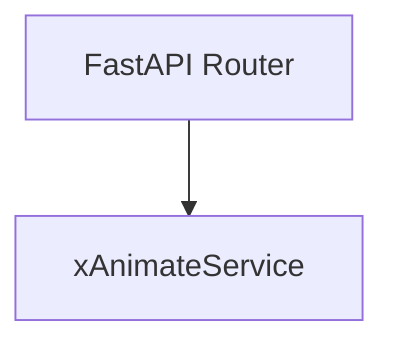
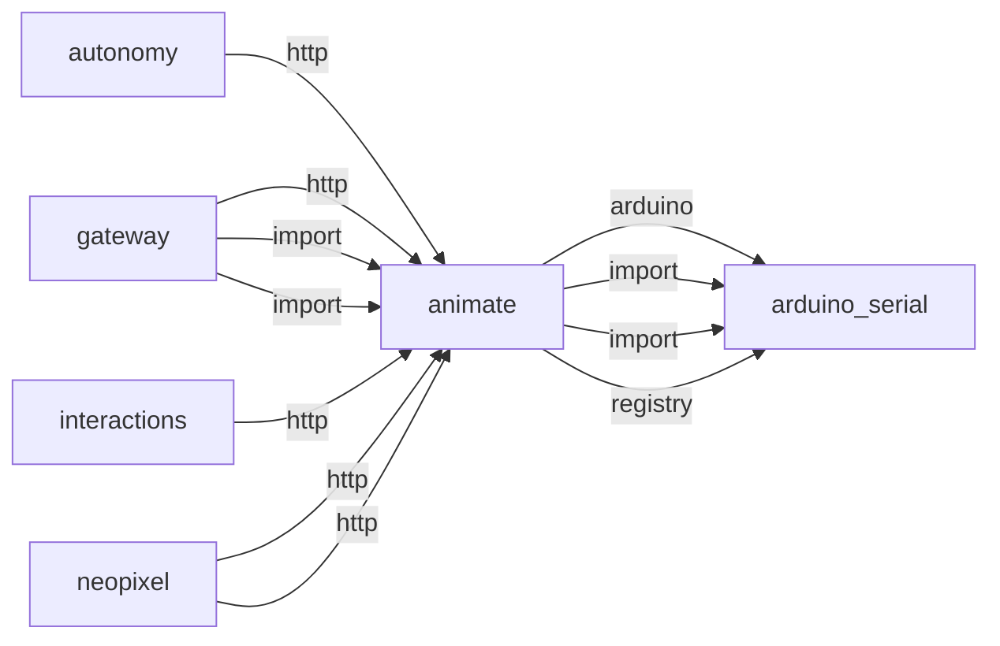
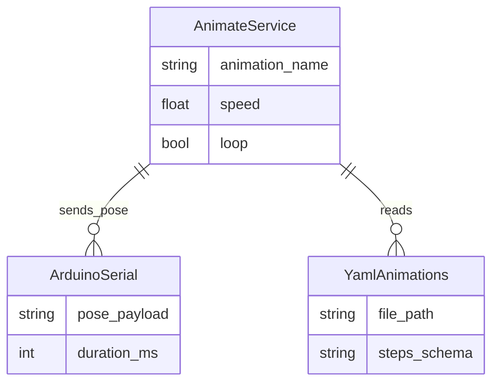
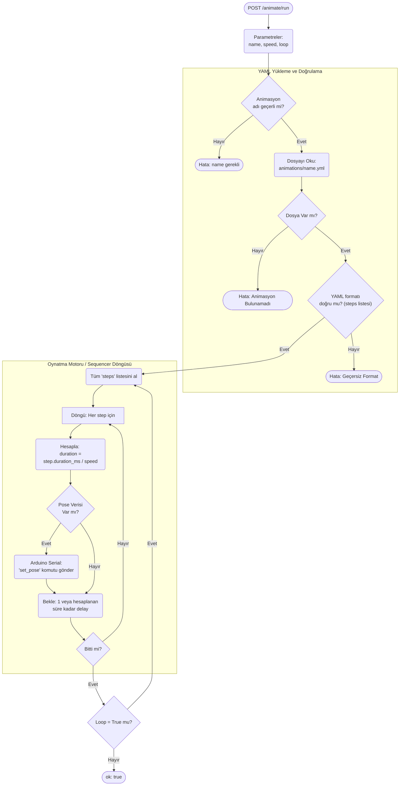

# animate

> **YAML servo animasyon oynatıcı**

## Kimlik
| Alan | Değer |
| --- | --- |
| Ana sınıf | `xAnimateService` |
| Giriş noktası | `—` |
| Orkestratör | `—` |
| Ana dosya | `modules/animate/xAnimateService.py` |
| Katman | Eylem |
| Port | — |
| Arduino | Evet |
| Sınıf sayısı | 3 |
| Endpoint sayısı | 3 |

## İsimlendirilmiş Bileşenler (Sınıflar)

#### `xAnimateService` — `modules/animate/xAnimateService.py`
- **Görev:** YAML tabanlı servo animasyon yürütücüsü.
- **Kalıtım:** —
- **Oluşturduğu bileşenler:** —
- **Metodlar:** `start()`, `stop()`, `list()`, `load()`, `run()`, `stop_run()`


## API — Endpoint → Handler → Servis

| HTTP | Path | Handler | Çağırdığı servis | Açıklama |
| --- | --- | --- | --- | --- |
| GET | `/list` | `list_animations()` | `list()`, `run()`, `stop_run()` | — |
| POST | `/run` | `run()` | `run()`, `stop_run()` | — |
| POST | `/stop` | `stop()` | `stop_run()` | — |

## Config Bölümleri
- `animations_dir`
- `default_speed`
- `interpolate`

## Dış İlişkiler (Bu modül → diğerleri)

| Hedef modül | Bağlantı tipi | Detay | Neden |
| --- | --- | --- | --- |
| [[arduino_serial]] | arduino | Arduino serial / contract kullanımı | YAML animasyon adımlarını set_pose komutlarına çevirir. |
| [[arduino_serial]] | import | xArduinoSerialService | YAML animasyon adımlarını set_pose komutlarına çevirir. |
| [[arduino_serial]] | import | contract | YAML animasyon adımlarını set_pose komutlarına çevirir. |
| [[arduino_serial]] | registry | registry dependency: arduino_serial | YAML animasyon adımlarını set_pose komutlarına çevirir. |

## Gelen İlişkiler (Diğerleri → bu modül)

| Kaynak modül | Bağlantı tipi | Detay | Neden |
| --- | --- | --- | --- |
| [[autonomy]] | http | calls path `/animate` | Duygu durumuna göre vücut animasyonu (stretch, sit, look_around) tetikler. |
| [[gateway]] | http | calls path `/animate` | `gateway` → `animate`: YAML tabanlı servo animasyonu başlatır. |
| [[gateway]] | import | xAnimateService | `gateway` kod içinde `animate` modülünü import eder (`xAnimateService`) — YAML servo animasyon oynatıcı. |
| [[gateway]] | import | api | `gateway` kod içinde `animate` modülünü import eder (`api`) — YAML servo animasyon oynatıcı. |
| [[interactions]] | http | calls path `/animate` | Sistem olaylarında veya kural tetiklerinde robot hareketi başlatır. |
| [[neopixel]] | http | calls path `/animate` | LED efektleri ile senkronize fiziksel hareket üretir. |
| [[neopixel]] | http | exposes/routes to `/animate` | LED efektleri ile senkronize fiziksel hareket üretir. |

## İç Mimari (otomatik çıkarım)



## Modül Etkileşim Haritası



### Mimari diyagram 1


### Mimari diyagram 2


---

# Tam Kaynak Arşivi

### `modules/animate/README.md` (36 satır)

```markdown
# Animate Module

YAML tabanlı servo animasyonları. Ana scriptler animasyon içermeyecek; sadece isimle çağırıp çalıştıracaksınız.

## Örnek
- `modules/animate/animations/sit.yml` animasyon dosyasını `xAnimateService.run('sit')` ile çalıştırın.

## Kullanım
```python
from modules.animate.xAnimateService import xAnimateService

anim = xAnimateService()  # Arduino serial otomatik başlatılır
anim.start()
anim.run('sit')
anim.stop()
```

## API (opsiyonel)
```python
from modules.animate.api.router import get_router
router = get_router(anim)
```

## Gateway ile Kullanım
Bu modül gateway üzerinden tek porttan sunulacak şekilde orkestrasyona dahil edilebilir. Varsayılan kurulumda gateway modül router’larını monte eder. Animasyon tetiklemeyi doğrudan Arduino `set_pose(duration_ms)` komutlarıyla yapan üst servisler (ör. teleop veya özel iş mantığı) gateway’de barınabilir.

## Şema
```yaml
name: sit
loop: false
steps:
  - pose: [90,110,60, 90,110,60, 90,90]
    duration_ms: 1200
  - pose: [90,110,60, 90,110,60, 90,90]
    hold_ms: 500
```
```

### `modules/animate/__init__.py` (6 satır)

```python
from __future__ import annotations

__all__ = ["xAnimateService", "get_router"]

from .xAnimateService import xAnimateService  # noqa: F401
from .api.router import get_router  # noqa: F401
```

### `modules/animate/animations/blink.yml` (9 satır)

```yaml
name: blink
loop: false
steps:
  - pose: [90,90,90, 90,90,90, 75,90]
    duration_ms: 120
  - pose: [90,90,90, 90,90,90, 65,90]
    duration_ms: 120
  - pose: [90,90,90, 90,90,90, 90,90]
    duration_ms: 160
```

### `modules/animate/animations/look_around.yml` (11 satır)

```yaml
name: look_around
loop: false
steps:
  - pose: [90,90,90, 90,90,90, 92,60]
    duration_ms: 300
  - pose: [90,90,90, 90,90,90, 88,120]
    duration_ms: 320
  - pose: [90,90,90, 90,90,90, 92,80]
    duration_ms: 280
  - pose: [90,90,90, 90,90,90, 90,100]
    duration_ms: 260
```

### `modules/animate/animations/owner_scan.yml` (13 satır)

```yaml
name: owner_scan
loop: false
steps:
  - pose: [90,90,90, 90,90,90, 90,60]
    duration_ms: 350
  - pose: [90,90,90, 90,90,90, 90,120]
    duration_ms: 350
  - pose: [90,90,90, 90,90,90, 92,75]
    duration_ms: 300
  - pose: [90,90,90, 90,90,90, 88,105]
    duration_ms: 300
  - pose: [90,90,90, 90,90,90, 90,90]
    duration_ms: 250
```

### `modules/animate/animations/sit.yml` (7 satır)

```yaml
name: sit
loop: false
steps:
  - pose: [90,110,60, 90,110,60, 90,90]
    duration_ms: 1200
  - pose: [90,110,60, 90,110,60, 90,90]
    hold_ms: 500
```

### `modules/animate/animations/stretch.yml` (9 satır)

```yaml
name: stretch
loop: false
steps:
  - pose: [90,90,90, 90,90,90, 110,90]
    duration_ms: 500
  - pose: [90,90,90, 90,90,90, 70,90]
    duration_ms: 500
  - pose: [90,90,90, 90,90,90, 90,90]
    duration_ms: 400
```

### `modules/animate/animations/temp_owner.yml` (13 satır)

```yaml
name: temp_owner
loop: false
steps:
  - pose: [90,90,90, 90,90,90, 100,90]
    duration_ms: 260
  - pose: [90,90,90, 90,90,90, 80,90]
    duration_ms: 260
  - pose: [90,90,90, 90,90,90, 95,95]
    duration_ms: 240
  - pose: [90,90,90, 90,90,90, 85,85]
    duration_ms: 240
  - pose: [90,90,90, 90,90,90, 90,90]
    duration_ms: 220
```

### `modules/animate/animations/vision_focus.yml` (9 satır)

```yaml
name: vision_focus
loop: false
steps:
  - pose: [90,90,90, 90,90,90, 88,82]
    duration_ms: 220
  - pose: [90,90,90, 90,90,90, 92,94]
    duration_ms: 220
  - pose: [90,90,90, 90,90,90, 90,90]
    duration_ms: 200
```

### `modules/animate/api/router.py` (40 satır)

```python
from __future__ import annotations
from fastapi import APIRouter, Query
from typing import Optional

try:
    from ..xAnimateService import xAnimateService
except Exception:
    from modules.animate.xAnimateService import xAnimateService  # type: ignore


def get_router(anim: xAnimateService) -> APIRouter:
    r = APIRouter(prefix="/animate")

    @r.get("/list")
    def list_animations():
        return {"ok": True, "animations": anim.list()}

    @r.post("/run")
    def run(name: str, speed: float = 1.0, loop: bool = Query(False)):
        import threading

        result = {"ok": False}

        def _worker():
            result["ok"] = bool(anim.run(name, speed=speed, loop=loop))

        t = threading.Thread(target=_worker, daemon=True, name=f"animate-{name}")
        t.start()
        t.join(timeout=max(1.0, float(anim.cfg.get("run_timeout_s", 30.0))))
        if t.is_alive():
            anim.stop_run()
            return {"ok": False, "error": "animation timeout"}
        return {"ok": bool(result["ok"])}

    @r.post("/stop")
    def stop():
        anim.stop_run()
        return {"ok": True}

    return r
```

### `modules/animate/architecture_animate.md` (82 satır)

```markdown
# Animate Modülü Mimarisi

Animate modülü (`modules/animate`), robotun karmaşık gövde/kafa hareketlerini (animasyonlarını) zamanlanmış servo pozisyonlarına bölen ve bunları YAML dosyalarından okuyarak Arduino'ya aktaran sıralayıcı (sequencer) motordur.

## 🏗️ İş Akışı ve Karar Mekanizmaları (Flowchart)

Bir servo animasyonunun yüklenme, hız/tempo ayarı (speed) ve Arduino'ya iletilme adım (step) if/else mantığı:



## 🔄 İlişkisel Etkileşimler (Veri Akışı)


## ⚙️ Detaylı Karar Mantığı (if/else)

1. **Güvenlik (Directory Traversal Koruması)**
   - API'ye dışarıdan `name=../../../etc/passwd` gibi zararlı şeyler gelebilir.
   - **`if`** `os.path.abspath` animasyon dizininin dışına taşıyorsa, dosya okumasını derhal reddeder. Sadece `modules/animate/animations/` altındaki `.yml` dosyalarını işler.
2. **Değişken Hız Katsayısı (Speed Multiplier)**
   - Autonomy beyni animasyon çağırırken robotun o anki duygu durumuna göre `speed` katsayısı gönderir (Örn mutluysa x1.2 hızlı, üzgünse x0.5 yavaş).
   - Motor, YAML'da yazan saf `duration_ms` değerini alır ve `(duration_ms / speed)` yaparak yeni bekleme süresini (timeout delay) hesaplar. Arduino'ya da hareketin ne kadar sürede tamamlanacağını (`duration`) bu yeni hesapla gönderir ki servo aniden seğirmesin, pürüzsüz ("smooth") gitsin.
3. **Loop ve Non-Blocking Çalışma**
   - Animasyonlar robotun beynini 10 saniye boyunca kilitlememelidir. Bu yüzden `run_animation` tetiklendiğinde Python arkada yeni bir `threading.Thread` başlatıp bu sleep/döngü işini ayrıştırır ve HTTP yanıtını anında döner `{"ok": True}`. Robot konuşurken veya başka iş yaparken servolar hareket etmeye devam eder.
```

### `modules/animate/config/config.yml` (4 satır)

```yaml
# Animate module config
animations_dir: null  # null -> use default modules/animate/animations
default_speed: 1.0
interpolate: true
```

### `modules/animate/config_loader.py` (41 satır)

```python
from __future__ import annotations

import os
from typing import Any, Dict, Optional

try:
    import yaml  # type: ignore
except Exception:  # pragma: no cover
    yaml = None

DEFAULT_CONFIG: Dict[str, Any] = {
    "animations_dir": None,  # if None, use modules/animate/animations
    "default_speed": 1.0,   # multiplier
    "interpolate": True,
}


def load_config(base_dir: Optional[str] = None, overrides: Optional[Dict[str, Any]] = None) -> Dict[str, Any]:
    cfg: Dict[str, Any] = dict(DEFAULT_CONFIG)

    candidates = []
    if base_dir:
        candidates.append(os.path.join(base_dir, "config", "config.yml"))
    here = os.path.dirname(__file__)
    candidates.append(os.path.join(here, "config", "config.yml"))

    for path in candidates:
        if os.path.exists(path) and yaml is not None:
            with open(path, "r", encoding="utf-8") as f:
                data = yaml.safe_load(f) or {}
            if isinstance(data, dict):
                cfg.update(data)
            break

    if overrides:
        cfg.update({k: v for k, v in overrides.items() if v is not None})

    if not cfg.get("animations_dir"):
        cfg["animations_dir"] = os.path.join(os.path.dirname(__file__), "animations")

    return cfg
```

### `modules/animate/services/__init__.py` (0 satır)

```python

```

### `modules/animate/tests/test_smoke.py` (45 satır)

```python
from __future__ import annotations

from typing import Any, Dict, List

from modules.animate.xAnimateService import xAnimateService


class FakeSerial:
    def __init__(self):
        self.sent: List[Dict[str, Any]] = []
        self._started = False

    def start(self) -> None:
        self._started = True

    def stop(self) -> None:
        self._started = False

    def set_pose(self, pose: list[int], duration_ms: int | None = None):
        self.sent.append({"cmd": "set_pose", "pose": pose, "duration_ms": duration_ms})


class FailingSerial(FakeSerial):
    def set_pose(self, pose: list[int], duration_ms: int | None = None):
        raise RuntimeError("serial unavailable")


def test_run_sit(tmp_path):
    svc = xAnimateService(serial=FakeSerial())
    # ensure sit.yml exists in default animations dir; list should contain 'sit'
    assert 'sit' in svc.list()
    svc.run('sit', speed=1.0, loop=False)
    # at least one set_pose should be sent
    assert len(svc.serial.sent) >= 1  # type: ignore[attr-defined]


def test_legacy_pose_is_normalized_to_4_servos():
    svc = xAnimateService(serial=FakeSerial())
    out = svc._normalize_pose([90, 110, 60, 90, 110, 60, 88, 120])
    assert out == [120, 88, 90, 90]


def test_run_does_not_raise_when_serial_unavailable():
    svc = xAnimateService(serial=FailingSerial())
    svc.run('blink', speed=1.0, loop=False)
```

### `modules/animate/xAnimateService.py` (151 satır)

```python
from __future__ import annotations

import os
import time
import logging
from typing import Any, Dict, List, Optional

try:
    from modules.arduino_serial.xArduinoSerialService import xArduinoSerialService  # type: ignore
    from modules.arduino_serial.contract import (  # type: ignore
        SERVO_COUNT,
        SERVO_INDEX_PAN,
        SERVO_INDEX_TILT,
    )
except Exception:
    from ..arduino_serial.xArduinoSerialService import xArduinoSerialService  # type: ignore
    from ..arduino_serial.contract import (  # type: ignore
        SERVO_COUNT,
        SERVO_INDEX_PAN,
        SERVO_INDEX_TILT,
    )

from .config_loader import load_config

try:
    import yaml  # type: ignore
except Exception:  # pragma: no cover
    yaml = None

logger = logging.getLogger("animate")


def _clamp_deg(value: Any, default: int = 90) -> int:
    try:
        return max(0, min(180, int(value)))
    except Exception:
        return int(default)


class xAnimateService:
    """YAML tabanlı servo animasyon yürütücüsü.

    Şema (örnek):
    name: sit
    loop: false
    steps:
      - pose: [90,110,60, 90,110,60, 90,90]
        duration_ms: 1200
      - pose: [90,110,60, 90,110,60, 90,90]
        hold_ms: 500
    """

    def __init__(self, serial: Optional[xArduinoSerialService] = None, config_overrides: Optional[Dict[str, Any]] = None):
        self.cfg = load_config(overrides=config_overrides)
        self.serial = serial or xArduinoSerialService()
        self._running = False

    def start(self) -> None:
        self.serial.start()

    def stop(self) -> None:
        self.serial.stop()

    # API
    def list(self) -> List[str]:
        base = self.cfg["animations_dir"]
        out: List[str] = []
        for fn in os.listdir(base):
            if fn.lower().endswith((".yml", ".yaml")):
                out.append(os.path.splitext(fn)[0])
        return sorted(out)

    def load(self, name: str) -> Dict[str, Any]:
        path = self._resolve_path(name)
        if yaml is None:
            raise RuntimeError("PyYAML missing")
        with open(path, "r", encoding="utf-8") as f:
            data = yaml.safe_load(f) or {}
        if not isinstance(data, dict) or "steps" not in data:
            raise ValueError("invalid animation file")
        return data

    def run(self, name: str, speed: float | None = None, loop: Optional[bool] = None) -> bool:
        anim = self.load(name)
        speed_mul = speed if speed is not None else float(self.cfg.get("default_speed", 1.0))
        do_loop = bool(anim.get("loop", False) if loop is None else loop)
        self._running = True
        degraded = False
        try:
            while self._running:
                for step in anim.get("steps", []):
                    if not self._running:
                        break
                    pose_raw: List[int] = list(step.get("pose", []))
                    pose = self._normalize_pose(pose_raw)
                    dur_ms: int = int(step.get("duration_ms", 0))
                    hold_ms: int = int(step.get("hold_ms", 0))
                    if dur_ms > 0:
                        dur_ms = max(1, int(dur_ms / max(0.01, speed_mul)))
                    # send pose
                    if pose:
                        try:
                            self.serial.set_pose(pose, duration_ms=dur_ms if dur_ms > 0 else None)
                        except Exception as exc:
                            logger.warning("animate degraded: pose step skipped (%s)", exc)
                            degraded = True
                            self._running = False
                            break
                    # hold
                    if hold_ms > 0:
                        time.sleep(max(0.0, hold_ms / 1000.0))
                if not do_loop:
                    break
        finally:
            self._running = False
        return not degraded

    def stop_run(self) -> None:
        self._running = False

    # utils
    def _resolve_path(self, name: str) -> str:
        base = self.cfg["animations_dir"]
        for ext in (".yml", ".yaml"):
            p = os.path.join(base, name + ext)
            if os.path.exists(p):
                return p
        raise FileNotFoundError(name)

    @staticmethod
    def _normalize_pose(pose: List[int]) -> List[int]:
        """Normalize animation pose to 4-servo contract.

        Legacy animations contain 8 values where last 2 are head tilt/pan.
        Current Arduino contract expects 4 values: [pan, tilt, s2, s3].
        """
        if not pose:
            return []
        if len(pose) == SERVO_COUNT:
            return [_clamp_deg(v) for v in pose]
        if len(pose) == 8:
            tilt = _clamp_deg(pose[6])
            pan = _clamp_deg(pose[7])
            out = [90] * SERVO_COUNT
            if SERVO_INDEX_PAN < SERVO_COUNT:
                out[SERVO_INDEX_PAN] = pan
            if SERVO_INDEX_TILT < SERVO_COUNT:
                out[SERVO_INDEX_TILT] = tilt
            return out
        # Unknown pose size: ignore the step instead of crashing the API route.
        return []
```
