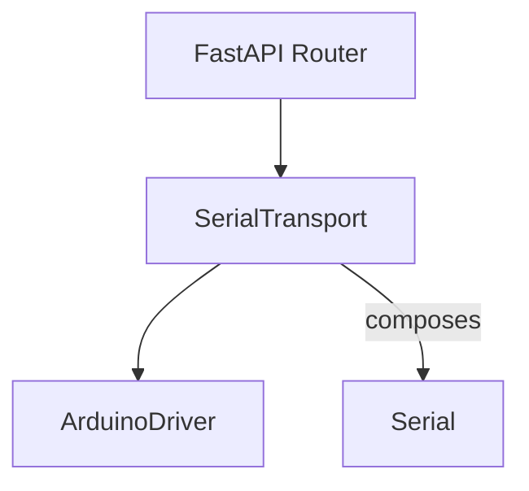
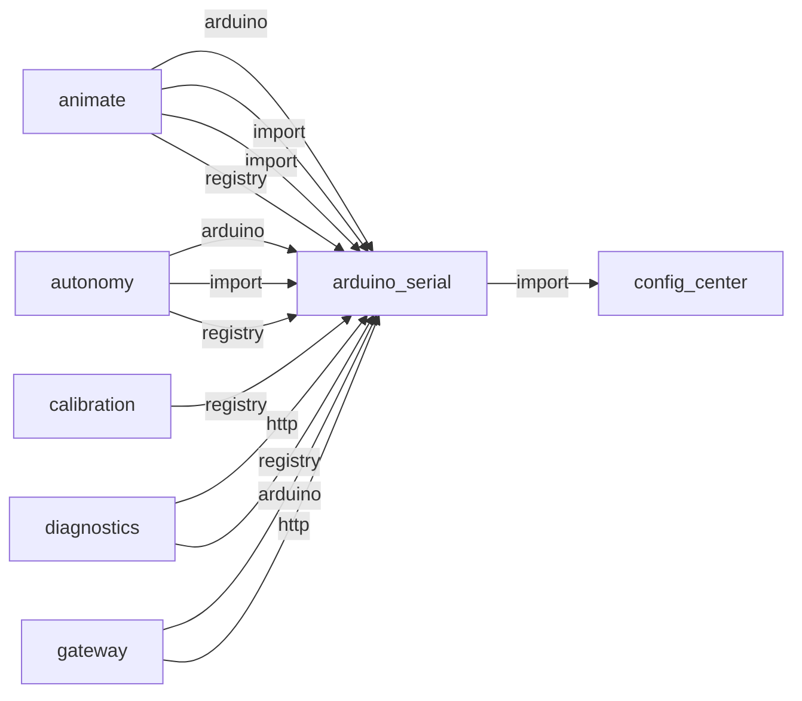
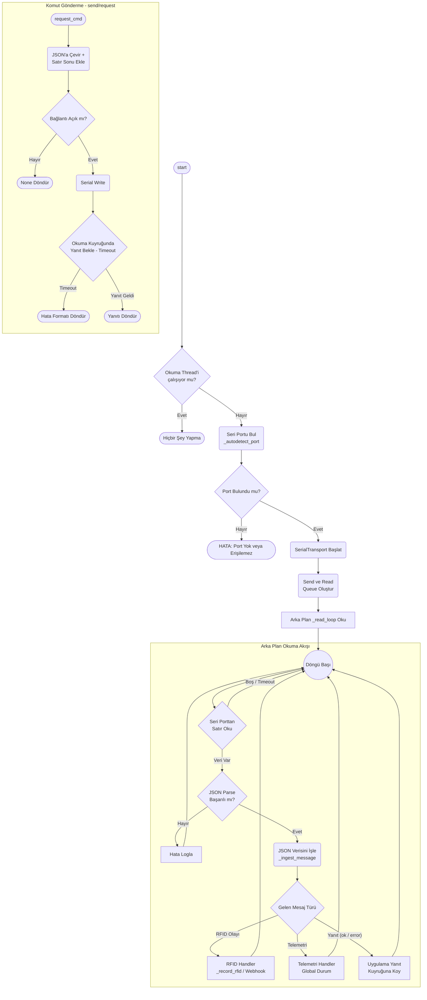
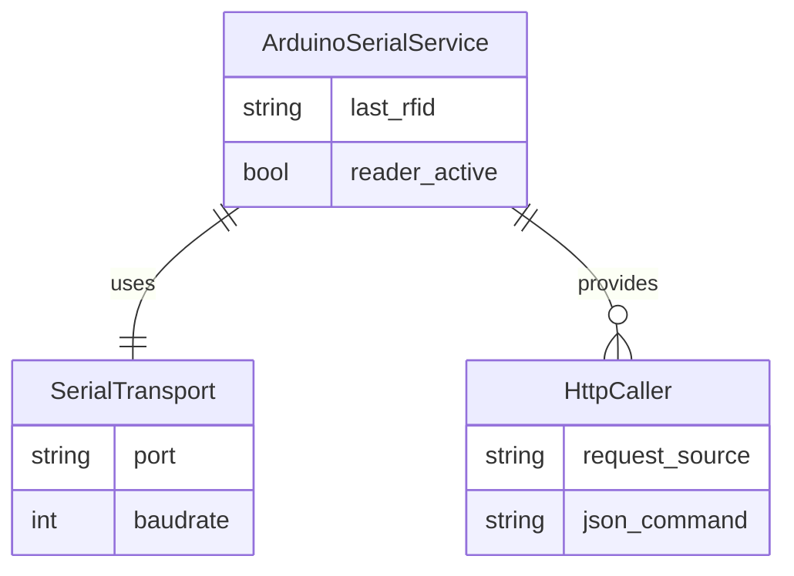

# arduino_serial

> **NDJSON seri haberleşme, komut/yanıt kuyruğu**

## Kimlik
| Alan | Değer |
| --- | --- |
| Ana sınıf | `SerialTransport` |
| Giriş noktası | `—` |
| Orkestratör | `—` |
| Ana dosya | `modules/arduino_serial/xArduinoSerialService.py` |
| Katman | Eylem |
| Port | — |
| Arduino | **Kaynak** |
| Sınıf sayısı | 6 |
| Endpoint sayısı | 17 |

## İsimlendirilmiş Bileşenler (Sınıflar)

#### `ArduinoDriver` — `modules/arduino_serial/services/driver.py`
- **Görev:** High-level convenience layer over xArduinoSerialService.
- **Kalıtım:** —
- **Oluşturduğu bileşenler:** —
- **Metodlar:** `start()`, `stop()`, `hello()`, `set_head()`, `estop()`, `laser_on()`, `laser_both_on()`, `laser_off()`

#### `SerialTransport` — `modules/arduino_serial/xArduinoSerialService.py`
- **Görev:** Thin wrapper around pyserial for dependency injection in tests.
- **Kalıtım:** —
- **Oluşturduğu bileşenler:** `Serial`
- **Metodlar:** `readline()`, `write()`, `close()`

#### `xArduinoSerialService` — `modules/arduino_serial/xArduinoSerialService.py`
- **Görev:** —
- **Kalıtım:** —
- **Oluşturduğu bileşenler:** `Event`, `Lock`, `Thread`, `Session`
- **Metodlar:** `start()`, `stop()`, `send()`, `request()`, `try_get()`, `register_event_handler()`, `hello()`, `heartbeat()`, `telemetry_start()`, `telemetry_stop()`, `set_servo()`, `set_pose()`


## API — Endpoint → Handler → Servis

| HTTP | Path | Handler | Çağırdığı servis | Açıklama |
| --- | --- | --- | --- | --- |
| GET | `/healthz` | `healthz()` | `get_last_rfid()`, `hello()`, `request()`, `send()`, `telemetry_start()` | — |
| POST | `/send` | `send()` | `authorize_rfid()`, `get_last_rfid()`, `laser_on()`, `request()`, `send()`, `telemetry_start()` | — |
| POST | `/request` | `request()` | `authorize_rfid()`, `get_last_rfid()`, `laser_on()`, `request()`, `telemetry_start()` | — |
| POST | `/telemetry/start` | `telemetry_start()` | `authorize_rfid()`, `cute()`, `get_last_rfid()`, `laser_on()`, `sound_output()`, `telemetry_start()` | — |
| POST | `/telemetry/stop` | `telemetry_stop()` | `authorize_rfid()`, `buzzer()`, `cute()`, `get_last_rfid()`, `laser_on()`, `sound_output()` | — |
| GET | `/rfid/last` | `rfid_last()` | `authorize_rfid()`, `buzzer()`, `cute()`, `get_last_rfid()`, `laser_on()`, `sound_output()`, `sound_play()` | — |
| GET | `/rfid/authorize` | `rfid_authorize()` | `authorize_rfid()`, `buzzer()`, `cute()`, `laser_on()`, `sound_output()`, `sound_play()` | — |
| POST | `/laser/one/{which}` | `laser_one()` | `buzzer()`, `cute()`, `laser_on()`, `play_emotion()`, `sound_output()`, `sound_play()` | — |
| POST | `/laser/both` | `laser_both()` | `buzzer()`, `cute()`, `play_emotion()`, `sound_output()`, `sound_play()` | — |
| POST | `/laser/off` | `laser_off()` | `buzzer()`, `cute()`, `play_emotion()`, `sound_output()`, `sound_play()` | — |
| POST | `/cute/{name}` | `cute()` | `buzzer()`, `cute()`, `play_emotion()`, `sound_output()`, `sound_play()` | — |
| POST | `/sound/out/{mode}` | `sound_out()` | `buzzer()`, `play_emotion()`, `sound_output()`, `sound_play()` | — |
| POST | `/buzzer` | `buzzer()` | `buzzer()`, `play_emotion()`, `sound_play()` | — |
| POST | `/sound/play/{name}` | `sound_play()` | `play_emotion()`, `sound_play()` | — |
| GET | `/cute/catalog` | `cute_catalog()` | `play_emotion()` | — |
| GET | `/metrics` | `metrics()` | `play_emotion()` | — |
| POST | `/cute/emotion/{emotion}` | `cute_emotion()` | `play_emotion()` | — |

## Config Bölümleri
- `transport`
- `esp_base_url`
- `esp_request_path`
- `esp_send_path`
- `esp_health_path`
- `esp_timeout_sec`
- `esp_connect_timeout_sec`
- `esp_pause_after_failures`
- `esp_pause_sec`
- `port`
- `baudrate`
- `timeout`
- `write_timeout`
- `reconnect_sec`
- `heartbeat_ms`
- `auto_heartbeat`
- `request_max_retries`
- `request_timeout_ms`
- `telemetry`
- `log_level`
- `rfid`

## Dış İlişkiler (Bu modül → diğerleri)

| Hedef modül | Bağlantı tipi | Detay | Neden |
| --- | --- | --- | --- |
| [[config_center]] | import | agent_yaml_loader | `arduino_serial` → `config_center`: config/agent.yaml dosyasından ayar okur. |

## Gelen İlişkiler (Diğerleri → bu modül)

| Kaynak modül | Bağlantı tipi | Detay | Neden |
| --- | --- | --- | --- |
| [[animate]] | arduino | Arduino serial / contract kullanımı | YAML animasyon adımlarını set_pose komutlarına çevirir. |
| [[animate]] | import | xArduinoSerialService | YAML animasyon adımlarını set_pose komutlarına çevirir. |
| [[animate]] | import | contract | YAML animasyon adımlarını set_pose komutlarına çevirir. |
| [[animate]] | registry | registry dependency: arduino_serial | YAML animasyon adımlarını set_pose komutlarına çevirir. |
| [[autonomy]] | arduino | Arduino serial / contract kullanımı | Karar sonrası servo/hareket komutlarını donanıma iletir. |
| [[autonomy]] | import | contract | Karar sonrası servo/hareket komutlarını donanıma iletir. |
| [[autonomy]] | registry | registry dependency: ollama, speak, vlm_bridge, arduino_serial | Karar sonrası servo/hareket komutlarını donanıma iletir. |
| [[calibration]] | registry | registry dependency: arduino_serial | Servo kalibrasyon komutlarını Arduino'ya gönderir. |
| [[diagnostics]] | http | calls path `/arduino/healthz` | Arduino bağlantı sağlık testi yapar. |
| [[diagnostics]] | registry | registry dependency: arduino_serial, camera, ollama | Arduino bağlantı sağlık testi yapar. |
| [[gateway]] | arduino | Arduino serial / contract kullanımı | Tüm /arduino/* isteklerini serial modüle proxy eder. |
| [[gateway]] | http | calls path `/arduino/healthz` | Tüm /arduino/* isteklerini serial modüle proxy eder. |
| [[gateway]] | http | calls path `/arduino` | Tüm /arduino/* isteklerini serial modüle proxy eder. |
| [[gateway]] | import | xArduinoSerialService | Tüm /arduino/* isteklerini serial modüle proxy eder. |
| [[gateway]] | import | api | Tüm /arduino/* isteklerini serial modüle proxy eder. |
| [[logwrapper]] | http | calls path `/arduino/request` | `logwrapper` → `arduino_serial`: Arduino'ya NDJSON komut gönderir veya ACK bekler. |
| [[logwrapper]] | http | calls path `/arduino/healthz` | `logwrapper` → `arduino_serial`: Arduino'ya NDJSON komut gönderir veya ACK bekler. |
| [[piservo]] | arduino | Arduino serial / contract kullanımı | Kulak servo komutları için seri haberleşme (bazı kurulumlarda). |
| [[piservo]] | import | services | Kulak servo komutları için seri haberleşme (bazı kurulumlarda). |
| [[speech]] | arduino | Arduino serial / contract kullanımı | Ses yönü (DOA) veya buzzer geri bildirimi için Arduino'ya komut gönderir. |
| [[speech]] | http | calls path `/arduino/request` | Ses yönü (DOA) veya buzzer geri bildirimi için Arduino'ya komut gönderir. |
| [[speech]] | import | contract | Ses yönü (DOA) veya buzzer geri bildirimi için Arduino'ya komut gönderir. |
| [[vlm_bridge]] | arduino | Arduino serial / contract kullanımı | Pan/tilt servo takibi için Arduino komutları gönderir. |
| [[vlm_bridge]] | http | calls path `/arduino/request` | Pan/tilt servo takibi için Arduino komutları gönderir. |
| [[vlm_bridge]] | import | contract | Pan/tilt servo takibi için Arduino komutları gönderir. |
| [[vlm_bridge]] | registry | registry dependency: camera, arduino_serial, ollama | Pan/tilt servo takibi için Arduino komutları gönderir. |
| [[wakeword]] | registry | registry dependency: speech, arduino_serial | Algılama anında buzzer/LED geri bildirimi tetikler. |

## İç Mimari (otomatik çıkarım)



## Modül Etkileşim Haritası



### Mimari diyagram 1


### Mimari diyagram 2


---

# Tam Kaynak Arşivi

### `modules/arduino_serial/README.md` (87 satır)

```markdown
# Arduino Serial Module (NDJSON Contract + ESP Transport)

Arduino komut kontratını (`contract.py`) tek kaynak olarak tutar ve üretimde komutları ESP bridge üzerinden Mega'ya iletir.

## Özellikler
- ESP HTTP transport (üretim): Pi -> ESP -> Mega
- Opsiyonel legacy serial fallback (`transport: serial`)
- Otomatik heartbeat ve request retry
- Basit FastAPI router (opsiyonel) ve sürücü sınıfı
- DryCode: modüler yapı, ayrı config.yml
- Firmware komut kapsamı: hello/hb, set_servo, set_pose(duration), stepper(pos/vel), stepper_cfg,
  home/zero_now/zero_set, pid_enable/pid_set/pid_status, stand/sit, imu_read/imu_cal, eeprom_save/load, tune, policy, track,
  telemetry_start/stop, get_state, estop
    - Sit modunda stepper dengeleme + "drive" (kullanıcı hızı) karışımı desteklenir.

## Kurulum
- Python bağımlılıkları: `requests`, `pyserial` (legacy fallback), FastAPI kullanacaksanız `fastapi` ve `uvicorn`.

## Kullanım (kütüphane)
```python
from modules.arduino_serial.services.driver import ArduinoDriver

ardu = ArduinoDriver()
ardu.start()
print(ardu.hello())
ardu.set_head(90, 90)
# örnek: oturma + denge + ileri sürüş
ardu.svc.sit()
ardu.svc.drive(200)        # ileri gitme isteği (steps/s)
ardu.stop()
```

## Builder Mantigi (Basit Anlatim)
- `contract.py` icindeki `build_*` fonksiyonlari, Arduino komutunu tek tip formatta uretir.
- Amaç: Her modulde elle `{"cmd": ...}` yazip farkli format gonderme riskini azaltmak.
- Ornek:
    - Eski: Kod icinde dogrudan `{"cmd":"stepper","id":0,...}` yaziliyordu.
    - Yeni: `build_stepper_cmd(...)` kullaniliyor ve her yerde ayni JSON cikiyor.
- Sonuc: Hata ayiklama kolaylasir, alan isimleri (`index/deg`, `head_pan`, vb.) karismaz.
- Not: Builder, komutu sadece uretir; gonderme islemini yine servis (`send/request`) yapar.

## API (opsiyonel)
Router oluşturmak için:
```python
from modules.arduino_serial.api.router import get_router
from modules.arduino_serial.xArduinoSerialService import xArduinoSerialService

svc = xArduinoSerialService()
svc.start()
router = get_router(svc)
```

### Gateway Üzerinden Erişim
Gateway çalışırken Arduino uçları tek portta sunulur:
- GET  `/arduino/healthz`
- POST `/arduino/send`
- POST `/arduino/request`
- POST `/arduino/telemetry/start`
- POST `/arduino/telemetry/stop`
- GET  `/arduino/rfid/last` → Son görülen kart UID'sini ve kaç saniye önce okunduğunu döner.
- GET  `/arduino/rfid/authorize` → `config.yml` içindeki `rfid.allowed_uids` listesine göre kartı doğrular; `authorized: true` ise Autonomy içindeki RFID koruması açılır.
- POST `/arduino/cute/{name}` → CuteBuzzer sesi çal (`connection`, `disconnection`, `button_pushed`, `mode1`, `mode2`, `mode3`, `surprise`, `ohooh`, `ohooh2`, `cuddly`, `sleeping`, `happy`, `super_happy`, `happy_short`, `sad`, `confused`, `fart1`, `fart2`, `fart3`, `jump`).
- GET  `/arduino/cute/catalog` → Ses→NeoPixel animasyon/renk eşleşme tablosunu ve emotion map'i döner (Swagger'da görünür).
- POST `/arduino/cute/emotion/{emotion}` → Emotion adına göre uygun Cute sesi çalar (`happy`, `super_happy`, `sad`, `surprise`, `confused`, `sleeping`, `connected`, `disconnected`).
- POST `/arduino/sound/out/{mode}` → Varsayılan buzzer çıkışını değiştir (`loud|quiet`).
- POST `/arduino/buzzer?freq=2200&ms=60&out=loud` → Tek beep komutu.
- POST `/arduino/sound/play/{name}?out=quiet` → Firmware şarkı isimlerini çal.

Not:
- Kritik hareket komutlarında `POST /arduino/request` tercih edilmelidir (ACK/error döner).
- `POST /arduino/send` fire-and-forget içindir.
- Gateway, desteklenen Arduino komut aileleri için payload doğrulaması yapar; şekli/alanı hatalı isteklerde `400` döner.

## Konfig
`modules/arduino_serial/config/config.yml` içinde varsayılanlar:
- transport: `esp_http`
- esp_base_url: `http://sentrybot.local`
- esp_request_path: `/request`
- esp_send_path: `/send`
- heartbeat_ms: 100
- rfid.allowed_uids: Yetki verilecek kart UID'leri (HEX, büyük/küçük fark etmez)
- rfid.authorize_window_s: Son kart okumasının geçerli sayılacağı zaman penceresi (s)

Env override: `ARDUINO_PORT`, `ARDUINO_BAUD`.

## Test
Basit smoke test `tests/test_smoke.py` fake transport ile çalışır.
```

### `modules/arduino_serial/__init__.py` (5 satır)

```python
from __future__ import annotations

__all__ = ["xArduinoSerialService"]

from .xArduinoSerialService import xArduinoSerialService  # re-export for convenience
```

### `modules/arduino_serial/api/router.py` (116 satır)

```python
from __future__ import annotations
from fastapi import APIRouter, HTTPException
from typing import Optional, Dict, Any

from ..contract import validate_arduino_payload

try:
    from ..xArduinoSerialService import xArduinoSerialService
except Exception:
    from modules.arduino_serial.xArduinoSerialService import xArduinoSerialService  # type: ignore


def get_router(svc: xArduinoSerialService) -> APIRouter:
    def _validate_payload_or_400(obj: Dict[str, Any]) -> None:
        err = validate_arduino_payload(obj)
        if err:
            raise HTTPException(status_code=400, detail=err)

    r = APIRouter(prefix="/arduino")

    def _safe_call(fn):
        try:
            return fn()
        except Exception as exc:
            return {"ok": False, "error": str(exc)}

    @r.get("/healthz")
    def healthz():
        # try ping
        try:
            resp = svc.hello()
            ok = bool(resp.get("ok", False))
        except Exception:
            ok = False
            resp = {"ok": False}
        return {"ok": ok, "resp": resp}

    @r.post("/send")
    def send(obj: Dict[str, Any]):
        _validate_payload_or_400(obj)
        def _do_send():
            svc.send(obj)
            return {"ok": True}
        return _safe_call(_do_send)

    @r.post("/request")
    def request(obj: Dict[str, Any], timeout: float = 1.0):
        _validate_payload_or_400(obj)
        def _do_request():
            resp = svc.request(obj, timeout=timeout)
            return {"ok": True, "resp": resp}
        return _safe_call(_do_request)

    @r.post("/telemetry/start")
    def telemetry_start(interval_ms: int = 100):
        return _safe_call(lambda: svc.telemetry_start(interval_ms))

    @r.post("/telemetry/stop")
    def telemetry_stop():
        return _safe_call(svc.telemetry_stop)

    @r.get("/rfid/last")
    def rfid_last():
        snap = svc.get_last_rfid()
        if not snap:
            return {"ok": False, "error": "no_rfid"}
        return {"ok": True, **snap}

    @r.get("/rfid/authorize")
    def rfid_authorize(uid: Optional[str] = None, window_s: Optional[float] = None):
        result = svc.authorize_rfid(uid=uid, window_s=window_s)
        ok = bool(result.get("authorized"))
        return {"ok": ok, **result}

    # Laser controls
    @r.post("/laser/one/{which}")
    def laser_one(which: int):
        return _safe_call(lambda: svc.laser_on(which))

    @r.post("/laser/both")
    def laser_both():
        return _safe_call(svc.laser_both_on)

    @r.post("/laser/off")
    def laser_off():
        return _safe_call(svc.laser_off)

    @r.post("/cute/{name}")
    def cute(name: str):
        return _safe_call(lambda: svc.cute(name))

    @r.post("/sound/out/{mode}")
    def sound_out(mode: str):
        return _safe_call(lambda: svc.sound_output(mode))

    @r.post("/buzzer")
    def buzzer(freq: int = 2200, ms: int = 60, out: Optional[str] = None):
        return _safe_call(lambda: svc.buzzer(freq=freq, ms=ms, out=out))

    @r.post("/sound/play/{name}")
    def sound_play(name: str, out: Optional[str] = None):
        return _safe_call(lambda: svc.sound_play(name=name, out=out))

    @r.get("/cute/catalog")
    def cute_catalog():
        return _safe_call(svc.get_cute_catalog)

    @r.get("/metrics")
    def metrics():
        return _safe_call(lambda: svc._metrics)

    @r.post("/cute/emotion/{emotion}")
    def cute_emotion(emotion: str):
        return _safe_call(lambda: svc.play_emotion(emotion))

    return r
```

### `modules/arduino_serial/architecture_arduino_serial.md` (89 satır)

```markdown
# Arduino Serial Modülü Mimarisi

Arduino Serial modülü (`modules/arduino_serial`), komut kontratını yöneten katmandır. Üretimde Raspberry Pi komutları ESP bridge'e HTTP ile gönderir; ESP bu komutları Arduino Mega'ya NDJSON/UART olarak aktarır.

## 🏗️ İş Akışı ve Karar Mekanizmaları (Flowchart)

Aşağıdaki diyagram, seri portun nasıl başlatıldığını, arka plandaki okuma döngüsünü, ve gelen/giden JSON mesajlarının nasıl filtrelendiğini (if/else) gösterir:


## 🔄 İlişkisel Etkileşimler


## ⚙️ Detaylı Karar Mantığı (if/else)

1. **`_autodetect_port(fallback_port)`**
   - **`if`** fallback `AUTO` ise: PySerial `list_ports` ile mevcut cihazları tara.
     - **İç `for` döngüsü**: `/dev/ttyUSB`, `/dev/ttyACM` önekli portları (RPi/Linux), veya `COM` önekli portları (Windows) bul. Bulursa ilkini kullan.
   - **`else`**: Belirtilen spesifik portu kullan.
   - Eğer port bulunamazsa veya cihaz hatalıysa sisteme uyarı ver (`logger.error`).
2. **`request(obj, timeout)` (Senkron Çağrı Mantığı)**
   - Arduino'ya istek gönderilir.
   - Öncesinde yanıt kuyruğu temizlenir (Eski okunmamış çöpleri temizlemek için `Empty` exception alana kadar döngü çalışır).
   - **`while`**: `timeout` süresince `_lines` kuyruğunu bekle.
     - **`if`** doğru formatta cevap gelirse dön, yoksa döngüde beklemeye devam et.
     - Zaman aşımı olursa (Arduino yanıt vermedi), otomatik `{"error": "timeout"}` simüle edip döndür.
3. **RFID Yetkilendirmesi (`authorize_rfid`)**
   - **`if`** `uid` parametresi verilmişse: Normalizasyon yapılır (`F3-A1...` -> `F3A1...`), kuyruklar temizlenir ve UID özel bir değişkende 5 saniye boyunca (window) tutulur, bu sürede gelen aynı UID okumaları gözden kaçmaması içindir.
```

### `modules/arduino_serial/config/config.yml` (37 satır)

```yaml
# Arduino transport config
# transport: esp_http (production) or serial (legacy/fallback)
transport: esp_http

# ESP bridge endpoint (ESP32 HTTP server). Prefer static IP + :8080 on Pi; avoid
# sharing mDNS name "sentrybot" with the Pi hostname (use sentrybot-pi for the Pi).
# Example: esp_base_url: "http://10.88.255.55:8080"
esp_base_url: "http://sentrybot-2.local:8080"
esp_request_path: "/request"
esp_send_path: "/send"
esp_health_path: "/healthz"
esp_timeout_sec: 2.5
esp_connect_timeout_sec: 1.5
esp_pause_after_failures: 5   # stop HTTP spam when ESP is offline
esp_pause_sec: 120

# Legacy serial fallback config (used only when transport=serial)
port: /dev/serial0
baudrate: 115200
timeout: 0.05
write_timeout: 0.1
reconnect_sec: 2.0

# Link liveness (ESP linkTask also sends UART hb every 200ms)
heartbeat_ms: 250
auto_heartbeat: true
# Request/retry tuning (milliseconds for timeouts where noted)
request_max_retries: 1    # number of additional retries after first attempt
request_timeout_ms: 2000 # default timeout for requests (ms) if not provided
telemetry:
  enabled: false
  interval_ms: 100
  endpoint: null  # optional HTTP endpoint to POST telemetry events, e.g. http://localhost:8090/telemetry/events
log_level: INFO
rfid:
  allowed_uids: []
  authorize_window_s: 8
```

### `modules/arduino_serial/config/cute_mapping.json` (22 satır)

```json
{
  "connection": {"animation": "PULSE", "color": "0,180,80", "iterations": 1},
  "disconnection": {"animation": "THEATER_CHASE", "color": "220,30,30", "iterations": 1},
  "button_pushed": {"animation": "PULSE", "color": "180,180,180", "iterations": 1},
  "mode1": {"animation": "WAVE", "color": "0,180,255", "iterations": 1},
  "mode2": {"animation": "WAVE", "color": "180,0,255", "iterations": 1},
  "mode3": {"animation": "WAVE", "color": "255,80,0", "iterations": 1},
  "happy": {"animation": "WAVE", "color": "255,220,0", "iterations": 2},
  "happy_short": {"animation": "PULSE", "color": "255,220,0", "iterations": 1},
  "super_happy": {"animation": "RAINBOW", "color": "", "iterations": 1},
  "sad": {"animation": "BREATHE", "color": "0,70,255", "iterations": 2},
  "surprise": {"animation": "TWINKLE", "color": "255,255,255", "iterations": 2},
  "ohooh": {"animation": "THEATER_CHASE", "color": "255,255,255", "iterations": 1},
  "ohooh2": {"animation": "THEATER_CHASE", "color": "255,255,255", "iterations": 2},
  "cuddly": {"animation": "BREATHE", "color": "255,50,150", "iterations": 2},
  "confused": {"animation": "PULSE", "color": "170,0,255", "iterations": 2},
  "sleeping": {"animation": "BREATHE", "color": "20,40,120", "iterations": 2},
  "fart1": {"animation": "ALTERNATING", "color": "20,180,20", "iterations": 2},
  "fart2": {"animation": "ALTERNATING", "color": "40,220,40", "iterations": 2},
  "fart3": {"animation": "ALTERNATING", "color": "10,120,10", "iterations": 2},
  "jump": {"animation": "COMET", "color": "255,255,255", "iterations": 2}
}
```

### `modules/arduino_serial/config_loader.py` (78 satır)

```python
from __future__ import annotations

import os
from typing import Any, Dict, Optional

try:
    import yaml  # type: ignore
except Exception:  # pragma: no cover
    yaml = None

DEFAULT_CONFIG: Dict[str, Any] = {
    "port": "AUTO",  # Prefer autodetect; override via env or config
    "baudrate": 115200,
    "timeout": 0.05,  # read timeout seconds
    "write_timeout": 0.1,
    "reconnect_sec": 2.0,
    "heartbeat_ms": 100,
    "auto_heartbeat": True,
    "telemetry": {"enabled": False, "interval_ms": 100},
    "log_level": "INFO",
    "rfid": {
        "allowed_uids": [],
        "authorize_window_s": 8.0,
    },
}


def load_config(base_dir: Optional[str] = None, overrides: Optional[Dict[str, Any]] = None) -> Dict[str, Any]:
    """Load config/config.yml and apply overrides & env.

    Search order:
    - base_dir/config/config.yml if provided
    - modules/arduino_serial/config/config.yml
    """
    cfg: Dict[str, Any] = dict(DEFAULT_CONFIG)

    candidates = []
    if base_dir:
        candidates.append(os.path.join(base_dir, "config", "config.yml"))
    here = os.path.dirname(__file__)
    candidates.append(os.path.join(here, "config", "config.yml"))

    for path in candidates:
        if os.path.exists(path) and yaml is not None:
            with open(path, "r", encoding="utf-8") as f:
                data = yaml.safe_load(f) or {}
            if isinstance(data, dict):
                cfg.update(data)
            break

    if overrides:
        cfg.update({k: v for k, v in overrides.items() if v is not None})

    try:
        from modules.config_center.agent_yaml_loader import load_agent_config

        root = load_agent_config()
        serial_cfg = root.get("arduino_serial")
        if isinstance(serial_cfg, dict):
            cfg.update({k: v for k, v in serial_cfg.items() if v is not None})
    except FileNotFoundError:
        pass
    except Exception:
        pass

    env_esp = os.getenv("SENTRYBOT_ESP_BASE_URL", "").strip()
    if env_esp:
        cfg["esp_base_url"] = env_esp

    # env overrides
    env_port = os.getenv("ARDUINO_PORT")
    if env_port:
        cfg["port"] = env_port
    env_baud = os.getenv("ARDUINO_BAUD")
    if env_baud and env_baud.isdigit():
        cfg["baudrate"] = int(env_baud)

    return cfg
```

### `modules/arduino_serial/contract.py` (515 satır)

```python
from __future__ import annotations

from typing import Any, Dict, Optional

SERVO_INDEX_PAN = 0
SERVO_INDEX_TILT = 1
SERVO_COUNT = 4
SERVO_MIN_DEG = 0.0
SERVO_MAX_DEG = 180.0

# Firmware liveliness (idle breathing / micro-motion) bounds.
LIVELINESS_MODES = ("breathe", "idle", "micro")
LIVELINESS_AMPLITUDE_MAX_DEG = 30.0
LIVELINESS_PERIOD_MIN_MS = 200


def build_set_servo_cmd(index: int, deg: float) -> Dict[str, Any]:
    return {"cmd": "set_servo", "index": int(index), "deg": float(deg)}


def build_simple_cmd(cmd: str) -> Dict[str, Any]:
    return {"cmd": str(cmd)}


def build_set_pose_cmd(pose: Any, duration_ms: Optional[int] = None) -> Dict[str, Any]:
    payload: Dict[str, Any] = {"cmd": "set_pose", "pose": list(pose)}
    if duration_ms is not None:
        payload["duration_ms"] = int(duration_ms)
    return payload


def build_stepper_cmd(id_: int, mode: str, value: Any, drive: Optional[Any] = None) -> Dict[str, Any]:
    payload: Dict[str, Any] = {"cmd": "stepper", "id": int(id_), "mode": str(mode), "value": value}
    if drive is not None:
        payload["drive"] = drive
    return payload


def build_stepper_cfg_cmd(max_speed: Optional[Any] = None, accel: Optional[Any] = None) -> Dict[str, Any]:
    payload: Dict[str, Any] = {"cmd": "stepper_cfg"}
    if max_speed is not None:
        payload["maxSpeed"] = max_speed
    if accel is not None:
        payload["accel"] = accel
    return payload


def build_zero_set_cmd(p1: int, p2: int) -> Dict[str, Any]:
    return {"cmd": "zero_set", "p1": int(p1), "p2": int(p2)}


def build_pid_enable_cmd(id_: int, enable: bool) -> Dict[str, Any]:
    return {"cmd": "pid_enable", "id": int(id_), "enable": bool(enable)}


def build_tune_cmd(pid: Optional[Dict[str, Any]] = None, skate: Optional[Dict[str, Any]] = None, servo_speed: Optional[Any] = None) -> Dict[str, Any]:
    payload: Dict[str, Any] = {"cmd": "tune"}
    if pid is not None:
        payload["pid"] = pid
    if skate is not None:
        payload["skate"] = skate
    if servo_speed is not None:
        payload["servo_speed"] = servo_speed
    return payload


def build_policy_cmd(pose: Optional[Any] = None, steppers: Optional[Any] = None) -> Dict[str, Any]:
    payload: Dict[str, Any] = {"cmd": "policy"}
    if pose is not None:
        payload["pose"] = list(pose)
    if steppers is not None:
        payload["steppers"] = list(steppers)
    return payload


def build_track_cmd(
    head_tilt: Optional[Any] = None,
    head_pan: Optional[Any] = None,
    drive: Optional[Any] = None,
    tilt: Optional[Any] = None,
    pan: Optional[Any] = None,
) -> Dict[str, Any]:
    payload: Dict[str, Any] = {"cmd": "track"}
    if head_tilt is not None:
        payload["head_tilt"] = head_tilt
    if head_pan is not None:
        payload["head_pan"] = head_pan
    if tilt is not None:
        payload["tilt"] = tilt
    if pan is not None:
        payload["pan"] = pan
    if drive is not None:
        payload["drive"] = drive
    return payload


def build_drive_cmd(value: Any) -> Dict[str, Any]:
    return {"cmd": "drive", "value": value}


def build_liveliness_cmd(
    enable: bool,
    mode: str = "breathe",
    amplitude_deg: Optional[float] = None,
    period_ms: Optional[int] = None,
    pan_center: Optional[float] = None,
    tilt_center: Optional[float] = None,
) -> Dict[str, Any]:
    """Idle liveliness on the head servos (firmware-native subtle motion).

    ``enable=False`` stops the motion and re-centres; other fields are only
    meaningful when enabling. Keeping this in the contract (instead of streaming
    raw set_servo waves from the Pi) lets the firmware own a smooth, jitter-free
    breathing loop even if the bridge stalls.
    """
    payload: Dict[str, Any] = {"cmd": "liveliness", "enable": bool(enable)}
    if mode is not None:
        payload["mode"] = str(mode)
    if amplitude_deg is not None:
        payload["amplitude_deg"] = float(amplitude_deg)
    if period_ms is not None:
        payload["period_ms"] = int(period_ms)
    if pan_center is not None:
        payload["pan_center"] = float(pan_center)
    if tilt_center is not None:
        payload["tilt_center"] = float(tilt_center)
    return payload


def build_laser_cmd(on: bool, id_: Optional[int] = None, both: Optional[bool] = None) -> Dict[str, Any]:
    payload: Dict[str, Any] = {"cmd": "laser", "on": bool(on)}
    if id_ is not None:
        payload["id"] = int(id_)
    if both is not None:
        payload["both"] = bool(both)
    return payload


def build_cute_cmd(name: str) -> Dict[str, Any]:
    return {"cmd": "cute", "name": str(name)}


def build_sound_output_cmd(mode: str) -> Dict[str, Any]:
    return {"cmd": "sound", "out": str(mode).strip().lower()}


def build_buzzer_cmd(freq: Any = 2200, ms: Any = 60, out: Optional[str] = None) -> Dict[str, Any]:
    payload: Dict[str, Any] = {"cmd": "buzzer", "freq": int(freq), "ms": int(ms)}
    if out is not None:
        payload["out"] = str(out).strip().lower()
    return payload


def build_sound_play_cmd(name: str, out: Optional[str] = None) -> Dict[str, Any]:
    payload: Dict[str, Any] = {"cmd": "sound_play", "name": str(name)}
    if out is not None:
        payload["out"] = str(out).strip().lower()
    return payload


def build_lcd_cmd(id_: Optional[int] = None, msg: Optional[str] = None, top: Optional[str] = None, bottom: Optional[str] = None) -> Dict[str, Any]:
    payload: Dict[str, Any] = {"cmd": "lcd"}
    if id_ is not None:
        payload["id"] = int(id_)
    if msg is not None:
        payload["msg"] = str(msg)
    if top is not None:
        payload["top"] = str(top)
    if bottom is not None:
        payload["bottom"] = str(bottom)
    return payload


def validate_set_servo_cmd(payload: Dict[str, Any]) -> Optional[str]:
    if payload.get("cmd") != "set_servo":
        return None

    if "index" not in payload:
        return "set_servo requires 'index'"
    if "deg" not in payload:
        return "set_servo requires 'deg'"

    try:
        index = int(payload.get("index"))
    except Exception:
        return "set_servo 'index' must be an integer"

    try:
        deg = float(payload.get("deg"))
    except Exception:
        return "set_servo 'deg' must be numeric"

    if index < 0 or index >= SERVO_COUNT:
        return f"set_servo 'index' must be in [0,{SERVO_COUNT - 1}]"
    if deg < SERVO_MIN_DEG or deg > SERVO_MAX_DEG:
        return f"set_servo 'deg' must be in [{int(SERVO_MIN_DEG)},{int(SERVO_MAX_DEG)}]"

    return None


def _as_int(value: Any) -> Optional[int]:
    try:
        return int(value)
    except Exception:
        return None


def _as_float(value: Any) -> Optional[float]:
    try:
        return float(value)
    except Exception:
        return None


def _is_bool(value: Any) -> bool:
    return isinstance(value, bool)


def _validate_pose_values(pose: Any, field_name: str) -> Optional[str]:
    if not isinstance(pose, list):
        return f"{field_name} must be a list"
    if len(pose) != SERVO_COUNT:
        return f"{field_name} must have exactly {SERVO_COUNT} values"
    for idx, v in enumerate(pose):
        deg = _as_float(v)
        if deg is None:
            return f"{field_name}[{idx}] must be numeric"
        if deg < SERVO_MIN_DEG or deg > SERVO_MAX_DEG:
            return f"{field_name}[{idx}] must be in [{int(SERVO_MIN_DEG)},{int(SERVO_MAX_DEG)}]"
    return None


def _validate_stepper_id(payload: Dict[str, Any]) -> Optional[str]:
    if "id" not in payload:
        return None
    sid = _as_int(payload.get("id"))
    if sid is None:
        return "'id' must be an integer"
    if sid not in (0, 1):
        return "'id' must be 0 or 1"
    return None


def validate_liveliness_cmd(payload: Dict[str, Any]) -> Optional[str]:
    if payload.get("cmd") != "liveliness":
        return None
    if "enable" not in payload or not _is_bool(payload.get("enable")):
        return "liveliness requires boolean 'enable'"
    # Disabling needs no further parameters.
    if not payload.get("enable"):
        return None
    if "mode" in payload and payload.get("mode") not in LIVELINESS_MODES:
        return f"liveliness 'mode' must be one of {LIVELINESS_MODES}"
    if "amplitude_deg" in payload:
        amp = _as_float(payload.get("amplitude_deg"))
        if amp is None or amp < 0 or amp > LIVELINESS_AMPLITUDE_MAX_DEG:
            return f"liveliness 'amplitude_deg' must be in [0,{int(LIVELINESS_AMPLITUDE_MAX_DEG)}]"
    if "period_ms" in payload:
        period = _as_int(payload.get("period_ms"))
        if period is None or period < LIVELINESS_PERIOD_MIN_MS:
            return f"liveliness 'period_ms' must be >= {LIVELINESS_PERIOD_MIN_MS}"
    for key in ("pan_center", "tilt_center"):
        if key in payload:
            val = _as_float(payload.get(key))
            if val is None or val < SERVO_MIN_DEG or val > SERVO_MAX_DEG:
                return f"liveliness '{key}' must be in [{int(SERVO_MIN_DEG)},{int(SERVO_MAX_DEG)}]"
    return None


def validate_arduino_payload(payload: Dict[str, Any]) -> Optional[str]:
    if not isinstance(payload, dict):
        return "payload must be a JSON object"

    # Allow internal ACK style payloads that can be proxied as-is.
    if "ack_seq" in payload:
        ack_seq = _as_int(payload.get("ack_seq"))
        if ack_seq is None or ack_seq <= 0:
            return "'ack_seq' must be a positive integer"
        if "ok" in payload and not _is_bool(payload.get("ok")):
            return "'ok' must be boolean"
        return None

    cmd = payload.get("cmd")
    if not isinstance(cmd, str) or not cmd:
        return "payload requires non-empty string 'cmd'"

    if cmd == "set_servo":
        return validate_set_servo_cmd(payload)

    if cmd == "set_pose":
        if "pose" not in payload:
            return "set_pose requires 'pose'"
        err = _validate_pose_values(payload.get("pose"), "pose")
        if err:
            return err
        if "duration_ms" in payload:
            dur = _as_int(payload.get("duration_ms"))
            if dur is None or dur < 0:
                return "set_pose 'duration_ms' must be >= 0"
        return None

    if cmd == "stepper":
        mode = payload.get("mode")
        if mode not in ("pos", "vel"):
            return "stepper 'mode' must be 'pos' or 'vel'"
        err = _validate_stepper_id(payload)
        if err:
            return f"stepper {err}"
        if "value" not in payload:
            return "stepper requires 'value'"
        if _as_float(payload.get("value")) is None:
            return "stepper 'value' must be numeric"
        if "drive" in payload and _as_float(payload.get("drive")) is None:
            return "stepper 'drive' must be numeric"
        return None

    if cmd in (
        "home",
        "zero_now",
        "calibrate",
        "stand",
        "sit",
        "imu_read",
        "imu_cal",
        "eeprom_save",
        "eeprom_load",
        "get_state",
        "estop",
        "telemetry_stop",
        "hello",
        "hb",
        "rfid_last",
        "ultra_read",
        "speech_play",
    ):
        return None

    if cmd == "zero_set":
        p1 = _as_int(payload.get("p1"))
        p2 = _as_int(payload.get("p2"))
        if p1 is None or p2 is None:
            return "zero_set requires integer 'p1' and 'p2'"
        return None

    if cmd == "stepper_cfg":
        if "maxSpeed" not in payload and "accel" not in payload:
            return "stepper_cfg requires 'maxSpeed' and/or 'accel'"
        if "maxSpeed" in payload and _as_float(payload.get("maxSpeed")) is None:
            return "stepper_cfg 'maxSpeed' must be numeric"
        if "accel" in payload and _as_float(payload.get("accel")) is None:
            return "stepper_cfg 'accel' must be numeric"
        return None

    if cmd == "pid_enable":
        err = _validate_stepper_id(payload)
        if err:
            return f"pid_enable {err}"
        if "enable" not in payload or not _is_bool(payload.get("enable")):
            return "pid_enable requires boolean 'enable'"
        return None

    if cmd == "pid_set":
        err = _validate_stepper_id(payload)
        if err:
            return f"pid_set {err}"
        has_any = False
        for key in ("kp", "ki", "kd", "target"):
            if key in payload:
                has_any = True
                if _as_float(payload.get(key)) is None:
                    return f"pid_set '{key}' must be numeric"
        if not has_any:
            return "pid_set requires at least one of: kp, ki, kd, target"
        return None

    if cmd in ("pid_status", "pid_save", "pid_load", "pid_clear_stall", "pid_reset"):
        err = _validate_stepper_id(payload)
        if err:
            return f"{cmd} {err}"
        return None

    if cmd == "policy":
        if "pose" in payload:
            err = _validate_pose_values(payload.get("pose"), "policy.pose")
            if err:
                return err
        if "steppers" in payload:
            steppers = payload.get("steppers")
            if not isinstance(steppers, list):
                return "policy.steppers must be a list"
            if len(steppers) != 2:
                return "policy.steppers must have exactly 2 values"
            for idx, v in enumerate(steppers):
                if _as_float(v) is None:
                    return f"policy.steppers[{idx}] must be numeric"
        if "pose" not in payload and "steppers" not in payload:
            return "policy requires 'pose' and/or 'steppers'"
        return None

    if cmd == "tune":
        has_any = False
        if "servo_speed" in payload:
            has_any = True
            if _as_float(payload.get("servo_speed")) is None:
                return "tune 'servo_speed' must be numeric"
        if "skate" in payload:
            has_any = True
            skate = payload.get("skate")
            if not isinstance(skate, dict):
                return "tune 'skate' must be an object"
            for key in ("kp", "ki", "kd", "max"):
                if key in skate and _as_float(skate.get(key)) is None:
                    return f"tune skate.{key} must be numeric"
        if not has_any:
            return "tune requires 'servo_speed' and/or 'skate'"
        return None

    if cmd == "track":
        has_head = any(k in payload for k in ("head_tilt", "head_pan", "tilt", "pan"))
        if not has_head and "drive" not in payload:
            return "track requires head keys and/or 'drive'"
        for key in ("head_tilt", "head_pan", "tilt", "pan", "drive"):
            if key in payload and _as_float(payload.get(key)) is None:
                return f"track '{key}' must be numeric"
        return None

    if cmd == "drive":
        if _as_float(payload.get("value")) is None:
            return "drive requires numeric 'value'"
        return None

    if cmd == "liveliness":
        return validate_liveliness_cmd(payload)

    if cmd == "encoder_calibrate":
        if "duration_ms" in payload:
            dur = _as_int(payload.get("duration_ms"))
            if dur is None or dur <= 0:
                return "encoder_calibrate 'duration_ms' must be > 0"
        return None

    if cmd == "telemetry_start":
        if "interval_ms" in payload:
            interval = _as_int(payload.get("interval_ms"))
            if interval is None or interval <= 0:
                return "telemetry_start 'interval_ms' must be > 0"
        return None

    if cmd == "laser":
        if "on" not in payload or not _is_bool(payload.get("on")):
            return "laser requires boolean 'on'"
        if payload.get("on"):
            if payload.get("both") is True:
                return None
            lid = _as_int(payload.get("id"))
            if lid not in (1, 2):
                return "laser requires 'id' as 1 or 2 when 'on' is true and both is not true"
        return None

    if cmd == "sound":
        if "out" in payload and payload.get("out") not in ("loud", "quiet"):
            return "sound 'out' must be 'loud' or 'quiet'"
        if "mode" in payload and payload.get("mode") not in ("loud", "quiet"):
            return "sound 'mode' must be 'loud' or 'quiet'"
        if "both" in payload and not _is_bool(payload.get("both")):
            return "sound 'both' must be boolean"
        if "out" not in payload and "mode" not in payload and "both" not in payload:
            return "sound requires one of: out, mode, both"
        return None

    if cmd == "buzzer":
        freq = _as_int(payload.get("freq", 2200))
        ms = _as_int(payload.get("ms", 60))
        if freq is None:
            return "buzzer 'freq' must be integer"
        if ms is None:
            return "buzzer 'ms' must be integer"
        if "out" in payload and payload.get("out") not in ("loud", "quiet"):
            return "buzzer 'out' must be 'loud' or 'quiet'"
        return None

    if cmd == "sound_play":
        name = payload.get("name")
        if not isinstance(name, str) or not name.strip():
            return "sound_play requires non-empty 'name'"
        if "out" in payload and payload.get("out") not in ("loud", "quiet"):
            return "sound_play 'out' must be 'loud' or 'quiet'"
        return None

    if cmd == "speech":
        text = payload.get("text")
        if not isinstance(text, str) or not text.strip():
            return "speech requires non-empty 'text'"
        return None

    if cmd == "cute":
        name = payload.get("name")
        if not isinstance(name, str) or not name.strip():
            return "cute requires non-empty 'name'"
        return None

    if cmd == "lcd":
        has_msg = any(isinstance(payload.get(k), str) and payload.get(k).strip() for k in ("msg", "top", "bottom"))
        if not has_msg:
            return "lcd requires non-empty 'msg' or 'top'/'bottom'"
        if "id" in payload and _as_int(payload.get("id")) is None:
            return "lcd 'id' must be integer"
        return None

    if cmd == "avoid":
        if "enable" not in payload or not _is_bool(payload.get("enable")):
            return "avoid requires boolean 'enable'"
        return None

    return f"unsupported cmd '{cmd}'"
```

### `modules/arduino_serial/services/driver.py` (43 satır)

```python
from __future__ import annotations

from typing import Dict, Any, Optional

try:
    from ..xArduinoSerialService import xArduinoSerialService
except Exception:
    from modules.arduino_serial.xArduinoSerialService import xArduinoSerialService  # type: ignore


class ArduinoDriver:
    """High-level convenience layer over xArduinoSerialService."""

    def __init__(self, svc: Optional[xArduinoSerialService] = None):
        self.svc = svc or xArduinoSerialService()

    def start(self) -> None:
        self.svc.start()

    def stop(self) -> None:
        self.svc.stop()

    # shortcuts
    def hello(self) -> Dict[str, Any]:
        return self.svc.hello()

    def set_head(self, tilt: float, pan: float) -> Dict[str, Any]:
        # Current firmware mapping: index 0=pan, 1=tilt.
        self.svc.set_servo(0, float(pan))
        return self.svc.set_servo(1, float(tilt))

    def estop(self) -> Dict[str, Any]:
        return self.svc.estop()

    # lasers
    def laser_on(self, which: int) -> Dict[str, Any]:
        return self.svc.laser_on(which)

    def laser_both_on(self) -> Dict[str, Any]:
        return self.svc.laser_both_on()

    def laser_off(self) -> Dict[str, Any]:
        return self.svc.laser_off()
```

### `modules/arduino_serial/tests/fake_transport_sim.py` (67 satır)

```python
import time
import json
import threading


class FakeTransportSim:
    """Simple fake serial transport for tests.

    - Collected writes are available in `._buf` (bytes).
    - Incoming messages are queued in `._read_q` as bytes and returned by `readline()`.
    - `write()` will parse JSON and auto-respond for known `cmd` values.
    """

    def __init__(self, auto_delay: float = 0.01):
        self._buf = b""
        self._read_q = []
        self._lock = threading.Lock()
        self._auto_delay = float(auto_delay)

    def readline(self):
        # simulate blocking read
        time.sleep(self._auto_delay)
        with self._lock:
            if self._read_q:
                return (self._read_q.pop(0) + b"\n")
        return b""

    def write(self, data: bytes) -> int:
        # record write
        with self._lock:
            self._buf += data
        # Try to parse JSON and schedule an automatic response for basic commands
        try:
            text = data.decode("utf-8", errors="ignore").strip()
            if not text:
                return len(data)
            # may contain multiple lines; parse the first JSON-like segment
            line = text.splitlines()[0]
            obj = json.loads(line)
            # default auto-replies for a few known commands
            reply = None
            cmd = obj.get("cmd")
            if cmd == "hello":
                reply = {"ok": True, "cmd": "hello"}
            elif cmd == "get_state":
                reply = {"ok": True, "state": "idle"}
            elif cmd == "hb":
                reply = {"ok": True, "msg": "hb"}
            elif cmd == "telemetry_start":
                reply = {"ok": True}
            elif cmd == "liveliness":
                reply = {"ok": True, "cmd": "liveliness", "enable": bool(obj.get("enable"))}

            if reply is not None:
                # schedule immediate insertion into read queue
                with self._lock:
                    self._read_q.append(json.dumps(reply).encode("utf-8"))
        except Exception:
            pass
        return len(data)

    def inject_msg(self, obj: dict) -> None:
        with self._lock:
            self._read_q.append(json.dumps(obj).encode("utf-8"))

    def close(self):
        return
```

### `modules/arduino_serial/tests/test_ack_flow.py` (45 satır)

```python
import threading
import time
import json

from modules.arduino_serial.xArduinoSerialService import xArduinoSerialService


class DummyTransport:
    def __init__(self):
        self._buf = b""
        self._read_q = []

    def readline(self):
        # simulate blocking read with small wait
        time.sleep(0.01)
        if self._read_q:
            return (self._read_q.pop(0) + b"\n")
        return b""

    def write(self, data: bytes) -> int:
        # capture writes for test
        self._buf += data
        return len(data)

    def close(self):
        pass


def test_ack_sent_for_neopixel_request():
    dt = DummyTransport()
    svc = xArduinoSerialService(config_overrides={"transport": "serial"}, transport_factory=lambda *a, **k: dt)
    svc.start()
    # inject a neopixel_request as if from Arduino
    dt._read_q.append(json.dumps({"event": "neopixel_request", "name": "PULSE", "seq": 42}).encode("utf-8"))
    time.sleep(0.1)
    # Writer thread should have enqueued an ACK JSON line; ignore whitespace formatting.
    lines = [ln for ln in dt._buf.decode("utf-8", errors="ignore").splitlines() if ln.strip()]
    parsed = []
    for ln in lines:
        try:
            parsed.append(json.loads(ln))
        except Exception:
            continue
    assert any(obj.get("ack_seq") == 42 for obj in parsed)
    svc.stop()
```

### `modules/arduino_serial/tests/test_autodetect_port.py` (51 satır)

```python
from __future__ import annotations

import importlib
from types import SimpleNamespace

service_mod = importlib.import_module("modules.arduino_serial.xArduinoSerialService")


def _fake_port(
    device: str,
    description: str = "",
    manufacturer: str = "",
    product: str = "",
    hwid: str = "",
):
    return SimpleNamespace(
        device=device,
        description=description,
        manufacturer=manufacturer,
        product=product,
        hwid=hwid,
    )


def _set_fake_serial(monkeypatch, ports):
    fake_serial = SimpleNamespace(
        tools=SimpleNamespace(
            list_ports=SimpleNamespace(comports=lambda: ports)
        )
    )
    monkeypatch.setattr(service_mod, "serial", fake_serial)


def test_autodetect_prefers_usb_arduino_over_serial0(monkeypatch):
    ports = [
        _fake_port(device="/dev/ttyAMA0", description="UART"),
        _fake_port(device="/dev/ttyACM0", description="Arduino Mega 2560", manufacturer="Arduino"),
    ]
    _set_fake_serial(monkeypatch, ports)
    monkeypatch.setattr(service_mod.os.path, "exists", lambda p: p == "/dev/serial0")

    port = service_mod.xArduinoSerialService._autodetect_port(None)
    assert port == "/dev/ttyACM0"


def test_autodetect_falls_back_to_serial0_when_no_ports(monkeypatch):
    _set_fake_serial(monkeypatch, [])
    monkeypatch.setattr(service_mod.os.path, "exists", lambda p: p == "/dev/serial0")

    port = service_mod.xArduinoSerialService._autodetect_port(None)
    assert port == "/dev/serial0"
```

### `modules/arduino_serial/tests/test_fake_simulator_response.py` (16 satır)

```python
from modules.arduino_serial.tests.fake_transport_sim import FakeTransportSim
from modules.arduino_serial.xArduinoSerialService import xArduinoSerialService


def test_fake_transport_auto_reply_hello():
    dt = FakeTransportSim()
    svc = xArduinoSerialService(config_overrides={"transport": "serial"}, transport_factory=lambda *a, **k: dt)
    svc.start()
    try:
        resp = svc.request({"cmd": "hello"}, timeout=1.0)
        assert isinstance(resp, dict)
        assert resp.get("ok") is True
        # confirm write happened
        assert dt._buf, "expected writes to transport"
    finally:
        svc.stop()
```

### `modules/arduino_serial/tests/test_liveliness_gateway.py` (60 satır)

```python
"""Gateway behavior: /arduino/request validates and dispatches liveliness."""

from __future__ import annotations

from fastapi import FastAPI
from fastapi.testclient import TestClient

from modules.arduino_serial.api.router import get_router
from modules.arduino_serial.contract import build_liveliness_cmd
from modules.arduino_serial.tests.fake_transport_sim import FakeTransportSim
from modules.arduino_serial.xArduinoSerialService import xArduinoSerialService


def _client():
    transport = FakeTransportSim()
    svc = xArduinoSerialService(
        config_overrides={"transport": "serial"},
        transport_factory=lambda *a, **k: transport,
    )
    svc.start()
    app = FastAPI()
    app.include_router(get_router(svc))
    return TestClient(app), svc, transport


def test_request_liveliness_enable_round_trips():
    client, svc, transport = _client()
    try:
        payload = build_liveliness_cmd(True, mode="breathe", amplitude_deg=5, period_ms=4000)
        resp = client.post("/arduino/request", json=payload, params={"timeout": 1.0})
        assert resp.status_code == 200
        body = resp.json()
        assert body["ok"] is True
        assert body["resp"].get("ok") is True
        # The fake firmware echoes the command name back.
        assert body["resp"].get("cmd") == "liveliness"
        assert b"liveliness" in transport._buf
    finally:
        svc.stop()


def test_request_rejects_invalid_liveliness_with_400():
    client, svc, _ = _client()
    try:
        # amplitude far out of range -> validator rejects before transport
        resp = client.post("/arduino/request", json={"cmd": "liveliness", "enable": True, "amplitude_deg": 500})
        assert resp.status_code == 400
        assert "amplitude_deg" in resp.json()["detail"]
    finally:
        svc.stop()


def test_send_liveliness_disable_ok():
    client, svc, _ = _client()
    try:
        resp = client.post("/arduino/send", json=build_liveliness_cmd(False))
        assert resp.status_code == 200
        assert resp.json()["ok"] is True
    finally:
        svc.stop()
```

### `modules/arduino_serial/tests/test_liveliness_helpers.py` (56 satır)

```python
"""Service-level liveliness helpers send valid contract payloads."""

from __future__ import annotations

import json

from modules.arduino_serial.tests.fake_transport_sim import FakeTransportSim
from modules.arduino_serial.xArduinoSerialService import xArduinoSerialService


def _svc():
    transport = FakeTransportSim()
    svc = xArduinoSerialService(
        config_overrides={"transport": "serial", "auto_heartbeat": False},
        transport_factory=lambda *a, **k: transport,
    )
    svc.start()
    return svc, transport


def _liveliness_frames(transport):
    frames = []
    for line in transport._buf.decode("utf-8").splitlines():
        line = line.strip()
        if not line:
            continue
        try:
            obj = json.loads(line)
        except Exception:
            continue
        if obj.get("cmd") == "liveliness":
            frames.append(obj)
    return frames


def test_liveliness_start_sends_enable_true():
    svc, transport = _svc()
    try:
        resp = svc.liveliness_start(mode="breathe", amplitude_deg=6, period_ms=4000)
        assert resp.get("ok") is True
        frames = _liveliness_frames(transport)
        assert frames and frames[0]["enable"] is True
        assert frames[0]["mode"] == "breathe"
    finally:
        svc.stop()


def test_liveliness_stop_sends_enable_false():
    svc, transport = _svc()
    try:
        resp = svc.liveliness_stop()
        assert resp.get("ok") is True
        frames = _liveliness_frames(transport)
        assert frames and frames[0]["enable"] is False
    finally:
        svc.stop()
```

### `modules/arduino_serial/tests/test_request_retry.py` (63 satır)

```python
import time
import json

from modules.arduino_serial.xArduinoSerialService import xArduinoSerialService


class DummyTransportNoReply:
    def __init__(self):
        self._buf = b""
        self._read_q = []

    def readline(self):
        # do a small sleep to simulate blocking read but return no data
        time.sleep(0.01)
        if self._read_q:
            return (self._read_q.pop(0) + b"\n")
        return b""

    def write(self, data: bytes) -> int:
        self._buf += data
        return len(data)

    def close(self):
        pass


def test_request_retries_trigger_multiple_writes():
    dt = DummyTransportNoReply()
    # configure one retry (so total sends = 2)
    svc = xArduinoSerialService(config_overrides={"transport": "serial", "request_max_retries": 1}, transport_factory=lambda *a, **k: dt)
    svc.start()
    try:
        try:
            svc.request({"cmd": "hello"}, timeout=0.05)
        except Exception:
            # expected to timeout after retries
            pass

        # buffer should contain two send attempts
        data = dt._buf.decode("utf-8", errors="ignore")
        lines = [ln for ln in data.splitlines() if ln.strip()]
        assert len(lines) >= 2, f"expected >=2 writes, got {len(lines)}: {lines}"
    finally:
        svc.stop()


def test_request_timeout_reports_echo_only_hint():
    dt = DummyTransportNoReply()
    # Simulate a line-echo peer that returns the same command without ACK fields.
    dt._read_q.append(json.dumps({"cmd": "hello"}).encode("utf-8"))

    svc = xArduinoSerialService(config_overrides={"transport": "serial", "request_max_retries": 0}, transport_factory=lambda *a, **k: dt)
    svc.start()
    try:
        try:
            svc.request({"cmd": "hello"}, timeout=0.05)
            assert False, "request should timeout when only echo-like frames are received"
        except TimeoutError as exc:
            msg = str(exc)
            assert "Echo-like frame" in msg
            assert "cmd 'hello'" in msg
    finally:
        svc.stop()
```

### `modules/arduino_serial/tests/test_smoke.py` (21 satır)

```python
"""arduino_serial smoke tests."""


def test_import_service():
    from modules.arduino_serial.xArduinoSerialService import xArduinoSerialService

    assert xArduinoSerialService is not None


def test_config_loader():
    from modules.arduino_serial.config_loader import load_config

    cfg = load_config()
    assert isinstance(cfg, dict)


def test_contract_builders():
    from modules.arduino_serial.contract import build_set_servo_cmd, SERVO_INDEX_PAN

    cmd = build_set_servo_cmd(SERVO_INDEX_PAN, 90)
    assert isinstance(cmd, dict)
```

### `modules/arduino_serial/tests/test_validate_liveliness.py` (60 satır)

```python
"""Contract tests for the firmware liveliness command (builder + validator)."""

from __future__ import annotations

from modules.arduino_serial.contract import (
    build_liveliness_cmd,
    validate_arduino_payload,
    validate_liveliness_cmd,
    LIVELINESS_AMPLITUDE_MAX_DEG,
    LIVELINESS_PERIOD_MIN_MS,
)


def test_builder_shapes_payload():
    cmd = build_liveliness_cmd(True, mode="breathe", amplitude_deg=6, period_ms=4000, pan_center=90, tilt_center=95)
    assert cmd["cmd"] == "liveliness"
    assert cmd["enable"] is True
    assert cmd["mode"] == "breathe"
    assert cmd["amplitude_deg"] == 6.0
    assert cmd["period_ms"] == 4000
    assert cmd["pan_center"] == 90.0


def test_enable_true_valid_passes():
    cmd = build_liveliness_cmd(True, mode="breathe", amplitude_deg=5, period_ms=3000)
    assert validate_arduino_payload(cmd) is None


def test_disable_needs_no_params():
    assert validate_arduino_payload(build_liveliness_cmd(False)) is None


def test_enable_requires_bool():
    assert validate_liveliness_cmd({"cmd": "liveliness"}) is not None
    assert validate_liveliness_cmd({"cmd": "liveliness", "enable": "yes"}) is not None


def test_rejects_unknown_mode():
    cmd = build_liveliness_cmd(True, mode="rave")
    assert "mode" in (validate_arduino_payload(cmd) or "")


def test_rejects_excessive_amplitude():
    cmd = build_liveliness_cmd(True, amplitude_deg=LIVELINESS_AMPLITUDE_MAX_DEG + 5)
    assert "amplitude_deg" in (validate_arduino_payload(cmd) or "")


def test_rejects_too_short_period():
    cmd = build_liveliness_cmd(True, period_ms=LIVELINESS_PERIOD_MIN_MS - 1)
    assert "period_ms" in (validate_arduino_payload(cmd) or "")


def test_rejects_out_of_range_center():
    cmd = build_liveliness_cmd(True, pan_center=999)
    assert "pan_center" in (validate_arduino_payload(cmd) or "")


def test_other_cmd_passes_through_validator():
    # validate_liveliness_cmd ignores non-liveliness payloads
    assert validate_liveliness_cmd({"cmd": "hello"}) is None
```

### `modules/arduino_serial/xArduinoSerialService.py` (842 satır)

```python
from __future__ import annotations

import json
import threading
import time
import os
import logging
from queue import Queue, Empty
from typing import Any, Dict, Optional, Callable, List
try:
    import requests
except Exception:
    requests = None

from .config_loader import load_config
from .contract import (
    SERVO_COUNT,
    build_buzzer_cmd,
    build_cute_cmd,
    build_drive_cmd,
    build_laser_cmd,
    build_pid_enable_cmd,
    build_policy_cmd,
    build_liveliness_cmd,
    build_set_pose_cmd,
    build_set_servo_cmd,
    build_simple_cmd,
    build_sound_output_cmd,
    build_sound_play_cmd,
    build_stepper_cfg_cmd,
    build_stepper_cmd,
    build_track_cmd,
    build_tune_cmd,
    build_zero_set_cmd,
)
import json as _json
import pathlib as _pathlib

try:
    import serial  # type: ignore
    import serial.tools.list_ports  # type: ignore
except Exception:  # pragma: no cover
    serial = None  # pyserial optional until installed


class SerialTransport:
    """Thin wrapper around pyserial for dependency injection in tests."""

    def __init__(self, port: str, baudrate: int, timeout: float, write_timeout: float):
        if serial is None:
            raise RuntimeError("pyserial not installed")
        self._ser = serial.Serial(
            port=port,
            baudrate=baudrate,
            timeout=timeout,
            write_timeout=write_timeout,
        )

    def readline(self) -> bytes:
        return self._ser.readline()

    def write(self, data: bytes) -> int:
        return self._ser.write(data)

    def close(self) -> None:
        try:
            self._ser.close()
        except Exception:
            pass


class xArduinoSerialService:
    _class_esp_paused_until: float = 0.0
    _class_esp_pause_logged: bool = False
    _class_esp_fail_streak: int = 0

    """NDJSON tabanlı Arduino seri haberleşme servisi.

    - Her satır bir JSON mesajıdır. `{ "cmd": ... }` gönderilir.
    - Cevaplar da satır sonu ile gelir; `{"ok":true/false,...}`.
    - Arkaplanda okuma thread'i ve opsiyonel heartbeat vardır.
    """

    CUTE_SOUND_CATALOG: Dict[str, Dict[str, Any]] = {
        "connection": {"animation": "PULSE", "color": "0,180,80", "iterations": 1},
        "disconnection": {"animation": "THEATER_CHASE", "color": "220,30,30", "iterations": 1},
        "button_pushed": {"animation": "PULSE", "color": "180,180,180", "iterations": 1},
        "mode1": {"animation": "WAVE", "color": "0,180,255", "iterations": 1},
        "mode2": {"animation": "WAVE", "color": "180,0,255", "iterations": 1},
        "mode3": {"animation": "WAVE", "color": "255,80,0", "iterations": 1},
        "happy": {"animation": "WAVE", "color": "255,220,0", "iterations": 2},
        "happy_short": {"animation": "PULSE", "color": "255,220,0", "iterations": 1},
        "super_happy": {"animation": "RAINBOW", "color": "", "iterations": 1},
        "sad": {"animation": "BREATHE", "color": "0,70,255", "iterations": 2},
        "surprise": {"animation": "TWINKLE", "color": "255,255,255", "iterations": 2},
        "ohooh": {"animation": "THEATER_CHASE", "color": "255,255,255", "iterations": 1},
        "ohooh2": {"animation": "THEATER_CHASE", "color": "255,255,255", "iterations": 2},
        "cuddly": {"animation": "BREATHE", "color": "255,50,150", "iterations": 2},
        "confused": {"animation": "PULSE", "color": "170,0,255", "iterations": 2},
        "sleeping": {"animation": "BREATHE", "color": "20,40,120", "iterations": 2},
        "fart1": {"animation": "ALTERNATING", "color": "20,180,20", "iterations": 2},
        "fart2": {"animation": "ALTERNATING", "color": "40,220,40", "iterations": 2},
        "fart3": {"animation": "ALTERNATING", "color": "10,120,10", "iterations": 2},
        "jump": {"animation": "COMET", "color": "255,255,255", "iterations": 2},
    }

    EMOTION_TO_CUTE: Dict[str, str] = {
        "happy": "happy",
        "super_happy": "super_happy",
        "sad": "sad",
        "surprise": "surprise",
        "confused": "confused",
        "sleeping": "sleeping",
        "connected": "connection",
        "disconnected": "disconnection",
    }

    def __init__(self, config_overrides: Optional[Dict[str, Any]] = None, transport_factory: Optional[Callable[..., Any]] = None):
        self._logger = logging.getLogger("arduino_serial.service")
        self.cfg = load_config(base_dir=None, overrides=config_overrides)
        self._transport_mode = str(self.cfg.get("transport", "serial")).strip().lower()
        self._esp_mode = self._transport_mode == "esp_http"
        self._esp_base_url = str(self.cfg.get("esp_base_url", "http://127.0.0.1:8091")).rstrip("/")
        self._esp_request_path = str(self.cfg.get("esp_request_path", "/request"))
        self._esp_send_path = str(self.cfg.get("esp_send_path", "/send"))
        self._esp_health_path = str(self.cfg.get("esp_health_path", "/healthz"))
        self._esp_timeout = float(self.cfg.get("esp_timeout_sec", 1.2) or 1.2)
        self._esp_connect_timeout = float(self.cfg.get("esp_connect_timeout_sec", 0.4) or 0.4)
        self._esp_fail_streak = 0
        self._esp_paused_until = 0.0
        self._esp_pause_after = max(1, int(self.cfg.get("esp_pause_after_failures", 5) or 5))
        self._esp_pause_sec = max(10.0, float(self.cfg.get("esp_pause_sec", 120) or 120))
        self._esp_pause_logged = False
        self._esp_http: Any = None
        if self._esp_mode and requests is not None:
            self._esp_http = requests.Session()
        self.transport_factory = transport_factory or (lambda port, baudrate, timeout, write_timeout: SerialTransport(port, baudrate, timeout, write_timeout))
        self._ser: Optional[SerialTransport] = None
        self._rx_thread: Optional[threading.Thread] = None
        self._rx_queue: "Queue[Dict[str, Any]]" = Queue(maxsize=100)
        self._stop = threading.Event()
        self._hb_thread: Optional[threading.Thread] = None
        self._last_hb = 0.0
        self._rfid_lock = threading.Lock()
        self._last_rfid: Optional[tuple[str, float]] = None
        self._saw_boot_ready = False  # drop one-time boot line from request matching
        self._event_handlers: List[Callable[[Dict[str, Any]], None]] = []
        # metrics
        self._metrics = {"rx_count": 0, "tx_count": 0, "acks_sent": 0}
        # try load external cute mapping
        try:
            mfile = _pathlib.Path(__file__).parent / "config" / "cute_mapping.json"
            if mfile.exists():
                with open(mfile, "r", encoding="utf-8") as fh:
                    self.CUTE_SOUND_CATALOG = _json.load(fh)
        except Exception:
            pass

        # outgoing writer queue and thread
        self._write_queue: "Queue[bytes]" = Queue()
        self._writer_thread = threading.Thread(target=self._writer_loop, name="arduino-writer", daemon=True)
        self._writer_thread.start()

    def _esp_url(self, path: str) -> str:
        p = str(path or "").strip()
        if not p.startswith("/"):
            p = "/" + p
        return f"{self._esp_base_url}{p}"

    def _esp_is_paused(self) -> bool:
        return time.time() < max(self._esp_paused_until, self._class_esp_paused_until)

    def _esp_note_failure(self, exc: Exception) -> None:
        self._class_esp_fail_streak += 1
        if self._class_esp_fail_streak < self._esp_pause_after:
            return
        until = time.time() + self._esp_pause_sec
        self._esp_paused_until = until
        xArduinoSerialService._class_esp_paused_until = until
        if not self._class_esp_pause_logged:
            self._logger.warning(
                "ESP bridge unreachable after %d failures (%s); pausing HTTP for %.0fs",
                self._class_esp_fail_streak,
                exc.__class__.__name__,
                self._esp_pause_sec,
            )
            xArduinoSerialService._class_esp_pause_logged = True

    def _esp_note_success(self) -> None:
        self._esp_fail_streak = 0
        self._esp_paused_until = 0.0
        self._esp_pause_logged = False
        xArduinoSerialService._class_esp_fail_streak = 0
        xArduinoSerialService._class_esp_paused_until = 0.0
        xArduinoSerialService._class_esp_pause_logged = False

    def _esp_post(self, path: str, payload: Optional[Dict[str, Any]] = None, timeout: Optional[float] = None, params: Optional[Dict[str, Any]] = None) -> Dict[str, Any]:
        if requests is None:
            raise RuntimeError("requests is required for ESP HTTP transport")
        if self._esp_is_paused():
            raise RuntimeError(
                f"ESP bridge paused (unreachable); retry in {max(0, int(self._esp_paused_until - time.time()))}s"
            )
        req_timeout = float(timeout if timeout is not None else self._esp_timeout)
        req_timeout = max(0.05, req_timeout)
        conn_timeout = max(0.05, float(self._esp_connect_timeout))
        client = self._esp_http if self._esp_http is not None else requests
        try:
            resp = client.post(
                self._esp_url(path),
                json=payload,
                params=params,
                timeout=(conn_timeout, req_timeout),
            )
        except Exception as exc:
            self._esp_note_failure(exc)
            raise
        if resp.status_code != 200:
            err = RuntimeError(f"ESP bridge HTTP {resp.status_code}: {resp.text[:200]}")
            self._esp_note_failure(err)
            raise err
        try:
            data = resp.json()
        except Exception as exc:
            wrapped = RuntimeError(f"ESP bridge returned non-JSON payload: {exc}")
            self._esp_note_failure(wrapped)
            raise wrapped from exc
        if not isinstance(data, dict):
            err = RuntimeError("ESP bridge response must be a JSON object")
            self._esp_note_failure(err)
            raise err
        self._esp_note_success()
        return data

    # -------- lifecycle --------
    def start(self) -> None:
        if self._rx_thread and self._rx_thread.is_alive():
            return
        if not self._esp_mode:
            self._connect()
        self._stop.clear()
        if not self._esp_mode:
            self._rx_thread = threading.Thread(target=self._reader_loop, name="arduino-rx", daemon=True)
            self._rx_thread.start()
        if self.cfg.get("auto_heartbeat", True):
            self._hb_thread = threading.Thread(target=self._heartbeat_loop, name="arduino-hb", daemon=True)
            self._hb_thread.start()

    def stop(self) -> None:
        self._stop.set()
        if self._rx_thread:
            self._rx_thread.join(timeout=1.0)
        if self._hb_thread:
            self._hb_thread.join(timeout=1.0)
        if self._esp_http is not None:
            try:
                self._esp_http.close()
            except Exception:
                pass
            self._esp_http = None
        if not self._esp_mode:
            self._disconnect()

    # -------- public api --------
    def send(self, obj: Dict[str, Any]) -> None:
        if self._esp_mode:
            data = self._esp_post(self._esp_send_path, payload=obj, timeout=self._esp_timeout)
            ok = bool(data.get("ok", False))
            if not ok:
                raise RuntimeError(str(data.get("error") or data.get("err") or "esp_send_failed"))
            self._metrics["tx_count"] += 1
            return
        line = (json.dumps(obj, separators=(",", ":")) + "\n").encode("utf-8")
        # enqueue for writer thread to avoid blocking caller
        self._ensure_connected()
        self._write_queue.put(line)
        self._metrics["tx_count"] += 1

    def request(self, obj: Dict[str, Any], timeout: float = 1.0) -> Dict[str, Any]:
        if self._esp_mode:
            max_retries = int(self.cfg.get("request_max_retries", 0) or 0)
            if timeout is None or timeout == 1.0:
                cfg_ms = int(self.cfg.get("request_timeout_ms", 1000) or 1000)
                timeout = float(cfg_ms) / 1000.0
            last_exc: Optional[Exception] = None
            for attempt in range(0, max_retries + 1):
                try:
                    data = self._esp_post(
                        self._esp_request_path,
                        payload=obj,
                        timeout=float(timeout),
                        params={"timeout": float(timeout)},
                    )
                    self._metrics["tx_count"] += 1
                    resp = data.get("resp") if isinstance(data, dict) and "resp" in data else data
                    if isinstance(resp, dict):
                        self._ingest_message(resp)
                        return resp
                    raise RuntimeError("ESP bridge response missing 'resp' object")
                except Exception as exc:
                    last_exc = exc
                    if attempt < max_retries:
                        time.sleep(0.05)
                        continue
            if last_exc:
                raise last_exc
            raise TimeoutError("No response from ESP bridge")

        # Support config-driven retries and default timeout
        max_retries = int(self.cfg.get("request_max_retries", 0) or 0)
        # allow per-call timeout (seconds); if caller passed default, prefer configured ms
        if timeout is None or timeout == 1.0:
            cfg_ms = int(self.cfg.get("request_timeout_ms", 1000) or 1000)
            timeout = float(cfg_ms) / 1000.0

        want_cmd = obj.get("cmd")
        last_exc: Optional[Exception] = None
        echo_samples: List[str] = []
        for attempt in range(0, max_retries + 1):
            # send each attempt
            self.send(obj)
            t0 = time.time()
            try:
                while True:
                    elapsed = time.time() - t0
                    remaining = timeout - elapsed
                    if remaining <= 0:
                        break
                    try:
                        msg = self._rx_queue.get(timeout=remaining)
                        # Filter out initial boot "ready" message once, so it doesn't satisfy the first request.
                        if not obj.get("allow_ready", False) and isinstance(msg, dict) and msg.get("ok") is True and msg.get("msg") == "ready":
                            if not self._saw_boot_ready:
                                self._saw_boot_ready = True
                                continue
                        # Ignore heartbeat acks unless we explicitly requested hb
                        if want_cmd != "hb" and isinstance(msg, dict) and msg.get("ok") is True and msg.get("msg") == "hb":
                            continue
                        # Echo-only frames (e.g. {"cmd":"hello"}) indicate a line echo or wrong peer.
                        # Keep waiting for an explicit ACK/ERR, but remember samples for diagnostics.
                        if isinstance(msg, dict) and ("ok" not in msg and "err" not in msg):
                            if msg.get("cmd") == want_cmd and len(echo_samples) < 3:
                                try:
                                    echo_samples.append(json.dumps(msg, separators=(",", ":")))
                                except Exception:
                                    echo_samples.append(str(msg))
                            continue
                        if isinstance(msg, dict) and ("ok" in msg or "err" in msg):
                            return msg
                        continue
                    except Empty:
                        # no message in remaining interval, will check overall timeout
                        pass
                # timed out for this attempt
                if echo_samples:
                    sample = "; ".join(echo_samples)
                    last_exc = TimeoutError(
                        "No ACK/ERR from Arduino for cmd '%s' (attempt %d). Echo-like frame(s) seen: %s. "
                        "Check serial port selection and disable UART login shell if /dev/serial0 is in use."
                        % (want_cmd, attempt + 1, sample)
                    )
                else:
                    last_exc = TimeoutError("No response from Arduino (attempt %d)" % (attempt + 1))
            except Exception as exc:
                last_exc = exc

            # if we get here, attempt failed; if more retries remain, backoff briefly and retry
            if attempt < max_retries:
                time.sleep(0.05)
                continue

        # all attempts exhausted
        if last_exc:
            raise last_exc
        raise TimeoutError("No response from Arduino")

    def try_get(self, timeout: float = 0.0) -> Optional[Dict[str, Any]]:
        try:
            return self._rx_queue.get(timeout=timeout)
        except Empty:
            return None

    def register_event_handler(self, handler: Callable[[Dict[str, Any]], None]) -> None:
        if handler is None:
            return
        self._event_handlers.append(handler)

    # High-level helpers matching firmware
    def hello(self) -> Dict[str, Any]:
        return self.request(build_simple_cmd("hello"))

    def heartbeat(self) -> None:
        self.send(build_simple_cmd("hb"))
        self._last_hb = time.time()

    def telemetry_start(self, interval_ms: int) -> Dict[str, Any]:
        payload = build_simple_cmd("telemetry_start")
        payload["interval_ms"] = int(interval_ms)
        return self.request(payload)

    def telemetry_stop(self) -> Dict[str, Any]:
        return self.request(build_simple_cmd("telemetry_stop"))

    def set_servo(self, index: int, deg: float) -> Dict[str, Any]:
        return self.request(build_set_servo_cmd(index, deg))

    def set_pose(self, pose: List[int], duration_ms: Optional[int] = None) -> Dict[str, Any]:
        if len(pose) != SERVO_COUNT:
            raise ValueError(f"pose must be a list of {SERVO_COUNT} integers (servo degrees)")
        payload = build_set_pose_cmd(pose, duration_ms=duration_ms)
        return self.request(payload)

    def stepper(self, id_: int, mode: str, value: int, drive: Optional[int] = None) -> Dict[str, Any]:
        payload = build_stepper_cmd(id_=id_, mode=mode, value=value, drive=drive)
        return self.request(payload)

    def get_state(self) -> Dict[str, Any]:
        return self.request(build_simple_cmd("get_state"))

    def estop(self) -> Dict[str, Any]:
        return self.request(build_simple_cmd("estop"))

    # -------- extended helpers matching firmware README --------
    def leg_ik(self, x: float, side: str = "L") -> Dict[str, Any]:
        raise NotImplementedError("leg_ik is not supported by the current firmware build")

    def stepper_cfg(self, maxSpeed: Optional[int] = None, accel: Optional[int] = None) -> Dict[str, Any]:
        payload = build_stepper_cfg_cmd(max_speed=maxSpeed, accel=accel)
        return self.request(payload)

    def home(self, timeout: float = 10.0) -> Dict[str, Any]:
        return self.request(build_simple_cmd("home"), timeout=timeout)

    def zero_now(self, timeout: float = 2.0) -> Dict[str, Any]:
        return self.request(build_simple_cmd("zero_now"), timeout=timeout)

    def zero_set(self, p1: int, p2: int, timeout: float = 2.0) -> Dict[str, Any]:
        return self.request(build_zero_set_cmd(p1=p1, p2=p2), timeout=timeout)

    def pid(self, enable: bool) -> Dict[str, Any]:
        en = bool(enable)
        r0 = self.request(build_pid_enable_cmd(id_=0, enable=en))
        r1 = self.request(build_pid_enable_cmd(id_=1, enable=en))
        return {
            "ok": bool(r0.get("ok")) and bool(r1.get("ok")),
            "motor0": r0,
            "motor1": r1,
        }

    def stand(self) -> Dict[str, Any]:
        return self.request(build_simple_cmd("stand"))

    def sit(self) -> Dict[str, Any]:
        return self.request(build_simple_cmd("sit"))

    def imu_read(self) -> Dict[str, Any]:
        return self.request(build_simple_cmd("imu_read"))

    def imu_cal(self) -> Dict[str, Any]:
        return self.request(build_simple_cmd("imu_cal"))

    def eeprom_save(self) -> Dict[str, Any]:
        return self.request(build_simple_cmd("eeprom_save"))

    def eeprom_load(self) -> Dict[str, Any]:
        return self.request(build_simple_cmd("eeprom_load"))

    def calibrate(self) -> Dict[str, Any]:
        # Neutral calibration in firmware
        return self.request(build_simple_cmd("calibrate"))

    def tune(self, pid: Optional[Dict[str, Any]] = None, skate: Optional[Dict[str, Any]] = None, servoSpeed: Optional[float] = None) -> Dict[str, Any]:
        payload = build_tune_cmd(pid=pid, skate=skate, servo_speed=servoSpeed)
        return self.request(payload)

    def policy(self, pose: Optional[List[int]] = None, steppers: Optional[List[int]] = None) -> Dict[str, Any]:
        payload = build_policy_cmd()
        if pose is not None:
            if len(pose) != SERVO_COUNT:
                raise ValueError(f"pose must have {SERVO_COUNT} elements")
            payload["pose"] = pose
        if steppers is not None:
            if len(steppers) != 2:
                raise ValueError("steppers must have 2 elements")
            payload["steppers"] = steppers
        return self.request(payload)

    def track(self, **kwargs: Any) -> Dict[str, Any]:
        # Generic passthrough for tracking command (fields depend on firmware build)
        payload = build_track_cmd(
            head_tilt=kwargs.get("head_tilt"),
            head_pan=kwargs.get("head_pan"),
            drive=kwargs.get("drive"),
            tilt=kwargs.get("tilt"),
            pan=kwargs.get("pan"),
        )
        payload.update({k: v for k, v in kwargs.items() if v is not None and k not in payload})
        return self.request(payload)

    def drive(self, value: int) -> Dict[str, Any]:
        return self.request(build_drive_cmd(value=value))

    # -------- liveliness (idle breathing / micro-motion) --------
    def liveliness_start(
        self,
        mode: str = "breathe",
        amplitude_deg: Optional[float] = None,
        period_ms: Optional[int] = None,
        pan_center: Optional[float] = None,
        tilt_center: Optional[float] = None,
    ) -> Dict[str, Any]:
        return self.request(
            build_liveliness_cmd(
                True,
                mode=mode,
                amplitude_deg=amplitude_deg,
                period_ms=period_ms,
                pan_center=pan_center,
                tilt_center=tilt_center,
            )
        )

    def liveliness_stop(self) -> Dict[str, Any]:
        return self.request(build_liveliness_cmd(False))

    # -------- laser controls --------
    def laser_on(self, which: int) -> Dict[str, Any]:
        if which not in (1, 2):
            raise ValueError("which must be 1 or 2")
        return self.request(build_laser_cmd(on=True, id_=which))

    def laser_both_on(self) -> Dict[str, Any]:
        return self.request(build_laser_cmd(on=True, both=True))

    def laser_off(self) -> Dict[str, Any]:
        return self.request(build_laser_cmd(on=False))

    # -------- sound controls --------
    def cute(self, name: str) -> Dict[str, Any]:
        return self.request(build_cute_cmd(name))

    def sound_output(self, mode: str) -> Dict[str, Any]:
        mode_low = str(mode).strip().lower()
        if mode_low not in ("loud", "quiet"):
            raise ValueError("mode must be loud or quiet")
        return self.request(build_sound_output_cmd(mode_low))

    def buzzer(self, freq: int = 2200, ms: int = 60, out: Optional[str] = None) -> Dict[str, Any]:
        out_low: Optional[str] = None
        if out is not None:
            out_low = str(out).strip().lower()
            if out_low not in ("loud", "quiet"):
                raise ValueError("out must be loud or quiet")
        payload = build_buzzer_cmd(freq=int(freq), ms=int(ms), out=out_low)
        return self.request(payload)

    def sound_play(self, name: str, out: Optional[str] = None) -> Dict[str, Any]:
        out_low: Optional[str] = None
        if out is not None:
            out_low = str(out).strip().lower()
            if out_low not in ("loud", "quiet"):
                raise ValueError("out must be loud or quiet")
        payload = build_sound_play_cmd(name=str(name), out=out_low)
        return self.request(payload)

    def get_cute_catalog(self) -> Dict[str, Any]:
        return {
            "ok": True,
            "sounds": [
                {"name": name, **cfg}
                for name, cfg in self.CUTE_SOUND_CATALOG.items()
            ],
            "emotion_map": self.EMOTION_TO_CUTE,
        }

    def play_emotion(self, emotion: str) -> Dict[str, Any]:
        key = str(emotion).strip().lower()
        sound = self.EMOTION_TO_CUTE.get(key)
        if not sound:
            raise ValueError(f"unknown emotion: {emotion}")
        return self.cute(sound)

    # -------- internals --------
    def _connect(self) -> None:
        port = self._autodetect_port(self.cfg["port"]) if self.cfg.get("port") in (None, "auto", "AUTO") else self.cfg["port"]
        try:
            self._ser = self.transport_factory(
                port,
                int(self.cfg["baudrate"]),
                float(self.cfg["timeout"]),
                float(self.cfg["write_timeout"]),
            )
        except Exception as exc:
            # Provide clearer diagnostic when port cannot be opened
            raise RuntimeError(f"Failed to open serial port {port}: {exc}") from exc

    def _disconnect(self) -> None:
        if self._ser:
            self._ser.close()
            self._ser = None

    def _ensure_connected(self) -> None:
        if self._esp_mode:
            return
        if not self._ser:
            self._connect()

    def _reader_loop(self) -> None:
        assert self._ser is not None
        buf = b""
        while not self._stop.is_set():
            try:
                line = self._ser.readline()
                if not line:
                    continue
                line = line.strip().replace(b"\r", b"")
                if not line:
                    continue
                try:
                    msg = json.loads(line.decode("utf-8"))
                except Exception:
                    continue
                self._ingest_message(msg)
                try:
                    self._rx_queue.put_nowait(msg)
                except Exception:
                    # drop oldest on overflow
                    try:
                        _ = self._rx_queue.get_nowait()
                        self._rx_queue.put_nowait(msg)
                    except Exception:
                        pass
            except Exception:
                time.sleep(0.05)
                continue

    def _heartbeat_loop(self) -> None:
        hb_ms = int(self.cfg.get("heartbeat_ms", 100))
        while not self._stop.is_set():
            now = time.time()
            if now - self._last_hb >= hb_ms / 1000.0:
                try:
                    self.heartbeat()
                except Exception:
                    # best-effort
                    pass
            time.sleep(max(0.01, hb_ms / 1000.0 * 0.5))

    def get_last_rfid(self) -> Optional[Dict[str, Any]]:
        with self._rfid_lock:
            if not self._last_rfid:
                return None
            uid, ts = self._last_rfid
        return {"uid": uid, "seen_at": ts, "age_s": max(0.0, time.time() - ts)}

    def authorize_rfid(self, uid: Optional[str] = None, window_s: Optional[float] = None) -> Dict[str, Any]:
        cfg = self.cfg.get("rfid", {}) or {}
        allowed = {self._normalize_uid(x) for x in cfg.get("allowed_uids", []) if x}
        window = float(window_s if window_s is not None else cfg.get("authorize_window_s", 8.0))

        if uid:
            normalized_uid = self._normalize_uid(uid)
            age_s = None
        else:
            snap = self.get_last_rfid()
            if not snap:
                return {"authorized": False, "reason": "no_rfid"}
            normalized_uid = self._normalize_uid(snap.get("uid"))
            age_s = snap.get("age_s")
            if age_s is not None and age_s > window:
                return {"authorized": False, "uid": normalized_uid, "age_s": age_s, "reason": "stale"}

        if not normalized_uid:
            return {"authorized": False, "reason": "invalid_uid"}

        authorized = normalized_uid in allowed if allowed else False
        result: Dict[str, Any] = {"authorized": authorized, "uid": normalized_uid}
        if age_s is not None:
            result["age_s"] = age_s
        if not authorized and allowed:
            result["reason"] = "unauthorized"
        elif not allowed:
            result["reason"] = "no_allowed_uids"
        return result

    def _record_rfid(self, uid: Optional[str]) -> None:
        normalized = self._normalize_uid(uid)
        if not normalized:
            return
        with self._rfid_lock:
            self._last_rfid = (normalized, time.time())

    @staticmethod
    def _normalize_uid(uid: Optional[str]) -> Optional[str]:
        if not uid:
            return None
        cleaned = str(uid).strip().upper()
        return cleaned or None

    def _ingest_message(self, msg: Any) -> None:
        if not isinstance(msg, dict):
            return
        self._metrics["rx_count"] += 1
        event_name = msg.get("event")
        # If Arduino requested a neopixel animation, ACK its seq back so firmware can clear pending
        if event_name == "neopixel_request":
            seq = msg.get("seq")
            try:
                if seq is not None:
                    # best-effort ACK immediately
                    try:
                        self._write_queue.put(( _json.dumps({"ok": True, "ack_seq": int(seq)}) + "\n" ).encode("utf-8"))
                        self._metrics["acks_sent"] += 1
                        # Emit telemetry event for ACK if configured
                        try:
                            self._emit_telemetry_event("arduino_ack", {"seq": int(seq)})
                        except Exception:
                            pass
                    except Exception:
                        # swallow errors; ACK is best-effort
                        pass
            except Exception:
                pass
        if event_name == "rfid":
            self._record_rfid(msg.get("uid"))
            try:
                self._emit_telemetry_event("arduino_rfid", {"uid": msg.get("uid")})
            except Exception:
                pass
        if event_name:
            for handler in list(self._event_handlers):
                try:
                    handler(msg)
                except Exception as exc:
                    self._logger.debug("event handler failed: %s", exc)
        # emit telemetry for critical events like estop
        if msg.get("cmd") == "estop" or event_name == "estop":
            try:
                self._emit_telemetry_event("arduino_estop", msg)
            except Exception:
                pass
        if msg.get("telemetry") and msg.get("rfid"):
            self._record_rfid(msg.get("rfid"))

    # Port autodetect on Windows: prefer Arduino Mega (2560)
    @staticmethod
    def _autodetect_port(fallback: Optional[str]) -> str:
        if serial is None:
            if fallback:
                return fallback
            raise RuntimeError("pyserial not installed")
        ports = list(serial.tools.list_ports.comports())

        def _text(v: Any) -> str:
            return str(v or "").lower()

        def _is_arduino_like(p: Any) -> bool:
            txt = " ".join([
                _text(getattr(p, "description", "")),
                _text(getattr(p, "manufacturer", "")),
                _text(getattr(p, "product", "")),
                _text(getattr(p, "hwid", "")),
            ])
            keys = ("arduino", "mega", "2560", "ch340", "cp210", "usb serial")
            return any(k in txt for k in keys)

        # 1) Prefer Arduino-like USB serial adapters first.
        for p in ports:
            dev = str(getattr(p, "device", "") or "")
            if dev and any(x in dev for x in ("ttyACM", "ttyUSB", "COM")) and _is_arduino_like(p):
                return dev

        # 2) Then any USB serial-style device.
        for p in ports:
            dev = str(getattr(p, "device", "") or "")
            if dev and any(x in dev for x in ("ttyACM", "ttyUSB", "COM")):
                return dev

        # 3) Prefer known UART names if no USB serial device is found.
        for p in ports:
            dev = str(getattr(p, "device", "") or "")
            if any(x in dev for x in ("/dev/ttyAMA0", "/dev/serial0", "/dev/ttyS0")):
                return dev

        # 4) Any port that identifies as Arduino-like.
        for p in ports:
            if _is_arduino_like(p):
                dev = str(getattr(p, "device", "") or "")
                if dev:
                    return dev

        # 5) If Raspberry Pi UART path exists, use it as last Linux fallback.
        try:
            if os.path.exists("/dev/serial0"):
                return "/dev/serial0"
        except Exception:
            pass

        # Fallback: return provided fallback, first discovered port, or a sensible default
        if ports:
            first = str(getattr(ports[0], "device", "") or "")
            if first:
                return first
        if fallback:
            return fallback
        return "COM3" if os.name == "nt" else "/dev/serial0"

    def _writer_loop(self) -> None:
        # background thread to serialize writes to serial port
        while True:
            try:
                data = self._write_queue.get()
                if data is None:
                    break
                try:
                    self._ensure_connected()
                    if self._ser:
                        self._ser.write(data)
                except Exception:
                    time.sleep(0.01)
            except Exception:
                time.sleep(0.01)
                continue

    def _emit_telemetry_event(self, event_type: str, payload: dict) -> None:
        try:
            cfg = self.cfg.get("telemetry", {}) or {}
            if not cfg.get("enabled", False):
                return
            endpoint = cfg.get("endpoint")
            if not endpoint:
                return
            if requests is None:
                return
            body = {"type": event_type, "payload": payload, "ts": time.time()}
            # best-effort, no raise
            try:
                requests.post(endpoint, json=body, timeout=0.5)
            except Exception:
                pass
        except Exception:
            pass
```
