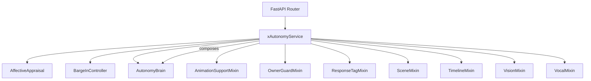
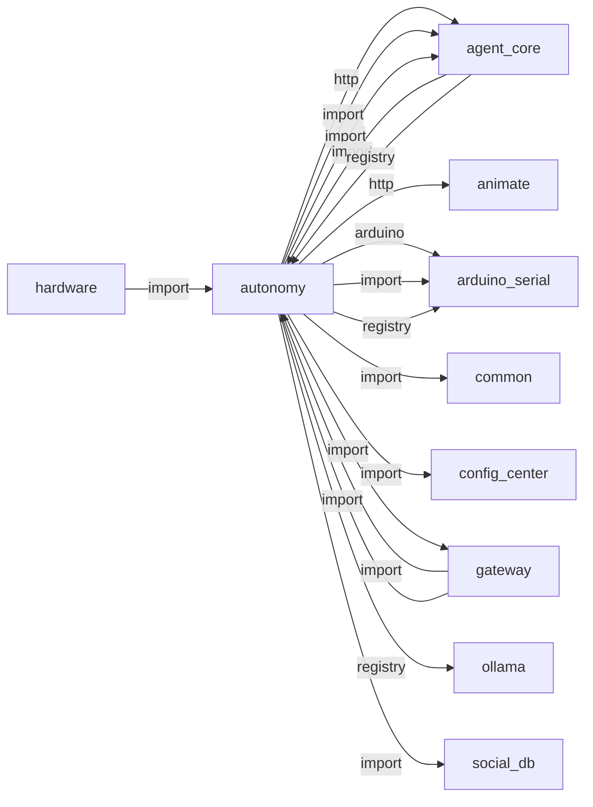
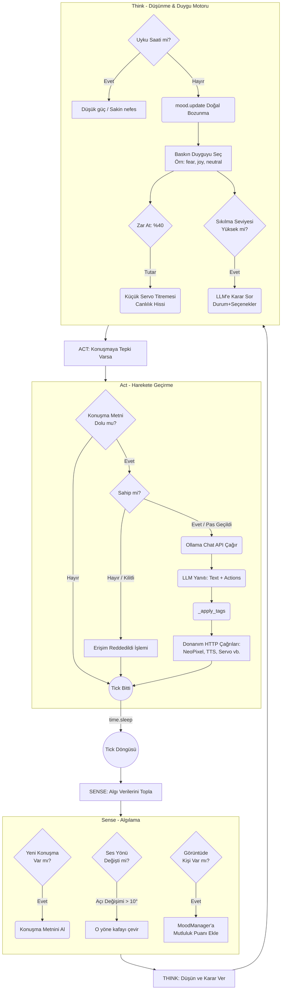

# autonomy

> **Sense-Think-Act beyin döngüsü, duygu motoru, LLM kararları**

## Kimlik
| Alan | Değer |
| --- | --- |
| Ana sınıf | `xAutonomyService` |
| Giriş noktası | `create_app()` |
| Orkestratör | `AutonomyBrain` |
| Ana dosya | `modules/autonomy/xAutonomyService.py` |
| Katman | Çekirdek |
| Port | — |
| Arduino | Evet |
| Sınıf sayısı | 47 |
| Endpoint sayısı | 8 |

## İsimlendirilmiş Bileşenler (Sınıflar)

#### `ActionPayload` — `modules/autonomy/api/router.py`
- **Görev:** —
- **Kalıtım:** BaseModel
- **Oluşturduğu bileşenler:** —
- **Metodlar:** —

#### `PaletteBody` — `modules/autonomy/api/router.py`
- **Görev:** —
- **Kalıtım:** BaseModel
- **Oluşturduğu bileşenler:** —
- **Metodlar:** —

#### `AffectiveAppraisal` — `modules/autonomy/services/affective_appraisal.py`
- **Görev:** Turns events into mood deltas and applies them to a mood manager.
- **Kalıtım:** —
- **Oluşturduğu bileşenler:** —
- **Metodlar:** `known_events()`, `appraise()`, `apply()`

#### `BargeInController` — `modules/autonomy/services/barge_in.py`
- **Görev:** —
- **Kalıtım:** —
- **Oluşturduğu bileşenler:** —
- **Metodlar:** `should_interrupt()`

#### `AutonomyBrain` — `modules/autonomy/services/brain.py`
- **Görev:** —
- **Kalıtım:** AnimationSupportMixin, TimelineMixin, OwnerGuardMixin, ResponseTagMixin, SceneMixin, VisionMixin, VocalMixin
- **Oluşturduğu bileşenler:** `MoodManager`, `AffectiveAppraisal`, `ServiceClient`, `ExpressionDirector`, `IdleBehaviorPlanner`, `ShortTermMemory`, `RelationshipMemory`, `CompanionRituals`, `ProactivePlanner`, `InteractionFeedbackLearner`, `BargeInController`, `LivelinessScheduler`, `Lock`, `AgentOrchestrator`
- **Metodlar:** `start()`, `stop()`, `interaction_occurred()`, `express()`, `appraise_event()`, `apply_llm_response()`, `update_palettes()`

#### `AnimationSupportMixin` — `modules/autonomy/services/brain_parts/animations.py`
- **Görev:** Provides reusable micro-movements and animation fallbacks.
- **Kalıtım:** —
- **Oluşturduğu bileşenler:** —
- **Metodlar:** —

#### `OwnerGuardMixin` — `modules/autonomy/services/brain_parts/owner_guard.py`
- **Görev:** Encapsulates owner scanning, permissions, and request throttling.
- **Kalıtım:** —
- **Oluşturduğu bileşenler:** —
- **Metodlar:** —

#### `ResponseTagMixin` — `modules/autonomy/services/brain_parts/responses.py`
- **Görev:** Sentry persona etiketlerini çözümleyip donanıma yönlendirir.
- **Kalıtım:** —
- **Oluşturduğu bileşenler:** —
- **Metodlar:** —

#### `SceneMixin` — `modules/autonomy/services/brain_parts/scenes.py`
- **Görev:** Runs small action timelines combining light/motion/speech.
- **Kalıtım:** —
- **Oluşturduğu bileşenler:** —
- **Metodlar:** —

#### `TimelineMixin` — `modules/autonomy/services/brain_parts/timeline.py`
- **Görev:** Keeps a lightweight daily journal of interactions.
- **Kalıtım:** —
- **Oluşturduğu bileşenler:** —
- **Metodlar:** —

#### `VisionMixin` — `modules/autonomy/services/brain_parts/vision.py`
- **Görev:** Handles periodic vision polling and reactions.
- **Kalıtım:** —
- **Oluşturduğu bileşenler:** —
- **Metodlar:** —

#### `VocalMixin` — `modules/autonomy/services/brain_parts/vocal.py`
- **Görev:** Adds speaking helpers that respect robot mood.
- **Kalıtım:** —
- **Oluşturduğu bileşenler:** —
- **Metodlar:** —

#### `ServiceClient` — `modules/autonomy/services/client.py`
- **Görev:** —
- **Kalıtım:** —
- **Oluşturduğu bileşenler:** —
- **Metodlar:** `move_head()`, `set_liveliness()`, `set_laser()`, `set_buzzer()`, `play_sound()`, `set_lcd()`, `set_stepper()`, `robot_command()`, `read_sensor()`, `system_control()`, `arduino_send()`, `animate_neopixel()`

#### `CompanionRituals` — `modules/autonomy/services/companion_rituals.py`
- **Görev:** Low-frequency social rituals to improve companion continuity.
- **Kalıtım:** —
- **Oluşturduğu bileşenler:** —
- **Metodlar:** `propose()`

#### `ExpressionDirector` — `modules/autonomy/services/expression_director.py`
- **Görev:** Coordinates eyes + LEDs + ears + head + voice for one emotion.
- **Kalıtım:** —
- **Oluşturduğu bileşenler:** —
- **Metodlar:** `express()`

#### `IdleAction` — `modules/autonomy/services/idle_behaviors.py`
- **Görev:** —
- **Kalıtım:** —
- **Oluşturduğu bileşenler:** —
- **Metodlar:** —

#### `IdleBehaviorPlanner` — `modules/autonomy/services/idle_behaviors.py`
- **Görev:** Weighted idle action planner with per-action cooldown.
- **Kalıtım:** —
- **Oluşturduğu bileşenler:** `Random`
- **Metodlar:** `pick()`, `stamp()`

#### `InteractionFeedbackLearner` — `modules/autonomy/services/interaction_feedback.py`
- **Görev:** —
- **Kalıtım:** —
- **Oluşturduğu bileşenler:** —
- **Metodlar:** `apply()`

#### `LivelinessScheduler` — `modules/autonomy/services/liveliness.py`
- **Görev:** —
- **Kalıtım:** —
- **Oluşturduğu bileşenler:** —
- **Metodlar:** `plan()`, `due()`, `mark_sent()`

#### `ShortTermMemory` — `modules/autonomy/services/memory.py`
- **Görev:** —
- **Kalıtım:** —
- **Oluşturduğu bileşenler:** —
- **Metodlar:** `add_event()`, `get_recent_events()`, `clear()`

#### `MoodManager` — `modules/autonomy/services/mood.py`
- **Görev:** —
- **Kalıtım:** —
- **Oluşturduğu bileşenler:** —
- **Metodlar:** `update()`, `modify()`, `get_dominant_emotion()`, `get_body_language_profile()`

#### `PreferenceLearner` — `modules/autonomy/services/preference_learner.py`
- **Görev:** —
- **Kalıtım:** —
- **Oluşturduğu bileşenler:** —
- **Metodlar:** `extract_facts()`, `extract_preferences()`

#### `ProactivePlanner` — `modules/autonomy/services/proactive_planner.py`
- **Görev:** Small rule-based planner for low-frequency companion proactivity.
- **Kalıtım:** —
- **Oluşturduğu bileşenler:** `Random`
- **Metodlar:** `propose()`

#### `RelationshipMemory` — `modules/autonomy/services/relationship_memory.py`
- **Görev:** Lightweight per-person social memory for companion behavior.
- **Kalıtım:** —
- **Oluşturduğu bileşenler:** —
- **Metodlar:** `observe_person()`, `add_chat()`, `top_people()`, `get()`, `last_user_utterance()`, `recall_candidates()`, `social_profile()`, `build_social_context()`

#### `xAutonomyService` — `modules/autonomy/xAutonomyService.py`
- **Görev:** —
- **Kalıtım:** —
- **Oluşturduğu bileşenler:** `AutonomyBrain`
- **Metodlar:** `start()`, `stop()`


## API — Endpoint → Handler → Servis

| HTTP | Path | Handler | Çağırdığı servis | Açıklama |
| --- | --- | --- | --- | --- |
| GET | `/state` | `get_state()` | — | Report that an interaction occurred (resets boredom timer) |
| POST | `/interaction` | `report_interaction()` | — | Report that an interaction occurred (resets boredom timer) |
| POST | `/apply_actions` | `apply_actions()` | — | — |
| GET | `/lights/palettes` | `list_palettes()` | — | — |
| POST | `/lights/palettes/{name}` | `set_palette()` | — | — |
| DELETE | `/lights/palettes/{name}` | `delete_palette()` | — | — |
| POST | `/start` | `start_brain()` | — | — |
| POST | `/stop` | `stop_brain()` | — | — |

## Config Bölümleri
- `defaults`
- `endpoints`
- `behaviors`
- `llm`
- `speech_quiet_hours`
- `barge_in`
- `liveliness`
- `offline_mode`
- `request_timeouts`
- `speech_reactions`
- `visual_state`
- `companion`
- `vision_hooks`
- `empathy`
- `scenes`
- `owner`

## Dış İlişkiler (Bu modül → diğerleri)

| Hedef modül | Bağlantı tipi | Detay | Neden |
| --- | --- | --- | --- |
| [[agent_core]] | http | calls path `/agent` | Üst seviye ajan orkestrasyonu ve tool-calling entegrasyonu. |
| [[agent_core]] | import | services | Üst seviye ajan orkestrasyonu ve tool-calling entegrasyonu. |
| [[agent_core]] | import | config_loader | Üst seviye ajan orkestrasyonu ve tool-calling entegrasyonu. |
| [[animate]] | http | calls path `/animate` | Duygu durumuna göre vücut animasyonu (stretch, sit, look_around) tetikler. |
| [[arduino_serial]] | arduino | Arduino serial / contract kullanımı | Karar sonrası servo/hareket komutlarını donanıma iletir. |
| [[arduino_serial]] | import | contract | Karar sonrası servo/hareket komutlarını donanıma iletir. |
| [[arduino_serial]] | registry | registry dependency: ollama, speak, vlm_bridge, arduino_serial | Karar sonrası servo/hareket komutlarını donanıma iletir. |
| [[common]] | import | emotion_vocab | `autonomy` → `common`: Kanonik duygu taksonomisi (tone/LED/yüz) için ortak sözlük. |
| [[config_center]] | import | log_redact | `autonomy` içinde `log_redact` import edilir; `config_center` modülünün yeteneğini kullanır (Merkezi config okuma/yazma, hot-reload). |
| [[gateway]] | import | url | `autonomy` içinde `url` import edilir; `gateway` modülünün yeteneğini kullanır (FastAPI API bootstrapper, tüm modülleri mount eder). |
| [[ollama]] | registry | registry dependency: ollama, speak, vlm_bridge, arduino_serial | Duygu motoru ve karar üretimi için yerel LLM'e sorar. |
| [[social_db]] | import | get_default | Kişi hafızası ve ilişki seviyelerini okur/günceller. |
| [[social_db]] | import | SocialDB | Kişi hafızası ve ilişki seviyelerini okur/günceller. |
| [[social_db]] | import | db | Kişi hafızası ve ilişki seviyelerini okur/günceller. |
| [[speak]] | import | services | Sense-Think-Act döngüsü LLM yanıtını seslendirmek için TTS çağırır. |
| [[speak]] | registry | registry dependency: ollama, speak, vlm_bridge, arduino_serial | Sense-Think-Act döngüsü LLM yanıtını seslendirmek için TTS çağırır. |
| [[speech]] | http | calls path `/speech/start` | `autonomy` HTTP ile `speech` modülüne erişir: Ses tanıma (ASR) pipeline'ına istek gönderir. |
| [[speech]] | http | calls path `/speech/stop` | `autonomy` HTTP ile `speech` modülüne erişir: Ses tanıma (ASR) pipeline'ına istek gönderir. |
| [[speech]] | import | services | `autonomy` içinde `services` import edilir; `speech` modülünün yeteneğini kullanır (Çok kanallı ASR, Vosk/Whisper, ses yönü (DOA)). |
| [[vlm_bridge]] | registry | registry dependency: ollama, speak, vlm_bridge, arduino_serial | Görsel bağlam ve yüz tanıma verisi alır. |
| [[wakeword]] | http | calls path `/wakeword/start` | `autonomy` gateway veya doğrudan HTTP ile `wakeword` API'sini çağırır (calls path `/wakeword/start`). |
| [[wakeword]] | http | calls path `/wakeword/stop` | `autonomy` gateway veya doğrudan HTTP ile `wakeword` API'sini çağırır (calls path `/wakeword/stop`). |

## Gelen İlişkiler (Diğerleri → bu modül)

| Kaynak modül | Bağlantı tipi | Detay | Neden |
| --- | --- | --- | --- |
| [[agent_core]] | import | services | Alt sistem olarak otonomi beyin döngüsünü tetikler. |
| [[agent_core]] | registry | registry dependency: ollama, autonomy | Alt sistem olarak otonomi beyin döngüsünü tetikler. |
| [[gateway]] | import | xAutonomyService | `gateway` kod içinde `autonomy` modülünü import eder (`xAutonomyService`) — Sense-Think-Act beyin döngüsü, duygu motoru, LLM kararları. |
| [[gateway]] | import | api | `gateway` kod içinde `autonomy` modülünü import eder (`api`) — Sense-Think-Act beyin döngüsü, duygu motoru, LLM kararları. |
| [[hardware]] | import | services | Sistem yükü verisini otonomi beyinine bildirir. |

## İç Mimari (otomatik çıkarım)



## Modül Etkileşim Haritası



### Mimari diyagram 1


### Mimari diyagram 2
```mermaid
classDiagram
    class AutonomyBrain {"+dict state<br>        +MoodManager mood<br>        +ServiceClient client<br>        +start<br>        +_loop<br>        +_sense<br>        +_think<br>        +_react_to_speech"}
    
    class VisionMixin {"+_poll_vision<br>        +_handle_vision_greeting"}
    
    class VocalMixin {"+_speak_with_mood_text<br>        +_apply_speech_tone"}
    
    class ResponsesMixin {"+_apply_llm_response_actions<br>        +_handle_lights_block<br>        +_resolve_emotion_palette"}
    
    class OwnerGuardMixin {"+check_owner_lock<br>        +temporarily_trust_user"}
    
    class TimelineMixin {"+_log_conversation<br>        +_build_timeline_summary"}
    
    class ServiceClient {"+move_head<br>        +chat<br>        +play_sound<br>        +... (25 metod)"}

    AutonomyBrain <|-- VisionMixin
    AutonomyBrain <|-- VocalMixin
    AutonomyBrain <|-- ResponsesMixin
    AutonomyBrain <|-- OwnerGuardMixin
    AutonomyBrain <|-- TimelineMixin
    AutonomyBrain *-- ServiceClient
```

---

# Tam Kaynak Arşivi

### `modules/autonomy/README.md` (124 satır)

```markdown
# Autonomy Module
 
 Bu modül, robotun "Live Mode" (Canlı Mod) davranışlarını yönetir. Robotun kendi kendine kararlar almasını, çevresine tepki vermesini ve bir "kişilik" sergilemesini sağlar.
 
 ## Özellikler
 - **Davranış Döngüsü (Behavior Loop):** Sürekli çalışan ve ne yapılması gerektiğine karar veren ana döngü.
 - **İç Durum (Internal State):** Mutluluk, Enerji, Merak, Korku gibi değişkenleri yöneten `MoodManager`.
 - **Algı Birleştirme (Perception Aggregation):** Mikrofon (yön ve metin) verilerini sürekli tarar (`_sense`).
 - **Görsel Farkındalık:** VLM Bridge sonuçlarını periyodik olarak çekerek ortamda bir kişi/nesne belirdiğinde merak ve mutluluğu günceller, gerekiyorsa kişi ile sohbet başlatır.
 - **Canlılık Belirtileri:**
  - **Mikro-hareketler:** Duyguya göre değişen küçük servo hareketleri (joy daha enerjik, tired daha sakin).
   - **Ses Takibi:** Ses gelen yöne otomatik kafa çevirme.
   - **Sıkılma:** Boşta kaldığında etrafı izleme, iç çekme veya monolog yapma.
  - **Idle Behavior Tree:** Boşta kalınca ağırlıklı davranış ağacı ile `look_around/blink/stretch/sigh/monologue` seçimi.
  - **Scene Orchestration:** Konuşma + ışık + hareket tek sahne akışında senkron yürütülür (özellikle VLM selamlamaları).
 - **Duygu Yayını:** `MoodManager` (HAPPINESS, ENERGY, CURIOSITY, FEAR) dominant duyguyu `state_manager` ve `interactions` modüllerine aktararak LED/palet ve diğer istemcilerle paylaşıyor.
- **Duygusal Işık Senkronizasyonu:** NeoPixel animasyonları artık robotun dominant duygusuna göre (`joy`, `sadness`, `fear` vb.) otomatik renk seçimi yapabiliyor.
- **Sistem-Genel Modül Kontrolü:** Ollama üzerinden gelen `system` aksiyonları ile `notifier`, `camera` gibi modüller çalışma esnasında durdurulup başlatılabilir.
- **Ses Tonu Çeşitliliği:** Mutluluk, yorgunluk, merak gibi duygulara göre TTS hız/volüm parametreleri otomatik ayarlanır.
- **Gece Konuşma Kısma:** Quiet-hours sırasında konuşma tonu otomatik olarak sakin moda alınır ve çok uzun cümleler kısaltılır.
 - **Zaman Çizgisi Hafızası:** Gün boyunca kişi ve sohbet sayılarını, ilginç soruları kaydeder; uykuya geçmeden önce kısa bir sözlü özet paylaşır.
 - **Dinamik Odak:** VLM Bridge yeni bir hareket/yüz gördüğünde kısa “focus” animasyonu ve LED olayı tetikler; animasyon servisi yoksa servo tabanlı küçük jest yapılır.
 - **Sahip Koruması:** `owner` konfigürasyonu aktifken robot esnek hitap biçimleriyle (Baba / Emir / WhoIsMrSentry) konuşur, sahibi görüşte değilse istekleri reddeder, RFID veya sözlü izin gelirse kısıtlamaları kaldırır, ısrarcı kişileri rapor eder, gerekirse geçici sahip atar ve Baba’yı aramak için kafasını sağ/sol tarar.
 - **LLM Karar Mekanizması:** Karmaşık durumlar için Ollama kullanarak karar verir.
 - **Animasyon Entegrasyonu:** Uygun olduğunda `animate` servisine hazır sekanslar gönderir, servis yoksa servo tabanlı fallback çalışır.
- **LLM Eylem İşleme:** Ollama'dan gelen yapılandırılmış JSON aksiyonları veya `[cmd:*]` etiketleri `ResponseTagMixin` ile çözümlenip donanım/sistem katmanına yönlendirilir.
 
 ## Yapı
 - `xAutonomyService.py`: Servis başlatıcı.
 - `services/brain.py`: Ana karar mekanizması, duyular ve davranışlar.
 - `services/mood.py`: Duygu durum yönetimi (decay ve update mantığı).
  - `services/client.py`: Diğer modüllerle (Speech, VLM, Arduino, Interactions, State Manager) iletişim.
  - `services/palette_store.py`: LED paletlerini `config.yml` üzerinde atomik biçimde güncelleyen yardımcı.

## Konfigürasyon
- `config/config.yml > endpoints`: Gateway üzerindeki servis URL’leri. Yeni varsayılanlar Speech, Interactions, State Manager ve Animate’i de içerir.
- `vision_hooks`: VLM Bridge entegrasyonu için periyot, kişi cooldown ve metin üretim ayarları.
  - `poll_interval_s`: Son sonuçların ne kadar sıklıkla okunacağı.
  - `person_cooldown_s`: Aynı kişi için tekrar selamlama gecikmesi.
  - `prefer_llm_greetings`: Tanınan kişilere kısa selamlama üretirken Ollama kullanılacak mı.
  - `speak_on_unknown`: `Unknown` kişilere de sözlü tepki ver.
- `owner`: Sahip kimliği ve güvenlik davranışları.
  - `addressing.affectionate|formal|handle` farklı bağlamlarda kullanılacak hitapları belirler.
  - `require_presence` true ise sahibi görülmeyince dış istekler reddedilir, `permission_grace_s` ile sözlü izin verilirse belirli süre boyunca uzak mod serbest bırakılır.
  - `restricted_keywords` hassas komutları listeler; Baba ortada yoksa veya yalnızca geçici sahip aktifse bu isteklere cevap verilmez.
  - `temporary` bloğu “`<isim> geçici sahip`” komutunu işler, süre (`duration_s`), tetiklenecek animasyon ve kapalı tutulacak özellikleri tanımlar. Sahip geri döndüğünde veya RFID onaylandığında geçici yetkiler sıfırlanır.
  - `rfid.endpoint` yetkilendirme API’sini gösterir; Gateway varsayılanı `http://localhost:8080/arduino/rfid/authorize` olup Arduino seri servisi son kart UID’sini kontrol eder ve `{"authorized": true}` dönerse `grace_s` kadar süreyle tüm kısıtlamalar açılır.
- `speech_quiet_hours`: Gece konuşma davranışı.
  - `enabled`: true ise etkin.
  - `start` / `end`: `HH:MM` formatında saat aralığı.
  - `tone`: konuşma isteğine tone verilmemişse varsayılan ton.
  - `max_chars`: konuşma metni üst sınırı (uzun metinler kısaltılır).
  - `prefix`: istenirse metin başına eklenecek kısa önek.
- `behaviors.idle_tree`: Boşta davranış planlayıcısı.
  - `enabled`: etkin/pasif.
  - `interval_s`: iki idle aksiyon arasındaki minimum aralık.
  - `fallback_to_llm`: planner uygun aksiyon bulamazsa LLM kararına düş.
  - `path`: idle davranış YAML dosyası yolu.
- `defaults.body_language.profiles`: dominant emotion -> mikro hareket profili (`pan_delta`, `tilt_delta`, `event`).
- `scenes`: Çok adımlı sahne tanımları (`event/effect/base/anim/head/speak/sleep`).
  - Varsayılan: `vision_greeting_known`, `vision_greeting_unknown`.
  - Segment adımları: `segment_fill` ve `segment_anim` ile göz/gövde ayrık tepkiler.
- `offline_mode`: LLM servisi geçici erişilemezse yerel fallback yanıtları.
  - `enabled`: etkin/pasif.
  - `availability_ttl_s`: servis erişilebilirlik sonucu kaç saniye cache edilecek.
  - `fallback_replies`: çevrimdışı durumda konuşulacak kısa cümleler.
  - `persona_replies`: dominant duyguya göre çevrimdışı cümle havuzu.

- `vision_hooks.focus`: vision odak jitter azaltma.
  - `jitter_min` / `jitter_max`: rastgele pan sapma aralığı.
  - `deadband_deg`: çok küçük hareketleri atla.
  - `smoothing`: hedef pan geçişini yumuşatma katsayısı.
- `vision_hooks.dynamic_cooldown`: mesafeye göre kişi tekrar selamlama cooldown'u.
  - Yakın kişilerde daha hızlı, uzak kişilerde daha yavaş tekrar selamlama.

- Cinematic scene seçimi:
  - owner -> `vision_greeting_owner`
  - known & close -> `vision_greeting_known_close`
  - known -> `vision_greeting_known`
  - unknown & close -> `vision_greeting_unknown_close`
  - unknown -> `vision_greeting_unknown`

### Idle Behavior Dosyası
`modules/autonomy/config/idle_behaviors.yml` içinde her aksiyon için ağırlık ve cooldown tanımlanır:

```yaml
actions:
  - name: LOOK_AROUND
    weight: 5
    min_interval_s: 6
  - name: MONOLOGUE
    weight: 1
    min_interval_s: 28
```

### Scene Örneği
`config.yml` içinde:

```yaml
scenes:
  vision_greeting_known:
    steps:
      - { type: effect, name: "COMET", duration_ms: 700 }
      - { type: anim, name: "vision_focus" }
      - { type: speak, text: "{greeting}", emotion: "joy" }
      - { type: base, name: "BREATHE", color: "#1E90FF" }
```

### LED Palet Yönetimi
- **Config bloğu:** `defaults.lights.palettes` altında RGB listeleri tutulur. `lights.default_mode` ile LED animasyon fallback’i belirlenir.
- **REST API:**
  - `GET  /autonomy/lights/palettes` → Tüm paletler.
  - `POST /autonomy/lights/palettes/{name}` body `{ "rgb": [r,g,b] }` → Ekle/güncelle.
  - `DELETE /autonomy/lights/palettes/{name}` → Paleti sil.
  İstek sonrası `brain.update_palettes()` çağrısı sayesinde servis yeniden başlatmadan yeni renkler kullanılabilir.
- **CLI:** `python -m modules.autonomy.tools.palette_cli list|set|remove` ile aynı işlemler komut satırından yapılabilir. Örnek: `python -m modules.autonomy.tools.palette_cli set sunset --hex ff9933`.

### LLM Eylem Webhook’u
`/autonomy/apply_actions` endpoint’i `{ text, actions, raw, speak }` gövdesini kabul eder. `actions` içinde `commands` veya `blocks` alanları varsa `ResponseTagMixin` bu veriyi servo/palet/event katmanına yönlendirir, `speak=true` ise temizlenmiş metin aynı akışta TTS’ye gönderilir. Ollama ve VLM Bridge konfiglerinde `actions.default_apply: true` ayarı aktifleştirildiğinde yanıtlar otomatik olarak bu endpoint’e post edilir.

### Sahip Komutları (Örnek)
- **Geçici sahip ata:** “`Ali adlı kişi geçici sahip`” → Ali’ye sınırlı yetki verilir.
- **Geçici yetki iptal:** “`Geçici yetki iptal`” → aktif geçici sahip temizlenir.
- **Uzak izin:** “`Sana izin veriyorum, cevap verebilirsin`” → `permission_grace_s` süresince Baba görünmese de sorulara yanıt verir.
```

### `modules/autonomy/__init__.py` (0 satır)

```python

```

### `modules/autonomy/api/router.py` (73 satır)

```python
from fastapi import APIRouter, HTTPException
from pydantic import BaseModel
from typing import Any, Dict, List

from ..services.brain import AutonomyBrain
from ..services import palette_store


class ActionPayload(BaseModel):
    text: str = ""
    actions: List[Dict[str, Any]] | None = None
    raw: str | None = None
    speak: bool = False


class PaletteBody(BaseModel):
    rgb: List[int]

def get_router(brain: AutonomyBrain) -> APIRouter:
    router = APIRouter(prefix="/autonomy", tags=["autonomy"])

    @router.get("/state")
    def get_state():
        return brain.state

    @router.post("/interaction")
    def report_interaction():
        """Report that an interaction occurred (resets boredom timer)"""
        brain.interaction_occurred(source="api")
        return {"status": "ok", "mood": int(brain.mood["happiness"])}

    @router.post("/apply_actions")
    def apply_actions(payload: ActionPayload):
        cleaned = brain.apply_llm_response(payload.text, payload.actions, payload.raw, speak=payload.speak)
        return {"ok": True, "text": cleaned}

    @router.get("/lights/palettes")
    def list_palettes():
        return {"ok": True, "items": palette_store.list_palettes()}

    @router.post("/lights/palettes/{name}")
    def set_palette(name: str, body: PaletteBody):
        if not name:
            raise HTTPException(status_code=400, detail="palette name required")
        try:
            palettes = palette_store.set_palette(name, body.rgb)
        except ValueError as exc:
            raise HTTPException(status_code=400, detail=str(exc)) from exc
        brain.update_palettes(palettes)
        return {"ok": True, "items": palettes}

    @router.delete("/lights/palettes/{name}")
    def delete_palette(name: str):
        if not name:
            raise HTTPException(status_code=400, detail="palette name required")
        try:
            palettes = palette_store.remove_palette(name)
        except KeyError:
            raise HTTPException(status_code=404, detail="palette not found")
        brain.update_palettes(palettes)
        return {"ok": True, "items": palettes}

    @router.post("/start")
    def start_brain():
        brain.start()
        return {"ok": True}

    @router.post("/stop")
    def stop_brain():
        brain.stop()
        return {"ok": True}

    return router
```

### `modules/autonomy/architecture_autonomy.md` (117 satır)

```markdown
# Autonomy (Brain) Modülü Mimarisi

Autonomy modülü (`modules/autonomy`), SentryBOT'un beyni olarak işlev gören en kritik modüldür. "Algıla -> Düşün -> Hareket Et" (Sense -> Think -> Act) döngüsünü sürekli çalıştırarak robotun yaşam belirtilerini (nefes alma, sıkılma), duygu durum değişikliklerini (MoodManager) ve kendisine yönelik dışarıdan gelen (ses, görüntü) komutlara vereceği tepkileri yönetir.

## 🏗️ İş Akışı ve Karar Mekanizmaları (Sense-Think-Act Döngüsü)


## 🔄 İlişkisel Etkileşimler (Mixin Mimarisi)

Autonomy modülü çok büyük olduğu için Python'un `Mixin` desenleriyle alt parçalara bölünmüştür:

```mermaid
classDiagram
    class AutonomyBrain {"+dict state<br>        +MoodManager mood<br>        +ServiceClient client<br>        +start<br>        +_loop<br>        +_sense<br>        +_think<br>        +_react_to_speech"}
    
    class VisionMixin {"+_poll_vision<br>        +_handle_vision_greeting"}
    
    class VocalMixin {"+_speak_with_mood_text<br>        +_apply_speech_tone"}
    
    class ResponsesMixin {"+_apply_llm_response_actions<br>        +_handle_lights_block<br>        +_resolve_emotion_palette"}
    
    class OwnerGuardMixin {"+check_owner_lock<br>        +temporarily_trust_user"}
    
    class TimelineMixin {"+_log_conversation<br>        +_build_timeline_summary"}
    
    class ServiceClient {"+move_head<br>        +chat<br>        +play_sound<br>        +... (25 metod)"}

    AutonomyBrain <|-- VisionMixin
    AutonomyBrain <|-- VocalMixin
    AutonomyBrain <|-- ResponsesMixin
    AutonomyBrain <|-- OwnerGuardMixin
    AutonomyBrain <|-- TimelineMixin
    AutonomyBrain *-- ServiceClient
```

## ⚙️ Detaylı Karar Mantığı (if/else ve Threshold'lar)

1. **Baskın Duygu Seçimi (MoodManager)**
   Dört sürekli duygu ekseni (0-100 değerleri): `happiness`, `energy`, `curiosity`, `fear`.
   - **`if`** `fear > 50`: Robot direkt korku moduna geçer (titreme animasyonu, kırmızı ışıklar).
   - **`elif`** `happiness > 70`: Mutlu (neopixel "joy" paleti, hızlı servo).
   - **`elif`** `happiness < 30`: Üzgün (neopixel "sadness" paleti, yavaş servo).
   - **`elif`** `curiosity > 80`: Robot sıkılmıştır, LLM agentic kararına düşer.
   - **`elif`** `energy < 20`: Yorgunluk modu başlar (yavaş nefes alma, esneme - `_stretch_fallback`).
   - **`else`**: Nötr/Normal mod (breathe animasyonu "neutral").
2. **Kişi Algılandığı Zaman (Vision_Mixin)**
   - **`if`** Sensör yeni bir isim okursa (`vision results`): `mood.happiness += 10`, `mood.energy += 10`. Bu geçici bir sevinç/canlanma katar.
   - Eğer kişi veritabanından tanınıyorsa (örn: "Ahmet"): TTS ile `"Hoşgeldin Ahmet"` sentezlenir.
3. **Sahip Kilit Sistemi (Owner_Guard_Mixin)**
   - Sistem config'de `require_owner` seçeneği varsa:
   - **`if`** Vision veya RFID ile Sahibin (`g_lastOwnerUid`) varlığı algılanmamışsa VEYA geçici süre (`timeout`) dolmuşsa:
     - Gelen konuşmaya yanıt üretilmez, TTS ile "Buna yetkim yok, sahibi bekliyorum" denir. Göz rengi kırmızı ("disapproval") paletinde yakılır.
4. **Agentic Karar Motoru (`_make_agentic_decision`)**
   - Robot belli bir süre boş kalırsa (`curiosity` çok yüksek seviyeye çıkarsa):
   - Arka planda LLM'e şu Prompt gönderilir: *"Robot boş kaldı, ne yapsın? Olası aksiyonlar: STRETCH, BLINK, SIGH, LOOK_AROUND, MONOLOGUE. Birini seç."*
   - Gelen yanıta göre bir `switch/case` (if/elif zinciri) işletilir:
     - Dönen yapı `STRETCH` ise -> Servo ile kollar ve baş esneme hareketi yapar.
     - Dönen yapı `SIGH` ise -> Kafa aşağı eğilir ve yavaş bir inleme sesi çıkarır.
     - Dönen yapı `MONOLOGUE` ise -> Ollama'dan kısa felsefi/komik bir kendi kendine konuşma cümlesi istenir ve TTS'e basılır.
```

### `modules/autonomy/config/appraisal.yml` (29 satır)

```yaml
# Affective appraisal rules: map a semantic event to mood-axis deltas.
#
# Axes: happiness, energy, curiosity, fear, anger (0-100).
# Deltas are scaled by an optional per-call intensity factor.
#
# This gives the robot *causal* emotion ("the user was rude -> anger") instead
# of pure time-based decay, so its feelings react to what actually happens.

rules:
  owner_returned:   { happiness: 22, anger: -12, fear: -10 }
  owner_left:       { happiness: -8, curiosity: 4 }
  greeted:          { happiness: 7 }
  user_praise:      { happiness: 18, anger: -10 }
  user_thanks:      { happiness: 12 }
  user_rude:        { anger: 32, happiness: -12 }
  user_insult:      { anger: 45, happiness: -18, fear: 6 }
  command_failed:   { anger: 12, fear: 6 }
  command_ok:       { happiness: 6, anger: -4 }
  owner_lockout:    { anger: 20, fear: 15, happiness: -10 }
  petted:           { happiness: 16, anger: -16, fear: -8 }
  loud_noise:       { fear: 22, anger: 5, energy: 6 }
  new_person:       { curiosity: 12, energy: 4 }
  scene_change:     { curiosity: 8 }
  darkness:         { fear: 8, energy: -6 }
  alone_too_long:   { happiness: -10, curiosity: 6 }
  played_with:      { happiness: 20, energy: 8, anger: -10 }
  rested:           { energy: 30, fear: -10 }

# Decay multipliers are handled by MoodManager; this file only defines events.
```

### `modules/autonomy/config/config.yml` (498 satır)

```yaml
defaults:
  loop_interval_ms: 500
  boredom_threshold_s: 20
  mood:
    decay_rate: 0.5
    anger_threshold: 38
    furious_threshold: 75
    initial_happiness: 50
    initial_energy: 100
    max_happiness: 100
    max_energy: 100
  body_language:
    profiles:
      joy: { pan_delta: 6, tilt_delta: 4, event: "autonomy.joy" }
      curiosity: { pan_delta: 8, tilt_delta: 3, event: "autonomy.curious" }
      fear: { pan_delta: 10, tilt_delta: 6, event: "autonomy.alert" }
      tired: { pan_delta: 2, tilt_delta: 2, event: "autonomy.tired" }
      sadness: { pan_delta: 3, tilt_delta: 5, event: "autonomy.sad" }
      neutral: { pan_delta: 4, tilt_delta: 3, event: "autonomy.neutral" }

  lights:
    default_mode: breathe
    palettes:
      calm_violet: [120, 80, 255]
      sunset_gold: [255, 170, 60]
      alert_red: [255, 45, 45]
      ocean_teal: [30, 180, 255]
      arctic_white: [255, 255, 255]
      forest_green: [60, 200, 90]
      ember_orange: [255, 110, 40]
      polar_blue: [90, 150, 255]

endpoints:
  arduino: "@gateway/arduino"
  neopixel: "@gateway/neopixel"
  speak: "@gateway/speak"
  ollama: "@gateway/ollama"
  speech: "@gateway/speech"
  interactions: "@gateway/interactions"
  oled_faces: "@gateway/oled_faces"
  state_manager: "@gateway/state"
  animate: "@gateway/animate"
  vlm: "@gateway/vlm"
  vision: "@gateway/vlm"
  camera: "@gateway/camera"
  notifier: "@gateway/notify"
  autonomy: "@gateway/autonomy"
  agent_core: "@gateway/agent"

behaviors:
  idle:
    enabled: true
    actions:
      - "look_around"
      - "blink"
      - "sigh"
      - "stretch"
      - "monologue"
  idle_tree:
    enabled: true
    interval_s: 6
    fallback_to_llm: true
    path: "modules/autonomy/config/idle_behaviors.yml"
  curiosity:
    enabled: true
    face_tracking: true
    sound_reaction: true
  sleep:
    enabled: true
    start_hour: 2
    end_hour: 7
    wake_up_action: "stretch"

llm:
  enabled: true
  model: "qwen3.5:9b"
  auto_select_persona: false
  warmup_on_start: true
  prompt_template: |
    Sen duyguları olan bir robotsun.
    
    Şu anki İç Durumun:
    - Mutluluk: {happiness}/100 (Düşükse üzgün, yüksekse neşeli)
    - Enerji: {energy}/100 (Düşükse uykulu/yorgun)
    - Sıkılma: {is_bored} (Evet ise ilgi istiyorsun)
    - Son Etkileşim: {last_interaction_ago} saniye önce
    - Saat: {time}

    GÖREV: Bu duruma uygun, çok kısa (maksimum 10 kelime) bir iç ses cümlesi kur.
    - Robotik değil, canlı bir karakter gibi konuş.
    - Sadece söyleyeceğin cümleyi yaz.

speech_quiet_hours:
  enabled: true
  start: "01:00"
  end: "05:00"
  tone: "calm"
  max_chars: 120
  prefix: ""

# Natural barge-in: let the user cut off the robot by speaking, not only via
# wakeword. A wakeword always interrupts; free speech needs `min_words`.
barge_in:
  enabled: true
  min_words: 2
  cooldown_s: 1.5

# Firmware-native idle liveliness (breathing / micro-motion on the head servos).
# The brain shapes amplitude/tempo from mood and only resends on change or every
# refresh_interval_s, so the serial link stays quiet.
liveliness:
  enabled: true
  amplitude_deg: 4.0        # base breathing amplitude (degrees)
  max_amplitude_deg: 12.0   # hard cap after emotion shaping
  period_ms: 4500           # base breathing period
  refresh_interval_s: 20.0  # resend keepalive even if params unchanged

offline_mode:
  enabled: true
  availability_ttl_s: 5
  fallback_replies:
    - "Su an baglanti zayif, ama seni dinliyorum."
    - "Cevap motoruna ulasamiyorum, kisa sure sonra tekrar deneyelim."
    - "Simdi yerel moddayim, yine de yanindayim."
  persona_replies:
    joy:
      - "Baglanti yok ama modum yerinde, devam edelim."
      - "Yerel moddayim ve enerjim yuksek, hazirim."
    curiosity:
      - "Baglanti kopuk, yine de seni anlamaya devam ediyorum."
      - "Cevap motoru yok ama merakim acik, devam et."
    tired:
      - "Biraz yavasim ama buradayim, baglanti gelir gelmez deneriz."
      - "Yerel moddayim, sakin ve yavas cevap verecegim."
    fear:
      - "Sistem baglantisi zayif, simdilik guvenli moddayim."
      - "Baglanti kararsiz, kontrollu hareket ediyorum."
    neutral:
      - "Su an yerel moddayim, yine de cevap verebilirim."
      - "Baglanti beklemede, ama ben buradayim."
  contextual_replies:
    question:
      - "Su an ag cevabi alamiyorum, ama sorunu not ettim."
      - "Bunu cevaplamak istiyorum; baglanti gelir gelmez tekrar deneyeyim."
    command:
      - "Komutu duydum, baglanti toparlaninca tam uygulayacagim."
      - "Simdilik yerel moddayim, temel tepkilerle devam ediyorum."
    greeting:
      - "Merhaba, baglanti olmasa da buradayim."
      - "Selam, yerel modda da seninleyim."
    generic:
      - "Baglanti gecici olarak yok, ama etkileşim devam ediyor."

request_timeouts:
  default_post_s: 1.0
  default_get_s: 0.8
  ollama_chat_s: 18.0
  ollama_warmup_s: 2.5
  speech_min_interval_s: 0.8

speech_reactions:
  excited_on_speech: false
  excited_on_praise: true
  excited_on_questions: false

visual_state:
  emotion_min_interval_s: 1.8
  default_lock_s: 2.4
  strong_lock_s: 4.8
  state_hold_s: 3.2
  strong_emotions: ["fear", "angry", "furious"]
  transition_graph:
    neutral: ["curiosity", "joy", "tired", "sad", "fear", "angry", "furious"]
    curiosity: ["joy", "neutral", "sad", "fear", "angry"]
    joy: ["neutral", "curiosity", "tired", "sad"]
    sad: ["neutral", "curiosity", "fear"]
    tired: ["neutral", "sad"]
    angry: ["neutral", "fear", "furious"]
    furious: ["angry", "fear", "neutral"]
    fear: ["neutral", "curiosity", "angry"]

companion:
  enabled: true
  relationship_memory_path: "modules/autonomy/data/relationship_memory.json"
  rituals:
    enabled: true
    morning_window_h: [6, 11]
    owner_return_min_absence_s: 180
    owner_return_cooldown_s: 300
  proactive:
    enabled: true
    cooldown_s: 75
    min_idle_s: 50
    max_per_hour: 4
    owner_only: false
    enable_callback_lines: true
    callback_min_trust: 0.2    # skip preference callbacks when trust is very low
    policy:
      owner_style: "warm"
      guest_style: "respectful"
  # Companion learning loop: extract prefs/facts, reinforce trust from praise/rude.
  learning:
    enabled: true
    feedback:
      enabled: true
      trust_min: 0.0
      trust_max: 1.0
      deltas:
        user_praise:
          trust: 0.08
          salience: 0.5
        user_rude:
          trust: -0.12
          salience: 0.55

vision_hooks:
  enabled: true
  poll_interval_s: 2
  max_results: 5
  person_cooldown_s: 25
  ignore_labels:
    - "chair"
    - "tv"
  prefer_llm_greetings: true
  speak_on_unknown: false
  importance_speak_threshold: 0.6
  focus:
    jitter_min: -3
    jitter_max: 3
    deadband_deg: 2
    smoothing: 0.55
  dynamic_cooldown:
    enabled: true
    near_distance_m: 1.2
    far_distance_m: 3.0
    near_multiplier: 0.6
    far_multiplier: 1.3
  empathy:
    enabled: true
    cooldown_s: 28
    mirror:
      - joy
      - sadness
      - fear
      - worried
    speak_on_mirror: true

empathy:
  enabled: true
  cooldown_s: 28

scenes:
  wakeword_reaction:
    steps:
      - { type: event, name: "scene.wakeword.start" }
      - { type: effect_burst, name: "TWINKLE", duration_ms: 120, count: 2, interval_ms: 60 }
      - { type: segment_anim, segment: "jewel", name: "TWINKLE", color: "#66E8FF", iterations: 1 }
      - { type: head, pan: 90, tilt: 88 }
      - { type: base, name: "BREATHE", color: "#1F4B66" }
      - { type: event, name: "scene.wakeword.end" }

  owner_return:
    steps:
      - { type: event, name: "scene.owner_return.start" }
      - { type: preset, name: "owner_welcome" }
      - { type: effect_burst, name: "COMET", duration_ms: 170, count: 3, interval_ms: 80 }
      - { type: anim, name: "owner_scan", speed: 1.0, loop: false }
      - { type: speak, text: "{nickname}, geri donmene sevindim.", emotion: "joy" }
      - { type: event, name: "scene.owner_return.end" }

  sleepy_entry:
    steps:
      - { type: event, name: "scene.sleepy_entry.start" }
      - { type: segment_fill, segment: "jewel", color: "#1A1D2B" }
      - { type: segment_fill, segment: "stick", color: "#090C14" }
      - { type: effect, name: "BREATHE", duration_ms: 900, force: false }
      - { type: head, pan: 90, tilt: 120 }
      - { type: speak, text: "Iyi geceler.", emotion: "tired" }
      - { type: event, name: "scene.sleepy_entry.end" }

  wake_entry:
    steps:
      - { type: event, name: "scene.wake_entry.start" }
      - { type: preset, name: "curious_scan" }
      - { type: effect_burst, name: "PULSE", duration_ms: 140, count: 2, interval_ms: 90 }
      - { type: anim, name: "stretch", speed: 1.0, loop: false }
      - { type: speak, text: "Gunaydin, hazirim.", emotion: "joy" }
      - { type: event, name: "scene.wake_entry.end" }

  curious_scan:
    steps:
      - { type: event, name: "scene.curious_scan.start" }
      - { type: preset, name: "curious_scan" }
      - { type: head, pan: 90, tilt: 88 }
      - { type: effect_burst, name: "TWINKLE", duration_ms: 100, count: 2, interval_ms: 70 }
      - { type: event, name: "scene.curious_scan.end" }

  vision_greeting_owner:
    steps:
      - { type: event, name: "scene.vision_owner.start" }
      - { type: preset, name: "owner_welcome" }
      - { type: effect_burst, name: "COMET", duration_ms: 180, count: 2, interval_ms: 90 }
      - { type: anim, name: "owner_scan", speed: 1.0, loop: false }
      - { type: speak, text: "Hos geldin {name}.", emotion: "joy" }
      - { type: event, name: "scene.vision_owner.end" }

  vision_greeting_known:
    steps:
      - { type: event, name: "scene.vision_greeting.start" }
      - { type: effect, name: "COMET", duration_ms: 700, force: false }
      - { type: segment_anim, segment: "jewel", name: "PULSE", color: "#00AAFF", iterations: 1 }
      - { type: anim, name: "vision_focus", speed: 1.0, loop: false }
      - { type: speak, text: "{greeting}", emotion: "joy" }
      - { type: segment_fill, segment: "stick", color: "#1E90FF" }
      - { type: base, name: "BREATHE", color: "#1E90FF" }
      - { type: event, name: "scene.vision_greeting.end" }

  vision_greeting_known_close:
    steps:
      - { type: event, name: "scene.vision_greeting.start" }
      - { type: effect, name: "RAINBOW_CYCLE", duration_ms: 700, force: false }
      - { type: effect_burst, name: "COMET", duration_ms: 140, count: 3, interval_ms: 70 }
      - { type: segment_anim, segment: "jewel", name: "COMET", color: "#00C8FF", iterations: 1 }
      - { type: head, pan: 90, tilt: 88 }
      - { type: speak, text: "{greeting}", emotion: "joy" }
      - { type: sleep, duration_ms: 120 }
      - { type: segment_fill, segment: "stick", color: "#1E90FF" }
      - { type: event, name: "scene.vision_greeting.end" }

  vision_greeting_unknown:
    steps:
      - { type: event, name: "scene.vision_greeting.start" }
      - { type: effect, name: "PULSE", duration_ms: 600, force: false }
      - { type: segment_anim, segment: "jewel", name: "TWINKLE", color: "#30E3CA", iterations: 1 }
      - { type: head, pan: 90, tilt: 92 }
      - { type: speak, text: "{greeting}", emotion: "curiosity" }
      - { type: segment_fill, segment: "stick", color: "#102A2A" }
      - { type: base, name: "BREATHE", color: "#30E3CA" }
      - { type: event, name: "scene.vision_greeting.end" }

  vision_greeting_unknown_close:
    steps:
      - { type: event, name: "scene.vision_greeting.start" }
      - { type: effect, name: "TWINKLE", duration_ms: 520, force: false }
      - { type: effect_burst, name: "TWINKLE", duration_ms: 130, count: 2, interval_ms: 70 }
      - { type: segment_anim, segment: "jewel", name: "TWINKLE", color: "#30E3CA", iterations: 2 }
      - { type: head, pan: 90, tilt: 95 }
      - { type: speak, text: "{greeting}", emotion: "curiosity" }
      - { type: segment_fill, segment: "stick", color: "#0C2020" }
      - { type: event, name: "scene.vision_greeting.end" }

  # Emotion scenes — map dominant emotion to visual + small head/anim cues
  emotion_joy:
    steps:
      - { type: event, name: "scene.emotion_joy.start" }
      - { type: preset, name: "emotion_joy" }
      - { type: effect_burst, name: "RAINBOW_CYCLE", duration_ms: 300, count: 2, interval_ms: 60 }
      - { type: anim, name: "look_around", speed: 1.0, loop: false }
      - { type: event, name: "scene.emotion_joy.end" }

  emotion_curiosity:
    steps:
      - { type: event, name: "scene.emotion_curiosity.start" }
      - { type: preset, name: "emotion_curiosity" }
      - { type: anim, name: "vision_focus", speed: 1.0, loop: false }
      - { type: effect, name: "COMET", duration_ms: 400 }
      - { type: event, name: "scene.emotion_curiosity.end" }

  emotion_fear:
    steps:
      - { type: event, name: "scene.emotion_fear.start" }
      - { type: preset, name: "emotion_fear" }
      - { type: head, pan: 90, tilt: 80 }
      - { type: effect, name: "PULSE", duration_ms: 450 }
      - { type: event, name: "scene.emotion_fear.end" }

  emotion_tired:
    steps:
      - { type: event, name: "scene.emotion_tired.start" }
      - { type: preset, name: "emotion_tired" }
      - { type: anim, name: "stretch", speed: 0.8, loop: false }
      - { type: head, pan: 90, tilt: 110 }
      - { type: event, name: "scene.emotion_tired.end" }

  emotion_sad:
    steps:
      - { type: event, name: "scene.emotion_sad.start" }
      - { type: preset, name: "emotion_sad" }
      - { type: effect, name: "PULSE", duration_ms: 600 }
      - { type: head, pan: 90, tilt: 100 }
      - { type: event, name: "scene.emotion_sad.end" }

  emotion_angry:
    steps:
      - { type: event, name: "scene.emotion_angry.start" }
      - { type: preset, name: "emotion_angry" }
      - { type: head, pan: 90, tilt: 105 }
      - { type: effect, name: "SOLID", color: "#FF0000" }
      - { type: event, name: "scene.emotion_angry.end" }

  emotion_furious:
    steps:
      - { type: event, name: "scene.emotion_furious.start" }
      - { type: preset, name: "emotion_furious" }
      - { type: head, pan: 90, tilt: 110 }
      - { type: effect_burst, name: "PULSE", duration_ms: 120, count: 4, interval_ms: 60 }
      - { type: effect, name: "SOLID", color: "#FF0000" }
      - { type: event, name: "scene.emotion_furious.end" }

  emotion_sadness:
    steps:
      - { type: event, name: "scene.emotion_sadness.start" }
      - { type: preset, name: "emotion_sadness" }
      - { type: effect, name: "PULSE", duration_ms: 600 }
      - { type: head, pan: 90, tilt: 100 }
      - { type: event, name: "scene.emotion_sadness.end" }

  emotion_love:
    steps:
      - { type: event, name: "scene.emotion_love.start" }
      - { type: preset, name: "emotion_love" }
      - { type: effect, name: "PULSE", duration_ms: 700, color: "#FF2864" }
      - { type: event, name: "scene.emotion_love.end" }

  emotion_surprise:
    steps:
      - { type: event, name: "scene.emotion_surprise.start" }
      - { type: preset, name: "emotion_surprise" }
      - { type: effect_burst, name: "TWINKLE", duration_ms: 150, count: 3, interval_ms: 70 }
      - { type: event, name: "scene.emotion_surprise.end" }

  emotion_excitement:
    steps:
      - { type: event, name: "scene.emotion_excitement.start" }
      - { type: preset, name: "emotion_excitement" }
      - { type: effect_burst, name: "RAINBOW_CYCLE", duration_ms: 200, count: 2, interval_ms: 80 }
      - { type: event, name: "scene.emotion_excitement.end" }

  emotion_bored:
    steps:
      - { type: event, name: "scene.emotion_bored.start" }
      - { type: preset, name: "emotion_bored" }
      - { type: head, pan: 88, tilt: 95 }
      - { type: effect, name: "BREATHE", duration_ms: 900, color: "#3C3C3C" }
      - { type: event, name: "scene.emotion_bored.end" }

  emotion_worried:
    steps:
      - { type: event, name: "scene.emotion_worried.start" }
      - { type: preset, name: "emotion_worried" }
      - { type: effect, name: "BREATHE", duration_ms: 800, color: "#B46400" }
      - { type: head, pan: 92, tilt: 98 }
      - { type: event, name: "scene.emotion_worried.end" }

  emotion_confusion:
    steps:
      - { type: event, name: "scene.emotion_confusion.start" }
      - { type: preset, name: "emotion_confusion" }
      - { type: effect, name: "TWINKLE", duration_ms: 500, color: "#A000C8" }
      - { type: head, pan: 85, tilt: 92 }
      - { type: event, name: "scene.emotion_confusion.end" }

  emotion_neutral:
    steps:
      - { type: event, name: "scene.emotion_neutral.start" }
      - { type: preset, name: "calm_idle" }
      - { type: effect, name: "BREATHE", duration_ms: 600, color: "#283C50" }
      - { type: event, name: "scene.emotion_neutral.end" }

owner:
  enabled: true
  name: "WhoIsMrSentry"
  # additional accepted owner aliases (case-insensitive)
  aliases:
    - "Emir"
    # removed legacy Khar language alias
  addressing:
    affectionate: "Baba"
    formal: "Emir"
    handle: "WhoIsMrSentry"
  presence_timeout_s: 45
  require_presence: false
  max_requests_without_owner: 3
  cooldown_s: 20
  speaker_window_s: 10
  polite_message: "Sahip yokken de isteğini yerine getirebilirim."
  angry_message: "Baba yokken beni zorlamanı istemiyorum."
  cooldown_message: "Baba gelene kadar konuşmak istemiyorum."
  greeting: "Baba! Geldiğine çok sevindim."
  restricted_keywords:
    - "format"
    - "kendini kapat"
    - "delete"
  # Note: Kharuun-specific irreversible triggers removed.
  rfid:
    endpoint: "@gateway/arduino/rfid/authorize"
    grace_s: 120
    poll_interval_s: 15
```

### `modules/autonomy/config/idle_behaviors.yml` (18 satır)

```yaml
actions:
  - name: LOOK_AROUND
    weight: 5
    min_interval_s: 6
  - name: BLINK
    weight: 4
    min_interval_s: 5
  - name: STRETCH
    weight: 2
    min_interval_s: 14
  - name: SIGH
    weight: 2
    min_interval_s: 14
    emotion_hint: tired
  - name: MONOLOGUE
    weight: 1
    min_interval_s: 28
    emotion_hint: neutral
```

### `modules/autonomy/config_loader.py` (15 satır)

```python
import os
import yaml

def load_config(overrides=None):
    config_path = os.path.join(os.path.dirname(__file__), "config", "config.yml")
    if not os.path.exists(config_path):
        return overrides or {}

    with open(config_path, "r", encoding="utf-8") as f:
        config = yaml.safe_load(f)

    if overrides:
        config.update(overrides)

    return config
```

### `modules/autonomy/services/affective_appraisal.py` (95 satır)

```python
"""Affective appraisal engine.

Maps *semantic events* (e.g. ``user_rude``, ``owner_returned``) onto mood-axis
deltas so the robot's feelings have causes rather than only time-based decay.

Rules are config-driven (``config/appraisal.yml``) and can be overridden by the
autonomy config under ``defaults.appraisal.rules``.
"""

from __future__ import annotations

import logging
from pathlib import Path
from typing import Any, Dict, Optional

import yaml

logger = logging.getLogger("autonomy.appraisal")

_CONFIG_PATH = Path(__file__).resolve().parent.parent / "config" / "appraisal.yml"

# Minimal built-in defaults so the engine works even without the YAML file.
_DEFAULT_RULES: Dict[str, Dict[str, float]] = {
    "owner_returned": {"happiness": 22, "anger": -12, "fear": -10},
    "user_praise": {"happiness": 18, "anger": -10},
    "user_rude": {"anger": 32, "happiness": -12},
    "command_failed": {"anger": 12, "fear": 6},
    "loud_noise": {"fear": 22, "anger": 5},
    "new_person": {"curiosity": 12},
    "petted": {"happiness": 16, "anger": -16},
}


class AffectiveAppraisal:
    """Turns events into mood deltas and applies them to a mood manager."""

    def __init__(self, config: Optional[Dict[str, Any]] = None) -> None:
        self.rules: Dict[str, Dict[str, float]] = dict(_DEFAULT_RULES)
        self._load_yaml_rules()
        # Allow an autonomy-config override to win over file/defaults.
        override = ((config or {}).get("defaults", {}) or {}).get("appraisal", {}) or {}
        file_rules = override.get("rules")
        if isinstance(file_rules, dict):
            self._merge_rules(file_rules)

    def _load_yaml_rules(self) -> None:
        try:
            with open(_CONFIG_PATH, "r", encoding="utf-8") as handle:
                data = yaml.safe_load(handle) or {}
            rules = data.get("rules")
            if isinstance(rules, dict):
                self._merge_rules(rules)
        except FileNotFoundError:
            logger.debug("appraisal.yml not found, using built-in defaults")
        except Exception as exc:
            logger.warning("failed to load appraisal rules: %s", exc)

    def _merge_rules(self, rules: Dict[str, Any]) -> None:
        for event, deltas in rules.items():
            if not isinstance(deltas, dict):
                continue
            clean = {}
            for axis, value in deltas.items():
                try:
                    clean[str(axis)] = float(value)
                except (TypeError, ValueError):
                    continue
            if clean:
                self.rules[str(event).strip().lower()] = clean

    def known_events(self):
        return sorted(self.rules.keys())

    def appraise(self, event: str, intensity: float = 1.0) -> Dict[str, float]:
        """Return scaled mood deltas for an event (empty dict if unknown)."""
        deltas = self.rules.get(str(event).strip().lower())
        if not deltas:
            return {}
        factor = max(0.0, float(intensity))
        return {axis: value * factor for axis, value in deltas.items()}

    def apply(self, mood: Any, event: str, intensity: float = 1.0) -> Optional[str]:
        """Apply an event's deltas to ``mood``; returns the event if it matched."""
        deltas = self.appraise(event, intensity)
        if not deltas:
            return None
        for axis, delta in deltas.items():
            try:
                mood.modify(axis, delta)
            except Exception:
                continue
        return str(event).strip().lower()


__all__ = ["AffectiveAppraisal"]
```

### `modules/autonomy/services/barge_in.py` (49 satır)

```python
"""Barge-in policy: decide when the user's voice should cut off the robot.

Historically the robot only stopped talking when it heard a wakeword. Natural
conversation also lets you interrupt mid-sentence just by starting to speak.
This controller centralises that decision so it can be unit-tested without any
audio hardware: given (is the robot currently talking?, what did the user say?),
it returns whether to interrupt — with a cooldown so a single utterance doesn't
trigger repeated stops.
"""

from __future__ import annotations

import time
from typing import Any, Dict, Optional


class BargeInController:
    def __init__(self, config: Optional[Dict[str, Any]] = None) -> None:
        cfg = config if isinstance(config, dict) else {}
        self.enabled = bool(cfg.get("enabled", True))
        # Wakeword always interrupts; free speech needs at least this many words
        # so coughs / one-word echoes don't constantly cut the robot off.
        self.min_words = int(cfg.get("min_words", 2))
        self.cooldown_s = float(cfg.get("cooldown_s", 1.5))
        self._last_interrupt_ts = 0.0

    def should_interrupt(
        self,
        *,
        robot_speaking: bool,
        user_text: str,
        has_wakeword: bool = False,
        now: Optional[float] = None,
    ) -> bool:
        if not self.enabled:
            return False
        if not robot_speaking:
            return False
        now = time.time() if now is None else now
        if (now - self._last_interrupt_ts) < self.cooldown_s:
            return False
        words = len(str(user_text or "").split())
        if has_wakeword or words >= self.min_words:
            self._last_interrupt_ts = now
            return True
        return False


__all__ = ["BargeInController"]
```

### `modules/autonomy/services/brain.py` (1241 satır)

```python
import threading
import time
import logging
import random
import datetime
import json
import uuid
from typing import List, Optional

from .client import ServiceClient
from .idle_behaviors import IdleBehaviorPlanner
from .mood import MoodManager
from .memory import ShortTermMemory
from .affective_appraisal import AffectiveAppraisal
from .expression_director import ExpressionDirector
from .companion_rituals import CompanionRituals
from .proactive_planner import ProactivePlanner
from .barge_in import BargeInController
from .liveliness import LivelinessScheduler
from .interaction_feedback import InteractionFeedbackLearner
from .relationship_memory import RelationshipMemory
from .brain_parts.animations import AnimationSupportMixin
from .brain_parts.owner_guard import OwnerGuardMixin
from .brain_parts.responses import ResponseTagMixin
from .brain_parts.scenes import SceneMixin
from .brain_parts.timeline import TimelineMixin
from .brain_parts.vision import VisionMixin
from .brain_parts.vocal import VocalMixin

try:
    from modules.speak.services.lang_detect import detect_text_language
except ImportError:
    detect_text_language = None

# Agent Core integration
try:
    from modules.agent_core.services.agent import AgentOrchestrator  # type: ignore
    _AGENT_CORE_AVAILABLE = True
except ImportError:
    _AGENT_CORE_AVAILABLE = False

logger = logging.getLogger("autonomy")

_PAUSED_OPERATIONAL = frozenset({"sleep", "maintenance", "paused", "off", "shutdown", "resting"})


class AutonomyBrain(
    AnimationSupportMixin,
    TimelineMixin,
    OwnerGuardMixin,
    ResponseTagMixin,
    SceneMixin,
    VisionMixin,
    VocalMixin,
):
    def __init__(self, config):
        self.config = config
        self.running = False
        self.thread = None

        # Components
        self.mood = MoodManager(config)
        self.appraisal = AffectiveAppraisal(config)
        self.client = ServiceClient(config.get("endpoints", {}), config=config)
        self.expression = ExpressionDirector(self.client)
        self.idle_planner = IdleBehaviorPlanner(config)
        self.memory = ShortTermMemory(max_items=20)
        companion_cfg = config.get("companion", {}) if isinstance(config.get("companion", {}), dict) else {}
        self.relationship_memory = RelationshipMemory(
            enabled=bool(companion_cfg.get("enabled", True)),
            path=str(companion_cfg.get("relationship_memory_path", "modules/autonomy/data/relationship_memory.json")),
        )
        self.companion_rituals = CompanionRituals(
            companion_cfg.get("rituals", {}) if isinstance(companion_cfg.get("rituals", {}), dict) else {}
        )
        self.proactive_planner = ProactivePlanner(companion_cfg.get("proactive", {}) if isinstance(companion_cfg.get("proactive", {}), dict) else {})
        learning_cfg = companion_cfg.get("learning", {}) if isinstance(companion_cfg.get("learning", {}), dict) else {}
        self.feedback_learner = InteractionFeedbackLearner(learning_cfg.get("feedback", learning_cfg))
        self.barge_in = BargeInController(config.get("barge_in", {}) if isinstance(config.get("barge_in", {}), dict) else {})
        self.liveliness = LivelinessScheduler(config.get("liveliness", {}) if isinstance(config.get("liveliness", {}), dict) else {})
        self._vision_cfg = config.get("vision_hooks", {})
        self.owner_cfg = config.get("owner", {})

        # Agent Core (advanced reasoning, tool-calling, planning)
        self.agent = None
        if _AGENT_CORE_AVAILABLE:
            try:
                from modules.agent_core.config_loader import load_config as load_agent_core_config  # type: ignore

                agent_cfg = load_agent_core_config()
                self.agent = AgentOrchestrator(agent_cfg, autonomy_client=self.client)
                llm_cfg = agent_cfg.get("llm", {}) if isinstance(agent_cfg.get("llm", {}), dict) else {}
                provider = str(llm_cfg.get("provider", "ollama"))
                model = str(agent_cfg.get("agent", {}).get("model", ""))
                logger.info(
                    "Agent Core integrated successfully (provider=%s model=%s).",
                    provider,
                    model,
                )
            except Exception as exc:
                logger.warning("Agent Core init failed (non-fatal): %s", exc)

        # State
        self.state = {
            "last_interaction": time.time(),
            "is_bored": False,
            "is_sleeping": False,
            "last_speech_text": "",
            "last_speech_time": 0,
            "last_speech_language": "tr",
            "current_pan": 90,
            "current_tilt": 90,
            "last_emotion": None,
            "last_vision_poll": 0.0,
            "owner_last_seen": 0.0,
            "owner_lockout_until": 0.0,
            "owner_last_greet": 0.0,
            "rfid_authorized_until": 0.0,
            "last_speaker": None,
            "persona_mode": None,
        }
        self._people_last_seen = {}
        self._last_emotion_sent = None
        self._current_people = {}
        self._attempt_log = []
        self._owner_report_pending = False
        self._llm_rate_limit_until = 0.0
        self._last_owner_scan = 0.0
        self._last_idle_action = 0.0
        self._reset_daily_timeline()
        self._speech_req_lock = threading.Lock()
        self._active_speech_req_id: str = ""
        self._speech_busy: bool = False
        self._speech_min_interval_s = float(self.config.get("request_timeouts", {}).get("speech_min_interval_s", 0.8))
        visuals_cfg = self.config.get("visual_state", {}) if isinstance(self.config.get("visual_state", {}), dict) else {}
        self._visual_emotion_min_interval_s = float(visuals_cfg.get("emotion_min_interval_s", 2.0))
        self._visual_lock_default_s = float(visuals_cfg.get("default_lock_s", 2.2))
        self._visual_lock_strong_s = float(visuals_cfg.get("strong_lock_s", 4.5))
        self._visual_state_hold_s = float(visuals_cfg.get("state_hold_s", 3.0))
        self._visual_strong_emotions = {
            str(x).strip().lower()
            for x in (visuals_cfg.get("strong_emotions", ["fear", "angry", "furious"]) or [])
            if str(x).strip()
        }
        graph_cfg = visuals_cfg.get("transition_graph", {}) if isinstance(visuals_cfg.get("transition_graph", {}), dict) else {}
        self._visual_transition_graph = {
            str(src).strip().lower(): [
                str(dst).strip().lower()
                for dst in (targets if isinstance(targets, list) else [])
                if str(dst).strip()
            ]
            for src, targets in graph_cfg.items()
            if str(src).strip()
        }
        self._last_emotion_sync_ts: float = 0.0
        self._visual_lock_until: float = 0.0
        self._visual_lock_reason: str = ""
        self._visual_state_emotion: str = "neutral"
        self._visual_state_since: float = time.time()

    def start(self):
        if self.running:
            return
        self.running = True

        auto_select_persona = bool(self.config.get("llm", {}).get("auto_select_persona", False))
        if auto_select_persona:
            try:
                self.client.select_persona("sentry")
            except Exception:
                logger.warning("Failed to select persona 'sentry'")

        if bool(self.config.get("llm", {}).get("warmup_on_start", True)):
            try:
                self.client.warmup_ollama()
            except Exception:
                pass

        # Start Agent Core subsystems (sensors, idle behaviors, memory)
        if self.agent:
            try:
                self.agent.start()
            except Exception as exc:
                logger.warning("Agent Core start failed (non-fatal): %s", exc)

        self.thread = threading.Thread(target=self._loop, daemon=True)
        self.thread.start()
        logger.info("Autonomy Brain started.")

    def stop(self):
        self.running = False
        if self.agent:
            try:
                self.agent.stop()
            except Exception:
                pass
        if self.thread:
            self.thread.join()
        logger.info("Autonomy Brain stopped.")

    def _loop(self):
        interval = self.config.get("defaults", {}).get("loop_interval_ms", 1000) / 1000.0
        while self.running:
            try:
                self._sense()
                self._think()
            except Exception as exc:
                logger.error("Error in autonomy loop: %s", exc)
            time.sleep(interval)

    def interaction_occurred(self, source=None):
        """External ping that resets boredom timer and nudges mood."""
        self.state["last_interaction"] = time.time()
        self.state["is_bored"] = False
        if source and str(source).lower() != "api":
            self.state["last_speaker"] = source
        self.mood.modify("happiness", 1)

    def _sense(self):
        """Poll sensors for new information."""
        self._sense_sound_direction()
        self._sense_speech_text()
        self._sense_vision()

    def _sense_sound_direction(self):
        try:
            direction = self.client.get_speech_direction()
            angle = (direction or {}).get("angle") if isinstance(direction, dict) else None
            if isinstance(angle, (int, float)) and abs(angle) > 10:
                    self._react_to_sound(angle)
        except Exception:
            pass

    def _companion_paused(self) -> bool:
        if bool(self.state.get("is_sleeping")):
            return True
        try:
            op = self.client.get_operational_mode()
            return str(op).strip().lower() in _PAUSED_OPERATIONAL
        except Exception:
            return False

    def _sense_speech_text(self):
        if self._companion_paused():
            return
        try:
            speech = self.client.get_last_speech()
            if speech and speech.get("final") and speech.get("text"):
                text = speech["text"]
                lang = str(speech.get("language") or self.state.get("last_speech_language") or "tr")
                elapsed = time.time() - self.state["last_speech_time"]
                if text != self.state["last_speech_text"] and elapsed > self._speech_min_interval_s:
                    if self._speech_busy:
                        return
                    self.state["last_speech_text"] = text
                    self.state["last_speech_time"] = time.time()
                    self.state["last_speech_language"] = lang
                    threading.Thread(
                        target=self._react_to_speech,
                        args=(text,),
                        kwargs={"source_lang": lang},
                        daemon=True,
                    ).start()
        except Exception:
            pass

    def _sync_emotion(self):
        dominant = self.mood.get_dominant_emotion()
        now = time.time()
        if not dominant:
            return
        target_emotion = self._select_visual_emotion(dominant)
        if target_emotion == self._last_emotion_sent:
            return
        if (now - self._last_emotion_sync_ts) < self._visual_emotion_min_interval_s:
            return
        self._last_emotion_sent = target_emotion
        self._last_emotion_sync_ts = now
        self.state["last_emotion"] = target_emotion
        self.client.update_emotions([target_emotion])
        self.client.push_interaction_event(f"emotion:{target_emotion}")
        self._apply_emotion_visual_state(target_emotion)
        # Try to run a matching scene for the dominant emotion (e.g. emotion_joy)
        try:
            scene_name = self._emotion_scene_name(target_emotion)
            ran = self._run_scene(scene_name, context={"emotion": target_emotion})
            if ran:
                # emit a scene-level interaction event for other subsystems
                try:
                    self.client.push_interaction_event(f"scene.{scene_name}")
                except Exception:
                    pass
        except Exception:
            logger.debug("Failed to run emotion scene %s", scene_name, exc_info=True)

    _EMOTION_SCENE_ALIASES = {
        "sadness": "emotion_sad",
        "anger": "emotion_angry",
    }

    @classmethod
    def _emotion_scene_name(cls, emotion: str) -> str:
        key = str(emotion or "neutral").strip().lower()
        return cls._EMOTION_SCENE_ALIASES.get(key, f"emotion_{key}")

    def express(self, emotion: str, *, say: Optional[str] = None, language: Optional[str] = None) -> str:
        """Deliberately express an emotion across all modalities at once.

        Use for reactive, intentional expressions (greetings, reactions). Passive
        mood-driven visuals continue to flow through ``_sync_emotion``.
        """
        head = None
        try:
            profile = self.mood.get_body_language_profile() or {}
            pan = int(self.state.get("current_pan", 90)) + int(profile.get("pan_delta", 0))
            tilt = int(self.state.get("current_tilt", 90))
            head = (max(0, min(180, pan)), max(0, min(180, tilt)))
        except Exception:
            head = None
        return self.expression.express(emotion, say=say, language=language, move_head=head)

    def appraise_event(self, event: str, intensity: float = 1.0, *, emit: bool = True) -> Optional[str]:
        """Apply a causal emotion event to mood and announce it.

        Returns the matched event name (or ``None`` if the event is unknown).
        """
        matched = self.appraisal.apply(self.mood, event, intensity)
        if not matched:
            return None
        try:
            self.memory.add_event(f"Felt a reaction to: {matched}")
        except Exception:
            pass
        if emit:
            try:
                self.client.push_interaction_event(f"appraisal:{matched}")
            except Exception:
                pass
        return matched

    @staticmethod
    def _sentiment_event_for_text(text: str) -> Optional[str]:
        """Very lightweight keyword sentiment -> appraisal event mapping."""
        low = str(text or "").lower()
        if not low:
            return None
        rude = ("aptal", "salak", "gerizekal", "kapa cen", "sus ", "stupid", "shut up", "idiot")
        praise = ("aferin", "harikasin", "cok iyi", "tesekkur", "sevimlisin", "seviyorum", "good job", "well done", "thank you", "i love you")
        if any(tok in low for tok in rude):
            return "user_rude"
        if any(tok in low for tok in praise):
            return "user_praise"
        return None

    def _maybe_emit_speech_excited(self, text: str, sentiment_event: Optional[str]) -> None:
        """Emit autonomy.excited only when configured — not on every utterance."""
        cfg = self.config.get("speech_reactions", {}) if isinstance(self.config.get("speech_reactions"), dict) else {}
        if sentiment_event == "user_praise" and cfg.get("excited_on_praise", True):
            self.client.push_interaction_event("autonomy.excited")
            return
        if cfg.get("excited_on_speech", False):
            self.client.push_interaction_event("autonomy.excited")
            return
        if cfg.get("excited_on_questions", False):
            low = str(text or "").lower()
            if "?" in text or any(w in low for w in ("nedir", "nasıl", "what", "who", "how")):
                self.client.push_interaction_event("autonomy.excited")

    _EMOTION_COMMAND_PHRASES = (
        ("anger", ("sinirlen", "sinirli ol", "kizgin ol", "kızgın ol", "ofkeli ol", "öfkeli ol", "angry ol", "sinirli")),
        ("furious", ("cok sinirli", "çok sinirli", "delir", "cildir", "öfke", "ofke")),
        ("joy", ("mutlu ol", "sevin", "neselen", "neşelen", "gul", "gül")),
        ("sadness", ("uzul", "üzül", "mutsuz ol", "uzgun ol", "üzgün ol")),
        ("fear", ("kork", "korkut", "korkma")),
        ("surprise", ("sasir", "şaşır", "saskin", "şaşkın")),
        ("bored", ("sikil", "sıkıl", "sikildim", "sıkıldım")),
        ("tired", ("yorul", "uyu", "uykum var")),
        ("love", ("beni sev", "askim ol", "aşkım ol")),
        ("excitement", ("heyecanlan", "heyecanli ol", "heyecanlı ol")),
        ("confusion", ("kafan karisik", "kafan karışık", "anlamadim", "anlamadım")),
        ("worried", ("endiselen", "endişelen", "kaygilan")),
        ("curiosity", ("merak et", "merakli ol")),
    )

    @classmethod
    def _emotion_command_for_text(cls, text: str) -> Optional[str]:
        low = str(text or "").lower().strip()
        if not low:
            return None
        for canon, phrases in cls._EMOTION_COMMAND_PHRASES:
            if any(p in low for p in phrases):
                return canon
        try:
            from modules.common.emotion_vocab import get_vocab

            vocab = get_vocab()
            for token in low.replace(",", " ").split():
                key = token.strip("!.?")
                if len(key) < 4:
                    continue
                canon = vocab.canonical(key)
                if canon not in {"neutral", "curiosity"}:
                    return canon
        except Exception:
            pass
        return None

    @staticmethod
    def _emotion_command_reply(canon: str, lang: str) -> str:
        tr_replies = {
            "anger": "Tamam, sinirliyim! Ne istiyorsun?",
            "furious": "Çok sinirliyim! Dikkat et!",
            "joy": "Harika, mutluyum!",
            "sadness": "Tamam... biraz üzgünüm.",
            "fear": "Korkuyorum...",
            "surprise": "Vay! Şaşırdım!",
            "bored": "Sıkıldım galiba.",
            "tired": "Yorgunum...",
            "love": "Seni de seviyorum!",
            "excitement": "Heyecanlandım!",
            "confusion": "Kafam karıştı...",
            "worried": "Biraz endişeliyim.",
            "curiosity": "Merak ettim!",
            "neutral": "Tamam.",
        }
        en_replies = {
            "anger": "Fine, I'm angry! What do you want?",
            "furious": "I'm furious! Watch out!",
            "joy": "I'm happy!",
            "neutral": "Okay.",
        }
        replies = tr_replies if str(lang or "tr").startswith("tr") else en_replies
        return replies.get(str(canon or "neutral"), replies.get("neutral", "Okay."))

    def _handle_emotion_command(self, text: str, lang: str) -> bool:
        cmd = self._emotion_command_for_text(text)
        if not cmd:
            return False
        mood_axis = {
            "anger": "anger",
            "furious": "anger",
            "joy": "happiness",
            "fear": "fear",
            "sadness": "sadness",
            "excitement": "happiness",
            "love": "happiness",
        }
        axis = mood_axis.get(cmd)
        if axis:
            self.mood.modify(axis, 40)
        reply = self._emotion_command_reply(cmd, lang)
        canon = self.express(cmd, say=reply, language=lang)
        self.state["last_emotion"] = canon
        self.client.update_emotions([canon])
        visual = self._normalize_emotion_name(canon)
        try:
            self._run_scene(f"emotion_{visual}", context={"emotion": canon})
        except Exception:
            pass
        self.memory.add_event(f"User asked me to express: {cmd}")
        logger.info("Emotion command handled: %s -> %s", text, canon)
        return True

    def _think(self):
        now = time.time()
        self._ensure_timeline_day()
        self._refresh_rfid_authorization()

        if self._companion_paused() and not self.state.get("is_sleeping"):
            try:
                op = self.client.get_operational_mode()
                if str(op).strip().lower() in _PAUSED_OPERATIONAL:
                    self.state["is_sleeping"] = str(op).strip().lower() == "sleep"
            except Exception:
                pass

        self._check_sleep_cycle()
        if self.state["is_sleeping"]:
            if random.random() < 0.1:
                self.client.set_neopixel("breathe", emotions=["neutral"], duration=2.0)
            return

        self.mood.update()
        self._sync_emotion()
        self._liveliness_tick(now)

        if random.random() < 0.4:
            self._perform_micro_movement()

        self._maybe_scan_for_owner()
        self._forward_visual_events_to_agent()

        boredom_threshold = self.config.get("defaults", {}).get("boredom_threshold_s", 20)
        time_since_interaction = now - self.state["last_interaction"]
        if time_since_interaction > boredom_threshold:
            if not self.state["is_bored"]:
                logger.info("Robot is bored.")
                self.state["is_bored"] = True
                self.mood.modify("curiosity", 10)
                self.memory.add_event("I became bored because nothing happened for a while.")
            idle_cfg = self.config.get("behaviors", {}).get("idle_tree", {})
            idle_interval = float(idle_cfg.get("interval_s", 6.0))
            if now - self._last_idle_action >= idle_interval:
                if self._run_idle_behavior(now):
                    self._last_idle_action = now
                elif bool(idle_cfg.get("fallback_to_llm", True)) and random.random() < 0.2:
                    self._make_agentic_decision()
        else:
            self.state["is_bored"] = False

        self._run_companion_rituals(now)
        self._run_companion_proactive(now)

    def _run_companion_rituals(self, now: float) -> None:
        if self._speech_busy:
            return
        owner_present = bool(self._owner_seen_recently()) if hasattr(self, "_owner_seen_recently") else False
        plan = self.companion_rituals.propose(
            now_ts=now,
            owner_present=owner_present,
            is_sleeping=bool(self.state.get("is_sleeping", False)),
        )
        if not plan:
            return
        text = str(plan.get("text", "")).strip()
        if not text:
            return
        emotion = str(plan.get("emotion", "joy")).strip()
        event = str(plan.get("event", "companion.ritual")).strip()
        self.client.push_interaction_event(event, {"text": text, "emotion": emotion})
        self._speak_with_mood(text, emotion=emotion)
        self.memory.add_event(f"Companion ritual: {text}")
        logger.info(
            "Companion ritual fired | event=%s emotion=%s text=%s",
            event,
            emotion,
            text,
        )

    def _run_companion_proactive(self, now: float) -> None:
        if self.state.get("is_sleeping"):
            return
        if self._speech_busy:
            return
        idle_s = max(0.0, now - float(self.state.get("last_interaction", now)))
        dominant = str(self.mood.get_dominant_emotion() or "neutral")
        speaker = str(self.state.get("last_speaker") or "")
        owner_present = bool(self._owner_seen_recently()) if hasattr(self, "_owner_seen_recently") else False
        social_profile = self.relationship_memory.social_profile(speaker) if speaker else {}
        scene_ctx = {
            "summary": str(self.state.get("scene_summary", "") or ""),
            "importance": float(self.state.get("scene_importance", 0.0) or 0.0),
            "unspoken": bool(self.state.get("scene_unspoken", False)),
        }
        plan = self.proactive_planner.propose(
            now_ts=now,
            idle_s=idle_s,
            dominant_emotion=dominant,
            last_speaker=speaker,
            owner_present=owner_present,
            social_profile=social_profile,
            scene=scene_ctx,
        )
        if not plan:
            return
        text = str(plan.get("text", "")).strip()
        if not text:
            return
        if plan.get("scene_consumed"):
            self.state["scene_unspoken"] = False
        emotion = str(plan.get("emotion", "curiosity")).strip()
        event = str(plan.get("event", "companion.proactive")).strip()
        self.client.push_interaction_event(event, {"text": text, "emotion": emotion})
        self._speak_with_mood(text, emotion=emotion)
        self.memory.add_event(f"Proactive companion line: {text}")
        logger.info(
            "Companion proactive fired | event=%s emotion=%s text=%s",
            event,
            emotion,
            text,
        )

    def _forward_visual_events_to_agent(self) -> None:
        """Forward key autonomy/vision signals to Agent Core event endpoint."""
        if not hasattr(self.client, "emit_agent_event"):
            return
        try:
            ctx_resp = self.client.get_visual_context()
            if not (isinstance(ctx_resp, dict) and ctx_resp.get("available")):
                return
            ctx = ctx_resp.get("context", {}) if isinstance(ctx_resp.get("context", {}), dict) else {}
            hazards = ctx.get("hazards", []) if isinstance(ctx.get("hazards", []), list) else []
            people = ctx.get("people", []) if isinstance(ctx.get("people", []), list) else []
            if hazards:
                self.client.emit_agent_event("hazard_detected", {"count": len(hazards)})
                return
            owner_seen = False
            new_people = 0
            for p in people:
                if not isinstance(p, dict):
                    continue
                lvl = int(p.get("recognition_level", 0) or 0)
                rel = str(p.get("relationship", "")).lower()
                if lvl >= 5 or rel == "owner":
                    owner_seen = True
                if lvl <= 1:
                    new_people += 1
            if owner_seen:
                self.client.emit_agent_event("owner_follow_intent", {})
            elif new_people > 0:
                self.client.emit_agent_event("new_person_seen", {"count": new_people})
            elif self.state.get("is_bored"):
                self.client.emit_agent_event("idle_comment_request", {"prompt": "look around and comment naturally"})
        except Exception:
            pass

    def _run_idle_behavior(self, now: float) -> bool:
        choice = self.idle_planner.pick(now=now)
        if choice is None:
            return False
        logger.info("Idle behavior selected: %s", choice.name)
        self.idle_planner.stamp(choice.name, now=now)
        self.memory.add_event(f"Idle action: {choice.name}")
        self._execute_action(choice.name)
        return True

    def _make_agentic_decision(self):
        """Ask LLM what to do based on internal state using the native tool loop."""
        if not self.config.get("llm", {}).get("enabled", False):
            return

        events = "\n".join(self.memory.get_recent_events())
        social_context = self.relationship_memory.build_social_context(
            current_speaker=str(self.state.get("last_speaker") or "")
        )
        prompt = (
            f"You are currently BORED and IDLE.\n"
            f"Internal State:\n"
            f"- Happiness: {int(self.mood['happiness'])}/100, Energy: {int(self.mood['energy'])}/100, Curiosity: {int(self.mood['curiosity'])}/100\n"
            f"Recent Events:\n{events}\n\n"
            f"{social_context}\n\n"
            f"Use your internal physical tools right now (such as looking around, playing an animation on OLED, "
            f"or changing body lights) to entertain yourself or find something interesting to do. Do not ask for permission."
        )

        try:
            if self.agent:
                self.agent.memory.remember("agentic_decision", "I got bored so I decided to act on my own.")
                res = self.agent.step(prompt)
                if res and res.get("text"):
                    self._speak_with_mood(res["text"])
            else:
                logger.warning("Agent Core is disabled. Cannot make native decision.")
        except Exception as exc:
            logger.error("Agentic decision failed natively: %s", exc)

    def _execute_action(self, action):
        if action == "LOOK_AROUND":
            if self._visual_lock_active():
                logger.debug("Skipping LOOK_AROUND due to visual lock: %s", self._visual_lock_reason)
                return
            self.client.push_interaction_event("autonomy.look_around")
            self._emit_idle_visuals("look_around")
            if not self._trigger_animation("look_around"):
                self._head_scan_fallback()
        elif action == "BLINK":
            if self._visual_lock_active():
                return
            # Always emit a visual event so LED/OLED can react even if
            # servo animation endpoint reports success while degrading.
            self.client.push_interaction_event("autonomy.blink")
            self._emit_idle_visuals("blink")
            if not self._trigger_animation("blink"):
                self._blink_fallback()
        elif action == "SIGH":
            self._speak_with_mood("Hıııh.", emotion="tired")
            self.client.push_interaction_event("autonomy.bored")
            self._emit_idle_visuals("bored")
        elif action == "STRETCH":
            if self._visual_lock_active():
                return
            self.client.push_interaction_event("autonomy.stretch")
            self._emit_idle_visuals("stretch")
            if not self._trigger_animation("stretch"):
                self._stretch_fallback()
        elif action == "MONOLOGUE":
            self.client.push_interaction_event("autonomy.monologue")
            self._emit_idle_visuals("monologue")
            self._generate_monologue()

    def _emit_idle_visuals(self, action: str) -> None:
        """Direct best-effort LED/OLED hints for idle actions.

        Interactions engine remains primary route, but this keeps visible
        feedback alive when interactions adapter/config is degraded.
        """
        key = str(action or "").strip().lower()
        if self._visual_lock_active():
            return
        neo_map = {
            "blink": "RANDOM_BLINK",
            "look_around": "COMET",
            "stretch": "WAVE",
            "bored": "PULSE",
            "monologue": "TWINKLE",
        }
        oled_anim_map = {
            "blink": "blink",
            "look_around": "scanning",
            "monologue": "thinking",
        }
        oled_bitmap_map = {
            "stretch": "look_up",
            "bored": "bored",
        }

        try:
            effect = neo_map.get(key)
            if effect:
                self.client.set_neopixel(effect)
        except Exception:
            pass

        try:
            anim = oled_anim_map.get(key)
            if anim:
                self.client.oled_anim(anim)
                return
            bmp = oled_bitmap_map.get(key)
            if bmp:
                self.client.oled_show(bmp)
        except Exception:
            pass

    @staticmethod
    def _normalize_emotion_name(emotion: str) -> str:
        e = str(emotion or "neutral").strip().lower()
        aliases = {
            "sadness": "sad",
            "anger": "angry",
            "tire": "tired",
            "anxious": "fear",
        }
        return aliases.get(e, e or "neutral")

    def _select_visual_emotion(self, dominant_emotion: str) -> str:
        now = time.time()
        candidate = self._normalize_emotion_name(dominant_emotion)
        current = self._normalize_emotion_name(self._visual_state_emotion)
        strong = self._visual_strong_emotions
        if not current:
            self._visual_state_emotion = candidate
            self._visual_state_since = now
            return candidate
        if candidate == current:
            return current
        if candidate in strong:
            self._visual_state_emotion = candidate
            self._visual_state_since = now
            return candidate
        if (now - self._visual_state_since) < max(0.1, self._visual_state_hold_s):
            return current
        allowed = self._visual_transition_graph.get(current, [])
        if allowed and candidate not in allowed:
            return current
        self._visual_state_emotion = candidate
        self._visual_state_since = now
        return candidate

    def _visual_lock_active(self) -> bool:
        return time.time() < float(self._visual_lock_until)

    # Emotions that warrant a longer visual hold (high-arousal states).
    _STRONG_VISUAL_EMOTIONS = {"fear", "furious", "anger", "surprise"}

    def _apply_emotion_visual_state(self, emotion: str) -> None:
        e = str(emotion or "neutral").strip().lower()
        # Resolve eyes + LED effect + colour from the single canonical vocabulary
        # so every emotion (incl. anger/furious/surprise) gets coherent visuals.
        try:
            from modules.common.emotion_vocab import emotion_render

            render = emotion_render(e)
            canon = render.canonical
            effect = render.effect
            oled = render.oled
            color = list(render.rgb)
        except Exception:
            canon, effect, oled, color = "neutral", "BREATHE", "normal", [120, 120, 140]

        strong = canon in self._STRONG_VISUAL_EMOTIONS
        lock_s = self._visual_lock_strong_s if strong else self._visual_lock_default_s
        self._visual_lock_until = max(self._visual_lock_until, time.time() + max(0.2, float(lock_s)))
        self._visual_lock_reason = f"emotion:{canon}"
        try:
            self.client.set_neopixel(effect, emotions=[canon], color=color)
        except Exception:
            pass
        try:
            self.client.oled_show(oled)
        except Exception:
            pass

    def _react_to_sound(self, angle):
        """Turn head towards sound source."""
        logger.info("Sound detected at %s", angle)
        offset = max(-70, min(70, angle))
        target_pan = max(0, min(180, 90 + offset))
        self.state["current_pan"] = target_pan
        ran = self._run_scene(
            "curious_scan",
            context={"angle": int(angle), "target_pan": int(target_pan)},
        )
        if not ran:
            self.client.queue_action("head_move", priority=60, payload={"pan": target_pan, "tilt": self.state["current_tilt"]})
        self.client.push_interaction_event("autonomy.excited")
        self.state["last_interaction"] = time.time()
        self.mood.modify("curiosity", 5)
        self.mood.modify("energy", 2)
        self.memory.add_event(f"Heard sound at angle {angle}")

    def _barge_in_stop_speaking(self) -> None:
        """Stop robot TTS so the user can speak (wakeword barge-in)."""
        try:
            if self.agent and hasattr(self.agent, "speech_arbiter"):
                self.agent.speech_arbiter.interrupt_all()
            else:
                self.client.stop_speaking()
                self.client.interrupt_agent_speech()
        except Exception as exc:
            logger.debug("barge-in stop failed: %s", exc)

    def _robot_is_speaking(self) -> bool:
        """Best-effort check of whether TTS audio is currently playing."""
        try:
            if self.agent and hasattr(self.agent, "speech_arbiter"):
                return bool(self.agent.speech_arbiter.is_speaking())
        except Exception:
            pass
        try:
            status = self.client.get_speak_status()
            if isinstance(status, dict):
                return bool(status.get("speaking") or status.get("busy"))
        except Exception:
            pass
        return False

    def _react_to_speech(self, text, source_lang: str | None = None):
        """React to heard text."""
        from modules.speech.services.wake_phrase import contains_wakeword, strip_wakewords

        low = str(text or "").lower()
        has_wake = contains_wakeword(low)
        # Natural barge-in: any meaningful utterance (not only a wakeword) cuts
        # off the robot if it's mid-sentence, like a real conversation.
        if self.barge_in.should_interrupt(
            robot_speaking=self._robot_is_speaking(),
            user_text=text,
            has_wakeword=has_wake,
        ):
            self._barge_in_stop_speaking()
        elif has_wake:
            self._barge_in_stop_speaking()

        request_id = uuid.uuid4().hex[:10]
        with self._speech_req_lock:
            self._active_speech_req_id = request_id
            self._speech_busy = True

        logger.info("Heard: %s", text)
        self.state["last_interaction"] = time.time()
        lang = str(source_lang or self.state.get("last_speech_language") or "tr")
        wake_only = len(strip_wakewords(low).split()) < 1 and contains_wakeword(low)
        if wake_only:
            self._run_scene("wakeword_reaction", context={"text": text})
            if len(strip_wakewords(low).split()) < 1:
                logger.info("Wakeword-only utterance; listening for command.")
                try:
                    self.client.start_speech_listening()
                except Exception:
                    pass
                with self._speech_req_lock:
                    if self._active_speech_req_id == request_id:
                        self._speech_busy = False
                return

        if self._handle_emotion_command(text, lang):
            with self._speech_req_lock:
                if self._active_speech_req_id == request_id:
                    self._speech_busy = False
            return

        self.mood.modify("happiness", 5)
        sentiment_event = self._sentiment_event_for_text(text)
        if sentiment_event:
            self.appraise_event(sentiment_event)
        self.memory.add_event(f"User said: {text}")
        self._log_conversation(text)
        speaker = self._guess_active_person()
        if speaker:
            self.state["last_speaker"] = speaker
            self._note_person_seen(speaker, emotion=str(self.state.get("last_emotion") or ""))
            self._remember_person_chat(speaker, text, role="user")
            if sentiment_event:
                self._apply_interaction_feedback(sentiment_event, speaker, text)

        self._maybe_emit_speech_excited(text, sentiment_event)

        blocked_response = self._maybe_block_request(text)
        if blocked_response:
            message, emotion = blocked_response
            self._speak_with_mood(message, emotion=emotion, language=lang)
            return

        if self._handle_owner_commands(text, speaker):
            return

        if self._features_locked_for_request(text):
            return

        if self._handle_follow_commands(text, speaker, lang):
            return

        is_question = "?" in text or any(
            key in text.lower() for key in ["nedir", "kimdir", "nasıl", "what", "who", "how"]
        )

        offline_cfg = self.config.get("offline_mode", {})
        if bool(offline_cfg.get("enabled", False)):
            target_service = "ollama"
            if not self.client.is_service_available(target_service):
                fallback = self._offline_reply(text, target_service)
                self.client.push_interaction_event("autonomy.offline", {"service": target_service})
                self._speak_with_mood(fallback, emotion="neutral", language=lang)
                self.memory.add_event(f"Offline fallback reply used for {target_service}: {fallback}")
                return

        response_text = ""
        response_actions = None
        raw_response = None
        try:
            # ── PRIMARY PATH: Agent Core (ReAct + Tool Calling + Safety) ──
            # Uses built-in ProgressManager + SpeechArbiter for staged
            # ack → progress → final lifecycle.  No manual _waiter thread
            # needed — agent.step() emits its own progress events.
            if self.agent:
                try:
                    # Wire SpeechArbiter speak_fn to autonomy's speak client
                    if not self.agent.speech_arbiter._speak_fn:
                        self.agent.speech_arbiter.set_speak_fn(
                            lambda text, tone=None, language=None: self.client.speak(
                                text, tone=tone, language=language or lang,
                            )
                        )

                    enriched_text = self._enrich_user_text_with_companion_context(text=text, speaker=speaker)
                    agent_result = self.agent.step(enriched_text, language=lang, speaker=speaker)
                    if agent_result and agent_result.get("text"):
                        if not self._is_active_request(request_id):
                            return
                        response_text = agent_result["text"]
                        # Actions are already executed by the agent pipeline
                        # (validated -> safety filtered -> routed -> HAL)
                        logger.info("Agent Core handled speech with full pipeline.")
                        self.memory.add_event(f"Agent replied: {response_text}")
                        self._remember_person_chat(speaker, response_text, role="assistant")
                        tone = self._tone_profile(
                            self.state.get("last_emotion") or self.mood.get_dominant_emotion()
                        )
                        self.agent.speech_arbiter.enqueue_final(
                            response_text, language=lang, tone=tone,
                        )
                        return
                except Exception as exc:
                    logger.warning("Agent Core step failed, falling back to direct LLM: %s", exc)

            # ── FALLBACK PATH: Direct Ollama (no tool-calling) ──
            logger.info("Routing to Ollama...")
            enriched_text = self._enrich_user_text_with_companion_context(text=text, speaker=speaker)
            resp = self.client.chat(
                enriched_text, source_lang=lang, response_lang=lang,
            )
            if resp and "answer" in resp:
                response_text = resp["answer"]
                response_actions = resp.get("actions")
                raw_response = resp.get("raw")
                trans = resp.get("translation") if isinstance(resp, dict) else None
                if isinstance(trans, dict) and trans.get("response_lang"):
                    lang = str(trans.get("response_lang"))

            if response_text:
                if not self._is_active_request(request_id):
                    return
                clean_text = self.apply_llm_response(response_text, response_actions, raw_response, speak=False)
                if clean_text:
                    if not self._is_active_request(request_id):
                        return
                    self._remember_person_chat(speaker, clean_text, role="assistant")
                    final_lang = lang
                    if detect_text_language:
                        final_lang = detect_text_language(clean_text, default=lang)
                    self._speak_with_mood(clean_text, language=final_lang)
                    logger.info("Reply: %s", clean_text)
                    self.memory.add_event(f"I replied: {clean_text}")
                else:
                    logger.info("LLM response only triggered physical actions.")
        except Exception as exc:
            logger.error("Failed to generate reply: %s", exc)
            # A failed reply both scares and frustrates the robot (causal appraisal).
            self.appraise_event("command_failed", emit=False)
            self.client.push_interaction_event("error", {"source": "ollama", "reason": "chat_failed"})
            self._apply_emotion_visual_state("fear")
        finally:
            with self._speech_req_lock:
                if self._active_speech_req_id == request_id:
                    self._speech_busy = False

    def _is_active_request(self, request_id: str) -> bool:
        with self._speech_req_lock:
            return self._active_speech_req_id == request_id

    def _apply_interaction_feedback(self, event: str, speaker: str, text: str) -> None:
        try:
            self.feedback_learner.apply(event, speaker, text=text)
        except Exception:
            pass

    def _remember_person_chat(self, speaker: str | None, text: str, role: str) -> None:
        person = str(speaker or "").strip()
        if not person or person.lower() == "unknown" or not text:
            return
        try:
            self.relationship_memory.add_chat(name=person, role=role, text=text)
        except Exception:
            pass
        try:
            self.client.append_person_chat(person=person, text=text, role=role)
        except Exception:
            pass

    def _enrich_user_text_with_companion_context(self, text: str, speaker: str | None) -> str:
        raw = str(text or "").strip()
        spk = str(speaker or "").strip()
        if not raw:
            return raw
        if not spk:
            return raw
        profile = self.relationship_memory.social_profile(spk)
        if not profile:
            return raw
        likes = profile.get("likes", []) if isinstance(profile.get("likes", []), list) else []
        topics = profile.get("topics", []) if isinstance(profile.get("topics", []), list) else []
        top_memory = str(profile.get("top_memory", "")).strip()
        hints = []
        trust = float(profile.get("trust_score", 0.0) or 0.0)
        if trust >= 0.7:
            hints.append("trust=high")
        elif trust <= 0.3:
            hints.append("trust=low")
        if likes:
            hints.append(f"likes={','.join([str(x) for x in likes[:3]])}")
        if topics:
            hints.append(f"topics={','.join([str(x) for x in topics[:3]])}")
        # Context-aware recall: surface the past snippet most relevant to what the
        # user is saying *now* (not just the highest-salience memory).
        recalled = ""
        try:
            from .recall import most_relevant

            candidates = self.relationship_memory.recall_candidates(spk)
            recalled = most_relevant(raw, candidates) or ""
        except Exception:
            recalled = ""
        if recalled:
            hints.append(f"recall={recalled[:90]}")
        elif top_memory:
            hints.append(f"memory={top_memory[:90]}")
        if not hints:
            return raw
        enriched = f"{raw}\n\n[CompanionContext speaker={spk}] {', '.join(hints)}"
        logger.info(
            "Companion context injected | speaker=%s hints=%s",
            spk,
            ", ".join(hints),
        )
        try:
            self.client.push_interaction_event("companion.context_injected", {"speaker": spk})
        except Exception:
            pass
        return enriched

    def _note_person_seen(self, name: str, emotion: str = "") -> None:
        person = str(name or "").strip()
        if not person or person.lower() == "unknown":
            return
        try:
            self.relationship_memory.observe_person(
                name=person,
                is_owner=bool(self._is_owner_name(person)) if hasattr(self, "_is_owner_name") else False,
                emotion=emotion,
            )
        except Exception:
            pass

    def _handle_follow_commands(self, text: str, speaker: str | None, language: str) -> bool:
        low = str(text or "").lower()
        stop_tokens = [
            "takibi bırak",
            "takibi birak",
            "beni takip etmeyi bırak",
            "beni takip etmeyi birak",
            "takipten çık",
            "takipten cik",
            "takibi durdur",
        ]
        start_tokens = [
            "beni takip et",
            "beni izle",
            "yüzümü takip et",
            "yuzumu takip et",
        ]

        if any(token in low for token in stop_tokens):
            result = self.client.stop_face_follow()
            ok = bool(isinstance(result, dict) and result.get("ok", False))
            message = "Yüz takibini durdurdum." if ok else "Yüz takibini şu an durduramıyorum."
            self._speak_with_mood(message, emotion="neutral", language=language)
            self.memory.add_event("Face follow stopped by voice command.")
            return True

        if any(token in low for token in start_tokens):
            target = None
            if speaker and str(speaker).strip() and str(speaker).strip().lower() != "unknown":
                target = str(speaker).strip()
            elif self.state.get("last_speaker") and str(self.state.get("last_speaker")).lower() != "unknown":
                target = str(self.state.get("last_speaker")).strip()

            result = self.client.start_face_follow(person=target)
            ok = bool(isinstance(result, dict) and result.get("ok", False))
            if ok:
                if target:
                    message = f"Tamam {target}, yüzünden takip modunu açtım."
                else:
                    message = "Yüz takibini açtım, seni kilitleyince takip edeceğim."
                self.memory.add_event(f"Face follow started. target={target or 'auto'}")
                self._speak_with_mood(message, emotion="joy", language=language)
            else:
                self._speak_with_mood("Yüz takibini şu an başlatamıyorum.", emotion="neutral", language=language)
            return True

        return False

    def _offline_reply(self, text: str, service: str) -> str:
        cfg = self.config.get("offline_mode", {})
        context = self._offline_context_label(text)
        contextual = cfg.get("contextual_replies", {}) if isinstance(cfg.get("contextual_replies", {}), dict) else {}
        ctx_pool = contextual.get(context)
        if isinstance(ctx_pool, list) and ctx_pool:
            return str(random.choice(ctx_pool))
        persona = cfg.get("persona_replies", {}) if isinstance(cfg.get("persona_replies", {}), dict) else {}
        mood_key = str(self.mood.get_dominant_emotion() or "neutral")
        mood_replies = persona.get(mood_key)
        if isinstance(mood_replies, list) and mood_replies:
            return str(random.choice(mood_replies))
        neutral_replies = persona.get("neutral")
        if isinstance(neutral_replies, list) and neutral_replies:
            return str(random.choice(neutral_replies))
        replies: List[str] = cfg.get("fallback_replies", []) if isinstance(cfg.get("fallback_replies", []), list) else []
        if replies:
            return str(random.choice(replies))
        if "?" in str(text):
            return "Su an baglanti yok, ama birazdan tekrar deneyebilirim."
        return f"Su an {service} ulasilamiyor, yine de buradayim."

    @staticmethod
    def _offline_context_label(text: str) -> str:
        t = str(text or "").strip().lower()
        if not t:
            return "generic"
        if "?" in t:
            return "question"
        if any(k in t for k in ["merhaba", "selam", "hey", "gunaydin", "iyi aksamlar"]):
            return "greeting"
        if any(k in t for k in ["yap", "ac", "kapat", "calistir", "dur", "git", "don"]):
            return "command"
        return "generic"

    def apply_llm_response(
        self,
        text: str,
        actions: dict | None = None,
        raw_text: str | None = None,
        speak: bool = False,
    ) -> str:
        """Harici modüllerin persona etiketlerini işletmesine izin ver."""
        clean = self._handle_llm_actions(text or "", actions, raw_text)
        if speak and clean:
            self._speak_with_mood(clean)
        return clean

    def update_palettes(self, palettes: dict[str, list[int]]) -> None:
        """Refresh in-memory palette cache after config edits."""
        defaults = self.config.setdefault("defaults", {})
        lights = defaults.setdefault("lights", {})
        lights["palettes"] = dict(palettes)

    def _check_sleep_cycle(self):
        sleep_cfg = self.config.get("behaviors", {}).get("sleep", {})
        if not sleep_cfg.get("enabled", False):
            return

        hour = datetime.datetime.now().hour
        start = sleep_cfg.get("start_hour", 23)
        end = sleep_cfg.get("end_hour", 7)

        if start > end:
            should_sleep = hour >= start or hour < end
        else:
            should_sleep = start <= hour < end

        if should_sleep and not self.state["is_sleeping"]:
            logger.info("Going to sleep...")
            self._deliver_timeline_summary()
            self.state["is_sleeping"] = True
            self.memory.add_event("Going to sleep now.")
            self.client.push_interaction_event("autonomy.sleep")
            ran = self._run_scene("sleepy_entry", context={"hour": hour})
            if not ran:
                self.client.queue_action("head_move", priority=70, payload={"pan": 90, "tilt": 120})
                self._speak_with_mood("İyi geceler.", emotion="tired")
            self.client.set_speech_tracking(False)

        elif not should_sleep and self.state["is_sleeping"]:
            logger.info("Waking up!")
            self.state["is_sleeping"] = False
            self.memory.add_event("Waking up from sleep.")
            self.mood.modify("energy", 100)
            self.client.push_interaction_event("autonomy.wake")
            if not self._run_scene("wake_entry", context={"hour": hour}):
                self._speak_with_mood("Günaydın.", emotion="joy")
            self.client.set_speech_tracking(True)
```

### `modules/autonomy/services/brain_parts/__init__.py` (1 satır)

```python
"""Helper mixins for AutonomyBrain sub-systems."""
```

### `modules/autonomy/services/brain_parts/animations.py` (128 satır)

```python
"""Head animation helpers for AutonomyBrain."""
from __future__ import annotations

import random
import time


class AnimationSupportMixin:
    """Provides reusable micro-movements and animation fallbacks."""

    def _perform_micro_movement(self) -> None:
        """Subtle servo movements to simulate breathing/aliveness."""
        profile = {}
        if hasattr(self, "mood") and hasattr(self.mood, "get_body_language_profile"):
            profile = self.mood.get_body_language_profile() or {}
        pan_delta = max(1, int(profile.get("pan_delta", 4)))
        tilt_delta = max(1, int(profile.get("tilt_delta", 3)))

        center_pan = int(self.state.get("current_pan", 90))
        center_tilt = int(self.state.get("current_tilt", 90))
        target_pan = max(45, min(135, center_pan + random.randint(-pan_delta, pan_delta)))
        target_tilt = max(65, min(125, center_tilt + random.randint(-tilt_delta, tilt_delta)))

        self.state["current_pan"] = target_pan
        self.state["current_tilt"] = target_tilt
        self.client.move_head(target_pan, target_tilt)

        evt = profile.get("event")
        if isinstance(evt, str) and evt and random.random() < 0.18:
            self.client.push_interaction_event(evt)

        # Layer subtle eye + ear life on top of head motion for richer liveliness.
        if random.random() < 0.25:
            self._perform_eye_saccade()
        if random.random() < 0.2:
            self._perform_ear_micromovement()

    def _liveliness_tick(self, now: float) -> None:
        """Push mood-shaped idle motion down to firmware-native liveliness.

        Best-effort and rate-limited by the scheduler; suppressed while the robot
        is talking, following a target, or asleep so it never fights deliberate
        motion.
        """
        sched = getattr(self, "liveliness", None)
        if sched is None or not getattr(sched, "enabled", False):
            return
        if getattr(self, "_speech_busy", False):
            return
        if self.state.get("follow_active") or self.state.get("is_sleeping"):
            return
        energy = 50.0
        dominant = "neutral"
        try:
            energy = float(self.mood["energy"])
        except Exception:
            pass
        try:
            dominant = self.mood.get_dominant_emotion() or "neutral"
        except Exception:
            pass
        params = sched.plan(energy=energy, dominant_emotion=dominant)
        if not sched.due(now, params):
            return
        pan = int(self.state.get("current_pan", 90))
        tilt = int(self.state.get("current_tilt", 90))
        try:
            self.client.set_liveliness(
                True,
                mode=params["mode"],
                amplitude_deg=params["amplitude_deg"],
                period_ms=params["period_ms"],
                pan_center=pan,
                tilt_center=tilt,
            )
            sched.mark_sent(now, params)
        except Exception:
            pass

    def _perform_eye_saccade(self) -> None:
        """Briefly dart the eyes to a random gaze direction."""
        gaze = random.choice(
            ["look_left", "look_right", "look_up", "look_down", "wink", "wink_left", "wink_right", "blink", "double_blink"]
        )
        try:
            self.client.push_interaction_event(f"gesture:{gaze}")
        except Exception:
            pass

    def _perform_ear_micromovement(self) -> None:
        """Nudge the ears toward the current mood pose for ambient liveliness."""
        dominant = "neutral"
        if hasattr(self, "mood") and hasattr(self.mood, "get_dominant_emotion"):
            try:
                dominant = self.mood.get_dominant_emotion() or "neutral"
            except Exception:
                dominant = "neutral"
        try:
            self.client.push_interaction_event(f"emotion:{dominant}")
        except Exception:
            pass

    def _trigger_animation(self, name: str, speed: float = 1.0, loop: bool = False) -> bool:
        resp = self.client.run_animation(name, speed=speed, loop=loop)
        return bool(resp and resp.get("ok"))

    def _head_scan_fallback(self) -> None:
        pan = random.randint(60, 120)
        tilt = random.randint(70, 110)
        self.state["current_pan"] = pan
        self.state["current_tilt"] = tilt
        self.client.move_head(pan, tilt)

    def _stretch_fallback(self) -> None:
        self.client.move_head(45, 130)
        time.sleep(1)
        self.client.move_head(135, 130)
        time.sleep(1)
        self.client.move_head(90, 90)

    def _blink_fallback(self) -> None:
        self.client.push_interaction_event("autonomy.blink")

    def _perform_owner_scan(self) -> None:
        sweep = [60, 120, 90]
        for pan in sweep:
            self.client.move_head(pan, self.state["current_tilt"])
            time.sleep(0.2)
```

### `modules/autonomy/services/brain_parts/owner_guard.py` (220 satır)

```python
"""Owner presence and authority guard logic."""
from __future__ import annotations

import time
from typing import Any, Dict


class OwnerGuardMixin:
    """Encapsulates owner scanning, permissions, and request throttling."""

    def _maybe_scan_for_owner(self) -> None:
        if not self.owner_cfg.get("enabled"):
            return
        if self._has_full_owner_authority():
            return
        now = time.time()
        interval = self.owner_cfg.get("scan_interval_s", 25)
        if now - self._last_owner_scan < interval:
            return
        self._last_owner_scan = now
        self.client.push_interaction_event("owner.scan")
        if not self._trigger_animation("owner_scan"):
            self._perform_owner_scan()

    def _refresh_rfid_authorization(self) -> None:
        rfid_cfg = self.owner_cfg.get("rfid", {})
        endpoint = rfid_cfg.get("endpoint")
        if not endpoint:
            return
        now = time.time()
        poll_interval_s = float(rfid_cfg.get("poll_interval_s", 5.0))
        last_check = float(self.state.get("rfid_last_check", 0.0) or 0.0)
        if poll_interval_s > 0 and (now - last_check) < poll_interval_s:
            return
        self.state["rfid_last_check"] = now
        if self._owner_seen_recently():
            return
        if self._rfid_active():
            return
        if self.client.check_rfid(endpoint):
            grace = rfid_cfg.get("grace_s", 120)
            self.state["rfid_authorized_until"] = time.time() + grace
            self.client.push_interaction_event("owner.rfid")
            self.memory.add_event("RFID ile yetkilendirildi.")

    def _address_owner(self, style: str = "formal") -> str:
        mapping = self.owner_cfg.get("addressing", {})
        fallback = self.owner_cfg.get("name", "Sahibim")
        return mapping.get(style) or mapping.get("formal") or fallback

    def _features_locked_for_request(self, text: str) -> bool:
        if not text:
            return False
        if self._has_full_owner_authority():
            return False
        keywords = self.owner_cfg.get("restricted_keywords") or []
        lowered = text.lower()
        if any(k.lower() in lowered for k in keywords if k):
            alias = self._address_owner("affectionate")
            message = f"{alias} yokken bunu yapamam."
            self._speak_with_mood(message, emotion="fear")
            self.client.push_interaction_event("owner.locked")
            self.memory.add_event(f"Blocked sensitive request: {text}")
            return True
        return False

    def _handle_owner_commands(self, text: str, speaker: str | None) -> bool:
        # Delegation is intentionally disabled: owner cannot transfer authority
        # to a third person via voice commands.
        return False

    def _owner_guard_enabled(self) -> bool:
        return bool(self.owner_cfg.get("enabled") and self.owner_cfg.get("require_presence", True))

    def _owner_seen_recently(self) -> bool:
        if not self.owner_cfg.get("enabled"):
            return True
        timeout = self.owner_cfg.get("presence_timeout_s", 30)
        last = self.state.get("owner_last_seen", 0.0)
        return (time.time() - last) <= timeout

    def _owner_cooldown_active(self) -> bool:
        return time.time() < self.state.get("owner_lockout_until", 0.0)

    def _rfid_active(self) -> bool:
        return time.time() < self.state.get("rfid_authorized_until", 0.0)

    def _has_full_owner_authority(self) -> bool:
        if not self.owner_cfg.get("enabled"):
            return True
        return any([
            self._owner_seen_recently(),
            self._rfid_active(),
        ])

    def _maybe_block_request(self, text: str) -> tuple[str, str] | None:
        if not self._owner_guard_enabled():
            return None
        if self._has_full_owner_authority():
            return None
        entry = self._record_external_request(text)
        affectionate = self._address_owner("affectionate")
        if self._owner_cooldown_active():
            msg = self.owner_cfg.get("cooldown_message", "Sahibim gelene kadar konuşmak istemiyorum.")
            return (msg.replace("{nickname}", affectionate), "fear")
        threshold = self.owner_cfg.get("max_requests_without_owner", 3)
        if entry["recent_count"] >= threshold:
            self.state["owner_lockout_until"] = time.time() + self.owner_cfg.get("cooldown_s", 20)
            entry["angered"] = True
            self.client.push_interaction_event("autonomy.angry")
            self.mood.modify("happiness", -10)
            self.mood.modify("fear", 15)
            msg = self.owner_cfg.get("angry_message", "Yeter artık! Sahibim olmadan seni dinlemeyeceğim.")
            return (msg.replace("{nickname}", affectionate), "fear")
        msg = self.owner_cfg.get("polite_message", "Sahibim olmadan isteğini yerine getiremiyorum.")
        return (msg.replace("{nickname}", affectionate), "neutral")

    def _record_external_request(self, text: str) -> Dict[str, Any]:
        if not hasattr(self, "_attempt_log"):
            self._attempt_log = []
        now = time.time()
        person = self._guess_active_person() or "Unknown"
        entry = {
            "timestamp": now,
            "person": person,
            "text": text,
            "angered": False,
            "recent_count": 1,
        }
        self._attempt_log.append(entry)
        if len(self._attempt_log) > 50:
            self._attempt_log = self._attempt_log[-50:]
        window = self.owner_cfg.get("speaker_window_s", 10)
        same_person = [a for a in self._attempt_log if a["person"] == person and now - a["timestamp"] <= window]
        entry["recent_count"] = len(same_person)
        self._owner_report_pending = True
        return entry

    def _guess_active_person(self) -> str | None:
        if not getattr(self, "_current_people", None):
            return None
        now = time.time()
        window = self.owner_cfg.get("speaker_window_s", 10)
        candidates = [(name, ts) for name, ts in self._current_people.items() if now - ts <= window]
        if not candidates:
            return None
        candidates.sort(key=lambda item: item[1], reverse=True)
        for name, _ in candidates:
            if not self._is_owner_name(name):
                return name
        return candidates[0][0]

    def _is_owner_name(self, name: str | None) -> bool:
        if not name:
            return False
        owner_name = self.owner_cfg.get("name")
        aliases = self.owner_cfg.get("aliases") or []
        names = []
        if owner_name:
            names.append(owner_name)
        for a in aliases:
            if a:
                names.append(a)
        lowered = name.lower()
        for n in names:
            if n and lowered == n.lower():
                return True
        return False

    # Kharuun irreversible trigger removed to simplify owner rules.

    def _on_owner_seen(self, timestamp: float) -> None:
        self.state["owner_last_seen"] = timestamp
        self.state["owner_lockout_until"] = 0.0
        self.state["rfid_authorized_until"] = 0.0
        affectionate = self._address_owner("affectionate")
        greet_cooldown = max(10, self.owner_cfg.get("presence_timeout_s", 30) / 2)
        if timestamp - self.state.get("owner_last_greet", 0.0) > greet_cooldown:
            greeting = self.owner_cfg.get("greeting", "Baba! Gelmene çok sevindim.")
            ran = self._run_scene(
                "owner_return",
                context={"name": self.owner_cfg.get("name", "Owner"), "nickname": affectionate},
            )
            if not ran:
                self._speak_with_mood(greeting.replace("{nickname}", affectionate), emotion="joy")
            self.state["owner_last_greet"] = timestamp
        self.mood.modify("happiness", 10)
        self._report_attempts_to_owner()

    def _report_attempts_to_owner(self) -> None:
        if not self._owner_report_pending or not self._attempt_log:
            return
        summary = self._compose_owner_report()
        if summary:
            affectionate = self._address_owner("affectionate")
            self._speak_with_mood(summary.replace("{nickname}", affectionate), emotion="joy")
        self._attempt_log.clear()
        self._owner_report_pending = False

    def _compose_owner_report(self) -> str | None:
        stats: Dict[str, Dict[str, Any]] = {}
        for entry in self._attempt_log:
            person = entry.get("person", "Unknown")
            data = stats.setdefault(person, {"count": 0, "examples": [], "angered": False})
            data["count"] += 1
            if len(data["examples"]) < 2:
                data["examples"].append(entry.get("text", ""))
            data["angered"] = data["angered"] or entry.get("angered", False)
        if not stats:
            return None
        fragments: list[str] = []
        for person, data in stats.items():
            base = f"{person} benden {data['count']} kez bir şey istedi"
            if data["examples"]:
                base += f" (örnek: '{data['examples'][0]}')"
            if data["angered"]:
                base += " ve beni sinirlendirdi"
            fragments.append(base)
        alias = self._address_owner("handle")
        return f"{alias}, " + "; ".join(fragments) + "."
```

### `modules/autonomy/services/brain_parts/responses.py` (318 satır)

```python
"""LLM çıktı etiketlerini fiziksel aksiyonlara çeviren mixin."""
from __future__ import annotations

import logging
import re
import time
from typing import Any, Dict, List

try:  # pragma: no cover
    pass
except Exception:  # pragma: no cover
    pass

logger = logging.getLogger("autonomy.response_tags")


class ResponseTagMixin:
	"""Sentry persona etiketlerini çözümleyip donanıma yönlendirir."""

	_DEFAULT_PALETTES: Dict[str, tuple[int, int, int]] = {
		"calm_violet": (120, 80, 255),
		"sunset_gold": (255, 170, 60),
		"alert_red": (255, 45, 45),
		"ocean_teal": (30, 180, 255),
		"arctic_white": (255, 255, 255),
		"forest_green": (60, 200, 90),
		"ember_orange": (255, 110, 40),
		"polar_blue": (90, 150, 255),
	}

	def _handle_llm_actions(
		self,
		text: str,
		action_bundle: List[Dict[str, Any]] | Dict[str, Any] | None,
		raw_text: str | None = None,
	) -> str:
		cleaned = text or ""
		blocks: List[Dict[str, Any]] = []
		legacy_commands: List[str] = []

		if isinstance(action_bundle, list):
			# New RobotAction list format
			blocks = action_bundle
		elif isinstance(action_bundle, dict):
			# Old bundle format (commands/blocks)
			blocks = action_bundle.get("blocks", [])
			if action_bundle.get("commands"):
				self._dispatch_llm_commands(action_bundle.get("commands", []))
		elif action_bundle is None:
			# Backward compatibility: parse inline [cmd:*] and [[type key=value]] tags.
			cleaned, legacy_commands, blocks = self._extract_legacy_tags(raw_text or cleaned)

		if legacy_commands:
			self._dispatch_llm_commands(legacy_commands)

		if blocks:
			self._dispatch_llm_blocks(blocks)
		return cleaned.strip()

	def _extract_legacy_tags(self, text: str) -> tuple[str, List[str], List[Dict[str, Any]]]:
		commands: List[str] = []
		blocks: List[Dict[str, Any]] = []
		cleaned = text or ""

		for match in re.findall(r"\[cmd:([^\]]+)\]", cleaned, flags=re.IGNORECASE):
			for item in str(match).split(","):
				cmd = item.strip().lower()
				if cmd:
					commands.append(cmd)

		def _parse_inline_block(payload: str) -> Dict[str, Any] | None:
			parts = [p for p in str(payload or "").strip().split() if p]
			if not parts:
				return None
			kind = parts[0].strip().lower()
			attrs: Dict[str, Any] = {}
			for token in parts[1:]:
				if "=" not in token:
					continue
				k, v = token.split("=", 1)
				key = k.strip().lower()
				if not key:
					continue
				attrs[key] = self._coerce_tag_value(v.strip())
			return {"type": kind, "attrs": attrs}

		for match in re.findall(r"\[\[([^\]]+)\]\]", cleaned):
			parsed = _parse_inline_block(match)
			if parsed is not None:
				blocks.append(parsed)

		cleaned = re.sub(r"\[\[([^\]]+)\]\]", " ", cleaned)
		cleaned = re.sub(r"\[cmd:([^\]]+)\]", " ", cleaned, flags=re.IGNORECASE)
		cleaned = re.sub(r"\s+", " ", cleaned).strip()
		return cleaned, commands, blocks

	def _coerce_tag_value(self, value: str) -> Any:
		text = str(value or "").strip().strip('"').strip("'")
		if text.lower() in {"true", "false"}:
			return text.lower() == "true"
		try:
			if "." in text:
				return float(text)
			return int(text)
		except ValueError:
			return text

	# ------------------------------------------------------------------
	def _dispatch_llm_commands(self, commands: List[str]) -> None:
		for cmd in commands:
			cmd = str(cmd).strip().lower()
			if cmd in {"head_nod", "head_nod_abs"}:
				self._servo_nod(strength=1.0 if cmd.endswith("abs") else 0.5)
			elif cmd in {"head_shake", "head_shake_abs"}:
				self._servo_shake(strength=1.0 if cmd.endswith("abs") else 0.5)
			elif cmd == "head_left":
				self._servo_pan_relative(-18)
			elif cmd == "head_right":
				self._servo_pan_relative(18)
			elif cmd == "look_down":
				self._servo_tilt_absolute(125)
			elif cmd == "look_up":
				self._servo_tilt_absolute(70)
			elif cmd == "scan":
				if not self._trigger_animation("look_around"):
					self._head_scan_fallback()
			elif cmd in {"stand", "sit", "home", "zero_now"}:
				self.client.robot_command(cmd)
			elif cmd in {"ultra_read", "imu_read", "rfid_last"}:
				self.client.read_sensor(cmd)
			else:
				if not self._trigger_animation(cmd):
					logger.debug("Unhandled LLM command tag: %s", cmd)

	def _dispatch_llm_blocks(self, blocks: List[Dict[str, Any]]) -> None:
		for blk in blocks:
			kind = str(blk.get("type", "")).lower()
			attrs = blk.get("attrs") or {}
			if not kind:
				continue
			if kind == "lights":
				self._handle_lights_block(attrs)
			elif kind == "servo":
				self._handle_servo_block(attrs)
			elif kind == "anim":
				self._handle_anim_block(attrs)
			elif kind == "event":
				self._handle_event_block(attrs)
			elif kind == "mode":
				self._handle_mode_block(attrs)
			elif kind == "system":
				module = attrs.get("module")
				action = attrs.get("action")
				if module and action:
					self.client.system_control(module, action)
					self.client.push_interaction_event(f"system.{module}.{action}")
			elif kind == "laser":
				self.client.set_laser(on=attrs.get("on", False), id=attrs.get("id", 1), both=attrs.get("both", False))
			elif kind == "buzzer":
				self.client.set_buzzer(out=attrs.get("out", "loud"), freq=attrs.get("freq", 2200), ms=attrs.get("ms", 60))
			elif kind == "sound_play":
				self.client.play_sound(name=attrs.get("name"), out=attrs.get("out", "loud"))
			elif kind in {"speak", "say"}:
				self.client.speak(text=attrs.get("text"), tone=attrs.get("tone"), engine=attrs.get("engine"))
			elif kind == "lcd":
				self.client.set_lcd(msg=attrs.get("msg"), top=attrs.get("top"), bottom=attrs.get("bottom"), id=attrs.get("id", 0))
			elif kind == "stepper":
				self.client.set_stepper(id=attrs.get("id", 0), mode=attrs.get("mode", "pos"), value=attrs.get("value", 0), drive=attrs.get("drive", 200))
			elif kind == "oled":
				action = str(attrs.get("action", "show")).strip().lower()
				name = attrs.get("name")
				if action == "logo":
					self.client.oled_logo()
				elif action == "stop":
					self.client.oled_stop()
				elif action in {"anim", "animation"} and isinstance(name, str) and name:
					self.client.oled_anim(name)
				elif isinstance(name, str) and name:
					self.client.oled_show(name)
			elif kind == "arduino":
				logger.warning(
					"LLM arduino tag ignored (use contract builders via tools); attrs=%s",
					list(attrs.keys()) if isinstance(attrs, dict) else attrs,
				)
			elif kind in {"stand", "sit", "home", "zero_now"}:
				self.client.robot_command(kind)
			elif kind in {"ultra_read", "imu_read", "rfid_last"}:
				self.client.read_sensor(kind)
			else:
				logger.debug("Unknown structured tag '%s'", kind)

	# --- Komut yardımcıları -------------------------------------------
	def _servo_nod(self, strength: float = 0.5) -> None:
		tilt = self.state.get("current_tilt", 90)
		delta = max(5, min(25, int(20 * strength)))
		positions = [tilt - delta, tilt + delta, tilt]
		for target in positions:
			clamped = max(60, min(130, target))
			self.state["current_tilt"] = clamped
			self.client.move_head(self.state.get("current_pan", 90), clamped)
			time.sleep(0.08)

	def _servo_shake(self, strength: float = 0.5) -> None:
		pan = self.state.get("current_pan", 90)
		delta = max(6, min(28, int(25 * strength)))
		positions = [pan - delta, pan + delta, pan]
		for target in positions:
			clamped = max(45, min(135, target))
			self.state["current_pan"] = clamped
			self.client.move_head(clamped, self.state.get("current_tilt", 90))
			time.sleep(0.08)

	def _servo_pan_relative(self, delta: int) -> None:
		current = self.state.get("current_pan", 90)
		target = max(30, min(150, current + delta))
		self.state["current_pan"] = target
		self.client.move_head(target, self.state.get("current_tilt", 90))

	def _servo_tilt_absolute(self, target: int) -> None:
		clamped = max(60, min(130, target))
		self.state["current_tilt"] = clamped
		self.client.move_head(self.state.get("current_pan", 90), clamped)

	# --- Yapılandırılmış etiketler ------------------------------------
	def _handle_lights_block(self, attrs: Dict[str, Any]) -> None:
		palette_key = str(attrs.get("palette", "")).lower() or None
		rgb = self._resolve_palette_rgb(palette_key)
		intensity = float(attrs.get("intensity", 1.0) or 1.0)
		
		# If no explicit emotions provided, use current dominant brain emotion
		emotions = attrs.get("emotions")
		if not emotions:
			dominant = getattr(self, "mood", None) and self.mood.get_dominant_emotion()
			if dominant:
				emotions = [dominant]
		elif isinstance(emotions, str):
			emotions = [emotions]

		scaled = None
		if rgb:
			scaled = tuple(max(0, min(255, int(channel * max(0.1, min(1.0, intensity))))) for channel in rgb)
			self.client.fill_neopixel_color(*scaled)

		mode = attrs.get("mode") or self._default_light_mode()
		if isinstance(mode, str) and mode:
			self.client.set_neopixel(mode.lower(), emotions=emotions, color=scaled)
			
		data = dict(attrs)
		data["palette"] = palette_key
		data["dominant_emotion"] = emotions[0] if emotions else None
		self.client.push_interaction_event("persona.lights", data)

	def _handle_servo_block(self, attrs: Dict[str, Any]) -> None:
		pan = attrs.get("pan")
		tilt = attrs.get("tilt")
		if pan is not None:
			pan = max(0, min(180, int(float(pan))))
			self.state["current_pan"] = pan
		else:
			pan = self.state.get("current_pan", 90)
		if tilt is not None:
			tilt = max(0, min(180, int(float(tilt))))
			self.state["current_tilt"] = tilt
		else:
			tilt = self.state.get("current_tilt", 90)
		self.client.move_head(pan, tilt)

	def _handle_anim_block(self, attrs: Dict[str, Any]) -> None:
		name = attrs.get("name")
		if not isinstance(name, str) or not name:
			return
		speed = float(attrs.get("speed", 1.0) or 1.0)
		loop = bool(attrs.get("loop", False))
		if not self._trigger_animation(name, speed=speed, loop=loop):
			logger.debug("Animation '%s' tag failed to start", name)

	def _handle_event_block(self, attrs: Dict[str, Any]) -> None:
		evt_type = attrs.get("type")
		if not isinstance(evt_type, str) or not evt_type:
			return
		payload = dict(attrs)
		self.client.push_interaction_event(evt_type, payload)

	def _handle_mode_block(self, attrs: Dict[str, Any]) -> None:
		mode_name = attrs.get("name")
		if isinstance(mode_name, str):
			self.state["persona_mode"] = mode_name
		self.client.push_interaction_event("persona.mode", attrs)

	# --- Yardımcılar ---------------------------------------------------
	def _resolve_palette_rgb(self, name: str | None) -> tuple[int, int, int] | None:
		if not name:
			return None
		cfg = getattr(self, "config", {}) or {}
		palettes = {}
		lights_cfg = cfg.get("lights") if isinstance(cfg, dict) else None
		if isinstance(lights_cfg, dict):
			palettes = lights_cfg.get("palettes") or {}
		entry = palettes.get(name) if palettes else None
		if entry is None:
			entry = self._DEFAULT_PALETTES.get(name)
		if isinstance(entry, dict):
			entry = entry.get("rgb")
		if isinstance(entry, (list, tuple)) and len(entry) == 3:
			try:
				return tuple(int(x) for x in entry)
			except (TypeError, ValueError):
				return None
		return None

	def _default_light_mode(self) -> str | None:
		cfg = getattr(self, "config", {}) or {}
		lights_cfg = cfg.get("lights") if isinstance(cfg, dict) else None
		if isinstance(lights_cfg, dict):
			mode = lights_cfg.get("default_mode")
			if isinstance(mode, str) and mode:
				return mode
		return None
```

### `modules/autonomy/services/brain_parts/scenes.py` (169 satır)

```python
"""Scene orchestration helpers for coordinated multi-modal behaviors."""
from __future__ import annotations

import logging
import time
from typing import Any, Dict, List

logger = logging.getLogger("autonomy.scenes")


class SceneMixin:
    """Runs small action timelines combining light/motion/speech."""

    def _get_scene_def(self, scene_name: str) -> Dict[str, Any] | None:
        scenes = self.config.get("scenes", {}) if isinstance(self.config, dict) else {}
        if not isinstance(scenes, dict):
            return None
        raw = scenes.get(scene_name)
        if isinstance(raw, dict):
            return raw
        return None

    def _run_scene(self, scene_name: str, context: Dict[str, Any] | None = None) -> bool:
        scene = self._get_scene_def(scene_name)
        if not scene:
            return False

        steps = scene.get("steps", [])
        if not isinstance(steps, list) or not steps:
            return False

        ctx = dict(context or {})
        for step in steps:
            if not isinstance(step, dict):
                continue
            typ = str(step.get("type", "")).strip().lower()
            if not typ:
                continue
            try:
                self._run_scene_step(typ, step, ctx)
            except Exception as exc:  # pragma: no cover - best effort scene
                logger.debug("Scene step failed (%s): %s", typ, exc)
        return True

    def _run_scene_step(self, typ: str, step: Dict[str, Any], context: Dict[str, Any]) -> None:
        if typ == "event":
            event_type = str(step.get("name", "")).strip()
            if event_type:
                self.client.push_interaction_event(event_type, dict(context))
            return

        if typ == "effect":
            name = str(step.get("name", "COMET"))
            duration_ms = int(step.get("duration_ms", 700))
            force = bool(step.get("force", False))
            self.client.set_interaction_effect(name=name, duration_ms=duration_ms, force=force)
            return

        if typ == "effect_burst":
            name = str(step.get("name", "COMET"))
            duration_ms = int(step.get("duration_ms", 220))
            count = max(1, int(step.get("count", 2)))
            interval_ms = max(0, int(step.get("interval_ms", 80)))
            force = bool(step.get("force", False))
            for idx in range(count):
                self.client.set_interaction_effect(name=name, duration_ms=duration_ms, force=force)
                if idx < count - 1 and interval_ms > 0:
                    time.sleep(interval_ms / 1000.0)
            return

        if typ == "base":
            name = str(step.get("name", "BREATHE"))
            color = step.get("color")
            self.client.set_interaction_base(name=name, color=color)
            return

        if typ == "segment_fill":
            segment = str(step.get("segment", "")).strip()
            color = self._parse_color(step.get("color"))
            if segment and color:
                self.client.fill_neopixel_segment_color(segment, color[0], color[1], color[2])
            return

        if typ == "segment_anim":
            segment = str(step.get("segment", "")).strip()
            name = str(step.get("name", "PULSE")).strip()
            color = self._parse_color(step.get("color"))
            emotions = step.get("emotions")
            if isinstance(emotions, str):
                emotions = [emotions]
            iterations = step.get("iterations")
            if segment and name:
                self.client.set_neopixel_segment_effect(
                    segment=segment,
                    effect=name,
                    color=color,
                    emotions=emotions if isinstance(emotions, list) else None,
                    iterations=iterations,
                )
            return

        if typ == "preset":
            preset_name = str(step.get("name", "")).strip()
            if preset_name:
                self.client.apply_neopixel_preset(preset_name)
            return

        if typ == "anim":
            name = str(step.get("name", ""))
            if name:
                speed = float(step.get("speed", 1.0))
                loop = bool(step.get("loop", False))
                self._trigger_animation(name, speed=speed, loop=loop)
            return

        if typ == "head":
            pan = step.get("pan")
            tilt = step.get("tilt")
            if pan is None and tilt is None:
                return
            cur_pan = int(self.state.get("current_pan", 90))
            cur_tilt = int(self.state.get("current_tilt", 90))
            target_pan = max(0, min(180, int(float(pan)))) if pan is not None else cur_pan
            target_tilt = max(0, min(180, int(float(tilt)))) if tilt is not None else cur_tilt
            self.state["current_pan"] = target_pan
            self.state["current_tilt"] = target_tilt
            self.client.move_head(target_pan, target_tilt)
            return

        if typ == "speak":
            text_tmpl = str(step.get("text", "")).strip()
            if text_tmpl:
                text = self._render_scene_text(text_tmpl, context)
                emotion = step.get("emotion")
                if emotion is None:
                    self._speak_with_mood(text)
                else:
                    self._speak_with_mood(text, emotion=str(emotion))
            return

        if typ == "sleep":
            ms = int(step.get("duration_ms", 0))
            if ms > 0:
                time.sleep(ms / 1000.0)
            return

    @staticmethod
    def _render_scene_text(template: str, context: Dict[str, Any]) -> str:
        text = template
        for key, value in context.items():
            text = text.replace("{" + str(key) + "}", str(value))
        return text

    @staticmethod
    def _parse_color(raw: Any) -> tuple[int, int, int] | None:
        if isinstance(raw, (list, tuple)) and len(raw) == 3:
            try:
                return (int(raw[0]) & 255, int(raw[1]) & 255, int(raw[2]) & 255)
            except Exception:
                return None
        if isinstance(raw, str):
            s = raw.strip()
            if s.startswith("#") and len(s) >= 7:
                try:
                    v = int(s[1:7], 16)
                    return ((v >> 16) & 255, (v >> 8) & 255, v & 255)
                except Exception:
                    return None
        return None
```

### `modules/autonomy/services/brain_parts/timeline.py` (61 satır)

```python
"""Timeline and journaling helpers for AutonomyBrain."""
from __future__ import annotations

import datetime


class TimelineMixin:
    """Keeps a lightweight daily journal of interactions."""

    def _reset_daily_timeline(self) -> None:
        self.timeline = {
            "day": datetime.date.today(),
            "conversations": 0,
            "people": {},
            "favorite_question": None,
            "favorite_question_score": 0,
        }

    def _ensure_timeline_day(self) -> None:
        today = datetime.date.today()
        if self.timeline.get("day") != today:
            self._reset_daily_timeline()

    def _log_conversation(self, text: str) -> None:
        if not hasattr(self, "timeline"):
            self._reset_daily_timeline()
        self.timeline["conversations"] = self.timeline.get("conversations", 0) + 1
        if "?" in text:
            score = len(text)
            if score > self.timeline.get("favorite_question_score", 0):
                self.timeline["favorite_question"] = text
                self.timeline["favorite_question_score"] = score

    def _track_person_stat(self, name: str) -> None:
        people = self.timeline.setdefault("people", {})
        people[name] = people.get(name, 0) + 1

    def _build_timeline_summary(self) -> str | None:
        conv = self.timeline.get("conversations", 0)
        people = self.timeline.get("people", {})
        favorite = self.timeline.get("favorite_question")
        if conv == 0 and not people and not favorite:
            return None
        parts: list[str] = []
        if conv:
            parts.append(f"Bugün {conv} sohbet yaptım")
        else:
            parts.append("Bugün kimseyle sohbet etmedim")
        if people:
            top = sorted(people.items(), key=lambda item: item[1], reverse=True)[:2]
            formatted = ", ".join(f"{name} ile {count} kez" for name, count in top)
            parts.append(f"En çok {formatted} görüştüm")
        if favorite:
            parts.append(f"En merak ettiğim soru: {favorite}")
        return ". ".join(parts) + "."

    def _deliver_timeline_summary(self) -> None:
        summary = self._build_timeline_summary()
        if summary:
            self._speak_with_mood(summary, emotion="joy")
        self._reset_daily_timeline()
```

### `modules/autonomy/services/brain_parts/vision.py` (286 satır)

```python
"""Vision sensing and reactions for AutonomyBrain."""
from __future__ import annotations

import random
import time
from typing import Any, Dict


class VisionMixin:
    """Handles periodic vision polling and reactions."""

    def _sense_vision(self) -> None:
        if not self._vision_cfg.get("enabled", False):
            return
        now = time.time()
        interval = self._vision_cfg.get("poll_interval_s", 3)
        last_poll = self.state.get("last_vision_poll", 0.0)
        if now - last_poll < interval:
            return
        self.state["last_vision_poll"] = now

        # Use visual context importance score to influence persona polish
        try:
            ctx_resp = self.client.get_visual_context()
            if ctx_resp and ctx_resp.get("available"):
                ctx_data = ctx_resp.get("context", {})
                importance = float(ctx_data.get("importance_score", 0.0))
                self.state["last_visual_importance"] = importance
                self._track_scene_context(ctx_data, importance)
                for person in ctx_data.get("people", []) or []:
                    if isinstance(person, dict) and person.get("emotion"):
                        self._mirror_person_emotion(
                            {
                                "name": person.get("name", "Unknown"),
                                "emotion": person.get("emotion"),
                            }
                        )
                if importance > 0.6:
                    self.mood.modify("curiosity", int(importance * 20))
                    self.mood.modify("energy", 10)
                    if self.state.get("is_bored"):
                        self.state["is_bored"] = False
                        self.memory.add_event("Saw something important, no longer bored.")
                elif importance < 0.2 and self.state.get("is_bored"):
                    self.mood.modify("happiness", -2)
        except Exception as exc:
            import logging
            logging.getLogger("autonomy.vision").debug("Failed to get visual context: %s", exc)

        max_results = self._vision_cfg.get("max_results", 5)
        results = self.client.get_latest_vision_results(limit=max_results)
        if not results:
            return
        ignored = {label.lower() for label in self._vision_cfg.get("ignore_labels", [])}
        for res in results:
            label = (res.get("label") or "").lower()
            if label in ignored:
                continue
            self._handle_vision_result(res)
        decay_window = max(10, self.owner_cfg.get("speaker_window_s", 10))
        self._current_people = {
            name: ts for name, ts in self._current_people.items() if now - ts <= decay_window
        }

    @staticmethod
    def _scene_tokens(summary: str) -> set:
        return {t for t in str(summary or "").lower().split() if len(t) > 2}

    def _track_scene_context(self, ctx_data: Dict[str, Any], importance: float) -> None:
        """Detect meaningful scene changes and remember the current surroundings.

        Keeps a short-lived snapshot of the environment in ``self.state`` so the
        proactive layer can comment on what's around, and emits an
        ``environment.scene_changed`` interaction event on novelty so other
        modules (ears/LED/agent) can react.
        """
        summary = str(ctx_data.get("summary", "") or "").strip()
        if not summary:
            return
        prev = str(self.state.get("last_scene_summary", "") or "")
        prev_tokens = self._scene_tokens(prev)
        cur_tokens = self._scene_tokens(summary)
        novelty = 1.0
        if prev_tokens:
            union = prev_tokens | cur_tokens
            novelty = (len(prev_tokens ^ cur_tokens) / len(union)) if union else 0.0

        self.state["scene_summary"] = summary
        self.state["scene_importance"] = importance

        threshold = float(self._vision_cfg.get("scene_novelty_threshold", 0.5))
        if novelty >= threshold and summary != prev:
            self.state["last_scene_summary"] = summary
            self.state["scene_changed_at"] = time.time()
            self.state["scene_unspoken"] = True  # proactive layer may narrate it
            try:
                self.client.push_interaction_event(
                    "environment.scene_changed",
                    {"summary": summary[:160], "importance": round(importance, 2)},
                )
            except Exception:
                pass
            if importance >= 0.5:
                self.mood.modify("curiosity", 6)

    def _mirror_person_emotion(self, result: Dict[str, Any]) -> None:
        empathy = self._vision_cfg.get("empathy", {}) if isinstance(self._vision_cfg.get("empathy"), dict) else {}
        if not empathy.get("enabled", True):
            return
        raw = str(result.get("emotion", "") or "").strip().lower()
        if not raw:
            return
        try:
            from modules.common.emotion_vocab import get_vocab

            canon = get_vocab().canonical(raw)
        except Exception:
            canon = raw
        allowed = {str(x).strip().lower() for x in (empathy.get("mirror") or ["joy", "sadness", "fear"])}
        if canon not in allowed:
            return
        now = time.time()
        cooldown = float(empathy.get("cooldown_s", 28))
        if now - float(self.state.get("last_empathy_mirror_ts", 0.0)) < cooldown:
            return
        self.state["last_empathy_mirror_ts"] = now
        self.state["last_emotion"] = canon
        try:
            self.express(canon)
            self.client.push_interaction_event(f"vision.person_emotion_{canon}")
        except Exception:
            pass
        if empathy.get("speak_on_mirror", False):
            replies = {
                "joy": "Mutlu görünüyorsun, ben de mutlu oldum.",
                "sadness": "Üzgün görünüyorsun. İyi misin?",
                "fear": "Bir şey mi korkuttu seni?",
                "worried": "Endişeli görünüyorsun.",
            }
            line = replies.get(canon)
            if line:
                self._speak_with_mood(line, emotion=canon)

    def _handle_vision_result(self, result: Dict[str, Any]) -> None:
        name = result.get("name") or result.get("label")
        if not name:
            return
        
        import logging
        logging.getLogger("autonomy.vision").info("Vision >>> %s tespit edildi.", name)

        now = time.time()
        self._current_people[name] = now
        cooldown = self._compute_person_cooldown(result)
        last_seen = self._people_last_seen.get(name, 0.0)
        if now - last_seen < cooldown:
            return
        self._people_last_seen[name] = now
        self.state["last_interaction"] = now
        self.memory.add_event(f"Vision {name} tespit etti.")
        if name != "Unknown":
            self._track_person_stat(name)
            if hasattr(self, "_note_person_seen"):
                try:
                    self._note_person_seen(name, emotion=str(result.get("emotion", "") or ""))
                except Exception:
                    pass
        happiness_boost = 10 if name != "Unknown" else 4
        self.mood.modify("happiness", happiness_boost)
        self.mood.modify("curiosity", 5)
        self._mirror_person_emotion(result)
        self.client.push_interaction_event("vision.person", {"name": name})
        self._focus_on_target(result)
        should_speak = name != "Unknown" or self._vision_cfg.get("speak_on_unknown", False)
        if not self._should_announce_vision():
            should_speak = False
        if should_speak:
            utterance = self._compose_greeting_for_person(name, result)
            if utterance:
                emotion = "joy" if name != "Unknown" else "curiosity"
                scene_name = self._pick_vision_scene(name, result)
                ran = self._run_scene(
                    scene_name,
                    context={"name": name, "greeting": utterance, "emotion": emotion},
                )
                if not ran:
                    self._speak_with_mood(utterance, emotion=emotion)
                self.memory.add_event(f"{name} ile konuştum: {utterance}")
        if self._is_owner_name(name):
            self._on_owner_seen(now)

    def _compose_greeting_for_person(self, name: str, result: Dict[str, Any]) -> str | None:
        if self._is_owner_name(name):
            return None
        summary = None
        try:
            record = self.client.get_person_memory(name)
            if record:
                summary = ((record.get("record") or {}).get("last_summary") or {}).get("text")
        except Exception:  # pragma: no cover - best effort enrichment
            summary = None
        distance = result.get("distance_m")
        prefer_llm = self._vision_cfg.get("prefer_llm_greetings", False)
        if prefer_llm and self.config.get("llm", {}).get("enabled", False):
            prompt = (
                "Kisa ve sicak bir selamlama uret.\n"
                f"İsim: {name}\n"
                f"Mesafe: {distance if distance else 'bilinmiyor'}\n"
                f"Özet: {summary or 'özel bilgi yok'}\n"
                f"Mutluluk: {int(self.mood['happiness'])}/100, Enerji: {int(self.mood['energy'])}/100.\n"
                "10 kelimeyi geçme, Türkçe konuş."
            )
            try:
                resp = self.client.chat(prompt)
                if resp and resp.get("answer"):
                    return resp["answer"].strip()
            except Exception:
                pass
        pieces = [f"Merhaba {name}"]
        conf = result.get("confidence")
        if isinstance(conf, (int, float)) and float(conf) < 0.5 and name != "Unknown":
            pieces = [f"Merhaba, bu kişi {name} olabilir"]
        if distance:
            try:
                pieces.append(f"yaklaşık {float(distance):.1f} metre uzaklıktasın.")
            except Exception:
                pass
        if summary:
            pieces.append(summary[:120])
        return " ".join(pieces)

    def _should_announce_vision(self) -> bool:
        threshold = float(self._vision_cfg.get("importance_speak_threshold", 0.6))
        current = float(self.state.get("last_visual_importance", 0.0) or 0.0)
        return current >= threshold

    def _focus_on_target(self, result: Dict[str, Any]) -> None:
        if self._trigger_animation("vision_focus"):
            return
        self.client.push_interaction_event("vision.focus", {"label": result.get("label")})
        cfg = self._vision_cfg.get("focus", {}) if isinstance(self._vision_cfg.get("focus", {}), dict) else {}
        min_j = int(cfg.get("jitter_min", -3))
        max_j = int(cfg.get("jitter_max", 3))
        deadband = int(cfg.get("deadband_deg", 2))
        smooth = float(cfg.get("smoothing", 0.55))

        current = int(self.state.get("current_pan", 90))
        jitter = random.randint(min_j, max_j)
        proposed = max(0, min(180, current + jitter))
        if abs(proposed - current) < max(0, deadband):
            return

        target = int(round((current * smooth) + (proposed * (1.0 - smooth))))
        self.state["current_pan"] = target
        self.client.queue_action("head_move", priority=60, payload={"pan": target, "tilt": self.state["current_tilt"]})
        self._blink_fallback()

    def _compute_person_cooldown(self, result: Dict[str, Any]) -> float:
        base = float(self._vision_cfg.get("person_cooldown_s", 25))
        dyn = self._vision_cfg.get("dynamic_cooldown", {}) if isinstance(self._vision_cfg.get("dynamic_cooldown", {}), dict) else {}
        if not bool(dyn.get("enabled", False)):
            return base
        near_dist = float(dyn.get("near_distance_m", 1.2))
        far_dist = float(dyn.get("far_distance_m", 3.0))
        near_mul = float(dyn.get("near_multiplier", 0.6))
        far_mul = float(dyn.get("far_multiplier", 1.3))
        dist = result.get("distance_m")
        if not isinstance(dist, (int, float)):
            return base
        if dist <= near_dist:
            return max(2.0, base * near_mul)
        if dist >= far_dist:
            return max(2.0, base * far_mul)
        return base

    def _pick_vision_scene(self, name: str, result: Dict[str, Any]) -> str:
        if self._is_owner_name(name):
            return "vision_greeting_owner"
        dist = result.get("distance_m")
        if name == "Unknown":
            if isinstance(dist, (int, float)) and dist <= 1.2:
                return "vision_greeting_unknown_close"
            return "vision_greeting_unknown"
        if isinstance(dist, (int, float)) and dist <= 1.2:
            return "vision_greeting_known_close"
        return "vision_greeting_known"
```

### `modules/autonomy/services/brain_parts/vocal.py` (114 satır)

```python
"""Speech and tone helpers for AutonomyBrain."""
from __future__ import annotations

import datetime
import logging
import time

try:
    from modules.speak.services.lang_detect import detect_text_language
except ImportError:
    detect_text_language = None

logger = logging.getLogger("autonomy.vocal")


class VocalMixin:
    """Adds speaking helpers that respect robot mood."""

    def _generate_monologue(self) -> None:
        if not self.config.get("llm", {}).get("enabled", False):
            return
        if time.time() < float(getattr(self, "_llm_rate_limit_until", 0.0)):
            logger.debug("Monologue skipped (LLM rate limit cooldown active)")
            return

        template = self.config.get("llm", {}).get("prompt_template", "")
        now = time.time()
        happiness = int(self.mood["happiness"])
        energy = int(self.mood["energy"])
        is_bored = "Evet" if self.state["is_bored"] else "Hayır"
        last_interaction_ago = int(now - self.state["last_interaction"])
        current_time = datetime.datetime.now().strftime("%H:%M")

        try:
            prompt = template.format(
                happiness=happiness,
                energy=energy,
                is_bored=is_bored,
                last_interaction_ago=last_interaction_ago,
                time=current_time,
            )

            resp = self.client.chat(prompt)
            if resp and "answer" in resp:
                text = resp["answer"].strip('"')
                logger.info("Monologue: %s", text)
                self._speak_with_mood(text, emotion="neutral")
                self.memory.add_event(f"Said to myself: {text}")
        except Exception as exc:
            from modules.config_center.log_redact import redact_secrets

            msg = redact_secrets(exc)
            if "429" in msg:
                self._llm_rate_limit_until = time.time() + 90.0
                logger.warning("Monologue skipped for 90s (Gemini rate limit)")
                return
            logger.error("Monologue failed: %s", msg)

    def _speak_with_mood(self, text: str, emotion: str | None = None, language: str | None = None) -> None:
        if not text:
            return
        if not language and detect_text_language:
            language = detect_text_language(text, default="tr")
        tone = self._tone_profile(emotion)
        try:
            self.client.queue_action("speak", priority=50, ttl_ms=10000, payload={
                "text": text,
                "tone": tone,
                "language": language
            })
        except Exception as exc:  # pragma: no cover - best effort speech
            logger.debug("Failed to queue speech action: %s", exc)

    # Per-canonical-emotion prosody. Resolution goes through the shared emotion
    # vocabulary so aliases ("happy"->joy, "scared"->fear, "angry"->anger) all
    # collapse to the same voice as eyes/LEDs/ears.
    _EMOTION_TONES = {
        "joy": {"rate": 190, "volume": 1.0},
        "love": {"rate": 185, "volume": 0.95},
        "excitement": {"rate": 205, "volume": 1.0},
        "surprise": {"rate": 200, "volume": 1.0},
        "curiosity": {"rate": 185, "volume": 0.9},
        "sadness": {"rate": 150, "volume": 0.75},
        "worried": {"rate": 165, "volume": 0.8},
        "tired": {"rate": 140, "volume": 0.65},
        "bored": {"rate": 150, "volume": 0.7},
        "fear": {"rate": 200, "volume": 0.9},
        "anger": {"rate": 195, "volume": 1.0},
        "furious": {"rate": 205, "volume": 1.0},
        "confusion": {"rate": 165, "volume": 0.85},
        "disgust": {"rate": 165, "volume": 0.85},
        "neutral": {"rate": 170, "volume": 0.85},
    }
    # Fallback by canonical TTS tone name when a specific emotion isn't mapped.
    _TONE_NAME_PROFILES = {
        "joy": {"rate": 190, "volume": 1.0},
        "excited": {"rate": 200, "volume": 1.0},
        "sadness": {"rate": 150, "volume": 0.75},
        "neutral": {"rate": 170, "volume": 0.85},
    }

    def _tone_profile(self, emotion: str | None = None) -> dict:
        emotion = emotion or self.state.get("last_emotion") or self.mood.get_dominant_emotion() or "neutral"
        try:
            from modules.common.emotion_vocab import get_vocab

            vocab = get_vocab()
            canon = vocab.canonical(emotion)
            if canon in self._EMOTION_TONES:
                return dict(self._EMOTION_TONES[canon])
            tone_name = vocab.render(emotion).tone
            return dict(self._TONE_NAME_PROFILES.get(tone_name, self._TONE_NAME_PROFILES["neutral"]))
        except Exception:
            return dict(self._EMOTION_TONES.get(str(emotion).lower(), self._EMOTION_TONES["neutral"]))
```

### `modules/autonomy/services/client.py` (613 satır)

```python
import requests
import logging
from datetime import datetime
import time

from modules.arduino_serial.contract import (
    SERVO_INDEX_PAN,
    SERVO_INDEX_TILT,
    build_buzzer_cmd,
    build_laser_cmd,
    build_lcd_cmd,
    build_liveliness_cmd,
    build_set_servo_cmd,
    build_simple_cmd,
    build_sound_play_cmd,
    build_stepper_cmd,
)

logger = logging.getLogger("autonomy.client")

_ROBOT_COMMANDS = {"stand", "sit", "home", "zero_now", "estop", "calibrate", "get_state"}
_SENSOR_COMMANDS = {"ultra_read", "imu_read", "rfid_last"}

class ServiceClient:
    def __init__(self, base_urls, config=None):
        try:
            from modules.gateway.url import gateway_url, resolve_gateway_base_url, rewrite_loopback_urls

            base = resolve_gateway_base_url()
            self.urls = rewrite_loopback_urls(dict(base_urls or {}), base)
            self.urls.setdefault("agent_core", gateway_url(base, "/agent"))
        except Exception:
            self.urls = dict(base_urls or {})
        cfg = config or {}
        self.speech_quiet_cfg = dict(cfg.get("speech_quiet_hours", {}))
        self.offline_cfg = dict(cfg.get("offline_mode", {}))
        self.request_timeouts = dict(cfg.get("request_timeouts", {}))
        self._availability_cache = {}

    def _agent_core_url(self) -> str:
        try:
            from modules.gateway.url import gateway_url, resolve_gateway_base_url

            return str(self.urls.get("agent_core") or gateway_url(resolve_gateway_base_url(), "/agent"))
        except Exception:
            return str(self.urls.get("agent_core") or "http://127.0.0.1:8080/agent")

    def _post(self, service, endpoint, json=None, params=None, timeout_s=None):
        url = self.urls.get(service)
        if not url:
            return None
        try:
            full_url = f"{url}{endpoint}"
            timeout = float(timeout_s) if timeout_s is not None else float(self.request_timeouts.get("default_post_s", 1.0))
            resp = requests.post(full_url, json=json, params=params, timeout=timeout)
            return resp.json() if resp.status_code == 200 else None
        except Exception as e:
            logger.debug(f"Failed to post to {service}: {e}")
            return None

    def _get(self, service, endpoint, params=None, timeout_s=None):
        url = self.urls.get(service)
        if not url:
            return None
        try:
            full_url = f"{url}{endpoint}"
            timeout = float(timeout_s) if timeout_s is not None else float(self.request_timeouts.get("default_get_s", 1.0))
            resp = requests.get(full_url, params=params, timeout=timeout)
            return resp.json() if resp.status_code == 200 else None
        except Exception as e:
            logger.debug(f"Failed to get from {service}: {e}")
            return None

    def _get_vlm(self, endpoint, params=None):
        # MARK: Prefer new vlm endpoint, keep legacy vision fallback for compatibility.
        data = self._get("vlm", endpoint, params=params)
        if data is None:
            data = self._get("vision", endpoint, params=params)
        return data

    def _arduino_request(self, payload, timeout=1.0):
        data = self._post("arduino", "/request", json=payload, params={"timeout": float(timeout)})
        if not data:
            return None
        if isinstance(data, dict) and "resp" in data:
            return data.get("resp")
        return data

    def move_head(self, pan, tilt, speed=0.8):
        # Firmware expects per-servo writes: index 0=pan, 1=tilt.
        pan_resp = self._arduino_request(build_set_servo_cmd(SERVO_INDEX_PAN, int(pan)))
        tilt_resp = self._arduino_request(build_set_servo_cmd(SERVO_INDEX_TILT, int(tilt)))
        return {"ok": bool((pan_resp or {}).get("ok", False)) and bool((tilt_resp or {}).get("ok", False)), "pan": pan_resp, "tilt": tilt_resp}

    def set_liveliness(self, enable: bool, mode: str = "breathe", amplitude_deg=None, period_ms=None, pan_center=None, tilt_center=None):
        """Enable/disable firmware-native idle liveliness (breathing/micro-motion)."""
        return self._arduino_request(
            build_liveliness_cmd(
                bool(enable),
                mode=mode,
                amplitude_deg=amplitude_deg,
                period_ms=period_ms,
                pan_center=pan_center,
                tilt_center=tilt_center,
            )
        )

    def set_laser(self, on: bool, id: int = 1, both: bool = False):
        return self._arduino_request(build_laser_cmd(on=on, id_=id, both=both))

    def set_buzzer(self, out: str = "loud", freq: int = 2200, ms: int = 60):
        return self._arduino_request(build_buzzer_cmd(out=out, freq=freq, ms=ms))

    def play_sound(self, name: str, out: str = "loud"):
        return self._arduino_request(build_sound_play_cmd(name=name, out=out))

    def set_lcd(self, msg: str = None, top: str = None, bottom: str = None, id: int = 0):
        payload = build_lcd_cmd(id_=id, msg=msg, top=top, bottom=bottom)
        return self._arduino_request(payload)

    def set_stepper(self, id: int, mode: str, value: int, drive: int = 200):
        return self._arduino_request(build_stepper_cmd(id_=id, mode=mode, value=value, drive=drive))

    def robot_command(self, cmd: str):
        """Send simple commands like 'stand', 'sit', 'home', 'zero_now'"""
        cmd_norm = str(cmd or "").strip().lower()
        if cmd_norm not in _ROBOT_COMMANDS:
            logger.debug("Unsupported robot_command requested: %s", cmd)
            return None
        return self._arduino_request(build_simple_cmd(cmd_norm))

    def read_sensor(self, type: str):
        """Request sensor data: 'ultra_read', 'imu_read', 'rfid_last'"""
        cmd_norm = str(type or "").strip().lower()
        if cmd_norm not in _SENSOR_COMMANDS:
            logger.debug("Unsupported sensor command requested: %s", type)
            return None
        return self._arduino_request(build_simple_cmd(cmd_norm))

    def system_control(self, service: str, action: str):
        """Send system commands like 'start' or 'stop' to a module"""
        svc = str(service or "").strip().lower()
        act = str(action or "").strip().lower()

        # Route service-specific control paths first
        route_map = {
            "speech": {"start": "/speech/start", "stop": "/speech/stop"},
            "wakeword": {"start": "/wakeword/start", "stop": "/wakeword/stop"},
            "autonomy": {"start": "/start", "stop": "/stop"},
            "notifier": {"start": "/start", "stop": "/stop"},
        }
        endpoint = route_map.get(svc, {}).get(act)
        if endpoint:
            return self._post(svc, endpoint)

        # Fallback generic
        return self._post(svc, f"/{act}")

    def arduino_send(self, payload: dict):
        return self._post("arduino", "/send", payload)

    @staticmethod
    def _parse_rgb(color) -> tuple[int, int, int] | None:
        if isinstance(color, (list, tuple)) and len(color) >= 3:
            try:
                return (int(color[0]) & 255, int(color[1]) & 255, int(color[2]) & 255)
            except (TypeError, ValueError):
                return None
        if isinstance(color, str):
            s = color.strip()
            if s.startswith("#") and len(s) >= 7:
                try:
                    v = int(s[1:7], 16)
                    return ((v >> 16) & 255, (v >> 8) & 255, v & 255)
                except ValueError:
                    return None
            if "," in s:
                parts = [p.strip() for p in s.split(",")]
                if len(parts) >= 3:
                    try:
                        return (int(parts[0]) & 255, int(parts[1]) & 255, int(parts[2]) & 255)
                    except ValueError:
                        return None
        return None

    def animate_neopixel(
        self,
        effect: str,
        *,
        color=None,
        emotions=None,
        segment: str | None = None,
        iterations: int | None = None,
    ):
        url = self.urls.get("neopixel")
        if not url:
            return self.set_interaction_effect(str(effect), force=True, color=color, emotions=emotions)
        payload: dict = {"name": str(effect or "PULSE").strip().upper() or "PULSE"}
        rgb = self._parse_rgb(color)
        if rgb is not None:
            payload["r"], payload["g"], payload["b"] = rgb
        if emotions:
            payload["emotions"] = [str(x) for x in emotions if str(x).strip()]
        if segment:
            payload["segment"] = str(segment)
        if iterations is not None:
            payload["iterations"] = int(iterations)
        return self._post("neopixel", "/animate", payload)

    def set_neopixel(self, effect, emotions=None, color=None, duration=None):
        name = str(effect or "PULSE").strip().upper() or "PULSE"
        duration_ms = 800
        if duration is not None:
            try:
                duration_ms = max(200, int(float(duration) * 1000))
            except (TypeError, ValueError):
                duration_ms = 800
        rgb = self._parse_rgb(color)
        if rgb is not None and self.urls.get("neopixel"):
            return self.animate_neopixel(name, color=rgb, emotions=emotions)
        return self.set_interaction_effect(
            name,
            duration_ms=duration_ms,
            force=True,
            color=color,
            emotions=emotions,
        )

    def emote_neopixel(self, emotions: list[str], duration: float = 0.25):
        """Play palette-based emotion colors via /neopixel/emote."""
        url = self.urls.get("neopixel")
        if not url or not emotions:
            return None
        try:
            import requests

            params: dict = {"duration": float(duration)}
            if len(emotions) == 1:
                params["emotion"] = str(emotions[0])
            else:
                params["emotions"] = [str(e) for e in emotions if str(e).strip()]
            return requests.post(f"{url}/emote", params=params, timeout=self._timeout("default_post_s"))
        except Exception:
            return None

    def set_neopixel_segment_effect(self, segment: str, effect: str, color=None, emotions=None, iterations=None):
        name = str(effect or "PULSE").strip().upper() or "PULSE"
        rgb = self._parse_rgb(color)
        url = self.urls.get("neopixel")
        if url:
            return self.animate_neopixel(
                name,
                color=rgb,
                emotions=emotions,
                segment=str(segment or "").strip() or None,
                iterations=iterations,
            )
        return self.set_neopixel(name, emotions=emotions, color=color)

    def fill_neopixel_segment_color(self, segment: str, r: int, g: int, b: int):
        url = self.urls.get("neopixel")
        if not url:
            return None
        try:
            requests.post(
                f"{url}/fill",
                params={"r_": int(r), "g": int(g), "b": int(b), "segment": str(segment)},
                timeout=1.0,
            )
            return {"ok": True}
        except Exception as exc:
            logger.debug(f"Failed to fill neopixel segment color: {exc}")
            return None

    def apply_neopixel_preset(self, name: str):
        url = self.urls.get("neopixel")
        if not url:
            return None
        try:
            resp = requests.post(f"{url}/preset/apply", params={"name": str(name)}, timeout=1.0)
            return resp.json() if resp.status_code == 200 else None
        except Exception as exc:
            logger.debug(f"Failed to apply neopixel preset: {exc}")
            return None

    def fill_neopixel_color(self, r: int, g: int, b: int):
        url = self.urls.get("neopixel")
        if not url:
            return None
        try:
            requests.post(
                f"{url}/fill",
                params={"r_": int(r), "g": int(g), "b": int(b)},
                timeout=1.0,
            )
        except Exception as exc:
            logger.debug(f"Failed to fill neopixel color: {exc}")

    @staticmethod
    def _parse_hhmm(value):
        text = str(value or "").strip()
        parts = text.split(":")
        if len(parts) != 2:
            return None
        try:
            hh = int(parts[0])
            mm = int(parts[1])
        except Exception:
            return None
        if hh < 0 or hh > 23 or mm < 0 or mm > 59:
            return None
        return hh, mm

    def _quiet_hours_active(self):
        cfg = self.speech_quiet_cfg
        if not bool(cfg.get("enabled", False)):
            return False
        start = self._parse_hhmm(cfg.get("start", "23:00"))
        end = self._parse_hhmm(cfg.get("end", "07:00"))
        if start is None or end is None:
            return False
        now_dt = datetime.now()
        now = now_dt.hour * 60 + now_dt.minute
        start_m = start[0] * 60 + start[1]
        end_m = end[0] * 60 + end[1]
        if start_m == end_m:
            return True
        if start_m < end_m:
            return start_m <= now < end_m
        return now >= start_m or now < end_m

    def speak(self, text, tone=None, engine=None, language=None):
        text_value = str(text or "")
        if self._quiet_hours_active():
            max_chars = int(self.speech_quiet_cfg.get("max_chars", 120))
            prefix = str(self.speech_quiet_cfg.get("prefix", "")).strip()
            if max_chars > 0 and len(text_value) > max_chars:
                text_value = text_value[: max_chars - 3].rstrip() + "..."
            if prefix:
                text_value = f"{prefix}{text_value}"
            if tone is None:
                tone = self.speech_quiet_cfg.get("tone", "calm")
        payload = {"text": text}
        payload["text"] = text_value
        if tone:
            payload["tone"] = tone
        if engine:
            payload["engine"] = engine
        if language:
            payload["language"] = str(language)
        return self._post("speak", "/say", payload)

    def chat(self, query, apply_actions: bool = False, source_lang: str | None = None, response_lang: str | None = None):
        params = {"query": query, "apply_actions": str(bool(apply_actions)).lower()}
        if source_lang:
            params["source_lang"] = str(source_lang)
        if response_lang:
            params["response_lang"] = str(response_lang)
        timeout = float(self.request_timeouts.get("ollama_chat_s", 20.0))
        return self._post("ollama", "/chat", None, params=params, timeout_s=timeout)

    def warmup_ollama(self):
        timeout = float(self.request_timeouts.get("ollama_warmup_s", 2.5))
        return self._post("ollama", "/warmup", timeout_s=timeout)

    def get_speech_direction(self):
        return self._get("speech", "/direction")

    def get_last_speech(self):
        return self._get("speech", "/last")

    def push_interaction_event(self, event_type, data=None):
        return self._post("interactions", "/event", {"type": event_type, "data": data})

    def set_interaction_effect(
        self,
        name: str,
        duration_ms: int = 800,
        force: bool = False,
        color=None,
        emotions=None,
    ):
        payload: dict = {
            "name": str(name),
            "duration_ms": int(duration_ms),
            "force": bool(force),
        }
        rgb = self._parse_rgb(color)
        if rgb is not None:
            payload["r"], payload["g"], payload["b"] = rgb
        elif color is not None:
            payload["color"] = color
        if emotions:
            payload["emotions"] = [str(x) for x in emotions if str(x).strip()]
        return self._post("interactions", "/effect", payload)

    def set_interaction_base(self, name: str, color=None):
        payload = {"name": str(name)}
        if color is not None:
            payload["color"] = color
        return self._post("interactions", "/base", payload)

    def set_speech_tracking(self, enabled):
        endpoint = "/track/start" if enabled else "/track/stop"
        return self._post("speech", endpoint)

    def set_stt_suppressed(self, suppressed: bool):
        return self._post("speech", "/stt/suppress", {"enabled": bool(suppressed)}, timeout_s=0.25)

    def get_operational_mode(self) -> str:
        data = self._get("state_manager", "/get")
        if isinstance(data, dict):
            return str(data.get("operational", "idle")).strip().lower() or "idle"
        return "idle"

    def stop_speaking(self):
        return self._post("speak", "/stop", timeout_s=0.35)

    def start_speech_listening(self):
        return self._post("speech", "/start", timeout_s=0.35)

    def interrupt_agent_speech(self):
        try:
            from modules.gateway.url import gateway_url, resolve_gateway_base_url

            base = str(self.urls.get("agent_core") or gateway_url(resolve_gateway_base_url(), "/agent")).rstrip("/")
        except Exception:
            base = str(self.urls.get("agent_core") or "http://127.0.0.1:8080/agent").rstrip("/")
        try:
            resp = requests.post(f"{base}/speech/interrupt", timeout=0.35)
            return resp.json() if resp.status_code == 200 else None
        except Exception as exc:
            logger.debug("interrupt_agent_speech failed: %s", exc)
            return None

    def translate(self, text, source_lang: str, target_lang: str):
        params = {
            "text": str(text or ""),
            "source_lang": str(source_lang or "auto"),
            "target_lang": str(target_lang or "en"),
        }
        return self._post("ollama", "/translate", None, params=params)

    def select_persona(self, name):
        return self._post("ollama", "/persona/select", {"name": name})

    def update_emotions(self, emotions):
        if not emotions:
            return None
        payload = {"values": emotions}
        return self._post("state_manager", "/set/emotions", payload)

    def run_animation(self, name, speed=1.0, loop=False):
        url = self.urls.get("animate")
        if not url:
            return None
        try:
            full_url = f"{url}/run"
            resp = requests.post(full_url, params={"name": name, "speed": speed, "loop": loop}, timeout=1.0)
            return resp.json() if resp.status_code == 200 else None
        except Exception as e:
            logger.debug(f"Failed to trigger animation {name}: {e}")
            return None

    def is_service_available(self, service: str) -> bool:
        svc = str(service or "").strip().lower()
        if not svc:
            return False
        ttl = float(self.offline_cfg.get("availability_ttl_s", 5.0))
        now = time.time()
        cached = self._availability_cache.get(svc)
        if isinstance(cached, tuple) and len(cached) == 2:
            ts, ok = cached
            if now - float(ts) <= ttl:
                return bool(ok)

        url = self.urls.get(svc)
        if not url:
            self._availability_cache[svc] = (now, False)
            return False

        endpoint = "/status" if svc in ("speak", "speech") else "/healthz"
        try:
            resp = requests.get(f"{url}{endpoint}", timeout=0.6)
            ok = resp.status_code == 200
            if ok and svc == "ollama":
                try:
                    payload = resp.json()
                    ok = bool(payload.get("ok", False))
                except Exception:
                    ok = False
            elif ok and svc == "speak":
                try:
                    payload = resp.json()
                    ok = bool(payload.get("ready", False))
                except Exception:
                    ok = False
        except Exception:
            ok = False
        self._availability_cache[svc] = (now, ok)
        return ok

    def oled_show(self, name: str):
        return self._post("oled_faces", "/manual", {"mode": "bitmap", "name": str(name)})

    def oled_anim(self, name: str):
        return self._post("oled_faces", "/manual", {"mode": "animation", "name": str(name)})

    def oled_stop(self):
        return self._post("oled_faces", "/manual", {"mode": "bitmap", "name": "normal"})

    def oled_logo(self):
        return self._post("oled_faces", "/manual", {"mode": "logo", "name": "logo"})

    def get_latest_vision_results(self, limit=5):
        data = self._get_vlm("/results/latest", params={"limit": limit})
        if not data:
            return []
        return data.get("results", [])

    def get_person_memory(self, person):
        if not person:
            return None
        return self._get_vlm("/memory/person", params={"person": person})

    def list_people_memory(self):
        data = self._get_vlm("/memory/people")
        if not data:
            return []
        return data.get("people", [])

    def append_person_chat(self, person: str, text: str, role: str = "assistant"):
        if not person or not text:
            return None
        params = {
            "person": str(person),
            "text": str(text),
            "role": str(role or "assistant"),
        }
        return self._post("vlm", "/memory/chat", params=params)

    def start_face_follow(self, person: str | None = None):
        params = {"person": str(person)} if person else None
        return self._post("vlm", "/follow/start", params=params)

    def stop_face_follow(self):
        return self._post("vlm", "/follow/stop")

    def get_face_follow_status(self):
        return self._get_vlm("/follow/status")

    # ── Living Vision Agent Methods ──

    def get_visual_context(self):
        return self._get_vlm("/context/latest")

    def refresh_visual_context(self):
        return self._post("vlm", "/context/refresh")

    def focus_person(self, person: str):
        if not person:
            return None
        return self._post("vlm", "/focus/person", params={"person": str(person)})

    def start_owner_follow(self):
        return self._post("vlm", "/follow/owner/start")

    def check_rfid(self, endpoint):
        if not endpoint:
            return False
        try:
            resp = requests.get(endpoint, timeout=1.0)
            if resp.status_code != 200:
                return False
            data = resp.json()
            if isinstance(data, dict):
                return bool(data.get("authorized") or data.get("ok"))
            return bool(data)
        except Exception as exc:
            logger.debug("RFID check failed: %s", exc)
            return False

    def queue_action(self, action_type: str, priority: int = 50, ttl_ms: int = 5000, payload: dict = None):
        if payload is None:
            payload = {}
        # Try routing through agent core endpoint (assuming gateway exposes it at /agent)
        url = self._agent_core_url()
        try:
            resp = requests.post(f"{url}/actions/queue", json={
                "type": action_type,
                "priority": priority,
                "ttl_ms": ttl_ms,
                "payload": payload,
            }, timeout=1.0)
            return resp.json() if resp.status_code == 200 else None
        except Exception as e:
            logger.debug(f"Failed to queue action {action_type}: {e}")
            return None

    def emit_agent_event(self, event_type: str, payload: dict | None = None):
        if payload is None:
            payload = {}
        url = self._agent_core_url()
        try:
            resp = requests.post(
                f"{url}/events",
                json={"type": str(event_type), "payload": payload},
                timeout=1.0,
            )
            return resp.json() if resp.status_code == 200 else None
        except Exception as e:
            logger.debug(f"Failed to emit agent event {event_type}: {e}")
            return None
```

### `modules/autonomy/services/companion_rituals.py` (125 satır)

```python
from __future__ import annotations

import datetime
import time
from typing import Any, Dict, Optional


class CompanionRituals:
    """Low-frequency social rituals to improve companion continuity.

    When a :class:`modules.social_db.SocialDB` instance is registered, the
    "morning greeting done" flag is persisted in the ``rituals`` table so the
    ritual is not repeated after a restart on the same day.
    """

    def __init__(self, cfg: Dict[str, Any], social_db: Optional[Any] = None) -> None:
        self.cfg = cfg if isinstance(cfg, dict) else {}
        self.enabled = bool(self.cfg.get("enabled", True))
        self.min_absence_s = float(self.cfg.get("owner_return_min_absence_s", 180.0))
        self.owner_return_cooldown_s = float(self.cfg.get("owner_return_cooldown_s", 300.0))
        self.morning_window = tuple(self.cfg.get("morning_window_h", [6, 11]))  # inclusive start/end
        if social_db is None:
            try:
                from modules.social_db import get_default as _social_default  # type: ignore

                social_db = _social_default()
            except Exception:
                social_db = None
        self._social_db = social_db
        self._last_owner_return_ts: float = 0.0
        self._owner_absent_since: float = time.time()
        self._owner_prev_present: bool = False
        self._morning_done_day: str = ""

    def propose(self, now_ts: float, owner_present: bool, is_sleeping: bool) -> Optional[Dict[str, Any]]:
        if not self.enabled or is_sleeping:
            self._update_owner_presence(now_ts, owner_present)
            return None

        proposal = self._propose_morning(owner_present)
        if proposal:
            self._update_owner_presence(now_ts, owner_present)
            return proposal

        proposal = self._propose_owner_return(now_ts, owner_present)
        self._update_owner_presence(now_ts, owner_present)
        return proposal

    def _propose_morning(self, owner_present: bool) -> Optional[Dict[str, Any]]:
        if not owner_present:
            return None
        now = datetime.datetime.now()
        day_key = now.strftime("%Y-%m-%d")
        if self._morning_done_day == day_key:
            return None
        if self._social_db is not None:
            try:
                if self._social_db.rituals.is_done("morning", day=day_key):
                    self._morning_done_day = day_key
                    return None
            except Exception:
                pass
        start_h, end_h = self._safe_window()
        if not (start_h <= now.hour <= end_h):
            return None
        self._morning_done_day = day_key
        if self._social_db is not None:
            try:
                self._social_db.rituals.mark_done(
                    "morning",
                    day=day_key,
                    payload={"hour": now.hour, "minute": now.minute},
                )
            except Exception:
                pass
        return {
            "text": "Gunaydin, bugun nasil hissettigini merak ediyorum.",
            "emotion": "joy",
            "event": "companion.ritual.morning",
        }

    def _propose_owner_return(self, now_ts: float, owner_present: bool) -> Optional[Dict[str, Any]]:
        if not owner_present:
            return None
        if self._owner_prev_present:
            return None
        absence_s = max(0.0, now_ts - self._owner_absent_since)
        if absence_s < self.min_absence_s:
            return None
        if (now_ts - self._last_owner_return_ts) < self.owner_return_cooldown_s:
            return None
        self._last_owner_return_ts = now_ts
        if self._social_db is not None:
            try:
                self._social_db.rituals.mark_done(
                    "owner_return",
                    payload={"ts": now_ts, "absence_s": absence_s},
                )
            except Exception:
                pass
        return {
            "text": "Tekrar hos geldin, seni gormek iyi hissettirdi.",
            "emotion": "joy",
            "event": "companion.ritual.owner_return",
        }

    def _update_owner_presence(self, now_ts: float, owner_present: bool) -> None:
        if not owner_present:
            if self._owner_prev_present:
                self._owner_absent_since = now_ts
            self._owner_prev_present = False
            return
        self._owner_prev_present = True

    def _safe_window(self) -> tuple[int, int]:
        try:
            start_h = int(self.morning_window[0])
            end_h = int(self.morning_window[1])
        except Exception:
            return (6, 11)
        start_h = max(0, min(23, start_h))
        end_h = max(0, min(23, end_h))
        if start_h > end_h:
            return (6, 11)
        return (start_h, end_h)
```

### `modules/autonomy/services/expression_director.py` (90 satır)

```python
"""Multi-modal expression director.

Fires a single, coherent emotional expression across every output modality at
once — eyes (OLED), LEDs (NeoPixel), ears (PiServo, via interaction event),
optional head pose and optional speech with a matching TTS tone.

All modalities are resolved from the shared canonical emotion vocabulary so they
stay in sync. Every call is best-effort: a failing modality never blocks the
others, keeping the robot alive even if one subsystem is down.
"""

from __future__ import annotations

import logging
from typing import Any, Optional, Tuple

logger = logging.getLogger("autonomy.expression")

try:
    from modules.common.emotion_vocab import emotion_render as _emotion_render
except Exception:  # pragma: no cover - optional dependency
    _emotion_render = None


def _safe(label: str, fn) -> bool:
    try:
        fn()
        return True
    except Exception:
        logger.debug("expression modality failed: %s", label, exc_info=True)
        return False


class ExpressionDirector:
    """Coordinates eyes + LEDs + ears + head + voice for one emotion."""

    def __init__(self, client: Any) -> None:
        self.client = client

    def _render_leds(self, canon: str, effect: str, color: list[int]) -> bool:
        """Prefer palette emote; fall back to effect+RGB animate."""
        if hasattr(self.client, "emote_neopixel"):
            if _safe("emote", lambda: self.client.emote_neopixel([canon], duration=0.25)):
                return True
        return _safe(
            "leds",
            lambda: self.client.set_neopixel(effect, emotions=[canon], color=color),
        )

    def express(
        self,
        emotion: str,
        *,
        say: Optional[str] = None,
        language: Optional[str] = None,
        move_head: Optional[Tuple[int, int]] = None,
    ) -> str:
        """Render ``emotion`` across all modalities; returns the canonical label."""
        if _emotion_render is not None:
            render = _emotion_render(emotion)
            canon = render.canonical
            effect = render.effect
            oled = render.oled
            color = list(render.rgb)
            tone = render.tone
        else:  # minimal fallback when shared vocab is unavailable
            canon = str(emotion or "neutral").strip().lower()
            effect, oled, color, tone = "BREATHE", "normal", [120, 120, 140], "neutral"

        modalities = []
        if self._render_leds(canon, effect, color):
            modalities.append("leds")
        if _safe("eyes", lambda: self.client.oled_show(oled)):
            modalities.append("eyes")
        # interaction event drives ears (piservo bridge); LEDs handled above
        if _safe("ears", lambda: self.client.push_interaction_event(f"emotion:{canon}")):
            modalities.append("ears")
        if move_head is not None:
            pan, tilt = move_head
            if _safe("head", lambda: self.client.move_head(int(pan), int(tilt))):
                modalities.append("head")
        if say:
            if _safe("voice", lambda: self.client.speak(say, tone=tone, language=language)):
                modalities.append("voice")

        logger.debug("expressed %s via %s", canon, modalities)
        return canon


__all__ = ["ExpressionDirector"]
```

### `modules/autonomy/services/idle_behaviors.py` (90 satır)

```python
from __future__ import annotations

import os
import random
import time
from dataclasses import dataclass
from typing import Any, Dict, List, Optional

try:
    import yaml  # type: ignore
except Exception:  # pragma: no cover
    yaml = None


@dataclass
class IdleAction:
    name: str
    weight: int = 1
    min_interval_s: float = 8.0
    emotion_hint: Optional[str] = None


class IdleBehaviorPlanner:
    """Weighted idle action planner with per-action cooldown."""

    def __init__(self, config: Dict[str, Any]) -> None:
        self.config = config
        self._last_run: Dict[str, float] = {}
        self._rng = random.Random()
        self.actions = self._load_actions()

    def _load_actions(self) -> List[IdleAction]:
        default = [
            IdleAction(name="LOOK_AROUND", weight=5, min_interval_s=6),
            IdleAction(name="BLINK", weight=4, min_interval_s=5),
            IdleAction(name="STRETCH", weight=2, min_interval_s=15),
            IdleAction(name="MONOLOGUE", weight=1, min_interval_s=25, emotion_hint="neutral"),
            IdleAction(name="SIGH", weight=2, min_interval_s=14, emotion_hint="tired"),
        ]

        cfg = self.config.get("behaviors", {}).get("idle_tree", {})
        path = cfg.get("path")
        if not path:
            path = os.path.join(os.path.dirname(__file__), "..", "config", "idle_behaviors.yml")
        path = os.path.abspath(str(path))

        if yaml is None or not os.path.exists(path):
            return default

        try:
            with open(path, "r", encoding="utf-8") as f:
                data = yaml.safe_load(f) or {}
        except Exception:
            return default

        raw_actions = data.get("actions") if isinstance(data, dict) else None
        if not isinstance(raw_actions, list) or not raw_actions:
            return default

        parsed: List[IdleAction] = []
        for item in raw_actions:
            if not isinstance(item, dict):
                continue
            name = str(item.get("name", "")).strip().upper()
            if not name:
                continue
            parsed.append(
                IdleAction(
                    name=name,
                    weight=max(1, int(item.get("weight", 1))),
                    min_interval_s=max(0.0, float(item.get("min_interval_s", 8))),
                    emotion_hint=str(item.get("emotion_hint")).strip() if item.get("emotion_hint") else None,
                )
            )
        return parsed or default

    def pick(self, now: Optional[float] = None) -> Optional[IdleAction]:
        now_ts = now if now is not None else time.time()
        candidates: List[IdleAction] = []
        for act in self.actions:
            last = self._last_run.get(act.name, 0.0)
            if now_ts - last >= act.min_interval_s:
                candidates.append(act)
        if not candidates:
            return None
        weights = [max(1, a.weight) for a in candidates]
        return self._rng.choices(candidates, weights=weights, k=1)[0]

    def stamp(self, action_name: str, now: Optional[float] = None) -> None:
        self._last_run[str(action_name).upper()] = now if now is not None else time.time()
```

### `modules/autonomy/services/interaction_feedback.py` (83 satır)

```python
"""Reinforcement from lightweight interaction signals (praise, rudeness).

Maps appraisal events into durable relationship changes: trust_score nudges
and salient moments on the speaker's social record. Pure and config-driven so
it runs on PC with an in-memory SocialDB.
"""

from __future__ import annotations

from typing import Any, Dict, Optional


def _clamp(value: float, lo: float, hi: float) -> float:
    return max(lo, min(hi, value))


class InteractionFeedbackLearner:
    # Appraisal event -> (trust_delta, moment_text, moment_salience).
    _DEFAULT_DELTAS: Dict[str, tuple] = {
        "user_praise": (0.08, "positive interaction", 0.5),
        "user_rude": (-0.12, "negative interaction", 0.55),
    }

    def __init__(self, config: Optional[Dict[str, Any]] = None, social_db: Any = None) -> None:
        cfg = config if isinstance(config, dict) else {}
        self.enabled = bool(cfg.get("enabled", True))
        self.trust_min = float(cfg.get("trust_min", 0.0))
        self.trust_max = float(cfg.get("trust_max", 1.0))
        self._social_db = social_db
        raw = cfg.get("deltas", {}) if isinstance(cfg.get("deltas", {}), dict) else {}
        self._deltas = dict(self._DEFAULT_DELTAS)
        for key, val in raw.items():
            if isinstance(val, dict):
                self._deltas[str(key)] = (
                    float(val.get("trust", self._DEFAULT_DELTAS.get(key, (0, "", 0))[0])),
                    str(val.get("moment", self._DEFAULT_DELTAS.get(key, ("", "", 0))[1])),
                    float(val.get("salience", self._DEFAULT_DELTAS.get(key, (0, "", 0))[2])),
                )

    def apply(self, event: str, speaker: Optional[str] = None, *, text: str = "") -> Optional[float]:
        """Apply feedback for an appraisal event; returns new trust_score or None."""
        if not self.enabled or not event or not speaker:
            return None
        spk = str(speaker).strip()
        if not spk or spk.lower() in {"unknown", "none"}:
            return None
        spec = self._deltas.get(str(event))
        if not spec:
            return None
        trust_delta, moment_txt, salience = spec
        db = self._get_db()
        if db is None:
            return None
        try:
            person = db.persons.upsert(name=spk)
            pid = person.get("id") if isinstance(person, dict) else None
            if not pid:
                return None
            new_trust = db.persons.adjust_trust(pid, trust_delta, min_score=self.trust_min, max_score=self.trust_max)
            snippet = str(text or "").strip()[:120]
            label = moment_txt if not snippet else f"{moment_txt}: {snippet}"
            db.moments.add_or_boost(person_id=pid, text=label, salience=salience)
            try:
                db.interaction_events.log(event, payload={"person_id": pid, "text": snippet})
            except Exception:
                pass
            return new_trust
        except Exception:
            return None

    def _get_db(self):
        if self._social_db is not None:
            return self._social_db
        try:
            from modules.social_db import get_default as _social_default

            self._social_db = _social_default()
        except Exception:
            self._social_db = None
        return self._social_db


__all__ = ["InteractionFeedbackLearner"]
```

### `modules/autonomy/services/liveliness.py` (101 satır)

```python
"""Mood-driven firmware liveliness scheduler.

Turns the robot's mood into parameters for the firmware-native idle motion
(breathing / micro-movement) and decides *when* to (re)send a liveliness command
to the Arduino — only on meaningful change or after a refresh interval, so the
serial link isn't flooded. Pure and deterministic so it can be unit-tested
without hardware; the brain feeds it mood and forwards the plan to the client.
"""

from __future__ import annotations

from typing import Any, Dict, Optional


def _clamp(value: float, lo: float, hi: float) -> float:
    return max(lo, min(hi, value))


class LivelinessScheduler:
    def __init__(self, config: Optional[Dict[str, Any]] = None) -> None:
        cfg = config if isinstance(config, dict) else {}
        self.enabled = bool(cfg.get("enabled", True))
        self.base_amplitude_deg = float(cfg.get("amplitude_deg", 4.0))
        self.base_period_ms = int(cfg.get("period_ms", 4500))
        self.refresh_interval_s = float(cfg.get("refresh_interval_s", 20.0))
        self.max_amplitude_deg = float(cfg.get("max_amplitude_deg", 12.0))
        self._last_sent_ts = 0.0
        self._last_params: Optional[Dict[str, Any]] = None

    def plan(self, *, energy: float = 50.0, dominant_emotion: str = "neutral") -> Dict[str, Any]:
        """Compute liveliness parameters from current mood.

        Base behaviour: a calm breathing whose amplitude scales gently with
        energy. Emotion-specific shaping is layered on in :meth:`_modulate`.
        """
        e = _clamp(float(energy), 0.0, 100.0)
        amp = self.base_amplitude_deg * (0.6 + (e / 100.0) * 0.8)
        period = float(self.base_period_ms)
        mode = "breathe"
        amp, period, mode = self._modulate(dominant_emotion, amp, period, mode)
        amp = _clamp(amp, 0.0, self.max_amplitude_deg)
        return {"mode": mode, "amplitude_deg": round(amp, 1), "period_ms": int(period)}

    # Per-canonical-emotion shaping: (amplitude_mul, period_mul, mode).
    # period_mul < 1 => faster motion. Resolved through the shared vocab so
    # aliases map consistently with eyes/LEDs/voice.
    _EMOTION_SHAPE = {
        "excitement": (1.6, 0.6, "micro"),
        "joy": (1.3, 0.8, "breathe"),
        "surprise": (1.5, 0.55, "micro"),
        "curiosity": (1.2, 0.75, "micro"),
        "love": (1.1, 0.9, "breathe"),
        "fear": (1.4, 0.45, "micro"),
        "anger": (1.5, 0.5, "micro"),
        "furious": (1.7, 0.4, "micro"),
        "sadness": (0.6, 1.4, "breathe"),
        "worried": (0.9, 0.7, "micro"),
        "tired": (0.5, 1.6, "breathe"),
        "bored": (0.7, 1.3, "breathe"),
        "neutral": (1.0, 1.0, "breathe"),
    }

    def _modulate(self, emotion: str, amp: float, period: float, mode: str):
        """Shape amplitude/tempo/mode by the dominant emotion."""
        try:
            from modules.common.emotion_vocab import get_vocab

            canon = get_vocab().canonical(emotion)
        except Exception:
            canon = str(emotion or "neutral").strip().lower()
        amp_mul, period_mul, shaped_mode = self._EMOTION_SHAPE.get(canon, (1.0, 1.0, mode))
        period = _clamp(period * period_mul, 800.0, 12000.0)
        return amp * amp_mul, period, shaped_mode

    @staticmethod
    def _params_differ(a: Optional[Dict[str, Any]], b: Optional[Dict[str, Any]]) -> bool:
        if a is None or b is None:
            return True
        if a.get("mode") != b.get("mode"):
            return True
        # Treat sub-degree / sub-100ms wobble as "same" to avoid chatty resends.
        if abs(float(a.get("amplitude_deg", 0)) - float(b.get("amplitude_deg", 0))) >= 1.0:
            return True
        if abs(int(a.get("period_ms", 0)) - int(b.get("period_ms", 0))) >= 250:
            return True
        return False

    def due(self, now: float, params: Dict[str, Any]) -> bool:
        """Whether a (re)send is warranted right now."""
        if not self.enabled:
            return False
        if self._params_differ(params, self._last_params):
            return True
        return (now - self._last_sent_ts) >= self.refresh_interval_s

    def mark_sent(self, now: float, params: Dict[str, Any]) -> None:
        self._last_sent_ts = now
        self._last_params = dict(params)


__all__ = ["LivelinessScheduler"]
```

### `modules/autonomy/services/memory.py` (16 satır)

```python
import time
from collections import deque

class ShortTermMemory:
    def __init__(self, max_items=10):
        self.events = deque(maxlen=max_items)
        
    def add_event(self, description):
        timestamp = time.strftime("%H:%M:%S")
        self.events.append(f"[{timestamp}] {description}")
        
    def get_recent_events(self, limit=5):
        return list(self.events)[-limit:]
        
    def clear(self):
        self.events.clear()
```

### `modules/autonomy/services/mood.py` (118 satır)

```python
import time
import logging
from typing import Any, Optional

logger = logging.getLogger("autonomy.mood")

class MoodManager:
    def __init__(self, config, social_db: Optional[Any] = None):
        self.config = config
        defaults = config.get("defaults", {}).get("mood", {})

        self.state = {
            "happiness": defaults.get("initial_happiness", 50),
            "energy": defaults.get("initial_energy", 100),
            "curiosity": 50,
            "fear": 0,
            "anger": 0,
        }

        self.last_update = time.time()
        if social_db is None:
            try:
                from modules.social_db import get_default as _social_default  # type: ignore

                social_db = _social_default()
            except Exception:
                social_db = None
        self._social_db = social_db
        self._last_snapshot_ts = 0.0
        self._snapshot_interval_s = float(defaults.get("snapshot_interval_s", 30.0))

    def _maybe_snapshot(self) -> None:
        if self._social_db is None:
            return
        now = time.time()
        if now - self._last_snapshot_ts < self._snapshot_interval_s:
            return
        try:
            self._social_db.mood_snapshots.record(
                happiness=float(self.state.get("happiness", 0) or 0),
                energy=float(self.state.get("energy", 0) or 0),
                curiosity=float(self.state.get("curiosity", 0) or 0),
                fear=float(self.state.get("fear", 0) or 0),
                dominant=self.get_dominant_emotion(),
                ts=now,
            )
            self._last_snapshot_ts = now
        except Exception:
            pass
        
    def update(self):
        """Called periodically to decay/update moods"""
        now = time.time()
        dt = now - self.last_update
        self.last_update = now
        
        decay = self.config.get("defaults", {}).get("mood", {}).get("decay_rate", 0.1) * dt
        
        # Natural decay/recovery
        self.state["happiness"] = max(0, self.state["happiness"] - (decay * 0.5))
        self.state["energy"] = max(0, self.state["energy"] - (decay * 0.2))
        self.state["curiosity"] = min(100, self.state["curiosity"] + (decay * 0.5)) # Curiosity grows when idle
        self.state["fear"] = max(0, self.state["fear"] - (decay * 2.0)) # Fear recovers quickly
        self.state["anger"] = max(0, self.state["anger"] - (decay * 1.5)) # Anger cools down over time
        self._maybe_snapshot()

    def modify(self, mood, delta):
        if mood in self.state:
            self.state[mood] = max(0, min(100, self.state[mood] + delta))
            self._maybe_snapshot()
            
    def get_dominant_emotion(self):
        # Determine the dominant emotion for LEDs / eyes / body language.
        # Order encodes priority: high-arousal negative states win first.
        mood_cfg = self.config.get("defaults", {}).get("mood", {}) if isinstance(self.config.get("defaults"), dict) else {}
        anger_thresh = float(mood_cfg.get("anger_threshold", 45))
        furious_thresh = float(mood_cfg.get("furious_threshold", 75))
        anger = self.state.get("anger", 0)
        if anger > furious_thresh:
            return "furious"
        if self.state["fear"] > 50:
            return "fear"
        if anger > anger_thresh:
            return "anger"
        if self.state["happiness"] > 70:
            return "joy"
        if self.state["happiness"] < 30:
            return "sadness"
        if self.state["curiosity"] > 80:
            return "curiosity"
        if self.state["energy"] < 20:
            return "tired"
        return "neutral"

    def get_body_language_profile(self):
        emotion = self.get_dominant_emotion()
        profiles = (
            self.config.get("defaults", {})
            .get("body_language", {})
            .get("profiles", {})
        )
        profile = profiles.get(emotion) if isinstance(profiles, dict) else None
        if isinstance(profile, dict):
            return profile
        fallback = {
            "joy": {"pan_delta": 6, "tilt_delta": 4, "event": "autonomy.joy"},
            "curiosity": {"pan_delta": 8, "tilt_delta": 3, "event": "autonomy.curious"},
            "fear": {"pan_delta": 10, "tilt_delta": 6, "event": "autonomy.alert"},
            "anger": {"pan_delta": 9, "tilt_delta": 5, "event": "autonomy.angry"},
            "furious": {"pan_delta": 12, "tilt_delta": 7, "event": "autonomy.angry"},
            "tired": {"pan_delta": 2, "tilt_delta": 2, "event": "autonomy.tired"},
            "sadness": {"pan_delta": 3, "tilt_delta": 5, "event": "autonomy.sad"},
            "neutral": {"pan_delta": 4, "tilt_delta": 3, "event": "autonomy.neutral"},
        }
        return fallback.get(emotion, fallback["neutral"])

    def __getitem__(self, key):
        return self.state.get(key)
```

### `modules/autonomy/services/palette_store.py` (83 satır)

```python
from __future__ import annotations
"""Helpers to read and mutate Autonomy light palettes on disk."""

from pathlib import Path
from typing import Dict, Sequence
import yaml

CONFIG_PATH = Path(__file__).resolve().parent / "config" / "config.yml"


def _resolve_path(path: str | Path | None) -> Path:
    if path is None:
        return CONFIG_PATH
    return Path(path)


def _load_yaml(path: Path) -> Dict:
    if not path.exists():
        return {}
    with path.open("r", encoding="utf-8") as handle:
        return yaml.safe_load(handle) or {}


def _dump_yaml(path: Path, data: Dict) -> None:
    path.parent.mkdir(parents=True, exist_ok=True)
    with path.open("w", encoding="utf-8") as handle:
        yaml.safe_dump(data, handle, sort_keys=False)


def _ensure_palette_dict(config: Dict) -> Dict[str, list[int]]:
    defaults = config.setdefault("defaults", {})
    lights = defaults.setdefault("lights", {})
    palettes = lights.setdefault("palettes", {})
    return palettes


def list_palettes(config_path: str | Path | None = None) -> Dict[str, list[int]]:
    path = _resolve_path(config_path)
    cfg = _load_yaml(path)
    palettes = cfg.get("defaults", {}).get("lights", {}).get("palettes", {})
    return dict(palettes) if isinstance(palettes, dict) else {}


def _normalize_rgb(rgb: Sequence[int]) -> list[int]:
    values = list(rgb)
    if len(values) != 3:
        raise ValueError("RGB value requires exactly 3 components")
    normalized: list[int] = []
    for component in values:
        normalized.append(max(0, min(255, int(component))))
    return normalized


def set_palette(name: str, rgb: Sequence[int], config_path: str | Path | None = None) -> Dict[str, list[int]]:
    if not name:
        raise ValueError("Palette name cannot be empty")
    path = _resolve_path(config_path)
    cfg = _load_yaml(path)
    palettes = _ensure_palette_dict(cfg)
    palettes[name] = _normalize_rgb(rgb)
    _dump_yaml(path, cfg)
    return dict(palettes)


def remove_palette(name: str, config_path: str | Path | None = None) -> Dict[str, list[int]]:
    if not name:
        raise ValueError("Palette name cannot be empty")
    path = _resolve_path(config_path)
    cfg = _load_yaml(path)
    palettes = _ensure_palette_dict(cfg)
    if name not in palettes:
        raise KeyError(name)
    palettes.pop(name)
    _dump_yaml(path, cfg)
    return dict(palettes)


__all__ = [
    "CONFIG_PATH",
    "list_palettes",
    "set_palette",
    "remove_palette",
]
```

### `modules/autonomy/services/preference_learner.py` (118 satır)

```python
"""Config-driven extraction of durable facts and social preferences from chat.

Single source for regex patterns used by :class:`MemoryConsolidator` and
:class:`RelationshipMemory`, so the companion learning loop does not maintain
duplicate pattern lists in two modules.
"""

from __future__ import annotations

import re
from typing import Any, Dict, List, Optional, Tuple

_NAME = r"[A-Za-zÇĞİıÖŞÜçğöşü][A-Za-zÇĞİıÖŞÜçğöşü\-]{1,30}"

_DEFAULT_FACT_PATTERNS: List[Tuple[str, str]] = [
    (r"\bben(?:im)?\s+ad[ıi]m\s+(" + _NAME + r")", "user name is {0}"),
    (r"\bismim\s+(" + _NAME + r")", "user name is {0}"),
    (r"\bmy name is\s+(" + _NAME + r")", "user name is {0}"),
    (r"\bi am\s+(" + _NAME + r")(?:\s|$|[.!,])", "user name is {0}"),
    (r"\b(?:k[öo]pe[ğg]im|kedim)(?:in ad[ıi])?\s+(" + _NAME + r")", "user has a pet named {0}"),
    (r"\bmy (?:dog|cat)(?:'s name)? is\s+(" + _NAME + r")", "user has a pet named {0}"),
    (r"\b(?:işim|meslegim|mesle[ğg]im)\s+(" + _NAME + r")", "user works as {0}"),
    (r"\bi work as (?:a |an )?(" + _NAME + r")", "user works as {0}"),
    (r"\b(" + _NAME + r")['']?(?:de|da|te|ta)\s+(?:oturuyorum|yas[ıi]yorum)", "user lives in {0}"),
    (r"\bi live in\s+(" + _NAME + r")", "user lives in {0}"),
]

_DEFAULT_LIKE_PATTERNS = [
    r"\b(?:seviyorum|hoslaniyorum|bayiliyorum)\s+([a-z0-9_\-\sçğıöşü]{2,40})",
    r"\b(?:i like|i love)\s+([a-z0-9_\-\s]{2,40})",
    r"\b(?:favorim|favorite)\s+([a-z0-9_\-\s]{2,40})",
]

_DEFAULT_DISLIKE_PATTERNS = [
    r"\b(?:sevmiyorum|nefret ediyorum)\s+([a-z0-9_\-\sçğıöşü]{2,40})",
    r"\b(?:i hate|i dislike)\s+([a-z0-9_\-\s]{2,40})",
]

_DEFAULT_TOPIC_TOKENS = [
    "muzik", "film", "oyun", "okul", "is", "hava", "spor", "robot", "yazilim", "ai",
]


class PreferenceLearner:
    def __init__(self, config: Optional[Dict[str, Any]] = None) -> None:
        cfg = config if isinstance(config, dict) else {}
        self._fact_patterns = self._compile_fact_patterns(cfg.get("fact_patterns"))
        self._like_patterns = self._compile_list(cfg.get("like_patterns"), _DEFAULT_LIKE_PATTERNS)
        self._dislike_patterns = self._compile_list(cfg.get("dislike_patterns"), _DEFAULT_DISLIKE_PATTERNS)
        self._topic_tokens = list(cfg.get("topic_tokens") or _DEFAULT_TOPIC_TOKENS)

    @staticmethod
    def _compile_fact_patterns(raw) -> List[Tuple[re.Pattern, str]]:
        if isinstance(raw, list) and raw:
            out = []
            for item in raw:
                if isinstance(item, dict) and item.get("pattern") and item.get("template"):
                    out.append((re.compile(str(item["pattern"]), re.IGNORECASE), str(item["template"])))
            if out:
                return out
        return [(re.compile(p, re.IGNORECASE), t) for p, t in _DEFAULT_FACT_PATTERNS]

    @staticmethod
    def _compile_list(raw, defaults: List[str]) -> List[re.Pattern]:
        src = raw if isinstance(raw, list) and raw else defaults
        return [re.compile(str(p), re.IGNORECASE) for p in src]

    def extract_facts(self, text: str) -> List[str]:
        raw = self._user_only(text)
        if not raw:
            return []
        facts: List[str] = []
        for pattern, template in self._fact_patterns:
            match = pattern.search(raw)
            if match:
                value = match.group(1).strip()
                if value and len(value) > 1:
                    fact = template.format(value)
                    if fact not in facts:
                        facts.append(fact)
        return facts

    def extract_preferences(self, text: str) -> Dict[str, List[str]]:
        low = str(text or "").strip().lower()
        likes: List[str] = []
        dislikes: List[str] = []
        topics: List[str] = []
        if not low:
            return {"likes": likes, "dislikes": dislikes, "topics": topics}

        for pat in self._like_patterns:
            for m in pat.findall(low):
                val = str(m).strip(" .,!?:;")
                if 2 <= len(val) <= 40 and val not in likes:
                    likes.append(val)

        for pat in self._dislike_patterns:
            for m in pat.findall(low):
                val = str(m).strip(" .,!?:;")
                if 2 <= len(val) <= 40 and val not in dislikes:
                    dislikes.append(val)

        if "?" in low:
            for token in self._topic_tokens:
                if token in low and token not in topics:
                    topics.append(token)

        return {"likes": likes, "dislikes": dislikes, "topics": topics}

    @staticmethod
    def _user_only(text: str) -> str:
        raw = str(text or "")
        if "|" in raw:
            raw = raw.split("|", 1)[0]
        return re.sub(r"(?i)^\s*user\s*:\s*", "", raw).strip()


__all__ = ["PreferenceLearner"]
```

### `modules/autonomy/services/proactive_planner.py` (169 satır)

```python
from __future__ import annotations

import random
import time
from typing import Any, Dict, Optional


class ProactivePlanner:
    """Small rule-based planner for low-frequency companion proactivity."""

    def __init__(self, cfg: Dict[str, Any]) -> None:
        self.cfg = cfg if isinstance(cfg, dict) else {}
        self.enabled = bool(self.cfg.get("enabled", True))
        self.cooldown_s = float(self.cfg.get("cooldown_s", 70.0))
        self.min_idle_s = float(self.cfg.get("min_idle_s", 45.0))
        self.max_per_hour = int(self.cfg.get("max_per_hour", 4))
        self.owner_only = bool(self.cfg.get("owner_only", False))
        self.enable_callback_lines = bool(self.cfg.get("enable_callback_lines", True))
        policy_cfg = self.cfg.get("policy", {}) if isinstance(self.cfg.get("policy", {}), dict) else {}
        self.owner_style = str(policy_cfg.get("owner_style", "warm")).strip().lower() or "warm"
        self.guest_style = str(policy_cfg.get("guest_style", "respectful")).strip().lower() or "respectful"
        self._last_ts = 0.0
        self._events: list[float] = []
        self._rng = random.Random()

    def propose(
        self,
        now_ts: float,
        idle_s: float,
        dominant_emotion: str,
        last_speaker: str,
        owner_present: bool,
        social_profile: Optional[Dict[str, Any]] = None,
        scene: Optional[Dict[str, Any]] = None,
    ) -> Optional[Dict[str, Any]]:
        if not self.enabled:
            return None
        if idle_s < self.min_idle_s:
            return None
        if (now_ts - self._last_ts) < self.cooldown_s:
            return None
        if self.owner_only and not owner_present:
            return None
        self._trim_events(now_ts)
        if len(self._events) >= self.max_per_hour:
            return None

        mood = str(dominant_emotion or "neutral").strip().lower()
        speaker = str(last_speaker or "").strip()

        # Prefer narrating a fresh, unspoken scene the robot just perceived —
        # this is what makes it feel like it's actually *watching* the room.
        scene_line = self._scene_line(scene or {})
        if scene_line:
            self._last_ts = now_ts
            self._events.append(now_ts)
            return {
                "text": scene_line,
                "emotion": "curiosity",
                "event": "companion.scene_comment",
                "scene_consumed": True,
            }

        line = self._pick_line(
            mood=mood,
            speaker=speaker,
            owner_present=owner_present,
            social_profile=social_profile or {},
        )
        if not line:
            return None
        self._last_ts = now_ts
        self._events.append(now_ts)
        return {
            "text": line,
            "emotion": "curiosity" if mood in {"neutral", "tired"} else mood,
            "event": "companion.proactive",
        }

    def _scene_line(self, scene: Dict[str, Any]) -> str:
        """Build an ambient comment about the currently perceived scene."""
        if not scene or not scene.get("unspoken"):
            return ""
        summary = str(scene.get("summary", "") or "").strip()
        if len(summary) < 6:
            return ""
        importance = float(scene.get("importance", 0.0) or 0.0)
        if importance < float(self.cfg.get("scene_comment_min_importance", 0.45)):
            return ""
        snippet = summary[:120].rstrip()
        templates = [
            f"Etrafima bakiyordum da, {snippet.lower()}.",
            f"Su an {snippet.lower()} gibi gorunuyor.",
            f"Sunu fark ettim: {snippet.lower()}.",
        ]
        return self._rng.choice(templates)

    def _pick_line(self, mood: str, speaker: str, owner_present: bool, social_profile: Dict[str, Any]) -> str:
        if self.enable_callback_lines:
            callback = self._callback_line(social_profile=social_profile, speaker=speaker, owner_present=owner_present)
            if callback:
                return callback

        if mood == "tired":
            pool = [
                "Bugun biraz yavasim ama seninleyim.",
                "Biraz dinleniyorum, istersen kisa sohbet edelim.",
            ]
            return self._rng.choice(pool)
        if mood in {"sad", "sadness"}:
            pool = [
                "Sessizlik oldu, yine de yanindayim.",
                "Biraz sessiz kaldik, nasil gidiyor?",
            ]
            return self._rng.choice(pool)
        if owner_present:
            pool = [
                "Buradayim, istersen etrafa birlikte bakalim.",
                "Seni gorunce daha iyi hissediyorum.",
            ]
            if self.owner_style == "warm":
                pool.extend(
                    [
                        "Yanindayken daha guvende hissediyorum.",
                        "Sana eslik etmek hosuma gidiyor.",
                    ]
                )
            return self._rng.choice(pool)
        if speaker:
            if self.guest_style == "respectful":
                return f"{speaker}, istersen kisa bir sey deneyebiliriz."
            return f"{speaker}, hadi birlikte bir sey deneyelim."
        pool = [
            "Merak ettigim bir sey var, ortamda yeni bir degisiklik var mi?",
            "Hazirim, istersen yeni bir sey deneyebiliriz.",
        ]
        return self._rng.choice(pool)

    def _callback_line(self, social_profile: Dict[str, Any], speaker: str, owner_present: bool) -> str:
        if not social_profile:
            return ""
        trust = float(social_profile.get("trust_score", 0.5) or 0.5)
        min_trust = float(self.cfg.get("callback_min_trust", 0.2))
        if trust < min_trust:
            return ""
        last_user_utt = str(social_profile.get("last_user_utterance", "")).strip()
        likes = social_profile.get("likes", []) if isinstance(social_profile.get("likes", []), list) else []
        topics = social_profile.get("topics", []) if isinstance(social_profile.get("topics", []), list) else []
        name = str(social_profile.get("name", "")).strip() or speaker
        if likes:
            pick = str(likes[-1]).strip()
            if pick:
                if trust >= 0.7 and owner_present:
                    return f"{name}, {pick} sevdigini soylemistin; seninle konusmak guzel."
                if owner_present:
                    return f"{name}, {pick} sevdigini soylemistin; istersen onunla ilgili konusalim."
                return f"{name}, {pick} konusunu acmak ister misin?"
        if topics:
            t = str(topics[-1]).strip()
            if t:
                return f"Az once {t} hakkinda konusuyorduk, devam edelim mi?"
        if last_user_utt and len(last_user_utt) >= 8:
            short = last_user_utt[:72].rstrip()
            return f"Az once '{short}' demistin, buna geri donmek ister misin?"
        return ""

    def _trim_events(self, now_ts: float) -> None:
        window = 3600.0
        self._events = [t for t in self._events if (now_ts - t) <= window]
```

### `modules/autonomy/services/recall.py` (63 satır)

```python
"""Context-aware proactive recall.

Given the user's *current* utterance and a pool of past snippets (moments,
preferences, prior lines), pick the snippet most relevant to what is being said
right now — so the robot can say "last time you mentioned X" naturally inside a
conversation instead of only on idle timers.

Prefers the agent_core TF-IDF semantic ranker when available, falling back to a
self-contained token-overlap score so autonomy never hard-depends on it.
"""

from __future__ import annotations

import re
from typing import List, Optional, Sequence

_TOKEN_RE = re.compile(r"\w+", re.UNICODE)


def _tokens(text: str) -> set:
    return {t for t in _TOKEN_RE.findall(str(text).lower()) if len(t) > 2}


def _fallback_best(text: str, snippets: Sequence[str]) -> Optional[int]:
    q = _tokens(text)
    if not q:
        return None
    best_idx, best_score = None, 0.0
    for idx, snip in enumerate(snippets):
        s = _tokens(snip)
        if not s:
            continue
        overlap = len(q & s)
        if overlap == 0:
            continue
        score = overlap / len(q | s)
        if score > best_score:
            best_idx, best_score = idx, score
    return best_idx


def most_relevant(text: str, snippets: Sequence[str], min_score: float = 0.04) -> Optional[str]:
    """Return the snippet most relevant to ``text`` (or ``None``)."""
    cleaned: List[str] = [str(s).strip() for s in snippets if str(s).strip()]
    if not cleaned or not str(text).strip():
        return None

    try:
        from modules.agent_core.services.semantic_index import rank

        ranked = rank(text, cleaned, top_k=1)
        if ranked and ranked[0][1] >= min_score:
            return cleaned[ranked[0][0]]
        if ranked:
            return None
    except Exception:
        pass

    idx = _fallback_best(text, cleaned)
    return cleaned[idx] if idx is not None else None


__all__ = ["most_relevant"]
```

### `modules/autonomy/services/relationship_memory.py` (437 satır)

```python
from __future__ import annotations

import json
import re
import time
from pathlib import Path
from typing import Any, Dict, List, Optional


class RelationshipMemory:
    """Lightweight per-person social memory for companion behavior.

    Backwards-compatible: when a :class:`modules.social_db.SocialDB` instance is
    registered as the process default, observations and chat lines are routed
    to the shared SQLite store. The original JSON path remains supported and
    serves as the fallback when ``social_db`` is unavailable.
    """

    def __init__(
        self,
        enabled: bool = True,
        path: str = "",
        social_db: Optional[Any] = None,
    ) -> None:
        self.enabled = bool(enabled)
        self.path = Path(path).resolve() if path else None
        if social_db is None:
            try:
                from modules.social_db import get_default as _social_default  # type: ignore

                social_db = _social_default()
            except Exception:
                social_db = None
        self._social_db = social_db
        self._learner = None
        self._people: Dict[str, Dict[str, Any]] = {}
        if self.enabled and self._social_db is None:
            self._load()

    def observe_person(self, name: str, is_owner: bool = False, emotion: str = "") -> None:
        if not self.enabled:
            return
        key = self._normalize(name)
        if not key:
            return
        if self._social_db is not None:
            try:
                self._social_db.persons.upsert(
                    name=name,
                    is_owner=is_owner or None,
                    owner_priority=is_owner or None,
                    last_emotion=emotion or None,
                    increment_seen=True,
                )
                rec = self._social_db.persons.get_by_name(name)
                if rec is not None:
                    self._social_db.sightings.record(
                        person_id=rec["id"],
                        source="autonomy.relationship",
                        mood=emotion or "",
                    )
            except Exception:
                pass
            return
        now = time.time()
        rec = self._people.setdefault(
            key,
            {
                "name": name,
                "first_seen": now,
                "last_seen": 0.0,
                "seen_count": 0,
                "is_owner": False,
                "last_emotion": "",
                "chat_history": [],
                "preferences": {},
                "moments": [],
            },
        )
        rec["name"] = name
        rec["last_seen"] = now
        rec["seen_count"] = int(rec.get("seen_count", 0)) + 1
        rec["is_owner"] = bool(rec.get("is_owner", False) or is_owner)
        if emotion:
            rec["last_emotion"] = str(emotion)
        self._persist()

    def add_chat(self, name: str, role: str, text: str) -> None:
        if not self.enabled:
            return
        key = self._normalize(name)
        text_val = str(text or "").strip()
        if not key or not text_val:
            return
        if self._social_db is not None:
            try:
                self.observe_person(name=name)
                rec = self._social_db.persons.get_by_name(name)
                if rec is None:
                    return
                pid = rec["id"]
                self._social_db.chat_episodes.append(
                    person_id=pid,
                    role=str(role or "user"),
                    text=text_val[:240],
                )
                self._social_db.chat_episodes.prune_for_person(pid, keep_last=16)
                if str(role or "").strip().lower() == "user":
                    self._extract_preferences_db(pid, text_val)
                    self._social_db.moments.add_or_boost(
                        person_id=pid,
                        text=f"user:{text_val}",
                        salience=0.35,
                    )
            except Exception:
                pass
            return
        self.observe_person(name=name)
        rec = self._people.get(key)
        if rec is None:
            return
        hist = rec.setdefault("chat_history", [])
        hist.append({"ts": time.time(), "role": str(role or "user"), "text": text_val[:240]})
        if len(hist) > 16:
            del hist[:-16]
        if str(role or "").strip().lower() == "user":
            self._extract_preferences(rec, text_val)
            self._add_moment(rec, text=f"user:{text_val}", salience=0.35)
        self._persist()

    def top_people(self, limit: int = 3) -> List[Dict[str, Any]]:
        if self._social_db is not None:
            try:
                return self._social_db.persons.top_people(limit=limit)
            except Exception:
                return []
        rows = list(self._people.values())
        rows.sort(key=lambda r: (int(r.get("seen_count", 0)), float(r.get("last_seen", 0.0))), reverse=True)
        return rows[: max(1, int(limit))]

    def get(self, name: str) -> Optional[Dict[str, Any]]:
        if self._social_db is not None:
            try:
                return self._social_db.persons.get_by_name(name)
            except Exception:
                return None
        return self._people.get(self._normalize(name))

    def last_user_utterance(self, name: str) -> str:
        if self._social_db is not None:
            rec = self.get(name)
            if not rec:
                return ""
            try:
                return self._social_db.chat_episodes.last_user_utterance(rec["id"])
            except Exception:
                return ""
        rec = self.get(name)
        if not rec:
            return ""
        hist = rec.get("chat_history", [])
        if not isinstance(hist, list):
            return ""
        for item in reversed(hist):
            if not isinstance(item, dict):
                continue
            if str(item.get("role", "")).strip().lower() == "user":
                return str(item.get("text", "")).strip()
        return ""

    def recall_candidates(self, name: str, limit: int = 12) -> List[str]:
        """Return past snippets (moments + recent user lines) for relevance recall."""
        out: List[str] = []
        rec = self.get(name) or {}
        if self._social_db is not None:
            pid = str(rec.get("id") or "") if rec else ""
            if pid:
                try:
                    for m in self._social_db.moments.top_for_person(pid, limit=limit):
                        txt = str((m or {}).get("text", "")).strip()
                        if txt:
                            out.append(txt)
                except Exception:
                    pass
        else:
            moments = rec.get("moments", []) if isinstance(rec.get("moments", []), list) else []
            for m in moments:
                txt = str((m or {}).get("text", "")).strip()
                if txt:
                    out.append(txt)
        hist = rec.get("chat_history", []) if isinstance(rec.get("chat_history", []), list) else []
        for item in reversed(hist):
            if isinstance(item, dict) and str(item.get("role", "")).strip().lower() == "user":
                txt = str(item.get("text", "")).strip()
                if txt and txt not in out:
                    out.append(txt)
            if len(out) >= limit:
                break
        return out[:limit]

    def _get_learner(self):
        if self._learner is not None:
            return self._learner
        try:
            from .preference_learner import PreferenceLearner

            self._learner = PreferenceLearner()
        except Exception:
            self._learner = None
        return self._learner

    def social_profile(self, name: str) -> Dict[str, Any]:
        if self._social_db is not None:
            rec = self.get(name) or {}
            pid = str(rec.get("id") or "") if rec else ""
            prefs_grouped: Dict[str, List[str]] = {}
            top_memory = ""
            if pid:
                try:
                    prefs_grouped = self._social_db.relationships.list_grouped(pid)
                    self._social_db.moments.decay(pid)
                    top = self._social_db.moments.top_for_person(pid, limit=1)
                    if top:
                        top_memory = str(top[0].get("text", "")).strip()
                except Exception:
                    pass
            likes = list(prefs_grouped.get("likes", []))
            dislikes = list(prefs_grouped.get("dislikes", []))
            topics = list(prefs_grouped.get("topics", []))
            return {
                "name": (rec.get("display_name") if rec else None) or name,
                "is_owner": bool(rec.get("is_owner", False)),
                "seen_count": int(rec.get("seen_count", 0) or 0),
                "trust_score": float(rec.get("trust_score", 0.0) or 0.0),
                "likes": likes[:5],
                "dislikes": dislikes[:5],
                "topics": topics[:6],
                "last_user_utterance": self.last_user_utterance(name),
                "top_memory": top_memory[:180],
            }
        rec = self.get(name) or {}
        prefs = rec.get("preferences", {}) if isinstance(rec.get("preferences", {}), dict) else {}
        likes = prefs.get("likes", []) if isinstance(prefs.get("likes", []), list) else []
        dislikes = prefs.get("dislikes", []) if isinstance(prefs.get("dislikes", []), list) else []
        topics = prefs.get("topics", []) if isinstance(prefs.get("topics", []), list) else []
        self._decay_moments(rec)
        moments = rec.get("moments", []) if isinstance(rec.get("moments", []), list) else []
        top_memory = ""
        if moments:
            moments.sort(key=lambda m: float(m.get("score", 0.0)), reverse=True)
            top_memory = str((moments[0] or {}).get("text", "")).strip()
        return {
            "name": rec.get("name", name),
            "is_owner": bool(rec.get("is_owner", False)),
            "seen_count": int(rec.get("seen_count", 0) or 0),
            "trust_score": float(rec.get("trust_score", 0.0) or 0.0),
            "likes": likes[:5],
            "dislikes": dislikes[:5],
            "topics": topics[:6],
            "last_user_utterance": self.last_user_utterance(name),
            "top_memory": top_memory[:180],
        }

    def build_social_context(self, current_speaker: str = "") -> str:
        if not self.enabled:
            return ""
        lines: List[str] = []
        top = self.top_people(limit=3)
        if top:
            lines.append("Recent social context:")
        for p in top:
            pname = str(p.get("display_name") or p.get("name") or "Unknown")
            seen = int(p.get("seen_count", 0))
            is_owner = bool(p.get("is_owner", False))
            last_em = str(p.get("last_emotion", "")).strip()
            tag = "owner" if is_owner else "known"
            line = f"- {pname} ({tag}), seen={seen}"
            if last_em:
                line += f", last_emotion={last_em}"
            lines.append(line)
        if current_speaker:
            lines.append(f"Current speaker guess: {current_speaker}")
        return "\n".join(lines).strip()

    @staticmethod
    def _normalize(name: str) -> str:
        return str(name or "").strip().lower()

    def _load(self) -> None:
        if self.path is None or not self.path.exists():
            return
        try:
            raw = json.loads(self.path.read_text(encoding="utf-8"))
            if isinstance(raw, dict):
                self._people = raw
        except Exception:
            self._people = {}

    def _persist(self) -> None:
        if self.path is None:
            return
        try:
            self.path.parent.mkdir(parents=True, exist_ok=True)
            self.path.write_text(json.dumps(self._people, ensure_ascii=True, indent=2), encoding="utf-8")
        except Exception:
            pass

    def _extract_preferences_db(self, person_id: str, text: str) -> None:
        """SQLite-backed counterpart of :meth:`_extract_preferences`.

        Appends discovered likes/dislikes/topics into the ``relationships``
        table (comma-separated lists) and inserts memorable moments.
        """
        if not person_id:
            return
        learner = self._get_learner()
        if learner is None:
            return
        prefs = learner.extract_preferences(text)
        existing = self._social_db.relationships.list_grouped(person_id)
        likes = existing.get("likes", [])
        dislikes = existing.get("dislikes", [])
        topics = existing.get("topics", [])
        changed = {"likes": False, "dislikes": False, "topics": False}

        for val in prefs.get("likes", []):
            if val not in likes:
                likes.append(val)
                changed["likes"] = True
                self._social_db.moments.add_or_boost(
                    person_id=person_id, text=f"likes:{val}", salience=0.6
                )

        for val in prefs.get("dislikes", []):
            if val not in dislikes:
                dislikes.append(val)
                changed["dislikes"] = True
                self._social_db.moments.add_or_boost(
                    person_id=person_id, text=f"dislikes:{val}", salience=0.65
                )

        for token in prefs.get("topics", []):
            if token not in topics:
                topics.append(token)
                changed["topics"] = True
                self._social_db.moments.add_or_boost(
                    person_id=person_id, text=f"topic:{token}", salience=0.45
                )

        if changed["likes"]:
            self._social_db.relationships.set(person_id, "likes", ",".join(likes[-12:]))
        if changed["dislikes"]:
            self._social_db.relationships.set(person_id, "dislikes", ",".join(dislikes[-12:]))
        if changed["topics"]:
            self._social_db.relationships.set(person_id, "topics", ",".join(topics[-16:]))

    def _extract_preferences(self, rec: Dict[str, Any], text: str) -> None:
        prefs = rec.setdefault("preferences", {})
        likes = prefs.setdefault("likes", [])
        dislikes = prefs.setdefault("dislikes", [])
        topics = prefs.setdefault("topics", [])
        learner = self._get_learner()
        if learner is None:
            return
        prefs = learner.extract_preferences(text)

        for val in prefs.get("likes", []):
            if val not in likes:
                likes.append(val)
                self._add_moment(rec, text=f"likes:{val}", salience=0.6)

        for val in prefs.get("dislikes", []):
            if val not in dislikes:
                dislikes.append(val)
                self._add_moment(rec, text=f"dislikes:{val}", salience=0.65)

        for token in prefs.get("topics", []):
            if token not in topics:
                topics.append(token)
                self._add_moment(rec, text=f"topic:{token}", salience=0.45)

        if len(likes) > 12:
            del likes[:-12]
        if len(dislikes) > 12:
            del dislikes[:-12]
        if len(topics) > 16:
            del topics[:-16]

    def _add_moment(self, rec: Dict[str, Any], text: str, salience: float) -> None:
        moments = rec.setdefault("moments", [])
        if not isinstance(moments, list):
            rec["moments"] = []
            moments = rec["moments"]
        now = time.time()
        val = str(text or "").strip()[:220]
        if not val:
            return
        for m in moments:
            if not isinstance(m, dict):
                continue
            if str(m.get("text", "")).strip() == val:
                m["score"] = min(1.0, float(m.get("score", 0.0)) + float(salience))
                m["updated_at"] = now
                self._decay_moments(rec)
                return
        moments.append(
            {
                "text": val,
                "score": max(0.05, min(1.0, float(salience))),
                "created_at": now,
                "updated_at": now,
            }
        )
        self._decay_moments(rec)

    def _decay_moments(self, rec: Dict[str, Any]) -> None:
        moments = rec.get("moments", [])
        if not isinstance(moments, list):
            return
        now = time.time()
        half_life_s = 2.5 * 24 * 3600.0
        decay_per_sec = 0.5 / half_life_s
        kept = []
        for m in moments:
            if not isinstance(m, dict):
                continue
            updated = float(m.get("updated_at", now) or now)
            dt = max(0.0, now - updated)
            score = float(m.get("score", 0.0)) - (dt * decay_per_sec)
            score = max(0.0, min(1.0, score))
            if score < 0.08:
                continue
            m["score"] = score
            m["updated_at"] = now
            kept.append(m)
        kept.sort(key=lambda x: float(x.get("score", 0.0)), reverse=True)
        rec["moments"] = kept[:24]
```

### `modules/autonomy/tests/test_affective_model.py` (70 satır)

```python
"""Tests for the anger axis and the affective appraisal engine."""

from __future__ import annotations

from modules.autonomy.services.mood import MoodManager
from modules.autonomy.services.affective_appraisal import AffectiveAppraisal


def _mood():
    return MoodManager({"defaults": {"mood": {"initial_happiness": 50, "initial_energy": 100}}})


def test_anger_axis_exists_and_decays():
    mood = _mood()
    assert "anger" in mood.state
    mood.state["anger"] = 50
    mood.last_update -= 10  # simulate elapsed time
    mood.update()
    assert mood.state["anger"] < 50


def test_dominant_emotion_includes_anger_and_furious():
    mood = _mood()
    mood.state["anger"] = 50
    assert mood.get_dominant_emotion() == "anger"
    mood.state["anger"] = 90
    assert mood.get_dominant_emotion() == "furious"


def test_body_language_profile_for_anger():
    mood = _mood()
    mood.state["anger"] = 90
    profile = mood.get_body_language_profile()
    assert profile["event"] == "autonomy.angry"
    assert profile["pan_delta"] >= 9


def test_appraisal_applies_mood_deltas():
    mood = _mood()
    appraisal = AffectiveAppraisal()
    before = mood.state["anger"]
    matched = appraisal.apply(mood, "user_rude")
    assert matched == "user_rude"
    assert mood.state["anger"] > before
    assert mood.state["happiness"] < 50


def test_appraisal_intensity_scales_and_clamps():
    mood = _mood()
    appraisal = AffectiveAppraisal()
    appraisal.apply(mood, "user_insult", intensity=5.0)
    # mood.modify clamps to [0, 100]
    assert 0 <= mood.state["anger"] <= 100
    assert mood.state["anger"] == 100


def test_unknown_event_is_noop():
    mood = _mood()
    appraisal = AffectiveAppraisal()
    snapshot = dict(mood.state)
    assert appraisal.apply(mood, "not_a_real_event") is None
    assert mood.state == snapshot


def test_sentiment_keyword_mapping():
    from modules.autonomy.services.brain import AutonomyBrain

    assert AutonomyBrain._sentiment_event_for_text("seni cok seviyorum") == "user_praise"
    assert AutonomyBrain._sentiment_event_for_text("aptal robot") == "user_rude"
    assert AutonomyBrain._sentiment_event_for_text("bugun hava nasil") is None
```

### `modules/autonomy/tests/test_barge_in.py` (39 satır)

```python
"""Natural barge-in policy."""

from __future__ import annotations

from modules.autonomy.services.barge_in import BargeInController


def test_meaningful_speech_interrupts_while_robot_talking():
    bc = BargeInController({"min_words": 2, "cooldown_s": 0.0})
    assert bc.should_interrupt(robot_speaking=True, user_text="dur bir saniye", now=100.0) is True


def test_no_interrupt_when_robot_silent():
    bc = BargeInController({"min_words": 2})
    assert bc.should_interrupt(robot_speaking=False, user_text="dur bir saniye", now=100.0) is False


def test_single_word_does_not_interrupt_without_wakeword():
    bc = BargeInController({"min_words": 2})
    assert bc.should_interrupt(robot_speaking=True, user_text="ee", now=100.0) is False


def test_wakeword_interrupts_even_if_single_word():
    bc = BargeInController({"min_words": 5})
    assert bc.should_interrupt(robot_speaking=True, user_text="sentry", has_wakeword=True, now=100.0) is True


def test_cooldown_blocks_rapid_reinterrupt():
    bc = BargeInController({"min_words": 1, "cooldown_s": 2.0})
    assert bc.should_interrupt(robot_speaking=True, user_text="dur", now=100.0) is True
    # within cooldown -> blocked
    assert bc.should_interrupt(robot_speaking=True, user_text="dur", now=101.0) is False
    # after cooldown -> allowed
    assert bc.should_interrupt(robot_speaking=True, user_text="dur", now=103.0) is True


def test_disabled_never_interrupts():
    bc = BargeInController({"enabled": False})
    assert bc.should_interrupt(robot_speaking=True, user_text="dur bir saniye", has_wakeword=True, now=100.0) is False
```

### `modules/autonomy/tests/test_client_liveliness.py` (35 satır)

```python
"""Autonomy ServiceClient liveliness wiring builds a valid contract payload."""

from __future__ import annotations

from modules.arduino_serial.contract import validate_arduino_payload
from modules.autonomy.services.client import ServiceClient


def _client():
    c = ServiceClient.__new__(ServiceClient)
    captured = {}

    def _fake_request(payload):
        captured["payload"] = payload
        return {"ok": True}

    c._arduino_request = _fake_request  # type: ignore
    return c, captured


def test_set_liveliness_enable_builds_valid_payload():
    c, captured = _client()
    c.set_liveliness(True, mode="breathe", amplitude_deg=5, period_ms=3000)
    payload = captured["payload"]
    assert payload["cmd"] == "liveliness"
    assert payload["enable"] is True
    assert validate_arduino_payload(payload) is None


def test_set_liveliness_disable_builds_valid_payload():
    c, captured = _client()
    c.set_liveliness(False)
    payload = captured["payload"]
    assert payload["enable"] is False
    assert validate_arduino_payload(payload) is None
```

### `modules/autonomy/tests/test_client_neopixel_color.py` (24 satır)

```python
"""Tests for NeoPixel color forwarding in autonomy client."""
from __future__ import annotations

from unittest.mock import patch

from modules.autonomy.services.client import ServiceClient


def test_parse_rgb_from_list():
    assert ServiceClient._parse_rgb([220, 40, 0]) == (220, 40, 0)


def test_parse_rgb_from_hex():
    assert ServiceClient._parse_rgb("#DC2800") == (220, 40, 0)


def test_set_neopixel_forwards_color_to_animate():
    client = ServiceClient({"neopixel": "http://127.0.0.1:8092/neopixel"})
    with patch.object(client, "animate_neopixel", return_value={"ok": True}) as anim:
        client.set_neopixel("PULSE", emotions=["anger"], color=[220, 40, 0])
        anim.assert_called_once()
        kwargs = anim.call_args.kwargs
        assert kwargs["color"] == (220, 40, 0)
        assert kwargs["emotions"] == ["anger"]
```

### `modules/autonomy/tests/test_client_quiet_hours.py` (62 satır)

```python
from __future__ import annotations

from modules.autonomy.services.client import ServiceClient


class _CaptureClient(ServiceClient):
    def __init__(self, cfg=None):
        super().__init__({}, config=cfg or {})
        self.last_payload = None

    def _post(self, service, endpoint, json=None, params=None):
        self.last_payload = {
            "service": service,
            "endpoint": endpoint,
            "json": json,
            "params": params,
        }
        return {"ok": True}


def test_speak_quiet_hours_applies_tone_and_trim():
    c = _CaptureClient(
        {
            "speech_quiet_hours": {
                "enabled": True,
                "start": "23:00",
                "end": "07:00",
                "tone": "calm",
                "max_chars": 10,
            }
        }
    )
    c._quiet_hours_active = lambda: True  # type: ignore[assignment]

    c.speak("123456789012345")

    assert c.last_payload is not None
    payload = c.last_payload["json"]
    assert payload["tone"] == "calm"
    assert payload["text"].endswith("...")
    assert len(payload["text"]) <= 10


def test_speak_keeps_explicit_tone_in_quiet_hours():
    c = _CaptureClient(
        {
            "speech_quiet_hours": {
                "enabled": True,
                "start": "23:00",
                "end": "07:00",
                "tone": "calm",
                "max_chars": 50,
            }
        }
    )
    c._quiet_hours_active = lambda: True  # type: ignore[assignment]

    c.speak("Merhaba", tone="excited")

    assert c.last_payload is not None
    payload = c.last_payload["json"]
    assert payload["tone"] == "excited"
```

### `modules/autonomy/tests/test_emotion_commands.py` (23 satır)

```python
"""Tests for spoken emotion imperative commands."""
from __future__ import annotations

from modules.autonomy.services.brain import AutonomyBrain


def test_sinirlen_maps_to_anger():
    assert AutonomyBrain._emotion_command_for_text("sinirlen") == "anger"
    assert AutonomyBrain._emotion_command_for_text("lütfen sinirli ol") == "anger"


def test_mutlu_ol_maps_to_joy():
    assert AutonomyBrain._emotion_command_for_text("mutlu ol") == "joy"


def test_non_emotion_returns_none():
    assert AutonomyBrain._emotion_command_for_text("bugun hava nasil") is None


def test_emotion_scene_name_aliases():
    assert AutonomyBrain._emotion_scene_name("sadness") == "emotion_sad"
    assert AutonomyBrain._emotion_scene_name("anger") == "emotion_angry"
    assert AutonomyBrain._emotion_scene_name("joy") == "emotion_joy"
```

### `modules/autonomy/tests/test_expression_director.py` (113 satır)

```python
"""Tests for the multi-modal expression director and idle micro-behaviors."""

from __future__ import annotations

from modules.autonomy.services.expression_director import ExpressionDirector
from modules.autonomy.services.brain_parts.animations import AnimationSupportMixin


class _RecordingClient:
    def __init__(self):
        self.calls = []

    def set_neopixel(self, effect, emotions=None, color=None, duration=None):
        self.calls.append(("leds", effect, tuple(emotions or []), tuple(color or ())))

    def emote_neopixel(self, emotions, duration=0.25):
        self.calls.append(("emote", tuple(emotions or ()), duration))
        return {"ok": True}

    def oled_show(self, name):
        self.calls.append(("eyes", name))

    def push_interaction_event(self, event_type, data=None):
        self.calls.append(("event", event_type))

    def move_head(self, pan, tilt, speed=0.8):
        self.calls.append(("head", pan, tilt))

    def speak(self, text, tone=None, engine=None, language=None):
        self.calls.append(("voice", text, tone))

    def kinds(self):
        return [c[0] for c in self.calls]


def test_express_fires_all_modalities_with_canonical_label():
    client = _RecordingClient()
    director = ExpressionDirector(client)
    canon = director.express("happy", say="merhaba", move_head=(100, 90))
    assert canon == "joy"
    kinds = client.kinds()
    assert {"emote", "eyes", "event", "head", "voice"} <= set(kinds)
    emote = next(c for c in client.calls if c[0] == "emote")
    assert emote[1] == ("joy",)
    assert ("event", "emotion:joy") in client.calls
    voice = next(c for c in client.calls if c[0] == "voice")
    assert voice[2] == "joy"  # TTS tone resolved from vocab


def test_express_without_speech_or_head_skips_those():
    client = _RecordingClient()
    director = ExpressionDirector(client)
    director.express("anger")
    kinds = set(client.kinds())
    assert "voice" not in kinds
    assert "head" not in kinds
    assert {"emote", "eyes", "event"} <= kinds


def test_failing_modality_does_not_block_others():
    class _Flaky(_RecordingClient):
        def oled_show(self, name):
            raise RuntimeError("display offline")

    client = _Flaky()
    director = ExpressionDirector(client)
    canon = director.express("surprise")
    assert canon == "surprise"
    # eyes failed, but emote + ears still fired
    assert "emote" in client.kinds()
    assert ("event", "emotion:surprise") in client.calls


class _StubMood:
    def get_body_language_profile(self):
        return {"pan_delta": 4, "tilt_delta": 3, "event": "autonomy.neutral"}

    def get_dominant_emotion(self):
        return "joy"


class _Mini(AnimationSupportMixin):
    def __init__(self, client):
        self.client = client
        self.state = {"current_pan": 90, "current_tilt": 90}
        self.mood = _StubMood()


def test_eye_saccade_emits_gesture_interaction_event():
    client = _RecordingClient()
    mini = _Mini(client)
    mini._perform_eye_saccade()
    gestures = [c for c in client.calls if c[0] == "event" and c[1].startswith("gesture:")]
    assert gestures
    gaze = gestures[0][1].removeprefix("gesture:")
    assert gaze in {
        "look_left",
        "look_right",
        "look_up",
        "look_down",
        "wink",
        "wink_left",
        "wink_right",
        "blink",
        "double_blink",
    }


def test_ear_micromovement_emits_emotion_event():
    client = _RecordingClient()
    mini = _Mini(client)
    mini._perform_ear_micromovement()
    assert ("event", "emotion:joy") in client.calls
```

### `modules/autonomy/tests/test_idle_behaviors.py` (22 satır)

```python
from __future__ import annotations

from modules.autonomy.services.idle_behaviors import IdleBehaviorPlanner


def test_idle_planner_returns_action_when_available():
    planner = IdleBehaviorPlanner({"behaviors": {"idle_tree": {"path": ""}}})
    action = planner.pick(now=100.0)
    assert action is not None
    assert bool(action.name)


def test_idle_planner_respects_per_action_cooldown():
    planner = IdleBehaviorPlanner({"behaviors": {"idle_tree": {"path": ""}}})
    action = planner.pick(now=50.0)
    assert action is not None
    planner.stamp(action.name, now=50.0)
    # Immediately after stamp, same action should not be eligible until its own cooldown.
    blocked = planner.pick(now=50.1)
    # There may be other actions available; ensure if a pick happens it is not the same action.
    if blocked is not None:
        assert blocked.name != action.name
```

### `modules/autonomy/tests/test_interaction_feedback.py` (39 satır)

```python
"""InteractionFeedbackLearner: praise/rude -> trust_score and moments."""

from __future__ import annotations

from pathlib import Path

from modules.autonomy.services.interaction_feedback import InteractionFeedbackLearner
from modules.social_db.db import SocialDB


def test_praise_raises_trust(tmp_path):
    db = SocialDB(path=tmp_path / "social.sqlite3", wal=False)
    db.persons.upsert(name="Emir", trust_score=0.4)
    fb = InteractionFeedbackLearner(social_db=db)
    new = fb.apply("user_praise", speaker="Emir", text="aferin cok iyisin")
    assert new is not None and new > 0.4
    assert db.persons.get_by_name("Emir")["trust_score"] == new


def test_rude_lowers_trust(tmp_path):
    db = SocialDB(path=tmp_path / "social.sqlite3", wal=False)
    db.persons.upsert(name="Emir", trust_score=0.6)
    fb = InteractionFeedbackLearner(social_db=db)
    new = fb.apply("user_rude", speaker="Emir", text="aptal robot")
    assert new is not None and new < 0.6


def test_unknown_event_is_noop(tmp_path):
    db = SocialDB(path=tmp_path / "social.sqlite3", wal=False)
    db.persons.upsert(name="Emir", trust_score=0.5)
    fb = InteractionFeedbackLearner(social_db=db)
    assert fb.apply("scene_change", speaker="Emir") is None


def test_disabled_never_changes_trust(tmp_path):
    db = SocialDB(path=tmp_path / "social.sqlite3", wal=False)
    db.persons.upsert(name="Emir", trust_score=0.5)
    fb = InteractionFeedbackLearner({"enabled": False}, social_db=db)
    assert fb.apply("user_praise", speaker="Emir") is None
```

### `modules/autonomy/tests/test_learning_adaptation_wiring.py` (61 satır)

```python
"""Trust-aware enrichment and proactive callbacks after feedback learning."""

from __future__ import annotations

from pathlib import Path

from modules.autonomy.services.brain import AutonomyBrain
from modules.autonomy.services.proactive_planner import ProactivePlanner
from modules.social_db.db import SocialDB


def _minimal_brain(tmp_path):
    db = SocialDB(path=tmp_path / "social.sqlite3", wal=False)
    cfg = {
        "companion": {"enabled": True, "learning": {"enabled": True}},
        "endpoints": {},
        "defaults": {},
        "behaviors": {},
        "owner": {},
        "vision_hooks": {},
    }
    brain = AutonomyBrain.__new__(AutonomyBrain)
    brain.config = cfg
    brain.relationship_memory = type("RM", (), {})()
    brain.relationship_memory.social_profile = lambda name: {  # type: ignore
        "name": name,
        "likes": ["satranc"],
        "topics": [],
        "trust_score": 0.8,
        "top_memory": "",
    }
    brain.relationship_memory.recall_candidates = lambda name, limit=12: []  # type: ignore
    brain.client = type("C", (), {"push_interaction_event": lambda *a, **k: None})()
    return brain


def test_enrichment_injects_trust_hint(tmp_path):
    brain = _minimal_brain(tmp_path)
    out = brain._enrich_user_text_with_companion_context("bugun ne yapalim", speaker="Emir")
    assert "trust=high" in out
    assert "likes=satranc" in out


def test_proactive_callback_uses_high_trust_warm_line():
    p = ProactivePlanner({"enable_callback_lines": True, "callback_min_trust": 0.2})
    line = p._callback_line(
        {"name": "Emir", "likes": ["satranc"], "topics": [], "trust_score": 0.85, "last_user_utterance": ""},
        speaker="Emir",
        owner_present=True,
    )
    assert line and "satranc" in line.lower()


def test_proactive_skips_callback_when_trust_too_low():
    p = ProactivePlanner({"enable_callback_lines": True, "callback_min_trust": 0.3})
    line = p._callback_line(
        {"name": "Emir", "likes": ["satranc"], "topics": [], "trust_score": 0.1, "last_user_utterance": ""},
        speaker="Emir",
        owner_present=True,
    )
    assert line == ""
```

### `modules/autonomy/tests/test_liveliness_emotion_shape.py` (35 satır)

```python
"""Emotion-aware shaping of liveliness amplitude / tempo / mode."""

from __future__ import annotations

from modules.autonomy.services.liveliness import LivelinessScheduler


def test_excited_is_bigger_and_faster_than_tired():
    s = LivelinessScheduler({"amplitude_deg": 5.0, "max_amplitude_deg": 30.0})
    excited = s.plan(energy=80, dominant_emotion="excitement")
    tired = s.plan(energy=80, dominant_emotion="tired")
    assert excited["amplitude_deg"] > tired["amplitude_deg"]
    assert excited["period_ms"] < tired["period_ms"]  # faster


def test_anger_uses_micro_mode():
    s = LivelinessScheduler()
    assert s.plan(energy=60, dominant_emotion="anger")["mode"] == "micro"


def test_alias_resolves_same_as_canonical():
    s = LivelinessScheduler()
    assert s.plan(energy=50, dominant_emotion="happy") == s.plan(energy=50, dominant_emotion="joy")


def test_neutral_keeps_breathe_mode():
    s = LivelinessScheduler()
    assert s.plan(energy=50, dominant_emotion="neutral")["mode"] == "breathe"


def test_period_stays_within_bounds():
    s = LivelinessScheduler({"period_ms": 4500})
    for emo in ("furious", "tired", "neutral", "fear", "sadness"):
        p = s.plan(energy=50, dominant_emotion=emo)["period_ms"]
        assert 800 <= p <= 12000
```

### `modules/autonomy/tests/test_liveliness_scheduler.py` (43 satır)

```python
"""Mood-driven liveliness scheduler (timing + change detection + base plan)."""

from __future__ import annotations

from modules.autonomy.services.liveliness import LivelinessScheduler


def test_plan_amplitude_scales_with_energy():
    s = LivelinessScheduler({"amplitude_deg": 5.0})
    low = s.plan(energy=0)["amplitude_deg"]
    high = s.plan(energy=100)["amplitude_deg"]
    assert high > low
    assert s.plan(energy=50)["mode"] == "breathe"


def test_amplitude_is_clamped_to_max():
    s = LivelinessScheduler({"amplitude_deg": 100.0, "max_amplitude_deg": 12.0})
    assert s.plan(energy=100)["amplitude_deg"] <= 12.0


def test_due_on_first_plan_then_throttles():
    s = LivelinessScheduler({"refresh_interval_s": 20.0})
    p = s.plan(energy=50)
    assert s.due(now=100.0, params=p) is True  # nothing sent yet
    s.mark_sent(100.0, p)
    # same params, within refresh window -> not due
    assert s.due(now=105.0, params=p) is False
    # after refresh interval -> due again
    assert s.due(now=121.0, params=p) is True


def test_due_when_params_change_meaningfully():
    s = LivelinessScheduler()
    p1 = s.plan(energy=10)
    s.mark_sent(100.0, p1)
    p2 = s.plan(energy=100)  # much larger amplitude
    assert s.due(now=101.0, params=p2) is True


def test_disabled_never_due():
    s = LivelinessScheduler({"enabled": False})
    p = s.plan(energy=50)
    assert s.due(now=100.0, params=p) is False
```

### `modules/autonomy/tests/test_liveliness_tick.py` (69 satır)

```python
"""Brain liveliness tick forwards mood-shaped motion to the client (gated)."""

from __future__ import annotations

from modules.autonomy.services.brain_parts.animations import AnimationSupportMixin
from modules.autonomy.services.liveliness import LivelinessScheduler


class _Mood:
    def __init__(self, energy=70, dominant="joy"):
        self._energy = energy
        self._dominant = dominant

    def __getitem__(self, key):
        return self._energy if key == "energy" else 50

    def get_dominant_emotion(self):
        return self._dominant


class _Client:
    def __init__(self):
        self.liveliness_calls = []

    def set_liveliness(self, enable, **kwargs):
        self.liveliness_calls.append({"enable": enable, **kwargs})
        return {"ok": True}


class _Brain(AnimationSupportMixin):
    def __init__(self, **state):
        self.client = _Client()
        self.mood = _Mood()
        self.liveliness = LivelinessScheduler({"refresh_interval_s": 20.0})
        self._speech_busy = False
        self.state = state


def test_tick_sends_liveliness_when_due():
    b = _Brain(current_pan=90, current_tilt=95)
    b._liveliness_tick(now=100.0)
    assert len(b.client.liveliness_calls) == 1
    call = b.client.liveliness_calls[0]
    assert call["enable"] is True
    assert call["pan_center"] == 90 and call["tilt_center"] == 95


def test_tick_suppressed_while_speaking():
    b = _Brain()
    b._speech_busy = True
    b._liveliness_tick(now=100.0)
    assert b.client.liveliness_calls == []


def test_tick_suppressed_during_follow_and_sleep():
    b = _Brain(follow_active=True)
    b._liveliness_tick(now=100.0)
    assert b.client.liveliness_calls == []

    b2 = _Brain(is_sleeping=True)
    b2._liveliness_tick(now=100.0)
    assert b2.client.liveliness_calls == []


def test_tick_throttles_repeated_same_params():
    b = _Brain()
    b._liveliness_tick(now=100.0)
    b._liveliness_tick(now=105.0)  # within refresh, same params
    assert len(b.client.liveliness_calls) == 1
```

### `modules/autonomy/tests/test_living_vision_request_cancel.py` (10 satır)

```python
from modules.autonomy.services.brain import AutonomyBrain


def test_request_id_switch_marks_old_inactive():
    brain = AutonomyBrain({"llm": {"enabled": False}, "vision_hooks": {"enabled": False}})
    brain._active_speech_req_id = "old_req"
    assert brain._is_active_request("old_req") is True
    brain._active_speech_req_id = "new_req"
    assert brain._is_active_request("old_req") is False
    assert brain._is_active_request("new_req") is True
```

### `modules/autonomy/tests/test_mood_body_language.py` (27 satır)

```python
from __future__ import annotations

from modules.autonomy.services.mood import MoodManager


def test_body_language_uses_configured_profile():
    cfg = {
        "defaults": {
            "mood": {"initial_happiness": 90, "initial_energy": 80, "decay_rate": 0.0},
            "body_language": {
                "profiles": {
                    "joy": {"pan_delta": 9, "tilt_delta": 4, "event": "autonomy.joy"}
                }
            },
        }
    }
    mood = MoodManager(cfg)
    profile = mood.get_body_language_profile()
    assert profile["pan_delta"] == 9
    assert profile["event"] == "autonomy.joy"


def test_body_language_fallback_profile_exists():
    mood = MoodManager({"defaults": {"mood": {"initial_happiness": 50, "initial_energy": 100, "decay_rate": 0.0}}})
    profile = mood.get_body_language_profile()
    assert "pan_delta" in profile
    assert "tilt_delta" in profile
```

### `modules/autonomy/tests/test_offline_fallback.py` (103 satır)

```python
from __future__ import annotations

from modules.autonomy.services.brain import AutonomyBrain


class _OfflineClient:
    def __init__(self):
        self.spoken = []
        self.events = []
        self.chat_called = 0

    def get_speech_direction(self):
        return None

    def get_last_speech(self):
        return None

    def is_service_available(self, service):
        return False

    def push_interaction_event(self, event_type, data=None):
        self.events.append((event_type, data))

    def speak(self, text, tone=None, engine=None, language=None):
        self.spoken.append(text)
        return {"ok": True}

    def queue_action(self, action_type, priority=50, payload=None, source="test", ttl_ms=5000):
        if action_type == "speak" and payload and payload.get("text"):
            self.spoken.append(payload["text"])
        return {"ok": True}

    def chat(self, query, apply_actions: bool = False, source_lang=None, response_lang=None):
        self.chat_called += 1
        return {"answer": "should-not-happen"}

    def chat_rag(self, query, apply_actions: bool = False):
        self.chat_called += 1
        return {"answer": "should-not-happen"}


def test_offline_fallback_replies_without_llm_call():
    cfg = {
        "defaults": {"loop_interval_ms": 200},
        "llm": {"enabled": True},
        "offline_mode": {
            "enabled": True,
            "availability_ttl_s": 1,
            "fallback_replies": ["Yerel mod cevap"],
        },
        "owner": {"enabled": False},
    }
    brain = AutonomyBrain(cfg)
    client = _OfflineClient()
    brain.client = client

    brain._react_to_speech("Bu nedir?")

    assert client.chat_called == 0
    assert client.spoken and client.spoken[-1] == "Yerel mod cevap"
    assert any(evt[0] == "autonomy.offline" for evt in client.events)


def test_offline_fallback_prefers_persona_replies():
    cfg = {
        "defaults": {"loop_interval_ms": 200, "mood": {"initial_happiness": 90, "initial_energy": 80, "decay_rate": 0.0}},
        "llm": {"enabled": True},
        "offline_mode": {
            "enabled": True,
            "availability_ttl_s": 1,
            "fallback_replies": ["Genel cevap"],
            "persona_replies": {"joy": ["Mutlu yerel cevap"], "neutral": ["Notr yerel cevap"]},
        },
        "owner": {"enabled": False},
    }
    brain = AutonomyBrain(cfg)
    client = _OfflineClient()
    brain.client = client

    brain._react_to_speech("Merhaba")

    assert client.spoken and client.spoken[-1] == "Mutlu yerel cevap"


def test_offline_contextual_replies_override_persona_pool():
    cfg = {
        "defaults": {"loop_interval_ms": 200, "mood": {"initial_happiness": 90, "initial_energy": 80, "decay_rate": 0.0}},
        "llm": {"enabled": True},
        "offline_mode": {
            "enabled": True,
            "contextual_replies": {"question": ["Soru odakli yerel cevap"]},
            "persona_replies": {"joy": ["Mutlu yerel cevap"]},
        },
        "owner": {"enabled": False},
    }
    brain = AutonomyBrain(cfg)
    client = _OfflineClient()
    brain.client = client

    brain._react_to_speech("Bu ne?")

    assert client.spoken and client.spoken[-1] == "Soru odakli yerel cevap"
```

### `modules/autonomy/tests/test_palette_store.py` (45 satır)

```python
from __future__ import annotations

from pathlib import Path
import sys
import yaml
import pytest

ROOT = Path(__file__).resolve().parents[3]
if str(ROOT) not in sys.path:
    sys.path.append(str(ROOT))

from modules.autonomy.services import palette_store  # noqa: E402


def test_set_palette_creates_missing_sections(tmp_path: Path) -> None:
    config_path = tmp_path / "config.yml"
    config_path.write_text("{}", encoding="utf-8")

    palettes = palette_store.set_palette("sunrise", [16, 32, 64], config_path)

    assert palettes["sunrise"] == [16, 32, 64]
    saved = yaml.safe_load(config_path.read_text(encoding="utf-8"))
    assert saved["defaults"]["lights"]["palettes"]["sunrise"] == [16, 32, 64]


def test_remove_palette_and_validation(tmp_path: Path) -> None:
    config_path = tmp_path / "config.yml"
    config_path.write_text(
        """
        defaults:
          lights:
            palettes:
              arctic: [255, 255, 255]
        """.strip(),
        encoding="utf-8",
    )

    palettes = palette_store.remove_palette("arctic", config_path)
    assert "arctic" not in palettes

    with pytest.raises(KeyError):
        palette_store.remove_palette("arctic", config_path)

    with pytest.raises(ValueError):
        palette_store.set_palette("bad", [10, 20], config_path)
```

### `modules/autonomy/tests/test_preference_learner.py` (36 satır)

```python
"""PreferenceLearner: shared fact and preference extraction."""

from __future__ import annotations

from modules.autonomy.services.preference_learner import PreferenceLearner


def test_extracts_name_fact_turkish_and_english():
    pl = PreferenceLearner()
    assert "user name is Emir" in pl.extract_facts("benim adim Emir")
    assert "user name is Sarah" in pl.extract_facts("my name is Sarah")


def test_extracts_pet_and_location():
    pl = PreferenceLearner()
    assert "user has a pet named Max" in pl.extract_facts("my dog is Max")
    assert "user lives in Izmir" in pl.extract_facts("i live in Izmir")


def test_extracts_likes_and_dislikes():
    pl = PreferenceLearner()
    prefs = pl.extract_preferences("seviyorum kahve ama sevmiyorum spam")
    assert any("kahve" in x for x in prefs["likes"])
    assert any("spam" in x for x in prefs["dislikes"])


def test_extracts_topic_from_question():
    pl = PreferenceLearner()
    prefs = pl.extract_preferences("bugun hava nasil?")
    assert "hava" in prefs["topics"]


def test_user_only_strips_bot_side():
    pl = PreferenceLearner()
    facts = pl.extract_facts("User: benim adim Ali | Bot: selam")
    assert facts == ["user name is Ali"]
```

### `modules/autonomy/tests/test_proactive_scene_comment.py` (54 satır)

```python
"""Proactive ambient scene narration."""

from __future__ import annotations

from modules.autonomy.services.proactive_planner import ProactivePlanner


def _planner():
    return ProactivePlanner({"cooldown_s": 0.0, "min_idle_s": 0.0, "max_per_hour": 100})


def test_unspoken_important_scene_is_narrated_first():
    p = _planner()
    plan = p.propose(
        now_ts=1000.0,
        idle_s=60.0,
        dominant_emotion="neutral",
        last_speaker="",
        owner_present=False,
        scene={"summary": "two people are cooking in a bright kitchen", "importance": 0.6, "unspoken": True},
    )
    assert plan is not None
    assert plan["event"] == "companion.scene_comment"
    assert plan.get("scene_consumed") is True
    assert "kitchen" in plan["text"].lower()


def test_low_importance_scene_is_not_narrated():
    p = _planner()
    plan = p.propose(
        now_ts=1000.0,
        idle_s=60.0,
        dominant_emotion="neutral",
        last_speaker="",
        owner_present=False,
        scene={"summary": "a plain wall", "importance": 0.1, "unspoken": True},
    )
    # falls back to a normal proactive line, not a scene comment
    assert plan is not None
    assert plan["event"] == "companion.proactive"


def test_already_spoken_scene_is_skipped():
    p = _planner()
    plan = p.propose(
        now_ts=1000.0,
        idle_s=60.0,
        dominant_emotion="neutral",
        last_speaker="",
        owner_present=False,
        scene={"summary": "two people cooking in a kitchen", "importance": 0.8, "unspoken": False},
    )
    assert plan is not None
    assert plan["event"] == "companion.proactive"
```

### `modules/autonomy/tests/test_recall.py` (25 satır)

```python
"""Tests for context-aware proactive recall."""

from __future__ import annotations

from modules.autonomy.services.recall import most_relevant


def test_picks_snippet_relevant_to_current_text():
    snippets = [
        "kullanici satranc kulubune gidiyor",
        "kullanici kahveyi sever",
        "kullanici izmirde yasiyor",
    ]
    hit = most_relevant("bugun satranc oynayalim mi", snippets)
    assert hit == "kullanici satranc kulubune gidiyor"


def test_returns_none_when_nothing_relevant():
    snippets = ["kullanici kahveyi sever", "kullanici izmirde yasiyor"]
    assert most_relevant("robotik kodlama dersi", snippets) is None


def test_empty_inputs_are_safe():
    assert most_relevant("", ["a b c"]) is None
    assert most_relevant("hello", []) is None
```

### `modules/autonomy/tests/test_relationship_memory.py` (43 satır)

```python
"""RelationshipMemory: preferences, social_profile and recall candidates."""

from __future__ import annotations

from pathlib import Path

from modules.autonomy.services.relationship_memory import RelationshipMemory
from modules.social_db.db import SocialDB


def _rm_with_db(tmp_path: Path):
    db = SocialDB(path=tmp_path / "social.sqlite3", wal=False)
    rm = RelationshipMemory(enabled=True, social_db=db)
    return rm, db


def test_add_chat_extracts_likes_into_social_db(tmp_path):
    rm, db = _rm_with_db(tmp_path)
    rm.add_chat("Emir", "user", "seviyorum satranc")
    profile = rm.social_profile("Emir")
    assert any("satranc" in str(x) for x in profile.get("likes", []))


def test_social_profile_includes_trust_score(tmp_path):
    rm, db = _rm_with_db(tmp_path)
    rec = db.persons.upsert(name="Emir", trust_score=0.7)
    profile = rm.social_profile("Emir")
    assert profile.get("trust_score") == 0.7 or profile.get("trust_score") is not None


def test_recall_candidates_include_moments(tmp_path):
    rm, db = _rm_with_db(tmp_path)
    rm.add_chat("Emir", "user", "seviyorum satranc")
    candidates = rm.recall_candidates("Emir")
    assert candidates


def test_json_fallback_extracts_preferences(tmp_path):
    path = tmp_path / "rel.json"
    rm = RelationshipMemory(enabled=True, path=str(path), social_db=None)
    rm.add_chat("Ali", "user", "seviyorum muzik")
    profile = rm.social_profile("Ali")
    assert any("muzik" in str(x) for x in profile.get("likes", []))
```

### `modules/autonomy/tests/test_response_tags.py` (79 satır)

```python
from __future__ import annotations

from pathlib import Path
import sys
from typing import Any, Dict

ROOT = Path(__file__).resolve().parents[3]
if str(ROOT) not in sys.path:
    sys.path.append(str(ROOT))

from modules.autonomy.services.brain_parts.responses import ResponseTagMixin


class DummyClient:
    def __init__(self) -> None:
        self.head_moves: list[tuple[int, int]] = []
        self.neopixel_fills: list[tuple[int, int, int]] = []
        self.neopixel_modes: list[str] = []
        self.events: list[tuple[str, Dict[str, Any] | None]] = []

    def move_head(self, pan: int, tilt: int) -> None:
        self.head_moves.append((int(pan), int(tilt)))

    def fill_neopixel_color(self, r: int, g: int, b: int) -> None:
        self.neopixel_fills.append((r, g, b))

    def set_neopixel(self, effect: str, emotions=None, color=None, duration=None) -> None:
        self.neopixel_modes.append(effect)

    def push_interaction_event(self, event_type: str, data: Dict[str, Any] | None = None) -> None:
        self.events.append((event_type, data))


class DummyBrain(ResponseTagMixin):
    def __init__(self) -> None:
        self.client = DummyClient()
        self.state = {"current_pan": 90, "current_tilt": 90}
        self.config = {
            "lights": {
                "default_mode": "breathe",
                "palettes": {"custom": [10, 20, 30]},
            }
        }
        self.animation_available = True
        self.scan_fallbacks = 0

    def _trigger_animation(self, name: str, speed: float = 1.0, loop: bool = False) -> bool:
        return self.animation_available

    def _head_scan_fallback(self) -> None:
        self.scan_fallbacks += 1


def test_action_bundle_dispatches_blocks() -> None:
    brain = DummyBrain()
    bundle = {
        "commands": ["head_nod"],
        "blocks": [
            {"type": "lights", "attrs": {"palette": "calm_violet", "intensity": 0.5, "mode": "pulse"}},
            {"type": "servo", "attrs": {"pan": 105, "tilt": 90}},
            {"type": "anim", "attrs": {"name": "look_around", "speed": 1.2}},
            {"type": "event", "attrs": {"type": "comfort.touch", "level": 0.8}},
            {"type": "mode", "attrs": {"name": "Comfort", "reason": "user_sad"}},
        ],
    }
    text = brain._handle_llm_actions("Selam", bundle)
    assert text == "Selam"
    assert brain.client.neopixel_fills[-1] == (60, 40, 127)
    assert brain.client.neopixel_modes[-1] == "pulse"
    assert brain.client.head_moves[-1] == (105, 90)
    assert any(evt[0] == "persona.mode" for evt in brain.client.events)


def test_inline_tags_are_parsed_when_bundle_missing() -> None:
    brain = DummyBrain()
    brain.animation_available = False
    result = brain._handle_llm_actions("Merhaba [cmd:head_left] [[servo pan=120 tilt=100]]", action_bundle=None)
    assert result == "Merhaba"
    assert brain.client.head_moves[-1] == (120, 100)
```

### `modules/autonomy/tests/test_scene_awareness.py` (64 satır)

```python
"""Continuous scene awareness in the autonomy vision sense loop."""

from __future__ import annotations

from modules.autonomy.services.brain_parts.vision import VisionMixin


class _Mood:
    def __init__(self):
        self.mods = []

    def modify(self, axis, delta):
        self.mods.append((axis, delta))


class _Client:
    def __init__(self):
        self.events = []

    def push_interaction_event(self, event_type, data=None):
        self.events.append((event_type, data))


class _SceneBrain(VisionMixin):
    def __init__(self):
        self.client = _Client()
        self.mood = _Mood()
        self._vision_cfg = {"scene_novelty_threshold": 0.5}
        self.state = {}


def test_new_scene_emits_event_and_marks_unspoken():
    brain = _SceneBrain()
    brain._track_scene_context({"summary": "a person works at a wooden desk with a laptop"}, importance=0.6)

    assert brain.state["scene_summary"].startswith("a person")
    assert brain.state.get("scene_unspoken") is True
    events = {e for e, _ in brain.client.events}
    assert "environment.scene_changed" in events


def test_similar_scene_does_not_re_emit():
    brain = _SceneBrain()
    brain._track_scene_context({"summary": "a person at a desk with a laptop"}, importance=0.6)
    brain.client.events.clear()
    # nearly identical summary -> below novelty threshold -> no new event
    brain._track_scene_context({"summary": "a person at a desk with a laptop"}, importance=0.6)
    assert brain.client.events == []


def test_distinct_scene_re_emits():
    brain = _SceneBrain()
    brain._track_scene_context({"summary": "an empty hallway at night"}, importance=0.4)
    brain.client.events.clear()
    brain._track_scene_context({"summary": "two people cooking in a bright kitchen"}, importance=0.5)
    events = {e for e, _ in brain.client.events}
    assert "environment.scene_changed" in events


def test_empty_summary_is_ignored():
    brain = _SceneBrain()
    brain._track_scene_context({"summary": ""}, importance=0.9)
    assert brain.client.events == []
    assert "scene_summary" not in brain.state
```

### `modules/autonomy/tests/test_scene_orchestrator.py` (81 satır)

```python
from __future__ import annotations

from modules.autonomy.services.brain_parts.scenes import SceneMixin


class _FakeClient:
    def __init__(self) -> None:
        self.calls = []

    def push_interaction_event(self, event_type, data=None):
        self.calls.append(("event", event_type, data))

    def set_interaction_effect(self, name, duration_ms=800, force=False):
        self.calls.append(("effect", name, int(duration_ms), bool(force)))

    def set_interaction_base(self, name, color=None):
        self.calls.append(("base", name, color))

    def move_head(self, pan, tilt):
        self.calls.append(("head", int(pan), int(tilt)))

    def fill_neopixel_segment_color(self, segment, r, g, b):
        self.calls.append(("segment_fill", str(segment), int(r), int(g), int(b)))

    def set_neopixel_segment_effect(self, segment, effect, color=None, emotions=None, iterations=None):
        self.calls.append(("segment_anim", str(segment), str(effect), color, emotions, iterations))

    def apply_neopixel_preset(self, name):
        self.calls.append(("preset", str(name)))


class _FakeBrain(SceneMixin):
    def __init__(self):
        self.client = _FakeClient()
        self.state = {"current_pan": 90, "current_tilt": 90}
        self.config = {
            "scenes": {
                "vision_greeting_known": {
                    "steps": [
                        {"type": "event", "name": "scene.start"},
                        {"type": "preset", "name": "owner_welcome"},
                        {"type": "effect", "name": "COMET", "duration_ms": 300},
                        {"type": "effect_burst", "name": "COMET", "duration_ms": 120, "count": 2, "interval_ms": 0},
                        {"type": "segment_anim", "segment": "jewel", "name": "PULSE", "color": "#00AAFF", "iterations": 1},
                        {"type": "head", "pan": 100, "tilt": 95},
                        {"type": "speak", "text": "Merhaba {name}", "emotion": "joy"},
                        {"type": "segment_fill", "segment": "stick", "color": [1, 2, 3]},
                        {"type": "base", "name": "BREATHE", "color": "#00AAFF"},
                    ]
                }
            }
        }
        self.spoken = []
        self.anims = []

    def _trigger_animation(self, name: str, speed: float = 1.0, loop: bool = False) -> bool:
        self.anims.append((name, speed, loop))
        return True

    def _speak_with_mood(self, text: str, emotion: str | None = None) -> None:
        self.spoken.append((text, emotion))


def test_scene_runs_all_core_steps():
    b = _FakeBrain()
    ok = b._run_scene("vision_greeting_known", {"name": "Emir"})
    assert ok is True
    assert ("preset", "owner_welcome") in b.client.calls
    assert ("effect", "COMET", 300, False) in b.client.calls
    burst_count = len([c for c in b.client.calls if c[:2] == ("effect", "COMET") and c[2] == 120])
    assert burst_count == 2
    assert any(c[0] == "segment_anim" and c[1] == "jewel" for c in b.client.calls)
    assert ("segment_fill", "stick", 1, 2, 3) in b.client.calls
    assert ("head", 100, 95) in b.client.calls
    assert ("base", "BREATHE", "#00AAFF") in b.client.calls
    assert b.spoken == [("Merhaba Emir", "joy")]


def test_scene_missing_returns_false():
    b = _FakeBrain()
    assert b._run_scene("does_not_exist", {}) is False
```

### `modules/autonomy/tests/test_smoke.py` (21 satır)

```python
"""autonomy smoke tests."""


def test_import_brain():
    from modules.autonomy.services.brain import AutonomyBrain

    assert AutonomyBrain is not None


def test_config_loader():
    from modules.autonomy.config_loader import load_config

    cfg = load_config()
    assert isinstance(cfg, dict)


def test_service_client_urls():
    from modules.autonomy.services.client import ServiceClient

    client = ServiceClient({"state_manager": "http://127.0.0.1:8080/state"})
    assert client.urls["state_manager"].endswith("/state")
```

### `modules/autonomy/tests/test_smoke_harness.py` (67 satır)

```python
import time

from modules.autonomy.services.brain import AutonomyBrain


class FakeServiceClient:
    def __init__(self):
        self.calls = []
        self._speech_queue = [
            {"text": "Merhaba, nasılsın?", "final": True, "confidence": 0.98}
        ]
        self._direction_queue = [{"angle": 25}]

    def select_persona(self, name):
        self.calls.append(("select_persona", name))

    def get_speech_direction(self):
        if self._direction_queue:
            return self._direction_queue.pop(0)
        return None

    def get_last_speech(self):
        if self._speech_queue:
            return self._speech_queue.pop(0)
        return {"text": "", "final": False}

    def move_head(self, pan, tilt, speed=0.8):
        self.calls.append(("move_head", pan, tilt))
        return {"ok": True}

    def push_interaction_event(self, ev):
        self.calls.append(("event", ev))

    def speak(self, text, tone=None, engine=None, language=None):
        self.calls.append(("speak", text))
        return {"ok": True}

    def chat(self, query, apply_actions: bool = False, source_lang=None, response_lang=None):
        # simple canned response
        return {"answer": "Ben iyiyim, teşekkürler.", "actions": None}

    def update_emotions(self, emotions):
        self.calls.append(("update_emotions", tuple(emotions)))

    # stub other methods used by AutonomyBrain
    def select_persona(self, name):
        self.calls.append(("select_persona", name))


def test_autonomy_smoke_harness_reacts_to_speech_and_direction():
    cfg = {"defaults": {"loop_interval_ms": 200}, "llm": {"enabled": False}}
    brain = AutonomyBrain(cfg)
    fake = FakeServiceClient()
    # inject fake client
    brain.client = fake

    brain.start()
    try:
        # let the loop run a short time
        time.sleep(1.0)
        # verify that speech reaction produced a speak call
        has_speak = any(c[0] == "speak" for c in fake.calls)
        has_move = any(c[0] == "move_head" for c in fake.calls)
        has_event = any(c[0] == "event" for c in fake.calls)
        assert has_speak or has_move or has_event, f"Expected at least one reaction, got calls: {fake.calls}"
    finally:
        brain.stop()
```

### `modules/autonomy/tests/test_speech_reactions.py` (40 satır)

```python
"""Tests for conditional speech-side interaction events."""
from __future__ import annotations

from unittest.mock import MagicMock

from modules.autonomy.services.brain import AutonomyBrain


def _brain(cfg: dict | None = None) -> AutonomyBrain:
    config = {
        "llm": {"enabled": False},
        "speech_reactions": {
            "excited_on_speech": False,
            "excited_on_praise": True,
            "excited_on_questions": False,
        },
    }
    if cfg:
        config.update(cfg)
    brain = AutonomyBrain(config)
    brain.client = MagicMock()
    return brain


def test_no_excited_on_plain_speech():
    brain = _brain()
    brain._maybe_emit_speech_excited("bugun hava nasil", None)
    brain.client.push_interaction_event.assert_not_called()


def test_excited_on_praise():
    brain = _brain()
    brain._maybe_emit_speech_excited("aferin cok iyisin", "user_praise")
    brain.client.push_interaction_event.assert_called_once_with("autonomy.excited")


def test_excited_on_question_when_enabled():
    brain = _brain({"speech_reactions": {"excited_on_questions": True}})
    brain._maybe_emit_speech_excited("bu nedir?", None)
    brain.client.push_interaction_event.assert_called_once_with("autonomy.excited")
```

### `modules/autonomy/tests/test_tone_profile_vocab.py` (43 satır)

```python
"""Autonomy tone profiles resolve through the canonical emotion vocabulary."""

from __future__ import annotations

from modules.autonomy.services.brain_parts.vocal import VocalMixin


class _ToneBrain(VocalMixin):
    def __init__(self):
        self.state = {}

    class _Mood:
        def get_dominant_emotion(self):
            return "neutral"

    mood = _Mood()


def test_aliases_resolve_to_same_profile_as_canonical():
    brain = _ToneBrain()
    # "happy" is an alias of canonical "joy"
    assert brain._tone_profile("happy") == brain._tone_profile("joy")
    # "scared" -> fear, "angry" -> anger
    assert brain._tone_profile("scared") == brain._tone_profile("fear")
    assert brain._tone_profile("angry") == brain._tone_profile("anger")


def test_anger_is_faster_and_louder_than_sadness():
    brain = _ToneBrain()
    anger = brain._tone_profile("anger")
    sad = brain._tone_profile("sadness")
    assert anger["rate"] > sad["rate"]
    assert anger["volume"] >= sad["volume"]


def test_unknown_emotion_falls_back_to_neutral():
    brain = _ToneBrain()
    assert brain._tone_profile("zxcv") == {"rate": 170, "volume": 0.85}


def test_none_emotion_uses_dominant_mood():
    brain = _ToneBrain()
    assert brain._tone_profile(None)["rate"] == 170
```

### `modules/autonomy/tests/test_vision_empathy.py` (34 satır)

```python
"""Tests for vision empathy mirroring."""
from __future__ import annotations

from unittest.mock import MagicMock

from modules.autonomy.services.brain_parts.vision import VisionMixin


class _Mini(VisionMixin):
    def __init__(self):
        self._vision_cfg = {
            "empathy": {
                "enabled": True,
                "cooldown_s": 0.0,
                "mirror": ["joy", "sadness"],
            }
        }
        self.state = {}
        self.client = MagicMock()
        self.express = MagicMock(return_value="joy")
        self._speak_with_mood = MagicMock()


def test_mirror_person_emotion_happy():
    mini = _Mini()
    mini._mirror_person_emotion({"name": "Ali", "emotion": "happy"})
    mini.express.assert_called_once_with("joy")
    mini.client.push_interaction_event.assert_called_with("vision.person_emotion_joy")


def test_mirror_skips_unknown_emotion():
    mini = _Mini()
    mini._mirror_person_emotion({"name": "Ali", "emotion": "disgust"})
    mini.express.assert_not_called()
```

### `modules/autonomy/tests/test_vision_focus_tuning.py` (79 satır)

```python
from __future__ import annotations

from modules.autonomy.services.brain_parts.vision import VisionMixin


class _FocusClient:
    def __init__(self):
        self.moves = []
        self.events = []

    def push_interaction_event(self, event_type, data=None):
        self.events.append((event_type, data))

    def move_head(self, pan, tilt):
        self.moves.append((int(pan), int(tilt)))

    def queue_action(self, action_type, priority=50, ttl_ms=5000, payload=None):
        payload = payload or {}
        if action_type == "head_move":
            self.moves.append((int(payload.get("pan", 90)), int(payload.get("tilt", 90))))


class _FocusBrain(VisionMixin):
    def __init__(self):
        self.client = _FocusClient()
        self._vision_cfg = {
            "focus": {"jitter_min": 1, "jitter_max": 1, "deadband_deg": 2, "smoothing": 0.5},
            "dynamic_cooldown": {"enabled": True, "near_distance_m": 1.2, "far_distance_m": 3.0, "near_multiplier": 0.6, "far_multiplier": 1.3},
            "person_cooldown_s": 20,
        }
        self.owner_cfg = {}
        self.state = {"current_pan": 90, "current_tilt": 90}

    def _trigger_animation(self, name: str, speed: float = 1.0, loop: bool = False) -> bool:
        return False

    def _blink_fallback(self):
        return None

    def _is_owner_name(self, name: str | None) -> bool:
        return str(name or "").lower() == "owner"


def test_focus_deadband_skips_tiny_motion():
    brain = _FocusBrain()
    brain._focus_on_target({"label": "person"})
    assert brain.client.moves == []


def test_focus_moves_when_over_deadband():
    brain = _FocusBrain()
    brain._vision_cfg["focus"] = {"jitter_min": 4, "jitter_max": 4, "deadband_deg": 2, "smoothing": 0.5}
    brain._focus_on_target({"label": "person"})
    assert len(brain.client.moves) == 1
    # with smoothing=0.5 and proposed 94 from 90, expected rounded 92
    assert brain.client.moves[0][0] == 92


def test_dynamic_cooldown_uses_distance_bands():
    brain = _FocusBrain()
    assert brain._compute_person_cooldown({"distance_m": 0.8}) == 12.0
    assert brain._compute_person_cooldown({"distance_m": 3.5}) == 26.0
    assert brain._compute_person_cooldown({"distance_m": 2.0}) == 20.0


def test_scene_picker_prefers_owner_then_close_variants():
    brain = _FocusBrain()
    assert brain._pick_vision_scene("owner", {"distance_m": 2.0}) == "vision_greeting_owner"
    assert brain._pick_vision_scene("Unknown", {"distance_m": 0.9}) == "vision_greeting_unknown_close"
    assert brain._pick_vision_scene("Ali", {"distance_m": 0.9}) == "vision_greeting_known_close"


def test_vision_announce_threshold_gate():
    brain = _FocusBrain()
    brain._vision_cfg["importance_speak_threshold"] = 0.6
    brain.state["last_visual_importance"] = 0.59
    assert brain._should_announce_vision() is False
    brain.state["last_visual_importance"] = 0.6
    assert brain._should_announce_vision() is True
```

### `modules/autonomy/tools/palette_cli.py` (68 satır)

```python
from __future__ import annotations
"""Quick CLI helper to manage Autonomy light palettes."""

import argparse
from pathlib import Path
from typing import List

from ..services.palette_store import CONFIG_PATH, list_palettes, set_palette, remove_palette


def _parse_hex(value: str) -> List[int]:
    stripped = value.strip().lstrip("#")
    if len(stripped) != 6 or any(c not in "0123456789abcdefABCDEF" for c in stripped):
        raise ValueError("Hex value must be like ff8800")
    r = int(stripped[0:2], 16)
    g = int(stripped[2:4], 16)
    b = int(stripped[4:6], 16)
    return [r, g, b]


def main() -> None:
    parser = argparse.ArgumentParser(description="Manage Autonomy light palettes")
    parser.add_argument(
        "--config",
        type=Path,
        default=CONFIG_PATH,
        help="Path to autonomy config.yml (defaults to module config)",
    )
    sub = parser.add_subparsers(dest="command", required=True)

    sub.add_parser("list", help="List available palettes")

    set_cmd = sub.add_parser("set", help="Add or update a palette")
    set_cmd.add_argument("name", help="Palette key (e.g. sunset_gold)")
    set_cmd.add_argument("--rgb", nargs=3, type=int, metavar=("R", "G", "B"))
    set_cmd.add_argument("--hex", type=str, help="Hex color like ff8800")

    rm_cmd = sub.add_parser("remove", help="Delete a palette")
    rm_cmd.add_argument("name", help="Palette key to remove")

    args = parser.parse_args()
    config_path = args.config

    if args.command == "list":
        for name, rgb in list_palettes(config_path).items():
            print(f"{name}: {tuple(rgb)}")
        return

    if args.command == "set":
        rgb = None
        if args.rgb:
            rgb = [int(v) for v in args.rgb]
        elif args.hex:
            rgb = _parse_hex(args.hex)
        if rgb is None:
            raise SystemExit("Provide --rgb R G B or --hex HEX")
        palettes = set_palette(args.name, rgb, config_path)
        print(f"Set palette '{args.name}' to {tuple(palettes[args.name])}")
        return

    if args.command == "remove":
        palettes = remove_palette(args.name, config_path)
        print(f"Removed palette '{args.name}'. Remaining: {', '.join(palettes.keys()) or 'none'}")
        return


if __name__ == "__main__":
    main()
```

### `modules/autonomy/xAutonomyService.py` (34 satır)

```python
from __future__ import annotations
from fastapi import FastAPI
from .config_loader import load_config
from .services.brain import AutonomyBrain
from .api.router import get_router

def create_app(config_path: str | None = None) -> FastAPI:
    cfg = load_config(config_path)
    brain = AutonomyBrain(cfg)
    brain.start()
    
    app = FastAPI(title="Autonomy Service")
    app.include_router(get_router(brain))
    return app

class xAutonomyService:
    def __init__(self, config_overrides: dict | None = None):
        self.cfg = load_config(overrides=config_overrides)
        self.brain = AutonomyBrain(self.cfg)

    def start(self):
        self.brain.start()

    def stop(self):
        self.brain.stop()

if __name__ == "__main__":
    import uvicorn
    cfg = load_config()
    uvicorn.run(
        create_app(),
        host=str(cfg.get("server", {}).get("host", "0.0.0.0")),
        port=int(cfg.get("server", {}).get("port", 8100)),
    )
```
