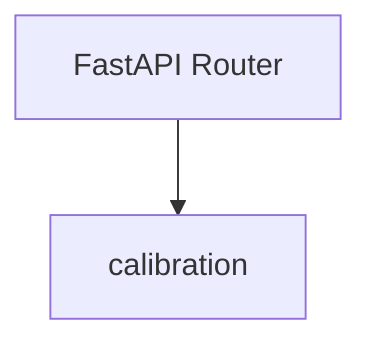
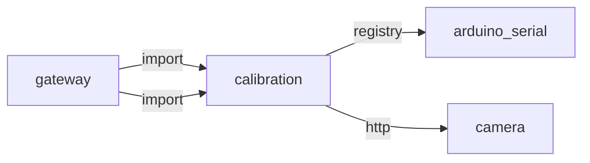
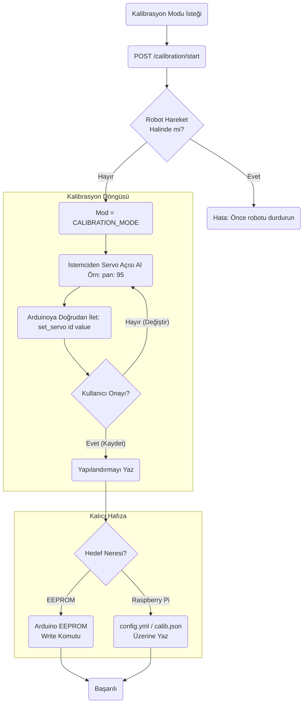
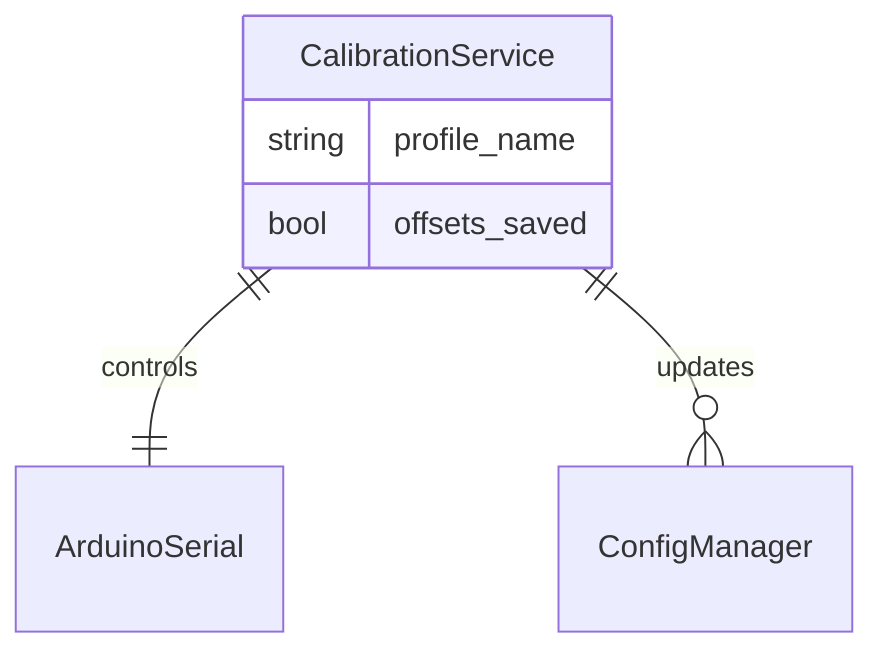

# calibration

> **Servo kalibrasyon modu**

## Kimlik
| Alan | Değer |
| --- | --- |
| Ana sınıf | `—` |
| Giriş noktası | `create_app()` |
| Orkestratör | `—` |
| Ana dosya | `modules/calibration/xCalibrationService.py` |
| Katman | Arka Plan |
| Port | — |
| Arduino | Evet |
| Sınıf sayısı | 0 |
| Endpoint sayısı | 3 |

## İsimlendirilmiş Bileşenler (Sınıflar)

—


## API — Endpoint → Handler → Servis

| HTTP | Path | Handler | Çağırdığı servis | Açıklama |
| --- | --- | --- | --- | --- |
| GET | `/healthz` | `healthz()` | — | — |
| GET | `/camera/checkerboard` | `checker()` | — | — |
| GET | `/servo/sweep` | `servo_sweep()` | — | — |

## Config Bölümleri
- `server`
- `paths`

## Dış İlişkiler (Bu modül → diğerleri)

| Hedef modül | Bağlantı tipi | Detay | Neden |
| --- | --- | --- | --- |
| [[arduino_serial]] | registry | registry dependency: arduino_serial | Servo kalibrasyon komutlarını Arduino'ya gönderir. |
| [[camera]] | http | calls path `/camera/checkerboard` | `calibration` HTTP ile `camera` modülüne erişir: Kamera stream veya snapshot ister. |

## Gelen İlişkiler (Diğerleri → bu modül)

| Kaynak modül | Bağlantı tipi | Detay | Neden |
| --- | --- | --- | --- |
| [[gateway]] | import | api | `gateway` kod içinde `calibration` modülünü import eder (`api`) — Servo kalibrasyon modu. |
| [[gateway]] | import | config_loader | `gateway` kod içinde `calibration` modülünü import eder (`config_loader`) — Servo kalibrasyon modu. |

## İç Mimari (otomatik çıkarım)



## Modül Etkileşim Haritası



### Mimari diyagram 1


### Mimari diyagram 2


---

# Tam Kaynak Arşivi

### `modules/calibration/README.md` (8 satır)

```markdown
# Calibration

Servo/Kamera/Audio kalibrasyon sihirbazları için temel yardımcılar.

## API
- GET `/calib/healthz`
- GET `/calib/camera/checkerboard`
- GET `/calib/servo/sweep`
```

### `modules/calibration/__init__.py` (1 satır)

```python
"""Calibration helpers for servo/camera/audio."""
```

### `modules/calibration/api/__init__.py` (1 satır)

```python
# api namespace
```

### `modules/calibration/api/router.py` (24 satır)

```python
from __future__ import annotations
from typing import Dict, Any
from fastapi import APIRouter

from ..services.camera_calib import suggest_checkerboard
from ..services.servo_calib import sweep_params


def get_router(cfg: Dict[str, Any]) -> APIRouter:
    r = APIRouter(prefix="/calib", tags=["calibration"])

    @r.get("/healthz")
    def healthz():
        return {"ok": True}

    @r.get("/camera/checkerboard")
    def checker(cols: int = 9, rows: int = 6, square_mm: float = 25.0):
        return suggest_checkerboard(cols, rows, square_mm)

    @r.get("/servo/sweep")
    def servo_sweep():
        return sweep_params()

    return r
```

### `modules/calibration/architecture_calibration.md` (60 satır)

```markdown
# Calibration Modülü Mimarisi

Calibration modülü (`modules/calibration`), robotun fiziksel eklentilerini (özellikle servolarını) ayarlamak ve bu ayarlamaları kalıcı hafızaya (EEPROM veya JSON) kaydetmekten sorumludur. Genellikle web üzerinden veya Arduino boot evresinde tetiklenir.

## 🏗️ İş Akışı ve Karar Mekanizmaları (Flowchart)


## 🔄 İlişkisel Etkileşimler (Veri Akışı)


## ⚙️ Detaylı Karar Mantığı (if/else)

1. **Güvenlik / Movement Lock**
   - **`if`** AutonomyBrain şu an aktif bir `ACT` döngüsü yürütüyorsa veya uyku modunda değilse, kalibrasyon istekleri robotun dengesini bozmamak için reddedilir.
2. **Kayıt Yeri Kararı**
   - Gelenekte IMU (Denge) offsetleri Arduino üzerindeki EEPROM'a donanım seviyesinde kaydedilir ki Raspberry Pi çökse bile Arduino ayarı saniyesinde okusun.
   - Ancak İleri Kinematik (IK) diz ve bilek servo merkez ayarları Pi üzerindeki YAML/JSON kalibrasyon dosyasına yazılır. **`if`** `type == 'imu'`, `eeprom_save` çağrılır. **`else`**, dosya kaydı yapılır.
```

### `modules/calibration/config/config.yml` (5 satır)

```yaml
server:
  host: 0.0.0.0
  port: 8091
paths:
  output: "calib_output"
```

### `modules/calibration/config_loader.py` (14 satır)

```python
from __future__ import annotations
from pathlib import Path
from typing import Any, Dict
import yaml

_DEFAULT_CFG_PATH = Path(__file__).parent / "config" / "config.yml"


def load_config(path: str | None = None) -> Dict[str, Any]:
    p = Path(path) if path else _DEFAULT_CFG_PATH
    if not p.exists():
        p = _DEFAULT_CFG_PATH
    with open(p, "r", encoding="utf-8") as f:
        return yaml.safe_load(f) or {}
```

### `modules/calibration/services/__init__.py` (1 satır)

```python
# namespace for calibration services
```

### `modules/calibration/services/camera_calib.py` (6 satır)

```python
from __future__ import annotations
from typing import Dict, Any


def suggest_checkerboard(cols: int = 9, rows: int = 6, square_mm: float = 25.0) -> Dict[str, Any]:
    return {"cols": cols, "rows": rows, "square_mm": square_mm}
```

### `modules/calibration/services/servo_calib.py` (6 satır)

```python
from __future__ import annotations
from typing import Dict, Any


def sweep_params() -> Dict[str, Any]:
    return {"min": 0, "max": 180, "step": 10}
```

### `modules/calibration/tests/test_smoke.py` (8 satır)

```python
from __future__ import annotations

from modules.calibration.xCalibrationService import create_app


def test_create_app():
    app = create_app()
    assert app is not None
```

### `modules/calibration/xCalibrationService.py` (18 satır)

```python
from __future__ import annotations
from fastapi import FastAPI

from .config_loader import load_config
from .api.router import get_router


def create_app(config_path: str | None = None) -> FastAPI:
    cfg = load_config(config_path)
    app = FastAPI(title="Calibration Service")
    app.include_router(get_router(cfg))
    return app


if __name__ == "__main__":
    import uvicorn
    cfg = load_config(None)
    uvicorn.run(create_app(), host=str(cfg["server"]["host"]), port=int(cfg["server"]["port"]))
```
