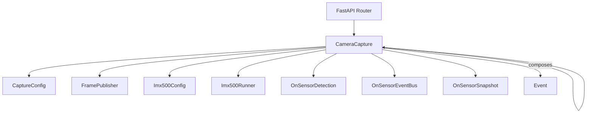
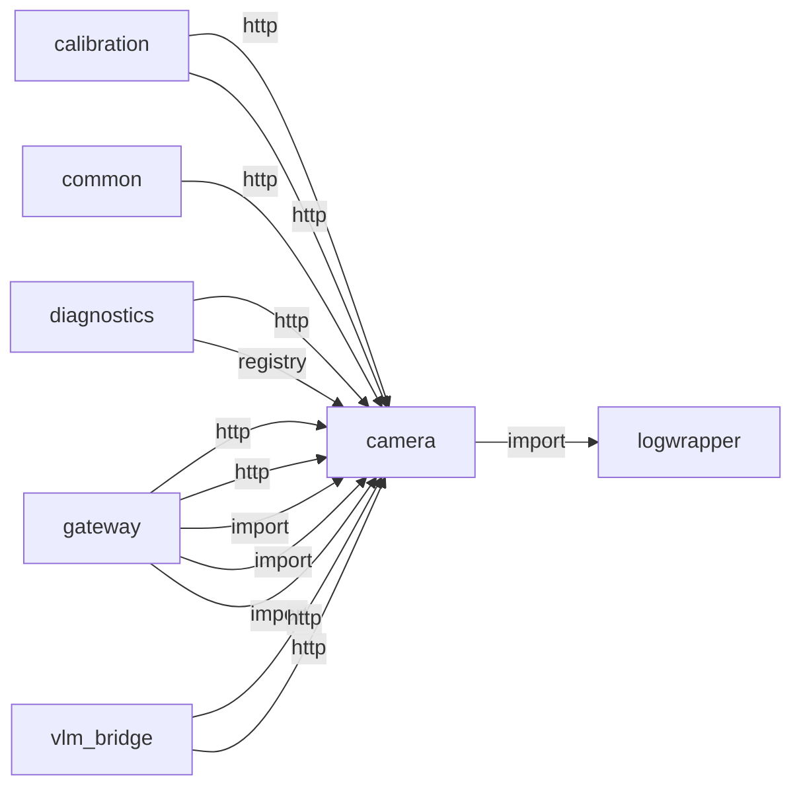
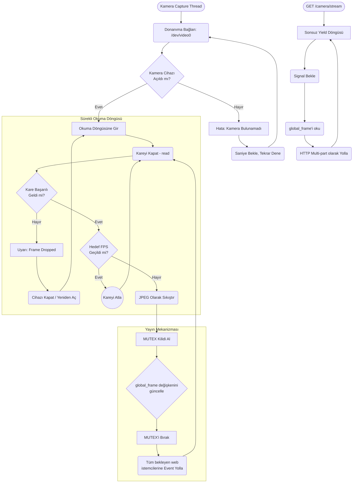
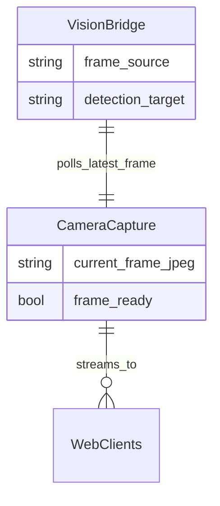

# camera

> **MJPEG kamera stream, auto-recovery**

## Kimlik
| Alan | Değer |
| --- | --- |
| Ana sınıf | `CameraCapture` |
| Giriş noktası | `create_app()` |
| Orkestratör | `CameraCapture` |
| Ana dosya | `modules/camera/xCameraService.py` |
| Katman | Algı |
| Port | — |
| Arduino | Hayır |
| Sınıf sayısı | 9 |
| Endpoint sayısı | 5 |

## İsimlendirilmiş Bileşenler (Sınıflar)

#### `CameraCapture` — `modules/camera/services/capture.py`
- **Görev:** —
- **Kalıtım:** —
- **Oluşturduğu bileşenler:** `Event`
- **Metodlar:** `gave_up()`, `start()`, `stop()`, `mjpeg_generator()`, `snapshot()`

#### `CaptureConfig` — `modules/camera/services/capture.py`
- **Görev:** —
- **Kalıtım:** —
- **Oluşturduğu bileşenler:** —
- **Metodlar:** —

#### `FramePublisher` — `modules/camera/services/capture.py`
- **Görev:** —
- **Kalıtım:** —
- **Oluşturduğu bileşenler:** `Lock`
- **Metodlar:** `set_jpeg()`, `get_jpeg()`

#### `Imx500Config` — `modules/camera/services/imx500_runner.py`
- **Görev:** —
- **Kalıtım:** —
- **Oluşturduğu bileşenler:** —
- **Metodlar:** —

#### `Imx500Runner` — `modules/camera/services/imx500_runner.py`
- **Görev:** Manages the IMX500 inference loop and publishes detections to the bus.
- **Kalıtım:** —
- **Oluşturduğu bileşenler:** `Event`
- **Metodlar:** `available()`, `start()`, `stop()`

#### `OnSensorDetection` — `modules/camera/services/onsensor_bus.py`
- **Görev:** Single bounding-box detection emitted by the IMX500 sensor.
- **Kalıtım:** —
- **Oluşturduğu bileşenler:** —
- **Metodlar:** `to_dict()`

#### `OnSensorEventBus` — `modules/camera/services/onsensor_bus.py`
- **Görev:** Tiny publish/subscribe broker that retains the latest snapshot.
- **Kalıtım:** —
- **Oluşturduğu bileşenler:** `RLock`
- **Metodlar:** `publish()`, `latest()`, `history()`, `subscribe()`, `stats()`

#### `OnSensorSnapshot` — `modules/camera/services/onsensor_bus.py`
- **Görev:** A snapshot of detections emitted by the IMX500 backend.
- **Kalıtım:** —
- **Oluşturduğu bileşenler:** —
- **Metodlar:** `to_dict()`


## API — Endpoint → Handler → Servis

| HTTP | Path | Handler | Çağırdığı servis | Açıklama |
| --- | --- | --- | --- | --- |
| GET | `/video` | `video_stream()` | — | — |
| GET | `/snap` | `snapshot()` | — | — |
| GET | `/healthz` | `healthz()` | — | — |
| POST | `/start` | `start_camera()` | — | — |
| POST | `/stop` | `stop_camera()` | — | — |

## Config Bölümleri
- `enabled`
- `backend`
- `source`
- `resolution`
- `fps_target`
- `jpeg_quality`
- `flip`
- `opencv`
- `picamera2`
- `imx500`
- `server`
- `logging`

## Dış İlişkiler (Bu modül → diğerleri)

| Hedef modül | Bağlantı tipi | Detay | Neden |
| --- | --- | --- | --- |
| [[logwrapper]] | import | init_logging | `camera` → `logwrapper`: Merkezi WebSocket log yayınına bağlanır. |

## Gelen İlişkiler (Diğerleri → bu modül)

| Kaynak modül | Bağlantı tipi | Detay | Neden |
| --- | --- | --- | --- |
| [[calibration]] | http | calls path `/camera/checkerboard` | `calibration` → `camera`: Kamera stream veya snapshot ister. |
| [[calibration]] | http | exposes/routes to `/camera/checkerboard` | `calibration` → `camera`: Kamera stream veya snapshot ister. |
| [[common]] | http | calls path `/camera/healthz` | `common` → `camera`: Kamera stream veya snapshot ister. |
| [[diagnostics]] | http | calls path `/camera/healthz` | Kamera erişim ve stream testi yapar. |
| [[diagnostics]] | registry | registry dependency: arduino_serial, camera, ollama | Kamera erişim ve stream testi yapar. |
| [[gateway]] | http | calls path `/camera/healthz` | `gateway` → `camera`: Kamera stream veya snapshot ister. |
| [[gateway]] | http | calls path `/camera` | `gateway` → `camera`: Kamera stream veya snapshot ister. |
| [[gateway]] | import | config_loader | `gateway` kod içinde `camera` modülünü import eder (`config_loader`) — MJPEG kamera stream, auto-recovery. |
| [[gateway]] | import | services | `gateway` kod içinde `camera` modülünü import eder (`services`) — MJPEG kamera stream, auto-recovery. |
| [[gateway]] | import | api | `gateway` kod içinde `camera` modülünü import eder (`api`) — MJPEG kamera stream, auto-recovery. |
| [[vlm_bridge]] | http | calls path `/camera/video` | MJPEG/frame kaynağı olarak kamera stream'ini kullanır. |
| [[vlm_bridge]] | http | calls path `/camera/healthz` | MJPEG/frame kaynağı olarak kamera stream'ini kullanır. |
| [[vlm_bridge]] | import | services | MJPEG/frame kaynağı olarak kamera stream'ini kullanır. |
| [[vlm_bridge]] | registry | registry dependency: camera, arduino_serial, ollama | MJPEG/frame kaynağı olarak kamera stream'ini kullanır. |

## İç Mimari (otomatik çıkarım)



## Modül Etkileşim Haritası



### Mimari diyagram 1


### Mimari diyagram 2


---

# Tam Kaynak Arşivi

### `modules/camera/README.md` (12 satır)

```markdown
# Camera Module

Pi5 üzerinde OpenCV/PiCamera2 tabanlı yakalama ve yayıncı. FastAPI router ile görüntüye erişim/stream sunar.

## Özellikler
- Otomatik backend seçimi (auto/picamera2/opencv)
- Kaynak: device index veya yol
- Çözünürlük/FPS/JPEG kalitesi ayarlanabilir
- Yayıncı: aboneler için son çerçeveyi saklar

## Gateway ile Kullanım
Gateway çalışırken kamera uygulaması `/camera/*` altında tek porttan sunulabilir (gateway config include.camera: true). Bu mod, görüntüyü sadece çıkış olarak sağlar; işleme PC’de yapılır.
```

### `modules/camera/__init__.py` (8 satır)

```python
"""Camera module package init.

Provides importable services and FastAPI app factory for the camera stream service.
"""

__all__ = [
    "xCameraService",
]
```

### `modules/camera/api/__init__.py` (3 satır)

```python
from .router import get_router

__all__ = ["get_router"]
```

### `modules/camera/api/router.py` (53 satır)

```python
from __future__ import annotations

from fastapi import APIRouter, Response
from fastapi.responses import JSONResponse, StreamingResponse

try:
    from ..services.capture import CameraCapture
except Exception:  # fallback when run as script
    from services.capture import CameraCapture  # type: ignore


def get_router(capture: CameraCapture, fps: int, *, enabled: bool = True) -> APIRouter:
    router = APIRouter()

    @router.get("/video")
    async def video_stream():
        if not enabled:
            return JSONResponse(status_code=503, content={"ok": False, "reason": "camera_disabled"})
        return StreamingResponse(
            capture.mjpeg_generator(fps),
            media_type="multipart/x-mixed-replace; boundary=frame",
            headers={"Cache-Control": "no-cache"},
        )

    @router.get("/snap")
    async def snapshot():
        if not enabled:
            return JSONResponse(status_code=503, content={"ok": False, "reason": "camera_disabled"})
        data = await capture.snapshot()
        if not data:
            return Response(status_code=503)
        return Response(data, media_type="image/jpeg")

    @router.get("/healthz")
    async def healthz():
        if not enabled:
            return {"ok": False, "gave_up": False, "enabled": False, "reason": "camera_disabled"}
        data = await capture.snapshot()
        return {"ok": bool(data), "gave_up": capture.gave_up, "enabled": True}

    @router.post("/start")
    async def start_camera():
        if not enabled:
            return JSONResponse(status_code=503, content={"ok": False, "reason": "camera_disabled"})
        capture.start()
        return {"ok": True}

    @router.post("/stop")
    async def stop_camera():
        capture.stop()
        return {"ok": True}

    return router
```

### `modules/camera/architecture_camera.md` (77 satır)

```markdown
# Camera Modülü Mimarisi

Camera modülü (`modules/camera`), cihaza bağlı olan kameradan (veya V4L2 cihazından) sürekli görüntü akışını sağlayan ve bunu MJPEG formatında API üzerinden ağa / diğer modüllere sunan donanım bağdaştırıcısıdır.

## 🏗️ İş Akışı ve Karar Mekanizmaları (Flowchart)

Kamera thread'inin nasıl çalıştığını, çökme anında donanımı nasıl resetlediğini (`retry`) ve web üzerinden nasıl görüntülendiğini (MJPEG Streaming) gösteren mantık:


## 🔄 İlişkisel Etkileşimler (Veri Akışı)


## ⚙️ Detaylı Karar Mantığı (if/else)

1. **Donanım Çökmesini İyileştirme (Auto-Recovery)**
   - Kameralar fiziksel kablo veya yoğun akım sebebiyle anlık kopmalar yaşayabilir.
   - **`while` loop içinde `if not ret`**: Eğer `cv2.VideoCapture` `False` sonuç döndürürse yazılım çökmez. Hemen `cap.release()` yaparak kamera buffer'ını boşaltır, 2 saniye `time.sleep()` atar ve tekrar (`cap = cv2.VideoCapture(0)`) başlatmayı dener. Bu sistemin "robot devrilse bile" kurtarılabilir olmasını sağlar.
2. **Yayın Modeli (Publisher - Subscriber)**
   - API'ye (örneğin Web tarayıcısı `/camera/stream` adresine girdiğinde) bağlanmış birden fazla kullanıcı veya modül olabilir.
   - Her istek için ayrı ayrı kameradan okuma YAPILMAZ (USB veriyolunu kitler).
   - Bunun yerine tek bir ana thread, kamerayı okur ve bellekteki (RAM) `global_frame` adlı bayte array'ini (**`if`** `mutex.acquire()` kilitleri içinde) ezerek günceller.
    - Okumak isteyen herkes sadece RAM'den okur, böylece RPi 10 cihaza birden yayın yapabilir (CPU tabanlı MJPEG multicast). Görüntü işleme (VLM Bridge) de bu RAM adresindeki son resmi çeker.
```

### `modules/camera/config/README.md` (4 satır)

```markdown
This folder contains the default configuration for the camera module.

- config.yml holds defaults for backend selection (auto/picamera2/opencv), device source, resolution, fps and JPEG quality.
- Keep module-specific settings here only. Override via environment variables or external config path if needed.
```

### `modules/camera/config/config.yml` (45 satır)

```yaml
# Camera module configuration (defaults)
enabled: false          # set true when hardware is attached
backend: auto           # auto | picamera2 | opencv | gstreamer
source: 0               # device index or RTSP/HTTP URL for OpenCV
resolution:
  width: 1280
  height: 720
fps_target: 30          # target send fps for MJPEG stream
jpeg_quality: 80        # 1-100
flip: none             # none | h | v | hv | 90 | 180 | 270
opencv:
  fourcc: MJPG          # MJPG preferred on Windows webcams
  buffer_size: 1        # minimize latency
  max_open_attempts: 5  # stop retrying when no camera attached
  retry_interval_s: 1.0
picamera2:
  size:
    width: 1536
    height: 864
  format: RGB888
  frame_rate: 120
  af_mode: 2
imx500:
  enabled: false
  model_path: "/usr/share/imx500-models/imx500_network_ssd_mobilenetv2_fpnlite_320x320_pp.rpk"
  labels_path: "/usr/share/imx500-models/coco_labels.txt"
  confidence: 0.45
  publish_metadata: true
  publish_interval_s: 0.05
  classes_of_interest:
    - person
    - cat
    - dog
    - chair
    - bottle
    - cup
    - book
    - laptop
    - cell phone
    - tv
server:
  host: 0.0.0.0
  port: 8000
logging:
  level: INFO
```

### `modules/camera/config_loader.py` (66 satır)

```python
from __future__ import annotations
import os
from pathlib import Path
from typing import Any, Dict

import yaml

_DEFAULT_CFG_PATH = Path(__file__).parent / "config" / "config.yml"


def _deep_update(base: Dict[str, Any], override: Dict[str, Any]) -> Dict[str, Any]:
    for k, v in override.items():
        if isinstance(v, dict) and isinstance(base.get(k), dict):
            base[k] = _deep_update(base[k], v)
        else:
            base[k] = v
    return base


def load_config(path: str | os.PathLike | None = None) -> Dict[str, Any]:
    """Load YAML config for camera module.

    Priority:
    1. provided path
    2. CAM_CONFIG env var
    3. default config.yml in module
    """
    cfg_path = Path(path) if path else Path(os.getenv("CAM_CONFIG", _DEFAULT_CFG_PATH))
    if not cfg_path.exists():
        # fallback to default bundled
        cfg_path = _DEFAULT_CFG_PATH
    with open(cfg_path, "r", encoding="utf-8") as f:
        data = yaml.safe_load(f) or {}
    # Environment overrides (flat small set for simplicity)
    env_overrides: Dict[str, Any] = {}
    backend = os.getenv("CAM_BACKEND")
    if backend:
        env_overrides["backend"] = backend
    source = os.getenv("CAM_SOURCE")
    if source:
        # try int, else keep string
        try:
            env_overrides["source"] = int(source)
        except ValueError:
            env_overrides["source"] = source
    w = os.getenv("CAM_WIDTH")
    h = os.getenv("CAM_HEIGHT")
    if w or h:
        env_overrides.setdefault("resolution", {})
        if w:
            env_overrides["resolution"]["width"] = int(w)
        if h:
            env_overrides["resolution"]["height"] = int(h)
    fps = os.getenv("CAM_FPS")
    if fps:
        env_overrides["fps_target"] = int(fps)
    q = os.getenv("CAM_JPEG_QUALITY")
    if q:
        env_overrides["jpeg_quality"] = int(q)
    flip = os.getenv("CAM_FLIP")
    if flip:
        env_overrides["flip"] = flip
    enabled = os.getenv("CAM_ENABLED")
    if enabled is not None:
        env_overrides["enabled"] = str(enabled).strip().lower() in {"1", "true", "yes", "on"}
    return _deep_update(data, env_overrides)
```

### `modules/camera/services/__init__.py` (51 satır)

```python
"""Camera service exports with lazy submodule loading.

We avoid eagerly importing :mod:`.capture` (which depends on ``cv2``) at
package import time so test environments without a working OpenCV install can
still import :mod:`modules.camera.services.imx500_runner` and
:mod:`modules.camera.services.onsensor_bus` without crashing.
"""

from __future__ import annotations

import importlib
from typing import Any

__all__ = [
    "CameraCapture",
    "FramePublisher",
    "OnSensorDetection",
    "OnSensorEventBus",
    "OnSensorSnapshot",
    "get_default_bus",
    "set_default_bus",
    "Imx500Config",
    "Imx500Runner",
    "IMX500_AVAILABLE",
    "IMX500_IMPORT_ERROR",
]


_ATTR_TO_MODULE = {
    "CameraCapture": ".capture",
    "FramePublisher": ".capture",
    "OnSensorDetection": ".onsensor_bus",
    "OnSensorEventBus": ".onsensor_bus",
    "OnSensorSnapshot": ".onsensor_bus",
    "get_default_bus": ".onsensor_bus",
    "set_default_bus": ".onsensor_bus",
    "Imx500Config": ".imx500_runner",
    "Imx500Runner": ".imx500_runner",
    "IMX500_AVAILABLE": ".imx500_runner",
    "IMX500_IMPORT_ERROR": ".imx500_runner",
}


def __getattr__(name: str) -> Any:
    target = _ATTR_TO_MODULE.get(name)
    if target is None:
        raise AttributeError(name)
    module = importlib.import_module(target, __name__)
    value = getattr(module, name)
    globals()[name] = value
    return value
```

### `modules/camera/services/capture.py` (372 satır)

```python
from __future__ import annotations
import asyncio
import logging
import os
import sys
import threading
import time
from dataclasses import dataclass
from typing import Any, Optional, Tuple

try:
    import cv2
except Exception as e:
    cv2 = None  # OpenCV not available (or missing libGL etc.)

PICAM_AVAILABLE = False
PICAM_IMPORT_ERROR: Optional[str] = None

try:
    from picamera2 import Picamera2  # type: ignore
    PICAM_AVAILABLE = True
except Exception as exc:
    PICAM_IMPORT_ERROR = repr(exc)
    # Some virtualenv setups on Raspberry Pi miss system dist-packages in sys.path.
    for p in ("/usr/lib/python3/dist-packages", "/usr/local/lib/python3/dist-packages"):
        if os.path.isdir(p) and p not in sys.path:
            sys.path.append(p)
    try:
        from picamera2 import Picamera2  # type: ignore
        PICAM_AVAILABLE = True
        PICAM_IMPORT_ERROR = None
    except Exception as exc2:
        PICAM_AVAILABLE = False
        PICAM_IMPORT_ERROR = repr(exc2)


logger = logging.getLogger("camera.capture")


@dataclass
class CaptureConfig:
    backend: str  # auto|picamera2|opencv
    source: object  # int index or str URL
    resolution: Tuple[int, int]
    fps_target: int
    jpeg_quality: int
    opencv_fourcc: str
    opencv_buffer_size: int
    picam_size: Tuple[int, int]
    picam_format: str
    picam_frame_rate: int
    picam_af_mode: int
    flip: str
    opencv_max_open_attempts: int = 5
    opencv_retry_interval_s: float = 1.0


class FramePublisher:
    def __init__(self) -> None:
        self._lock = threading.Lock()
        self._frame_bytes: Optional[bytes] = None

    def set_jpeg(self, jpeg_bytes: bytes) -> None:
        with self._lock:
            self._frame_bytes = jpeg_bytes

    def get_jpeg(self) -> Optional[bytes]:
        with self._lock:
            return self._frame_bytes


class CameraCapture:
    def __init__(self, cfg: CaptureConfig, publisher: FramePublisher) -> None:
        self.cfg = cfg
        self.pub = publisher
        self._stop = threading.Event()
        self._thread: Optional[threading.Thread] = None
        self._cap: Optional[Any] = None
        self._picam: Optional["Picamera2"] = None
        self._gave_up = False

    @property
    def gave_up(self) -> bool:
        return self._gave_up

    def _opencv_api_candidates(self, src: object) -> list[Optional[int]]:
        if cv2 is None or not isinstance(src, int):
            return [None]

        # CAP_DSHOW is Windows-only; on Linux/RPi prefer V4L2/CAP_ANY.
        if os.name == "nt":
            return [getattr(cv2, "CAP_DSHOW", None), getattr(cv2, "CAP_ANY", None), None]
        return [getattr(cv2, "CAP_V4L2", None), getattr(cv2, "CAP_ANY", None), None]

    def _opencv_source_candidates(self, src: object) -> list[Tuple[object, Optional[int]]]:
        candidates: list[Tuple[object, Optional[int]]] = [(src, None)]
        if cv2 is None:
            return candidates

        if isinstance(src, int) and os.name != "nt":
            # Prefer explicit V4L2 device path as secondary candidate on Linux.
            candidates.append((f"/dev/video{src}", None))

            # Last resort: libcamera GStreamer pipeline (when OpenCV has GStreamer support).
            gst_api = getattr(cv2, "CAP_GSTREAMER", None)
            if gst_api is not None:
                w, h = self.cfg.resolution
                fps = max(5, min(60, int(self.cfg.fps_target or 30)))
                gst_pipeline = (
                    f"libcamerasrc ! video/x-raw,width={w},height={h},framerate={fps}/1 ! "
                    "videoconvert ! appsink drop=true sync=false"
                )
                candidates.append((gst_pipeline, gst_api))

        return candidates

    def _configure_opencv_capture(self, cap: Any) -> None:
        w, h = self.cfg.resolution
        cap.set(cv2.CAP_PROP_FRAME_WIDTH, w)
        cap.set(cv2.CAP_PROP_FRAME_HEIGHT, h)
        cap.set(cv2.CAP_PROP_FOURCC, cv2.VideoWriter.fourcc(*self.cfg.opencv_fourcc))
        cap.set(cv2.CAP_PROP_BUFFERSIZE, self.cfg.opencv_buffer_size)

    def _open_opencv_capture(self, src: object) -> Tuple[Optional[Any], str]:
        if cv2 is None:
            return None, "cv2-unavailable"

        for candidate_src, forced_api in self._opencv_source_candidates(src):
            api_candidates = [forced_api] if forced_api is not None else self._opencv_api_candidates(candidate_src)
            for api in api_candidates:
                try:
                    cap = cv2.VideoCapture(candidate_src) if api is None else cv2.VideoCapture(candidate_src, api)
                except Exception:
                    continue

                if cap is None or not cap.isOpened():
                    if cap is not None:
                        try:
                            cap.release()
                        except Exception:
                            pass
                    continue

                self._configure_opencv_capture(cap)

                # Some backends report opened but never deliver frames; validate quickly.
                ok = False
                frame = None
                for _ in range(3):
                    ok, frame = cap.read()
                    if ok and frame is not None:
                        break
                    time.sleep(0.05)

                if ok and frame is not None:
                    api_name = "default" if api is None else str(api)
                    return cap, f"{api_name}|src={candidate_src!r}"

                try:
                    cap.release()
                except Exception:
                    pass

        return None, "none"

    def _start_opencv(self) -> None:
        if cv2 is None:
            raise RuntimeError("OpenCV (cv2) not available: check libGL (libGL.so.1) and opencv-python installation")
        src = self.cfg.source if isinstance(self.cfg.source, (int, str)) else 0
        cap, api_name = self._open_opencv_capture(src)
        self._cap = cap

        def _apply_flip(img):
            f = (self.cfg.flip or "none").strip().lower()
            if not f or f == "none":
                return img
            if f in ("h", "horizontal"):
                return cv2.flip(img, 1)
            if f in ("v", "vertical"):
                return cv2.flip(img, 0)
            if f in ("hv", "both", "180", "rotate180", "r180"):
                return cv2.flip(img, -1)
            if f in ("90", "rotate90", "r90"):
                return cv2.rotate(img, cv2.ROTATE_90_CLOCKWISE)
            if f in ("270", "rotate270", "r270"):
                return cv2.rotate(img, cv2.ROTATE_90_COUNTERCLOCKWISE)
            try:
                deg = int(f)
                d = deg % 360
                if d == 90:
                    return cv2.rotate(img, cv2.ROTATE_90_CLOCKWISE)
                if d == 180:
                    return cv2.flip(img, -1)
                if d == 270:
                    return cv2.rotate(img, cv2.ROTATE_90_COUNTERCLOCKWISE)
            except Exception:
                pass
            return img

        def loop() -> None:
            q = self.cfg.jpeg_quality
            open_fail_count = 0
            max_attempts = max(1, int(self.cfg.opencv_max_open_attempts))
            retry_s = max(0.2, float(self.cfg.opencv_retry_interval_s))
            nonlocal cap, api_name
            while not self._stop.is_set():
                if cap is None or not cap.isOpened():
                    cap, api_name = self._open_opencv_capture(src)
                    self._cap = cap
                    if cap is None:
                        open_fail_count += 1
                        if open_fail_count >= max_attempts:
                            if not self._gave_up:
                                self._gave_up = True
                                logger.warning(
                                    "OpenCV camera unavailable after %d attempts (source=%r); stopping retries",
                                    max_attempts,
                                    src,
                                )
                            break
                        if open_fail_count == 1 or open_fail_count == max_attempts:
                            logger.warning(
                                "OpenCV camera source not ready: source=%r attempt=%d/%d",
                                src,
                                open_fail_count,
                                max_attempts,
                            )
                        time.sleep(retry_s)
                        continue

                    open_fail_count = 0
                    logger.info("OpenCV camera connected: source=%r api=%s", src, api_name)

                ok, frame = cap.read()
                if not ok:
                    logger.warning("OpenCV camera read failed, reconnecting source=%r", src)
                    try:
                        cap.release()
                    except Exception:
                        pass
                    cap = None
                    self._cap = None
                    time.sleep(0.4)
                    continue
                frame = _apply_flip(frame)
                ok2, buf = cv2.imencode('.jpg', frame, [cv2.IMWRITE_JPEG_QUALITY, q])
                if ok2:
                    self.pub.set_jpeg(buf.tobytes())
        self._thread = threading.Thread(target=loop, daemon=True)
        self._thread.start()

    def _start_picam(self) -> None:
        if not PICAM_AVAILABLE:
            raise RuntimeError("Picamera2 not available")
        if cv2 is None:
            raise RuntimeError("OpenCV (cv2) is required for JPEG encoding with picamera2 backend")
        cam = Picamera2()
        try:
            w, h = self.cfg.picam_size
            cam.configure(cam.create_video_configuration(
                main={"size": (w, h), "format": self.cfg.picam_format},
                controls={"AfMode": self.cfg.picam_af_mode, "FrameRate": self.cfg.picam_frame_rate}
            ))
            cam.start()
        except Exception:
            try:
                cam.close()
            except Exception:
                pass
            raise
        self._picam = cam

        def _apply_flip(img):
            f = (self.cfg.flip or "none").strip().lower()
            if not f or f == "none":
                return img
            if f in ("h", "horizontal"):
                return cv2.flip(img, 1)
            if f in ("v", "vertical"):
                return cv2.flip(img, 0)
            if f in ("hv", "both", "180", "rotate180", "r180"):
                return cv2.flip(img, -1)
            if f in ("90", "rotate90", "r90"):
                return cv2.rotate(img, cv2.ROTATE_90_CLOCKWISE)
            if f in ("270", "rotate270", "r270"):
                return cv2.rotate(img, cv2.ROTATE_90_COUNTERCLOCKWISE)
            try:
                deg = int(f)
                d = deg % 360
                if d == 90:
                    return cv2.rotate(img, cv2.ROTATE_90_CLOCKWISE)
                if d == 180:
                    return cv2.flip(img, -1)
                if d == 270:
                    return cv2.rotate(img, cv2.ROTATE_90_COUNTERCLOCKWISE)
            except Exception:
                pass
            return img

        def loop() -> None:
            q = self.cfg.jpeg_quality
            err_count = 0
            while not self._stop.is_set():
                try:
                    rgb = cam.capture_array("main")
                    rgb = _apply_flip(rgb)
                    ok, buf = cv2.imencode('.jpg', rgb, [cv2.IMWRITE_JPEG_QUALITY, q])
                    if ok:
                        self.pub.set_jpeg(buf.tobytes())
                    err_count = 0
                except Exception as exc:
                    err_count += 1
                    if err_count == 1 or (err_count % 20) == 0:
                        logger.warning("Picamera2 frame capture failed (count=%d): %s", err_count, exc)
                    time.sleep(0.2)
        self._thread = threading.Thread(target=loop, daemon=True)
        self._thread.start()

    def start(self) -> None:
        self._stop.clear()
        backend = self.cfg.backend
        if backend == "auto":
            backend = "picamera2" if PICAM_AVAILABLE else "opencv"
        if backend == "opencv" and os.name != "nt" and isinstance(self.cfg.source, int) and not PICAM_AVAILABLE:
            logger.warning(
                "picamera2 unavailable (error=%s). CSI camera with OpenCV source=%r may fail to deliver frames.",
                PICAM_IMPORT_ERROR,
                self.cfg.source,
            )
        logger.info("CameraCapture starting backend=%s source=%r picam_available=%s", backend, self.cfg.source, PICAM_AVAILABLE)
        if backend == "picamera2":
            try:
                self._start_picam()
                return
            except Exception as exc:
                logger.warning(
                    "picamera2 start failed (%s); falling back to opencv source=%r",
                    exc,
                    self.cfg.source,
                )
        self._start_opencv()

    def stop(self) -> None:
        self._stop.set()
        if self._thread and self._thread.is_alive():
            self._thread.join(timeout=1)
        if self._cap is not None:
            try:
                self._cap.release()
            except Exception:
                pass
        if self._picam is not None:
            try:
                self._picam.stop()
                self._picam.close()
            except Exception:
                pass

    async def mjpeg_generator(self, fps: int):
        boundary = b"--frame\r\nContent-Type: image/jpeg\r\n\r\n"
        next_tick = 0.0
        while True:
            if next_tick == 0.0:
                next_tick = asyncio.get_running_loop().time()
            next_tick += 1 / max(1, fps)
            await asyncio.sleep(max(0.0, next_tick - asyncio.get_running_loop().time()))
            frame = await asyncio.to_thread(self.pub.get_jpeg)
            if frame:
                yield boundary + frame + b"\r\n"

    async def snapshot(self) -> Optional[bytes]:
        return await asyncio.to_thread(self.pub.get_jpeg)
```

### `modules/camera/services/imx500_runner.py` (239 satır)

```python
"""Sony IMX500 (Raspberry Pi AI Camera) on-sensor inference runner.

This module wires the on-sensor SSD MobileNet network (or any user provided
``.rpk`` model) into the SentryBOT pipeline. The runner stays *inert* when the
optional ``picamera2`` package or the IMX500 device is not available, so it can
be safely imported on developer machines without breaking startup.

Whenever the IMX500 emits detections, the runner translates them into
:class:`OnSensorSnapshot` objects and forwards them through the shared
:class:`OnSensorEventBus`. The VLM bridge processor subscribes to the bus and
can therefore replace its Haar face detector with the IMX500 results when the
backend is active.
"""

from __future__ import annotations

import logging
import os
import threading
import time
from dataclasses import dataclass
from typing import Any, List, Optional, Sequence, Tuple

from .onsensor_bus import OnSensorDetection, OnSensorEventBus, OnSensorSnapshot, get_default_bus

logger = logging.getLogger("camera.imx500_runner")


IMX500_AVAILABLE = False
IMX500_IMPORT_ERROR: Optional[str] = None

try:
    from picamera2 import Picamera2  # type: ignore  # noqa: F401
    from picamera2.devices.imx500 import IMX500, NetworkIntrinsics  # type: ignore
    IMX500_AVAILABLE = True
except Exception as exc:  # pragma: no cover - device specific path
    IMX500 = None  # type: ignore
    NetworkIntrinsics = None  # type: ignore
    IMX500_IMPORT_ERROR = repr(exc)


@dataclass
class Imx500Config:
    enabled: bool = False
    model_path: str = "/usr/share/imx500-models/imx500_network_ssd_mobilenetv2_fpnlite_320x320_pp.rpk"
    labels_path: str = "/usr/share/imx500-models/coco_labels.txt"
    confidence: float = 0.45
    publish_metadata: bool = True
    publish_interval_s: float = 0.05
    classes_of_interest: Sequence[str] = ()


class Imx500Runner:
    """Manages the IMX500 inference loop and publishes detections to the bus."""

    def __init__(
        self,
        cfg: Imx500Config,
        bus: Optional[OnSensorEventBus] = None,
        picam: Optional[Any] = None,
    ) -> None:
        self.cfg = cfg
        self.bus = bus or get_default_bus()
        self._picam = picam
        self._device: Optional[Any] = None
        self._intrinsics: Optional[Any] = None
        self._labels: List[str] = []
        self._stop = threading.Event()
        self._thread: Optional[threading.Thread] = None
        self._frame_id = 0
        self._last_publish_ts = 0.0
        self._available = bool(cfg.enabled) and IMX500_AVAILABLE

        if cfg.enabled and not IMX500_AVAILABLE:
            logger.info(
                "IMX500 requested but picamera2/IMX500 unavailable (%s); runner stays inert.",
                IMX500_IMPORT_ERROR,
            )

    # -- Public lifecycle ------------------------------------------------

    @property
    def available(self) -> bool:
        return self._available

    def start(self) -> bool:
        """Initialise the device and start the background loop.

        Returns ``True`` when the runner is actually running, ``False`` when it
        is skipped (disabled or library missing).
        """
        if not self._available:
            return False
        if self._thread is not None and self._thread.is_alive():
            return True
        try:
            self._init_device()
        except Exception as exc:  # pragma: no cover - hardware specific
            logger.warning("IMX500 init failed (%s); runner disabled.", exc)
            self._available = False
            return False
        self._stop.clear()
        self._thread = threading.Thread(target=self._loop, name="imx500-runner", daemon=True)
        self._thread.start()
        logger.info("IMX500 runner started (model=%s).", self.cfg.model_path)
        return True

    def stop(self) -> None:
        self._stop.set()
        if self._thread and self._thread.is_alive():
            self._thread.join(timeout=2.0)
        self._thread = None

    # -- Internals -------------------------------------------------------

    def _init_device(self) -> None:
        if IMX500 is None:  # pragma: no cover
            raise RuntimeError("IMX500 library not loaded")
        model_path = self.cfg.model_path
        if not model_path or not os.path.exists(model_path):
            raise FileNotFoundError(f"IMX500 model_path not found: {model_path}")

        self._device = IMX500(model_path)
        try:
            self._intrinsics = self._device.network_intrinsics
        except Exception:
            self._intrinsics = None

        labels_path = self.cfg.labels_path
        if labels_path and os.path.exists(labels_path):
            try:
                with open(labels_path, "r", encoding="utf-8") as fh:
                    self._labels = [line.strip() for line in fh.readlines() if line.strip()]
            except Exception as exc:  # pragma: no cover - defensive
                logger.debug("Failed to read IMX500 labels file: %s", exc)

    def _label_for(self, class_id: int) -> str:
        if 0 <= class_id < len(self._labels):
            return self._labels[class_id]
        return f"class_{class_id}"

    def _should_emit(self, label: str) -> bool:
        wanted = set(s.strip().lower() for s in self.cfg.classes_of_interest or [])
        if not wanted:
            return True
        return label.strip().lower() in wanted

    def _loop(self) -> None:
        device = self._device
        if device is None:
            return
        interval = max(0.0, float(self.cfg.publish_interval_s or 0.05))
        while not self._stop.is_set():
            try:
                snapshot = self._fetch_snapshot()
            except Exception as exc:
                logger.debug("IMX500 fetch failed: %s", exc)
                snapshot = None
            if snapshot is not None:
                now = time.time()
                if (now - self._last_publish_ts) >= interval:
                    self.bus.publish(snapshot)
                    self._last_publish_ts = now
            time.sleep(min(interval, 0.05))

    def _fetch_snapshot(self) -> Optional[OnSensorSnapshot]:
        device = self._device
        if device is None:
            return None
        metadata = None
        if self._picam is not None and hasattr(self._picam, "capture_metadata"):
            try:
                metadata = self._picam.capture_metadata()
            except Exception:
                metadata = None
        if not metadata:
            return None
        outputs = None
        try:
            outputs = device.get_outputs(metadata)
        except Exception:
            outputs = None
        if outputs is None:
            return None
        detections: List[OnSensorDetection] = []
        boxes, scores, classes = self._unpack_outputs(outputs)
        for bbox, score, class_id in zip(boxes, scores, classes):
            if float(score) < float(self.cfg.confidence):
                continue
            label = self._label_for(int(class_id))
            if not self._should_emit(label):
                continue
            x1, y1, x2, y2 = [float(v) for v in bbox]
            detections.append(
                OnSensorDetection(
                    class_id=int(class_id),
                    label=label,
                    score=float(score),
                    bbox_xyxy_norm=(x1, y1, x2, y2),
                )
            )
        self._frame_id += 1
        width = int(metadata.get("ScalerCrop", [0, 0, 0, 0])[2]) if isinstance(metadata.get("ScalerCrop"), (list, tuple)) else 0
        height = int(metadata.get("ScalerCrop", [0, 0, 0, 0])[3]) if isinstance(metadata.get("ScalerCrop"), (list, tuple)) else 0
        return OnSensorSnapshot(
            ts=time.time(),
            frame_id=self._frame_id,
            width=width,
            height=height,
            detections=detections,
            backend="imx500",
        )

    def _unpack_outputs(self, outputs: Any) -> Tuple[List[List[float]], List[float], List[int]]:
        boxes: List[List[float]] = []
        scores: List[float] = []
        classes: List[int] = []
        try:
            if isinstance(outputs, (list, tuple)) and outputs:
                first = outputs[0]
                if isinstance(first, dict):
                    raw_boxes = first.get("boxes") or first.get("bboxes") or []
                    raw_scores = first.get("scores") or []
                    raw_classes = first.get("classes") or first.get("class_ids") or []
                    boxes = [list(b) for b in raw_boxes]
                    scores = [float(s) for s in raw_scores]
                    classes = [int(c) for c in raw_classes]
                else:
                    if len(outputs) >= 3:
                        raw_boxes, raw_scores, raw_classes = outputs[:3]
                        boxes = [list(b) for b in raw_boxes]
                        scores = [float(s) for s in raw_scores]
                        classes = [int(c) for c in raw_classes]
        except Exception:
            pass
        return boxes, scores, classes


__all__ = ["Imx500Config", "Imx500Runner", "IMX500_AVAILABLE", "IMX500_IMPORT_ERROR"]
```

### `modules/camera/services/onsensor_bus.py` (141 satır)

```python
"""Thread-safe on-sensor detection event bus.

The IMX500 runner publishes ``OnSensorSnapshot`` instances here and downstream
subscribers (e.g. the VLM bridge processor) can fetch the latest snapshot or
register callbacks for push-style consumption. The bus has no dependency on
``picamera2`` so it can be imported safely on hosts that lack the IMX500
hardware - the runner itself stays inert in that case.
"""

from __future__ import annotations

import logging
import threading
import time
from dataclasses import asdict, dataclass, field
from typing import Any, Callable, Dict, List, Optional, Tuple

logger = logging.getLogger("camera.onsensor_bus")


@dataclass
class OnSensorDetection:
    """Single bounding-box detection emitted by the IMX500 sensor."""

    class_id: int
    label: str
    score: float
    bbox_xyxy_norm: Tuple[float, float, float, float]
    track_id: Optional[int] = None

    def to_dict(self) -> Dict[str, Any]:
        data = asdict(self)
        data["bbox_xyxy_norm"] = list(self.bbox_xyxy_norm)
        return data


@dataclass
class OnSensorSnapshot:
    """A snapshot of detections emitted by the IMX500 backend."""

    ts: float = field(default_factory=time.time)
    frame_id: int = 0
    width: int = 0
    height: int = 0
    detections: List[OnSensorDetection] = field(default_factory=list)
    backend: str = "imx500"

    def to_dict(self) -> Dict[str, Any]:
        return {
            "ts": self.ts,
            "frame_id": self.frame_id,
            "width": self.width,
            "height": self.height,
            "backend": self.backend,
            "detections": [d.to_dict() for d in self.detections],
        }


SubscriberFn = Callable[[OnSensorSnapshot], None]


class OnSensorEventBus:
    """Tiny publish/subscribe broker that retains the latest snapshot."""

    def __init__(self, history_size: int = 16) -> None:
        self._lock = threading.RLock()
        self._latest: Optional[OnSensorSnapshot] = None
        self._history: List[OnSensorSnapshot] = []
        self._history_size = max(1, int(history_size))
        self._subscribers: List[SubscriberFn] = []
        self._published_count = 0

    def publish(self, snapshot: OnSensorSnapshot) -> None:
        with self._lock:
            self._latest = snapshot
            self._history.append(snapshot)
            if len(self._history) > self._history_size:
                self._history = self._history[-self._history_size :]
            self._published_count += 1
            subscribers = list(self._subscribers)
        for fn in subscribers:
            try:
                fn(snapshot)
            except Exception as exc:  # pragma: no cover - defensive
                logger.debug("on-sensor subscriber failed: %s", exc)

    def latest(self) -> Optional[OnSensorSnapshot]:
        with self._lock:
            return self._latest

    def history(self) -> List[OnSensorSnapshot]:
        with self._lock:
            return list(self._history)

    def subscribe(self, fn: SubscriberFn) -> Callable[[], None]:
        with self._lock:
            self._subscribers.append(fn)

        def _unsub() -> None:
            with self._lock:
                if fn in self._subscribers:
                    self._subscribers.remove(fn)

        return _unsub

    def stats(self) -> Dict[str, Any]:
        with self._lock:
            return {
                "published_count": int(self._published_count),
                "history_size": len(self._history),
                "subscribers": len(self._subscribers),
                "has_latest": self._latest is not None,
            }


_default_bus: Optional[OnSensorEventBus] = None
_default_lock = threading.RLock()


def get_default_bus() -> OnSensorEventBus:
    """Return the process-wide default bus, creating it on first use."""
    global _default_bus
    with _default_lock:
        if _default_bus is None:
            _default_bus = OnSensorEventBus()
        return _default_bus


def set_default_bus(bus: Optional[OnSensorEventBus]) -> None:
    global _default_bus
    with _default_lock:
        _default_bus = bus


__all__ = [
    "OnSensorDetection",
    "OnSensorSnapshot",
    "OnSensorEventBus",
    "get_default_bus",
    "set_default_bus",
]
```

### `modules/camera/tests/test_imx500_disabled.py` (101 satır)

```python
"""Smoke tests for the IMX500 runner + on-sensor event bus.

These tests intentionally exercise the *disabled* path so they can run on any
developer machine. They guard against regressions in the import-on-import-time
behaviour (the runner must stay inert when ``picamera2`` is missing) and verify
that the bus retains the latest snapshot.
"""

from __future__ import annotations

import time

import pytest

from modules.camera.services import imx500_runner as runner_mod
from modules.camera.services.imx500_runner import Imx500Config, Imx500Runner
from modules.camera.services.onsensor_bus import (
    OnSensorDetection,
    OnSensorEventBus,
    OnSensorSnapshot,
)


def test_imx500_disabled_when_config_off():
    cfg = Imx500Config(enabled=False)
    bus = OnSensorEventBus()
    runner = Imx500Runner(cfg, bus=bus)
    assert runner.available is False
    assert runner.start() is False


def test_imx500_disabled_when_library_missing(monkeypatch):
    monkeypatch.setattr(runner_mod, "IMX500_AVAILABLE", False)
    cfg = Imx500Config(enabled=True, model_path="/nonexistent.rpk")
    runner = Imx500Runner(cfg, bus=OnSensorEventBus())
    assert runner.available is False
    assert runner.start() is False


def test_bus_publish_and_history():
    bus = OnSensorEventBus(history_size=2)
    received = []
    bus.subscribe(lambda snap: received.append(snap))

    snap1 = OnSensorSnapshot(
        ts=time.time(),
        frame_id=1,
        detections=[
            OnSensorDetection(class_id=0, label="person", score=0.9, bbox_xyxy_norm=(0.1, 0.1, 0.4, 0.6)),
        ],
    )
    snap2 = OnSensorSnapshot(
        ts=time.time(),
        frame_id=2,
        detections=[],
    )
    bus.publish(snap1)
    bus.publish(snap2)

    latest = bus.latest()
    assert latest is snap2
    assert len(received) == 2
    assert [s.frame_id for s in received] == [1, 2]
    assert bus.stats()["published_count"] == 2
    history = bus.history()
    assert [s.frame_id for s in history] == [1, 2]


def test_bus_history_size_capped():
    bus = OnSensorEventBus(history_size=2)
    for i in range(5):
        bus.publish(OnSensorSnapshot(frame_id=i))
    history = bus.history()
    assert len(history) == 2
    assert history[-1].frame_id == 4


def test_runner_unpacks_dict_outputs(monkeypatch):
    """Even with the library missing, the unpack helper should be defensive."""

    cfg = Imx500Config(enabled=False)
    runner = Imx500Runner(cfg, bus=OnSensorEventBus())
    boxes, scores, classes = runner._unpack_outputs([
        {
            "boxes": [(0.1, 0.1, 0.2, 0.2), (0.3, 0.3, 0.5, 0.5)],
            "scores": [0.91, 0.42],
            "classes": [0, 1],
        }
    ])
    assert boxes == [[0.1, 0.1, 0.2, 0.2], [0.3, 0.3, 0.5, 0.5]]
    assert scores == [0.91, 0.42]
    assert classes == [0, 1]

    boxes2, scores2, classes2 = runner._unpack_outputs([
        [(0.0, 0.0, 1.0, 1.0)],
        [0.77],
        [3],
    ])
    assert classes2 == [3]
    assert scores2[0] == pytest.approx(0.77)
    assert boxes2 == [[0.0, 0.0, 1.0, 1.0]]
```

### `modules/camera/tests/test_smoke.py` (110 satır)

```python
from __future__ import annotations

import importlib.util
import os
from unittest.mock import MagicMock

import pytest
from fastapi import FastAPI
from fastapi.testclient import TestClient


def _cv2_importable() -> bool:
    try:
        import cv2  # noqa: F401

        return True
    except Exception:
        return False


def test_import():
    if not _cv2_importable():
        pytest.skip("cv2 not installed")
    from modules.camera import xCameraService as cam

    assert hasattr(cam, "create_app") and callable(cam.create_app)


def test_config_loader():
    from modules.camera.config_loader import load_config

    cfg = load_config()
    assert isinstance(cfg, dict)
    assert "enabled" in cfg
    assert cfg.get("enabled") is False


def test_config_loader_cam_enabled_env(monkeypatch):
    from modules.camera.config_loader import load_config

    monkeypatch.setenv("CAM_ENABLED", "false")
    cfg = load_config()
    assert cfg.get("enabled") is False


def test_service_init_without_start(monkeypatch):
    if not _cv2_importable():
        pytest.skip("cv2 not installed")
    from modules.camera.xCameraService import create_app

    started = []

    class _Cap:
        gave_up = False

        def start(self):
            started.append(True)

        def stop(self):
            pass

        async def snapshot(self):
            return None

        def mjpeg_generator(self, fps):
            yield b""

    monkeypatch.setattr("modules.camera.xCameraService.CameraCapture", lambda *a, **k: _Cap())
    monkeypatch.setattr("modules.camera.xCameraService.FramePublisher", lambda: MagicMock())
    monkeypatch.setattr(
        "modules.camera.xCameraService.load_config",
        lambda *a, **k: {"enabled": False, "resolution": {"width": 640, "height": 480}, "opencv": {}},
    )
    app = create_app()
    assert app is not None
    assert started == []


def test_router_disabled_healthz():
    from modules.camera.api.router import get_router

    cap = MagicMock()
    cap.gave_up = False

    async def _snap():
        return None

    cap.snapshot = _snap

    app = FastAPI()
    app.include_router(get_router(cap, 15, enabled=False), prefix="/camera")
    client = TestClient(app)
    resp = client.get("/camera/healthz")
    assert resp.status_code == 200
    body = resp.json()
    assert body["ok"] is False
    assert body["enabled"] is False
    assert body["reason"] == "camera_disabled"


def test_router_start_blocked_when_disabled():
    from modules.camera.api.router import get_router

    cap = MagicMock()
    app = FastAPI()
    app.include_router(get_router(cap, 15, enabled=False), prefix="/camera")
    client = TestClient(app)
    resp = client.post("/camera/start")
    assert resp.status_code == 503
    cap.start.assert_not_called()
```

### `modules/camera/tools/test_fps.py` (39 satır)

```python
import cv2
import time

def main() -> None:
    # Set your stream URL (default Raspberry Pi host)
    url = "http://pi.local:8000/video"
    cap = cv2.VideoCapture(url)

    frame_count = 0
    start_time = time.time()

    cv2.namedWindow("Stream", cv2.WINDOW_NORMAL)

    while True:
        ret, frame = cap.read()
        if not ret:
            print("Failed to read from stream. Retrying...")
            time.sleep(0.5)
            continue

        frame_count += 1
        elapsed = time.time() - start_time
        if elapsed >= 1.0:
            fps = frame_count / elapsed
            height, width = frame.shape[:2]
            print(f"FPS: {fps:.2f} | Resolution: {width}x{height}")
            frame_count = 0
            start_time = time.time()

        cv2.imshow("Stream", frame)
        if cv2.waitKey(1) == 27:
            break

    cap.release()
    cv2.destroyAllWindows()


if __name__ == "__main__":
    main()
```

### `modules/camera/xCameraService.py` (69 satır)

```python
from __future__ import annotations

import logging

from fastapi import FastAPI

logger = logging.getLogger("camera.service")

# Paket içi importlar, script modunda fallback ile
try:
    from .config_loader import load_config
    from .services.capture import CameraCapture, FramePublisher, CaptureConfig
    from .api import get_router
except Exception:  # when run as script without package context
    from config_loader import load_config  # type: ignore
    from services.capture import CameraCapture, FramePublisher, CaptureConfig  # type: ignore
    from api import get_router  # type: ignore

try:
    # Merkezi loglama (opsiyonel). Başarısız olsa bile modül çalışsın.
    from modules.logwrapper import init_logging as _init_global_logging  # type: ignore

    _init_global_logging()
except Exception:
    pass


def create_app(config_path: str | None = None) -> FastAPI:
    cfg = load_config(config_path)
    enabled = bool(cfg.get("enabled", False))

    cap_cfg = CaptureConfig(
        backend=cfg.get("backend", "auto"),
        source=cfg.get("source", 0),
        resolution=(int(cfg.get("resolution", {}).get("width", 1280)), int(cfg.get("resolution", {}).get("height", 720))),
        fps_target=int(cfg.get("fps_target", 30)),
        jpeg_quality=int(cfg.get("jpeg_quality", 80)),
        opencv_fourcc=str(cfg.get("opencv", {}).get("fourcc", "MJPG")),
        opencv_buffer_size=int(cfg.get("opencv", {}).get("buffer_size", 1)),
        picam_size=(int(cfg.get("picamera2", {}).get("size", {}).get("width", 1920)), int(cfg.get("picamera2", {}).get("size", {}).get("height", 1080))),
        picam_format=str(cfg.get("picamera2", {}).get("format", "RGB888")),
        picam_frame_rate=int(cfg.get("picamera2", {}).get("frame_rate", 30)),
        picam_af_mode=int(cfg.get("picamera2", {}).get("af_mode", 2)),
        flip=str(cfg.get("flip", "none")),
        opencv_max_open_attempts=int(cfg.get("opencv", {}).get("max_open_attempts", 5)),
        opencv_retry_interval_s=float(cfg.get("opencv", {}).get("retry_interval_s", 1.0)),
    )

    publisher = FramePublisher()
    capture = CameraCapture(cap_cfg, publisher)
    if enabled:
        capture.start()
    else:
        logger.info("camera capture disabled (config enabled=false)")

    app = FastAPI()
    app.include_router(get_router(capture, cap_cfg.fps_target, enabled=enabled))
    return app


if __name__ == "__main__":
    import uvicorn

    cfg = load_config()
    uvicorn.run(
        create_app(),
        host=str(cfg.get("server", {}).get("host", "0.0.0.0")),
        port=int(cfg.get("server", {}).get("port", 8000)),
    )
```

### `modules/camera/xStream_HW.PY` (35 satır)

```python
"""xStream_HW: Ana kamera servisi başlatıcı.

Bu dosya modüler kamera servisinin çalıştırılabilir giriş noktasıdır.
FastAPI uygulamasını `xCameraService.create_app` ile oluşturur.

Hem paket modülü (python -m modules.camera.xStream_HW) hem de doğrudan
script olarak (python modules/camera/xStream_HW.py) çalıştırmayı destekler.
"""

# Paket içi import (modül olarak çalıştırma) veya script fallback
try:
    from .xCameraService import create_app
    from .config_loader import load_config
except Exception:  # relative import failed when run as script
    import os
    import sys

    _HERE = os.path.dirname(os.path.abspath(__file__))
    _PARENT = os.path.dirname(_HERE)
    # Yerel paket klasörü ve ebeveynini sys.path'e ekle
    for p in (_HERE, _PARENT):
        if p not in sys.path:
            sys.path.insert(0, p)
    from xCameraService import create_app  # type: ignore
    from config_loader import load_config  # type: ignore

if __name__ == "__main__":
    import uvicorn

    cfg = load_config()
    uvicorn.run(
        create_app(),
        host=str(cfg.get("server", {}).get("host", "0.0.0.0")),
        port=int(cfg.get("server", {}).get("port", 8000)),
    )
```
