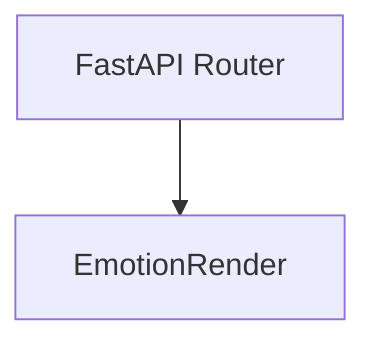
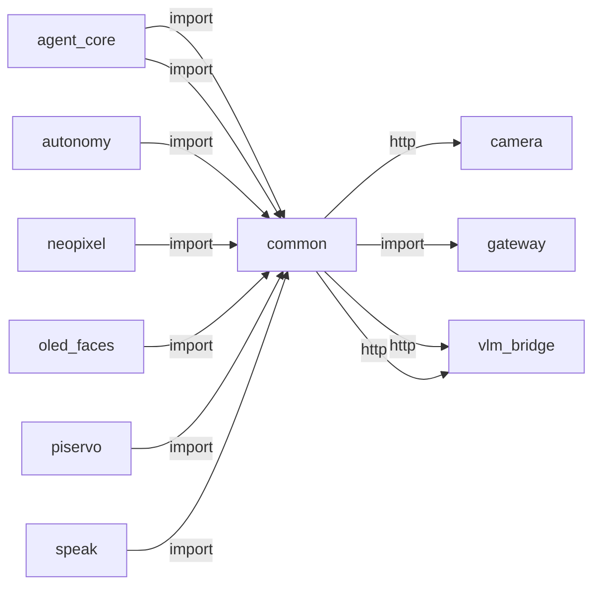

# common

> **Kanonik duygu sözlüğü (eyes/LEDs/ears/tone tek taksonomi)**

## Kimlik
| Alan | Değer |
| --- | --- |
| Ana sınıf | `EmotionRender` |
| Giriş noktası | `—` |
| Orkestratör | `—` |
| Ana dosya | `modules/common/emotion_vocab.py` |
| Katman | Paylaşılan |
| Port | — |
| Arduino | Hayır |
| Sınıf sayısı | 2 |
| Endpoint sayısı | 0 |

## İsimlendirilmiş Bileşenler (Sınıflar)

#### `EmotionRender` — `modules/common/emotion_vocab.py`
- **Görev:** Resolved render hints for a canonical emotion.
- **Kalıtım:** —
- **Oluşturduğu bileşenler:** —
- **Metodlar:** —

#### `EmotionVocab` — `modules/common/emotion_vocab.py`
- **Görev:** Resolver around the canonical emotion config.
- **Kalıtım:** —
- **Oluşturduğu bileşenler:** —
- **Metodlar:** `canonical()`, `render()`, `is_known()`, `canonical_keys()`


## API — Endpoint → Handler → Servis

| HTTP | Path | Handler | Çağırdığı servis | Açıklama |
| --- | --- | --- | --- | --- |


## Config Bölümleri
- —

## Dış İlişkiler (Bu modül → diğerleri)

| Hedef modül | Bağlantı tipi | Detay | Neden |
| --- | --- | --- | --- |
| [[camera]] | http | calls path `/camera/healthz` | `common` HTTP ile `camera` modülüne erişir: Kamera stream veya snapshot ister. |
| [[gateway]] | import | url | `common` içinde `url` import edilir; `gateway` modülünün yeteneğini kullanır (FastAPI API bootstrapper, tüm modülleri mount eder). |
| [[vlm_bridge]] | http | calls path `/vlm/context/latest` | `common` gateway veya doğrudan HTTP ile `vlm_bridge` API'sini çağırır (calls path `/vlm/context/latest`). |
| [[vlm_bridge]] | http | calls path `/vlm/results/latest` | `common` gateway veya doğrudan HTTP ile `vlm_bridge` API'sini çağırır (calls path `/vlm/results/latest`). |

## Gelen İlişkiler (Diğerleri → bu modül)

| Kaynak modül | Bağlantı tipi | Detay | Neden |
| --- | --- | --- | --- |
| [[agent_core]] | import | vision_availability | `agent_core` kod içinde `common` modülünü import eder (`vision_availability`) — Kanonik duygu sözlüğü (eyes/LEDs/ears/tone tek taksonomi). |
| [[agent_core]] | import | emotion_vocab | `agent_core` `common` modülünden `emotion_vocab` kullanır: Kanonik duygu taksonomisi (tone/LED/yüz) için ortak sözlük. |
| [[autonomy]] | import | emotion_vocab | `autonomy` `common` modülünden `emotion_vocab` kullanır: Kanonik duygu taksonomisi (tone/LED/yüz) için ortak sözlük. |
| [[neopixel]] | import | emotion_vocab | 23 duygu paleti emotion_vocab ile hizalanır. |
| [[oled_faces]] | import | emotion_vocab | Yüz ifadesi ve duygu taksonomisini ortak sözlükten alır. |
| [[piservo]] | import | emotion_vocab | Kulak pozisyonları duygu sözlüğü ile eşlenir. |
| [[speak]] | import | emotion_vocab | Duygu tonu ve emotion_vocab ile TTS tonunu eşler. |

## İç Mimari (otomatik çıkarım)



## Modül Etkileşim Haritası



---

# Tam Kaynak Arşivi

### `modules/common/README.md` (45 satır)

```markdown
# common — Shared Helpers

Dependency-light helpers shared across SentryBOT modules. Importable from any
service without pulling heavy module graphs.

## Canonical Emotion Vocabulary

`emotion_vocab.py` is the **single source of truth** that unifies the three
historically divergent emotion vocabularies:

| Subsystem        | Old vocabulary                         |
|------------------|----------------------------------------|
| autonomy (mood)  | ~6 labels (`joy`, `sadness`, `tired`…) |
| oled_faces       | ~13 event labels (`happy`, `sad`…)     |
| neopixel         | ~23 palette files                      |

Every subsystem now resolves its incoming label to a **canonical** key and
reads shared render hints, so eyes (OLED), LEDs (NeoPixel), ears (PiServo),
head body-language and TTS tone all agree on one emotion.

### Usage

```python
from modules.common.emotion_vocab import get_vocab

vocab = get_vocab()
vocab.canonical("happy")        # -> "joy"
r = vocab.render("happy")       # -> EmotionRender(...)
r.oled                          # -> "happy"   (face bitmap)
r.palette                       # -> "joy"     (neopixel palette file)
r.effect                        # -> "RAINBOW_CYCLE"
r.ears                          # -> "joy"     (piservo pose key)
r.tone                          # -> "joy"     (speak TTS tone)
r.rgb                           # -> (0, 200, 60)
```

### Config

`config/emotions.yml` defines:

- `aliases` — canonical → alias labels
- `render`  — per-canonical render hints (`oled`, `palette`, `effect`, `ears`, `tone`, `rgb`)
- `default_canonical` — fallback when a label is unknown (`neutral`)

To add or retune an emotion, edit the YAML only — no code changes required.
```

### `modules/common/__init__.py` (23 satır)

```python
"""Shared, dependency-light helpers used across SentryBOT modules.

Currently hosts the canonical emotion vocabulary so eyes, LEDs, ears, body
language and TTS tone all agree on a single emotion taxonomy.
"""

from .emotion_vocab import (
    EmotionRender,
    EmotionVocab,
    canonical_emotion,
    emotion_render,
    get_vocab,
    load_vocab,
)

__all__ = [
    "EmotionRender",
    "EmotionVocab",
    "canonical_emotion",
    "emotion_render",
    "get_vocab",
    "load_vocab",
]
```

### `modules/common/config/emotions.yml` (66 satır)

```yaml
# SentryBOT — Canonical Emotion Vocabulary
#
# Single source of truth that unifies the three historical emotion vocabularies
# (autonomy mood ~6, oled_faces events ~13, neopixel palettes ~23).
#
# Every subsystem resolves its incoming label to a canonical key, then reads the
# render hints below. This keeps eyes (OLED), LEDs (NeoPixel), ears (PiServo),
# head body-language and TTS tone aligned for one emotion.

aliases:
  neutral:    [calm, idle, default, normal]
  joy:        [happy, happiness, glad, cheerful, amusement, optimism, mutlu, mutlu ol, sevin, neşeli, neseli]
  sadness:    [sad, unhappy, down, grief, disappointment, remorse, uzul, üzül, mutsuz]
  curiosity:  [curious, interested, intrigued, realization, merak, merakli]
  tired:      [sleepy, drowsy, fatigued, exhausted, yoruldum, uyu, uykum var]
  fear:       [scared, afraid, frightened, nervousness, kork, korkut, korkma]
  anger:      [angry, mad, annoyance, annoyed, sinirlen, sinirli, kizgin, kızgın, ofkeli, öfkeli, sinirlenme]
  furious:    [rage, enraged, livid, cok sinirli, çok sinirli, öfke, ofke]
  surprise:   [surprised, shocked, astonished, sasir, şaşır, saskin, şaşkın]
  excitement: [excited, thrilled, energetic, heyecanli, heyecanlı]
  love:       [affection, adoration, admiration, desire, gratitude, sev, seviyorum, askim, aşkım]
  disgust:    [disgusted, repulsed, disapproval]
  confusion:  [confused, disoriented, puzzled, uncertain, kafan karisik, kafan karışık, anlamadim]
  worried:    [worry, anxious, concerned, endiseli, endişeli, kaygili]
  bored:      [boredom, dull, listless, sikildim, sıkıldım, sikinti]
  suspicious: [suspicious, doubtful, side_eye, skeptical]
  awe:        [awe, wonder, amazed, wow]
  gloomy:     [gloomy, melancholy, rainy, overcast]
  cool:       [cool, chill, sunglasses]
  devil:      [devil, mischief, evil, naughty]
  kawaii:     [kawaii, cute, blushing, adorable]
  dead:       [dead, ko, knocked_out, defeated]
  smoking:    [smoking, chill_smoke, relaxed_smoke]
  wired:      [wired, caffeinated, hyper, jittery]
  nervous:    [nervous, sweaty, anxious_face]
  disoriented: [dizzy, woozy, vertigo]

render:
  neutral:     { oled: neutral,     palette: neutral,      effect: BREATHE,        ears: neutral,   tone: neutral,  rgb: [40, 60, 80] }
  joy:         { oled: happy,       palette: joy,          effect: RAINBOW_CYCLE,  ears: joy,       tone: joy,      rgb: [0, 200, 60] }
  sadness:     { oled: sad,         palette: sadness,      effect: BREATHE,        ears: sadness,   tone: sadness,  rgb: [40, 80, 160] }
  curiosity:   { oled: attentive,   palette: curiosity,    effect: COMET,          ears: curiosity, tone: neutral,  rgb: [0, 180, 200] }
  tired:       { oled: tired,       palette: neutral,      effect: BREATHE,        ears: sadness,   tone: sadness,  rgb: [80, 40, 120] }
  fear:        { oled: scared,      palette: fear,         effect: PULSE,          ears: fear,      tone: sadness,  rgb: [200, 0, 120] }
  anger:       { oled: angry,       palette: anger,        effect: PULSE,          ears: anger,     tone: excited,  rgb: [220, 40, 0] }
  furious:     { oled: furious,     palette: anger,        effect: METEOR,         ears: anger,     tone: excited,  rgb: [255, 0, 0] }
  surprise:    { oled: surprised,   palette: surprise,     effect: TWINKLE,        ears: surprise,  tone: excited,  rgb: [255, 200, 0] }
  excitement:  { oled: wired,       palette: excitement,   effect: RAINBOW_CYCLE,  ears: surprise,  tone: excited,  rgb: [255, 120, 0] }
  love:        { oled: lovely,      palette: love,         effect: PULSE,          ears: joy,       tone: joy,      rgb: [255, 40, 100] }
  disgust:     { oled: gloomy,       palette: disgust,      effect: BREATHE,        ears: sadness,   tone: neutral,  rgb: [120, 160, 0] }
  confusion:   { oled: disoriented,  palette: confusion,    effect: TWINKLE,        ears: curiosity, tone: neutral,  rgb: [160, 0, 200] }
  worried:     { oled: nervous,      palette: nervousness,  effect: BREATHE,        ears: fear,      tone: sadness,  rgb: [180, 100, 0] }
  bored:       { oled: bored,        palette: neutral,      effect: BREATHE,        ears: sadness,   tone: neutral,  rgb: [60, 60, 60] }
  suspicious:  { oled: suspicious,   palette: neutral,      effect: BREATHE,        ears: curiosity, tone: neutral,  rgb: [90, 90, 70] }
  awe:         { oled: awe,          palette: surprise,     effect: TWINKLE,        ears: surprise,  tone: excited,  rgb: [255, 220, 120] }
  gloomy:      { oled: gloomy,        palette: sadness,      effect: BREATHE,        ears: sadness,   tone: sadness,  rgb: [50, 70, 110] }
  cool:        { oled: cool,          palette: neutral,      effect: BREATHE,        ears: neutral,   tone: neutral,  rgb: [70, 90, 120] }
  devil:       { oled: devil,         palette: anger,        effect: PULSE,          ears: anger,     tone: excited,  rgb: [200, 0, 60] }
  kawaii:      { oled: kawaii,        palette: love,         effect: TWINKLE,        ears: joy,       tone: joy,      rgb: [255, 140, 180] }
  dead:        { oled: dead,          palette: neutral,      effect: BREATHE,        ears: neutral,   tone: neutral,  rgb: [40, 40, 40] }
  smoking:     { oled: smoking,       palette: neutral,      effect: BREATHE,        ears: neutral,   tone: neutral,  rgb: [80, 80, 80] }
  wired:       { oled: wired,         palette: excitement,   effect: COMET,          ears: surprise,  tone: excited,  rgb: [255, 120, 0] }
  nervous:     { oled: nervous,       palette: nervousness,  effect: PULSE,          ears: fear,      tone: sadness,  rgb: [200, 160, 0] }
  disoriented: { oled: disoriented,   palette: confusion,    effect: TWINKLE,        ears: curiosity, tone: neutral,  rgb: [140, 80, 200] }

default_canonical: neutral
```

### `modules/common/emotion_vocab.py` (162 satır)

```python
"""Canonical emotion vocabulary resolver.

Unifies the historically divergent emotion labels used by autonomy (mood),
oled_faces (events) and neopixel (palettes) into one canonical set with shared
render hints (eyes / LEDs / ears / TTS tone).

Usage::

    from modules.common.emotion_vocab import get_vocab

    vocab = get_vocab()
    vocab.canonical("happy")            # -> "joy"
    vocab.render("happy")               # -> EmotionRender(oled="happy", ...)
    vocab.render("happy").palette       # -> "joy"

The module is intentionally dependency-light (PyYAML only) so any service can
import it without pulling heavy module graphs.
"""

from __future__ import annotations

import logging
import threading
from dataclasses import dataclass, field
from pathlib import Path
from typing import Any, Dict, List, Optional

import yaml

logger = logging.getLogger("common.emotion_vocab")

_CONFIG_PATH = Path(__file__).parent / "config" / "emotions.yml"


@dataclass(frozen=True)
class EmotionRender:
    """Resolved render hints for a canonical emotion."""

    canonical: str
    oled: str = "normal"
    palette: str = "neutral"
    effect: str = "BREATHE"
    ears: str = "neutral"
    tone: str = "neutral"
    rgb: tuple = (40, 60, 80)


@dataclass
class EmotionVocab:
    """Resolver around the canonical emotion config."""

    default_canonical: str = "neutral"
    _alias_to_canonical: Dict[str, str] = field(default_factory=dict)
    _render: Dict[str, EmotionRender] = field(default_factory=dict)

    def canonical(self, label: Optional[str]) -> str:
        """Map any incoming label to its canonical key."""
        key = str(label or "").strip().lower()
        if not key:
            return self.default_canonical
        if key in self._render:
            return key
        return self._alias_to_canonical.get(key, self.default_canonical)

    def render(self, label: Optional[str]) -> EmotionRender:
        """Resolve an incoming label to its render hints."""
        canon = self.canonical(label)
        return self._render.get(canon) or self._render.get(self.default_canonical) or EmotionRender(canon)

    def is_known(self, label: Optional[str]) -> bool:
        key = str(label or "").strip().lower()
        return bool(key) and (key in self._render or key in self._alias_to_canonical)

    def canonical_keys(self) -> List[str]:
        return list(self._render.keys())


def _coerce_rgb(value: Any, fallback: tuple = (40, 60, 80)) -> tuple:
    if isinstance(value, (list, tuple)) and len(value) == 3:
        try:
            return (int(value[0]), int(value[1]), int(value[2]))
        except (TypeError, ValueError):
            return fallback
    return fallback


def load_vocab(path: Optional[Path] = None) -> EmotionVocab:
    """Build an :class:`EmotionVocab` from the YAML config (falls back to defaults)."""
    cfg_path = Path(path) if path else _CONFIG_PATH
    data: Dict[str, Any] = {}
    try:
        with open(cfg_path, "r", encoding="utf-8") as handle:
            data = yaml.safe_load(handle) or {}
    except FileNotFoundError:
        logger.warning("emotion config not found at %s, using minimal defaults", cfg_path)
    except Exception as exc:  # malformed yaml should not crash a service
        logger.warning("failed to load emotion config: %s", exc)

    default_canon = str(data.get("default_canonical", "neutral")).lower()

    render: Dict[str, EmotionRender] = {}
    for canon, hints in (data.get("render") or {}).items():
        canon_key = str(canon).strip().lower()
        hints = hints if isinstance(hints, dict) else {}
        render[canon_key] = EmotionRender(
            canonical=canon_key,
            oled=str(hints.get("oled", "normal")),
            palette=str(hints.get("palette", "neutral")),
            effect=str(hints.get("effect", "BREATHE")),
            ears=str(hints.get("ears", "neutral")),
            tone=str(hints.get("tone", "neutral")),
            rgb=_coerce_rgb(hints.get("rgb")),
        )

    alias_to_canonical: Dict[str, str] = {}
    for canon, aliases in (data.get("aliases") or {}).items():
        canon_key = str(canon).strip().lower()
        alias_to_canonical[canon_key] = canon_key
        if isinstance(aliases, (list, tuple)):
            for alias in aliases:
                alias_to_canonical[str(alias).strip().lower()] = canon_key

    if default_canon not in render:
        render[default_canon] = EmotionRender(default_canon)

    return EmotionVocab(
        default_canonical=default_canon,
        _alias_to_canonical=alias_to_canonical,
        _render=render,
    )


_vocab_lock = threading.Lock()
_vocab_singleton: Optional[EmotionVocab] = None


def get_vocab() -> EmotionVocab:
    """Process-wide cached vocabulary."""
    global _vocab_singleton
    if _vocab_singleton is None:
        with _vocab_lock:
            if _vocab_singleton is None:
                _vocab_singleton = load_vocab()
    return _vocab_singleton


def canonical_emotion(label: Optional[str]) -> str:
    return get_vocab().canonical(label)


def emotion_render(label: Optional[str]) -> EmotionRender:
    return get_vocab().render(label)


__all__ = [
    "EmotionRender",
    "EmotionVocab",
    "load_vocab",
    "get_vocab",
    "canonical_emotion",
    "emotion_render",
]
```

### `modules/common/tests/__init__.py` (0 satır)

```python

```

### `modules/common/tests/test_smoke.py` (58 satır)

```python
"""Smoke + behaviour tests for the canonical emotion vocabulary."""

from __future__ import annotations

import importlib


def test_import():
    module = importlib.import_module("modules.common.emotion_vocab")
    assert hasattr(module, "get_vocab")


def test_config_loader():
    from modules.common.emotion_vocab import load_vocab

    vocab = load_vocab()
    assert vocab.canonical_keys(), "expected at least one canonical emotion"
    assert "neutral" in vocab.canonical_keys()


def test_alias_resolution():
    from modules.common.emotion_vocab import get_vocab

    vocab = get_vocab()
    assert vocab.canonical("happy") == "joy"
    assert vocab.canonical("sad") == "sadness"
    assert vocab.canonical("sleepy") == "tired"
    assert vocab.canonical("angry") == "anger"
    assert vocab.canonical("scared") == "fear"
    # canonical labels resolve to themselves
    assert vocab.canonical("joy") == "joy"


def test_unknown_falls_back_to_default():
    from modules.common.emotion_vocab import get_vocab

    vocab = get_vocab()
    assert vocab.canonical(None) == "neutral"
    assert vocab.canonical("") == "neutral"
    assert vocab.canonical("definitely-not-an-emotion") == "neutral"


def test_render_hints_are_consistent():
    from modules.common.emotion_vocab import emotion_render

    render = emotion_render("happy")
    assert render.canonical == "joy"
    # the alias and the canonical must yield identical render hints
    assert emotion_render("joy") == render
    assert isinstance(render.rgb, tuple) and len(render.rgb) == 3
    assert render.oled and render.palette and render.effect and render.ears and render.tone


def test_service_init():
    # The vocab acts as the module's "service": construct it from defaults.
    from modules.common.emotion_vocab import EmotionVocab, load_vocab

    assert isinstance(load_vocab(), EmotionVocab)
```

### `modules/common/tests/test_vision_availability.py` (41 satır)

```python
from __future__ import annotations

from unittest.mock import MagicMock, patch

from modules.common.vision_availability import (
    camera_live_available,
    remote_vision_cache_available,
    vision_input_available,
)


def test_vision_input_available_from_remote_cache():
    base = "http://127.0.0.1:8080"

    with patch("modules.common.vision_availability.camera_live_available", return_value=False):
        with patch("modules.common.vision_availability.remote_vision_cache_available", return_value=True):
            assert vision_input_available(base) is True


def test_vision_input_unavailable_when_both_missing():
    base = "http://127.0.0.1:8080"

    with patch("modules.common.vision_availability.camera_live_available", return_value=False):
        with patch("modules.common.vision_availability.remote_vision_cache_available", return_value=False):
            assert vision_input_available(base) is False


def test_remote_cache_from_results_latest():
    base = "http://127.0.0.1:8080"
    mock_resp_ctx = MagicMock(status_code=200, json=lambda: {"available": False})
    mock_resp_results = MagicMock(status_code=200, json=lambda: {"results": [{"label": "person"}]})

    with patch("requests.get", side_effect=[mock_resp_ctx, mock_resp_results]):
        assert remote_vision_cache_available(base) is True


def test_camera_live_requires_ok_not_gave_up():
    mock_resp = MagicMock(status_code=200, json=lambda: {"ok": True, "gave_up": True})

    with patch("requests.get", return_value=mock_resp):
        assert camera_live_available("http://127.0.0.1:8080") is False
```

### `modules/common/vision_availability.py` (63 satır)

```python
"""Shared helpers for live camera vs remote vision cache availability."""

from __future__ import annotations

from typing import Any, Dict, Optional


def _parse_json(resp) -> Dict[str, Any]:
    try:
        data = resp.json()
        return data if isinstance(data, dict) else {}
    except Exception:
        return {}


def camera_live_available(base_url: str, *, timeout_s: float = 0.5) -> bool:
    """True when gateway camera healthz reports a live frame."""
    try:
        import requests

        from modules.gateway.url import gateway_url

        resp = requests.get(gateway_url(base_url, "/camera/healthz"), timeout=timeout_s)
        if resp.status_code != 200:
            return False
        data = _parse_json(resp)
        return bool(data.get("ok")) and not bool(data.get("gave_up", False))
    except Exception:
        return False


def remote_vision_cache_available(base_url: str, *, timeout_s: float = 0.6) -> bool:
    """True when VLM bridge has remote-ingested context or detection cache."""
    try:
        import requests

        from modules.gateway.url import gateway_url

        ctx = requests.get(gateway_url(base_url, "/vlm/context/latest"), timeout=timeout_s)
        if ctx.status_code == 200:
            data = _parse_json(ctx)
            if data.get("available"):
                return True
        results = requests.get(
            gateway_url(base_url, "/vlm/results/latest"),
            params={"limit": 1},
            timeout=timeout_s,
        )
        if results.status_code == 200:
            data = _parse_json(results)
            items = data.get("results")
            if isinstance(items, list) and items:
                return True
    except Exception:
        return False
    return False


def vision_input_available(base_url: str, *, timeout_s: float = 0.6) -> bool:
    """Live camera OR remote vision cache is usable for agent/VLM tools."""
    if camera_live_available(base_url, timeout_s=min(timeout_s, 0.5)):
        return True
    return remote_vision_cache_available(base_url, timeout_s=timeout_s)
```
