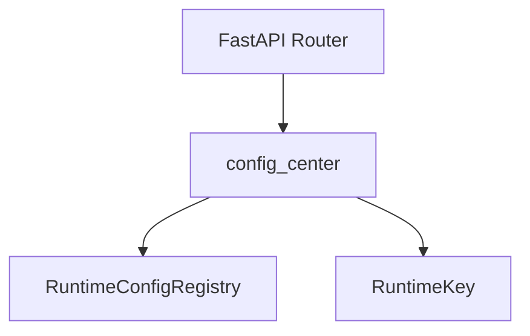
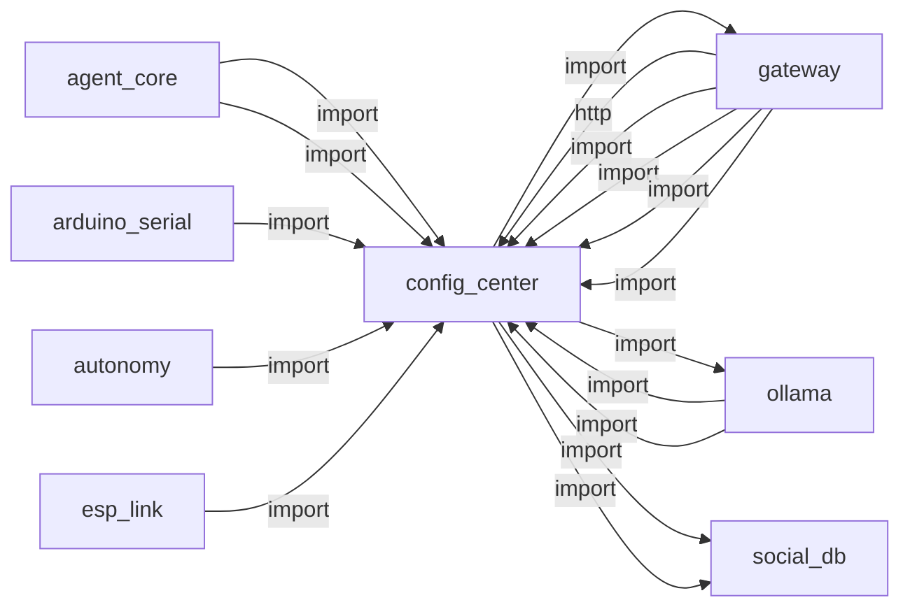
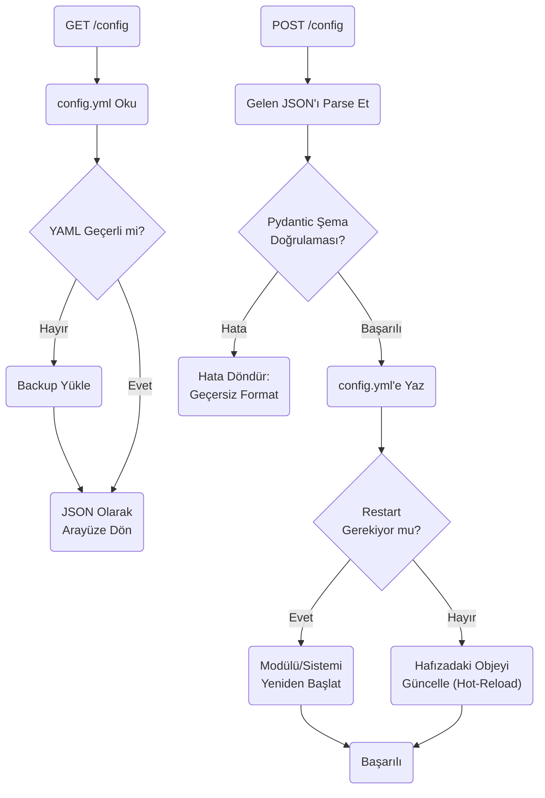
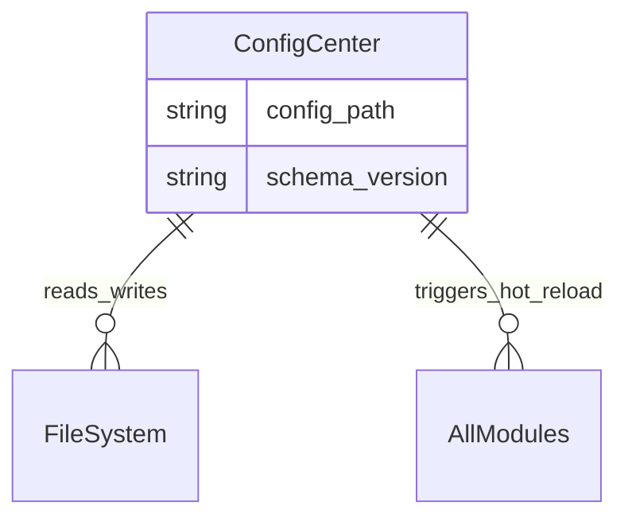

# config_center

> **Merkezi config okuma/yazma, hot-reload**

## Kimlik
| Alan | Değer |
| --- | --- |
| Ana sınıf | `—` |
| Giriş noktası | `create_app()` |
| Orkestratör | `—` |
| Ana dosya | `modules/config_center/xConfigCenterService.py` |
| Katman | Arka Plan |
| Port | — |
| Arduino | Hayır |
| Sınıf sayısı | 2 |
| Endpoint sayısı | 12 |

## İsimlendirilmiş Bileşenler (Sınıflar)

#### `RuntimeConfigRegistry` — `modules/config_center/services/runtime_registry.py`
- **Görev:** Thread-safe registry mapping ``module.key`` -> :class:`RuntimeKey`.
- **Kalıtım:** —
- **Oluşturduğu bileşenler:** `RLock`
- **Metodlar:** `register()`, `unregister()`, `list_keys()`, `get()`, `get_value()`, `set()`, `bulk_set()`, `audit_log()`

#### `RuntimeKey` — `modules/config_center/services/runtime_registry.py`
- **Görev:** Descriptor for a single hot-applyable configuration key.
- **Kalıtım:** —
- **Oluşturduğu bileşenler:** —
- **Metodlar:** `to_dict()`


## API — Endpoint → Handler → Servis

| HTTP | Path | Handler | Çağırdığı servis | Açıklama |
| --- | --- | --- | --- | --- |
| GET | `/ui` | `ui()` | — | Serve static assets for the Config Center UI under /config/static/* |
| GET | `/static/{file_path:path}` | `serve_static()` | — | Serve static assets for the Config Center UI under /config/static/* |
| GET | `/list` | `list_modules()` | — | — |
| GET | `/get` | `get_config()` | — | — |
| GET | `/raw` | `get_config_raw()` | — | — |
| PUT | `/set` | `set_config()` | — | — |
| POST | `/register` | `register()` | — | — |
| GET | `/runtime/list` | `runtime_list()` | — | — |
| GET | `/runtime/get` | `runtime_get()` | — | Scan modules/*/config/config.yml and register missing panels automatically. |
| POST | `/runtime/set` | `runtime_set()` | — | Scan modules/*/config/config.yml and register missing panels automatically. |
| GET | `/runtime/audit` | `runtime_audit()` | — | Scan modules/*/config/config.yml and register missing panels automatically. |
| POST | `/scan` | `scan_and_register()` | — | Scan modules/*/config/config.yml and register missing panels automatically. |

## Config Bölümleri
- `server`
- `modules`

## Dış İlişkiler (Bu modül → diğerleri)

| Hedef modül | Bağlantı tipi | Detay | Neden |
| --- | --- | --- | --- |
| [[gateway]] | import | url | Runtime config ve modül registry gateway ile senkronize edilir. |
| [[ollama]] | import | services | `config_center` içinde `services` import edilir; `ollama` modülünün yeteneğini kullanır (Ollama LLM chat, persona yönetimi, JSON/XML parse). |
| [[social_db]] | import | get_default | `config_center` içinde `get_default` import edilir; `social_db` modülünün yeteneğini kullanır (SQLite kişi hafızası, ilişki/tanıma seviyeleri). |
| [[social_db]] | import | db | `config_center` içinde `db` import edilir; `social_db` modülünün yeteneğini kullanır (SQLite kişi hafızası, ilişki/tanıma seviyeleri). |

## Gelen İlişkiler (Diğerleri → bu modül)

| Kaynak modül | Bağlantı tipi | Detay | Neden |
| --- | --- | --- | --- |
| [[agent_core]] | import | agent_yaml_loader | `agent_core` `config_center` modülünden `agent_yaml_loader` kullanır: config/agent.yaml dosyasından ayar okur. |
| [[agent_core]] | import | gemini_model | `agent_core` kod içinde `config_center` modülünü import eder (`gemini_model`) — Merkezi config okuma/yazma, hot-reload. |
| [[arduino_serial]] | import | agent_yaml_loader | `arduino_serial` `config_center` modülünden `agent_yaml_loader` kullanır: config/agent.yaml dosyasından ayar okur. |
| [[autonomy]] | import | log_redact | `autonomy` kod içinde `config_center` modülünü import eder (`log_redact`) — Merkezi config okuma/yazma, hot-reload. |
| [[esp_link]] | import | agent_yaml_loader | `esp_link` `config_center` modülünden `agent_yaml_loader` kullanır: config/agent.yaml dosyasından ayar okur. |
| [[gateway]] | http | calls path `/config` | `gateway` → `config_center`: Merkezi yapılandırma okur/yazar. |
| [[gateway]] | import | agent_yaml_loader | `gateway` `config_center` modülünden `agent_yaml_loader` kullanır: config/agent.yaml dosyasından ayar okur. |
| [[gateway]] | import | config_loader | `gateway` kod içinde `config_center` modülünü import eder (`config_loader`) — Merkezi config okuma/yazma, hot-reload. |
| [[gateway]] | import | api | `gateway` kod içinde `config_center` modülünü import eder (`api`) — Merkezi config okuma/yazma, hot-reload. |
| [[gateway]] | import | services | `gateway` kod içinde `config_center` modülünü import eder (`services`) — Merkezi config okuma/yazma, hot-reload. |
| [[ollama]] | import | log_redact | LLM model ve persona ayarlarını merkezi config'den okur. |
| [[ollama]] | import | agent_yaml_loader | LLM model ve persona ayarlarını merkezi config'den okur. |
| [[ollama]] | import | gemini_model | LLM model ve persona ayarlarını merkezi config'den okur. |
| [[speak]] | import | agent_yaml_loader | config/agent.yaml içindeki speak ayarlarını okur. |
| [[speech]] | import | agent_yaml_loader | `speech` `config_center` modülünden `agent_yaml_loader` kullanır: config/agent.yaml dosyasından ayar okur. |
| [[vlm_bridge]] | import | agent_yaml_loader | `vlm_bridge` `config_center` modülünden `agent_yaml_loader` kullanır: config/agent.yaml dosyasından ayar okur. |
| [[vlm_bridge]] | import | gemini_model | `vlm_bridge` kod içinde `config_center` modülünü import eder (`gemini_model`) — Merkezi config okuma/yazma, hot-reload. |

## İç Mimari (otomatik çıkarım)



## Modül Etkileşim Haritası



### Mimari diyagram 1


### Mimari diyagram 2


---

# Tam Kaynak Arşivi

### `modules/config_center/README.md` (22 satır)

```markdown
# Config Center

Modül config.yml dosyalarını görüntüleme, düzenleme ve panel ekleme (Blynk benzeri sürükle-bırak) arayüzü.

## API
- GET `/config/healthz`
- GET `/config/list`
- GET `/config/get?module=<name>`
- GET `/config/raw?module=<name>` (YAML dosyasını indirir)
- PUT `/config/set?module=<name>` (Body: text/plain YAML)
- POST `/config/register` (Body: { name, path })
- POST `/config/scan` (modüller altında config/config.yml dosyalarını otomatik bulur ve ekler)
- GET `/config/ui` (HTML liste)

## Özellikler
- Panelleri sürükle-bırak ile yeniden sırala (tarayıcıda saklanır)
- JSON/YAML görünüm toggle’ı
- Raw metin gösterimi
- Düzenle/Kaydet/Vazgeç ile YAML düzenleme (kaydetmeden önce YAML doğrulaması yapılır, dosya backup alınır)
- Otomatik kaydet (varsayılan açık) – düzenleme sırasında 600ms debounce ile dosyaya yazar
- Otomatik tarama – UI yüklenirken ve “Otomatik Tara” ile modülleri keşfeder
- Panel Ekle ile yeni YAML dosyası için panel tanımlama (config_center/config.yml içine best-effort persist)
```

### `modules/config_center/__init__.py` (1 satır)

```python
"""Config Center: read-only view of all module configs with a simple list UI."""
```

### `modules/config_center/agent_yaml_loader.py` (81 satır)

```python
from __future__ import annotations

import os
from pathlib import Path
from typing import Any, Dict, Iterable, Optional

import yaml


def _repo_root() -> Path:
    # modules/config_center/agent_yaml_loader.py -> repo root is 2 parents up
    return Path(__file__).resolve().parents[2]


def _candidate_paths(explicit_path: Optional[str | os.PathLike[str]] = None) -> Iterable[Path]:
    if explicit_path:
        yield Path(explicit_path)

    env_path = str(os.getenv("AGENT_CFG", "")).strip()
    if env_path:
        yield Path(env_path)

    yield _repo_root() / "config" / "agent.yaml"
    yield Path("config") / "agent.yaml"


def resolve_agent_cfg_path(explicit_path: Optional[str | os.PathLike[str]] = None) -> Path:
    seen: set[str] = set()
    checked: list[str] = []

    for candidate in _candidate_paths(explicit_path):
        norm = os.path.normcase(os.path.normpath(str(candidate)))
        if norm in seen:
            continue
        seen.add(norm)
        checked.append(str(candidate))

        if candidate.exists() and candidate.is_file():
            return candidate

    searched = ", ".join(checked) if checked else "<none>"
    raise FileNotFoundError(
        "agent.yaml not found. Set AGENT_CFG or create config/agent.yaml. "
        f"Searched: {searched}"
    )


def load_agent_config(explicit_path: Optional[str | os.PathLike[str]] = None) -> Dict[str, Any]:
    from modules.config_center.runtime_profile import apply_runtime_profile

    cfg_path = resolve_agent_cfg_path(explicit_path)
    with open(cfg_path, "r", encoding="utf-8") as f:
        raw = yaml.safe_load(f) or {}

    if not isinstance(raw, dict):
        raise ValueError(f"agent.yaml must be a mapping at top-level: {cfg_path}")

    from modules.config_center.google_keys import inject_google_api_key
    from modules.gateway.url import gateway_base_from_agent_cfg, rewrite_loopback_urls

    cfg = apply_runtime_profile(raw)
    cfg = inject_google_api_key(cfg)
    base = gateway_base_from_agent_cfg(cfg)
    return rewrite_loopback_urls(cfg, base)


def require_dict_section(cfg: Dict[str, Any], section: str) -> Dict[str, Any]:
    data = cfg.get(section)
    if not isinstance(data, dict):
        raise KeyError(f"agent.yaml missing required section: {section}")
    return data


def deep_merge(base: Dict[str, Any], override: Dict[str, Any]) -> Dict[str, Any]:
    out = dict(base)
    for key, value in override.items():
        if isinstance(value, dict) and isinstance(out.get(key), dict):
            out[key] = deep_merge(dict(out[key]), value)
        else:
            out[key] = value
    return out
```

### `modules/config_center/api/__init__.py` (1 satır)

```python
# api namespace
```

### `modules/config_center/api/router.py` (272 satır)

```python
from __future__ import annotations
from typing import Any, Dict, List, Optional
from pathlib import Path
from datetime import datetime
import shutil
import yaml

from fastapi import APIRouter, Body, Query, Response
from fastapi.staticfiles import StaticFiles
from fastapi.responses import HTMLResponse, FileResponse

try:
    from ..services.runtime_registry import (
        RuntimeConfigRegistry,
        get_default_registry,
    )
    from ..services.yaml_runtime_apply import apply_module_yaml
except Exception:  # pragma: no cover - allow degraded imports
    RuntimeConfigRegistry = None  # type: ignore
    get_default_registry = lambda: None  # type: ignore
    apply_module_yaml = None  # type: ignore


def _read_yaml(path: Path) -> Any:
    with open(path, "r", encoding="utf-8") as f:
        return yaml.safe_load(f)


def get_router(cfg: Dict[str, Any], registry: Optional["RuntimeConfigRegistry"] = None) -> APIRouter:
    """Config Center API router.

    Endpoints:
    - GET   /config/list       -> Known modules (name, path)
    - GET   /config/get        -> Parsed YAML content (JSON)
    - GET   /config/raw        -> Raw YAML content (download)
    - PUT   /config/set        -> Save YAML (validates, backups)
    - POST  /config/register   -> Register a module manually (kept for completeness)
    - POST  /config/scan       -> Auto-discover modules/*/config/config.yml and register missing
    - GET   /config/ui         -> Serve static UI index.html
    - MOUNT /config/static     -> Serve static assets (css/js)
    """

    r = APIRouter(prefix="/config", tags=["config_center"])

    modules: List[Dict[str, str]] = list(cfg.get("modules", []))
    runtime_registry = registry if registry is not None else get_default_registry()
    repo_root = Path(__file__).resolve().parents[3]
    cfg_file_guess = Path(__file__).resolve().parents[1] / "config" / "config.yml"

    def _is_within_repo(p: Path) -> bool:
        try:
            p.resolve().relative_to(repo_root)
            return True
        except Exception:
            return False

    def _backup_file(p: Path) -> None:
        try:
            ts = datetime.utcnow().strftime("%Y%m%d-%H%M%S")
            backup = p.with_suffix(p.suffix + f".bak-{ts}")
            shutil.copy2(p, backup)
        except Exception:
            # best-effort backup; ignore errors
            pass

    def _persist_modules_if_possible() -> None:
        """Persist current modules list into this module's config.yml, if present."""
        try:
            conf = {}
            if cfg_file_guess.exists():
                conf = yaml.safe_load(cfg_file_guess.read_text(encoding="utf-8")) or {}
            conf["modules"] = modules
            # backup and write
            if cfg_file_guess.exists():
                _backup_file(cfg_file_guess)
            cfg_file_guess.write_text(
                yaml.safe_dump(conf, sort_keys=False, allow_unicode=True),
                encoding="utf-8",
            )
        except Exception:
            # Do not crash API because of persistence issues
            pass

    # --- Static UI ---
    static_dir = Path(__file__).resolve().parents[1] / "static"

    @r.get("/ui", response_class=HTMLResponse)
    def ui():
        index_file = static_dir / "index.html"
        if not index_file.exists():
            return HTMLResponse("<h1>Config Center UI not found</h1>", status_code=404)
        return HTMLResponse(index_file.read_text(encoding="utf-8"))

    @r.get("/static/{file_path:path}")
    def serve_static(file_path: str):
        """Serve static assets for the Config Center UI under /config/static/*"""
        target = (static_dir / file_path).resolve()
        try:
            # prevent path traversal
            target.relative_to(static_dir.resolve())
        except Exception:
            return Response(status_code=403, content="invalid path")
        if not target.exists() or not target.is_file():
            return Response(status_code=404)
        return FileResponse(str(target))

    # --- Core endpoints ---
    @r.get("/list")
    def list_modules():
        return modules

    @r.get("/get")
    def get_config(module: str):
        item = next((m for m in modules if m.get("name") == module), None)
        if not item:
            return Response(status_code=404, content="module not found")
        raw_path = item.get("path")
        if not raw_path:
            return Response(status_code=404, content="path not set")
        # Normalize path relative to repo_root when needed
        p = Path(raw_path)
        if not p.is_absolute():
            p = (repo_root / raw_path).resolve()
        if not p.exists() or not p.is_file() or not _is_within_repo(p):
            return Response(status_code=404, content="file not found")
        try:
            data = _read_yaml(p)
        except Exception as e:
            return Response(status_code=400, content=f"yaml parse error: {e}")
        # FastAPI will serialize dict/list to JSON automatically
        return data

    @r.get("/raw")
    def get_config_raw(module: str):
        item = next((m for m in modules if m.get("name") == module), None)
        if not item:
            return Response(status_code=404, content="module not found")
        raw_path = item.get("path")
        if not raw_path:
            return Response(status_code=404, content="path not set")
        p = Path(raw_path)
        if not p.is_absolute():
            p = (repo_root / raw_path).resolve()
        if not p.exists() or not p.is_file() or not _is_within_repo(p):
            return Response(status_code=404, content="file not found")
        text = p.read_text(encoding="utf-8")
        return Response(
            content=text,
            media_type="text/yaml",
            headers={"Content-Disposition": f"attachment; filename={module}.yml"},
        )

    @r.put("/set")
    def set_config(
        module: str,
        body: str = Body(..., media_type="text/plain"),
        apply_runtime: bool = Query(default=True),
    ):
        item = next((m for m in modules if m.get("name") == module), None)
        if not item:
            return Response(status_code=404, content="module not found")
        raw_path = item.get("path")
        if not raw_path:
            return Response(status_code=404, content="path not set")
        p = Path(raw_path)
        if not p.is_absolute():
            p = (repo_root / raw_path).resolve()
        if not _is_within_repo(p):
            return Response(status_code=403, content="path outside workspace")
        try:
            new_doc = yaml.safe_load(body)
        except Exception as e:
            return Response(status_code=400, content=f"yaml validation error: {e}")
        if p.exists():
            _backup_file(p)
        p.write_text(body, encoding="utf-8")
        runtime_payload: Dict[str, Any] = {"skipped": True}
        if (
            apply_runtime
            and apply_module_yaml is not None
            and runtime_registry is not None
            and isinstance(new_doc, dict)
        ):
            runtime_payload = apply_module_yaml(runtime_registry, module, new_doc)
        elif apply_runtime:
            runtime_payload = {"skipped": True, "reason": "no_registry_or_invalid_doc"}
        return {"ok": True, "runtime_apply": runtime_payload}

    @r.post("/register")
    def register(name: str = Body(...), path: str = Body(...)):
        p = Path(path)
        if not p.is_absolute():
            p = (repo_root / path).resolve()
        if not p.exists() or not p.is_file():
            return Response(status_code=404, content="path not found")
        if not _is_within_repo(p):
            return Response(status_code=403, content="path outside workspace")
        entry = {"name": name, "path": str(p.relative_to(repo_root)).replace("\\", "/")}
        # upsert by name
        idx = next((i for i, m in enumerate(modules) if m.get("name") == name), -1)
        if idx == -1:
            modules.append(entry)
        else:
            modules[idx] = entry
        _persist_modules_if_possible()
        return {"ok": True}

    # --- Runtime registry endpoints ---
    @r.get("/runtime/list")
    def runtime_list(module: Optional[str] = Query(default=None)):
        if runtime_registry is None:
            return {"ok": False, "error": "runtime_registry_unavailable", "keys": []}
        return {"ok": True, "keys": runtime_registry.list_keys(module=module)}

    @r.get("/runtime/get")
    def runtime_get(key: str = Query(...)):
        if runtime_registry is None:
            return Response(status_code=503, content="runtime registry unavailable")
        try:
            module, name = key.split(".", 1)
        except ValueError:
            return Response(status_code=400, content="invalid key")
        entry = runtime_registry.get(module, name)
        if entry is None:
            return Response(status_code=404, content="key not found")
        return entry

    @r.post("/runtime/set")
    def runtime_set(body: Dict[str, Any] = Body(...)):
        if runtime_registry is None:
            return {"ok": False, "error": "runtime_registry_unavailable"}
        actor = str(body.get("actor", "admin"))
        source = str(body.get("source", "api"))
        items = body.get("items")
        if isinstance(items, dict):
            results = runtime_registry.bulk_set(items, actor=actor, source=source)
            return {"ok": all(r.get("ok") for r in results), "results": results}
        key = str(body.get("key", "")).strip()
        if not key:
            return {"ok": False, "error": "missing_key"}
        try:
            module, name = key.split(".", 1)
        except ValueError:
            return {"ok": False, "error": "invalid_key"}
        return runtime_registry.set(module, name, body.get("value"), actor=actor, source=source)

    @r.get("/runtime/audit")
    def runtime_audit(limit: int = Query(50, ge=1, le=500)):
        if runtime_registry is None:
            return {"ok": False, "error": "runtime_registry_unavailable", "events": []}
        return {"ok": True, "events": runtime_registry.audit_log(limit=limit)}

    @r.post("/scan")
    def scan_and_register():
        """Scan modules/*/config/config.yml and register missing panels automatically."""
        base = repo_root / "modules"
        found: List[Dict[str, str]] = []
        for modcfg in sorted(base.glob("*/config/config.yml")):
            name = modcfg.parents[1].name  # modules/<name>/config/config.yml
            rel = str(modcfg.relative_to(repo_root)).replace("\\", "/")
            found.append({"name": name, "path": rel})
        existing_names = {m.get("name") for m in modules}
        added: List[Dict[str, str]] = []
        for it in found:
            if it["name"] not in existing_names:
                modules.append(it)
                added.append(it)
        if added:
            _persist_modules_if_possible()
        return {"ok": True, "added": added, "total": len(modules)}

    return r
```

### `modules/config_center/architecture_config_center.md` (50 satır)

```markdown
# Config Center Modülü Mimarisi

Config Center modülü (`modules/config_center`), sistemdeki tüm `config.yml` ve `.json` yapılandırma dosyalarının okunup, doğrulanıp (validate) anlık olarak değiştirilmesini sağlayan yönetim panelinin arka yüzüdür.

## 🏗️ İş Akışı ve Karar Mekanizmaları (Flowchart)


## 🔄 İlişkisel Etkileşimler (Veri Akışı)


## ⚙️ Detaylı Karar Mantığı (if/else)

1. **Şema Doğrulaması (Validation)**
   - Pydantic modelleri devreye girer. **`if`** `volume` parametresi (0-100) aralığı yerine "yüz" veya `-50` gelmişse, sistem bunu `config.yml` dosyasına yazmayı reddeder. Böylece botun başlamama riski ortadan kalkar.
2. **Hot Reload vs Restart (Soğuk/Sıcak Yenileme)**
   - Bazı ayarlar değiştikten sonra anında geçerli olur (Örn: konuşma hızı, otonomi algı hassasiyeti). Bunlar için ram üzerindeki sınıfların property değerleri ezilir (`Hot-reload`).
   - Fakat seri haberleşme portu, baudrate, kamera backend'i (OpenCV -> PiCamera) gibi derin değişiklikler varsa, **`if`** `key in REQUIRED_RESTART_KEYS`: Gateway'e yeniden başlama (restart) sinyali atılır.
```

### `modules/config_center/config/config.yml` (50 satır)

```yaml
server:
  host: 0.0.0.0
  port: 8099
modules:
- name: gateway
  path: modules/gateway/config/config.yml
- name: camera
  path: modules/camera/config/config.yml
- name: arduino
  path: modules/arduino_serial/config/config.yml
- name: neopixel
  path: modules/neopixel/config/config.yml
- name: interactions
  path: modules/interactions/config/config.yml
- name: speak
  path: modules/speak/config/config.yml
- name: speech
  path: modules/speech/config/config.yml
- name: ollama
  path: modules/ollama/config/config.yml
- name: piservo
  path: modules/piservo/config/config.yml
- name: mutagen
  path: modules/mutagen/config/config.yml
- name: ota
  path: modules/ota/config/config.yml
- name: hardware
  path: modules/hardware/config/config.yml
- name: telemetry
  path: modules/telemetry/config/config.yml
- name: diagnostics
  path: modules/diagnostics/config/config.yml
- name: state_manager
  path: modules/state_manager/config/config.yml
- name: scheduler
  path: modules/scheduler/config/config.yml
- name: notifier
  path: modules/notifier/config/config.yml
- name: calibration
  path: modules/calibration/config/config.yml
- name: animate
  path: modules/animate/config/config.yml
- name: arduino_serial
  path: modules/arduino_serial/config/config.yml
- name: config_center
  path: modules/config_center/config/config.yml
- name: logwrapper
  path: modules/logwrapper/config/config.yml
- name: vlm_bridge
  path: modules/vlm_bridge/config/config.yml
```

### `modules/config_center/config_loader.py` (14 satır)

```python
from __future__ import annotations
from pathlib import Path
from typing import Any, Dict
import yaml

_DEFAULT_CFG_PATH = Path(__file__).parent / "config" / "config.yml"


def load_config(path: str | None = None) -> Dict[str, Any]:
    p = Path(path) if path else _DEFAULT_CFG_PATH
    if not p.exists():
        p = _DEFAULT_CFG_PATH
    with open(p, "r", encoding="utf-8") as f:
        return yaml.safe_load(f) or {}
```

### `modules/config_center/gemini_model.py` (6 satır)

```python
"""Default Gemini model id for Google AI Studio (Generative Language API)."""

from __future__ import annotations

# https://ai.google.dev/gemini-api/docs/models — Gemini 3 Flash Preview
DEFAULT_GEMINI_MODEL = "gemma-4-31b-it"
```

### `modules/config_center/google_keys.py` (44 satır)

```python
"""Resolve Google AI Studio API key from agent.yaml + environment."""

from __future__ import annotations

import logging
import os
from typing import Any, Dict

from modules.ollama.services.clients import _sanitize_google_api_key

logger = logging.getLogger("config_center.google_keys")


def resolve_google_api_key(cfg: Dict[str, Any]) -> str:
    google_cfg = cfg.get("google_ai_studio", {})
    if not isinstance(google_cfg, dict):
        google_cfg = {}
    key = _sanitize_google_api_key(google_cfg.get("api_key", ""))
    if not key:
        key = _sanitize_google_api_key(os.getenv("GOOGLE_API_KEY", ""))
    return key


def inject_google_api_key(cfg: Dict[str, Any]) -> Dict[str, Any]:
    """Attach resolved key to cfg without wiping an existing valid value."""
    key = resolve_google_api_key(cfg)
    if not key:
        llm = cfg.get("llm", {}) if isinstance(cfg.get("llm", {}), dict) else {}
        provider = str(llm.get("provider", "")).strip().lower()
        if provider in {"google", "google_ai_studio", "gemini"}:
            logger.warning(
                "runtime_profile uses Google but no API key found — set google_ai_studio.api_key "
                "in config/agent.yaml or export GOOGLE_API_KEY before starting the robot"
            )
        return cfg
    google_cfg = cfg.get("google_ai_studio", {})
    if not isinstance(google_cfg, dict):
        google_cfg = {}
    else:
        google_cfg = dict(google_cfg)
    if not _sanitize_google_api_key(google_cfg.get("api_key", "")):
        google_cfg["api_key"] = key
    cfg["google_ai_studio"] = google_cfg
    return cfg
```

### `modules/config_center/log_redact.py` (14 satır)

```python
from __future__ import annotations

import re

_KEY_IN_URL = re.compile(r"(key=)([^&\s\"']+)", re.IGNORECASE)
_BEARER = re.compile(r"(Bearer\s+)([A-Za-z0-9._\-]+)", re.IGNORECASE)


def redact_secrets(text: object) -> str:
    """Remove API keys and tokens from log-safe strings."""
    msg = str(text or "")
    msg = _KEY_IN_URL.sub(r"\1***", msg)
    msg = _BEARER.sub(r"\1***", msg)
    return msg
```

### `modules/config_center/runtime_profile.py` (94 satır)

```python
"""Apply ``runtime_profile`` from agent.yaml to top-level module sections.

Switch backends by editing only::

    runtime_profile:
      active: google_ai_studio   # or remote_ollama
"""

from __future__ import annotations

from typing import Any, Dict, Iterable, List

from modules.config_center.agent_yaml_loader import deep_merge


def _deep_merge_profile(base: Dict[str, Any], override: Dict[str, Any]) -> Dict[str, Any]:
    """Merge profile patch; do not overwrite with empty strings/null."""
    out = dict(base)
    for key, value in override.items():
        if isinstance(value, dict) and isinstance(out.get(key), dict):
            out[key] = _deep_merge_profile(dict(out[key]), value)
            continue
        if value is None:
            continue
        if isinstance(value, str) and not value.strip():
            continue
        out[key] = value
    return out


_PROFILE_SECTION_KEYS: tuple[str, ...] = (
    "agent",
    "llm",
    "ollama",
    "google_ai_studio",
    "ollama_service",
    "vlm_bridge",
    "arduino_serial",
    "esp_link",
    "speak",
    "speech",
    "tri_layer",
    "realtime_profile",
    "safety",
)


def apply_runtime_profile(cfg: Dict[str, Any]) -> Dict[str, Any]:
    """Merge the active runtime profile into *cfg* (in place) and return it."""
    profile_root = cfg.get("runtime_profile")
    if not isinstance(profile_root, dict):
        return cfg

    active = str(profile_root.get("active", "")).strip()
    profiles = profile_root.get("profiles")
    if not active or not isinstance(profiles, dict):
        return cfg

    patch = profiles.get(active)
    if not isinstance(patch, dict):
        return cfg

    for key in _PROFILE_SECTION_KEYS:
        section_patch = patch.get(key)
        if not isinstance(section_patch, dict):
            continue
        existing = cfg.get(key)
        if isinstance(existing, dict):
            cfg[key] = _deep_merge_profile(dict(existing), section_patch)
        else:
            cfg[key] = dict(section_patch)

    cfg["_runtime_profile_active"] = active
    return cfg


def list_runtime_profiles(cfg: Dict[str, Any]) -> List[str]:
    profile_root = cfg.get("runtime_profile")
    if not isinstance(profile_root, dict):
        return []
    profiles = profile_root.get("profiles")
    if not isinstance(profiles, dict):
        return []
    return sorted(str(name) for name in profiles.keys())


def active_runtime_profile(cfg: Dict[str, Any]) -> str:
    explicit = str(cfg.get("_runtime_profile_active", "")).strip()
    if explicit:
        return explicit
    profile_root = cfg.get("runtime_profile")
    if isinstance(profile_root, dict):
        return str(profile_root.get("active", "")).strip()
    return ""
```

### `modules/config_center/services/__init__.py` (23 satır)

```python
"""Service layer for the Config Center.

Contains the :class:`RuntimeConfigRegistry` shared across the gateway. Modules
register hot-applyable keys at startup; consumers (admin UI, agent_core,
autonomy) call :meth:`RuntimeConfigRegistry.set` to update a value at runtime
and trigger registered apply callbacks. All changes are appended to the
``interaction_events`` table (kind ``config.audit``) when ``social_db`` is
available.
"""

from .runtime_registry import (
    RuntimeConfigRegistry,
    RuntimeKey,
    get_default_registry,
    set_default_registry,
)

__all__ = [
    "RuntimeConfigRegistry",
    "RuntimeKey",
    "get_default_registry",
    "set_default_registry",
]
```

### `modules/config_center/services/runtime_registry.py` (293 satır)

```python
"""Runtime configuration registry.

Modules register hot-applyable keys (with bounds and an apply callback) at
startup. Consumers update values through :meth:`RuntimeConfigRegistry.set` and
the registry dispatches the callback while recording an audit entry in
``social_db.interaction_events`` (kind ``config.audit``) when available.
"""

from __future__ import annotations

import logging
import threading
import time
from dataclasses import dataclass, field
from typing import Any, Callable, Dict, Iterable, List, Optional, Tuple

logger = logging.getLogger("config_center.runtime")

ApplyFn = Callable[[Any], Optional[Dict[str, Any]]]


@dataclass
class RuntimeKey:
    """Descriptor for a single hot-applyable configuration key."""

    name: str
    module: str
    type: str = "string"  # one of: string, int, float, bool, choice, list
    default: Any = None
    minimum: Optional[float] = None
    maximum: Optional[float] = None
    choices: Optional[Tuple[Any, ...]] = None
    description: str = ""
    sensitive: bool = False
    apply_fn: Optional[ApplyFn] = None
    value: Any = None
    updated_at: float = field(default_factory=time.time)
    updated_by: str = "system"

    def to_dict(self, *, redact: bool = True) -> Dict[str, Any]:
        out: Dict[str, Any] = {
            "name": self.name,
            "module": self.module,
            "type": self.type,
            "default": self.default,
            "minimum": self.minimum,
            "maximum": self.maximum,
            "choices": list(self.choices) if self.choices is not None else None,
            "description": self.description,
            "sensitive": self.sensitive,
            "value": self.value,
            "updated_at": self.updated_at,
            "updated_by": self.updated_by,
        }
        if self.sensitive and redact:
            out["value"] = "***"
            out["default"] = "***"
        return out


class RuntimeConfigRegistry:
    """Thread-safe registry mapping ``module.key`` -> :class:`RuntimeKey`."""

    def __init__(self, social_db: Optional[Any] = None) -> None:
        if social_db is None:
            try:
                from modules.social_db import get_default as _social_default  # type: ignore

                social_db = _social_default()
            except Exception:
                social_db = None
        self._social_db = social_db
        self._lock = threading.RLock()
        self._keys: Dict[str, RuntimeKey] = {}

    # ── Registration ──────────────────────────────────────────────────
    def register(
        self,
        module: str,
        name: str,
        *,
        type: str = "string",
        default: Any = None,
        minimum: Optional[float] = None,
        maximum: Optional[float] = None,
        choices: Optional[Iterable[Any]] = None,
        description: str = "",
        sensitive: bool = False,
        apply_fn: Optional[ApplyFn] = None,
    ) -> RuntimeKey:
        key = self._compose(module, name)
        with self._lock:
            existing = self._keys.get(key)
            value = default if existing is None else existing.value
            entry = RuntimeKey(
                name=name,
                module=module,
                type=type,
                default=default,
                minimum=minimum,
                maximum=maximum,
                choices=tuple(choices) if choices is not None else None,
                description=description,
                sensitive=bool(sensitive),
                apply_fn=apply_fn,
                value=value,
                updated_at=time.time() if existing is None else existing.updated_at,
                updated_by="system" if existing is None else existing.updated_by,
            )
            self._keys[key] = entry
            return entry

    def unregister(self, module: str, name: str) -> None:
        with self._lock:
            self._keys.pop(self._compose(module, name), None)

    # ── Access ────────────────────────────────────────────────────────
    def list_keys(self, *, module: Optional[str] = None) -> List[Dict[str, Any]]:
        with self._lock:
            keys = list(self._keys.values())
        if module:
            keys = [k for k in keys if k.module == module]
        keys.sort(key=lambda k: (k.module, k.name))
        return [k.to_dict() for k in keys]

    def get(self, module: str, name: str) -> Optional[Dict[str, Any]]:
        with self._lock:
            entry = self._keys.get(self._compose(module, name))
            return entry.to_dict() if entry else None

    def get_value(self, module: str, name: str, default: Any = None) -> Any:
        with self._lock:
            entry = self._keys.get(self._compose(module, name))
            return entry.value if entry is not None else default

    # ── Mutation ──────────────────────────────────────────────────────
    def set(
        self,
        module: str,
        name: str,
        value: Any,
        *,
        actor: str = "admin",
        source: str = "api",
    ) -> Dict[str, Any]:
        composed = self._compose(module, name)
        with self._lock:
            entry = self._keys.get(composed)
        if entry is None:
            return {"ok": False, "error": "unknown_key", "key": composed}

        coerced, err = self._coerce(entry, value)
        if err:
            return {"ok": False, "error": err, "key": composed}

        applied_payload: Optional[Dict[str, Any]] = None
        if entry.apply_fn is not None:
            try:
                applied_payload = entry.apply_fn(coerced)
            except Exception as exc:
                logger.warning("apply_fn for %s raised: %s", composed, exc)
                return {"ok": False, "error": "apply_failed", "exception": str(exc)}

        prev_value = entry.value
        entry.value = coerced
        entry.updated_at = time.time()
        entry.updated_by = str(actor or "admin")

        self._audit(
            entry,
            previous=prev_value,
            new_value=coerced,
            actor=str(actor or "admin"),
            source=str(source or "api"),
            applied=applied_payload,
        )
        return {
            "ok": True,
            "key": composed,
            "value": coerced if not entry.sensitive else "***",
            "applied": applied_payload or {},
        }

    def bulk_set(self, items: Dict[str, Any], *, actor: str = "admin", source: str = "api") -> List[Dict[str, Any]]:
        results: List[Dict[str, Any]] = []
        for composed, value in (items or {}).items():
            try:
                module, name = self._split(composed)
            except ValueError as exc:
                results.append({"ok": False, "error": str(exc), "key": composed})
                continue
            results.append(self.set(module, name, value, actor=actor, source=source))
        return results

    # ── Audit ────────────────────────────────────────────────────────
    def audit_log(self, *, limit: int = 50) -> List[Dict[str, Any]]:
        if self._social_db is None:
            return []
        try:
            return self._social_db.interaction_events.recent(limit=limit, kind="config.audit")
        except Exception as exc:
            logger.debug("audit fetch failed: %s", exc)
            return []

    # ── Internal ──────────────────────────────────────────────────────
    @staticmethod
    def _compose(module: str, name: str) -> str:
        return f"{str(module).strip()}.{str(name).strip()}"

    @staticmethod
    def _split(composed: str) -> Tuple[str, str]:
        parts = str(composed).split(".", 1)
        if len(parts) != 2 or not parts[0] or not parts[1]:
            raise ValueError(f"invalid runtime key: {composed!r}")
        return parts[0], parts[1]

    def _coerce(self, key: RuntimeKey, value: Any) -> Tuple[Any, Optional[str]]:
        t = (key.type or "string").lower()
        try:
            if t == "int":
                coerced: Any = int(value)
            elif t == "float":
                coerced = float(value)
            elif t == "bool":
                if isinstance(value, str):
                    coerced = value.strip().lower() in {"1", "true", "yes", "on"}
                else:
                    coerced = bool(value)
            elif t == "choice":
                coerced = value
                if key.choices is not None and coerced not in key.choices:
                    return None, f"invalid_choice (allowed={list(key.choices)})"
            elif t == "list":
                if isinstance(value, str):
                    coerced = [v.strip() for v in value.split(",") if v.strip()]
                elif isinstance(value, (list, tuple)):
                    coerced = list(value)
                else:
                    return None, "invalid_list"
            else:
                coerced = str(value) if value is not None else ""
        except (TypeError, ValueError) as exc:
            return None, f"coerce_failed:{exc}"

        if isinstance(coerced, (int, float)):
            if key.minimum is not None and coerced < key.minimum:
                return None, f"below_minimum ({key.minimum})"
            if key.maximum is not None and coerced > key.maximum:
                return None, f"above_maximum ({key.maximum})"
        return coerced, None

    def _audit(
        self,
        key: RuntimeKey,
        *,
        previous: Any,
        new_value: Any,
        actor: str,
        source: str,
        applied: Optional[Dict[str, Any]],
    ) -> None:
        if self._social_db is None:
            return
        payload = {
            "key": self._compose(key.module, key.name),
            "module": key.module,
            "name": key.name,
            "previous": "***" if key.sensitive else previous,
            "new": "***" if key.sensitive else new_value,
            "actor": actor,
            "source": source,
            "applied": applied or {},
        }
        try:
            self._social_db.interaction_events.log("config.audit", payload=payload)
        except Exception as exc:
            logger.debug("audit log failed: %s", exc)


# ── Process-wide default ──────────────────────────────────────────────
_DEFAULT_LOCK = threading.Lock()
_DEFAULT: Optional[RuntimeConfigRegistry] = None


def get_default_registry() -> Optional[RuntimeConfigRegistry]:
    with _DEFAULT_LOCK:
        return _DEFAULT


def set_default_registry(registry: RuntimeConfigRegistry) -> None:
    global _DEFAULT
    with _DEFAULT_LOCK:
        _DEFAULT = registry
```

### `modules/config_center/services/yaml_runtime_apply.py` (73 satır)

```python
"""Map saved module YAML onto :class:`RuntimeConfigRegistry` keys (subset)."""

from __future__ import annotations

from typing import Any, Dict, List, Optional, Tuple

try:
    from .runtime_registry import RuntimeConfigRegistry
except Exception:  # pragma: no cover - degrade import sandbox
    RuntimeConfigRegistry = None  # type: ignore


def _flatten_dict(obj: Dict[str, Any], prefix: str = "") -> Dict[str, Any]:
    out: Dict[str, Any] = {}
    for key, value in (obj or {}).items():
        path = f"{prefix}.{key}" if prefix else str(key)
        if isinstance(value, dict):
            out.update(_flatten_dict(value, path))
        elif isinstance(value, list):
            continue
        else:
            out[path] = value
    return out


def _try_set(registry: "RuntimeConfigRegistry", module: str, name: str, value: Any) -> Tuple[bool, str]:
    outcome = registry.set(module, name, value, actor="config_set", source="yaml_put")
    if outcome.get("ok"):
        return True, f"{module}.{name}"
    return False, f"{module}.{name} ({outcome.get('error')})"


def apply_module_yaml(registry: Optional["RuntimeConfigRegistry"], module: str, doc: Dict[str, Any]) -> Dict[str, Any]:
    """Hot-apply a narrow slice of knobs after YAML is written."""
    applied: List[str] = []
    failed: List[str] = []
    if registry is None or RuntimeConfigRegistry is None:
        return {"ok": True, "applied": [], "failed": [], "requires_runtime_registry": True}

    if module == "vlm_bridge":
        flat = _flatten_dict(doc if isinstance(doc, dict) else {})
        for fk, fv in flat.items():
            if fk == "vision.processing_mode":
                ok, msg = _try_set(registry, "vlm_bridge", "vision.processing_mode", fv)
                (applied if ok else failed).append(msg)
            elif fk.startswith("vision.mode_categories."):
                suffix = fk[len("vision.mode_categories.") :]
                ok, msg = _try_set(registry, "vlm_bridge", f"mode_categories.{suffix}", fv)
                (applied if ok else failed).append(msg)
        modes_block = doc.get("vision", {}).get("modes", {}) if isinstance(doc.get("vision", {}), dict) else {}
        if isinstance(modes_block, dict):
            for k, v in modes_block.items():
                ok, msg = _try_set(registry, "vlm_bridge", f"modes.{k}", v)
                (applied if ok else failed).append(msg)
        return {"ok": len(failed) == 0, "applied": applied, "failed": failed, "requires_runtime_registry": False}

    flat = _flatten_dict(doc if isinstance(doc, dict) else {})
    if module == "camera":
        enabled = flat.get("imx500.enabled")
        confidence = flat.get("imx500.confidence")
        if enabled is not None:
            ok, msg = _try_set(registry, "camera", "imx500.enabled", enabled)
            (applied if ok else failed).append(msg)
        if confidence is not None:
            ok, msg = _try_set(registry, "camera", "imx500.confidence", confidence)
            (applied if ok else failed).append(msg)

    return {
        "ok": len(failed) == 0,
        "applied": applied,
        "failed": failed,
        "requires_runtime_registry": len(applied) == 0,
    }
```

### `modules/config_center/static/css/styles.css` (25 satır)

```css
/* Theme */
:root { --bg:#0f172a; --surface:#111827; --panel:#1f2937; --text:#e5e7eb; --muted:#94a3b8; --accent:#22c55e; --accent2:#60a5fa; --warn:#f59e0b; }
*{box-sizing:border-box}
body{margin:0;font-family:ui-sans-serif,system-ui,-apple-system,Segoe UI,Roboto,Ubuntu,Cantarell,Noto Sans,Helvetica Neue,Arial,"Apple Color Emoji","Segoe UI Emoji";background:var(--bg);color:var(--text)}
header{padding:12px 16px;border-bottom:1px solid #1e293b;display:flex;gap:12px;align-items:center;position:sticky;top:0;background:linear-gradient(180deg,rgba(15,23,42,.98),rgba(15,23,42,.92));backdrop-filter:blur(6px);z-index:10}
.title{font-weight:700}
.search{flex:1}
input[type="search"]{width:100%;padding:8px 10px;background:var(--surface);border:1px solid #1f2937;border-radius:8px;color:var(--text)}
.toolbar{display:flex;gap:8px;align-items:center}
.btn{background:var(--panel);border:1px solid #374151;color:var(--text);border-radius:8px;padding:6px 10px;cursor:pointer}
.btn:hover{border-color:var(--accent2)}
main{padding:16px;display:grid;grid-template-columns:repeat(auto-fill,minmax(280px,1fr));gap:12px;align-items:start}
.panel{background:var(--panel);border:1px solid #374151;border-radius:12px;padding:10px;position:relative;user-select:none;display:flex;flex-direction:column}
.panel.dragging{opacity:.7;outline:2px dashed var(--accent2)}
.panel h3{margin:0 0 6px;font-size:16px;display:flex;justify-content:space-between;align-items:center;gap:6px}
.meta{color:var(--muted);font-size:12px;margin-bottom:8px;word-break:break-all}
.tags{display:flex;flex-wrap:wrap;gap:6px;margin-bottom:8px}
.tag{font-size:11px;padding:2px 6px;border-radius:999px;background:#0b1220;border:1px solid #23314f;color:#93c5fd}
.actions{display:flex;gap:6px;align-items:center;margin-bottom:8px}
.toggle{display:inline-flex;align-items:center;gap:6px;font-size:12px;color:var(--muted)}
.note{width:100%;min-height:64px;padding:8px;background:#0b1220;color:var(--text);border:1px dashed #334155;border-radius:8px;resize:vertical}
.code{font-family:ui-monospace,SFMono-Regular,Menlo,Monaco,Consolas,"Liberation Mono","Courier New",monospace;background:#0b1220;border:1px solid #23314f;border-radius:8px;padding:8px;font-size:12px;max-height:none;overflow:auto;white-space:pre-wrap;flex:1 1 auto;min-height:0;color:var(--text);caret-color:var(--text)}
/* Syntax highlight tokens */
.tok-key{color:#60a5fa}.tok-str{color:#22c55e}.tok-num{color:#f59e0b}.tok-bool{color:#f472b6}.tok-null{color:#94a3b8}.tok-comm{color:#64748b;font-style:italic}
footer{padding:16px;text-align:center;color:var(--muted)}
```

### `modules/config_center/static/index.html` (25 satır)

```html
<!doctype html>
<html>
<head>
  <meta charset="utf-8"/>
  <meta name="viewport" content="width=device-width, initial-scale=1"/>
  <title>Config Center</title>
  <link rel="stylesheet" href="/config/static/css/styles.css"/>
</head>
<body>
  <header>
    <div class="title">Config Center</div>
    <div class="search"><input id="q" type="search" placeholder="Ara: module, path, tag..."/></div>
    <div class="toolbar">
      <button class="btn" id="resetLayout">Yerleşimi Sıfırla</button>
      <button class="btn" id="autoScan">Otomatik Tara</button>
      <label class="toggle"><input type="checkbox" id="viewJson" checked/> JSON görünümü</label>
      <label class="toggle"><input type="checkbox" id="autoSave" checked/> Otomatik kaydet</label>
      <label class="toggle"><input type="checkbox" id="hl" checked/> Renklendir</label>
    </div>
  </header>
  <main id="grid"></main>
  <footer>Taşı-bırak ile panelleri düzenleyin. Notlarınız tarayıcıda saklanır.</footer>
  <script src="/config/static/js/app.js"></script>
</body>
</html>
```

### `modules/config_center/static/js/app.js` (175 satır)

```javascript
/* global window, document, fetch, localStorage */
(function(){
  const grid = document.getElementById('grid');
  const q = document.getElementById('q');
  const viewJson = document.getElementById('viewJson');
  const resetLayout = document.getElementById('resetLayout');
  const hl = document.getElementById('hl');
  const lenMap = {};
  const LS_KEY = 'config_center_layout_v1';
  const LS_NOTES = 'config_center_notes_v1';
  const layout = JSON.parse(localStorage.getItem(LS_KEY) || '[]');
  const notes = JSON.parse(localStorage.getItem(LS_NOTES) || '{}');
  const cacheJson = {}; const cacheRaw = {};

  function saveLayout(){
    const kids = grid && grid.children ? Array.prototype.slice.call(grid.children) : [];
    const order = kids.map(e => e.dataset && e.dataset.name).filter(Boolean);
    localStorage.setItem(LS_KEY, JSON.stringify(order));
  }
  function saveNotes(){ localStorage.setItem(LS_NOTES, JSON.stringify(notes)); }
  function escapeHtml(s){
    return String(s).replace(/&/g,'&amp;').replace(/</g,'&lt;').replace(/>/g,'&gt;').replace(/\"/g,'&quot;').replace(/'/g,'&#39;');
  }
  function highlightJsonText(txt){
    let s = escapeHtml(txt);
    s = s.replace(/\"([^\"\\]|\\.)*\"(?=\s*:)/g, m=>'<span class="tok-key">'+m+'</span>');
    s = s.replace(/\"([^\"\\]|\\.)*\"/g, m=>'<span class="tok-str">'+m+'</span>');
    s = s.replace(/\b(true|false)\b/g,'<span class="tok-bool">$1</span>');
    s = s.replace(/\b(null)\b/g,'<span class="tok-null">$1</span>');
    s = s.replace(/(-?\d+(?:\.\d+)?)/g,'<span class="tok-num">$1</span>');
    return s;
  }
  function highlightYamlText(txt){
    let s = escapeHtml(txt);
    s = s.replace(/(^|\n)(\s*#.*)$/g, (_m,a,b)=> a+'<span class="tok-comm">'+b+'</span>');
    s = s.replace(/(^|\n)(\s*)([^:\n]+)(:)/g, (_m,a,b,c,d)=> a+b+'<span class="tok-key">'+c+'</span>'+d);
    s = s.replace(/(\"[^\"]*\"|'[^']*')/g,'<span class="tok-str">$1</span>');
    s = s.replace(/\b(true|false)\b/g,'<span class="tok-bool">$1</span>');
    s = s.replace(/\b(null)\b/g,'<span class="tok-null">$1</span>');
    s = s.replace(/(-?\d+(?:\.\d+)?)/g,'<span class="tok-num">$1</span>');
    return s;
  }

  function makePanel(mod){
    const card = document.createElement('section'); card.className='panel'; card.draggable=true; card.dataset.name=mod.name;
    const title = document.createElement('h3');
    title.innerHTML = `<span>${mod.name}</span><span style="display:flex;gap:6px;align-items:center;"><a class="btn" href='/config/get?module=${mod.name}' target='_blank'>Aç</a></span>`; card.appendChild(title);
    const meta = document.createElement('div'); meta.className='meta'; meta.textContent=mod.path; card.appendChild(meta);
    const tags = document.createElement('div'); tags.className='tags'; (mod.tags||guessTags(mod)).forEach(t=>{ const el=document.createElement('span'); el.className='tag'; el.textContent=t; tags.appendChild(el);}); card.appendChild(tags);
    const actions = document.createElement('div'); actions.className='actions'; actions.innerHTML = `
      <label class='toggle'><input type='checkbox' class='toggleRaw'/> Raw</label>
      <label class='toggle'><input type='checkbox' class='toggleWrap' checked/> Wrap</label>
      <button class='btn btnEdit'>Düzenle</button>
      <button class='btn btnSave' style='display:none'>Kaydet</button>
      <button class='btn btnCancel' style='display:none'>Vazgeç</button>
    `; card.appendChild(actions);
    const pre = document.createElement('pre'); pre.className='code'; pre.textContent='Yükleniyor...'; card.appendChild(pre);
    const editor = document.createElement('textarea'); editor.className='code'; editor.style.display='none'; editor.style.whiteSpace='pre'; editor.style.overflow='hidden'; editor.spellcheck=false; card.appendChild(editor);
    const note = document.createElement('textarea'); note.className='note'; note.placeholder='Yapışkan notlar (yalnızca bu tarayıcıda saklanır)'; note.value = notes[mod.name] || ''; note.addEventListener('input',()=>{ notes[mod.name]=note.value; saveNotes(); }); card.appendChild(note);

    fetchAndRender(pre,mod,actions);
    const toggleRaw = actions.querySelector('.toggleRaw input'); const toggleWrap = actions.querySelector('.toggleWrap input');
    if (toggleRaw) toggleRaw.addEventListener('change', ()=> fetchAndRender(pre,mod,actions));
    if (toggleWrap) toggleWrap.addEventListener('change', ()=>{ pre.style.whiteSpace = toggleWrap.checked ? 'pre-wrap' : 'pre'; });

    const btnEdit=actions.querySelector('.btnEdit'), btnSave=actions.querySelector('.btnSave'), btnCancel=actions.querySelector('.btnCancel');
    if (btnEdit) btnEdit.addEventListener('click', ()=> startEdit(card,mod,pre,editor,actions));
    if (btnSave) btnSave.addEventListener('click', ()=> saveEdit(card,mod,pre,editor,actions));
    if (btnCancel) btnCancel.addEventListener('click', ()=> cancelEdit(card,pre,editor,actions));

    card.addEventListener('dragstart', e=>{ card.classList.add('dragging'); e.dataTransfer.setData('text/plain', mod.name); });
    card.addEventListener('dragend', ()=>{ card.classList.remove('dragging'); saveLayout(); });
    return card;
  }

  function render(){
    grid.innerHTML='';
    const filter=(q&&q.value?q.value:'').toLowerCase();
    const mods=Array.isArray(window.__MODULES__) ? window.__MODULES__ : [];
    let ordered;
    if (layout.length){
      const byLayout=layout.map(name=>mods.find(m=>m&&m.name===name)).filter(Boolean);
      const layoutSet=new Set(layout);
      const rest=mods.filter(m=>m && !layoutSet.has(m.name));
      ordered=byLayout.concat(rest);
    } else ordered=mods;
    ordered = ordered.slice().sort((a,b)=>{
      const la=(a&&lenMap[a.name]!=null)?lenMap[a.name]:Infinity;
      const lb=(b&&lenMap[b.name]!=null)?lenMap[b.name]:Infinity;
      if (la===lb) return String(a.name||'').localeCompare(String(b.name||''),'tr');
      return la-lb;
    });
    const list = ordered.filter(m=>{ if(!m) return false; const tags=Array.isArray(m.tags)?m.tags:[]; const hay=(String(m.name||'')+' '+String(m.path||'')+' '+tags.join(' ')).toLowerCase(); return !filter || hay.includes(filter); });
    list.forEach(m=> grid.appendChild(makePanel(m)));
  }

  function renderContent(pre,obj){
    if (viewJson.checked){ const txt = JSON.stringify(obj,null,2); if (hl && hl.checked) pre.innerHTML = highlightJsonText(txt); else pre.textContent = txt; }
    else { const txt = toYaml(obj); if (hl && hl.checked) pre.innerHTML = highlightYamlText(txt); else pre.textContent = txt; }
    pre.style.maxHeight='none';
  }

  function fetchAndRender(pre,mod,actions){
    if (!actions && pre && pre.parentElement){ actions = pre.parentElement.querySelector('.actions'); }
    let rawChecked=false; if (actions){ const rawInput=actions.querySelector('.toggleRaw input'); rawChecked = rawInput ? !!rawInput.checked : false; }
    if (rawChecked){
      if (cacheRaw.hasOwnProperty(mod.name)){ const txt=cacheRaw[mod.name]; if (hl && hl.checked) pre.innerHTML=highlightYamlText(txt); else pre.textContent=txt; pre.style.maxHeight='none'; }
      else { fetch(`/config/raw?module=${mod.name}`).then(r=>r.text()).then(txt=>{ cacheRaw[mod.name]=txt; lenMap[mod.name]=(txt||'').length; if (hl && hl.checked) pre.innerHTML=highlightYamlText(txt); else pre.textContent=txt; pre.style.maxHeight='none'; }).catch(()=> pre.textContent='Yüklenemedi'); }
    } else {
      if (cacheJson.hasOwnProperty(mod.name)){ renderContent(pre, cacheJson[mod.name]); }
      else { fetch(`/config/get?module=${mod.name}`).then(r=>r.json()).then(obj=>{ cacheJson[mod.name]=obj; renderContent(pre,obj); }).catch(()=> pre.textContent='Yüklenemedi'); }
    }
  }

  const autosaveTimers={};
  function startEdit(card,mod,pre,editor,actions){
    function beginEditWith(text){
      editor.value=text;
      pre.style.display='none';
      editor.style.display='block';
      editor.style.color = getComputedStyle(document.body).getPropertyValue('--text') || '#e5e7eb';
      editor.style.background = '#0b1220';
      function autoSize(){ editor.style.height='auto'; editor.style.height=(editor.scrollHeight+2)+'px'; }
      autoSize(); editor.addEventListener('input', autoSize, { passive: true });
      actions.querySelector('.btnEdit').style.display='none';
      actions.querySelector('.btnSave').style.display='inline-block';
      actions.querySelector('.btnCancel').style.display='inline-block';
      editor.addEventListener('input', ()=>{
        const auto=document.getElementById('autoSave'); if(!auto||!auto.checked) return;
        if (autosaveTimers[mod.name]) clearTimeout(autosaveTimers[mod.name]);
        autosaveTimers[mod.name]=setTimeout(()=>{ saveEdit(card,mod,pre,editor,actions,true); },600);
      }, { passive:true });
    }
    if (cacheRaw.hasOwnProperty(mod.name)) beginEditWith(cacheRaw[mod.name]);
    else fetch(`/config/raw?module=${mod.name}`).then(r=>r.text()).then(txt=>{ cacheRaw[mod.name]=txt; lenMap[mod.name]=(txt||'').length; beginEditWith(txt); }).catch(()=> beginEditWith('# boş'));
  }

  function saveEdit(card,mod,pre,editor,actions,silent){
    silent=!!silent; const payload=editor.value;
    fetch(`/config/set?module=${mod.name}`, { method:'PUT', headers:{'Content-Type':'text/plain'}, body:payload })
      .then(r=>{ if(!r.ok) return r.text().then(t=>Promise.reject(t)); return r.json().catch(()=>({})); })
      .then(()=>{
        delete cacheJson[mod.name]; cacheRaw[mod.name]=payload; lenMap[mod.name]=(payload||'').length;
        fetchAndRender(pre,mod,actions);
        if (!silent){ editor.style.display='none'; pre.style.display='block'; actions.querySelector('.btnEdit').style.display='inline-block'; actions.querySelector('.btnSave').style.display='none'; actions.querySelector('.btnCancel').style.display='none'; }
      })
      .catch(err=> alert('Kaydetme hatası: '+err));
  }

  function cancelEdit(card,pre,editor,actions){ editor.style.display='none'; pre.style.display='block'; actions.querySelector('.btnEdit').style.display='inline-block'; actions.querySelector('.btnSave').style.display='none'; actions.querySelector('.btnCancel').style.display='none'; }

  function guessTags(mod){ const name=mod.name; const tags=[]; if(/cam|camera|vision/.test(name)) tags.push('camera'); if(/neo|pixel|led/.test(name)) tags.push('led'); if(/arduino|serial/.test(name)) tags.push('hardware'); if(/speech|speak|audio/.test(name)) tags.push('audio'); if(/wiki|rag|ollama/.test(name)) tags.push('ai'); if(/diag|health/.test(name)) tags.push('ops'); if(/notify|telegram|discord/.test(name)) tags.push('alerts'); if(!tags.length) tags.push('core'); return tags; }

  function toYaml(obj, indent=0){ const pad='  '.repeat(indent); if(obj===null||obj===undefined) return 'null'; if(typeof obj!=='object') return String(obj); if(Array.isArray(obj)) return obj.map(v=> pad+'- '+toYaml(v, indent+1)).join('\n'); return Object.keys(obj).map(k=> pad+k+': '+(typeof obj[k]==='object' ? '\n'+toYaml(obj[k], indent+1) : toYaml(obj[k],0))).join('\n'); }

  grid.addEventListener('dragover', function(e){ e.preventDefault(); const dragging=document.querySelector('.panel.dragging'); const after=getDragAfterElement(grid,e.clientY); if(!after) grid.appendChild(dragging); else grid.insertBefore(dragging,after); });
  function getDragAfterElement(container,y){ const els=Array.prototype.slice.call(container.querySelectorAll('.panel:not(.dragging)')); let closest={offset:-Infinity,element:null}; for(let i=0;i<els.length;i++){ const child=els[i]; const box=child.getBoundingClientRect(); const offset=y - box.top - box.height/2; if(offset<0 && offset>closest.offset){ closest={offset:offset, element:child}; } } return closest.element; }

  q.addEventListener('input', render);
  viewJson.addEventListener('change', ()=>{ [...grid.querySelectorAll('.code')].forEach(pre=>{ const card=pre.parentElement; const modName=card.dataset.name; if (cacheJson.hasOwnProperty(modName)) renderContent(pre, cacheJson[modName]); else if (cacheRaw.hasOwnProperty(modName)) fetchAndRender(pre,{name:modName}, card.querySelector('.actions')); else fetchAndRender(pre,{name:modName}, card.querySelector('.actions')); }); });
  if (hl) hl.addEventListener('change', ()=>{ render(); });
  if (resetLayout) resetLayout.addEventListener('click', ()=>{ localStorage.removeItem(LS_KEY); location.reload(); });

  const autoScanBtn=document.getElementById('autoScan'); if (autoScanBtn) autoScanBtn.addEventListener('click', ()=> doScan(true));
  function doScan(notify){ fetch('/config/scan',{method:'POST'})
    .then(r=>{ if(!r.ok) return r.text().then(t=>Promise.reject(t)); return r.json(); })
    .then(res=>{ if(res && Array.isArray(res.added)){ res.added.forEach(it=>{ const idx=(window.__MODULES__||[]).findIndex(m=>m&&m.name===it.name); if(idx===-1) window.__MODULES__.push(it); else window.__MODULES__[idx]=it; }); try{ localStorage.removeItem(LS_KEY);}catch{} render(); computeLengths(); if(notify && res.added.length){ alert('Yeni paneller eklendi: '+res.added.length); } } })
    .catch(err=>{ console.error('Scan error', err); alert('Taramada hata: '+err); }); }

  // initial bootstrap
  window.__MODULES__ = [];
  fetch('/config/list').then(r=>r.json()).then(arr=>{ window.__MODULES__ = Array.isArray(arr) ? arr : []; render(); computeLengths(); }).catch(()=>{ render(); computeLengths(); });

  function computeLengths(){ const toFetch=(window.__MODULES__||[]).filter(m=>m && lenMap[m.name]==null); if(!toFetch.length) return; const CHUNK=6; let i=0; function nextBatch(){ const part=toFetch.slice(i,i+CHUNK); if(!part.length){ render(); return; } Promise.allSettled(part.map(m=> fetch(`/config/raw?module=${m.name}`).then(r=>r.text()).then(txt=>{ lenMap[m.name]=(txt||'').length; cacheRaw[m.name]=cacheRaw[m.name]||txt; }))).then(()=>{ i+=CHUNK; nextBatch(); }).catch(()=>{ i+=CHUNK; nextBatch(); }); } nextBatch(); }
})();
```

### `modules/config_center/tests/test_runtime_apply.py` (28 satır)

```python
"""YAML -> runtime registry bridge helpers."""

from __future__ import annotations

from pathlib import Path

from modules.config_center.services.runtime_registry import RuntimeConfigRegistry
from modules.config_center.services.yaml_runtime_apply import apply_module_yaml
from modules.social_db.db import SocialDB


def test_yaml_apply_vlm_processing_mode(tmp_path: Path):
    captured = {}

    def apply_fn(value):
        captured["processing"] = value
        return {"ok": True}

    db = SocialDB(path=tmp_path / "audit.sqlite3", wal=False)
    reg = RuntimeConfigRegistry(social_db=db)
    reg.register("vlm_bridge", "vision.processing_mode", type="string", apply_fn=apply_fn)
    summary = apply_module_yaml(
        reg,
        "vlm_bridge",
        {"vision": {"processing_mode": "remote"}},
    )
    assert "vlm_bridge.vision.processing_mode" in summary.get("applied", [])
    assert captured.get("processing") == "remote"
```

### `modules/config_center/tests/test_runtime_profile.py` (38 satır)

```python
from __future__ import annotations

from pathlib import Path

from modules.config_center.agent_yaml_loader import load_agent_config
from modules.config_center.runtime_profile import active_runtime_profile, apply_runtime_profile


def test_runtime_profile_merges_active_profile(tmp_path: Path):
    agent_cfg = tmp_path / "agent.yaml"
    agent_cfg.write_text(
        """
runtime_profile:
  active: google_ai_studio
  profiles:
    google_ai_studio:
      llm:
        provider: google_ai_studio
      agent:
        model: gemini-3-flash-preview
agent:
  model: qwen3.5:9b
llm:
  provider: ollama
""".strip(),
        encoding="utf-8",
    )

    cfg = load_agent_config(agent_cfg)
    assert active_runtime_profile(cfg) == "google_ai_studio"
    assert cfg["llm"]["provider"] == "google_ai_studio"
    assert cfg["agent"]["model"] == "gemini-3-flash-preview"


def test_apply_runtime_profile_noop_without_active():
    raw = {"agent": {"model": "x"}, "runtime_profile": {"profiles": {}}}
    out = apply_runtime_profile(dict(raw))
    assert out["agent"]["model"] == "x"
```

### `modules/config_center/tests/test_runtime_registry.py` (102 satır)

```python
"""Tests for the runtime configuration registry."""

from __future__ import annotations

from pathlib import Path

import pytest

from modules.config_center.services.runtime_registry import RuntimeConfigRegistry
from modules.social_db.db import SocialDB


@pytest.fixture()
def social_db(tmp_path: Path) -> SocialDB:
    db = SocialDB(path=tmp_path / "social.sqlite3", wal=False)
    try:
        yield db
    finally:
        db.close()


def test_register_and_set_invokes_apply_fn(social_db: SocialDB) -> None:
    captured = {}

    def apply(value):
        captured["v"] = value
        return {"ok": True}

    reg = RuntimeConfigRegistry(social_db=social_db)
    reg.register(
        "vlm_bridge",
        "modes.depth",
        type="bool",
        default=False,
        description="Enable depth mode",
        apply_fn=apply,
    )
    out = reg.set("vlm_bridge", "modes.depth", "true", actor="tester")
    assert out["ok"] is True
    assert captured["v"] is True

    audit = reg.audit_log(limit=10)
    assert any(e["kind"] == "config.audit" for e in audit)
    last = audit[0]
    assert last["payload"]["key"] == "vlm_bridge.modes.depth"
    assert last["payload"]["new"] is True


def test_choice_validation(social_db: SocialDB) -> None:
    reg = RuntimeConfigRegistry(social_db=social_db)
    reg.register(
        "agent_core",
        "realtime_profile",
        type="choice",
        default="fast",
        choices=("fast", "normal"),
    )
    rejected = reg.set("agent_core", "realtime_profile", "ultra")
    assert rejected["ok"] is False
    assert "invalid_choice" in rejected["error"]
    accepted = reg.set("agent_core", "realtime_profile", "normal")
    assert accepted["ok"] is True


def test_numeric_bounds(social_db: SocialDB) -> None:
    reg = RuntimeConfigRegistry(social_db=social_db)
    reg.register(
        "agent_core",
        "max_subagents",
        type="int",
        default=2,
        minimum=1,
        maximum=4,
    )
    assert reg.set("agent_core", "max_subagents", 6)["ok"] is False
    assert reg.set("agent_core", "max_subagents", 3)["ok"] is True


def test_sensitive_redaction(social_db: SocialDB) -> None:
    reg = RuntimeConfigRegistry(social_db=social_db)
    reg.register(
        "vlm_bridge",
        "remote.auth_token",
        type="string",
        default="hidden",
        sensitive=True,
    )
    out = reg.list_keys(module="vlm_bridge")
    assert out[0]["value"] == "***"
    reg.set("vlm_bridge", "remote.auth_token", "real-secret")
    events = reg.audit_log(limit=5)
    assert events[0]["payload"]["new"] == "***"


def test_bulk_set(social_db: SocialDB) -> None:
    reg = RuntimeConfigRegistry(social_db=social_db)
    reg.register("vlm_bridge", "modes.ocr", type="bool", default=False)
    reg.register("vlm_bridge", "modes.faces", type="bool", default=True)
    results = reg.bulk_set({"vlm_bridge.modes.ocr": True, "vlm_bridge.modes.faces": False})
    assert all(r["ok"] for r in results)
    assert reg.get_value("vlm_bridge", "modes.ocr") is True
    assert reg.get_value("vlm_bridge", "modes.faces") is False
```

### `modules/config_center/tests/test_smoke.py` (8 satır)

```python
from __future__ import annotations

from modules.config_center.xConfigCenterService import create_app


def test_create_app():
    app = create_app()
    assert app is not None
```

### `modules/config_center/xConfigCenterService.py` (18 satır)

```python
from __future__ import annotations
from fastapi import FastAPI

from .config_loader import load_config
from .api.router import get_router


def create_app(config_path: str | None = None) -> FastAPI:
    cfg = load_config(config_path)
    app = FastAPI(title="Config Center")
    app.include_router(get_router(cfg))
    return app


if __name__ == "__main__":
    import uvicorn
    cfg = load_config(None)
    uvicorn.run(create_app(), host=str(cfg["server"]["host"]), port=int(cfg["server"]["port"]))
```
