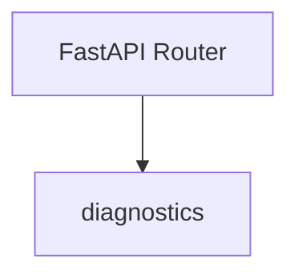
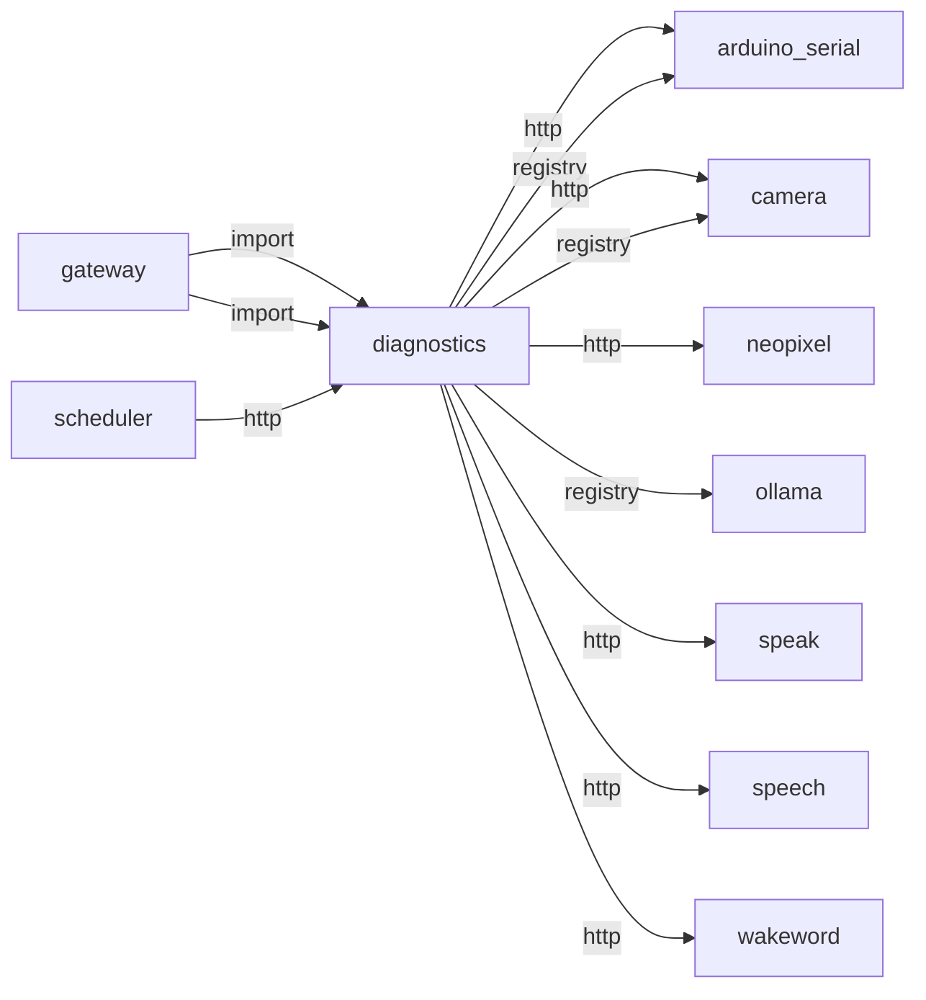
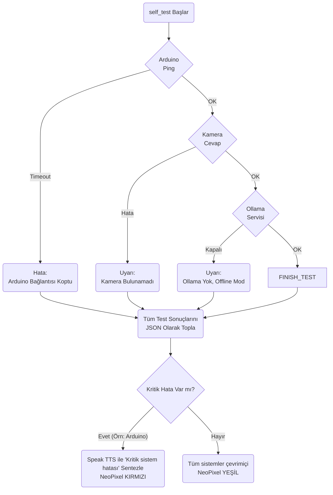
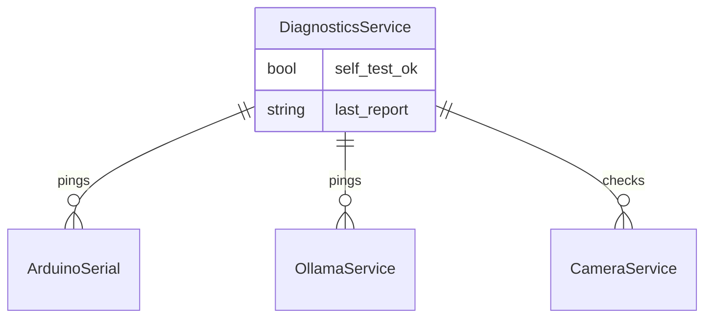

# diagnostics

> **Sistem sağlık testi (Arduino, kamera, Ollama)**

## Kimlik
| Alan | Değer |
| --- | --- |
| Ana sınıf | `—` |
| Giriş noktası | `create_app()` |
| Orkestratör | `—` |
| Ana dosya | `modules/diagnostics/xDiagnosticsService.py` |
| Katman | Arka Plan |
| Port | — |
| Arduino | Dolaylı |
| Sınıf sayısı | 0 |
| Endpoint sayısı | 3 |

## İsimlendirilmiş Bileşenler (Sınıflar)

—


## API — Endpoint → Handler → Servis

| HTTP | Path | Handler | Çağırdığı servis | Açıklama |
| --- | --- | --- | --- | --- |
| GET | `/healthz` | `healthz()` | — | — |
| POST | `/run` | `run()` | — | — |
| GET | `/report` | `report()` | — | — |

## Config Bölümleri
- `server`
- `gateway_port`
- `checks`
- `thresholds`
- `self_heal`
- `notify`

## Dış İlişkiler (Bu modül → diğerleri)

| Hedef modül | Bağlantı tipi | Detay | Neden |
| --- | --- | --- | --- |
| [[arduino_serial]] | http | calls path `/arduino/healthz` | Arduino bağlantı sağlık testi yapar. |
| [[arduino_serial]] | registry | registry dependency: arduino_serial, camera, ollama | Arduino bağlantı sağlık testi yapar. |
| [[camera]] | http | calls path `/camera/healthz` | Kamera erişim ve stream testi yapar. |
| [[camera]] | registry | registry dependency: arduino_serial, camera, ollama | Kamera erişim ve stream testi yapar. |
| [[neopixel]] | http | calls path `/neopixel/healthz` | `diagnostics` HTTP ile `neopixel` modülüne erişir: LED animasyon veya duygu preset uygular. |
| [[ollama]] | registry | registry dependency: arduino_serial, camera, ollama | Ollama servis erişilebilirlik testi yapar. |
| [[speak]] | http | calls path `/speak/status` | `diagnostics` HTTP ile `speak` modülüne erişir: TTS servisinin hazır olup olmadığını kontrol eder. |
| [[speech]] | http | calls path `/speech/status` | `diagnostics` HTTP ile `speech` modülüne erişir: Ses tanıma (ASR) pipeline'ına istek gönderir. |
| [[wakeword]] | http | calls path `/wakeword/status` | `diagnostics` gateway veya doğrudan HTTP ile `wakeword` API'sini çağırır (calls path `/wakeword/status`). |

## Gelen İlişkiler (Diğerleri → bu modül)

| Kaynak modül | Bağlantı tipi | Detay | Neden |
| --- | --- | --- | --- |
| [[gateway]] | import | api | `gateway` kod içinde `diagnostics` modülünü import eder (`api`) — Sistem sağlık testi (Arduino, kamera, Ollama). |
| [[gateway]] | import | config_loader | `gateway` kod içinde `diagnostics` modülünü import eder (`config_loader`) — Sistem sağlık testi (Arduino, kamera, Ollama). |
| [[scheduler]] | http | calls path `/diagnostics/run` | `scheduler` → `diagnostics`: Sistem sağlık kontrolü çalıştırır. |

## İç Mimari (otomatik çıkarım)



## Modül Etkileşim Haritası



### Mimari diyagram 1


### Mimari diyagram 2


---

# Tam Kaynak Arşivi

### `modules/diagnostics/README.md` (16 satır)

```markdown
# Diagnostics Module

Boot self-check ve modül sağlık taraması. Gateway üzerinden yerel endpointleri çağırır.

Bu modül yalnızca servislerin yanıt verip vermediğine bakmaz; yanıt süresi, tekrar eden hata ve iyileştirme ihtiyacını da değerlendirir.

## Ne İşe Yarar?
- Endpoint gecikmelerini eşiklerle karşılaştırır.
- Aynı hatanın art arda tekrarını sayar.
- Raporları kısa süreli cache ile yeniden kullanır.
- Self-heal açıksa notifier veya onarım callback’leri tetikleyebilir.

## API
- GET `/diagnostics/healthz`
- POST `/diagnostics/run`
- GET `/diagnostics/report`
```

### `modules/diagnostics/__init__.py` (1 satır)

```python
"""Diagnostics module: boot self-check and module health sweep."""
```

### `modules/diagnostics/api/__init__.py` (1 satır)

```python
# api namespace
```

### `modules/diagnostics/api/router.py` (63 satır)

```python
from __future__ import annotations
from typing import Dict, Any
from fastapi import APIRouter

from ..services.selftest import run_http_checks


def get_router(cfg: Dict[str, Any]) -> APIRouter:
    r = APIRouter(prefix="/diagnostics", tags=["diagnostics"])
    last_report: Dict[str, Any] = {"ok": True, "note": "not_run_yet"}

    def _build_checks() -> Dict[str, Any]:
        checks_cfg = cfg.get("checks", {}) if isinstance(cfg.get("checks", {}), dict) else {}
        # Backward compatible: bool map support.
        default_paths: Dict[str, tuple[str, str]] = {
            "camera": ("GET", "/camera/healthz"),
            "arduino": ("GET", "/arduino/healthz"),
            "neopixel": ("GET", "/neopixel/healthz"),
            "speech": ("GET", "/speech/status"),
            "speak": ("GET", "/speak/status"),
            "wakeword": ("GET", "/wakeword/status"),
        }

        out: Dict[str, Any] = {}
        for name, value in checks_cfg.items():
            if isinstance(value, bool):
                if value and name in default_paths:
                    method, path = default_paths[name]
                    out[name] = {"enabled": True, "method": method, "path": path}
                continue
            if isinstance(value, dict):
                out[name] = value
        if not out:
            for name, (method, path) in default_paths.items():
                out[name] = {"enabled": True, "method": method, "path": path}
        return out

    @r.get("/healthz")
    def healthz():
        return {"ok": True}

    @r.post("/run")
    def run():
        nonlocal last_report
        port = int(cfg.get("gateway_port", 8080))
        base = f"http://127.0.0.1:{port}"
        thresholds = cfg.get("thresholds", {}) if isinstance(cfg.get("thresholds", {}), dict) else {}
        report = run_http_checks(
            base_url=base,
            checks=_build_checks(),
            default_timeout_ms=int(thresholds.get("default_timeout_ms", 1000)),
            default_latency_warn_ms=int(thresholds.get("default_latency_warn_ms", 600)),
            self_heal=cfg.get("self_heal", {}),
            notify=cfg.get("notify", {}),
        )
        last_report = report
        return report

    @r.get("/report")
    def report():
        return last_report

    return r
```

### `modules/diagnostics/architecture_diagnostics.md` (50 satır)

```markdown
# Diagnostics Modülü Mimarisi

Diagnostics modülü (`modules/diagnostics`), robotun açılış evresinde (POST - Power On Self Test) ve çalışma sırasında periyodik olarak donanım/yazılım bileşenlerinin sağlığını test eden modüldür.

## 🏗️ İş Akışı ve Karar Mekanizmaları (Flowchart)


## 🔄 İlişkisel Etkileşimler (Veri Akışı)


## ⚙️ Detaylı Karar Mantığı (if/else)

1. **Boot Sırası Hata (POST)**
   - Boot esnasında `run_self_test` çağrılır. Testlerin paralel yapılması sistemin donmasını engeller.
   - **`if`** Ollama/AI bağlantısı gibi modüller düşerse (çökerse) bu `CRITICAL` (Kritik) bir hata sayılmaz, sadece `WARNING` üretir. Çünkü robot çevrimdışı komutları ve hareketleri yapmaya devam edebilir (fallback fallback).
   - **`if`** Arduino (Motor denetleyici) seriyoldan düşerse bu `CRITICAL` hatadır, çünkü robotun kasları (servoları ve adım motorları) işlevini yitirmiştir, dengesini kaybedebilir. Anında kırmızı alarm verir ve donanım denge koruma (`E-STOP`) komutu yollar.
```

### `modules/diagnostics/config/config.yml` (61 satır)

```yaml
server:
  host: 0.0.0.0
  port: 8098

gateway_port: 8080

checks:
  camera:
    enabled: true
    method: GET
    path: /camera/healthz
    timeout_ms: 900
    latency_warn_ms: 450
    critical: false
    heal:
      method: POST
      path: /camera/start
      timeout_s: 1.2
  arduino:
    enabled: true
    method: GET
    path: /arduino/healthz
    timeout_ms: 900
    latency_warn_ms: 450
    critical: true
  neopixel:
    enabled: true
    method: GET
    path: /neopixel/healthz
    timeout_ms: 900
    latency_warn_ms: 450
    critical: false
  speech:
    enabled: true
    method: GET
    path: /speech/status
    timeout_ms: 900
    latency_warn_ms: 500
    critical: true
    heal:
      method: POST
      path: /speech/start
      timeout_s: 1.2
  speak:
    enabled: true
    method: GET
    path: /speak/status
    timeout_ms: 900
    latency_warn_ms: 500
    critical: true

thresholds:
  default_timeout_ms: 1000
  default_latency_warn_ms: 600

self_heal:
  enabled: false

notify:
  enabled: false
  endpoint: /notify/test
```

### `modules/diagnostics/config_loader.py` (14 satır)

```python
from __future__ import annotations
from pathlib import Path
from typing import Any, Dict
import yaml

_DEFAULT_CFG_PATH = Path(__file__).parent / "config" / "config.yml"


def load_config(path: str | None = None) -> Dict[str, Any]:
    p = Path(path) if path else _DEFAULT_CFG_PATH
    if not p.exists():
        p = _DEFAULT_CFG_PATH
    with open(p, "r", encoding="utf-8") as f:
        return yaml.safe_load(f) or {}
```

### `modules/diagnostics/services/__init__.py` (1 satır)

```python
# namespace for diagnostics services
```

### `modules/diagnostics/services/selftest.py` (155 satır)

```python
from __future__ import annotations
from typing import Dict, Any, Tuple
import time


def _normalize_checks(checks: Dict[str, Any]) -> Dict[str, Dict[str, Any]]:
    out: Dict[str, Dict[str, Any]] = {}
    for name, raw in checks.items():
        if isinstance(raw, tuple) and len(raw) == 2:
            out[name] = {
                "enabled": True,
                "method": str(raw[0]).upper(),
                "path": str(raw[1]),
            }
            continue

        if isinstance(raw, dict):
            if not bool(raw.get("enabled", True)):
                continue
            out[name] = {
                "enabled": True,
                "method": str(raw.get("method", "GET")).upper(),
                "path": str(raw.get("path", "")),
                "timeout_ms": int(raw.get("timeout_ms", 1000)),
                "latency_warn_ms": int(raw.get("latency_warn_ms", 600)),
                "critical": bool(raw.get("critical", True)),
                "heal": raw.get("heal") if isinstance(raw.get("heal"), dict) else None,
            }
    return out


def _resolve_heal_target(base_url: str, path: str) -> str:
    if path.startswith("http://") or path.startswith("https://"):
        return path
    return f"{base_url.rstrip('/')}/{path.lstrip('/')}"


def run_http_checks(
    base_url: str,
    checks: Dict[str, Any],
    default_timeout_ms: int = 1000,
    default_latency_warn_ms: int = 600,
    self_heal: Dict[str, Any] | None = None,
    notify: Dict[str, Any] | None = None,
) -> Dict[str, Any]:
    try:
        import httpx  # type: ignore
    except Exception:
        return {"ok": False, "note": "httpx not installed", "failed": ["httpx"]}

    normalized = _normalize_checks(checks)
    out: Dict[str, Any] = {"ok": True, "failed": [], "degraded": []}
    heal_cfg = self_heal or {}
    heal_enabled = bool(heal_cfg.get("enabled", False))
    notify_cfg = notify or {}
    notify_enabled = bool(notify_cfg.get("enabled", False))
    notify_endpoint = str(notify_cfg.get("endpoint", "")).strip()

    client = httpx.Client(base_url=base_url)
    try:
        for name, chk in normalized.items():
            method = str(chk.get("method", "GET")).upper()
            path = str(chk.get("path", ""))
            timeout_ms = int(chk.get("timeout_ms", default_timeout_ms))
            latency_warn_ms = int(chk.get("latency_warn_ms", default_latency_warn_ms))
            critical = bool(chk.get("critical", True))

            try:
                t0 = time.perf_counter()
                resp = client.request(method, path, timeout=max(0.1, timeout_ms / 1000.0))
                latency_ms = int((time.perf_counter() - t0) * 1000)
                status_ok = resp.status_code == 200
                body_ok = True
                if path.endswith("/speak/status"):
                    try:
                        payload = resp.json()
                        body_ok = bool(payload.get("ready", False))
                    except Exception:
                        body_ok = False
                elif path.endswith("/speech/status"):
                    try:
                        payload = resp.json()
                        body_ok = bool(payload.get("model_ready", payload.get("listening", False)))
                    except Exception:
                        body_ok = False
                latency_ok = latency_ms <= latency_warn_ms
                ok = bool(status_ok and body_ok and latency_ok)
                out[name] = {
                    "ok": ok,
                    "critical": critical,
                    "status_code": int(resp.status_code),
                    "latency_ms": latency_ms,
                    "latency_warn_ms": latency_warn_ms,
                    "within_latency": latency_ok,
                }

                if not ok:
                    if critical:
                        out["failed"].append(name)
                    else:
                        out["degraded"].append(name)

                    if heal_enabled and isinstance(chk.get("heal"), dict):
                        heal_req = chk.get("heal") or {}
                        heal_method = str(heal_req.get("method", "POST")).upper()
                        heal_path = str(heal_req.get("path", "")).strip()
                        heal_payload = heal_req.get("json") if isinstance(heal_req.get("json"), dict) else None
                        heal_timeout = float(heal_req.get("timeout_s", 1.0))
                        if heal_path:
                            target = _resolve_heal_target(base_url, heal_path)
                            try:
                                heal_resp = client.request(
                                    heal_method,
                                    target,
                                    json=heal_payload,
                                    timeout=max(0.1, heal_timeout),
                                )
                                out[name]["heal"] = {
                                    "ok": bool(heal_resp.status_code < 500),
                                    "status_code": int(heal_resp.status_code),
                                    "target": target,
                                }
                            except Exception as heal_exc:
                                out[name]["heal"] = {
                                    "ok": False,
                                    "error": str(heal_exc),
                                    "target": target,
                                }

                    if notify_enabled and notify_endpoint:
                        try:
                            client.post(
                                notify_endpoint,
                                json={"text": f"diagnostics: {name} failed", "source": "diagnostics"},
                                timeout=0.8,
                            )
                        except Exception:
                            pass

                if critical and not ok:
                    out["ok"] = False
            except Exception as e:
                out[name] = {"ok": False, "critical": critical, "error": str(e)}
                if critical:
                    out["failed"].append(name)
                    out["ok"] = False
                else:
                    out["degraded"].append(name)
    finally:
        client.close()

    # If no critical checks failed, overall health is still true.
    if not out.get("failed"):
        out["ok"] = True
    return out
```

### `modules/diagnostics/tests/test_smoke.py` (8 satır)

```python
from __future__ import annotations

from modules.diagnostics.xDiagnosticsService import create_app


def test_create_app():
    app = create_app()
    assert app is not None
```

### `modules/diagnostics/xDiagnosticsService.py` (18 satır)

```python
from __future__ import annotations
from fastapi import FastAPI

from .config_loader import load_config
from .api.router import get_router


def create_app(config_path: str | None = None) -> FastAPI:
    cfg = load_config(config_path)
    app = FastAPI(title="Diagnostics Service")
    app.include_router(get_router(cfg))
    return app


if __name__ == "__main__":
    import uvicorn
    cfg = load_config(None)
    uvicorn.run(create_app(), host=str(cfg["server"]["host"]), port=int(cfg["server"]["port"]))
```
