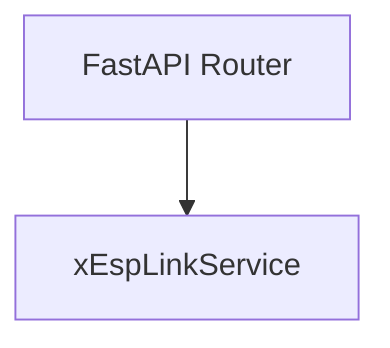

# esp_link

> **ESP32 köprü iletişimi (mDNS web remote)**

## Kimlik
| Alan | Değer |
| --- | --- |
| Ana sınıf | `xEspLinkService` |
| Giriş noktası | `—` |
| Orkestratör | `—` |
| Ana dosya | `modules/esp_link/xEspLinkService.py` |
| Katman | Etkileşim |
| Port | — |
| Arduino | Dolaylı |
| Sınıf sayısı | 1 |
| Endpoint sayısı | 3 |

## İsimlendirilmiş Bileşenler (Sınıflar)

#### `xEspLinkService` — `modules/esp_link/xEspLinkService.py`
- **Görev:** —
- **Kalıtım:** —
- **Oluşturduğu bileşenler:** —
- **Metodlar:** `healthz()`, `send()`, `request()`


## API — Endpoint → Handler → Servis

| HTTP | Path | Handler | Çağırdığı servis | Açıklama |
| --- | --- | --- | --- | --- |
| GET | `/healthz` | `healthz()` | `healthz()`, `request()`, `send()` | — |
| POST | `/send` | `send()` | `request()`, `send()` | — |
| POST | `/request` | `request()` | `request()` | — |

## Config Bölümleri
- `server`
- `network`
- `base_url`
- `paths`
- `timeouts`

## Dış İlişkiler (Bu modül → diğerleri)

| Hedef modül | Bağlantı tipi | Detay | Neden |
| --- | --- | --- | --- |
| [[config_center]] | import | agent_yaml_loader | `esp_link` → `config_center`: config/agent.yaml dosyasından ayar okur. |

## Gelen İlişkiler (Diğerleri → bu modül)

| Kaynak modül | Bağlantı tipi | Detay | Neden |
| --- | --- | --- | --- |
| [[gateway]] | import | xEspLinkService | `gateway` kod içinde `esp_link` modülünü import eder (`xEspLinkService`) — ESP32 köprü iletişimi (mDNS web remote). |
| [[gateway]] | import | api | `gateway` kod içinde `esp_link` modülünü import eder (`api`) — ESP32 köprü iletişimi (mDNS web remote). |

## İç Mimari (otomatik çıkarım)



## Modül Etkileşim Haritası


---

# Tam Kaynak Arşivi

### `modules/esp_link/README.md` (19 satır)

```markdown
# ESP Link Module

Bu modül, Pi tarafında ESP32 bridge cihazına HTTP üzerinden erişim sağlar.

## Amaç
- Pi -> ESP -> Mega zincirini tek sorumlulukla yönetmek
- Gateway içinde `/esp/*` gözlem ve proxy uçları sağlamak

## Varsayılan Ağ Bilgisi
- SSID: `SentryBOT`
- Şifre: `SentryBOT`

## Konfigürasyon
Ayarlar `modules/esp_link/config/config.yml` içindedir.

Ana alanlar:
- `base_url`: ESP bridge HTTP adresi
- `paths.health|send|request`: endpoint yolları
- `timeouts.connect_s|io_s`: ağ zaman aşımları
```

### `modules/esp_link/__init__.py` (4 satır)

```python
from .xEspLinkService import xEspLinkService
from .config_loader import load_config

__all__ = ["xEspLinkService", "load_config"]
```

### `modules/esp_link/api/router.py` (37 satır)

```python
from __future__ import annotations

from fastapi import APIRouter, HTTPException
from typing import Dict, Any

try:
    from ..xEspLinkService import xEspLinkService
except Exception:
    from modules.esp_link.xEspLinkService import xEspLinkService  # type: ignore


def get_router(svc: xEspLinkService) -> APIRouter:
    r = APIRouter(prefix="/esp", tags=["esp_link"])

    @r.get("/healthz")
    def healthz() -> Dict[str, Any]:
        try:
            data = svc.healthz()
            return {"ok": bool(data.get("ok", True)), "resp": data}
        except Exception as exc:
            return {"ok": False, "error": str(exc)}

    @r.post("/send")
    def send(obj: Dict[str, Any]):
        try:
            return svc.send(obj)
        except Exception as exc:
            raise HTTPException(status_code=502, detail=str(exc)) from exc

    @r.post("/request")
    def request(obj: Dict[str, Any], timeout: float = 1.0):
        try:
            return svc.request(obj, timeout=timeout)
        except Exception as exc:
            raise HTTPException(status_code=502, detail=str(exc)) from exc

    return r
```

### `modules/esp_link/architecture_esp_link.md` (16 satır)

```markdown
# architecture_esp_link

## Sorumluluk
`esp_link` modülü Pi tarafında ESP köprüsüne erişen hafif istemci katmanıdır.

## Akış
1. Üst modül (`arduino_serial`) komut payload'unu üretir.
2. `arduino_serial`, komutu ESP bridge HTTP endpointine iletir.
3. ESP bridge, komutu UART ile Mega'ya aktarır.
4. Mega NDJSON ACK/ERR döner.
5. ESP bridge cevabı HTTP JSON olarak Pi'ye geri iletir.

## Tasarım Kararları
- Komut şeması tek kaynak olarak `modules/arduino_serial/contract.py` kalır.
- Pi tarafında komut çağrıları değişmeden kalabilsin diye taşıma değişikliği `arduino_serial` içinde yapılır.
- `esp_link` modülü bağımsız sağlık kontrolü ve gerektiğinde doğrudan proxy sağlar.
```

### `modules/esp_link/config/config.yml` (17 satır)

```yaml
server:
  host: 0.0.0.0
  port: 8091

network:
  ssid: "SentryBOT"
  password: "SentryBOT"

base_url: "http://sentrybot-2.local:8080"
paths:
  health: "/healthz"
  send: "/send"
  request: "/request"

timeouts:
  connect_s: 0.4
  io_s: 1.2
```

### `modules/esp_link/config_loader.py` (49 satır)

```python
from __future__ import annotations

import os
from pathlib import Path
from typing import Any, Dict

import yaml

_DEFAULT_CFG_PATH = Path(__file__).parent / "config" / "config.yml"


def _deep_update(base: Dict[str, Any], override: Dict[str, Any]) -> Dict[str, Any]:
    for k, v in override.items():
        if isinstance(v, dict) and isinstance(base.get(k), dict):
            base[k] = _deep_update(base[k], v)
        else:
            base[k] = v
    return base


def load_config(path: str | os.PathLike | None = None, overrides: Dict[str, Any] | None = None) -> Dict[str, Any]:
    cfg_path = Path(path) if path else _DEFAULT_CFG_PATH
    if not cfg_path.exists():
        cfg_path = _DEFAULT_CFG_PATH

    with open(cfg_path, "r", encoding="utf-8") as f:
        data = yaml.safe_load(f) or {}

    env: Dict[str, Any] = {}
    base = os.getenv("ESP_LINK_BASE_URL") or os.getenv("SENTRYBOT_ESP_BASE_URL")
    if base:
        env["base_url"] = str(base).strip()

    out = _deep_update(data, env)

    try:
        from modules.config_center.agent_yaml_loader import load_agent_config

        root = load_agent_config()
        link_cfg = root.get("esp_link")
        if isinstance(link_cfg, dict):
            out = _deep_update(out, link_cfg)
    except FileNotFoundError:
        pass
    except Exception:
        pass
    if overrides:
        out = _deep_update(out, dict(overrides))
    return out
```

### `modules/esp_link/xEspLinkService.py` (57 satır)

```python
from __future__ import annotations

from typing import Any, Dict, Optional

import requests

from .config_loader import load_config


class xEspLinkService:
    def __init__(self, config_overrides: Optional[Dict[str, Any]] = None):
        self.cfg = load_config(overrides=config_overrides)
        self.base_url = str(self.cfg.get("base_url", "http://sentrybot.local")).rstrip("/")
        paths = self.cfg.get("paths", {}) or {}
        self.path_health = str(paths.get("health", "/healthz"))
        self.path_send = str(paths.get("send", "/send"))
        self.path_request = str(paths.get("request", "/request"))
        tmo = self.cfg.get("timeouts", {}) or {}
        self.connect_timeout = float(tmo.get("connect_s", 0.4) or 0.4)
        self.io_timeout = float(tmo.get("io_s", 1.2) or 1.2)

    def _url(self, path: str) -> str:
        if not path.startswith("/"):
            path = "/" + path
        return f"{self.base_url}{path}"

    def _post(self, path: str, payload: Dict[str, Any], params: Optional[Dict[str, Any]] = None, timeout: Optional[float] = None) -> Dict[str, Any]:
        resp = requests.post(
            self._url(path),
            json=payload,
            params=params,
            timeout=(self.connect_timeout, float(timeout if timeout is not None else self.io_timeout)),
        )
        if resp.status_code != 200:
            raise RuntimeError(f"ESP bridge HTTP {resp.status_code}: {resp.text[:200]}")
        data = resp.json()
        if not isinstance(data, dict):
            raise RuntimeError("ESP bridge returned non-object JSON")
        return data

    def healthz(self) -> Dict[str, Any]:
        resp = requests.get(self._url(self.path_health), timeout=(self.connect_timeout, self.io_timeout))
        if resp.status_code != 200:
            return {"ok": False, "status_code": resp.status_code}
        try:
            data = resp.json()
            if isinstance(data, dict):
                return data
        except Exception:
            pass
        return {"ok": True}

    def send(self, payload: Dict[str, Any]) -> Dict[str, Any]:
        return self._post(self.path_send, payload)

    def request(self, payload: Dict[str, Any], timeout: float = 1.0) -> Dict[str, Any]:
        return self._post(self.path_request, payload, params={"timeout": float(timeout)}, timeout=float(timeout))
```
