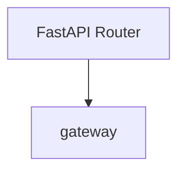
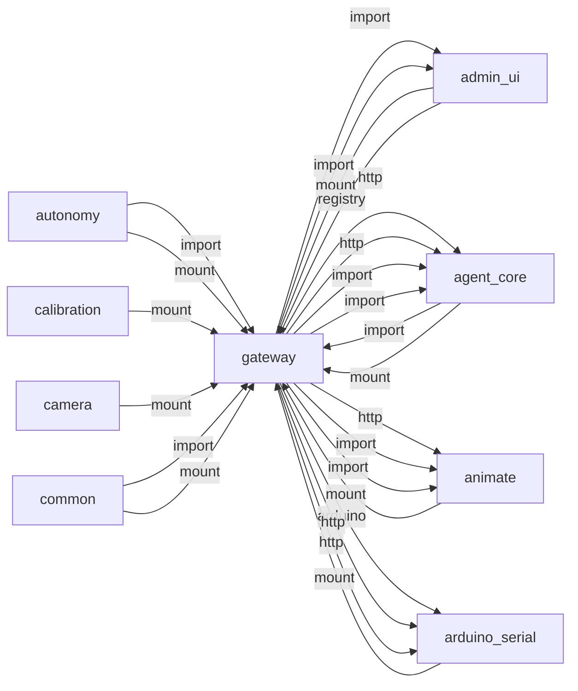
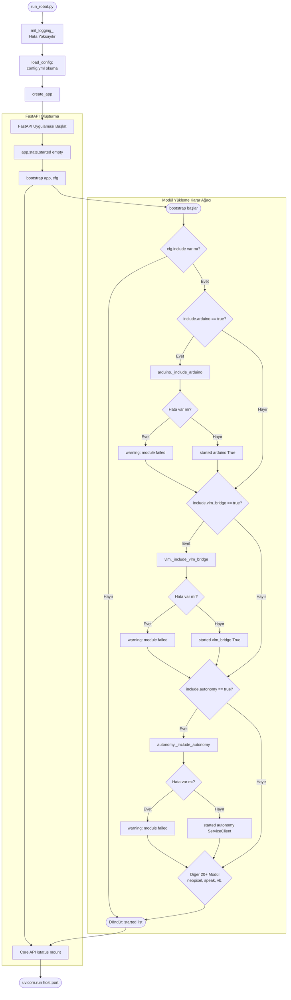
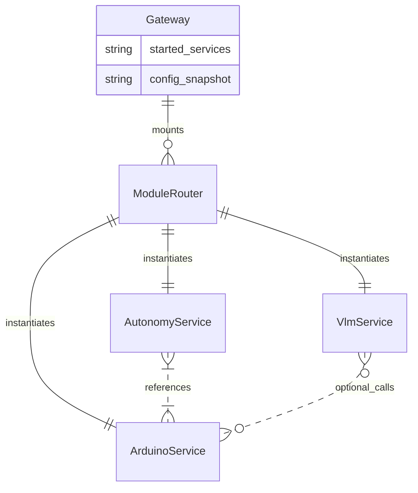

# gateway

> **FastAPI API bootstrapper, tüm modülleri mount eder**

## Kimlik
| Alan | Değer |
| --- | --- |
| Ana sınıf | `—` |
| Giriş noktası | `create_app()` |
| Orkestratör | `—` |
| Ana dosya | `modules/gateway/xGatewayService.py` |
| Katman | Çekirdek |
| Port | 8080 |
| Arduino | Hayır |
| Sınıf sayısı | 0 |
| Endpoint sayısı | 3 |

## İsimlendirilmiş Bileşenler (Sınıflar)

—


## API — Endpoint → Handler → Servis

| HTTP | Path | Handler | Çağırdığı servis | Açıklama |
| --- | --- | --- | --- | --- |
| GET | `/healthz` | `healthz()` | — | — |
| GET | `/status` | `status()` | — | — |
| GET | `/health` | `health()` | — | — |

## Config Bölümleri
- `server`
- `include`
- `speech`
- `security`

## Dış İlişkiler (Bu modül → diğerleri)

| Hedef modül | Bağlantı tipi | Detay | Neden |
| --- | --- | --- | --- |
| [[admin_ui]] | import | api | `gateway` içinde `api` import edilir; `admin_ui` modülünün yeteneğini kullanır (Web yönetim paneli (statik dosyalar)). |
| [[admin_ui]] | import | config_loader | `gateway` içinde `config_loader` import edilir; `admin_ui` modülünün yeteneğini kullanır (Web yönetim paneli (statik dosyalar)). |
| [[agent_core]] | http | calls path `/agent/speech/interrupt` | `gateway` HTTP ile `agent_core` modülüne erişir: Ses tanıma (ASR) pipeline'ına istek gönderir. |
| [[agent_core]] | http | calls path `/agent` | `gateway` HTTP ile `agent_core` modülüne erişir: Ajan orkestrasyonu ve tool-calling çağrısı. |
| [[agent_core]] | import | api | `gateway` içinde `api` import edilir; `agent_core` modülünün yeteneğini kullanır (3-katmanlı ajan zekâ (Router→Sub-Agent→Persona), tool calling). |
| [[agent_core]] | import | services | `gateway` içinde `services` import edilir; `agent_core` modülünün yeteneğini kullanır (3-katmanlı ajan zekâ (Router→Sub-Agent→Persona), tool calling). |
| [[animate]] | http | calls path `/animate` | `gateway` HTTP ile `animate` modülüne erişir: YAML tabanlı servo animasyonu başlatır. |
| [[animate]] | import | xAnimateService | `gateway` içinde `xAnimateService` import edilir; `animate` modülünün yeteneğini kullanır (YAML servo animasyon oynatıcı). |
| [[animate]] | import | api | `gateway` içinde `api` import edilir; `animate` modülünün yeteneğini kullanır (YAML servo animasyon oynatıcı). |
| [[arduino_serial]] | arduino | Arduino serial / contract kullanımı | Tüm /arduino/* isteklerini serial modüle proxy eder. |
| [[arduino_serial]] | http | calls path `/arduino/healthz` | Tüm /arduino/* isteklerini serial modüle proxy eder. |
| [[arduino_serial]] | http | calls path `/arduino` | Tüm /arduino/* isteklerini serial modüle proxy eder. |
| [[arduino_serial]] | import | xArduinoSerialService | Tüm /arduino/* isteklerini serial modüle proxy eder. |
| [[arduino_serial]] | import | api | Tüm /arduino/* isteklerini serial modüle proxy eder. |
| [[autonomy]] | import | xAutonomyService | `gateway` içinde `xAutonomyService` import edilir; `autonomy` modülünün yeteneğini kullanır (Sense-Think-Act beyin döngüsü, duygu motoru, LLM kararları). |
| [[autonomy]] | import | api | `gateway` içinde `api` import edilir; `autonomy` modülünün yeteneğini kullanır (Sense-Think-Act beyin döngüsü, duygu motoru, LLM kararları). |
| [[calibration]] | import | api | `gateway` içinde `api` import edilir; `calibration` modülünün yeteneğini kullanır (Servo kalibrasyon modu). |
| [[calibration]] | import | config_loader | `gateway` içinde `config_loader` import edilir; `calibration` modülünün yeteneğini kullanır (Servo kalibrasyon modu). |
| [[camera]] | http | calls path `/camera/healthz` | `gateway` HTTP ile `camera` modülüne erişir: Kamera stream veya snapshot ister. |
| [[camera]] | http | calls path `/camera` | `gateway` HTTP ile `camera` modülüne erişir: Kamera stream veya snapshot ister. |
| [[camera]] | import | config_loader | `gateway` içinde `config_loader` import edilir; `camera` modülünün yeteneğini kullanır (MJPEG kamera stream, auto-recovery). |
| [[camera]] | import | services | `gateway` içinde `services` import edilir; `camera` modülünün yeteneğini kullanır (MJPEG kamera stream, auto-recovery). |
| [[camera]] | import | api | `gateway` içinde `api` import edilir; `camera` modülünün yeteneğini kullanır (MJPEG kamera stream, auto-recovery). |
| [[config_center]] | http | calls path `/config` | `gateway` HTTP ile `config_center` modülüne erişir: Merkezi yapılandırma okur/yazar. |
| [[config_center]] | import | agent_yaml_loader | `gateway` → `config_center`: config/agent.yaml dosyasından ayar okur. |
| [[config_center]] | import | config_loader | `gateway` içinde `config_loader` import edilir; `config_center` modülünün yeteneğini kullanır (Merkezi config okuma/yazma, hot-reload). |
| [[config_center]] | import | api | `gateway` içinde `api` import edilir; `config_center` modülünün yeteneğini kullanır (Merkezi config okuma/yazma, hot-reload). |
| [[config_center]] | import | services | `gateway` içinde `services` import edilir; `config_center` modülünün yeteneğini kullanır (Merkezi config okuma/yazma, hot-reload). |
| [[diagnostics]] | import | api | `gateway` içinde `api` import edilir; `diagnostics` modülünün yeteneğini kullanır (Sistem sağlık testi (Arduino, kamera, Ollama)). |
| [[diagnostics]] | import | config_loader | `gateway` içinde `config_loader` import edilir; `diagnostics` modülünün yeteneğini kullanır (Sistem sağlık testi (Arduino, kamera, Ollama)). |
| [[esp_link]] | import | xEspLinkService | `gateway` içinde `xEspLinkService` import edilir; `esp_link` modülünün yeteneğini kullanır (ESP32 köprü iletişimi (mDNS web remote)). |
| [[esp_link]] | import | api | `gateway` içinde `api` import edilir; `esp_link` modülünün yeteneğini kullanır (ESP32 köprü iletişimi (mDNS web remote)). |
| [[hardware]] | import | api | `gateway` içinde `api` import edilir; `hardware` modülünün yeteneğini kullanır (CPU/RAM/sıcaklık bilgisi, I2C tarama). |
| [[hardware]] | import | config_loader | `gateway` içinde `config_loader` import edilir; `hardware` modülünün yeteneğini kullanır (CPU/RAM/sıcaklık bilgisi, I2C tarama). |
| [[interactions]] | http | calls path `/interactions` | `gateway` HTTP ile `interactions` modülüne erişir: Sistem olayı veya LED efekti tetikler. |
| [[interactions]] | http | calls path `/interactions/event` | `gateway` HTTP ile `interactions` modülüne erişir: Sistem olayı veya LED efekti tetikler. |
| [[interactions]] | import | api | `gateway` içinde `api` import edilir; `interactions` modülünün yeteneğini kullanır (CPU/ağ metrikleri, kural motoru, NeoPixel tetikleme). |
| [[interactions]] | import | config_loader | `gateway` içinde `config_loader` import edilir; `interactions` modülünün yeteneğini kullanır (CPU/ağ metrikleri, kural motoru, NeoPixel tetikleme). |
| [[interactions]] | import | services | `gateway` içinde `services` import edilir; `interactions` modülünün yeteneğini kullanır (CPU/ağ metrikleri, kural motoru, NeoPixel tetikleme). |
| [[logwrapper]] | import | get_router | `gateway` içinde `get_router` import edilir; `logwrapper` modülünün yeteneğini kullanır (WebSocket log yayını, merkezi loglama). |
| [[logwrapper]] | import | init_logging | `gateway` → `logwrapper`: Merkezi WebSocket log yayınına bağlanır. |
| [[mutagen]] | import | api | `gateway` içinde `api` import edilir; `mutagen` modülünün yeteneğini kullanır (PC↔Pi dosya senkronizasyonu). |
| [[mutagen]] | import | config_loader | `gateway` içinde `config_loader` import edilir; `mutagen` modülünün yeteneğini kullanır (PC↔Pi dosya senkronizasyonu). |
| [[neopixel]] | http | calls path `/neopixel/healthz` | `gateway` HTTP ile `neopixel` modülüne erişir: LED animasyon veya duygu preset uygular. |
| [[neopixel]] | http | calls path `/neopixel` | `gateway` HTTP ile `neopixel` modülüne erişir: LED animasyon veya duygu preset uygular. |
| [[neopixel]] | import | services | `gateway` içinde `services` import edilir; `neopixel` modülünün yeteneğini kullanır (23 duygu paleti, SPI LED animasyonları). |
| [[neopixel]] | import | config_loader | `gateway` içinde `config_loader` import edilir; `neopixel` modülünün yeteneğini kullanır (23 duygu paleti, SPI LED animasyonları). |
| [[neopixel]] | import | api | `gateway` içinde `api` import edilir; `neopixel` modülünün yeteneğini kullanır (23 duygu paleti, SPI LED animasyonları). |
| [[notifier]] | import | config_loader | `gateway` içinde `config_loader` import edilir; `notifier` modülünün yeteneğini kullanır (Telegram/Discord bildirim gönderici). |
| [[notifier]] | import | api | `gateway` içinde `api` import edilir; `notifier` modülünün yeteneğini kullanır (Telegram/Discord bildirim gönderici). |
| [[notifier]] | import | services | `gateway` içinde `services` import edilir; `notifier` modülünün yeteneğini kullanır (Telegram/Discord bildirim gönderici). |
| [[oled_faces]] | import | xOledFacesService | `gateway` içinde `xOledFacesService` import edilir; `oled_faces` modülünün yeteneğini kullanır (OLED ekran yüz ifadeleri). |
| [[oled_faces]] | import | api | `gateway` içinde `api` import edilir; `oled_faces` modülünün yeteneğini kullanır (OLED ekran yüz ifadeleri). |
| [[ollama]] | http | calls path `/ollama/healthz` | `gateway` HTTP ile `ollama` modülüne erişir: Yerel LLM sohbet/completion isteği yapar. |
| [[ollama]] | http | calls path `/ollama` | `gateway` HTTP ile `ollama` modülüne erişir: Yerel LLM sohbet/completion isteği yapar. |
| [[ollama]] | import | config_loader | `gateway` içinde `config_loader` import edilir; `ollama` modülünün yeteneğini kullanır (Ollama LLM chat, persona yönetimi, JSON/XML parse). |
| [[ollama]] | import | api | `gateway` içinde `api` import edilir; `ollama` modülünün yeteneğini kullanır (Ollama LLM chat, persona yönetimi, JSON/XML parse). |
| [[ota]] | import | api | `gateway` içinde `api` import edilir; `ota` modülünün yeteneğini kullanır (Over-the-air güncelleme, checksum doğrulama). |
| [[ota]] | import | config_loader | `gateway` içinde `config_loader` import edilir; `ota` modülünün yeteneğini kullanır (Over-the-air güncelleme, checksum doğrulama). |
| [[piservo]] | import | config_loader | `gateway` içinde `config_loader` import edilir; `piservo` modülünün yeteneğini kullanır (Raspberry Pi GPIO PWM kulak servoları). |
| [[piservo]] | import | api | `gateway` içinde `api` import edilir; `piservo` modülünün yeteneğini kullanır (Raspberry Pi GPIO PWM kulak servoları). |
| [[piservo]] | import | services | `gateway` içinde `services` import edilir; `piservo` modülünün yeteneğini kullanır (Raspberry Pi GPIO PWM kulak servoları). |
| [[scheduler]] | import | config_loader | `gateway` içinde `config_loader` import edilir; `scheduler` modülünün yeteneğini kullanır (Cron benzeri zamanlayıcı). |
| [[scheduler]] | import | services | `gateway` içinde `services` import edilir; `scheduler` modülünün yeteneğini kullanır (Cron benzeri zamanlayıcı). |
| [[scheduler]] | import | api | `gateway` içinde `api` import edilir; `scheduler` modülünün yeteneğini kullanır (Cron benzeri zamanlayıcı). |
| [[social_db]] | import | config_loader | `gateway` içinde `config_loader` import edilir; `social_db` modülünün yeteneğini kullanır (SQLite kişi hafızası, ilişki/tanıma seviyeleri). |
| [[social_db]] | import | db | `gateway` içinde `db` import edilir; `social_db` modülünün yeteneğini kullanır (SQLite kişi hafızası, ilişki/tanıma seviyeleri). |
| [[speak]] | http | calls path `/speak/status` | `gateway` HTTP ile `speak` modülüne erişir: TTS servisinin hazır olup olmadığını kontrol eder. |
| [[speak]] | http | calls path `/speak/stop` | `gateway` HTTP ile `speak` modülüne erişir: Devam eden konuşmayı keser. |
| [[speak]] | http | calls path `/speak` | `gateway` gateway veya doğrudan HTTP ile `speak` API'sini çağırır (calls path `/speak`). |
| [[speak]] | import | xSpeakService | `gateway` içinde `xSpeakService` import edilir; `speak` modülünün yeteneğini kullanır (TTS sentez (pyttsx3/Piper/xTTS), ton/duygu ayarı). |
| [[speak]] | import | api | `gateway` içinde `api` import edilir; `speak` modülünün yeteneğini kullanır (TTS sentez (pyttsx3/Piper/xTTS), ton/duygu ayarı). |
| [[speech]] | http | calls path `/speech/status` | `gateway` HTTP ile `speech` modülüne erişir: Ses tanıma (ASR) pipeline'ına istek gönderir. |
| [[speech]] | http | calls path `/speech/start` | `gateway` HTTP ile `speech` modülüne erişir: Ses tanıma (ASR) pipeline'ına istek gönderir. |
| [[speech]] | http | calls path `/speech/stop` | `gateway` HTTP ile `speech` modülüne erişir: Ses tanıma (ASR) pipeline'ına istek gönderir. |
| [[speech]] | http | calls path `/speech/last` | `gateway` HTTP ile `speech` modülüne erişir: Ses tanıma (ASR) pipeline'ına istek gönderir. |
| [[speech]] | http | calls path `/speech` | `gateway` HTTP ile `speech` modülüne erişir: Ses tanıma (ASR) pipeline'ına istek gönderir. |
| [[speech]] | import | xSpeechService | `gateway` içinde `xSpeechService` import edilir; `speech` modülünün yeteneğini kullanır (Çok kanallı ASR, Vosk/Whisper, ses yönü (DOA)). |
| [[speech]] | import | api | `gateway` içinde `api` import edilir; `speech` modülünün yeteneğini kullanır (Çok kanallı ASR, Vosk/Whisper, ses yönü (DOA)). |
| [[state_manager]] | import | config_loader | `gateway` içinde `config_loader` import edilir; `state_manager` modülünün yeteneğini kullanır (Thread-safe global durum deposu, pub/sub). |
| [[state_manager]] | import | services | `gateway` içinde `services` import edilir; `state_manager` modülünün yeteneğini kullanır (Thread-safe global durum deposu, pub/sub). |
| [[state_manager]] | import | api | `gateway` içinde `api` import edilir; `state_manager` modülünün yeteneğini kullanır (Thread-safe global durum deposu, pub/sub). |
| [[telemetry]] | import | api | `gateway` içinde `api` import edilir; `telemetry` modülünün yeteneğini kullanır (Prometheus formatında metrik toplama). |
| [[telemetry]] | import | config_loader | `gateway` içinde `config_loader` import edilir; `telemetry` modülünün yeteneğini kullanır (Prometheus formatında metrik toplama). |
| [[vlm_bridge]] | http | calls path `/vlm` | `gateway` gateway veya doğrudan HTTP ile `vlm_bridge` API'sini çağırır (calls path `/vlm`). |
| [[vlm_bridge]] | import | config_loader | `gateway` içinde `config_loader` import edilir; `vlm_bridge` modülünün yeteneğini kullanır (OpenCV yüz algılama, ORB/FLANN eşleme, CSRT takip, remote VLM). |
| [[vlm_bridge]] | import | services | `gateway` içinde `services` import edilir; `vlm_bridge` modülünün yeteneğini kullanır (OpenCV yüz algılama, ORB/FLANN eşleme, CSRT takip, remote VLM). |
| [[vlm_bridge]] | import | api | `gateway` içinde `api` import edilir; `vlm_bridge` modülünün yeteneğini kullanır (OpenCV yüz algılama, ORB/FLANN eşleme, CSRT takip, remote VLM). |
| [[wakeword]] | http | calls path `/wakeword/status` | `gateway` gateway veya doğrudan HTTP ile `wakeword` API'sini çağırır (calls path `/wakeword/status`). |
| [[wakeword]] | import | xWakewordService | `gateway` içinde `xWakewordService` import edilir; `wakeword` modülünün yeteneğini kullanır ("Hey Sentry" sürekli dinleme (Porcupine/Snowboy)). |
| [[wakeword]] | import | api | `gateway` içinde `api` import edilir; `wakeword` modülünün yeteneğini kullanır ("Hey Sentry" sürekli dinleme (Porcupine/Snowboy)). |

## Gelen İlişkiler (Diğerleri → bu modül)

| Kaynak modül | Bağlantı tipi | Detay | Neden |
| --- | --- | --- | --- |
| [[admin_ui]] | mount | `admin_ui` router gateway'e mount edilir | Tek port üzerinden tüm modül API'lerine erişir. |
| [[admin_ui]] | registry | registry dependency: gateway | Tek port üzerinden tüm modül API'lerine erişir. |
| [[agent_core]] | import | url | `agent_core` kod içinde `gateway` modülünü import eder (`url`) — FastAPI API bootstrapper, tüm modülleri mount eder. |
| [[agent_core]] | mount | `agent_core` router gateway'e mount edilir | `agent_core` modülünün FastAPI router'ı gateway (8080) üzerinden tek portta dış dünyaya açılır. |
| [[animate]] | mount | `animate` router gateway'e mount edilir | `animate` modülünün FastAPI router'ı gateway (8080) üzerinden tek portta dış dünyaya açılır. |
| [[arduino_serial]] | mount | `arduino_serial` router gateway'e mount edilir | `arduino_serial` modülünün FastAPI router'ı gateway (8080) üzerinden tek portta dış dünyaya açılır. |
| [[autonomy]] | import | url | `autonomy` kod içinde `gateway` modülünü import eder (`url`) — FastAPI API bootstrapper, tüm modülleri mount eder. |
| [[autonomy]] | mount | `autonomy` router gateway'e mount edilir | `autonomy` modülünün FastAPI router'ı gateway (8080) üzerinden tek portta dış dünyaya açılır. |
| [[calibration]] | mount | `calibration` router gateway'e mount edilir | `calibration` modülünün FastAPI router'ı gateway (8080) üzerinden tek portta dış dünyaya açılır. |
| [[camera]] | mount | `camera` router gateway'e mount edilir | `camera` modülünün FastAPI router'ı gateway (8080) üzerinden tek portta dış dünyaya açılır. |
| [[common]] | import | url | `common` kod içinde `gateway` modülünü import eder (`url`) — FastAPI API bootstrapper, tüm modülleri mount eder. |
| [[common]] | mount | `common` router gateway'e mount edilir | `common` modülünün FastAPI router'ı gateway (8080) üzerinden tek portta dış dünyaya açılır. |
| [[config_center]] | import | url | Runtime config ve modül registry gateway ile senkronize edilir. |
| [[config_center]] | mount | `config_center` router gateway'e mount edilir | Runtime config ve modül registry gateway ile senkronize edilir. |
| [[diagnostics]] | mount | `diagnostics` router gateway'e mount edilir | `diagnostics` modülünün FastAPI router'ı gateway (8080) üzerinden tek portta dış dünyaya açılır. |
| [[esp_link]] | mount | `esp_link` router gateway'e mount edilir | `esp_link` modülünün FastAPI router'ı gateway (8080) üzerinden tek portta dış dünyaya açılır. |
| [[hardware]] | mount | `hardware` router gateway'e mount edilir | `hardware` modülünün FastAPI router'ı gateway (8080) üzerinden tek portta dış dünyaya açılır. |
| [[interactions]] | import | url | `interactions` kod içinde `gateway` modülünü import eder (`url`) — FastAPI API bootstrapper, tüm modülleri mount eder. |
| [[interactions]] | mount | `interactions` router gateway'e mount edilir | `interactions` modülünün FastAPI router'ı gateway (8080) üzerinden tek portta dış dünyaya açılır. |
| [[logwrapper]] | mount | `logwrapper` router gateway'e mount edilir | `logwrapper` modülünün FastAPI router'ı gateway (8080) üzerinden tek portta dış dünyaya açılır. |
| [[mutagen]] | mount | `mutagen` router gateway'e mount edilir | `mutagen` modülünün FastAPI router'ı gateway (8080) üzerinden tek portta dış dünyaya açılır. |
| [[neopixel]] | mount | `neopixel` router gateway'e mount edilir | `neopixel` modülünün FastAPI router'ı gateway (8080) üzerinden tek portta dış dünyaya açılır. |
| [[notifier]] | mount | `notifier` router gateway'e mount edilir | `notifier` modülünün FastAPI router'ı gateway (8080) üzerinden tek portta dış dünyaya açılır. |
| [[oled_faces]] | mount | `oled_faces` router gateway'e mount edilir | `oled_faces` modülünün FastAPI router'ı gateway (8080) üzerinden tek portta dış dünyaya açılır. |
| [[ollama]] | mount | `ollama` router gateway'e mount edilir | `ollama` modülünün FastAPI router'ı gateway (8080) üzerinden tek portta dış dünyaya açılır. |
| [[ota]] | mount | `ota` router gateway'e mount edilir | `ota` modülünün FastAPI router'ı gateway (8080) üzerinden tek portta dış dünyaya açılır. |
| [[piservo]] | mount | `piservo` router gateway'e mount edilir | `piservo` modülünün FastAPI router'ı gateway (8080) üzerinden tek portta dış dünyaya açılır. |
| [[scheduler]] | mount | `scheduler` router gateway'e mount edilir | `scheduler` modülünün FastAPI router'ı gateway (8080) üzerinden tek portta dış dünyaya açılır. |
| [[social_db]] | mount | `social_db` router gateway'e mount edilir | `social_db` modülünün FastAPI router'ı gateway (8080) üzerinden tek portta dış dünyaya açılır. |
| [[speak]] | mount | `speak` router gateway'e mount edilir | `speak` modülünün FastAPI router'ı gateway (8080) üzerinden tek portta dış dünyaya açılır. |
| [[speech]] | import | url | `speech` kod içinde `gateway` modülünü import eder (`url`) — FastAPI API bootstrapper, tüm modülleri mount eder. |
| [[speech]] | mount | `speech` router gateway'e mount edilir | `speech` modülünün FastAPI router'ı gateway (8080) üzerinden tek portta dış dünyaya açılır. |
| [[state_manager]] | mount | `state_manager` router gateway'e mount edilir | `state_manager` modülünün FastAPI router'ı gateway (8080) üzerinden tek portta dış dünyaya açılır. |
| [[telemetry]] | mount | `telemetry` router gateway'e mount edilir | `telemetry` modülünün FastAPI router'ı gateway (8080) üzerinden tek portta dış dünyaya açılır. |
| [[vlm_bridge]] | import | url | `vlm_bridge` kod içinde `gateway` modülünü import eder (`url`) — FastAPI API bootstrapper, tüm modülleri mount eder. |
| [[vlm_bridge]] | mount | `vlm_bridge` router gateway'e mount edilir | `vlm_bridge` modülünün FastAPI router'ı gateway (8080) üzerinden tek portta dış dünyaya açılır. |
| [[wakeword]] | mount | `wakeword` router gateway'e mount edilir | `wakeword` modülünün FastAPI router'ı gateway (8080) üzerinden tek portta dış dünyaya açılır. |

## İç Mimari (otomatik çıkarım)



## Modül Etkileşim Haritası



### Mimari diyagram 1


### Mimari diyagram 2


---

# Tam Kaynak Arşivi

### `modules/gateway/README.md` (56 satır)

```markdown
# Gateway Module

Tek FastAPI sürecinde tüm modül router’larını orkestre eden ana giriş kapısı. Üretimde tek porttan hizmet verir.

Gateway, dış dünyaya açılan ana yüzdür. Yeni security katmanı ile isteğe bağlı API anahtarı ve rol kontrolü eklenmiştir; böylece kritik yazma uçları korunabilir.

## Ne İşe Yarar?
- Modül router’larını tek uygulamada birleştirir.
- Sağlık ve include/disable yapılandırmasını yönetir.
- API anahtarı etkinse istekleri doğrular.
- Rol bazlı erişimle kritik uçları sınırlar.

## Çalıştırma
```bash
python -m modules.gateway.xGatewayService
```

## Konfig
`modules/gateway/config/config.yml`
- server.host / server.port
- include.<module>: true/false (arduino, vlm_bridge, neopixel, interactions, speak, speech, ollama, camera)
- security.enabled: true/false
- security.api_key: isteklerde beklenen anahtar
- security.admin_roles: kritik uçlar için kabul edilen roller

Varsayılan: tüm modüller açık (include=true).

## Uç Noktalar (özet)
- /arduino/*  – NDJSON seri köprü (hello, get_state, telemetry, …)
- /vlm/track – Dış işlemciden baş/drive komutu köprüsü
- /neopixel/* – LED efektleri/emotions
- /interactions/* – Kural motoru (NeoPixel tetikleme)
- /speak/* – TTS
- /speech/* – ASR/DoA API’leri
- /ollama/* – LLM sohbet/persona
- /camera/* – Kamera API/stream (modülün sundukları)
- /healthz – Gateway sağlık
	- Modül bazlı durum döner: `{ ok, modules: { <name>: { ok, error? } } }`
	- /status – include/start bilgileri
	- /health – derin sağlık taraması (httpx varsa)

### Yeni Modüller (entegre edilebilir)
- /hardware/* – RPi5 sistem bilgileri
- /telemetry/* – Metrikler ve olaylar
- /diagnostics/* – Boot self-check ve rapor
- /state/* – Global durum/emotions
- /scheduler/* – Zamanlanmış işler
- /notify/* – Telegram/Discord
- /calib/* – Kalibrasyon sihirbazları
- /config/* – Config Center (UI: /config/ui)

Security etkinse yazma uçları `X-API-Key` başlığı bekler; rol kontrolü açıksa admin olmayan kullanıcılar kritik işlemleri yapamaz.

## Notlar
- Modüller bağımsız servis olarak da çalışabilir, ancak gateway üretim modudur.
- Gateway modeli Pi5’te süreç sayısını azaltır; ortak log/limit kolaydır.
```

### `modules/gateway/__init__.py` (1 satır)

```python
"""Gateway shared helpers."""
```

### `modules/gateway/api/__init__.py` (3 satır)

```python
from .router import get_router

__all__ = ["get_router"]
```

### `modules/gateway/api/graph_router.py` (154 satır)

```python
from __future__ import annotations
import os
import json
from pathlib import Path
from typing import Any, Dict, List, Optional

from fastapi import APIRouter, HTTPException, Query


def _repo_root() -> Path:
    # modules/gateway/api/ -> modules/gateway -> modules -> <repo_root>
    return Path(__file__).resolve().parents[3]


def _safe_join(root: Path, rel: str) -> Path:
    p = (root / rel).resolve()
    if root not in p.parents and p != root:
        raise HTTPException(400, detail="Path outside repository")
    return p


def _collect_tree(base: Path, max_files_per_dir: int = 500) -> Dict[str, Any]:
    def list_dir(p: Path) -> Dict[str, Any]:
        try:
            entries = sorted(p.iterdir(), key=lambda x: (x.is_file(), x.name.lower()))
        except Exception:
            entries = []
        children: List[Dict[str, Any]] = []
        count = 0
        for e in entries:
            if count >= max_files_per_dir:
                children.append({"name": "… (trimmed)", "type": "info"})
                break
            if e.name.startswith(".__") or e.name == "__pycache__":
                continue
            if e.is_dir():
                children.append({
                    "name": e.name,
                    "path": str(e.relative_to(base)),
                    "type": "dir",
                    "children": list_dir(e),
                })
            else:
                children.append({
                    "name": e.name,
                    "path": str(e.relative_to(base)),
                    "type": "file",
                    "size": e.stat().st_size if e.exists() else 0,
                })
            count += 1
        return children

    tree: Dict[str, Any] = {
        "name": base.name,
        "path": "",
        "type": "dir",
        "children": [],
    }

    # Focus on top-level and modules
    interesting = [
        "run_robot.py",
        "README.md",
        "modules",
        "platforms",
        "arduino",
    ]
    for name in interesting:
        p = base / name
        if p.exists():
            node = {
                "name": name,
                "path": str(p.relative_to(base)) if p != base else "",
                "type": "dir" if p.is_dir() else "file",
                "children": list_dir(p) if p.is_dir() else None,
            }
            tree["children"].append(node)

    return tree


def _relations() -> Dict[str, Any]:
    # Lightweight static relation hints derived from bootstrap and READMEs
    nodes = [
        {"id": "run_robot", "label": "run_robot.py", "kind": "entry"},
        {"id": "gateway", "label": "Gateway", "kind": "service"},
        {"id": "arduino", "label": "Arduino Serial", "kind": "module"},
        {"id": "neopixel", "label": "NeoPixel", "kind": "module"},
        {"id": "interactions", "label": "Interactions", "kind": "module"},
        {"id": "speech", "label": "Speech (ASR)", "kind": "module"},
        {"id": "speak", "label": "Speak (TTS)", "kind": "module"},
        {"id": "ollama", "label": "Ollama (LLM)", "kind": "module"},
        {"id": "camera", "label": "Camera", "kind": "module"},
        {"id": "vlm_bridge", "label": "VLM Bridge", "kind": "module"},
        {"id": "animate", "label": "Animate", "kind": "module"},
        {"id": "piservo", "label": "Pi Servo", "kind": "module"},
        {"id": "hardware", "label": "Hardware", "kind": "module"},
        {"id": "telemetry", "label": "Telemetry", "kind": "module"},
        {"id": "diagnostics", "label": "Diagnostics", "kind": "module"},
        {"id": "state_manager", "label": "State Manager", "kind": "module"},
        {"id": "scheduler", "label": "Scheduler", "kind": "module"},
        {"id": "notifier", "label": "Notifier", "kind": "module"},
        {"id": "mutagen", "label": "Mutagen", "kind": "module"},
        {"id": "ota", "label": "OTA", "kind": "module"},
        {"id": "config_center", "label": "Config Center", "kind": "module"},
        {"id": "logwrapper", "label": "Logs", "kind": "module"},
    ]
    edges = [
        # Boot chain
        {"source": "run_robot", "target": "gateway", "type": "boot"},
        # Gateway mounts
        *[{"source": "gateway", "target": n["id"], "type": "mount"} for n in nodes if n["id"] not in ("run_robot", "gateway")],
        # Inter-module calls
        {"source": "interactions", "target": "neopixel", "type": "http"},
        {"source": "vlm_bridge", "target": "arduino", "type": "serial"},
        {"source": "animate", "target": "arduino", "type": "serial"},
        {"source": "speech", "target": "interactions", "type": "event"},
        {"source": "speech", "target": "ollama", "type": "http"},
        {"source": "ollama", "target": "speak", "type": "http"},
        {"source": "diagnostics", "target": "gateway", "type": "health"},
    ]
    return {"nodes": nodes, "edges": edges}


def get_router() -> APIRouter:
    # Use a distinct prefix to avoid clashing with StaticFiles mounted at /graph
    r = APIRouter(prefix="/graph-api", tags=["graph"])

    @r.get("/tree")
    def tree():
        root = _repo_root()
        return _collect_tree(root)

    @r.get("/file")
    def file(path: str = Query(..., description="Repository-relative path"), max_kb: int = 256):
        root = _repo_root()
        p = _safe_join(root, path)
        if not p.exists() or not p.is_file():
            raise HTTPException(404, detail="File not found")
        data = p.read_bytes()
        if len(data) > max_kb * 1024:
            data = data[: max_kb * 1024]
        # try decode as text
        try:
            text = data.decode("utf-8", errors="replace")
            return {"ok": True, "path": path, "text": text}
        except Exception:
            return {"ok": True, "path": path, "base64": data.decode("latin1", errors="replace")}

    @r.get("/relations")
    def relations():
        return _relations()

    return r
```

### `modules/gateway/api/router.py` (117 satır)

```python
from __future__ import annotations
from typing import Dict, Any
from fastapi import APIRouter


def get_router(cfg: Dict[str, Any], started: Dict[str, object]) -> APIRouter:
    r = APIRouter()

    @r.get("/healthz")
    def healthz():
        out: Dict[str, Any] = {"ok": True, "modules": {}}
        # Try to call each module's health if known, else mark as started
        try:
            import httpx  # type: ignore
        except Exception:
            httpx = None  # type: ignore
        port = int(cfg.get("server", {}).get("port", 8080))
        client = None
        if httpx:
            client = httpx.Client(base_url=f"http://127.0.0.1:{port}")
        try:
            for name in started.keys():
                path = None
                if name == "notifier":
                    path = "/notify/healthz"
                elif name == "state_manager":
                    path = "/state/healthz"
                elif name in ("arduino", "esp_link", "neopixel", "piservo", "telemetry", "diagnostics", "scheduler", "calibration", "config_center", "hardware"):
                    path = f"/{name}/healthz"
                elif name == "camera":
                    path = "/camera/healthz"
                elif name in ("speak", "speech", "wakeword"):
                    path = f"/{name}/status"
                if client and path:
                    try:
                        resp = client.get(path, timeout=0.5)
                        ok = resp.status_code == 200
                        out["modules"][name] = {"ok": ok}
                        if not ok:
                            out["ok"] = False
                    except Exception as e:
                        out["modules"][name] = {"ok": False, "error": str(e)}
                        out["ok"] = False
                else:
                    out["modules"][name] = {"ok": True}
        finally:
            if client:
                client.close()
        return out

    @r.get("/status")
    def status():
        include_cfg = dict(cfg.get("include", {}))
        started_names = list(started.keys())
        configured_on = [k for k, v in include_cfg.items() if bool(v)]
        not_started = [k for k in configured_on if k not in started_names]
        return {
            "ok": True,
            "configured": include_cfg,
            "started": started_names,
            "not_started": not_started,
        }

    @r.get("/health")
    def health():
        try:
            import httpx  # type: ignore
        except Exception:
            return {"ok": True, "note": "httpx not installed; basic status only", "included": list(started.keys())}

        summary: Dict[str, Any] = {"ok": True}
        checks = {
            "arduino": ("GET", "/arduino/healthz"),
            "esp_link": ("GET", "/esp/healthz"),
            "neopixel": ("GET", "/neopixel/healthz"),
            "piservo": ("GET", "/piservo/healthz"),
            "speech": ("GET", "/speech/status"),
            "speak": ("GET", "/speak/status"),
            "wakeword": ("GET", "/wakeword/status"),
            "vlm_bridge": None,
            "interactions": None,
            "ollama": ("GET", "/ollama/healthz"),
        }
        mounted_checks = {
            "camera": ("GET", "/camera/healthz"),
        }
        port = int(cfg.get("server", {}).get("port", 8080))
        client = httpx.Client(base_url=f"http://127.0.0.1:{port}")
        try:
            for name, _ in started.items():
                if name in checks and checks[name] is not None:
                    method, path = checks[name]
                    try:
                        resp = client.request(method, path, timeout=0.5)
                        summary[name] = {"ok": resp.status_code == 200, "body": resp.json() if resp.headers.get("content-type", "").startswith("application/json") else None}
                        if not summary[name]["ok"]:
                            summary["ok"] = False
                    except Exception as e:
                        summary[name] = {"ok": False, "error": str(e)}
                        summary["ok"] = False
                elif name in mounted_checks:
                    method, path = mounted_checks[name]
                    try:
                        resp = client.request(method, path, timeout=0.5)
                        summary[name] = {"ok": resp.status_code == 200, "body": resp.json() if resp.headers.get("content-type", "").startswith("application/json") else None}
                        if not summary[name]["ok"]:
                            summary["ok"] = False
                    except Exception as e:
                        summary[name] = {"ok": False, "error": str(e)}
                        summary["ok"] = False
                else:
                    summary[name] = {"ok": True}
        finally:
            client.close()
        return summary

    return r
```

### `modules/gateway/architecture_gateway.md` (91 satır)

```markdown
# Gateway Modülü Mimarisi

Gateway modülü (`modules/gateway`), SentryBOT'un tüm mikroservislerini tek bir FastAPI uygulamasında birleştiren merkezi başlatıcı (bootstrap) katmanıdır.

## 🏗️ İş Akışı ve Karar Mekanizmaları (Flowchart)

Aşağıdaki diyagram, uygulamanın nasıl başlatıldığını ve konfigürasyondaki `include` bayraklarının (if/else) nasıl değerlendirildiğini gösterir:


## 🔄 İlişkisel Etkileşimler (Veri Akışı)

Gateway yapısal olarak veri işlemez, modüllerin rotalarını API ağacına ekler. Veri bağlantıları şöyledir:


## ⚙️ Detaylı Karar Mantığı (if/else)

1. **`create_app(config_path)`**
   - **`if`** `config_path` verilmemişse, varsayılan `modules/gateway/config/config.yml` kullanılır.
   - **`try`** modül başlatma (`bootstrap`), **`except`** hatayı yut (uygulama çökmesin).
2. **`bootstrap(app, cfg)`**
   - **Yardımcı Fonksiyon `_try(fn, name)`**: 
     - İçine gönderilen lambda fonksiyonu (modül router'ını bağlayan kod) çalıştırılır.
     - **`except Exception`**: Eğer modül içindeki bir import veya bağlanma hatası (ör. donanım eksikliği) başlatmayı engellerse, sistemi durdurmaz (`logger.warning`), uygulamanın kalanı çalışmaya devam eder.
    - Modül yükleme öncelik sırası: Güvenli olması açısından donanım iletişimi (`arduino`) en önce, üzerine inşa edilen modüller (`autonomy`, `vlm`) daha sonra eklenir.
```

### `modules/gateway/config/config.docker.full.yml` (42 satır)

```yaml
server:
  host: 0.0.0.0
  port: 8080

# Full Docker profili:
# Tum moduller include edilir.
# Donanim olmayan ortamlarda autostart'i compose override uzerinden kapatmak onerilir.
include:
  arduino: true
  vlm_bridge: true
  neopixel: true
  interactions: true
  speak: true
  speech: true
  wakeword: true
  ollama: true
  camera: false
  logs: true
  animate: true
  piservo: true
  autonomy: true
  ota: true
  mutagen: true
  hardware: true
  telemetry: true
  diagnostics: true
  state_manager: true
  oled_faces: true
  scheduler: true
  notifier: true
  calibration: true
  config_center: true

speech:
  listening: false

security:
  enabled: false
  api_key_header: X-API-Key
  role_header: X-Role
  api_keys: []
  admin_keys: []
```

### `modules/gateway/config/config.docker.rpi.yml` (41 satır)

```yaml
server:
  host: 0.0.0.0
  port: 8080

# Raspberry Pi 5 + Arduino odakli Docker konfigrasyonu.
# Donanim bagimli moduller acik gelir.
include:
  arduino: true
  vlm_bridge: true
  neopixel: true
  interactions: true
  speak: true
  speech: true
  wakeword: true
  ollama: true
  camera: false
  logs: true
  animate: true
  piservo: true
  autonomy: true
  ota: true
  mutagen: false
  hardware: true
  telemetry: true
  diagnostics: true
  state_manager: true
  oled_faces: true
  scheduler: true
  notifier: false
  calibration: true
  config_center: true

speech:
  listening: false

security:
  enabled: false
  api_key_header: X-API-Key
  role_header: X-Role
  api_keys: []
  admin_keys: []
```

### `modules/gateway/config/config.docker.yml` (42 satır)

```yaml
server:
  host: 0.0.0.0
  port: 8080

# Docker varsayilanlari:
# - Donanim bagimli moduller kapali gelir.
# - Uygulama cekirdegi ve gateway/api modulleri acik gelir.
include:
  arduino: false
  vlm_bridge: false
  neopixel: false
  interactions: false
  speak: false
  speech: false
  wakeword: false
  ollama: true
  camera: false
  logs: true
  animate: false
  piservo: false
  autonomy: false
  ota: false
  mutagen: false
  hardware: false
  telemetry: true
  diagnostics: true
  state_manager: true
  oled_faces: false
  scheduler: true
  notifier: false
  calibration: false
  config_center: true

speech:
  listening: false

security:
  enabled: false
  api_key_header: X-API-Key
  role_header: X-Role
  api_keys: []
  admin_keys: []
```

### `modules/gateway/config/config.yml` (53 satır)

```yaml
server:
  host: 0.0.0.0
  port: 8080
include:
  social_db: true
  esp_link: true
  arduino: true
  vlm_bridge: true
  neopixel: true
  interactions: true
  speak: true
  speech: true
  wakeword: true
  ollama: true
  camera: false
  logs: true
  animate: true
  piservo: true
  autonomy: true
  agent_core: true
  ota: true
  mutagen: true
  hardware: true
  telemetry: true
  diagnostics: true
  state_manager: true
  oled_faces: true
  scheduler: true
  notifier: true
  calibration: true
  config_center: true
  admin_ui: true
speech:
  listening: false

security:
  enabled: true
  trust_loopback: true
  api_key_header: X-API-Key
  role_header: X-Role
  api_keys: []
  admin_keys: []
  exempt_prefixes:
    - /docs
    - /redoc
    - /openapi.json
    - /health
    - /healthz
    - /status
  admin_write_prefixes:
    - /config
    - /ota
    - /scheduler/jobs
```

### `modules/gateway/config_loader.py` (57 satır)

```python
from __future__ import annotations
import os
from typing import Any, Dict, Optional
try:
    import yaml  # type: ignore
except Exception:
    yaml = None

DEFAULT_CONFIG: Dict[str, Any] = {
    "server": {"host": "0.0.0.0", "port": 8080},
    "include": {
    "arduino": True,
    "vlm_bridge": True,
    "neopixel": True,
    "interactions": True,
    "speak": True,
    "speech": True,
    "ollama": True,
    "camera": True,
    "logs": True,
    "animate": True,
    "piservo": True,
    "ota": True,
    "mutagen": True,
    },
}

def load_config(base_dir: Optional[str] = None, overrides: Optional[Dict[str, Any]] = None) -> Dict[str, Any]:
    cfg: Dict[str, Any] = dict(DEFAULT_CONFIG)
    candidates = []
    # Highest priority: explicit env var path
    env_path = os.getenv("GATEWAY_CONFIG")
    if env_path and os.path.exists(env_path):
        candidates.append(env_path)
    if base_dir:
        candidates.append(os.path.join(base_dir, "config", "config.yml"))
    here = os.path.dirname(__file__)
    candidates.append(os.path.join(here, "config", "config.yml"))
    for path in candidates:
        if os.path.exists(path) and yaml is not None:
            with open(path, "r", encoding="utf-8") as f:
                data = yaml.safe_load(f) or {}
            if isinstance(data, dict):
                cfg = _deep_update(cfg, data)
            break
    if overrides:
        cfg = _deep_update(cfg, overrides)
    return cfg

def _deep_update(base: Dict[str, Any], up: Dict[str, Any]) -> Dict[str, Any]:
    out = dict(base)
    for k, v in up.items():
        if isinstance(v, dict) and isinstance(out.get(k), dict):
            out[k] = _deep_update(out[k], v)  # type: ignore
        else:
            out[k] = v
    return out
```

### `modules/gateway/services/__init__.py` (3 satır)

```python
from .bootstrap import bootstrap

__all__ = ["bootstrap"]
```

### `modules/gateway/services/bootstrap.py` (1108 satır)

```python
from __future__ import annotations
from typing import Dict, Any, Optional
import os

import logging

from fastapi import FastAPI
import warnings

# Suppress specific FastAPI deprecation about on_event (we prefer add_event_handler when available)
warnings.filterwarnings("ignore", message=".*on_event is deprecated.*", category=DeprecationWarning)

logger = logging.getLogger("gateway.bootstrap")

_AGENT_CFG_CACHE: Optional[Dict[str, Any]] = None


def _root_agent_cfg() -> Dict[str, Any]:
    global _AGENT_CFG_CACHE
    if _AGENT_CFG_CACHE is not None:
        return _AGENT_CFG_CACHE
    try:
        from modules.config_center.agent_yaml_loader import load_agent_config  # type: ignore

        cfg = load_agent_config(None)
        _AGENT_CFG_CACHE = cfg if isinstance(cfg, dict) else {}
    except Exception:
        _AGENT_CFG_CACHE = {}
    return _AGENT_CFG_CACHE


def _agent_section(name: str) -> Dict[str, Any]:
    cfg = _root_agent_cfg()
    value = cfg.get(name, {}) if isinstance(cfg, dict) else {}
    return value if isinstance(value, dict) else {}


def _merge_with_agent_section(base_cfg: Dict[str, Any], section_name: str) -> Dict[str, Any]:
    section = _agent_section(section_name)
    if not section:
        return base_cfg
    try:
        from modules.config_center.agent_yaml_loader import deep_merge  # type: ignore

        return deep_merge(base_cfg, section)
    except Exception:
        merged = dict(base_cfg)
        merged.update(section)
        return merged


def _camera_hardware_available(cfg: Dict[str, Any]) -> bool:
    """True only when gateway mounts camera AND merged config has enabled=true."""
    include = cfg.get("include", {}) if isinstance(cfg.get("include"), dict) else {}
    if not include.get("camera"):
        return False
    try:
        from modules.camera.config_loader import load_config as load_cam_cfg  # type: ignore

        cam_section = _merge_with_agent_section(load_cam_cfg(None), "camera")
        return bool(cam_section.get("enabled", False))
    except Exception:
        return False


def _should_autostart_services() -> bool:
    """Disable heavy background starts unless explicitly enabled.

    Priority:
    1) SENTRYBOT_FORCE_AUTOSTART=true => always start
    2) SENTRYBOT_DISABLE_AUTOSTART=true => never start
    3) PYTEST_CURRENT_TEST set => never start
    4) default => start
    """
    force = str(os.getenv("SENTRYBOT_FORCE_AUTOSTART", "")).strip().lower()
    if force in {"1", "true", "yes", "on"}:
        return True

    disable = str(os.getenv("SENTRYBOT_DISABLE_AUTOSTART", "")).strip().lower()
    if disable in {"1", "true", "yes", "on"}:
        return False

    return not bool(os.getenv("PYTEST_CURRENT_TEST"))


def _register_runtime_keys(registry: Any, started: Dict[str, object]) -> None:
    """Seed the runtime registry with hot-applyable keys exposed by modules.

    Each ``apply_fn`` updates the corresponding live instance, so the admin UI
    can flip vision modes, swap realtime profiles, or rebind autonomy hooks
    without restarting the gateway.
    """
    vlm_bridge = started.get("vlm_bridge")
    autonomy = started.get("autonomy")
    agent = None
    if autonomy is not None and hasattr(autonomy, "brain"):
        agent = getattr(autonomy.brain, "agent", None)

    def _vlm_apply_mode(key: str):
        def _apply(value: Any) -> Optional[Dict[str, Any]]:
            if vlm_bridge is None or not hasattr(vlm_bridge, "set_modes"):
                return None
            return vlm_bridge.set_modes({key: bool(value)})
        return _apply

    if vlm_bridge is not None and hasattr(vlm_bridge, "get_modes"):
        modes = vlm_bridge.get_modes() if callable(getattr(vlm_bridge, "get_modes", None)) else {}
        for mode_name, default in modes.items():
            registry.register(
                "vlm_bridge",
                f"modes.{mode_name}",
                type="bool",
                default=bool(default),
                description=f"Enable/disable VLM bridge mode '{mode_name}'.",
                apply_fn=_vlm_apply_mode(mode_name),
            )

        def _apply_profile(value: Any) -> Optional[Dict[str, Any]]:
            if not hasattr(vlm_bridge, "apply_mode_profile"):
                return None
            return vlm_bridge.apply_mode_profile(str(value))

        if hasattr(vlm_bridge, "list_profiles"):
            try:
                choices = tuple(vlm_bridge.list_profiles())
            except Exception:
                choices = None
            registry.register(
                "vlm_bridge",
                "mode_profile",
                type="choice",
                default="balanced",
                choices=choices,
                description="VLM bridge mode profile.",
                apply_fn=_apply_profile,
            )

        def _apply_realtime(value: Any) -> Optional[Dict[str, Any]]:
            if not hasattr(vlm_bridge, "apply_realtime_profile"):
                return None
            return vlm_bridge.apply_realtime_profile(str(value))

        registry.register(
            "vlm_bridge",
            "realtime_profile",
            type="choice",
            default="fast",
            choices=("fast", "normal"),
            description="VLM bridge realtime latency profile.",
            apply_fn=_apply_realtime,
        )

        def _apply_processing_mode(value: Any) -> Optional[Dict[str, Any]]:
            if vlm_bridge is None or not hasattr(vlm_bridge, "set_processing_mode"):
                return None
            return vlm_bridge.set_processing_mode(str(value or "local"))

        registry.register(
            "vlm_bridge",
            "vision.processing_mode",
            type="string",
            default="local",
            description="VLM bridge processing pipeline (local or remote)",
            apply_fn=_apply_processing_mode,
        )

        if hasattr(vlm_bridge, "get_mode_categories") and hasattr(vlm_bridge, "set_mode_categories"):
            try:
                categories = vlm_bridge.get_mode_categories()
            except Exception:
                categories = {}

            def _make_cat_apply(category: str, key: str):
                def _apply(value: Any) -> Optional[Dict[str, Any]]:
                    return vlm_bridge.set_mode_categories({category: {key: bool(value)}})
                return _apply

            for category, flags in categories.items():
                for key, default in flags.items():
                    registry.register(
                        "vlm_bridge",
                        f"mode_categories.{category}.{key}",
                        type="bool",
                        default=bool(default),
                        description=f"Enable/disable '{key}' under '{category}' vision pipeline.",
                        apply_fn=_make_cat_apply(category, key),
                    )

    if agent is not None:
        def _apply_agent_profile(value: Any) -> Optional[Dict[str, Any]]:
            mode = str(value or "").strip().lower()
            rt_cfg = agent.config.get("realtime_profile", {}) if isinstance(agent.config, dict) else {}
            if not isinstance(rt_cfg, dict):
                return {"ok": False, "error": "invalid_config"}
            profiles_map = rt_cfg.get("profiles", {}) if isinstance(rt_cfg.get("profiles", {}), dict) else {}
            profile = profiles_map.get(mode, {}) if mode else {}
            if not isinstance(profile, dict) or not profile:
                profile = rt_cfg.get(mode, {})
            if not isinstance(profile, dict) or not profile:
                return {"ok": False, "error": "unknown_profile"}
            rt_cfg["active"] = mode
            applied = agent.apply_realtime_profile(profile) if hasattr(agent, "apply_realtime_profile") else {}
            return {"ok": True, "applied": applied}

        registry.register(
            "agent_core",
            "realtime_profile",
            type="choice",
            default="normal",
            choices=None,
            description="Named Agent Core realtime profile (matches realtime_profile.profiles keys).",
            apply_fn=_apply_agent_profile,
        )

        def _apply_max_subagents(value: Any) -> Optional[Dict[str, Any]]:
            try:
                n = max(1, int(value))
            except (TypeError, ValueError):
                return {"ok": False, "error": "invalid_value"}
            router = getattr(agent, "router", None)
            if router is None:
                return {"ok": False, "error": "no_router"}
            if hasattr(router, "set_max"):
                clamped = router.set_max(n)
                return {"ok": True, "max_subagents": clamped}
            if hasattr(router, "max_subagents"):
                router.max_subagents = n
            return {"ok": True, "max_subagents": getattr(router, "max_subagents", n)}

        registry.register(
            "agent_core",
            "max_subagents",
            type="int",
            default=2,
            minimum=1,
            maximum=8,
            description="Maximum concurrent sub-agents launched per request.",
            apply_fn=_apply_max_subagents,
        )

    imx_runner = started.get("imx500_runner")

    def _apply_imx500_enabled(value: Any) -> Optional[Dict[str, Any]]:
        if imx_runner is None:
            return {"ok": False, "error": "no_runner"}
        try:
            from modules.camera.services import imx500_runner as imx_mod  # type: ignore

            imx_runner.cfg.enabled = bool(value)
            imx_runner._available = bool(value) and bool(getattr(imx_mod, "IMX500_AVAILABLE", False))
            if imx_runner.available and imx_runner.cfg.enabled:
                imx_runner.start()
            else:
                imx_runner.stop()
            return {"ok": True, "enabled": imx_runner.cfg.enabled}
        except Exception as exc:
            logger.warning("IMX500 hot toggle failed: %s", exc)
            return {"ok": False, "error": str(exc)}

    def _apply_imx500_conf(value: Any) -> Optional[Dict[str, Any]]:
        if imx_runner is None:
            return {"ok": False, "error": "no_runner"}
        try:
            imx_runner.cfg.confidence = float(value)
            return {"ok": True, "confidence": imx_runner.cfg.confidence}
        except Exception as exc:
            return {"ok": False, "error": str(exc)}

    if imx_runner is not None:
        registry.register(
            "camera",
            "imx500.enabled",
            type="bool",
            default=bool(getattr(getattr(imx_runner, "cfg", None), "enabled", False)),
            description="Toggle IMX500 on-sensor inference loop.",
            apply_fn=_apply_imx500_enabled,
        )
        registry.register(
            "camera",
            "imx500.confidence",
            type="float",
            default=float(getattr(getattr(imx_runner, "cfg", None), "confidence", 0.45)),
            minimum=0.05,
            maximum=1.0,
            description="Confidence threshold forwarded to SSD post-filter.",
            apply_fn=_apply_imx500_conf,
        )

    state_manager = started.get("state_manager")
    if state_manager is not None and hasattr(state_manager, "set_operational"):
        def _apply_operational(value: Any) -> Optional[Dict[str, Any]]:
            state_manager.set_operational(str(value or "idle"))
            return {"ok": True, "operational": str(value or "idle")}

        registry.register(
            "state_manager",
            "operational",
            type="choice",
            default="idle",
            choices=("idle", "active", "sleep", "maintenance"),
            description="Global operational state for SentryBOT.",
            apply_fn=_apply_operational,
        )


def _include_admin_ui(app: FastAPI, started: Dict[str, object], gw_cfg: Dict[str, Any]) -> None:
    """Expose the consolidated operator dashboard plus REST aggregates."""
    from modules.admin_ui.api.router import mount as mount_admin_ui  # type: ignore
    from modules.admin_ui.config_loader import load_config as load_admin_cfg  # type: ignore

    admin_cfg = _merge_with_agent_section(load_admin_cfg(None), "admin_ui")
    server_blk = gw_cfg.get("server", {}) if isinstance(gw_cfg.get("server", {}), dict) else {}
    explicit_base = str(gw_cfg.get("gateway_base_url", "") or "").strip().rstrip("/")
    if explicit_base:
        started["gateway_base_url"] = explicit_base
    else:
        port = int(server_blk.get("port", 8080))
        started["gateway_base_url"] = f"http://127.0.0.1:{port}"
    mount_admin_ui(app, admin_cfg, started)
    started["admin_ui"] = True
    logger.info("module admin_ui mounted at prefix %s", admin_cfg.get("mount_prefix", "/admin"))


def _include_social_db(app: FastAPI, started: Dict[str, object]) -> None:
    """Initialise the shared SQLite social store before any consumer needs it."""
    from modules.social_db.config_loader import load_config as load_social_cfg  # type: ignore
    from modules.social_db.db import SocialDB, set_default  # type: ignore

    scfg = _merge_with_agent_section(load_social_cfg(None), "social_db")
    db = SocialDB(
        path=str(scfg.get("path", "data/social.sqlite3")),
        wal=bool(scfg.get("wal", True)),
        cache_size_kb=int(scfg.get("cache_size_kb", 4096)),
        busy_timeout_ms=int(scfg.get("busy_timeout_ms", 5000)),
        auto_migrate=bool(scfg.get("auto_migrate", True)),
    )
    set_default(db)
    started["social_db"] = db
    logger.info("module social_db mounted (path=%s)", db.path)


def _include_arduino(app: FastAPI, started: Dict[str, object]) -> None:
    from modules.arduino_serial.xArduinoSerialService import xArduinoSerialService  # type: ignore
    from modules.arduino_serial.api.router import get_router as get_arduino_router  # type: ignore
    ardu = xArduinoSerialService(config_overrides=_agent_section("arduino_serial") or None)
    if _should_autostart_services():
        try:
            ardu.start()
        except Exception as exc:
            logger.warning("arduino service failed to start, running degraded: %s", exc)
    else:
        logger.info("arduino auto-start skipped (autostart disabled)")

    started["arduino"] = ardu
    # mount the arduino router so other modules can talk to it
    try:
        app.include_router(get_arduino_router(ardu))
    except Exception:
        # router may not be available in degraded mode
        pass
    logger.info("module arduino mounted")


def _include_esp_link(app: FastAPI, started: Dict[str, object]) -> None:
    from modules.esp_link.xEspLinkService import xEspLinkService  # type: ignore
    from modules.esp_link.api.router import get_router as get_esp_router  # type: ignore

    svc = xEspLinkService()
    started["esp_link"] = svc
    app.include_router(get_esp_router(svc))
    logger.info("module esp_link mounted")

def _include_neopixel(app: FastAPI, started: Dict[str, object]) -> None:
    from pathlib import Path

    from modules.neopixel.services.runner import NeoRunner  # type: ignore
    from modules.neopixel.services.driver import NeoDriverConfig  # type: ignore
    from modules.neopixel.config_loader import load_config as load_neo_cfg  # type: ignore
    from modules.neopixel.api.router import get_router as get_neopixel_router  # type: ignore

    ncfg = _merge_with_agent_section(load_neo_cfg(None), "neopixel")
    hw = ncfg.get("hardware", {})
    cfg_obj = NeoDriverConfig(
        device=str(hw.get("device", "/dev/spidev0.0")),
        num_leds=int(hw.get("num_leds", 30)),
        speed_khz=int(hw.get("speed_khz", 800)),
        ws2812_spi_khz=int(hw.get("ws2812_spi_khz", 2400)),
        backend=str(hw.get("backend", "auto")),
        order=str(hw.get("order", "GRB")),
    )
    preset_meta = ncfg.get("presets_meta", {}) if isinstance(ncfg.get("presets_meta", {}), dict) else {}
    preset_store = Path(__file__).resolve().parents[2] / "neopixel" / "config" / "config.yml"
    runner = NeoRunner(
        cfg_obj,
        segments=hw.get("segments", []),
        presets=ncfg.get("presets", {}),
        preset_store_path=str(preset_store),
        preset_version=int(preset_meta.get("version", 1)),
    )
    started["neopixel"] = runner
    try:
        app.include_router(get_neopixel_router(runner))
    except Exception:
        # router mount may fail in degraded/no-driver environments
        pass
    logger.info("module neopixel mounted")


def _include_vlm_bridge(app: FastAPI, started: Dict[str, object], cfg: Dict[str, Any]) -> None:
    from modules.vlm_bridge.config_loader import load_config as load_vlm_cfg  # type: ignore
    from modules.vlm_bridge.services.processor import VisionProcessor  # type: ignore
    from modules.vlm_bridge.api.router import get_router as get_vlm_router  # type: ignore

    vcfg = load_vlm_cfg(None)
    processor = VisionProcessor(vcfg)
    cam_hw = _camera_hardware_available(cfg)
    if hasattr(processor, "set_camera_hardware_available"):
        processor.set_camera_hardware_available(cam_hw)
    ardu = started.get("arduino")
    if ardu is not None and hasattr(processor, "set_track_callback") and hasattr(ardu, "track"):
        def _track_callback(head_pan: float, head_tilt: float, drive: int = 0):
            try:
                return ardu.track(head_pan=float(head_pan), head_tilt=float(head_tilt), drive=int(drive))
            except Exception:
                return None
        processor.set_track_callback(_track_callback)

    if _should_autostart_services():
        vision_cfg = vcfg.get("vision", {}) if isinstance(vcfg.get("vision", {}), dict) else {}
        mode = str(vision_cfg.get("processing_mode", "remote")).strip().lower()
        hybrid = bool(vision_cfg.get("hybrid_local_capture", False))
        if cam_hw and (mode == "local" or hybrid):
            try:
                processor.start_stream_processing()
            except Exception as exc:
                logger.warning("vlm_bridge stream start skipped: %s", exc)
        else:
            logger.info("vlm_bridge stream skipped (camera off or remote-only mode)")
    # Mount router and expose processor so other modules can reference it
    try:
        app.include_router(
            get_vlm_router(
                processor,
                started.get("arduino"),
                gateway_base_url=str(started.get("gateway_base_url", "")),
            )
        )
    except Exception:
        # If router mount fails, continue in degraded mode
        pass
    started["vlm_bridge"] = processor
    logger.info("module vlm_bridge mounted")


def _include_interactions(app: FastAPI, started: Dict[str, object], cfg: Dict[str, Any]) -> None:
    from modules.interactions.api.router import get_router as get_inter_router  # type: ignore
    from modules.interactions.config_loader import load_config as load_inter_cfg  # type: ignore
    from modules.interactions.services.engine import InteractionEngine  # type: ignore
    from modules.gateway.url import gateway_url, rewrite_loopback_urls  # type: ignore

    base = str(started.get("gateway_base_url", "http://127.0.0.1:8080"))
    icfg = rewrite_loopback_urls(
        load_inter_cfg(None, overrides=_agent_section("interactions") or None),
        base,
    )
    icfg.setdefault("adapter", {})["http_base_url"] = gateway_url(base, "/neopixel")
    eng = InteractionEngine(
        icfg,
        neo_client=started.get("neopixel"),
        expression_arbiter=started.get("expression_arbiter"),
    )
    if _should_autostart_services():
        eng.start()
    else:
        logger.info("interactions auto-start skipped (autostart disabled)")
    started["interactions"] = eng
    app.include_router(get_inter_router(eng))


def _include_speak(app: FastAPI, started: Dict[str, object]) -> None:
    from modules.gateway.url import gateway_url  # type: ignore
    from modules.speak.xSpeakService import SpeakService  # type: ignore
    from modules.speak.api.router import get_router as get_speak_router  # type: ignore

    base = str(started.get("gateway_base_url", "http://127.0.0.1:8080"))
    svc = SpeakService()
    liveliness = svc.cfg.get("liveliness", {}) if isinstance(svc.cfg.get("liveliness", {}), dict) else {}
    liveliness["interactions_base_url"] = gateway_url(base, "/interactions")
    svc.cfg["liveliness"] = liveliness
    started["speak"] = svc
    app.include_router(get_speak_router(svc))
    logger.info("module speak mounted")


def _include_speech(app: FastAPI, started: Dict[str, object]) -> None:
    from modules.speech.xSpeechService import SpeechService  # type: ignore
    from modules.speech.api import get_router as get_speech_router  # type: ignore
    svc = SpeechService()
    started["speech"] = svc
    try:
        from pathlib import Path

        model_dir = Path(__file__).resolve().parents[2] / "speech" / "models" / "vosk-tr"
        if not model_dir.is_dir():
            logger.error(
                "Vosk TR model missing at %s — speech/STT will not work after wakeword. "
                "Run: python tools/install_vosk_tr.py",
                model_dir,
            )
    except Exception:
        pass
    # If gateway config requests speech to start listening on boot, start it.
    try:
        # cfg is passed to bootstrap and available in outer scope; read flag if present
        # default: do not auto-start listening here (wakeword handles triggers)
        # We attempt to read top-level 'speech' config under gateway config for this flag.
        from modules.gateway import config_loader as _gw_cfg  # type: ignore
        gwcfg = _gw_cfg.load_config(None)
        if isinstance(gwcfg.get("speech"), dict) and bool(gwcfg.get("speech", {}).get("listening", False)):
            try:
                svc.start_background()
            except Exception:
                pass
    except Exception:
        pass
    app.include_router(get_speech_router(svc, gateway_base_url=str(started.get("gateway_base_url", ""))))
    logger.info("module speech mounted")


def _include_wakeword(app: FastAPI, started: Dict[str, object]) -> None:
    from modules.gateway.url import gateway_url  # type: ignore
    from modules.wakeword.xWakewordService import WakewordService  # type: ignore
    from modules.wakeword.api import get_router as get_wakeword_router  # type: ignore

    from modules.wakeword.xWakewordService import WakewordActions  # type: ignore

    base = str(started.get("gateway_base_url", "http://127.0.0.1:8080"))
    svc = WakewordService()
    actions = dict(svc.cfg.get("actions", {}) or {})
    actions.update({
        "speech_start_url": gateway_url(base, "/speech/start"),
        "speech_stop_url": gateway_url(base, "/speech/stop"),
        "speak_stop_url": gateway_url(base, "/speak/stop"),
        "agent_interrupt_url": gateway_url(base, "/agent/speech/interrupt"),
        "speech_last_url": gateway_url(base, "/speech/last"),
        "interactions_event_url": gateway_url(base, "/interactions/event"),
    })
    svc.actions = WakewordActions(actions)
    if _should_autostart_services():
        svc.start_background()
    else:
        logger.info("wakeword auto-start skipped (autostart disabled)")
    started["wakeword"] = svc
    app.include_router(get_wakeword_router(svc))
    logger.info("module wakeword mounted")


def _include_ollama(app: FastAPI, started: Dict[str, object]) -> None:
    from modules.ollama.config_loader import load_config as load_ollama_cfg  # type: ignore
    from modules.ollama.api.router import get_router as get_ollama_router  # type: ignore
    ocfg = load_ollama_cfg(None)
    app.include_router(get_ollama_router(ocfg))
    started["ollama"] = True
    logger.info("module ollama mounted")


def _include_logs(app: FastAPI, started: Dict[str, object]) -> None:
    from modules.logwrapper import get_router as get_logs_router  # type: ignore
    logs_router = get_logs_router()
    if logs_router is not None:
        app.include_router(logs_router)
        started["logs"] = True
        logger.info("module logs mounted")


def _include_camera(app: FastAPI, started: Dict[str, object]) -> None:
    from modules.camera.config_loader import load_config as load_cam_cfg  # type: ignore
    from modules.camera.services.capture import CameraCapture, FramePublisher, CaptureConfig  # type: ignore
    from modules.camera.services.imx500_runner import Imx500Config, Imx500Runner  # type: ignore
    from modules.camera.services.onsensor_bus import get_default_bus  # type: ignore
    from modules.camera.api import get_router as get_cam_router  # type: ignore
    ccfg = _merge_with_agent_section(load_cam_cfg(None), "camera")
    camera_enabled = bool(ccfg.get("enabled", False))
    cap_cfg = CaptureConfig(
        backend=ccfg.get("backend", "auto"),
        source=ccfg.get("source", 0),
        resolution=(int(ccfg.get("resolution", {}).get("width", 1280)), int(ccfg.get("resolution", {}).get("height", 720))),
        fps_target=int(ccfg.get("fps_target", 30)),
        jpeg_quality=int(ccfg.get("jpeg_quality", 80)),
        opencv_fourcc=str(ccfg.get("opencv", {}).get("fourcc", "MJPG")),
        opencv_buffer_size=int(ccfg.get("opencv", {}).get("buffer_size", 1)),
        picam_size=(int(ccfg.get("picamera2", {}).get("size", {}).get("width", 1920)), int(ccfg.get("picamera2", {}).get("size", {}).get("height", 1080))),
        picam_format=str(ccfg.get("picamera2", {}).get("format", "RGB888")),
        picam_frame_rate=int(ccfg.get("picamera2", {}).get("frame_rate", 30)),
        picam_af_mode=int(ccfg.get("picamera2", {}).get("af_mode", 2)),
        flip=str(ccfg.get("flip", "none")),
        opencv_max_open_attempts=int(ccfg.get("opencv", {}).get("max_open_attempts", 5)),
        opencv_retry_interval_s=float(ccfg.get("opencv", {}).get("retry_interval_s", 1.0)),
    )
    publisher = FramePublisher()
    capture = CameraCapture(cap_cfg, publisher)
    if camera_enabled and _should_autostart_services():
        capture.start()
    elif not camera_enabled:
        logger.info("camera capture disabled (config enabled=false)")
    else:
        logger.info("camera auto-start skipped (autostart disabled)")
    app.include_router(get_cam_router(capture, cap_cfg.fps_target, enabled=camera_enabled), prefix="/camera", tags=["camera"])
    started["camera"] = capture
    started["onsensor_bus"] = get_default_bus()

    imx_cfg_raw = ccfg.get("imx500", {}) if isinstance(ccfg.get("imx500", {}), dict) else {}
    imx_cfg = Imx500Config(
        enabled=bool(imx_cfg_raw.get("enabled", False)),
        model_path=str(imx_cfg_raw.get("model_path", "/usr/share/imx500-models/imx500_network_ssd_mobilenetv2_fpnlite_320x320_pp.rpk")),
        labels_path=str(imx_cfg_raw.get("labels_path", "/usr/share/imx500-models/coco_labels.txt")),
        confidence=float(imx_cfg_raw.get("confidence", 0.45)),
        publish_metadata=bool(imx_cfg_raw.get("publish_metadata", True)),
        publish_interval_s=float(imx_cfg_raw.get("publish_interval_s", 0.05)),
        classes_of_interest=tuple(imx_cfg_raw.get("classes_of_interest", []) or []),
    )
    runner = Imx500Runner(imx_cfg, bus=started["onsensor_bus"], picam=getattr(capture, "_picam", None))
    if imx_cfg.enabled and camera_enabled and _should_autostart_services():
        try:
            runner.start()
        except Exception as exc:
            logger.warning("IMX500 runner failed to start: %s", exc)
    started["imx500_runner"] = runner
    logger.info("module camera mounted (imx500_enabled=%s, available=%s)", imx_cfg.enabled, runner.available)


def _include_animate(app: FastAPI, started: Dict[str, object]) -> None:
    from modules.animate.xAnimateService import xAnimateService  # type: ignore
    from modules.animate.api.router import get_router as get_anim_router  # type: ignore
    ardu = started.get("arduino")
    anim_overrides = _agent_section("animate") or None
    if ardu is None:
        logger.warning("animate skipped: arduino module not mounted (no duplicate serial)")
        return
    anim = xAnimateService(serial=ardu, config_overrides=anim_overrides)
    if _should_autostart_services() and hasattr(anim, "start"):
        try:
            anim.start()
        except Exception as exc:
            logger.warning("animate service failed to start, running degraded: %s", exc)
    elif hasattr(anim, "start"):
        logger.info("animate auto-start skipped (autostart disabled)")
    started["animate"] = anim
    app.include_router(get_anim_router(anim))
    logger.info("module animate mounted")


def _include_piservo(app: FastAPI, started: Dict[str, object]) -> None:
    from modules.piservo.config_loader import load_config as load_piservo_cfg  # type: ignore
    from modules.piservo.api.router import get_router as get_piservo_router  # type: ignore
    from modules.piservo.services.driver import ServoConfig  # type: ignore
    from modules.piservo.services.runner import EarRunner  # type: ignore
    pcfg = _merge_with_agent_section(load_piservo_cfg(None), "piservo")
    left_raw = dict(pcfg.get("left", {"gpio": 12}))
    right_raw = dict(pcfg.get("right", {"gpio": 13}))
    if started.get("arduino") is not None:
        left_raw.pop("arduino_index", None)
        right_raw.pop("arduino_index", None)
    left = ServoConfig(**left_raw)
    right = ServoConfig(**right_raw)
    ears = EarRunner(left_cfg=left, right_cfg=right)
    started["piservo"] = ears
    app.include_router(get_piservo_router(ears))
    logger.info("module piservo mounted")


def _include_autonomy(app: FastAPI, started: Dict[str, object]) -> None:
    from modules.gateway.url import patch_service_endpoints  # type: ignore
    from modules.autonomy.xAutonomyService import xAutonomyService  # type: ignore
    from modules.autonomy.api.router import get_router as get_autonomy_router  # type: ignore

    autonomy_overrides = dict(_agent_section("autonomy") or {})
    endpoints = dict(autonomy_overrides.get("endpoints", {}) or {})
    autonomy_overrides["endpoints"] = patch_service_endpoints(
        endpoints,
        str(started.get("gateway_base_url", "http://127.0.0.1:8080")),
    )
    svc = xAutonomyService(config_overrides=autonomy_overrides)
    if _should_autostart_services():
        svc.start()
    else:
        logger.info("autonomy auto-start skipped (autostart disabled)")
    started["autonomy"] = svc
    app.include_router(get_autonomy_router(svc.brain))
    logger.info("module autonomy mounted")


def _include_agent_core(app: FastAPI, started: Dict[str, object]) -> None:
    """Expose the embedded :class:`AgentOrchestrator` over HTTP.

    The autonomy service constructs its own ``AgentOrchestrator`` instance
    (``brain.agent``); mounting the router here ensures ``/agent/*`` paths
    such as ``/agent/events``, ``/agent/arbiters/stream`` and
    ``/agent/actions/queue`` are reachable from the rest of the system.
    """
    autonomy = started.get("autonomy")
    brain = getattr(autonomy, "brain", None) if autonomy is not None else None
    agent = getattr(brain, "agent", None) if brain is not None else None
    if agent is None:
        logger.info("agent_core mount skipped: no orchestrator found on autonomy.brain.agent")
        return
    from modules.agent_core.api.router import get_router as get_agent_router  # type: ignore

    started["agent_core"] = agent
    app.include_router(get_agent_router(agent))
    logger.info("module agent_core mounted (in-process orchestrator)")


def _include_notifier(app: FastAPI, started: Dict[str, object]) -> None:
    from modules.notifier.config_loader import load_config as load_not_cfg  # type: ignore
    from modules.notifier.api.router import get_router as get_notifier_router  # type: ignore
    from modules.notifier.services.telegram_bot import build_telegram_bot  # type: ignore

    ncfg = _merge_with_agent_section(load_not_cfg(None), "notifier")
    bot = build_telegram_bot(ncfg)
    app.include_router(get_notifier_router(ncfg, bot))
    polling_enabled = ncfg.get("telegram", {}).get("polling", {}).get("enabled", False)
    if bot and polling_enabled:
        async def _start_bot() -> None:
            logger.info("notifier: starting telegram polling via gateway")
            await bot.start()

        async def _stop_bot() -> None:
            logger.info("notifier: stopping telegram polling via gateway")
            await bot.stop()

        # Prefer add_event_handler when available; fall back to on_event decorator
        if hasattr(app, "add_event_handler"):
            app.add_event_handler("startup", _start_bot)
            app.add_event_handler("shutdown", _stop_bot)
        elif hasattr(app, "on_event"):
            # `on_event` is deprecated in newer FastAPI versions; suppress the deprecation
            # warning when falling back so logs are not noisy on older platforms.
            try:
                with warnings.catch_warnings():
                    warnings.filterwarnings("ignore", category=DeprecationWarning)
                    app.on_event("startup")(_start_bot)
                    app.on_event("shutdown")(_stop_bot)
            except Exception:
                # If even this fails, fall back to warning and skip auto-start.
                logger.warning("notifier: on_event fallback failed; polling not auto-started")
        else:
            logger.warning("notifier: app lacks event registration API; polling not auto-started")

    started["notifier"] = True
    logger.info("module notifier mounted")


def _include_oled_faces(app: FastAPI, started: Dict[str, object]) -> None:
    from modules.oled_faces.xOledFacesService import xOledFacesService  # type: ignore
    from modules.oled_faces.api.router import get_router as get_oled_faces_router  # type: ignore

    state_store = started.get("state_manager")
    interactions = started.get("interactions")

    svc = xOledFacesService(
        state_store=state_store,
        expression_arbiter=started.get("expression_arbiter"),
    )

    if interactions is not None and hasattr(interactions, "register_event_handler"):
        try:
            interactions.register_event_handler(svc.on_interaction_event)
        except Exception as exc:
            logger.warning("oled_faces interactions handler attach failed: %s", exc)

    try:
        svc.start()
    except Exception as exc:
        logger.warning("oled_faces failed to start, running degraded: %s", exc)

    started["oled_faces"] = svc
    app.include_router(get_oled_faces_router(svc))
    logger.info("module oled_faces mounted")


def _init_gateway_base_url(started: Dict[str, object], cfg: Dict[str, Any]) -> str:
    from modules.gateway.url import resolve_gateway_base_url  # type: ignore

    base = resolve_gateway_base_url(cfg, started=started)
    started["gateway_base_url"] = base
    try:
        from modules.agent_core.services.expression_arbiter import ExpressionArbiter  # type: ignore

        started.setdefault("expression_arbiter", ExpressionArbiter())
    except Exception as exc:
        logger.warning("expression arbiter init skipped: %s", exc)
    return base


_CRITICAL_MODULES = frozenset(
    {"arduino", "camera", "autonomy", "agent_core", "speech", "wakeword", "speak", "ollama"}
)


def bootstrap(app: FastAPI, cfg: Dict[str, Any]) -> Dict[str, object]:
    """Start and wire modules according to cfg.include and return started dict."""
    started: Dict[str, object] = {}
    gateway_base = _init_gateway_base_url(started, cfg)

    include = cfg.get("include", {})

    def _try(fn, name: str = ""):
        try:
            fn()
        except Exception as exc:
            log = logger.error if name in _CRITICAL_MODULES else logger.warning
            log("module %s failed to mount: %s", name or fn.__name__, exc)

    # social_db is the persistence backbone for identity, mood and rituals; mount first.
    if include.get("social_db", True):
        _try(lambda: _include_social_db(app, started), "social_db")

    if include.get("arduino"):
        _try(lambda: _include_arduino(app, started), "arduino")
    if include.get("esp_link"):
        _try(lambda: _include_esp_link(app, started), "esp_link")
    # Camera before VLM so HTTP healthz / MJPEG exist before stream capture starts.
    if include.get("camera"):
        _try(lambda: _include_camera(app, started), "camera")
    if include.get("vlm_bridge"):
        _try(lambda: _include_vlm_bridge(app, started, cfg), "vlm_bridge")
    if include.get("neopixel"):
        _try(lambda: _include_neopixel(app, started), "neopixel")
    if include.get("interactions"):
        _try(lambda: _include_interactions(app, started, cfg), "interactions")
    if include.get("speak"):
        _try(lambda: _include_speak(app, started), "speak")
    if include.get("wakeword"):
        _try(lambda: _include_wakeword(app, started), "wakeword")
    if include.get("speech"):
        _try(lambda: _include_speech(app, started), "speech")
    if include.get("ollama"):
        _try(lambda: _include_ollama(app, started), "ollama")
    if include.get("logs"):
        _try(lambda: _include_logs(app, started), "logs")
    if include.get("animate"):
        _try(lambda: _include_animate(app, started), "animate")
    if include.get("piservo"):
        _try(lambda: _include_piservo(app, started), "piservo")
    if include.get("autonomy"):
        _try(lambda: _include_autonomy(app, started), "autonomy")
    if include.get("agent_core", True):
        _try(lambda: _include_agent_core(app, started), "agent_core")

    # optional: mutagen
    if include.get("mutagen"):
        _try(lambda: app.include_router(__import__("modules.mutagen.api.router", fromlist=["get_router"]).get_router(
            _merge_with_agent_section(
                __import__("modules.mutagen.config_loader", fromlist=["load_config"]).load_config(None),
                "mutagen",
            )
        )), "mutagen")
        started["mutagen"] = True

    # optional: ota
    if include.get("ota"):
        _try(lambda: app.include_router(__import__("modules.ota.api.router", fromlist=["get_router"]).get_router(
            _merge_with_agent_section(
                __import__("modules.ota.config_loader", fromlist=["load_config"]).load_config(None),
                "ota",
            )
        )), "ota")
        started["ota"] = True

    # new optional modules
    if include.get("hardware"):
        _try(lambda: app.include_router(__import__("modules.hardware.api.router", fromlist=["get_router"]).get_router(
            _merge_with_agent_section(
                __import__("modules.hardware.config_loader", fromlist=["load_config"]).load_config(None),
                "hardware",
            )
        )), "hardware")
        started["hardware"] = True

    if include.get("telemetry"):
        _try(lambda: app.include_router(__import__("modules.telemetry.api.router", fromlist=["get_router"]).get_router(
            _merge_with_agent_section(
                __import__("modules.telemetry.config_loader", fromlist=["load_config"]).load_config(None),
                "telemetry",
            )
        )), "telemetry")
        started["telemetry"] = True

    if include.get("diagnostics"):
        _try(lambda: app.include_router(__import__("modules.diagnostics.api.router", fromlist=["get_router"]).get_router(
            _merge_with_agent_section(
                __import__("modules.diagnostics.config_loader", fromlist=["load_config"]).load_config(None),
                "diagnostics",
            )
        )), "diagnostics")
        started["diagnostics"] = True

    if include.get("state_manager"):
        def _mount_state():
            cfg_sm = _merge_with_agent_section(
                __import__("modules.state_manager.config_loader", fromlist=["load_config"]).load_config(None),
                "state_manager",
            )
            StateStore = __import__("modules.state_manager.services.store", fromlist=["StateStore"]).StateStore
            get_router = __import__("modules.state_manager.api.router", fromlist=["get_router"]).get_router
            store = StateStore(
                defaults=cfg_sm.get("defaults", {}),
                persistence=cfg_sm.get("persistence", {}),
            )
            started["state_manager"] = store
            app.include_router(get_router(store))
        _try(_mount_state, "state_manager")

    if include.get("oled_faces"):
        _try(lambda: _include_oled_faces(app, started), "oled_faces")

    if include.get("scheduler"):
        def _mount_scheduler():
            cfg_sc = _merge_with_agent_section(
                __import__("modules.scheduler.config_loader", fromlist=["load_config"]).load_config(None),
                "scheduler",
            )
            Scheduler = __import__("modules.scheduler.services.runner", fromlist=["Scheduler"]).Scheduler
            get_router = __import__("modules.scheduler.api.router", fromlist=["get_router"]).get_router
            gw_base = str(
                cfg_sc.get("gateway_base_url")
                or started.get("gateway_base_url")
                or f"http://127.0.0.1:{int(cfg.get('server', {}).get('port', 8080))}"
            )
            sched = Scheduler(
                jobs=cfg_sc.get("jobs", []),
                gateway_base_url=gw_base,
            )
            if _should_autostart_services():
                sched.start()
            else:
                logger.info("scheduler auto-start skipped (autostart disabled)")
            started["scheduler"] = sched
            app.include_router(get_router(cfg_sc, sched))

        _try(_mount_scheduler, "scheduler")

    if include.get("notifier"):
        _try(lambda: _include_notifier(app, started), "notifier")

    if include.get("calibration"):
        _try(lambda: app.include_router(__import__("modules.calibration.api.router", fromlist=["get_router"]).get_router(
            _merge_with_agent_section(
                __import__("modules.calibration.config_loader", fromlist=["load_config"]).load_config(None),
                "calibration",
            )
        )), "calibration")
        started["calibration"] = True

    if include.get("config_center"):
        def _mount_config_center():
            from modules.config_center.config_loader import load_config as load_cc_cfg  # type: ignore
            from modules.config_center.api.router import get_router as get_cc_router  # type: ignore
            from modules.config_center.services import (  # type: ignore
                RuntimeConfigRegistry,
                set_default_registry,
            )

            cc_cfg = _merge_with_agent_section(load_cc_cfg(None), "config_center")
            registry = RuntimeConfigRegistry()
            set_default_registry(registry)
            _register_runtime_keys(registry, started)
            started["runtime_registry"] = registry
            app.include_router(get_cc_router(cc_cfg, registry=registry))

        _try(_mount_config_center, "config_center")
        started["config_center"] = True

    if include.get("admin_ui", True):
        _try(lambda: _include_admin_ui(app, started, cfg), "admin_ui")

    arduino = started.get("arduino")
    neopixel = started.get("neopixel")
    if arduino is not None and neopixel is not None and hasattr(arduino, "register_event_handler"):
        # rate-limited queue to prevent NeoPixel overload from Arduino bursts
        import threading
        _np_lock = threading.Lock()
        _np_queue: list[Dict[str, Any]] = []
        _np_last_ms = 0
        _np_min_interval_ms = int(cfg.get("neopixel", {}).get("min_interval_ms", 100))
        _np_max_queue = int(cfg.get("neopixel", {}).get("max_queue", 32))

        def _enqueue_np(req: Dict[str, Any]) -> None:
            nonlocal _np_queue
            with _np_lock:
                if len(_np_queue) >= _np_max_queue:
                    # drop oldest to make room
                    _np_queue.pop(0)
                _np_queue.append(req)

        def _flush_queue() -> None:
            nonlocal _np_last_ms
            now_ms = int(__import__("time").time() * 1000)
            with _np_lock:
                if not _np_queue:
                    return
                if now_ms - _np_last_ms < _np_min_interval_ms:
                    return
                req = _np_queue.pop(0)
            try:
                name = str(req.get("name", "")).strip()
                iterations = int(req.get("iterations", 1) or 1)
                # clamp iterations
                if iterations < 1: iterations = 1
                if iterations > 10: iterations = 10
                color = None
                if isinstance(req.get("color"), str):
                    parts = [p.strip() for p in str(req.get("color")).split(",")]
                    if len(parts) == 3:
                        color = (int(parts[0]) & 255, int(parts[1]) & 255, int(parts[2]) & 255)
                segment = req.get("segment")
                if name:
                    neopixel.animate(name=name, iterations=iterations, color=color, segment=segment)
                elif color is not None:
                    if segment:
                        neopixel.fill(*color, segment=segment)
                    else:
                        neopixel.fill(*color)
            except Exception as exc:
                logger.debug("neopixel request handling failed during flush: %s", exc)
            _np_last_ms = int(__import__("time").time() * 1000)

        def _on_arduino_event(msg: Dict[str, Any]) -> None:
            if not isinstance(msg, dict):
                return
            if msg.get("event") != "neopixel_request":
                return
            try:
                # enqueue and attempt a flush
                _enqueue_np(msg)
                _flush_queue()
            except Exception as exc:
                logger.debug("neopixel request handling failed: %s", exc)

        try:
            arduino.register_event_handler(_on_arduino_event)
            logger.info("arduino->neopixel event bridge mounted (rate-limited)")
        except Exception as exc:
            logger.warning("arduino->neopixel bridge mount failed: %s", exc)

    # Living Vision wiring: VLM event bus -> Autonomy -> Agent Core events
    vlm_bridge = started.get("vlm_bridge")
    autonomy = started.get("autonomy")
    try:
        brain = getattr(autonomy, "brain", None)
        if vlm_bridge is not None and brain is not None and hasattr(vlm_bridge, "event_bus") and getattr(vlm_bridge, "event_bus", None):
            def _forward_vlm_event(event_type: str, data: Dict[str, Any]) -> None:
                try:
                    if hasattr(brain, "client") and hasattr(brain.client, "emit_agent_event"):
                        brain.client.emit_agent_event(event_type, data)
                except Exception:
                    pass

            vlm_bridge.event_bus.subscribe_all(_forward_vlm_event)
            logger.info("vlm event bus -> agent event bridge mounted")
    except Exception as exc:
        logger.warning("vlm/autonomy event bridge mount failed: %s", exc)

    # On-sensor (IMX500) detections -> VLM processor cache
    bus = started.get("onsensor_bus")
    if vlm_bridge is not None and bus is not None and hasattr(vlm_bridge, "attach_onsensor_bus"):
        try:
            vlm_bridge.attach_onsensor_bus(bus)
            logger.info("onsensor bus -> vlm_bridge subscriber attached")
        except Exception as exc:
            logger.warning("onsensor bus attach failed: %s", exc)

    interactions = started.get("interactions")
    piservo = started.get("piservo")
    if interactions is not None and piservo is not None and hasattr(interactions, "register_event_handler"):
        # Map interaction events onto expressive ear motion. Emotion events keep
        # the ears in sync with eyes/LEDs; sound/vision events add reactive
        # gestures; wakeword keeps its dedicated perk-up gesture.
        _ear_gesture_events = {
            "wakeword.detected": "wakeword",
            "sound.detected": "sound",
            "vision.focus": "sound",
            "vision.person": "sound",
            "environment.scene_changed": "sound",
        }

        def _piservo_on_interaction(evt: str, data: Dict[str, Any]) -> None:
            key = str(evt or "").strip().lower()
            try:
                if key.startswith("emotion:") and hasattr(piservo, "emotion"):
                    piservo.emotion(key.split(":", 1)[1])
                    return
                gesture = _ear_gesture_events.get(key)
                if gesture and hasattr(piservo, "gesture"):
                    piservo.gesture(gesture)
            except Exception:
                pass

        try:
            interactions.register_event_handler(_piservo_on_interaction)
            logger.info("interactions -> piservo ear expression bridge mounted")
        except Exception as exc:
            logger.warning("piservo interactions bridge mount failed: %s", exc)

    return started
```

### `modules/gateway/static/graph/index.html` (170 satır)

```html
<!doctype html>
<html lang="tr">
<head>
  <meta charset="utf-8" />
  <meta name="viewport" content="width=device-width, initial-scale=1" />
  <title>SentryBOT Graph Explorer</title>
  <style>
    html, body { height: 100%; margin: 0; font-family: system-ui, -apple-system, Segoe UI, Roboto, sans-serif; }
    #app { display: grid; grid-template-columns: 2fr 1fr; height: 100%; }
    #graph { background: #0f172a; color: #e2e8f0; position: relative; }
    #graph .legend { position: absolute; top: 8px; left: 8px; background: #111827aa; padding: 6px 8px; border-radius: 6px; font-size: 12px; }
    #side { border-left: 1px solid #334155; display: grid; grid-template-rows: 1fr 1fr; }
    #tree, #file { overflow: auto; padding: 10px; }
    #tree h3, #file h3 { margin: 0 0 8px 0; }
    .dir { color: #16a34a; cursor: pointer; }
    .file { color: #93c5fd; cursor: pointer; }
    ul { list-style: none; padding-left: 16px; }
    li { margin: 2px 0; }
    .crumbs { font-size: 12px; opacity: 0.8; }
    .pill { display: inline-block; padding: 2px 6px; border-radius: 999px; margin-right: 6px; font-size: 12px; }
    .pill.entry { background: #9333ea33; border: 1px solid #9333ea; }
    .pill.service { background: #06b6d433; border: 1px solid #06b6d4; }
    .pill.module { background: #22c55e33; border: 1px solid #22c55e; }
    .pill.mount { background: #94a3b833; border: 1px solid #94a3b8; }
    .pill.http { background: #f59e0b33; border: 1px solid #f59e0b; }
    .pill.serial { background: #ef444433; border: 1px solid #ef4444; }
    .pill.event { background: #3b82f633; border: 1px solid #3b82f6; }
    .pill.llm { background: #84cc1633; border: 1px solid #84cc16; }
    .pill.health { background: #a78bfa33; border: 1px solid #a78bfa; }
  </style>
</head>
<body>
  <div id="app">
    <div id="graph">
      <div class="legend">
        <span class="pill entry">entry</span>
        <span class="pill service">service</span>
        <span class="pill module">module</span>
        <span class="pill mount">mount</span>
        <span class="pill http">http</span>
        <span class="pill serial">serial</span>
        <span class="pill event">event</span>
        <span class="pill llm">llm</span>
        <span class="pill health">health</span>
      </div>
      <svg id="svg" width="100%" height="100%"></svg>
    </div>
    <div id="side">
      <div id="tree">
        <h3>Depo Ağacı</h3>
        <div id="treeContent">Yükleniyor…</div>
      </div>
      <div id="file">
        <h3>Dosya İçeriği</h3>
        <pre id="fileContent" style="white-space: pre-wrap; background:#0b1220; color:#e2e8f0; padding:10px; border-radius:6px;">Seçmek için ağaçtan bir dosyaya tıklayın.</pre>
      </div>
    </div>
  </div>

  <script src="https://cdn.jsdelivr.net/npm/d3@7"></script>
  <script>
    async function fetchJSON(path){ const r=await fetch(path); if(!r.ok) throw new Error(path+': '+r.status); return r.json(); }

    function renderTree(node, container){
      const ul = document.createElement('ul');
      (node.children||[]).forEach(child=>{
        const li = document.createElement('li');
        const a = document.createElement('a');
        a.textContent = child.name;
        a.className = child.type;
        a.href = '#';
        a.onclick = (e)=>{
          e.preventDefault();
          if(child.type==='dir'){
            li.appendChild(renderTree(child, li));
          }else if(child.type==='file'){
            loadFile(child.path);
          }
        };
        li.appendChild(a);
        ul.appendChild(li);
      });
      container.appendChild(ul);
      return ul;
    }

    async function loadFile(path){
      const pre = document.getElementById('fileContent');
      pre.textContent = 'Yükleniyor: '+path+'…';
      try{
        const data = await fetchJSON('/graph-api/file?path='+encodeURIComponent(path));
        if(data.text) pre.textContent = data.text; else pre.textContent = '[binary or non-utf8]';
      }catch(err){ pre.textContent = 'Hata: '+err.message; }
    }

    function colorByKind(kind){
      return { entry:'#9333ea', service:'#06b6d4', module:'#22c55e' }[kind] || '#94a3b8';
    }
    function colorByType(type){
      return { mount:'#94a3b8', http:'#f59e0b', serial:'#ef4444', event:'#3b82f6', llm:'#84cc16', health:'#a78bfa' }[type] || '#64748b';
    }

    function renderGraph(graph){
      const svg = d3.select('#svg');
      svg.selectAll('*').remove();
      const width = svg.node().clientWidth;
      const height = svg.node().clientHeight;

      const sim = d3.forceSimulation(graph.nodes)
        .force('charge', d3.forceManyBody().strength(-400))
        .force('link', d3.forceLink(graph.edges).id(d=>d.id).distance(d=> d.type==='mount'?120:80))
        .force('center', d3.forceCenter(width/2, height/2))
        .force('collision', d3.forceCollide().radius(40));

      const link = svg.append('g').attr('stroke-width', 1.2).selectAll('line')
        .data(graph.edges)
        .enter().append('line')
        .attr('stroke', d=> colorByType(d.type))
        .attr('opacity', 0.8);

      const node = svg.append('g').selectAll('g')
        .data(graph.nodes)
        .enter().append('g')
        .call(d3.drag()
          .on('start', (event,d)=>{ if(!event.active) sim.alphaTarget(0.3).restart(); d.fx=d.x; d.fy=d.y; })
          .on('drag', (event,d)=>{ d.fx=event.x; d.fy=event.y; })
          .on('end', (event,d)=>{ if(!event.active) sim.alphaTarget(0); d.fx=null; d.fy=null; }));

      node.append('circle')
        .attr('r', 18)
        .attr('fill', d=> colorByKind(d.kind))
        .attr('stroke', '#0b1220')
        .attr('stroke-width', 2)
        .append('title').text(d=> d.label);

      node.append('text')
        .attr('x', 22)
        .attr('y', 5)
        .attr('fill', '#e2e8f0')
        .attr('font-size', 12)
        .text(d=> d.label);

      sim.on('tick', ()=>{
        link
          .attr('x1', d=> d.source.x)
          .attr('y1', d=> d.source.y)
          .attr('x2', d=> d.target.x)
          .attr('y2', d=> d.target.y);
        node
          .attr('transform', d=> `translate(${d.x},${d.y})`);
      });
    }

    async function boot(){
      try{
        const tree = await fetchJSON('/graph-api/tree');
        const rel = await fetchJSON('/graph-api/relations');
        const cont = document.getElementById('treeContent');
        cont.innerHTML = '';
        renderTree(tree, cont);
        renderGraph(rel);
      }catch(err){
        document.getElementById('treeContent').textContent = 'Hata: '+err.message;
      }
    }

    boot();
  </script>
</body>
</html>
```

### `modules/gateway/tests/test_camera_gating.py` (13 satır)

```python
from __future__ import annotations

from modules.gateway.services.bootstrap import _camera_hardware_available


def test_camera_hardware_false_when_not_included():
    cfg = {"include": {"camera": False}}
    assert _camera_hardware_available(cfg) is False


def test_camera_hardware_false_when_disabled_in_yaml():
    cfg = {"include": {"camera": True}}
    assert _camera_hardware_available(cfg) is False
```

### `modules/gateway/tests/test_mounts.py` (63 satır)

```python
def test_gateway_bootstrap_mounts():
    from fastapi import FastAPI
    from modules.gateway.services.bootstrap import bootstrap

    include_cfg = {
        "arduino": True,
        "vlm_bridge": True,
        "neopixel": True,
        "interactions": True,
        "speak": True,
        "speech": True,
        "wakeword": True,
        "ollama": True,
        "camera": True,
        "logs": True,
        "animate": True,
        "piservo": True,
        "autonomy": True,
        "hardware": True,
        "telemetry": True,
        "diagnostics": True,
        "state_manager": True,
        "scheduler": True,
        "notifier": True,
        "calibration": True,
        "config_center": True,
        "ota": False,
        "mutagen": False,
    }

    cfg = {"include": include_cfg}
    app = FastAPI()
    started = bootstrap(app, cfg)

    expected_mounted = [
        "arduino",
        "vlm_bridge",
        "neopixel",
        "interactions",
        "speak",
        "speech",
        "wakeword",
        "ollama",
        "camera",
        "logs",
        "animate",
        "piservo",
        "autonomy",
        "hardware",
        "telemetry",
        "diagnostics",
        "state_manager",
        "scheduler",
        "notifier",
        "calibration",
        "config_center",
    ]

    for module_name in expected_mounted:
        assert module_name in started

    assert "ota" not in started
    assert "mutagen" not in started
```

### `modules/gateway/tests/test_smoke.py` (12 satır)

```python
def test_bootstrap_import():
    from modules.gateway.services.bootstrap import bootstrap

    assert callable(bootstrap)


def test_config_loader():
    from modules.gateway.config_loader import load_config

    cfg = load_config()
    assert isinstance(cfg, dict)
    assert "include" in cfg
```

### `modules/gateway/tests/test_url_rewrite.py` (39 satır)

```python
from __future__ import annotations

from modules.agent_core.services.expression_arbiter import ExpressionArbiter
from modules.gateway.url import (
    gateway_base_from_agent_cfg,
    resolve_config_url,
    rewrite_loopback_urls,
)


def test_resolve_config_url_gateway_alias():
    base = "http://127.0.0.1:9090"
    assert resolve_config_url("@gateway/camera/video", base) == "http://127.0.0.1:9090/camera/video"
    assert (
        resolve_config_url("http://localhost:8080/ollama/chat", base)
        == "http://127.0.0.1:9090/ollama/chat"
    )


def test_rewrite_nested_config():
    base = "http://127.0.0.1:8080"
    cfg = {"actions": {"endpoint": "@gateway/autonomy/apply_actions"}}
    out = rewrite_loopback_urls(cfg, base)
    assert out["actions"]["endpoint"] == "http://127.0.0.1:8080/autonomy/apply_actions"


def test_gateway_base_from_agent_cfg():
    cfg = {"actions": {"gateway_base_url": "http://192.168.1.50:8080"}}
    assert gateway_base_from_agent_cfg(cfg) == "http://192.168.1.50:8080"


def test_expression_arbiter_blocks_second_owner():
    arb = ExpressionArbiter()
    assert arb.claim_lights("speak") is True
    assert arb.claim_lights("autonomy") is False
    assert arb.claim_oled("oled_faces") is True
    assert arb.claim_oled("interactions") is False
    arb.release("speak")
    assert arb.claim_lights("autonomy") is True
```

### `modules/gateway/url.py` (134 satır)

```python
"""Resolve gateway base URL for loopback HTTP calls between modules."""
from __future__ import annotations

import os
import re
from typing import Any, Dict, Mapping, Optional

_LOOPBACK_PREFIXES = (
    "http://localhost:",
    "http://127.0.0.1:",
    "http://0.0.0.0:",
)
_GATEWAY_PATH_RE = re.compile(r"^@gateway(?=/|$)")


def gateway_base_from_agent_cfg(cfg: Mapping[str, Any], *, port: int = 8080) -> str:
    """Read gateway base from an already-loaded agent.yaml mapping (no reload)."""
    actions = cfg.get("actions", {}) if isinstance(cfg.get("actions", {}), dict) else {}
    explicit = str(actions.get("gateway_base_url", "") or "").strip().rstrip("/")
    if explicit:
        return explicit

    for section in ("gateway", "server"):
        block = cfg.get(section, {})
        if isinstance(block, dict):
            try:
                port = int(block.get("port", port))
            except (TypeError, ValueError):
                pass
            host = str(block.get("host", "127.0.0.1") or "127.0.0.1").strip()
            if host in ("0.0.0.0", "::"):
                host = "127.0.0.1"
            return f"http://{host}:{int(port)}"

    return f"http://127.0.0.1:{int(port)}"


def resolve_gateway_base_url(
    cfg: Optional[Mapping[str, Any]] = None,
    *,
    port: int = 8080,
    started: Optional[Mapping[str, Any]] = None,
) -> str:
    if started is not None:
        explicit = str(started.get("gateway_base_url", "") or "").strip().rstrip("/")
        if explicit:
            return explicit

    env = str(os.environ.get("SENTRY_GATEWAY_URL", "") or "").strip().rstrip("/")
    if env:
        return env

    if cfg is not None:
        explicit = str(cfg.get("gateway_base_url", "") or "").strip().rstrip("/")
        if explicit:
            return explicit
        return gateway_base_from_agent_cfg(cfg, port=port)

    try:
        from modules.config_center.agent_yaml_loader import load_agent_config  # type: ignore

        return gateway_base_from_agent_cfg(load_agent_config())
    except Exception:
        pass

    return f"http://127.0.0.1:{int(port)}"


def gateway_url(base: str, path: str) -> str:
    return f"{str(base).rstrip('/')}/{str(path).lstrip('/')}"


def resolve_config_url(value: str, gateway_base: Optional[str] = None) -> str:
    """Resolve @gateway/... aliases and loopback :8080 URLs to the active gateway base."""
    raw = str(value or "").strip()
    if not raw:
        return raw
    base = str(gateway_base or resolve_gateway_base_url()).rstrip("/")

    if _GATEWAY_PATH_RE.match(raw):
        path = raw[len("@gateway") :]
        return gateway_url(base, path or "/")

    for prefix in _LOOPBACK_PREFIXES:
        if raw.lower().startswith(prefix):
            suffix = raw.split(":", 2)[-1]
            if "/" in suffix:
                path = "/" + suffix.split("/", 1)[1]
            else:
                path = ""
            return gateway_url(base, path)
    return raw


def rewrite_loopback_urls(obj: Any, gateway_base: str) -> Any:
    """Recursively rewrite @gateway/ and loopback :8080 URLs in nested config dicts."""
    base = str(gateway_base or "").rstrip("/")
    if isinstance(obj, str):
        return resolve_config_url(obj, base)
    if isinstance(obj, dict):
        return {k: rewrite_loopback_urls(v, base) for k, v in obj.items()}
    if isinstance(obj, list):
        return [rewrite_loopback_urls(v, base) for v in obj]
    return obj


def patch_service_endpoints(endpoints: Dict[str, Any], gateway_base: str) -> Dict[str, Any]:
    """Rewrite autonomy-style endpoint map to use a single gateway base."""
    base = str(gateway_base or "").rstrip("/")
    if not base:
        return endpoints

    service_paths = {
        "arduino": "/arduino",
        "neopixel": "/neopixel",
        "speak": "/speak",
        "ollama": "/ollama",
        "speech": "/speech",
        "interactions": "/interactions",
        "oled_faces": "/oled_faces",
        "state_manager": "/state",
        "animate": "/animate",
        "vlm": "/vlm",
        "vision": "/vlm",
        "camera": "/camera",
        "notifier": "/notify",
        "autonomy": "/autonomy",
        "agent_core": "/agent",
    }

    out = dict(endpoints or {})
    for key, path_suffix in service_paths.items():
        out[key] = f"{base}{path_suffix}"
    return out
```

### `modules/gateway/xGatewayService.py` (183 satır)

```python

from __future__ import annotations
import inspect
import logging
import os
from fastapi import FastAPI
from fastapi.responses import JSONResponse
from .config_loader import load_config
from contextlib import asynccontextmanager

logger = logging.getLogger("gateway.service")

# Optional central logging
try:
    from modules.logwrapper import init_logging as _init_global_logging  # type: ignore
    _init_global_logging()
except Exception as exc:
    logger.debug("global logging init skipped: %s", exc)


def _listify(value: object) -> list[str]:
    if isinstance(value, list):
        return [str(v).strip() for v in value if str(v).strip()]
    if value is None:
        return []
    text = str(value).strip()
    return [text] if text else []


def _client_is_loopback(request) -> bool:
    try:
        host = str(getattr(request.client, "host", "") or "").strip().lower()
    except Exception:
        return False
    return host in {"127.0.0.1", "::1", "localhost", "testclient"}


def _build_security_policy(cfg: dict) -> dict:
    sec = cfg.get("security", {}) if isinstance(cfg.get("security", {}), dict) else {}
    api_keys = set(_listify(sec.get("api_keys", [])))
    admin_keys = set(_listify(sec.get("admin_keys", [])))
    env_key = str(os.environ.get("SENTRY_API_KEY", "") or "").strip()
    if env_key:
        api_keys.add(env_key)
    valid_keys = set(api_keys) | set(admin_keys)
    return {
        "enabled": bool(sec.get("enabled", False)),
        "trust_loopback": bool(sec.get("trust_loopback", True)),
        "api_key_header": str(sec.get("api_key_header", "X-API-Key")),
        "role_header": str(sec.get("role_header", "X-Role")),
        "exempt_prefixes": _listify(
            sec.get(
                "exempt_prefixes",
                ["/docs", "/redoc", "/openapi.json", "/health", "/healthz", "/status"],
            )
        ),
        "admin_write_prefixes": _listify(
            sec.get("admin_write_prefixes", ["/config", "/ota", "/scheduler/jobs"])
        ),
        "admin_keys": admin_keys,
        "valid_keys": valid_keys,
    }


def create_app(config_path: str | None = None) -> FastAPI:
    cfg = load_config(config_path)
    security = _build_security_policy(cfg)

    @asynccontextmanager
    async def lifespan(app: FastAPI):
        # Bootstrap modules in startup phase so we can start async services cleanly.
        started = {}
        try:
            from .services.bootstrap import bootstrap  # type: ignore
            started = bootstrap(app, cfg)
            app.state.started = started  # make started available to runtime
        except Exception as exc:
            logger.warning("gateway bootstrap failed: %s", exc)

        # Mount core router after bootstrap so it receives the started dict reference
        try:
            from .api.router import get_router as get_core_router  # type: ignore
            app.include_router(get_core_router(cfg, app.state.started))  # type: ignore[attr-defined]
        except Exception as exc:
            logger.warning("gateway core router mount failed: %s", exc)

        # Start async-only services that were exposed by bootstrap (e.g., notifier bot)
        try:
            nb = (app.state.started or {}).get("notifier_bot")
            if nb and (app.state.started or {}).get("notifier_polling_enabled"):
                try:
                    await nb.start()
                except Exception as e:
                    logger.warning("notifier start failed: %s", e)
        except Exception:
            pass

        try:
            yield
        finally:
            # Shutdown: stop async services then attempt best-effort stop/close on started services
            try:
                nb = (app.state.started or {}).get("notifier_bot")
                if nb and (app.state.started or {}).get("notifier_polling_enabled"):
                    try:
                        await nb.stop()
                    except Exception:
                        pass
            except Exception:
                pass

            for name, svc in list((app.state.started or {}).items()):
                try:
                    if name in ("notifier_bot", "notifier_polling_enabled"):
                        continue
                    if hasattr(svc, "stop") and callable(getattr(svc, "stop")):
                        try:
                            res = svc.stop()
                            if inspect.isawaitable(res):
                                await res
                        except BaseException:
                            pass
                    elif hasattr(svc, "shutdown") and callable(getattr(svc, "shutdown")):
                        try:
                            res = svc.shutdown()
                            if inspect.isawaitable(res):
                                await res
                        except BaseException:
                            pass
                    elif hasattr(svc, "close") and callable(getattr(svc, "close")):
                        try:
                            res = svc.close()
                            if inspect.isawaitable(res):
                                await res
                        except BaseException:
                            pass
                except Exception:
                    pass

    app = FastAPI(title="SentryBOT Gateway", lifespan=lifespan)
    # ensure state exists as a dict reference
    app.state.started = {}  # type: ignore[attr-defined]

    if security.get("enabled", False):
        @app.middleware("http")
        async def _security_middleware(request, call_next):
            path = str(request.url.path or "")
            method = str(request.method or "GET").upper()

            if method == "OPTIONS":
                return await call_next(request)

            for prefix in security["exempt_prefixes"]:
                if path.startswith(prefix):
                    return await call_next(request)

            # Read-only access is left open by default; write operations require key.
            if method in {"GET", "HEAD"}:
                return await call_next(request)

            if security.get("trust_loopback", True) and _client_is_loopback(request):
                return await call_next(request)

            key = request.headers.get(security["api_key_header"]) or request.query_params.get("api_key")
            if not key or str(key) not in security["valid_keys"]:
                return JSONResponse(status_code=401, content={"ok": False, "error": "unauthorized"})

            needs_admin = any(path.startswith(prefix) for prefix in security["admin_write_prefixes"])
            if needs_admin:
                header_role = str(request.headers.get(security["role_header"], "")).strip().lower()
                is_admin = str(key) in security["admin_keys"] or header_role == "admin"
                if not is_admin:
                    return JSONResponse(status_code=403, content={"ok": False, "error": "admin_required"})

            return await call_next(request)

    return app


if __name__ == "__main__":
    import uvicorn
    cfg = load_config()
    uvicorn.run(create_app(), host=str(cfg["server"]["host"]), port=int(cfg["server"]["port"]), log_config=None)
```
