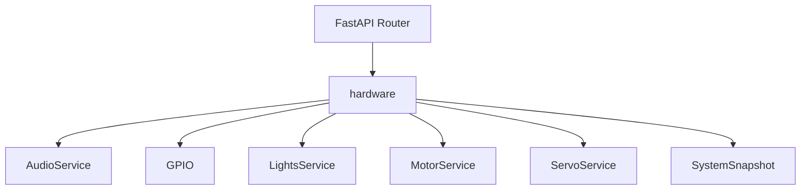
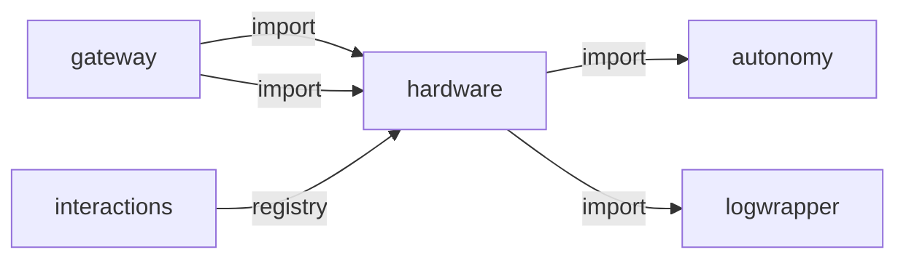
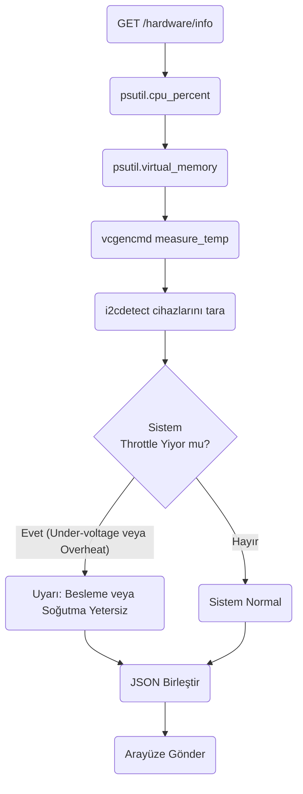
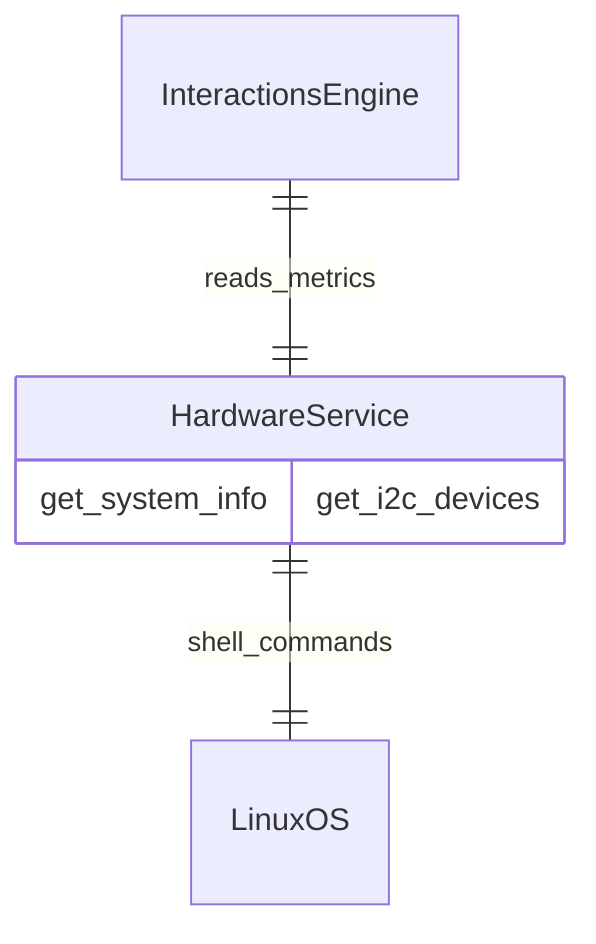

# hardware

> **CPU/RAM/sıcaklık bilgisi, I2C tarama**

## Kimlik
| Alan | Değer |
| --- | --- |
| Ana sınıf | `—` |
| Giriş noktası | `create_app()` |
| Orkestratör | `—` |
| Ana dosya | `modules/hardware/xHardwareService.py` |
| Katman | Algı |
| Port | — |
| Arduino | Hayır |
| Sınıf sayısı | 6 |
| Endpoint sayısı | 4 |

## İsimlendirilmiş Bileşenler (Sınıflar)

#### `AudioService` — `modules/hardware/services/audio_service.py`
- **Görev:** Controls TTS output (pyttsx3/piper) and hardware buzzer sounds via ServiceClient.
- **Kalıtım:** —
- **Oluşturduğu bileşenler:** —
- **Metodlar:** `speak()`, `beep()`, `play_sound()`, `set_lcd()`, `set_oled()`

#### `GPIO` — `modules/hardware/services/gpio.py`
- **Görev:** —
- **Kalıtım:** —
- **Oluşturduğu bileşenler:** —
- **Metodlar:** `info()`

#### `LightsService` — `modules/hardware/services/lights_service.py`
- **Görev:** Controls NeoPixel LED strips and Laser pointers via ServiceClient HTTP calls.
- **Kalıtım:** —
- **Oluşturduğu bileşenler:** —
- **Metodlar:** `set_effect()`, `fill_color()`, `apply_preset()`, `set_laser()`

#### `MotorService` — `modules/hardware/services/motor_service.py`
- **Görev:** Controls NEMA stepper motors via ServiceClient -> Arduino serial.
- **Kalıtım:** —
- **Oluşturduğu bileşenler:** —
- **Metodlar:** `drive()`, `drive_both()`, `stop()`, `robot_command()`

#### `ServoService` — `modules/hardware/services/servo_service.py`
- **Görev:** Interfaces with the Arduino PCA9685 servo system via ServiceClient HTTP calls.
- **Kalıtım:** —
- **Oluşturduğu bileşenler:** —
- **Metodlar:** `move_head()`, `run_animation()`

#### `SystemSnapshot` — `modules/hardware/services/system.py`
- **Görev:** —
- **Kalıtım:** —
- **Oluşturduğu bileşenler:** —
- **Metodlar:** `to_dict()`


## API — Endpoint → Handler → Servis

| HTTP | Path | Handler | Çağırdığı servis | Açıklama |
| --- | --- | --- | --- | --- |
| GET | `/healthz` | `healthz()` | — | — |
| GET | `/system` | `system()` | — | — |
| GET | `/i2c/scan` | `i2c_scan_endpoint()` | — | — |
| GET | `/gpio/info` | `gpio_info()` | — | — |

## Config Bölümleri
- `server`
- `system`
- `gpio`
- `i2c`

## Dış İlişkiler (Bu modül → diğerleri)

| Hedef modül | Bağlantı tipi | Detay | Neden |
| --- | --- | --- | --- |
| [[autonomy]] | import | services | Sistem yükü verisini otonomi beyinine bildirir. |
| [[logwrapper]] | import | init_logging | `hardware` → `logwrapper`: Merkezi WebSocket log yayınına bağlanır. |

## Gelen İlişkiler (Diğerleri → bu modül)

| Kaynak modül | Bağlantı tipi | Detay | Neden |
| --- | --- | --- | --- |
| [[gateway]] | import | api | `gateway` kod içinde `hardware` modülünü import eder (`api`) — CPU/RAM/sıcaklık bilgisi, I2C tarama. |
| [[gateway]] | import | config_loader | `gateway` kod içinde `hardware` modülünü import eder (`config_loader`) — CPU/RAM/sıcaklık bilgisi, I2C tarama. |
| [[interactions]] | registry | registry dependency: neopixel, hardware | Sistem metriklerini (CPU, RAM, sıcaklık) okur. |

## İç Mimari (otomatik çıkarım)



## Modül Etkileşim Haritası



### Mimari diyagram 1


### Mimari diyagram 2


---

# Tam Kaynak Arşivi

### `modules/hardware/README.md` (9 satır)

```markdown
# Hardware Module (RPi5 system, no battery)

Raspberry Pi 5 sistem bilgileri ve temel IO yardımcıları. Batarya/voltaj yok.

## API
- GET `/hardware/healthz`
- GET `/hardware/system`
- GET `/hardware/i2c/scan`
- GET `/hardware/gpio/info`
```

### `modules/hardware/__init__.py` (8 satır)

```python
# Hardware Abstraction Layer (HAL)
# All services accept a ServiceClient and delegate to existing microservices via HTTP.
from .services.servo_service import ServoService
from .services.lights_service import LightsService
from .services.motor_service import MotorService
from .services.audio_service import AudioService

__all__ = ["ServoService", "LightsService", "MotorService", "AudioService"]
```

### `modules/hardware/api/__init__.py` (1 satır)

```python
# API package for hardware
```

### `modules/hardware/api/router.py` (32 satır)

```python
from __future__ import annotations
from typing import Dict, Any
from fastapi import APIRouter

from ..services.system import read_system_snapshot
from ..services.i2c import scan as i2c_scan
from ..services.gpio import GPIO


def get_router(cfg: Dict[str, Any]) -> APIRouter:
    r = APIRouter(prefix="/hardware", tags=["hardware"])

    @r.get("/healthz")
    def healthz():
        snap = read_system_snapshot().to_dict()
        return {"ok": True, "system": snap}

    @r.get("/system")
    def system():
        return read_system_snapshot().to_dict()

    @r.get("/i2c/scan")
    def i2c_scan_endpoint():
        bus = int(cfg.get("i2c", {}).get("bus", 1))
        return {"bus": bus, "addresses": [hex(a) for a in i2c_scan(bus)]}

    @r.get("/gpio/info")
    def gpio_info():
        mode = str(cfg.get("gpio", {}).get("mode", "bcm"))
        return GPIO(mode).info()

    return r
```

### `modules/hardware/architecture_hardware.md` (43 satır)

```markdown
# Hardware Modülü Mimarisi

Hardware modülü (`modules/hardware`), yazılımın doğrudan erişebileceği işletim sistemi, GPIO, I2C, bellek (RAM) ve disk durumu gibi alt seviye (low-level) Raspberry Pi/Jetson donanım bilgilerini okur ve API'ye sunar.

## 🏗️ İş Akışı ve Karar Mekanizmaları (Flowchart)


## 🔄 İlişkisel Etkileşimler (Veri Akışı)


## ⚙️ Detaylı Karar Mantığı (if/else)

1. **İşletim Sistemi Çapraz Platform Mantığı**
   - Robotun kodları geliştirici bir bilgisayarda (Windows/Mac) çalıştırıldığında birçok donanımsal komut (örneğin `vcgencmd measure_temp`) çökecektir.
   - Bu modülde **`try / except`** blokları, komutun çalışıp çalışmadığını algılar. Eger `vcgencmd` komutu mevcut değilse, sistem çökmez, sıcaklık değeri olarak `-1` döner.
2. **Throttling Kontrolü (Aşırı Isınma ve Güç)**
   - Raspberry Pi'nin `get_throttled` komutu onaltılık (hex) bir bayrak döner (örneğin `0x50000`).
   - Bitwise (`&`) maskelemesi ile **`if`** `throttled & 0x1`: düşük voltaj (under-voltage), **`if`** `throttled & 0x2`: hız düşürme (CPU freq cap) olduğu anlaşılır ve Web Arayüzü/Diagnostik modülleri için `True/False` bayrakları JSON içine giydirilir.
```

### `modules/hardware/config/config.yml` (11 satır)

```yaml
server:
  host: 0.0.0.0
  port: 8090
system:
  poll_ms: 2000
gpio:
  enabled: false
  mode: bcm
i2c:
  enabled: true
  bus: 1
```

### `modules/hardware/config_loader.py` (32 satır)

```python
from __future__ import annotations
import os
from pathlib import Path
from typing import Any, Dict

import yaml

_DEFAULT_CFG_PATH = Path(__file__).parent / "config" / "config.yml"


def _deep_update(base: Dict[str, Any], override: Dict[str, Any]) -> Dict[str, Any]:
    for k, v in override.items():
        if isinstance(v, dict) and isinstance(base.get(k), dict):
            base[k] = _deep_update(base[k], v)
        else:
            base[k] = v
    return base


def load_config(path: str | os.PathLike | None = None) -> Dict[str, Any]:
    cfg_path = Path(path) if path else _DEFAULT_CFG_PATH
    if not cfg_path.exists():
        cfg_path = _DEFAULT_CFG_PATH
    with open(cfg_path, "r", encoding="utf-8") as f:
        data = yaml.safe_load(f) or {}

    # Env overrides (flat minimal set)
    env: Dict[str, Any] = {}
    poll = os.getenv("HW_POLL_MS")
    if poll:
        env.setdefault("system", {})["poll_ms"] = int(poll)
    return _deep_update(data, env)
```

### `modules/hardware/services/__init__.py` (1 satır)

```python
# namespace package for hardware services
```

### `modules/hardware/services/audio_service.py` (73 satır)

```python
"""
Production-ready HAL Audio Service.
Delegates to the existing Speak service and Arduino buzzer via ServiceClient.
"""
import logging
from typing import Optional

logger = logging.getLogger("hardware.audio")


class AudioService:
    """
    Controls TTS output (pyttsx3/piper) and hardware buzzer sounds via ServiceClient.
    """

    def __init__(self, client):
        self.client = client

    def speak(self, text: str, tone: Optional[str] = None, engine: Optional[str] = None, language: Optional[str] = None) -> bool:
        """
        Speak text via the TTS microservice.
        Returns True on success.
        """
        try:
            result = self.client.speak(text, tone=tone, engine=engine, language=language)
            logger.info("TTS: '%s' -> %s", text[:50], result)
            return bool(result)
        except Exception as e:
            logger.error("TTS failed: %s", e)
            return False

    def beep(self, out: str = "loud", freq: int = 2200, ms: int = 60) -> Optional[dict]:
        """Play a buzzer tone via Arduino."""
        try:
            result = self.client.set_buzzer(out=out, freq=freq, ms=ms)
            logger.info("Buzzer beep: %s %dHz %dms -> %s", out, freq, ms, result)
            return result
        except Exception as e:
            logger.error("Buzzer failed: %s", e)
            return None

    def play_sound(self, name: str, out: str = "loud") -> Optional[dict]:
        """Play a named sound effect (walle, bb8, etc.) via Arduino."""
        try:
            result = self.client.play_sound(name, out=out)
            logger.info("Sound play '%s' -> %s", name, result)
            return result
        except Exception as e:
            logger.error("Sound play failed: %s", e)
            return None

    def set_lcd(self, top: str = "", bottom: str = "", lcd_id: int = 0) -> Optional[dict]:
        """Write text to the LCD display."""
        try:
            return self.client.set_lcd(top=top, bottom=bottom, id=lcd_id)
        except Exception as e:
            logger.error("LCD write failed: %s", e)
            return None

    def set_oled(self, action: str = "show", name: str = "normal") -> Optional[dict]:
        """Control OLED face display."""
        try:
            if action == "anim":
                return self.client.oled_anim(name)
            elif action == "stop":
                return self.client.oled_stop()
            elif action == "logo":
                return self.client.oled_logo()
            else:
                return self.client.oled_show(name)
        except Exception as e:
            logger.error("OLED %s failed: %s", action, e)
            return None
```

### `modules/hardware/services/gpio.py` (10 satır)

```python
from __future__ import annotations
from typing import Any


class GPIO:
    def __init__(self, mode: str = "bcm") -> None:
        self.mode = mode

    def info(self) -> dict[str, Any]:
        return {"mode": self.mode, "available": False}
```

### `modules/hardware/services/i2c.py` (23 satır)

```python
from __future__ import annotations
from typing import List


def scan(bus: int = 1) -> List[int]:
    """Return detected I2C addresses (hex ints). Stub returns empty list on non-RPi systems."""
    try:
        import smbus2  # type: ignore
    except Exception:
        return []
    found: List[int] = []
    try:
        b = smbus2.SMBus(bus)
        for addr in range(0x03, 0x78):
            try:
                b.write_quick(addr)
                found.append(addr)
            except Exception:
                pass
        b.close()
    except Exception:
        return []
    return found
```

### `modules/hardware/services/lights_service.py` (60 satır)

```python
"""
Production-ready HAL Lights Service.
Delegates to the existing Neopixel and Arduino Laser services via ServiceClient.
"""
import logging
from typing import Optional, List

logger = logging.getLogger("hardware.lights")


class LightsService:
    """
    Controls NeoPixel LED strips and Laser pointers via ServiceClient HTTP calls.
    """

    def __init__(self, client):
        self.client = client

    def set_effect(
        self,
        effect: str,
        emotions: Optional[List[str]] = None,
        color: Optional[tuple] = None,
        duration: Optional[float] = None,
    ) -> Optional[dict]:
        """
        Apply a NeoPixel animation effect (BREATHE, PULSE, SPINNER, WAVE, FIRE, etc.).
        """
        try:
            result = self.client.set_neopixel(effect, emotions=emotions, color=color, duration=duration)
            logger.info("NeoPixel effect '%s' applied -> %s", effect, result)
            return result
        except Exception as e:
            logger.error("NeoPixel effect failed: %s", e)
            return None

    def fill_color(self, r: int, g: int, b: int) -> None:
        """Fill all LEDs with a solid color."""
        try:
            self.client.fill_neopixel_color(r, g, b)
        except Exception as e:
            logger.error("NeoPixel fill failed: %s", e)

    def apply_preset(self, name: str) -> Optional[dict]:
        """Apply a named preset palette."""
        try:
            return self.client.apply_neopixel_preset(name)
        except Exception as e:
            logger.error("NeoPixel preset '%s' failed: %s", name, e)
            return None

    def set_laser(self, on: bool, laser_id: int = 1, both: bool = False) -> Optional[dict]:
        """Control cross-lasers via Arduino."""
        try:
            result = self.client.set_laser(on, id=laser_id, both=both)
            logger.info("Laser set on=%s id=%d both=%s -> %s", on, laser_id, both, result)
            return result
        except Exception as e:
            logger.error("Laser control failed: %s", e)
            return None
```

### `modules/hardware/services/motor_service.py` (75 satır)

```python
"""
Production-ready HAL Motor Service.
Delegates to the existing ServiceClient HTTP layer for NEMA stepper control.
Returns feedback strings for the Agent's proprioception system.
"""
import logging
from typing import Optional

logger = logging.getLogger("hardware.motor")


class MotorService:
    """
    Controls NEMA stepper motors via ServiceClient -> Arduino serial.
    Returns action feedback strings for the AgentOrchestrator's proprioception loop.
    """

    def __init__(self, client):
        self.client = client

    def drive(self, stepper_id: int, mode: str, value: int, drive_param: int = 200) -> str:
        """
        Move a stepper motor.
        Args:
            stepper_id: 0 or 1
            mode: "pos" (position) or "vel" (velocity)
            value: target position (steps) or velocity (steps/s)
            drive_param: speed parameter for position mode
        Returns:
            "SUCCESS" or "ERROR_..." feedback string for proprioception.
        """
        try:
            result = self.client.set_stepper(stepper_id, mode, value, drive=drive_param)
            if result and isinstance(result, dict):
                if result.get("ok", False):
                    logger.info("Stepper[%d] %s=%d -> SUCCESS", stepper_id, mode, value)
                    return "SUCCESS"
                elif result.get("stall"):
                    logger.warning("Stepper[%d] STALL DETECTED", stepper_id)
                    return "ERROR_STALL_DETECTED"
                else:
                    error = result.get("error", "unknown")
                    logger.warning("Stepper[%d] error: %s", stepper_id, error)
                    return f"ERROR_{error}"
            logger.warning("Stepper[%d] no response from Arduino", stepper_id)
            return "ERROR_NO_RESPONSE"
        except Exception as e:
            logger.error("Stepper[%d] exception: %s", stepper_id, e)
            return f"ERROR_EXCEPTION_{e}"

    def drive_both(self, left_vel: int, right_vel: int) -> str:
        """Drive both wheels simultaneously (differential drive)."""
        r0 = self.drive(0, "vel", left_vel)
        r1 = self.drive(1, "vel", right_vel)
        if "ERROR" in r0 or "ERROR" in r1:
            return f"ERROR_PARTIAL: L={r0} R={r1}"
        return "SUCCESS"

    def stop(self) -> str:
        """Emergency stop all motors."""
        try:
            self.client.robot_command("estop")
            logger.info("Emergency STOP issued.")
            return "SUCCESS_ESTOP"
        except Exception as e:
            logger.error("Emergency stop failed: %s", e)
            return f"ERROR_ESTOP_{e}"

    def robot_command(self, cmd: str) -> Optional[dict]:
        """Send simple robot commands: stand, sit, home, zero_now."""
        try:
            return self.client.robot_command(cmd)
        except Exception as e:
            logger.error("Robot command '%s' failed: %s", cmd, e)
            return None
```

### `modules/hardware/services/servo_service.py` (46 satır)

```python
"""
Production-ready HAL Servo Service.
Delegates to the existing ServiceClient HTTP layer (which talks to Arduino via Gateway).
"""
import logging
from typing import Optional

logger = logging.getLogger("hardware.servo")


class ServoService:
    """
    Interfaces with the Arduino PCA9685 servo system via ServiceClient HTTP calls.
    This is NOT a direct serial connection — SentryBOT uses a microservice architecture
    where arduino_serial runs its own FastAPI, and we communicate via HTTP.
    """

    def __init__(self, client):
        """
        Args:
            client: An autonomy ServiceClient instance (modules.autonomy.services.client).
        """
        self.client = client

    def move_head(self, pan: int, tilt: int, speed: float = 0.8) -> dict:
        """
        Commands the head pan/tilt via ServiceClient -> Arduino.
        Returns the response dict from Arduino (contains 'ok' field).
        """
        try:
            result = self.client.move_head(pan, tilt, speed)
            logger.info("Servo moved: pan=%d tilt=%d -> %s", pan, tilt, result)
            return result or {"ok": False, "error": "no_response"}
        except Exception as e:
            logger.error("Servo move_head failed: %s", e)
            return {"ok": False, "error": str(e)}

    def run_animation(self, name: str, speed: float = 1.0, loop: bool = False) -> Optional[dict]:
        """Trigger a named servo animation via the Animate service."""
        try:
            result = self.client.run_animation(name, speed=speed, loop=loop)
            logger.info("Servo animation '%s' triggered -> %s", name, result)
            return result
        except Exception as e:
            logger.error("Servo animation '%s' failed: %s", name, e)
            return None
```

### `modules/hardware/services/system.py` (65 satır)

```python
from __future__ import annotations
from dataclasses import dataclass
from typing import Dict, Any
import os
import time


def _read_first(path: str) -> str | None:
    try:
        with open(path, "r", encoding="utf-8") as f:
            return f.read().strip()
    except Exception:
        return None


def _cpu_temp_c() -> float | None:
    # Typical path on RPi
    raw = _read_first("/sys/class/thermal/thermal_zone0/temp")
    if raw is None:
        return None
    try:
        val = int(raw)
        # Some kernels expose millidegrees
        return val / 1000.0 if val > 200 else float(val)
    except Exception:
        return None


def _cpu_load() -> float | None:
    try:
        with open("/proc/loadavg", "r", encoding="utf-8") as f:
            parts = f.read().split()
        return float(parts[0])
    except Exception:
        return None


def _throttled() -> str | None:
    # vcgencmd get_throttled would be ideal; fallback to env indicator
    return os.getenv("RPI_THROTTLED")


@dataclass
class SystemSnapshot:
    timestamp: float
    cpu_temp_c: float | None
    cpu_load_1m: float | None
    throttled: str | None

    def to_dict(self) -> Dict[str, Any]:
        return {
            "timestamp": self.timestamp,
            "cpu_temp_c": self.cpu_temp_c,
            "cpu_load_1m": self.cpu_load_1m,
            "throttled": self.throttled,
        }


def read_system_snapshot() -> SystemSnapshot:
    return SystemSnapshot(
        timestamp=time.time(),
        cpu_temp_c=_cpu_temp_c(),
        cpu_load_1m=_cpu_load(),
        throttled=_throttled(),
    )
```

### `modules/hardware/tests/test_smoke.py` (8 satır)

```python
from __future__ import annotations

from modules.hardware.xHardwareService import create_app


def test_create_app():
    app = create_app()
    assert app is not None
```

### `modules/hardware/xHardwareService.py` (25 satır)

```python
from __future__ import annotations
from fastapi import FastAPI

from .config_loader import load_config
from .api.router import get_router

# Optional central logging
try:
    from modules.logwrapper import init_logging as _init_global_logging  # type: ignore
    _init_global_logging()
except Exception:
    pass


def create_app(config_path: str | None = None) -> FastAPI:
    cfg = load_config(config_path)
    app = FastAPI(title="Hardware Service")
    app.include_router(get_router(cfg))
    return app


if __name__ == "__main__":
    import uvicorn
    cfg = load_config(None)
    uvicorn.run(create_app(), host=str(cfg["server"]["host"]), port=int(cfg["server"]["port"]))
```
