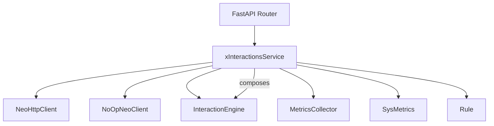
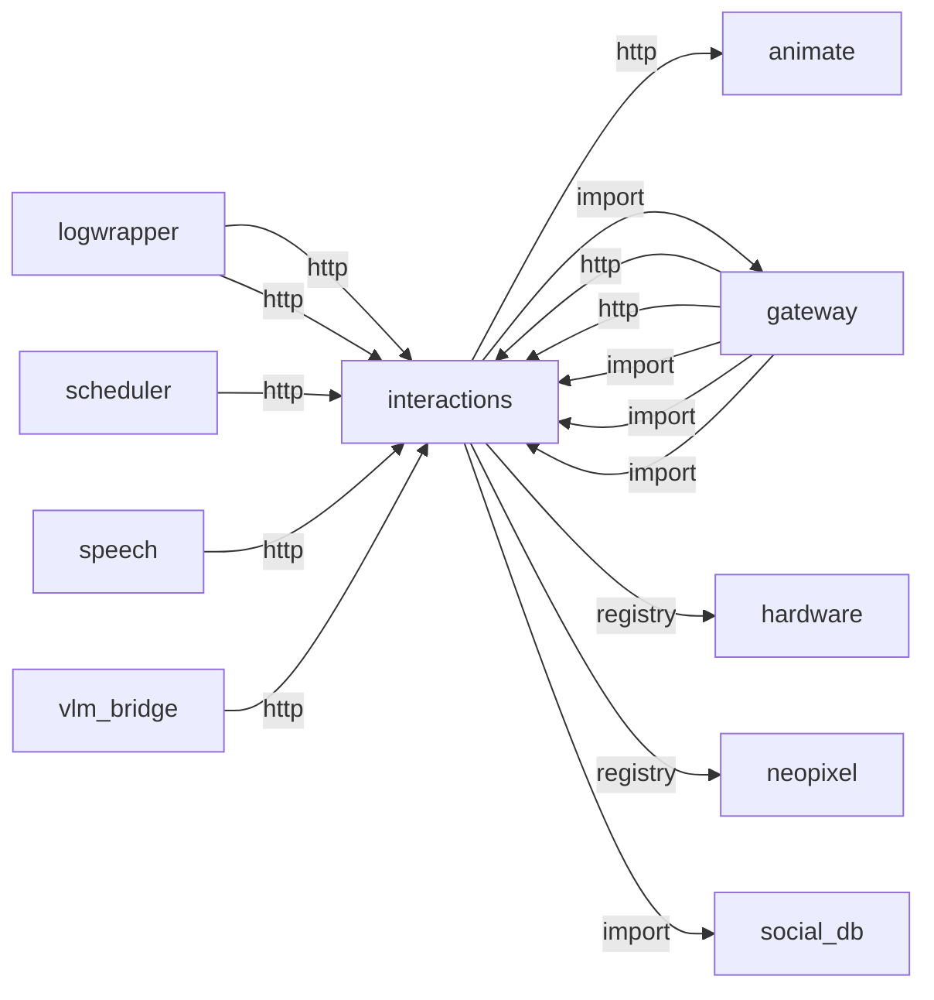
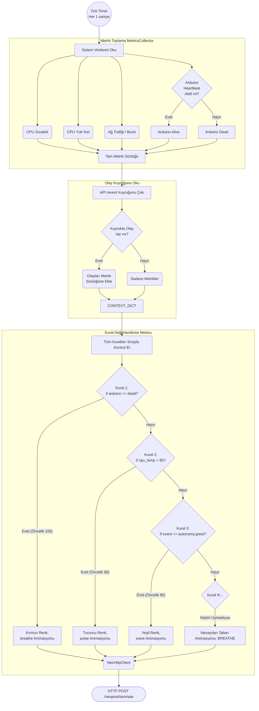
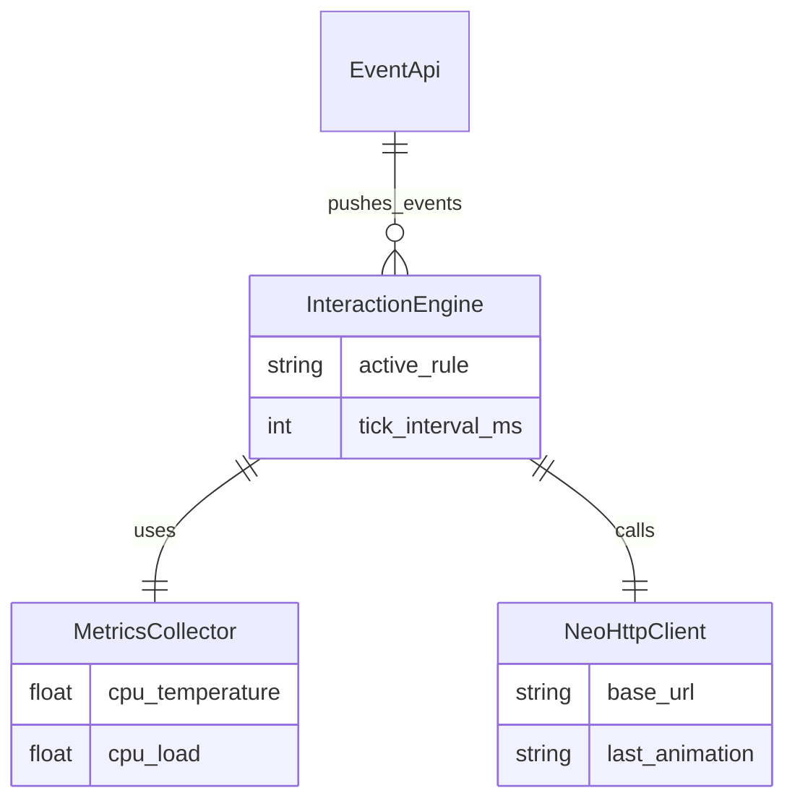

# interactions

> **CPU/ağ metrikleri, kural motoru, NeoPixel tetikleme**

## Kimlik
| Alan | Değer |
| --- | --- |
| Ana sınıf | `xInteractionsService` |
| Giriş noktası | `create_app()` |
| Orkestratör | `InteractionEngine` |
| Ana dosya | `modules/interactions/xInteractionsService.py` |
| Katman | Etkileşim |
| Port | — |
| Arduino | Hayır |
| Sınıf sayısı | 9 |
| Endpoint sayısı | 4 |

## İsimlendirilmiş Bileşenler (Sınıflar)

#### `NeoHttpClient` — `modules/interactions/services/adapters/neopixel_client.py`
- **Görev:** —
- **Kalıtım:** —
- **Oluşturduğu bileşenler:** —
- **Metodlar:** `clear()`, `fill()`, `animate()`, `set_base()`, `play_effect()`

#### `NoOpNeoClient` — `modules/interactions/services/adapters/neopixel_client.py`
- **Görev:** —
- **Kalıtım:** —
- **Oluşturduğu bileşenler:** —
- **Metodlar:** `clear()`, `fill()`, `animate()`, `set_base()`, `play_effect()`

#### `InteractionEngine` — `modules/interactions/services/engine.py`
- **Görev:** —
- **Kalıtım:** —
- **Oluşturduğu bileşenler:** `MetricsCollector`, `Event`, `Lock`
- **Metodlar:** `start()`, `stop()`, `push_event()`, `register_event_handler()`, `set_state()`, `trigger_effect()`, `get_state()`

#### `_LocalNeoAdapter` — `modules/interactions/services/engine.py`
- **Görev:** —
- **Kalıtım:** —
- **Oluşturduğu bileşenler:** —
- **Metodlar:** `clear()`, `fill()`, `animate()`, `set_base()`, `play_effect()`

#### `MetricsCollector` — `modules/interactions/services/metrics.py`
- **Görev:** —
- **Kalıtım:** —
- **Oluşturduğu bileşenler:** —
- **Metodlar:** `sample()`

#### `SysMetrics` — `modules/interactions/services/metrics.py`
- **Görev:** —
- **Kalıtım:** —
- **Oluşturduğu bileşenler:** —
- **Metodlar:** —

#### `Rule` — `modules/interactions/services/rules.py`
- **Görev:** —
- **Kalıtım:** —
- **Oluşturduğu bileşenler:** —
- **Metodlar:** `ready()`, `stamp()`

#### `xInteractionsService` — `modules/interactions/xInteractionsService.py`
- **Görev:** —
- **Kalıtım:** —
- **Oluşturduğu bileşenler:** `InteractionEngine`
- **Metodlar:** `start()`, `stop()`


## API — Endpoint → Handler → Servis

| HTTP | Path | Handler | Çağırdığı servis | Açıklama |
| --- | --- | --- | --- | --- |
| GET | `/state` | `state()` | — | — |
| POST | `/event` | `push_event()` | — | — |
| POST | `/effect` | `effect()` | — | — |
| POST | `/base` | `base()` | — | — |

## Config Bölümleri
- `server`
- `adapter`
- `monitor`
- `hardware`
- `tick_interval_ms`
- `quiet_hours`
- `thresholds`
- `defaults`
- `rules`

## Dış İlişkiler (Bu modül → diğerleri)

| Hedef modül | Bağlantı tipi | Detay | Neden |
| --- | --- | --- | --- |
| [[animate]] | http | calls path `/animate` | Sistem olaylarında veya kural tetiklerinde robot hareketi başlatır. |
| [[gateway]] | import | url | `interactions` içinde `url` import edilir; `gateway` modülünün yeteneğini kullanır (FastAPI API bootstrapper, tüm modülleri mount eder). |
| [[hardware]] | registry | registry dependency: neopixel, hardware | Sistem metriklerini (CPU, RAM, sıcaklık) okur. |
| [[neopixel]] | registry | registry dependency: neopixel, hardware | Kural motoru CPU/ağ olaylarında LED animasyonu tetikler. |
| [[social_db]] | import | get_default | `interactions` içinde `get_default` import edilir; `social_db` modülünün yeteneğini kullanır (SQLite kişi hafızası, ilişki/tanıma seviyeleri). |

## Gelen İlişkiler (Diğerleri → bu modül)

| Kaynak modül | Bağlantı tipi | Detay | Neden |
| --- | --- | --- | --- |
| [[gateway]] | http | calls path `/interactions` | `gateway` → `interactions`: Sistem olayı veya LED efekti tetikler. |
| [[gateway]] | http | calls path `/interactions/event` | `gateway` → `interactions`: Sistem olayı veya LED efekti tetikler. |
| [[gateway]] | import | api | `gateway` kod içinde `interactions` modülünü import eder (`api`) — CPU/ağ metrikleri, kural motoru, NeoPixel tetikleme. |
| [[gateway]] | import | config_loader | `gateway` kod içinde `interactions` modülünü import eder (`config_loader`) — CPU/ağ metrikleri, kural motoru, NeoPixel tetikleme. |
| [[gateway]] | import | services | `gateway` kod içinde `interactions` modülünü import eder (`services`) — CPU/ağ metrikleri, kural motoru, NeoPixel tetikleme. |
| [[logwrapper]] | http | calls path `/interactions/event` | `logwrapper` → `interactions`: Sistem olayı veya LED efekti tetikler. |
| [[logwrapper]] | http | calls path `/interactions/effect` | `logwrapper` → `interactions`: Sistem olayı veya LED efekti tetikler. |
| [[scheduler]] | http | calls path `/interactions/event` | `scheduler` → `interactions`: Sistem olayı veya LED efekti tetikler. |
| [[speech]] | http | calls path `/interactions/event` | `speech` → `interactions`: Sistem olayı veya LED efekti tetikler. |
| [[vlm_bridge]] | http | calls path `/interactions/event` | `vlm_bridge` → `interactions`: Sistem olayı veya LED efekti tetikler. |

## İç Mimari (otomatik çıkarım)



## Modül Etkileşim Haritası



### Mimari diyagram 1


### Mimari diyagram 2


---

# Tam Kaynak Arşivi

### `modules/interactions/README.md` (105 satır)

```markdown
# Interactions Module

Durumlara/olaylara göre NeoPixel animasyonlarını otomatik seçen hafif bir kural motoru.

## Özellikler
- HTTP üzerinden mevcut NeoPixel servisine bağlanır (`/neopixel`).
- Base (sürekli) + Transient (kısa) efekt katmanı, öncelik ve cooldown ile.
- Sistem metrikleri: CPU sıcaklık/yük, ağ burst sezgisi.
- Olay besleme: `POST /interactions/event` ile (ör: `speech.start`, `error`).
- Quiet Hours (gece modu): belirli saatlerde dikkat dağıtan transient efektleri baskılar.
- Donanım haritalama: Jewel (7) + Stick (16 tek sıra). Şimdilik tüm strip’e animasyon uygular.

## Kurulum
- FastAPI uygulaması: `xInteractionsService.create_app()`.
- Varsayılan port: 8095 (`config/config.yml`).

## API
- GET `/interactions/state`: aktif base/effect ve son metrikler.
- POST `/interactions/event` `{ type, data? }`: olay tetikle (ör: `speech.start`).
- POST `/interactions/effect` `{ name, duration_ms? }`: manuel kısa efekt.
  - Opsiyonel: `{ force: true }` ile quiet-hours sırasında da efekt zorlanabilir.
- POST `/interactions/base` `{ name, color? }`: geçici base override.

### Gateway Entegrasyonu
Gateway, `interactions` router’ını tek portta sunar. NeoPixel uçları da gateway’de açıksa, kurallar doğrudan bu uçlara istek gönderir; modülü ayrı başlatmaya gerek yoktur.

## Varsayılan Davranış (config.yml)
- Sıcaklık ≥ 75°C: BREATHE kırmızı (base, high)
- 65–74°C: PULSE turuncu (base, medium)
- CPU yük ≥ 0.9: PULSE sarı (base, medium)
- Ağ burst: COMET 800ms (transient, cooldown 3s)
- speech.start: RAINBOW_CYCLE 1s (transient)
- speech.end: COMET 600ms (transient)
- Arduino disconnected: THEATER_CHASE magenta (base, high)
- error: METEOR 500ms (critical, cooldown 10s)
- warning: PULSE 400ms (high, cooldown 3s)
- Hiçbiri değilse: BREATHE teal (idle base)

## Kural/Config Yapısı
`modules/interactions/config/config.yml`
- `adapter.http_base_url`: NeoPixel HTTP tabanı (varsayılan: `http://localhost:8092/neopixel`).
- `hardware.segments`: Jewel + Stick tanımı (ileri geliştirme için hazır).
- `thresholds`: cpu_temp/cpu_load/net burst eşikleri.
- `rules`: sıralı değerlendirilir. Koşullar (örnek anahtarlar):
  - `event`, `cpu_temp_gte`, `cpu_temp_lt`, `cpu_load_gte`, `net_burst`, `arduino_connected`
- `defaults.idle`: boşta gösterilecek base animasyon.

### Yeni Uyarı/Etkileşim Ekleme
1. `rules` listesine yeni bir kural ekleyin:
```yaml
- id: my_custom
  when: { event: my.event }
  action: { effect: { name: COMET, duration_ms: 700 } }
  priority: high
  cooldown_ms: 2000
- id: autonomy_bored
  when: { event: autonomy.bored }
  action: { base: { name: BREATHE, color: "#0000FF" } } # Blue breathe
  priority: medium

- id: autonomy_excited
  when: { event: autonomy.excited }
  action: { effect: { name: PULSE, duration_ms: 1000 }, base: { name: RAINBOW, color: null } }
  priority: high

- id: autonomy_sleep
  when: { event: autonomy.sleep }
  action: { base: { name: BREATHE, color: "#100010" } } # Dim purple
  priority: high

- id: autonomy_wake
  when: { event: autonomy.wake }
  action: { effect: { name: RAINBOW, duration_ms: 2000 }, base: { name: BREATHE, color: "#00FF00" } }
  priority: high

2. Olayı gönderin:
```json
POST /interactions/event
{ "type": "my.event" }
```
3. Renge özel davranmak isterseniz `base.color: "#RRGGBB"` verebilirsiniz (uyumlu animasyonlarda dolgu yapılır, aksi halde animasyon adı oynatılır).

## Notlar
- Quiet hours varsayılan olarak açıktır (`23:00-07:00`) ve yalnızca kritik olay efektlerine izin verir.
- NeoPixel servisi yoksa istekler sessizce yok sayılır (No-Op mod).
- İleride segment/mask desteklemek için NeoPixel API genişletimi önerilir.

## Quiet Hours Konfigürasyonu
`modules/interactions/config/config.yml` içinde:

```yaml
quiet_hours:
  enabled: true
  start: "23:00"
  end: "07:00"
  suppress_effects: true
  allow_events: ["error", "warning", "owner.locked"]
```

- `suppress_effects: true` iken transient efektler baskılanır.
- `allow_events` listesi, gece modu sırasında da çalışmasına izin verilen olay adlarıdır.
- Base (sabit) aydınlatma için `quiet_hours_idle` kuralı dim bir görünüm uygular.

---
Bu modül DryCode prensiplerine uygundur: tek sorumluluklu dosyalar, config odaklı, sade API.
```

### `modules/interactions/__init__.py` (6 satır)

```python
from __future__ import annotations

try:
    from .xInteractionsService import xInteractionsService, create_app  # noqa: F401
except Exception:  # pragma: no cover
    pass
```

### `modules/interactions/api/__init__.py` (6 satır)

```python
from __future__ import annotations

try:
    from .router import get_router  # noqa: F401
except Exception:  # pragma: no cover
    pass
```

### `modules/interactions/api/router.py` (53 satır)

```python
from __future__ import annotations

from fastapi import APIRouter
from typing import Any, Dict, Optional

try:
    from ..services.engine import InteractionEngine
except Exception:  # pragma: no cover
    from modules.interactions.services.engine import InteractionEngine  # type: ignore


def get_router(engine: InteractionEngine) -> APIRouter:
    r = APIRouter(prefix="/interactions", tags=["interactions"], responses={404: {"description": "Not found"}})

    @r.get("/state", tags=["interactions"], summary="State")
    def state():
        return engine.get_state()

    @r.post("/event", tags=["interactions"], summary="Push Event")
    def push_event(payload: Dict[str, Any]):
        t = str(payload.get("type", "")).strip()
        data = payload.get("data") if isinstance(payload.get("data"), dict) else None
        if not t:
            return {"ok": False, "error": "type is required"}
        engine.push_event(t, data)
        return {"ok": True}

    @r.post("/effect", tags=["interactions"], summary="Effect")
    def effect(payload: Dict[str, Any]):
        name = str(payload.get("name", "COMET"))
        dur = int(payload.get("duration_ms", 800))
        force = bool(payload.get("force", False))
        color = payload.get("color")
        if color is None and all(k in payload for k in ("r", "g", "b")):
            color = (int(payload.get("r", 0)), int(payload.get("g", 0)), int(payload.get("b", 0)))
        emotions = payload.get("emotions") if isinstance(payload.get("emotions"), list) else None
        engine.trigger_effect(
            name=name,
            duration_ms=dur,
            force=force,
            color=color,
            emotions=emotions,
        )
        return {"ok": True}

    @r.post("/base", tags=["interactions"], summary="Base")
    def base(payload: Dict[str, Any]):
        name = str(payload.get("name", "BREATHE"))
        color = payload.get("color")
        engine.set_state(manual_base=(name, color))
        return {"ok": True}

    return r
```

### `modules/interactions/architecture_interactions.md` (108 satır)

```markdown
# Interactions Modülü Mimarisi

Interactions modülü (`modules/interactions`), robotun pasif ve anlık tepkilerini kural tabanlı (rule-based) olarak yöneten arka plan motorudur. CPU sıcaklığı yükseldiğinde ışıkları kırmızı yapma, internet üzerinden yoğun indirme yaparken gözleri "Yükleniyor (wave)" animasyonuna sokma veya dışarıdan rastgele olaylar geldiğinde LED'leri tetikleme işlerinden sorumludur.

## 🏗️ İş Akışı ve Karar Mekanizmaları (Flowchart)

Sistemin her 1-2 saniyede bir ölçüm (metrik) alarak kuralları sırayla (if/else zinciri gibi) nasıl değerlendirdiğini gösteren diyagram:


## 🔄 İlişkisel Etkileşimler (Veri Akışı)


## ⚙️ Detaylı Karar Mantığı (if/else)

1. **MetricsCollector Ölçümleri (Eşiğe Bağlı if'ler)**
   - **`if`** `psutil` kullanılarak CPU sıcaklığı ölçülür, RPi üzerindeki termal sensör okunur.
   - **Ağ Burst Tespiti:** **`if`** `(net_current - net_previous) > 5MB/s`: O anki tick için `network_burst = True` bayrağı açılır. Bu sayede robot yüksek veri indirirken gözler hareketlenir (wave/chase).
2. **Kural Değerlendirme Mekanizması (Rule Engine)**
   Sistem hardcode büyük if-else yığınlarını engellemek için `rules` listesi tutar. Her kural `priority` (öncelik, yüksekten düşüğe), `condition_func` (boolean dönen lambda) ve `action_dict` içerir.
   - **Döngü (Taranan Kurallar)** (örn `rules.sort(key=priority, reverse=True)`):
     - **`if`** `condition_func(context) == True`: Bu eylemi seç ve diğer alt öncelikli kuralları okumayı bırak (`break`).
     - Yüksek öncelikler: Sistem hataları (Arduino bağlantısı kopuk), kritik durumlar (CPU aşırı sıcak).
     - Orta öncelikler: Anlık dış olaylar (`autonomy.greet`, `vision.person_detected`).
     - Düşük öncelikler: Normal donanım etkinlikleri (CPU yükü hafif yüksek, Ağ indiriliyor).
     - **Hiçbir Kural Uymadı (Default/Else):** `BREATHE` animasyonunu ve `neutral` duygu paletini gönderir. Robot bekleme halinde yavaşça nefes alır.
3. **HTTP İsteğinde Statefulness Zekası**
   - **`if`** Seçilen eylem (animasyon + renk) bir önceki tick ile BİREBİR AYNI ise hiçbir HTTP çağrısı yapılmaz. Bu sayede sistemi boşuna ağ istekleriyle yormaz, sadece değişim anında bildirir.
```

### `modules/interactions/config/config.yml` (208 satır)

```yaml
server:
  host: 0.0.0.0
  port: 8095

adapter:
  mode: http
  http_base_url: http://localhost:8092/neopixel

monitor:
  arduino:
    url: "@gateway/arduino/healthz"
    interval_s: 5
    timeout_s: 0.4

hardware:
  num_leds: 23  # 7 jewel + 16 stick (tek sıra)
  segments:
    - { name: jewel, start: 0, count: 7, reverse: false }
    - { name: stick, start: 7, count: 16, reverse: false }

tick_interval_ms: 800

quiet_hours:
  enabled: true
  start: "23:00"
  end: "07:00"
  suppress_effects: true
  allow_events: ["error", "warning", "owner.locked"]

thresholds:
  cpu_temp: { warm: 65, hot: 75, hysteresis: 3 }
  cpu_load: { high: 0.9, window_s: 60 }
  net: { burst_mbps: 20, min_duration_ms: 200 }

defaults:
  brightness: 0.6
  idle:
    base: { name: BREATHE, color: "#30E3CA", speed: slow }

rules:
  - id: quiet_hours_idle
    when: { quiet_hours_active: true }
    action: { base: { name: BREATHE, color: "#08131A", speed: slow } }
    priority: high

  - id: cpu_hot
    when: { cpu_temp_gte: 75 }
    action: { base: { name: BREATHE, color: "#FF0000", speed: slow } }
    priority: high

  - id: cpu_warm
    when: { cpu_temp_gte: 65, cpu_temp_lt: 75 }
    action: { base: { name: PULSE, color: "#FF7F00", speed: slow } }
    priority: medium

  - id: cpu_load_high
    when: { cpu_load_gte: 0.9 }
    action: { base: { name: PULSE, color: "#FFD000", speed: slow } }
    priority: medium

  - id: net_burst
    when: { net_burst: true }
    action: { effect: { name: COMET, duration_ms: 800 } }
    priority: medium
    cooldown_ms: 3000

  - id: wakeword_detected
    when: { event: wakeword.detected }
    action: { effect: { name: TWINKLE, duration_ms: 700 } }
    priority: critical
    cooldown_ms: 800

  - id: speech_start
    when: { event: speech.start }
    action: { effect: { name: PULSE, duration_ms: 900 } }
    priority: high
    cooldown_ms: 1200
  - id: speech_end
    when: { event: speech.end }
    action: { effect: { name: COMET, duration_ms: 600 } }
    priority: medium
    cooldown_ms: 1000

  - id: arduino_disconnected
    when: { arduino_connected: false }
    action: { base: { name: THEATER_CHASE, color: "#FF00FF" } }
    priority: high

  - id: error_ping
    when: { event: error }
    action: { effect: { name: METEOR, duration_ms: 500 } }
    priority: critical
    cooldown_ms: 10000

  - id: warning_ping
    when: { event: warning }
    action: { effect: { name: PULSE, duration_ms: 400 } }
    priority: high
    cooldown_ms: 3000

  - id: owner_scan
    when: { event: owner.scan }
    action: { effect: { name: COMET, duration_ms: 1200 } }
    priority: high
    cooldown_ms: 5000

  - id: owner_rfid
    when: { event: owner.rfid }
    action: { effect: { name: RAINBOW_CYCLE, duration_ms: 1500 } }
    priority: high
    cooldown_ms: 8000

  - id: owner_temp_granted
    when: { event: owner.temp_granted }
    action: { effect: { name: THEATER_CHASE, duration_ms: 1200 } }
    priority: medium
    cooldown_ms: 6000

  - id: owner_temp_revoked
    when: { event: owner.temp_revoked }
    action: { effect: { name: PULSE, duration_ms: 800 } }
    priority: medium
    cooldown_ms: 4000

  - id: owner_locked
    when: { event: owner.locked }
    action: { effect: { name: METEOR, duration_ms: 900 } }
    priority: medium
    cooldown_ms: 5000

  - id: autonomy_excited
    when: { event: autonomy.excited }
    action: { effect: { name: RAINBOW_CYCLE, duration_ms: 700 } }
    priority: medium
    cooldown_ms: 1500

  - id: autonomy_blink
    when: { event: autonomy.blink }
    action: { effect: { name: RANDOM_BLINK, duration_ms: 450 } }
    priority: medium
    cooldown_ms: 600

  - id: autonomy_look_around
    when: { event: autonomy.look_around }
    action: { effect: { name: COMET, duration_ms: 700 } }
    priority: medium
    cooldown_ms: 1200

  - id: autonomy_stretch
    when: { event: autonomy.stretch }
    action: { effect: { name: WAVE, duration_ms: 900 } }
    priority: medium
    cooldown_ms: 1600

  - id: autonomy_bored
    when: { event: autonomy.bored }
    action: { effect: { name: PULSE, duration_ms: 1000 } }
    priority: medium
    cooldown_ms: 2200

  - id: autonomy_monologue
    when: { event: autonomy.monologue }
    action: { effect: { name: TWINKLE, duration_ms: 900 } }
    priority: low
    cooldown_ms: 2500

  - id: autonomy_sleep
    when: { event: autonomy.sleep }
    action: { base: { name: BREATHE, color: "#04070A", speed: slow } }
    priority: high

  - id: autonomy_wake
    when: { event: autonomy.wake }
    action: { effect: { name: COMET, duration_ms: 900 } }
    priority: medium
    cooldown_ms: 1800

  - id: autonomy_offline
    when: { event: autonomy.offline }
    action: { effect: { name: PULSE, duration_ms: 850 } }
    priority: medium
    cooldown_ms: 2500

  - id: vision_focus
    when: { event: vision.focus }
    action: { effect: { name: COMET, duration_ms: 500 } }
    priority: low
    cooldown_ms: 900

  - id: autonomy_angry
    when: { event: autonomy.angry }
    action: { base: { name: BREATHE, color: "#FF3300", speed: slow } }
    priority: high

  - id: vision_person
    when: { event: vision.person }
    action: { effect: { name: COMET, duration_ms: 600 } }
    priority: low
    cooldown_ms: 1200

  - id: environment_scene_changed
    when: { event: environment.scene_changed }
    action: { effect: { name: COMET, duration_ms: 700 } }
    priority: low
    cooldown_ms: 4000

  # emotion:* and vision.person_emotion_* events drive piservo ears via gateway bridge.
  # NeoPixel colors are set directly by autonomy express() / set_neopixel — no LED rules here.
```

### `modules/interactions/config_loader.py` (70 satır)

```python
from __future__ import annotations

import os
from typing import Any, Dict, Optional

try:
    import yaml  # type: ignore
except Exception:  # pragma: no cover
    yaml = None


def load_config(config_path: Optional[str] = None, overrides: Optional[Dict[str, Any]] = None) -> Dict[str, Any]:
    """Load YAML config for interactions module with sane defaults.

    Priority: explicit path > modules/interactions/config/config.yml > defaults
    """
    base = {
        "server": {"host": "0.0.0.0", "port": 8095},
        "adapter": {"mode": "http", "http_base_url": "http://localhost:8092/neopixel"},
        "hardware": {
            "num_leds": 23,
            "segments": [
                {"name": "jewel", "start": 0, "count": 7, "reverse": False},
                {"name": "stick", "start": 7, "count": 16, "reverse": False},
            ],
        },
        "thresholds": {
            "cpu_temp": {"warm": 65, "hot": 75, "hysteresis": 3},
            "cpu_load": {"high": 0.9, "window_s": 60},
            "net": {"burst_mbps": 20, "min_duration_ms": 200},
        },
        "defaults": {
            "brightness": 0.6,
            "idle": {"base": {"name": "BREATHE", "color": "#30E3CA", "speed": "slow"}},
        },
        "rules": [],
    }

    p = config_path
    if not p:
        here = os.path.dirname(__file__)
        p = os.path.join(here, "config", "config.yml")

    data: Dict[str, Any] = {}
    if p and os.path.exists(p) and yaml is not None:
        with open(p, "r", encoding="utf-8") as f:
            loaded = yaml.safe_load(f) or {}
            if isinstance(loaded, dict):
                data = loaded

    # merge shallowly
    def _merge(a: Dict[str, Any], b: Dict[str, Any]) -> Dict[str, Any]:
        r = dict(a)
        for k, v in b.items():
            if isinstance(v, dict) and isinstance(r.get(k), dict):
                r[k] = _merge(r[k], v)  # type: ignore
            else:
                r[k] = v
        return r

    cfg = _merge(base, data)
    if overrides:
        cfg = _merge(cfg, overrides)
    try:
        from modules.gateway.url import resolve_gateway_base_url, rewrite_loopback_urls

        cfg = rewrite_loopback_urls(cfg, resolve_gateway_base_url())
    except Exception:
        pass
    return cfg
```

### `modules/interactions/services/__init__.py` (8 satır)

```python
from __future__ import annotations

try:
    from .engine import InteractionEngine  # noqa: F401
    from .metrics import MetricsCollector  # noqa: F401
    from .rules import Rule  # noqa: F401
except Exception:  # pragma: no cover
    pass
```

### `modules/interactions/services/adapters/neopixel_client.py` (117 satır)

```python
from __future__ import annotations

import time
import logging
from typing import Any, Dict, Optional

try:
    import requests  # type: ignore
except Exception:  # pragma: no cover
    requests = None  # type: ignore


logger = logging.getLogger("interactions.neopixel_client")


def _normalize_color(color: Any) -> Optional[tuple[int, int, int]]:
    if isinstance(color, (list, tuple)) and len(color) >= 3:
        try:
            return (int(color[0]) & 255, int(color[1]) & 255, int(color[2]) & 255)
        except (TypeError, ValueError):
            return None
    if isinstance(color, str):
        s = color.strip()
        if s.startswith("#") and len(s) >= 7:
            try:
                v = int(s[1:7], 16)
                return ((v >> 16) & 255, (v >> 8) & 255, v & 255)
            except ValueError:
                return None
    return None


class NeoHttpClient:
    def __init__(self, base_url: str) -> None:
        self.base = base_url.rstrip("/")

    def _post(self, path: str, json: Optional[Dict[str, Any]] = None, params: Optional[Dict[str, Any]] = None) -> None:
        if requests is None:
            logger.warning("neopixel http client disabled: requests not available")
            return
        try:
            resp = requests.post(self.base + path, json=json, params=params, timeout=1.5)
            if resp.status_code >= 400:
                logger.warning("neopixel request failed: %s %s -> %s", "POST", self.base + path, resp.status_code)
        except Exception as exc:
            logger.warning("neopixel request error: %s %s (%s)", "POST", self.base + path, exc)

    # Basic controls
    def clear(self) -> None:
        self._post("/clear")

    def fill(self, r: int, g: int, b: int) -> None:
        self._post("/fill", params={"r_": r, "g": g, "b": b})

    def animate(
        self,
        name: str,
        emotions: Optional[list[str]] = None,
        iterations: Optional[int] = None,
        color: Optional[str | tuple[int, int, int]] = None,
    ) -> None:
        payload: Dict[str, Any] = {"name": name}
        rgb = _normalize_color(color)
        if rgb is not None:
            payload["r"], payload["g"], payload["b"] = rgb
        if emotions:
            payload["emotions"] = emotions
        if iterations is not None:
            payload["iterations"] = iterations
        self._post("/animate", json=payload)

    # Friendly helpers
    def set_base(self, name: str, color: Optional[str | tuple[int, int, int]] = None, speed: Optional[str] = None) -> None:
        rgb = _normalize_color(color)
        if rgb is not None:
            self.animate(name, color=rgb)
        else:
            self.animate(name)

    def play_effect(
        self,
        name: str,
        duration_ms: int = 800,
        color: Optional[str | tuple[int, int, int]] = None,
        emotions: Optional[list[str]] = None,
    ) -> None:
        self.set_base(name, color=color)
        time.sleep(max(0.0, duration_ms / 1000.0))


class NoOpNeoClient:
    def clear(self) -> None:  # pragma: no cover
        pass

    def fill(self, r: int, g: int, b: int) -> None:  # pragma: no cover
        pass

    def animate(
        self,
        name: str,
        emotions: Optional[list[str]] = None,
        iterations: Optional[int] = None,
        color: Optional[str | tuple[int, int, int]] = None,
    ) -> None:  # pragma: no cover
        pass

    def set_base(self, name: str, color: Optional[str | tuple[int, int, int]] = None, speed: Optional[str] = None) -> None:  # pragma: no cover
        pass

    def play_effect(
        self,
        name: str,
        duration_ms: int = 800,
        color: Optional[str | tuple[int, int, int]] = None,
        emotions: Optional[list[str]] = None,
    ) -> None:  # pragma: no cover
        pass
```

### `modules/interactions/services/engine.py` (432 satır)

```python
from __future__ import annotations

from datetime import datetime
import logging
import threading
import time
from typing import Any, Dict, List, Optional, Tuple

try:
    import requests  # type: ignore
except Exception:  # pragma: no cover
    requests = None  # type: ignore

from .metrics import MetricsCollector
from .rules import Rule, eval_condition, priority_rank
from .adapters.neopixel_client import NeoHttpClient, NoOpNeoClient

logger = logging.getLogger("interactions.engine")


class InteractionEngine:
    def __init__(
        self,
        cfg: Dict[str, Any],
        neo_client: Any | None = None,
        social_db: Any | None = None,
        expression_arbiter: Any | None = None,
    ):
        self.cfg = cfg
        self._expression_arbiter = expression_arbiter
        if social_db is None:
            try:
                from modules.social_db import get_default as _social_default  # type: ignore

                social_db = _social_default()
            except Exception:
                social_db = None
        self._social_db = social_db
        self.metrics = MetricsCollector(window_s=int(cfg.get("thresholds", {}).get("cpu_load", {}).get("window_s", 60)))
        # If a local neo_client (NeoRunner) is provided, wrap it to match NeoHttpClient interface
        provided = neo_client
        if provided is not None:
            class _LocalNeoAdapter:
                def __init__(self, runner, engine_ref):
                    self._runner = runner
                    self._engine = engine_ref

                def clear(self) -> None:
                    try:
                        self._runner.clear()
                    except Exception:
                        pass

                def fill(self, r: int, g: int, b: int) -> None:
                    try:
                        self._runner.fill(r, g, b)
                    except Exception:
                        pass

                def animate(
                    self,
                    name: str,
                    emotions: Optional[list[str]] = None,
                    iterations: Optional[int] = None,
                    color: Optional[str | tuple[int, int, int]] = None,
                ) -> None:
                    try:
                        rgb = self._engine._normalize_color(color)
                        kwargs: Dict[str, Any] = {}
                        if rgb is not None:
                            kwargs["color"] = rgb
                        if emotions:
                            kwargs["emotions"] = emotions
                        if iterations is not None:
                            kwargs["iterations"] = iterations
                        self._runner.animate(name, **kwargs)
                    except Exception:
                        pass

                def set_base(self, name: str, color: Optional[str | tuple[int, int, int]] = None, speed: Optional[str] = None) -> None:
                    try:
                        rgb = self._engine._normalize_color(color)
                        if rgb is not None:
                            self._runner.animate(name, color=rgb)
                        else:
                            self._runner.animate(name)
                    except Exception:
                        pass

                def play_effect(
                    self,
                    name: str,
                    duration_ms: int = 800,
                    color: Optional[str | tuple[int, int, int]] = None,
                    emotions: Optional[list[str]] = None,
                ) -> None:
                    try:
                        rgb = self._engine._normalize_color(color)
                        kwargs: Dict[str, Any] = {}
                        if rgb is not None:
                            kwargs["color"] = rgb
                        if emotions:
                            kwargs["emotions"] = emotions
                        self._runner.animate(name, **kwargs)
                        import threading
                        import time

                        def _restore_idle():
                            try:
                                time.sleep(max(0.0, duration_ms / 1000.0))
                                idle = (self._engine.defaults or {}).get("idle", {}).get("base", {})
                                base_name = str(idle.get("name", "BREATHE"))
                                base_color = idle.get("color")
                                self._engine.neo.set_base(name=base_name, color=base_color)
                            except Exception:
                                pass

                        threading.Thread(target=_restore_idle, daemon=True).start()
                    except Exception:
                        pass

            self.neo = _LocalNeoAdapter(provided, self)
        else:
            base_url = str(cfg.get("adapter", {}).get("http_base_url", "http://localhost:8092/neopixel"))
            self.neo = NeoHttpClient(base_url) if base_url else NoOpNeoClient()
        # rules
        self.rules: List[Rule] = []
        for r in cfg.get("rules", []) or []:
            self.rules.append(Rule(
                id=str(r.get("id")),
                priority=str(r.get("priority", "medium")),
                when=dict(r.get("when", {})),
                action=dict(r.get("action", {})),
                cooldown_ms=int(r.get("cooldown_ms", 0)),
            ))
        self.defaults = dict(cfg.get("defaults", {}))

        # runtime
        self._thread: Optional[threading.Thread] = None
        self._stop = threading.Event()
        self._lock = threading.Lock()
        self._last_base: Optional[Tuple[str, Optional[str | tuple[int, int, int]]]] = None
        self._active_effect_until: float = 0.0
        self._ctx: Dict[str, Any] = {"arduino_connected": False}
        self._event_counts: Dict[str, int] = {}
        self._last_net_burst: float = 0.0
        self.monitor_cfg = dict(cfg.get("monitor", {}))
        self._last_arduino_check = 0.0
        self._event_handlers: List[Any] = []
        self._manual_effect: Optional[Dict[str, Any]] = None
        self.quiet_hours_cfg = dict(cfg.get("quiet_hours", {}))

    def start(self) -> None:
        if self._thread and self._thread.is_alive():
            return
        self._stop.clear()
        self._thread = threading.Thread(target=self._loop, name="InteractionsEngine", daemon=True)
        self._thread.start()

    def stop(self) -> None:
        self._stop.set()
        if self._thread:
            self._thread.join(timeout=1.0)

    # API
    def push_event(self, type_: str, data: Optional[Dict[str, Any]] = None) -> None:
        evt = str(type_ or "").strip()
        with self._lock:
            self._ctx["event"] = evt
            if data:
                self._ctx.setdefault("event_data", {}).update(data)
            if evt:
                self._event_counts[evt] = int(self._event_counts.get(evt, 0)) + 1
        if evt.startswith("companion."):
            logger.info("Companion event received: %s data=%s", evt, data or {})
        if evt and self._social_db is not None:
            try:
                self._social_db.interaction_events.log(evt, payload=data or {})
            except Exception:
                pass
        for handler in list(self._event_handlers):
            try:
                handler(evt, data or {})
            except Exception:
                pass

    def register_event_handler(self, handler) -> None:
        if handler is None:
            return
        self._event_handlers.append(handler)

    def set_state(self, **kwargs: Any) -> None:
        with self._lock:
            self._ctx.update(kwargs)

    @staticmethod
    def _normalize_color(color: Any) -> Optional[tuple[int, int, int]]:
        if isinstance(color, (list, tuple)) and len(color) >= 3:
            try:
                return (int(color[0]) & 255, int(color[1]) & 255, int(color[2]) & 255)
            except (TypeError, ValueError):
                return None
        if isinstance(color, str):
            s = color.strip()
            if s.startswith("#") and len(s) >= 7:
                try:
                    v = int(s[1:7], 16)
                    return ((v >> 16) & 255, (v >> 8) & 255, v & 255)
                except ValueError:
                    return None
        return None

    def trigger_effect(
        self,
        name: str,
        duration_ms: int = 800,
        force: bool = False,
        color: Any = None,
        emotions: Optional[list[str]] = None,
    ) -> None:
        if self._expression_arbiter is not None:
            try:
                if not self._expression_arbiter.claim_lights("interactions", force=bool(force)):
                    return
            except Exception:
                pass
        with self._lock:
            self._manual_effect = {
                "name": str(name),
                "duration_ms": int(duration_ms),
                "force": bool(force),
                "color": color,
                "emotions": emotions,
            }

    def get_state(self) -> Dict[str, Any]:
        with self._lock:
            return {
                "metrics": self._ctx.get("metrics"),
                "active_base": self._last_base,
                "effect_active": time.time() < self._active_effect_until,
                "event_counts": dict(self._event_counts),
                "ctx": {k: v for k, v in self._ctx.items() if k not in ("metrics",)},
            }

    # Loop
    def _loop(self) -> None:
        interval = float(self.cfg.get("tick_interval_ms", 800)) / 1000.0
        while not self._stop.is_set():
            self._tick()
            time.sleep(interval)

    def _tick(self) -> None:
        now = time.time()
        quiet_hours_active = self._is_quiet_hours_active()
        metrics = self.metrics.sample()
        self._update_arduino_state(now)
        net_burst = False
        try:
            thr = self.cfg.get("thresholds", {}).get("net", {})
            burst_mbps = float(thr.get("burst_mbps", 20))
            min_dur_ms = int(thr.get("min_duration_ms", 200))
            if metrics.net_mbps and metrics.net_mbps >= burst_mbps:
                net_burst = True
                self._last_net_burst = now + max(0.05, min_dur_ms / 1000.0)
            elif now < self._last_net_burst:
                net_burst = True
        except Exception:
            pass

        with self._lock:
            self._ctx["metrics"] = {
                "cpu_temp": metrics.cpu_temp,
                "cpu_load": metrics.cpu_load,
                "net_mbps": metrics.net_mbps,
            }
            self._ctx["arduino_connected"] = self._ctx.get("arduino_connected", True)
            self._ctx["net_burst"] = net_burst
            self._ctx["quiet_hours_active"] = quiet_hours_active

            # Evaluate rules
            manual_base = self._ctx.pop("manual_base", None)
            manual_effect = self._manual_effect
            self._manual_effect = None
            chosen: Optional[Rule] = None
            for r in self.rules:
                ctx = dict(self._ctx)
                if eval_condition(r.when, ctx) and r.ready():
                    if chosen is None or priority_rank(r.priority) > priority_rank(chosen.priority):
                        chosen = r

            # Render
            if manual_effect and now >= self._active_effect_until:
                if bool(manual_effect.get("force")) or self._effect_allowed("manual.effect"):
                    name = str(manual_effect.get("name", "COMET"))
                    duration_ms = int(manual_effect.get("duration_ms", 800))
                    color = manual_effect.get("color")
                    emotions = manual_effect.get("emotions")
                    self._active_effect_until = now + duration_ms / 1000.0
                    threading.Thread(
                        target=self.neo.play_effect,
                        args=(name, duration_ms),
                        kwargs={"color": color, "emotions": emotions},
                        daemon=True,
                    ).start()
            elif manual_base and now >= self._active_effect_until:
                name, color = manual_base
                key = (str(name).upper(), color)
                if key != self._last_base:
                    self._last_base = key
                    self.neo.set_base(name=str(name), color=color)
            elif chosen:
                act = chosen.action or {}
                # effect or base
                if "effect" in act and now >= self._active_effect_until:
                    eff = act["effect"] or {}
                    name = str(eff.get("name", "COMET"))
                    duration_ms = int(eff.get("duration_ms", 800))
                    color = eff.get("color")
                    emotions = eff.get("emotions") if isinstance(eff.get("emotions"), list) else None
                    event_name = self._ctx.get("event")
                    if self._effect_allowed(event_name) and self._claim_lights_for_event(event_name):
                        self._active_effect_until = now + duration_ms / 1000.0
                        chosen.stamp()
                        threading.Thread(
                            target=self.neo.play_effect,
                            args=(name, duration_ms),
                            kwargs={"color": color, "emotions": emotions},
                            daemon=True,
                        ).start()
                elif "base" in act and now >= self._active_effect_until:
                    base = act["base"] or {}
                    name = str(base.get("name", self.defaults.get("idle", {}).get("base", {}).get("name", "BREATHE")))
                    color = base.get("color")
                    # Apply only if changed
                    key = (name.upper(), color)
                    if key != self._last_base:
                        self._last_base = key
                        self.neo.set_base(name=name, color=color)
                        chosen.stamp()
            else:
                # No rule matched; ensure idle base
                if now >= self._active_effect_until:
                    idle = self.defaults.get("idle", {}).get("base", {})
                    name = str(idle.get("name", "BREATHE"))
                    color = idle.get("color")
                    key = (name.upper(), color)
                    if key != self._last_base:
                        self._last_base = key
                        self.neo.set_base(name=name, color=color)

            # one-shot event is consumed
            self._ctx.pop("event", None)

    def _claim_lights_for_event(self, event_name: Any, *, force: bool = False) -> bool:
        if self._expression_arbiter is None:
            return True
        try:
            source = str(event_name or "interactions.rule")
            return bool(self._expression_arbiter.claim_lights(source, force=force))
        except Exception:
            return True

    def _effect_allowed(self, event_name: Any) -> bool:
        if not bool(self.quiet_hours_cfg.get("enabled", False)):
            return True
        if not self._is_quiet_hours_active():
            return True
        if not bool(self.quiet_hours_cfg.get("suppress_effects", True)):
            return True
        allowed = self.quiet_hours_cfg.get("allow_events", []) or []
        if not isinstance(allowed, list):
            return False
        return str(event_name or "").strip() in {str(v).strip() for v in allowed}

    @staticmethod
    def _parse_hhmm(value: str) -> Optional[Tuple[int, int]]:
        text = str(value or "").strip()
        parts = text.split(":")
        if len(parts) != 2:
            return None
        try:
            hh = int(parts[0])
            mm = int(parts[1])
        except Exception:
            return None
        if hh < 0 or hh > 23 or mm < 0 or mm > 59:
            return None
        return hh, mm

    def _is_quiet_hours_active(self) -> bool:
        if not bool(self.quiet_hours_cfg.get("enabled", False)):
            return False
        start = self._parse_hhmm(str(self.quiet_hours_cfg.get("start", "23:00")))
        end = self._parse_hhmm(str(self.quiet_hours_cfg.get("end", "07:00")))
        if start is None or end is None:
            return False
        now = datetime.now().hour * 60 + datetime.now().minute
        start_min = start[0] * 60 + start[1]
        end_min = end[0] * 60 + end[1]
        if start_min == end_min:
            return True
        if start_min < end_min:
            return start_min <= now < end_min
        return now >= start_min or now < end_min

    def _update_arduino_state(self, now: float) -> None:
        if requests is None:
            return
        cfg = self.monitor_cfg.get("arduino") if isinstance(self.monitor_cfg.get("arduino"), dict) else None
        if not cfg:
            return
        interval = float(cfg.get("interval_s", 5.0))
        if now - self._last_arduino_check < interval:
            return
        self._last_arduino_check = now
        url = str(cfg.get("url"))
        if not url:
            return
        timeout = float(cfg.get("timeout_s", 0.5))
        ok = False
        try:
            resp = requests.get(url, timeout=timeout)
            if resp.status_code == 200:
                try:
                    data = resp.json()
                except Exception:
                    data = {}
                ok = bool(data.get("ok", True))
        except Exception:
            ok = False
        self.set_state(arduino_connected=ok)
```

### `modules/interactions/services/metrics.py` (87 satır)

```python
from __future__ import annotations

import time
from dataclasses import dataclass
from typing import Optional

try:
    import psutil  # type: ignore
except Exception:  # pragma: no cover
    psutil = None  # type: ignore


@dataclass
class SysMetrics:
    cpu_temp: Optional[float] = None
    cpu_load: Optional[float] = None  # 0..1
    net_mbps: Optional[float] = None
    arduino_connected: Optional[bool] = None


class MetricsCollector:
    def __init__(self, window_s: int = 60) -> None:
        self.window_s = window_s
        self._last_net = None
        self._last_time = None

    def sample(self) -> SysMetrics:
        m = SysMetrics()
        # CPU temperature
        m.cpu_temp = self._read_cpu_temp()
        # load
        m.cpu_load = self._read_cpu_load()
        # network
        m.net_mbps = self._read_net_speed_mbps()
        # arduino (placeholder): external health check can set this via event/state
        return m

    def _read_cpu_temp(self) -> Optional[float]:
        if psutil is None:
            return None
        try:
            temps = psutil.sensors_temperatures()
            if not temps:
                return None
            # pick first available
            for _, arr in temps.items():
                if arr:
                    return float(getattr(arr[0], "current", None) or getattr(arr[0], "temp", None))
        except Exception:
            pass
        # Fallback for Linux thermal zone
        try:
            with open("/sys/class/thermal/thermal_zone0/temp", "r") as f:
                val = f.read().strip()
                return float(val) / 1000.0
        except Exception:
            return None

    def _read_cpu_load(self) -> Optional[float]:
        if psutil is None:
            return None
        try:
            return float(psutil.cpu_percent(interval=None)) / 100.0
        except Exception:
            return None

    def _read_net_speed_mbps(self) -> Optional[float]:
        if psutil is None:
            return None
        try:
            now = time.time()
            counters = psutil.net_io_counters()
            if counters is None:
                return None
            bytes_total = counters.bytes_recv + counters.bytes_sent
            if self._last_net is None or self._last_time is None:
                self._last_net = bytes_total
                self._last_time = now
                return 0.0
            dt = max(1e-6, now - self._last_time)
            db = max(0, bytes_total - self._last_net)
            mbps = (db * 8.0 / 1_000_000.0) / dt
            self._last_net = bytes_total
            self._last_time = now
            return mbps
        except Exception:
            return None
```

### `modules/interactions/services/rules.py` (65 satır)

```python
from __future__ import annotations

from dataclasses import dataclass, field
from typing import Any, Dict, Optional
import time


@dataclass
class Rule:
    id: str
    priority: str = "medium"  # critical|high|medium|low
    when: Dict[str, Any] = field(default_factory=dict)
    action: Dict[str, Any] = field(default_factory=dict)
    cooldown_ms: int = 0
    _last_ts: float = field(default=0.0, init=False, repr=False)

    def ready(self) -> bool:
        if self.cooldown_ms <= 0:
            return True
        return (time.time() - self._last_ts) * 1000.0 >= self.cooldown_ms

    def stamp(self) -> None:
        self._last_ts = time.time()


def priority_rank(p: str) -> int:
    order = {"critical": 4, "high": 3, "medium": 2, "low": 1, "idle": 0}
    return order.get(p.lower(), 0)


def eval_condition(cond: Dict[str, Any], ctx: Dict[str, Any]) -> bool:
    # Supported keys
    def get(name: str):
        return ctx.get(name)

    # Events
    if "event" in cond:
        ev = get("event")
        return ev == cond["event"]

    # Simple comparisons
    def ge(a, b): return (a is not None and b is not None and a >= b)
    def lt(a, b): return (a is not None and b is not None and a < b)

    m = get("metrics") or {}

    if "cpu_temp_gte" in cond and not ge(m.get("cpu_temp"), cond["cpu_temp_gte"]):
        return False
    if "cpu_temp_lt" in cond and not lt(m.get("cpu_temp"), cond["cpu_temp_lt"]):
        return False
    if "cpu_load_gte" in cond and not ge(m.get("cpu_load"), cond["cpu_load_gte"]):
        return False
    if "net_burst" in cond:
        # expect ctx["net_burst"] boolean set by engine heuristic
        if bool(cond["net_burst"]) != bool(get("net_burst")):
            return False
    if "arduino_connected" in cond:
        ac = get("arduino_connected")
        if ac is None or bool(cond["arduino_connected"]) != bool(ac):
            return False
    if "quiet_hours_active" in cond:
        qh = get("quiet_hours_active")
        if qh is None or bool(cond["quiet_hours_active"]) != bool(qh):
            return False
    return True
```

### `modules/interactions/tests/test_smoke.py` (70 satır)

```python
from __future__ import annotations

import time

from modules.interactions.xInteractionsService import xInteractionsService
from modules.interactions.services.engine import InteractionEngine


def test_smoke():
    svc = xInteractionsService()
    svc.start()
    state = svc.engine.get_state()
    assert "metrics" in state
    svc.stop()


class _FakeNeo:
    def __init__(self) -> None:
        self.effects = []

    def set_base(self, name, color=None, speed=None):
        return None

    def play_effect(self, name, duration_ms=800, color=None, emotions=None, **kwargs):
        self.effects.append((str(name), int(duration_ms), color))


def _make_engine(cfg_override=None) -> InteractionEngine:
    cfg = {
        "tick_interval_ms": 5,
        "thresholds": {"cpu_load": {"window_s": 60}},
        "adapter": {"http_base_url": ""},
        "defaults": {"idle": {"base": {"name": "BREATHE", "color": "#000000"}}},
        "rules": [{
            "id": "speech_start",
            "when": {"event": "speech.start"},
            "action": {"effect": {"name": "RAINBOW_CYCLE", "duration_ms": 20}},
            "priority": "high",
        }],
    }
    if cfg_override:
        cfg.update(cfg_override)
    eng = InteractionEngine(cfg)
    eng.neo = _FakeNeo()
    return eng


def test_manual_effect_works_without_rule():
    eng = _make_engine({"rules": []})
    eng.trigger_effect("COMET", 20)
    eng._tick()
    time.sleep(0.05)
    assert eng.neo.effects and eng.neo.effects[0][0] == "COMET"


def test_quiet_hours_suppresses_non_allowed_effects():
    eng = _make_engine({
        "quiet_hours": {
            "enabled": True,
            "start": "00:00",
            "end": "23:59",
            "suppress_effects": True,
            "allow_events": ["error"],
        }
    })
    eng._is_quiet_hours_active = lambda: True  # type: ignore[assignment]
    eng.push_event("speech.start", None)
    eng._tick()
    time.sleep(0.05)
    assert eng.neo.effects == []
```

### `modules/interactions/xInteractionsService.py` (43 satır)

```python
from __future__ import annotations

from fastapi import FastAPI

try:
    from .config_loader import load_config
    from .api.router import get_router
    from .services.engine import InteractionEngine
except Exception:  # pragma: no cover
    from config_loader import load_config  # type: ignore
    from api.router import get_router  # type: ignore
    from services.engine import InteractionEngine  # type: ignore


def create_app(config_path: str | None = None) -> FastAPI:
    cfg = load_config(config_path)
    engine = InteractionEngine(cfg)
    engine.start()
    app = FastAPI()
    app.include_router(get_router(engine))
    return app


class xInteractionsService:
    def __init__(self, config_overrides: dict | None = None) -> None:
        self.cfg = load_config(overrides=config_overrides)
        self.engine = InteractionEngine(self.cfg)

    def start(self) -> None:
        self.engine.start()

    def stop(self) -> None:
        self.engine.stop()


if __name__ == "__main__":
    import uvicorn
    cfg = load_config()
    uvicorn.run(
        create_app(),
        host=str(cfg.get("server", {}).get("host", "0.0.0.0")),
        port=int(cfg.get("server", {}).get("port", 8095)),
    )
```
