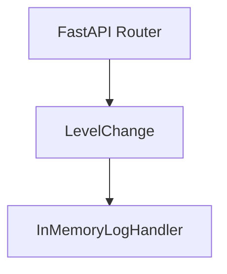
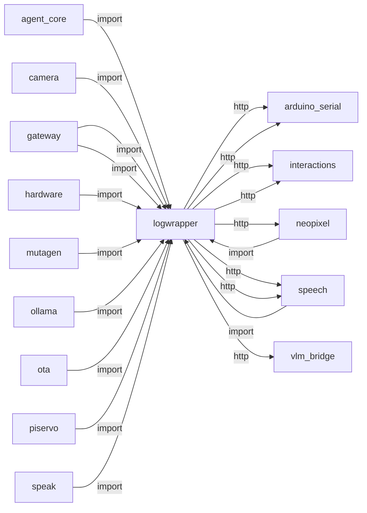
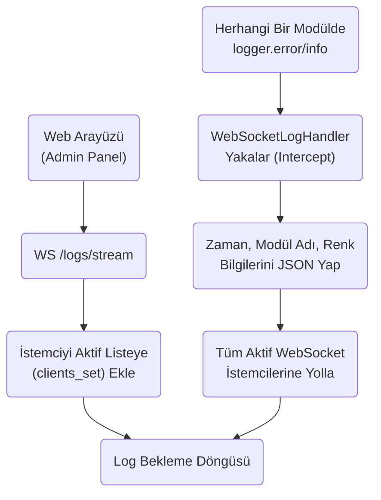
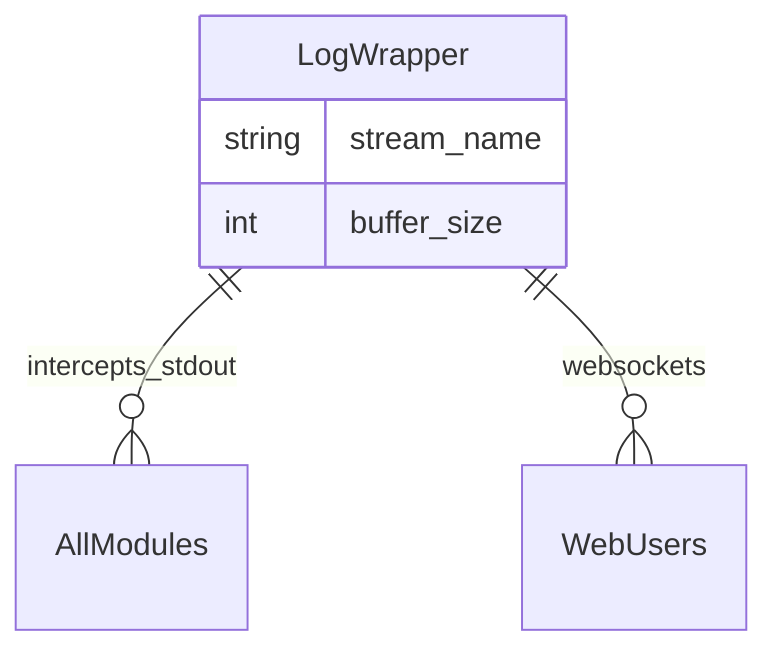

# logwrapper

> **WebSocket log yayını, merkezi loglama**

## Kimlik
| Alan | Değer |
| --- | --- |
| Ana sınıf | `LevelChange` |
| Giriş noktası | `—` |
| Orkestratör | `—` |
| Ana dosya | `modules/logwrapper/api/router.py` |
| Katman | Arka Plan |
| Port | — |
| Arduino | Hayır |
| Sınıf sayısı | 3 |
| Endpoint sayısı | 2 |

## İsimlendirilmiş Bileşenler (Sınıflar)

#### `LevelChange` — `modules/logwrapper/api/router.py`
- **Görev:** —
- **Kalıtım:** BaseModel
- **Oluşturduğu bileşenler:** —
- **Metodlar:** —

#### `InMemoryLogHandler` — `modules/logwrapper/services/handlers.py`
- **Görev:** Basit halka buffer log handler.
- **Kalıtım:** Handler
- **Oluşturduğu bileşenler:** —
- **Metodlar:** `emit()`, `tail()`, `iter()`, `tail_struct()`, `iter_struct()`

#### `EndpointFilter` — `modules/logwrapper/xLogService.py`
- **Görev:** Specific paths like healthz or polling should not flood the console.
- **Kalıtım:** Filter
- **Oluşturduğu bileşenler:** —
- **Metodlar:** `filter()`


## API — Endpoint → Handler → Servis

| HTTP | Path | Handler | Çağırdığı servis | Açıklama |
| --- | --- | --- | --- | --- |
| GET | `/` | `list_logs()` | — | — |
| POST | `/level` | `set_level()` | — | — |

## Config Bölümleri
- `enable_console`
- `console_level`
- `enable_file`
- `file_path`
- `rotate_bytes`
- `backup_count`
- `json_format`
- `buffer_size`
- `capture_warnings`
- `module_levels`

## Dış İlişkiler (Bu modül → diğerleri)

| Hedef modül | Bağlantı tipi | Detay | Neden |
| --- | --- | --- | --- |
| [[arduino_serial]] | http | calls path `/arduino/request` | `logwrapper` HTTP ile `arduino_serial` modülüne erişir: Arduino'ya NDJSON komut gönderir veya ACK bekler. |
| [[arduino_serial]] | http | calls path `/arduino/healthz` | `logwrapper` HTTP ile `arduino_serial` modülüne erişir: Arduino'ya NDJSON komut gönderir veya ACK bekler. |
| [[interactions]] | http | calls path `/interactions/event` | `logwrapper` HTTP ile `interactions` modülüne erişir: Sistem olayı veya LED efekti tetikler. |
| [[interactions]] | http | calls path `/interactions/effect` | `logwrapper` HTTP ile `interactions` modülüne erişir: Sistem olayı veya LED efekti tetikler. |
| [[neopixel]] | http | calls path `/neopixel/animate` | `logwrapper` HTTP ile `neopixel` modülüne erişir: YAML tabanlı servo animasyonu başlatır. |
| [[speech]] | http | calls path `/speech/direction` | `logwrapper` HTTP ile `speech` modülüne erişir: Ses tanıma (ASR) pipeline'ına istek gönderir. |
| [[speech]] | http | calls path `/speech/last` | `logwrapper` HTTP ile `speech` modülüne erişir: Ses tanıma (ASR) pipeline'ına istek gönderir. |
| [[vlm_bridge]] | http | calls path `/vlm/results/latest` | `logwrapper` gateway veya doğrudan HTTP ile `vlm_bridge` API'sini çağırır (calls path `/vlm/results/latest`). |

## Gelen İlişkiler (Diğerleri → bu modül)

| Kaynak modül | Bağlantı tipi | Detay | Neden |
| --- | --- | --- | --- |
| [[agent_core]] | import | init_logging | `agent_core` `logwrapper` modülünden `init_logging` kullanır: Merkezi WebSocket log yayınına bağlanır. |
| [[camera]] | import | init_logging | `camera` `logwrapper` modülünden `init_logging` kullanır: Merkezi WebSocket log yayınına bağlanır. |
| [[gateway]] | import | get_router | `gateway` kod içinde `logwrapper` modülünü import eder (`get_router`) — WebSocket log yayını, merkezi loglama. |
| [[gateway]] | import | init_logging | `gateway` `logwrapper` modülünden `init_logging` kullanır: Merkezi WebSocket log yayınına bağlanır. |
| [[hardware]] | import | init_logging | `hardware` `logwrapper` modülünden `init_logging` kullanır: Merkezi WebSocket log yayınına bağlanır. |
| [[mutagen]] | import | init_logging | Senkronizasyon loglarını merkezi log sistemine yazar. |
| [[neopixel]] | import | init_logging | `neopixel` `logwrapper` modülünden `init_logging` kullanır: Merkezi WebSocket log yayınına bağlanır. |
| [[ollama]] | import | init_logging | `ollama` `logwrapper` modülünden `init_logging` kullanır: Merkezi WebSocket log yayınına bağlanır. |
| [[ota]] | import | init_logging | `ota` `logwrapper` modülünden `init_logging` kullanır: Merkezi WebSocket log yayınına bağlanır. |
| [[piservo]] | import | init_logging | `piservo` `logwrapper` modülünden `init_logging` kullanır: Merkezi WebSocket log yayınına bağlanır. |
| [[speak]] | import | init_logging | `speak` `logwrapper` modülünden `init_logging` kullanır: Merkezi WebSocket log yayınına bağlanır. |
| [[speech]] | import | init_logging | `speech` `logwrapper` modülünden `init_logging` kullanır: Merkezi WebSocket log yayınına bağlanır. |
| [[vlm_bridge]] | import | init_logging | `vlm_bridge` `logwrapper` modülünden `init_logging` kullanır: Merkezi WebSocket log yayınına bağlanır. |
| [[wakeword]] | import | init_logging | `wakeword` `logwrapper` modülünden `init_logging` kullanır: Merkezi WebSocket log yayınına bağlanır. |

## İç Mimari (otomatik çıkarım)



## Modül Etkileşim Haritası



### Mimari diyagram 1


### Mimari diyagram 2


---

# Tam Kaynak Arşivi

### `modules/logwrapper/README.md` (46 satır)

```markdown
# logwrapper (Merkezi Loglama Servisi)

Merkezi loglama için hafif bir modül. Tüm modüllerin loglarını tek yerde toplar.

Özellikler:
- Console + dönen dosya handler
- Bellek içi halka buffer (REST ile okunabilir)
- JSON veya okunabilir format
- Warnings -> logging
- Modül bazlı seviye override
- FastAPI router (opsiyonel)

## Kullanım

Kütüphane olarak:

```python
from modules.logwrapper import init_logging, get_router

init_logging()  # erken çağırın

# FastAPI ile entegrasyon (opsiyonel)
app = FastAPI()
router = get_router()
if router is not None:
    app.include_router(router)
```

CLI/servis gibi çalıştırma:

```bash
python -m modules.logwrapper.xLogService
```

## Konfigürasyon
`modules/logwrapper/config/config.yml` içinde. Ortam değişkenleri ve `init_logging(overrides=...)` ile override edilebilir.

- LOG_LEVEL: konsol seviyesi
- LOG_FILE: dosya yolu

## DryCode Notları

## Gateway Notu
Gateway içinde merkezi loglama başlatılması opsiyoneldir; mevcut kurulumda gateway başlarken `init_logging()` çağrısı denenir. Başarısız olsa bile modüller çalışmaya devam eder.
- Tek sorumluluk: modül sadece log altyapısını kurar ve minimal API sunar.
- Dış bağımlılıklar: yalnızca opsiyonel `PyYAML` ve `FastAPI` (API için). Başka bağımlılık yok.
```

### `modules/logwrapper/__init__.py` (15 satır)

```python
"""
logwrapper modülü: merkezi loglama altyapısı.

Dışa açılan basit API:
- init_logging(overrides: dict | None) -> None
- get_memory_handler() -> InMemoryLogHandler | None
- get_router() -> fastapi.APIRouter (opsiyonel)
"""
from .xLogService import init_logging, get_memory_handler, get_router

__all__ = [
    "init_logging",
    "get_memory_handler",
    "get_router",
]
```

### `modules/logwrapper/api/__init__.py` (3 satır)

```python
from .router import router

__all__ = ["router"]
```

### `modules/logwrapper/api/router.py` (39 satır)

```python
from __future__ import annotations

import logging
from typing import Any, Dict, Optional

try:
    from fastapi import APIRouter
    from pydantic import BaseModel
except Exception:  # pragma: no cover
    APIRouter = None  # type: ignore
    BaseModel = object  # type: ignore

from ..xLogService import get_memory_handler


if APIRouter is not None:
    router = APIRouter(prefix="/logs", tags=["logs"])  # type: ignore

    class LevelChange(BaseModel):  # type: ignore
        logger: str
        level: str

    @router.get("/")
    def list_logs(n: int = 200) -> Dict[str, Any]:
        handler = get_memory_handler()
        items = handler.tail(n) if handler else []
        return {"count": len(items), "items": items}

    @router.post("/level")
    def set_level(payload: LevelChange) -> Dict[str, str]:
        log = logging.getLogger(payload.logger)
        try:
            level_value = getattr(logging, payload.level.upper())
        except Exception:
            level_value = payload.level
        log.setLevel(level_value)
        return {"status": "ok"}
else:  # Placeholder to avoid import error when FastAPI not installed
    router = None  # type: ignore
```

### `modules/logwrapper/architecture_logwrapper.md` (42 satır)

```markdown
# LogWrapper Modülü Mimarisi

LogWrapper modülü (`modules/logwrapper`), sistem genelindeki standart `logger` (logging) akışlarını toplayarak, hem konsola renkli bastıran (rich tabanlı) hem de WebSocket üzerinden web paneline anlık olarak (canlı log streaming) ileten merkezi log yakalayıcısıdır.

## 🏗️ İş Akışı ve Karar Mekanizmaları (Flowchart)


## 🔄 İlişkisel Etkileşimler (Veri Akışı)


## ⚙️ Detaylı Karar Mantığı (if/else)

1. **İstemci (Client) Yönetimi**
   - Web üzerinde log izleyen ekran kapatılırsa (veya tarayıcı çökerse), WebSocket bağlantısı kopar.
   - **`try / except WebSocketDisconnect`**: Bu durumda sistemdeki aktif bağlantı kümesinden (`clients.remove(ws)`) istemciyi derhal siler. Bu işlem yapılmazsa, bir sonraki `logger.info("Merhaba")` çağrıldığında sistem ölü bir sokete veri yazmaya çalışıp çöker.
2. **Buffer (Kuyruk) Mekanizması**
   - **`if`** aktif hiçbir WebSocket bağlantısı yoksa loglar uzaya gitmez, küçük bir "Son N log" değişken dizisinde tutulmaya devam edebilir (Eski logları paneli açar açmaz görebilmek için geçmiş log belleği (History Buffer) kullanımı).
```

### `modules/logwrapper/config/README.md` (16 satır)

```markdown
# Logwrapper Config

Aşağıdaki anahtarlar `config.yml` içinde tanımlıdır:

- enable_console: bool – Konsola log yazımı
- console_level: str – Konsol seviye eşiği (DEBUG/INFO/...)
- enable_file: bool – Dosyaya log yazımı
- file_path: str – Log dosya yolu
- rotate_bytes: int – Rotasyon boyutu (bytes)
- backup_count: int – Yedek dosya sayısı
- json_format: bool – JSON formatta çıktı (harici bağımlılık yok)
- buffer_size: int – Bellek içi halka buffer kapasitesi
- capture_warnings: bool – warnings -> logging
- module_levels: dict – Örn: {"uvicorn": "WARNING"}

Override önceliği: overrides dict > ortam değişkenleri (LOG_LEVEL, LOG_FILE) > YAML > varsayılanlar.
```

### `modules/logwrapper/config/config.yml` (30 satır)

```yaml
# logwrapper varsayılan ayarları

# Konsola yazılsın mı?
enable_console: true
# Konsol seiyesi (DEBUG, INFO, WARNING, ERROR)
console_level: INFO

# Dosyaya yazılsın mı?
enable_file: true
# Dönen dosya yolu
file_path: logs/sentry.log
# Maks dosya boyutu (bayt)
rotate_bytes: 2097152  # 2MB
# Yedek dosya sayısı
backup_count: 5

# JSON formatta çıktı
json_format: false

# Bellek içi halka buffer boyutu
buffer_size: 1000

# Python warnings -> logging
capture_warnings: true

# Modül bazlı seviye override
module_levels:
  uvicorn.access: WARNING
  httpx: WARNING
  comtypes.client._code_cache: WARNING
```

### `modules/logwrapper/config_loader.py` (66 satır)

```python
from __future__ import annotations

import os
from typing import Any, Dict, Optional

try:
    import yaml  # type: ignore
except Exception:  # pragma: no cover
    yaml = None  # Lazy optional dependency


DEFAULT_CONFIG: Dict[str, Any] = {
    "enable_console": True,
    "console_level": "INFO",
    "enable_file": True,
    "file_path": "logs/sentry.log",
    "rotate_bytes": 2 * 1024 * 1024,  # 2MB
    "backup_count": 5,
    "json_format": False,
    "buffer_size": 1000,  # in-memory ring buffer size
    "capture_warnings": True,
    # Per-module level overrides, e.g. {"uvicorn": "WARNING"}
    "module_levels": {},
}


def load_config(base_dir: Optional[str] = None, overrides: Optional[Dict[str, Any]] = None) -> Dict[str, Any]:
    """YAML config.yml dosyasını ve opsiyonel override'ları yükler.

    Arama sırası:
    - modules/logwrapper/config/config.yml
    - base_dir altında config/config.yml (eğer verildiyse)

    overrides sözlüğü sağlanırsa, YAML üzerindeki değerlere baskın gelir.
    """
    cfg: Dict[str, Any] = dict(DEFAULT_CONFIG)

    candidates = []
    if base_dir:
        candidates.append(os.path.join(base_dir, "config", "config.yml"))
    # Default module path
    here = os.path.dirname(__file__)
    candidates.append(os.path.join(here, "config", "config.yml"))

    for path in candidates:
        if os.path.exists(path):
            if yaml is None:
                break
            with open(path, "r", encoding="utf-8") as f:
                data = yaml.safe_load(f) or {}
            if isinstance(data, dict):
                cfg.update(data)
            break

    if overrides:
        cfg.update({k: v for k, v in overrides.items() if v is not None})

    # Normalize env overrides (e.g., LOG_LEVEL, LOG_FILE)
    env_level = os.getenv("LOG_LEVEL")
    if env_level:
        cfg["console_level"] = env_level
    env_file = os.getenv("LOG_FILE")
    if env_file:
        cfg["file_path"] = env_file

    return cfg
```

### `modules/logwrapper/requirements.txt` (4 satır)

```text
PyYAML>=6.0
# API opsiyonel: FastAPI ve Uvicorn sadece gerekli ise
fastapi>=0.111.0
uvicorn>=0.30.0
```

### `modules/logwrapper/services/handlers.py` (71 satır)

```python
from __future__ import annotations

import logging
from collections import deque
from typing import Deque, Iterable, List, Optional


class InMemoryLogHandler(logging.Handler):
    """Basit halka buffer log handler.

    Backwards-compatible davranış korundu: `tail()` eski gibi formatlanmış string listesi döner.
    Ek olarak yapılandırılmış kayıtlar için `tail_struct()` ve `iter_struct()` eklendi.

    - thread-safe: logging.Handler zaten lock içerir
    - formatlanmış stringleri ve parçalara ayrılmış meta veriyi saklar (emit sonrası)
    """

    def __init__(self, maxlen: int = 1000, level: int = logging.NOTSET) -> None:
        super().__init__(level=level)
        # iç buffer dict'ler tutar: {formatted, name, levelname, message, asctime}
        self.buffer: Deque[dict] = deque(maxlen=maxlen)

    def emit(self, record: logging.LogRecord) -> None:  # noqa: D401
        try:
            formatted = self.format(record)
        except Exception:  # pragma: no cover
            formatted = record.getMessage()
        entry = {
            "formatted": formatted,
            "name": getattr(record, "name", ""),
            "level": getattr(record, "levelname", ""),
            "message": record.getMessage(),
            "asctime": getattr(record, "asctime", ""),
        }
        self.buffer.append(entry)

    def tail(self, n: int = 100) -> List[str]:
        """Geriye dönük en son n formatlanmış string'i döner (geri uyumluluk)."""
        if n <= 0:
            return []
        start = max(0, len(self.buffer) - n)
        return [e["formatted"] for e in list(self.buffer)[start:]]

    def iter(self) -> Iterable[str]:
        """Eski iter benzeri, formatlanmış string'ler döner."""
        return (e["formatted"] for e in self.buffer)

    # Yeni API: yapılandırılmış kayıtlara erişim
    def tail_struct(self, n: int = 100) -> List[dict]:
        if n <= 0:
            return []
        start = max(0, len(self.buffer) - n)
        return list(self.buffer)[start:]

    def iter_struct(self) -> Iterable[dict]:
        return iter(self.buffer)


def build_formatter(json_format: bool) -> logging.Formatter:
    if json_format:
        # Minimal JSON without extra deps
        fmt = (
            '{"time":"%(asctime)s","level":"%(levelname)s","name":"%(name)s"'
            ',"msg":"%(message)s","module":"%(module)s","line":%(lineno)d}'
        )
        datefmt = "%Y-%m-%dT%H:%M:%S"
        return logging.Formatter(fmt=fmt, datefmt=datefmt)
    # Human friendly
    fmt = "%(asctime)s | %(levelname)-8s | %(name)s | %(message)s"
    datefmt = "%H:%M:%S"
    return logging.Formatter(fmt=fmt, datefmt=datefmt)
```

### `modules/logwrapper/tests/test_smoke.py` (16 satır)

```python
from __future__ import annotations

import logging

from modules.logwrapper import init_logging, get_memory_handler


def test_smoke_memory_handler():
    init_logging({"enable_file": False})  # file IO'yu kapat
    log = logging.getLogger("modules.logwrapper.test")
    log.debug("dbg")
    log.info("info")
    handler = get_memory_handler()
    assert handler is not None
    items = handler.tail(5)
    assert any("info" in i or "INFO" in i for i in items)
```

### `modules/logwrapper/xLogService.py` (228 satır)

```python
from __future__ import annotations

import logging
import logging.config
import os
import warnings
from typing import Any, Dict, Optional

from .config_loader import load_config
from .services.handlers import InMemoryLogHandler, build_formatter

_MEMORY_HANDLER: Optional[InMemoryLogHandler] = None
_ROUTER = None  # lazy import for FastAPI


class EndpointFilter(logging.Filter):
    """Specific paths like healthz or polling should not flood the console."""
    def __init__(self, suppressed_paths: list[str]):
        super().__init__()
        self.suppressed_paths = suppressed_paths

    def filter(self, record: logging.LogRecord) -> bool:
        # uvicorn.access logs have the path in the message
        msg = record.getMessage()
        for path in self.suppressed_paths:
            if path in msg:
                return False
        return True


def _ensure_log_dir(path: str) -> None:
    directory = os.path.dirname(path)
    if directory and not os.path.exists(directory):
        os.makedirs(directory, exist_ok=True)


def init_logging(overrides: Optional[Dict[str, Any]] = None) -> None:
    """Kök logger'ı merkezi olarak yapılandırır.

    - Tüm modüllerin logları toplanır (disable_existing_loggers=False)
    - Console ve dosya handler isteğe bağlı
    - Bellek içi halka buffer handler
    - Warnings capture
    """
    global _MEMORY_HANDLER

    # Zaten kuruluysa tekrar yapılandırma
    if _MEMORY_HANDLER is not None and logging.getLogger().handlers:
        return

    cfg = load_config(overrides=overrides)

    handlers: Dict[str, Dict[str, Any]] = {}
    root_handlers = []

    # Memory handler
    memory_name = "in_memory"
    handlers[memory_name] = {
        "()": InMemoryLogHandler,
        "maxlen": int(cfg.get("buffer_size", 1000)),
        "level": "DEBUG",
    }
    root_handlers.append(memory_name)

    # Console handler
    if cfg.get("enable_console", True):
        handlers["console"] = {
            "class": "logging.StreamHandler",
            "level": cfg.get("console_level", "INFO"),
            "stream": "ext://sys.stdout",
        }
        root_handlers.append("console")

    # File handler with rotation
    if cfg.get("enable_file", True):
        path = str(cfg.get("file_path", "logs/sentry.log"))
        _ensure_log_dir(path)
        handlers["file"] = {
            "class": "logging.handlers.RotatingFileHandler",
            "level": "DEBUG",
            "filename": path,
            "maxBytes": int(cfg.get("rotate_bytes", 2 * 1024 * 1024)),
            "backupCount": int(cfg.get("backup_count", 5)),
            "encoding": "utf-8",
        }
        root_handlers.append("file")

    # Formatters
    json_format = bool(cfg.get("json_format", False))
    formatter = build_formatter(json_format)

    # dictConfig yapılandırması
    logging.config.dictConfig(
        {
            "version": 1,
            "disable_existing_loggers": False,
            "formatters": {
                "default": {
                    "()": lambda: formatter,
                }
            },
            "handlers": {
                name: {
                    **opts,
                    "formatter": "default",
                }
                for name, opts in handlers.items()
            },
            "loggers": {
                "uvicorn.access": {
                    "level": "WARNING",
                    "handlers": root_handlers,
                    "propagate": False,
                },
                "uvicorn.error": {
                    "level": "INFO",
                    "handlers": root_handlers,
                    "propagate": False,
                },
            },
            "root": {
                "level": "DEBUG",
                "handlers": root_handlers,
            },
        }
    )

    # Warnings -> logging
    if cfg.get("capture_warnings", True):
        logging.captureWarnings(True)
        warnings.simplefilter("default")
        # Optional: tone down known 3rd-party deprecations
        try:
            warnings.filterwarnings(
                "ignore",
                message=r".*pkg_resources\.declare_namespace.*",
                category=DeprecationWarning,
            )
            warnings.filterwarnings(
                "ignore",
                message=r".*pkg_resources is deprecated as an API.*",
                category=Warning,
            )
            warnings.filterwarnings(
                "ignore",
                message=r".*UnsupportedFieldAttributeWarning.*validate_default.*",
                category=Warning,
            )
            warnings.filterwarnings(
                "ignore",
                message=r".*validate_default.*has no effect.*",
                category=UserWarning,
                module=r"pydantic\._internal\._generate_schema",
            )
            warnings.filterwarnings(
                "ignore",
                message=r".*websockets\.legacy is deprecated.*",
                category=DeprecationWarning,
            )
            warnings.filterwarnings(
                "ignore",
                message=r".*WebSocketServerProtocol is deprecated.*",
                category=DeprecationWarning,
            )
        except Exception:
            pass

    # Formatter instance'ını memory handler'a bağlamak için referans bulalım
    logger = logging.getLogger()
    for h in logger.handlers:
        if isinstance(h, InMemoryLogHandler):
            h.setFormatter(formatter)
            _MEMORY_HANDLER = h
            break

    # Module bazlı level override
    for name, level in (cfg.get("module_levels") or {}).items():
        try:
            logging.getLogger(name).setLevel(getattr(logging, str(level).upper()))
        except Exception:
            logging.getLogger(name).setLevel(level)

    # Apply endpoint filtering to noisy web logs
    suppressed = [
        "/arduino/request",
        "/vlm/results/latest",
        "/speech/direction",
        "/speech/last",
        "/arduino/healthz",
        "/state/set/emotions",
        "/interactions/event",
        "/interactions/effect",
        "/neopixel/animate",
        "/oled_faces/manual"
    ]
    ef = EndpointFilter(suppressed)
    
    # Apply to uvicorn.access logger
    logging.getLogger("uvicorn.access").addFilter(ef)
    
    # Also apply to all root handlers to catch everything going to console/file
    for handler in logging.getLogger().handlers:
        handler.addFilter(ef)


def get_memory_handler() -> Optional[InMemoryLogHandler]:
    return _MEMORY_HANDLER


def get_router():  # lazy import to avoid FastAPI dep when unused
    global _ROUTER
    if _ROUTER is not None:
        return _ROUTER
    try:
        from .api.router import router  # type: ignore
    except Exception:  # FastAPI yoksa API opsiyonel
        return None
    _ROUTER = router
    return _ROUTER


if __name__ == "__main__":
    # Servis gibi çalıştırıldığında basit demo
    init_logging()
    log = logging.getLogger("logwrapper.demo")
    log.info("Logwrapper service started")
    log.warning("This is a warning")
    log.error("This is an error")
```
