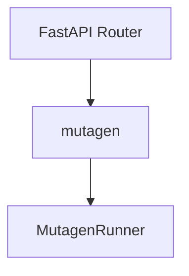
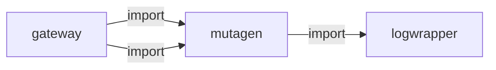
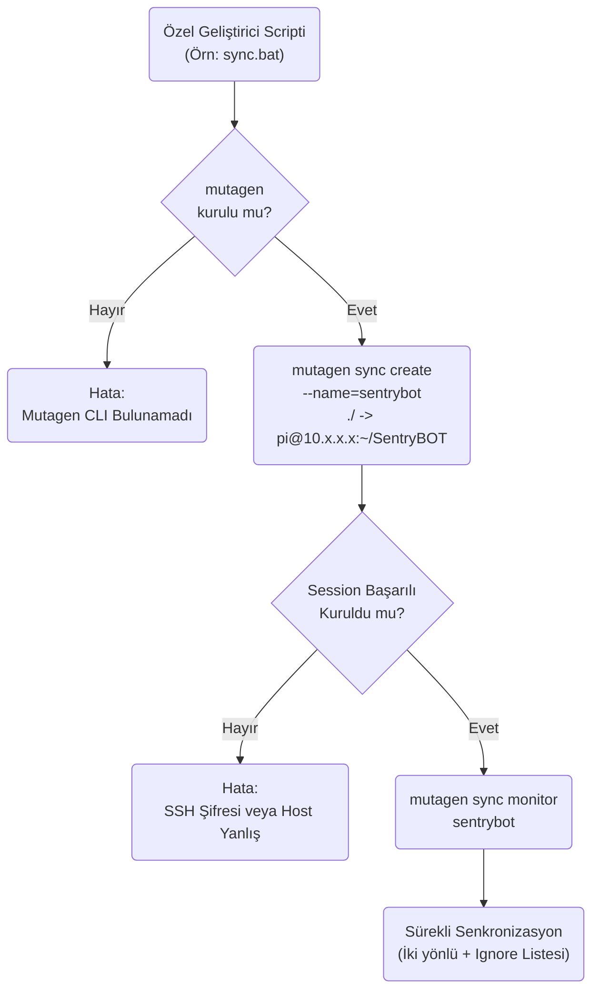
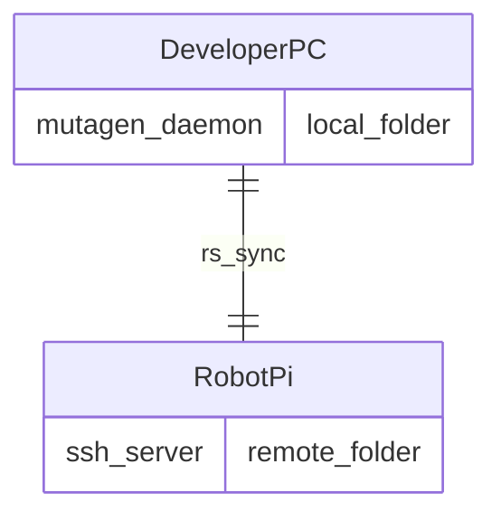

# mutagen

> **PC↔Pi dosya senkronizasyonu**

## Kimlik
| Alan | Değer |
| --- | --- |
| Ana sınıf | `—` |
| Giriş noktası | `create_app()` |
| Orkestratör | `—` |
| Ana dosya | `modules/mutagen/xMutagenService.py` |
| Katman | Arka Plan |
| Port | — |
| Arduino | Hayır |
| Sınıf sayısı | 1 |
| Endpoint sayısı | 5 |

## İsimlendirilmiş Bileşenler (Sınıflar)

#### `MutagenRunner` — `modules/mutagen/services/runner.py`
- **Görev:** —
- **Kalıtım:** —
- **Oluşturduğu bileşenler:** —
- **Metodlar:** `status()`, `start()`, `stop()`, `rescan()`


## API — Endpoint → Handler → Servis

| HTTP | Path | Handler | Çağırdığı servis | Açıklama |
| --- | --- | --- | --- | --- |
| GET | `/healthz` | `healthz()` | — | — |
| GET | `/status` | `status()` | — | — |
| POST | `/start` | `start()` | — | — |
| POST | `/stop` | `stop()` | — | — |
| POST | `/rescan` | `rescan()` | — | — |

## Config Bölümleri
- `server`
- `mutagen`

## Dış İlişkiler (Bu modül → diğerleri)

| Hedef modül | Bağlantı tipi | Detay | Neden |
| --- | --- | --- | --- |
| [[logwrapper]] | import | init_logging | Senkronizasyon loglarını merkezi log sistemine yazar. |

## Gelen İlişkiler (Diğerleri → bu modül)

| Kaynak modül | Bağlantı tipi | Detay | Neden |
| --- | --- | --- | --- |
| [[gateway]] | import | api | `gateway` kod içinde `mutagen` modülünü import eder (`api`) — PC↔Pi dosya senkronizasyonu. |
| [[gateway]] | import | config_loader | `gateway` kod içinde `mutagen` modülünü import eder (`config_loader`) — PC↔Pi dosya senkronizasyonu. |

## İç Mimari (otomatik çıkarım)



## Modül Etkileşim Haritası



### Mimari diyagram 1


### Mimari diyagram 2


---

# Tam Kaynak Arşivi

### `modules/mutagen/README.md` (12 satır)

```markdown
# Mutagen Sync Servisi

Mutagen CLI üzerinden dosya senkronizasyonu yönetir. CLI yoksa no-op döner.

API uçları:
- GET /mutagen/healthz
- GET /mutagen/status
- POST /mutagen/start
- POST /mutagen/stop
- POST /mutagen/rescan

Arduino OTA için: derlenmiş .hex dosyalarının bulunduğu klasörü ana makineden robota senkronlamak için bir pair tanımlayın ve `ota.watch_dir` ile eşleşmesini sağlayın.
```

### `modules/mutagen/__init__.py` (1 satır)

```python
# mutagen module package
```

### `modules/mutagen/api/__init__.py` (3 satır)

```python
from .router import get_router

__all__ = ["get_router"]
```

### `modules/mutagen/api/router.py` (37 satır)

```python
from __future__ import annotations
from fastapi import APIRouter

try:
    from ..config_loader import load_config
    from ..services.runner import MutagenRunner
except Exception:
    from modules.mutagen.config_loader import load_config  # type: ignore
    from modules.mutagen.services.runner import MutagenRunner  # type: ignore


def get_router(cfg: dict | None = None) -> APIRouter:
    cfg = cfg or load_config(None)
    r = APIRouter(prefix="/mutagen", tags=["mutagen"])
    runner = MutagenRunner(cfg.get("mutagen", {}))

    @r.get("/healthz")
    def healthz():
        return {"ok": True}

    @r.get("/status")
    def status():
        return runner.status()

    @r.post("/start")
    def start():
        return runner.start()

    @r.post("/stop")
    def stop():
        return runner.stop()

    @r.post("/rescan")
    def rescan():
        return runner.rescan()

    return r
```

### `modules/mutagen/architecture_mutagen.md` (42 satır)

```markdown
# Mutagen Modülü Mimarisi

Mutagen modülü (`modules/mutagen`), geliştiricinin bilgisayarı (Windows/Mac) ile robot (Raspberry Pi/Jetson) arasında klasörleri canlı olarak eşzamanlayan `mutagen` aracını sarmalayan (wrap eden) komut satırı hizmetidir.

## 🏗️ İş Akışı ve Karar Mekanizmaları (Flowchart)


## 🔄 İlişkisel Etkileşimler (Veri Akışı)


## ⚙️ Detaylı Karar Mantığı (if/else)

1. **Ignore (Yok Sayılanlar) Mantığı**
   - Karşıya `.git`, `__pycache__`, `venv` ve SQLite veritabanları (Çünkü veritabanları rsync gibi canlı sync edilmeye çalışıldığında kilitlenir) gibi dosyaların kopyalanması **`if ignored`** kuralıyla engellenir. Bu konfigürasyon `mutagen.yml` içerisinde tutulur.
2. **Çarpışma (Conflict) Çözümü**
   - İki tarafta da aynı anda `config.yml` değiştirildiyse (Robot üzerinden web panelle değiştirildi, Bilgisayarda VS Code ile değiştirildi), Mutagen'in varsayılan kopyalama davranışı `resolve: remote-wins` (robotun bilgisini ezme) veya `local-wins` (kod yazan adamın ezmesi) kuralına göre önceliklendirilir.
```

### `modules/mutagen/config/config.yml` (19 satır)

```yaml
server:
  host: 0.0.0.0
  port: 8098

mutagen:
  enabled: true
  pairs:
    - name: repo
      alpha: ..
      beta: /home/pi/SentryBOT
      mode: two-way-resolved
  opts:
    sync_mode: two-way-resolved
    ignore:
      - .git
      - __pycache__
      - "*.pyc"
      - logs/*
    maxProblems: 128
```

### `modules/mutagen/config_loader.py` (38 satır)

```python
from __future__ import annotations
import os
from typing import Any, Dict
try:
    import yaml  # type: ignore
except Exception:
    yaml = None

DEFAULT_CFG: Dict[str, Any] = {
    "server": {"host": "0.0.0.0", "port": 8098},
    "mutagen": {
        "enabled": True,
        "pairs": [
            # örnek: ana bilgisayardaki kodları robota senkronla
            {"name": "repo", "alpha": "..", "beta": "/home/pi/SentryBOT", "mode": "two-way-resolved"}
        ],
        "opts": {
            "sync_mode": "two-way-resolved",
            "ignore": [".git", "__pycache__", "*.pyc", "logs/*"],
            "maxProblems": 128
        }
    }
}


def load_config(config_path: str | None = None) -> Dict[str, Any]:
    path = config_path or os.environ.get("MUTAGEN_CFG", "modules/mutagen/config/config.yml")
    data: Dict[str, Any] = {}
    if path and os.path.exists(path) and yaml is not None:
        with open(path, "r", encoding="utf-8") as f:
            data = yaml.safe_load(f) or {}
    cfg: Dict[str, Any] = DEFAULT_CFG.copy()
    for k, v in (data or {}).items():
        if isinstance(v, dict) and isinstance(cfg.get(k), dict):
            cfg[k].update(v)
        else:
            cfg[k] = v
    return cfg
```

### `modules/mutagen/services/runner.py` (58 satır)

```python
from __future__ import annotations
import subprocess
from typing import Dict, Any, List


class MutagenRunner:
    def __init__(self, cfg: Dict[str, Any]):
        self.cfg = cfg

    def _has_cli(self) -> bool:
        try:
            subprocess.run(["mutagen", "version"], capture_output=True, text=True, timeout=5)
            return True
        except Exception:
            return False

    def status(self) -> Dict[str, Any]:
        if not self._has_cli():
            return {"ok": False, "error": "mutagen not installed"}
        proc = subprocess.run(["mutagen", "sync", "list", "--json"], capture_output=True, text=True)
        return {"ok": proc.returncode == 0, "stdout": proc.stdout, "stderr": proc.stderr}

    def start(self) -> Dict[str, Any]:
        if not self._has_cli():
            return {"ok": False, "error": "mutagen not installed"}
        results: List[Dict[str, Any]] = []
        pairs = self.cfg.get("pairs", []) or []
        opts = self.cfg.get("opts", {})
        for p in pairs:
            alpha = str(p.get("alpha"))
            beta = str(p.get("beta"))
            name = str(p.get("name", "pair"))
            mode = str(p.get("mode", opts.get("sync_mode", "two-way-resolved")))
            args = ["mutagen", "sync", "create", "--name", name, "--sync-mode", mode]
            ignore = opts.get("ignore", [])
            for patt in ignore:
                args += ["--ignore", str(patt)]
            args += [alpha, beta]
            proc = subprocess.run(args, capture_output=True, text=True)
            results.append({
                "name": name,
                "ok": proc.returncode == 0,
                "stdout": proc.stdout[-4000:],
                "stderr": proc.stderr[-4000:],
            })
        return {"ok": all(r.get("ok") for r in results), "results": results}

    def stop(self) -> Dict[str, Any]:
        if not self._has_cli():
            return {"ok": False, "error": "mutagen not installed"}
        proc = subprocess.run(["mutagen", "sync", "terminate", "--all"], capture_output=True, text=True)
        return {"ok": proc.returncode == 0, "stdout": proc.stdout, "stderr": proc.stderr}

    def rescan(self) -> Dict[str, Any]:
        if not self._has_cli():
            return {"ok": False, "error": "mutagen not installed"}
        proc = subprocess.run(["mutagen", "sync", "flush", "--all"], capture_output=True, text=True)
        return {"ok": proc.returncode == 0, "stdout": proc.stdout, "stderr": proc.stderr}
```

### `modules/mutagen/tests/test_smoke.py` (11 satır)

```python
def test_imports():
    import modules.mutagen  # noqa: F401
    from modules.mutagen.api import get_router  # noqa: F401
    from modules.mutagen.config_loader import load_config  # noqa: F401
    from modules.mutagen.services.runner import MutagenRunner  # noqa: F401


def test_router_create():
    from modules.mutagen.api import get_router
    r = get_router({"mutagen": {}})
    assert r is not None
```

### `modules/mutagen/xMutagenService.py` (33 satır)

```python
from __future__ import annotations
from fastapi import FastAPI

try:
    from .config_loader import load_config
    from .api import get_router
except Exception:
    from modules.mutagen.config_loader import load_config  # type: ignore
    from modules.mutagen.api import get_router  # type: ignore

try:
    from modules.logwrapper import init_logging as _init_global_logging  # type: ignore
    _init_global_logging()
except Exception:
    pass


def create_app(config_path: str | None = None) -> FastAPI:
    cfg = load_config(config_path)
    app = FastAPI()
    app.state.cfg = cfg
    app.include_router(get_router(cfg))
    return app


if __name__ == "__main__":
    import uvicorn
    cfg = load_config()
    uvicorn.run(
        create_app(),
        host=str(cfg.get("server", {}).get("host", "0.0.0.0")),
        port=int(cfg.get("server", {}).get("port", 8098)),
    )
```
