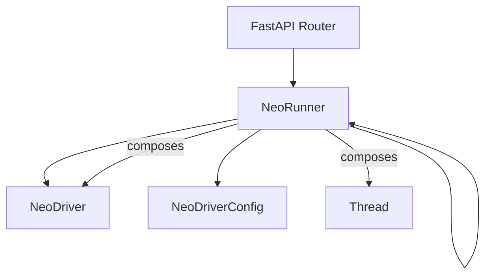
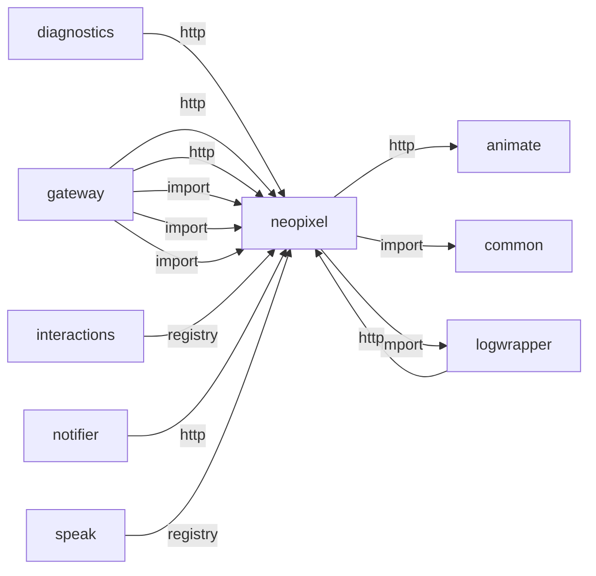
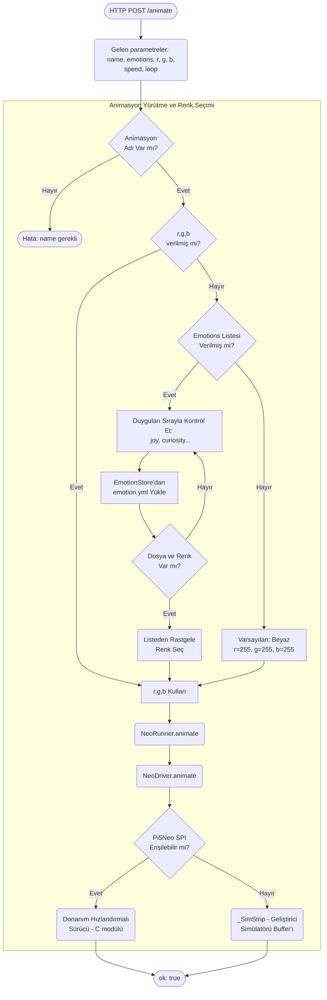
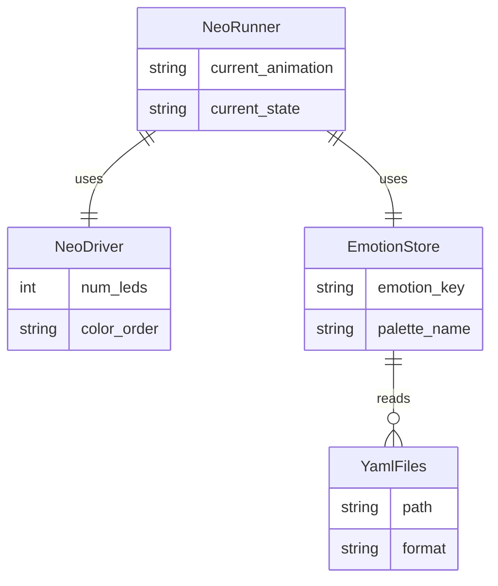

# neopixel

> **23 duygu paleti, SPI LED animasyonları**

## Kimlik
| Alan | Değer |
| --- | --- |
| Ana sınıf | `NeoRunner` |
| Giriş noktası | `create_app()` |
| Orkestratör | `NeoRunner` |
| Ana dosya | `modules/neopixel/xNeopixelService.py` |
| Katman | Eylem |
| Port | — |
| Arduino | Hayır |
| Sınıf sayısı | 16 |
| Endpoint sayısı | 18 |

## İsimlendirilmiş Bileşenler (Sınıflar)

#### `AnimateRequest` — `modules/neopixel/api/router.py`
- **Görev:** —
- **Kalıtım:** BaseModel
- **Oluşturduğu bileşenler:** —
- **Metodlar:** —

#### `AnimationInfo` — `modules/neopixel/api/router.py`
- **Görev:** —
- **Kalıtım:** BaseModel
- **Oluşturduğu bileşenler:** —
- **Metodlar:** —

#### `AnimationsResponse` — `modules/neopixel/api/router.py`
- **Görev:** —
- **Kalıtım:** BaseModel
- **Oluşturduğu bileşenler:** —
- **Metodlar:** —

#### `EmotionsResponse` — `modules/neopixel/api/router.py`
- **Görev:** —
- **Kalıtım:** BaseModel
- **Oluşturduğu bileşenler:** —
- **Metodlar:** —

#### `PresetUpsertRequest` — `modules/neopixel/api/router.py`
- **Görev:** —
- **Kalıtım:** BaseModel
- **Oluşturduğu bileşenler:** —
- **Metodlar:** —

#### `ColorEntry` — `modules/neopixel/emotions/loader.py`
- **Görev:** —
- **Kalıtım:** —
- **Oluşturduğu bileşenler:** —
- **Metodlar:** —

#### `EmotionPalette` — `modules/neopixel/emotions/loader.py`
- **Görev:** —
- **Kalıtım:** —
- **Oluşturduğu bileşenler:** —
- **Metodlar:** `random_color()`, `random_entry()`, `get_by_name()`

#### `EmotionStore` — `modules/neopixel/emotions/loader.py`
- **Görev:** Caches colors loaded from YAML files located in a directory.
- **Kalıtım:** —
- **Oluşturduğu bileşenler:** `Path`
- **Metodlar:** `load()`, `random_color()`, `random_entry()`, `get_by_name()`

#### `NeoDriver` — `modules/neopixel/services/driver.py`
- **Görev:** —
- **Kalıtım:** —
- **Oluşturduğu bileşenler:** `Pi5Neo`
- **Metodlar:** `clear()`, `set()`, `show()`, `fill()`, `animate()`

#### `NeoDriverConfig` — `modules/neopixel/services/driver.py`
- **Görev:** —
- **Kalıtım:** —
- **Oluşturduğu bileşenler:** —
- **Metodlar:** —

#### `_ArduinoStrip` — `modules/neopixel/services/driver.py`
- **Görev:** Arduino backend support removed in favor of Pi native driver.
- **Kalıtım:** —
- **Oluşturduğu bileşenler:** —
- **Metodlar:** —

#### `_SimStrip` — `modules/neopixel/services/driver.py`
- **Görev:** Simple simulator for development environments without hardware.
- **Kalıtım:** —
- **Oluşturduğu bileşenler:** —
- **Metodlar:** `set_led_color()`, `update_strip()`, `clear_strip()`, `animate()`

#### `_StripProto` — `modules/neopixel/services/driver.py`
- **Görev:** —
- **Kalıtım:** Protocol
- **Oluşturduğu bileşenler:** —
- **Metodlar:** `set_led_color()`, `update_strip()`, `clear_strip()`, `animate()`

#### `NeoRunner` — `modules/neopixel/services/runner.py`
- **Görev:** —
- **Kalıtım:** —
- **Oluşturduğu bileşenler:** `NeoDriver`, `Thread`
- **Metodlar:** `list_segments()`, `list_presets()`, `preset_version()`, `get_preset()`, `set_preset()`, `delete_preset()`, `clear()`, `fill()`, `fill_segment()`, `clear_segment()`, `apply_preset()`, `rainbow()`

#### `_SegmentView` — `modules/neopixel/services/runner.py`
- **Görev:** Adapter that exposes a driver sub-range as if it were a full strip.
- **Kalıtım:** —
- **Oluşturduğu bileşenler:** —
- **Metodlar:** `set()`, `show()`, `clear()`, `fill()`


## API — Endpoint → Handler → Servis

| HTTP | Path | Handler | Çağırdığı servis | Açıklama |
| --- | --- | --- | --- | --- |
| GET | `/animations` | `list_animations()` | — | — |
| GET | `/emotions` | `list_emotions()` | — | — |
| GET | `/healthz` | `healthz()` | — | — |
| GET | `/segments` | `segments()` | — | — |
| GET | `/presets` | `presets()` | — | — |
| POST | `/preset/apply` | `apply_preset()` | — | — |
| GET | `/preset/get` | `get_preset()` | — | — |
| POST | `/preset/set` | `set_preset()` | — | — |
| DELETE | `/preset/delete` | `delete_preset()` | — | — |
| POST | `/clear` | `clear()` | — | — |
| POST | `/fill` | `fill()` | — | — |
| POST | `/segment/clear` | `clear_segment()` | — | — |
| POST | `/rainbow` | `rainbow()` | — | — |
| POST | `/theater_chase` | `theater_chase()` | — | — |
| POST | `/effect` | `run_effect()` | — | — |
| POST | `/emote` | `emote()` | — | — |
| POST | `/emote_named` | `emote_named()` | — | — |
| POST | `/animate` | `animate()` | — | — |

## Config Bölümleri
- `server`
- `hardware`
- `pi5neo`
- `defaults`
- `presets`
- `presets_meta`

## Dış İlişkiler (Bu modül → diğerleri)

| Hedef modül | Bağlantı tipi | Detay | Neden |
| --- | --- | --- | --- |
| [[animate]] | http | calls path `/animate` | LED efektleri ile senkronize fiziksel hareket üretir. |
| [[common]] | import | emotion_vocab | 23 duygu paleti emotion_vocab ile hizalanır. |
| [[logwrapper]] | import | init_logging | `neopixel` → `logwrapper`: Merkezi WebSocket log yayınına bağlanır. |

## Gelen İlişkiler (Diğerleri → bu modül)

| Kaynak modül | Bağlantı tipi | Detay | Neden |
| --- | --- | --- | --- |
| [[diagnostics]] | http | calls path `/neopixel/healthz` | `diagnostics` → `neopixel`: LED animasyon veya duygu preset uygular. |
| [[gateway]] | http | calls path `/neopixel/healthz` | `gateway` → `neopixel`: LED animasyon veya duygu preset uygular. |
| [[gateway]] | http | calls path `/neopixel` | `gateway` → `neopixel`: LED animasyon veya duygu preset uygular. |
| [[gateway]] | import | services | `gateway` kod içinde `neopixel` modülünü import eder (`services`) — 23 duygu paleti, SPI LED animasyonları. |
| [[gateway]] | import | config_loader | `gateway` kod içinde `neopixel` modülünü import eder (`config_loader`) — 23 duygu paleti, SPI LED animasyonları. |
| [[gateway]] | import | api | `gateway` kod içinde `neopixel` modülünü import eder (`api`) — 23 duygu paleti, SPI LED animasyonları. |
| [[interactions]] | registry | registry dependency: neopixel, hardware | Kural motoru CPU/ağ olaylarında LED animasyonu tetikler. |
| [[logwrapper]] | http | calls path `/neopixel/animate` | `logwrapper` → `neopixel`: YAML tabanlı servo animasyonu başlatır. |
| [[notifier]] | http | calls path `/neopixel/clear` | `notifier` → `neopixel`: LED animasyon veya duygu preset uygular. |
| [[speak]] | registry | registry dependency: neopixel (liveliness) | Konuşma sırasında LED canlılık efektleri (liveliness) tetikler. |

## İç Mimari (otomatik çıkarım)



## Modül Etkileşim Haritası



### Mimari diyagram 1


### Mimari diyagram 2


---

# Tam Kaynak Arşivi

### `modules/neopixel/README.md` (146 satır)

```markdown
# Neopixel Module

DryCode uyumlu, hem kütüphane hem servis olarak çalışabilen NeoPixel (WS2812) kontrol modülü.

- Raspberry Pi 5: `pi5neo` ile SPI üzerinden sürer.
- Jetson Nano desteği kaldırıldı; artık Arduino veya Pi üzerinden sürülür.
- Donanım yoksa simülatör çalışır.

## Özellikler
- Donanım/simülatör otomatik seçim
- Efektler: rainbow, theater_chase, fill, clear
- ESP tarzı gelişmiş animasyonlar: RAINBOW, RAINBOW_CYCLE, SPINNER, BREATHE, METEOR, FIRE, COMET, WAVE, PULSE, TWINKLE, COLOR_WIPE, RANDOM_BLINK, THEATER_CHASE, SNOW, ALTERNATING, GRADIENT, BOUNCING_BALL, RUNNING_LIGHTS, STACKED_BARS, MULTI_GRADIENT, MULTI_WAVE
- Duygular (emotions) paleti: her duygu için çoklu renk, isimleri ile birlikte
- FastAPI servisi ile HTTP üzerinden kontrol

## Kurulum ve Çalıştırma (Servis)
Python ile:

```python
from modules.neopixel.xNeopixelService import create_app
app = create_app()
```

Uvicorn ile çalıştırma:
```bash
uvicorn modules.neopixel.xNeopixelService:create_app --factory --host 0.0.0.0 --port 8092
```

## API Uç Noktaları

- GET  `/neopixel/healthz`
- POST `/neopixel/clear`
- POST `/neopixel/fill?r=255&g=0&b=0`
- POST `/neopixel/rainbow?wait=0.02&cycles=3`
- POST `/neopixel/theater_chase?r=255&g=0&b=0&wait=0.05&cycles=10`
- POST `/neopixel/effect?name=rainbow|theater_chase|fill|clear`
- POST `/neopixel/emote` body: `{ "text": "joy curiosity", "duration": 0.25 }` veya query `emotions=joy&emotions=fear`
	- Döner: seçilen renk adları ve rgb: `{ chosen: [{emotion, name, rgb}, ...] }`
- POST `/neopixel/emote_named?emotion=joy&name=COLOR_SUNSHINE&duration=0.25`
- POST `/neopixel/animate?name=RAINBOW&emotions=joy&emotions=fear&iterations=2`

### Animasyon İsimleri ve Parametreleri

Tek renk kullananlar (c1):
- SPINNER(color=c1, iterations=1)
- BREATHE(color=c1, iterations=1, step=5, wait=0.02)
- METEOR(color=c1, size=5, decay_ms=50)
- FIRE(color=c1, cycles=1)
- COMET(color=c1, speed_ms=50)
- PULSE(color=c1, step=10, wait=0.05)
- TWINKLE(color=c1, count=5, wait=0.1)
- COLOR_WIPE(color=c1, speed_ms=50)
- RANDOM_BLINK(color=c1 veya None, wait=0.1)
- THEATER_CHASE(color=c1, wait=0.05, cycles=5)
- SNOW(color=c1, flakes=10, wait=0.2)
- GRADIENT(color=c1, cycles=5, wait=0.03)
- BOUNCING_BALL(color=c1, frames=60, wait=0.03)
- RUNNING_LIGHTS(color=c1, loops=2, wait=0.05)
- STACKED_BARS(color=c1 veya None, wait_ms=50)

Tint’li/çoklu renk kullananlar:
- RAINBOW(color=c1 veya None, iterations=1, wait=0.02)
- RAINBOW_CYCLE(color=c1 veya None, iterations=1, wait=0.02)
- WAVE(color=c1 veya None, wait=0.05)
- MULTI_GRADIENT(colors=[c1,c2,...], iterations=5, wait=0.03)
- MULTI_WAVE(colors=[c1,c2,...], iterations=5, wait=0.03)

Notlar:
- API’de `iterations` parametresi genel amaçlıdır; bazı animasyonlar bu değeri kullanır.
- Renkler `emotions` listesinden rastgele seçilir (cache). Birden fazla emotion vererek çoklu renkli animasyonlar çalıştırabilirsiniz.

## Emotions Paleti

- Yol: `modules/neopixel/emotions/` altında her duygu için `*.yml`
- Schema:

```yaml
colors:
	- { name: COLOR_SUNSHINE, r: 255, g: 215, b: 0 }
	- "#FF00FF"
	- [0, 255, 128]
```

- Loader: `modules/neopixel/emotions/loader.py`
	- random_color(emotion): (r,g,b)
	- random_entry(emotion): { name, color }
	- get_by_name(emotion, name)

## Config
`modules/neopixel/config/config.yml` içinde.

Ortam değişkenleri:
- `NEO_DEVICE`, `NEO_NUM_LEDS`, `NEO_SPEED_KHZ`, `NEO_ORDER`, `NEO_HOST`, `NEO_PORT`
- `NEO_BACKEND` (auto|pi|arduino|sim)
- `NEO_WS2812_SPI_KHZ` (örn 2400)

Arduino üzerinden sürme (özet):
- `hardware.backend: arduino`
- `hardware.device: AUTO` veya `COM3`/`/dev/ttyUSB0` gibi Arduino portu

Raspberry Pi 5 için tipik ayar (Pi native driver):
- `hardware.backend: pi`
- `hardware.device: /dev/spidev0.0`

Not: WS2812/NeoPixel 5V veri seviyesi ister; ara donanım (Arduino) kullanıyorsanız Arduino tarafında fiziksel sürme ve seviye çevirici uygulanmalıdır.

## Kütüphane Kullanımı

```python
from modules.neopixel.services.runner import NeoRunner
from modules.neopixel.services.driver import NeoDriverConfig

runner = NeoRunner(NeoDriverConfig(num_leds=30))

# Basit efekt
runner.rainbow()

# Duygu sırası ile renk gösterimi
runner.emote_sequence(["joy", "fear"], duration=0.2)

# Animasyon, duygulardan renk üretip uygular
runner.animate("ALTERNATING", emotions=["anger", "gratitude"], iterations=10)
```

## Gateway ile Kullanım
Gateway çalışırken NeoPixel API uçları tek portta `/neopixel/*` altında sunulur. `interactions` modülü de gateway’de açıksa, kurallar NeoPixel efektlerini otomatik tetikler; modülü ayrı bir servis olarak çalıştırmaya gerek yoktur.

## Segment Desteği (Göz/Gövde Ayrımı)
NeoPixel API artık segment tanımlarını destekler:

- `GET /neopixel/segments` -> tanımlı segment listesi
- `POST /neopixel/fill?r_=0&g=0&b=255&segment=jewel` -> sadece segmente renk uygular
- `POST /neopixel/segment/clear?name=stick` -> sadece segmenti temizler
- `POST /neopixel/animate` body içinde `segment` alanı verilebilir

## Preset Kütüphanesi

- `GET /neopixel/presets` -> hazır preset isimleri
- `POST /neopixel/preset/apply?name=owner_welcome` -> segment preset uygular
- `GET /neopixel/preset/get?name=owner_welcome` -> preset içeriği
- `POST /neopixel/preset/set` -> runtime preset ekle/güncelle
- `DELETE /neopixel/preset/delete?name=owner_welcome` -> runtime preset sil

Presetler `config/config.yml` içindeki `presets` bloğundan yüklenir.

`config/config.yml` içinde `hardware.segments` tanımı ile eşlenir.
```

### `modules/neopixel/__init__.py` (7 satır)

```python
from __future__ import annotations

# Public API surface for the neopixel module
try:
    from .xNeopixelService import create_app  # noqa: F401
except Exception:  # pragma: no cover - import flexibility when run as script
    pass
```

### `modules/neopixel/api/__init__.py` (6 satır)

```python
from __future__ import annotations

try:
    from .router import get_router  # noqa: F401
except Exception:  # pragma: no cover
    pass
```

### `modules/neopixel/api/router.py` (283 satır)

```python
from __future__ import annotations
from fastapi import APIRouter, Query, Body
from pydantic import BaseModel, Field
from typing import List, Optional

try:
    from ..services.runner import NeoRunner
except Exception:
    from services.runner import NeoRunner  # type: ignore


# Pydantic models and helpers at module scope to avoid OpenAPI forward-ref issues
class AnimationInfo(BaseModel):
    name: str = Field(..., description="Internal animation key (use this when calling /animate)")
    title: str = Field(..., description="Human-friendly title shown in UI")


class AnimationsResponse(BaseModel):
    ok: bool
    animations: List[AnimationInfo]


class AnimateRequest(BaseModel):
    name: str = Field(
        ...,
        description="Animation key. Use /neopixel/animations to pick one",
        json_schema_extra={"example": "WAVE"},
    )
    color: Optional[str] = Field(None, description='Color as "R,G,B" or "#RRGGBB" (optional)')
    r: Optional[int] = Field(None, ge=0, le=255, description="Red channel (0-255)")
    g: Optional[int] = Field(None, ge=0, le=255, description="Green channel (0-255)")
    b: Optional[int] = Field(None, ge=0, le=255, description="Blue channel (0-255)")
    emotions: Optional[List[str]] = Field(None, description="Optional list of emotion names to pick colors from")
    iterations: Optional[int] = Field(None, description="How many iterations/repeats")
    segment: Optional[str] = Field(None, description="Optional segment name (e.g. jewel, stick)")


class PresetUpsertRequest(BaseModel):
    name: str = Field(..., description="Preset name")
    spec: dict = Field(..., description="Preset segment mapping")


class EmotionsResponse(BaseModel):
    ok: bool
    emotions: List[str]


def _pretty(name: str) -> str:
    s = name.replace('_', ' ').title()
    s = s.replace('M Grad', 'Multi Grad').replace('M Wave', 'Multi Wave')
    s = s.replace('Alt', 'Alternating').replace('Wipe', 'Color Wipe')
    return s


def _recommended_list(all_names: List[str]) -> List[AnimationInfo]:
    preferred = [
        'RAINBOW', 'RAINBOW_CYCLE', 'BREATHE', 'METEOR', 'FIRE', 'COMET', 'WAVE', 'PULSE',
        'TWINKLE', 'WIPE', 'THEATER_CHASE', 'SNOW', 'ALTERNATING', 'GRADIENT',
        'BOUNCING_BALL', 'RUNNING_LIGHTS', 'STACKED_BARS'
    ]
    out: List[AnimationInfo] = []
    added = set()
    for n in preferred:
        if n in all_names:
            out.append(AnimationInfo(name=n, title=_pretty(n)))
            added.add(n)
    for n in all_names:
        if n in added:
            continue
        if len(out) >= 30:
            break
        out.append(AnimationInfo(name=n, title=_pretty(n)))
    return out


def _parse_color_fields(req: AnimateRequest):
    if req.r is not None and req.g is not None and req.b is not None:
        return (req.r, req.g, req.b)
    if req.color:
        s = req.color.strip()
        if s.startswith('#') and len(s) >= 7:
            try:
                v = int(s[1:7], 16)
                return ((v >> 16) & 255, (v >> 8) & 255, v & 255)
            except Exception:
                return None
        parts = s.split(',')
        if len(parts) == 3:
            try:
                return (int(parts[0]) & 255, int(parts[1]) & 255, int(parts[2]) & 255)
            except Exception:
                return None
    return None


def get_router(runner: NeoRunner) -> APIRouter:
    r = APIRouter(prefix="/neopixel")
    # Expose available animation names for UI/Swagger (friendly view)
    @r.get("/animations", response_model=AnimationsResponse)
    def list_animations(show_all: bool = Query(False, description="Set true to return full animation list")):
        try:
            from ..services import ANIMATIONS  # type: ignore
        except Exception:
            from .services import ANIMATIONS  # type: ignore
        names = sorted(list(ANIMATIONS.keys()))
        if show_all:
            payload = [AnimationInfo(name=n, title=_pretty(n)) for n in names]
        else:
            payload = _recommended_list(names)
        return {"ok": True, "animations": payload}

    @r.get("/emotions", response_model=EmotionsResponse)
    def list_emotions():
        try:
            from ..emotions.loader import EmotionStore  # type: ignore
        except Exception:
            from .emotions.loader import EmotionStore  # type: ignore
        store = EmotionStore()
        palette = store.load()
        names = sorted(list(palette.entries_by_emotion.keys()))
        return {"ok": True, "emotions": names}

    @r.get("/healthz")
    def healthz():
        return {"ok": True, "num_leds": runner.driver.num_leds}

    @r.get("/segments")
    def segments():
        return {"ok": True, "segments": runner.list_segments()}

    @r.get("/presets")
    def presets():
        return {"ok": True, "presets": runner.list_presets(), "version": runner.preset_version()}

    @r.post("/preset/apply")
    def apply_preset(name: str = Query(..., description="preset name")):
        ok = runner.apply_preset(name)
        if not ok:
            return {"ok": False, "error": "unknown preset", "name": name}
        return {"ok": True, "name": name}

    @r.get("/preset/get")
    def get_preset(name: str = Query(..., description="preset name")):
        data = runner.get_preset(name)
        if data is None:
            return {"ok": False, "error": "unknown preset", "name": name}
        return {"ok": True, "name": name, "spec": data, "version": runner.preset_version()}

    @r.post("/preset/set")
    def set_preset(
        body: PresetUpsertRequest = Body(...),
        persist: bool = Query(True, description="Persist to config file"),
    ):
        ok = runner.set_preset(body.name, body.spec, persist=persist)
        if not ok:
            return {"ok": False, "error": "invalid preset payload"}
        return {"ok": True, "name": body.name, "persisted": bool(persist), "version": runner.preset_version()}

    @r.delete("/preset/delete")
    def delete_preset(
        name: str = Query(..., description="preset name"),
        persist: bool = Query(True, description="Persist to config file"),
    ):
        ok = runner.delete_preset(name, persist=persist)
        if not ok:
            return {"ok": False, "error": "unknown preset", "name": name}
        return {"ok": True, "name": name, "persisted": bool(persist), "version": runner.preset_version()}

    @r.post("/clear")
    def clear():
        runner.clear()
        return {"ok": True}

    @r.post("/fill")
    def fill(r_: int = 0, g: int = 0, b: int = 0, segment: Optional[str] = None):
        if segment:
            ok = runner.fill_segment(segment, r_, g, b)
            if not ok:
                return {"ok": False, "error": "unknown segment", "segment": segment}
        else:
            runner.fill(r_, g, b)
        return {"ok": True}

    @r.post("/segment/clear")
    def clear_segment(name: str = Query(..., description="segment name")):
        ok = runner.clear_segment(name)
        if not ok:
            return {"ok": False, "error": "unknown segment", "segment": name}
        return {"ok": True}

    @r.post("/rainbow")
    def rainbow(wait: float = 0.02, cycles: int = 3):
        runner.rainbow(wait=wait, cycles=cycles)
        return {"ok": True}

    @r.post("/theater_chase")
    def theater_chase(r_: int = 255, g: int = 0, b: int = 0, wait: float = 0.05, cycles: int = 10):
        runner.theater_chase(r_, g, b, wait=wait, cycles=cycles)
        return {"ok": True}

    @r.post("/effect")
    def run_effect(name: str = Query(..., description="effect name: rainbow|theater_chase|fill|clear")):
        name = name.lower()
        if name == "clear":
            runner.clear()
        elif name == "fill":
            runner.fill(255, 255, 255)
        elif name == "rainbow":
            runner.rainbow()
        elif name == "theater_chase":
            runner.theater_chase()
        else:
            return {"ok": False, "error": "unknown effect"}
        return {"ok": True}

    # Emote: parse text or list of emotions and show colors
    @r.post("/emote")
    def emote(
        text: Optional[str] = None,
        emotions: Optional[List[str]] = Query(None, description="Explicit emotions list"),
        emotion: Optional[str] = Query(None, description="Single emotion name (convenience)",),
        duration: float = 0.25,
    ):
        seq: List[str]
        # Priority: single `emotion` param, then list `emotions`, then text parsing
        if emotion:
            seq = [emotion.lower()]
        elif emotions:
            seq = [e.lower() for e in emotions]
        elif text:
            # naive extraction: check known keywords from a canonical list
            keywords = [
                'admiration','neutral','surprise','sadness','remorse','relief','realization','pride','optimism',
                'nervousness','love','joy','grief','gratitude','fear','excitement','embarrassment','disgust',
                'disapproval','disappointment','desire','curiosity','confusion','caring','approval','annoyance',
                'anger','amusement'
            ]
            low = text.lower()
            seq = [k for k in keywords if k in low]
            if not seq:
                seq = ["neutral"]
        else:
            seq = ["neutral"]
        # Collect names if available
        try:
            from modules.neopixel.emotions.loader import EmotionStore  # type: ignore
        except Exception:
            from ..emotions.loader import EmotionStore  # type: ignore
        store = EmotionStore()
        chosen = []
        for emo in seq:
            entry = store.random_entry(emo)
            chosen.append({"emotion": emo, "name": entry.name, "rgb": entry.color})
            runner.show_color(*entry.color, duration=duration, clear_after=False)
        return {"ok": True, "emotions": seq, "chosen": chosen}

    @r.post("/emote_named")
    def emote_named(emotion: str, name: str, duration: float = 0.25):
        try:
            from modules.neopixel.emotions.loader import EmotionStore  # type: ignore
        except Exception:
            from ..emotions.loader import EmotionStore  # type: ignore
        store = EmotionStore()
        entry = store.get_by_name(emotion, name)
        if not entry:
            return {"ok": False, "error": "not found"}
        runner.show_color(*entry.color, duration=duration, clear_after=False)
        return {"ok": True, "emotion": emotion, "name": entry.name, "rgb": entry.color}

    @r.post("/animate")
    def animate(body: AnimateRequest = Body(...)):
        color = _parse_color_fields(body)
        runner.animate(body.name, emotions=body.emotions, iterations=body.iterations, color=color, segment=body.segment)
        return {
            "ok": True,
            "name": body.name,
            "emotions": body.emotions,
            "color": color,
            "iterations": body.iterations,
            "segment": body.segment,
        }

    return r
```

### `modules/neopixel/architecture_neopixel.md` (89 satır)

```markdown
# NeoPixel Modülü Mimarisi

NeoPixel modülü (`modules/neopixel`), robotun göz veya gövde ışıklarını (WS2812/SK6812 LED şeritleri) kontrol eder. 20'den fazla yerleşik animasyon barındırır ve duygu durumlarına (joy, fear, neutral vb.) göre 23 farklı YAML paletinden renk eşleştirmesi yapar.

## 🏗️ İş Akışı ve Karar Mekanizmaları (Flowchart)

Bir animasyon veya renk değiştirme isteği geldiğinde, sistemin bunu donanıma (`pi5neo` veya `_SimStrip`) nasıl aktardığını gösteren diyagram:


## 🔄 İlişkisel Etkileşimler (Veri Akışı)


## ⚙️ Detaylı Karar Mantığı (if/else)

1. **Renk Seçimi (`resolve_colors`)**
   - Animasyon başlatılmadan önce renklerin belirlenmesi gerekir.
   - **`if`** `r,g,b` değerleri istekte API üzerinden açıkça verilmişse, doğrudan bu değerler kullanılır (Kullanıcı veya Autonomy belirli bir renk dayatmış demektir).
   - **`else if`** `emotions` listesi mevcutsa (örn: `["joy", "curiosity"]`), sistem `loader.py` üzerinden 23 YAML duygu paletine (`emotions/*.yml`) bakar. İlk bulduğu geçerli duygu dosyasından listelenmiş HEX veya RGB listesinden `random.choice()` ile rastgele bir renk seçer (böylece robot her mutlu olduğunda farklı, ama mutlu hissettiren sıcak renkler yanar).
   - **`else`**: Beyaz renk atanır `(255, 255, 255)`.
2. **Sürücü Seçimi (`NeoDriver.__init__`)**
   - Başlatma sırasında donanım sürücüsü seçilmek zorundadır.
   - **`try`**: `from pi5neo import Pi5Neo` yapmayı dener. Eğer kütüphane yüklüyse ve `/dev/spidev` portu açıksa donanım (C) tabanlı SPI sürücüsüne bağlanır.
   - **`except Exception`**: Windows, Mac veya SPI pinleri kapalı bir RPi üzerinde çalışıyorsa sistemin çökmemesi için `_SimStrip` isimli sahte (dummy) sınıfı yükler. Bu sınıf LED'lerin o anki RGB durumlarını sadece RAM'de tutar, LED'lere gerçekte bir data yollamaz ama diğer modüller hata almadan çalışmaya devam eder.
3. **Animasyon Durum Yönetimi**
   - Aynı animasyon üst üste istenirse donanımı gereksiz yormamak için **`if`** `current == requested`: görmezden gelinir.
   - `loop=True` ise donanım animasyonu kendi iç döngüsüne (sonsuz) alır; değilse belirli `iterations` kadar (örn: 3 kez nefes) yapar ve biter.
```

### `modules/neopixel/cli.py` (33 satır)

```python
from __future__ import annotations
import sys

from modules.neopixel.services.driver import NeoDriverConfig
from modules.neopixel.services.runner import NeoRunner


def main(argv: list[str] | None = None) -> int:
    argv = list(sys.argv[1:] if argv is None else argv)
    runner = NeoRunner(NeoDriverConfig())
    try:
        if argv and argv[0] == "rainbow":
            runner.rainbow()
        elif argv and argv[0] == "chase":
            runner.theater_chase()
        elif argv and argv[0] == "fill":
            r = int(argv[1]) if len(argv) > 1 else 255
            g = int(argv[2]) if len(argv) > 2 else 255
            b = int(argv[3]) if len(argv) > 3 else 255
            runner.fill(r, g, b)
        else:
            # demo sequence
            runner.fill(255, 0, 0)
            runner.fill(0, 255, 0)
            runner.fill(0, 0, 255)
            runner.fill(255, 255, 255)
    finally:
        runner.clear()
    return 0


if __name__ == "__main__":
    raise SystemExit(main())
```

### `modules/neopixel/config/README.md` (13 satır)

```markdown
# Neopixel Module Config

- server.host, server.port: FastAPI servis ayarları.
- hardware.device: SPI cihaz yolu (örn: /dev/spidev0.0).
- hardware.num_leds: LED sayısı.
- hardware.speed_khz: SPI hız (kHz).
- hardware.order: Renk sırası (GRB | RGB | BRG).
- defaults: Efekt varsayılan parametreleri.

Ortam değişkenleri ile override:
- NEO_CONFIG: Harici YAML yolu
- NEO_DEVICE, NEO_NUM_LEDS, NEO_SPEED_KHZ, NEO_ORDER
- NEO_HOST, NEO_PORT
```

### `modules/neopixel/config/config.yml` (105 satır)

```yaml
server:
  host: 0.0.0.0
  port: 8092

hardware:
  # backend: auto | pi | arduino | sim
  # - Raspberry Pi 5: pi (uses pi5neo driver when available)
  # - Arduino: Arduino connected over serial will drive the LED strip (preferred)
  backend: pi
  device: "/dev/spidev0.0"
  num_leds: 23
  segments:
    - { name: body, start: 0, count: 3 }
    - { name: driver, start: 3, count: 2 }
    - { name: right1, start: 5, count: 3 }
    - { name: right2, start: 8, count: 3 }
    - { name: left1, start: 11, count: 3 }
    - { name: left2, start: 14, count: 3 }
    - { name: head, start: 17, count: 2 }
    - { name: extra, start: 19, count: 4 }
  speed_khz: 800
  ws2812_spi_khz: 2400
  order: "GRB"  # GRB|RGB|BRG

# Pi5-specific driver hint
pi5neo:
  enabled: true
  spi_device: "/dev/spidev0.0"
  spi_khz: 2400
  speed_khz: 800

defaults:
  rainbow:
    wait: 0.02
    cycles: 3
  theater_chase:
    r: 255
    g: 0
    b: 0
    wait: 0.05
    cycles: 10

presets:
  owner_welcome:
    jewel: { effect: "PULSE", color: "#00AAFF" }
    stick: { color: "#104070" }
  calm_idle:
    jewel: { color: "#2A6A8A" }
    stick: { color: "#102030" }
  curious_scan:
    jewel: { effect: "TWINKLE", color: "#30E3CA" }
    stick: { color: "#103838" }
  # Emotion presets — used by Autonomy _sync_emotion and scenes
  emotion_joy:
    jewel: { effect: "RAINBOW_CYCLE", color: "#FFD700" }
    stick: { effect: "COMET", color: "#FFAA00" }
  emotion_curiosity:
    jewel: { effect: "TWINKLE", color: "#30E3CA" }
    stick: { color: "#103838" }
  emotion_fear:
    jewel: { effect: "PULSE", color: "#FF3300" }
    stick: { color: "#200000" }
  emotion_tired:
    jewel: { effect: "BREATHE", color: "#1F4B66" }
    stick: { color: "#0A0F14" }
  emotion_sad:
    jewel: { effect: "PULSE", color: "#6666FF" }
    stick: { color: "#102030" }
  emotion_sadness:
    jewel: { effect: "PULSE", color: "#2850A0" }
    stick: { color: "#102030" }
  emotion_angry:
    jewel: { effect: "PULSE", color: "#DC2800" }
    stick: { effect: "METEOR", color: "#400000" }
  emotion_furious:
    jewel: { effect: "METEOR", color: "#FF0000" }
    stick: { effect: "PULSE", color: "#600000" }
  emotion_love:
    jewel: { effect: "PULSE", color: "#FF2864" }
    stick: { color: "#401020" }
  emotion_surprise:
    jewel: { effect: "TWINKLE", color: "#FFC800" }
    stick: { color: "#302000" }
  emotion_bored:
    jewel: { effect: "BREATHE", color: "#3C3C3C" }
    stick: { color: "#101010" }
  emotion_excitement:
    jewel: { effect: "RAINBOW_CYCLE", color: "#FF7800" }
    stick: { effect: "COMET", color: "#FF4400" }
  emotion_worried:
    jewel: { effect: "BREATHE", color: "#B46400" }
    stick: { color: "#201408" }
  emotion_confusion:
    jewel: { effect: "TWINKLE", color: "#A000C8" }
    stick: { color: "#180820" }
  emotion_neutral:
    jewel: { effect: "BREATHE", color: "#283C50" }
    stick: { color: "#101820" }
  # Temporary owner visual preset
  temp_owner:
    jewel: { effect: "TWINKLE", color: "#FFE07A" }
    stick: { color: "#90EE90" }

presets_meta:
  version: 1
```

### `modules/neopixel/config_loader.py` (59 satır)

```python
from __future__ import annotations
import os
from pathlib import Path
from typing import Any, Dict

import yaml

_DEFAULT_CFG_PATH = Path(__file__).parent / "config" / "config.yml"


def _deep_update(base: Dict[str, Any], override: Dict[str, Any]) -> Dict[str, Any]:
    for k, v in override.items():
        if isinstance(v, dict) and isinstance(base.get(k), dict):
            base[k] = _deep_update(base[k], v)
        else:
            base[k] = v
    return base


def load_config(path: str | os.PathLike | None = None) -> Dict[str, Any]:
    """Load YAML config for neopixel module.

    Priority:
    1. provided path
    2. NEO_CONFIG env var
    3. default config.yml in module
    """
    cfg_path = Path(path) if path else Path(os.getenv("NEO_CONFIG", _DEFAULT_CFG_PATH))
    if not cfg_path.exists():
        cfg_path = _DEFAULT_CFG_PATH
    with open(cfg_path, "r", encoding="utf-8") as f:
        data = yaml.safe_load(f) or {}

    env: Dict[str, Any] = {}
    dev = os.getenv("NEO_DEVICE")
    if dev:
        env.setdefault("hardware", {})["device"] = dev
    n = os.getenv("NEO_NUM_LEDS")
    if n:
        env.setdefault("hardware", {})["num_leds"] = int(n)
    spd = os.getenv("NEO_SPEED_KHZ")
    if spd:
        env.setdefault("hardware", {})["speed_khz"] = int(spd)
    backend = os.getenv("NEO_BACKEND")
    if backend:
        env.setdefault("hardware", {})["backend"] = backend
    wspd = os.getenv("NEO_WS2812_SPI_KHZ")
    if wspd:
        env.setdefault("hardware", {})["ws2812_spi_khz"] = int(wspd)
    order = os.getenv("NEO_ORDER")
    if order:
        env.setdefault("hardware", {})["order"] = order
    host = os.getenv("NEO_HOST")
    if host:
        env.setdefault("server", {})["host"] = host
    port = os.getenv("NEO_PORT")
    if port:
        env.setdefault("server", {})["port"] = int(port)
    return _deep_update(data, env)
```

### `modules/neopixel/emotions/admiration.yml` (249 satır)

```yaml
colors:
- name: COLOR_AMBER
  r: 255
  g: 191
  b: 0
- name: COLOR_BANANA_YELLOW
  r: 255
  g: 225
  b: 53
- name: COLOR_BARBERRY
  r: 222
  g: 215
  b: 23
- name: COLOR_BIRD_FLOWER
  r: 212
  g: 205
  b: 22
- name: COLOR_BRIGHT_SUN
  r: 254
  g: 211
  b: 60
- name: COLOR_CANDLELIGHT
  r: 252
  g: 217
  b: 23
- name: COLOR_CITRINE
  r: 228
  g: 208
  b: 10
- name: COLOR_CONFETTI
  r: 233
  g: 215
  b: 90
- name: COLOR_CORN
  r: 231
  g: 191
  b: 5
- name: COLOR_CREAM_CAN
  r: 245
  g: 200
  b: 92
- name: COLOR_CYBER_YELLOW
  r: 255
  g: 211
  b: 0
- name: COLOR_DANDELION
  r: 240
  g: 225
  b: 48
- name: COLOR_DEEP_LEMON
  r: 245
  g: 199
  b: 26
- name: COLOR_ENERGY_YELLOW
  r: 248
  g: 221
  b: 92
- name: COLOR_GARGOYLE_GAS
  r: 255
  g: 223
  b: 70
- name: COLOR_GOLDEN
  r: 255
  g: 215
  b: 0
- name: COLOR_GOLDEN_DREAM
  r: 240
  g: 213
  b: 45
- name: COLOR_GOLDEN_POPPY
  r: 252
  g: 194
  b: 0
- name: COLOR_GOLDEN_TAINOI
  r: 255
  g: 204
  b: 92
- name: COLOR_GOLDEN_YELLOW
  r: 255
  g: 223
  b: 0
- name: COLOR_JONQUIL
  r: 244
  g: 202
  b: 22
- name: COLOR_LIGHTNING_YELLOW
  r: 252
  g: 192
  b: 30
- name: COLOR_MIKADO_YELLOW
  r: 255
  g: 196
  b: 12
- name: COLOR_MINION_YELLOW
  r: 245
  g: 224
  b: 80
- name: COLOR_MUNSELL_YELLOW
  r: 239
  g: 204
  b: 0
- name: COLOR_MUSTARD
  r: 255
  g: 219
  b: 88
- name: COLOR_NAPLES_YELLOW
  r: 250
  g: 218
  b: 94
- name: COLOR_PANTONE_YELLOW
  r: 254
  g: 223
  b: 0
- name: COLOR_PERIDOT
  r: 230
  g: 226
  b: 0
- name: COLOR_PORTICA
  r: 249
  g: 230
  b: 99
- name: COLOR_RIPE_LEMON
  r: 244
  g: 216
  b: 28
- name: COLOR_RONCHI
  r: 236
  g: 197
  b: 78
- name: COLOR_SAFETY_YELLOW
  r: 238
  g: 210
  b: 2
- name: COLOR_SAFFRON
  r: 244
  g: 196
  b: 48
- name: COLOR_SAFFRON_MANGO
  r: 249
  g: 191
  b: 88
- name: COLOR_SANDSTORM
  r: 236
  g: 213
  b: 64
- name: COLOR_SCHOOL_BUS_YELLOW
  r: 255
  g: 216
  b: 0
- name: COLOR_SIZZLING_SUNRISE
  r: 255
  g: 219
  b: 0
- name: COLOR_SUNFLOWER
  r: 228
  g: 212
  b: 34
- name: COLOR_SUNGLOW
  r: 255
  g: 204
  b: 51
- name: COLOR_SUPERNOVA
  r: 255
  g: 201
  b: 1
- name: COLOR_TANGERINE_YELLOW
  r: 255
  g: 204
  b: 0
- name: COLOR_TITANIUM_YELLOW
  r: 238
  g: 230
  b: 0
- name: COLOR_TURBO
  r: 250
  g: 230
  b: 0
- name: COLOR_VIVID_YELLOW
  r: 255
  g: 227
  b: 2
- name: COLOR_WATTLE
  r: 220
  g: 215
  b: 71
- name: COLOR_ACID_GREEN
  r: 176
  g: 191
  b: 26
- name: COLOR_ALIEN_ARMPIT
  r: 132
  g: 222
  b: 2
- name: COLOR_ATLANTIS
  r: 151
  g: 205
  b: 45
- name: COLOR_BAHIA
  r: 165
  g: 203
  b: 12
- name: COLOR_BITTER_LEMON
  r: 202
  g: 224
  b: 13
- name: COLOR_CITRUS
  r: 161
  g: 197
  b: 10
- name: COLOR_FUEGO
  r: 190
  g: 222
  b: 13
- name: COLOR_INCH_WORM
  r: 176
  g: 227
  b: 19
- name: COLOR_KEY_LIME_PIE
  r: 191
  g: 201
  b: 33
- name: COLOR_LA_RIOJA
  r: 179
  g: 193
  b: 16
- name: COLOR_LAS_PALMAS
  r: 198
  g: 230
  b: 16
- name: COLOR_LIMERICK
  r: 157
  g: 194
  b: 9
- name: COLOR_PEAR
  r: 209
  g: 226
  b: 49
- name: COLOR_RIO_GRANDE
  r: 187
  g: 208
  b: 9
- name: COLOR_SHEEN_GREEN
  r: 143
  g: 212
  b: 0
- name: COLOR_VIVID_LIME_GREEN
  r: 166
  g: 214
  b: 8
```

### `modules/neopixel/emotions/amusement.yml` (133 satır)

```yaml
colors:
- name: COLOR_BRANDY_PUNCH
  r: 205
  g: 132
  b: 41
- name: COLOR_CARROT_ORANGE
  r: 237
  g: 145
  b: 33
- name: COLOR_CHILEAN_FIRE
  r: 247
  g: 119
  b: 3
- name: COLOR_CHRISTINE
  r: 231
  g: 115
  b: 10
- name: COLOR_CLEMENTINE
  r: 233
  g: 110
  b: 0
- name: COLOR_DARK_GOLDENROD
  r: 184
  g: 134
  b: 11
- name: COLOR_DARK_ORANGE
  r: 255
  g: 140
  b: 0
- name: COLOR_DIXIE
  r: 226
  g: 148
  b: 24
- name: COLOR_ECSTASY
  r: 250
  g: 120
  b: 20
- name: COLOR_FLAMENCO
  r: 255
  g: 125
  b: 7
- name: COLOR_FULVOUS
  r: 228
  g: 132
  b: 0
- name: COLOR_GEEBUNG
  r: 209
  g: 143
  b: 27
- name: COLOR_GOLD_DROP
  r: 241
  g: 130
  b: 0
- name: COLOR_GOLDEN_BELL
  r: 226
  g: 137
  b: 19
- name: COLOR_HARVEST_GOLD
  r: 218
  g: 145
  b: 0
- name: COLOR_HEAT_WAVE
  r: 255
  g: 122
  b: 0
- name: COLOR_METEOR
  r: 208
  g: 125
  b: 18
- name: COLOR_OCHRE
  r: 204
  g: 119
  b: 34
- name: COLOR_ORANGE
  r: 255
  g: 127
  b: 0
- name: COLOR_PIRATE_GOLD
  r: 186
  g: 127
  b: 3
- name: COLOR_PIZAZZ
  r: 255
  g: 144
  b: 0
- name: COLOR_PIZZA
  r: 201
  g: 148
  b: 21
- name: COLOR_PRINCETON_ORANGE
  r: 245
  g: 128
  b: 37
- name: COLOR_PUMPKIN
  r: 255
  g: 117
  b: 24
- name: COLOR_SAE_ECE_AMBER
  r: 255
  g: 126
  b: 0
- name: COLOR_SAFETY_ORANGE
  r: 255
  g: 120
  b: 0
- name: COLOR_SORBUS
  r: 253
  g: 124
  b: 7
- name: COLOR_TAHITI_GOLD
  r: 233
  g: 124
  b: 7
- name: COLOR_TANGERINE
  r: 242
  g: 133
  b: 0
- name: COLOR_TANGO
  r: 237
  g: 122
  b: 28
- name: COLOR_UNIVERSITY_OF_TENNESSEE_ORANGE
  r: 247
  g: 127
  b: 0
- name: COLOR_WEST_SIDE
  r: 255
  g: 145
  b: 15
- name: COLOR_ZEST
  r: 229
  g: 132
  b: 27
```

### `modules/neopixel/emotions/anger.yml` (21 satır)

```yaml
colors:
- name: COLOR_CRIMSON
  r: 220
  g: 20
  b: 30
- name: COLOR_FLAME
  r: 255
  g: 60
  b: 0
- name: COLOR_BLOOD_RED
  r: 180
  g: 0
  b: 0
- name: COLOR_EMBER
  r: 255
  g: 90
  b: 20
- name: COLOR_DARK_RED
  r: 120
  g: 0
  b: 0
```

### `modules/neopixel/emotions/annoyance.yml` (425 satır)

```yaml
colors:
- name: COLOR_AMARANTH
  r: 229
  g: 43
  b: 80
- name: COLOR_AZTEC_GOLD
  r: 195
  g: 153
  b: 83
- name: COLOR_BIG_FOOT_FEET
  r: 232
  g: 142
  b: 90
- name: COLOR_BITTERSWEET
  r: 254
  g: 111
  b: 94
- name: COLOR_BITTERSWEET_SHIMMER
  r: 191
  g: 79
  b: 81
- name: COLOR_BRICK_RED
  r: 203
  g: 65
  b: 84
- name: COLOR_BRONZE
  r: 205
  g: 127
  b: 50
- name: COLOR_BURNING_ORANGE
  r: 255
  g: 112
  b: 52
- name: COLOR_BURNT_SIENNA
  r: 233
  g: 116
  b: 81
- name: COLOR_CG_RED
  r: 224
  g: 60
  b: 49
- name: COLOR_CABARET
  r: 217
  g: 73
  b: 114
- name: COLOR_CADMIUM_ORANGE
  r: 237
  g: 135
  b: 45
- name: COLOR_CARMINE_PINK
  r: 235
  g: 76
  b: 66
- name: COLOR_CARNATION
  r: 249
  g: 90
  b: 97
- name: COLOR_CEDAR_CHEST
  r: 201
  g: 90
  b: 73
- name: COLOR_CINNABAR
  r: 227
  g: 66
  b: 52
- name: COLOR_COCOA_BROWN
  r: 210
  g: 105
  b: 30
- name: COLOR_CONGO_PINK
  r: 248
  g: 131
  b: 121
- name: COLOR_CONTESSA
  r: 198
  g: 114
  b: 107
- name: COLOR_COPPER_RED
  r: 203
  g: 109
  b: 81
- name: COLOR_CORAL
  r: 255
  g: 127
  b: 80
- name: COLOR_CORAL_RED
  r: 255
  g: 64
  b: 64
- name: COLOR_CRANBERRY
  r: 219
  g: 80
  b: 121
- name: COLOR_CRAYOLA_ORANGE
  r: 255
  g: 117
  b: 56
- name: COLOR_CRAYOLA_RED
  r: 238
  g: 32
  b: 77
- name: COLOR_CRUSTA
  r: 253
  g: 123
  b: 51
- name: COLOR_DARK_CORAL
  r: 205
  g: 91
  b: 69
- name: COLOR_DARK_SALMON
  r: 233
  g: 150
  b: 122
- name: COLOR_DARK_TERRA_COTTA
  r: 204
  g: 78
  b: 92
- name: COLOR_DEEP_CARMINE_PINK
  r: 239
  g: 48
  b: 56
- name: COLOR_DEEP_CARROT_ORANGE
  r: 233
  g: 105
  b: 44
- name: COLOR_DESIRE
  r: 234
  g: 60
  b: 83
- name: COLOR_DI_SERRIA
  r: 219
  g: 153
  b: 94
- name: COLOR_DINGY_DUNGEON
  r: 197
  g: 49
  b: 81
- name: COLOR_EARTH_YELLOW
  r: 225
  g: 169
  b: 95
- name: COLOR_ENGLISH_VERMILLION
  r: 204
  g: 71
  b: 75
- name: COLOR_FIERY_ROSE
  r: 255
  g: 84
  b: 112
- name: COLOR_FLAME
  r: 226
  g: 88
  b: 34
- name: COLOR_FLAME_PEA
  r: 218
  g: 91
  b: 56
- name: COLOR_FLAMINGO
  r: 242
  g: 85
  b: 42
- name: COLOR_FLUSH_MAHOGANY
  r: 202
  g: 52
  b: 53
- name: COLOR_FRENCH_RASPBERRY
  r: 199
  g: 44
  b: 72
- name: COLOR_FUZZY_WUZZY
  r: 204
  g: 102
  b: 102
- name: COLOR_FUZZY_WUZZY_BROWN
  r: 196
  g: 86
  b: 85
- name: COLOR_IMPERIAL_RED
  r: 237
  g: 41
  b: 57
- name: COLOR_INDIAN_RED
  r: 205
  g: 92
  b: 92
- name: COLOR_INDIAN_YELLOW
  r: 227
  g: 168
  b: 87
- name: COLOR_JAFFA
  r: 239
  g: 134
  b: 63
- name: COLOR_JAPONICA
  r: 216
  g: 124
  b: 99
- name: COLOR_JASPER
  r: 215
  g: 59
  b: 62
- name: COLOR_JELLY_BEAN
  r: 218
  g: 97
  b: 78
- name: COLOR_KOROMIKO
  r: 255
  g: 189
  b: 95
- name: COLOR_LIGHT_CARMINE_PINK
  r: 230
  g: 103
  b: 113
- name: COLOR_LIGHT_SALMON
  r: 255
  g: 160
  b: 122
- name: COLOR_MAGIC_POTION
  r: 255
  g: 68
  b: 102
- name: COLOR_MANDARIN
  r: 243
  g: 122
  b: 72
- name: COLOR_MANDY
  r: 226
  g: 84
  b: 101
- name: COLOR_MANGO_TANGO
  r: 255
  g: 130
  b: 67
- name: COLOR_MEDIUM_VERMILION
  r: 217
  g: 96
  b: 59
- name: COLOR_NEON_CARROT
  r: 255
  g: 163
  b: 67
- name: COLOR_NEON_FUCHSIA
  r: 254
  g: 65
  b: 100
- name: COLOR_OGRE_ODOR
  r: 253
  g: 82
  b: 64
- name: COLOR_ORANGE_SODA
  r: 250
  g: 91
  b: 61
- name: COLOR_OUTRAGEOUS_ORANGE
  r: 255
  g: 110
  b: 74
- name: COLOR_PALE_COPPER
  r: 218
  g: 138
  b: 103
- name: COLOR_PARADISE_PINK
  r: 230
  g: 62
  b: 98
- name: COLOR_PASTEL_RED
  r: 255
  g: 105
  b: 97
- name: COLOR_PERSIAN_ORANGE
  r: 217
  g: 144
  b: 88
- name: COLOR_PERSIAN_RED
  r: 204
  g: 51
  b: 51
- name: COLOR_PERU
  r: 205
  g: 133
  b: 63
- name: COLOR_PINK_ORANGE
  r: 255
  g: 153
  b: 102
- name: COLOR_PIPER
  r: 201
  g: 99
  b: 35
- name: COLOR_POPSTAR
  r: 190
  g: 79
  b: 98
- name: COLOR_PORSCHE
  r: 234
  g: 174
  b: 105
- name: COLOR_PORTLAND_ORANGE
  r: 255
  g: 90
  b: 54
- name: COLOR_PUNCH
  r: 220
  g: 67
  b: 51
- name: COLOR_RADICAL_RED
  r: 255
  g: 53
  b: 94
- name: COLOR_RAJAH
  r: 251
  g: 171
  b: 96
- name: COLOR_RAW_SIENNA
  r: 214
  g: 138
  b: 89
- name: COLOR_RED_DAMASK
  r: 218
  g: 106
  b: 65
- name: COLOR_RED_ORANGE
  r: 255
  g: 83
  b: 73
- name: COLOR_RED_SALSA
  r: 253
  g: 58
  b: 74
- name: COLOR_ROMAN
  r: 222
  g: 99
  b: 96
- name: COLOR_ROTI
  r: 198
  g: 168
  b: 75
- name: COLOR_RUBER
  r: 206
  g: 70
  b: 118
- name: COLOR_RUSTY_RED
  r: 218
  g: 44
  b: 67
- name: COLOR_SALMON
  r: 250
  g: 128
  b: 114
- name: COLOR_SANDY_BROWN
  r: 244
  g: 164
  b: 96
- name: COLOR_SIZZLING_RED
  r: 255
  g: 56
  b: 85
- name: COLOR_SMASHED_PUMPKIN
  r: 255
  g: 109
  b: 58
- name: COLOR_SUNBURNT_CYCLOPS
  r: 255
  g: 64
  b: 76
- name: COLOR_SUNGLO
  r: 225
  g: 104
  b: 101
- name: COLOR_SUNRAY
  r: 227
  g: 171
  b: 87
- name: COLOR_SUNSET_ORANGE
  r: 253
  g: 94
  b: 83
- name: COLOR_TAN_HIDE
  r: 250
  g: 157
  b: 90
- name: COLOR_TANGO_PINK
  r: 228
  g: 113
  b: 122
- name: COLOR_TART_ORANGE
  r: 251
  g: 77
  b: 70
- name: COLOR_TERRA_COTTA
  r: 226
  g: 114
  b: 91
- name: COLOR_TEXAS_ROSE
  r: 255
  g: 181
  b: 85
- name: COLOR_TIGERS_EYE
  r: 224
  g: 141
  b: 60
- name: COLOR_TOMATO
  r: 255
  g: 99
  b: 71
- name: COLOR_TUSSOCK
  r: 197
  g: 153
  b: 75
- name: COLOR_VALENCIA
  r: 216
  g: 68
  b: 55
- name: COLOR_VIVID_RED_TANGELO
  r: 223
  g: 97
  b: 36
- name: COLOR_VIVID_TANGELO
  r: 240
  g: 116
  b: 39
- name: COLOR_VIVID_VERMILION
  r: 229
  g: 96
  b: 36
```

### `modules/neopixel/emotions/confusion.yml` (45 satır)

```yaml
colors:
- name: COLOR_ELECTRIC_PURPLE
  r: 191
  g: 0
  b: 255
- name: COLOR_ELECTRIC_VIOLET
  r: 139
  g: 0
  b: 255
- name: COLOR_PSYCHEDELIC_PURPLE
  r: 223
  g: 0
  b: 255
- name: COLOR_VERONICA
  r: 160
  g: 32
  b: 240
- name: COLOR_VIVID_MULBERRY
  r: 184
  g: 12
  b: 227
- name: COLOR_VIVID_ORCHID
  r: 204
  g: 0
  b: 255
- name: COLOR_VIVID_VIOLET
  r: 159
  g: 0
  b: 255
- name: COLOR_HOT_MAGENTA
  r: 255
  g: 29
  b: 206
- name: COLOR_METAL_PINK
  r: 255
  g: 0
  b: 253
- name: COLOR_DEEP_MAGENTA
  r: 204
  g: 0
  b: 204
- name: COLOR_FUCHSIA
  r: 255
  g: 0
  b: 255
```

### `modules/neopixel/emotions/curiosity.yml` (417 satır)

```yaml
colors:
- name: COLOR_AERO
  r: 124
  g: 185
  b: 232
- name: COLOR_ANAKIWA
  r: 157
  g: 229
  b: 255
- name: COLOR_AQUAMARINE_BLUE
  r: 113
  g: 217
  b: 226
- name: COLOR_BABY_BLUE
  r: 137
  g: 207
  b: 240
- name: COLOR_BABY_BLUE_EYES
  r: 161
  g: 202
  b: 241
- name: COLOR_BEAU_BLUE
  r: 188
  g: 212
  b: 230
- name: COLOR_BELGION
  r: 173
  g: 216
  b: 255
- name: COLOR_BILOBA_FLOWER
  r: 178
  g: 161
  b: 234
- name: COLOR_BLEU_DE_FRANCE
  r: 49
  g: 140
  b: 231
- name: COLOR_BLIZZARD_BLUE
  r: 163
  g: 227
  b: 237
- name: COLOR_BLUE_JEANS
  r: 93
  g: 173
  b: 236
- name: COLOR_BLUE_LAGOON
  r: 172
  g: 229
  b: 238
- name: COLOR_BLUEBERRY
  r: 79
  g: 134
  b: 247
- name: COLOR_BRILLIANT_AZURE
  r: 51
  g: 153
  b: 255
- name: COLOR_CAPRI
  r: 0
  g: 191
  b: 255
- name: COLOR_CAROLINA_BLUE
  r: 86
  g: 160
  b: 211
- name: COLOR_CELESTIAL_BLUE
  r: 73
  g: 151
  b: 208
- name: COLOR_CHARLOTTE
  r: 186
  g: 238
  b: 249
- name: COLOR_COLUMBIA_BLUE
  r: 196
  g: 216
  b: 226
- name: COLOR_CORNFLOWER_BLUE
  r: 100
  g: 149
  b: 237
- name: COLOR_DANUBE
  r: 96
  g: 147
  b: 209
- name: COLOR_DARK_IMPERIAL_BLUE
  r: 110
  g: 110
  b: 249
- name: COLOR_DARK_SKY_BLUE
  r: 140
  g: 190
  b: 214
- name: COLOR_DIAMOND
  r: 185
  g: 242
  b: 255
- name: COLOR_DODGER_BLUE
  r: 30
  g: 144
  b: 255
- name: COLOR_ELECTRIC_BLUE
  r: 125
  g: 249
  b: 255
- name: COLOR_FOUNTAIN_BLUE
  r: 86
  g: 180
  b: 190
- name: COLOR_FRENCH_PASS
  r: 189
  g: 237
  b: 253
- name: COLOR_FRENCH_SKY_BLUE
  r: 119
  g: 181
  b: 254
- name: COLOR_FRESH_AIR
  r: 166
  g: 231
  b: 255
- name: COLOR_HALF_BAKED
  r: 133
  g: 196
  b: 204
- name: COLOR_HAVELOCK_BLUE
  r: 85
  g: 144
  b: 217
- name: COLOR_ICEBERG
  r: 113
  g: 166
  b: 210
- name: COLOR_JORDY_BLUE
  r: 138
  g: 185
  b: 241
- name: COLOR_LIGHT_BLUE
  r: 173
  g: 216
  b: 230
- name: COLOR_LIGHT_COBALT_BLUE
  r: 136
  g: 172
  b: 224
- name: COLOR_LIGHT_CORNFLOWER_BLUE
  r: 147
  g: 204
  b: 234
- name: COLOR_LIGHT_SKY_BLUE
  r: 135
  g: 206
  b: 250
- name: COLOR_LIGHT_STEEL_BLUE
  r: 176
  g: 196
  b: 222
- name: COLOR_LITTLE_BOY_BLUE
  r: 108
  g: 160
  b: 220
- name: COLOR_MALIBU
  r: 125
  g: 200
  b: 247
- name: COLOR_MAXIMUM_BLUE
  r: 71
  g: 171
  b: 204
- name: COLOR_MAYA_BLUE
  r: 115
  g: 194
  b: 251
- name: COLOR_MEDIUM_SKY_BLUE
  r: 128
  g: 218
  b: 235
- name: COLOR_MEDIUM_SLATE_BLUE
  r: 123
  g: 104
  b: 238
- name: COLOR_MELROSE
  r: 199
  g: 193
  b: 255
- name: COLOR_MORNING_GLORY
  r: 158
  g: 222
  b: 224
- name: COLOR_NON_PHOTO_BLUE
  r: 164
  g: 221
  b: 237
- name: COLOR_PALE_CERULEAN
  r: 155
  g: 196
  b: 226
- name: COLOR_PALE_CORNFLOWER_BLUE
  r: 171
  g: 205
  b: 239
- name: COLOR_PALE_CYAN
  r: 135
  g: 211
  b: 248
- name: COLOR_PERANO
  r: 169
  g: 190
  b: 242
- name: COLOR_PERIWINKLE_GRAY
  r: 195
  g: 205
  b: 230
- name: COLOR_PICTON_BLUE
  r: 69
  g: 177
  b: 232
- name: COLOR_PORTAGE
  r: 139
  g: 159
  b: 238
- name: COLOR_POWDER_BLUE
  r: 176
  g: 224
  b: 230
- name: COLOR_REGENT_ST_BLUE
  r: 170
  g: 214
  b: 230
- name: COLOR_SAIL
  r: 184
  g: 224
  b: 249
- name: COLOR_SCOOTER
  r: 46
  g: 191
  b: 212
- name: COLOR_SEA_SERPENT
  r: 75
  g: 199
  b: 207
- name: COLOR_SEAGULL
  r: 128
  g: 204
  b: 234
- name: COLOR_SHAKESPEARE
  r: 78
  g: 171
  b: 209
- name: COLOR_SKY_BLUE
  r: 135
  g: 206
  b: 235
- name: COLOR_SPINDLE
  r: 182
  g: 209
  b: 234
- name: COLOR_SPIRO_DISCO_BALL
  r: 15
  g: 192
  b: 252
- name: COLOR_SPRAY
  r: 121
  g: 222
  b: 236
- name: COLOR_TROPICAL_BLUE
  r: 195
  g: 221
  b: 249
- name: COLOR_UNITED_NATIONS_BLUE
  r: 91
  g: 146
  b: 229
- name: COLOR_VERY_LIGHT_AZURE
  r: 116
  g: 187
  b: 251
- name: COLOR_VERY_LIGHT_BLUE
  r: 102
  g: 102
  b: 255
- name: COLOR_VIKING
  r: 100
  g: 204
  b: 219
- name: COLOR_VISTA_BLUE
  r: 124
  g: 158
  b: 217
- name: COLOR_VIVID_SKY_BLUE
  r: 0
  g: 204
  b: 255
- name: COLOR_WATERSPOUT
  r: 164
  g: 244
  b: 249
- name: COLOR_WINTER_WIZARD
  r: 160
  g: 230
  b: 255
- name: COLOR_ZIGGURAT
  r: 191
  g: 219
  b: 226
- name: COLOR_AQUA_ISLAND
  r: 161
  g: 218
  b: 215
- name: COLOR_AQUAMARINE
  r: 127
  g: 255
  b: 212
- name: COLOR_BERMUDA
  r: 125
  g: 216
  b: 198
- name: COLOR_BRIGHT_TURQUOISE
  r: 8
  g: 232
  b: 222
- name: COLOR_CRUISE
  r: 181
  g: 236
  b: 223
- name: COLOR_DOWNY
  r: 111
  g: 208
  b: 197
- name: COLOR_EUCALYPTUS
  r: 68
  g: 215
  b: 168
- name: COLOR_ICE_COLD
  r: 177
  g: 244
  b: 231
- name: COLOR_JAGGED_ICE
  r: 194
  g: 232
  b: 229
- name: COLOR_MAGIC_MINT
  r: 170
  g: 240
  b: 209
- name: COLOR_MEDIUM_TURQUOISE
  r: 72
  g: 209
  b: 204
- name: COLOR_MINT_TULIP
  r: 196
  g: 244
  b: 235
- name: COLOR_MONTE_CARLO
  r: 131
  g: 208
  b: 198
- name: COLOR_PALE_ROBIN_EGG_BLUE
  r: 150
  g: 222
  b: 209
- name: COLOR_PEARL_AQUA
  r: 136
  g: 216
  b: 192
- name: COLOR_RIPTIDE
  r: 139
  g: 230
  b: 216
- name: COLOR_SINBAD
  r: 159
  g: 215
  b: 211
- name: COLOR_TURQUOISE
  r: 64
  g: 224
  b: 208
- name: COLOR_TURQUOISE_BLUE
  r: 0
  g: 255
  b: 239
- name: COLOR_WATER_LEAF
  r: 161
  g: 233
  b: 222
- name: COLOR_AERO_BLUE
  r: 201
  g: 255
  b: 229
- name: COLOR_HUMMING_BIRD
  r: 207
  g: 249
  b: 243
- name: COLOR_ONAHAU
  r: 205
  g: 244
  b: 255
- name: COLOR_PERIWINKLE
  r: 204
  g: 204
  b: 255
- name: COLOR_SCANDAL
  r: 207
  g: 250
  b: 244
- name: COLOR_CELESTE
  r: 178
  g: 255
  b: 255
- name: COLOR_CYAN
  r: 0
  g: 255
  b: 255
- name: COLOR_LIGHT_TURQUOISE
  r: 175
  g: 238
  b: 238
```

### `modules/neopixel/emotions/desire.yml` (109 satır)

```yaml
colors:
- name: COLOR_ALIZARIN_CRIMSON
  r: 227
  g: 38
  b: 54
- name: COLOR_BAMBOO
  r: 218
  g: 99
  b: 4
- name: COLOR_BLAZE_ORANGE
  r: 255
  g: 103
  b: 0
- name: COLOR_BURNT_ORANGE
  r: 204
  g: 85
  b: 0
- name: COLOR_COQUELICOT
  r: 255
  g: 56
  b: 0
- name: COLOR_FERRARI_RED
  r: 255
  g: 40
  b: 0
- name: COLOR_GIANTS_ORANGE
  r: 254
  g: 90
  b: 29
- name: COLOR_GRENADIER
  r: 213
  g: 70
  b: 0
- name: COLOR_INTERNATIONAL_ORANGE
  r: 255
  g: 79
  b: 0
- name: COLOR_LIGHT_BRILLIANT_RED
  r: 254
  g: 46
  b: 46
- name: COLOR_ORANGE_RED
  r: 255
  g: 69
  b: 0
- name: COLOR_ORIOLES_ORANGE
  r: 251
  g: 79
  b: 20
- name: COLOR_PANTONE_ORANGE
  r: 255
  g: 88
  b: 0
- name: COLOR_PERMANENT_GERANIUM_LAKE
  r: 225
  g: 44
  b: 44
- name: COLOR_PERSIMMON
  r: 236
  g: 88
  b: 0
- name: COLOR_POMEGRANATE
  r: 243
  g: 71
  b: 35
- name: COLOR_RYB_RED
  r: 254
  g: 39
  b: 18
- name: COLOR_RED_STAGE
  r: 208
  g: 95
  b: 4
- name: COLOR_SCARLET
  r: 255
  g: 36
  b: 0
- name: COLOR_SINOPIA
  r: 203
  g: 65
  b: 11
- name: COLOR_SPANISH_ORANGE
  r: 232
  g: 97
  b: 0
- name: COLOR_TANGELO
  r: 249
  g: 77
  b: 0
- name: COLOR_TENNE
  r: 205
  g: 87
  b: 0
- name: COLOR_TRINIDAD
  r: 230
  g: 78
  b: 3
- name: COLOR_VERMILION
  r: 217
  g: 56
  b: 30
- name: COLOR_VIVID_ORANGE
  r: 255
  g: 95
  b: 0
- name: COLOR_WILLPOWER_ORANGE
  r: 253
  g: 88
  b: 0
```

### `modules/neopixel/emotions/disappointment.yml` (1005 satır)

```yaml
colors:
- name: COLOR_AFRICAN_VIOLET
  r: 178
  g: 132
  b: 190
- name: COLOR_AIR_SUPERIORITY_BLUE
  r: 114
  g: 160
  b: 193
- name: COLOR_ALUMINIUM
  r: 169
  g: 172
  b: 182
- name: COLOR_AMETHYST
  r: 153
  g: 102
  b: 204
- name: COLOR_AMETHYST_SMOKE
  r: 163
  g: 151
  b: 180
- name: COLOR_BALI_HAI
  r: 133
  g: 159
  b: 175
- name: COLOR_BLUE_BELL
  r: 162
  g: 162
  b: 208
- name: COLOR_BLUE_GRAY
  r: 102
  g: 153
  b: 204
- name: COLOR_BLUE_HAZE
  r: 191
  g: 190
  b: 216
- name: COLOR_BOMBAY
  r: 175
  g: 177
  b: 184
- name: COLOR_BRIGHT_LAVENDER
  r: 191
  g: 148
  b: 228
- name: COLOR_CADET_GREY
  r: 145
  g: 163
  b: 176
- name: COLOR_CASPER
  r: 173
  g: 190
  b: 209
- name: COLOR_CEIL
  r: 146
  g: 161
  b: 207
- name: COLOR_CERULEAN_FROST
  r: 109
  g: 155
  b: 195
- name: COLOR_CHATELLE
  r: 189
  g: 179
  b: 199
- name: COLOR_CHETWODE_BLUE
  r: 133
  g: 129
  b: 217
- name: COLOR_COLD_PURPLE
  r: 171
  g: 160
  b: 217
- name: COLOR_COOL_GREY
  r: 140
  g: 146
  b: 172
- name: COLOR_DARK_PASTEL_BLUE
  r: 119
  g: 158
  b: 203
- name: COLOR_DARK_PASTEL_PURPLE
  r: 150
  g: 111
  b: 214
- name: COLOR_DULL_LAVENDER
  r: 168
  g: 153
  b: 230
- name: COLOR_EAST_SIDE
  r: 172
  g: 145
  b: 206
- name: COLOR_FRENCH_GRAY
  r: 189
  g: 189
  b: 198
- name: COLOR_GLACIER
  r: 128
  g: 179
  b: 196
- name: COLOR_GLOSSY_GRAPE
  r: 171
  g: 146
  b: 179
- name: COLOR_GRAY_CHATEAU
  r: 162
  g: 170
  b: 179
- name: COLOR_GRAY_SUIT
  r: 193
  g: 190
  b: 205
- name: COLOR_GULL_GRAY
  r: 157
  g: 172
  b: 183
- name: COLOR_GUMBO
  r: 124
  g: 161
  b: 166
- name: COLOR_HEATHER
  r: 183
  g: 195
  b: 208
- name: COLOR_HIT_GRAY
  r: 161
  g: 173
  b: 181
- name: COLOR_JUNGLE_MIST
  r: 180
  g: 207
  b: 211
- name: COLOR_LAVENDER
  r: 181
  g: 126
  b: 220
- name: COLOR_LAVENDER_GRAY
  r: 196
  g: 195
  b: 208
- name: COLOR_LAVENDER_INDIGO
  r: 148
  g: 87
  b: 235
- name: COLOR_LAVENDER_PURPLE
  r: 150
  g: 123
  b: 182
- name: COLOR_LENURPLE
  r: 186
  g: 147
  b: 216
- name: COLOR_LIGHT_PASTEL_PURPLE
  r: 177
  g: 156
  b: 217
- name: COLOR_LILAC_BUSH
  r: 152
  g: 116
  b: 211
- name: COLOR_LOBLOLLY
  r: 189
  g: 201
  b: 206
- name: COLOR_LOGAN
  r: 170
  g: 169
  b: 205
- name: COLOR_LONDON_HUE
  r: 190
  g: 166
  b: 195
- name: COLOR_MANATEE
  r: 151
  g: 154
  b: 170
- name: COLOR_MEDIUM_PURPLE
  r: 147
  g: 112
  b: 219
- name: COLOR_MOODY_BLUE
  r: 127
  g: 118
  b: 211
- name: COLOR_MOONSTONE_BLUE
  r: 115
  g: 169
  b: 194
- name: COLOR_MOUNTAIN_MIST
  r: 149
  g: 147
  b: 150
- name: COLOR_NEPAL
  r: 142
  g: 171
  b: 193
- name: COLOR_NEPTUNE
  r: 124
  g: 183
  b: 187
- name: COLOR_PASTEL_BLUE
  r: 174
  g: 198
  b: 207
- name: COLOR_PASTEL_PURPLE
  r: 179
  g: 158
  b: 181
- name: COLOR_PEWTER_BLUE
  r: 139
  g: 168
  b: 183
- name: COLOR_PIGEON_POST
  r: 175
  g: 189
  b: 217
- name: COLOR_POLO_BLUE
  r: 141
  g: 168
  b: 204
- name: COLOR_PURPLE_MOUNTAIN_MAJESTY
  r: 150
  g: 120
  b: 182
- name: COLOR_RICH_LAVENDER
  r: 167
  g: 107
  b: 207
- name: COLOR_ROCK_BLUE
  r: 158
  g: 177
  b: 205
- name: COLOR_SANTAS_GRAY
  r: 159
  g: 160
  b: 177
- name: COLOR_SILVER_SAND
  r: 191
  g: 193
  b: 194
- name: COLOR_SPUN_PEARL
  r: 170
  g: 171
  b: 183
- name: COLOR_SUBMARINE
  r: 186
  g: 199
  b: 201
- name: COLOR_TOWER_GRAY
  r: 169
  g: 189
  b: 191
- name: COLOR_TRUE_V
  r: 138
  g: 115
  b: 214
- name: COLOR_UBE
  r: 136
  g: 120
  b: 195
- name: COLOR_WELDON_BLUE
  r: 124
  g: 152
  b: 171
- name: COLOR_WILD_BLUE_YONDER
  r: 162
  g: 173
  b: 208
- name: COLOR_WISTERIA
  r: 201
  g: 160
  b: 220
- name: COLOR_WISTFUL
  r: 164
  g: 166
  b: 211
- name: COLOR_AKAROA
  r: 212
  g: 196
  b: 168
- name: COLOR_ANTIQUE_BRASS
  r: 205
  g: 149
  b: 117
- name: COLOR_APACHE
  r: 223
  g: 190
  b: 111
- name: COLOR_ARYLIDE_YELLOW
  r: 233
  g: 214
  b: 107
- name: COLOR_ASH
  r: 198
  g: 195
  b: 181
- name: COLOR_BISON_HIDE
  r: 193
  g: 183
  b: 164
- name: COLOR_BLACK_SHADOWS
  r: 191
  g: 175
  b: 178
- name: COLOR_BOUQUET
  r: 174
  g: 128
  b: 158
- name: COLOR_BRANDY
  r: 222
  g: 193
  b: 150
- name: COLOR_BRANDY_ROSE
  r: 187
  g: 137
  b: 131
- name: COLOR_BRONCO
  r: 171
  g: 161
  b: 150
- name: COLOR_BROWN_YELLOW
  r: 204
  g: 153
  b: 102
- name: COLOR_BURLYWOOD
  r: 222
  g: 184
  b: 135
- name: COLOR_BURNING_SAND
  r: 217
  g: 147
  b: 118
- name: COLOR_CAMEO
  r: 217
  g: 185
  b: 155
- name: COLOR_CAN_CAN
  r: 213
  g: 145
  b: 164
- name: COLOR_CAREYS_PINK
  r: 210
  g: 158
  b: 170
- name: COLOR_CHENIN
  r: 223
  g: 205
  b: 111
- name: COLOR_CHINO
  r: 206
  g: 199
  b: 167
- name: COLOR_CLAM_SHELL
  r: 212
  g: 182
  b: 175
- name: COLOR_CLOUD
  r: 199
  g: 196
  b: 191
- name: COLOR_CLOUDY
  r: 172
  g: 165
  b: 159
- name: COLOR_COLD_TURKEY
  r: 206
  g: 186
  b: 186
- name: COLOR_CORAL_REEF
  r: 199
  g: 188
  b: 162
- name: COLOR_COTTON_SEED
  r: 194
  g: 189
  b: 182
- name: COLOR_DARK_KHAKI
  r: 189
  g: 183
  b: 107
- name: COLOR_DARK_VANILLA
  r: 209
  g: 190
  b: 168
- name: COLOR_DAWN
  r: 166
  g: 162
  b: 154
- name: COLOR_DEL_RIO
  r: 176
  g: 154
  b: 149
- name: COLOR_DUSTY_GRAY
  r: 168
  g: 152
  b: 155
- name: COLOR_ECRU
  r: 194
  g: 178
  b: 128
- name: COLOR_ENGLISH_LAVENDER
  r: 180
  g: 131
  b: 149
- name: COLOR_EQUATOR
  r: 225
  g: 188
  b: 100
- name: COLOR_EUNRY
  r: 207
  g: 163
  b: 157
- name: COLOR_FALLOW
  r: 193
  g: 154
  b: 107
- name: COLOR_FAWN
  r: 229
  g: 170
  b: 112
- name: COLOR_FOGGY_GRAY
  r: 203
  g: 202
  b: 182
- name: COLOR_GIMBLET
  r: 184
  g: 181
  b: 106
- name: COLOR_GRAY_OLIVE
  r: 169
  g: 164
  b: 145
- name: COLOR_GRULLO
  r: 169
  g: 154
  b: 134
- name: COLOR_HEATHERED_GRAY
  r: 182
  g: 176
  b: 149
- name: COLOR_HELIOTROPE_GRAY
  r: 170
  g: 152
  b: 169
- name: COLOR_HILLARY
  r: 172
  g: 165
  b: 134
- name: COLOR_KHAKI
  r: 195
  g: 176
  b: 145
- name: COLOR_LASER
  r: 200
  g: 181
  b: 104
- name: COLOR_LIGHT_FRENCH_BEIGE
  r: 200
  g: 173
  b: 127
- name: COLOR_LIGHT_MEDIUM_ORCHID
  r: 211
  g: 155
  b: 203
- name: COLOR_LILAC_LUSTER
  r: 174
  g: 152
  b: 170
- name: COLOR_LILY
  r: 200
  g: 170
  b: 191
- name: COLOR_MALTA
  r: 189
  g: 178
  b: 161
- name: COLOR_MARTINI
  r: 175
  g: 160
  b: 158
- name: COLOR_MISTY_MOSS
  r: 187
  g: 180
  b: 119
- name: COLOR_MONGOOSE
  r: 181
  g: 162
  b: 127
- name: COLOR_MY_PINK
  r: 214
  g: 145
  b: 136
- name: COLOR_NAPA
  r: 172
  g: 164
  b: 148
- name: COLOR_NOBEL
  r: 183
  g: 177
  b: 177
- name: COLOR_NOMAD
  r: 186
  g: 177
  b: 162
- name: COLOR_OLD_ROSE
  r: 192
  g: 128
  b: 129
- name: COLOR_OLIVE_GREEN
  r: 181
  g: 179
  b: 92
- name: COLOR_OPERA_MAUVE
  r: 183
  g: 132
  b: 167
- name: COLOR_ORIENTAL_PINK
  r: 198
  g: 145
  b: 145
- name: COLOR_PALE_SILVER
  r: 201
  g: 192
  b: 187
- name: COLOR_PALE_SLATE
  r: 195
  g: 191
  b: 193
- name: COLOR_PALE_TAUPE
  r: 188
  g: 152
  b: 126
- name: COLOR_PASTEL_PINK
  r: 222
  g: 165
  b: 164
- name: COLOR_PASTEL_VIOLET
  r: 203
  g: 153
  b: 201
- name: COLOR_PAVLOVA
  r: 215
  g: 196
  b: 152
- name: COLOR_PEARLY_PURPLE
  r: 183
  g: 104
  b: 162
- name: COLOR_PETITE_ORCHID
  r: 219
  g: 150
  b: 144
- name: COLOR_PINK_SWAN
  r: 190
  g: 181
  b: 183
- name: COLOR_PUCE
  r: 204
  g: 136
  b: 153
- name: COLOR_QUICKSAND
  r: 189
  g: 151
  b: 142
- name: COLOR_ROB_ROY
  r: 234
  g: 198
  b: 116
- name: COLOR_RODEO_DUST
  r: 201
  g: 178
  b: 155
- name: COLOR_ROSY_BROWN
  r: 188
  g: 143
  b: 143
- name: COLOR_SAGE
  r: 188
  g: 184
  b: 138
- name: COLOR_SHADY_LADY
  r: 170
  g: 165
  b: 169
- name: COLOR_SILK
  r: 189
  g: 177
  b: 168
- name: COLOR_SILVER_PINK
  r: 196
  g: 174
  b: 173
- name: COLOR_SOFT_AMBER
  r: 209
  g: 198
  b: 180
- name: COLOR_SORRELL_BROWN
  r: 206
  g: 185
  b: 143
- name: COLOR_STRAW
  r: 228
  g: 217
  b: 111
- name: COLOR_SUNDANCE
  r: 201
  g: 179
  b: 91
- name: COLOR_TACHA
  r: 214
  g: 197
  b: 98
- name: COLOR_TALLOW
  r: 168
  g: 165
  b: 137
- name: COLOR_TAN
  r: 210
  g: 180
  b: 140
- name: COLOR_TEA
  r: 193
  g: 186
  b: 176
- name: COLOR_THATCH
  r: 182
  g: 157
  b: 152
- name: COLOR_THISTLE_GREEN
  r: 204
  g: 202
  b: 168
- name: COLOR_TIDE
  r: 191
  g: 184
  b: 176
- name: COLOR_TONYS_PINK
  r: 231
  g: 159
  b: 140
- name: COLOR_TUMBLEWEED
  r: 222
  g: 170
  b: 136
- name: COLOR_TUSCANY
  r: 192
  g: 153
  b: 153
- name: COLOR_VEGAS_GOLD
  r: 197
  g: 179
  b: 88
- name: COLOR_VIOLA
  r: 203
  g: 143
  b: 169
- name: COLOR_WHISKEY
  r: 213
  g: 154
  b: 111
- name: COLOR_WINTER_HAZEL
  r: 213
  g: 209
  b: 149
- name: COLOR_YUMA
  r: 206
  g: 194
  b: 145
- name: COLOR_ZORBA
  r: 165
  g: 155
  b: 145
- name: COLOR_ACAPULCO
  r: 124
  g: 176
  b: 161
- name: COLOR_ALGAE_GREEN
  r: 147
  g: 223
  b: 184
- name: COLOR_ASH_GREY
  r: 178
  g: 190
  b: 181
- name: COLOR_BOOGER_BUSTER
  r: 221
  g: 226
  b: 106
- name: COLOR_BUD
  r: 168
  g: 174
  b: 156
- name: COLOR_CAMBRIDGE_BLUE
  r: 163
  g: 193
  b: 173
- name: COLOR_CASCADE
  r: 139
  g: 169
  b: 165
- name: COLOR_CELADON
  r: 172
  g: 225
  b: 175
- name: COLOR_CELERY
  r: 184
  g: 194
  b: 93
- name: COLOR_CHINOOK
  r: 168
  g: 227
  b: 189
- name: COLOR_CLAY_ASH
  r: 189
  g: 200
  b: 179
- name: COLOR_CONIFER
  r: 172
  g: 221
  b: 77
- name: COLOR_CORIANDER
  r: 196
  g: 208
  b: 176
- name: COLOR_DARK_SEA_GREEN
  r: 143
  g: 188
  b: 143
- name: COLOR_DE_YORK
  r: 122
  g: 196
  b: 136
- name: COLOR_DECO
  r: 210
  g: 218
  b: 151
- name: COLOR_EAGLE
  r: 182
  g: 186
  b: 164
- name: COLOR_EDWARD
  r: 162
  g: 174
  b: 171
- name: COLOR_ENVY
  r: 139
  g: 166
  b: 144
- name: COLOR_ETON_BLUE
  r: 150
  g: 200
  b: 162
- name: COLOR_FEIJOA
  r: 159
  g: 221
  b: 140
- name: COLOR_FRINGY_FLOWER
  r: 177
  g: 226
  b: 193
- name: COLOR_GRANNY_SMITH_APPLE
  r: 168
  g: 228
  b: 160
- name: COLOR_GREEN_MIST
  r: 203
  g: 211
  b: 176
- name: COLOR_GREEN_SMOKE
  r: 164
  g: 175
  b: 110
- name: COLOR_GREEN_SPRING
  r: 184
  g: 193
  b: 177
- name: COLOR_GULF_STREAM
  r: 128
  g: 179
  b: 174
- name: COLOR_GUM_LEAF
  r: 182
  g: 211
  b: 191
- name: COLOR_INCHWORM
  r: 178
  g: 236
  b: 93
- name: COLOR_JET_STREAM
  r: 181
  g: 210
  b: 206
- name: COLOR_JUNE_BUD
  r: 189
  g: 218
  b: 87
- name: COLOR_KANGAROO
  r: 198
  g: 200
  b: 189
- name: COLOR_LAUREL_GREEN
  r: 169
  g: 186
  b: 157
- name: COLOR_LEMON_GRASS
  r: 155
  g: 158
  b: 143
- name: COLOR_LIGHT_GREEN
  r: 144
  g: 238
  b: 144
- name: COLOR_LIGHT_MOSS_GREEN
  r: 173
  g: 223
  b: 173
- name: COLOR_LOCUST
  r: 168
  g: 175
  b: 142
- name: COLOR_MADANG
  r: 183
  g: 240
  b: 190
- name: COLOR_MEDIUM_AQUAMARINE
  r: 102
  g: 221
  b: 170
- name: COLOR_MEDIUM_SPRING_BUD
  r: 201
  g: 220
  b: 135
- name: COLOR_MINT_GREEN
  r: 152
  g: 255
  b: 152
- name: COLOR_NORWAY
  r: 168
  g: 189
  b: 159
- name: COLOR_OLIVINE
  r: 154
  g: 185
  b: 115
- name: COLOR_OPAL
  r: 169
  g: 198
  b: 194
- name: COLOR_PADUA
  r: 173
  g: 230
  b: 196
- name: COLOR_PALE_GREEN
  r: 152
  g: 251
  b: 152
- name: COLOR_PALE_LEAF
  r: 192
  g: 211
  b: 185
- name: COLOR_PASTEL_GREEN
  r: 119
  g: 221
  b: 119
- name: COLOR_PEWTER
  r: 150
  g: 168
  b: 161
- name: COLOR_PINE_GLADE
  r: 199
  g: 205
  b: 144
- name: COLOR_PISTACHIO
  r: 147
  g: 197
  b: 114
- name: COLOR_PIXIE_GREEN
  r: 192
  g: 216
  b: 182
- name: COLOR_POWDER_ASH
  r: 188
  g: 201
  b: 194
- name: COLOR_PUMICE
  r: 194
  g: 202
  b: 196
- name: COLOR_RAINEE
  r: 185
  g: 200
  b: 172
- name: COLOR_REEF
  r: 201
  g: 255
  b: 162
- name: COLOR_SCHIST
  r: 169
  g: 180
  b: 151
- name: COLOR_SCREAMIN_GREEN
  r: 102
  g: 255
  b: 102
- name: COLOR_SHADOW_GREEN
  r: 154
  g: 194
  b: 184
- name: COLOR_SPRING_RAIN
  r: 172
  g: 203
  b: 177
- name: COLOR_SPROUT
  r: 193
  g: 215
  b: 176
- name: COLOR_SULU
  r: 193
  g: 240
  b: 124
- name: COLOR_SUMMER_GREEN
  r: 150
  g: 187
  b: 171
- name: COLOR_SURF
  r: 187
  g: 215
  b: 193
- name: COLOR_SWAMP_GREEN
  r: 172
  g: 183
  b: 142
- name: COLOR_TEAL_DEER
  r: 153
  g: 230
  b: 179
- name: COLOR_TRADEWIND
  r: 95
  g: 179
  b: 172
- name: COLOR_TURQUOISE_GREEN
  r: 160
  g: 214
  b: 180
- name: COLOR_VERY_LIGHT_MALACHITE_GREEN
  r: 100
  g: 233
  b: 134
- name: COLOR_WILD_WILLOW
  r: 185
  g: 196
  b: 106
- name: COLOR_LIGHT_GRAYISH_MAGENTA
  r: 204
  g: 153
  b: 204
- name: COLOR_LILAC
  r: 200
  g: 162
  b: 200
- name: COLOR_DARK_MEDIUM_GRAY
  r: 169
  g: 169
  b: 169
- name: COLOR_DELTA
  r: 164
  g: 164
  b: 157
- name: COLOR_GRAY_NICKEL
  r: 195
  g: 195
  b: 189
- name: COLOR_MIST_GRAY
  r: 196
  g: 196
  b: 188
- name: COLOR_QUICK_SILVER
  r: 166
  g: 166
  b: 166
- name: COLOR_SILVER
  r: 192
  g: 192
  b: 192
- name: COLOR_SILVER_CHALICE
  r: 172
  g: 172
  b: 172
- name: COLOR_SPANISH_GRAY
  r: 152
  g: 152
  b: 152
- name: COLOR_STAR_DUST
  r: 159
  g: 159
  b: 156
- name: COLOR_TIARA
  r: 195
  g: 209
  b: 209
- name: COLOR_GRANNY_SMITH
  r: 132
  g: 160
  b: 160
```

### `modules/neopixel/emotions/disapproval.yml` (189 satır)

```yaml
colors:
- name: COLOR_BLUE_VIOLET
  r: 138
  g: 43
  b: 226
- name: COLOR_CLAIRVOYANT
  r: 72
  g: 6
  b: 86
- name: COLOR_DAISY_BUSH
  r: 79
  g: 35
  b: 152
- name: COLOR_DARK_ORCHID
  r: 153
  g: 50
  b: 204
- name: COLOR_DARK_VIOLET
  r: 148
  g: 0
  b: 211
- name: COLOR_EMINENCE
  r: 108
  g: 48
  b: 130
- name: COLOR_FRENCH_VIOLET
  r: 136
  g: 6
  b: 206
- name: COLOR_GRAPE
  r: 111
  g: 45
  b: 168
- name: COLOR_HELIOTROPE_MAGENTA
  r: 170
  g: 0
  b: 187
- name: COLOR_HONEY_FLOWER
  r: 79
  g: 28
  b: 112
- name: COLOR_INDIGO
  r: 75
  g: 0
  b: 130
- name: COLOR_MUNSELL_PURPLE
  r: 159
  g: 0
  b: 197
- name: COLOR_PURPLE_HEART
  r: 105
  g: 53
  b: 156
- name: COLOR_RYB_VIOLET
  r: 134
  g: 1
  b: 175
- name: COLOR_REBECCA_PURPLE
  r: 102
  g: 51
  b: 153
- name: COLOR_REGALIA
  r: 82
  g: 45
  b: 128
- name: COLOR_RIPE_PLUM
  r: 65
  g: 0
  b: 86
- name: COLOR_SCARLET_GUM
  r: 67
  g: 21
  b: 96
- name: COLOR_SEANCE
  r: 115
  g: 30
  b: 143
- name: COLOR_SPANISH_VIOLET
  r: 76
  g: 40
  b: 130
- name: COLOR_BOYSENBERRY
  r: 135
  g: 50
  b: 96
- name: COLOR_BYZANTIUM
  r: 112
  g: 41
  b: 99
- name: COLOR_CARDINAL_PINK
  r: 140
  g: 5
  b: 94
- name: COLOR_DARK_RASPBERRY
  r: 135
  g: 38
  b: 87
- name: COLOR_DISCO
  r: 135
  g: 21
  b: 80
- name: COLOR_FANDANGO
  r: 181
  g: 51
  b: 137
- name: COLOR_FLIRT
  r: 162
  g: 0
  b: 109
- name: COLOR_FRENCH_PLUM
  r: 129
  g: 20
  b: 83
- name: COLOR_FRESH_EGGPLANT
  r: 153
  g: 0
  b: 102
- name: COLOR_HIBISCUS
  r: 182
  g: 49
  b: 108
- name: COLOR_JAZZBERRY_JAM
  r: 165
  g: 11
  b: 94
- name: COLOR_LIPSTICK
  r: 171
  g: 5
  b: 99
- name: COLOR_LOULOU
  r: 70
  g: 11
  b: 65
- name: COLOR_MARDI_GRAS
  r: 136
  g: 0
  b: 133
- name: COLOR_PALATINATE_PURPLE
  r: 104
  g: 40
  b: 96
- name: COLOR_PANSY_PURPLE
  r: 120
  g: 24
  b: 74
- name: COLOR_PICTORIAL_CARMINE
  r: 195
  g: 11
  b: 78
- name: COLOR_POMPADOUR
  r: 102
  g: 0
  b: 69
- name: COLOR_RICH_MAROON
  r: 176
  g: 48
  b: 96
- name: COLOR_ROSE_BUD_CHERRY
  r: 128
  g: 11
  b: 71
- name: COLOR_ROSE_RED
  r: 194
  g: 30
  b: 86
- name: COLOR_ROUGE
  r: 162
  g: 59
  b: 108
- name: COLOR_ROYAL_HEATH
  r: 171
  g: 52
  b: 114
- name: COLOR_DARK_MAGENTA
  r: 139
  g: 0
  b: 139
- name: COLOR_MIDNIGHT
  r: 112
  g: 38
  b: 112
- name: COLOR_PURPLE
  r: 128
  g: 0
  b: 128
- name: COLOR_VIOLET_EGGPLANT
  r: 153
  g: 17
  b: 153
```

### `modules/neopixel/emotions/disgust.yml` (545 satır)

```yaml
colors:
- name: COLOR_ABSOLUTE_ZERO
  r: 0
  g: 72
  b: 186
- name: COLOR_ALLPORTS
  r: 0
  g: 118
  b: 163
- name: COLOR_ASTRAL
  r: 50
  g: 125
  b: 160
- name: COLOR_ATOLL
  r: 10
  g: 111
  b: 117
- name: COLOR_BAHAMA_BLUE
  r: 2
  g: 99
  b: 149
- name: COLOR_BALL_BLUE
  r: 33
  g: 171
  b: 205
- name: COLOR_BDAZZLED_BLUE
  r: 46
  g: 88
  b: 148
- name: COLOR_BLUE_CHILL
  r: 12
  g: 137
  b: 144
- name: COLOR_BLUE_DIANNE
  r: 32
  g: 72
  b: 82
- name: COLOR_BLUE_GREEN
  r: 13
  g: 152
  b: 186
- name: COLOR_BLUE_SAPPHIRE
  r: 18
  g: 97
  b: 128
- name: COLOR_BLUE_STONE
  r: 1
  g: 97
  b: 98
- name: COLOR_BLUMINE
  r: 24
  g: 88
  b: 122
- name: COLOR_BONDI_BLUE
  r: 0
  g: 149
  b: 182
- name: COLOR_BOSTON_BLUE
  r: 59
  g: 145
  b: 180
- name: COLOR_BRIGHT_CERULEAN
  r: 29
  g: 172
  b: 214
- name: COLOR_BRIGHT_NAVY_BLUE
  r: 25
  g: 116
  b: 210
- name: COLOR_CG_BLUE
  r: 0
  g: 122
  b: 165
- name: COLOR_CALYPSO
  r: 49
  g: 114
  b: 141
- name: COLOR_CERULEAN
  r: 0
  g: 123
  b: 167
- name: COLOR_CERULEAN_BLUE
  r: 42
  g: 82
  b: 190
- name: COLOR_CHATHAMS_BLUE
  r: 23
  g: 85
  b: 121
- name: COLOR_COBALT_BLUE
  r: 0
  g: 71
  b: 171
- name: COLOR_CONGRESS_BLUE
  r: 2
  g: 71
  b: 142
- name: COLOR_CURIOUS_BLUE
  r: 37
  g: 150
  b: 209
- name: COLOR_CYAN_COBALT_BLUE
  r: 40
  g: 88
  b: 156
- name: COLOR_CYAN_CORNFLOWER_BLUE
  r: 24
  g: 139
  b: 194
- name: COLOR_DARK_CERULEAN
  r: 8
  g: 69
  b: 126
- name: COLOR_DARK_TURQUOISE
  r: 0
  g: 206
  b: 209
- name: COLOR_DEEP_SEA_GREEN
  r: 9
  g: 88
  b: 89
- name: COLOR_DENIM
  r: 21
  g: 96
  b: 189
- name: COLOR_DENIM_BLUE
  r: 34
  g: 67
  b: 182
- name: COLOR_EAGLE_GREEN
  r: 0
  g: 73
  b: 83
- name: COLOR_EASTERN_BLUE
  r: 30
  g: 154
  b: 176
- name: COLOR_ELM
  r: 28
  g: 124
  b: 125
- name: COLOR_ENDEAVOUR
  r: 0
  g: 86
  b: 167
- name: COLOR_FRENCH_BLUE
  r: 0
  g: 114
  b: 187
- name: COLOR_FUN_BLUE
  r: 25
  g: 89
  b: 168
- name: COLOR_GREEN_BLUE
  r: 17
  g: 100
  b: 180
- name: COLOR_HONOLULU_BLUE
  r: 0
  g: 109
  b: 176
- name: COLOR_LAPIS_LAZULI
  r: 38
  g: 97
  b: 156
- name: COLOR_LOCHMARA
  r: 0
  g: 126
  b: 199
- name: COLOR_MARINER
  r: 40
  g: 106
  b: 205
- name: COLOR_MATISSE
  r: 27
  g: 101
  b: 157
- name: COLOR_MEDIUM_ELECTRIC_BLUE
  r: 3
  g: 80
  b: 150
- name: COLOR_METALLIC_SEAWEED
  r: 10
  g: 126
  b: 140
- name: COLOR_MING
  r: 54
  g: 116
  b: 125
- name: COLOR_MOSQUE
  r: 3
  g: 106
  b: 110
- name: COLOR_MUNSELL_BLUE
  r: 0
  g: 147
  b: 175
- name: COLOR_NCS_BLUE
  r: 0
  g: 135
  b: 189
- name: COLOR_NEW_CAR
  r: 33
  g: 79
  b: 198
- name: COLOR_OCEAN_BOAT_BLUE
  r: 0
  g: 119
  b: 190
- name: COLOR_ORIENT
  r: 1
  g: 94
  b: 133
- name: COLOR_PACIFIC_BLUE
  r: 28
  g: 169
  b: 201
- name: COLOR_PARADISO
  r: 49
  g: 125
  b: 130
- name: COLOR_PELOROUS
  r: 62
  g: 171
  b: 191
- name: COLOR_PROCESS_CYAN
  r: 0
  g: 183
  b: 235
- name: COLOR_RICH_ELECTRIC_BLUE
  r: 8
  g: 146
  b: 208
- name: COLOR_SAPPHIRE
  r: 15
  g: 82
  b: 186
- name: COLOR_SAPPHIRE_BLUE
  r: 0
  g: 103
  b: 165
- name: COLOR_SCIENCE_BLUE
  r: 0
  g: 102
  b: 204
- name: COLOR_SEA_BLUE
  r: 0
  g: 105
  b: 148
- name: COLOR_SHERPA_BLUE
  r: 0
  g: 73
  b: 80
- name: COLOR_SPANISH_BLUE
  r: 0
  g: 112
  b: 184
- name: COLOR_SPANISH_SKY_BLUE
  r: 0
  g: 170
  b: 228
- name: COLOR_ST_TROPAZ
  r: 45
  g: 86
  b: 155
- name: COLOR_STAR_COMMAND_BLUE
  r: 0
  g: 123
  b: 184
- name: COLOR_TEAL_BLUE
  r: 54
  g: 117
  b: 136
- name: COLOR_TORY_BLUE
  r: 20
  g: 80
  b: 170
- name: COLOR_TRUE_BLUE
  r: 0
  g: 115
  b: 207
- name: COLOR_USAFA_BLUE
  r: 0
  g: 79
  b: 152
- name: COLOR_VENICE_BLUE
  r: 5
  g: 89
  b: 137
- name: COLOR_VIOLET_BLUE
  r: 50
  g: 74
  b: 178
- name: COLOR_VIRIDIAN_GREEN
  r: 0
  g: 150
  b: 152
- name: COLOR_VIVID_CERULEAN
  r: 0
  g: 170
  b: 238
- name: COLOR_YALE_BLUE
  r: 15
  g: 77
  b: 146
- name: COLOR_AQUA_DEEP
  r: 1
  g: 75
  b: 67
- name: COLOR_BOTTLE_GREEN
  r: 0
  g: 106
  b: 78
- name: COLOR_CARIBBEAN_GREEN
  r: 0
  g: 204
  b: 153
- name: COLOR_CELADON_GREEN
  r: 47
  g: 132
  b: 124
- name: COLOR_CRAYOLA_GREEN
  r: 28
  g: 172
  b: 120
- name: COLOR_DARK_SPRING_GREEN
  r: 23
  g: 114
  b: 69
- name: COLOR_DEEP_GREEN_CYAN_TURQUOISE
  r: 14
  g: 124
  b: 97
- name: COLOR_DEEP_JUNGLE_GREEN
  r: 0
  g: 75
  b: 73
- name: COLOR_DEEP_SEA
  r: 1
  g: 130
  b: 107
- name: COLOR_EDEN
  r: 16
  g: 88
  b: 82
- name: COLOR_ELF_GREEN
  r: 8
  g: 131
  b: 112
- name: COLOR_EVENING_SEA
  r: 2
  g: 78
  b: 70
- name: COLOR_GO_GREEN
  r: 0
  g: 171
  b: 102
- name: COLOR_GENERIC_VIRIDIAN
  r: 0
  g: 127
  b: 102
- name: COLOR_GENOA
  r: 21
  g: 115
  b: 107
- name: COLOR_GOSSAMER
  r: 6
  g: 155
  b: 129
- name: COLOR_GREEN_CYAN
  r: 0
  g: 153
  b: 102
- name: COLOR_GREEN_HAZE
  r: 1
  g: 163
  b: 104
- name: COLOR_GREEN_PEA
  r: 29
  g: 97
  b: 66
- name: COLOR_ILLUMINATING_EMERALD
  r: 49
  g: 145
  b: 119
- name: COLOR_JADE
  r: 0
  g: 168
  b: 107
- name: COLOR_JUNGLE_GREEN
  r: 41
  g: 171
  b: 135
- name: COLOR_KEPPEL
  r: 58
  g: 176
  b: 158
- name: COLOR_LIGHT_SEA_GREEN
  r: 32
  g: 178
  b: 170
- name: COLOR_LOCHINVAR
  r: 44
  g: 140
  b: 132
- name: COLOR_MEDIUM_SEA_GREEN
  r: 60
  g: 179
  b: 113
- name: COLOR_MEDIUM_SPRING_GREEN
  r: 0
  g: 250
  b: 154
- name: COLOR_MINT
  r: 62
  g: 180
  b: 137
- name: COLOR_MOUNTAIN_MEADOW
  r: 48
  g: 186
  b: 143
- name: COLOR_MUNSELL_GREEN
  r: 0
  g: 168
  b: 119
- name: COLOR_MYRTLE_GREEN
  r: 49
  g: 120
  b: 115
- name: COLOR_NCS_GREEN
  r: 0
  g: 159
  b: 107
- name: COLOR_NIAGARA
  r: 6
  g: 161
  b: 137
- name: COLOR_OBSERVATORY
  r: 2
  g: 134
  b: 111
- name: COLOR_PANTONE_GREEN
  r: 0
  g: 173
  b: 67
- name: COLOR_PAOLO_VERONESE_GREEN
  r: 0
  g: 155
  b: 125
- name: COLOR_PEARL_MYSTIC_TURQUOISE
  r: 50
  g: 198
  b: 166
- name: COLOR_PERSIAN_GREEN
  r: 0
  g: 166
  b: 147
- name: COLOR_PIGMENT_GREEN
  r: 0
  g: 165
  b: 80
- name: COLOR_PINE_GREEN
  r: 1
  g: 121
  b: 111
- name: COLOR_PUERTO_RICO
  r: 63
  g: 193
  b: 170
- name: COLOR_SALEM
  r: 9
  g: 127
  b: 75
- name: COLOR_SEA_GREEN
  r: 46
  g: 139
  b: 87
- name: COLOR_SHAMROCK
  r: 51
  g: 204
  b: 153
- name: COLOR_SHAMROCK_GREEN
  r: 0
  g: 158
  b: 96
- name: COLOR_SPANISH_GREEN
  r: 0
  g: 145
  b: 80
- name: COLOR_SPANISH_VIRIDIAN
  r: 0
  g: 127
  b: 92
- name: COLOR_SURFIE_GREEN
  r: 12
  g: 122
  b: 121
- name: COLOR_TEAL_GREEN
  r: 0
  g: 130
  b: 127
- name: COLOR_TIFFANY_BLUE
  r: 10
  g: 186
  b: 181
- name: COLOR_TROPICAL_RAIN_FOREST
  r: 0
  g: 117
  b: 94
- name: COLOR_UFO_GREEN
  r: 60
  g: 208
  b: 112
- name: COLOR_WATERCOURSE
  r: 5
  g: 111
  b: 87
- name: COLOR_ZOMP
  r: 57
  g: 167
  b: 142
- name: COLOR_DARK_CYAN
  r: 0
  g: 139
  b: 139
- name: COLOR_JAVA
  r: 31
  g: 194
  b: 194
- name: COLOR_ROBIN_EGG_BLUE
  r: 0
  g: 204
  b: 204
- name: COLOR_SKOBELOFF
  r: 0
  g: 116
  b: 116
- name: COLOR_TEAL
  r: 0
  g: 128
  b: 128
- name: COLOR_WARM_BLACK
  r: 0
  g: 66
  b: 66
```

### `modules/neopixel/emotions/embarrassment.yml` (1681 satır)

```yaml
colors:
- name: COLOR_BOTTICELLI
  r: 199
  g: 221
  b: 229
- name: COLOR_BRIGHT_LILAC
  r: 216
  g: 145
  b: 239
- name: COLOR_BRIGHT_UBE
  r: 209
  g: 159
  b: 232
- name: COLOR_BRILLIANT_LAVENDER
  r: 244
  g: 187
  b: 255
- name: COLOR_GHOST
  r: 199
  g: 201
  b: 213
- name: COLOR_MAUVE
  r: 224
  g: 176
  b: 255
- name: COLOR_PALE_VIOLET
  r: 204
  g: 153
  b: 255
- name: COLOR_PERFUME
  r: 208
  g: 190
  b: 248
- name: COLOR_PRELUDE
  r: 208
  g: 192
  b: 229
- name: COLOR_RICH_BRILLIANT_LAVENDER
  r: 241
  g: 167
  b: 254
- name: COLOR_SOAP
  r: 206
  g: 200
  b: 239
- name: COLOR_TROPICAL_VIOLET
  r: 205
  g: 164
  b: 222
- name: COLOR_AMARANTH_PINK
  r: 241
  g: 156
  b: 187
- name: COLOR_APRICOT
  r: 251
  g: 206
  b: 177
- name: COLOR_ASTRA
  r: 250
  g: 234
  b: 185
- name: COLOR_AZALEA
  r: 247
  g: 200
  b: 218
- name: COLOR_BANANA_MANIA
  r: 250
  g: 231
  b: 181
- name: COLOR_BEAUTY_BUSH
  r: 238
  g: 193
  b: 190
- name: COLOR_BEESWAX
  r: 254
  g: 242
  b: 199
- name: COLOR_BISQUE
  r: 255
  g: 228
  b: 196
- name: COLOR_BLOND
  r: 250
  g: 240
  b: 190
- name: COLOR_BLOSSOM
  r: 220
  g: 180
  b: 188
- name: COLOR_BUBBLE_GUM
  r: 255
  g: 193
  b: 204
- name: COLOR_BUFF
  r: 240
  g: 220
  b: 130
- name: COLOR_BUTTERMILK
  r: 255
  g: 241
  b: 181
- name: COLOR_CALICO
  r: 224
  g: 192
  b: 149
- name: COLOR_CAMEO_PINK
  r: 239
  g: 187
  b: 204
- name: COLOR_CAPE_HONEY
  r: 254
  g: 229
  b: 172
- name: COLOR_CARAMEL
  r: 255
  g: 221
  b: 175
- name: COLOR_CARNATION_PINK
  r: 255
  g: 166
  b: 201
- name: COLOR_CASHMERE
  r: 230
  g: 190
  b: 165
- name: COLOR_CAVERN_PINK
  r: 227
  g: 190
  b: 190
- name: COLOR_CHALKY
  r: 238
  g: 215
  b: 148
- name: COLOR_CHAMOIS
  r: 237
  g: 220
  b: 177
- name: COLOR_CHANTILLY
  r: 248
  g: 195
  b: 223
- name: COLOR_CHARDONNAY
  r: 255
  g: 205
  b: 140
- name: COLOR_CHEROKEE
  r: 252
  g: 218
  b: 152
- name: COLOR_CHERRY_BLOSSOM_PINK
  r: 255
  g: 183
  b: 197
- name: COLOR_COLONIAL_WHITE
  r: 255
  g: 237
  b: 188
- name: COLOR_CORNFLOWER_LILAC
  r: 255
  g: 176
  b: 172
- name: COLOR_CORVETTE
  r: 250
  g: 211
  b: 162
- name: COLOR_COTTON_CANDY
  r: 255
  g: 188
  b: 217
- name: COLOR_CRAYOLA_YELLOW
  r: 252
  g: 232
  b: 131
- name: COLOR_CREAM_BRULEE
  r: 255
  g: 229
  b: 160
- name: COLOR_CUPID
  r: 251
  g: 190
  b: 218
- name: COLOR_DAIRY_CREAM
  r: 249
  g: 228
  b: 188
- name: COLOR_DESERT_SAND
  r: 237
  g: 201
  b: 175
- name: COLOR_DOUBLE_COLONIAL_WHITE
  r: 238
  g: 227
  b: 173
- name: COLOR_DOUBLE_SPANISH_WHITE
  r: 230
  g: 215
  b: 185
- name: COLOR_DROVER
  r: 253
  g: 247
  b: 173
- name: COLOR_DUTCH_WHITE
  r: 239
  g: 223
  b: 187
- name: COLOR_EGG_WHITE
  r: 255
  g: 239
  b: 193
- name: COLOR_FESTIVAL
  r: 251
  g: 233
  b: 108
- name: COLOR_FLAVESCENT
  r: 247
  g: 233
  b: 142
- name: COLOR_FLAX
  r: 238
  g: 220
  b: 130
- name: COLOR_FRANGIPANI
  r: 255
  g: 222
  b: 179
- name: COLOR_GIVRY
  r: 248
  g: 228
  b: 191
- name: COLOR_GOLDEN_GLOW
  r: 253
  g: 226
  b: 149
- name: COLOR_GOLDEN_SAND
  r: 240
  g: 219
  b: 125
- name: COLOR_GRAIN_BROWN
  r: 228
  g: 213
  b: 183
- name: COLOR_GRANDIS
  r: 255
  g: 211
  b: 140
- name: COLOR_HAMPTON
  r: 229
  g: 216
  b: 175
- name: COLOR_HIT_PINK
  r: 255
  g: 171
  b: 129
- name: COLOR_ILLUSION
  r: 246
  g: 164
  b: 201
- name: COLOR_JASMINE
  r: 248
  g: 222
  b: 126
- name: COLOR_JUST_RIGHT
  r: 236
  g: 205
  b: 185
- name: COLOR_KOBI
  r: 231
  g: 159
  b: 196
- name: COLOR_KOURNIKOVA
  r: 255
  g: 231
  b: 114
- name: COLOR_LAVENDER_PINK
  r: 251
  g: 174
  b: 210
- name: COLOR_LAVENDER_ROSE
  r: 251
  g: 160
  b: 227
- name: COLOR_LEMON_MERINGUE
  r: 246
  g: 234
  b: 190
- name: COLOR_LIGHT_APRICOT
  r: 253
  g: 213
  b: 177
- name: COLOR_LIGHT_HOT_PINK
  r: 255
  g: 179
  b: 222
- name: COLOR_LIGHT_KHAKI
  r: 240
  g: 230
  b: 140
- name: COLOR_LIGHT_ORCHID
  r: 230
  g: 168
  b: 215
- name: COLOR_LIGHT_PINK
  r: 255
  g: 182
  b: 193
- name: COLOR_MACARONI_AND_CHEESE
  r: 255
  g: 185
  b: 123
- name: COLOR_MANDYS_PINK
  r: 242
  g: 195
  b: 178
- name: COLOR_MANHATTAN
  r: 245
  g: 201
  b: 153
- name: COLOR_MARIGOLD_YELLOW
  r: 251
  g: 232
  b: 112
- name: COLOR_MARZIPAN
  r: 248
  g: 219
  b: 157
- name: COLOR_MAVERICK
  r: 216
  g: 194
  b: 213
- name: COLOR_MELANIE
  r: 228
  g: 194
  b: 213
- name: COLOR_MELLOW_APRICOT
  r: 248
  g: 184
  b: 120
- name: COLOR_MELON
  r: 253
  g: 188
  b: 180
- name: COLOR_MINT_JULEP
  r: 241
  g: 238
  b: 193
- name: COLOR_MOCCASIN
  r: 255
  g: 228
  b: 181
- name: COLOR_MONA_LISA
  r: 255
  g: 161
  b: 148
- name: COLOR_NADESHIKO_PINK
  r: 246
  g: 173
  b: 198
- name: COLOR_NAVAJO_WHITE
  r: 255
  g: 222
  b: 173
- name: COLOR_NEGRONI
  r: 255
  g: 226
  b: 197
- name: COLOR_NEW_ORLEANS
  r: 243
  g: 214
  b: 157
- name: COLOR_ORANGE_YELLOW
  r: 248
  g: 213
  b: 104
- name: COLOR_ORCHID_PINK
  r: 242
  g: 189
  b: 205
- name: COLOR_PALE_CHESTNUT
  r: 221
  g: 173
  b: 175
- name: COLOR_PALE_GOLD
  r: 230
  g: 190
  b: 138
- name: COLOR_PALE_GOLDENROD
  r: 238
  g: 232
  b: 170
- name: COLOR_PALE_MAGENTA_PINK
  r: 255
  g: 153
  b: 204
- name: COLOR_PALE_SPRING_BUD
  r: 236
  g: 235
  b: 189
- name: COLOR_PANCHO
  r: 237
  g: 205
  b: 171
- name: COLOR_PARIS_DAISY
  r: 255
  g: 244
  b: 110
- name: COLOR_PASTEL_MAGENTA
  r: 244
  g: 154
  b: 194
- name: COLOR_PEACH
  r: 255
  g: 203
  b: 164
- name: COLOR_PEACH_ORANGE
  r: 255
  g: 204
  b: 153
- name: COLOR_PEACH_PUFF
  r: 255
  g: 218
  b: 185
- name: COLOR_PEACH_YELLOW
  r: 250
  g: 223
  b: 173
- name: COLOR_PEARL
  r: 234
  g: 224
  b: 200
- name: COLOR_PICASSO
  r: 255
  g: 243
  b: 157
- name: COLOR_PINK
  r: 255
  g: 192
  b: 203
- name: COLOR_PINK_FLARE
  r: 225
  g: 192
  b: 200
- name: COLOR_PINK_LAVENDER
  r: 216
  g: 178
  b: 209
- name: COLOR_PINK_PEARL
  r: 231
  g: 172
  b: 207
- name: COLOR_PRIMROSE
  r: 237
  g: 234
  b: 153
- name: COLOR_PUTTY
  r: 231
  g: 205
  b: 140
- name: COLOR_RAFFIA
  r: 234
  g: 218
  b: 184
- name: COLOR_ROMANTIC
  r: 255
  g: 210
  b: 183
- name: COLOR_ROSE_BUD
  r: 251
  g: 178
  b: 163
- name: COLOR_ROSE_FOG
  r: 231
  g: 188
  b: 180
- name: COLOR_SAHARA_SAND
  r: 241
  g: 231
  b: 136
- name: COLOR_SALOMIE
  r: 254
  g: 219
  b: 141
- name: COLOR_SANDWISP
  r: 245
  g: 231
  b: 162
- name: COLOR_SANDY_BEACH
  r: 255
  g: 234
  b: 200
- name: COLOR_SAPLING
  r: 222
  g: 212
  b: 164
- name: COLOR_SHILO
  r: 232
  g: 185
  b: 179
- name: COLOR_SIDECAR
  r: 243
  g: 231
  b: 187
- name: COLOR_SISAL
  r: 211
  g: 203
  b: 186
- name: COLOR_SPANISH_PINK
  r: 247
  g: 191
  b: 190
- name: COLOR_STARK_WHITE
  r: 229
  g: 215
  b: 189
- name: COLOR_SUNDOWN
  r: 255
  g: 177
  b: 179
- name: COLOR_SUNSET
  r: 250
  g: 214
  b: 165
- name: COLOR_SWEET_CORN
  r: 251
  g: 234
  b: 140
- name: COLOR_SWEET_PINK
  r: 253
  g: 159
  b: 162
- name: COLOR_SWIRL
  r: 211
  g: 205
  b: 197
- name: COLOR_TACAO
  r: 237
  g: 179
  b: 129
- name: COLOR_TEA_ROSE
  r: 244
  g: 194
  b: 194
- name: COLOR_TEQUILA
  r: 255
  g: 230
  b: 199
- name: COLOR_TOPAZ
  r: 255
  g: 200
  b: 124
- name: COLOR_VANILLA
  r: 243
  g: 229
  b: 171
- name: COLOR_VERY_LIGHT_TANGELO
  r: 255
  g: 176
  b: 119
- name: COLOR_VERY_PALE_ORANGE
  r: 255
  g: 223
  b: 191
- name: COLOR_VIS_VIS
  r: 255
  g: 239
  b: 161
- name: COLOR_WAFER
  r: 222
  g: 203
  b: 198
- name: COLOR_WAX_FLOWER
  r: 255
  g: 192
  b: 168
- name: COLOR_WEWAK
  r: 241
  g: 155
  b: 171
- name: COLOR_WHEAT
  r: 245
  g: 222
  b: 179
- name: COLOR_WILD_RICE
  r: 236
  g: 224
  b: 144
- name: COLOR_WITCH_HAZE
  r: 255
  g: 252
  b: 153
- name: COLOR_YOUR_PINK
  r: 255
  g: 195
  b: 192
- name: COLOR_ZINNWALDITE
  r: 235
  g: 194
  b: 175
- name: COLOR_ZOMBIE
  r: 228
  g: 214
  b: 155
- name: COLOR_AUSTRALIAN_MINT
  r: 245
  g: 255
  b: 190
- name: COLOR_BERYL_GREEN
  r: 222
  g: 229
  b: 192
- name: COLOR_CAPER
  r: 220
  g: 237
  b: 180
- name: COLOR_CHIFFON
  r: 241
  g: 255
  b: 200
- name: COLOR_DOLLY
  r: 249
  g: 255
  b: 139
- name: COLOR_EDGEWATER
  r: 200
  g: 227
  b: 215
- name: COLOR_GOSSIP
  r: 210
  g: 248
  b: 176
- name: COLOR_HONEYSUCKLE
  r: 237
  g: 252
  b: 132
- name: COLOR_KEY_LIME
  r: 232
  g: 244
  b: 140
- name: COLOR_MANZ
  r: 238
  g: 239
  b: 120
- name: COLOR_MILAN
  r: 250
  g: 255
  b: 164
- name: COLOR_MINDARO
  r: 227
  g: 249
  b: 136
- name: COLOR_PALE_PRIM
  r: 253
  g: 254
  b: 184
- name: COLOR_SEA_MIST
  r: 197
  g: 219
  b: 202
- name: COLOR_SHALIMAR
  r: 251
  g: 255
  b: 186
- name: COLOR_TAHUNA_SANDS
  r: 238
  g: 240
  b: 200
- name: COLOR_TANA
  r: 217
  g: 220
  b: 193
- name: COLOR_TEA_GREEN
  r: 208
  g: 240
  b: 192
- name: COLOR_TEXAS
  r: 248
  g: 249
  b: 156
- name: COLOR_TIDAL
  r: 241
  g: 255
  b: 173
- name: COLOR_TUSK
  r: 238
  g: 243
  b: 195
- name: COLOR_PALE_CANARY
  r: 255
  g: 255
  b: 153
- name: COLOR_PASTEL_GRAY
  r: 207
  g: 207
  b: 196
- name: COLOR_PASTEL_YELLOW
  r: 253
  g: 253
  b: 150
- name: COLOR_PORTAFINO
  r: 255
  g: 255
  b: 180
- name: COLOR_SUNNY
  r: 242
  g: 242
  b: 122
- name: COLOR_VERY_PALE_YELLOW
  r: 255
  g: 255
  b: 191
- name: COLOR_PALE_PLUM
  r: 221
  g: 160
  b: 221
- name: COLOR_THISTLE
  r: 216
  g: 191
  b: 216
- name: COLOR_ALABASTER
  r: 250
  g: 250
  b: 250
- name: COLOR_ALBESCENT_WHITE
  r: 245
  g: 233
  b: 211
- name: COLOR_ALICE_BLUE
  r: 240
  g: 248
  b: 255
- name: COLOR_ALMOND
  r: 239
  g: 222
  b: 205
- name: COLOR_ALTO
  r: 219
  g: 219
  b: 219
- name: COLOR_AMOUR
  r: 249
  g: 234
  b: 243
- name: COLOR_ANTI_FLASH_WHITE
  r: 242
  g: 243
  b: 244
- name: COLOR_ANTIQUE_WHITE
  r: 250
  g: 235
  b: 215
- name: COLOR_APRICOT_WHITE
  r: 255
  g: 254
  b: 236
- name: COLOR_AQUA_HAZE
  r: 237
  g: 245
  b: 245
- name: COLOR_AQUA_SPRING
  r: 234
  g: 249
  b: 245
- name: COLOR_AQUA_SQUEEZE
  r: 232
  g: 245
  b: 242
- name: COLOR_ATHENS_GRAY
  r: 238
  g: 240
  b: 243
- name: COLOR_ATHS_SPECIAL
  r: 236
  g: 235
  b: 206
- name: COLOR_AZURE_MIST
  r: 240
  g: 255
  b: 255
- name: COLOR_AZUREISH_WHITE
  r: 219
  g: 233
  b: 244
- name: COLOR_BABY_POWDER
  r: 254
  g: 254
  b: 250
- name: COLOR_BAJA_WHITE
  r: 255
  g: 248
  b: 209
- name: COLOR_BARLEY_WHITE
  r: 255
  g: 244
  b: 206
- name: COLOR_BEIGE
  r: 245
  g: 245
  b: 220
- name: COLOR_BIANCA
  r: 252
  g: 251
  b: 243
- name: COLOR_BIZARRE
  r: 238
  g: 222
  b: 218
- name: COLOR_BLACK_HAZE
  r: 246
  g: 247
  b: 247
- name: COLOR_BLACK_SQUEEZE
  r: 242
  g: 250
  b: 250
- name: COLOR_BLACK_WHITE
  r: 255
  g: 254
  b: 246
- name: COLOR_BLANCHED_ALMOND
  r: 255
  g: 235
  b: 205
- name: COLOR_BLEACH_WHITE
  r: 254
  g: 243
  b: 216
- name: COLOR_BLUE_CHALK
  r: 241
  g: 233
  b: 255
- name: COLOR_BLUE_ROMANCE
  r: 210
  g: 246
  b: 222
- name: COLOR_BON_JOUR
  r: 229
  g: 224
  b: 225
- name: COLOR_BONE
  r: 227
  g: 218
  b: 201
- name: COLOR_BRIDAL_HEATH
  r: 255
  g: 250
  b: 244
- name: COLOR_BRIDESMAID
  r: 254
  g: 240
  b: 236
- name: COLOR_BUBBLES
  r: 231
  g: 254
  b: 255
- name: COLOR_BUTTERY_WHITE
  r: 255
  g: 252
  b: 234
- name: COLOR_CARARRA
  r: 238
  g: 238
  b: 232
- name: COLOR_CARLA
  r: 243
  g: 255
  b: 216
- name: COLOR_CAROUSEL_PINK
  r: 249
  g: 224
  b: 237
- name: COLOR_CATSKILL_WHITE
  r: 238
  g: 246
  b: 247
- name: COLOR_CERAMIC
  r: 252
  g: 255
  b: 249
- name: COLOR_CHABLIS
  r: 255
  g: 244
  b: 243
- name: COLOR_CHAMPAGNE
  r: 247
  g: 231
  b: 206
- name: COLOR_CHARDON
  r: 255
  g: 243
  b: 241
- name: COLOR_CHERUB
  r: 248
  g: 217
  b: 233
- name: COLOR_CHILEAN_HEATH
  r: 255
  g: 253
  b: 230
- name: COLOR_CHINA_IVORY
  r: 252
  g: 255
  b: 231
- name: COLOR_CHROME_WHITE
  r: 232
  g: 241
  b: 212
- name: COLOR_CINDERELLA
  r: 253
  g: 225
  b: 220
- name: COLOR_CITRINE_WHITE
  r: 250
  g: 247
  b: 214
- name: COLOR_CLASSIC_ROSE
  r: 251
  g: 204
  b: 231
- name: COLOR_CLEAR_DAY
  r: 233
  g: 255
  b: 253
- name: COLOR_COCONUT_CREAM
  r: 248
  g: 247
  b: 220
- name: COLOR_CONCH
  r: 201
  g: 217
  b: 210
- name: COLOR_CONCRETE
  r: 242
  g: 242
  b: 242
- name: COLOR_CORN_FIELD
  r: 248
  g: 250
  b: 205
- name: COLOR_CORNSILK
  r: 255
  g: 248
  b: 220
- name: COLOR_COSMIC_LATTE
  r: 255
  g: 248
  b: 231
- name: COLOR_COSMOS
  r: 255
  g: 216
  b: 217
- name: COLOR_CREAM
  r: 255
  g: 253
  b: 208
- name: COLOR_CUMULUS
  r: 253
  g: 255
  b: 213
- name: COLOR_DAWN_PINK
  r: 243
  g: 233
  b: 229
- name: COLOR_DERBY
  r: 255
  g: 238
  b: 216
- name: COLOR_DESERT_STORM
  r: 248
  g: 248
  b: 247
- name: COLOR_DEW
  r: 234
  g: 255
  b: 254
- name: COLOR_DOUBLE_PEARL_LUSTA
  r: 252
  g: 244
  b: 208
- name: COLOR_DUST_STORM
  r: 229
  g: 204
  b: 201
- name: COLOR_EARLY_DAWN
  r: 255
  g: 249
  b: 230
- name: COLOR_EBB
  r: 233
  g: 227
  b: 227
- name: COLOR_ECRU_WHITE
  r: 245
  g: 243
  b: 229
- name: COLOR_EGG_SOUR
  r: 255
  g: 244
  b: 221
- name: COLOR_EGGSHELL
  r: 240
  g: 234
  b: 214
- name: COLOR_FAIR_PINK
  r: 255
  g: 239
  b: 236
- name: COLOR_FANTASY
  r: 250
  g: 243
  b: 240
- name: COLOR_FETA
  r: 240
  g: 252
  b: 234
- name: COLOR_FLORAL_WHITE
  r: 255
  g: 250
  b: 240
- name: COLOR_FOAM
  r: 216
  g: 252
  b: 250
- name: COLOR_FOG
  r: 215
  g: 208
  b: 255
- name: COLOR_FORGET_ME_NOT
  r: 255
  g: 241
  b: 238
- name: COLOR_FROST
  r: 237
  g: 245
  b: 221
- name: COLOR_FROSTED_MINT
  r: 219
  g: 255
  b: 248
- name: COLOR_FROSTEE
  r: 228
  g: 246
  b: 231
- name: COLOR_GAINSBORO
  r: 220
  g: 220
  b: 220
- name: COLOR_GALLERY
  r: 239
  g: 239
  b: 239
- name: COLOR_GEYSER
  r: 212
  g: 223
  b: 226
- name: COLOR_GHOST_WHITE
  r: 248
  g: 248
  b: 255
- name: COLOR_GIN
  r: 232
  g: 242
  b: 235
- name: COLOR_GIN_FIZZ
  r: 255
  g: 249
  b: 226
- name: COLOR_GLITTER
  r: 230
  g: 232
  b: 250
- name: COLOR_GRANNY_APPLE
  r: 213
  g: 246
  b: 227
- name: COLOR_GRAY_NURSE
  r: 231
  g: 236
  b: 230
- name: COLOR_GREEN_WHITE
  r: 232
  g: 235
  b: 224
- name: COLOR_HALF_COLONIAL_WHITE
  r: 253
  g: 246
  b: 211
- name: COLOR_HALF_DUTCH_WHITE
  r: 254
  g: 247
  b: 222
- name: COLOR_HALF_SPANISH_WHITE
  r: 254
  g: 244
  b: 219
- name: COLOR_HALF_AND_HALF
  r: 255
  g: 254
  b: 225
- name: COLOR_HARP
  r: 230
  g: 242
  b: 234
- name: COLOR_HAWKES_BLUE
  r: 212
  g: 226
  b: 252
- name: COLOR_HINT_OF_GREEN
  r: 230
  g: 255
  b: 233
- name: COLOR_HINT_OF_RED
  r: 251
  g: 249
  b: 249
- name: COLOR_HINT_OF_YELLOW
  r: 250
  g: 253
  b: 228
- name: COLOR_HONEYDEW
  r: 240
  g: 255
  b: 240
- name: COLOR_IRON
  r: 212
  g: 215
  b: 217
- name: COLOR_ISABELLINE
  r: 244
  g: 240
  b: 236
- name: COLOR_ISLAND_SPICE
  r: 255
  g: 252
  b: 238
- name: COLOR_IVORY
  r: 255
  g: 255
  b: 240
- name: COLOR_JANNA
  r: 244
  g: 235
  b: 211
- name: COLOR_KARRY
  r: 255
  g: 234
  b: 212
- name: COLOR_KIDNAPPER
  r: 225
  g: 234
  b: 212
- name: COLOR_LANGUID_LAVENDER
  r: 214
  g: 202
  b: 221
- name: COLOR_LAVENDER_BLUSH
  r: 255
  g: 240
  b: 245
- name: COLOR_LAVENDER_MIST
  r: 230
  g: 230
  b: 250
- name: COLOR_LEMON_CHIFFON
  r: 255
  g: 250
  b: 205
- name: COLOR_LIGHT_CYAN
  r: 224
  g: 255
  b: 255
- name: COLOR_LIGHT_GOLDENROD_YELLOW
  r: 250
  g: 250
  b: 210
- name: COLOR_LIGHT_GRAY
  r: 211
  g: 211
  b: 211
- name: COLOR_LIGHT_YELLOW
  r: 255
  g: 255
  b: 224
- name: COLOR_LILY_WHITE
  r: 231
  g: 248
  b: 255
- name: COLOR_LINEN
  r: 250
  g: 240
  b: 230
- name: COLOR_LINK_WATER
  r: 217
  g: 228
  b: 245
- name: COLOR_LOAFER
  r: 238
  g: 244
  b: 222
- name: COLOR_LOLA
  r: 223
  g: 207
  b: 219
- name: COLOR_LUMBER
  r: 255
  g: 228
  b: 205
- name: COLOR_MABEL
  r: 217
  g: 247
  b: 255
- name: COLOR_MAGNOLIA
  r: 248
  g: 244
  b: 255
- name: COLOR_MERCURY
  r: 229
  g: 229
  b: 229
- name: COLOR_MERINO
  r: 246
  g: 240
  b: 230
- name: COLOR_MILK_PUNCH
  r: 255
  g: 246
  b: 212
- name: COLOR_MIMOSA
  r: 248
  g: 253
  b: 211
- name: COLOR_MINT_CREAM
  r: 245
  g: 255
  b: 250
- name: COLOR_MISCHKA
  r: 209
  g: 210
  b: 221
- name: COLOR_MISTY_ROSE
  r: 255
  g: 228
  b: 225
- name: COLOR_MOON_GLOW
  r: 252
  g: 254
  b: 218
- name: COLOR_MOON_MIST
  r: 220
  g: 221
  b: 204
- name: COLOR_MOON_RAKER
  r: 214
  g: 206
  b: 246
- name: COLOR_NARVIK
  r: 237
  g: 249
  b: 241
- name: COLOR_NEBULA
  r: 203
  g: 219
  b: 214
- name: COLOR_NYANZA
  r: 233
  g: 255
  b: 219
- name: COLOR_OASIS
  r: 254
  g: 239
  b: 206
- name: COLOR_OFF_GREEN
  r: 230
  g: 248
  b: 243
- name: COLOR_OFF_YELLOW
  r: 254
  g: 249
  b: 227
- name: COLOR_OLD_LACE
  r: 253
  g: 245
  b: 230
- name: COLOR_ORANGE_WHITE
  r: 254
  g: 252
  b: 237
- name: COLOR_ORCHID_WHITE
  r: 255
  g: 253
  b: 243
- name: COLOR_ORINOCO
  r: 243
  g: 251
  b: 212
- name: COLOR_OTTOMAN
  r: 233
  g: 248
  b: 237
- name: COLOR_OYSTER_BAY
  r: 218
  g: 250
  b: 255
- name: COLOR_OYSTER_PINK
  r: 233
  g: 206
  b: 205
- name: COLOR_PALE_LAVENDER
  r: 220
  g: 208
  b: 255
- name: COLOR_PALE_PINK
  r: 250
  g: 218
  b: 221
- name: COLOR_PALE_ROSE
  r: 255
  g: 225
  b: 242
- name: COLOR_PAMPAS
  r: 244
  g: 242
  b: 238
- name: COLOR_PANACHE
  r: 234
  g: 246
  b: 238
- name: COLOR_PAPAYA_WHIP
  r: 255
  g: 239
  b: 213
- name: COLOR_PARCHMENT
  r: 241
  g: 233
  b: 210
- name: COLOR_PARIS_WHITE
  r: 202
  g: 220
  b: 212
- name: COLOR_PATTENS_BLUE
  r: 222
  g: 245
  b: 255
- name: COLOR_PEACH_CREAM
  r: 255
  g: 240
  b: 219
- name: COLOR_PEACH_SCHNAPPS
  r: 255
  g: 220
  b: 214
- name: COLOR_PEARL_BUSH
  r: 232
  g: 224
  b: 213
- name: COLOR_PEARL_LUSTA
  r: 252
  g: 244
  b: 220
- name: COLOR_PEPPERMINT
  r: 227
  g: 245
  b: 225
- name: COLOR_PERIGLACIAL_BLUE
  r: 225
  g: 230
  b: 214
- name: COLOR_PIG_PINK
  r: 253
  g: 215
  b: 228
- name: COLOR_PIGGY_PINK
  r: 253
  g: 221
  b: 230
- name: COLOR_PINK_LACE
  r: 255
  g: 221
  b: 244
- name: COLOR_PINK_LADY
  r: 255
  g: 241
  b: 216
- name: COLOR_PIPI
  r: 254
  g: 244
  b: 204
- name: COLOR_PIPPIN
  r: 255
  g: 225
  b: 223
- name: COLOR_PLATINUM
  r: 229
  g: 228
  b: 226
- name: COLOR_POLAR
  r: 229
  g: 249
  b: 246
- name: COLOR_PORCELAIN
  r: 239
  g: 242
  b: 243
- name: COLOR_POT_POURRI
  r: 245
  g: 231
  b: 226
- name: COLOR_PRIM
  r: 240
  g: 226
  b: 236
- name: COLOR_PROVINCIAL_PINK
  r: 254
  g: 245
  b: 241
- name: COLOR_QUARTER_PEARL_LUSTA
  r: 255
  g: 253
  b: 244
- name: COLOR_QUARTER_SPANISH_WHITE
  r: 247
  g: 242
  b: 225
- name: COLOR_QUEEN_PINK
  r: 232
  g: 204
  b: 215
- name: COLOR_QUILL_GRAY
  r: 214
  g: 214
  b: 209
- name: COLOR_REMY
  r: 254
  g: 235
  b: 243
- name: COLOR_RICE_CAKE
  r: 255
  g: 254
  b: 240
- name: COLOR_RICE_FLOWER
  r: 238
  g: 255
  b: 226
- name: COLOR_ROMANCE
  r: 255
  g: 254
  b: 253
- name: COLOR_ROSE_WHITE
  r: 255
  g: 246
  b: 245
- name: COLOR_RUM_SWIZZLE
  r: 249
  g: 248
  b: 228
- name: COLOR_SALTPAN
  r: 241
  g: 247
  b: 242
- name: COLOR_SATIN_LINEN
  r: 230
  g: 228
  b: 212
- name: COLOR_SAUVIGNON
  r: 255
  g: 245
  b: 243
- name: COLOR_SAZERAC
  r: 255
  g: 244
  b: 224
- name: COLOR_SCOTCH_MIST
  r: 255
  g: 251
  b: 220
- name: COLOR_SEASHELL
  r: 255
  g: 245
  b: 238
- name: COLOR_SELAGO
  r: 240
  g: 238
  b: 253
- name: COLOR_SERENADE
  r: 255
  g: 244
  b: 232
- name: COLOR_SHAMPOO
  r: 255
  g: 207
  b: 241
- name: COLOR_SKEPTIC
  r: 202
  g: 230
  b: 218
- name: COLOR_SNOW
  r: 255
  g: 250
  b: 250
- name: COLOR_SNOW_DRIFT
  r: 247
  g: 250
  b: 247
- name: COLOR_SNOW_FLURRY
  r: 228
  g: 255
  b: 209
- name: COLOR_SNOWY_MINT
  r: 214
  g: 255
  b: 219
- name: COLOR_SNUFF
  r: 226
  g: 216
  b: 237
- name: COLOR_SOAPSTONE
  r: 255
  g: 251
  b: 249
- name: COLOR_SOFT_PEACH
  r: 245
  g: 237
  b: 239
- name: COLOR_SOLITAIRE
  r: 254
  g: 248
  b: 226
- name: COLOR_SOLITUDE
  r: 234
  g: 246
  b: 255
- name: COLOR_SPRING_SUN
  r: 246
  g: 255
  b: 220
- name: COLOR_SPRING_WOOD
  r: 248
  g: 246
  b: 241
- name: COLOR_SUGAR_CANE
  r: 249
  g: 255
  b: 246
- name: COLOR_SURF_CREST
  r: 207
  g: 229
  b: 210
- name: COLOR_SWANS_DOWN
  r: 220
  g: 240
  b: 234
- name: COLOR_SWISS_COFFEE
  r: 221
  g: 214
  b: 213
- name: COLOR_TARA
  r: 225
  g: 246
  b: 232
- name: COLOR_TASMAN
  r: 207
  g: 220
  b: 207
- name: COLOR_TIMBERWOLF
  r: 219
  g: 215
  b: 210
- name: COLOR_TITAN_WHITE
  r: 240
  g: 238
  b: 255
- name: COLOR_TRANQUIL
  r: 230
  g: 255
  b: 255
- name: COLOR_TRAVERTINE
  r: 255
  g: 253
  b: 232
- name: COLOR_TUFT_BUSH
  r: 255
  g: 221
  b: 205
- name: COLOR_TUTU
  r: 255
  g: 241
  b: 249
- name: COLOR_TWILIGHT
  r: 228
  g: 207
  b: 222
- name: COLOR_TWILIGHT_BLUE
  r: 238
  g: 253
  b: 255
- name: COLOR_UNBLEACHED_SILK
  r: 255
  g: 221
  b: 202
- name: COLOR_UNDERAGE_PINK
  r: 249
  g: 230
  b: 244
- name: COLOR_VARDEN
  r: 255
  g: 246
  b: 223
- name: COLOR_VISTA_WHITE
  r: 252
  g: 248
  b: 247
- name: COLOR_WATUSI
  r: 255
  g: 221
  b: 207
- name: COLOR_WE_PEEP
  r: 247
  g: 219
  b: 230
- name: COLOR_WESTAR
  r: 220
  g: 217
  b: 210
- name: COLOR_WHEATFIELD
  r: 243
  g: 237
  b: 207
- name: COLOR_WHISPER
  r: 247
  g: 245
  b: 250
- name: COLOR_WHITE
  r: 255
  g: 255
  b: 255
- name: COLOR_WHITE_ICE
  r: 221
  g: 249
  b: 241
- name: COLOR_WHITE_LILAC
  r: 248
  g: 247
  b: 252
- name: COLOR_WHITE_LINEN
  r: 248
  g: 240
  b: 232
- name: COLOR_WHITE_POINTER
  r: 254
  g: 248
  b: 255
- name: COLOR_WHITE_ROCK
  r: 234
  g: 232
  b: 212
- name: COLOR_WHITE_SMOKE
  r: 245
  g: 245
  b: 245
- name: COLOR_WILD_SAND
  r: 244
  g: 244
  b: 244
- name: COLOR_WILLOW_BROOK
  r: 223
  g: 236
  b: 218
- name: COLOR_WISP_PINK
  r: 254
  g: 244
  b: 248
- name: COLOR_ZANAH
  r: 218
  g: 236
  b: 214
- name: COLOR_ZIRCON
  r: 244
  g: 248
  b: 255
- name: COLOR_ZUMTHOR
  r: 237
  g: 246
  b: 255
```

### `modules/neopixel/emotions/excitement.yml` (153 satır)

```yaml
colors:
- name: COLOR_BARBIE_PINK
  r: 224
  g: 33
  b: 138
- name: COLOR_BYZANTINE
  r: 189
  g: 51
  b: 164
- name: COLOR_CERISE
  r: 222
  g: 49
  b: 99
- name: COLOR_CERISE_PINK
  r: 236
  g: 59
  b: 131
- name: COLOR_DEBIAN_RED
  r: 215
  g: 10
  b: 83
- name: COLOR_DEEP_CERISE
  r: 218
  g: 50
  b: 135
- name: COLOR_DEEP_PINK
  r: 255
  g: 20
  b: 147
- name: COLOR_DOGWOOD_ROSE
  r: 215
  g: 24
  b: 104
- name: COLOR_FASHION_FUCHSIA
  r: 244
  g: 0
  b: 161
- name: COLOR_FOLLY
  r: 255
  g: 0
  b: 79
- name: COLOR_FRENCH_FUCHSIA
  r: 253
  g: 63
  b: 146
- name: COLOR_FROSTBITE
  r: 233
  g: 54
  b: 167
- name: COLOR_FUCHSIA_PURPLE
  r: 204
  g: 57
  b: 123
- name: COLOR_FUCHSIA_ROSE
  r: 199
  g: 67
  b: 117
- name: COLOR_MAGENTA
  r: 202
  g: 31
  b: 123
- name: COLOR_MAGENTA_PINK
  r: 204
  g: 51
  b: 139
- name: COLOR_MEDIUM_RED_VIOLET
  r: 187
  g: 51
  b: 133
- name: COLOR_MEXICAN_PINK
  r: 228
  g: 0
  b: 124
- name: COLOR_PANTONE_MAGENTA
  r: 208
  g: 65
  b: 126
- name: COLOR_PERSIAN_ROSE
  r: 254
  g: 40
  b: 162
- name: COLOR_PROCESS_MAGENTA
  r: 255
  g: 0
  b: 144
- name: COLOR_RASPBERRY
  r: 227
  g: 11
  b: 93
- name: COLOR_RAZZMATAZZ
  r: 227
  g: 37
  b: 107
- name: COLOR_RED_PURPLE
  r: 228
  g: 0
  b: 120
- name: COLOR_RED_VIOLET
  r: 199
  g: 21
  b: 133
- name: COLOR_ROSE
  r: 255
  g: 0
  b: 127
- name: COLOR_ROYAL_FUCHSIA
  r: 202
  g: 44
  b: 146
- name: COLOR_RUBINE_RED
  r: 209
  g: 0
  b: 86
- name: COLOR_RUBY
  r: 224
  g: 17
  b: 95
- name: COLOR_SASQUATCH_SOCKS
  r: 255
  g: 70
  b: 129
- name: COLOR_SHOCKING_PINK
  r: 252
  g: 15
  b: 192
- name: COLOR_SMITTEN
  r: 200
  g: 65
  b: 134
- name: COLOR_SPANISH_CRIMSON
  r: 229
  g: 26
  b: 76
- name: COLOR_TELEMAGENTA
  r: 207
  g: 52
  b: 118
- name: COLOR_UA_RED
  r: 217
  g: 0
  b: 76
- name: COLOR_VIVID_CERISE
  r: 218
  g: 29
  b: 129
- name: COLOR_VIVID_RASPBERRY
  r: 255
  g: 0
  b: 108
- name: COLOR_WINTER_SKY
  r: 255
  g: 0
  b: 124
```

### `modules/neopixel/emotions/fear.yml` (21 satır)

```yaml
colors:
- name: COLOR_MAGENTA_ALERT
  r: 200
  g: 0
  b: 120
- name: COLOR_VIOLET
  r: 138
  g: 43
  b: 226
- name: COLOR_PALE_GHOST
  r: 180
  g: 180
  b: 255
- name: COLOR_DEEP_INDIGO
  r: 75
  g: 0
  b: 130
- name: COLOR_COLD_CYAN
  r: 0
  g: 150
  b: 200
```

### `modules/neopixel/emotions/gratitude.yml` (305 satır)

```yaml
colors:
- name: COLOR_AO
  r: 0
  g: 128
  b: 0
- name: COLOR_BILBAO
  r: 50
  g: 124
  b: 20
- name: COLOR_BLACK_LEATHER_JACKET
  r: 37
  g: 53
  b: 41
- name: COLOR_BRITISH_RACING_GREEN
  r: 0
  g: 66
  b: 37
- name: COLOR_BRUNSWICK_GREEN
  r: 27
  g: 77
  b: 62
- name: COLOR_CADMIUM_GREEN
  r: 0
  g: 107
  b: 60
- name: COLOR_CAL_POLY_GREEN
  r: 30
  g: 77
  b: 43
- name: COLOR_CAMARONE
  r: 0
  g: 88
  b: 26
- name: COLOR_CARDIN_GREEN
  r: 1
  g: 54
  b: 28
- name: COLOR_CASTLETON_GREEN
  r: 0
  g: 86
  b: 59
- name: COLOR_CELTIC
  r: 22
  g: 50
  b: 34
- name: COLOR_CLOVER
  r: 56
  g: 73
  b: 16
- name: COLOR_COUNTY_GREEN
  r: 1
  g: 55
  b: 26
- name: COLOR_CRUSOE
  r: 0
  g: 72
  b: 22
- name: COLOR_DARK_FERN
  r: 10
  g: 72
  b: 13
- name: COLOR_DARK_GREEN
  r: 1
  g: 50
  b: 32
- name: COLOR_DARTMOUTH_GREEN
  r: 0
  g: 112
  b: 60
- name: COLOR_DEEP_GREEN
  r: 5
  g: 102
  b: 8
- name: COLOR_DEEP_TEAL
  r: 0
  g: 53
  b: 50
- name: COLOR_DELL
  r: 57
  g: 100
  b: 19
- name: COLOR_EVERGLADE
  r: 28
  g: 64
  b: 46
- name: COLOR_FOREST_GREEN
  r: 34
  g: 139
  b: 34
- name: COLOR_FUN_GREEN
  r: 1
  g: 109
  b: 57
- name: COLOR_GABLE_GREEN
  r: 22
  g: 53
  b: 49
- name: COLOR_GREEN_HOUSE
  r: 36
  g: 80
  b: 15
- name: COLOR_GREEN_LEAF
  r: 67
  g: 106
  b: 13
- name: COLOR_HEAVY_METAL
  r: 43
  g: 50
  b: 40
- name: COLOR_INDIA_GREEN
  r: 19
  g: 136
  b: 8
- name: COLOR_ISLAMIC_GREEN
  r: 0
  g: 144
  b: 0
- name: COLOR_JAPANESE_LAUREL
  r: 10
  g: 105
  b: 6
- name: COLOR_JEWEL
  r: 18
  g: 107
  b: 64
- name: COLOR_KAITOKE_GREEN
  r: 0
  g: 70
  b: 32
- name: COLOR_KELLY_GREEN
  r: 76
  g: 187
  b: 23
- name: COLOR_LA_PALMA
  r: 54
  g: 135
  b: 22
- name: COLOR_LA_SALLE_GREEN
  r: 8
  g: 120
  b: 48
- name: COLOR_LINCOLN_GREEN
  r: 25
  g: 89
  b: 5
- name: COLOR_MSU_GREEN
  r: 24
  g: 69
  b: 59
- name: COLOR_MALLARD
  r: 35
  g: 52
  b: 24
- name: COLOR_MEDIUM_JUNGLE_GREEN
  r: 28
  g: 53
  b: 45
- name: COLOR_MUGHAL_GREEN
  r: 48
  g: 96
  b: 48
- name: COLOR_NAPIER_GREEN
  r: 42
  g: 128
  b: 0
- name: COLOR_NORTH_TEXAS_GREEN
  r: 5
  g: 144
  b: 51
- name: COLOR_PAKISTAN_GREEN
  r: 0
  g: 102
  b: 0
- name: COLOR_PALM_LEAF
  r: 25
  g: 51
  b: 14
- name: COLOR_PARSLEY
  r: 19
  g: 79
  b: 25
- name: COLOR_PHTHALO_GREEN
  r: 18
  g: 53
  b: 36
- name: COLOR_SACRAMENTO_STATE_GREEN
  r: 4
  g: 57
  b: 39
- name: COLOR_SAN_FELIX
  r: 11
  g: 98
  b: 7
- name: COLOR_SHERWOOD_GREEN
  r: 2
  g: 64
  b: 44
- name: COLOR_SLIMY_GREEN
  r: 41
  g: 150
  b: 23
- name: COLOR_TE_PAPA_GREEN
  r: 30
  g: 67
  b: 60
- name: COLOR_TIMBER_GREEN
  r: 22
  g: 50
  b: 44
- name: COLOR_TURTLE_GREEN
  r: 42
  g: 56
  b: 11
- name: COLOR_UP_FOREST_GREEN
  r: 1
  g: 68
  b: 33
- name: COLOR_VIDA_LOCA
  r: 84
  g: 144
  b: 25
- name: COLOR_ZUCCINI
  r: 4
  g: 64
  b: 34
- name: COLOR_AZTEC
  r: 13
  g: 28
  b: 25
- name: COLOR_BLACK_FOREST
  r: 11
  g: 19
  b: 4
- name: COLOR_BURNHAM
  r: 0
  g: 46
  b: 32
- name: COLOR_BUSH
  r: 13
  g: 46
  b: 28
- name: COLOR_DARK_JUNGLE_GREEN
  r: 26
  g: 36
  b: 33
- name: COLOR_DEEP_FIR
  r: 0
  g: 41
  b: 0
- name: COLOR_DEEP_FOREST_GREEN
  r: 24
  g: 45
  b: 9
- name: COLOR_ENGLISH_HOLLY
  r: 2
  g: 45
  b: 21
- name: COLOR_GORDONS_GREEN
  r: 11
  g: 17
  b: 7
- name: COLOR_GREEN_KELP
  r: 37
  g: 49
  b: 28
- name: COLOR_GREEN_WATERLOO
  r: 16
  g: 20
  b: 5
- name: COLOR_HOLLY
  r: 1
  g: 29
  b: 19
- name: COLOR_LOG_CABIN
  r: 36
  g: 42
  b: 29
- name: COLOR_MARSHLAND
  r: 11
  g: 15
  b: 8
- name: COLOR_MIDNIGHT_MOSS
  r: 4
  g: 16
  b: 4
- name: COLOR_PALM_GREEN
  r: 9
  g: 35
  b: 15
- name: COLOR_PINE_TREE
  r: 23
  g: 31
  b: 4
- name: COLOR_RACING_GREEN
  r: 12
  g: 25
  b: 17
- name: COLOR_RANGOON_GREEN
  r: 28
  g: 30
  b: 19
- name: COLOR_SEAWEED
  r: 27
  g: 47
  b: 17
```

### `modules/neopixel/emotions/grief.yml` (797 satır)

```yaml
colors:
- name: COLOR_ABBEY
  r: 76
  g: 79
  b: 86
- name: COLOR_AFFAIR
  r: 113
  g: 70
  b: 147
- name: COLOR_ARSENIC
  r: 59
  g: 68
  b: 75
- name: COLOR_BISMARK
  r: 73
  g: 113
  b: 131
- name: COLOR_BLACK_CORAL
  r: 84
  g: 98
  b: 111
- name: COLOR_BLUE_BAYOUX
  r: 73
  g: 102
  b: 121
- name: COLOR_BLUE_MAGENTA_VIOLET
  r: 85
  g: 53
  b: 146
- name: COLOR_BOSSANOVA
  r: 78
  g: 42
  b: 90
- name: COLOR_BRIGHT_GRAY
  r: 60
  g: 65
  b: 81
- name: COLOR_BUTTERFLY_BUSH
  r: 98
  g: 78
  b: 154
- name: COLOR_CADET
  r: 83
  g: 104
  b: 114
- name: COLOR_CASAL
  r: 47
  g: 97
  b: 104
- name: COLOR_CHAMBRAY
  r: 53
  g: 78
  b: 140
- name: COLOR_CHARCOAL
  r: 54
  g: 69
  b: 79
- name: COLOR_COMET
  r: 92
  g: 93
  b: 117
- name: COLOR_CYBER_GRAPE
  r: 88
  g: 66
  b: 124
- name: COLOR_DARK_LAVENDER
  r: 115
  g: 79
  b: 150
- name: COLOR_DARK_SLATE_BLUE
  r: 72
  g: 61
  b: 139
- name: COLOR_DEEP_KOAMARU
  r: 51
  g: 51
  b: 102
- name: COLOR_DEEP_SPACE_SPARKLE
  r: 74
  g: 100
  b: 108
- name: COLOR_DOLPHIN
  r: 100
  g: 96
  b: 119
- name: COLOR_EAST_BAY
  r: 65
  g: 76
  b: 125
- name: COLOR_FIORD
  r: 64
  g: 81
  b: 105
- name: COLOR_GIGAS
  r: 82
  g: 60
  b: 148
- name: COLOR_GRAVEL
  r: 74
  g: 68
  b: 75
- name: COLOR_GUN_POWDER
  r: 65
  g: 66
  b: 87
- name: COLOR_GUNMETAL
  r: 42
  g: 52
  b: 57
- name: COLOR_IMPERIAL
  r: 96
  g: 47
  b: 107
- name: COLOR_INDEPENDENCE
  r: 76
  g: 81
  b: 109
- name: COLOR_JAPANESE_INDIGO
  r: 38
  g: 67
  b: 72
- name: COLOR_KASHMIR_BLUE
  r: 80
  g: 112
  b: 150
- name: COLOR_LIBERTY
  r: 84
  g: 90
  b: 167
- name: COLOR_LIMED_SPRUCE
  r: 57
  g: 72
  b: 81
- name: COLOR_MAKO
  r: 68
  g: 73
  b: 84
- name: COLOR_MARTINIQUE
  r: 54
  g: 48
  b: 80
- name: COLOR_MID_GRAY
  r: 95
  g: 95
  b: 110
- name: COLOR_MINSK
  r: 63
  g: 48
  b: 127
- name: COLOR_MORTAR
  r: 80
  g: 67
  b: 81
- name: COLOR_MULLED_WINE
  r: 78
  g: 69
  b: 98
- name: COLOR_NEVADA
  r: 100
  g: 110
  b: 117
- name: COLOR_OCEAN_BLUE
  r: 79
  g: 66
  b: 181
- name: COLOR_OLD_HELIOTROPE
  r: 86
  g: 60
  b: 92
- name: COLOR_ONYX
  r: 53
  g: 56
  b: 57
- name: COLOR_ORACLE
  r: 55
  g: 116
  b: 117
- name: COLOR_OUTER_SPACE
  r: 65
  g: 74
  b: 76
- name: COLOR_PAYNES_GREY
  r: 83
  g: 104
  b: 120
- name: COLOR_PICKLED_BLUEWOOD
  r: 49
  g: 68
  b: 89
- name: COLOR_PLUMP_PURPLE
  r: 89
  g: 70
  b: 178
- name: COLOR_PURPLE_NAVY
  r: 78
  g: 81
  b: 128
- name: COLOR_QUEEN_BLUE
  r: 67
  g: 107
  b: 149
- name: COLOR_RHINO
  r: 46
  g: 63
  b: 98
- name: COLOR_RIVER_BED
  r: 67
  g: 76
  b: 89
- name: COLOR_SALT_BOX
  r: 104
  g: 94
  b: 110
- name: COLOR_SAN_JUAN
  r: 48
  g: 75
  b: 106
- name: COLOR_SAN_MARINO
  r: 69
  g: 108
  b: 172
- name: COLOR_SCARPA_FLOW
  r: 88
  g: 85
  b: 98
- name: COLOR_SHIP_GRAY
  r: 62
  g: 58
  b: 68
- name: COLOR_SHUTTLE_GRAY
  r: 95
  g: 102
  b: 114
- name: COLOR_SMOKY
  r: 96
  g: 91
  b: 115
- name: COLOR_STORMCLOUD
  r: 79
  g: 102
  b: 106
- name: COLOR_TROUT
  r: 74
  g: 78
  b: 90
- name: COLOR_TUNA
  r: 53
  g: 53
  b: 66
- name: COLOR_UCLA_BLUE
  r: 83
  g: 104
  b: 149
- name: COLOR_VICTORIA
  r: 83
  g: 68
  b: 145
- name: COLOR_VOODOO
  r: 83
  g: 52
  b: 85
- name: COLOR_WILLIAM
  r: 58
  g: 104
  b: 108
- name: COLOR_ARMADILLO
  r: 67
  g: 62
  b: 55
- name: COLOR_AU_CHICO
  r: 151
  g: 96
  b: 93
- name: COLOR_CAMELOT
  r: 137
  g: 52
  b: 86
- name: COLOR_CANNON_PINK
  r: 137
  g: 67
  b: 103
- name: COLOR_CHICAGO
  r: 93
  g: 92
  b: 88
- name: COLOR_COSMIC
  r: 118
  g: 57
  b: 93
- name: COLOR_COYOTE_BROWN
  r: 129
  g: 97
  b: 62
- name: COLOR_CROCODILE
  r: 115
  g: 109
  b: 88
- name: COLOR_DARK_BROWN_TANGELO
  r: 136
  g: 101
  b: 78
- name: COLOR_DARK_BYZANTIUM
  r: 93
  g: 57
  b: 84
- name: COLOR_DARK_LIVER
  r: 83
  g: 75
  b: 79
- name: COLOR_DARK_PUCE
  r: 79
  g: 58
  b: 60
- name: COLOR_DEEP_RUBY
  r: 132
  g: 63
  b: 91
- name: COLOR_DEEP_TAUPE
  r: 126
  g: 94
  b: 96
- name: COLOR_DEEP_TUSCAN_RED
  r: 102
  g: 66
  b: 77
- name: COLOR_DON_JUAN
  r: 93
  g: 76
  b: 81
- name: COLOR_DORADO
  r: 107
  g: 87
  b: 85
- name: COLOR_DOVE_GRAY
  r: 109
  g: 108
  b: 108
- name: COLOR_DUNE
  r: 56
  g: 53
  b: 51
- name: COLOR_EGGPLANT
  r: 97
  g: 64
  b: 81
- name: COLOR_EMPEROR
  r: 81
  g: 70
  b: 73
- name: COLOR_FALCON
  r: 127
  g: 98
  b: 109
- name: COLOR_FEDORA
  r: 121
  g: 106
  b: 120
- name: COLOR_FERRA
  r: 112
  g: 79
  b: 80
- name: COLOR_FINN
  r: 105
  g: 45
  b: 84
- name: COLOR_FLINT
  r: 111
  g: 106
  b: 97
- name: COLOR_FRENCH_BISTRE
  r: 133
  g: 109
  b: 77
- name: COLOR_FUSCOUS_GRAY
  r: 84
  g: 83
  b: 77
- name: COLOR_GO_BEN
  r: 114
  g: 109
  b: 78
- name: COLOR_GOLD_FUSION
  r: 133
  g: 117
  b: 78
- name: COLOR_HEMLOCK
  r: 94
  g: 93
  b: 59
- name: COLOR_HIPPIE_PINK
  r: 174
  g: 69
  b: 96
- name: COLOR_IRONSIDE_GRAY
  r: 103
  g: 102
  b: 98
- name: COLOR_JAPANESE_VIOLET
  r: 91
  g: 50
  b: 86
- name: COLOR_KABUL
  r: 94
  g: 72
  b: 62
- name: COLOR_KOKODA
  r: 110
  g: 109
  b: 87
- name: COLOR_LIVER
  r: 103
  g: 76
  b: 71
- name: COLOR_MAGENTA_HAZE
  r: 159
  g: 69
  b: 118
- name: COLOR_MASALA
  r: 64
  g: 59
  b: 56
- name: COLOR_MATTERHORN
  r: 78
  g: 59
  b: 65
- name: COLOR_MAUVE_TAUPE
  r: 145
  g: 95
  b: 109
- name: COLOR_MEDIUM_RUBY
  r: 170
  g: 64
  b: 105
- name: COLOR_MERLIN
  r: 65
  g: 60
  b: 55
- name: COLOR_OLD_LAVENDER
  r: 121
  g: 104
  b: 120
- name: COLOR_OLD_MOSS_GREEN
  r: 134
  g: 126
  b: 54
- name: COLOR_PABLO
  r: 119
  g: 111
  b: 97
- name: COLOR_PASTEL_BROWN
  r: 131
  g: 105
  b: 83
- name: COLOR_PEAT
  r: 113
  g: 107
  b: 86
- name: COLOR_PINE_CONE
  r: 109
  g: 94
  b: 84
- name: COLOR_PLUM
  r: 142
  g: 69
  b: 133
- name: COLOR_PURPLE_TAUPE
  r: 80
  g: 64
  b: 77
- name: COLOR_QUARTZ
  r: 81
  g: 72
  b: 79
- name: COLOR_QUINACRIDONE_MAGENTA
  r: 142
  g: 58
  b: 89
- name: COLOR_RAW_UMBER
  r: 130
  g: 102
  b: 68
- name: COLOR_REDWOOD
  r: 164
  g: 90
  b: 82
- name: COLOR_ROMAN_COFFEE
  r: 121
  g: 93
  b: 76
- name: COLOR_ROSE_EBONY
  r: 103
  g: 72
  b: 70
- name: COLOR_ROSE_TAUPE
  r: 144
  g: 93
  b: 93
- name: COLOR_RUSSETT
  r: 117
  g: 90
  b: 87
- name: COLOR_SANDSTONE
  r: 121
  g: 109
  b: 98
- name: COLOR_SCORPION
  r: 105
  g: 95
  b: 98
- name: COLOR_SOYA_BEAN
  r: 106
  g: 96
  b: 81
- name: COLOR_SPICY_MIX
  r: 139
  g: 95
  b: 77
- name: COLOR_SUGAR_PLUM
  r: 145
  g: 78
  b: 117
- name: COLOR_SYCAMORE
  r: 144
  g: 141
  b: 57
- name: COLOR_TOBACCO_BROWN
  r: 113
  g: 93
  b: 71
- name: COLOR_TUATARA
  r: 54
  g: 53
  b: 52
- name: COLOR_TUNDORA
  r: 74
  g: 66
  b: 68
- name: COLOR_TUSCAN_RED
  r: 124
  g: 72
  b: 72
- name: COLOR_TWILIGHT_LAVENDER
  r: 138
  g: 73
  b: 107
- name: COLOR_UMBER
  r: 99
  g: 81
  b: 71
- name: COLOR_VIN_ROUGE
  r: 152
  g: 61
  b: 97
- name: COLOR_WENGE
  r: 100
  g: 84
  b: 82
- name: COLOR_WINE_DREGS
  r: 103
  g: 49
  b: 71
- name: COLOR_YELLOW_METAL
  r: 113
  g: 99
  b: 56
- name: COLOR_ZAMBEZI
  r: 104
  g: 85
  b: 88
- name: COLOR_AMAZON
  r: 59
  g: 122
  b: 87
- name: COLOR_APPLE
  r: 79
  g: 168
  b: 61
- name: COLOR_AXOLOTL
  r: 78
  g: 102
  b: 73
- name: COLOR_BLACK_OLIVE
  r: 59
  g: 60
  b: 54
- name: COLOR_CABBAGE_PONT
  r: 63
  g: 76
  b: 58
- name: COLOR_CACTUS
  r: 88
  g: 113
  b: 86
- name: COLOR_CAPE_COD
  r: 60
  g: 68
  b: 67
- name: COLOR_CHALET_GREEN
  r: 81
  g: 110
  b: 61
- name: COLOR_CHATEAU_GREEN
  r: 64
  g: 168
  b: 96
- name: COLOR_COMO
  r: 81
  g: 124
  b: 102
- name: COLOR_CORDUROY
  r: 96
  g: 110
  b: 104
- name: COLOR_CUTTY_SARK
  r: 80
  g: 118
  b: 114
- name: COLOR_DARK_OLIVE_GREEN
  r: 85
  g: 107
  b: 47
- name: COLOR_DINGLEY
  r: 93
  g: 119
  b: 71
- name: COLOR_EBONY
  r: 85
  g: 93
  b: 80
- name: COLOR_FADED_JADE
  r: 66
  g: 121
  b: 119
- name: COLOR_FELDGRAU
  r: 77
  g: 93
  b: 83
- name: COLOR_FERN_GREEN
  r: 79
  g: 121
  b: 66
- name: COLOR_FINCH
  r: 98
  g: 102
  b: 73
- name: COLOR_FINLANDIA
  r: 85
  g: 109
  b: 86
- name: COLOR_FRUIT_SALAD
  r: 79
  g: 157
  b: 93
- name: COLOR_GLADE_GREEN
  r: 97
  g: 132
  b: 95
- name: COLOR_GOBLIN
  r: 61
  g: 125
  b: 82
- name: COLOR_GRAY_ASPARAGUS
  r: 70
  g: 89
  b: 69
- name: COLOR_HIPPIE_GREEN
  r: 83
  g: 130
  b: 75
- name: COLOR_HOOKERS_GREEN
  r: 73
  g: 121
  b: 107
- name: COLOR_HUNTER_GREEN
  r: 53
  g: 94
  b: 59
- name: COLOR_KELP
  r: 69
  g: 73
  b: 54
- name: COLOR_KILLARNEY
  r: 58
  g: 106
  b: 71
- name: COLOR_KOMBU_GREEN
  r: 53
  g: 66
  b: 48
- name: COLOR_LIMA
  r: 118
  g: 189
  b: 23
- name: COLOR_LIMED_ASH
  r: 116
  g: 125
  b: 99
- name: COLOR_LUNAR_GREEN
  r: 60
  g: 73
  b: 58
- name: COLOR_MAY_GREEN
  r: 76
  g: 145
  b: 65
- name: COLOR_MINERAL_GREEN
  r: 63
  g: 93
  b: 83
- name: COLOR_NANDOR
  r: 75
  g: 93
  b: 82
- name: COLOR_NICKEL
  r: 114
  g: 116
  b: 114
- name: COLOR_OLIVE_DRAB
  r: 107
  g: 142
  b: 35
- name: COLOR_PLANTATION
  r: 39
  g: 80
  b: 75
- name: COLOR_RYB_GREEN
  r: 102
  g: 176
  b: 50
- name: COLOR_RIFLE_GREEN
  r: 68
  g: 76
  b: 56
- name: COLOR_SAP_GREEN
  r: 80
  g: 125
  b: 42
- name: COLOR_SIAM
  r: 100
  g: 106
  b: 84
- name: COLOR_SPECTRA
  r: 47
  g: 90
  b: 87
- name: COLOR_SPRING_LEAVES
  r: 87
  g: 131
  b: 99
- name: COLOR_STROMBOLI
  r: 50
  g: 93
  b: 82
- name: COLOR_TOM_THUMB
  r: 63
  g: 88
  b: 59
- name: COLOR_VIRIDIAN
  r: 64
  g: 130
  b: 109
- name: COLOR_WILLOW_GROVE
  r: 101
  g: 116
  b: 93
- name: COLOR_WINTERGREEN_DREAM
  r: 86
  g: 136
  b: 125
- name: COLOR_DAVYS_GREY
  r: 85
  g: 85
  b: 85
- name: COLOR_DIM_GRAY
  r: 105
  g: 105
  b: 105
- name: COLOR_GRANITE_GRAY
  r: 103
  g: 103
  b: 103
- name: COLOR_JET
  r: 52
  g: 52
  b: 52
- name: COLOR_MINE_SHAFT
  r: 50
  g: 50
  b: 50
- name: COLOR_STORM_DUST
  r: 100
  g: 100
  b: 99
- name: COLOR_DARK_SLATE_GRAY
  r: 47
  g: 79
  b: 79
```

### `modules/neopixel/emotions/joy.yml` (21 satır)

```yaml
colors:
- name: COLOR_SPRING_GREEN
  r: 0
  g: 230
  b: 118
- name: COLOR_GOLDEN
  r: 255
  g: 214
  b: 10
- name: COLOR_SUNNY
  r: 255
  g: 179
  b: 0
- name: COLOR_LIME
  r: 156
  g: 255
  b: 86
- name: COLOR_AQUA_JOY
  r: 64
  g: 224
  b: 208
```

### `modules/neopixel/emotions/loader.py` (145 satır)

```python
from __future__ import annotations
import random
from dataclasses import dataclass
from pathlib import Path
from typing import Dict, List, Tuple, Optional

import yaml


Color = Tuple[int, int, int]


@dataclass
class ColorEntry:
    name: Optional[str]
    color: Color


def _parse_color(value) -> ColorEntry:
    # Accept [r,g,b], "#RRGGBB", or {r,g,b}
    if isinstance(value, (list, tuple)) and len(value) == 3:
        return ColorEntry(None, (int(value[0]), int(value[1]), int(value[2])))
    if isinstance(value, dict):
        # Named entry variants
        if "name" in value:
            nm = str(value.get("name"))
            if "hex" in value and isinstance(value["hex"], str):
                s = value["hex"]
                if s.startswith("#") and len(s) == 7:
                    r = int(s[1:3], 16); g = int(s[3:5], 16); b = int(s[5:7], 16)
                    return ColorEntry(nm, (r, g, b))
            if all(k in value for k in ("r", "g", "b")):
                return ColorEntry(nm, (int(value["r"]), int(value["g"]), int(value["b"])) )
        # Bare RGB mapping
        if all(k in value for k in ("r", "g", "b")):
            return ColorEntry(None, (int(value["r"]), int(value["g"]), int(value["b"])) )
    if isinstance(value, str) and value.startswith("#") and len(value) == 7:
        r = int(value[1:3], 16); g = int(value[3:5], 16); b = int(value[5:7], 16)
        return ColorEntry(None, (r, g, b))
    raise ValueError(f"Unsupported color format: {value!r}")


def _resolve_palette_name(emotion: str) -> Optional[str]:
    """Map an arbitrary emotion label onto a palette file name via the shared vocab.

    Lets callers pass canonical autonomy moods (``joy``/``tired``) or any alias
    (``happy``/``sleepy``) and still land on a real palette file.
    """
    try:
        from modules.common.emotion_vocab import get_vocab  # lazy: optional dep

        return get_vocab().render(emotion).palette
    except Exception:
        return None


@dataclass
class EmotionPalette:
    entries_by_emotion: Dict[str, List[ColorEntry]]

    def _lookup(self, emotion: str) -> Optional[List[ColorEntry]]:
        key = (emotion or "").lower()
        lst = self.entries_by_emotion.get(key)
        if lst:
            return lst
        palette_name = _resolve_palette_name(key)
        if palette_name and palette_name != key:
            return self.entries_by_emotion.get(palette_name)
        return None

    def random_color(self, emotion: str) -> Color:
        # Backward compatible simple color picker
        ent = self.random_entry(emotion)
        return ent.color

    def random_entry(self, emotion: str) -> ColorEntry:
        lst = self._lookup(emotion)
        if lst:
            return random.choice(lst)
        return ColorEntry("fallback", (255, 255, 255))

    def get_by_name(self, emotion: str, name: str) -> Optional[ColorEntry]:
        lst = self._lookup(emotion)
        if not lst:
            return None
        name = name.lower()
        for e in lst:
            if e.name and e.name.lower() == name:
                return e
        return None


class EmotionStore:
    """Caches colors loaded from YAML files located in a directory.

    Expected directory layout:
      emotions/
        admiration.yml
        joy.yml
        sadness.yml
        ...
    Each file may be either:
      - a list of colors ( [ [r,g,b], "#RRGGBB", ... ] )
      - or a mapping with key "colors": [...]
    """

    def __init__(self, root_dir: str | Path | None = None) -> None:
        self.root = Path(root_dir or Path(__file__).parent)
        self._palette = None  # type: Optional[EmotionPalette]

    def load(self) -> EmotionPalette:
        if self._palette is not None:
            return self._palette
        colors: Dict[str, List[ColorEntry]] = {}
        for yml in sorted(self.root.glob("*.yml")):
            name = yml.stem.lower()
            try:
                with open(yml, "r", encoding="utf-8") as f:
                    data = yaml.safe_load(f) or []
                if isinstance(data, dict):
                    seq = data.get("colors", [])
                else:
                    seq = data
                parsed = []
                for item in seq:
                    try:
                        parsed.append(_parse_color(item))
                    except Exception:
                        continue
                if parsed:
                    colors[name] = parsed
            except Exception:
                # Skip malformed files
                continue
        self._palette = EmotionPalette(colors)
        return self._palette

    def random_color(self, emotion: str) -> Color:
        return self.load().random_color(emotion)

    def random_entry(self, emotion: str) -> ColorEntry:
        return self.load().random_entry(emotion)

    def get_by_name(self, emotion: str, name: str) -> Optional[ColorEntry]:
        return self.load().get_by_name(emotion, name)
```

### `modules/neopixel/emotions/love.yml` (121 satır)

```yaml
colors:
- name: COLOR_AMARANTH_RED
  r: 211
  g: 33
  b: 45
- name: COLOR_AMERICAN_ROSE
  r: 255
  g: 3
  b: 62
- name: COLOR_BOSTON_UNIVERSITY_RED
  r: 204
  g: 0
  b: 0
- name: COLOR_CADMIUM_RED
  r: 227
  g: 0
  b: 34
- name: COLOR_CANDY_APPLE_RED
  r: 255
  g: 8
  b: 0
- name: COLOR_CARMINE_RED
  r: 255
  g: 0
  b: 56
- name: COLOR_CRIMSON
  r: 220
  g: 20
  b: 60
- name: COLOR_ELECTRIC_CRIMSON
  r: 255
  g: 0
  b: 63
- name: COLOR_FIRE_ENGINE_RED
  r: 206
  g: 32
  b: 41
- name: COLOR_HARVARD_CRIMSON
  r: 201
  g: 0
  b: 22
- name: COLOR_KU_CRIMSON
  r: 232
  g: 0
  b: 13
- name: COLOR_LAVA
  r: 207
  g: 16
  b: 32
- name: COLOR_LUST
  r: 230
  g: 32
  b: 32
- name: COLOR_MEDIUM_CANDY_APPLE_RED
  r: 226
  g: 6
  b: 44
- name: COLOR_MONZA
  r: 199
  g: 3
  b: 30
- name: COLOR_MUNSELL_RED
  r: 242
  g: 0
  b: 60
- name: COLOR_NCS_RED
  r: 196
  g: 2
  b: 51
- name: COLOR_PIGMENT_RED
  r: 237
  g: 28
  b: 36
- name: COLOR_RED
  r: 255
  g: 0
  b: 0
- name: COLOR_RED_RIBBON
  r: 237
  g: 10
  b: 63
- name: COLOR_RICH_CARMINE
  r: 215
  g: 0
  b: 64
- name: COLOR_ROSSO_CORSA
  r: 212
  g: 0
  b: 0
- name: COLOR_RUDDY
  r: 255
  g: 0
  b: 40
- name: COLOR_SPANISH_CARMINE
  r: 209
  g: 0
  b: 71
- name: COLOR_SPANISH_RED
  r: 230
  g: 0
  b: 38
- name: COLOR_TRACTOR_RED
  r: 253
  g: 14
  b: 53
- name: COLOR_UTAH_CRIMSON
  r: 211
  g: 0
  b: 63
- name: COLOR_VENETIAN_RED
  r: 200
  g: 8
  b: 21
- name: COLOR_VIVID_CRIMSON
  r: 204
  g: 0
  b: 51
- name: COLOR_VIVID_RED
  r: 247
  g: 13
  b: 26
```

### `modules/neopixel/emotions/nervousness.yml` (473 satır)

```yaml
colors:
- name: COLOR_ALABAMA_CRIMSON
  r: 175
  g: 0
  b: 42
- name: COLOR_AUBERGINE
  r: 59
  g: 9
  b: 16
- name: COLOR_BARN_RED
  r: 124
  g: 10
  b: 2
- name: COLOR_BAROSSA
  r: 68
  g: 1
  b: 45
- name: COLOR_BLACK_BEAN
  r: 61
  g: 12
  b: 2
- name: COLOR_BLACK_ROSE
  r: 103
  g: 3
  b: 45
- name: COLOR_BLACKBERRY
  r: 77
  g: 1
  b: 53
- name: COLOR_BORDEAUX
  r: 92
  g: 1
  b: 32
- name: COLOR_BRACKEN
  r: 74
  g: 42
  b: 4
- name: COLOR_BRIGHT_RED
  r: 177
  g: 0
  b: 0
- name: COLOR_BROWN_BRAMBLE
  r: 89
  g: 40
  b: 4
- name: COLOR_BROWN_DERBY
  r: 73
  g: 38
  b: 21
- name: COLOR_BROWN_POD
  r: 64
  g: 24
  b: 1
- name: COLOR_BROWN_TUMBLEWEED
  r: 55
  g: 41
  b: 14
- name: COLOR_BULGARIAN_ROSE
  r: 72
  g: 6
  b: 7
- name: COLOR_BURGUNDY
  r: 128
  g: 0
  b: 32
- name: COLOR_BURNT_MAROON
  r: 66
  g: 3
  b: 3
- name: COLOR_CAB_SAV
  r: 77
  g: 10
  b: 24
- name: COLOR_CARMINE
  r: 150
  g: 0
  b: 24
- name: COLOR_CASTRO
  r: 82
  g: 0
  b: 31
- name: COLOR_CEDAR
  r: 62
  g: 28
  b: 20
- name: COLOR_CEDAR_WOOD_FINISH
  r: 113
  g: 26
  b: 0
- name: COLOR_CHERRYWOOD
  r: 101
  g: 26
  b: 20
- name: COLOR_CIOCCOLATO
  r: 85
  g: 40
  b: 12
- name: COLOR_CLARET
  r: 127
  g: 23
  b: 52
- name: COLOR_CLINKER
  r: 55
  g: 29
  b: 9
- name: COLOR_COCOA_BEAN
  r: 72
  g: 28
  b: 28
- name: COLOR_COLA
  r: 63
  g: 37
  b: 0
- name: COLOR_CRATER_BROWN
  r: 70
  g: 36
  b: 37
- name: COLOR_CRIMSON_GLORY
  r: 190
  g: 0
  b: 50
- name: COLOR_CRIMSON_RED
  r: 153
  g: 0
  b: 0
- name: COLOR_DARK_BURGUNDY
  r: 119
  g: 15
  b: 5
- name: COLOR_DARK_CANDY_APPLE_RED
  r: 164
  g: 0
  b: 0
- name: COLOR_DARK_EBONY
  r: 60
  g: 32
  b: 5
- name: COLOR_DARK_RED
  r: 139
  g: 0
  b: 0
- name: COLOR_DARK_SCARLET
  r: 86
  g: 3
  b: 25
- name: COLOR_DARK_SIENNA
  r: 60
  g: 20
  b: 20
- name: COLOR_DEEP_MAROON
  r: 130
  g: 0
  b: 0
- name: COLOR_DEEP_OAK
  r: 65
  g: 32
  b: 16
- name: COLOR_DEEP_RED
  r: 133
  g: 1
  b: 1
- name: COLOR_ENGINEERING_INTERNATIONAL_ORANGE
  r: 186
  g: 22
  b: 12
- name: COLOR_FALU_RED
  r: 128
  g: 24
  b: 24
- name: COLOR_FRENCH_PUCE
  r: 78
  g: 22
  b: 9
- name: COLOR_GUARDSMAN_RED
  r: 186
  g: 1
  b: 1
- name: COLOR_HEATH
  r: 84
  g: 16
  b: 18
- name: COLOR_INDIAN_TAN
  r: 77
  g: 30
  b: 1
- name: COLOR_JAPANESE_MAPLE
  r: 120
  g: 1
  b: 9
- name: COLOR_JON
  r: 59
  g: 31
  b: 31
- name: COLOR_KENYAN_COPPER
  r: 124
  g: 28
  b: 5
- name: COLOR_LONESTAR
  r: 109
  g: 1
  b: 1
- name: COLOR_MAROON
  r: 128
  g: 0
  b: 0
- name: COLOR_MAROON_OAK
  r: 82
  g: 12
  b: 23
- name: COLOR_MERLOT
  r: 131
  g: 25
  b: 35
- name: COLOR_MILANO_RED
  r: 184
  g: 17
  b: 4
- name: COLOR_MOCCACCINO
  r: 110
  g: 29
  b: 20
- name: COLOR_MONARCH
  r: 139
  g: 7
  b: 35
- name: COLOR_MORDANT_RED
  r: 174
  g: 12
  b: 0
- name: COLOR_MOROCCO_BROWN
  r: 68
  g: 29
  b: 0
- name: COLOR_MULBERRY_WOOD
  r: 92
  g: 5
  b: 54
- name: COLOR_PACO
  r: 65
  g: 31
  b: 16
- name: COLOR_PAPRIKA
  r: 141
  g: 2
  b: 38
- name: COLOR_PERSIAN_PLUM
  r: 112
  g: 28
  b: 28
- name: COLOR_PINK_RASPBERRY
  r: 152
  g: 0
  b: 54
- name: COLOR_POHUTUKAWA
  r: 143
  g: 2
  b: 28
- name: COLOR_REBEL
  r: 60
  g: 18
  b: 6
- name: COLOR_RED_BERRY
  r: 142
  g: 0
  b: 0
- name: COLOR_RED_DEVIL
  r: 134
  g: 1
  b: 17
- name: COLOR_RED_OXIDE
  r: 110
  g: 9
  b: 2
- name: COLOR_ROSEWOOD
  r: 101
  g: 0
  b: 11
- name: COLOR_RUBY_RED
  r: 155
  g: 17
  b: 30
- name: COLOR_RUFOUS
  r: 168
  g: 28
  b: 7
- name: COLOR_RUSTIC_RED
  r: 72
  g: 4
  b: 4
- name: COLOR_SAMBUCA
  r: 58
  g: 32
  b: 16
- name: COLOR_SANGRIA
  r: 146
  g: 0
  b: 10
- name: COLOR_SCARLETT
  r: 149
  g: 0
  b: 21
- name: COLOR_SEAL_BROWN
  r: 89
  g: 38
  b: 11
- name: COLOR_SHIRAZ
  r: 178
  g: 9
  b: 49
- name: COLOR_SIREN
  r: 122
  g: 1
  b: 58
- name: COLOR_SPARTAN_CRIMSON
  r: 158
  g: 19
  b: 22
- name: COLOR_TAMARILLO
  r: 153
  g: 22
  b: 19
- name: COLOR_TAMARIND
  r: 52
  g: 21
  b: 21
- name: COLOR_TEMPTRESS
  r: 59
  g: 0
  b: 11
- name: COLOR_TOLEDO
  r: 58
  g: 0
  b: 32
- name: COLOR_TOTEM_POLE
  r: 153
  g: 27
  b: 7
- name: COLOR_TREEHOUSE
  r: 59
  g: 40
  b: 32
- name: COLOR_TYRIAN_PURPLE
  r: 102
  g: 2
  b: 60
- name: COLOR_UP_MAROON
  r: 123
  g: 17
  b: 19
- name: COLOR_VAN_CLEEF
  r: 73
  g: 23
  b: 12
- name: COLOR_WINE_BERRY
  r: 89
  g: 29
  b: 53
- name: COLOR_ACADIA
  r: 27
  g: 20
  b: 4
- name: COLOR_ASPHALT
  r: 19
  g: 10
  b: 6
- name: COLOR_CANNON_BLACK
  r: 37
  g: 23
  b: 6
- name: COLOR_COFFEE_BEAN
  r: 42
  g: 20
  b: 14
- name: COLOR_CREOLE
  r: 30
  g: 15
  b: 4
- name: COLOR_CROWSHEAD
  r: 28
  g: 18
  b: 8
- name: COLOR_DIESEL
  r: 19
  g: 0
  b: 0
- name: COLOR_ECLIPSE
  r: 49
  g: 28
  b: 23
- name: COLOR_EL_PASO
  r: 30
  g: 23
  b: 8
- name: COLOR_ETERNITY
  r: 33
  g: 26
  b: 14
- name: COLOR_GONDOLA
  r: 38
  g: 20
  b: 20
- name: COLOR_GRAPHITE
  r: 37
  g: 22
  b: 7
- name: COLOR_JACARANDA
  r: 46
  g: 3
  b: 41
- name: COLOR_JACKO_BEAN
  r: 46
  g: 25
  b: 5
- name: COLOR_KARAKA
  r: 30
  g: 22
  b: 9
- name: COLOR_KILAMANJARO
  r: 36
  g: 12
  b: 2
- name: COLOR_LICORICE
  r: 26
  g: 17
  b: 16
- name: COLOR_MELANZANE
  r: 48
  g: 5
  b: 41
- name: COLOR_MIKADO
  r: 45
  g: 37
  b: 16
- name: COLOR_NERO
  r: 20
  g: 6
  b: 0
- name: COLOR_NIGHT_RIDER
  r: 31
  g: 18
  b: 15
- name: COLOR_OIL
  r: 40
  g: 30
  b: 21
- name: COLOR_ONION
  r: 47
  g: 39
  b: 14
- name: COLOR_SEPIA_BLACK
  r: 43
  g: 2
  b: 2
- name: COLOR_SMOKY_BLACK
  r: 16
  g: 12
  b: 8
- name: COLOR_WOOD_BARK
  r: 38
  g: 17
  b: 5
- name: COLOR_WOODRUSH
  r: 48
  g: 42
  b: 15
- name: COLOR_ZEUS
  r: 41
  g: 35
  b: 25
- name: COLOR_ZINNWALDITE_BROWN
  r: 44
  g: 22
  b: 8
```

### `modules/neopixel/emotions/neutral.yml` (725 satır)

```yaml
colors:
- name: COLOR_AURO_METAL_SAURUS
  r: 110
  g: 127
  b: 128
- name: COLOR_BERMUDA_GRAY
  r: 107
  g: 139
  b: 162
- name: COLOR_BLUE_MARGUERITE
  r: 118
  g: 102
  b: 198
- name: COLOR_BLUE_YONDER
  r: 80
  g: 114
  b: 167
- name: COLOR_CADET_BLUE
  r: 95
  g: 158
  b: 160
- name: COLOR_CHINESE_VIOLET
  r: 133
  g: 96
  b: 136
- name: COLOR_CYAN_AZURE
  r: 78
  g: 130
  b: 180
- name: COLOR_CYAN_BLUE_AZURE
  r: 70
  g: 130
  b: 191
- name: COLOR_DARK_BLUE_GRAY
  r: 102
  g: 102
  b: 153
- name: COLOR_DEEP_LILAC
  r: 153
  g: 85
  b: 187
- name: COLOR_DELUGE
  r: 117
  g: 99
  b: 168
- name: COLOR_FRENCH_LILAC
  r: 134
  g: 96
  b: 142
- name: COLOR_FUCHSIA_BLUE
  r: 122
  g: 88
  b: 193
- name: COLOR_GLAUCOUS
  r: 96
  g: 130
  b: 182
- name: COLOR_GOTHIC
  r: 109
  g: 146
  b: 161
- name: COLOR_HAN_BLUE
  r: 68
  g: 108
  b: 207
- name: COLOR_HIPPIE_BLUE
  r: 88
  g: 154
  b: 175
- name: COLOR_HOKI
  r: 101
  g: 134
  b: 159
- name: COLOR_HORIZON
  r: 90
  g: 135
  b: 160
- name: COLOR_IRIS
  r: 90
  g: 79
  b: 207
- name: COLOR_JUMBO
  r: 124
  g: 123
  b: 130
- name: COLOR_KIMBERLY
  r: 115
  g: 108
  b: 159
- name: COLOR_LIGHT_SLATE_GRAY
  r: 119
  g: 136
  b: 153
- name: COLOR_LYNCH
  r: 105
  g: 126
  b: 154
- name: COLOR_MAJORELLE_BLUE
  r: 96
  g: 80
  b: 220
- name: COLOR_MAMBA
  r: 142
  g: 129
  b: 144
- name: COLOR_MOBSTER
  r: 127
  g: 117
  b: 137
- name: COLOR_OSLO_GRAY
  r: 135
  g: 141
  b: 145
- name: COLOR_PALE_SKY
  r: 110
  g: 119
  b: 131
- name: COLOR_PURPLE_PLUM
  r: 156
  g: 81
  b: 182
- name: COLOR_PURPUREUS
  r: 154
  g: 78
  b: 174
- name: COLOR_RAVEN
  r: 114
  g: 123
  b: 137
- name: COLOR_REGENT_GRAY
  r: 134
  g: 148
  b: 159
- name: COLOR_RHYTHM
  r: 119
  g: 118
  b: 150
- name: COLOR_ROLLING_STONE
  r: 116
  g: 125
  b: 131
- name: COLOR_ROMAN_SILVER
  r: 131
  g: 137
  b: 150
- name: COLOR_ROYAL_AIR_FORCE_BLUE
  r: 93
  g: 138
  b: 168
- name: COLOR_ROYAL_BLUE
  r: 65
  g: 105
  b: 225
- name: COLOR_ROYAL_PURPLE
  r: 120
  g: 81
  b: 169
- name: COLOR_RUM
  r: 121
  g: 105
  b: 137
- name: COLOR_SCAMPI
  r: 103
  g: 95
  b: 166
- name: COLOR_SHADOW_BLUE
  r: 119
  g: 139
  b: 165
- name: COLOR_SHIP_COVE
  r: 120
  g: 139
  b: 186
- name: COLOR_SILVER_LAKE_BLUE
  r: 93
  g: 137
  b: 186
- name: COLOR_SLATE_BLUE
  r: 106
  g: 90
  b: 205
- name: COLOR_SLATE_GRAY
  r: 112
  g: 128
  b: 144
- name: COLOR_SMALT_BLUE
  r: 81
  g: 128
  b: 143
- name: COLOR_STEEL_BLUE
  r: 70
  g: 130
  b: 180
- name: COLOR_STEEL_TEAL
  r: 95
  g: 138
  b: 139
- name: COLOR_STORM_GRAY
  r: 113
  g: 116
  b: 134
- name: COLOR_STUDIO
  r: 113
  g: 74
  b: 178
- name: COLOR_TOOLBOX
  r: 116
  g: 108
  b: 192
- name: COLOR_TRENDY_PINK
  r: 140
  g: 100
  b: 149
- name: COLOR_TUFTS_BLUE
  r: 65
  g: 125
  b: 193
- name: COLOR_WAIKAWA_GRAY
  r: 90
  g: 110
  b: 156
- name: COLOR_WATERLOO_
  r: 123
  g: 124
  b: 148
- name: COLOR_WEDGEWOOD
  r: 78
  g: 127
  b: 158
- name: COLOR_ALMOND_FROST
  r: 144
  g: 123
  b: 113
- name: COLOR_AMERICANO
  r: 135
  g: 117
  b: 110
- name: COLOR_ANTIQUE_FUCHSIA
  r: 145
  g: 92
  b: 131
- name: COLOR_ARROWTOWN
  r: 148
  g: 135
  b: 113
- name: COLOR_BANDICOOT
  r: 133
  g: 132
  b: 112
- name: COLOR_BARLEY_CORN
  r: 166
  g: 139
  b: 91
- name: COLOR_BAZAAR
  r: 152
  g: 119
  b: 123
- name: COLOR_BEAVER
  r: 159
  g: 129
  b: 112
- name: COLOR_BLAST_OFF_BRONZE
  r: 165
  g: 113
  b: 100
- name: COLOR_BRASS
  r: 181
  g: 166
  b: 66
- name: COLOR_BROWN_SUGAR
  r: 175
  g: 110
  b: 77
- name: COLOR_BURNISHED_BROWN
  r: 161
  g: 122
  b: 116
- name: COLOR_CADILLAC
  r: 176
  g: 76
  b: 106
- name: COLOR_CEMENT
  r: 141
  g: 118
  b: 98
- name: COLOR_CHAMOISEE
  r: 160
  g: 120
  b: 90
- name: COLOR_CHINA_ROSE
  r: 168
  g: 81
  b: 110
- name: COLOR_CINEREOUS
  r: 152
  g: 129
  b: 123
- name: COLOR_CLAY_CREEK
  r: 138
  g: 131
  b: 96
- name: COLOR_CONCORD
  r: 124
  g: 123
  b: 122
- name: COLOR_COPPER_PENNY
  r: 173
  g: 111
  b: 105
- name: COLOR_COPPER_ROSE
  r: 153
  g: 102
  b: 102
- name: COLOR_CORAL_TREE
  r: 168
  g: 107
  b: 107
- name: COLOR_DARK_CHESTNUT
  r: 152
  g: 105
  b: 96
- name: COLOR_DARK_TAN
  r: 145
  g: 129
  b: 81
- name: COLOR_DEEP_PUCE
  r: 169
  g: 92
  b: 104
- name: COLOR_DEER
  r: 186
  g: 135
  b: 89
- name: COLOR_DIRT
  r: 155
  g: 118
  b: 83
- name: COLOR_DOMINO
  r: 142
  g: 119
  b: 94
- name: COLOR_DRIFTWOOD
  r: 175
  g: 135
  b: 81
- name: COLOR_EMPRESS
  r: 129
  g: 115
  b: 119
- name: COLOR_FRIAR_GRAY
  r: 128
  g: 126
  b: 121
- name: COLOR_GIANTS_CLUB
  r: 176
  g: 92
  b: 82
- name: COLOR_GRANITE_GREEN
  r: 141
  g: 137
  b: 116
- name: COLOR_GURKHA
  r: 154
  g: 149
  b: 119
- name: COLOR_HEMP
  r: 144
  g: 120
  b: 116
- name: COLOR_HURRICANE
  r: 135
  g: 124
  b: 123
- name: COLOR_HUSK
  r: 183
  g: 164
  b: 88
- name: COLOR_IRRESISTIBLE
  r: 179
  g: 68
  b: 108
- name: COLOR_LEATHER
  r: 150
  g: 112
  b: 89
- name: COLOR_LIGHT_TAUPE
  r: 179
  g: 139
  b: 109
- name: COLOR_LIMED_OAK
  r: 172
  g: 138
  b: 86
- name: COLOR_LIVER_CHESTNUT
  r: 152
  g: 116
  b: 86
- name: COLOR_MAKARA
  r: 137
  g: 125
  b: 109
- name: COLOR_MATRIX
  r: 176
  g: 93
  b: 84
- name: COLOR_MONSOON
  r: 138
  g: 131
  b: 137
- name: COLOR_MOUNTBATTEN_PINK
  r: 153
  g: 122
  b: 141
- name: COLOR_MUDDY_WATERS
  r: 183
  g: 142
  b: 92
- name: COLOR_MUESLI
  r: 170
  g: 139
  b: 91
- name: COLOR_MYSTIC_MAROON
  r: 173
  g: 67
  b: 121
- name: COLOR_NATURAL_GRAY
  r: 139
  g: 134
  b: 128
- name: COLOR_OLIVE_HAZE
  r: 139
  g: 132
  b: 112
- name: COLOR_OPIUM
  r: 142
  g: 111
  b: 112
- name: COLOR_PALE_BROWN
  r: 152
  g: 118
  b: 84
- name: COLOR_PALE_OYSTER
  r: 152
  g: 141
  b: 119
- name: COLOR_PHARLAP
  r: 163
  g: 128
  b: 123
- name: COLOR_RAZZMIC_BERRY
  r: 141
  g: 78
  b: 133
- name: COLOR_ROCKET_METALLIC
  r: 138
  g: 127
  b: 128
- name: COLOR_ROSE_DUST
  r: 158
  g: 94
  b: 111
- name: COLOR_ROSE_GOLD
  r: 183
  g: 110
  b: 121
- name: COLOR_SANDAL
  r: 170
  g: 141
  b: 111
- name: COLOR_SANDRIFT
  r: 171
  g: 145
  b: 122
- name: COLOR_SANTA_FE
  r: 177
  g: 109
  b: 82
- name: COLOR_SCHOONER
  r: 139
  g: 132
  b: 126
- name: COLOR_SHADOW
  r: 138
  g: 121
  b: 93
- name: COLOR_SPICY_PINK
  r: 129
  g: 110
  b: 113
- name: COLOR_SQUIRREL
  r: 143
  g: 129
  b: 118
- name: COLOR_STONEWALL
  r: 146
  g: 133
  b: 115
- name: COLOR_STRIKEMASTER
  r: 149
  g: 99
  b: 135
- name: COLOR_SUVA_GRAY
  r: 136
  g: 131
  b: 135
- name: COLOR_TAPA
  r: 123
  g: 120
  b: 116
- name: COLOR_TAPESTRY
  r: 176
  g: 94
  b: 129
- name: COLOR_TAUPE_GRAY
  r: 139
  g: 133
  b: 137
- name: COLOR_TEAK
  r: 177
  g: 148
  b: 97
- name: COLOR_TOAST
  r: 154
  g: 110
  b: 97
- name: COLOR_TURKISH_ROSE
  r: 181
  g: 114
  b: 129
- name: COLOR_TUSCAN_TAN
  r: 166
  g: 123
  b: 91
- name: COLOR_TWINE
  r: 194
  g: 149
  b: 93
- name: COLOR_VENUS
  r: 146
  g: 133
  b: 144
- name: COLOR_AMULET
  r: 123
  g: 159
  b: 128
- name: COLOR_ANDROID_GREEN
  r: 164
  g: 198
  b: 57
- name: COLOR_AQUA_FOREST
  r: 95
  g: 167
  b: 119
- name: COLOR_ARTICHOKE
  r: 143
  g: 151
  b: 121
- name: COLOR_ASPARAGUS
  r: 135
  g: 169
  b: 107
- name: COLOR_BATTLESHIP_GRAY
  r: 130
  g: 143
  b: 114
- name: COLOR_BAY_LEAF
  r: 125
  g: 169
  b: 141
- name: COLOR_BITTER
  r: 134
  g: 137
  b: 116
- name: COLOR_BLUE_SMOKE
  r: 116
  g: 136
  b: 129
- name: COLOR_BREAKER_BAY
  r: 93
  g: 161
  b: 159
- name: COLOR_BUD_GREEN
  r: 123
  g: 182
  b: 97
- name: COLOR_CAMOUFLAGE_GREEN
  r: 120
  g: 134
  b: 107
- name: COLOR_CHELSEA_CUCUMBER
  r: 131
  g: 170
  b: 93
- name: COLOR_DOLLAR_BILL
  r: 133
  g: 187
  b: 101
- name: COLOR_EMERALD
  r: 80
  g: 200
  b: 120
- name: COLOR_FERN
  r: 99
  g: 183
  b: 108
- name: COLOR_FLAX_SMOKE
  r: 123
  g: 130
  b: 101
- name: COLOR_GREEN_SHEEN
  r: 110
  g: 174
  b: 161
- name: COLOR_GUNSMOKE
  r: 130
  g: 134
  b: 133
- name: COLOR_HIGHLAND
  r: 111
  g: 142
  b: 99
- name: COLOR_LAUREL
  r: 116
  g: 147
  b: 120
- name: COLOR_MANTIS
  r: 116
  g: 195
  b: 101
- name: COLOR_MANTLE
  r: 139
  g: 156
  b: 144
- name: COLOR_MOSS_GREEN
  r: 138
  g: 154
  b: 91
- name: COLOR_MUMMYS_TOMB
  r: 130
  g: 142
  b: 132
- name: COLOR_OCEAN_GREEN
  r: 72
  g: 191
  b: 145
- name: COLOR_OXLEY
  r: 119
  g: 158
  b: 134
- name: COLOR_PATINA
  r: 99
  g: 154
  b: 143
- name: COLOR_POLISHED_PINE
  r: 93
  g: 164
  b: 147
- name: COLOR_RUSSIAN_GREEN
  r: 103
  g: 146
  b: 103
- name: COLOR_SEA_NYMPH
  r: 120
  g: 163
  b: 156
- name: COLOR_SHINY_SHAMROCK
  r: 95
  g: 167
  b: 120
- name: COLOR_SILVER_TREE
  r: 102
  g: 181
  b: 143
- name: COLOR_SMOKE
  r: 115
  g: 130
  b: 118
- name: COLOR_STACK
  r: 138
  g: 143
  b: 138
- name: COLOR_SUSHI
  r: 135
  g: 171
  b: 57
- name: COLOR_VERDIGRIS
  r: 67
  g: 179
  b: 174
- name: COLOR_XANADU
  r: 115
  g: 134
  b: 120
- name: COLOR_YELLOW_GREEN
  r: 154
  g: 205
  b: 50
- name: COLOR_BOULDER
  r: 122
  g: 122
  b: 122
- name: COLOR_GRAY
  r: 128
  g: 128
  b: 128
- name: COLOR_OLD_SILVER
  r: 132
  g: 132
  b: 130
- name: COLOR_SONIC_SILVER
  r: 117
  g: 117
  b: 117
- name: COLOR_DESATURATED_CYAN
  r: 102
  g: 153
  b: 153
- name: COLOR_JUNIPER
  r: 109
  g: 146
  b: 146
- name: COLOR_SIROCCO
  r: 113
  g: 128
  b: 128
```

### `modules/neopixel/emotions/optimism.yml` (125 satır)

```yaml
colors:
- name: COLOR_AUREOLIN
  r: 253
  g: 238
  b: 0
- name: COLOR_BROOM
  r: 255
  g: 236
  b: 19
- name: COLOR_CADMIUM_YELLOW
  r: 255
  g: 246
  b: 0
- name: COLOR_CANARY_YELLOW
  r: 255
  g: 239
  b: 0
- name: COLOR_GORSE
  r: 255
  g: 241
  b: 79
- name: COLOR_ICTERINE
  r: 252
  g: 247
  b: 94
- name: COLOR_LEMON
  r: 255
  g: 247
  b: 0
- name: COLOR_LEMON_YELLOW
  r: 255
  g: 244
  b: 79
- name: COLOR_MAIZE
  r: 251
  g: 236
  b: 93
- name: COLOR_YELLOW_ROSE
  r: 255
  g: 240
  b: 0
- name: COLOR_ARCTIC_LIME
  r: 208
  g: 255
  b: 20
- name: COLOR_CANARY
  r: 243
  g: 251
  b: 98
- name: COLOR_CHARTREUSE
  r: 223
  g: 255
  b: 0
- name: COLOR_ELECTRIC_LIME
  r: 204
  g: 255
  b: 0
- name: COLOR_FRENCH_LIME
  r: 158
  g: 253
  b: 56
- name: COLOR_GOLDEN_FIZZ
  r: 245
  g: 251
  b: 61
- name: COLOR_GREEN_LIZARD
  r: 167
  g: 244
  b: 50
- name: COLOR_GREEN_YELLOW
  r: 173
  g: 255
  b: 47
- name: COLOR_LEMON_GLACIER
  r: 253
  g: 255
  b: 0
- name: COLOR_LEMON_LIME
  r: 227
  g: 255
  b: 0
- name: COLOR_LIME
  r: 191
  g: 255
  b: 0
- name: COLOR_SPRING_BUD
  r: 167
  g: 252
  b: 0
- name: COLOR_SPRING_FROST
  r: 135
  g: 255
  b: 42
- name: COLOR_STARSHIP
  r: 236
  g: 242
  b: 69
- name: COLOR_VOLT
  r: 206
  g: 255
  b: 0
- name: COLOR_DAFFODIL
  r: 255
  g: 255
  b: 49
- name: COLOR_ELECTRIC_YELLOW
  r: 255
  g: 255
  b: 51
- name: COLOR_MAXIMUM_YELLOW
  r: 250
  g: 250
  b: 55
- name: COLOR_RYB_YELLOW
  r: 254
  g: 254
  b: 51
- name: COLOR_UNMELLOW_YELLOW
  r: 255
  g: 255
  b: 102
- name: COLOR_YELLOW
  r: 255
  g: 255
  b: 0
```

### `modules/neopixel/emotions/pride.yml` (433 satır)

```yaml
colors:
- name: COLOR_AIR_FORCE_BLUE
  r: 0
  g: 48
  b: 143
- name: COLOR_ARAPAWA
  r: 17
  g: 12
  b: 108
- name: COLOR_ASTRONAUT
  r: 40
  g: 58
  b: 119
- name: COLOR_ASTRONAUT_BLUE
  r: 1
  g: 62
  b: 98
- name: COLOR_BAY_OF_MANY
  r: 39
  g: 58
  b: 129
- name: COLOR_BIG_STONE
  r: 22
  g: 42
  b: 64
- name: COLOR_BISCAY
  r: 27
  g: 49
  b: 98
- name: COLOR_BLACK_ROCK
  r: 13
  g: 3
  b: 50
- name: COLOR_BLACKCURRANT
  r: 50
  g: 41
  b: 58
- name: COLOR_BLEACHED_CEDAR
  r: 44
  g: 33
  b: 51
- name: COLOR_BLUE_DIAMOND
  r: 56
  g: 4
  b: 116
- name: COLOR_BLUE_GEM
  r: 44
  g: 14
  b: 140
- name: COLOR_BLUE_WHALE
  r: 4
  g: 46
  b: 76
- name: COLOR_BLUE_ZODIAC
  r: 19
  g: 38
  b: 77
- name: COLOR_BUNTING
  r: 21
  g: 31
  b: 76
- name: COLOR_CATALINA_BLUE
  r: 6
  g: 42
  b: 120
- name: COLOR_CELLO
  r: 30
  g: 56
  b: 91
- name: COLOR_CHARADE
  r: 41
  g: 41
  b: 55
- name: COLOR_CHERRY_PIE
  r: 42
  g: 3
  b: 89
- name: COLOR_CHRISTALLE
  r: 51
  g: 3
  b: 107
- name: COLOR_CLOUD_BURST
  r: 32
  g: 46
  b: 84
- name: COLOR_COOL_BLACK
  r: 0
  g: 46
  b: 99
- name: COLOR_COSMIC_COBALT
  r: 46
  g: 45
  b: 136
- name: COLOR_CYPRUS
  r: 0
  g: 62
  b: 64
- name: COLOR_DARK_BLUE
  r: 0
  g: 0
  b: 139
- name: COLOR_DARK_MIDNIGHT_BLUE
  r: 0
  g: 51
  b: 102
- name: COLOR_DARK_PURPLE
  r: 48
  g: 25
  b: 52
- name: COLOR_DEEP_BLUE
  r: 34
  g: 8
  b: 120
- name: COLOR_DEEP_COVE
  r: 5
  g: 16
  b: 64
- name: COLOR_DEEP_SAPPHIRE
  r: 8
  g: 37
  b: 103
- name: COLOR_DEEP_VIOLET
  r: 51
  g: 0
  b: 102
- name: COLOR_DOWNRIVER
  r: 9
  g: 34
  b: 86
- name: COLOR_DUKE_BLUE
  r: 0
  g: 0
  b: 156
- name: COLOR_EBONY_CLAY
  r: 38
  g: 40
  b: 59
- name: COLOR_EGYPTIAN_BLUE
  r: 16
  g: 52
  b: 166
- name: COLOR_ELEPHANT
  r: 18
  g: 52
  b: 71
- name: COLOR_GOVERNOR_BAY
  r: 47
  g: 60
  b: 179
- name: COLOR_GREEN_VOGUE
  r: 3
  g: 43
  b: 82
- name: COLOR_GULF_BLUE
  r: 5
  g: 22
  b: 87
- name: COLOR_HAITI
  r: 27
  g: 16
  b: 53
- name: COLOR_IMPERIAL_BLUE
  r: 0
  g: 35
  b: 149
- name: COLOR_INDIGO_DYE
  r: 9
  g: 31
  b: 146
- name: COLOR_INTERNATIONAL_KLEIN_BLUE
  r: 0
  g: 47
  b: 167
- name: COLOR_JACARTA
  r: 58
  g: 42
  b: 106
- name: COLOR_JACKSONS_PURPLE
  r: 32
  g: 32
  b: 141
- name: COLOR_JAGGER
  r: 53
  g: 14
  b: 87
- name: COLOR_KINGFISHER_DAISY
  r: 62
  g: 4
  b: 128
- name: COLOR_LUCKY_POINT
  r: 26
  g: 26
  b: 104
- name: COLOR_MADISON
  r: 9
  g: 37
  b: 93
- name: COLOR_METEORITE
  r: 60
  g: 31
  b: 118
- name: COLOR_MIDNIGHT_BLUE
  r: 25
  g: 25
  b: 112
- name: COLOR_NAVY
  r: 0
  g: 0
  b: 128
- name: COLOR_NILE_BLUE
  r: 25
  g: 55
  b: 81
- name: COLOR_OXFORD_BLUE
  r: 0
  g: 33
  b: 71
- name: COLOR_PANTONE_BLUE
  r: 0
  g: 24
  b: 168
- name: COLOR_PARIS_M
  r: 38
  g: 5
  b: 106
- name: COLOR_PAUA
  r: 38
  g: 3
  b: 104
- name: COLOR_PERSIAN_BLUE
  r: 28
  g: 57
  b: 187
- name: COLOR_PERSIAN_INDIGO
  r: 50
  g: 18
  b: 122
- name: COLOR_PHTHALO_BLUE
  r: 0
  g: 15
  b: 137
- name: COLOR_PIGMENT_BLUE
  r: 51
  g: 51
  b: 153
- name: COLOR_PIXIE_POWDER
  r: 57
  g: 18
  b: 133
- name: COLOR_PORT_GORE
  r: 37
  g: 31
  b: 79
- name: COLOR_PRUSSIAN_BLUE
  r: 0
  g: 49
  b: 83
- name: COLOR_REGAL_BLUE
  r: 1
  g: 63
  b: 106
- name: COLOR_RESOLUTION_BLUE
  r: 0
  g: 35
  b: 135
- name: COLOR_REVOLVER
  r: 44
  g: 22
  b: 50
- name: COLOR_ROYAL_AZURE
  r: 0
  g: 56
  b: 168
- name: COLOR_RUSSIAN_VIOLET
  r: 50
  g: 23
  b: 77
- name: COLOR_SMALT
  r: 0
  g: 51
  b: 153
- name: COLOR_SPACE_CADET
  r: 29
  g: 41
  b: 81
- name: COLOR_ST_PATRICKS_BLUE
  r: 35
  g: 41
  b: 122
- name: COLOR_STEEL_GRAY
  r: 38
  g: 35
  b: 53
- name: COLOR_STRATOS
  r: 0
  g: 7
  b: 65
- name: COLOR_TANGAROA
  r: 3
  g: 22
  b: 60
- name: COLOR_TARAWERA
  r: 7
  g: 58
  b: 80
- name: COLOR_TIBER
  r: 6
  g: 53
  b: 55
- name: COLOR_TOLOPEA
  r: 27
  g: 2
  b: 69
- name: COLOR_TOREA_BAY
  r: 15
  g: 45
  b: 158
- name: COLOR_UA_BLUE
  r: 0
  g: 51
  b: 170
- name: COLOR_VALENTINO
  r: 53
  g: 14
  b: 66
- name: COLOR_VALHALLA
  r: 43
  g: 25
  b: 79
- name: COLOR_VIOLENT_VIOLET
  r: 41
  g: 12
  b: 94
- name: COLOR_WINDSOR
  r: 60
  g: 8
  b: 120
- name: COLOR_YANKEES_BLUE
  r: 28
  g: 40
  b: 65
- name: COLOR_ZAFFRE
  r: 0
  g: 20
  b: 168
- name: COLOR_BALTIC_SEA
  r: 42
  g: 38
  b: 48
- name: COLOR_BASTILLE
  r: 41
  g: 33
  b: 48
- name: COLOR_BLACK
  r: 0
  g: 0
  b: 0
- name: COLOR_BLACK_PEARL
  r: 4
  g: 19
  b: 34
- name: COLOR_BLACK_RUSSIAN
  r: 10
  g: 0
  b: 28
- name: COLOR_BLUE_CHARCOAL
  r: 1
  g: 13
  b: 26
- name: COLOR_BUNKER
  r: 13
  g: 17
  b: 23
- name: COLOR_CHARLESTON_GREEN
  r: 35
  g: 43
  b: 43
- name: COLOR_CINDER
  r: 14
  g: 14
  b: 24
- name: COLOR_COD_GRAY
  r: 11
  g: 11
  b: 11
- name: COLOR_DAINTREE
  r: 1
  g: 39
  b: 49
- name: COLOR_DARK_GUNMETAL
  r: 31
  g: 38
  b: 42
- name: COLOR_EERIE_BLACK
  r: 27
  g: 27
  b: 27
- name: COLOR_FIREFLY
  r: 14
  g: 42
  b: 48
- name: COLOR_JAGUAR
  r: 8
  g: 1
  b: 16
- name: COLOR_MIRAGE
  r: 22
  g: 25
  b: 40
- name: COLOR_RAISIN_BLACK
  r: 36
  g: 33
  b: 36
- name: COLOR_SHARK
  r: 37
  g: 39
  b: 44
- name: COLOR_SWAMP
  r: 0
  g: 27
  b: 28
- name: COLOR_VULCAN
  r: 16
  g: 18
  b: 29
- name: COLOR_WOODSMOKE
  r: 12
  g: 13
  b: 15
- name: COLOR_RICH_BLACK
  r: 0
  g: 64
  b: 64
```

### `modules/neopixel/emotions/realization.yml` (189 satır)

```yaml
colors:
- name: COLOR_ANZAC
  r: 224
  g: 182
  b: 70
- name: COLOR_BRIGHT_YELLOW
  r: 255
  g: 170
  b: 29
- name: COLOR_BUDDHA_GOLD
  r: 193
  g: 160
  b: 4
- name: COLOR_BUTTERCUP
  r: 243
  g: 173
  b: 22
- name: COLOR_CALIFORNIA
  r: 254
  g: 157
  b: 4
- name: COLOR_CASABLANCA
  r: 248
  g: 184
  b: 83
- name: COLOR_CHROME_YELLOW
  r: 255
  g: 167
  b: 0
- name: COLOR_DARK_TANGERINE
  r: 255
  g: 168
  b: 18
- name: COLOR_DEEP_SAFFRON
  r: 255
  g: 153
  b: 51
- name: COLOR_EARLS_GREEN
  r: 201
  g: 185
  b: 59
- name: COLOR_FIRE_BUSH
  r: 232
  g: 153
  b: 40
- name: COLOR_FUEL_YELLOW
  r: 236
  g: 169
  b: 39
- name: COLOR_GALLIANO
  r: 220
  g: 178
  b: 12
- name: COLOR_GAMBOGE
  r: 228
  g: 155
  b: 15
- name: COLOR_GOLD_TIPS
  r: 222
  g: 186
  b: 19
- name: COLOR_GOLDENROD
  r: 218
  g: 165
  b: 32
- name: COLOR_HOKEY_POKEY
  r: 200
  g: 165
  b: 40
- name: COLOR_LEMON_CURRY
  r: 204
  g: 160
  b: 29
- name: COLOR_LEMON_GINGER
  r: 172
  g: 158
  b: 34
- name: COLOR_LUCKY
  r: 175
  g: 159
  b: 28
- name: COLOR_MARIGOLD
  r: 234
  g: 162
  b: 33
- name: COLOR_MEAT_BROWN
  r: 229
  g: 183
  b: 59
- name: COLOR_METALLIC_GOLD
  r: 212
  g: 175
  b: 55
- name: COLOR_MY_SIN
  r: 255
  g: 179
  b: 31
- name: COLOR_NUGGET
  r: 197
  g: 153
  b: 34
- name: COLOR_OLD_GOLD
  r: 207
  g: 181
  b: 59
- name: COLOR_ORANGE_PEEL
  r: 255
  g: 159
  b: 0
- name: COLOR_PASTEL_ORANGE
  r: 255
  g: 179
  b: 71
- name: COLOR_RYB_ORANGE
  r: 251
  g: 153
  b: 2
- name: COLOR_SAHARA
  r: 183
  g: 162
  b: 20
- name: COLOR_SATIN_SHEEN_GOLD
  r: 203
  g: 161
  b: 53
- name: COLOR_SEA_BUCKTHORN
  r: 251
  g: 161
  b: 41
- name: COLOR_SELECTIVE_YELLOW
  r: 255
  g: 186
  b: 0
- name: COLOR_SUN
  r: 251
  g: 172
  b: 19
- name: COLOR_SUNSHADE
  r: 255
  g: 158
  b: 44
- name: COLOR_TREE_POPPY
  r: 252
  g: 156
  b: 29
- name: COLOR_TULIP_TREE
  r: 234
  g: 179
  b: 59
- name: COLOR_TURMERIC
  r: 202
  g: 187
  b: 72
- name: COLOR_UCLA_GOLD
  r: 255
  g: 179
  b: 0
- name: COLOR_UROBILIN
  r: 225
  g: 173
  b: 33
- name: COLOR_VIVID_AMBER
  r: 204
  g: 153
  b: 0
- name: COLOR_VIVID_GAMBOGE
  r: 255
  g: 153
  b: 0
- name: COLOR_VIVID_ORANGE_PEEL
  r: 255
  g: 160
  b: 0
- name: COLOR_WEB_ORANGE
  r: 255
  g: 165
  b: 0
- name: COLOR_YELLOW_ORANGE
  r: 255
  g: 174
  b: 66
- name: COLOR_YELLOW_SEA
  r: 254
  g: 169
  b: 4
- name: COLOR_CITRON
  r: 159
  g: 169
  b: 31
```

### `modules/neopixel/emotions/relief.yml` (53 satır)

```yaml
colors:
- name: COLOR_BRIGHT_GREEN
  r: 102
  g: 255
  b: 0
- name: COLOR_CHLOROPHYLL_GREEN
  r: 74
  g: 255
  b: 0
- name: COLOR_DARK_PASTEL_GREEN
  r: 3
  g: 192
  b: 60
- name: COLOR_GREEN
  r: 0
  g: 255
  b: 0
- name: COLOR_HARLEQUIN
  r: 63
  g: 255
  b: 0
- name: COLOR_HARLEQUIN_GREEN
  r: 70
  g: 203
  b: 24
- name: COLOR_LAWN_GREEN
  r: 124
  g: 252
  b: 0
- name: COLOR_LIME_GREEN
  r: 50
  g: 205
  b: 50
- name: COLOR_MALACHITE
  r: 11
  g: 218
  b: 81
- name: COLOR_NEON_GREEN
  r: 57
  g: 255
  b: 20
- name: COLOR_SPRING_GREEN
  r: 0
  g: 255
  b: 127
- name: COLOR_VIVID_MALACHITE
  r: 0
  g: 204
  b: 51
- name: COLOR_WEB_CHARTREUSE
  r: 127
  g: 255
  b: 0
```

### `modules/neopixel/emotions/remorse.yml` (825 satır)

```yaml
colors:
- name: COLOR_ALLOY_ORANGE
  r: 196
  g: 98
  b: 16
- name: COLOR_ALPINE
  r: 175
  g: 143
  b: 44
- name: COLOR_AMARANTH_PURPLE
  r: 171
  g: 39
  b: 79
- name: COLOR_ANTIQUE_BRONZE
  r: 102
  g: 93
  b: 30
- name: COLOR_ANTIQUE_RUBY
  r: 132
  g: 27
  b: 45
- name: COLOR_APPLE_BLOSSOM
  r: 175
  g: 77
  b: 67
- name: COLOR_AUBURN
  r: 165
  g: 42
  b: 42
- name: COLOR_BIG_DIP_ORUBY
  r: 156
  g: 37
  b: 66
- name: COLOR_BIRCH
  r: 55
  g: 48
  b: 33
- name: COLOR_BISTRE
  r: 61
  g: 43
  b: 31
- name: COLOR_BLACK_MARLIN
  r: 62
  g: 44
  b: 28
- name: COLOR_BOLE
  r: 121
  g: 68
  b: 59
- name: COLOR_BOURBON
  r: 186
  g: 111
  b: 30
- name: COLOR_BRIGHT_MAROON
  r: 195
  g: 33
  b: 72
- name: COLOR_BRONZE_OLIVE
  r: 78
  g: 66
  b: 12
- name: COLOR_BRONZE_YELLOW
  r: 115
  g: 112
  b: 0
- name: COLOR_BRONZETONE
  r: 77
  g: 64
  b: 15
- name: COLOR_BROWN
  r: 150
  g: 75
  b: 0
- name: COLOR_BROWN_RUST
  r: 175
  g: 89
  b: 62
- name: COLOR_BUCCANEER
  r: 98
  g: 47
  b: 48
- name: COLOR_BULL_SHOT
  r: 134
  g: 77
  b: 30
- name: COLOR_BURNT_UMBER
  r: 138
  g: 51
  b: 36
- name: COLOR_BUTTERED_RUM
  r: 161
  g: 117
  b: 13
- name: COLOR_CAFE_NOIR
  r: 75
  g: 54
  b: 33
- name: COLOR_CAFE_ROYALE
  r: 111
  g: 68
  b: 12
- name: COLOR_CAMOUFLAGE
  r: 60
  g: 57
  b: 16
- name: COLOR_CAPE_PALLISER
  r: 162
  g: 102
  b: 69
- name: COLOR_CAPUT_MORTUUM
  r: 89
  g: 39
  b: 32
- name: COLOR_CARDINAL
  r: 196
  g: 30
  b: 58
- name: COLOR_CARNABY_TAN
  r: 92
  g: 46
  b: 1
- name: COLOR_CARNELIAN
  r: 179
  g: 27
  b: 27
- name: COLOR_CATAWBA
  r: 112
  g: 54
  b: 66
- name: COLOR_CHELSEA_GEM
  r: 158
  g: 83
  b: 2
- name: COLOR_CHESTNUT
  r: 149
  g: 69
  b: 53
- name: COLOR_CHINESE_RED
  r: 170
  g: 56
  b: 30
- name: COLOR_CHOCOLATE
  r: 123
  g: 63
  b: 0
- name: COLOR_COCONUT
  r: 150
  g: 90
  b: 62
- name: COLOR_COFFEE
  r: 111
  g: 78
  b: 55
- name: COLOR_COGNAC
  r: 159
  g: 56
  b: 29
- name: COLOR_CONGO_BROWN
  r: 89
  g: 55
  b: 55
- name: COLOR_COPPER
  r: 184
  g: 115
  b: 51
- name: COLOR_COPPER_CANYON
  r: 126
  g: 58
  b: 21
- name: COLOR_COPPER_RUST
  r: 148
  g: 71
  b: 71
- name: COLOR_CORDOVAN
  r: 137
  g: 63
  b: 69
- name: COLOR_CORK
  r: 64
  g: 41
  b: 29
- name: COLOR_CORN_HARVEST
  r: 139
  g: 107
  b: 11
- name: COLOR_COSTA_DEL_SOL
  r: 97
  g: 93
  b: 48
- name: COLOR_COWBOY
  r: 77
  g: 40
  b: 45
- name: COLOR_CRAIL
  r: 185
  g: 81
  b: 64
- name: COLOR_CROWN_OF_THORNS
  r: 119
  g: 31
  b: 31
- name: COLOR_CUMIN
  r: 146
  g: 67
  b: 33
- name: COLOR_DALLAS
  r: 110
  g: 75
  b: 38
- name: COLOR_DARK_BROWN
  r: 101
  g: 67
  b: 33
- name: COLOR_DARK_PASTEL_RED
  r: 194
  g: 59
  b: 34
- name: COLOR_DARK_YELLOW
  r: 155
  g: 135
  b: 12
- name: COLOR_DEEP_BRONZE
  r: 74
  g: 48
  b: 4
- name: COLOR_DEEP_CARMINE
  r: 169
  g: 32
  b: 62
- name: COLOR_DEEP_CHESTNUT
  r: 185
  g: 78
  b: 72
- name: COLOR_DESERT
  r: 174
  g: 96
  b: 32
- name: COLOR_DOGS
  r: 184
  g: 109
  b: 41
- name: COLOR_DONKEY_BROWN
  r: 102
  g: 76
  b: 40
- name: COLOR_EL_SALVA
  r: 143
  g: 62
  b: 51
- name: COLOR_ENGLISH_RED
  r: 171
  g: 75
  b: 82
- name: COLOR_ENGLISH_WALNUT
  r: 62
  g: 43
  b: 35
- name: COLOR_ESPRESSO
  r: 97
  g: 39
  b: 24
- name: COLOR_FIELD_DRAB
  r: 108
  g: 84
  b: 30
- name: COLOR_FIERY_ORANGE
  r: 179
  g: 82
  b: 19
- name: COLOR_FIRE
  r: 170
  g: 66
  b: 3
- name: COLOR_FIREBRICK
  r: 178
  g: 34
  b: 34
- name: COLOR_FRENCH_WINE
  r: 172
  g: 30
  b: 68
- name: COLOR_GAMBOGE_ORANGE
  r: 153
  g: 102
  b: 0
- name: COLOR_GINGER
  r: 176
  g: 101
  b: 0
- name: COLOR_GOLDEN_BROWN
  r: 153
  g: 101
  b: 21
- name: COLOR_GOLDEN_GATE_BRIDGE
  r: 192
  g: 54
  b: 44
- name: COLOR_GRIZZLY
  r: 136
  g: 88
  b: 24
- name: COLOR_HACIENDA
  r: 152
  g: 129
  b: 27
- name: COLOR_HAIRY_HEATH
  r: 107
  g: 42
  b: 20
- name: COLOR_HAWAIIAN_TAN
  r: 157
  g: 86
  b: 22
- name: COLOR_HIMALAYA
  r: 106
  g: 93
  b: 27
- name: COLOR_HORSES
  r: 84
  g: 61
  b: 55
- name: COLOR_HORSES_NECK
  r: 96
  g: 73
  b: 19
- name: COLOR_HOT_TODDY
  r: 179
  g: 128
  b: 7
- name: COLOR_INDOCHINE
  r: 194
  g: 107
  b: 3
- name: COLOR_IRISH_COFFEE
  r: 95
  g: 61
  b: 38
- name: COLOR_IROKO
  r: 67
  g: 49
  b: 32
- name: COLOR_IRONSTONE
  r: 134
  g: 72
  b: 60
- name: COLOR_JAMBALAYA
  r: 91
  g: 48
  b: 19
- name: COLOR_JAPANESE_CARMINE
  r: 157
  g: 41
  b: 51
- name: COLOR_JUDGE_GRAY
  r: 84
  g: 67
  b: 51
- name: COLOR_KOBICHA
  r: 107
  g: 68
  b: 35
- name: COLOR_KORMA
  r: 143
  g: 75
  b: 14
- name: COLOR_KUMERA
  r: 136
  g: 98
  b: 33
- name: COLOR_LIGHT_BROWN
  r: 181
  g: 101
  b: 29
- name: COLOR_LISBON_BROWN
  r: 66
  g: 57
  b: 33
- name: COLOR_LIVID_BROWN
  r: 77
  g: 40
  b: 46
- name: COLOR_LOTUS
  r: 134
  g: 60
  b: 60
- name: COLOR_LUXOR_GOLD
  r: 167
  g: 136
  b: 44
- name: COLOR_MADRAS
  r: 63
  g: 48
  b: 2
- name: COLOR_MAHOGANY
  r: 192
  g: 64
  b: 0
- name: COLOR_MAI_TAI
  r: 176
  g: 102
  b: 8
- name: COLOR_MANDALAY
  r: 173
  g: 120
  b: 27
- name: COLOR_METALLIC_BRONZE
  r: 73
  g: 55
  b: 27
- name: COLOR_METALLIC_COPPER
  r: 113
  g: 41
  b: 29
- name: COLOR_METALLIC_SUNBURST
  r: 156
  g: 124
  b: 56
- name: COLOR_MEXICAN_RED
  r: 167
  g: 37
  b: 37
- name: COLOR_MILLBROOK
  r: 89
  g: 68
  b: 51
- name: COLOR_MOCHA
  r: 120
  g: 45
  b: 25
- name: COLOR_MOJO
  r: 192
  g: 71
  b: 55
- name: COLOR_MONDO
  r: 74
  g: 60
  b: 48
- name: COLOR_MULE_FAWN
  r: 140
  g: 71
  b: 47
- name: COLOR_NIGHT_SHADZ
  r: 170
  g: 55
  b: 90
- name: COLOR_NUTMEG
  r: 129
  g: 66
  b: 44
- name: COLOR_NUTMEG_WOOD_FINISH
  r: 104
  g: 54
  b: 0
- name: COLOR_OLD_BRICK
  r: 144
  g: 30
  b: 30
- name: COLOR_OLD_BURGUNDY
  r: 67
  g: 48
  b: 46
- name: COLOR_OLD_COPPER
  r: 114
  g: 74
  b: 47
- name: COLOR_OLIVE_DRAB_SEVEN
  r: 60
  g: 52
  b: 31
- name: COLOR_OLIVETONE
  r: 113
  g: 110
  b: 16
- name: COLOR_ORANGE_ROUGHY
  r: 196
  g: 87
  b: 25
- name: COLOR_OREGON
  r: 155
  g: 71
  b: 3
- name: COLOR_ORGAN
  r: 108
  g: 46
  b: 31
- name: COLOR_PAARL
  r: 166
  g: 85
  b: 41
- name: COLOR_PALE_CARMINE
  r: 175
  g: 64
  b: 53
- name: COLOR_PEANUT
  r: 120
  g: 47
  b: 22
- name: COLOR_PERU_TAN
  r: 127
  g: 58
  b: 2
- name: COLOR_PESTO
  r: 124
  g: 118
  b: 49
- name: COLOR_PICKLED_BEAN
  r: 110
  g: 72
  b: 38
- name: COLOR_POTTERS_CLAY
  r: 140
  g: 87
  b: 56
- name: COLOR_PRAIRIE_SAND
  r: 154
  g: 56
  b: 32
- name: COLOR_PUEBLO
  r: 125
  g: 44
  b: 20
- name: COLOR_PULLMAN_BROWN
  r: 100
  g: 65
  b: 23
- name: COLOR_PULLMAN_GREEN
  r: 59
  g: 51
  b: 28
- name: COLOR_PUMPKIN_SKIN
  r: 177
  g: 97
  b: 11
- name: COLOR_PUNGA
  r: 77
  g: 61
  b: 20
- name: COLOR_QUINCY
  r: 98
  g: 63
  b: 45
- name: COLOR_RED_BEECH
  r: 123
  g: 56
  b: 1
- name: COLOR_RED_ROBIN
  r: 128
  g: 52
  b: 31
- name: COLOR_REEF_GOLD
  r: 159
  g: 130
  b: 28
- name: COLOR_RENO_SAND
  r: 168
  g: 101
  b: 21
- name: COLOR_RICH_GOLD
  r: 168
  g: 83
  b: 7
- name: COLOR_ROAST_COFFEE
  r: 112
  g: 66
  b: 65
- name: COLOR_ROCK
  r: 77
  g: 56
  b: 51
- name: COLOR_ROCK_SPRAY
  r: 186
  g: 69
  b: 12
- name: COLOR_ROOF_TERRACOTTA
  r: 166
  g: 47
  b: 32
- name: COLOR_ROPE
  r: 142
  g: 77
  b: 30
- name: COLOR_ROSE_VALE
  r: 171
  g: 78
  b: 82
- name: COLOR_ROSE_OF_SHARON
  r: 191
  g: 85
  b: 0
- name: COLOR_RUDDY_BROWN
  r: 187
  g: 101
  b: 40
- name: COLOR_RUSSET
  r: 128
  g: 70
  b: 27
- name: COLOR_RUST
  r: 183
  g: 65
  b: 14
- name: COLOR_RUSTY_NAIL
  r: 134
  g: 86
  b: 10
- name: COLOR_SADDLE
  r: 76
  g: 48
  b: 36
- name: COLOR_SADDLE_BROWN
  r: 139
  g: 69
  b: 19
- name: COLOR_SAND_DUNE
  r: 150
  g: 113
  b: 23
- name: COLOR_SANGUINE_BROWN
  r: 141
  g: 61
  b: 56
- name: COLOR_SEPIA
  r: 112
  g: 66
  b: 20
- name: COLOR_SEPIA_SKIN
  r: 158
  g: 91
  b: 64
- name: COLOR_SHINGLE_FAWN
  r: 107
  g: 78
  b: 49
- name: COLOR_SIENNA
  r: 136
  g: 45
  b: 23
- name: COLOR_SMOKEY_TOPAZ
  r: 131
  g: 42
  b: 13
- name: COLOR_SMOKY_TOPAZ
  r: 147
  g: 61
  b: 65
- name: COLOR_SOLID_PINK
  r: 137
  g: 56
  b: 67
- name: COLOR_SPANISH_BISTRE
  r: 128
  g: 117
  b: 50
- name: COLOR_SPICE
  r: 106
  g: 68
  b: 46
- name: COLOR_SPICY_MUSTARD
  r: 116
  g: 100
  b: 13
- name: COLOR_STILETTO
  r: 156
  g: 51
  b: 54
- name: COLOR_SWEET_BROWN
  r: 168
  g: 55
  b: 49
- name: COLOR_TABASCO
  r: 160
  g: 39
  b: 18
- name: COLOR_TALL_POPPY
  r: 179
  g: 45
  b: 41
- name: COLOR_TAUPE
  r: 72
  g: 60
  b: 50
- name: COLOR_TAWNY_PORT
  r: 105
  g: 37
  b: 69
- name: COLOR_THATCH_GREEN
  r: 64
  g: 61
  b: 25
- name: COLOR_THUNDER
  r: 51
  g: 41
  b: 47
- name: COLOR_THUNDERBIRD
  r: 192
  g: 43
  b: 24
- name: COLOR_TIA_MARIA
  r: 193
  g: 68
  b: 14
- name: COLOR_TOSCA
  r: 141
  g: 63
  b: 63
- name: COLOR_UNIVERSITY_OF_CALIFORNIA_GOLD
  r: 183
  g: 135
  b: 39
- name: COLOR_UPSDELL_RED
  r: 174
  g: 32
  b: 41
- name: COLOR_VAN_DYKE_BROWN
  r: 102
  g: 66
  b: 40
- name: COLOR_VESUVIUS
  r: 177
  g: 74
  b: 11
- name: COLOR_VIVID_AUBURN
  r: 146
  g: 39
  b: 36
- name: COLOR_VIVID_BURGUNDY
  r: 159
  g: 29
  b: 53
- name: COLOR_WALNUT
  r: 119
  g: 63
  b: 26
- name: COLOR_WELL_READ
  r: 180
  g: 51
  b: 50
- name: COLOR_WEST_COAST
  r: 98
  g: 81
  b: 25
- name: COLOR_WINDSOR_TAN
  r: 167
  g: 85
  b: 2
- name: COLOR_WINE
  r: 114
  g: 47
  b: 55
- name: COLOR_WOODY_BROWN
  r: 72
  g: 49
  b: 49
- name: COLOR_YUKON_GOLD
  r: 123
  g: 102
  b: 8
- name: COLOR_APPLE_GREEN
  r: 141
  g: 182
  b: 0
- name: COLOR_ARMY_GREEN
  r: 75
  g: 83
  b: 32
- name: COLOR_AVOCADO
  r: 86
  g: 130
  b: 3
- name: COLOR_CHRISTI
  r: 103
  g: 167
  b: 18
- name: COLOR_CRETE
  r: 115
  g: 120
  b: 41
- name: COLOR_DARK_MOSS_GREEN
  r: 74
  g: 93
  b: 35
- name: COLOR_FERN_FROND
  r: 101
  g: 114
  b: 32
- name: COLOR_LIMEADE
  r: 111
  g: 157
  b: 2
- name: COLOR_PACIFIKA
  r: 119
  g: 129
  b: 32
- name: COLOR_RANGITOTO
  r: 46
  g: 50
  b: 34
- name: COLOR_SARATOGA
  r: 85
  g: 91
  b: 16
- name: COLOR_TRENDY_GREEN
  r: 124
  g: 136
  b: 26
- name: COLOR_VERDUN_GREEN
  r: 73
  g: 84
  b: 0
- name: COLOR_WAIOURU
  r: 54
  g: 60
  b: 13
- name: COLOR_WASABI
  r: 120
  g: 138
  b: 37
- name: COLOR_WOODLAND
  r: 77
  g: 83
  b: 40
- name: COLOR_OLIVE
  r: 128
  g: 128
  b: 0
```

### `modules/neopixel/emotions/sadness.yml` (57 satır)

```yaml
colors:
- name: COLOR_AZURE
  r: 0
  g: 127
  b: 255
- name: COLOR_BLUE
  r: 0
  g: 0
  b: 255
- name: COLOR_BLUE_RIBBON
  r: 0
  g: 102
  b: 255
- name: COLOR_BLUEBONNET
  r: 28
  g: 28
  b: 240
- name: COLOR_BRANDEIS_BLUE
  r: 0
  g: 112
  b: 255
- name: COLOR_CRAYOLA_BLUE
  r: 31
  g: 117
  b: 254
- name: COLOR_ELECTRIC_INDIGO
  r: 111
  g: 0
  b: 255
- name: COLOR_HAN_PURPLE
  r: 82
  g: 24
  b: 250
- name: COLOR_MEDIUM_BLUE
  r: 0
  g: 0
  b: 205
- name: COLOR_PALATINATE_BLUE
  r: 39
  g: 59
  b: 226
- name: COLOR_RYB_BLUE
  r: 2
  g: 71
  b: 254
- name: COLOR_ULTRAMARINE
  r: 63
  g: 0
  b: 255
- name: COLOR_ULTRAMARINE_BLUE
  r: 65
  g: 102
  b: 245
- name: COLOR_VIOLET
  r: 127
  g: 0
  b: 255
```

### `modules/neopixel/emotions/surprise.yml` (269 satır)

```yaml
colors:
- name: COLOR_HELIOTROPE
  r: 223
  g: 115
  b: 255
- name: COLOR_MEDIUM_ORCHID
  r: 186
  g: 85
  b: 211
- name: COLOR_PINK_FLAMINGO
  r: 252
  g: 116
  b: 253
- name: COLOR_RICH_LILAC
  r: 182
  g: 102
  b: 210
- name: COLOR_BAKER_MILLER_PINK
  r: 255
  g: 145
  b: 175
- name: COLOR_BLUSH
  r: 222
  g: 93
  b: 131
- name: COLOR_BRILLIANT_ROSE
  r: 255
  g: 85
  b: 163
- name: COLOR_BRINK_PINK
  r: 251
  g: 96
  b: 127
- name: COLOR_CARISSMA
  r: 234
  g: 136
  b: 168
- name: COLOR_CHARM
  r: 212
  g: 116
  b: 148
- name: COLOR_CHARM_PINK
  r: 230
  g: 143
  b: 172
- name: COLOR_CINNAMON_SATIN
  r: 205
  g: 96
  b: 126
- name: COLOR_CYCLAMEN
  r: 245
  g: 111
  b: 161
- name: COLOR_DARK_PINK
  r: 231
  g: 84
  b: 128
- name: COLOR_DEEP_BLUSH
  r: 228
  g: 118
  b: 152
- name: COLOR_FANDANGO_PINK
  r: 222
  g: 82
  b: 133
- name: COLOR_FLAMINGO_PINK
  r: 252
  g: 142
  b: 172
- name: COLOR_FRENCH_PINK
  r: 253
  g: 108
  b: 158
- name: COLOR_FRENCH_ROSE
  r: 246
  g: 74
  b: 138
- name: COLOR_FROLY
  r: 245
  g: 117
  b: 132
- name: COLOR_GERALDINE
  r: 251
  g: 137
  b: 137
- name: COLOR_HOPBUSH
  r: 208
  g: 109
  b: 161
- name: COLOR_HOT_PINK
  r: 255
  g: 105
  b: 180
- name: COLOR_LIGHT_CORAL
  r: 240
  g: 128
  b: 128
- name: COLOR_LIGHT_CRIMSON
  r: 245
  g: 105
  b: 145
- name: COLOR_LIGHT_DEEP_PINK
  r: 255
  g: 92
  b: 205
- name: COLOR_LIGHT_FUCHSIA_PINK
  r: 249
  g: 132
  b: 239
- name: COLOR_LIGHT_SALMON_PINK
  r: 255
  g: 153
  b: 153
- name: COLOR_MAUVELOUS
  r: 239
  g: 152
  b: 170
- name: COLOR_MULBERRY
  r: 197
  g: 75
  b: 140
- name: COLOR_MYSTIC
  r: 214
  g: 82
  b: 130
- name: COLOR_NEW_YORK_PINK
  r: 215
  g: 131
  b: 127
- name: COLOR_ORCHID
  r: 218
  g: 112
  b: 214
- name: COLOR_PALE_MAGENTA
  r: 249
  g: 132
  b: 229
- name: COLOR_PALE_RED_VIOLET
  r: 219
  g: 112
  b: 147
- name: COLOR_PANTONE_PINK
  r: 215
  g: 72
  b: 148
- name: COLOR_PERSIAN_PINK
  r: 247
  g: 127
  b: 190
- name: COLOR_PINK_SHERBET
  r: 247
  g: 143
  b: 167
- name: COLOR_PRINCESS_PERFUME
  r: 255
  g: 133
  b: 207
- name: COLOR_PURPLE_PIZZAZZ
  r: 254
  g: 78
  b: 218
- name: COLOR_RASPBERRY_PINK
  r: 226
  g: 80
  b: 152
- name: COLOR_RAZZLE_DAZZLE_ROSE
  r: 255
  g: 51
  b: 204
- name: COLOR_ROSE_BONBON
  r: 249
  g: 66
  b: 158
- name: COLOR_ROSE_PINK
  r: 255
  g: 102
  b: 204
- name: COLOR_RUDDY_PINK
  r: 225
  g: 142
  b: 150
- name: COLOR_SALMON_PINK
  r: 255
  g: 145
  b: 164
- name: COLOR_SEA_PINK
  r: 237
  g: 152
  b: 158
- name: COLOR_SHIMMERING_BLUSH
  r: 217
  g: 134
  b: 149
- name: COLOR_SHOCKING
  r: 226
  g: 146
  b: 192
- name: COLOR_SKY_MAGENTA
  r: 207
  g: 113
  b: 175
- name: COLOR_STRAWBERRY
  r: 252
  g: 90
  b: 141
- name: COLOR_SUPER_PINK
  r: 207
  g: 107
  b: 169
- name: COLOR_THULIAN_PINK
  r: 222
  g: 111
  b: 161
- name: COLOR_TICKLE_ME_PINK
  r: 252
  g: 137
  b: 172
- name: COLOR_TULIP
  r: 255
  g: 135
  b: 141
- name: COLOR_VANILLA_ICE
  r: 243
  g: 143
  b: 169
- name: COLOR_VIOLET_RED
  r: 247
  g: 83
  b: 148
- name: COLOR_VIVID_TANGERINE
  r: 255
  g: 160
  b: 137
- name: COLOR_WILD_ORCHID
  r: 212
  g: 112
  b: 162
- name: COLOR_WILD_STRAWBERRY
  r: 255
  g: 67
  b: 164
- name: COLOR_WILD_WATERMELON
  r: 252
  g: 108
  b: 133
- name: COLOR_DEEP_FUCHSIA
  r: 193
  g: 84
  b: 193
- name: COLOR_FRENCH_MAUVE
  r: 212
  g: 115
  b: 212
- name: COLOR_FUCHSIA_PINK
  r: 255
  g: 119
  b: 255
- name: COLOR_LAVENDER_MAGENTA
  r: 238
  g: 130
  b: 238
- name: COLOR_STEEL_PINK
  r: 204
  g: 51
  b: 204
- name: COLOR_ULTRA_PINK
  r: 255
  g: 111
  b: 255
```

### `modules/neopixel/event_mapping.md` (175 satır)

```markdown
# Neopixel Event → Animasyon Eşleme (Tam Liste)

Bu belge, repoda bulunan tetikleyici/event kaynaklarının hangi Neopixel animasyon/preset/effect çağrılarını tetiklediğini toplar. Dosya referansları workspace-relative linklerle verildi.

## Nasıl okunur
- Sol: Kaynak / Event
- Sağ: Neopixel eylemi (preset/effect/anim) — nerede tanımlı

---

## Wakeword & Speech
- wakeword.detected ("hey sentry")
  - Neopixel: `TWINKLE` (jewel segment) + base `BREATHE`
  - Sahne: `wakeword_reaction` (see [modules/autonomy/config/config.yml](modules/autonomy/config/config.yml))
  - Kaynak: [modules/wakeword/xWakewordService.py](modules/wakeword/xWakewordService.py)

- speech.start
  - Neopixel: `RAINBOW_CYCLE` (interactions rule)
  - Kaynak: [modules/interactions/config/config.yml](modules/interactions/config/config.yml)

- speech.end
  - Neopixel: `COMET`
  - Kaynak: [modules/interactions/config/config.yml](modules/interactions/config/config.yml)

---

## Autonomy (Idle / Actions)
- LOOK_AROUND
  - Neopixel: `COMET` veya `curious_scan` preset
  - Robot anim: `look_around` (servo)
  - Kaynak: [modules/autonomy/services/brain.py](modules/autonomy/services/brain.py) (idle planner)

- BLINK
  - Neopixel: `RANDOM_BLINK`
  - Robot anim: `blink`

- STRETCH
  - Neopixel: `WAVE`
  - Robot anim: `stretch`

- SIGH / BORED
  - Neopixel: `PULSE` (yavaş/soft)
  - Robot: speak + mood change

- MONOLOGUE
  - Neopixel: `TWINKLE` veya `TWINKLE` + base
  - Robot: LLM monologue (speech)

Referans: [modules/autonomy/config/config.yml](modules/autonomy/config/config.yml)

---

## Vision
- vision.focus
  - Neopixel: `COMET` (short) + `vision_focus` anim
  - Kaynak: [modules/autonomy/services/brain_parts/vision.py](modules/autonomy/services/brain_parts/vision.py)

- vision.person (known)
  - Neopixel: `owner_welcome` preset + `COMET` burst
  - Robot anim: `owner_scan`, speak greeting
  - Kaynak: `scenes.vision_greeting_*` ([modules/autonomy/config/config.yml](modules/autonomy/config/config.yml))

---

## Owner / RFID / Temporary Owner
- owner.scan / owner_return
  - Neopixel: `owner_welcome` preset
  - Robot anim: `owner_scan`

- owner.temp_granted
  - Neopixel: `THEATER_CHASE` veya `temp_owner` preset (added)
  - Robot anim: `temp_owner`

- owner.temp_revoked / owner.locked
  - Neopixel: `PULSE` / `METEOR` (warning)

Referans: owner config in [modules/autonomy/config/config.yml](modules/autonomy/config/config.yml)

---

## System / Telemetry / Alerts
- error
  - Neopixel: `METEOR` (critical)
  - Kaynak: [modules/interactions/config/config.yml](modules/interactions/config/config.yml)

- warning
  - Neopixel: `PULSE`

- arduino_disconnected
  - Neopixel: `THEATER_CHASE` (magenta)

- cpu_temp / net_burst
  - Neopixel: `PULSE` / `COMET` or defined cpu palettes

---

## Mood / Emotion (Autonomy)
- Dominant emotion changes (Autonomy `_sync_emotion`) — now triggers scene `emotion_{name}`
  - emotion_joy → preset `emotion_joy` (RAINBOW_CYCLE + COMET), anim `look_around`
  - emotion_curiosity → preset `emotion_curiosity` (TWINKLE), anim `vision_focus`
  - emotion_fear → preset `emotion_fear` (PULSE red), small head move
  - emotion_tired → preset `emotion_tired` (BREATHE dim), `stretch` anim + head tilt
  - emotion_sad → preset `emotion_sad` (PULSE blue), downward tilt

Kod referansları:
- _sync_emotion logic: [modules/autonomy/services/brain.py](modules/autonomy/services/brain.py)
- Scenes: [modules/autonomy/config/config.yml](modules/autonomy/config/config.yml)
- Presets: [modules/neopixel/config/config.yml](modules/neopixel/config/config.yml)

---

## Interactions Engine (Rules → Effects/Bases)
Tüm önemli kurallar için özet:
- `speech.start` → `RAINBOW_CYCLE`
- `speech.end` → `COMET`
- `owner.scan` → `COMET`
- `owner.rfid` → `RAINBOW_CYCLE`
- `autonomy.excited` → `RAINBOW_CYCLE`
- `autonomy.blink` → `RANDOM_BLINK`
- `autonomy.look_around` → `COMET`
- `autonomy.stretch` → `WAVE`
- `autonomy.bored` → `PULSE`
- `autonomy.monologue` → `TWINKLE`
- `autonomy.sleep` → base `BREATHE` (dark)
- `autonomy.wake` → `COMET`
- `vision.focus` → `COMET`
- `vision.person` → `COMET`
- `error` → `METEOR`
- `warning` → `PULSE`

Tam kural listesi: [modules/interactions/config/config.yml](modules/interactions/config/config.yml)

---

## LLM / Ollama-driven actions
- `AutonomyBrain.apply_llm_response()` LLM yanıtındaki `actions` alanını işler; eğer `anim`/`effect`/`head` gibi eylemler dönerse bunlar direkt neopixel veya servo animasyonlarını tetikler.
- Referans: [modules/autonomy/services/brain.py](modules/autonomy/services/brain.py)

---

## Teknik akış (kısaca)
1. Robot modülü event atar (`push_interaction_event`) veya doğrudan `neopixel` endpoint çağırır.
2. `interactions` engine kuralı eşleşirse `NeoHttpClient` ile `neopixel` servisine HTTP çağrısı yapar.
3. `modules/neopixel` `NeoRunner.animate()` / `apply_preset()` çalıştırır.
4. `NeoDriver` donanıma (pi5neo) veya sim'e iletir.

İlgili kodlar:
- ServiceClient: [modules/autonomy/services/client.py](modules/autonomy/services/client.py)
- Interactions engine: [modules/interactions/services/engine.py](modules/interactions/services/engine.py)
- Neo runner: [modules/neopixel/services/runner.py](modules/neopixel/services/runner.py)

---

## Test örnekleri (hızlı)
- Interactions event (gateway üzerinden):

```
curl -X POST http://localhost:8080/interactions/event \
  -H 'Content-Type: application/json' \
  -d '{"type":"emotion.joy"}'
```

- Neo direct animate (neopixel servis):

```
curl -X POST 'http://localhost:8092/animate/run?name=COMET&speed=1.0&loop=false'
```

(Not: servis portları ortamınıza göre değişebilir; `modules/neopixel/config/config.yml` ve `modules/interactions/config/config.yml` içindeki `server.port` değerlerini kontrol edin.)

---

## Son notlar
- Eşlemeler proje içinde zaten çok büyük oranda tanımlıydı; eksik olan `emotion_*` ve `temp_owner` presetleri eklendi ve `_sync_emotion` artık scene çağırıyor.
- İstersen bu dosyayı CSV/JSON formatına da dönüştüreyim veya `README` içine özet olarak ekleyeyim.
```

### `modules/neopixel/requirements.txt` (7 satır)

```text
fastapi>=0.110
uvicorn[standard]>=0.23
# Optional, only on Raspberry Pi 5 SPI setup
# pi5neo

# Optional, for Arduino serial control
# pyserial
```

### `modules/neopixel/services/__init__.py` (5 satır)

```python
from __future__ import annotations

from .animations import run_animation, ANIMATIONS  # re-export helpers

__all__ = ["run_animation", "ANIMATIONS"]
```

### `modules/neopixel/services/animations.py` (375 satır)

```python
from __future__ import annotations
import math
import random
import time
from typing import Iterable, List, Sequence, Tuple

try:
    from .driver import NeoDriver
    from .effects import wheel as base_wheel
except Exception:
    from driver import NeoDriver  # type: ignore
    from effects import wheel as base_wheel  # type: ignore

Color = Tuple[int, int, int]


def _clamp(x: float, lo: int = 0, hi: int = 255) -> int:
    return max(lo, min(hi, int(x)))


def _wheel_tinted(pos: int, color: Color | None = None) -> Color:
    pos &= 255
    if color:
        r, g, b = color
        max_ch = max(r, g, b)
        ratio = pos / 255.0
        if max_ch == r:
            return (r, _clamp(g * ratio), 0)
        elif max_ch == g:
            return (_clamp(r * ratio), g, 0)
        else:
            return (0, _clamp(g * ratio), b)
    return base_wheel(pos)


def rainbow(driver: NeoDriver, color: Color | None = None, iterations: int = 1, wait: float = 0.02) -> None:
    n = driver.num_leds
    for j in range(256 * max(1, iterations)):
        for i in range(n):
            r, g, b = _wheel_tinted((i + j) & 255, color)
            driver.set(i, r, g, b)
        driver.show()
        time.sleep(wait)


def rainbow_cycle(driver: NeoDriver, color: Color | None = None, iterations: int = 1, wait: float = 0.02) -> None:
    n = driver.num_leds
    for j in range(256 * max(1, iterations)):
        for i in range(n):
            pos = ((i * 256 // n) + j) & 255
            r, g, b = _wheel_tinted(pos, color)
            driver.set(i, r, g, b)
        driver.show()
        time.sleep(wait)


def spinner(driver: NeoDriver, color: Color, iterations: int = 1, wait: float = 0.1) -> None:
    n = driver.num_leds
    for _ in range(max(1, iterations)):
        for i in range(n):
            driver.clear()
            driver.set(i, *color)
            driver.show()
            time.sleep(wait)


def breathe(driver: NeoDriver, color: Color, iterations: int = 1, step: int = 5, wait: float = 0.02) -> None:
    r, g, b = color
    for _ in range(max(1, iterations)):
        for bright in range(0, 256, max(1, step)):
            rr = (r * bright) // 255
            gg = (g * bright) // 255
            bb = (b * bright) // 255
            driver.fill(rr, gg, bb)
            time.sleep(wait)
        for bright in range(255, -1, -max(1, step)):
            rr = (r * bright) // 255
            gg = (g * bright) // 255
            bb = (b * bright) // 255
            driver.fill(rr, gg, bb)
            time.sleep(wait)


def meteor_rain(driver: NeoDriver, color: Color, size: int = 5, decay_ms: int = 50) -> None:
    r, g, b = color
    n = driver.num_leds
    for i in range(n + size):
        driver.clear()
        for j in range(size):
            idx = i - j
            if 0 <= idx < n:
                driver.set(idx, r // (j + 1), g // (j + 1), b // (j + 1))
        driver.show()
        time.sleep(max(0.0, decay_ms / 1000.0))


def fire_flicker(driver: NeoDriver, color: Color, cycles: int = 1) -> None:
    r, g, b = color
    n = driver.num_leds
    for _ in range(max(1, cycles)):
        for i in range(n):
            flicker = random.randint(50, 255) / 255.0
            driver.set(i, _clamp(r * flicker), _clamp(g * flicker), _clamp(b * flicker))
        driver.show()
        time.sleep(random.uniform(0.05, 0.15))


def comet(driver: NeoDriver, color: Color, speed_ms: int = 50) -> None:
    r, g, b = color
    n = driver.num_leds
    for i in range(n):
        driver.clear()
        driver.set(i, r, g, b)
        if i > 0:
            driver.set(i - 1, r // 2, g // 2, b // 2)
        driver.show()
        time.sleep(max(0.0, speed_ms / 1000.0))


def wave(driver: NeoDriver, color: Color | None = None, wait: float = 0.05) -> None:
    n = driver.num_leds
    for j in range(0, 256, 5):
        for i in range(n):
            r, g, b = _wheel_tinted((i * 256 // n + j) & 255, color)
            driver.set(i, r, g, b)
        driver.show()
        time.sleep(wait)


def pulse(driver: NeoDriver, color: Color, step: int = 10, wait: float = 0.05) -> None:
    r, g, b = color
    for bright in range(0, 255, max(1, step)):
        ratio = bright / 255.0
        driver.fill(_clamp(r * ratio), _clamp(g * ratio), _clamp(b * ratio))
        time.sleep(wait)


def twinkle(driver: NeoDriver, color: Color, count: int = 5, wait: float = 0.1) -> None:
    n = driver.num_leds
    for _ in range(count):
        idx = random.randrange(n)
        driver.set(idx, *color)
        driver.show()
        time.sleep(wait)
        driver.set(idx, 0, 0, 0)
        driver.show()


def color_wipe(driver: NeoDriver, color: Color, speed_ms: int = 50) -> None:
    n = driver.num_leds
    for i in range(n):
        driver.set(i, *color)
        driver.show()
        time.sleep(max(0.0, speed_ms / 1000.0))


def random_blink(driver: NeoDriver, color: Color | None = None, wait: float = 0.1) -> None:
    n = driver.num_leds
    if color is None:
        for i in range(n):
            driver.set(i, random.randint(0, 255), random.randint(0, 255), random.randint(0, 255))
    else:
        r, g, b = color
        for i in range(n):
            variation = random.randint(-30, 30)
            driver.set(i, _clamp(r + variation), _clamp(g + variation), _clamp(b + variation))
    driver.show()
    time.sleep(wait)


def theater_chase(driver: NeoDriver, color: Color, wait: float = 0.05, cycles: int = 5) -> None:
    n = driver.num_leds
    for _ in range(cycles):
        for q in range(3):
            for i in range(0, n, 3):
                if i + q < n:
                    driver.set(i + q, *color)
            driver.show()
            time.sleep(wait)
            for i in range(0, n, 3):
                if i + q < n:
                    driver.set(i + q, 0, 0, 0)


def snow(driver: NeoDriver, color: Color, flakes: int = 10, wait: float = 0.2) -> None:
    driver.clear()
    r, g, b = color
    n = driver.num_leds
    for _ in range(flakes):
        idx = random.randrange(n)
        intensity = random.randint(100, 255) / 255.0
        driver.set(idx, _clamp(r * intensity), _clamp(g * intensity), _clamp(b * intensity))
    driver.show()
    time.sleep(wait)


def alternating_colors(driver: NeoDriver, color1: Color, color2: Color, cycles: int = 10, wait: float = 0.1) -> None:
    n = driver.num_leds
    for j in range(cycles):
        for i in range(n):
            driver.set(i, *(color1 if (i + j) % 2 == 0 else color2))
        driver.show()
        time.sleep(wait)


def _lerp(a: int, b: int, t: float) -> int:
    return _clamp(a + (b - a) * t)


def _lerp_color(c1: Color, c2: Color, t: float) -> Color:
    return (_lerp(c1[0], c2[0], t), _lerp(c1[1], c2[1], t), _lerp(c1[2], c2[2], t))


def multi_color_gradient(driver: NeoDriver, colors: Sequence[Color], iterations: int = 5, wait: float = 0.03) -> None:
    if not colors:
        return
    n = driver.num_leds
    k = len(colors)
    for _ in range(max(1, iterations)):
        for j in range(0, 256, 5):
            for i in range(n):
                segment = (i * k) // max(1, n)
                pos = (i * k * 256 // max(1, n)) % 256
                c1 = colors[segment % k]
                c2 = colors[(segment + 1) % k]
                t = pos / 255.0
                driver.set(i, *_lerp_color(c1, c2, t))
            driver.show()
            time.sleep(wait)


def multi_color_wave(driver: NeoDriver, colors: Sequence[Color], iterations: int = 5, wait: float = 0.03) -> None:
    if not colors:
        return
    n = driver.num_leds
    k = len(colors)
    for _ in range(max(1, iterations)):
        for j in range(0, 256, 5):
            for i in range(n):
                pos = (i * 256 // n + j) % 256
                segment = (pos * k) // 256
                seg_pos = (pos * k) % 256
                c1 = colors[segment % k]
                c2 = colors[(segment + 1) % k]
                t = seg_pos / 255.0
                driver.set(i, *_lerp_color(c1, c2, t))
            driver.show()
            time.sleep(wait)


def gradient_fade(driver: NeoDriver, cycles: int = 5, color: Color | None = None, wait: float = 0.03) -> None:
    n = driver.num_leds
    for j in range(cycles):
        for i in range(n):
            pos = int((i / max(1, n - 1)) * 255)
            driver.set(i, *_wheel_tinted((pos + j) % 256, color))
        driver.show()
        time.sleep(wait)


def bouncing_ball(driver: NeoDriver, color: Color, frames: int = 60, wait: float = 0.03) -> None:
    r, g, b = color
    n = driver.num_leds
    gravity = 0.1
    start_height = 1.0
    height = start_height
    velocity = 0.0
    dampening = 0.90
    for _ in range(frames):
        velocity += gravity
        height -= velocity
        if height < 0:
            height = 0
            velocity = -velocity * dampening
        pos = int((height * 100) / (start_height * 100) * (n - 1))
        driver.clear()
        if 0 <= pos < n:
            driver.set(pos, r, g, b)
        driver.show()
        time.sleep(wait)


def running_lights(driver: NeoDriver, color: Color, loops: int = 2, wait: float = 0.05) -> None:
    r, g, b = color
    n = driver.num_leds
    position = 0
    for _ in range(n * loops):
        position += 1
        for j in range(n):
            sin_val = math.sin((j + position) * 1.0) * 127 + 128
            ratio = sin_val / 255.0
            driver.set(j, _clamp(r * ratio), _clamp(g * ratio), _clamp(b * ratio))
        driver.show()
        time.sleep(wait)


def stacked_bars(driver: NeoDriver, wait_ms: int = 50, color: Color | None = None) -> None:
    n = driver.num_leds
    # Fill up
    for h in range(n):
        for i in range(h + 1):
            if color is None:
                driver.set(i, *base_wheel(int(i / max(1, n - 1) * 255)))
            else:
                driver.set(i, *color)
        driver.show()
        time.sleep(max(0.0, wait_ms / 1000.0))
    # Empty
    for h in range(n - 1, -1, -1):
        for i in range(h, n):
            driver.set(i, 0, 0, 0)
        driver.show()
        time.sleep(max(0.0, wait_ms / 1000.0))


# Helper registry mapping Arduino-style names to functions with simple parameter parsing
def _parse_color_arg(arg) -> Color:
    if arg is None:
        return (255, 255, 255)
    if isinstance(arg, tuple) or isinstance(arg, list):
        return (int(arg[0]) & 255, int(arg[1]) & 255, int(arg[2]) & 255)
    if isinstance(arg, str):
        s = arg.strip()
        if s.startswith('#') and len(s) in (7, 9):
            v = int(s[1:7], 16)
            return ((v >> 16) & 255, (v >> 8) & 255, v & 255)
        parts = s.split(',')
        if len(parts) == 3:
            return (int(parts[0]) & 255, int(parts[1]) & 255, int(parts[2]) & 255)
    # fallback white
    return (255, 255, 255)


def run_animation(driver: NeoDriver, name: str, *args, **kwargs) -> None:
    """Run animation by name (case-insensitive). Args are passed to target function.
    Supports simple color strings like "r,g,b" or "#RRGGBB" for first color parameter.
    """
    name_up = name.strip().upper()
    fn = ANIMATIONS.get(name_up)
    if not fn:
        raise KeyError(f"Unknown animation: {name}")

    # allow first positional arg to be color string
    if args:
        first = args[0]
        if isinstance(first, str) and (',' in first or first.startswith('#')):
            c = _parse_color_arg(first)
            new_args = (c,) + args[1:]
            return fn(driver, *new_args, **kwargs)
    return fn(driver, *args, **kwargs)


# canonical name mapping similar to Arduino sketch names
ANIMATIONS = {
    "RAINBOW": rainbow,
    "RAINBOW_CYCLE": rainbow_cycle,
    "BREATHE": breathe,
    "METEOR": meteor_rain,
    "FIRE": fire_flicker,
    "COMET": comet,
    "WAVE": wave,
    "PULSE": pulse,
    "TWINKLE": twinkle,
    "WIPE": color_wipe,
    "BLINK": random_blink,
    "CHASE": theater_chase,
    "SNOW": snow,
    "ALT": alternating_colors,
    "GRADIENT": multi_color_gradient,
    "M_GRAD": multi_color_gradient,
    "M_WAVE": multi_color_wave,
    "BOUNCE": bouncing_ball,
    "RUN": running_lights,
    "STACK": stacked_bars,
}
```

### `modules/neopixel/services/colors.py` (0 satır)

```python

```

### `modules/neopixel/services/driver.py` (131 satır)

```python
from __future__ import annotations
from dataclasses import dataclass
import time
from typing import List, Tuple, Protocol


class _StripProto(Protocol):
    def set_led_color(self, idx: int, r: int, g: int, b: int) -> None: ...
    def update_strip(self) -> None: ...
    def clear_strip(self) -> None: ...
    def animate(self, name: str, r: int, g: int, b: int, iterations: int, speed_ms: int) -> bool: ...


class _SimStrip:
    """Simple simulator for development environments without hardware.

    Prints basic actions and keeps an in-memory buffer.
    """

    def __init__(self, num_leds: int) -> None:
        self.num_leds = num_leds
        self.buf: List[Tuple[int, int, int]] = [(0, 0, 0)] * num_leds

    def set_led_color(self, idx: int, r: int, g: int, b: int) -> None:
        if 0 <= idx < self.num_leds:
            self.buf[idx] = (r, g, b)

    def update_strip(self) -> None:
        # No-op; in real use we could log or visualize
        pass

    def clear_strip(self) -> None:
        self.buf = [(0, 0, 0)] * self.num_leds

    def animate(self, name: str, r: int, g: int, b: int, iterations: int, speed_ms: int) -> bool:
        # Simulator doesn't play hardware animations
        return False


@dataclass
class NeoDriverConfig:
    device: str = "/dev/spidev0.0"
    num_leds: int = 30
    speed_khz: int = 800
    order: str = "GRB"  # GRB | RGB | BRG

    # backend selection: auto | pi | arduino | sim
    # - `pi`     : Raspberry Pi native driver (pi5neo)
    # - `arduino`: Arduino attached over serial will drive the LEDs (preferred for this project)
    # - `sim`    : software simulator / no-op
    backend: str = "auto"
    # When using Arduino backend the `device` may be a serial port or 'AUTO'
    ws2812_spi_khz: int = 2400


def _parse_spidev_device(path: str) -> tuple[int, int] | None:
    # Expected format: /dev/spidev<bus>.<device>
    try:
        base = path.rsplit("/", 1)[-1]
        if not base.startswith("spidev"):
            return None
        rest = base[len("spidev") :]
        bus_s, dev_s = rest.split(".", 1)
        return int(bus_s), int(dev_s)
    except Exception:
        return None


class _ArduinoStrip:
    """
    Arduino backend support removed in favor of Pi native driver.
    This project now prefers the `pi5neo` backend; if unavailable a
    simulator `_SimStrip` is used. Previously the Arduino strip delegated
    animations via serial; that code has been removed to simplify the
    supported backends and ensure animations are attempted on the Pi-side.
    """


class NeoDriver:
    def __init__(self, cfg: NeoDriverConfig) -> None:
        self.cfg = cfg
        self.num_leds = cfg.num_leds
        self.order = cfg.order.upper()
        # Only Pi native backend is supported now; attempt to use `pi5neo`.
        try:
            from pi5neo import Pi5Neo  # type: ignore
            self._strip = Pi5Neo(cfg.device, num_leds=cfg.num_leds, spi_speed_khz=cfg.speed_khz)
        except Exception:
            # Fallback to simulator when pi5neo not available
            self._strip = _SimStrip(cfg.num_leds)

    # Basic primitives
    def clear(self) -> None:
        self._strip.clear_strip()
        self._strip.update_strip()

    def set(self, idx: int, r: int, g: int, b: int) -> None:
        rr, gg, bb = self._map_color(r, g, b)
        self._strip.set_led_color(idx, rr, gg, bb)

    def show(self) -> None:
        self._strip.update_strip()

    def fill(self, r: int, g: int, b: int) -> None:
        for i in range(self.num_leds):
            self.set(i, r, g, b)
        self.show()

    def animate(self, name: str, r: int = 255, g: int = 255, b: int = 255, iterations: int = 0, speed_ms: int = 50) -> bool:
        """Attempts to play a hardware-accelerated animation.
        Returns True if the backend handled it, False if we need to fall back to software.
        """
        # Some Pi5Neo versions don't expose `animate`; fall back to software
        # animations in runner instead of raising AttributeError.
        fn = getattr(self._strip, "animate", None)
        if callable(fn):
            try:
                return bool(fn(name.lower(), r, g, b, iterations, speed_ms))
            except Exception:
                return False
        return False

    # Helpers
    def _map_color(self, r: int, g: int, b: int) -> Tuple[int, int, int]:
        if self.order == "GRB":
            return (g, r, b)
        if self.order == "RGB":
            return (r, g, b)
        if self.order == "BRG":
            return (b, r, g)
        return (g, r, b)
```

### `modules/neopixel/services/effects.py` (15 satır)

```python
from __future__ import annotations
from typing import Tuple


def wheel(pos: int) -> Tuple[int, int, int]:
    # 0–255 -> RGB
    pos = int(pos) & 255
    if pos < 85:
        return (pos * 3, 255 - pos * 3, 0)
    elif pos < 170:
        pos -= 85
        return (255 - pos * 3, 0, pos * 3)
    else:
        pos -= 170
        return (0, pos * 3, 255 - pos * 3)
```

### `modules/neopixel/services/runner.py` (451 satır)

```python
from __future__ import annotations
import queue
import threading
import time
from pathlib import Path
from typing import Any, Optional

import yaml

try:
    from .driver import NeoDriver, NeoDriverConfig
    from .effects import wheel
    from .animations import (
        rainbow as anim_rainbow,
        rainbow_cycle,
        spinner as anim_spinner,
        breathe as anim_breathe,
        meteor_rain,
        fire_flicker,
        comet as anim_comet,
        wave as anim_wave,
        pulse as anim_pulse,
        twinkle as anim_twinkle,
        color_wipe,
        random_blink,
        theater_chase as anim_theater_chase,
        snow as anim_snow,
        alternating_colors,
        multi_color_gradient,
        multi_color_wave,
        gradient_fade,
        bouncing_ball,
        running_lights,
        stacked_bars,
    )
except Exception:
    from driver import NeoDriver, NeoDriverConfig  # type: ignore
    from effects import wheel  # type: ignore


class _SegmentView:
    """Adapter that exposes a driver sub-range as if it were a full strip.

    Lets the existing whole-strip animation functions run on a single
    segment without modifying them: index ``i`` is remapped to
    ``start + i`` and out-of-range writes are ignored.
    """

    def __init__(self, driver: Any, start: int, end: int) -> None:
        self._driver = driver
        self._start = start
        self._end = end
        self.num_leds = max(0, end - start)

    def set(self, idx: int, r: int, g: int, b: int) -> None:
        if 0 <= idx < self.num_leds:
            self._driver.set(self._start + idx, r, g, b)

    def show(self) -> None:
        self._driver.show()

    def clear(self) -> None:
        for i in range(self._start, self._end):
            self._driver.set(i, 0, 0, 0)
        self._driver.show()

    def fill(self, r: int, g: int, b: int) -> None:
        for i in range(self._start, self._end):
            self._driver.set(i, r, g, b)
        self._driver.show()


class NeoRunner:
    def __init__(
        self,
        cfg: NeoDriverConfig,
        segments: list[dict[str, Any]] | None = None,
        presets: dict[str, Any] | None = None,
        preset_store_path: str | None = None,
        preset_version: int = 1,
    ):
        self.driver = NeoDriver(cfg)
        # Emotions loader is optional; imported lazily to avoid cost
        self._emotion_store = None
        self._segments: dict[str, tuple[int, int]] = {}
        self._presets: dict[str, Any] = presets if isinstance(presets, dict) else {}
        self._preset_store_path = Path(preset_store_path).resolve() if preset_store_path else None
        self._preset_version = max(1, int(preset_version or 1))
        self._init_segments(segments or [])
        self._animate_queue: queue.Queue = queue.Queue()
        self._animate_worker = threading.Thread(
            target=self._animate_worker_loop,
            name="NeoRunnerAnimate",
            daemon=True,
        )
        self._animate_worker.start()

    def _init_segments(self, segments: list[dict[str, Any]]) -> None:
        for item in segments:
            if not isinstance(item, dict):
                continue
            name = str(item.get("name", "")).strip().lower()
            if not name:
                continue
            start = int(item.get("start", 0))
            count = int(item.get("count", 0))
            if count <= 0:
                continue
            end = start + count
            start = max(0, min(self.driver.num_leds, start))
            end = max(start, min(self.driver.num_leds, end))
            if end > start:
                self._segments[name] = (start, end)

    def list_segments(self) -> list[dict[str, int | str]]:
        out = []
        for name, (start, end) in sorted(self._segments.items()):
            out.append({"name": name, "start": start, "count": end - start})
        return out

    def list_presets(self) -> list[str]:
        return sorted([str(k) for k in self._presets.keys()])

    def preset_version(self) -> int:
        return int(self._preset_version)

    def get_preset(self, name: str) -> dict[str, Any] | None:
        raw = self._presets.get(str(name))
        if isinstance(raw, dict):
            return dict(raw)
        return None

    def set_preset(self, name: str, spec: dict[str, Any], persist: bool = True) -> bool:
        key = str(name or "").strip()
        if not key or not isinstance(spec, dict):
            return False
        self._presets[key] = dict(spec)
        if persist:
            self._persist_presets()
        return True

    def delete_preset(self, name: str, persist: bool = True) -> bool:
        key = str(name or "").strip()
        if not key or key not in self._presets:
            return False
        del self._presets[key]
        if persist:
            self._persist_presets()
        return True

    def _persist_presets(self) -> bool:
        if self._preset_store_path is None:
            return False
        try:
            data: dict[str, Any] = {}
            if self._preset_store_path.exists():
                with open(self._preset_store_path, "r", encoding="utf-8") as f:
                    data = yaml.safe_load(f) or {}
            if not isinstance(data, dict):
                data = {}
            self._preset_version += 1
            meta = data.get("presets_meta") if isinstance(data.get("presets_meta"), dict) else {}
            meta["version"] = self._preset_version
            data["presets_meta"] = meta
            data["presets"] = dict(self._presets)
            self._preset_store_path.parent.mkdir(parents=True, exist_ok=True)
            with open(self._preset_store_path, "w", encoding="utf-8") as f:
                yaml.safe_dump(data, f, sort_keys=False, allow_unicode=False)
            return True
        except Exception:
            return False

    def _segment_bounds(self, name: str | None) -> tuple[int, int] | None:
        if not name:
            return None
        key = str(name).strip().lower()
        bounds = self._segments.get(key)
        if bounds is not None:
            return bounds
        aliases = {"jewel": "head", "stick": "body", "head": "jewel", "body": "stick"}
        alt = aliases.get(key)
        if alt:
            return self._segments.get(alt)
        return None

    def _drain_animate_queue(self) -> None:
        try:
            while True:
                self._animate_queue.get_nowait()
                self._animate_queue.task_done()
        except queue.Empty:
            pass

    def _wait_for_animations(self, timeout: float = 5.0) -> bool:
        """Wait for all queued animations to complete. Returns True if completed, False on timeout."""
        try:
            self._animate_queue.join()
            return True
        except Exception:
            return False

    # Exposed operations
    def clear(self) -> None:
        self._drain_animate_queue()
        self.driver.clear()

    def fill(self, r: int, g: int, b: int) -> None:
        self._drain_animate_queue()
        self.driver.fill(r, g, b)

    def fill_segment(self, name: str, r: int, g: int, b: int) -> bool:
        bounds = self._segment_bounds(name)
        if bounds is None:
            return False
        start, end = bounds
        for i in range(start, end):
            self.driver.set(i, r, g, b)
        self.driver.show()
        return True

    def clear_segment(self, name: str) -> bool:
        return self.fill_segment(name, 0, 0, 0)

    @staticmethod
    def _parse_color(raw: Any) -> tuple[int, int, int] | None:
        if isinstance(raw, (list, tuple)) and len(raw) == 3:
            try:
                return (int(raw[0]) & 255, int(raw[1]) & 255, int(raw[2]) & 255)
            except Exception:
                return None
        if isinstance(raw, str):
            s = raw.strip()
            if s.startswith("#") and len(s) >= 7:
                try:
                    v = int(s[1:7], 16)
                    return ((v >> 16) & 255, (v >> 8) & 255, v & 255)
                except Exception:
                    return None
        return None

    def apply_preset(self, name: str) -> bool:
        preset = self._presets.get(str(name))
        if not isinstance(preset, dict):
            return False
        for seg_name, spec in preset.items():
            if not isinstance(spec, dict):
                continue
            color = self._parse_color(spec.get("color"))
            effect = spec.get("effect")
            if isinstance(effect, str) and effect:
                self.animate(effect, color=color, segment=str(seg_name))
                continue
            if color is not None:
                self.fill_segment(str(seg_name), color[0], color[1], color[2])
        return True

    def rainbow(self, wait: float = 0.02, cycles: int = 3) -> None:
        n = self.driver.num_leds
        for j in range(256 * cycles):
            for i in range(n):
                r, g, b = wheel((i * 256 // n + j) & 255)
                self.driver.set(i, r, g, b)
            self.driver.show()
            time.sleep(wait)

    def theater_chase(self, r: int = 255, g: int = 0, b: int = 0, wait: float = 0.05, cycles: int = 10) -> None:
        n = self.driver.num_leds
        for _ in range(cycles):
            for phase in range(3):
                for i in range(n):
                    if (i + phase) % 3 == 0:
                        self.driver.set(i, r, g, b)
                    else:
                        self.driver.set(i, 0, 0, 0)
                self.driver.show()
                time.sleep(wait)

    # --- Emotions ---
    def show_color(self, r: int, g: int, b: int, duration: float = 0.3, clear_after: bool = False) -> None:
        # Immediate visual update; do not block the caller waiting for duration.
        self.fill(r, g, b)
        if duration > 0:
            import threading

            def _clear_after():
                try:
                    time.sleep(duration)
                    if clear_after:
                        self.clear()
                except Exception:
                    pass

            t = threading.Thread(target=_clear_after, daemon=True)
            t.start()

    def _get_store(self):
        if self._emotion_store is None:
            try:
                from modules.neopixel.emotions.loader import EmotionStore  # type: ignore
            except Exception:
                from ..emotions.loader import EmotionStore  # type: ignore
            self._emotion_store = EmotionStore()
        return self._emotion_store

    def emote_sequence(self, emotions: list[str], duration: float = 0.25) -> None:
        store = self._get_store()
        for emo in emotions:
            r, g, b = store.random_color(emo)
            self.show_color(r, g, b, duration=duration, clear_after=False)

    # --- Animations ---
    def _colors_from_emotions(self, emotions: list[str] | None) -> list[tuple[int, int, int]]:
        if not emotions:
            return []
        store = self._get_store()
        return [store.random_color(e) for e in emotions]

    def _animate_sync(
        self,
        name: str,
        emotions: list[str] | None = None,
        iterations: int | None = None,
        color: tuple[int, int, int] | None = None,
        segment: str | None = None,
    ) -> None:
        """Synchronous implementation of animation (may block)."""
        name_lower = name.lower().strip()
        cols = self._colors_from_emotions(emotions)
        c1 = color if color is not None else (cols[0] if cols else None)

        # Segment target: run the *actual* animation scoped to the segment's
        # LED range (falling back to a solid fill for that segment only).
        if segment:
            bounds = self._segment_bounds(segment)
            if bounds is not None:
                start, end = bounds
                view = _SegmentView(self.driver, start, end)
                if not self._run_named_animation(name, view, cols, c1, iterations):
                    fill = c1 if c1 is not None else (255, 255, 255)
                    view.fill(*fill)
                return
            # Unknown segment name: degrade to whole-strip behaviour below.

        if not self._run_named_animation(name, self.driver, cols, c1, iterations):
            # Unknown animation name: try backend-native animation first.
            r, g, b = c1 if c1 else (255, 255, 255)
            if self.driver.animate(name_lower, r, g, b, iterations or 0, 50):
                return
            # last-resort fallback simple fill
            if c1:
                self.fill(*c1)

    def _run_named_animation(
        self,
        name: str,
        driver: Any,
        cols: list[tuple[int, int, int]],
        c1: tuple[int, int, int] | None,
        iterations: int | None,
    ) -> bool:
        """Dispatch a named animation onto ``driver`` (full strip or segment view).

        Returns ``False`` when the name is not a known software animation.
        """
        name = name.upper()
        c2 = cols[1] if len(cols) > 1 else None
        # Map names to functions
        if name == "RAINBOW":
            anim_rainbow(driver, c1, iterations or 1)
        elif name == "RAINBOW_CYCLE":
            rainbow_cycle(driver, c1, iterations or 1)
        elif name == "SPINNER":
            anim_spinner(driver, c1 or (255, 0, 0), iterations or 1)
        elif name == "BREATHE":
            anim_breathe(driver, c1 or (255, 0, 0), iterations or 1)
        elif name == "METEOR":
            meteor_rain(driver, c1 or (255, 255, 255))
        elif name == "FIRE":
            fire_flicker(driver, c1 or (255, 165, 0))
        elif name == "COMET":
            anim_comet(driver, c1 or (0, 255, 255))
        elif name == "WAVE":
            anim_wave(driver, c1)
        elif name == "PULSE":
            anim_pulse(driver, c1 or (255, 0, 127))
        elif name == "TWINKLE":
            anim_twinkle(driver, c1 or (255, 255, 255))
        elif name == "COLOR_WIPE":
            color_wipe(driver, c1 or (255, 0, 0))
        elif name == "RANDOM_BLINK":
            random_blink(driver, c1)
        elif name == "THEATER_CHASE":
            anim_theater_chase(driver, c1 or (127, 127, 127))
        elif name == "SNOW":
            anim_snow(driver, c1 or (255, 255, 255))
        elif name == "ALTERNATING":
            alternating_colors(driver, c1 or (255, 0, 0), c2 or (0, 0, 255))
        elif name == "GRADIENT":
            gradient_fade(driver, 5, c1)
        elif name == "BOUNCING_BALL":
            bouncing_ball(driver, c1 or (255, 0, 0))
        elif name == "RUNNING_LIGHTS":
            running_lights(driver, c1 or (255, 0, 0))
        elif name == "STACKED_BARS":
            stacked_bars(driver, 50, c1)
        elif name == "MULTI_GRADIENT":
            if cols:
                multi_color_gradient(driver, cols, iterations or 5)
        elif name == "MULTI_WAVE":
            if cols:
                multi_color_wave(driver, cols, iterations or 5)
        else:
            return False
        return True

    def _animate_worker_loop(self) -> None:
        while True:
            item = self._animate_queue.get()
            try:
                self._animate_sync(*item)
            except Exception:
                pass
            finally:
                self._animate_queue.task_done()

    def animate(
        self,
        name: str,
        emotions: list[str] | None = None,
        iterations: int | None = None,
        color: tuple[int, int, int] | None = None,
        segment: str | None = None,
        *,
        coalesce: bool = True,
    ) -> None:
        """Queue animations so only one runs at a time; drop pending when coalesce=True."""
        payload = (name, emotions, iterations, color, segment)
        if coalesce:
            try:
                while True:
                    self._animate_queue.get_nowait()
                    self._animate_queue.task_done()
            except queue.Empty:
                pass
        try:
            self._animate_queue.put_nowait(payload)
        except Exception:
            try:
                self._animate_sync(*payload)
            except Exception:
                pass
```

### `modules/neopixel/tests/test_segments.py` (121 satır)

```python
from __future__ import annotations
from pathlib import Path

import yaml

from modules.neopixel.services.driver import NeoDriverConfig
from modules.neopixel.services.runner import NeoRunner


class _FakeDriver:
    def __init__(self, n: int):
        self.num_leds = n
        self.buf = [(0, 0, 0)] * n
        self.shows = 0

    def clear(self):
        self.buf = [(0, 0, 0)] * self.num_leds

    def set(self, idx: int, r: int, g: int, b: int):
        self.buf[idx] = (r, g, b)

    def show(self):
        self.shows += 1

    def fill(self, r: int, g: int, b: int):
        self.buf = [(r, g, b)] * self.num_leds

    def animate(self, name: str, r: int = 255, g: int = 255, b: int = 255, iterations: int = 0, speed_ms: int = 50):
        return False


def test_fill_segment_applies_only_target_range():
    runner = NeoRunner(
        NeoDriverConfig(num_leds=10),
        segments=[{"name": "jewel", "start": 0, "count": 3}, {"name": "stick", "start": 3, "count": 7}],
    )
    runner.driver = _FakeDriver(10)

    ok = runner.fill_segment("jewel", 9, 8, 7)
    assert ok is True
    assert runner.driver.buf[:3] == [(9, 8, 7), (9, 8, 7), (9, 8, 7)]
    assert runner.driver.buf[3:] == [(0, 0, 0)] * 7


def test_animate_unknown_effect_on_segment_falls_back_to_segment_fill():
    runner = NeoRunner(NeoDriverConfig(num_leds=6), segments=[{"name": "jewel", "start": 0, "count": 2}])
    runner.driver = _FakeDriver(6)
    runner.animate("NO_SUCH_EFFECT", color=(10, 20, 30), segment="jewel")
    runner._wait_for_animations()
    assert runner.driver.buf[0] == (10, 20, 30)
    assert runner.driver.buf[1] == (10, 20, 30)
    assert runner.driver.buf[2:] == [(0, 0, 0)] * 4


def test_animate_known_effect_runs_scoped_to_segment():
    # A real animation must run on the segment range only, leaving the rest dark.
    runner = NeoRunner(NeoDriverConfig(num_leds=6), segments=[{"name": "jewel", "start": 0, "count": 2}])
    runner.driver = _FakeDriver(6)
    runner.animate("PULSE", color=(200, 100, 50), segment="jewel")
    runner._wait_for_animations()
    # Segment LEDs were driven by the effect (non-zero), neighbours untouched.
    assert runner.driver.buf[0] != (0, 0, 0)
    assert runner.driver.buf[1] != (0, 0, 0)
    assert runner.driver.buf[2:] == [(0, 0, 0)] * 4
    assert runner.driver.shows > 0


def test_apply_preset_sets_segment_colors():
    runner = NeoRunner(
        NeoDriverConfig(num_leds=8),
        segments=[{"name": "jewel", "start": 0, "count": 2}, {"name": "stick", "start": 2, "count": 6}],
        presets={"calm": {"jewel": {"color": [1, 2, 3]}, "stick": {"color": "#040506"}}},
    )
    runner.driver = _FakeDriver(8)
    ok = runner.apply_preset("calm")
    assert ok is True
    assert runner.driver.buf[0] == (1, 2, 3)
    assert runner.driver.buf[1] == (1, 2, 3)
    assert runner.driver.buf[2] == (4, 5, 6)


def test_apply_unknown_preset_returns_false():
    runner = NeoRunner(NeoDriverConfig(num_leds=4), segments=[], presets={})
    assert runner.apply_preset("missing") is False


def test_runtime_preset_crud():
    runner = NeoRunner(NeoDriverConfig(num_leds=4), segments=[], presets={})
    v0 = runner.preset_version()
    assert runner.set_preset("temp", {"jewel": {"color": [1, 2, 3]}}) is True
    assert runner.preset_version() == v0
    data = runner.get_preset("temp")
    assert isinstance(data, dict)
    assert "jewel" in data
    assert runner.delete_preset("temp") is True
    assert runner.get_preset("temp") is None


def test_preset_persistence_writes_yaml_and_increments_version(tmp_path: Path):
    cfg_path = tmp_path / "neo.yml"
    cfg_path.write_text(
        "server:\n"
        "  host: 0.0.0.0\n"
        "presets_meta:\n"
        "  version: 4\n"
        "presets: {}\n",
        encoding="utf-8",
    )
    runner = NeoRunner(
        NeoDriverConfig(num_leds=4),
        segments=[],
        presets={},
        preset_store_path=str(cfg_path),
        preset_version=4,
    )

    assert runner.set_preset("demo", {"jewel": {"color": [7, 8, 9]}}, persist=True) is True
    saved = yaml.safe_load(cfg_path.read_text(encoding="utf-8"))
    assert saved["presets"]["demo"]["jewel"]["color"] == [7, 8, 9]
    assert saved["presets_meta"]["version"] == 5
    assert runner.preset_version() == 5
```

### `modules/neopixel/tests/test_smoke.py` (30 satır)

```python
from __future__ import annotations

from modules.neopixel.services.runner import NeoRunner
from modules.neopixel.services.driver import NeoDriverConfig
from modules.neopixel.emotions.loader import EmotionStore


def test_basic_effects_smoke():
    cfg = NeoDriverConfig(num_leds=5)
    r = NeoRunner(cfg)
    r.clear()
    r.fill(10, 20, 30)
    r.theater_chase(cycles=1, wait=0)
    # emotions
    store = EmotionStore()
    col = store.random_color("joy")
    assert isinstance(col, tuple) and len(col) == 3
    r.emote_sequence(["joy", "fear"], duration=0)


def test_emotion_palette_alias_resolution():
    # Canonical labels and aliases must resolve to a real palette colour
    # instead of the white (255,255,255) fallback.
    store = EmotionStore()
    palette = store.load()
    assert "joy" in palette.entries_by_emotion
    assert "anger" in palette.entries_by_emotion
    # alias 'happy' resolves through the shared vocab to the 'joy' palette
    assert store.random_color("happy") != (255, 255, 255)
    assert store.random_color("scared") != (255, 255, 255)
```

### `modules/neopixel/tools/neo_tool.txt` (37 satır)

```text
neo.ino purpose and notes
=========================

Why `neo.ino` exists
---------------------
- `neo.ino` is a standalone ESP32 sketch included in `modules/neopixel/tools/` to allow rapid, in-person prototyping and "preview" of Neopixel animations outside the robot.
- It runs on an ESP32 dev board and exposes a simple serial command interface (`SET` and `ANIMATE`) so you can iterate on colors/effects physically before wiring or changing the robot's main Neopixel backend.
- The sketch contains a superset of software animations (rainbow, comet, twinkle, breathe, meteor, etc.) that mirror the names used by `NeoRunner` on the Pi side so visual parity is easy to achieve.

How it's used in the project
----------------------------
- Development: plug an ESP32 + LED strip, flash `neo.ino`, then drive animations from serial to preview effects.
- Integration testing: When experimenting with new presets or animation timing, `neo.ino` lets you see the results in real hardware without booting the whole robot stack.
- Optional runtime: For small deployments you can run the ESP as the Neopixel driver; however the project prefers the Pi-native backend (`pi5neo`). `neo.ino` remains useful for debugging and bench testing.

Notes for maintainers
---------------------
- Keep animation names aligned with `modules/neopixel/services/runner.py` (`COMET`, `TWINKLE`, `PULSE`, etc.) to avoid mapping confusion.
- `neo.ino` implements color-name parsing and `R,G,B` parsing to match the project's CLI behavior; do not change existing names without updating `NeoRunner` mappings.
- If you later add segment or range support on the robot side, consider adding `SEG=` or `RANGE=` optional arguments to `ANIMATE` for parity.

Where to find related code
--------------------------
- Pi/runner implementation: `modules/neopixel/services/runner.py`
- Driver/low-level mapping: `modules/neopixel/services/driver.py`
- Interactions rules: `modules/interactions/config/config.yml`
- Autonomy scenes that call animations: `modules/autonomy/config/config.yml`

Example serial commands
-----------------------
- `SET 3 255 0 0` — set LED index 3 to red.
- `ANIMATE COMET 0,255,255 0,0,0 2` — run `COMET` with cyan as color1 for 2 repeats.

Request from you
----------------
If you'd like, I can add segment parsing (`SEG=jewel`) to `neo.ino` and provide matching examples how to call it from `NeoRunner`/robot.
```

### `modules/neopixel/xNeopixelService.py` (62 satır)

```python
from __future__ import annotations
import os
from pathlib import Path
from fastapi import FastAPI

try:
    from .config_loader import load_config
    from .api import get_router
    from .services.runner import NeoRunner
    from .services.driver import NeoDriverConfig
except Exception:  # when run as script
    from config_loader import load_config  # type: ignore
    from api import get_router  # type: ignore
    from services.runner import NeoRunner  # type: ignore
    from services.driver import NeoDriverConfig  # type: ignore

try:
    from modules.logwrapper import init_logging as _init_global_logging  # type: ignore
    _init_global_logging()
except Exception:
    pass


def create_app(config_path: str | None = None) -> FastAPI:
    default_cfg = Path(__file__).parent / "config" / "config.yml"
    resolved_cfg_path = Path(config_path) if config_path else Path(os.getenv("NEO_CONFIG", default_cfg))
    if not resolved_cfg_path.exists():
        resolved_cfg_path = default_cfg
    cfg = load_config(config_path)

    hw = cfg.get("hardware", {})
    drv_cfg = NeoDriverConfig(
        device=str(hw.get("device", "/dev/spidev0.0")),
        num_leds=int(hw.get("num_leds", 30)),
        speed_khz=int(hw.get("speed_khz", 800)),
        ws2812_spi_khz=int(hw.get("ws2812_spi_khz", 2400)),
        backend=str(hw.get("backend", "auto")),
        order=str(hw.get("order", "GRB")),
    )

    preset_meta = cfg.get("presets_meta", {}) if isinstance(cfg.get("presets_meta", {}), dict) else {}
    runner = NeoRunner(
        drv_cfg,
        segments=hw.get("segments", []),
        presets=cfg.get("presets", {}),
        preset_store_path=str(resolved_cfg_path),
        preset_version=int(preset_meta.get("version", 1)),
    )

    app = FastAPI()
    app.include_router(get_router(runner))
    return app


if __name__ == "__main__":
    import uvicorn
    cfg = load_config()
    uvicorn.run(
        create_app(),
        host=str(cfg.get("server", {}).get("host", "0.0.0.0")),
        port=int(cfg.get("server", {}).get("port", 8092)),
    )
```
