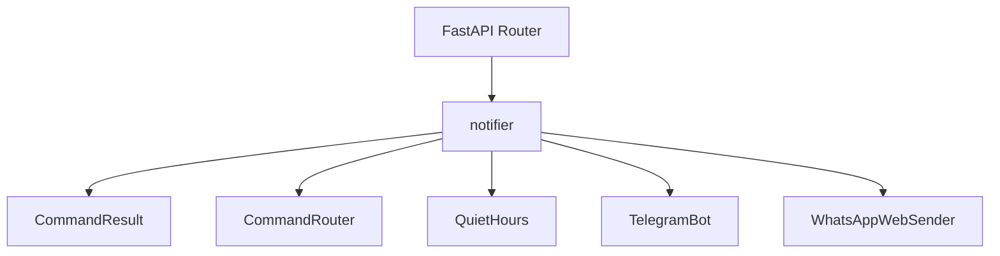
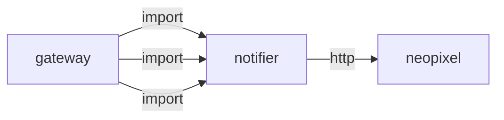
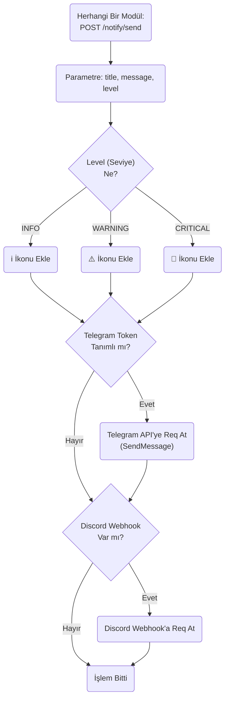
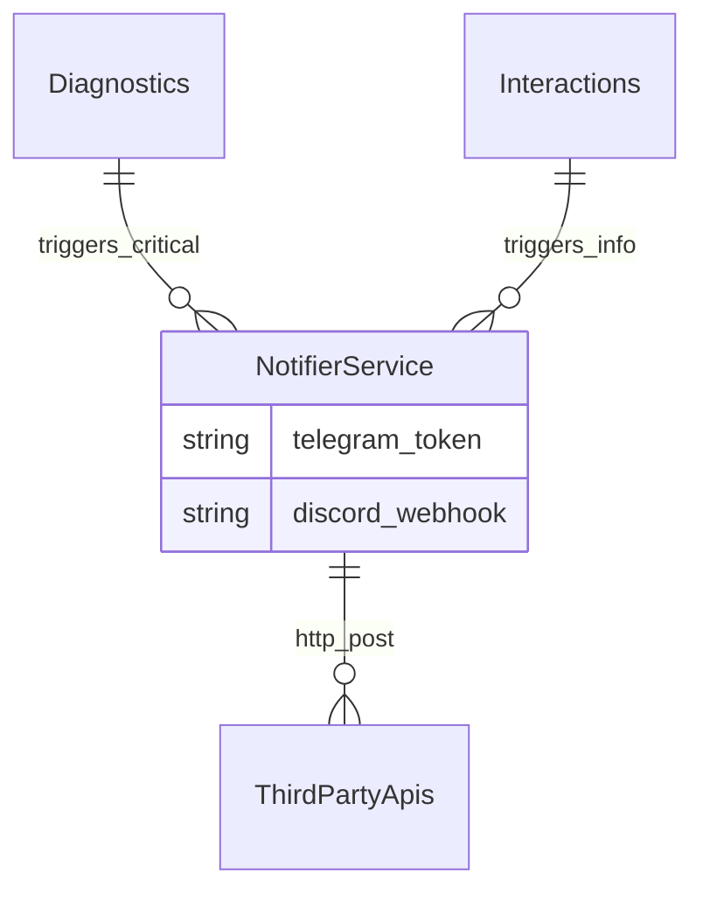

# notifier

> **Telegram/Discord bildirim gönderici**

## Kimlik
| Alan | Değer |
| --- | --- |
| Ana sınıf | `—` |
| Giriş noktası | `create_app()` |
| Orkestratör | `—` |
| Ana dosya | `modules/notifier/xNotifierService.py` |
| Katman | Arka Plan |
| Port | — |
| Arduino | Hayır |
| Sınıf sayısı | 5 |
| Endpoint sayısı | 7 |

## İsimlendirilmiş Bileşenler (Sınıflar)

#### `CommandResult` — `modules/notifier/services/command_router.py`
- **Görev:** —
- **Kalıtım:** —
- **Oluşturduğu bileşenler:** —
- **Metodlar:** —

#### `CommandRouter` — `modules/notifier/services/command_router.py`
- **Görev:** Map Telegram commands to HTTP calls on other modules.
- **Kalıtım:** —
- **Oluşturduğu bileşenler:** —
- **Metodlar:** `handle()`

#### `QuietHours` — `modules/notifier/services/telegram_bot.py`
- **Görev:** —
- **Kalıtım:** —
- **Oluşturduğu bileşenler:** —
- **Metodlar:** `is_quiet_now()`

#### `TelegramBot` — `modules/notifier/services/telegram_bot.py`
- **Görev:** —
- **Kalıtım:** —
- **Oluşturduğu bileşenler:** —
- **Metodlar:** `start()`, `stop()`, `send()`, `send_photo()`

#### `WhatsAppWebSender` — `modules/notifier/services/whatsapp_web.py`
- **Görev:** —
- **Kalıtım:** —
- **Oluşturduğu bileşenler:** —
- **Metodlar:** `send_text()`


## API — Endpoint → Handler → Servis

| HTTP | Path | Handler | Çağırdığı servis | Açıklama |
| --- | --- | --- | --- | --- |
| GET | `/healthz` | `healthz()` | — | — |
| POST | `/telegram` | `tele()` | — | — |
| POST | `/discord` | `disc()` | — | — |
| POST | `/test` | `test()` | — | — |
| POST | `/whatsapp` | `whatsapp_send()` | — | — |
| POST | `/start` | `start_bot()` | — | — |
| POST | `/stop` | `stop_bot()` | — | — |

## Config Bölümleri
- `server`
- `gateway`
- `telegram`
- `whatsapp_web`
- `discord`
- `quiet_hours`

## Dış İlişkiler (Bu modül → diğerleri)

| Hedef modül | Bağlantı tipi | Detay | Neden |
| --- | --- | --- | --- |
| [[neopixel]] | http | calls path `/neopixel/clear` | `notifier` HTTP ile `neopixel` modülüne erişir: LED animasyon veya duygu preset uygular. |

## Gelen İlişkiler (Diğerleri → bu modül)

| Kaynak modül | Bağlantı tipi | Detay | Neden |
| --- | --- | --- | --- |
| [[gateway]] | import | config_loader | `gateway` kod içinde `notifier` modülünü import eder (`config_loader`) — Telegram/Discord bildirim gönderici. |
| [[gateway]] | import | api | `gateway` kod içinde `notifier` modülünü import eder (`api`) — Telegram/Discord bildirim gönderici. |
| [[gateway]] | import | services | `gateway` kod içinde `notifier` modülünü import eder (`services`) — Telegram/Discord bildirim gönderici. |

## İç Mimari (otomatik çıkarım)



## Modül Etkileşim Haritası



### Mimari diyagram 1


### Mimari diyagram 2


---

# Tam Kaynak Arşivi

### `modules/notifier/README.md` (63 satır)

```markdown
# Notifier

A lightweight bridge for Telegram, Discord, and WhatsApp Web alerts. Telegram support optionally spins up a long-polling bot so you can issue commands back into the platform.

## Setup
1. Fill out `modules/notifier/config/config.yml`:
```
telegram:
	bot_token: "123:ABC"
	chat_id: "-100..."        # default outbound target
	allowed_user_ids: [123456] # empty list means everyone
	polling:
		enabled: true            # toggle Telegram bot
		interval_sec: 2.5
whatsapp_web:
	enabled: false
	recipient: "+905551111111"
	send_mode: "instant"      # instant | schedule
	schedule_delay_sec: 90     # only used when send_mode=schedule
	wait_time_sec: 15          # pywhatkit wait before typing
	close_time_sec: 5          # wait before tab close
	tab_close: true            # close tab after send
discord:
	webhook: ""
quiet_hours:
	enabled: false
	start: "23:00"
	end: "08:00"
```

2. Run the service via `python -m modules.notifier.xNotifierService` (or through your orchestrator).

## API
- GET `/notify/healthz`
- POST `/notify/telegram` `{ text, chat_id? }` (requires token + chat_id in config)
- POST `/notify/discord` `{ text }` (requires webhook in config)
- POST `/notify/whatsapp` `{ text, to?, delay_sec? }` (drives the WhatsApp Web sender)
- POST `/notify/test`

## Telegram bot
- When `polling.enabled` is true, the bot listens for `/start`, `/ping`, `/help` in the background.
- Quiet hours suppress outgoing alerts and respond with an informational notice instead.
- If `allowed_user_ids` is non-empty, only those Telegram user IDs can interact.
- Extended commands (proxied to the gateway `base_url`):
	- `/status` overall module health
	- `/snap` camera snapshot
	- `/stream` MJPEG stream info
	- `/pt <pan> <tilt>` pan/tilt degrees
	- `/pan <deg>` and `/tilt <deg>` single-axis helpers
	- `/neofill r g b`, `/neoclear` NeoPixel controls
	- `/say <text>` triggers the speak service

## WhatsApp Web sender
- Install `pywhatkit` (and its dependencies) inside the environment: `pip install pywhatkit`.
- Log into WhatsApp Web manually and keep the browser session open; the sender hijacks that session to send a message.
- Configure the `whatsapp_web` block:
	- `recipient` must be an international MSISDN (e.g., `+9055...`).
	- `send_mode: instant` uses `pywhatkit.sendwhatmsg_instantly` (~15 s prep window).
	- `send_mode: schedule` falls back to `pywhatkit.sendwhatmsg`, so delivery happens at least `schedule_delay_sec` seconds later.
	- `wait_time_sec`, `close_time_sec`, and `tab_close` mirror pywhatkit’s browser automation knobs.
- POST `/notify/whatsapp` with `{ "text": "Hello" }` to deliver; optionally override the destination with `to`.
- This flow is outbound-only: no inbound commands or media uploads through WhatsApp Web.
- During sending, avoid touching keyboard/mouse—pywhatkit simulates human interaction and can be interrupted easily.
```

### `modules/notifier/__init__.py` (1 satır)

```python
"""Notifier module: Telegram/Discord simple integration."""
```

### `modules/notifier/api/__init__.py` (1 satır)

```python
# api namespace
```

### `modules/notifier/api/router.py` (109 satır)

```python
from __future__ import annotations
from datetime import datetime, time
from typing import Dict, Any
from fastapi import APIRouter

from ..services.senders import send_telegram, send_discord
from ..services.telegram_bot import TelegramBot
from ..services.whatsapp_web import WhatsAppWebSender


def _quiet_hours_active(cfg: Dict[str, Any]) -> bool:
    quiet_cfg = cfg.get("quiet_hours", {})
    if not quiet_cfg.get("enabled", False):
        return False
    def _parse(value: str) -> time:
        h, m = value.split(":", maxsplit=1)
        return time(int(h), int(m))
    start = _parse(quiet_cfg.get("start", "23:00"))
    end = _parse(quiet_cfg.get("end", "08:00"))
    now = datetime.now().time()
    if start <= end:
        return start <= now < end
    return now >= start or now < end


def get_router(
    cfg: Dict[str, Any],
    bot: TelegramBot | None = None,
    whatsapp_web: WhatsAppWebSender | None = None,
) -> APIRouter:
    r = APIRouter(prefix="/notify", tags=["notifier"])

    @r.get("/healthz")
    def healthz():
        return {"ok": True}

    @r.post("/telegram")
    async def tele(body: Dict[str, Any]):
        if _quiet_hours_active(cfg):
            return {"ok": False, "reason": "quiet_hours"}

        token = cfg.get("telegram", {}).get("bot_token", "")
        chat_id_default = cfg.get("telegram", {}).get("chat_id", "")
        target_chat = str(body.get("chat_id") or chat_id_default)
        text = str(body.get("text", ""))

        ok = False
        if bot:
            ok = await bot.send(text, chat_id=target_chat)
        elif token and target_chat:
            ok = send_telegram(token, target_chat, text)
        return {"ok": ok}

    @r.post("/discord")
    def disc(body: Dict[str, Any]):
        webhook = cfg.get("discord", {}).get("webhook", "")
        ok = bool(webhook) and send_discord(webhook, str(body.get("text", "")))
        return {"ok": ok}

    @r.post("/test")
    async def test():
        msg = "SentryBOT notifier test"
        res = {"telegram": False, "discord": False, "whatsapp": False}
        t = cfg.get("telegram", {})
        d = cfg.get("discord", {})
        if t.get("bot_token") and t.get("chat_id"):
            if bot:
                res["telegram"] = await bot.send(msg)
            else:
                res["telegram"] = send_telegram(t["bot_token"], t["chat_id"], msg)
        if d.get("webhook"):
            res["discord"] = send_discord(d["webhook"], msg)
        if whatsapp_web:
            res["whatsapp"] = await whatsapp_web.send_text(msg)
        return {"ok": any(res.values()), "results": res}

    @r.post("/whatsapp")
    async def whatsapp_send(body: Dict[str, Any]):
        if _quiet_hours_active(cfg):
            return {"ok": False, "reason": "quiet_hours"}
        if not whatsapp_web:
            return {"ok": False, "reason": "disabled"}
        text = str(body.get("text", "")).strip()
        if not text:
            return {"ok": False, "reason": "empty_text"}
        target = str(body.get("to") or body.get("recipient") or "").strip() or None
        delay_override_sec = body.get("delay_sec")
        try:
            delay_value = int(delay_override_sec) if delay_override_sec is not None else None
        except Exception:
            delay_value = None
        ok = await whatsapp_web.send_text(text, to=target, delay_override_sec=delay_value)
        return {"ok": ok}

    @r.post("/start")
    async def start_bot():
        if bot:
            await bot.start()
            return {"ok": True, "status": "polling_started"}
        return {"ok": False, "reason": "no_bot_configured"}

    @r.post("/stop")
    async def stop_bot():
        if bot:
            await bot.stop()
            return {"ok": True, "status": "polling_stopped"}
        return {"ok": False, "reason": "no_bot_configured"}

    return r
```

### `modules/notifier/architecture_notifier.md` (54 satır)

```markdown
# Notifier (Bildirim) Modülü Mimarisi

Notifier modülü (`modules/notifier`), robottaki önemli olayları veya hataları sahibinin cep telefonuna (Telegram, Discord, Slack) webhook'lar üzerinden güvenli olarak iten (push notification) köprü servisidir.

## 🏗️ İş Akışı ve Karar Mekanizmaları (Flowchart)


## 🔄 İlişkisel Etkileşimler (Veri Akışı)


## ⚙️ Detaylı Karar Mantığı (if/else)

1. **Ağ Çökmesi Koruması**
   - Robot internetsiz bir alana girdiğinde (örneğin fuar alanı), Telegram bildirimleri patlayacaktır.
   - Bu modül içindeki tüm HTTP POST işlemleri **`try / except requests.exceptions.RequestException`** bloğu ile sarmalanır. Ağ yanıt vermezse (`Timeout`), fonksiyon uygulamayı kitlemeden `"Bildirim Gönderilemedi"` iç logunu (logger.error) basıp çıkar.
2. **Kuyruklama ve Taşkın (Flood) Önleme**
   - Saniyede 100 kere `CRITICAL` hatası çıkarsa robota ait Telegram API adresi spam sebepli banlanacaktır.
   - Bildirimler gönderilirken, son 10 saniye içinde **`if`** "Aynı Bildirim Gönderildiyse" o bildirimi engeller (Rate Limiting).
```

### `modules/notifier/config/config.yml` (27 satır)

```yaml
server:
  host: 0.0.0.0
  port: 8096
gateway:
  base_url: "http://127.0.0.1:8080"
  timeout_sec: 4.0
telegram:
  bot_token: ""
  chat_id: ""
  allowed_user_ids: []
  polling:
    enabled: false
    interval_sec: 2.5
whatsapp_web:
  enabled: true
  recipient: "your_number_here"
  send_mode: "instant"   # instant | schedule
  schedule_delay_sec: 90
  wait_time_sec: 15
  close_time_sec: 5
  tab_close: false
discord:
  webhook: ""
quiet_hours:
  enabled: false
  start: "23:00"
  end: "08:00"
```

### `modules/notifier/config_loader.py` (68 satır)

```python
from __future__ import annotations
import os
from pathlib import Path
from typing import Any, Dict
import yaml

_DEFAULT_CFG_PATH = Path(__file__).parent / "config" / "config.yml"
_DEFAULT_DOTENV_PATH = Path(__file__).parent / ".env"


def _load_dotenv(path: Path) -> None:
    if not path.exists():
        return
    for raw in path.read_text(encoding="utf-8").splitlines():
        line = raw.strip()
        if not line or line.startswith("#"):
            continue
        if "=" not in line:
            continue
        key, val = line.split("=", 1)
        key = key.strip()
        if key and key not in os.environ:
            os.environ[key] = val.strip()


def _str_to_bool(v: str) -> bool:
    return str(v).lower() in {"1", "true", "yes", "on"}


def _apply_env(cfg: Dict[str, Any]) -> Dict[str, Any]:
    bot_token = os.getenv("NOTIFIER_BOT_TOKEN")
    chat_id = os.getenv("NOTIFIER_CHAT_ID")
    discord_webhook = os.getenv("NOTIFIER_DISCORD_WEBHOOK")
    allowed = os.getenv("NOTIFIER_ALLOWED_USER_IDS")
    polling = os.getenv("NOTIFIER_POLLING_ENABLED")
    gateway = os.getenv("NOTIFIER_GATEWAY_BASE_URL")

    if bot_token or chat_id or allowed or polling:
        cfg.setdefault("telegram", {})
    if bot_token:
        cfg["telegram"]["bot_token"] = bot_token
    if chat_id:
        cfg["telegram"]["chat_id"] = chat_id
    if allowed:
        cfg["telegram"]["allowed_user_ids"] = [int(x) for x in allowed.split(",") if x.strip()]
    if polling is not None:
        cfg.setdefault("telegram", {}).setdefault("polling", {})["enabled"] = _str_to_bool(polling)

    if discord_webhook:
        cfg.setdefault("discord", {})["webhook"] = discord_webhook

    if gateway:
        cfg.setdefault("gateway", {})["base_url"] = gateway

    return cfg


def load_config(path: str | None = None) -> Dict[str, Any]:
    # allow .env to set env vars without extra dependencies
    _load_dotenv(_DEFAULT_DOTENV_PATH)

    p = Path(path) if path else _DEFAULT_CFG_PATH
    if not p.exists():
        p = _DEFAULT_CFG_PATH
    with open(p, "r", encoding="utf-8") as f:
        cfg = yaml.safe_load(f) or {}

    return _apply_env(cfg)
```

### `modules/notifier/services/__init__.py` (4 satır)

```python
from .telegram_bot import TelegramBot, build_telegram_bot
from .command_router import CommandRouter

__all__ = ["TelegramBot", "build_telegram_bot", "CommandRouter"]
```

### `modules/notifier/services/command_router.py` (166 satır)

```python
from __future__ import annotations

from dataclasses import dataclass
from typing import Optional
import httpx


@dataclass
class CommandResult:
    text: Optional[str] = None
    photo: Optional[bytes] = None


class CommandRouter:
    """Map Telegram commands to HTTP calls on other modules."""

    def __init__(self, base_url: str, timeout: float = 4.0) -> None:
        self._base = base_url.rstrip("/")
        self._timeout = timeout

    async def handle(self, client: httpx.AsyncClient, text: str) -> Optional[CommandResult]:
        parts = text.strip().split()
        if not parts:
            return None
        cmd = parts[0].lower()
        args = parts[1:]

        try:
            if cmd in ("/help", "/h"):
                return CommandResult(text=self._help())
            if cmd == "/status":
                return CommandResult(text=await self._status(client))
            if cmd in ("/snap", "/snapshot"):
                return await self._snap(client)
            if cmd in ("/stream", "/video"):
                return CommandResult(text="Telegram canlı stream desteklemiyor; lokal MJPEG: /camera/video")
            if cmd in ("/pt", "/track"):
                return CommandResult(text=await self._pan_tilt(client, args))
            if cmd == "/pan":
                return CommandResult(text=await self._pan_tilt(client, args, single_axis="pan"))
            if cmd == "/tilt":
                return CommandResult(text=await self._pan_tilt(client, args, single_axis="tilt"))
            if cmd in ("/neofill", "/fill"):
                return CommandResult(text=await self._neofill(client, args))
            if cmd in ("/neoclear", "/clear"):
                return CommandResult(text=await self._post_ok(client, "/neopixel/clear", "NeoPixel cleared"))
            if cmd in ("/say", "/tts"):
                return CommandResult(text=await self._say(client, args))
            return None
        except Exception as exc:
            return CommandResult(text=f"Hata: {exc}")

    def _help(self) -> str:
        return (
            "Komutlar:\n"
            "/status - modüllerin sağlık kontrolü\n"
            "/snap - kamera fotoğraf gönder\n"
            "/stream - stream bilgisi\n"
            "/pt <pan> <tilt> - pan/tilt derece\n"
            "/pan <deg> - sadece pan\n"
            "/tilt <deg> - sadece tilt\n"
            "/neofill r g b - tüm LED renk\n"
            "/neoclear - LED temizle\n"
            "/say <metin> - TTS oynat"
        )

    async def _status(self, client: httpx.AsyncClient) -> str:
        url = f"{self._base}/health"
        try:
            resp = await client.get(url, timeout=self._timeout)
            if resp.status_code != 200:
                return f"Status error: {resp.status_code}"
            data = resp.json()
            mods = data if isinstance(data, dict) else {}
            summary = []
            for name, info in mods.items():
                if name == "ok":
                    continue
                ok = info.get("ok", False) if isinstance(info, dict) else False
                summary.append(f"{name}:{'ok' if ok else 'fail'}")
            return "Durum " + ("ok" if mods.get("ok", False) else "fail") + " " + ", ".join(summary)
        except Exception as exc:
            return f"Status hata: {exc}"

    async def _pan_tilt(self, client: httpx.AsyncClient, args: list[str], single_axis: str | None = None) -> str:
        pan: float | None = None
        tilt: float | None = None
        try:
            if single_axis == "pan":
                pan = float(args[0]) if args else None
                tilt = 0.0
            elif single_axis == "tilt":
                tilt = float(args[0]) if args else None
                pan = 0.0
            else:
                pan = float(args[0]) if len(args) >= 1 else None
                tilt = float(args[1]) if len(args) >= 2 else None
        except Exception:
            return "Kullanım: /pt <pan> <tilt> (derece)"
        if pan is None or tilt is None:
            return "Kullanım: /pt <pan> <tilt>"
        params = {"head_pan": pan, "head_tilt": tilt}
        url = f"{self._base}/vlm/track"
        ok = await self._post_bool(client, url, params=params)
        return "Pan/tilt ok" if ok else "Pan/tilt başarısız"

    async def _neofill(self, client: httpx.AsyncClient, args: list[str]) -> str:
        try:
            r, g, b = [int(x) for x in args[:3]]
        except Exception:
            return "Kullanım: /neofill <r> <g> <b>"
        url = f"{self._base}/neopixel/fill"
        params = {"r_": r, "g": g, "b": b}
        ok = await self._post_bool(client, url, params=params)
        return "NeoPixel set" if ok else "NeoPixel hata"

    async def _say(self, client: httpx.AsyncClient, args: list[str]) -> str:
        text = " ".join(args).strip()
        if not text:
            return "Kullanım: /say <metin>"
        url = f"{self._base}/speak/say"
        try:
            resp = await client.post(url, json={"text": text}, timeout=max(self._timeout, 15.0))
        except Exception as exc:
            return f"TTS istek hatası: {exc!r}"
        if resp.status_code != 200:
            return f"TTS http {resp.status_code}"
        data = None
        try:
            if resp.headers.get("content-type", "").startswith("application/json"):
                data = resp.json()
        except Exception:
            data = None
        if isinstance(data, dict):
            if data.get("ok"):
                return "TTS oynatılıyor"
            err = data.get("error") or data
            return f"TTS hata: {err}"
        return "TTS oynatılıyor"

    async def _snap(self, client: httpx.AsyncClient) -> CommandResult:
        url = f"{self._base}/camera/snap"
        try:
            resp = await client.get(url, timeout=self._timeout)
            if resp.status_code != 200:
                return CommandResult(text=f"Snapshot hata: {resp.status_code}")
            return CommandResult(photo=resp.content)
        except Exception as exc:
            return CommandResult(text=f"Snapshot hata: {exc}")

    async def _post_ok(self, client: httpx.AsyncClient, path: str, success_msg: str) -> str:
        url = f"{self._base}{path}"
        ok = await self._post_bool(client, url)
        return success_msg if ok else f"Hata: {path}"

    async def _post_bool(self, client: httpx.AsyncClient, url: str, json: dict | None = None, params: dict | None = None) -> bool:
        try:
            resp = await client.post(url, json=json, params=params, timeout=self._timeout)
            if resp.status_code != 200:
                return False
            data = resp.json() if resp.headers.get("content-type", "").startswith("application/json") else None
            if isinstance(data, dict) and "ok" in data:
                return bool(data.get("ok", False))
            return True
        except Exception:
            return False
```

### `modules/notifier/services/senders.py` (29 satır)

```python
from __future__ import annotations
from typing import Optional


def send_telegram(bot_token: str, chat_id: str, text: str) -> bool:
    try:
        import httpx  # type: ignore
    except Exception:
        return False
    try:
        url = f"https://api.telegram.org/bot{bot_token}/sendMessage"
        with httpx.Client() as c:
            r = c.post(url, json={"chat_id": chat_id, "text": text}, timeout=5.0)
        return r.status_code == 200
    except Exception:
        return False


def send_discord(webhook: str, content: str) -> bool:
    try:
        import httpx  # type: ignore
    except Exception:
        return False
    try:
        with httpx.Client() as c:
            r = c.post(webhook, json={"content": content}, timeout=5.0)
        return r.status_code in (200, 204)
    except Exception:
        return False
```

### `modules/notifier/services/telegram_bot.py` (221 satır)

```python
from __future__ import annotations

import asyncio
import contextlib
import logging
from dataclasses import dataclass
from datetime import datetime, time
from typing import Iterable, Optional

import httpx

from .command_router import CommandRouter, CommandResult


logger = logging.getLogger("notifier.telegram")


@dataclass
class QuietHours:
    enabled: bool
    start: time
    end: time

    def is_quiet_now(self, now: Optional[datetime] = None) -> bool:
        if not self.enabled:
            return False
        current = (now or datetime.now()).time()
        # Quiet hours may wrap past midnight (e.g., 23:00-08:00)
        if self.start <= self.end:
            return self.start <= current < self.end
        return current >= self.start or current < self.end


def _parse_time(value: str) -> time:
    hour, minute = value.split(":", maxsplit=1)
    return time(int(hour), int(minute))


class TelegramBot:
    def __init__(
        self,
        bot_token: str,
        default_chat_id: str,
        *,
        allowed_user_ids: Iterable[int] | None = None,
        poll_interval: float = 2.5,
        quiet_hours: QuietHours | None = None,
        command_router: CommandRouter | None = None,
    ) -> None:
        self._bot_token = bot_token.strip('"').strip("'")
        self._default_chat_id = default_chat_id
        self._allowed_user_ids = set(allowed_user_ids or [])
        self._poll_interval = poll_interval
        self._quiet_hours = quiet_hours or QuietHours(False, time(0, 0), time(0, 0))
        self._commands = command_router

        self._offset = 0
        self._task: asyncio.Task | None = None
        self._client: httpx.AsyncClient | None = None

    async def start(self) -> None:
        if self._task:
            return
        self._client = httpx.AsyncClient()
        self._task = asyncio.create_task(self._poll_loop())
        logger.info("telegram polling started")

    async def stop(self) -> None:
        if self._task:
            self._task.cancel()
            with contextlib.suppress(asyncio.CancelledError):
                await self._task
            self._task = None
        if self._client:
            await self._client.aclose()
            self._client = None
        logger.info("telegram polling stopped")

    async def send(self, text: str, *, chat_id: str | None = None) -> bool:
        if not self._client:
            self._client = httpx.AsyncClient()
        target_chat = chat_id or self._default_chat_id
        if not target_chat:
            return False
        url = f"https://api.telegram.org/bot{self._bot_token}/sendMessage"
        try:
            res = await self._client.post(
                url,
                json={"chat_id": target_chat, "text": text},
                timeout=10.0,
            )
            return res.status_code == 200
        except Exception:
            return False

    async def send_photo(self, photo: bytes, *, chat_id: str | None = None, caption: str | None = None) -> bool:
        if not self._client:
            self._client = httpx.AsyncClient()
        target_chat = chat_id or self._default_chat_id
        if not target_chat:
            return False
        url = f"https://api.telegram.org/bot{self._bot_token}/sendPhoto"
        try:
            files = {"photo": ("snap.jpg", photo, "image/jpeg")}
            data = {"chat_id": target_chat}
            if caption:
                data["caption"] = caption
            res = await self._client.post(url, data=data, files=files, timeout=20.0)
            return res.status_code == 200
        except Exception:
            return False

    async def _poll_loop(self) -> None:
        assert self._client is not None
        base_url = f"https://api.telegram.org/bot{self._bot_token}"
        while True:
            try:
                res = await self._client.get(
                    f"{base_url}/getUpdates",
                    params={"offset": self._offset + 1, "timeout": 20},
                    timeout=25.0,
                )
                data = res.json()
                if not data.get("ok"):
                    logger.warning("getUpdates not ok: %s", data)
                    await asyncio.sleep(self._poll_interval)
                    continue
                items = data.get("result", [])
                if items:
                    logger.info("received %s update(s)", len(items))
                for update in items:
                    self._offset = max(self._offset, int(update.get("update_id", 0)))
                    await self._handle_update(update)
            except asyncio.CancelledError:
                break
            except Exception:
                logger.exception("poll loop error")
                # Cooldown on any error to avoid busy looping
                await asyncio.sleep(self._poll_interval)

    async def _handle_update(self, update: dict) -> None:
        message = update.get("message") or update.get("edited_message")
        if not message:
            return
        user_id = int(message.get("from", {}).get("id", 0))
        chat_id = str(message.get("chat", {}).get("id", ""))
        text = str(message.get("text", ""))

        if self._allowed_user_ids and user_id not in self._allowed_user_ids:
            logger.info("skip unauthorized user %s", user_id)
            return

        if self._quiet_hours.is_quiet_now():
            await self.send("Quiet hours are active.", chat_id=chat_id)
            logger.info("quiet hours active; informed chat %s", chat_id)
            return

        lower = text.lower().strip()

        # Core bot commands
        if lower.startswith("/start"):
            await self.send("SentryBOT notifier aktif.", chat_id=chat_id)
            logger.info("/start handled for chat %s", chat_id)
            return
        if lower.startswith("/ping"):
            await self.send("pong", chat_id=chat_id)
            logger.info("/ping handled for chat %s", chat_id)
            return

        # Extended commands routed to services
        if self._commands:
            result = await self._commands.handle(self._client, text)
            if isinstance(result, CommandResult):
                sent = False
                if result.photo:
                    sent = await self.send_photo(result.photo, chat_id=chat_id, caption=result.text or None)
                elif result.text:
                    sent = await self.send(result.text, chat_id=chat_id)
                if sent:
                    logger.info("command handled via router for chat %s", chat_id)
                    return

        if lower.startswith("/help"):
            await self.send("Komutlar: /ping, /help", chat_id=chat_id)
            logger.info("/help handled for chat %s", chat_id)
            return

        await self.send(f"Aldım: {text}", chat_id=chat_id)
        logger.info("echoed message for chat %s", chat_id)


def build_telegram_bot(cfg: dict) -> TelegramBot | None:
    telegram_cfg = cfg.get("telegram", {})
    token = telegram_cfg.get("bot_token", "")
    chat_id = telegram_cfg.get("chat_id", "")
    if not token:
        return None

    quiet_cfg = cfg.get("quiet_hours", {})
    quiet = QuietHours(
        bool(quiet_cfg.get("enabled", False)),
        _parse_time(quiet_cfg.get("start", "23:00")),
        _parse_time(quiet_cfg.get("end", "08:00")),
    )
    poll_cfg = telegram_cfg.get("polling", {})
    allowed = telegram_cfg.get("allowed_user_ids") or []

    gw_cfg = cfg.get("gateway", {})
    router = CommandRouter(
        gw_cfg.get("base_url", "http://127.0.0.1:8080"),
        timeout=float(gw_cfg.get("timeout_sec", 4.0)),
    )

    return TelegramBot(
        token,
        chat_id,
        allowed_user_ids=[int(u) for u in allowed],
        poll_interval=float(poll_cfg.get("interval_sec", 2.5)),
        quiet_hours=quiet,
        command_router=router,
    )
```

### `modules/notifier/services/whatsapp_web.py` (85 satır)

```python
from __future__ import annotations

import asyncio
import logging
from datetime import datetime, timedelta

logger = logging.getLogger("notifier.whatsapp_web")


class WhatsAppWebSender:
    def __init__(
        self,
        recipient: str,
        *,
        wait_time_sec: int = 15,
        tab_close: bool = True,
        close_time_sec: int = 5,
        send_mode: str = "instant",
        schedule_delay_sec: int = 75,
    ) -> None:
        self._recipient = recipient.strip()
        self._wait_time = max(wait_time_sec, 1)
        self._tab_close = tab_close
        self._close_time = max(close_time_sec, 1)
        self._send_mode = send_mode if send_mode in ("instant", "schedule") else "instant"
        self._schedule_delay = max(schedule_delay_sec, 60)

    async def send_text(self, text: str, *, to: str | None = None, delay_override_sec: int | None = None) -> bool:
        message = text.strip()
        target = (to or self._recipient).strip()
        if not message or not target:
            return False
        delay = delay_override_sec if delay_override_sec is not None else None
        if delay is None and self._send_mode == "schedule":
            delay = self._schedule_delay
        return await asyncio.to_thread(self._send_blocking, target, message, delay)

    def _send_blocking(self, phone_number: str, message: str, delay_sec: int | None) -> bool:
        try:
            import pywhatkit
        except Exception:
            logger.error("pywhatkit bulunamadı. `pip install pywhatkit` çalıştırın.")
            return False
        try:
            if delay_sec is None:
                pywhatkit.sendwhatmsg_instantly(
                    phone_number,
                    message,
                    wait_time=self._wait_time,
                    tab_close=self._tab_close,
                    close_time=self._close_time,
                )
                return True
            fire_at = datetime.now() + timedelta(seconds=max(delay_sec, 60))
            pywhatkit.sendwhatmsg(
                phone_number,
                message,
                fire_at.hour,
                fire_at.minute,
                wait_time=self._wait_time,
                tab_close=self._tab_close,
                close_time=self._close_time,
            )
            return True
        except Exception:
            logger.exception("WhatsApp Web mesajı gönderilemedi")
            return False


def build_whatsapp_web_sender(cfg: dict) -> WhatsAppWebSender | None:
    web_cfg = cfg.get("whatsapp_web", {})
    if not web_cfg.get("enabled", False):
        return None
    recipient = str(web_cfg.get("recipient", "")).strip()
    if not recipient:
        logger.warning("whatsapp_web etkin ancak recipient boş")
        return None
    return WhatsAppWebSender(
        recipient=recipient,
        wait_time_sec=int(web_cfg.get("wait_time_sec", 15)),
        tab_close=bool(web_cfg.get("tab_close", True)),
        close_time_sec=int(web_cfg.get("close_time_sec", 5)),
        send_mode=str(web_cfg.get("send_mode", "instant")),
        schedule_delay_sec=int(web_cfg.get("schedule_delay_sec", 75)),
    )
```

### `modules/notifier/tests/test_smoke.py` (8 satır)

```python
from __future__ import annotations

from modules.notifier.xNotifierService import create_app


def test_create_app():
    app = create_app()
    assert app is not None
```

### `modules/notifier/xNotifierService.py` (41 satır)

```python
from __future__ import annotations
from fastapi import FastAPI

import logging

from .config_loader import load_config
from .api.router import get_router
from .services.telegram_bot import build_telegram_bot
from .services.whatsapp_web import build_whatsapp_web_sender


logger = logging.getLogger("notifier")


def create_app(config_path: str | None = None) -> FastAPI:
    cfg = load_config(config_path)
    telegram_bot = build_telegram_bot(cfg)
    whatsapp_web = build_whatsapp_web_sender(cfg)

    app = FastAPI(title="Notifier Service")
    app.include_router(get_router(cfg, telegram_bot, whatsapp_web))

    polling_enabled = cfg.get("telegram", {}).get("polling", {}).get("enabled", False)
    if telegram_bot and polling_enabled:
        @app.on_event("startup")
        async def _start_bot() -> None:
            logger.info("starting telegram bot polling")
            await telegram_bot.start()

        @app.on_event("shutdown")
        async def _stop_bot() -> None:
            logger.info("stopping telegram bot polling")
            await telegram_bot.stop()

    return app


if __name__ == "__main__":
    import uvicorn
    cfg = load_config(None)
    uvicorn.run(create_app(), host=str(cfg["server"].get("host", "0.0.0.0")), port=int(cfg["server"].get("port", 8096)))
```
