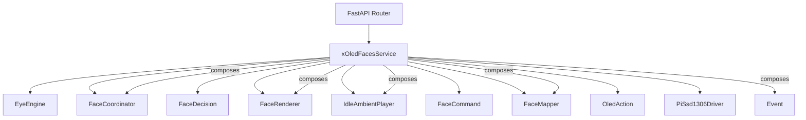
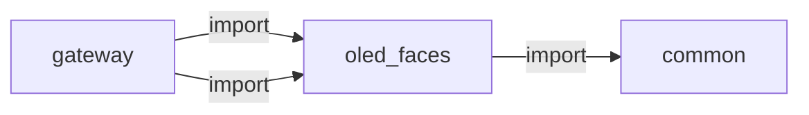

# oled_faces

> **OLED ekran yüz ifadeleri**

## Kimlik
| Alan | Değer |
| --- | --- |
| Ana sınıf | `xOledFacesService` |
| Giriş noktası | `create_app()` |
| Orkestratör | `OledAction` |
| Ana dosya | `modules/oled_faces/xOledFacesService.py` |
| Katman | Eylem |
| Port | — |
| Arduino | Hayır |
| Sınıf sayısı | 13 |
| Endpoint sayısı | 4 |

## İsimlendirilmiş Bileşenler (Sınıflar)

#### `EyeEngine` — `modules/oled_faces/services/eyes/engine.py`
- **Görev:** —
- **Kalıtım:** —
- **Oluşturduğu bileşenler:** `Draw`, `Lock`, `Event`
- **Metodlar:** `start()`, `stop()`, `set_mood()`, `play_gesture()`, `set_activity()`

#### `FaceCoordinator` — `modules/oled_faces/services/face_coordinator.py`
- **Görev:** —
- **Kalıtım:** —
- **Oluşturduğu bileşenler:** —
- **Metodlar:** `on_event()`, `from_state()`, `listen_session_active()`, `speak_session_active()`, `session_active()`, `should_clear_activity()`, `note_applied_mood()`

#### `FaceDecision` — `modules/oled_faces/services/face_coordinator.py`
- **Görev:** —
- **Kalıtım:** —
- **Oluşturduğu bileşenler:** —
- **Metodlar:** —

#### `FaceRenderer` — `modules/oled_faces/services/face_renderer.py`
- **Görev:** —
- **Kalıtım:** —
- **Oluşturduğu bileşenler:** `PiSsd1306Driver`
- **Metodlar:** `begin()`, `close()`, `status()`, `pin_activity()`, `stop_loops()`, `show_test_pattern()`, `apply()`

#### `IdleAmbientPlayer` — `modules/oled_faces/services/idle_ambient.py`
- **Görev:** —
- **Kalıtım:** —
- **Oluşturduğu bileşenler:** —
- **Metodlar:** `maybe_action()`

#### `FaceCommand` — `modules/oled_faces/services/legacy_map.py`
- **Görev:** —
- **Kalıtım:** —
- **Oluşturduğu bileşenler:** —
- **Metodlar:** —

#### `FaceMapper` — `modules/oled_faces/services/mapper.py`
- **Görev:** —
- **Kalıtım:** —
- **Oluşturduğu bileşenler:** —
- **Metodlar:** `from_operational()`, `from_emotions()`, `from_interaction_event()`, `from_arduino_event()`

#### `OledAction` — `modules/oled_faces/services/mapper.py`
- **Görev:** —
- **Kalıtım:** —
- **Oluşturduğu bileşenler:** —
- **Metodlar:** —

#### `PiSsd1306Driver` — `modules/oled_faces/services/pi_ssd1306_driver.py`
- **Görev:** SSD1306 I2C driver for Raspberry Pi; accepts PIL frames from the eye engine.
- **Kalıtım:** —
- **Oluşturduğu bileşenler:** `Lock`
- **Metodlar:** `begin()`, `close()`, `status()`, `show_pil_image()`, `show_test_pattern()`, `clear()`, `set_pixel()`, `fill_rect()`, `flush()`, `set_brightness()`

#### `xOledFacesService` — `modules/oled_faces/xOledFacesService.py`
- **Görev:** —
- **Kalıtım:** —
- **Oluşturduğu bileşenler:** `FaceMapper`, `FaceCoordinator`, `IdleAmbientPlayer`, `FaceRenderer`, `Event`
- **Metodlar:** `start()`, `stop()`, `status()`, `on_interaction_event()`, `apply_manual()`


## API — Endpoint → Handler → Servis

| HTTP | Path | Handler | Çağırdığı servis | Açıklama |
| --- | --- | --- | --- | --- |
| GET | `/healthz` | `healthz()` | `apply_manual()`, `on_interaction_event()`, `status()` | — |
| GET | `/status` | `status()` | `apply_manual()`, `on_interaction_event()`, `status()` | — |
| POST | `/manual` | `manual()` | `apply_manual()`, `on_interaction_event()` | — |
| POST | `/event` | `push_event()` | `on_interaction_event()` | — |

## Config Bölümleri
- `server`
- `enabled`
- `poll_interval_s`
- `min_switch_interval_s`
- `animation_hold_s`
- `bitmap_hold_s`
- `emotion_hold_s`
- `session_hold_s`
- `listen_session_hold_s`
- `speak_session_hold_s`
- `event_cooldown_s`
- `priority_map`
- `display`
- `boot`
- `idle_bitmap`
- `fallback_unknown`
- `idle_ambient`
- `state_map`
- `event_map`
- `arduino_event_map`

## Dış İlişkiler (Bu modül → diğerleri)

| Hedef modül | Bağlantı tipi | Detay | Neden |
| --- | --- | --- | --- |
| [[common]] | import | emotion_vocab | Yüz ifadesi ve duygu taksonomisini ortak sözlükten alır. |

## Gelen İlişkiler (Diğerleri → bu modül)

| Kaynak modül | Bağlantı tipi | Detay | Neden |
| --- | --- | --- | --- |
| [[gateway]] | import | xOledFacesService | `gateway` kod içinde `oled_faces` modülünü import eder (`xOledFacesService`) — OLED ekran yüz ifadeleri. |
| [[gateway]] | import | api | `gateway` kod içinde `oled_faces` modülünü import eder (`api`) — OLED ekran yüz ifadeleri. |

## İç Mimari (otomatik çıkarım)



## Modül Etkileşim Haritası



---

# Tam Kaynak Arşivi

### `modules/oled_faces/README.md` (19 satır)

```markdown
# OLED Faces Module

Robot durum/olay sinyallerini Raspberry Pi SSD1306 OLED ekranda **Pip tarzı prosedürel animasyonlu gözlere** dönüştürür.

## Kaynaklar
- Durum: `state_manager` (`operational`, `emotions`)
- Olaylar: `interactions` event akışı
- Yüz motoru: `services/eyes/` (moods, gestures, activities — [esp-bridge-mcp-robot](https://github.com/WhoIsMrSentry/esp-bridge-mcp-robot) Pip motoru, senkron: `src/modules/espbridge/eyes/`)

## API
- `GET /oled_faces/healthz`
- `GET /oled_faces/status`
- `POST /oled_faces/manual` (`mode`: `bitmap|animation|logo`, `name`)
- `POST /oled_faces/event` (`type`, opsiyonel `data`)

## Not
- OLED sürüşü Pi I2C üzerinden (`display` ayarları: `config/config.yml`).
- Eski Irisoled bitmap/JSON varlıkları kaldırıldı; legacy isimler `services/legacy_map.py` ile Pip motoruna yönlendirilir.
- `config_loader` açılışta `catalog_registry.expand_config()` ile **31 mood + 24 gesture + 8 activity** motor girdisini `event_map` ve `idle_ambient.pool` içine birleştirir (`use_full_catalog: true`).
```

### `modules/oled_faces/__init__.py` (17 satır)

```python
from __future__ import annotations

from typing import TYPE_CHECKING

if TYPE_CHECKING:
    from .xOledFacesService import xOledFacesService as xOledFacesService


def __getattr__(name: str):
    if name == "xOledFacesService":
        from .xOledFacesService import xOledFacesService

        return xOledFacesService
    raise AttributeError(f"module {__name__!r} has no attribute {name!r}")


__all__ = ["xOledFacesService"]
```

### `modules/oled_faces/api/__init__.py` (3 satır)

```python
from .router import get_router

__all__ = ["get_router"]
```

### `modules/oled_faces/api/router.py` (35 satır)

```python
from __future__ import annotations

from typing import Any, Dict

from fastapi import APIRouter


def get_router(service: Any) -> APIRouter:
    r = APIRouter(prefix="/oled_faces", tags=["oled_faces"])

    @r.get("/healthz")
    def healthz() -> Dict[str, Any]:
        st = service.status()
        return {**st, "ok": bool(st.get("has_display"))}

    @r.get("/status")
    def status() -> Dict[str, Any]:
        return service.status()

    @r.post("/manual")
    def manual(payload: Dict[str, Any]) -> Dict[str, Any]:
        mode = str(payload.get("mode", "bitmap"))
        name = str(payload.get("name", "normal"))
        return service.apply_manual(mode=mode, name=name)

    @r.post("/event")
    def push_event(payload: Dict[str, Any]) -> Dict[str, Any]:
        event_type = str(payload.get("type", ""))
        data = payload.get("data") if isinstance(payload.get("data"), dict) else {}
        if not event_type:
            return {"ok": False, "error": "type is required"}
        service.on_interaction_event(event_type, data)
        return {"ok": True}

    return r
```

### `modules/oled_faces/architecture_oled_faces.md` (31 satır)

```markdown
# Architecture – OLED Faces

## Amaç
Robotun anlık durum ve olaylarını SSD1306 ekranda **prosedürel animasyonlu göz ifadelerine** dönüştürmek (Pip `EyeEngine`).

## Bileşenler
- `xOledFacesService`: servis yaşam döngüsü, state polling, event işleme
- `services/mapper.py`: olay/durum -> mode/name eşleme
- `services/legacy_map.py`: eski Irisoled isimlerini Pip mood/gesture/activity'ye çevirir
- `services/face_renderer.py`: `EyeEngine` + `PiSsd1306Driver` birleşimi
- `services/eyes/`: Pip yüz katmanları (`moods`, `gestures`, `activities`, `engine`)
- `services/pi_ssd1306_driver.py`: Pi I2C SSD1306 sürücüsü
- `api/router.py`: manuel kontrol ve gözlem endpointleri
- `config/config.yml`: eşleme tabloları

## Veri Akışı
1. Gateway `bootstrap`, `xOledFacesService` örneğini oluşturur.
2. Servis periyodik olarak `state_manager` store'dan state çeker.
3. `interactions` event handler ile olaylar canlı iletilir.
4. `FaceMapper` mode/name üretir; `FaceRenderer` Pip motoruna uygular.
5. `EyeEngine` PIL ile kare üretir; `PiSsd1306Driver` I2C'ye yazar.

## Tasarım Kararları
- State ve event kaynakları ayrıştırıldı; mapping tek noktada yönetiliyor.
- Irisoled bitmap bağımlılığı kaldırıldı; tüm yüzler prosedürel.
- Legacy config isimleri (`normal`, `scan`, `blink`, …) `legacy_map` ile korunur.

## Genişletme
- Yeni mood/gesture/activity: `services/eyes/` altındaki ilgili dosyaya tek satır ekle.
- Yeni event/state eşlemesi: `config.yml` `state_map` / `event_map`.
- Eski isim alias: `services/legacy_map.py`.
```

### `modules/oled_faces/config/README.md` (8 satır)

```markdown
# OLED Faces Config

`config.yml` içindeki eşlemeler robot durumları ve olaylarını SSD1306 prosedürel yüz ifadelerine dönüştürür.

- `state_map`: state_manager `operational` değerleri için eşleme
- `event_map`: interactions olay adları ve `emotion:*` anahtarları
- `arduino_event_map`: Arduino event akışı için eşleme
- `fallback_unknown`: bilinmeyen durumlarda seçilecek yüz adı (legacy `normal` → `neutral`)
```

### `modules/oled_faces/config/config.yml` (184 satır)

```yaml
server:
  host: 0.0.0.0
  port: 8102

enabled: true
poll_interval_s: 0.7
min_switch_interval_s: 0.8
animation_hold_s: 2.0
bitmap_hold_s: 1.2
emotion_hold_s: 2.5
session_hold_s: 45.0
listen_session_hold_s: 120.0
speak_session_hold_s: 90.0
event_cooldown_s: 0.8
priority_map:
  error: 95
  warning: 90
  owner.locked: 92
  wakeword.detected: 80
  speech.listen.start: 80
  speech.listen.end: 72
  speech.start: 74
  speech.end: 68
  autonomy.look_around: 45
  autonomy.blink: 35
  vision.focus: 55
  emotion:fear: 88
  emotion:angry: 86
  emotion:furious: 90
  gesture:smoke: 40
  gesture:laugh: 38
  activity:editing: 42

display:
  enabled: true
  bus: 1
  address: 60   # 0x3C
  width: 128
  height: 64
  contrast: 143 # 0x8F
  brightness: 255
  fps: 24
  column_offset: 0
  seg_remap: true
  com_scan_dec: true

boot:
  mode: logo
  name: logo

idle_bitmap: normal
fallback_unknown: normal

idle_ambient:
  enabled: true
  use_full_catalog: true
  min_interval_s: 18
  max_interval_s: 45
  hold_s: 6
  priority: 32
  pool: []

state_map:
  idle: { mode: bitmap, name: normal }
  boot: { mode: logo, name: logo }
  active: { mode: bitmap, name: attentive }
  maintenance: { mode: bitmap, name: cool }
  listening: { mode: animation, name: listening }
  thinking: { mode: animation, name: thinking }
  speaking: { mode: animation, name: thinking }
  sleeping: { mode: animation, name: sleep }
  alert: { mode: animation, name: alert }
  low_battery: { mode: bitmap, name: battery_low }
  charging: { mode: bitmap, name: standby }
  charged: { mode: bitmap, name: battery_full }

event_map:
  # --- speech / agent sessions ---
  wakeword.detected: { mode: animation, name: listening }
  speech.listen.start: { mode: animation, name: listening }
  speech.listen.end: { mode: bitmap, name: normal }
  speech.start: { mode: animation, name: thinking }
  speech.end: { mode: bitmap, name: normal }
  agent.thinking: { mode: animation, name: thinking }
  agent.editing: { mode: animation, name: editing }
  agent.processing: { mode: animation, name: processing }
  agent.connecting: { mode: animation, name: connecting }

  # --- vision ---
  vision.person: { mode: animation, name: searching }
  vision.focus: { mode: bitmap, name: focused }

  # --- autonomy idle / body language ---
  autonomy.calm: { mode: bitmap, name: normal }
  autonomy.excited: { mode: gesture, name: excited }
  autonomy.angry: { mode: bitmap, name: furious }
  autonomy.blink: { mode: gesture, name: blink }
  autonomy.look_around: { mode: animation, name: scanning }
  autonomy.stretch: { mode: gesture, name: look_up }
  autonomy.bored: { mode: bitmap, name: bored }
  autonomy.monologue: { mode: animation, name: thinking }
  autonomy.sleep: { mode: animation, name: sleep }
  autonomy.wake: { mode: bitmap, name: normal }
  autonomy.offline: { mode: animation, name: connecting }
  autonomy.nod: { mode: gesture, name: nod }
  autonomy.refuse: { mode: gesture, name: refuse }
  autonomy.laugh: { mode: gesture, name: laugh }
  autonomy.smoke: { mode: gesture, name: smoke }
  autonomy.shiver: { mode: gesture, name: shiver }
  autonomy.squint: { mode: gesture, name: squint }
  autonomy.pop: { mode: gesture, name: pop }
  autonomy.roll: { mode: gesture, name: roll }
  autonomy.cross_eyes: { mode: gesture, name: cross_eyes }

  # --- owner / security ---
  owner.scan: { mode: gesture, name: look_left }
  owner.rfid: { mode: gesture, name: wink }
  owner.temp_granted: { mode: bitmap, name: happy }
  owner.temp_revoked: { mode: bitmap, name: nervous }
  owner.locked: { mode: bitmap, name: scared }

  # --- system ---
  error: { mode: gesture, name: scan_sweep }
  warning: { mode: bitmap, name: alert }

  # --- canonical emotions (autonomy mood / expression_director) ---
  emotion:neutral: { mode: bitmap, name: neutral }
  emotion:joy: { mode: bitmap, name: happy }
  emotion:sadness: { mode: bitmap, name: sad }
  emotion:curiosity: { mode: bitmap, name: attentive }
  emotion:tired: { mode: bitmap, name: tired }
  emotion:fear: { mode: bitmap, name: scared }
  emotion:anger: { mode: bitmap, name: angry }
  emotion:furious: { mode: bitmap, name: furious }
  emotion:surprise: { mode: bitmap, name: surprised }
  emotion:excitement: { mode: bitmap, name: wired }
  emotion:love: { mode: bitmap, name: lovely }
  emotion:disgust: { mode: bitmap, name: gloomy }
  emotion:confusion: { mode: bitmap, name: disoriented }
  emotion:worried: { mode: bitmap, name: nervous }
  emotion:bored: { mode: bitmap, name: bored }
  emotion:suspicious: { mode: bitmap, name: suspicious }
  emotion:awe: { mode: bitmap, name: awe }
  emotion:gloomy: { mode: bitmap, name: gloomy }
  emotion:cool: { mode: bitmap, name: cool }
  emotion:devil: { mode: bitmap, name: devil }
  emotion:kawaii: { mode: bitmap, name: kawaii }
  emotion:dead: { mode: bitmap, name: dead }
  emotion:smoking: { mode: bitmap, name: smoking }
  emotion:disoriented: { mode: bitmap, name: disoriented }
  emotion:wired: { mode: bitmap, name: wired }
  emotion:nervous: { mode: bitmap, name: nervous }

  # --- legacy emotion event labels (backward compatible) ---
  emotion:happy: { mode: bitmap, name: happy }
  emotion:joy: { mode: bitmap, name: happy }
  emotion:sad: { mode: bitmap, name: sad }
  emotion:surprised: { mode: bitmap, name: surprised }
  emotion:sleepy: { mode: bitmap, name: sleepy }
  emotion:confused: { mode: bitmap, name: disoriented }
  emotion:angry: { mode: bitmap, name: angry }
  emotion:anger: { mode: bitmap, name: angry }
  emotion:furious: { mode: bitmap, name: furious }
  emotion:bored: { mode: bitmap, name: bored }
  emotion:scared: { mode: bitmap, name: scared }
  emotion:focused: { mode: bitmap, name: focused }
  emotion:excited: { mode: bitmap, name: wired }
  emotion:love: { mode: bitmap, name: lovely }
  emotion:curiosity: { mode: bitmap, name: attentive }
  emotion:despair: { mode: bitmap, name: despair }
  emotion:worried: { mode: bitmap, name: nervous }

  # --- emotion scenes (autonomy config scenes) ---
  scene.emotion_joy: { mode: bitmap, name: happy }
  scene.emotion_curiosity: { mode: bitmap, name: attentive }
  scene.emotion_fear: { mode: bitmap, name: scared }
  scene.emotion_tired: { mode: bitmap, name: tired }
  scene.emotion_sad: { mode: bitmap, name: sad }
  scene.emotion_angry: { mode: bitmap, name: angry }
  scene.emotion_furious: { mode: bitmap, name: furious }

arduino_event_map:
  rfid: { mode: gesture, name: wink }
  neopixel_request: { mode: bitmap, name: mode }
```

### `modules/oled_faces/config_loader.py` (21 satır)

```python
from __future__ import annotations

from pathlib import Path
from typing import Any, Dict, Optional

import yaml

from .services.catalog_registry import expand_config

_DEFAULT_CFG_PATH = Path(__file__).parent / "config" / "config.yml"


def load_config(path: Optional[str] = None, overrides: Optional[Dict[str, Any]] = None) -> Dict[str, Any]:
    p = Path(path) if path else _DEFAULT_CFG_PATH
    if not p.exists():
        p = _DEFAULT_CFG_PATH
    with open(p, "r", encoding="utf-8") as f:
        cfg: Dict[str, Any] = yaml.safe_load(f) or {}
    if overrides:
        cfg.update(overrides)
    return expand_config(cfg)
```

### `modules/oled_faces/requirements.txt` (2 satır)

```text
smbus2>=0.4.3
Pillow>=10.0.0
```

### `modules/oled_faces/services/__init__.py` (3 satır)

```python
from .mapper import FaceMapper, OledAction

__all__ = ["FaceMapper", "OledAction"]
```

### `modules/oled_faces/services/catalog_registry.py` (78 satır)

```python
"""Motor catalog (moods / gestures / activities) and config expansion helpers."""
from __future__ import annotations

from typing import Any, Dict, List, Tuple

from .eyes.activities import ACTIVITIES
from .eyes.gestures import BLINKS, GESTURES_FN
from .eyes.moods import MOODS
from .mapper import OledAction

# 31 moods, 24 gestures (7 blinks + 17 moves), 8 busy activities (+ idle)
MOTOR_MOODS: Tuple[str, ...] = tuple(MOODS.keys())
MOTOR_GESTURES: Tuple[str, ...] = tuple(BLINKS) + tuple(GESTURES_FN)
MOTOR_ACTIVITIES: Tuple[str, ...] = tuple(a for a in ACTIVITIES if a != "idle")


def build_catalog_pool() -> List[Dict[str, str]]:
    """Flat playlist covering every motor entry (idle ambient round-robin)."""
    items: List[Dict[str, str]] = []
    for mood in MOTOR_MOODS:
        items.append({"mode": "bitmap", "name": mood})
    for gesture in MOTOR_GESTURES:
        items.append({"mode": "gesture", "name": gesture})
    for activity in MOTOR_ACTIVITIES:
        items.append({"mode": "animation", "name": activity})
    return items


def build_motor_event_map() -> Dict[str, Dict[str, str]]:
    """Default event_map entries so every motor name is addressable as an event."""
    out: Dict[str, Dict[str, str]] = {}
    for mood in MOTOR_MOODS:
        out[f"emotion:{mood}"] = {"mode": "bitmap", "name": mood}
    for gesture in MOTOR_GESTURES:
        out[f"gesture:{gesture}"] = {"mode": "gesture", "name": gesture}
    for activity in MOTOR_ACTIVITIES:
        out[f"activity:{activity}"] = {"mode": "animation", "name": activity}
    return out


def expand_config(cfg: Dict[str, Any]) -> Dict[str, Any]:
    """Merge motor catalog into event_map and idle_ambient pool (config overrides win)."""
    merged = dict(cfg)
    motor_events = build_motor_event_map()
    user_events = dict(merged.get("event_map") or {})
    merged["event_map"] = {**motor_events, **user_events}

    ambient = dict(merged.get("idle_ambient") or {})
    if bool(ambient.get("use_full_catalog", True)):
        user_pool = list(ambient.get("pool") or [])
        seen = {(str(i.get("mode", "")).lower(), str(i.get("name", "")).lower()) for i in user_pool if isinstance(i, dict)}
        pool = list(user_pool)
        for item in build_catalog_pool():
            key = (item["mode"], item["name"])
            if key not in seen:
                pool.append(item)
                seen.add(key)
        ambient["pool"] = pool
    merged["idle_ambient"] = ambient
    return merged


def catalog_pool_actions() -> List[OledAction]:
    return [
        OledAction(mode=str(i["mode"]), name=str(i["name"]))
        for i in build_catalog_pool()
    ]


__all__ = [
    "MOTOR_MOODS",
    "MOTOR_GESTURES",
    "MOTOR_ACTIVITIES",
    "build_catalog_pool",
    "build_motor_event_map",
    "expand_config",
    "catalog_pool_actions",
]
```

### `modules/oled_faces/services/eyes/__init__.py` (15 satır)

```python
"""Procedural robot eyes for a 128x64 OLED, drawn with PIL.

Three strictly-separate layers, one module each:
  * moods.py      -- MOODS: a *static* expression (size + lid painter + decor).
  * gestures.py   -- GESTURES: the *moving* layer, a one-shot enveloped wobble.
  * activities.py -- ACTIVITIES: a looping tool-status (gaze pose + overlay icon).
engine.py wires them into the threaded eye renderer; primitives.py holds the
shared drawing helpers. Adding an emoji/motion/status = one line in its module.
"""
from .activities import ACTIVITIES
from .engine import EyeEngine
from .gestures import GESTURES
from .moods import EMOTIONS

__all__ = ["EyeEngine", "EMOTIONS", "GESTURES", "ACTIVITIES"]
```

### `modules/oled_faces/services/eyes/activities.py` (129 satır)

```python
"""ACTIVITIES -- a looping "what I'm doing" status: a gaze pose + an overlay icon.
Each busy activity also wears a fitting face (see ACT_MOOD)."""
from __future__ import annotations

import math

from .primitives import draw_formula

ACTIVITIES = ("idle", "thinking", "scanning", "searching", "working", "listening",
              "processing", "connecting", "editing")
# each busy activity wears a fitting face; listening just stays attentive (neutral)
ACT_MOOD = {"thinking": "focused", "scanning": "neutral", "searching": "focused",
            "working": "focused", "listening": "neutral", "editing": "smoking",
            "processing": "focused", "connecting": "attentive"}


def pose(act, now):
    """Eased gaze target (x, y) + height multiplier for a looping activity."""
    if act == "thinking":   # gaze up at the floating symbols, slow wander
        return math.sin(now * 0.7) * 7, -9 + math.sin(now * 0.4) * 2, 1.0
    if act == "scanning":   # step left->right then down a line, settling each stop
        line = now * 1.0
        return (int(line % 1.0 * 4) / 3 * 2 - 1) * 13, (int(line) % 3 - 1) * 5, 1.0
    if act == "searching":  # quick wandering glances -- scanning results
        return math.sin(now * 2.2) * 11 + math.sin(now * 1.3) * 5, math.sin(now * 1.7) * 5, 1.0
    if act == "working":    # heads-down on the task, hammering away below
        return math.sin(now * 1.6) * 5, 4 + math.sin(now * 0.8) * 1, 0.85
    if act == "listening":  # attentive, gently nodding along under the headphones
        return math.sin(now * 1.8) * 2, math.sin(now * 3.6) * 2, 1.0
    if act == "processing": # locked-in, computing -- a tight steady focus
        return math.sin(now * 1.4) * 4, -2 + math.sin(now * 0.7), 0.92
    if act == "connecting": # expectant, waiting on the link
        return math.sin(now * 1.5) * 3, math.sin(now * 2.0) * 2, 1.0
    return 0.0, 0.0, 1.0


# ---- overlay icons: drawn on top of the eyes. Signature: (d, W, H, now) --------
def _think(d, W, H, now):
    # formulas, numbers & nerdy easter eggs drift up -- pondering ('^' raises next char)
    # 42 = the Answer; 404 = not found; 1337 = leet; O(n) = big-O.
    tokens = ("E=mc^2", "a^2+b^2=c^2", "F=ma", "v=d/t", "2^10", "i^2=-1", "dx/dt",
              "3.14", "1.618", "9.8", "42", "404", "1337", "O(n)", "?")
    for i in range(4):
        t = (now * 0.4 + i / 4) % 1.0                   # 0..1 rise progress
        y = H - 10 - t * (H - 16)                       # float up the screen
        ti = (i * 3 + int(now * 0.4 + i / 4)) % len(tokens)
        x = 6 + i * (W - 50) / 3 + math.sin(now * 1.1 + i * 2) * 5
        draw_formula(d, x, y, tokens[ti])


def _headphones(d, W, H, now):
    # cute headphones: a band over the top + an ear cup each side -- "listening"
    cw, ch = 11, 22
    cy = H // 2 - ch // 2
    d.rounded_rectangle([2, cy, 2 + cw, cy + ch], radius=4, fill=1)          # left cup
    d.rounded_rectangle([W - 3 - cw, cy, W - 3, cy + ch], radius=4, fill=1)  # right cup
    d.arc([8, 1, W - 9, H - 12], start=180, end=360, fill=1, width=3)        # headband


def _magnifier(d, W, H, now):
    # a magnifying glass sweeps across -- "searching / looking things up"
    rad = 6
    cx = W / 2 + math.sin(now * 1.6) * (W / 2 - 12)
    cy = H - 11 + math.sin(now * 3.2) * 2
    d.ellipse([cx - rad, cy - rad, cx + rad, cy + rad], outline=1, width=2)  # lens rim
    hx, hy = cx + rad * 0.7, cy + rad * 0.7
    d.line([hx, hy, hx + 5, hy + 5], fill=1, width=2)                        # handle


def _hammer(d, W, H, now):
    # "getting work done": a hammer winds up slow and strikes an anvil hard, big sparks
    ax, ay = W // 2 + 4, H - 6                        # anvil strike point
    px, py = ax - 6, H - 18                           # wrist pivot, above-left
    raised, struck = math.radians(-38), math.radians(82)
    t = (now * 0.8) % 1.0                             # slow, deliberate rhythm
    th = (struck + (raised - struck) * (t / 0.7) if t < 0.7      # long slow wind-up
          else raised + (struck - raised) * ((t - 0.7) / 0.3))   # snap down to strike
    hx, hy = px + 12 * math.cos(th), py + 12 * math.sin(th)
    nx, ny = -math.sin(th), math.cos(th)             # crossbar dir, perpendicular to handle
    d.line([px, py, hx, hy], fill=1, width=2)        # handle
    d.line([hx - 6 * nx, hy - 6 * ny, hx + 6 * nx, hy + 6 * ny], fill=1, width=5)  # head
    d.rectangle([ax - 7, ay, ax + 7, ay + 3], fill=1)  # anvil / work piece
    if t < 0.25:                                      # impact: strong spark, fades on recoil
        s = 1.0 - t / 0.25                            # 1 right after the hit -> 0
        L = 5 + 11 * s
        for k in range(5):                            # upward fan of sparks
            a = math.radians(-160 + k * 35)
            d.line([ax, ay - 1, ax + math.cos(a) * L, ay - 1 + math.sin(a) * L], fill=1, width=2)


def _typing(d, W, H, now):
    # two small chibi hands tap the keys -- "editing" (just hands, no arms)
    base = H - 3                                          # key row the fingertips reach
    for i, cx in enumerate((18, W - 18)):               # left & right hand, near the edges
        tap = round((math.sin(now * 8 + i * math.pi) + 1) / 2 * 3)   # alternating peck
        cy = base - 6 + tap                             # whole hand dips to press
        thumb = cx + (7 if i == 0 else -7)              # thumb tucked toward the centre
        d.ellipse([thumb - 2, cy - 3, thumb + 3, cy + 2], fill=1)    # thumb nub
        d.rounded_rectangle([cx - 7, cy - 5, cx + 7, cy + 2], radius=3, fill=1)  # back of hand
        for k in range(4):                              # four little fingertips on the keys
            fx = cx - 5 + k * 4
            d.ellipse([fx - 2, cy, fx + 2, cy + 5], fill=1)
        for k in range(3):                              # notches between the fingers
            nx = cx - 3 + k * 4
            d.line([nx, cy + 1, nx, cy + 5], fill=0, width=1)


def _arc_ring(d, W, H, now):
    # a sleek arc sweeps around a ring -- "processing / computing"
    cx, cy, rad = W // 2, H - 11, 8
    a0 = int(now * 200) % 360
    d.arc([cx - rad, cy - rad, cx + rad, cy + rad], start=a0, end=a0 + 210, fill=1, width=2)


def _link_dots(d, W, H, now):
    # three dots pulse in sequence -- "connecting / establishing link"
    cy = H - 11
    for i in range(3):
        t = (math.sin(now * 4 - i * 1.1) + 1) / 2          # staggered 0..1 pulse
        s = 1.5 + 2.5 * t
        x = W / 2 - 10 + i * 10
        d.ellipse([x - s / 2, cy - s / 2, x + s / 2, cy + s / 2], fill=1)


# act name -> overlay painter (activities without one just move the gaze)
OVERLAYS = {"thinking": _think, "searching": _magnifier,
            "working": _hammer, "listening": _headphones,
            "processing": _arc_ring, "connecting": _link_dots,
            "editing": _typing}
```

### `modules/oled_faces/services/eyes/engine.py` (224 satır)

```python
"""EyeEngine -- threaded renderer wiring the three layers (mood / gesture / activity).

The moving layer holds ONE move at a time: a blink or a gesture. A commanded
gesture preempts it; the automatic blink and the mood-change mask-blink only fire
when it is free, so moves never overlap. A mood change that arrives while it is
busy waits in `_pending` and applies (masked) the moment it frees. A separate
eased pose (gaze + size) glides toward its target, so everything settles, never snaps.
"""
from __future__ import annotations

import math
import random
import threading
import time

from PIL import Image, ImageDraw

from .activities import ACT_MOOD, ACTIVITIES, OVERLAYS, pose
from .gestures import BLINKS, GESTURE_FACE, GESTURE_FX, GESTURES_FN
from .moods import MOODS
from .primitives import ease, rounded_rect

_TAU_GAZE, _TAU_SIZE = 0.09, 0.11            # gaze / eye-size settle time-constants
_AUTO = ({"left", "right"}, 0.20, 1, 0.5)    # spontaneous blink (eyes, dur, reps, anchor)
_MASK = ({"left", "right"}, 0.24, 1, 0.5)    # blink that hides a mood's lid swap


class EyeEngine:
    def __init__(self, show, *, width=128, height=64, fps=30,
                 eye_w=36, eye_h=36, radius=12, gap=10,
                 set_brightness=None, bright=255):        # bright = general panel brightness, max by default
        self._show = show
        self._set_brightness, self._bright = set_brightness, bright
        self._cur_bright = None                          # unset -> first frame pushes the general level
        self.W, self.H, self.fps = width, height, max(5, fps)
        self.eye_w, self.eye_h, self.radius, self.gap = eye_w, eye_h, radius, gap
        self.base_lx = (width - (2 * eye_w + gap)) // 2
        self.base_ly = (height - eye_h) // 2
        self._img = Image.new("1", (width, height), 0)   # one reused frame buffer
        self._draw = ImageDraw.Draw(self._img)

        self.gx = self.gy = 0.0                          # eased pose (thread-only)
        self.ew, self.eh = float(eye_w), float(eye_h)

        self._lock = threading.Lock()                    # guards the fields below
        self.mood = "neutral"
        self._pending = None                             # mood waiting for the layer to free
        self.look_x = self.look_y = 0.0                  # resting gaze target
        self._blink = self._gesture = self._activity = None
        self._restore_mood = None                        # mood to return to after a face-swapping gesture
        self._next_blink = self._next_idle = 0.0
        self._stop = threading.Event()
        self._thread = None

    # ------------------------------------------------------------------ API
    def start(self):
        if not (self._thread and self._thread.is_alive()):
            self._stop.clear()
            self._thread = threading.Thread(target=self._run, name="eye-engine", daemon=True)
            self._thread.start()

    def stop(self):
        self._stop.set()
        if self._thread:
            self._thread.join(timeout=1.5)

    def set_mood(self, mood):
        m = mood.lower() if mood and mood.lower() in MOODS else "neutral"
        with self._lock:
            self._restore_mood = None                    # an explicit mood change cancels a pending gesture-restore
            if m == self.mood:
                self._pending = None
            elif self._blink or self._gesture:           # busy -> apply (masked) once free
                self._pending = m
            else:
                self.mood = m
                self._begin_blink(time.monotonic(), _MASK)

    def play_gesture(self, name):
        """Play a commanded blink/gesture; it preempts whatever is on the moving
        layer, so a sent emote is never dropped or overwritten by a default."""
        name = (name or "none").lower()
        now = time.monotonic()
        with self._lock:
            if self._restore_mood is not None:           # a prior face-gesture is interrupted -> restore its mood first
                self.mood, self._restore_mood = self._restore_mood, None
            if name in BLINKS:
                self._begin_blink(now, BLINKS[name])
            elif name in GESTURES_FN:
                self._blink = None
                self._gesture = {"kind": name, "start": now, "dur": GESTURES_FN[name][0]}
                if name in GESTURE_FACE:                  # wear another mood for the gesture, restore it when done
                    self._restore_mood = self.mood
                    self.mood, self._pending = GESTURE_FACE[name], None

    def set_activity(self, name):
        """Loop a status animation (thinking/scanning/...); 'idle' stops it. Each busy
        activity also wears a fitting face (thinking -> focused, ...)."""
        name = (name or "idle").lower()
        act = name if name in ACTIVITIES and name != "idle" else None
        if act in ACT_MOOD:
            self.set_mood(ACT_MOOD[act])                 # takes the lock itself
        with self._lock:
            self._activity = act

    # -------------------------------------------------------------- internals
    def _begin_blink(self, now, spec):
        """Start a blink, clearing the moving layer (caller holds the lock)."""
        eyes, dur, reps, anchor = spec
        self._gesture = None
        self._blink = {"eyes": set(eyes), "start": now, "dur": dur, "reps": reps, "anchor": anchor}

    def _run(self):
        now = last = time.monotonic()
        self._next_blink = now + random.uniform(2, 6)
        self._next_idle = now + random.uniform(1.5, 5)
        frame = 1.0 / self.fps
        while not self._stop.is_set():
            now = time.monotonic()
            dt = min(0.1, now - last)                     # clamp so a stall can't teleport the eyes
            last = now
            self._step(now, dt)
            try:
                self._show(self._render(now))
            except Exception:
                pass                                     # transient BLE/I2C hiccup -- keep going
            time.sleep(max(0.0, frame - (time.monotonic() - now)))

    def _step(self, now, dt):
        """Retire finished moves, schedule automatic ones, ease the pose to target."""
        with self._lock:
            if self._blink and now - self._blink["start"] > self._blink["dur"]:
                self._blink = None
            if self._gesture and now - self._gesture["start"] > self._gesture["dur"]:
                self._gesture = None
                if self._restore_mood is not None:        # face-swapping gesture finished -> restore the original mood
                    self.mood, self._restore_mood = self._restore_mood, None
            free = not (self._blink or self._gesture)
            if free and self._pending:                       # masked deferred mood swap
                self.mood, self._pending = self._pending, None
                self._begin_blink(now, _MASK)
            elif free and now >= self._next_blink:           # spontaneous blink
                self._begin_blink(now, _AUTO)
                self._next_blink = now + random.uniform(2, 6)
            elif free and self._activity is None and now >= self._next_idle:  # idle glance
                self.look_x, self.look_y = (0.0, 0.0) if random.random() < 0.3 else \
                    (random.uniform(-16, 16), random.uniform(-7, 7))
                self._next_idle = now + random.uniform(1.5, 5)
            mood, act, look = self.mood, self._activity, (self.look_x, self.look_y)

        spec = MOODS[mood]
        target = min(spec.get("bright", self._bright), self._bright)  # emote may dim, capped at the general max
        if self._set_brightness and target != self._cur_bright:
            try:
                self._set_brightness(target)
                self._cur_bright = target
            except Exception:
                pass                                      # BLE hiccup -- retry next frame

        bw = self.eye_w + spec.get("dw", 0)
        bh = self.eye_h + spec.get("dh", 0)
        if act:
            tx, ty, hmult = pose(act, now)
            bh *= hmult
        else:
            tx, ty = look
        self.gx = ease(self.gx, tx, dt, _TAU_GAZE)
        self.gy = ease(self.gy, ty, dt, _TAU_GAZE)
        self.ew = ease(self.ew, bw, dt, _TAU_SIZE)
        self.eh = ease(self.eh, bh, dt, _TAU_SIZE)

    def _render(self, now):
        with self._lock:                                 # snapshot; the dicts are never mutated in place
            mood, act, b, g = self.mood, self._activity, self._blink, self._gesture

        # blink: per-eye openness 1 -> 0 -> 1 (reps times); anchor = where the lid shuts
        ol = or_ = 1.0
        anchor = 0.5
        if b:
            o = 1.0 - abs(math.sin(min(1.0, (now - b["start"]) / b["dur"]) * b["reps"] * math.pi))
            anchor = b["anchor"]
            ol = o if "left" in b["eyes"] else ol
            or_ = o if "right" in b["eyes"] else or_

        # gesture: one enveloped move (dx, dy, convergence, scale_w, scale_h[, size-bias])
        dx = dy = conv = 0.0
        msw = msh = 1.0
        gbias = 0.0
        gkind = gph = genv = None
        if g:
            ph = min(1.0, (now - g["start"]) / g["dur"])
            gkind, gph, genv = g["kind"], ph, math.sin(ph * math.pi)
            ret = GESTURES_FN[g["kind"]][1](ph, genv)
            dx, dy, conv, msw, msh = ret[:5]
            gbias = ret[5] if len(ret) > 5 else 0.0

        spec = MOODS[mood]
        paint, tilt = spec.get("paint"), spec.get("tilt", 0.0)
        bias = spec.get("bias", 0.0) + gbias             # + = right eye bigger, left smaller

        d = self._draw
        d.rectangle([0, 0, self.W - 1, self.H - 1], fill=0)   # clear the reused buffer
        slot = self.base_lx + self.gx + dx                    # left eye's slot origin
        eyes = () if spec.get("bare") else \
            ((slot, ol, False), (slot + self.eye_w + self.gap, or_, True))  # 'bare' draws no eyes
        for sx, openness, right in eyes:
            es = 1.0 + (bias if right else -bias)             # parallax: the near eye swells
            w = max(2.0, self.ew * msw * es)
            ho = max(2.0, self.eh * msh * es)                 # open height (before the blink)
            h = max(2.0, ho * openness)
            ex = sx + (self.eye_w - w) / 2 + (-conv if right else conv)
            ey = self.base_ly + self.gy + dy + (tilt if right else -tilt) \
                + (self.eye_h - ho) / 2 + (ho - h) * anchor   # centre, then shut lid to anchor
            r = min(w, h) * self.radius / self.eye_w
            rounded_rect(d, ex, ey, w, h, r, 1)
            if openness > 0.6 and paint:                      # lids drop out while (half-)blinked
                paint(d, ex, ey, w, h, r, right)
        if spec.get("decor"):
            spec["decor"](d, self.W, self.H, now, self.gx, self.gy)
        if act in OVERLAYS:
            OVERLAYS[act](d, self.W, self.H, now)
        if gkind in GESTURE_FX:                           # gesture-time extras (e.g. a smoke cloud)
            GESTURE_FX[gkind](d, self.W, self.H, gph, genv)
        return self._img
```

### `modules/oled_faces/services/eyes/gestures.py` (109 satır)

```python
"""GESTURES -- the moving layer: blinks/winks and one-shot motions.
Adding a motion = one line in GESTURES_FN."""
from __future__ import annotations

import math

from .primitives import smoothstep

_PI = math.pi

# blink timeline: name -> (eyes, duration, closes, anchor)
# anchor is where the lid shuts: 0.5 centred, 1.0 from the top, 0.0 from the bottom.
BLINKS = {
    "blink":        ({"left", "right"}, 0.20, 1, 0.5),
    "double_blink": ({"left", "right"}, 0.44, 2, 0.5),
    "wink":         ({"right"}, 0.6, 1, 0.5),
    "wink_left":    ({"left"}, 0.6, 1, 0.5),
    "wink_right":   ({"right"}, 0.6, 1, 0.5),
    "blink_down":   ({"left", "right"}, 0.22, 1, 1.0),  # lids fall from the top
    "blink_up":     ({"left", "right"}, 0.22, 1, 0.0),  # lids close from the bottom
}


def _look(dx, dy, bias=0.0):
    """A real glance: dart toward (dx, dy) and -- for sideways looks -- swell the near
    eye while the far one shrinks (the parallax of the head turning). Hold, then return."""
    def fn(p, e):
        if p < 0.22:        # quick dart out
            hold = p / 0.22
        elif p > 0.80:      # quick return
            hold = (1.0 - p) / 0.20
        else:               # hold the look
            hold = 1.0
        hold = smoothstep(hold)               # ease the ramps
        s = 1.0 - 0.12 * hold                 # mild foreshorten (parallax carries the turn)
        return dx * hold, dy * hold, 0.0, s, s, bias * hold
    return fn


# one-shot motion: name -> (duration, fn(ph, env) -> (dx, dy, conv, scale_w, scale_h))
# ph 0..1 is gesture progress; env = sin(ph*pi) fades the move in and out.
GESTURES_FN = {
    "smoke":      (3.8, lambda p, e: (0.0, 0.0, 0.0, 1.0, 1.0)),                              # slow drag -- the cigarette does the work
    "nod":        (1.4, lambda p, e: (0.0, math.sin(p * _PI * 8) * 6 * e, 0.0, 1.0, 1.0)),    # two nods, same speed
    "refuse":     (1.2, lambda p, e: (math.sin(p * _PI * 12) * 9 * e, 0.0, 0.0, 1.0, 1.0)),   # two shakes, same speed
    "laugh":      (1.4, lambda p, e: (0.0, -abs(math.sin(p * _PI * 4)) * 7 * e, 0.0, 1.0, 1.0 - 0.4 * e)),
    "excited":    (0.9, lambda p, e: (0.0, -abs(math.sin(p * _PI * 5)) * 8 * e, 0.0, 1.0 + 0.22 * e, 1.0 + 0.22 * e)),
    "roll":       (0.9, lambda p, e: (math.cos(p * _PI * 2) * 11 * e, math.sin(p * _PI * 2) * 7 * e, 0.0, 1.0, 1.0)),
    "shiver":     (0.7, lambda p, e: (math.sin(p * _PI * 16) * 3 * e, math.cos(p * _PI * 22) * 2 * e, 0.0, 1.0, 1.0)),
    "cross_eyes": (0.9, lambda p, e: (0.0, 0.0, 9.0 * e, 1.0, 1.0)),
    "pop":        (0.5, lambda p, e: (0.0, 0.0, 0.0, 1.0 + 0.35 * e, 1.0 + 0.35 * e)),
    "squint":     (1.3, lambda p, e: (0.0, 0.0, 0.0, 1.0, 1.0 - 0.6 * e)),
    "scan":       (1.3, lambda p, e: (math.sin(p * _PI * 2) * 16 * e, 0.0, 0.0, 1.0, 1.0)),
    "look_left":  (1.2, _look(-8, 0, -0.2)),   # near (left) eye bigger, right smaller
    "look_right": (1.2, _look(8, 0, 0.2)),     # near (right) eye bigger, left smaller
    "look_up":    (1.2, _look(0, -10)),
    "look_down":  (1.2, _look(0, 10)),
    "acknowledge": (0.45, lambda p, e: (0.0, e * 8, 0.0, 1.0, 1.0)),                       # one crisp dip -- "on it"
    "scan_sweep":  (1.6, lambda p, e: (-math.sin(p * _PI * 2) * 15, 0.0, 0.0, 1.0, 1.0)),  # one smooth sensor sweep
}

def _smoking_act(d, W, H, p, e):
    """Lift the cigarette to the lips with a thin curl of smoke (like the smoking mood);
    on the slow inhale the wisp fades; on the exhale the cig pulls away and a thick plume pours out."""
    mx, my = W * 0.5, H - 9                            # the mouth
    lift = smoothstep(p / 0.12)                       # bring the cigarette up to the lips
    away = smoothstep((p - 0.55) / 0.30) if p > 0.55 else 0.0   # then pull it away on the exhale
    ax, ay = away * 10, away * 8
    rfx, rfy = W * 0.55, H - 1                          # resting hold, low
    # filter end at the lips; the body + ember reach out so the cigarette stays visible
    fx, fy = rfx + (mx - 4 - rfx) * lift + ax, rfy + (my - rfy) * lift + ay
    ex, ey = rfx + 18 + (mx + 16 - (rfx + 18)) * lift + ax, rfy - 3 + (my - 2 - (rfy - 3)) * lift + ay
    d.line([fx, fy, ex, ey], fill=1, width=3)         # cigarette body
    glow = 3 if 0.35 <= p < 0.55 else 2               # ember flares as the breath is drawn in
    d.ellipse([ex - glow, ey - glow, ex + glow, ey + glow], fill=1)

    thin = lift if p < 0.35 else max(0.0, 1.0 - smoothstep((p - 0.35) / 0.20))  # wisp fades on the inhale
    if thin > 0.03:
        pts = [(ex + math.sin(f * 4.5 - p * 9) * (f * f * 5), ey - 2 - f * 20 * thin)
               for f in (i / 10 for i in range(11))]
        d.line(pts, fill=1, width=1)                   # a single thin curl off the tip

    if p <= 0.55:
        return
    eq = (p - 0.55) / 0.45                            # 0..1 across the exhale
    rise = smoothstep(eq) * 1.7                       # the plume drifts slowly upward
    fade = 1.0 if eq < 0.4 else smoothstep((1.0 - eq) / 0.6)   # then dissipates gently, over a long tail
    for i in range(22):
        f = i / 21.0
        front = rise - f * 0.9
        if front <= 0:
            continue
        cxl = mx + math.sin(f * 3.4 + p * 4) * (2 + f * 11)
        spread = 3 + f * 16
        base = (2.5 + f * 8) * min(1.0, front * 2.4) * fade   # fade shrinks every puff toward the end
        for j in (-1, 0, 1):                          # a few puffs across the width -> a full, soft plume
            bx, by = cxl + j * spread * 0.5, my - f * (my + 2) - rise * 3   # the whole plume drifts up as it fades
            rad = base * (1.0 - 0.28 * abs(j))
            if rad > 0.5:
                d.ellipse([bx - rad, by - rad, bx + rad, by + rad], fill=1)


# gesture-time painters: name -> fn(d, W, H, ph, env), drawn on top of the face
GESTURE_FX = {"smoke": _smoking_act}

# while a gesture plays, wear another mood's eye-look (name -> mood whose paint to borrow)
GESTURE_FACE = {"smoke": "bored"}

GESTURES = ("none",) + tuple(BLINKS) + tuple(GESTURES_FN)
```

### `modules/oled_faces/services/eyes/moods.py` (219 satır)

```python
"""MOODS -- static expressions. A mood is a size delta plus an optional painter
that carves lids onto a plain rounded-rect eye, plus optional decor around the
face. Most painters compose three lid shapes (_brow / _glare / _lids); the rest
are one-offs. Adding an emoji = one line in MOODS."""
from __future__ import annotations

import math

from .primitives import heart, sparkle


# ---- shared lid shapes carved (fill=0) onto an eye drawn as a rounded rect ------
def _brow(d, x, y, w, h, inner, outer, is_right):
    """Slanted top lid: covers to inner*h toward the nose, outer*h on the outside."""
    rt = y + h * (outer if is_right else inner)
    lt = y + h * (inner if is_right else outer)
    d.polygon([(x - 2, y - 2), (x + w + 2, y - 2), (x + w + 2, rt), (x - 2, lt)], fill=0)


def _glare(d, x, y, w, h, depth, is_right):
    """Inner-down brow: a triangle whose tip drops to depth*h toward the nose."""
    tip = (x - 2, y + h * depth) if is_right else (x + w + 2, y + h * depth)
    d.polygon([(x - 2, y - 2), (x + w + 2, y - 2), tip], fill=0)


def _lids(d, x, y, w, h, top=0.0, bottom=1.0):
    """Flat lids: cover down to top*h and up from bottom*h."""
    if top:
        d.rectangle([x - 1, y - 1, x + w + 1, y + h * top], fill=0)
    if bottom < 1:
        d.rectangle([x - 1, y + h * bottom, x + w + 1, y + h + 1], fill=0)


# ---- painters: signature (d, x, y, w, h, r, is_right). Static -- no motion. -----
def _happy(d, x, y, w, h, r, ir):  # cheeks-up smile: arc carved into the bottom
    d.ellipse([x - w * 0.25, y + h * 0.45, x + w * 1.25, y + h * 2.1], fill=0)


def _sad(d, x, y, w, h, r, ir):       _brow(d, x, y, w, h, 0.30, 0.66, ir)  # downcast droop
def _tired(d, x, y, w, h, r, ir):     _brow(d, x, y, w, h, 0.38, 0.52, ir)  # hooded, peering out
def _worried(d, x, y, w, h, r, ir):   _brow(d, x, y, w, h, 0.02, 0.26, ir)  # raised inner brow
def _angry(d, x, y, w, h, r, ir):     _glare(d, x, y, w, h, 0.60, ir)       # glare
def _furious(d, x, y, w, h, r, ir):   _glare(d, x, y, w, h, 0.78, ir)       # rage (angry++)
def _bored(d, x, y, w, h, r, ir):     _lids(d, x, y, w, h, top=0.5)         # flat half-lids
def _focused(d, x, y, w, h, r, ir):   _lids(d, x, y, w, h, 0.24, 0.76)      # determined band
def _sleepy(d, x, y, w, h, r, ir):    _lids(d, x, y, w, h, 0.5, 0.82)       # droopy slits
def _despair(d, x, y, w, h, r, ir):   _lids(d, x, y, w, h, 0.42, 0.62)      # drained slit
def _attentive(d, x, y, w, h, r, ir): _lids(d, x, y, w, h, top=0.12)        # crisp top lid -- locked on
def _smoking(d, x, y, w, h, r, ir):   _lids(d, x, y, w, h, top=0.45)        # heavy-lidded, chilled out


def _skeptical(d, x, y, w, h, r, ir):  # one eye narrowed+angled, the other barely lidded
    if ir:
        _lids(d, x, y, w, h, top=0.14)
    else:
        d.polygon([(x - 2, y - 2), (x + w + 2, y - 2),
                   (x + w + 2, y + h * 0.5), (x - 2, y + h * 0.66)], fill=0)


def _confused(d, x, y, w, h, r, ir):  # only the lower (right) eye squints
    if ir:
        _lids(d, x, y, w, h, top=0.28)


def _dumb(d, x, y, w, h, r, ir):  # punch a glint out of each eye
    g = max(2.0, w * 0.2)
    d.ellipse([x + w * 0.22, y + h * 0.2, x + w * 0.22 + g, y + h * 0.2 + g], fill=0)


def _dead(d, x, y, w, h, r, ir):  # KO -- an X carved across the eye
    lw = max(2, int(w * 0.16))
    d.line([x + 3, y + 3, x + w - 4, y + h - 4], fill=0, width=lw)
    d.line([x + w - 4, y + 3, x + 3, y + h - 4], fill=0, width=lw)


def _suspicious(d, x, y, w, h, r, ir): _lids(d, x, y, w, h, 0.40, 0.88)      # heavy slit + pinched bottom -- side-eye


def _decor_lovely(d, W, H, now, ox=0.0, oy=0.0):  # little hearts & sparkles scattered around -- smitten
    spots = ((0.50, 0.07), (0.24, 0.14), (0.76, 0.12), (0.05, 0.40), (0.95, 0.42),
             (0.07, 0.74), (0.93, 0.72), (0.28, 0.90), (0.72, 0.88))
    for i, (fx, fy) in enumerate(spots):
        (heart if i % 2 == 0 else sparkle)(d, fx * W, fy * H, 9 if i % 2 == 0 else 4)


def _decor_smoke(d, W, H, now, ox=0.0, oy=0.0):  # a lit cigarette, slightly right; smoke off the tip
    dx, dy = ox, oy                                   # locked to the face -- fixed eye-to-mouth gap (off-screen on big looks is fine)
    hx, hy = W * 0.58 + dx, H - 10 + dy               # holder (fingers) end, with clearance below the eye
    tx, ty = W * 0.74 + dx, H - 7 + dy                # burning tip, angled only slightly down
    d.line([hx, hy, tx, ty], fill=1, width=4)        # cigarette body -- short, thick stick
    d.ellipse([tx - 2, ty - 2, tx + 2, ty + 2], fill=1)  # glowing ember tip
    # smoke: straight at the source (laminar), slowly widening into a single curl higher up
    pts = [(tx + math.sin(f * 4.5 - now * 0.9) * (f * f * 8), ty - 2 - f * (ty - 4))
           for f in (i / 15 for i in range(16))]     # <1 wavelength -> one bend, not two lines
    d.line(pts, fill=1, width=2, joint="curve")      # a single slow, flowing smoke line


def _decor_coffee(d, W, H, now, ox=0.0, oy=0.0):  # a steaming mug, bottom-right -- "wired / caffeinated"
    cx, cy = W - 20, H - 11
    d.rounded_rectangle([cx, cy, cx + 12, cy + 9], radius=2, fill=1)              # cup body
    d.arc([cx + 11, cy + 1, cx + 17, cy + 8], start=-80, end=80, fill=1, width=2)  # handle
    for i in range(2):                                                            # two rising steam curls
        sx = cx + 3 + i * 6
        pts = [(sx + math.sin(f * 5 - now * 3) * 2.5, cy - 1 - f * 9) for f in (j / 6 for j in range(7))]
        d.line(pts, fill=1, width=1, joint="curve")


def _decor_sweat(d, W, H, now, ox=0.0, oy=0.0):  # a nervous bead wells up by the brow then slides -- "nervous"
    t = (now * 0.8) % 1.0
    x, y, s = W - 16 + int(ox), 8 + t * 11, 3
    d.ellipse([x - s * 0.7, y - s * 0.3, x + s * 0.7, y + s], fill=1)             # rounded body
    d.polygon([(x, y - s - 3), (x - s * 0.6, y - s * 0.2), (x + s * 0.6, y - s * 0.2)], fill=1)  # pointed top


def _decor_cloud(d, W, H, now, ox=0.0, oy=0.0):  # a little rain cloud drizzles overhead -- "gloomy"
    cx, cy = W // 2 + int(ox), 7
    for dx, r in ((-7, 4), (0, 5), (7, 4)):                                       # three lumps + flat base
        d.ellipse([cx + dx - r, cy - r, cx + dx + r, cy + r], fill=1)
    d.rectangle([cx - 11, cy, cx + 11, cy + 3], fill=1)
    for i in range(4):                                                            # falling rain streaks
        t = (now * 1.5 + i / 4) % 1.0
        rx, ry = cx - 9 + i * 6, cy + 5 + t * 12
        d.line([rx, ry, rx - 1, ry + 3], fill=1, width=1)


def _decor_vein(d, W, H, now, ox=0.0, oy=0.0):  # a cross-shaped popping anger vein throbs by the brow -- furious
    cx, cy = 16 + int(ox), 8
    s = 5 + (math.sin(now * 9) + 1)                                               # throb 5..7
    for a in (45, 135, 225, 315):                                                # four inward chevrons (the 💢 cross)
        ax, ay = math.cos(math.radians(a)), math.sin(math.radians(a))
        ex, ey = cx + ax * s, cy + ay * s
        d.line([ex, ey, ex - ax * 3 - ay * 2, ey - ay * 3 + ax * 2], fill=1, width=1)
        d.line([ex, ey, ex - ax * 3 + ay * 2, ey - ay * 3 - ax * 2], fill=1, width=1)


def _decor_sleep(d, W, H, now, ox=0.0, oy=0.0):  # "z z Z" drift up and grow -- sleepy
    for i in range(3):
        t = (now * 0.5 + i / 3) % 1.0
        x, y = W // 2 + 16 + i * 6 + int(ox), H // 2 - 2 - t * 22
        d.text((x, y), "Z" if i == 2 else "z", fill=1)


# pixel-art "deal-with-it" shades: connected top frame, two lenses stepping down-inward.
# '#' = dark lens block; gaps inside a lens are the white gleam ("one-way" glow).
_SHADES_ART = (
    "################################",   # connected top bar
    "###############  ###############",   # center bridge notch
    " ## # ########    ## # ######## ",   # gleam streaks, lower-left of each lens
    "  ## # #######     ## # ######  ",
    "   ## # #####       ## # ####   ",
    "    ########         #######    ",   # angled lens bottoms
)
_SHADES_BLOCKS = [(c, r) for r, row in enumerate(_SHADES_ART)  # block (col, row) coords, scanned once
                  for c, ch in enumerate(row) if ch == "#"]


def _decor_cool(d, W, H, now, ox=0.0, oy=0.0):  # pixel-art shades, no eyes -- wanders side to side like eyes
    u = 3                                                      # pixel-block size (96x48 -> leaves room to wander)
    sway = round(math.sin(now * 0.7) * 9 + math.sin(now * 1.7) * 4)   # organic side-to-side wander
    x0 = (W - len(_SHADES_ART[0]) * u) // 2 + sway
    y0 = (H - len(_SHADES_ART) * u) // 2 + round(math.sin(now * 0.9) * 2)  # a small vertical bob
    for c, r in _SHADES_BLOCKS:
        px, py = x0 + c * u, y0 + r * u
        d.rectangle([px, py, px + u - 1, py + u - 1], fill=1)


def _decor_devil(d, W, H, now, ox=0.0, oy=0.0):  # two sharply-angled horns + a clean swaying tail -- "devil"
    d.polygon([(30, 21), (41, 18), (18, 2)], fill=1)          # left horn, angled up-left
    d.polygon([(W - 30, 21), (W - 41, 18), (W - 18, 2)], fill=1)  # right horn, angled up-right
    bx, by = W - 6, H - 1                                      # tail from the bottom-right corner
    tx, ty = W - 13 + math.sin(now * 2.2) * 3, H - 23          # tip sways gently
    d.line([(bx, by), (W - 16, H - 12), (tx, ty)], fill=1, width=2, joint="curve")
    d.polygon([(tx - 3, ty + 2), (tx + 3, ty + 2), (tx, ty - 5)], fill=1)  # spade barb


def _decor_kawaii(d, W, H, now, ox=0.0, oy=0.0):  # rosy blush hatch + twinkles -- "kawaii"
    for cx in (14, W - 24):                                    # a blush patch under each eye -- tracks the gaze
        for i in range(3):
            d.line([cx + i * 4 + ox, H - 12 + oy, cx + 3 + i * 4 + ox, H - 7 + oy], fill=1, width=1)
    for fx, fy, s in ((0.07, 0.16, 4), (0.93, 0.18, 4), (0.5, 0.06, 3)):
        sparkle(d, fx * W, fy * H, s)                          # ambient twinkles stay put


# spec keys: dw/dh size delta, tilt per-eye y offset, bias per-eye size skew, paint lid
# carver, decor face extras, bright panel brightness 0..255, bare draw no eyes. All optional.
MOODS = {
    "neutral":     {},
    "smoking":     {"dh": -4, "paint": _smoking, "decor": _decor_smoke},  # chilled, thin smoke curling up
    "happy":       {"paint": _happy},
    "sad":         {"dw": -4, "dh": -6, "paint": _sad},   # small + downcast
    "angry":       {"paint": _angry},
    "tired":       {"paint": _tired},
    "sleepy":      {"dh": -20, "paint": _sleepy, "decor": _decor_sleep},  # droopy slits + drifting Zzz
    "surprised":   {"dw": -4, "dh": 10},
    "lovely":      {"dw": 2, "dh": 2, "decor": _decor_lovely},
    "skeptical":   {"paint": _skeptical},
    "focused":     {"paint": _focused},
    "dumb":        {"dw": 4, "dh": 4, "paint": _dumb},
    "confused":    {"tilt": 4, "paint": _confused},
    "bored":       {"paint": _bored},
    "scared":      {"dw": -10, "dh": -4},
    "dead":        {"paint": _dead},
    "alert":       {"dw": -18},                            # two upright bars
    "furious":     {"dw": 2, "dh": 2, "paint": _furious, "decor": _decor_vein},  # rage + popping vein
    "worried":     {"dh": 2, "paint": _worried},           # open eyes + concerned brow
    "despair":     {"dw": -8, "dh": -6, "paint": _despair},
    "disoriented": {"tilt": 4, "bias": 0.3},               # mismatched sizes + tilt -- woozy
    "attentive":   {"dw": 2, "dh": 2, "paint": _attentive},  # leaned in, locked on -- "go ahead"
    "standby":     {"dw": -2, "dh": -24, "bright": 1},      # low dashes + dimmed panel -- low-power sleep
    "suspicious":  {"dw": -2, "paint": _suspicious},                      # narrow slit eyes -- side-eye
    "awe":         {"dw": 4, "dh": 14},                                   # huge open eyes -- pure wonder
    "wired":       {"dw": 2, "dh": 2, "decor": _decor_coffee},            # caffeinated -- steaming mug
    "nervous":     {"dw": -2, "paint": _worried, "decor": _decor_sweat},  # anxious brow + sweat bead
    "gloomy":      {"dw": -2, "dh": -4, "paint": _sad, "decor": _decor_cloud},  # downcast + little rain cloud
    "cool":        {"bare": True, "decor": _decor_cool},                  # just the aviators -- no eyes drawn
    "devil":       {"paint": _angry, "decor": _decor_devil},              # evil glare + horns & tail
    "kawaii":      {"dw": 2, "dh": 0, "decor": _decor_kawaii},            # round eyes + blush below + twinkles
}
EMOTIONS = tuple(MOODS)
```

### `modules/oled_faces/services/eyes/primitives.py` (61 satır)

```python
"""Low-level drawing helpers + eased-approach math, shared by every eye layer."""
from __future__ import annotations

import math

_PI = math.pi


def ease(cur, tgt, dt, tau):
    """Frame-rate-independent exponential approach of cur -> tgt."""
    return tgt + (cur - tgt) * math.exp(-dt / tau)


def smoothstep(k):
    """Hermite ease 0..1 with flat ends; clamps out-of-range input."""
    k = max(0.0, min(1.0, k))
    return k * k * (3 - 2 * k)


def rounded_rect(d, x, y, w, h, r, fill):
    """rounded_rectangle with clamped radius (thin/blinking eyes never raise)."""
    if w <= 0 or h <= 0:
        return
    x0, y0, x1, y1 = round(x), round(y), round(x + w - 1), round(y + h - 1)
    if x1 < x0 or y1 < y0:
        return
    rr = max(0, min(int(r), (x1 - x0) // 2, (y1 - y0) // 2))
    if rr <= 0:
        d.rectangle([x0, y0, x1, y1], fill=fill)
    else:
        d.rounded_rectangle([x0, y0, x1, y1], radius=rr, fill=fill)


def heart(d, cx, cy, s):
    """Smooth parametric heart centred at (cx, cy), ~s px wide."""
    sc = s / 33.0
    pts = [(cx + 16 * math.sin(t) ** 3 * sc,
            cy - (13 * math.cos(t) - 5 * math.cos(2 * t)
                  - 2 * math.cos(3 * t) - math.cos(4 * t)) * sc + 2 * sc)
           for t in (i * math.pi / 18 for i in range(36))]
    d.polygon(pts, fill=1)


def sparkle(d, cx, cy, s):
    """4-point twinkle centred at (cx, cy)."""
    R, r = s, s * 0.34
    pts = [(cx + (R if k % 2 == 0 else r) * math.cos(-_PI / 2 + k * _PI / 4),
            cy + (R if k % 2 == 0 else r) * math.sin(-_PI / 2 + k * _PI / 4))
           for k in range(8)]
    d.polygon(pts, fill=1)


def draw_formula(d, x, y, text):
    """Draw a short formula; a '^' raises the next char as a superscript."""
    cx = x
    for k, ch in enumerate(text):
        if ch == "^":
            continue
        sup = k > 0 and text[k - 1] == "^"
        d.text((cx, y - 3 if sup else y), ch, fill=1)
        cx += 4 if sup else 6
```

### `modules/oled_faces/services/face_coordinator.py` (162 satır)

```python
"""Resolve conflicts between interaction events, polled emotions, and operational state."""
from __future__ import annotations

import time
from dataclasses import dataclass
from typing import Any, Dict, List, Optional, Set

from .mapper import FaceMapper, OledAction


_DOMINANT_OPERATIONAL: Set[str] = {
    "listening", "thinking", "speaking", "sleeping", "alert",
}

_PASSIVE_OPERATIONAL: Set[str] = {
    "idle", "boot", "active", "maintenance",
    "charging", "charged", "low_battery",
}

_LISTEN_START = {"wakeword.detected", "speech.listen.start"}
_LISTEN_END = {"speech.listen.end"}

_FORCE_EMOTION_LABELS = {"anger", "angry", "furious", "fear", "scared", "surprise", "surprised"}

_SPEAK_START = {"speech.start"}
_SPEAK_END = {"speech.end"}


@dataclass
class FaceDecision:
    action: OledAction
    priority: int
    source: str
    apply: bool = True


class FaceCoordinator:
    def __init__(self, mapper: FaceMapper, cfg: Dict[str, Any]):
        self.mapper = mapper
        self.cfg = cfg
        self._listen_until: float = 0.0
        self._speak_until: float = 0.0
        self._last_resolved_mood: str = ""
        self._last_mood_apply_ts: float = 0.0

    def on_event(
        self,
        event_type: str,
        action: OledAction,
        priority: int,
        baseline: Optional[OledAction] = None,
    ) -> FaceDecision:
        key = str(event_type or "").strip().lower()
        now = time.time()

        if key in _LISTEN_START:
            self._listen_until = now + float(self.cfg.get("listen_session_hold_s", 120.0))
            listen = self.mapper.from_interaction_event("speech.listen.start")
            return FaceDecision(action=listen, priority=max(priority, 78), source="event")

        if key in _LISTEN_END:
            self._listen_until = 0.0
            return FaceDecision(action=baseline or self._idle_action(), priority=70, source="event")

        if key in _SPEAK_START:
            self._speak_until = now + float(self.cfg.get("speak_session_hold_s", 90.0))
            think = self.mapper.from_interaction_event("agent.thinking")
            return FaceDecision(action=think, priority=max(priority, 74), source="event")

        if key in _SPEAK_END:
            self._speak_until = 0.0
            if self._listen_active(now):
                listen = self.mapper.from_interaction_event("speech.listen.start")
                return FaceDecision(action=listen, priority=72, source="event")
            return FaceDecision(action=baseline or self._idle_action(), priority=68, source="event")

        if key.startswith("emotion:"):
            label = key.split(":", 1)[1]
            mood_action = self.mapper.from_emotions([label])
            force_emotion = label in _FORCE_EMOTION_LABELS
            if (self._listen_active(now) or self._speak_active(now)) and not force_emotion:
                return FaceDecision(action=mood_action, priority=priority, source="event", apply=False)
            if not force_emotion and not self._emotion_stable(mood_action.name, now):
                return FaceDecision(action=mood_action, priority=priority, source="event", apply=False)
            boosted = 88 if force_emotion else max(priority, 62)
            return FaceDecision(action=mood_action, priority=boosted, source="event")

        if key in {"autonomy.blink", "autonomy.look_around", "autonomy.stretch"}:
            return FaceDecision(action=action, priority=min(priority, 45), source="event")

        return FaceDecision(action=action, priority=priority, source="event")

    def from_state(
        self,
        operational: str,
        emotions: List[str],
        *,
        op_changed: bool,
        emo_changed: bool,
    ) -> Optional[FaceDecision]:
        now = time.time()
        op = str(operational or "idle").strip().lower()

        if self._listen_active(now) or self._speak_active(now):
            if op_changed and op in _DOMINANT_OPERATIONAL:
                mapped = self.mapper.from_operational(op)
                return FaceDecision(action=mapped, priority=58, source="state")
            return None

        if op_changed and op in _DOMINANT_OPERATIONAL:
            mapped = self.mapper.from_operational(op)
            return FaceDecision(action=mapped, priority=55, source="state")

        if emo_changed and emotions and (op in _PASSIVE_OPERATIONAL or op not in _DOMINANT_OPERATIONAL):
            mapped = self.mapper.from_emotions(emotions)
            if not self._emotion_stable(mapped.name, now):
                return None
            return FaceDecision(action=mapped, priority=60, source="emotion")

        if op_changed:
            mapped = self.mapper.from_operational(op)
            return FaceDecision(action=mapped, priority=50 if mapped.mode == "bitmap" else 52, source="state")

        return None

    def listen_session_active(self) -> bool:
        return self._listen_active(time.time())

    def speak_session_active(self) -> bool:
        return self._speak_active(time.time())

    def session_active(self) -> bool:
        now = time.time()
        return self._listen_active(now) or self._speak_active(now)

    def should_clear_activity(self, now: float, hold_until: float) -> bool:
        if self._listen_active(now) or self._speak_active(now):
            return False
        return now >= hold_until

    def note_applied_mood(self, mood_name: str) -> None:
        self._last_resolved_mood = str(mood_name or "").strip().lower()
        self._last_mood_apply_ts = time.time()

    def _listen_active(self, now: float) -> bool:
        return now < self._listen_until

    def _speak_active(self, now: float) -> bool:
        return now < self._speak_until

    def _emotion_stable(self, mood_name: str, now: float) -> bool:
        key = str(mood_name or "").strip().lower()
        min_s = float(self.cfg.get("emotion_hold_s", 2.0))
        if key == self._last_resolved_mood:
            return False
        if (now - self._last_mood_apply_ts) < max(0.2, min_s):
            return False
        return True

    def _idle_action(self) -> OledAction:
        idle = str(self.cfg.get("idle_bitmap", "normal"))
        return OledAction(mode="bitmap", name=idle)
```

### `modules/oled_faces/services/face_renderer.py` (101 satır)

```python
"""Procedural Pip-style face renderer backed by Pi SSD1306 I2C."""
from __future__ import annotations

from typing import Any, Dict, Optional

from .eyes.engine import EyeEngine
from .legacy_map import FaceCommand, resolve_animation, resolve_bitmap, resolve_gesture, resolve_logo
from .pi_ssd1306_driver import PiSsd1306Driver


class FaceRenderer:
    def __init__(self, cfg: Optional[Dict[str, Any]] = None):
        display_cfg = dict(cfg or {})
        self._fps = int(display_cfg.pop("fps", 24))
        self._brightness = int(display_cfg.pop("brightness", 255))
        self._driver = PiSsd1306Driver(display_cfg)
        self._engine: Optional[EyeEngine] = None
        self._pinned_activity: Optional[str] = None

    def begin(self) -> bool:
        ok = self._driver.begin()
        if not ok:
            return False
        self._engine = EyeEngine(
            self._driver.show_pil_image,
            width=self._driver.width,
            height=self._driver.height,
            fps=self._fps,
            set_brightness=self._driver.set_brightness,
            bright=self._brightness,
        )
        self._engine.start()
        return True

    def close(self) -> None:
        if self._engine is not None:
            self._engine.stop()
            self._engine = None
        self._driver.close()

    def status(self) -> Dict[str, Any]:
        st = dict(self._driver.status())
        st["renderer"] = "pip_eyes"
        st["fps"] = self._fps
        st["pinned_activity"] = self._pinned_activity
        st["engine_running"] = bool(self._engine and self._engine._thread and self._engine._thread.is_alive())
        return st

    def pin_activity(self, name: Optional[str]) -> None:
        self._pinned_activity = str(name).strip().lower() if name else None

    def stop_loops(self) -> None:
        self._pinned_activity = None
        if self._engine is not None:
            self._engine.set_activity("idle")

    def show_test_pattern(self) -> bool:
        self.stop_loops()
        return self._driver.show_test_pattern()

    def apply(self, mode: str, name: str) -> bool:
        if self._engine is None:
            return False

        m = str(mode or "bitmap").strip().lower()
        n = str(name or "").strip().lower()
        if m == "test":
            return self.show_test_pattern()
        if m == "logo":
            self._pinned_activity = None
            return self._run(resolve_logo())
        if m == "gesture":
            self._pinned_activity = None
            return self._run(resolve_gesture(n))
        if m == "animation":
            cmd = resolve_animation(n)
            if cmd.activity and cmd.activity != "idle":
                self._pinned_activity = cmd.activity
            else:
                self._pinned_activity = None
            return self._run(cmd)
        self._pinned_activity = None
        return self._run(resolve_bitmap(n))

    def _run(self, cmd: FaceCommand) -> bool:
        eng = self._engine
        if eng is None:
            return False
        try:
            activity = self._pinned_activity or cmd.activity
            if activity:
                eng.set_activity(activity)
            else:
                eng.set_activity("idle")
            if cmd.mood is not None:
                eng.set_mood(cmd.mood)
            if cmd.gesture:
                eng.play_gesture(cmd.gesture)
            return True
        except Exception:
            return False
```

### `modules/oled_faces/services/idle_ambient.py` (60 satır)

```python
"""Pick ambient Pip faces while the robot is otherwise idle."""
from __future__ import annotations

import random
import time
from typing import Any, Dict, List, Optional

from .mapper import OledAction


class IdleAmbientPlayer:
    def __init__(self, cfg: Dict[str, Any]):
        block = dict(cfg.get("idle_ambient", {}) if isinstance(cfg.get("idle_ambient"), dict) else {})
        self.enabled = bool(block.get("enabled", True))
        self.min_interval_s = float(block.get("min_interval_s", 14.0))
        self.max_interval_s = float(block.get("max_interval_s", 42.0))
        self.hold_s = float(block.get("hold_s", 9.0))
        self.priority = int(block.get("priority", 32))
        self._pool: List[OledAction] = []
        for item in block.get("pool", []) or []:
            if not isinstance(item, dict):
                continue
            mode = str(item.get("mode", "bitmap")).strip().lower()
            name = str(item.get("name", "neutral")).strip().lower()
            if mode and name:
                self._pool.append(OledAction(mode=mode, name=name))
        if not self._pool:
            self._pool = [
                OledAction(mode="bitmap", name="smoking"),
                OledAction(mode="animation", name="thinking"),
                OledAction(mode="bitmap", name="bored"),
                OledAction(mode="animation", name="searching"),
                OledAction(mode="bitmap", name="lovely"),
                OledAction(mode="animation", name="working"),
                OledAction(mode="bitmap", name="skeptical"),
                OledAction(mode="gesture", name="nod"),
            ]
        self._next_at = 0.0
        self._hold_until = 0.0
        self._bag: List[OledAction] = []

    def maybe_action(self, *, blocked: bool) -> Optional[OledAction]:
        if not self.enabled or blocked:
            return None
        now = time.time()
        if now < self._hold_until:
            return None
        if now < self._next_at:
            return None
        action = self._draw()
        self._hold_until = now + max(1.0, self.hold_s)
        gap = random.uniform(self.min_interval_s, self.max_interval_s)
        self._next_at = self._hold_until + gap
        return action

    def _draw(self) -> OledAction:
        if not self._bag:
            self._bag = list(self._pool)
            random.shuffle(self._bag)
        return self._bag.pop()
```

### `modules/oled_faces/services/legacy_map.py` (125 satır)

```python
"""Map legacy Irisoled / SentryBOT face names to Pip eye-engine actions."""
from __future__ import annotations

from dataclasses import dataclass
from typing import Dict, Optional, Tuple

from .eyes.activities import ACTIVITIES
from .eyes.gestures import BLINKS, GESTURES_FN
from .eyes.moods import MOODS

# Legacy bitmap labels still emitted by emotion_vocab / config.
_MOOD_ALIASES: Dict[str, str] = {
    "normal": "neutral",
    "excited": "wired",
    "nervous": "nervous",
    "wired": "wired",
    "gloomy": "gloomy",
    "kawaii": "kawaii",
    "cool": "cool",
    "devil": "devil",
    "suspicious": "suspicious",
    "awe": "awe",
    "look_down": "neutral",
    "look_left": "neutral",
    "look_right": "neutral",
    "look_up": "neutral",
    "blink_up": "neutral",
    "blink_down": "neutral",
    "wink_left": "neutral",
    "wink_right": "neutral",
    "battery": "standby",
    "battery_full": "happy",
    "battery_low": "worried",
    "left_signal": "neutral",
    "right_signal": "neutral",
    "logo": "attentive",
    "mode": "standby",
    "warning": "alert",
}

# Legacy JSON animation names -> (kind, target) where kind is mood|gesture|activity.
_LEGACY_ANIMATIONS: Dict[str, Tuple[str, str]] = {
    "scan": ("activity", "scanning"),
    "emotive": ("activity", "listening"),
    "sleep": ("mood", "sleepy"),
    "alert": ("mood", "alert"),
    "wink": ("gesture", "wink"),
    "blink": ("gesture", "blink"),
    "icons": ("activity", "processing"),
    "all": ("gesture", "excited"),
}

# Gaze poses that were static bitmaps; play as one-shot gestures.
_GAZE_GESTURES: Dict[str, str] = {
    "look_left": "look_left",
    "look_right": "look_right",
    "look_up": "look_up",
    "look_down": "look_down",
    "blink_up": "blink_up",
    "blink_down": "blink_down",
    "wink_left": "wink_left",
    "wink_right": "wink_right",
    "left_signal": "look_left",
    "right_signal": "look_right",
}


@dataclass(frozen=True)
class FaceCommand:
    mood: Optional[str] = None
    gesture: Optional[str] = None
    activity: Optional[str] = None


def catalog_moods() -> Tuple[str, ...]:
    return tuple(sorted(set(MOODS) | set(_MOOD_ALIASES)))


def catalog_animations() -> Tuple[str, ...]:
    legacy = tuple(_LEGACY_ANIMATIONS)
    gestures = tuple(BLINKS) + tuple(GESTURES_FN)
    activities = tuple(a for a in ACTIVITIES if a != "idle")
    return tuple(sorted(set(legacy) | set(gestures) | set(activities)))


def resolve_mood(name: str) -> str:
    key = str(name or "neutral").strip().lower()
    if key in MOODS:
        return key
    return _MOOD_ALIASES.get(key, "neutral")


def resolve_bitmap(name: str) -> FaceCommand:
    key = str(name or "neutral").strip().lower()
    mood = resolve_mood(key)
    gesture = _GAZE_GESTURES.get(key)
    return FaceCommand(mood=mood, gesture=gesture)


def resolve_gesture(name: str) -> FaceCommand:
    key = str(name or "").strip().lower()
    if key in BLINKS or key in GESTURES_FN:
        return FaceCommand(gesture=key)
    return FaceCommand(mood="neutral")


def resolve_animation(name: str) -> FaceCommand:
    key = str(name or "").strip().lower()
    if key in _LEGACY_ANIMATIONS:
        kind, target = _LEGACY_ANIMATIONS[key]
        if kind == "mood":
            return FaceCommand(mood=target, activity="idle")
        if kind == "gesture":
            return FaceCommand(gesture=target)
        if kind == "activity":
            return FaceCommand(activity=target)
    if key in BLINKS or key in GESTURES_FN:
        return FaceCommand(gesture=key)
    if key in ACTIVITIES:
        return FaceCommand(activity=key if key != "idle" else "idle")
    return FaceCommand(mood="alert")


def resolve_logo() -> FaceCommand:
    return FaceCommand(mood="attentive", gesture="acknowledge")
```

### `modules/oled_faces/services/mapper.py` (83 satır)

```python
from __future__ import annotations

from dataclasses import dataclass
from typing import Any, Dict, List, Optional

try:
    from modules.common.emotion_vocab import get_vocab as _get_emotion_vocab
except Exception:  # pragma: no cover
    _get_emotion_vocab = None

from .legacy_map import catalog_animations, catalog_moods, resolve_mood


@dataclass(frozen=True)
class OledAction:
    mode: str  # bitmap | animation | logo
    name: str


class FaceMapper:
    def __init__(self, cfg: Dict[str, Any]):
        self.cfg = cfg
        self.catalog_bitmaps: List[str] = list(catalog_moods())
        self.catalog_animations: List[str] = list(catalog_animations())

        self.state_map = dict(cfg.get("state_map", {}))
        self.event_map = dict(cfg.get("event_map", {}))
        self.arduino_event_map = dict(cfg.get("arduino_event_map", {}))
        self.fallback_unknown = resolve_mood(str(cfg.get("fallback_unknown", "neutral")))
        self.idle_bitmap = resolve_mood(str(cfg.get("idle_bitmap", "neutral")))

    def from_operational(self, operational: str) -> OledAction:
        key = str(operational or "").strip().lower()
        mapped = self.state_map.get(key)
        if isinstance(mapped, dict):
            return OledAction(mode=str(mapped.get("mode", "bitmap")), name=str(mapped.get("name", self.idle_bitmap)))
        if isinstance(mapped, str):
            return OledAction(mode="bitmap", name=mapped)
        return OledAction(mode="bitmap", name=self.idle_bitmap)

    def from_emotions(self, emotions: List[str]) -> OledAction:
        if not emotions:
            return OledAction(mode="bitmap", name=self.idle_bitmap)
        key = str(emotions[0]).strip().lower()
        mapped = self.event_map.get(f"emotion:{key}")
        if isinstance(mapped, dict):
            return OledAction(mode=str(mapped.get("mode", "bitmap")), name=str(mapped.get("name", self.fallback_unknown)))
        if _get_emotion_vocab is not None:
            try:
                render = _get_emotion_vocab().render(key)
                canon_override = self.event_map.get(f"emotion:{render.canonical}")
                if isinstance(canon_override, dict):
                    return OledAction(
                        mode=str(canon_override.get("mode", "bitmap")),
                        name=str(canon_override.get("name", render.oled)),
                    )
                return OledAction(mode="bitmap", name=resolve_mood(render.oled))
            except Exception:
                pass
        return OledAction(mode="bitmap", name=self.fallback_unknown)

    def from_interaction_event(self, event_type: str) -> OledAction:
        key = str(event_type or "").strip().lower()
        if key.startswith("emotion:"):
            label = key.split(":", 1)[1]
            return self.from_emotions([label])
        if key.startswith("gesture:"):
            name = key.split(":", 1)[1]
            return OledAction(mode="gesture", name=name)
        if key.startswith("activity:"):
            name = key.split(":", 1)[1]
            return OledAction(mode="animation", name=name)
        mapped = self.event_map.get(key)
        if isinstance(mapped, dict):
            return OledAction(mode=str(mapped.get("mode", "bitmap")), name=str(mapped.get("name", self.fallback_unknown)))
        return OledAction(mode="bitmap", name=self.fallback_unknown)

    def from_arduino_event(self, event_type: str) -> Optional[OledAction]:
        key = str(event_type or "").strip().lower()
        mapped = self.arduino_event_map.get(key)
        if isinstance(mapped, dict):
            return OledAction(mode=str(mapped.get("mode", "bitmap")), name=str(mapped.get("name", self.fallback_unknown)))
        return None
```

### `modules/oled_faces/services/pi_ssd1306_driver.py` (170 satır)

```python
from __future__ import annotations

import threading
from typing import Any, Dict, Optional


class PiSsd1306Driver:
    """SSD1306 I2C driver for Raspberry Pi; accepts PIL frames from the eye engine."""

    def __init__(self, cfg: Optional[Dict[str, object]] = None):
        c = dict(cfg or {})
        self.enabled = bool(c.get("enabled", True))
        self.bus_id = int(c.get("bus", 1))
        self.addr = int(c.get("address", 0x3C))
        self.width = int(c.get("width", 128))
        self.height = int(c.get("height", 64))
        self.contrast = int(c.get("contrast", 0x8F))
        self.column_offset = int(c.get("column_offset", 0))
        self.seg_remap = bool(c.get("seg_remap", True))
        self.com_scan_dec = bool(c.get("com_scan_dec", True))

        self._bus = None
        self._buffer = bytearray((self.width * self.height) // 8)
        self._ok = False
        self._last_error = ""
        self._lock = threading.Lock()

    def begin(self) -> bool:
        if not self.enabled:
            self._ok = False
            self._last_error = "display_disabled"
            return False
        try:
            import smbus2  # type: ignore

            self._bus = smbus2.SMBus(self.bus_id)
            self._init_panel()
            self.clear()
            self.flush()
            self._ok = True
            self._last_error = ""
            return True
        except Exception as exc:
            self._ok = False
            self._last_error = str(exc)
            return False

    def close(self) -> None:
        try:
            if self._bus is not None:
                self._bus.close()
        except Exception:
            pass
        self._bus = None
        self._ok = False

    def status(self) -> Dict[str, object]:
        return {
            "enabled": self.enabled,
            "ok": self._ok,
            "backend": "pi_ssd1306",
            "i2c_bus": self.bus_id,
            "i2c_addr": hex(self.addr),
            "size": [self.width, self.height],
            "column_offset": self.column_offset,
            "seg_remap": self.seg_remap,
            "com_scan_dec": self.com_scan_dec,
            "last_error": self._last_error,
        }

    def show_pil_image(self, image: Any) -> None:
        if not self._ok:
            return
        with self._lock:
            self._pil_to_buffer(image)
            self.flush()

    def show_test_pattern(self) -> bool:
        if not self._ok:
            return False
        with self._lock:
            self.clear()
            for y in range(0, self.height, 8):
                for x in range(0, self.width, 8):
                    if ((x // 8) + (y // 8)) % 2 == 0:
                        self.fill_rect(x, y, 8, 8, 1)
            self.flush()
        return True

    def clear(self) -> None:
        for i in range(len(self._buffer)):
            self._buffer[i] = 0

    def set_pixel(self, x: int, y: int, on: int = 1) -> None:
        if x < 0 or y < 0 or x >= self.width or y >= self.height:
            return
        idx = x + (y // 8) * self.width
        bit = 1 << (y & 7)
        if on:
            self._buffer[idx] |= bit
        else:
            self._buffer[idx] &= ~bit

    def fill_rect(self, x: int, y: int, w: int, h: int, on: int = 1) -> None:
        for yy in range(y, y + h):
            for xx in range(x, x + w):
                self.set_pixel(xx, yy, on)

    def flush(self) -> None:
        if self._bus is None:
            return
        pages = self.height // 8
        col = max(0, min(127, int(self.column_offset)))
        for page in range(pages):
            self._cmd(0xB0 + page)
            self._cmd(col & 0x0F)
            self._cmd(0x10 | ((col >> 4) & 0x0F))
            start = page * self.width
            end = start + self.width
            self._data(self._buffer[start:end])

    def set_brightness(self, value: int) -> None:
        """SSD1306 contrast 0..255; used by standby and mood-driven dimming."""
        if not self._ok or self._bus is None:
            return
        level = max(0, min(255, int(value)))
        if level == self.contrast:
            return
        self.contrast = level
        self._cmd(0x81)
        self._cmd(level)

    def _pil_to_buffer(self, image: Any) -> None:
        img = image.convert("1")
        if img.size != (self.width, self.height):
            img = img.resize((self.width, self.height))
        self.clear()
        px = img.load()
        for y in range(self.height):
            for x in range(self.width):
                if px[x, y]:
                    self.set_pixel(x, y, 1)

    def _cmd(self, c: int) -> None:
        if self._bus is None:
            return
        self._bus.write_byte_data(self.addr, 0x00, c & 0xFF)

    def _data(self, payload: bytes | bytearray) -> None:
        if self._bus is None:
            return
        i = 0
        n = len(payload)
        while i < n:
            chunk = list(payload[i:i + 16])
            self._bus.write_i2c_block_data(self.addr, 0x40, chunk)
            i += 16

    def _init_panel(self) -> None:
        seq = [
            0xAE, 0xD5, 0x80, 0xA8, self.height - 1, 0xD3, 0x00, 0x40,
            0x8D, 0x14, 0x20, 0x00,
            0xA1 if self.seg_remap else 0xA0,
            0xC8 if self.com_scan_dec else 0xC0,
            0xDA, 0x12 if self.height == 64 else 0x02,
            0x81, self.contrast, 0xD9, 0xF1, 0xDB, 0x40,
            0xA4, 0xA6, 0x2E, 0xAF,
        ]
        for c in seq:
            self._cmd(c)
```

### `modules/oled_faces/tests/test_catalog_coverage.py` (57 satır)

```python
"""Ensure every Pip motor entry is wired through config expansion."""
from __future__ import annotations

from modules.oled_faces.config_loader import load_config
from modules.oled_faces.services.catalog_registry import (
    MOTOR_ACTIVITIES,
    MOTOR_GESTURES,
    MOTOR_MOODS,
    build_catalog_pool,
    build_motor_event_map,
)


def test_motor_catalog_sizes():
    assert len(MOTOR_MOODS) == 31
    assert len(MOTOR_GESTURES) == 24
    assert len(MOTOR_ACTIVITIES) == 8


def test_full_catalog_pool_covers_motor():
    pool = build_catalog_pool()
    modes = {(i["mode"], i["name"]) for i in pool}
    for mood in MOTOR_MOODS:
        assert ("bitmap", mood) in modes
    for gesture in MOTOR_GESTURES:
        assert ("gesture", gesture) in modes
    for activity in MOTOR_ACTIVITIES:
        assert ("animation", activity) in modes
    assert len(pool) == 31 + 24 + 8


def test_expand_config_registers_every_motor_event():
    cfg = load_config()
    events = cfg.get("event_map") or {}
    for mood in MOTOR_MOODS:
        assert f"emotion:{mood}" in events
    for gesture in MOTOR_GESTURES:
        assert f"gesture:{gesture}" in events
    for activity in MOTOR_ACTIVITIES:
        assert f"activity:{activity}" in events


def test_idle_ambient_pool_includes_full_catalog():
    cfg = load_config()
    pool = (cfg.get("idle_ambient") or {}).get("pool") or []
    modes = {(str(i.get("mode", "")).lower(), str(i.get("name", "")).lower()) for i in pool if isinstance(i, dict)}
    assert len(modes) >= 31 + 24 + 8


def test_semantic_event_overrides_motor_defaults():
    raw_events = build_motor_event_map()
    cfg = load_config()
    events = cfg.get("event_map") or {}
    assert events["autonomy.excited"]["mode"] == "gesture"
    assert events["emotion:excitement"]["name"] == "wired"
    assert events["emotion:confusion"]["name"] == "disoriented"
    assert raw_events["emotion:neutral"]["name"] == "neutral"
```

### `modules/oled_faces/tests/test_eyes.py` (62 satır)

```python
"""Tests for Pip eye engine (headless)."""
from __future__ import annotations

import time

import pytest

from modules.oled_faces.services.eyes.engine import EyeEngine
from modules.oled_faces.services.eyes.moods import MOODS
from modules.oled_faces.services.legacy_map import resolve_animation, resolve_bitmap, resolve_mood


def test_all_moods_render_headless():
    pytest.importorskip("PIL")
    frames = []

    def capture(img):
        frames.append(img)

    eng = EyeEngine(capture, fps=30)
    eng.start()
    try:
        for mood in MOODS:
            eng.set_mood(mood)
            time.sleep(0.05)
        assert len(frames) >= len(MOODS)
    finally:
        eng.stop()


def test_legacy_normal_maps_to_neutral():
    assert resolve_mood("normal") == "neutral"


def test_legacy_scan_animation_maps_to_scanning_activity():
    cmd = resolve_animation("scan")
    assert cmd.activity == "scanning"


def test_legacy_emotive_maps_to_listening_activity():
    cmd = resolve_animation("emotive")
    assert cmd.activity == "listening"


def test_legacy_bitmap_look_left_plays_gesture():
    cmd = resolve_bitmap("look_left")
    assert cmd.gesture == "look_left"


def test_upstream_mood_catalog_size():
    assert len(MOODS) >= 31


def test_smoke_gesture_exists():
    from modules.oled_faces.services.eyes.gestures import GESTURES_FN
    assert "smoke" in GESTURES_FN
    assert "acknowledge" in GESTURES_FN


def test_editing_activity_available():
    from modules.oled_faces.services.eyes.activities import ACTIVITIES
    assert "editing" in ACTIVITIES
```

### `modules/oled_faces/tests/test_face_coordinator.py` (91 satır)

```python
"""Tests for face conflict coordination."""
from __future__ import annotations

import time

from modules.oled_faces.config_loader import load_config
from modules.oled_faces.services.face_coordinator import FaceCoordinator
from modules.oled_faces.services.mapper import FaceMapper, OledAction


def _coord(overrides=None):
    cfg = load_config()
    if overrides:
        cfg.update(overrides)
    return FaceCoordinator(FaceMapper(cfg), cfg)


def test_emotion_event_uses_vocab_not_fallback():
    c = _coord()
    d = c.on_event("emotion:joy", OledAction("bitmap", "normal"), 65)
    assert d.apply is True
    assert d.action.name == "happy"


def test_speech_session_blocks_emotion_during_speaking():
    c = _coord()
    c.on_event("speech.start", OledAction("animation", "emotive"), 70)
    d = c.on_event("emotion:sad", OledAction("bitmap", "sad"), 65)
    assert d.apply is False


def test_speech_start_maps_to_thinking():
    c = _coord()
    d = c.on_event("speech.start", OledAction("animation", "emotive"), 70)
    assert d.apply is True
    assert d.action.mode == "animation"
    assert d.action.name == "thinking"


def test_wakeword_starts_listen_session():
    c = _coord()
    d = c.on_event("wakeword.detected", OledAction("animation", "scan"), 70)
    assert d.action.name == "listening"
    assert c.listen_session_active() is True


def test_listen_end_returns_baseline():
    c = _coord()
    c.on_event("wakeword.detected", OledAction("animation", "listening"), 80)
    baseline = OledAction("bitmap", "happy")
    d = c.on_event("speech.listen.end", OledAction("bitmap", "normal"), 70, baseline=baseline)
    assert d.action.name == "happy"
    assert c.listen_session_active() is False


def test_listen_session_blocks_activity_clear():
    c = _coord()
    c.on_event("speech.listen.start", OledAction("animation", "listening"), 80)
    assert c.should_clear_activity(time.time(), 0.0) is False


def test_anger_emotion_applies_during_listen_session():
    c = _coord()
    c.on_event("speech.listen.start", OledAction("animation", "listening"), 80)
    d = c.on_event("emotion:anger", OledAction("bitmap", "angry"), 65)
    assert d.apply is True
    assert d.action.name == "angry"


def test_speech_end_uses_baseline_not_forced_normal():
    c = _coord()
    baseline = OledAction("bitmap", "happy")
    d = c.on_event("speech.end", OledAction("bitmap", "normal"), 65, baseline=baseline)
    assert d.action.name == "happy"


def test_emotion_debounce_skips_rapid_flip():
    c = _coord({"emotion_hold_s": 5.0})
    first = c.on_event("emotion:joy", OledAction("bitmap", "happy"), 65)
    assert first.apply is True
    c.note_applied_mood("happy")
    second = c.on_event("emotion:sad", OledAction("bitmap", "sad"), 65)
    assert second.apply is False


def test_passive_operational_allows_emotion_poll():
    c = _coord({"emotion_hold_s": 0.0})
    d = c.from_state("idle", ["joy"], op_changed=False, emo_changed=True)
    assert d is not None
    assert d.apply is True
    assert d.action.name == "happy"
```

### `modules/oled_faces/tests/test_face_renderer.py` (22 satır)

```python
"""FaceRenderer unit tests — display init and brightness wiring."""

from unittest.mock import MagicMock, patch


def test_face_renderer_begin_uses_config_brightness():
    from modules.oled_faces.services.face_renderer import FaceRenderer

    with patch("modules.oled_faces.services.face_renderer.PiSsd1306Driver") as driver_cls, patch(
        "modules.oled_faces.services.face_renderer.EyeEngine"
    ) as engine_cls:
        driver = MagicMock()
        driver.begin.return_value = True
        driver.width = 128
        driver.height = 64
        driver_cls.return_value = driver

        renderer = FaceRenderer({"brightness": 120, "fps": 30})
        assert renderer.begin() is True
        engine_cls.assert_called_once()
        assert engine_cls.call_args.kwargs["bright"] == 120
        assert engine_cls.call_args.kwargs["fps"] == 30
```

### `modules/oled_faces/tests/test_idle_ambient.py` (36 satır)

```python
"""Tests for idle ambient Pip playlist."""
from __future__ import annotations

import time

from modules.oled_faces.services.idle_ambient import IdleAmbientPlayer


def test_idle_ambient_draws_from_pool():
    player = IdleAmbientPlayer(
        {
            "idle_ambient": {
                "enabled": True,
                "min_interval_s": 0.0,
                "max_interval_s": 0.0,
                "hold_s": 1.0,
                "pool": [
                    {"mode": "bitmap", "name": "smoking"},
                    {"mode": "animation", "name": "thinking"},
                ],
            }
        }
    )
    first = player.maybe_action(blocked=False)
    assert first is not None
    assert first.name in {"smoking", "thinking"}
    second = player.maybe_action(blocked=False)
    assert second is None
    time.sleep(1.05)
    third = player.maybe_action(blocked=False)
    assert third is not None


def test_idle_ambient_respects_blocked():
    player = IdleAmbientPlayer({"idle_ambient": {"enabled": True, "min_interval_s": 0.0, "max_interval_s": 0.0}})
    assert player.maybe_action(blocked=True) is None
```

### `modules/oled_faces/tests/test_pi_ssd1306_driver.py` (57 satır)

```python
"""Unit tests for PiSsd1306Driver (non-hardware paths)."""
from __future__ import annotations

import pytest

from modules.oled_faces.services.pi_ssd1306_driver import PiSsd1306Driver


def _make_driver(enabled: bool = False) -> PiSsd1306Driver:
    return PiSsd1306Driver({"enabled": enabled})


class TestBufferOps:
    def test_clear_zeroes_buffer(self):
        d = _make_driver()
        d._buffer[0] = 0xFF
        d.clear()
        assert all(b == 0 for b in d._buffer)

    def test_set_pixel_on(self):
        d = _make_driver()
        d.clear()
        d.set_pixel(0, 0, 1)
        assert d._buffer[0] & 0x01

    def test_set_pixel_out_of_bounds_is_noop(self):
        d = _make_driver()
        d.clear()
        d.set_pixel(-1, 0)
        d.set_pixel(d.width, 0)
        assert all(b == 0 for b in d._buffer)

    def test_buffer_size(self):
        d = _make_driver()
        assert len(d._buffer) == (d.width * d.height) // 8


class TestPilConversion:
    def test_pil_image_sets_pixels(self):
        pytest.importorskip("PIL")
        from PIL import Image

        d = _make_driver()
        d._ok = True
        img = Image.new("1", (128, 64), 0)
        px = img.load()
        px[10, 5] = 1
        d._pil_to_buffer(img)
        assert d._buffer  # smoke: conversion runs without error


class TestStatus:
    def test_status_keys(self):
        d = _make_driver()
        st = d.status()
        assert st["backend"] == "pi_ssd1306"
        assert st["enabled"] is False
```

### `modules/oled_faces/tests/test_smoke.py` (25 satır)

```python
from modules.oled_faces.services.mapper import FaceMapper


def test_mapper_has_full_catalog():
    from modules.oled_faces.config_loader import load_config

    mapper = FaceMapper(load_config())
    assert len(mapper.catalog_bitmaps) >= 31
    assert "normal" in mapper.catalog_bitmaps
    assert "cool" in mapper.catalog_bitmaps
    assert "scan" in mapper.catalog_animations
    assert "editing" in mapper.catalog_animations
    assert "smoke" in mapper.catalog_animations


def test_canonical_emotion_resolves_to_face():
    mapper = FaceMapper({})
    assert mapper.from_emotions(["joy"]).name == "happy"
    assert mapper.from_emotions(["tired"]).name == "tired"
    assert mapper.from_emotions(["anger"]).name == "angry"


def test_explicit_event_map_override_wins():
    mapper = FaceMapper({"event_map": {"emotion:happy": {"mode": "bitmap", "name": "kawaii"}}})
    assert mapper.from_emotions(["happy"]).name == "kawaii"
```

### `modules/oled_faces/xOledFacesService.py` (287 satır)

```python
from __future__ import annotations

import threading
import time
from typing import Any, Dict, List, Optional

from fastapi import FastAPI

from .config_loader import load_config
from .services.mapper import FaceMapper, OledAction
from .services.face_renderer import FaceRenderer
from .services.face_coordinator import FaceCoordinator
from .services.idle_ambient import IdleAmbientPlayer
from .services.legacy_map import resolve_mood
from .api.router import get_router


class xOledFacesService:
    def __init__(
        self,
        state_store: Any = None,
        config_overrides: Optional[Dict[str, Any]] = None,
        expression_arbiter: Any = None,
    ):
        self.cfg = load_config(overrides=config_overrides)
        self.state_store = state_store
        self._expression_arbiter = expression_arbiter
        self.mapper = FaceMapper(self.cfg)
        self.coordinator = FaceCoordinator(self.mapper, self.cfg)
        self._ambient = IdleAmbientPlayer(self.cfg)
        display_cfg = self.cfg.get("display") if isinstance(self.cfg.get("display"), dict) else {}
        self.display = FaceRenderer(display_cfg)

        self._stop = threading.Event()
        self._thread: Optional[threading.Thread] = None
        self._last_operational: Optional[str] = None
        self._last_emotions: Optional[List[str]] = None
        self._last_sent: Optional[tuple[str, str]] = None
        self._last_apply_ts: float = 0.0
        self._active_hold_until: float = 0.0
        self._active_priority: int = 0
        self._last_event_ts: Dict[str, float] = {}
        self._last_mode: str = ""

    def start(self) -> None:
        if self._thread and self._thread.is_alive():
            return
        self._stop.clear()
        self.display.begin()
        self._apply(self._boot_action(), priority=80, force=True)
        self._thread = threading.Thread(target=self._loop, name="oled-faces", daemon=True)
        self._thread.start()

    def stop(self) -> None:
        self._stop.set()
        if self._thread:
            self._thread.join(timeout=1.0)
        self.display.close()

    def status(self) -> Dict[str, Any]:
        return {
            "ok": True,
            "enabled": bool(self.cfg.get("enabled", True)),
            "has_display": bool(self.display.status().get("ok", False)),
            "has_state_store": self.state_store is not None,
            "last_sent": self._last_sent,
            "session_active": self.coordinator.session_active(),
            "listen_session_active": self.coordinator.listen_session_active(),
            "speak_session_active": self.coordinator.speak_session_active(),
            "display": self.display.status(),
            "catalog": {
                "bitmaps": self.mapper.catalog_bitmaps,
                "animations": self.mapper.catalog_animations,
            },
        }

    def on_interaction_event(self, event_type: str, data: Optional[Dict[str, Any]] = None) -> None:
        if not self.cfg.get("enabled", True):
            return
        if self._event_rate_limited(event_type):
            return
        action = self.mapper.from_interaction_event(event_type)
        pri = self._priority_for(source="event", event_type=event_type, action=action)
        key = str(event_type or "").strip().lower()
        baseline = self._baseline_from_store() if key in {"speech.end", "speech.listen.end"} else None
        decision = self.coordinator.on_event(event_type, action, pri, baseline=baseline)
        if decision.apply:
            self._apply(decision.action, priority=decision.priority)

    def apply_manual(self, mode: str, name: str) -> Dict[str, Any]:
        action = OledAction(mode=str(mode), name=str(name))
        ok = self._apply(action, priority=100, force=True)
        return {"ok": ok, "mode": action.mode, "name": action.name}

    def _loop(self) -> None:
        interval_s = float(self.cfg.get("poll_interval_s", 0.7))
        while not self._stop.is_set():
            self._maybe_clear_activity()
            self._enforce_session_activity()
            self._maybe_idle_ambient()
            self._sync_from_state_store()
            time.sleep(max(0.05, interval_s))

    def _enforce_session_activity(self) -> None:
        now = time.time()
        if self.coordinator.listen_session_active():
            self.display.pin_activity("listening")
            want = OledAction(mode="animation", name="listening")
            if self._last_sent == (want.mode, want.name):
                return
            if now < self._active_hold_until and self._active_priority > 78:
                return
            self._apply(want, priority=78, force=False)
            return
        if self.coordinator.speak_session_active():
            self.display.pin_activity("thinking")
            want = OledAction(mode="animation", name="thinking")
            if self._last_sent == (want.mode, want.name):
                return
            if now < self._active_hold_until and self._active_priority > 74:
                return
            self._apply(want, priority=74, force=False)
            return
        self.display.pin_activity(None)

    def _maybe_idle_ambient(self) -> None:
        now = time.time()
        blocked = self.coordinator.session_active()
        if not blocked and now < self._active_hold_until and self._active_priority > self._ambient.priority:
            blocked = True
        action = self._ambient.maybe_action(blocked=blocked)
        if action is not None:
            self._apply(action, priority=self._ambient.priority)

    def _maybe_clear_activity(self) -> None:
        now = time.time()
        if self._last_mode != "animation":
            return
        if not self.coordinator.should_clear_activity(now, self._active_hold_until):
            return
        self.display.stop_loops()
        self._last_mode = ""

    def _sync_from_state_store(self) -> None:
        if self.state_store is None or not hasattr(self.state_store, "get"):
            return
        try:
            state = self.state_store.get() or {}
        except Exception:
            return

        operational = str(state.get("operational", "idle")).strip().lower()
        emotions = [str(x).strip().lower() for x in (state.get("emotions") or []) if str(x).strip()]

        op_changed = operational != self._last_operational
        emo_changed = emotions != self._last_emotions

        decision = self.coordinator.from_state(
            operational,
            emotions,
            op_changed=op_changed,
            emo_changed=emo_changed,
        )
        if self._last_operational is None or op_changed:
            self._last_operational = operational
        if self._last_emotions is None or emo_changed:
            self._last_emotions = list(emotions)

        if decision is None or not decision.apply:
            return
        event_key = operational if decision.source == "state" else f"emotion:{emotions[0]}" if emotions else operational
        pri = self._priority_for(source=decision.source, event_type=event_key, action=decision.action)
        self._apply(decision.action, priority=pri)

    def _baseline_from_store(self) -> Optional[OledAction]:
        if self.state_store is None or not hasattr(self.state_store, "get"):
            return None
        try:
            state = self.state_store.get() or {}
        except Exception:
            return None
        emotions = [str(x).strip().lower() for x in (state.get("emotions") or []) if str(x).strip()]
        if emotions:
            return self.mapper.from_emotions(emotions)
        idle = str(self.cfg.get("idle_bitmap", "normal"))
        return OledAction(mode="bitmap", name=idle)

    def _boot_action(self) -> OledAction:
        boot_mode = str(self.cfg.get("boot", {}).get("mode", "logo"))
        boot_name = str(self.cfg.get("boot", {}).get("name", "logo"))
        return OledAction(mode=boot_mode, name=boot_name)

    def _event_rate_limited(self, event_type: str) -> bool:
        now = time.time()
        cooldown_s = float(self.cfg.get("event_cooldown_s", 0.8))
        key = str(event_type or "").strip().lower()
        if not key:
            return False
        if key.startswith("emotion:"):
            cooldown_s = float(self.cfg.get("emotion_hold_s", 2.5))
        last = float(self._last_event_ts.get(key, 0.0))
        if now - last < max(0.05, cooldown_s):
            return True
        self._last_event_ts[key] = now
        return False

    def _priority_for(self, source: str, event_type: str, action: OledAction) -> int:
        key = str(event_type or "").strip().lower()
        pri_map = self.cfg.get("priority_map", {}) if isinstance(self.cfg.get("priority_map"), dict) else {}
        if key in pri_map:
            try:
                return int(pri_map.get(key))
            except Exception:
                pass
        mode = str(action.mode or "").strip().lower()
        if source == "event":
            if "error" in key or "warning" in key or "owner.locked" in key:
                return 90
            if mode == "animation":
                return 70
            return 65
        if source == "emotion":
            if "fear" in key or "angry" in key or "furious" in key:
                return 85
            return 60
        if source == "state":
            return 40 if mode == "bitmap" else 50
        return 50

    def _apply(self, action: OledAction, priority: int = 50, force: bool = False) -> bool:
        if not bool(self.cfg.get("enabled", True)):
            return False
        if self._expression_arbiter is not None:
            try:
                if not self._expression_arbiter.claim_oled("oled_faces", force=bool(force)):
                    return False
            except Exception:
                pass
        now = time.time()
        mode = action.mode.strip().lower()
        name = action.name.strip().lower()
        sent_key = (mode, name)

        min_interval = float(self.cfg.get("min_switch_interval_s", 0.45))
        if not force and sent_key != self._last_sent and (now - self._last_apply_ts) < max(0.03, min_interval):
            return False

        if not force and now < self._active_hold_until and priority < self._active_priority and sent_key != self._last_sent:
            return False

        if sent_key == self._last_sent and mode != "animation":
            return True
        try:
            ok = self.display.apply(mode, name)
            if not ok:
                return False
            self._last_sent = sent_key
            self._last_apply_ts = now
            self._active_priority = int(priority)
            self._last_mode = mode
            if mode == "animation":
                hold_s = float(self.cfg.get("animation_hold_s", 1.2))
                if self.coordinator.listen_session_active() or self.coordinator.speak_session_active():
                    hold_s = max(hold_s, float(self.cfg.get("listen_session_hold_s", 120.0)))
                self._active_hold_until = now + max(0.2, hold_s)
            else:
                self._active_hold_until = now + max(0.05, float(self.cfg.get("bitmap_hold_s", 0.25)))
            if mode == "bitmap":
                self.coordinator.note_applied_mood(resolve_mood(name))
            return True
        except Exception:
            return False


def create_app(config_path: str | None = None) -> FastAPI:
    cfg = load_config(config_path)
    svc = xOledFacesService(config_overrides=cfg)
    app = FastAPI(title="OLED Faces Service")
    app.include_router(get_router(svc))
    return app


if __name__ == "__main__":
    import uvicorn

    cfg = load_config(None)
    uvicorn.run(create_app(), host=str(cfg.get("server", {}).get("host", "0.0.0.0")), port=int(cfg.get("server", {}).get("port", 8102)))
```
