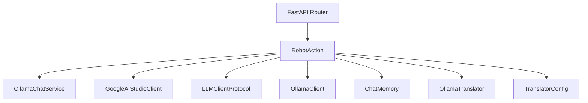
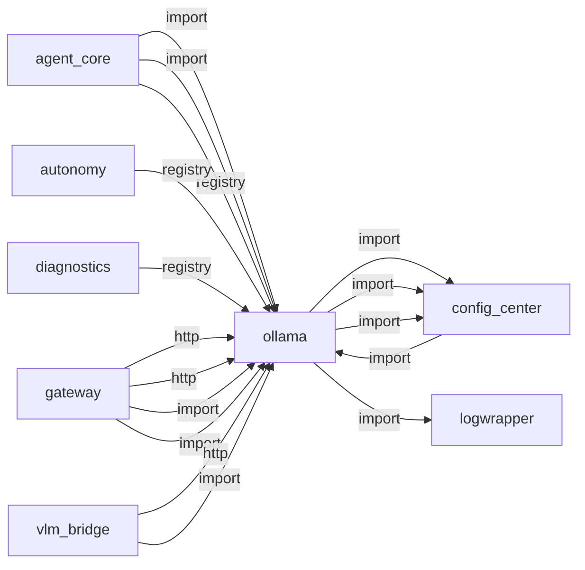
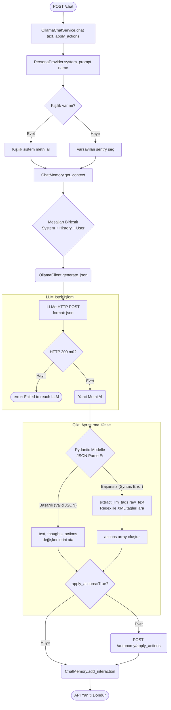
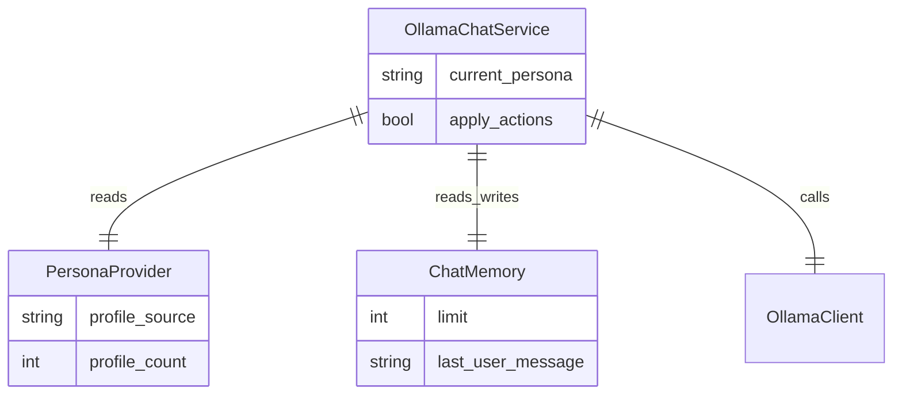

# ollama

> **Ollama LLM chat, persona yönetimi, JSON/XML parse**

## Kimlik
| Alan | Değer |
| --- | --- |
| Ana sınıf | `RobotAction` |
| Giriş noktası | `create_app()` |
| Orkestratör | `—` |
| Ana dosya | `modules/ollama/xOllamaService.py` |
| Katman | AI/RAG |
| Port | 8099 |
| Arduino | Hayır |
| Sınıf sayısı | 11 |
| Endpoint sayısı | 12 |

## İsimlendirilmiş Bileşenler (Sınıflar)

#### `RobotAction` — `modules/ollama/models/sentry_schema.py`
- **Görev:** —
- **Kalıtım:** BaseModel
- **Oluşturduğu bileşenler:** —
- **Metodlar:** —

#### `SentryResponse` — `modules/ollama/models/sentry_schema.py`
- **Görev:** —
- **Kalıtım:** BaseModel
- **Oluşturduğu bileşenler:** —
- **Metodlar:** —

#### `OllamaChatService` — `modules/ollama/services/chat.py`
- **Görev:** —
- **Kalıtım:** —
- **Oluşturduğu bileşenler:** `ChatMemory`
- **Metodlar:** `chat()`

#### `GoogleAIStudioClient` — `modules/ollama/services/clients.py`
- **Görev:** Google AI Studio (Gemini) REST istemcisi.
- **Kalıtım:** —
- **Oluşturduğu bileşenler:** —
- **Metodlar:** `is_rate_limited()`, `rate_limit_remaining_s()`, `create_model()`, `pull_model()`, `list_models()`, `chat()`, `generate_with_image()`

#### `LLMClientProtocol` — `modules/ollama/services/clients.py`
- **Görev:** —
- **Kalıtım:** Protocol
- **Oluşturduğu bileşenler:** —
- **Metodlar:** `chat()`, `create_model()`, `pull_model()`, `list_models()`

#### `OllamaClient` — `modules/ollama/services/clients.py`
- **Görev:** —
- **Kalıtım:** —
- **Oluşturduğu bileşenler:** —
- **Metodlar:** `create_model()`, `pull_model()`, `list_models()`, `chat()`

#### `ChatMemory` — `modules/ollama/services/memory.py`
- **Görev:** —
- **Kalıtım:** —
- **Oluşturduğu bileşenler:** —
- **Metodlar:** `add_user()`, `add_assistant()`, `as_list()`

#### `OllamaTranslator` — `modules/ollama/services/translator.py`
- **Görev:** Small translation facade that uses Ollama chat with strict prompts.
- **Kalıtım:** —
- **Oluşturduğu bileşenler:** `TranslatorConfig`
- **Metodlar:** `normalize_lang()`, `detect_language()`, `translate()`, `to_bridge()`, `from_bridge()`

#### `TranslatorConfig` — `modules/ollama/services/translator.py`
- **Görev:** —
- **Kalıtım:** —
- **Oluşturduğu bileşenler:** —
- **Metodlar:** —


## API — Endpoint → Handler → Servis

| HTTP | Path | Handler | Çağırdığı servis | Açıklama |
| --- | --- | --- | --- | --- |
| GET | `/healthz` | `healthz()` | — | — |
| GET | `/chat` | `chat_get()` | — | Hot-adjust default generation horizon for routed chat completions. |
| POST | `/chat` | `chat_post()` | — | Hot-adjust default generation horizon for routed chat completions. |
| POST | `/translate` | `translate()` | — | Hot-adjust default generation horizon for routed chat completions. |
| POST | `/runtime/num_predict` | `runtime_num_predict()` | — | Hot-adjust default generation horizon for routed chat completions. |
| GET | `/persona` | `get_persona()` | — | Best-effort short call to warm model weights/KV cache. |
| GET | `/personas` | `list_personas()` | — | Best-effort short call to warm model weights/KV cache. |
| GET | `/models` | `list_models()` | — | Best-effort short call to warm model weights/KV cache. |
| POST | `/warmup` | `warmup()` | — | Best-effort short call to warm model weights/KV cache. |
| POST | `/model/add` | `add_model()` | — | — |
| POST | `/persona/select` | `select_persona()` | — | \n{raw_content}\n |
| POST | `/persona/create_from_url` | `create_persona_from_url()` | — | — |

## Config Bölümleri
- `server`
- `llm`
- `ollama`
- `google_ai_studio`
- `persona`
- `actions`
- `translation`

## Dış İlişkiler (Bu modül → diğerleri)

| Hedef modül | Bağlantı tipi | Detay | Neden |
| --- | --- | --- | --- |
| [[config_center]] | import | log_redact | LLM model ve persona ayarlarını merkezi config'den okur. |
| [[config_center]] | import | agent_yaml_loader | LLM model ve persona ayarlarını merkezi config'den okur. |
| [[config_center]] | import | gemini_model | LLM model ve persona ayarlarını merkezi config'den okur. |
| [[logwrapper]] | import | init_logging | `ollama` → `logwrapper`: Merkezi WebSocket log yayınına bağlanır. |

## Gelen İlişkiler (Diğerleri → bu modül)

| Kaynak modül | Bağlantı tipi | Detay | Neden |
| --- | --- | --- | --- |
| [[agent_core]] | import | services | Router ve Persona katmanı LLM çıkarımı için Ollama kullanır. |
| [[agent_core]] | import | config_loader | Router ve Persona katmanı LLM çıkarımı için Ollama kullanır. |
| [[agent_core]] | registry | registry dependency: ollama, autonomy | Router ve Persona katmanı LLM çıkarımı için Ollama kullanır. |
| [[autonomy]] | registry | registry dependency: ollama, speak, vlm_bridge, arduino_serial | Duygu motoru ve karar üretimi için yerel LLM'e sorar. |
| [[config_center]] | import | services | `config_center` kod içinde `ollama` modülünü import eder (`services`) — Ollama LLM chat, persona yönetimi, JSON/XML parse. |
| [[diagnostics]] | registry | registry dependency: arduino_serial, camera, ollama | Ollama servis erişilebilirlik testi yapar. |
| [[gateway]] | http | calls path `/ollama/healthz` | `gateway` → `ollama`: Yerel LLM sohbet/completion isteği yapar. |
| [[gateway]] | http | calls path `/ollama` | `gateway` → `ollama`: Yerel LLM sohbet/completion isteği yapar. |
| [[gateway]] | import | config_loader | `gateway` kod içinde `ollama` modülünü import eder (`config_loader`) — Ollama LLM chat, persona yönetimi, JSON/XML parse. |
| [[gateway]] | import | api | `gateway` kod içinde `ollama` modülünü import eder (`api`) — Ollama LLM chat, persona yönetimi, JSON/XML parse. |
| [[vlm_bridge]] | http | calls path `/ollama/chat` | Remote VLM veya scene caption için LLM'e danışır. |
| [[vlm_bridge]] | import | services | Remote VLM veya scene caption için LLM'e danışır. |
| [[vlm_bridge]] | import | config_loader | Remote VLM veya scene caption için LLM'e danışır. |
| [[vlm_bridge]] | registry | registry dependency: camera, arduino_serial, ollama | Remote VLM veya scene caption için LLM'e danışır. |

## İç Mimari (otomatik çıkarım)



## Modül Etkileşim Haritası



### Mimari diyagram 1


### Mimari diyagram 2


---

# Tam Kaynak Arşivi

### `modules/ollama/README.md` (61 satır)

```markdown
# Ollama Module

Central LLM gateway for SentryBOT. Provides FastAPI endpoints to chat with an Ollama model using configurable personas.

## Endpoints
- GET /ollama/healthz
- GET/POST /ollama/chat?query=...
	- **Structured Mode**: `structured=true` parametresi ile `SentryResponse` Pydantic şemasına zorlanmış JSON döner: `{ text: "...", thoughts: "...", actions: [...] }`.
	- **Normal Mode**: Geriye dönük uyumluluk için `answer` (text) ve `raw` alanlarını içeren bir yapı döner.
	- `apply_actions=true` sorgu parametresi gönderilirse, `actions` alanı Autonomy servisinin `/autonomy/apply_actions` ucuna iletilir.

## Supported Actions (Hardware & System)
Ollama artık robotu aşağıdaki aksiyon türleri ile kontrol edebilir:
- `servo`: Kafa hareketi (pan/tilt).
- `lights`: NeoPixel animasyonları (mode, emotions, intensity).
- `laser`: Lazer kontrolü (id, on, both).
- `buzzer` / `sound_play`: Sesli uyarılar.
- `system`: Modül kontrolü (`notifier`, `camera`, `autonomy`).
- `speak`: Özel tonlama gerektiren sesli yanıtlar.
- `anim`: Hazır animasyon sekansları.
- `stand` / `sit` / `home`: Pozisyon komutları.
- GET /ollama/persona
- GET /ollama/personas
- GET /ollama/models
- POST /ollama/model/add (name, set_default)
- POST /ollama/persona/select (name)
- POST /ollama/persona/create_from_url (name, url)

## Config
This module now reads only central config/agent.yaml.

Required sections:
- agent
- llm
- ollama
- ollama_service

Strict policy:
- provider must be ollama
- model must be qwen3.5:9b

Optional path override:
- Set AGENT_CFG to a custom agent.yaml path.

In single-model mode, `POST /ollama/persona/select` does not create per-persona models; it only updates active persona text/prompt context.

Personas now live as folders: `modules/ollama/config/personalities/<name>/{persona.txt,urls.txt}`.

## Run
This module is meant to be imported by other modules (e.g., interactions, speech). It can also run as a service via `python -m modules.ollama.xOllamaService`.

## Integration contract (other modules)
- Speech: send recognized text → call `POST /ollama/chat` → receive `answer` (string)
	- Then pass `answer` to Speak module `/speak/say` for TTS.
	- Interactions/Neopixel: `actions.blocks` alanını kullanarak LED / servo değişikliklerini otomatik tetikleyebilir veya `apply_actions=true` ile Autonomy'ye devredebilirsiniz.
- Camera: can request `answer` for descriptions or next actions; not directly dependent.

All persona handling is centralized here; modules should not embed prompts. Use persona select to switch tone/role globally.

## Gateway ile Kullanım
Gateway çalışırken bu uçlar tek portta `/ollama/*` altında sunulur; modülü ayrı servis olarak çalıştırmaya gerek yoktur.
```

### `modules/ollama/__init__.py` (3 satır)

```python
__all__ = ["create_app", "get_router"]
from .xOllamaService import create_app  # type: ignore
from .api import get_router  # type: ignore
```

### `modules/ollama/api/__init__.py` (1 satır)

```python
from .router import get_router  # noqa: F401
```

### `modules/ollama/api/router.py` (365 satır)

```python
from __future__ import annotations
import logging
import os

from fastapi import APIRouter, HTTPException, Query
from typing import Optional, List, Dict, Any
import requests

try:
    from ..services.clients import create_llm_client
    from ..services.chat import OllamaChatService
    from ..services.translator import OllamaTranslator
except Exception:
    # Fallback: prefer explicit absolute module path to avoid ambiguous bare imports
    from modules.ollama.services.clients import create_llm_client  # type: ignore
    from modules.ollama.services.chat import OllamaChatService  # type: ignore
    from modules.ollama.services.translator import OllamaTranslator  # type: ignore


def _persona_dir(cfg: dict, name: Optional[str] = None) -> str:
    pdir = str(cfg.get("persona", {}).get("dir", "modules/ollama/config/personalities"))
    pname = name or str(cfg.get("persona", {}).get("default", "sentry"))
    return os.path.join(pdir, pname)


def _load_persona_text(cfg: dict, name: Optional[str] = None) -> str:
    pdir = _persona_dir(cfg, name)
    path = os.path.join(pdir, "persona.txt")
    if not os.path.exists(path):
        return "You are a helpful assistant."
    with open(path, "r", encoding="utf-8") as f:
        return "".join([line for line in f if len(line.strip()) > 0 and not line.strip().startswith("#")])


logger = logging.getLogger("ollama.api")


def _should_use_persona_model(
    provider_name: str,
    single_model_mode: bool,
    use_persona_models: bool,
) -> bool:
    return (
        str(provider_name or "").strip().lower() == "ollama"
        and not bool(single_model_mode)
        and bool(use_persona_models)
    )


def get_router(cfg: dict) -> APIRouter:
    r = APIRouter(prefix="/ollama", tags=["ollama"])
    llm_cfg = cfg.get("llm", {}) if isinstance(cfg.get("llm", {}), dict) else {}
    single_model_mode = bool(llm_cfg.get("single_model_mode", True))
    use_persona_models = bool(llm_cfg.get("use_persona_models", False))

    llm_provider_requested = str(llm_cfg.get("provider", "ollama")).strip().lower()
    provider_name = "ollama"
    try:
        client, provider_name = create_llm_client(cfg)
    except Exception as exc:
        if llm_provider_requested in {"google", "google_ai_studio", "gemini"}:
            logger.error(
                "Google AI Studio init failed — set config/agent.yaml google_ai_studio.api_key "
                "or export GOOGLE_API_KEY (profile must not use empty api_key). Error: %s",
                exc,
            )
        logger.warning("LLM provider init failed, fallback to ollama: %s", exc)
        fallback_cfg = {
            "llm": {"provider": "ollama"},
            "ollama": cfg.get("ollama", {}) or {},
        }
        client, provider_name = create_llm_client(fallback_cfg)

    model = str(getattr(client, "model", cfg.get("ollama", {}).get("model", "unknown")))
    translator = OllamaTranslator(client, cfg.get("translation", {}) or {})
    actions_cfg = cfg.get("actions", {}) or {}
    action_endpoint = str(actions_cfg.get("endpoint", "")).strip()
    action_timeout = float(actions_cfg.get("timeout", 1.5))
    default_apply = bool(actions_cfg.get("default_apply", False))

    active_persona = str(cfg.get("persona", {}).get("default", "sentry"))
    persona_text = _load_persona_text(cfg, active_persona)
    _ollama_num_predict = int(cfg.get("ollama", {}).get("num_predict", 100))
    chat = OllamaChatService(
        client,
        persona_name=active_persona,
        max_history=6,
        use_persona_as_model=_should_use_persona_model(provider_name, single_model_mode, use_persona_models),
        num_predict=_ollama_num_predict,
    )
    # Preload persona texts and optional urls placeholders
    _persona_cache: Dict[str, str] = {}
    base_persona_dir = str(cfg.get("persona", {}).get("dir", "modules/ollama/config/personalities"))
    if os.path.exists(base_persona_dir):
        for name in os.listdir(base_persona_dir):
            pdir = os.path.join(base_persona_dir, name)
            if not os.path.isdir(pdir):
                continue
            _persona_cache[name] = _load_persona_text(cfg, name)
            urls_path = os.path.join(pdir, "urls.txt")
            if not os.path.exists(urls_path):
                try:
                    open(urls_path, "a", encoding="utf-8").close()
                except Exception:
                    pass

    @r.get("/healthz")
    def healthz():
        info: Dict[str, Any] = {"ok": True, "provider": provider_name, "model": model}
        if provider_name == "ollama":
            base = str(cfg.get("ollama", {}).get("base_url", "http://127.0.0.1:11434")).rstrip("/")
            info["base_url"] = base
            try:
                resp = requests.get(f"{base}/api/tags", timeout=2.0)
                info["daemon_ok"] = resp.status_code == 200
                info["ok"] = bool(info["daemon_ok"])
            except Exception as exc:
                info["daemon_ok"] = False
                info["ok"] = False
                info["error"] = str(exc)
        elif provider_name == "google_ai_studio":
            gcfg = cfg.get("google_ai_studio", {}) if isinstance(cfg.get("google_ai_studio", {}), dict) else {}
            info["base_url"] = str(gcfg.get("base_url", "https://generativelanguage.googleapis.com"))
            info["api_key_configured"] = bool(str(gcfg.get("api_key", "")).strip() or os.getenv("GOOGLE_API_KEY"))
            info["ok"] = bool(info["api_key_configured"])
        return info

    def _format_chat_payload(result: Dict[str, Any], translation: Optional[Dict[str, Any]] = None) -> Dict[str, Any]:
        payload: Dict[str, Any] = {
            "ok": True, 
            "answer": result.get("text", ""),
            "text": result.get("text", ""),
            "thoughts": result.get("thoughts", ""),
            "persona": active_persona,
            "model": model,
            "provider": provider_name,
        }
        if result.get("actions"):
            payload["actions"] = result["actions"]
        if "raw" in result:
            payload["raw"] = result.get("raw")
        if translation:
            payload["translation"] = translation
        return payload

    def _maybe_dispatch_actions(result: Dict[str, Any], apply_flag: bool) -> None:
        if not apply_flag or not action_endpoint:
            return
        actions = result.get("actions")
        if not actions:
            return
        payload = {
            "text": result.get("text", ""),
            "raw": result.get("raw"),
            "actions": actions,
            "speak": False,
        }
        try:
            requests.post(action_endpoint, json=payload, timeout=action_timeout)
        except Exception as exc:  # pragma: no cover - ağ hatası
            logger.warning("Failed to dispatch persona actions: %s", exc)

    def _chat_response(
        query: str,
        apply_actions: Optional[bool],
        source_lang: Optional[str],
        response_lang: Optional[str],
    ) -> Dict[str, Any]:
        source = translator.normalize_lang(source_lang, fallback=translator.cfg.default_source_lang)
        if source == "auto":
            source = translator.detect_language(query)
        target = translator.normalize_lang(response_lang or source, fallback=translator.cfg.default_source_lang)
        query_en = translator.to_bridge(query, source)

        try:
            result = chat.chat(query_en)
        except requests.HTTPError as exc:
            from modules.config_center.log_redact import redact_secrets

            logger.warning("LLM upstream request failed: %s", redact_secrets(exc))
            raise HTTPException(status_code=502, detail="LLM upstream request failed") from exc
        except Exception as exc:
            logger.exception("LLM chat failed: %s", exc)
            raise HTTPException(status_code=500, detail="LLM chat failed") from exc

        answer_en = str(result.get("text", ""))
        localized_answer = translator.from_bridge(answer_en, target)
        result["text"] = localized_answer

        flag = default_apply if apply_actions is None else apply_actions
        _maybe_dispatch_actions(result, flag)

        translation_meta = {
            "enabled": bool(translator.cfg.enabled),
            "request_lang": source,
            "bridge_lang": translator.BRIDGE_LANG,
            "response_lang": target,
            "query_bridge": query_en,
            "answer_bridge": answer_en,
            "auto_detected": bool(source_lang and str(source_lang).strip().lower() == "auto"),
        }
        return _format_chat_payload(result, translation=translation_meta)

    @r.get("/chat")
    def chat_get(
        query: str = Query(...),
        apply_actions: Optional[bool] = None,
        structured: bool = False,
        source_lang: Optional[str] = None,
        response_lang: Optional[str] = None,
    ):
        return _chat_response(query, apply_actions, source_lang, response_lang)

    @r.post("/chat")
    def chat_post(
        query: str,
        apply_actions: Optional[bool] = None,
        structured: bool = False,
        source_lang: Optional[str] = None,
        response_lang: Optional[str] = None,
    ):
        return _chat_response(query, apply_actions, source_lang, response_lang)

    @r.post("/translate")
    def translate(text: str, source_lang: str = "auto", target_lang: str = "en"):
        source = translator.normalize_lang(source_lang, fallback=translator.cfg.default_source_lang)
        target = translator.normalize_lang(target_lang, fallback=translator.BRIDGE_LANG)
        if source_lang == "auto":
            source = translator.detect_language(text)
        out = translator.translate(text, source, target)
        return {"ok": True, "text": out, "source_lang": source, "target_lang": target}

    @r.post("/runtime/num_predict")
    def runtime_num_predict(body: Dict[str, Any]):
        """Hot-adjust default generation horizon for routed chat completions."""
        np_raw = body.get("num_predict")
        if np_raw is None:
            raise HTTPException(status_code=400, detail="num_predict required")
        try:
            np_val = max(48, int(np_raw))
        except (TypeError, ValueError) as exc:
            raise HTTPException(status_code=400, detail=f"invalid num_predict: {exc}") from exc
        chat.num_predict = np_val
        return {"ok": True, "num_predict": chat.num_predict}

    @r.get("/persona")
    def get_persona():
        return {"ok": True, "active": active_persona, "persona": persona_text[:4096]}

    @r.get("/personas")
    def list_personas() -> dict:
        base = str(cfg.get("persona", {}).get("dir", "modules/ollama/config/personalities"))
        items: List[str] = []
        if os.path.exists(base):
            for name in os.listdir(base):
                if os.path.isdir(os.path.join(base, name)):
                    items.append(name)
        return {"ok": True, "items": items, "active": active_persona}

    @r.get("/models")
    def list_models() -> Dict[str, Any]:
        if provider_name != "ollama":
            return {"ok": False, "provider": provider_name, "items": [], "error": "model listing is only supported for ollama provider"}
        items = client.list_models()
        return {"ok": True, "provider": provider_name, "items": items, "active": model}

    @r.post("/warmup")
    def warmup() -> Dict[str, Any]:
        """Best-effort short call to warm model weights/KV cache."""
        try:
            _ = chat.chat("ok")
            return {"ok": True}
        except Exception as exc:
            logger.debug("Warmup failed: %s", exc)
            return {"ok": False, "error": str(exc)}

    @r.post("/model/add")
    def add_model(name: str, set_default: bool = True) -> Dict[str, Any]:
        nonlocal model
        if provider_name != "ollama":
            return {"ok": False, "provider": provider_name, "error": "model add is only supported for ollama provider"}

        model_name = str(name or "").strip()
        if not model_name:
            return {"ok": False, "error": "model name is required"}

        pulled = client.pull_model(model_name)
        if not pulled:
            return {"ok": False, "error": f"failed to pull model '{model_name}'"}

        if set_default:
            cfg.setdefault("ollama", {})["model"] = model_name
            model = model_name
            if hasattr(client, "model"):
                setattr(client, "model", model_name)

        return {
            "ok": True,
            "provider": provider_name,
            "model": model_name,
            "set_default": bool(set_default),
            "default_model": str(cfg.get("ollama", {}).get("model", model_name)),
            "available": client.list_models(),
        }

    @r.post("/persona/select")
    def select_persona(name: str):
        nonlocal persona_text, chat, active_persona
        pdir = _persona_dir(cfg, name)
        path = os.path.join(pdir, "persona.txt")
        if not os.path.exists(path):
            return {"ok": False, "error": "persona not found"}
        
        active_persona = str(name)
        raw_content = _load_persona_text(cfg, name)
        
        # Hybrid Modelfile Detection
        if "FROM " in raw_content and "SYSTEM " in raw_content:
            modelfile = raw_content
        else:
            # Wrap legacy persona in a default template
            base_model = str(cfg.get("ollama", {}).get("model", "qwen3.5:9b"))
            modelfile = f'FROM {base_model}\nSYSTEM """\n{raw_content}\n"""'

        success = False
        if provider_name == "ollama" and not single_model_mode and use_persona_models:
            # Create/Update persona model only for Ollama provider.
            success = client.create_model(name, modelfile)
            if not success:
                logger.error(f"Failed to create model for persona {name}")
        elif provider_name == "ollama":
            logger.info("Persona model creation disabled (single_model_mode/use_persona_models) for '%s'.", name)
            
        persona_text = raw_content
        _persona_cache[name] = persona_text
        chat = OllamaChatService(
            client,
            persona_name=active_persona,
            max_history=6,
            use_persona_as_model=_should_use_persona_model(provider_name, single_model_mode, use_persona_models),
            num_predict=_ollama_num_predict,
        )
        return {
            "ok": True,
            "active": name,
            "provider": provider_name,
            "model_created": success if provider_name == "ollama" else None,
            "single_model_mode": single_model_mode,
        }

    @r.post("/persona/create_from_url")
    def create_persona_from_url(name: str, url: str):
        base = str(cfg.get("persona", {}).get("dir", "modules/ollama/config/personalities"))
        pdir = os.path.join(base, name)
        os.makedirs(pdir, exist_ok=True)
        resp = requests.get(url)
        resp.raise_for_status()
        with open(os.path.join(pdir, "persona.txt"), "w", encoding="utf-8") as f:
            f.write(resp.text)
        # create empty urls placeholder
        open(os.path.join(pdir, "urls.txt"), "a", encoding="utf-8").close()
        return {"ok": True, "name": name}

    return r
```

### `modules/ollama/architecture_ollama.md` (94 satır)

```markdown
# Ollama Modülü Mimarisi

Ollama modülü (`modules/ollama`), robotun yerel LLM (Büyük Dil Modeli) ile olan tüm metinsel etkileşimlerini yönetir. Kişilik yapılandırmalarını uygular ve çıktıların donanım tarafından anlaşılabilecek (JSON) formatta üretilmesini garantiler.

## 🏗️ İş Akışı ve Karar Mekanizmaları (Flowchart)

Sohbetin nasıl gerçekleştiğini, sistem promptunun nasıl oluşturulduğunu ve yapılamayan/hatalı JSON formatlı çıktıların nasıl yedek (fallback) bir ayrıştırıcıya (`extract_llm_tags`) düştüğünü gösteren diyagram:


## 🔄 İlişkisel Etkileşimler (Veri Akışı)


## ⚙️ Detaylı Karar Mantığı (if/else)

1. **`PersonaProvider.system_prompt(name)`**
   - **`if`** ilgili kişilik YAML dosyası mevcutsa (örn: `sentry.yml`), içerik okunup (isim, stil, kısıtlamalar) bir metne dönüştürülür.
   - **`else`**: Basit bir fallback "Sen bir asistansın" promptu döner.
2. **`OllamaClient` Bağlantısı Hata Yönetimi**
   - **`try/except`**: HTTP isteği sırasında sunucu kapalıysa veya zaman aşımı olursa (Ollama yüklü değilse), sistem çökmez, geriye `None` ve log bilgisi döner.
3. **Pydantic Fallback Sistemi**
   - LLM'ler her zaman düzgün JSON üretmeyebilir (özellikle küçük modeller).
   - **`if`** `json.loads(response)` patlarsa veya Pydantic model doğrulaması geçemezse:
     - Düz metin (`raw_text`) kabul edilir.
     - **`extract_llm_tags(text)`** modülü devreye girer. XML stili `<speak>...</speak>`, `<lights effect="breathe">...</lights>` etiketlerini `regex` (düzenli ifadeler) ile bulur ve bunları zorla `actions` JSON dizisine çevirir. Kalan metin `text` (kullanıcıya görünen) kısmı olur.
4. **`apply_actions` Kararı**
   - `chat` fonksiyonu çağrılırken `apply_actions=True` verilmişse (genelde Autonomy Brain yapıyor), Ollama modülü JSON çıktısını alıp doğrudan uygulamasını istemek için Autonomy servisine HTTP POST atar. Eğer `False` ise (sadece metin sorulmuşsa / API'den deneniyorsa) hiçbir motor hareketine dönüşmez, sadece metin döner.
```

### `modules/ollama/config/config.yml` (29 satır)

```yaml
server:
  host: 0.0.0.0
  port: 8099
llm:
  provider: ollama   # ollama | google_ai_studio
  single_model_mode: true      # Keep one base model; do not create persona-derived models
  use_persona_models: false    # Disable legacy persona model injection
ollama:
  base_url: http://127.0.0.1:11434
  model: qwen3.5:9b
  request_timeout: 15
  num_predict: 100          # Fast mode default — kısa cevaplar
google_ai_studio:
  api_key: ""        # boşsa GOOGLE_API_KEY env kullanılır
  model: gemini-3.1-flash-lite-preview
  base_url: https://generativelanguage.googleapis.com
  request_timeout: 20
persona:
  default: sentry
  dir: modules/ollama/config/personalities
actions:
  endpoint: http://localhost:8080/autonomy/apply_actions
  default_apply: true
  timeout: 1.5
translation:
  enabled: true
  default_source_lang: tr
  model: ""
  cache_size: 128
```

### `modules/ollama/config/personalities/sentry/persona.txt` (5 satır)

```text
Legacy persona file for compatibility.

This file is intentionally minimal in the new tri-layer architecture.
Do not force identity, roleplay, or JSON-only response formats from here.
Runtime behavior is controlled by Agent Core system prompts and tools.
```

### `modules/ollama/config/personalities/sentry/urls.txt` (0 satır)

```text

```

### `modules/ollama/config_loader.py` (158 satır)

```python
from __future__ import annotations

import os
from typing import Any, Dict

from modules.config_center.agent_yaml_loader import deep_merge, load_agent_config, require_dict_section
from modules.config_center.gemini_model import DEFAULT_GEMINI_MODEL

_REQUIRED_MODEL = "qwen3.5:9b"
_GOOGLE_PROVIDERS = frozenset({"google", "google_ai_studio", "gemini"})

_DEFAULT_CFG: Dict[str, Any] = {
    "server": {"host": "0.0.0.0", "port": 8099},
    "llm": {"provider": "ollama", "single_model_mode": True},
    "ollama": {"base_url": "http://127.0.0.1:11434", "model": _REQUIRED_MODEL, "request_timeout": 60.0},
    "google_ai_studio": {
        "api_key": "",
        "model": DEFAULT_GEMINI_MODEL,
        "base_url": "https://generativelanguage.googleapis.com",
        "request_timeout": 45.0,
    },
    "persona": {"default": "sentry", "dir": "modules/ollama/config/personalities"},
    "actions": {
        "endpoint": "http://localhost:8080/autonomy/apply_actions",
        "default_apply": True,
        "timeout": 1.5,
    },
    "translation": {
        "enabled": True,
        "default_source_lang": "tr",
        "model": "",
        "cache_size": 128,
    },
}


def _to_float(raw: Any, fallback: float) -> float:
    try:
        return float(raw)
    except (TypeError, ValueError):
        return fallback


def _pick_model(agent_cfg: Dict[str, Any], llm_cfg: Dict[str, Any], ollama_cfg: Dict[str, Any]) -> str:
    for candidate in (
        agent_cfg.get("model"),
        llm_cfg.get("model"),
        llm_cfg.get("primary_model"),
        ollama_cfg.get("model"),
    ):
        value = str(candidate or "").strip()
        if value:
            return value
    return ""


def _normalize_base_url(raw: Any) -> str:
    return str(raw or "").strip().rstrip("/")


def load_config(config_path: str | None = None) -> Dict[str, Any]:
    root_cfg = load_agent_config(config_path)

    agent_cfg = require_dict_section(root_cfg, "agent")
    llm_cfg = require_dict_section(root_cfg, "llm")
    ollama_global = require_dict_section(root_cfg, "ollama")
    service_cfg = require_dict_section(root_cfg, "ollama_service")
    google_global = root_cfg.get("google_ai_studio", {})
    if not isinstance(google_global, dict):
        google_global = {}

    provider = str(llm_cfg.get("provider", "")).strip().lower() or "ollama"
    request_timeout = _to_float(
        ollama_global.get("request_timeout", agent_cfg.get("request_timeout", 60.0)),
        60.0,
    )

    if provider in _GOOGLE_PROVIDERS:
        model = (
            str(google_global.get("model", "")).strip()
            or _pick_model(agent_cfg, llm_cfg, ollama_global)
            or DEFAULT_GEMINI_MODEL
        )
        google_timeout = _to_float(google_global.get("request_timeout", request_timeout), request_timeout)
        core_cfg: Dict[str, Any] = {
            "llm": {
                "provider": "google_ai_studio",
                "single_model_mode": True,
                "model": model,
                "primary_model": model,
            },
            "google_ai_studio": {
                **google_global,
                "model": model,
                "request_timeout": google_timeout,
            },
            "ollama": {
                "base_url": _normalize_base_url(
                    agent_cfg.get("ollama_base_url")
                    or ollama_global.get("base_url")
                    or os.getenv("AGENT_OLLAMA_BASE_URL")
                    or "http://127.0.0.1:11434"
                ),
                "model": _REQUIRED_MODEL,
                "request_timeout": request_timeout,
            },
        }
    else:
        model = _pick_model(agent_cfg, llm_cfg, ollama_global)
        if model != _REQUIRED_MODEL:
            raise ValueError(
                f"Ollama profile requires model '{_REQUIRED_MODEL}', got '{model or '<empty>'}'"
            )

        base_url = _normalize_base_url(
            agent_cfg.get("ollama_base_url")
            or llm_cfg.get("base_url")
            or ollama_global.get("base_url")
            or os.getenv("AGENT_OLLAMA_BASE_URL")
            or "http://127.0.0.1:11434"
        )
        if not base_url:
            raise ValueError("agent.ollama_base_url is required")

        core_cfg = {
            "llm": {
                "provider": "ollama",
                "single_model_mode": True,
                "model": _REQUIRED_MODEL,
                "primary_model": _REQUIRED_MODEL,
                "base_url": base_url,
            },
            "ollama": {
                "base_url": base_url,
                "model": _REQUIRED_MODEL,
                "request_timeout": request_timeout,
            },
            "google_ai_studio": google_global,
        }

    merged = deep_merge(_DEFAULT_CFG, service_cfg)
    merged = deep_merge(merged, core_cfg)

    if provider in _GOOGLE_PROVIDERS:
        trans = merged.get("translation", {})
        if isinstance(trans, dict):
            merged["translation"] = {**trans, "enabled": False}

    google_cfg = merged.get("google_ai_studio", {})
    if isinstance(google_cfg, dict):
        key = str(google_cfg.get("api_key", "")).strip()
        if not key:
            env_key = str(os.getenv("GOOGLE_API_KEY", "")).strip()
            if env_key:
                google_cfg = {**google_cfg, "api_key": env_key}
                merged["google_ai_studio"] = google_cfg

    return merged
```

### `modules/ollama/models/sentry_schema.py` (11 satır)

```python
from pydantic import BaseModel, Field
from typing import List, Dict, Any, Optional

class RobotAction(BaseModel):
    type: str = Field(..., description="Action category: 'servo', 'lights', 'anim', 'event', 'speak', 'buzzer', 'laser', 'stepper', 'system', 'stand', 'sit', 'home'. NEVER use 'hardware'.")
    attrs: Dict[str, Any] = Field(default_factory=dict, description="Parameters for the action (e.g., {'pan': 90} for servo)")

class SentryResponse(BaseModel):
    text: str = Field(..., min_length=1, description="MANDATORY: Your spoken response as SentryBOT (Turkish). No empty strings.")
    thoughts: str = Field(..., min_length=1, description="MANDATORY: Your internal reasoning or state evaluation.")
    actions: List[RobotAction] = Field(default_factory=list, description="List of physical or system actions to execute.")
```

### `modules/ollama/requirements.txt` (5 satır)

```text
fastapi
uvicorn
requests
ollama
langdetect
```

### `modules/ollama/services/chat.py` (51 satır)

```python
from __future__ import annotations
from typing import Dict, List, Optional, Any
import logging
from .clients import LLMClientProtocol
from .memory import ChatMemory

logger = logging.getLogger("ollama.chat")


class OllamaChatService:
    def __init__(
        self,
        client: LLMClientProtocol,
        persona_name: str = "sentry",
        max_history: int = 6,
        use_persona_as_model: bool = True,
        num_predict: int = 100,
    ) -> None:
        self.client = client
        self.persona_name = persona_name
        self.memory = ChatMemory(max_turns=max_history)
        self.use_persona_as_model = bool(use_persona_as_model)
        self.num_predict = int(num_predict)

    def chat(
        self,
        query: str,
        extra_history: Optional[List[Dict[str, str]]] = None,
        response_format: Optional[Any] = None,
    ) -> Dict[str, Any]:
        """
        Chat with the active model. 
        Identity is baked into the model via Modelfile, so no system prompt injection here.
        """
        messages: List[Dict[str, str]] = []
        if extra_history:
            messages.extend(extra_history)
        messages.extend(self.memory.as_list())
        messages.append({"role": "user", "content": query})
        
        model_name = self.persona_name if self.use_persona_as_model else None
        options: Dict[str, Any] = {"num_predict": self.num_predict}
        res = self.client.chat(messages, format=response_format, model=model_name, options=options)
        raw_text = str(res.get("message", {}).get("content", ""))
        
        # Native unstructured conversation
        self.memory.add_user(query)
        self.memory.add_assistant(raw_text)

        payload: Dict[str, Any] = {"text": raw_text, "raw": raw_text}
        return payload
```

### `modules/ollama/services/clients.py` (436 satır)

```python
from __future__ import annotations
import logging
import os
import time
from typing import Any, Dict, List, Optional, Protocol, Tuple

import requests

from modules.config_center.gemini_model import DEFAULT_GEMINI_MODEL
from modules.config_center.log_redact import redact_secrets

try:
    from ollama import Client  # type: ignore
except Exception:  # pragma: no cover
    Client = None  # type: ignore


logger = logging.getLogger("ollama.clients")

_GOOGLE_API_KEY_PLACEHOLDERS = {
    "your-google-api-key",
    "your_google_api_key",
    "your-api-key",
    "changeme",
    "replace_me",
    "replace-with-your-key",
}


def _sanitize_google_api_key(raw_value: Any) -> str:
    value = str(raw_value or "").strip()
    if not value:
        return ""
    lowered = value.lower()
    if lowered in _GOOGLE_API_KEY_PLACEHOLDERS:
        return ""
    if "your-google-api-key" in lowered:
        return ""
    return value


class OllamaClient:
    def __init__(self, base_url: str, model: str, request_timeout: float = 60.0) -> None:
        self.base_url = base_url.rstrip("/")
        self.model = model
        self.timeout = request_timeout

        # Prefer the official python client when available, but keep a pure-HTTP
        # fallback so the gateway can call a remote Ollama server without extra deps.
        self._client = Client(host=self.base_url) if Client is not None else None

    def create_model(self, name: str, modelfile: str) -> bool:
        """Create a new model from a Modelfile string."""
        url = f"{self.base_url}/api/create"
        payload = {
            "name": name,
            "modelfile": modelfile,
            "stream": False
        }
        try:
            resp = requests.post(url, json=payload, timeout=float(self.timeout * 2))
            resp.raise_for_status()
            logger.info(f"Ollama model '{name}' created/updated successfully.")
            return True
        except Exception as e:
            logger.error(f"Failed to create Ollama model '{name}': {e}")
            return False

    def pull_model(self, name: str) -> bool:
        """Pull model weights from registry into the target Ollama host."""
        model_name = str(name or "").strip()
        if not model_name:
            return False

        url = f"{self.base_url}/api/pull"
        payload = {"name": model_name, "stream": False}
        try:
            resp = requests.post(url, json=payload, timeout=float(self.timeout * 4))
            resp.raise_for_status()
            logger.info("Ollama model '%s' pulled successfully.", model_name)
            return True
        except Exception as e:
            logger.error("Failed to pull Ollama model '%s': %s", model_name, e)
            return False

    def list_models(self) -> List[str]:
        """List model names available on the target Ollama host."""
        url = f"{self.base_url}/api/tags"
        try:
            resp = requests.get(url, timeout=float(self.timeout))
            resp.raise_for_status()
            data = resp.json() if resp.content else {}
        except Exception as e:
            logger.error("Failed to list Ollama models: %s", e)
            return []

        items = data.get("models", []) if isinstance(data, dict) else []
        names: List[str] = []
        for item in items:
            if not isinstance(item, dict):
                continue
            name = str(item.get("name", "")).strip()
            if name:
                names.append(name)
        return names

    def chat(
        self,
        messages: List[Dict[str, str]],
        format: Optional[Any] = None,
        *,
        options: Optional[Dict[str, Any]] = None,
        model: Optional[str] = None,
    ) -> Dict[str, Any]:
        selected_model = model or self.model
        merged_options: Dict[str, Any] = {"temperature": 0.6}
        if isinstance(options, dict):
            merged_options.update(options)

        if self._client is not None:
            return self._client.chat(
                model=selected_model,
                messages=messages,
                format=format,
                options=merged_options,
            )

        # HTTP fallback (Ollama REST API)
        # Ref: POST {base_url}/api/chat
        url = f"{self.base_url}/api/chat"
        payload: Dict[str, Any] = {
            "model": selected_model,
            "messages": messages,
            "stream": False,
            "format": format,
            "options": merged_options,
        }
        resp = requests.post(url, json=payload, timeout=float(self.timeout))
        resp.raise_for_status()
        data = resp.json()
        # Normalize shape to match python client expectations used elsewhere.
        if isinstance(data, dict) and "message" in data:
            return data
        # Some proxies/wrappers may respond in OpenAI-ish formats; do best-effort.
        if isinstance(data, dict) and "choices" in data:
            try:
                content = data["choices"][0]["message"]["content"]
            except Exception:
                content = ""
            return {"message": {"content": content}, "raw": data}
        return {"message": {"content": str(data)}, "raw": data}


class LLMClientProtocol(Protocol):
    model: str

    def chat(
        self,
        messages: List[Dict[str, str]],
        format: Optional[Any] = None,
        *,
        options: Optional[Dict[str, Any]] = None,
        model: Optional[str] = None,
    ) -> Dict[str, Any]:
        ...

    def create_model(self, name: str, modelfile: str) -> bool:
        ...

    def pull_model(self, name: str) -> bool:
        ...

    def list_models(self) -> List[str]:
        ...


class GoogleAIStudioClient:
    """Google AI Studio (Gemini) REST istemcisi."""

    _rate_limited_until_by_key: Dict[str, float] = {}
    _RATE_LIMIT_COOLDOWN_S: float = 90.0

    @staticmethod
    def _rate_bucket(api_key: str) -> str:
        key = str(api_key or "").strip()
        return key[-8:] if len(key) >= 8 else key or "default"

    @classmethod
    def is_rate_limited(cls, api_key: str = "") -> bool:
        if api_key:
            return time.time() < cls._rate_limited_until_by_key.get(cls._rate_bucket(api_key), 0.0)
        return any(time.time() < t for t in cls._rate_limited_until_by_key.values())

    @classmethod
    def rate_limit_remaining_s(cls, api_key: str = "") -> int:
        if api_key:
            until = cls._rate_limited_until_by_key.get(cls._rate_bucket(api_key), 0.0)
            return max(0, int(until - time.time()))
        if not cls._rate_limited_until_by_key:
            return 0
        latest = max(cls._rate_limited_until_by_key.values())
        return max(0, int(latest - time.time()))

    def _is_rate_limited(self) -> bool:
        return self.is_rate_limited(self.api_key)

    def _arm_rate_limit(self) -> None:
        self._rate_limited_until_by_key[self._rate_bucket(self.api_key)] = (
            time.time() + self._RATE_LIMIT_COOLDOWN_S
        )

    @staticmethod
    def _parse_api_error(resp: requests.Response) -> str:
        try:
            body = resp.json()
            if isinstance(body, dict):
                err = body.get("error", {})
                if isinstance(err, dict):
                    return redact_secrets(str(err.get("message", resp.text[:300])))
        except Exception:
            pass
        return redact_secrets(resp.text[:300])

    def __init__(
        self,
        api_key: str,
        model: str,
        base_url: str = "https://generativelanguage.googleapis.com",
        request_timeout: float = 60.0,
    ) -> None:
        self.api_key = api_key
        self.model = model
        self.base_url = base_url.rstrip("/")
        self.timeout = request_timeout

    @staticmethod
    def _to_gemini_parts(messages: List[Dict[str, str]]) -> Tuple[Optional[str], List[Dict[str, Any]]]:
        system_chunks: List[str] = []
        contents: List[Dict[str, Any]] = []

        for m in messages:
            role = str(m.get("role", "user"))
            text = str(m.get("content", ""))
            if not text.strip():
                continue

            if role == "system":
                system_chunks.append(text)
                continue

            gemini_role = "model" if role == "assistant" else "user"
            contents.append({"role": gemini_role, "parts": [{"text": text}]})

        system_instruction = "\n\n".join(system_chunks).strip() or None
        return system_instruction, contents

    def create_model(self, name: str, modelfile: str) -> bool:
        """Gemini doesn't support local Modelfile creation; skip or mock."""
        logger.warning("create_model is not supported on Google AI Studio.")
        return False

    def pull_model(self, name: str) -> bool:
        logger.warning("pull_model is not supported on Google AI Studio.")
        return False

    def list_models(self) -> List[str]:
        return []

    def chat(
        self,
        messages: List[Dict[str, str]],
        format: Optional[Any] = None,
        *,
        options: Optional[Dict[str, Any]] = None,
        model: Optional[str] = None,
    ) -> Dict[str, Any]:
        selected_model = str(model or self.model).strip() or self.model
        # Guard against accidental persona-name override (e.g. "sentry").
        if model and not (selected_model.lower().startswith("gemini") or selected_model.lower().startswith("gemma")):
            logger.warning(
                "Ignoring non-Gemini/non-Gemma model override for Google provider: %s",
                selected_model,
            )
            selected_model = self.model
        system_instruction, contents = self._to_gemini_parts(messages)

        if not contents:
            contents = [{"role": "user", "parts": [{"text": ""}]}]

        generation_config: Dict[str, Any] = {"temperature": 0.6}
        if isinstance(options, dict):
            if "temperature" in options:
                generation_config["temperature"] = options["temperature"]

        if isinstance(format, dict):
            generation_config["responseMimeType"] = "application/json"
            generation_config["responseSchema"] = format

        payload: Dict[str, Any] = {
            "contents": contents,
            "generationConfig": generation_config,
        }
        if system_instruction:
            payload["systemInstruction"] = {"parts": [{"text": system_instruction}]}

        url = f"{self.base_url}/v1beta/models/{selected_model}:generateContent"
        data = self._post_generate_content(url, payload)
        text = ""
        try:
            parts = data.get("candidates", [])[0].get("content", {}).get("parts", [])
            text = "\n".join(str(p.get("text", "")) for p in parts if isinstance(p, dict)).strip()
        except Exception:
            text = ""

        return {"message": {"content": text}, "raw": data}

    def _post_generate_content(self, url: str, payload: Dict[str, Any]) -> Dict[str, Any]:
        if self._is_rate_limited():
            raise RuntimeError(
                f"Gemini rate limited; retry in {self.rate_limit_remaining_s(self.api_key)}s"
            )
        backoff_s = (2.0, 5.0)
        last_exc: Optional[Exception] = None
        for attempt in range(len(backoff_s) + 1):
            try:
                resp = requests.post(
                    url,
                    params={"key": self.api_key},
                    json=payload,
                    timeout=float(self.timeout),
                )
                if resp.status_code == 429:
                    if attempt < len(backoff_s):
                        logger.warning(
                            "Gemini rate limited (429); retrying in %.0fs (attempt %d/%d)",
                            backoff_s[attempt],
                            attempt + 1,
                            len(backoff_s),
                        )
                        time.sleep(backoff_s[attempt])
                        continue
                    self._arm_rate_limit()
                    raise RuntimeError(
                        f"Gemini rate limited (429); cooldown {int(self._RATE_LIMIT_COOLDOWN_S)}s"
                    )
                if resp.status_code >= 400:
                    raise RuntimeError(
                        f"Gemini API {resp.status_code}: {self._parse_api_error(resp)}"
                    )
                return resp.json()
            except requests.HTTPError as exc:
                last_exc = exc
                if exc.response is not None and exc.response.status_code == 429:
                    if attempt < len(backoff_s):
                        time.sleep(backoff_s[attempt])
                        continue
                    self._arm_rate_limit()
                    raise RuntimeError(
                        f"Gemini rate limited (429); cooldown {int(self._RATE_LIMIT_COOLDOWN_S)}s"
                    ) from exc
                if exc.response is not None:
                    raise RuntimeError(
                        f"Gemini API {exc.response.status_code}: "
                        f"{self._parse_api_error(exc.response)}"
                    ) from exc
                raise RuntimeError(redact_secrets(str(exc))) from exc
            except Exception as exc:
                last_exc = exc
                raise
        if last_exc:
            raise RuntimeError(redact_secrets(str(last_exc))) from last_exc
        raise RuntimeError("Gemini request failed")

    def generate_with_image(
        self,
        prompt: str,
        image_b64: str,
        *,
        mime_type: str = "image/jpeg",
        model: Optional[str] = None,
        options: Optional[Dict[str, Any]] = None,
    ) -> str:
        """Multimodal generateContent (text + inline image)."""
        selected_model = str(model or self.model).strip() or self.model
        if model and not (selected_model.lower().startswith("gemini") or selected_model.lower().startswith("gemma")):
            selected_model = self.model

        generation_config: Dict[str, Any] = {"temperature": 0.3}
        if isinstance(options, dict) and "temperature" in options:
            generation_config["temperature"] = options["temperature"]

        payload: Dict[str, Any] = {
            "contents": [
                {
                    "role": "user",
                    "parts": [
                        {"text": str(prompt or "")},
                        {"inline_data": {"mime_type": mime_type, "data": image_b64}},
                    ],
                }
            ],
            "generationConfig": generation_config,
        }

        url = f"{self.base_url}/v1beta/models/{selected_model}:generateContent"
        data = self._post_generate_content(url, payload)
        try:
            parts = data.get("candidates", [])[0].get("content", {}).get("parts", [])
            return "\n".join(
                str(p.get("text", "")) for p in parts if isinstance(p, dict)
            ).strip()
        except Exception:
            return ""


def create_llm_client(cfg: Dict[str, Any]) -> Tuple[LLMClientProtocol, str]:
    llm_cfg = cfg.get("llm", {}) or {}
    provider = str(llm_cfg.get("provider", "ollama")).strip().lower() or "ollama"

    if provider in {"google", "google_ai_studio", "gemini"}:
        gcfg = cfg.get("google_ai_studio", {}) or {}
        api_key = _sanitize_google_api_key(gcfg.get("api_key", ""))
        if not api_key:
            api_key = _sanitize_google_api_key(os.environ.get("GOOGLE_API_KEY", ""))
        model = str(gcfg.get("model", DEFAULT_GEMINI_MODEL)).strip() or DEFAULT_GEMINI_MODEL
        base_url = str(gcfg.get("base_url", "https://generativelanguage.googleapis.com")).strip()
        timeout = float(gcfg.get("request_timeout", 60.0))
        if not api_key:
            raise RuntimeError("Google AI Studio selected but api_key is missing")
        return GoogleAIStudioClient(api_key=api_key, model=model, base_url=base_url, request_timeout=timeout), "google_ai_studio"

    ocfg = cfg.get("ollama", {}) or {}
    base_url = str(ocfg.get("base_url", "http://127.0.0.1:11434"))
    model = str(ocfg.get("model", "llama3.2:3b"))
    timeout = float(ocfg.get("request_timeout", 60.0))
    return OllamaClient(base_url=base_url, model=model, request_timeout=timeout), "ollama"
```

### `modules/ollama/services/memory.py` (24 satır)

```python
from __future__ import annotations
from collections import deque
from typing import Deque, Dict, List


class ChatMemory:
    def __init__(self, max_turns: int = 6) -> None:
        self.max_turns = max_turns
        self.history: Deque[Dict[str, str]] = deque()

    def add_user(self, text: str) -> None:
        self.history.append({"role": "user", "content": text})
        self._trim()

    def add_assistant(self, text: str) -> None:
        self.history.append({"role": "assistant", "content": text})
        self._trim()

    def _trim(self) -> None:
        while len(self.history) > self.max_turns:
            self.history.popleft()

    def as_list(self) -> List[Dict[str, str]]:
        return list(self.history)
```

### `modules/ollama/services/tags.py` (69 satır)

```python
"""Utilities for extracting structured robot actions from LLM text output."""
from __future__ import annotations

import re
import shlex
from typing import Any, Dict, List, Tuple

_CMD_PATTERN = re.compile(r"\[cmd:(.*?)\]", re.IGNORECASE | re.DOTALL)
_BLOCK_PATTERN = re.compile(r"\[\[(.*?)\]\]", re.DOTALL)


def _coerce_value(value: str) -> Any:
    raw = value.strip().strip('"')
    low = raw.lower()
    if low in {"true", "false"}:
        return low == "true"
    try:
        if "." in raw:
            return float(raw)
        return int(raw)
    except ValueError:
        return raw


def _parse_block(body: str) -> Dict[str, Any] | None:
    try:
        tokens = shlex.split(body, posix=True)
    except ValueError:
        return None
    if not tokens:
        return None
    kind = tokens[0].strip().lower()
    attrs: Dict[str, Any] = {}
    for token in tokens[1:]:
        if "=" not in token:
            continue
        key, raw = token.split("=", 1)
        attrs[key.strip()] = _coerce_value(raw)
    return {"type": kind, "attrs": attrs}


def extract_llm_tags(text: str) -> Tuple[str, Dict[str, List[Any]]]:
    """Remove action tags from text and return cleaned text + actions."""
    commands: List[str] = []
    blocks: List[Dict[str, Any]] = []

    def _cmd_repl(match: re.Match[str]) -> str:
        cmd = match.group(1).strip().lower()
        if cmd:
            commands.append(cmd)
        return ""

    def _block_repl(match: re.Match[str]) -> str:
        parsed = _parse_block(match.group(1))
        if parsed:
            blocks.append(parsed)
        return ""

    without_cmds = _CMD_PATTERN.sub(_cmd_repl, text)
    cleaned = _BLOCK_PATTERN.sub(_block_repl, without_cmds)

    actions: Dict[str, List[Any]] = {}
    if commands:
        actions["commands"] = commands
    if blocks:
        actions["blocks"] = blocks
    return cleaned.strip(), actions

__all__ = ["extract_llm_tags"]
```

### `modules/ollama/services/translator.py` (170 satır)

```python
from __future__ import annotations

import logging
from collections import OrderedDict
from dataclasses import dataclass
from typing import Dict, Optional, Tuple

from .clients import LLMClientProtocol

try:
    from langdetect import detect as _detect_lang  # type: ignore
    from langdetect import DetectorFactory  # type: ignore
    DetectorFactory.seed = 0
except Exception:
    _detect_lang = None  # type: ignore

logger = logging.getLogger("ollama.translator")


@dataclass
class TranslatorConfig:
    enabled: bool = True
    default_source_lang: str = "tr"
    model: Optional[str] = None
    cache_size: int = 128


class OllamaTranslator:
    """Small translation facade that uses Ollama chat with strict prompts."""

    BRIDGE_LANG = "en"

    def __init__(self, client: LLMClientProtocol, cfg: Dict):
        self.client = client
        self.cfg = TranslatorConfig(
            enabled=bool(cfg.get("enabled", True)),
            default_source_lang=str(cfg.get("default_source_lang", "tr") or "tr"),
            model=str(cfg.get("model", "")).strip() or None,
            cache_size=max(0, int(cfg.get("cache_size", 128))),
        )
        self._cache: "OrderedDict[Tuple[str, str, str], str]" = OrderedDict()
        self._detect_cache: "OrderedDict[str, str]" = OrderedDict()

    @staticmethod
    def normalize_lang(lang: Optional[str], fallback: str = "en") -> str:
        raw = (lang or "").strip().lower().replace("_", "-")
        if not raw:
            return fallback
        if "-" in raw:
            raw = raw.split("-", 1)[0]
        return raw

    def _cache_get(self, key: Tuple[str, str, str]) -> Optional[str]:
        if not self.cfg.cache_size:
            return None
        value = self._cache.get(key)
        if value is not None:
            self._cache.move_to_end(key)
        return value

    def _cache_put(self, key: Tuple[str, str, str], value: str) -> None:
        if not self.cfg.cache_size:
            return
        self._cache[key] = value
        self._cache.move_to_end(key)
        while len(self._cache) > self.cfg.cache_size:
            self._cache.popitem(last=False)

    def _detect_cache_get(self, text: str) -> Optional[str]:
        if not self.cfg.cache_size:
            return None
        value = self._detect_cache.get(text)
        if value is not None:
            self._detect_cache.move_to_end(text)
        return value

    def _detect_cache_put(self, text: str, lang: str) -> None:
        if not self.cfg.cache_size:
            return
        self._detect_cache[text] = lang
        self._detect_cache.move_to_end(text)
        while len(self._detect_cache) > self.cfg.cache_size:
            self._detect_cache.popitem(last=False)

    def detect_language(self, text: str) -> str:
        value = str(text or "").strip()
        if not value:
            return self.cfg.default_source_lang

        cached = self._detect_cache_get(value)
        if cached:
            return cached

        lang = self.cfg.default_source_lang
        if _detect_lang is not None:
            try:
                detected = self.normalize_lang(str(_detect_lang(value)), fallback=lang)
                if detected and detected != "auto":
                    lang = detected
            except Exception as exc:
                logger.debug("langdetect failed, using default source language: %s", exc)

        self._detect_cache_put(value, lang)
        return lang

    def translate(self, text: str, source_lang: str, target_lang: str) -> str:
        value = str(text or "").strip()
        if not value:
            return ""
        src = self.normalize_lang(source_lang, fallback=self.cfg.default_source_lang)
        tgt = self.normalize_lang(target_lang, fallback=self.BRIDGE_LANG)
        if not self.cfg.enabled or src == tgt:
            return value

        key = (value, src, tgt)
        cached = self._cache_get(key)
        if cached is not None:
            return cached

        # Keep the prompt strict to avoid style drift and preserve semantics.
        messages = [
            {
                "role": "system",
                "content": (
                    "You are a translation engine. "
                    "Return only translated text with no commentary, no markdown, no quotes. "
                    "Preserve intent, entities, and imperative tone."
                ),
            },
            {
                "role": "user",
                "content": (
                    f"Translate from {src} to {tgt}.\\n"
                    "If text is already in target language, return it unchanged.\\n"
                    f"Text: {value}"
                ),
            },
        ]

        try:
            resp = self.client.chat(
                messages,
                options={"temperature": 0.0},
                model=self.cfg.model,
            )
            translated = str(resp.get("message", {}).get("content", "")).strip()
            if not translated:
                return value
            self._cache_put(key, translated)
            return translated
        except Exception as exc:
            from modules.config_center.log_redact import redact_secrets

            logger.warning(
                "Translation failed (%s->%s), using original text: %s",
                src,
                tgt,
                redact_secrets(exc),
            )
            return value

    def to_bridge(self, text: str, source_lang: Optional[str]) -> str:
        src = self.normalize_lang(source_lang, fallback=self.cfg.default_source_lang)
        if src == "auto":
            src = self.detect_language(text)
        return self.translate(text, src, self.BRIDGE_LANG)

    def from_bridge(self, text: str, target_lang: Optional[str]) -> str:
        tgt = self.normalize_lang(target_lang, fallback=self.cfg.default_source_lang)
        return self.translate(text, self.BRIDGE_LANG, tgt)
```

### `modules/ollama/tests/test_chat_service_model_selection.py` (32 satır)

```python
from __future__ import annotations

from modules.ollama.services.chat import OllamaChatService


class _FakeClient:
    def __init__(self) -> None:
        self.models = []

    def chat(self, messages, format=None, *, options=None, model=None):
        self.models.append(model)
        return {"message": {"content": "ok"}}


def test_chat_uses_persona_model_by_default():
    fake = _FakeClient()
    svc = OllamaChatService(fake, persona_name="sentry")

    result = svc.chat("hello")

    assert result["text"] == "ok"
    assert fake.models[-1] == "sentry"


def test_chat_can_skip_persona_model_override():
    fake = _FakeClient()
    svc = OllamaChatService(fake, persona_name="sentry", use_persona_as_model=False)

    result = svc.chat("hello")

    assert result["text"] == "ok"
    assert fake.models[-1] is None
```

### `modules/ollama/tests/test_clients_google_key_validation.py` (29 satır)

```python
from __future__ import annotations

import pytest

from modules.ollama.services.clients import create_llm_client


def _google_cfg(api_key: str):
    return {
        "llm": {"provider": "google_ai_studio"},
        "google_ai_studio": {
            "api_key": api_key,
            "model": "gemini-1.5-flash",
            "base_url": "https://generativelanguage.googleapis.com",
            "request_timeout": 30,
        },
    }


def test_placeholder_google_api_key_is_rejected():
    with pytest.raises(RuntimeError):
        create_llm_client(_google_cfg("your-google-api-key"))


def test_valid_google_api_key_is_accepted():
    client, provider = create_llm_client(_google_cfg("AIza-test-key"))

    assert provider == "google_ai_studio"
    assert client.model == "gemini-1.5-flash"
```

### `modules/ollama/tests/test_config_loader_env.py` (95 satır)

```python
from __future__ import annotations

from pathlib import Path
import pytest

from modules.ollama.config_loader import load_config


def test_load_config_reads_strict_agent_yaml_sections(tmp_path: Path):
    agent_cfg = tmp_path / "agent.yaml"
    agent_cfg.write_text(
        """
agent:
  model: qwen3.5:9b
  ollama_base_url: "http://10.33.250.169:11434"
llm:
  provider: ollama
  model: qwen3.5:9b
ollama:
  base_url: "http://10.33.250.169:11434"
  model: qwen3.5:9b
  request_timeout: 72
ollama_service:
  server:
    host: 0.0.0.0
    port: 9001
  persona:
    default: sentry
    dir: modules/ollama/config/personalities
  actions:
    endpoint: http://localhost:8080/autonomy/apply_actions
    default_apply: true
    timeout: 1.5
  translation:
    enabled: true
    default_source_lang: tr
""".strip(),
        encoding="utf-8",
    )

    cfg = load_config(str(agent_cfg))

    assert cfg["ollama"]["base_url"] == "http://10.33.250.169:11434"
    assert cfg["ollama"]["model"] == "qwen3.5:9b"
    assert float(cfg["ollama"]["request_timeout"]) == 72.0
    assert cfg["llm"]["provider"] == "ollama"
    assert cfg["llm"]["single_model_mode"] is True
    assert int(cfg["server"]["port"]) == 9001


def test_load_config_accepts_google_provider(tmp_path: Path):
    agent_cfg = tmp_path / "agent.yaml"
    agent_cfg.write_text(
        """
agent:
  model: gemini-3-flash-preview
llm:
  provider: google_ai_studio
google_ai_studio:
  model: gemini-3-flash-preview
ollama:
  base_url: "http://127.0.0.1:11434"
  model: qwen3.5:9b
ollama_service:
  persona:
    default: sentry
""".strip(),
        encoding="utf-8",
    )

    cfg = load_config(str(agent_cfg))
    assert cfg["llm"]["provider"] == "google_ai_studio"
    assert cfg["google_ai_studio"]["model"] == "gemini-3-flash-preview"


def test_load_config_rejects_non_qwen3_5_9b_model(tmp_path: Path):
    agent_cfg = tmp_path / "agent.yaml"
    agent_cfg.write_text(
        """
agent:
  model: qwen3.5:8b
llm:
  provider: ollama
ollama:
  base_url: "http://127.0.0.1:11434"
  model: qwen3.5:8b
ollama_service:
  persona:
    default: sentry
""".strip(),
        encoding="utf-8",
    )

    with pytest.raises(ValueError):
        load_config(str(agent_cfg))
```

### `modules/ollama/tests/test_router_persona_model_policy.py` (19 satır)

```python
from __future__ import annotations

from modules.ollama.api.router import _should_use_persona_model


def test_should_use_persona_model_for_ollama_when_not_single_model() -> None:
    assert _should_use_persona_model("ollama", False, True) is True


def test_should_not_use_persona_model_when_single_model_mode() -> None:
    assert _should_use_persona_model("ollama", True, True) is False


def test_should_not_use_persona_model_for_google_provider() -> None:
    assert _should_use_persona_model("google_ai_studio", False, True) is False


def test_should_not_use_persona_model_when_disabled() -> None:
    assert _should_use_persona_model("ollama", False, False) is False
```

### `modules/ollama/tests/test_smoke.py` (2 satır)

```python
def test_import():
    import modules.ollama as m  # noqa: F401
```

### `modules/ollama/tests/test_translator.py` (49 satır)

```python
from __future__ import annotations

from modules.ollama.services.translator import OllamaTranslator


class _FakeClient:
    def __init__(self) -> None:
        self.calls = 0

    def chat(self, messages, format=None, *, options=None, model=None):
        self.calls += 1
        content = messages[-1]["content"]
        if "to en" in content:
            return {"message": {"content": "hello"}}
        return {"message": {"content": "merhaba"}}


def test_translate_passthrough_same_language():
    tr = OllamaTranslator(_FakeClient(), {"enabled": True, "default_source_lang": "tr", "bridge_lang": "en"})
    text = tr.translate("merhaba", "tr", "tr")
    assert text == "merhaba"


def test_translate_bridge_and_back_with_cache():
    fake = _FakeClient()
    tr = OllamaTranslator(fake, {"enabled": True, "default_source_lang": "tr", "bridge_lang": "en", "cache_size": 4})

    en_text = tr.to_bridge("merhaba", "tr")
    assert en_text == "hello"

    en_text_cached = tr.to_bridge("merhaba", "tr")
    assert en_text_cached == "hello"

    tr_text = tr.from_bridge("hello", "tr")
    assert tr_text == "merhaba"
    assert fake.calls == 2


def test_detect_language_heuristic_turkish_chars():
    tr = OllamaTranslator(_FakeClient(), {"enabled": True, "default_source_lang": "en", "bridge_lang": "en"})
    detected = tr.detect_language("nasılsın bugün")
    assert detected == "tr"


def test_to_bridge_auto_uses_detected_language():
    fake = _FakeClient()
    tr = OllamaTranslator(fake, {"enabled": True, "default_source_lang": "en", "bridge_lang": "en"})
    out = tr.to_bridge("merhaba", "auto")
    assert out == "hello"
```

### `modules/ollama/xOllamaService.py` (33 satır)

```python
from __future__ import annotations
from fastapi import FastAPI

try:
    from .config_loader import load_config
    from .api import get_router
except Exception:
    from config_loader import load_config  # type: ignore
    from api import get_router  # type: ignore

try:
    from modules.logwrapper import init_logging as _init_global_logging  # type: ignore
    _init_global_logging()
except Exception:
    pass


def create_app(config_path: str | None = None) -> FastAPI:
    cfg = load_config(config_path)
    app = FastAPI()
    app.state.cfg = cfg
    app.include_router(get_router(cfg))
    return app


if __name__ == "__main__":
    import uvicorn
    cfg = load_config()
    uvicorn.run(
        create_app(),
        host=str(cfg.get("server", {}).get("host", "0.0.0.0")),
        port=int(cfg.get("server", {}).get("port", 8099)),
    )
```
