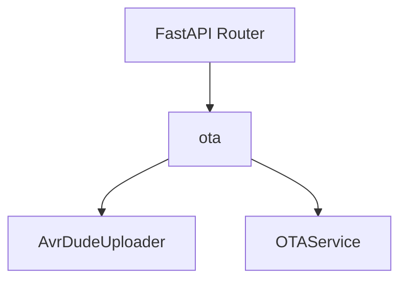
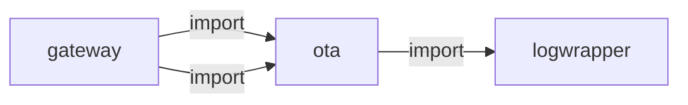
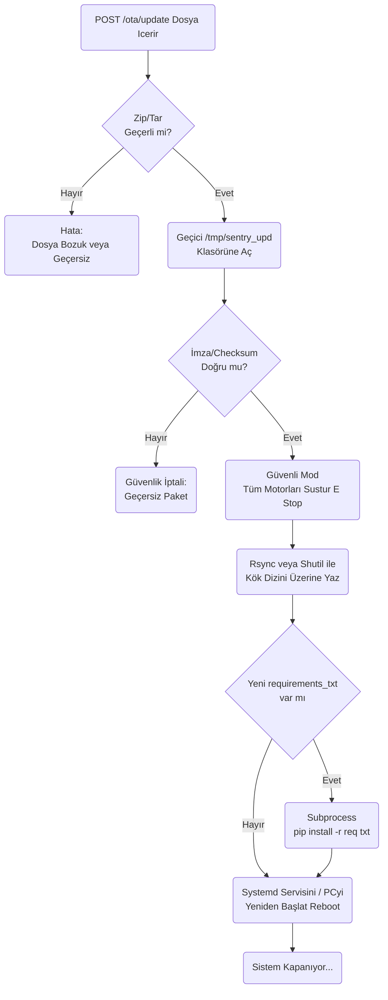
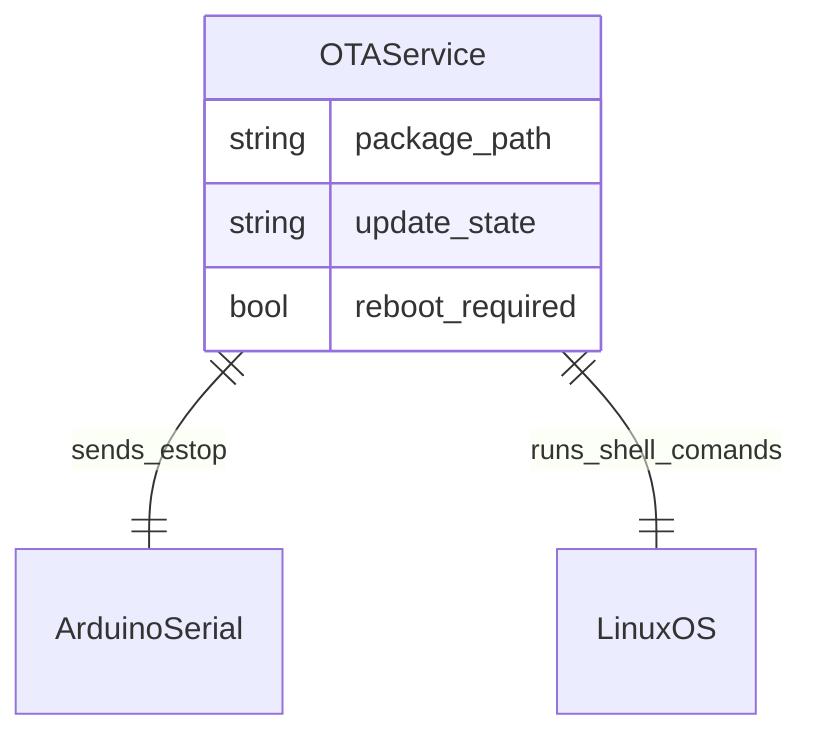

# ota

> **Over-the-air güncelleme, checksum doğrulama**

## Kimlik
| Alan | Değer |
| --- | --- |
| Ana sınıf | `—` |
| Giriş noktası | `—` |
| Orkestratör | `—` |
| Ana dosya | `—` |
| Katman | Arka Plan |
| Port | — |
| Arduino | Hayır |
| Sınıf sayısı | 2 |
| Endpoint sayısı | 5 |

## İsimlendirilmiş Bileşenler (Sınıflar)

#### `AvrDudeUploader` — `modules/ota/services/uploader.py`
- **Görev:** —
- **Kalıtım:** —
- **Oluşturduğu bileşenler:** —
- **Metodlar:** `find_artifact()`, `compute_version()`, `already_uploaded()`, `mark_uploaded()`, `upload()`

#### `OTAService` — `modules/ota/services/uploader.py`
- **Görev:** —
- **Kalıtım:** —
- **Oluşturduğu bileşenler:** `AvrDudeUploader`
- **Metodlar:** `scan_once()`, `upload_path()`, `versions()`, `clear_versions()`


## API — Endpoint → Handler → Servis

| HTTP | Path | Handler | Çağırdığı servis | Açıklama |
| --- | --- | --- | --- | --- |
| GET | `/healthz` | `healthz()` | `clear_versions()`, `scan_once()`, `upload_path()`, `versions()` | Upload firmware with optional HMAC signature verification. |
| POST | `/scan_once` | `scan_once()` | `clear_versions()`, `scan_once()`, `upload_path()`, `versions()` | Upload firmware with optional HMAC signature verification. |
| POST | `/upload` | `upload()` | `clear_versions()`, `upload_path()`, `versions()` | Upload firmware with optional HMAC signature verification. |
| GET | `/versions` | `versions()` | `clear_versions()`, `versions()` | — |
| POST | `/versions/clear` | `clear()` | `clear_versions()` | — |

## Config Bölümleri
- `server`
- `ota`

## Dış İlişkiler (Bu modül → diğerleri)

| Hedef modül | Bağlantı tipi | Detay | Neden |
| --- | --- | --- | --- |
| [[logwrapper]] | import | init_logging | `ota` → `logwrapper`: Merkezi WebSocket log yayınına bağlanır. |

## Gelen İlişkiler (Diğerleri → bu modül)

| Kaynak modül | Bağlantı tipi | Detay | Neden |
| --- | --- | --- | --- |
| [[gateway]] | import | api | `gateway` kod içinde `ota` modülünü import eder (`api`) — Over-the-air güncelleme, checksum doğrulama. |
| [[gateway]] | import | config_loader | `gateway` kod içinde `ota` modülünü import eder (`config_loader`) — Over-the-air güncelleme, checksum doğrulama. |

## İç Mimari (otomatik çıkarım)



## Modül Etkileşim Haritası



### Mimari diyagram 1


### Mimari diyagram 2


---

# Tam Kaynak Arşivi

### `modules/ota/README.md` (23 satır)

```markdown
# OTA (Arduino avrdude yükleme servisi)

- Derleme çıktısı (hex) `ota.watch_dir` içinde taranır; en son bulunan artefakt tek seferlik SHA256 ile versiyonlanır.
- Aynı isim ve hash tekrar yüklenmez.
- Yükleme `avrdude` ile yapılır; `ota.board` ve `ota.avrdude` ayarları üzerinden komut üretilir.
- API FastAPI router ile `/ota` altında sunulur: `healthz`, `scan_once`, `upload`, `versions`, `versions/clear`.

Eklenen güvenlik katmanı ile firmware yükleme isteğe bağlı olarak allowlist ve HMAC doğrulaması da yapabilir.

## Ne İşe Yarar?
- Firmware hash’i allowlist içinde değilse yüklemeyi reddedebilir.
- İmzalı dağıtımda hex dosyasını HMAC-SHA256 ile doğrulayabilir.
- Güvenlik kapalıysa eski davranış korunur; geri uyumludur.

## Config
Bkz: `modules/ota/config/config.yml`

## Çalıştırma
Modül servis olarak çalıştırılabilir:

- `python -m modules.ota.xOTAService`

veya gateway ile mount edilerek kullanılabilir.
```

### `modules/ota/__init__.py` (1 satır)

```python
# ota module package
```

### `modules/ota/api/__init__.py` (1 satır)

```python
from .router import get_router  # noqa: F401
```

### `modules/ota/api/router.py` (53 satır)

```python
from __future__ import annotations
from fastapi import APIRouter, Query
import os

try:
    from ..config_loader import load_config
    from ..services.uploader import OTAService
except Exception:
    from modules.ota.config_loader import load_config  # type: ignore
    from modules.ota.services.uploader import OTAService  # type: ignore


def get_router(cfg: dict | None = None) -> APIRouter:
    cfg = cfg or load_config(None)
    r = APIRouter(prefix="/ota", tags=["ota"])
    svc = OTAService(cfg.get("ota", {}))
    # Optional: scan once on startup
    try:
        if bool(cfg.get("ota", {}).get("scan_on_start", False)):
            try:
                svc.scan_once()
            except Exception:
                pass
    except Exception:
        pass

    @r.get("/healthz")
    def healthz():
        return {"ok": True}

    @r.post("/scan_once")
    def scan_once():
        return svc.scan_once()

    @r.post("/upload")
    def upload(path: str, signature: str | None = Query(None)):
        """Upload firmware with optional HMAC signature verification.
        
        Query params:
            path: Path to .hex file
            signature: Optional HMAC-SHA256 signature (if security.enable_signature is True)
        """
        return svc.upload_path(path, signature=signature)

    @r.get("/versions")
    def versions():
        return svc.versions()

    @r.post("/versions/clear")
    def clear():
        return svc.clear_versions()

    return r
```

### `modules/ota/architecture_ota.md` (52 satır)

```markdown
# OTA (Over The Air) Modülü Mimarisi

OTA modülü (`modules/ota`), robotun kablosuz olarak uzak sunucudan (veya yerel olarak yüklenen bir ZIP dasyasından) yazılım güncellemelerini almasını, bunları ayrıştırmasını, dosyaları ezmesini ve güvenli bir restart sağlamasını kontrol eder.

## 🏗️ İş Akışı ve Karar Mekanizmaları (Flowchart)


## 🔄 İlişkisel Etkileşimler (Veri Akışı)


## ⚙️ Detaylı Karar Mantığı (if/else)

1. **Safety / E-Stop Mecburiyeti**
   - Robot çalışırken (örneğin yürüme komutları gidiyorken) programın beynini aniden yenilemeye çalışmak (veya reset atmak) robotun denge kaybetmesine, motorların kilitli kalıp yanmasına sebep olabilir.
   - Bu yüzden dosya değiştirme evresine (Overwrite) geçmeden hemen önce **ilk kural** Arduino'ya tüm servo torklarını boşa çıkarma komutu (`robot_command: home/zero/relax`) atamaktır.
2. **Paket Bütünlüğü (Checksum / Sig)**
   - Atılan ZIP dosyası ağ yüzünden yarım inmiş olabilir. `manifest.json` dosyasındaki hash ile arşivin gerçek hash'i karşılaştırılır. **`if`** eşleşmezse, yarı inmiş ve bozuk Python dosyalarının orijinal kodları ezmesini ve SentryBOT'u çöp etmesini engellemek için iptal (`Abort`) atılır.
```

### `modules/ota/config/config.yml` (23 satır)

```yaml
server:
  host: 0.0.0.0
  port: 8097

ota:
  watch_dir: arduino/firmware/xMain/build
  artifact_glob: "*.hex"
  board:
    mcu: atmega328p
    programmer: arduino
    baud: 115200
    port: COM3  # Windows örnek
  avrdude:
    bin: avrdude
    config: null
    extra_flags: []
  version_db: modules/ota/config/versions.json
  scan_on_start: true
  security:
    enable_allowlist: false
    enable_signature: false
    allowed_hashes: []
    secret_key: ""  # Set if enabling signature verification
```

### `modules/ota/config_loader.py` (45 satır)

```python
from __future__ import annotations
import os
from typing import Any, Dict
try:
    import yaml  # type: ignore
except Exception:
    yaml = None

DEFAULT_CFG: Dict[str, Any] = {
    "server": {"host": "0.0.0.0", "port": 8097},
    "include": {"api": True},
    "ota": {
        "watch_dir": "arduino/firmware/xMain/build",  # derleme çıktılarının düştüğü klasör
        "artifact_glob": "*.hex",  # avrdude için varsayılan hex
        "board": {
            "mcu": "atmega328p",
            "programmer": "arduino",  # stk500v1 vb.
            "baud": 115200,
            "port": "/dev/ttyUSB0"  # Windows için COM3 gibi
        },
        "avrdude": {
            "bin": "avrdude",
            "config": None,  # özel avrdude.conf yolu (opsiyonel)
            "extra_flags": []
        },
        "version_db": "modules/ota/config/versions.json",
        "scan_on_start": True
    }
}


def load_config(config_path: str | None = None) -> Dict[str, Any]:
    path = config_path or os.environ.get("OTA_CFG", "modules/ota/config/config.yml")
    data: Dict[str, Any] = {}
    if path and os.path.exists(path) and yaml is not None:
        with open(path, "r", encoding="utf-8") as f:
            data = yaml.safe_load(f) or {}
    # shallow merge + deep for dicts
    cfg: Dict[str, Any] = DEFAULT_CFG.copy()
    for k, v in (data or {}).items():
        if isinstance(v, dict) and isinstance(cfg.get(k), dict):
            cfg[k].update(v)
        else:
            cfg[k] = v
    return cfg
```

### `modules/ota/services/uploader.py` (190 satır)

```python
from __future__ import annotations
import hashlib
import hmac
import json
import os
import glob
import subprocess
from typing import Dict, Any, Optional, Tuple


def _sha256(path: str) -> str:
    h = hashlib.sha256()
    with open(path, "rb") as f:
        while True:
            chunk = f.read(8192)
            if not chunk:
                break
            h.update(chunk)
    return h.hexdigest()


def _load_versions(db_path: str) -> Dict[str, str]:
    if os.path.exists(db_path):
        try:
            with open(db_path, "r", encoding="utf-8") as f:
                return json.load(f)
        except Exception:
            return {}
    return {}


def _save_versions(db_path: str, data: Dict[str, str]) -> None:
    os.makedirs(os.path.dirname(db_path), exist_ok=True)
    with open(db_path, "w", encoding="utf-8") as f:
        json.dump(data, f, indent=2)


class AvrDudeUploader:
    def __init__(self, cfg: Dict[str, Any]):
        self.cfg = cfg
        self.db_path = str(cfg.get("version_db", "modules/ota/config/versions.json"))
        self.versions = _load_versions(self.db_path)
        self.security_cfg = cfg.get("security", {})
    
    def _check_allowlist(self, sha: str) -> bool:
        """Check if firmware hash is in allowlist (if enabled)."""
        if not self.security_cfg.get("enable_allowlist", False):
            return True
        allowed = self.security_cfg.get("allowed_hashes", [])
        return sha in allowed
    
    def _verify_signature(self, hex_path: str, provided_signature: Optional[str]) -> bool:
        """Verify HMAC-SHA256 signature (if enabled)."""
        if not self.security_cfg.get("enable_signature", False):
            return True
        if not provided_signature:
            return False
        
        secret_key = self.security_cfg.get("secret_key", "")
        if not secret_key:
            return False
        
        with open(hex_path, "rb") as f:
            hex_content = f.read()
        
        expected_sig = hmac.new(
            secret_key.encode(), hex_content, hashlib.sha256
        ).hexdigest()
        
        return hmac.compare_digest(expected_sig, provided_signature)

    def find_artifact(self) -> Optional[str]:
        watch = str(self.cfg.get("watch_dir", "arduino/firmware/xMain/build"))
        pattern = str(self.cfg.get("artifact_glob", "*.hex"))
        matches = sorted(glob.glob(os.path.join(watch, pattern)))
        return matches[-1] if matches else None

    def compute_version(self, path: str) -> Tuple[str, str]:
        sha = _sha256(path)
        return os.path.basename(path), sha

    def already_uploaded(self, name: str, sha: str) -> bool:
        return self.versions.get(name) == sha

    def mark_uploaded(self, name: str, sha: str) -> None:
        self.versions[name] = sha
        _save_versions(self.db_path, self.versions)

    def _avrdude_cmd(self, hex_path: str) -> list[str]:
        board = self.cfg.get("board", {})
        avrd = self.cfg.get("avrdude", {})
        cmd = [str(avrd.get("bin", "avrdude"))]
        if avrd.get("config"):
            cmd += ["-C", str(avrd.get("config"))]
        cmd += ["-v", "-patmega328p"]
        mcu = str(board.get("mcu", "atmega328p"))
        cmd[-1] = f"-p{mcu}"
        programmer = str(board.get("programmer", "arduino"))
        cmd += [f"-c{programmer}"]
        port = str(board.get("port", "/dev/ttyUSB0"))
        cmd += [f"-P{port}"]
        baud = int(board.get("baud", 115200))
        cmd += [f"-b{baud}"]
        extra = avrd.get("extra_flags", [])
        if isinstance(extra, list):
            cmd += [str(x) for x in extra]
        cmd += ["-D", f"-Uflash:w:{hex_path}:i"]
        return cmd

    def upload(self, hex_path: str, signature: Optional[str] = None) -> Dict[str, Any]:
        """Upload firmware with optional security checks.
        
        Args:
            hex_path: Path to .hex file
            signature: Optional HMAC-SHA256 signature (if security.enable_signature is True)
        
        Returns:
            Dict with 'ok', 'returncode', 'stdout', 'stderr', 'cmd', and optional 'security_error'
        """
        # Security checks (non-breaking defaults)
        if self.security_cfg.get("enable_allowlist", False):
            _, sha = self.compute_version(hex_path)
            if not self._check_allowlist(sha):
                return {
                    "ok": False,
                    "security_error": f"Firmware hash {sha} not in allowlist",
                    "returncode": -1,
                }
        
        if self.security_cfg.get("enable_signature", False):
            if not self._verify_signature(hex_path, signature):
                return {
                    "ok": False,
                    "security_error": "Signature verification failed",
                    "returncode": -1,
                }
        
        # Proceed with upload
        cmd = self._avrdude_cmd(hex_path)
        try:
            proc = subprocess.run(cmd, capture_output=True, text=True, timeout=60)
            ok = proc.returncode == 0
            return {
                "ok": ok,
                "returncode": proc.returncode,
                "stdout": proc.stdout[-4000:],
                "stderr": proc.stderr[-4000:],
                "cmd": cmd,
            }
        except Exception as e:
            return {"ok": False, "error": str(e)}


class OTAService:
    def __init__(self, cfg: Dict[str, Any]):
        self.cfg = cfg
        self.uploader = AvrDudeUploader(cfg.get("ota", {}))

    def scan_once(self) -> Dict[str, Any]:
        path = self.uploader.find_artifact()
        if not path:
            return {"ok": True, "found": False}
        name, sha = self.uploader.compute_version(path)
        if self.uploader.already_uploaded(name, sha):
            return {"ok": True, "found": True, "skipped": True, "name": name, "sha": sha}
        res = self.uploader.upload(path)
        if res.get("ok"):
            self.uploader.mark_uploaded(name, sha)
        res.update({"name": name, "sha": sha})
        return res

    def upload_path(self, path: str, signature: str | None = None) -> Dict[str, Any]:
        if not os.path.exists(path):
            return {"ok": False, "error": "file not found"}
        name, sha = self.uploader.compute_version(path)
        if self.uploader.already_uploaded(name, sha):
            return {"ok": True, "skipped": True, "name": name, "sha": sha}
        res = self.uploader.upload(path, signature=signature)
        if res.get("ok"):
            self.uploader.mark_uploaded(name, sha)
        res.update({"name": name, "sha": sha})
        return res

    def versions(self) -> Dict[str, Any]:
        return {"ok": True, "items": self.uploader.versions}

    def clear_versions(self) -> Dict[str, Any]:
        self.uploader.versions = {}
        _save_versions(self.uploader.db_path, self.uploader.versions)
        return {"ok": True}
```

### `modules/ota/tests/test_smoke.py` (11 satır)

```python
def test_imports():
    import modules.ota  # noqa: F401
    from modules.ota.api import get_router  # noqa: F401
    from modules.ota.config_loader import load_config  # noqa: F401
    from modules.ota.services.uploader import OTAService  # noqa: F401


def test_router_create():
    from modules.ota.api import get_router
    r = get_router({"ota": {}})
    assert r is not None
```

### `modules/ota/xOTAService.py` (33 satır)

```python
from __future__ import annotations
from fastapi import FastAPI

try:
    from .config_loader import load_config
    from .api import get_router
except Exception:
    from modules.ota.config_loader import load_config  # type: ignore
    from modules.ota.api import get_router  # type: ignore

try:
    from modules.logwrapper import init_logging as _init_global_logging  # type: ignore
    _init_global_logging()
except Exception:
    pass


def create_app(config_path: str | None = None) -> FastAPI:
    cfg = load_config(config_path)
    app = FastAPI()
    app.state.cfg = cfg
    app.include_router(get_router(cfg))
    return app


if __name__ == "__main__":
    import uvicorn
    cfg = load_config()
    uvicorn.run(
        create_app(),
        host=str(cfg.get("server", {}).get("host", "0.0.0.0")),
        port=int(cfg.get("server", {}).get("port", 8097)),
    )
```
