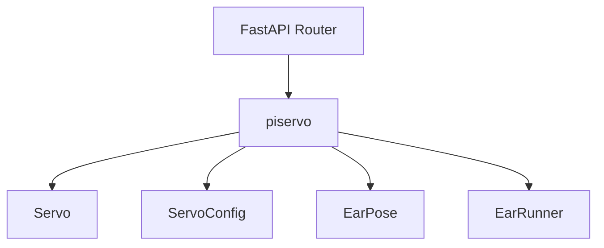
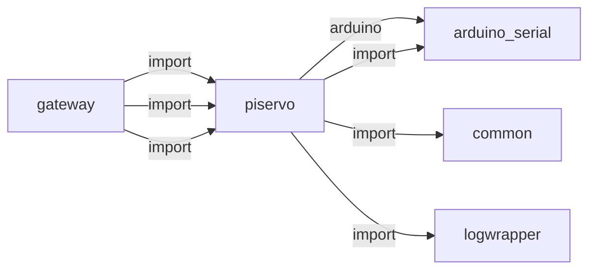
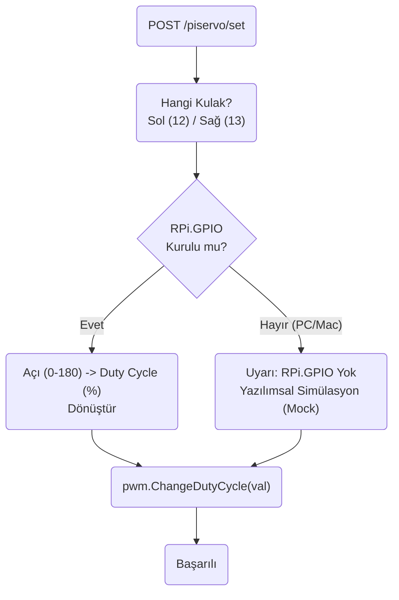
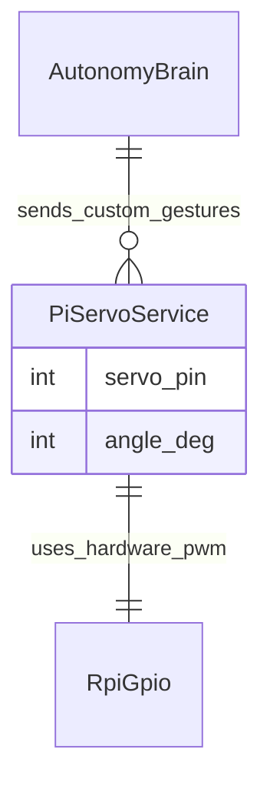

# piservo

> **Raspberry Pi GPIO PWM kulak servoları**

## Kimlik
| Alan | Değer |
| --- | --- |
| Ana sınıf | `—` |
| Giriş noktası | `—` |
| Orkestratör | `—` |
| Ana dosya | `—` |
| Katman | Eylem |
| Port | — |
| Arduino | Hayır |
| Sınıf sayısı | 7 |
| Endpoint sayısı | 5 |

## İsimlendirilmiş Bileşenler (Sınıflar)

#### `Servo` — `modules/piservo/services/driver.py`
- **Görev:** —
- **Kalıtım:** —
- **Oluşturduğu bileşenler:** —
- **Metodlar:** `angle_to_us()`, `set_angle()`

#### `ServoConfig` — `modules/piservo/services/driver.py`
- **Görev:** —
- **Kalıtım:** —
- **Oluşturduğu bileşenler:** —
- **Metodlar:** —

#### `_ArduinoWrapper` — `modules/piservo/services/driver.py`
- **Görev:** —
- **Kalıtım:** —
- **Oluşturduğu bileşenler:** `ArduinoDriver`
- **Metodlar:** `set_servo_pulsewidth()`

#### `_PigpioWrapper` — `modules/piservo/services/driver.py`
- **Görev:** —
- **Kalıtım:** —
- **Oluşturduğu bileşenler:** —
- **Metodlar:** `set_servo_pulsewidth()`

#### `_SimGPIO` — `modules/piservo/services/driver.py`
- **Görev:** —
- **Kalıtım:** —
- **Oluşturduğu bileşenler:** —
- **Metodlar:** `set_servo_pulsewidth()`

#### `EarPose` — `modules/piservo/services/ears.py`
- **Görev:** —
- **Kalıtım:** —
- **Oluşturduğu bileşenler:** —
- **Metodlar:** —

#### `EarRunner` — `modules/piservo/services/runner.py`
- **Görev:** —
- **Kalıtım:** —
- **Oluşturduğu bileşenler:** `Servo`, `Servo`
- **Metodlar:** `set_angles()`, `emotion()`, `gesture()`, `event()`


## API — Endpoint → Handler → Servis

| HTTP | Path | Handler | Çağırdığı servis | Açıklama |
| --- | --- | --- | --- | --- |
| GET | `/healthz` | `healthz()` | — | — |
| POST | `/set` | `set_angles()` | — | — |
| POST | `/emotion` | `emotion()` | — | — |
| POST | `/gesture` | `gesture()` | — | — |
| POST | `/event` | `event()` | — | — |

## Config Bölümleri
- `server`
- `left`
- `right`

## Dış İlişkiler (Bu modül → diğerleri)

| Hedef modül | Bağlantı tipi | Detay | Neden |
| --- | --- | --- | --- |
| [[arduino_serial]] | arduino | Arduino serial / contract kullanımı | Kulak servo komutları için seri haberleşme (bazı kurulumlarda). |
| [[arduino_serial]] | import | services | Kulak servo komutları için seri haberleşme (bazı kurulumlarda). |
| [[common]] | import | emotion_vocab | Kulak pozisyonları duygu sözlüğü ile eşlenir. |
| [[logwrapper]] | import | init_logging | `piservo` → `logwrapper`: Merkezi WebSocket log yayınına bağlanır. |

## Gelen İlişkiler (Diğerleri → bu modül)

| Kaynak modül | Bağlantı tipi | Detay | Neden |
| --- | --- | --- | --- |
| [[gateway]] | import | config_loader | `gateway` kod içinde `piservo` modülünü import eder (`config_loader`) — Raspberry Pi GPIO PWM kulak servoları. |
| [[gateway]] | import | api | `gateway` kod içinde `piservo` modülünü import eder (`api`) — Raspberry Pi GPIO PWM kulak servoları. |
| [[gateway]] | import | services | `gateway` kod içinde `piservo` modülünü import eder (`services`) — Raspberry Pi GPIO PWM kulak servoları. |

## İç Mimari (otomatik çıkarım)



## Modül Etkileşim Haritası



### Mimari diyagram 1


### Mimari diyagram 2


---

# Tam Kaynak Arşivi

### `modules/piservo/README.md` (31 satır)

```markdown
# PiServo (Ears) Module

İki servo ile “kulak” hareketleri: 90° yukarı, <90 öne eğik, >90 geriye eğik. Duygu ve olaylara göre poz verir.

## Servis Çalıştırma
```bash
uvicorn modules.piservo.xPiServoService:create_app --factory --host 0.0.0.0 --port 8093
```

## API
- GET  /piservo/healthz
- POST /piservo/set?left=90&right=90
- POST /piservo/emotion?name=joy
- POST /piservo/gesture?name=wakeword | sound
- POST /piservo/event?kind=wakeword | sound

## Duygu Eşlemesi
- EMOTION_POSES içinde: neutral, joy, fear, anger, sadness, surprise, curiosity

## Konfig
`modules/piservo/config/config.yml`
- left.gpio, right.gpio: servo sinyal pinleri
- PWM aralıkları, açı aralıkları `ServoConfig` ile koddan özelleştirilebilir.

Not: pigpio yoksa simülatör çalışır.

Arduino backend (default):

- This project now defaults to driving the Pi "ears" (PiServo) via the Arduino backend when available.
- Configure channel indices in `modules/piservo/config/config.yml` using `arduino_index` (PCA9685/Arduino servo index). Default in this repo: `left.arduino_index = 2`, `right.arduino_index = 3`.
- Robot head `pan` and `tilt` on the Arduino are exposed as servo indices `0` (pan) and `1` (tilt) in firmware.
```

### `modules/piservo/__init__.py` (6 satır)

```python
from __future__ import annotations

try:
    from .xPiServoService import create_app  # noqa: F401
except Exception:
    pass
```

### `modules/piservo/api/__init__.py` (3 satır)

```python
from .router import get_router

__all__ = ["get_router"]
```

### `modules/piservo/api/router.py` (38 satır)

```python
from __future__ import annotations
from fastapi import APIRouter
from typing import Optional

try:
    from ..services.runner import EarRunner
except Exception:
    from services.runner import EarRunner  # type: ignore


def get_router(runner: EarRunner) -> APIRouter:
    r = APIRouter(prefix="/piservo", tags=["piservo"], responses={404: {"description": "Not found"}})

    @r.get("/healthz", tags=["piservo"], summary="Healthz")
    def healthz():
        return {"ok": True}

    @r.post("/set", tags=["piservo"], summary="Set Angles")
    def set_angles(left: float, right: float):
        runner.set_angles(left, right)
        return {"ok": True}

    @r.post("/emotion", tags=["piservo"], summary="Emotion")
    def emotion(name: str):
        runner.emotion(name)
        return {"ok": True}

    @r.post("/gesture", tags=["piservo"], summary="Gesture")
    def gesture(name: str):
        runner.gesture(name)
        return {"ok": True}

    @r.post("/event", tags=["piservo"], summary="Event")
    def event(kind: str):
        runner.event(kind)
        return {"ok": True}

    return r
```

### `modules/piservo/architecture_piservo.md` (42 satır)

```markdown
# PiServo Modülü Mimarisi

PiServo modülü (`modules/piservo`), Arduino'ya harici olarak bağlanamayan veya gövdeden bağımsız kafada (Raspberry Pi üzerinde) bulunan özel donanımları (Örn: Kulak servoları) doğrudan Pi'nin GPIO PWM pinleri üzerinden kontrol eden sınıftır.

## 🏗️ İş Akışı ve Karar Mekanizmaları (Flowchart)


## 🔄 İlişkisel Etkileşimler (Veri Akışı)


## ⚙️ Detaylı Karar Mantığı (if/else)

1. **İşletim Sistemi Bağımlılığı (Mock/Simülator)**
   - Bu proje bilgisayarda (Windows/Mac) test edilirken `RPi.GPIO` kütüphanesini `import` etmek çökmeye neden olur. Modül çalışmaya başladığında **`try / except ImportError`** kullanır. **`if`** Raspberry Pi donanımı yoksa `self.pwm = None` kalır ve gelen tüm açı komutlarını sadece konsola (`logger.info("Mock Servo 90")`) yazdırıp sistemi çökertmekten kurtarır.
2. **Görev Döngüsü (Duty Cycle) Dönüşümü**
   - SG90/MG996 tarzı servolar 50Hz (20ms) periyotta çalışır.
   - Açıyı (0-180 derece) direkt 0-100% PWM pulslarına çevirme formülü işletilir. Standart bir 2ms pals %10 duty'e denk gelir. **`if`** açı 180'den büyük veya 0'dan küçük girilmişse güvenli sınırlar (Clamp) uygulanıp motora fiziksel hasar verilmesi engellenir.
```

### `modules/piservo/config/config.yml` (10 satır)

```yaml
server:
  host: 0.0.0.0
  port: 8093

left:
  gpio: 12
  arduino_index: 2
right:
  gpio: 13
  arduino_index: 3
```

### `modules/piservo/config_loader.py` (33 satır)

```python
from __future__ import annotations
import os
from pathlib import Path
from typing import Any, Dict

import yaml

_DEFAULT_CFG_PATH = Path(__file__).parent / "config" / "config.yml"


def _deep_update(base: Dict[str, Any], override: Dict[str, Any]) -> Dict[str, Any]:
    for k, v in override.items():
        if isinstance(v, dict) and isinstance(base.get(k), dict):
            base[k] = _deep_update(base[k], v)
        else:
            base[k] = v
    return base


def load_config(path: str | os.PathLike | None = None) -> Dict[str, Any]:
    cfg_path = Path(path) if path else Path(os.getenv("PISERVO_CONFIG", _DEFAULT_CFG_PATH))
    if not cfg_path.exists():
        cfg_path = _DEFAULT_CFG_PATH
    with open(cfg_path, "r", encoding="utf-8") as f:
        data = yaml.safe_load(f) or {}
    env: Dict[str, Any] = {}
    host = os.getenv("PISERVO_HOST")
    port = os.getenv("PISERVO_PORT")
    if host:
        env.setdefault("server", {})["host"] = host
    if port:
        env.setdefault("server", {})["port"] = int(port)
    return _deep_update(data, env)
```

### `modules/piservo/requirements.txt` (4 satır)

```text
fastapi>=0.110
uvicorn[standard]>=0.23
# Optional on Raspberry Pi for real hardware control
pigpio>=1.78; platform_system == "Linux"
```

### `modules/piservo/services/__init__.py` (11 satır)

```python
from .driver import Servo, ServoConfig
from .ears import EMOTION_POSES, EarPose
from .runner import EarRunner

__all__ = [
    "Servo",
    "ServoConfig",
    "EMOTION_POSES",
    "EarPose",
    "EarRunner",
]
```

### `modules/piservo/services/driver.py` (119 satır)

```python
from __future__ import annotations
from dataclasses import dataclass
from typing import Optional


@dataclass
class ServoConfig:
    gpio: int
    min_us: int = 500
    max_us: int = 2500
    min_deg: float = 0.0
    max_deg: float = 180.0
    center_deg: float = 90.0
    # If set, use Arduino backend and this is the servo index on Arduino's controller
    arduino_index: Optional[int] = None


class _PigpioWrapper:
    def __init__(self) -> None:
        import pigpio  # type: ignore
        self._pi = pigpio.pi()

    def set_servo_pulsewidth(self, gpio: int, pulsewidth: int) -> None:
        self._pi.set_servo_pulsewidth(gpio, pulsewidth)


class _SimGPIO:
    def set_servo_pulsewidth(self, gpio: int, pulsewidth: int) -> None:
        # Simulation: no-op
        pass


class _ArduinoWrapper:
    def __init__(self, index: int):
        # Lazy import to avoid hard dependency
        try:
            from modules.arduino_serial.services.driver import ArduinoDriver  # type: ignore
        except Exception:
            try:
                from ..arduino_serial.services.driver import ArduinoDriver  # type: ignore
            except Exception:
                ArduinoDriver = None  # type: ignore
        if ArduinoDriver is None:
            raise RuntimeError("ArduinoDriver not available")
        self._drv = ArduinoDriver()
        try:
            self._drv.start()
        except Exception:
            pass
        self._index = index

    def set_servo_pulsewidth(self, gpio: int, pulsewidth: int) -> None:
        # Convert pulsewidth back to degrees using caller mapping isn't available here;
        # Arduino driver exposes `set_servo(index, deg)`. We'll compute deg approximately
        # using typical 500-2500 us mapping if possible.
        try:
            # approximate mapping
            us = int(pulsewidth)
            # map 500..2500 -> 0..180
            deg = max(0.0, min(180.0, (us - 500) * 180.0 / 2000.0))
            self._drv.svc.set_servo(self._index, deg)
        except Exception:
            pass


class Servo:
    def __init__(self, cfg: ServoConfig):
        self.cfg = cfg
        # Prefer Arduino backend when available. Use explicit `arduino_index` if provided,
        # otherwise, if ArduinoDriver exists, try using the `gpio` as an index (common when
        # using PCA9685 channel numbers). Fallback to pigpio, then sim.
        ArduinoDriver = None
        try:
            from modules.arduino_serial.services.driver import ArduinoDriver  # type: ignore
        except Exception:
            try:
                from ..arduino_serial.services.driver import ArduinoDriver  # type: ignore
            except Exception:
                ArduinoDriver = None  # type: ignore

        if ArduinoDriver is not None:
            # Decide an index: prefer explicit config arduino_index; otherwise try gpio if reasonable
            idx = None
            if self.cfg.arduino_index is not None:
                idx = int(self.cfg.arduino_index)
            else:
                # If gpio looks like a small PCA9685 channel (0..15) use it
                try:
                    if 0 <= int(self.cfg.gpio) <= 15:
                        idx = int(self.cfg.gpio)
                except Exception:
                    idx = None

            if idx is not None:
                try:
                    self._io = _ArduinoWrapper(idx)
                except Exception:
                    self._io = None
            else:
                self._io = None
        else:
            self._io = None

        if self._io is None:
            try:
                self._io = _PigpioWrapper()
            except Exception:
                self._io = _SimGPIO()

    def angle_to_us(self, angle: float) -> int:
        angle = max(self.cfg.min_deg, min(self.cfg.max_deg, angle))
        span_deg = self.cfg.max_deg - self.cfg.min_deg
        span_us = self.cfg.max_us - self.cfg.min_us
        frac = (angle - self.cfg.min_deg) / span_deg if span_deg else 0
        return int(self.cfg.min_us + frac * span_us)

    def set_angle(self, angle: float) -> None:
        pw = self.angle_to_us(angle)
        self._io.set_servo_pulsewidth(self.cfg.gpio, pw)
```

### `modules/piservo/services/ears.py` (52 satır)

```python
from __future__ import annotations
from dataclasses import dataclass
from typing import Dict, Tuple


@dataclass
class EarPose:
    left: float
    right: float


EMOTION_POSES: Dict[str, EarPose] = {
    # 90: up, <90 down-forward, >90 back
    "neutral": EarPose(90, 90),
    "joy": EarPose(70, 70),
    "fear": EarPose(110, 110),
    "anger": EarPose(80, 100),
    "sadness": EarPose(100, 100),
    "surprise": EarPose(60, 60),
    "curiosity": EarPose(75, 85),
}


def pose_for_emotion(name: str) -> EarPose:
    """Resolve an arbitrary emotion label to an ear pose.

    Accepts canonical autonomy moods or any alias (happy/sleepy/angry) by
    routing through the shared emotion vocabulary, then falling back to a
    direct table lookup and finally to the neutral pose.
    """
    key = str(name or "").strip().lower()
    if key in EMOTION_POSES:
        return EMOTION_POSES[key]
    try:
        from modules.common.emotion_vocab import get_vocab  # lazy optional dep

        ears_key = get_vocab().render(key).ears
        if ears_key in EMOTION_POSES:
            return EMOTION_POSES[ears_key]
    except Exception:
        pass
    return EMOTION_POSES["neutral"]


def gesture_wakeword() -> Tuple[float, float]:
    # quick raise both then relax
    return (60, 60)


def gesture_sound() -> Tuple[float, float]:
    # tilt to one side inquisitively
    return (80, 100)
```

### `modules/piservo/services/runner.py` (44 satır)

```python
from __future__ import annotations
import time

try:
    from .driver import Servo, ServoConfig
    from .ears import EMOTION_POSES, gesture_sound, gesture_wakeword, pose_for_emotion
except Exception:
    from driver import Servo, ServoConfig  # type: ignore
    from ears import EMOTION_POSES, gesture_sound, gesture_wakeword, pose_for_emotion  # type: ignore


class EarRunner:
    def __init__(self, left_cfg: ServoConfig, right_cfg: ServoConfig):
        self.left = Servo(left_cfg)
        self.right = Servo(right_cfg)
        # Start at up position (90)
        self.set_angles(90, 90)

    def set_angles(self, left: float, right: float) -> None:
        self.left.set_angle(left)
        self.right.set_angle(right)

    def emotion(self, name: str) -> None:
        pose = pose_for_emotion(name)
        if not pose:
            return
        self.set_angles(pose.left, pose.right)

    def gesture(self, name: str) -> None:
        n = name.lower()
        if n == "wakeword":
            l, r = gesture_wakeword()
            self.set_angles(l, r)
            time.sleep(0.2)
            self.set_angles(90, 90)
        elif n == "sound":
            l, r = gesture_sound()
            self.set_angles(l, r)
            time.sleep(0.3)
            self.set_angles(90, 90)

    def event(self, kind: str) -> None:
        # alias for gesture
        self.gesture(kind)
```

### `modules/piservo/tests/test_smoke.py` (34 satır)

```python
from fastapi.testclient import TestClient

from modules.piservo.xPiServoService import create_app


def test_healthz():
    app = create_app()
    client = TestClient(app)
    r = client.get("/piservo/healthz")
    assert r.status_code == 200
    assert r.json().get("ok") is True


def test_set_angles():
    app = create_app()
    client = TestClient(app)
    r = client.post("/piservo/set", params={"left": 90, "right": 90})
    assert r.status_code == 200
    assert r.json().get("ok") is True


def test_ear_pose_resolves_emotion_aliases():
    from modules.piservo.services.ears import EMOTION_POSES, pose_for_emotion

    # canonical labels map straight through
    assert pose_for_emotion("joy") == EMOTION_POSES["joy"]
    # aliases resolve via the shared vocabulary
    assert pose_for_emotion("happy") == EMOTION_POSES["joy"]
    assert pose_for_emotion("scared") == EMOTION_POSES["fear"]
    assert pose_for_emotion("angry") == EMOTION_POSES["anger"]
    # tired has no dedicated pose -> mapped onto sadness ears
    assert pose_for_emotion("tired") == EMOTION_POSES["sadness"]
    # unknown -> neutral
    assert pose_for_emotion("???") == EMOTION_POSES["neutral"]
```

### `modules/piservo/xPiServoService.py` (35 satır)

```python
from __future__ import annotations
from fastapi import FastAPI

try:
    from .config_loader import load_config
    from .api import get_router
    from .services.runner import EarRunner
    from .services.driver import ServoConfig
except Exception:
    from config_loader import load_config  # type: ignore
    from api import get_router  # type: ignore
    from services.runner import EarRunner  # type: ignore
    from services.driver import ServoConfig  # type: ignore

try:
    from modules.logwrapper import init_logging as _init_global_logging  # type: ignore
    _init_global_logging()
except Exception:
    pass


def create_app(config_path: str | None = None) -> FastAPI:
    cfg = load_config(config_path)
    left = ServoConfig(**cfg.get("left", {"gpio": 12}))
    right = ServoConfig(**cfg.get("right", {"gpio": 13}))
    runner = EarRunner(left_cfg=left, right_cfg=right)
    app = FastAPI()
    app.include_router(get_router(runner))
    return app


if __name__ == "__main__":
    import uvicorn
    cfg = load_config()
    uvicorn.run(create_app(), host=str(cfg.get("server", {}).get("host", "0.0.0.0")), port=int(cfg.get("server", {}).get("port", 8093)))
```
