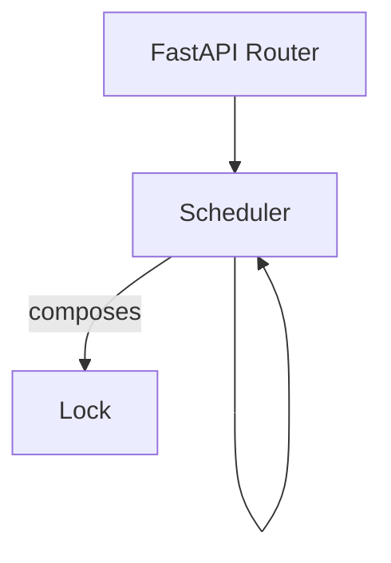
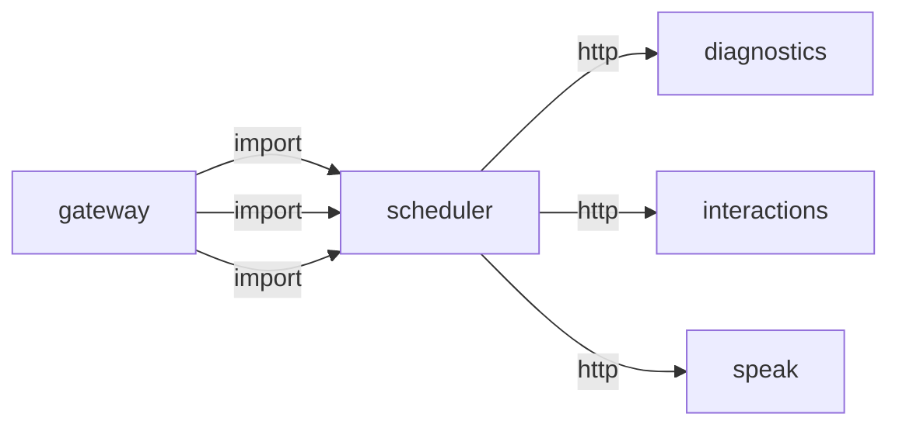
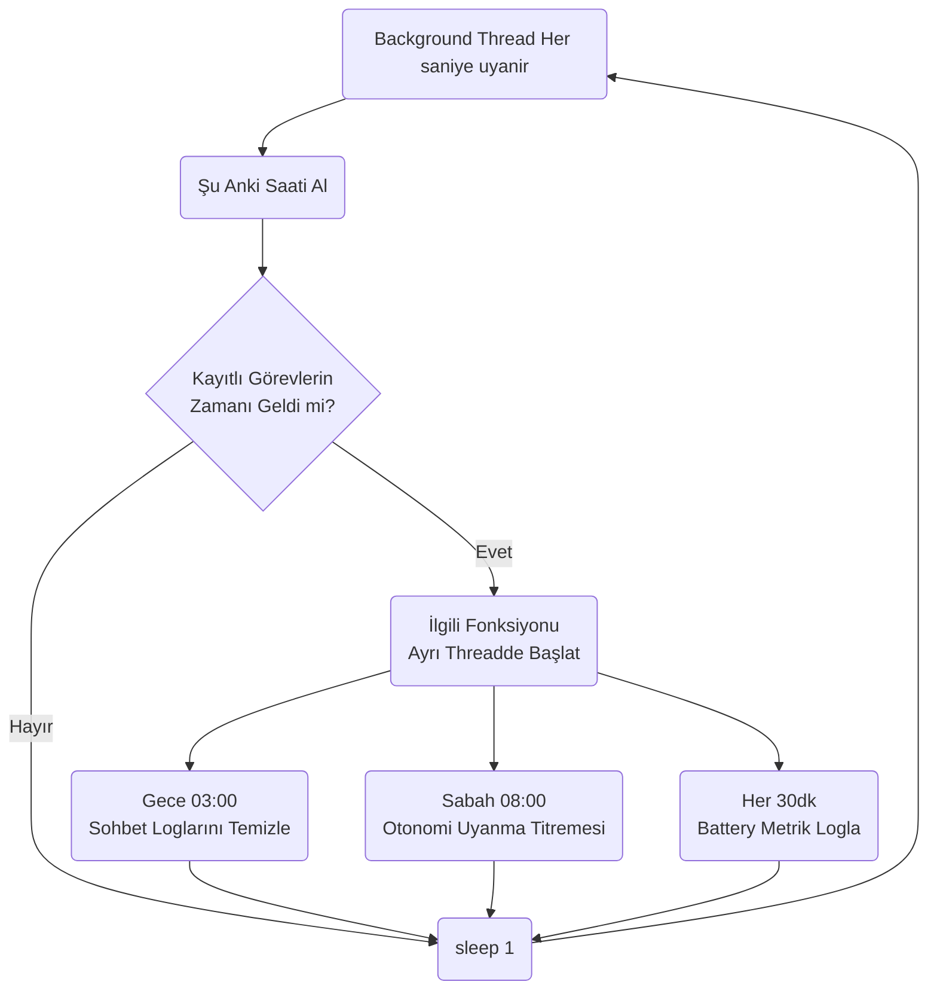
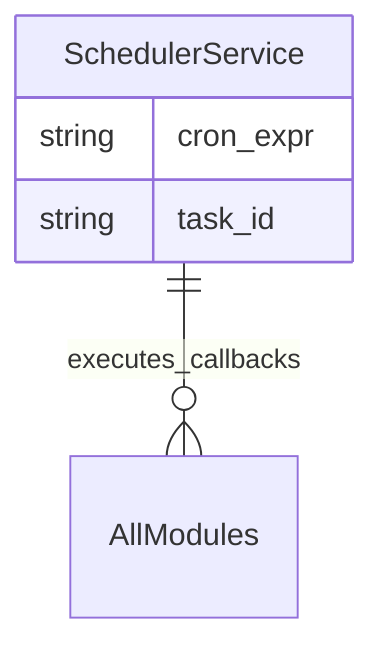

# scheduler

> **Cron benzeri zamanlayıcı**

## Kimlik
| Alan | Değer |
| --- | --- |
| Ana sınıf | `Scheduler` |
| Giriş noktası | `create_app()` |
| Orkestratör | `Scheduler` |
| Ana dosya | `modules/scheduler/xSchedulerService.py` |
| Katman | Arka Plan |
| Port | — |
| Arduino | Hayır |
| Sınıf sayısı | 1 |
| Endpoint sayısı | 6 |

## İsimlendirilmiş Bileşenler (Sınıflar)

#### `Scheduler` — `modules/scheduler/services/runner.py`
- **Görev:** —
- **Kalıtım:** —
- **Oluşturduğu bileşenler:** `Lock`
- **Metodlar:** `start()`, `stop()`, `list_jobs()`, `list_results()`, `add_or_update_job()`, `remove_job()`, `run_once()`


## API — Endpoint → Handler → Servis

| HTTP | Path | Handler | Çağırdığı servis | Açıklama |
| --- | --- | --- | --- | --- |
| GET | `/healthz` | `healthz()` | — | — |
| GET | `/jobs` | `jobs()` | — | — |
| POST | `/jobs` | `add_or_update_job()` | — | — |
| DELETE | `/jobs/{job_id}` | `remove_job()` | — | — |
| GET | `/results` | `results()` | — | — |
| POST | `/run_once/{job_id}` | `run_once()` | — | — |

## Config Bölümleri
- `server`
- `gateway_base_url`
- `jobs`

## Dış İlişkiler (Bu modül → diğerleri)

| Hedef modül | Bağlantı tipi | Detay | Neden |
| --- | --- | --- | --- |
| [[diagnostics]] | http | calls path `/diagnostics/run` | `scheduler` HTTP ile `diagnostics` modülüne erişir: Sistem sağlık kontrolü çalıştırır. |
| [[interactions]] | http | calls path `/interactions/event` | `scheduler` HTTP ile `interactions` modülüne erişir: Sistem olayı veya LED efekti tetikler. |
| [[speak]] | http | calls path `/speak/say` | Zamanlanmış görevlerde hatırlatma/duyuru metni seslendirir. |

## Gelen İlişkiler (Diğerleri → bu modül)

| Kaynak modül | Bağlantı tipi | Detay | Neden |
| --- | --- | --- | --- |
| [[gateway]] | import | config_loader | `gateway` kod içinde `scheduler` modülünü import eder (`config_loader`) — Cron benzeri zamanlayıcı. |
| [[gateway]] | import | services | `gateway` kod içinde `scheduler` modülünü import eder (`services`) — Cron benzeri zamanlayıcı. |
| [[gateway]] | import | api | `gateway` kod içinde `scheduler` modülünü import eder (`api`) — Cron benzeri zamanlayıcı. |

## İç Mimari (otomatik çıkarım)



## Modül Etkileşim Haritası



### Mimari diyagram 1


### Mimari diyagram 2


---

# Tam Kaynak Arşivi

### `modules/scheduler/README.md` (18 satır)

```markdown
# Scheduler

Basit async periyodik görev zamanlayıcı. HTTP ping işleri destekler.

Bu motor artık sadece config'te tanımlı işleri değil, çalışma anında eklenen işleri de yönetir.

## Ne İşe Yarar?
- Periyodik görevleri çalıştırır.
- Runtime'da yeni görev ekleyip kaldırabilir.
- Sonuçları kaydedip son çalıştırma bilgisini tutar.
- Farklı görev türlerini tek motor altında toplar.

## API
- GET `/scheduler/healthz`
- GET `/scheduler/jobs`
- POST `/scheduler/jobs/add`
- POST `/scheduler/jobs/remove/{job_id}`
- GET `/scheduler/jobs/results`
```

### `modules/scheduler/__init__.py` (1 satır)

```python
"""Lightweight async job scheduler for periodic tasks."""
```

### `modules/scheduler/api/__init__.py` (1 satır)

```python
# api namespace
```

### `modules/scheduler/api/router.py` (39 satır)

```python
from __future__ import annotations
from typing import Dict, Any
from fastapi import APIRouter

from ..services.runner import Scheduler


def get_router(cfg: Dict[str, Any], scheduler: Scheduler) -> APIRouter:
    r = APIRouter(prefix="/scheduler", tags=["scheduler"])

    @r.get("/healthz")
    def healthz():
        return {"ok": True}

    @r.get("/jobs")
    def jobs():
        return scheduler.list_jobs()

    @r.post("/jobs")
    def add_or_update_job(body: Dict[str, Any]):
        if not isinstance(body, dict):
            return {"ok": False, "error": "body must be an object"}
        item = scheduler.add_or_update_job(body)
        return {"ok": True, "job": item}

    @r.delete("/jobs/{job_id}")
    def remove_job(job_id: str):
        removed = scheduler.remove_job(job_id)
        return {"ok": removed}

    @r.get("/results")
    def results():
        return scheduler.list_results()

    @r.post("/run_once/{job_id}")
    async def run_once(job_id: str):
        return await scheduler.run_once(job_id)

    return r
```

### `modules/scheduler/architecture_scheduler.md` (43 satır)

```markdown
# Scheduler Modülü Mimarisi

Scheduler modülü (`modules/scheduler`), robotun arka planda her 1 dakika, saat başı veya gece 3'te yapması gereken zamanlanmış görevleri (Cron mantığı) yürüten ve yöneten servistir.

## 🏗️ İş Akışı ve Karar Mekanizmaları (Flowchart)


## 🔄 İlişkisel Etkileşimler (Veri Akışı)


## ⚙️ Detaylı Karar Mantığı (if/else)

1. **Zamanlanmış Olarak Görev Tetikleme (Cron Parser)**
   - Modül içinde Python `schedule` kütüphanesi sarmalanır.
   - **`if`** bir komut/algoritma bloklanıyorsa (Örneğin "Logları buluta yedekleme" işlemi 5 dakika sürüyorsa), ana scheduler thread'inin donup diğer zamanlanmış görevleri (Örn: Alarm çalma) kaçırmaması için **her çalışan fonksiyon** yeni bir `threading.Thread(target=func).start()` bloğu içine alınır. Bu "Non-blocking" mimaridir.
```

### `modules/scheduler/config/config.yml` (20 satır)

```yaml
server:
  host: 0.0.0.0
  port: 8094

gateway_base_url: http://127.0.0.1:8080

jobs: []
# Example jobs:
# - id: gateway_ping
#   kind: http
#   method: GET
#   url: http://127.0.0.1:8080/healthz
#   every_s: 30
# - id: hourly_diag
#   kind: diagnostics
#   every_s: 3600
# - id: heartbeat_voice
#   kind: speak
#   text: "Sistem kontrolu normal"
#   every_s: 900
```

### `modules/scheduler/config_loader.py` (14 satır)

```python
from __future__ import annotations
from pathlib import Path
from typing import Any, Dict
import yaml

_DEFAULT_CFG_PATH = Path(__file__).parent / "config" / "config.yml"


def load_config(path: str | None = None) -> Dict[str, Any]:
    p = Path(path) if path else _DEFAULT_CFG_PATH
    if not p.exists():
        p = _DEFAULT_CFG_PATH
    with open(p, "r", encoding="utf-8") as f:
        return yaml.safe_load(f) or {}
```

### `modules/scheduler/services/__init__.py` (1 satır)

```python
# namespace
```

### `modules/scheduler/services/runner.py` (192 satır)

```python
from __future__ import annotations
from typing import Dict, Any, List
import asyncio
import time
import threading


class Scheduler:
    def __init__(self, jobs: List[Dict[str, Any]] | None = None, gateway_base_url: str = "http://127.0.0.1:8080") -> None:
        self.gateway_base_url = str(gateway_base_url).rstrip("/")
        self._lock = threading.Lock()
        self.jobs: Dict[str, Dict[str, Any]] = {}
        self._tasks: Dict[str, asyncio.Task] = {}
        self._results: Dict[str, Dict[str, Any]] = {}
        self._running = False

        for job in jobs or []:
            self.add_or_update_job(job)

    def _normalize_job(self, job: Dict[str, Any]) -> Dict[str, Any]:
        jid = str(job.get("id", "")).strip() or f"job_{int(time.time() * 1000)}"
        kind = str(job.get("kind", "http")).strip().lower()
        return {
            "id": jid,
            "enabled": bool(job.get("enabled", True)),
            "kind": kind,
            "every_s": max(0.5, float(job.get("every_s", 60.0))),
            "method": str(job.get("method", "GET")).upper(),
            "url": str(job.get("url", "")).strip(),
            "path": str(job.get("path", "")).strip(),
            "params": job.get("params") if isinstance(job.get("params"), dict) else None,
            "json": job.get("json") if isinstance(job.get("json"), dict) else None,
            "timeout_s": max(0.1, float(job.get("timeout_s", 1.0))),
            "max_retries": max(0, int(job.get("max_retries", 0))),
            "text": str(job.get("text", "")),
            "event": str(job.get("event", "")),
            "target": str(job.get("target", "")),
        }

    def _ensure_task_locked(self, job_id: str) -> None:
        if not self._running:
            return
        job = self.jobs.get(job_id)
        if not job or not bool(job.get("enabled", True)):
            return
        old = self._tasks.get(job_id)
        if old is not None and not old.done():
            old.cancel()
        self._tasks[job_id] = asyncio.create_task(self._job_loop(job_id))

    def start(self) -> None:
        with self._lock:
            self._running = True
            for job_id in list(self.jobs.keys()):
                self._ensure_task_locked(job_id)

    async def stop(self) -> None:
        with self._lock:
            self._running = False
            tasks = list(self._tasks.values())
            self._tasks.clear()
        for t in tasks:
            t.cancel()
        if tasks:
            await asyncio.gather(*tasks, return_exceptions=True)

    def list_jobs(self) -> List[Dict[str, Any]]:
        with self._lock:
            return [dict(job) for _, job in sorted(self.jobs.items(), key=lambda kv: kv[0])]

    def list_results(self) -> Dict[str, Dict[str, Any]]:
        with self._lock:
            return {k: dict(v) for k, v in self._results.items()}

    def add_or_update_job(self, job: Dict[str, Any]) -> Dict[str, Any]:
        normalized = self._normalize_job(job)
        jid = normalized["id"]
        with self._lock:
            self.jobs[jid] = normalized
            self._ensure_task_locked(jid)
        return normalized

    def remove_job(self, job_id: str) -> bool:
        jid = str(job_id).strip()
        if not jid:
            return False
        with self._lock:
            existed = jid in self.jobs
            self.jobs.pop(jid, None)
            t = self._tasks.pop(jid, None)
        if t is not None:
            t.cancel()
        return existed

    async def run_once(self, job_id: str) -> Dict[str, Any]:
        jid = str(job_id).strip()
        with self._lock:
            job = dict(self.jobs.get(jid, {})) if jid in self.jobs else None
        if not job:
            return {"ok": False, "error": "job_not_found", "id": jid}
        return await self._execute_job(job)

    async def _job_loop(self, job_id: str) -> None:
        while True:
            with self._lock:
                if not self._running:
                    break
                job = dict(self.jobs.get(job_id, {})) if job_id in self.jobs else None
            if not job:
                break
            if not bool(job.get("enabled", True)):
                await asyncio.sleep(max(0.5, float(job.get("every_s", 60.0))))
                continue

            await self._execute_job(job)
            await asyncio.sleep(max(0.5, float(job.get("every_s", 60.0))))

    async def _request_http(self, method: str, url: str, timeout_s: float, params: Dict[str, Any] | None, payload: Dict[str, Any] | None) -> Dict[str, Any]:
        try:
            import httpx  # type: ignore
        except Exception:
            return {"ok": False, "error": "httpx_not_installed"}

        t0 = time.perf_counter()
        try:
            async with httpx.AsyncClient() as client:
                resp = await client.request(method, url, params=params, json=payload, timeout=timeout_s)
            latency_ms = int((time.perf_counter() - t0) * 1000)
            body: Any
            try:
                body = resp.json()
            except Exception:
                body = resp.text[:500]
            return {
                "ok": bool(200 <= resp.status_code < 300),
                "status_code": int(resp.status_code),
                "latency_ms": latency_ms,
                "body": body,
            }
        except Exception as exc:
            latency_ms = int((time.perf_counter() - t0) * 1000)
            return {"ok": False, "latency_ms": latency_ms, "error": str(exc)}

    async def _execute_job(self, job: Dict[str, Any]) -> Dict[str, Any]:
        jid = str(job.get("id", ""))
        kind = str(job.get("kind", "http")).lower()
        timeout_s = max(0.1, float(job.get("timeout_s", 1.0)))
        retries = max(0, int(job.get("max_retries", 0)))

        def _gateway(path: str) -> str:
            return f"{self.gateway_base_url}/{path.lstrip('/')}"

        attempt = 0
        last: Dict[str, Any] = {"ok": False, "error": "not_executed"}
        while attempt <= retries:
            attempt += 1
            if kind == "http":
                method = str(job.get("method", "GET")).upper()
                url = str(job.get("url", "")).strip() or _gateway(str(job.get("path", "")))
                last = await self._request_http(method, url, timeout_s, job.get("params"), job.get("json"))
            elif kind == "speak":
                payload = {"text": str(job.get("text", "Zamanlanmis mesaj"))}
                last = await self._request_http("POST", _gateway("/speak/say"), timeout_s, None, payload)
            elif kind == "interaction_event":
                payload = {"type": str(job.get("event", "scheduler.tick"))}
                last = await self._request_http("POST", _gateway("/interactions/event"), timeout_s, None, payload)
            elif kind == "diagnostics":
                last = await self._request_http("POST", _gateway("/diagnostics/run"), timeout_s, None, None)
            elif kind == "state_set":
                payload = job.get("json") if isinstance(job.get("json"), dict) else {"operational": str(job.get("target", "idle"))}
                last = await self._request_http("POST", _gateway("/state/set"), timeout_s, None, payload)
            elif kind == "notify":
                payload = {"text": str(job.get("text", "scheduler notify"))}
                last = await self._request_http("POST", _gateway("/notify/test"), timeout_s, None, payload)
            else:
                last = {"ok": False, "error": f"unknown_job_kind:{kind}"}

            if last.get("ok"):
                break

        result = {
            "id": jid,
            "kind": kind,
            "ok": bool(last.get("ok", False)),
            "attempts": attempt,
            "at": time.time(),
            **last,
        }

        with self._lock:
            self._results[jid] = result
        return result
```

### `modules/scheduler/tests/test_smoke.py` (8 satır)

```python
from __future__ import annotations

from modules.scheduler.xSchedulerService import create_app


def test_create_app():
    app = create_app()
    assert app is not None
```

### `modules/scheduler/xSchedulerService.py` (34 satır)

```python
from __future__ import annotations
from fastapi import FastAPI
import asyncio

from .config_loader import load_config
from .api.router import get_router
from .services.runner import Scheduler


def create_app(config_path: str | None = None) -> FastAPI:
    cfg = load_config(config_path)
    sched = Scheduler(
        jobs=cfg.get("jobs", []),
        gateway_base_url=str(cfg.get("gateway_base_url", "http://127.0.0.1:8080")),
    )

    app = FastAPI(title="Scheduler Service")
    app.include_router(get_router(cfg, sched))

    @app.on_event("startup")
    async def _startup():
        sched.start()

    @app.on_event("shutdown")
    async def _shutdown():
        await sched.stop()

    return app


if __name__ == "__main__":
    import uvicorn
    cfg = load_config(None)
    uvicorn.run(create_app(), host=str(cfg["server"]["host"]), port=int(cfg["server"]["port"]))
```
