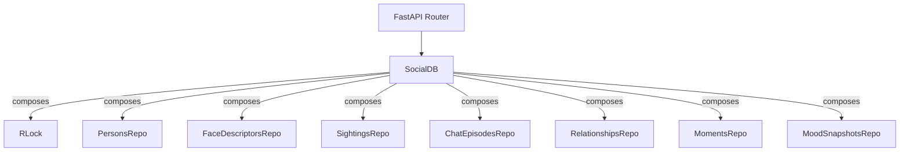
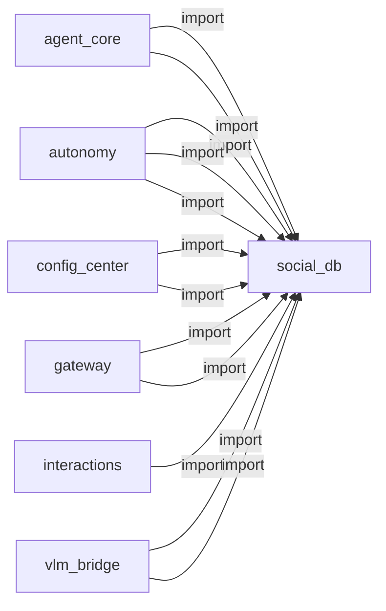

# social_db

> **SQLite kişi hafızası, ilişki/tanıma seviyeleri**

## Kimlik
| Alan | Değer |
| --- | --- |
| Ana sınıf | `SocialDB` |
| Giriş noktası | `—` |
| Orkestratör | `—` |
| Ana dosya | `modules/social_db/db.py` |
| Katman | Veri |
| Port | — |
| Arduino | Hayır |
| Sınıf sayısı | 11 |
| Endpoint sayısı | 0 |

## İsimlendirilmiş Bileşenler (Sınıflar)

#### `SocialDB` — `modules/social_db/db.py`
- **Görev:** Aggregates SQLite repositories for the social/identity domain.
- **Kalıtım:** —
- **Oluşturduğu bileşenler:** `RLock`, `PersonsRepo`, `FaceDescriptorsRepo`, `SightingsRepo`, `ChatEpisodesRepo`, `RelationshipsRepo`, `MomentsRepo`, `MoodSnapshotsRepo`, `RitualsRepo`, `InteractionEventsRepo`, `OwnerSessionsRepo`
- **Metodlar:** `close()`, `transaction()`, `execute()`, `executemany()`, `fetchone()`, `fetchall()`, `snapshot_stats()`

#### `ChatEpisodesRepo` — `modules/social_db/repositories/chat_episodes.py`
- **Görev:** Per-person chat history. Capped via :meth:`prune_for_person`.
- **Kalıtım:** —
- **Oluşturduğu bileşenler:** —
- **Metodlar:** `append()`, `recent_for_person()`, `last_user_utterance()`, `prune_for_person()`

#### `FaceDescriptorsRepo` — `modules/social_db/repositories/face_descriptors.py`
- **Görev:** Stores ORB / face_recognition / arbitrary descriptor blobs per person.
- **Kalıtım:** —
- **Oluşturduğu bileşenler:** —
- **Metodlar:** `add()`, `replace_for_person()`, `list_for_person()`, `list_all_by_kind()`, `delete_for_person()`

#### `InteractionEventsRepo` — `modules/social_db/repositories/interaction_events.py`
- **Görev:** Append-only log of interaction-engine and config-audit events.
- **Kalıtım:** —
- **Oluşturduğu bileşenler:** —
- **Metodlar:** `log()`, `recent()`, `counts()`, `prune_older_than()`

#### `MomentsRepo` — `modules/social_db/repositories/moments.py`
- **Görev:** Salience-weighted memory snippets per person.
- **Kalıtım:** —
- **Oluşturduğu bileşenler:** —
- **Metodlar:** `add_or_boost()`, `top_for_person()`, `list_for_person()`, `decay()`, `delete_for_person()`, `replace_moments_for_person()`

#### `MoodSnapshotsRepo` — `modules/social_db/repositories/mood_snapshots.py`
- **Görev:** Periodic snapshots of the MoodManager state.
- **Kalıtım:** —
- **Oluşturduğu bileşenler:** —
- **Metodlar:** `record()`, `latest()`, `recent()`, `prune_older_than()`

#### `OwnerSessionsRepo` — `modules/social_db/repositories/owner_sessions.py`
- **Görev:** Tracks owner presence windows for the owner_guard layer.
- **Kalıtım:** —
- **Oluşturduğu bileşenler:** —
- **Metodlar:** `start()`, `end()`, `end_active()`, `active()`, `recent()`

#### `PersonsRepo` — `modules/social_db/repositories/persons.py`
- **Görev:** CRUD layer for the ``persons`` table.
- **Kalıtım:** —
- **Oluşturduğu bileşenler:** —
- **Metodlar:** `upsert()`, `get_by_name()`, `get_by_id()`, `list_all()`, `get_owner()`, `set_owner()`, `top_people()`, `adjust_trust()`, `delete()`

#### `RelationshipsRepo` — `modules/social_db/repositories/relationships.py`
- **Görev:** Key/value style relationship preferences per person (likes, dislikes, topics, ...).
- **Kalıtım:** —
- **Oluşturduğu bileşenler:** —
- **Metodlar:** `set()`, `list_for_person()`, `list_grouped()`, `delete()`

#### `RitualsRepo` — `modules/social_db/repositories/rituals.py`
- **Görev:** Per-day ritual bookkeeping (e.g. morning greeting, owner return).
- **Kalıtım:** —
- **Oluşturduğu bileşenler:** —
- **Metodlar:** `today()`, `mark_done()`, `is_done()`, `get()`, `list_for_day()`, `prune_older_than()`

#### `SightingsRepo` — `modules/social_db/repositories/sightings.py`
- **Görev:** Append-only sighting log per person.
- **Kalıtım:** —
- **Oluşturduğu bileşenler:** —
- **Metodlar:** `record()`, `recent_for_person()`, `recent()`


## API — Endpoint → Handler → Servis

| HTTP | Path | Handler | Çağırdığı servis | Açıklama |
| --- | --- | --- | --- | --- |


## Config Bölümleri
- `path`
- `wal`
- `cache_size_kb`
- `busy_timeout_ms`
- `default_owner_name`
- `auto_migrate`

## Dış İlişkiler (Bu modül → diğerleri)

| Hedef modül | Bağlantı tipi | Detay | Neden |
| --- | --- | --- | --- |


## Gelen İlişkiler (Diğerleri → bu modül)

| Kaynak modül | Bağlantı tipi | Detay | Neden |
| --- | --- | --- | --- |
| [[agent_core]] | import | get_default | Kullanıcı/tanıma verisi için sosyal hafızayı kullanır. |
| [[agent_core]] | import | db | Kullanıcı/tanıma verisi için sosyal hafızayı kullanır. |
| [[autonomy]] | import | get_default | Kişi hafızası ve ilişki seviyelerini okur/günceller. |
| [[autonomy]] | import | SocialDB | Kişi hafızası ve ilişki seviyelerini okur/günceller. |
| [[autonomy]] | import | db | Kişi hafızası ve ilişki seviyelerini okur/günceller. |
| [[config_center]] | import | get_default | `config_center` kod içinde `social_db` modülünü import eder (`get_default`) — SQLite kişi hafızası, ilişki/tanıma seviyeleri. |
| [[config_center]] | import | db | `config_center` kod içinde `social_db` modülünü import eder (`db`) — SQLite kişi hafızası, ilişki/tanıma seviyeleri. |
| [[gateway]] | import | config_loader | `gateway` kod içinde `social_db` modülünü import eder (`config_loader`) — SQLite kişi hafızası, ilişki/tanıma seviyeleri. |
| [[gateway]] | import | db | `gateway` kod içinde `social_db` modülünü import eder (`db`) — SQLite kişi hafızası, ilişki/tanıma seviyeleri. |
| [[interactions]] | import | get_default | `interactions` kod içinde `social_db` modülünü import eder (`get_default`) — SQLite kişi hafızası, ilişki/tanıma seviyeleri. |
| [[vlm_bridge]] | import | get_default | Yüz tanıma sonuçlarını kişi kaydına yazar. |
| [[vlm_bridge]] | import | SocialDB | Yüz tanıma sonuçlarını kişi kaydına yazar. |

## İç Mimari (otomatik çıkarım)



## Modül Etkileşim Haritası



---

# Tam Kaynak Arşivi

### `modules/social_db/__init__.py` (15 satır)

```python
"""Unified social SQLite store shared by VLM bridge, autonomy and interactions.

Exposes a single :class:`SocialDB` aggregator that bundles repositories for
persons, face descriptors, sightings, chat episodes, relationships, moments,
mood snapshots, rituals, interaction events and owner sessions.

Modules typically obtain a shared instance through :func:`get_default` and
delegate persistence calls to the repositories. JSON-backed adapters keep
working when no instance is registered, which preserves backward compatibility
in degraded environments.
"""

from .db import SocialDB, get_default, set_default, reset_default

__all__ = ["SocialDB", "get_default", "set_default", "reset_default"]
```

### `modules/social_db/config/config.yml` (6 satır)

```yaml
path: "data/social.sqlite3"
wal: true
cache_size_kb: 4096
busy_timeout_ms: 5000
default_owner_name: ""
auto_migrate: true
```

### `modules/social_db/config_loader.py` (14 satır)

```python
from __future__ import annotations
from pathlib import Path
from typing import Any, Dict
import yaml

_DEFAULT_CFG_PATH = Path(__file__).parent / "config" / "config.yml"


def load_config(path: str | None = None) -> Dict[str, Any]:
    p = Path(path) if path else _DEFAULT_CFG_PATH
    if not p.exists():
        p = _DEFAULT_CFG_PATH
    with open(p, "r", encoding="utf-8") as f:
        return yaml.safe_load(f) or {}
```

### `modules/social_db/db.py` (206 satır)

```python
"""SQLite connection and aggregator for the unified social store.

The :class:`SocialDB` owns a single threadsafe connection (``check_same_thread``
disabled) protected by a :class:`threading.RLock`. Repositories are attached as
attributes and share the underlying connection. The store creates the schema
lazily on first use.
"""

from __future__ import annotations

import logging
import sqlite3
import threading
import time
from contextlib import contextmanager
from pathlib import Path
from typing import Any, Dict, Iterator, Optional

from .schema import SCHEMA_VERSION, get_ddl

logger = logging.getLogger("social_db")

_DEFAULT_LOCK = threading.Lock()
_DEFAULT: Optional["SocialDB"] = None


def _project_root() -> Path:
    return Path(__file__).resolve().parents[2]


class SocialDB:
    """Aggregates SQLite repositories for the social/identity domain."""

    def __init__(
        self,
        path: str | Path = "data/social.sqlite3",
        *,
        wal: bool = True,
        cache_size_kb: int = 4096,
        busy_timeout_ms: int = 5000,
        auto_migrate: bool = True,
    ) -> None:
        self.path = self._resolve_path(path)
        self._lock = threading.RLock()
        self.path.parent.mkdir(parents=True, exist_ok=True)
        self._conn = sqlite3.connect(
            str(self.path),
            check_same_thread=False,
            isolation_level=None,
            timeout=max(0.1, busy_timeout_ms / 1000.0),
        )
        self._conn.row_factory = sqlite3.Row
        self._conn.execute(f"PRAGMA busy_timeout = {int(busy_timeout_ms)}")
        if wal:
            try:
                self._conn.execute("PRAGMA journal_mode = WAL")
            except sqlite3.Error as exc:
                logger.debug("WAL mode unavailable: %s", exc)
        try:
            self._conn.execute(f"PRAGMA cache_size = -{int(max(64, cache_size_kb))}")
            self._conn.execute("PRAGMA foreign_keys = ON")
            self._conn.execute("PRAGMA synchronous = NORMAL")
        except sqlite3.Error as exc:
            logger.debug("PRAGMA tuning failed: %s", exc)

        if auto_migrate:
            self._migrate()

        from .repositories.persons import PersonsRepo
        from .repositories.face_descriptors import FaceDescriptorsRepo
        from .repositories.sightings import SightingsRepo
        from .repositories.chat_episodes import ChatEpisodesRepo
        from .repositories.relationships import RelationshipsRepo
        from .repositories.moments import MomentsRepo
        from .repositories.mood_snapshots import MoodSnapshotsRepo
        from .repositories.rituals import RitualsRepo
        from .repositories.interaction_events import InteractionEventsRepo
        from .repositories.owner_sessions import OwnerSessionsRepo

        self.persons = PersonsRepo(self)
        self.face_descriptors = FaceDescriptorsRepo(self)
        self.sightings = SightingsRepo(self)
        self.chat_episodes = ChatEpisodesRepo(self)
        self.relationships = RelationshipsRepo(self)
        self.moments = MomentsRepo(self)
        self.mood_snapshots = MoodSnapshotsRepo(self)
        self.rituals = RitualsRepo(self)
        self.interaction_events = InteractionEventsRepo(self)
        self.owner_sessions = OwnerSessionsRepo(self)

    def close(self) -> None:
        with self._lock:
            try:
                self._conn.close()
            except Exception:
                pass

    @staticmethod
    def _resolve_path(path: str | Path) -> Path:
        p = Path(path)
        if p.is_absolute():
            return p
        return (_project_root() / p).resolve()

    @contextmanager
    def transaction(self) -> Iterator[sqlite3.Connection]:
        """Run a block under an exclusive transaction. Reuses the shared connection."""
        with self._lock:
            cur = self._conn.cursor()
            try:
                cur.execute("BEGIN IMMEDIATE")
                yield self._conn
                cur.execute("COMMIT")
            except Exception:
                try:
                    cur.execute("ROLLBACK")
                except Exception:
                    pass
                raise
            finally:
                cur.close()

    def execute(self, sql: str, params: tuple | list | dict = ()) -> sqlite3.Cursor:
        with self._lock:
            return self._conn.execute(sql, params)

    def executemany(self, sql: str, seq: list[tuple] | list[dict]) -> sqlite3.Cursor:
        with self._lock:
            return self._conn.executemany(sql, seq)

    def fetchone(self, sql: str, params: tuple | list | dict = ()) -> Optional[sqlite3.Row]:
        with self._lock:
            cur = self._conn.execute(sql, params)
            try:
                return cur.fetchone()
            finally:
                cur.close()

    def fetchall(self, sql: str, params: tuple | list | dict = ()) -> list[sqlite3.Row]:
        with self._lock:
            cur = self._conn.execute(sql, params)
            try:
                return cur.fetchall()
            finally:
                cur.close()

    def snapshot_stats(self) -> Dict[str, int]:
        """Return row counts for monitoring and admin UI surfaces."""
        out: Dict[str, int] = {}
        tables = (
            "persons",
            "face_descriptors",
            "sightings",
            "chat_episodes",
            "relationships",
            "moments",
            "mood_snapshots",
            "rituals",
            "interaction_events",
            "owner_sessions",
        )
        for tbl in tables:
            try:
                row = self.fetchone(f"SELECT COUNT(*) AS n FROM {tbl}")
                out[tbl] = int(row["n"]) if row else 0
            except Exception:
                out[tbl] = 0
        out["schema_version"] = SCHEMA_VERSION
        return out

    def _migrate(self) -> None:
        with self._lock:
            cur = self._conn.cursor()
            try:
                for stmt in get_ddl():
                    cur.execute(stmt)
                cur.execute(
                    "INSERT OR IGNORE INTO schema_version(version, applied_at) VALUES (?, ?)",
                    (SCHEMA_VERSION, time.time()),
                )
            finally:
                cur.close()


def get_default() -> Optional[SocialDB]:
    """Return the process-wide default :class:`SocialDB`, if registered."""
    with _DEFAULT_LOCK:
        return _DEFAULT


def set_default(db: SocialDB) -> None:
    global _DEFAULT
    with _DEFAULT_LOCK:
        _DEFAULT = db


def reset_default() -> None:
    """Clear the process-wide default. Used by tests."""
    global _DEFAULT
    with _DEFAULT_LOCK:
        if _DEFAULT is not None:
            try:
                _DEFAULT.close()
            except Exception:
                pass
        _DEFAULT = None
```

### `modules/social_db/repositories/__init__.py` (6 satır)

```python
"""Repository classes for the unified social store.

Each repository wraps a thread-safe :class:`SocialDB` connection and provides a
focused CRUD/query surface for a single table. Repositories do not maintain
state of their own besides the back-reference to the parent store.
"""
```

### `modules/social_db/repositories/chat_episodes.py` (78 satır)

```python
from __future__ import annotations

import time
from typing import Any, Dict, List, Optional, TYPE_CHECKING

if TYPE_CHECKING:
    from ..db import SocialDB


class ChatEpisodesRepo:
    """Per-person chat history. Capped via :meth:`prune_for_person`."""

    def __init__(self, db: "SocialDB") -> None:
        self.db = db

    def append(
        self,
        person_id: str,
        *,
        role: str,
        text: str,
        ts: Optional[float] = None,
        language: str = "",
        summary: str = "",
    ) -> int:
        when = float(ts) if ts is not None else time.time()
        with self.db.transaction() as conn:
            cur = conn.execute(
                """
                INSERT INTO chat_episodes (person_id, ts, role, text, language, summary)
                VALUES (?, ?, ?, ?, ?, ?)
                """,
                (
                    str(person_id),
                    when,
                    str(role or "user"),
                    str(text or ""),
                    str(language or ""),
                    str(summary or ""),
                ),
            )
            return int(cur.lastrowid or 0)

    def recent_for_person(self, person_id: str, limit: int = 16) -> List[Dict[str, Any]]:
        rows = self.db.fetchall(
            "SELECT * FROM chat_episodes WHERE person_id = ? ORDER BY ts DESC LIMIT ?",
            (str(person_id), max(1, int(limit))),
        )
        items = [{k: r[k] for k in r.keys()} for r in rows]
        items.reverse()
        return items

    def last_user_utterance(self, person_id: str) -> str:
        row = self.db.fetchone(
            """
            SELECT text FROM chat_episodes
            WHERE person_id = ? AND lower(role) = 'user'
            ORDER BY ts DESC LIMIT 1
            """,
            (str(person_id),),
        )
        return str(row["text"]) if row else ""

    def prune_for_person(self, person_id: str, keep_last: int = 16) -> int:
        with self.db.transaction() as conn:
            cur = conn.execute(
                """
                DELETE FROM chat_episodes
                WHERE person_id = ?
                  AND id NOT IN (
                    SELECT id FROM chat_episodes
                    WHERE person_id = ?
                    ORDER BY ts DESC LIMIT ?
                  )
                """,
                (str(person_id), str(person_id), max(1, int(keep_last))),
            )
            return int(cur.rowcount or 0)
```

### `modules/social_db/repositories/face_descriptors.py` (115 satır)

```python
from __future__ import annotations

import time
from typing import Any, Dict, List, Optional, Tuple, TYPE_CHECKING

if TYPE_CHECKING:
    from ..db import SocialDB


class FaceDescriptorsRepo:
    """Stores ORB / face_recognition / arbitrary descriptor blobs per person."""

    def __init__(self, db: "SocialDB") -> None:
        self.db = db

    def add(
        self,
        person_id: str,
        kind: str,
        blob: bytes,
        *,
        rows: int = 0,
        cols: int = 0,
        score: float = 0.0,
    ) -> int:
        now = time.time()
        with self.db.transaction() as conn:
            cur = conn.execute(
                """
                INSERT INTO face_descriptors (person_id, kind, blob, rows, cols, score, created_at)
                VALUES (?, ?, ?, ?, ?, ?, ?)
                """,
                (str(person_id), str(kind), bytes(blob), int(rows), int(cols), float(score), now),
            )
            return int(cur.lastrowid or 0)

    def replace_for_person(
        self,
        person_id: str,
        kind: str,
        blob: bytes,
        *,
        rows: int = 0,
        cols: int = 0,
        score: float = 0.0,
    ) -> int:
        """Convenience: remove existing rows of ``kind`` for the person, then insert a new one."""
        with self.db.transaction() as conn:
            conn.execute(
                "DELETE FROM face_descriptors WHERE person_id = ? AND kind = ?",
                (str(person_id), str(kind)),
            )
            cur = conn.execute(
                """
                INSERT INTO face_descriptors (person_id, kind, blob, rows, cols, score, created_at)
                VALUES (?, ?, ?, ?, ?, ?, ?)
                """,
                (
                    str(person_id),
                    str(kind),
                    bytes(blob),
                    int(rows),
                    int(cols),
                    float(score),
                    time.time(),
                ),
            )
            return int(cur.lastrowid or 0)

    def list_for_person(self, person_id: str, kind: Optional[str] = None) -> List[Dict[str, Any]]:
        if kind is None:
            rows = self.db.fetchall(
                "SELECT * FROM face_descriptors WHERE person_id = ? ORDER BY created_at DESC",
                (str(person_id),),
            )
        else:
            rows = self.db.fetchall(
                "SELECT * FROM face_descriptors WHERE person_id = ? AND kind = ? ORDER BY created_at DESC",
                (str(person_id), str(kind)),
            )
        return [{k: r[k] for k in r.keys()} for r in rows]

    def list_all_by_kind(self, kind: str) -> List[Tuple[str, Dict[str, Any]]]:
        """Return ``[(person_id, row)]`` pairs for a given descriptor ``kind``.

        Useful for loading ORB descriptors into the in-memory FaceManager.
        """
        rows = self.db.fetchall(
            """
            SELECT fd.*, p.display_name AS display_name, p.canonical_name AS canonical_name
            FROM face_descriptors fd
            JOIN persons p ON p.id = fd.person_id
            WHERE fd.kind = ?
            ORDER BY fd.created_at DESC
            """,
            (str(kind),),
        )
        out: List[Tuple[str, Dict[str, Any]]] = []
        for r in rows:
            out.append((r["person_id"], {k: r[k] for k in r.keys()}))
        return out

    def delete_for_person(self, person_id: str, kind: Optional[str] = None) -> int:
        with self.db.transaction() as conn:
            if kind is None:
                cur = conn.execute(
                    "DELETE FROM face_descriptors WHERE person_id = ?",
                    (str(person_id),),
                )
            else:
                cur = conn.execute(
                    "DELETE FROM face_descriptors WHERE person_id = ? AND kind = ?",
                    (str(person_id), str(kind)),
                )
            return int(cur.rowcount or 0)
```

### `modules/social_db/repositories/interaction_events.py` (73 satır)

```python
from __future__ import annotations

import json
import time
from typing import Any, Dict, List, Optional, TYPE_CHECKING

if TYPE_CHECKING:
    from ..db import SocialDB


class InteractionEventsRepo:
    """Append-only log of interaction-engine and config-audit events."""

    def __init__(self, db: "SocialDB") -> None:
        self.db = db

    def log(
        self,
        kind: str,
        *,
        count_inc: int = 1,
        payload: Optional[Dict[str, Any]] = None,
        ts: Optional[float] = None,
    ) -> int:
        when = float(ts) if ts is not None else time.time()
        with self.db.transaction() as conn:
            cur = conn.execute(
                """
                INSERT INTO interaction_events (ts, kind, count_inc, payload_json)
                VALUES (?, ?, ?, ?)
                """,
                (
                    when,
                    str(kind or ""),
                    int(count_inc or 1),
                    json.dumps(payload or {}, ensure_ascii=True),
                ),
            )
            return int(cur.lastrowid or 0)

    def recent(self, limit: int = 50, kind: Optional[str] = None) -> List[Dict[str, Any]]:
        if kind:
            rows = self.db.fetchall(
                "SELECT * FROM interaction_events WHERE kind = ? ORDER BY ts DESC LIMIT ?",
                (str(kind), max(1, int(limit))),
            )
        else:
            rows = self.db.fetchall(
                "SELECT * FROM interaction_events ORDER BY ts DESC LIMIT ?",
                (max(1, int(limit)),),
            )
        out: List[Dict[str, Any]] = []
        for r in rows:
            row = {k: r[k] for k in r.keys()}
            try:
                row["payload"] = json.loads(row.pop("payload_json") or "{}")
            except Exception:
                row["payload"] = {}
                row.pop("payload_json", None)
            out.append(row)
        return out

    def counts(self) -> Dict[str, int]:
        rows = self.db.fetchall(
            "SELECT kind, SUM(count_inc) AS total FROM interaction_events GROUP BY kind"
        )
        return {str(r["kind"]): int(r["total"] or 0) for r in rows}

    def prune_older_than(self, days: float = 30.0) -> int:
        cutoff = time.time() - max(0.0, float(days)) * 86400.0
        with self.db.transaction() as conn:
            cur = conn.execute("DELETE FROM interaction_events WHERE ts < ?", (cutoff,))
            return int(cur.rowcount or 0)
```

### `modules/social_db/repositories/moments.py` (125 satır)

```python
from __future__ import annotations

import time
from typing import Any, Dict, List, Optional, TYPE_CHECKING

if TYPE_CHECKING:
    from ..db import SocialDB


class MomentsRepo:
    """Salience-weighted memory snippets per person."""

    def __init__(self, db: "SocialDB") -> None:
        self.db = db

    def add_or_boost(
        self,
        person_id: str,
        text: str,
        salience: float,
        *,
        kind: str = "note",
    ) -> int:
        """Insert a moment or boost an existing exact-text match."""
        val = str(text or "").strip()[:220]
        if not val:
            return 0
        now = time.time()
        with self.db.transaction() as conn:
            row = conn.execute(
                "SELECT id, score FROM moments WHERE person_id = ? AND text = ?",
                (str(person_id), val),
            ).fetchone()
            if row is not None:
                new_score = min(1.0, float(row["score"] or 0.0) + float(salience))
                conn.execute(
                    "UPDATE moments SET score = ?, updated_at = ? WHERE id = ?",
                    (new_score, now, int(row["id"])),
                )
                return int(row["id"])
            score = max(0.05, min(1.0, float(salience)))
            cur = conn.execute(
                """
                INSERT INTO moments (person_id, ts, kind, text, score, updated_at)
                VALUES (?, ?, ?, ?, ?, ?)
                """,
                (str(person_id), now, str(kind or "note"), val, score, now),
            )
            return int(cur.lastrowid or 0)

    def top_for_person(self, person_id: str, limit: int = 1) -> List[Dict[str, Any]]:
        rows = self.db.fetchall(
            "SELECT * FROM moments WHERE person_id = ? ORDER BY score DESC, updated_at DESC LIMIT ?",
            (str(person_id), max(1, int(limit))),
        )
        return [{k: r[k] for k in r.keys()} for r in rows]

    def list_for_person(self, person_id: str, limit: int = 24) -> List[Dict[str, Any]]:
        rows = self.db.fetchall(
            "SELECT * FROM moments WHERE person_id = ? ORDER BY updated_at DESC LIMIT ?",
            (str(person_id), max(1, int(limit))),
        )
        return [{k: r[k] for k in r.keys()} for r in rows]

    def decay(self, person_id: str, half_life_s: float = 216000.0) -> int:
        """Apply exponential decay and drop low-score rows. Returns deleted count."""
        now = time.time()
        decay_per_sec = 0.5 / max(1.0, float(half_life_s))
        with self.db.transaction() as conn:
            rows = conn.execute(
                "SELECT id, score, updated_at FROM moments WHERE person_id = ?",
                (str(person_id),),
            ).fetchall()
            deleted = 0
            for r in rows:
                dt = max(0.0, now - float(r["updated_at"] or now))
                score = float(r["score"] or 0.0) - dt * decay_per_sec
                score = max(0.0, min(1.0, score))
                if score < 0.08:
                    conn.execute("DELETE FROM moments WHERE id = ?", (int(r["id"]),))
                    deleted += 1
                else:
                    conn.execute(
                        "UPDATE moments SET score = ?, updated_at = ? WHERE id = ?",
                        (score, now, int(r["id"])),
                    )
            return deleted

    def delete_for_person(self, person_id: str) -> int:
        with self.db.transaction() as conn:
            cur = conn.execute(
                "DELETE FROM moments WHERE person_id = ?", (str(person_id),)
            )
            return int(cur.rowcount or 0)

    def replace_moments_for_person(
        self,
        person_id: str,
        items: List[Dict[str, Any]],
    ) -> int:
        """Bulk replace operation used by migration to seed initial data."""
        now = time.time()
        with self.db.transaction() as conn:
            conn.execute("DELETE FROM moments WHERE person_id = ?", (str(person_id),))
            inserted = 0
            for item in items:
                text = str(item.get("text", "") or "").strip()
                if not text:
                    continue
                conn.execute(
                    """
                    INSERT INTO moments (person_id, ts, kind, text, score, updated_at)
                    VALUES (?, ?, ?, ?, ?, ?)
                    """,
                    (
                        str(person_id),
                        float(item.get("created_at", now) or now),
                        str(item.get("kind", "note") or "note"),
                        text,
                        float(item.get("score", 0.1) or 0.1),
                        float(item.get("updated_at", now) or now),
                    ),
                )
                inserted += 1
            return inserted
```

### `modules/social_db/repositories/mood_snapshots.py` (57 satır)

```python
from __future__ import annotations

import time
from typing import Any, Dict, List, Optional, TYPE_CHECKING

if TYPE_CHECKING:
    from ..db import SocialDB


class MoodSnapshotsRepo:
    """Periodic snapshots of the MoodManager state."""

    def __init__(self, db: "SocialDB") -> None:
        self.db = db

    def record(
        self,
        *,
        happiness: float,
        energy: float,
        curiosity: float,
        fear: float,
        dominant: str,
        ts: Optional[float] = None,
    ) -> None:
        when = float(ts) if ts is not None else time.time()
        with self.db.transaction() as conn:
            conn.execute(
                """
                INSERT INTO mood_snapshots (ts, happiness, energy, curiosity, fear, dominant)
                VALUES (?, ?, ?, ?, ?, ?)
                ON CONFLICT(ts) DO UPDATE SET
                    happiness=excluded.happiness,
                    energy=excluded.energy,
                    curiosity=excluded.curiosity,
                    fear=excluded.fear,
                    dominant=excluded.dominant
                """,
                (when, float(happiness), float(energy), float(curiosity), float(fear), str(dominant or "neutral")),
            )

    def latest(self) -> Optional[Dict[str, Any]]:
        row = self.db.fetchone("SELECT * FROM mood_snapshots ORDER BY ts DESC LIMIT 1")
        return {k: row[k] for k in row.keys()} if row else None

    def recent(self, limit: int = 30) -> List[Dict[str, Any]]:
        rows = self.db.fetchall(
            "SELECT * FROM mood_snapshots ORDER BY ts DESC LIMIT ?",
            (max(1, int(limit)),),
        )
        return [{k: r[k] for k in r.keys()} for r in rows]

    def prune_older_than(self, days: float = 14.0) -> int:
        cutoff = time.time() - max(0.0, float(days)) * 86400.0
        with self.db.transaction() as conn:
            cur = conn.execute("DELETE FROM mood_snapshots WHERE ts < ?", (cutoff,))
            return int(cur.rowcount or 0)
```

### `modules/social_db/repositories/owner_sessions.py` (54 satır)

```python
from __future__ import annotations

import time
from typing import Any, Dict, List, Optional, TYPE_CHECKING

if TYPE_CHECKING:
    from ..db import SocialDB


class OwnerSessionsRepo:
    """Tracks owner presence windows for the owner_guard layer."""

    def __init__(self, db: "SocialDB") -> None:
        self.db = db

    def start(self, *, source: str = "", authority_level: int = 5, notes: str = "") -> int:
        with self.db.transaction() as conn:
            cur = conn.execute(
                """
                INSERT INTO owner_sessions (start_ts, end_ts, source, authority_level, notes)
                VALUES (?, NULL, ?, ?, ?)
                """,
                (time.time(), str(source or ""), int(authority_level), str(notes or "")),
            )
            return int(cur.lastrowid or 0)

    def end(self, session_id: int, *, notes: str = "") -> bool:
        with self.db.transaction() as conn:
            cur = conn.execute(
                "UPDATE owner_sessions SET end_ts = ?, notes = COALESCE(NULLIF(?, ''), notes) WHERE id = ? AND end_ts IS NULL",
                (time.time(), str(notes or ""), int(session_id)),
            )
            return (cur.rowcount or 0) > 0

    def end_active(self) -> int:
        with self.db.transaction() as conn:
            cur = conn.execute(
                "UPDATE owner_sessions SET end_ts = ? WHERE end_ts IS NULL",
                (time.time(),),
            )
            return int(cur.rowcount or 0)

    def active(self) -> Optional[Dict[str, Any]]:
        row = self.db.fetchone(
            "SELECT * FROM owner_sessions WHERE end_ts IS NULL ORDER BY start_ts DESC LIMIT 1"
        )
        return {k: row[k] for k in row.keys()} if row else None

    def recent(self, limit: int = 20) -> List[Dict[str, Any]]:
        rows = self.db.fetchall(
            "SELECT * FROM owner_sessions ORDER BY start_ts DESC LIMIT ?",
            (max(1, int(limit)),),
        )
        return [{k: r[k] for k in r.keys()} for r in rows]
```

### `modules/social_db/repositories/persons.py` (205 satır)

```python
from __future__ import annotations

import json
import time
import uuid
from typing import Any, Dict, List, Optional, TYPE_CHECKING

if TYPE_CHECKING:
    from ..db import SocialDB


def _canon(name: str) -> str:
    return str(name or "").strip().lower()


class PersonsRepo:
    """CRUD layer for the ``persons`` table."""

    def __init__(self, db: "SocialDB") -> None:
        self.db = db

    def upsert(
        self,
        name: str,
        *,
        person_id: Optional[str] = None,
        recognition_level: Optional[int] = None,
        relationship: Optional[str] = None,
        is_owner: Optional[bool] = None,
        owner_priority: Optional[bool] = None,
        trust_score: Optional[float] = None,
        last_emotion: Optional[str] = None,
        last_distance_m: Optional[float] = None,
        increment_seen: bool = False,
        extra_patch: Optional[Dict[str, Any]] = None,
    ) -> Dict[str, Any]:
        """Create or update a person record keyed by canonical name."""
        canonical = _canon(name)
        if not canonical:
            canonical = "unknown"
        display = str(name or "").strip() or "Unknown"
        now = time.time()
        with self.db.transaction() as conn:
            row = conn.execute(
                "SELECT * FROM persons WHERE canonical_name = ?",
                (canonical,),
            ).fetchone()
            if row is None:
                pid = person_id or uuid.uuid4().hex[:10]
                extra = json.dumps(extra_patch or {}, ensure_ascii=True)
                conn.execute(
                    """
                    INSERT INTO persons (
                        id, canonical_name, display_name, recognition_level,
                        relationship, is_owner, owner_priority, seen_count,
                        trust_score, last_emotion, last_distance_m,
                        first_seen_at, last_seen_at, created_at, updated_at, extra_json
                    ) VALUES (?, ?, ?, ?, ?, ?, ?, ?, ?, ?, ?, ?, ?, ?, ?, ?)
                    """,
                    (
                        pid,
                        canonical,
                        display,
                        int(recognition_level or 0),
                        str(relationship or "unknown"),
                        1 if is_owner else 0,
                        1 if owner_priority else 0,
                        1 if increment_seen else 0,
                        float(trust_score or 0.0),
                        str(last_emotion or ""),
                        float(last_distance_m) if last_distance_m is not None else None,
                        now,
                        now,
                        now,
                        now,
                        extra,
                    ),
                )
                return self._fetch_locked(conn, canonical)

            pid = row["id"]
            updates: list[str] = ["updated_at = ?", "last_seen_at = ?"]
            params: list[Any] = [now, now]
            if display and row["display_name"] != display:
                updates.append("display_name = ?")
                params.append(display)
            if recognition_level is not None:
                updates.append("recognition_level = ?")
                params.append(int(recognition_level))
            if relationship is not None:
                updates.append("relationship = ?")
                params.append(str(relationship))
            if is_owner is not None:
                updates.append("is_owner = ?")
                params.append(1 if is_owner else 0)
            if owner_priority is not None:
                updates.append("owner_priority = ?")
                params.append(1 if owner_priority else 0)
            if trust_score is not None:
                updates.append("trust_score = ?")
                params.append(float(trust_score))
            if last_emotion is not None:
                updates.append("last_emotion = ?")
                params.append(str(last_emotion))
            if last_distance_m is not None:
                updates.append("last_distance_m = ?")
                params.append(float(last_distance_m))
            if increment_seen:
                updates.append("seen_count = seen_count + 1")
            if extra_patch:
                try:
                    current_extra = json.loads(row["extra_json"] or "{}")
                except Exception:
                    current_extra = {}
                current_extra.update(extra_patch)
                updates.append("extra_json = ?")
                params.append(json.dumps(current_extra, ensure_ascii=True))
            params.append(pid)
            conn.execute(
                f"UPDATE persons SET {', '.join(updates)} WHERE id = ?",
                params,
            )
            return self._fetch_locked(conn, canonical)

    def get_by_name(self, name: str) -> Optional[Dict[str, Any]]:
        canonical = _canon(name)
        if not canonical:
            return None
        row = self.db.fetchone(
            "SELECT * FROM persons WHERE canonical_name = ?", (canonical,)
        )
        return self._row_to_dict(row) if row else None

    def get_by_id(self, person_id: str) -> Optional[Dict[str, Any]]:
        if not person_id:
            return None
        row = self.db.fetchone("SELECT * FROM persons WHERE id = ?", (person_id,))
        return self._row_to_dict(row) if row else None

    def list_all(self) -> List[Dict[str, Any]]:
        rows = self.db.fetchall("SELECT * FROM persons ORDER BY last_seen_at DESC")
        return [self._row_to_dict(r) for r in rows]

    def get_owner(self) -> Optional[Dict[str, Any]]:
        row = self.db.fetchone(
            "SELECT * FROM persons WHERE is_owner = 1 OR owner_priority = 1 OR recognition_level >= 5 ORDER BY recognition_level DESC LIMIT 1"
        )
        return self._row_to_dict(row) if row else None

    def set_owner(self, name: str) -> Dict[str, Any]:
        return self.upsert(
            name,
            recognition_level=5,
            relationship="owner",
            is_owner=True,
            owner_priority=True,
        )

    def top_people(self, limit: int = 3) -> List[Dict[str, Any]]:
        rows = self.db.fetchall(
            "SELECT * FROM persons ORDER BY seen_count DESC, last_seen_at DESC LIMIT ?",
            (max(1, int(limit)),),
        )
        return [self._row_to_dict(r) for r in rows]

    def adjust_trust(
        self,
        person_id: str,
        delta: float,
        *,
        min_score: float = 0.0,
        max_score: float = 1.0,
    ) -> float:
        """Nudge trust_score by delta and return the clamped new value."""
        rec = self.get_by_id(person_id)
        if not rec:
            return 0.0
        new_score = max(min_score, min(max_score, float(rec.get("trust_score", 0.0)) + float(delta)))
        updated = self.upsert(name=rec.get("display_name") or rec.get("canonical_name") or "Unknown", trust_score=new_score)
        return float(updated.get("trust_score", new_score))

    def delete(self, person_id: str) -> bool:
        with self.db.transaction() as conn:
            cur = conn.execute("DELETE FROM persons WHERE id = ?", (person_id,))
            return cur.rowcount > 0

    @staticmethod
    def _row_to_dict(row: Any) -> Dict[str, Any]:
        if row is None:
            return {}
        out: Dict[str, Any] = {k: row[k] for k in row.keys()}
        try:
            out["extra"] = json.loads(out.pop("extra_json") or "{}")
        except Exception:
            out["extra"] = {}
            out.pop("extra_json", None)
        out["is_owner"] = bool(out.get("is_owner"))
        out["owner_priority"] = bool(out.get("owner_priority"))
        return out

    def _fetch_locked(self, conn: Any, canonical: str) -> Dict[str, Any]:
        row = conn.execute(
            "SELECT * FROM persons WHERE canonical_name = ?", (canonical,)
        ).fetchone()
        return self._row_to_dict(row) if row else {}
```

### `modules/social_db/repositories/relationships.py` (62 satır)

```python
from __future__ import annotations

import time
from typing import Any, Dict, List, TYPE_CHECKING

if TYPE_CHECKING:
    from ..db import SocialDB


class RelationshipsRepo:
    """Key/value style relationship preferences per person (likes, dislikes, topics, ...)."""

    def __init__(self, db: "SocialDB") -> None:
        self.db = db

    def set(self, person_id: str, key: str, value: str) -> None:
        if not key:
            return
        now = time.time()
        with self.db.transaction() as conn:
            conn.execute(
                """
                INSERT INTO relationships (person_id, key, value, updated_at)
                VALUES (?, ?, ?, ?)
                ON CONFLICT(person_id, key) DO UPDATE SET value=excluded.value, updated_at=excluded.updated_at
                """,
                (str(person_id), str(key), str(value or ""), now),
            )

    def list_for_person(self, person_id: str) -> List[Dict[str, Any]]:
        rows = self.db.fetchall(
            "SELECT key, value, updated_at FROM relationships WHERE person_id = ? ORDER BY updated_at DESC",
            (str(person_id),),
        )
        return [{k: r[k] for k in r.keys()} for r in rows]

    def list_grouped(self, person_id: str) -> Dict[str, List[str]]:
        """Return ``{key: [value, ...]}`` for keys ending with ``[]`` (csv lists are split)."""
        rows = self.db.fetchall(
            "SELECT key, value FROM relationships WHERE person_id = ?",
            (str(person_id),),
        )
        out: Dict[str, List[str]] = {}
        for r in rows:
            key = str(r["key"])
            val = str(r["value"] or "")
            if val and "," in val:
                vals = [v.strip() for v in val.split(",") if v.strip()]
            elif val:
                vals = [val]
            else:
                vals = []
            out[key] = vals
        return out

    def delete(self, person_id: str, key: str) -> bool:
        with self.db.transaction() as conn:
            cur = conn.execute(
                "DELETE FROM relationships WHERE person_id = ? AND key = ?",
                (str(person_id), str(key)),
            )
            return (cur.rowcount or 0) > 0
```

### `modules/social_db/repositories/rituals.py` (74 satır)

```python
from __future__ import annotations

import datetime as _dt
import json
import time
from typing import Any, Dict, List, Optional, TYPE_CHECKING

if TYPE_CHECKING:
    from ..db import SocialDB


class RitualsRepo:
    """Per-day ritual bookkeeping (e.g. morning greeting, owner return)."""

    def __init__(self, db: "SocialDB") -> None:
        self.db = db

    @staticmethod
    def today(now: Optional[float] = None) -> str:
        ts = float(now) if now is not None else time.time()
        return _dt.datetime.fromtimestamp(ts).strftime("%Y-%m-%d")

    def mark_done(self, kind: str, *, day: Optional[str] = None, payload: Optional[Dict[str, Any]] = None) -> None:
        d = str(day or self.today())
        now = time.time()
        with self.db.transaction() as conn:
            conn.execute(
                """
                INSERT INTO rituals (day, kind, done_at, payload_json)
                VALUES (?, ?, ?, ?)
                ON CONFLICT(day, kind) DO UPDATE SET
                    done_at=excluded.done_at,
                    payload_json=excluded.payload_json
                """,
                (d, str(kind), now, json.dumps(payload or {}, ensure_ascii=True)),
            )

    def is_done(self, kind: str, *, day: Optional[str] = None) -> bool:
        d = str(day or self.today())
        row = self.db.fetchone(
            "SELECT 1 FROM rituals WHERE day = ? AND kind = ?",
            (d, str(kind)),
        )
        return row is not None

    def get(self, kind: str, *, day: Optional[str] = None) -> Optional[Dict[str, Any]]:
        d = str(day or self.today())
        row = self.db.fetchone(
            "SELECT * FROM rituals WHERE day = ? AND kind = ?",
            (d, str(kind)),
        )
        if not row:
            return None
        out = {k: row[k] for k in row.keys()}
        try:
            out["payload"] = json.loads(out.pop("payload_json") or "{}")
        except Exception:
            out["payload"] = {}
            out.pop("payload_json", None)
        return out

    def list_for_day(self, day: Optional[str] = None) -> List[Dict[str, Any]]:
        d = str(day or self.today())
        rows = self.db.fetchall(
            "SELECT day, kind, done_at FROM rituals WHERE day = ? ORDER BY done_at DESC",
            (d,),
        )
        return [{k: r[k] for k in r.keys()} for r in rows]

    def prune_older_than(self, days: int = 14) -> int:
        cutoff = (_dt.datetime.now() - _dt.timedelta(days=max(0, int(days)))).strftime("%Y-%m-%d")
        with self.db.transaction() as conn:
            cur = conn.execute("DELETE FROM rituals WHERE day < ?", (cutoff,))
            return int(cur.rowcount or 0)
```

### `modules/social_db/repositories/sightings.py` (51 satır)

```python
from __future__ import annotations

import time
from typing import Any, Dict, List, Optional, TYPE_CHECKING

if TYPE_CHECKING:
    from ..db import SocialDB


class SightingsRepo:
    """Append-only sighting log per person."""

    def __init__(self, db: "SocialDB") -> None:
        self.db = db

    def record(
        self,
        person_id: str,
        *,
        ts: Optional[float] = None,
        source: str = "",
        mood: str = "",
        distance_m: Optional[float] = None,
    ) -> int:
        when = float(ts) if ts is not None else time.time()
        with self.db.transaction() as conn:
            cur = conn.execute(
                "INSERT INTO sightings (person_id, ts, source, mood, distance_m) VALUES (?, ?, ?, ?, ?)",
                (
                    str(person_id),
                    when,
                    str(source or ""),
                    str(mood or ""),
                    float(distance_m) if distance_m is not None else None,
                ),
            )
            return int(cur.lastrowid or 0)

    def recent_for_person(self, person_id: str, limit: int = 10) -> List[Dict[str, Any]]:
        rows = self.db.fetchall(
            "SELECT * FROM sightings WHERE person_id = ? ORDER BY ts DESC LIMIT ?",
            (str(person_id), max(1, int(limit))),
        )
        return [{k: r[k] for k in r.keys()} for r in rows]

    def recent(self, limit: int = 20) -> List[Dict[str, Any]]:
        rows = self.db.fetchall(
            "SELECT * FROM sightings ORDER BY ts DESC LIMIT ?",
            (max(1, int(limit)),),
        )
        return [{k: r[k] for k in r.keys()} for r in rows]
```

### `modules/social_db/schema.py` (144 satır)

```python
"""SQLite schema definitions for the unified social store."""

from __future__ import annotations

SCHEMA_VERSION = 1

_DDL: tuple[str, ...] = (
    """
    CREATE TABLE IF NOT EXISTS schema_version (
        version INTEGER PRIMARY KEY,
        applied_at REAL NOT NULL
    )
    """,
    """
    CREATE TABLE IF NOT EXISTS persons (
        id TEXT PRIMARY KEY,
        canonical_name TEXT NOT NULL UNIQUE,
        display_name TEXT NOT NULL DEFAULT '',
        recognition_level INTEGER NOT NULL DEFAULT 0,
        relationship TEXT NOT NULL DEFAULT 'unknown',
        is_owner INTEGER NOT NULL DEFAULT 0,
        owner_priority INTEGER NOT NULL DEFAULT 0,
        seen_count INTEGER NOT NULL DEFAULT 0,
        trust_score REAL NOT NULL DEFAULT 0.0,
        last_emotion TEXT NOT NULL DEFAULT '',
        last_distance_m REAL,
        first_seen_at REAL,
        last_seen_at REAL,
        created_at REAL NOT NULL,
        updated_at REAL NOT NULL,
        extra_json TEXT NOT NULL DEFAULT '{}'
    )
    """,
    "CREATE INDEX IF NOT EXISTS idx_persons_canonical ON persons(canonical_name)",
    "CREATE INDEX IF NOT EXISTS idx_persons_is_owner ON persons(is_owner)",
    """
    CREATE TABLE IF NOT EXISTS face_descriptors (
        id INTEGER PRIMARY KEY AUTOINCREMENT,
        person_id TEXT NOT NULL,
        kind TEXT NOT NULL,
        blob BLOB NOT NULL,
        rows INTEGER NOT NULL DEFAULT 0,
        cols INTEGER NOT NULL DEFAULT 0,
        score REAL NOT NULL DEFAULT 0.0,
        created_at REAL NOT NULL,
        FOREIGN KEY (person_id) REFERENCES persons(id) ON DELETE CASCADE
    )
    """,
    "CREATE INDEX IF NOT EXISTS idx_face_desc_person ON face_descriptors(person_id, kind)",
    """
    CREATE TABLE IF NOT EXISTS sightings (
        id INTEGER PRIMARY KEY AUTOINCREMENT,
        person_id TEXT NOT NULL,
        ts REAL NOT NULL,
        source TEXT NOT NULL DEFAULT '',
        mood TEXT NOT NULL DEFAULT '',
        distance_m REAL,
        FOREIGN KEY (person_id) REFERENCES persons(id) ON DELETE CASCADE
    )
    """,
    "CREATE INDEX IF NOT EXISTS idx_sightings_person_ts ON sightings(person_id, ts)",
    """
    CREATE TABLE IF NOT EXISTS chat_episodes (
        id INTEGER PRIMARY KEY AUTOINCREMENT,
        person_id TEXT NOT NULL,
        ts REAL NOT NULL,
        role TEXT NOT NULL DEFAULT 'user',
        text TEXT NOT NULL,
        language TEXT NOT NULL DEFAULT '',
        summary TEXT NOT NULL DEFAULT '',
        FOREIGN KEY (person_id) REFERENCES persons(id) ON DELETE CASCADE
    )
    """,
    "CREATE INDEX IF NOT EXISTS idx_chat_person_ts ON chat_episodes(person_id, ts)",
    """
    CREATE TABLE IF NOT EXISTS relationships (
        person_id TEXT NOT NULL,
        key TEXT NOT NULL,
        value TEXT NOT NULL,
        updated_at REAL NOT NULL,
        PRIMARY KEY (person_id, key),
        FOREIGN KEY (person_id) REFERENCES persons(id) ON DELETE CASCADE
    )
    """,
    """
    CREATE TABLE IF NOT EXISTS moments (
        id INTEGER PRIMARY KEY AUTOINCREMENT,
        person_id TEXT NOT NULL,
        ts REAL NOT NULL,
        kind TEXT NOT NULL DEFAULT 'note',
        text TEXT NOT NULL,
        score REAL NOT NULL DEFAULT 0.0,
        updated_at REAL NOT NULL,
        FOREIGN KEY (person_id) REFERENCES persons(id) ON DELETE CASCADE
    )
    """,
    "CREATE INDEX IF NOT EXISTS idx_moments_person_score ON moments(person_id, score)",
    """
    CREATE TABLE IF NOT EXISTS mood_snapshots (
        ts REAL PRIMARY KEY,
        happiness REAL,
        energy REAL,
        curiosity REAL,
        fear REAL,
        dominant TEXT NOT NULL DEFAULT 'neutral'
    )
    """,
    """
    CREATE TABLE IF NOT EXISTS rituals (
        day TEXT NOT NULL,
        kind TEXT NOT NULL,
        done_at REAL NOT NULL,
        payload_json TEXT NOT NULL DEFAULT '{}',
        PRIMARY KEY (day, kind)
    )
    """,
    """
    CREATE TABLE IF NOT EXISTS interaction_events (
        id INTEGER PRIMARY KEY AUTOINCREMENT,
        ts REAL NOT NULL,
        kind TEXT NOT NULL,
        count_inc INTEGER NOT NULL DEFAULT 1,
        payload_json TEXT NOT NULL DEFAULT '{}'
    )
    """,
    "CREATE INDEX IF NOT EXISTS idx_inter_events_ts ON interaction_events(ts)",
    "CREATE INDEX IF NOT EXISTS idx_inter_events_kind ON interaction_events(kind, ts)",
    """
    CREATE TABLE IF NOT EXISTS owner_sessions (
        id INTEGER PRIMARY KEY AUTOINCREMENT,
        start_ts REAL NOT NULL,
        end_ts REAL,
        source TEXT NOT NULL DEFAULT '',
        authority_level INTEGER NOT NULL DEFAULT 5,
        notes TEXT NOT NULL DEFAULT ''
    )
    """,
    "CREATE INDEX IF NOT EXISTS idx_owner_sessions_start ON owner_sessions(start_ts)",
)


def get_ddl() -> tuple[str, ...]:
    """Return the ordered tuple of DDL statements for the current schema."""
    return _DDL
```

### `modules/social_db/tests/__init__.py` (1 satır)

```python

```

### `modules/social_db/tests/test_migration.py` (142 satır)

```python
from __future__ import annotations

import importlib
import json
import os
from pathlib import Path

import pytest

# Avoid touching numpy at all when the test runs on environments with a broken
# native build (e.g. experimental Python 3.14 + MINGW). The migrator already
# has a pure-Python fallback for ORB descriptors.
os.environ.setdefault("SENTRYBOT_DISABLE_NUMPY", "1")

from modules.social_db.db import SocialDB


def _write_json(path: Path, data: dict) -> None:
    path.parent.mkdir(parents=True, exist_ok=True)
    path.write_text(json.dumps(data, ensure_ascii=False, indent=2), encoding="utf-8")


@pytest.fixture()
def migrate(monkeypatch: pytest.MonkeyPatch, tmp_path: Path):
    """Patch the migrator to point at a temporary project root."""
    import tools.social_db_migrate as migrate_mod

    monkeypatch.setattr(migrate_mod, "_ROOT", tmp_path)
    return migrate_mod


def test_migration_imports_all_sources(migrate, tmp_path: Path) -> None:
    pi_path = tmp_path / "modules" / "vlm_bridge" / "data" / "person_identity.json"
    faces_path = tmp_path / "data" / "faces.json"
    people_path = tmp_path / "data" / "people_memory.json"
    rel_path = tmp_path / "modules" / "autonomy" / "data" / "relationship_memory.json"

    _write_json(
        pi_path,
        {
            "abc123": {
                "name": "Emir",
                "recognition_level": 5,
                "relationship": "owner",
                "owner_priority": True,
                "trust_score": 0.9,
                "seen_count": 12,
                "conversation_notes": ["liked the joke", "coding together"],
            }
        },
    )

    zeros_row = [0] * 32
    _write_json(
        faces_path,
        {"Emir": {"descriptors": [zeros_row]}},
    )

    _write_json(
        people_path,
        {
            "Emir": {
                "chats": [
                    {"ts": 100, "role": "user", "text": "merhaba"},
                    {"ts": 200, "role": "assistant", "text": "selam"},
                ],
                "last_summary": {"text": "kahve sever", "ts": 250},
            }
        },
    )

    _write_json(
        rel_path,
        {
            "emir": {
                "name": "Emir",
                "is_owner": True,
                "last_emotion": "joy",
                "seen_count": 12,
                "chat_history": [{"ts": 300, "role": "user", "text": "muzik"}],
                "preferences": {"likes": ["kahve"], "topics": ["muzik"]},
                "moments": [{"text": "ilk gun", "score": 0.4, "created_at": 1, "updated_at": 1}],
            }
        },
    )

    db_path = tmp_path / "data" / "social.sqlite3"
    db = SocialDB(path=db_path, wal=False)
    try:
        n = 0
        n += migrate.migrate_person_identity(db, dry_run=False, keep=True)
        n += migrate.migrate_faces(db, dry_run=False, keep=True)
        n += migrate.migrate_people_memory(db, dry_run=False, keep=True)
        n += migrate.migrate_relationship_memory(db, dry_run=False, keep=True)
        assert n >= 4

        emir = db.persons.get_by_name("Emir")
        assert emir is not None
        assert emir["is_owner"] is True
        assert emir["recognition_level"] >= 5

        descriptors = db.face_descriptors.list_for_person(emir["id"], kind="orb")
        assert len(descriptors) == 1

        chats = db.chat_episodes.recent_for_person(emir["id"], limit=10)
        assert any(c["text"] == "muzik" for c in chats)

        rels = {row["key"]: row["value"] for row in db.relationships.list_for_person(emir["id"])}
        assert "likes" in rels and "kahve" in rels["likes"]

        moments = db.moments.list_for_person(emir["id"])
        texts = {m["text"] for m in moments}
        assert "kahve sever" in texts or any("kahve" in t for t in texts)
    finally:
        db.close()


def test_migration_is_idempotent(migrate, tmp_path: Path) -> None:
    pi_path = tmp_path / "modules" / "vlm_bridge" / "data" / "person_identity.json"
    _write_json(
        pi_path,
        {
            "abc123": {
                "name": "Twice",
                "recognition_level": 1,
                "relationship": "known",
                "trust_score": 0.2,
                "seen_count": 1,
            }
        },
    )

    db_path = tmp_path / "data" / "social.sqlite3"
    db = SocialDB(path=db_path, wal=False)
    try:
        migrate.migrate_person_identity(db, dry_run=False, keep=True)
        first_count = db.snapshot_stats()["persons"]
        migrate.migrate_person_identity(db, dry_run=False, keep=True)
        second_count = db.snapshot_stats()["persons"]
        assert first_count == second_count == 1
    finally:
        db.close()
```

### `modules/social_db/tests/test_repositories.py` (98 satır)

```python
from __future__ import annotations

import time
from pathlib import Path

import pytest

from modules.social_db.db import SocialDB


@pytest.fixture()
def db(tmp_path: Path) -> SocialDB:
    target = tmp_path / "social.sqlite3"
    store = SocialDB(path=target, wal=False)
    try:
        yield store
    finally:
        store.close()


def test_persons_upsert_dedup_by_canonical_name(db: SocialDB) -> None:
    first = db.persons.upsert(name="Emir", trust_score=0.2)
    second = db.persons.upsert(name="emir ", trust_score=0.5, increment_seen=True)
    assert first["id"] == second["id"]
    assert second["seen_count"] == 1
    assert pytest.approx(second["trust_score"], rel=1e-3) == 0.5


def test_persons_set_owner_flags(db: SocialDB) -> None:
    rec = db.persons.set_owner("Emir")
    assert rec["is_owner"] is True
    assert rec["recognition_level"] >= 5
    owner = db.persons.get_owner()
    assert owner is not None and owner["id"] == rec["id"]


def test_chat_episodes_pruning(db: SocialDB) -> None:
    rec = db.persons.upsert(name="Tester")
    pid = rec["id"]
    for idx in range(20):
        db.chat_episodes.append(person_id=pid, role="user", text=f"hi {idx}", ts=time.time() + idx)
    removed = db.chat_episodes.prune_for_person(pid, keep_last=5)
    assert removed == 15
    kept = db.chat_episodes.recent_for_person(pid, limit=10)
    assert len(kept) == 5
    assert kept[-1]["text"] == "hi 19"


def test_face_descriptors_replace(db: SocialDB) -> None:
    rec = db.persons.upsert(name="Face")
    pid = rec["id"]
    db.face_descriptors.replace_for_person(pid, "orb", b"abcd", rows=1, cols=4)
    db.face_descriptors.replace_for_person(pid, "orb", b"efgh", rows=1, cols=4)
    rows = db.face_descriptors.list_for_person(pid, kind="orb")
    assert len(rows) == 1
    assert bytes(rows[0]["blob"]) == b"efgh"


def test_moments_decay(db: SocialDB) -> None:
    rec = db.persons.upsert(name="Mood")
    pid = rec["id"]
    db.moments.add_or_boost(pid, "loves coffee", salience=0.5)
    db.moments.add_or_boost(pid, "loves coffee", salience=0.5)
    rows = db.moments.list_for_person(pid)
    assert len(rows) == 1
    assert rows[0]["score"] == pytest.approx(1.0)


def test_interaction_events_counts(db: SocialDB) -> None:
    db.interaction_events.log("hello", count_inc=1)
    db.interaction_events.log("hello", count_inc=2)
    db.interaction_events.log("bye", count_inc=1)
    counts = db.interaction_events.counts()
    assert counts.get("hello") == 3
    assert counts.get("bye") == 1


def test_rituals_idempotent(db: SocialDB) -> None:
    db.rituals.mark_done("morning")
    assert db.rituals.is_done("morning")
    db.rituals.mark_done("morning")
    rows = db.rituals.list_for_day()
    assert len(rows) == 1


def test_owner_sessions(db: SocialDB) -> None:
    sid = db.owner_sessions.start(source="rfid")
    active = db.owner_sessions.active()
    assert active is not None and active["id"] == sid
    db.owner_sessions.end(sid)
    assert db.owner_sessions.active() is None


def test_snapshot_stats_includes_schema_version(db: SocialDB) -> None:
    db.persons.upsert(name="Stat")
    stats = db.snapshot_stats()
    assert stats.get("persons", 0) >= 1
    assert stats.get("schema_version") == 1
```
