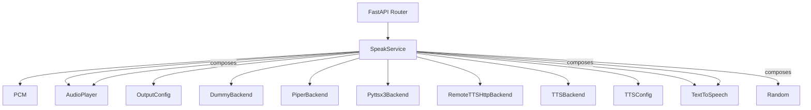
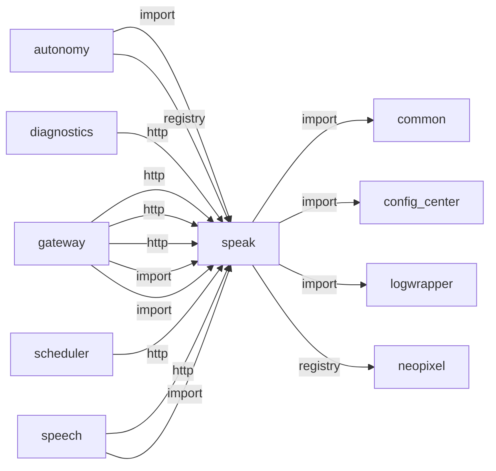
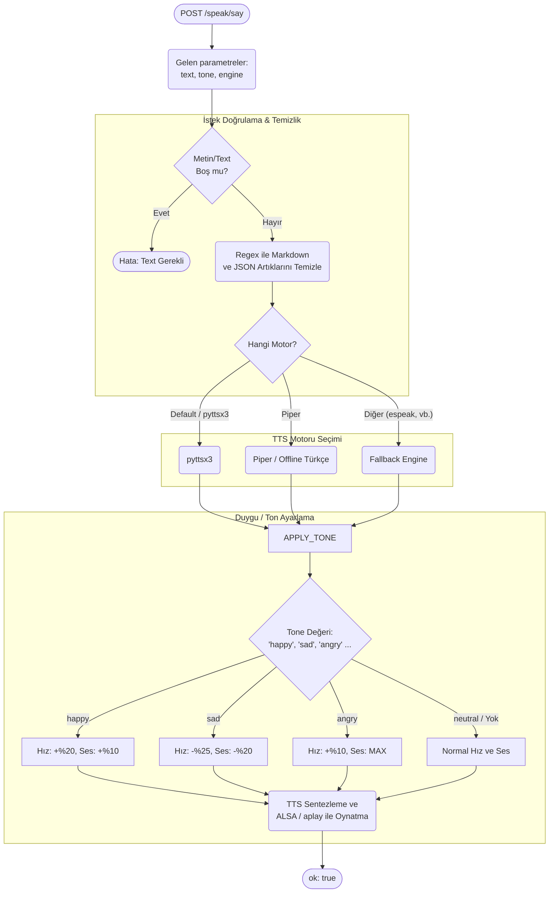
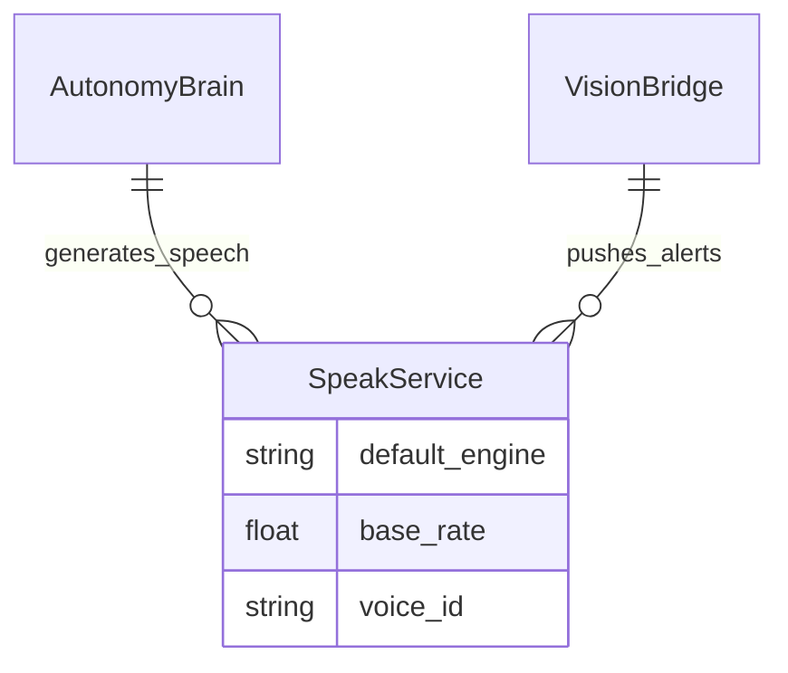

# speak

> **TTS sentez (pyttsx3/Piper/xTTS), ton/duygu ayarı**

## Kimlik
| Alan | Değer |
| --- | --- |
| Ana sınıf | `SpeakService` |
| Giriş noktası | `create_app()` |
| Orkestratör | `SpeakService` |
| Ana dosya | `modules/speak/xSpeakService.py` |
| Katman | Ses/Dil |
| Port | 8083 |
| Arduino | Hayır |
| Sınıf sayısı | 25 |
| Endpoint sayısı | 6 |

## İsimlendirilmiş Bileşenler (Sınıflar)

#### `PCM` — `modules/speak/services/pcm.py`
- **Görev:** Basit PCM veri taşıyıcısı.
- **Kalıtım:** —
- **Oluşturduğu bileşenler:** —
- **Metodlar:** —

#### `AudioPlayer` — `modules/speak/services/player.py`
- **Görev:** —
- **Kalıtım:** —
- **Oluşturduğu bileşenler:** `OutputConfig`
- **Metodlar:** `stop_playback()`, `play_blocking()`, `play_wav_bytes()`

#### `OutputConfig` — `modules/speak/services/player.py`
- **Görev:** —
- **Kalıtım:** —
- **Oluşturduğu bileşenler:** —
- **Metodlar:** —

#### `DummyBackend` — `modules/speak/services/tts.py`
- **Görev:** —
- **Kalıtım:** TTSBackend
- **Oluşturduğu bileşenler:** —
- **Metodlar:** `synthesize()`

#### `PiperBackend` — `modules/speak/services/tts.py`
- **Görev:** Piper TTS with lazy-loaded per-voice models (language_voices / voices map).
- **Kalıtım:** TTSBackend
- **Oluşturduğu bileşenler:** —
- **Metodlar:** `synthesize()`

#### `Pyttsx3Backend` — `modules/speak/services/tts.py`
- **Görev:** —
- **Kalıtım:** TTSBackend
- **Oluşturduğu bileşenler:** `Lock`
- **Metodlar:** `synthesize()`

#### `RemoteTTSHttpBackend` — `modules/speak/services/tts.py`
- **Görev:** Unified remote TTS backend for piper/xtts with a single endpoint.
- **Kalıtım:** TTSBackend
- **Oluşturduğu bileşenler:** —
- **Metodlar:** `synthesize()`

#### `TTSBackend` — `modules/speak/services/tts.py`
- **Görev:** —
- **Kalıtım:** —
- **Oluşturduğu bileşenler:** —
- **Metodlar:** `synthesize()`

#### `TTSConfig` — `modules/speak/services/tts.py`
- **Görev:** —
- **Kalıtım:** —
- **Oluşturduğu bileşenler:** —
- **Metodlar:** —

#### `TextToSpeech` — `modules/speak/services/tts.py`
- **Görev:** —
- **Kalıtım:** —
- **Oluşturduğu bileşenler:** —
- **Metodlar:** `synthesize()`

#### `XTTSHttpBackend` — `modules/speak/services/tts.py`
- **Görev:** XTTS via external local HTTP service.
- **Kalıtım:** TTSBackend
- **Oluşturduğu bileşenler:** —
- **Metodlar:** `synthesize()`

#### `_PiperModel` — `modules/speak/services/tts.py`
- **Görev:** Single Piper ONNX voice runner.
- **Kalıtım:** —
- **Oluşturduğu bileşenler:** —
- **Metodlar:** `synthesize()`

#### `SpeakService` — `modules/speak/xSpeakService.py`
- **Görev:** Metni sese dönüştürüp MAX98357A üzerinden çalar.
- **Kalıtım:** —
- **Oluşturduğu bileşenler:** `TextToSpeech`, `AudioPlayer`, `Random`
- **Metodlar:** `stop_speaking()`, `speak()`, `play_wav()`


## API — Endpoint → Handler → Servis

| HTTP | Path | Handler | Çağırdığı servis | Açıklama |
| --- | --- | --- | --- | --- |
| GET | `/speak/status` | `status()` | `speak()`, `stop_speaking()` | Stop in-progress TTS playback immediately. |
| POST | `/speak/stop` | `stop()` | `speak()`, `stop_speaking()` | Stop in-progress TTS playback immediately. |
| POST | `/speak/say` | `say()` | `speak()` | Start clause-chunked TTS in background for lower perceived latency. |
| POST | `/speak/say_stream` | `say_stream()` | `speak()` | Start clause-chunked TTS in background for lower perceived latency. |
| GET | `/speak/jobs/{job_id}` | `job_status()` | `play_wav()` | — |
| POST | `/speak/play` | `play()` | `play_wav()` | — |

## Config Bölümleri
- `server`
- `audio_out`
- `tts`
- `liveliness`
- `naturalness`

## Dış İlişkiler (Bu modül → diğerleri)

| Hedef modül | Bağlantı tipi | Detay | Neden |
| --- | --- | --- | --- |
| [[common]] | import | emotion_vocab | Duygu tonu ve emotion_vocab ile TTS tonunu eşler. |
| [[config_center]] | import | agent_yaml_loader | config/agent.yaml içindeki speak ayarlarını okur. |
| [[logwrapper]] | import | init_logging | `speak` → `logwrapper`: Merkezi WebSocket log yayınına bağlanır. |
| [[neopixel]] | registry | registry dependency: neopixel (liveliness) | Konuşma sırasında LED canlılık efektleri (liveliness) tetikler. |

## Gelen İlişkiler (Diğerleri → bu modül)

| Kaynak modül | Bağlantı tipi | Detay | Neden |
| --- | --- | --- | --- |
| [[autonomy]] | import | services | Sense-Think-Act döngüsü LLM yanıtını seslendirmek için TTS çağırır. |
| [[autonomy]] | registry | registry dependency: ollama, speak, vlm_bridge, arduino_serial | Sense-Think-Act döngüsü LLM yanıtını seslendirmek için TTS çağırır. |
| [[diagnostics]] | http | calls path `/speak/status` | `diagnostics` → `speak`: TTS servisinin hazır olup olmadığını kontrol eder. |
| [[gateway]] | http | calls path `/speak/status` | `gateway` → `speak`: TTS servisinin hazır olup olmadığını kontrol eder. |
| [[gateway]] | http | calls path `/speak/stop` | `gateway` → `speak`: Devam eden konuşmayı keser. |
| [[gateway]] | http | calls path `/speak` | `gateway` `speak` modülünün HTTP API'sine istek atar (calls path `/speak`). |
| [[gateway]] | import | xSpeakService | `gateway` kod içinde `speak` modülünü import eder (`xSpeakService`) — TTS sentez (pyttsx3/Piper/xTTS), ton/duygu ayarı. |
| [[gateway]] | import | api | `gateway` kod içinde `speak` modülünü import eder (`api`) — TTS sentez (pyttsx3/Piper/xTTS), ton/duygu ayarı. |
| [[scheduler]] | http | calls path `/speak/say` | Zamanlanmış görevlerde hatırlatma/duyuru metni seslendirir. |
| [[speech]] | http | calls path `/speak/stop` | ASR sonrası geri bildirim veya onay cümlelerini TTS ile okutabilir. |
| [[speech]] | import | services | ASR sonrası geri bildirim veya onay cümlelerini TTS ile okutabilir. |

## İç Mimari (otomatik çıkarım)



## Modül Etkileşim Haritası



### Mimari diyagram 1


### Mimari diyagram 2


---

# Tam Kaynak Arşivi

### `modules/speak/README.md` (134 satır)

```markdown
# Speak (TTS) Module

Küçük, tek sorumluluklu bileşenler (DryCode). Hem kütüphane hem servis olarak çalışır.

## Özellikler
- TTS motorları: pyttsx3 (offline), Piper (harici ikili/model; offline, doğal)
- Uzak TTS: Piper ve XTTS için tek endpoint + engine parametresi desteği
- MAX98357A I2S amplifikatör üzerinden ses çıkışı (ALSA cihazı)
- Harici ses çalma: base64 WAV veri oynatma
- Konuşma sırasında canlılık senkronu: `/interactions/event` ve `/interactions/effect` ile LED tepkisi
- Temiz API: `/speak/say` (TTS) ve `/speak/play` (codec + base64)
- Modüler yapı: TTS, Player, Decoder ayrık ve test edilebilir

## Hızlı Başlangıç
### Python
```python
from modules.speak import SpeakService
svc = SpeakService()
svc.speak("Merhaba dünya")
```

### CLI / Servis
- Çalıştır: `python -m modules.speak.xSpeakService --api`
- TTS: POST `/speak/say` body: {"text":"Merhaba"}

## API
- GET `/speak/status` → { ready: true }
- POST `/speak/say`
	- Body: `{ "text": "...", "engine": "pyttsx3|piper|xtts", "tone": { "rate": 190, "volume": 0.9 } }`
	- `tone` alanı opsiyoneldir; `rate`, `volume` veya `piper` içindeki `length_scale`, `noise_scale` gibi ayarları anlık olarak override edebilirsiniz.
	- Dönüş: `{ ok, engine, duration_sec, samplerate }`
- POST `/speak/play`
	- Body: `{ "data": "<base64-wav>" }`
	- Dönüş: `{ ok, duration_sec }`

## Yapılandırma (config/agent.yaml -> speak)
```yaml
server:
	host: 0.0.0.0
	port: 8083

audio_out:
	device: null          # ALSA cihaz (örn. hw:1,0)
	samplerate: 22050
	channels: 1           # MAX98357A mono; driver stereo ise kod upmix yapar
	dtype: float32

tts:
	engine: piper         # pyttsx3 | piper | xtts | dummy
	language: tr
	voice: null
	rate: 170
	volume: 1.0
	samplerate: 22050
	remote:
		enabled: true
		endpoint: http://<tts-host>:5000/tts/synthesize
		timeout: 120
		auth_token: ""
	piper:
		bin_path: piper           # PATH’te yoksa tam yol
		model_path: null          # gerekli, .onnx/.onnx.gz
		samplerate: 22050
		speaker: null
		length_scale: null
		noise_scale: null
		noise_w: null
	xtts:
		endpoint: http://<tts-host>:5000/tts/synthesize
		timeout: 120
		language: tr
		speaker_wav: null

liveliness:
	enabled: true
	interactions_base_url: http://localhost:8080/interactions
	speech_effect:
		name: PULSE
		tone_effect_map:
			fast: COMET
			neutral: PULSE
			calm: BREATHE
			tired: THEATER_CHASE
		min_duration_ms: 400
		max_duration_ms: 7000
		chars_per_second: 16
		force: false

```

Not: Speak modülü artık modül içi config/config.yml okumaz. Kaynak dosya config/agent.yaml içindeki speak bölümüdür.

## Uzak TTS Sözleşmesi (tek endpoint)
Uzak çağrıda aşağıdaki JSON gönderilir:

```json
{
	"text": "Merhaba",
	"engine": "piper",
	"language": "tr",
	"speaker_wav": "/path/ref.wav",
	"piper": {},
	"xtts": {}
}
```

Yanıt olarak ya doğrudan audio/wav baytları ya da base64 ses içeren JSON beklenir.

`liveliness.enabled: true` iken `speak` akışı otomatik olarak:
- konuşma başında `speech.start` event gönderir,
- metin uzunluğu ve tone bilgisine göre efekt süresi hesaplayıp `/interactions/effect` tetikler,
- konuşma bitince `speech.end` event gönderir.

`tone_effect_map` sayesinde konuşma tonu (`rate`/`volume`) farklı efektlere eşlenebilir.
`emphasis_effect_map` ile `!` ve `?` gibi vurgu işaretleri için kısa ek efektler gönderilir.
`rhythm` bloğu ile metin uzunluğuna göre beat sayısı hesaplanıp mikro efekt vuruşları üretilir.

## Donanım ve Kurulum Notları
- MAX98357A I2S DAC ALSA’da bir çıkış cihayı olarak görünmelidir.
- `aplay -l` ile kartı bulun ve `audio_out.device` içine yazın (örn. `hw:1,0`).
- Piper için:
	- Piper binary ve uygun dil modeli (örn. Türkçe) indirilmelidir.
	- `tts.engine: piper` ve `tts.piper.model_path` ayarlanmalıdır.
- Opus ve diğer kodekler için ffmpeg gereklidir.

## Bağımlılıklar
- Python: `sounddevice`, `soundfile`, `numpy`, (opsiyonel) `pyttsx3`
- Harici: `piper` (TTS ikilisi) + model, `ffmpeg` (decode) 

## Test
- Minimal smoke test: `tests/test_smoke.py`

## Gateway ile Kullanım
Gateway çalışırken TTS uçları tek portta `/speak/*` altında sunulur; modülü ayrı servis olarak başlatmaya gerek yoktur.
```

### `modules/speak/__init__.py` (3 satır)

```python
from .xSpeakService import SpeakService, create_app  # noqa: F401

__all__ = ["SpeakService", "create_app"]
```

### `modules/speak/api/README.md` (5 satır)

```markdown
# API

- GET /speak/status
- POST /speak/say {"text":"...", "engine":"pyttsx3|piper"}
- POST /speak/play {"data":"<base64-wav>"}
```

### `modules/speak/api/__init__.py` (3 satır)

```python
from .router import get_router

__all__ = ["get_router"]
```

### `modules/speak/api/router.py` (161 satır)

```python
from __future__ import annotations
from fastapi import APIRouter
from typing import TYPE_CHECKING
import asyncio
import logging
import re
import time
import uuid

if TYPE_CHECKING:
    from modules.speak.xSpeakService import SpeakService


logger = logging.getLogger("speak.api")

def get_router(service: SpeakService) -> APIRouter:
    router = APIRouter()
    stream_jobs: dict[str, dict] = {}

    def _split_text_chunks(text: str, max_chars: int = 180) -> list[str]:
        raw = str(text or "").strip()
        if not raw:
            return []
        parts = [p.strip() for p in re.split(r"(?<=[.!?])\s+", raw) if p.strip()]
        chunks: list[str] = []
        for part in parts:
            if len(part) <= max_chars:
                chunks.append(part)
                continue
            # Long sentence fallback: hard wrap by words.
            words = part.split()
            buf = []
            for w in words:
                candidate = (" ".join(buf + [w])).strip()
                if len(candidate) > max_chars and buf:
                    chunks.append(" ".join(buf))
                    buf = [w]
                else:
                    buf.append(w)
            if buf:
                chunks.append(" ".join(buf))
        return chunks

    @router.get("/speak/status")
    async def status():
        return {"ready": getattr(service, "tts", None) is not None}

    @router.post("/speak/stop")
    async def stop():
        """Stop in-progress TTS playback immediately."""
        try:
            return await asyncio.to_thread(service.stop_speaking)
        except Exception as e:
            logger.exception("/speak/stop failed")
            return {"ok": False, "error": repr(e)}

    @router.post("/speak/say")
    async def say(payload: dict):
        text = str(payload.get("text", "")).strip()
        engine = payload.get("engine")
        tone = payload.get("tone")
        speaker_wav = payload.get("speaker_wav")
        language = payload.get("language")
        if not text:
            return {"ok": False, "error": "text is empty"}
        
        logger.info("TTS >>> %s (engine=%s)", text, engine or "default")
        try:
            # Offload blocking TTS to thread to avoid event loop freeze
            return await asyncio.to_thread(
                service.speak,
                text,
                engine=engine,
                tone=tone,
                speaker_wav=speaker_wav,
                language=language,
            )
        except Exception as e:
            logger.exception("/speak/say failed")
            return {"ok": False, "error": repr(e)}

    @router.post("/speak/say_stream")
    async def say_stream(payload: dict):
        """Start clause-chunked TTS in background for lower perceived latency."""
        text = str(payload.get("text", "")).strip()
        engine = payload.get("engine")
        tone = payload.get("tone")
        speaker_wav = payload.get("speaker_wav")
        language = payload.get("language")
        max_chars = int(payload.get("max_chunk_chars", 180) or 180)
        if not text:
            return {"ok": False, "error": "text is empty"}

        chunks = _split_text_chunks(text, max_chars=max_chars)
        if not chunks:
            return {"ok": False, "error": "text has no speakable chunks"}

        job_id = uuid.uuid4().hex[:12]
        stream_jobs[job_id] = {
            "status": "running",
            "created_at": time.time(),
            "done_chunks": 0,
            "total_chunks": len(chunks),
            "error": "",
        }

        async def _run():
            try:
                from modules.speak.services.player import _play_stop

                for idx, chunk in enumerate(chunks, start=1):
                    if _play_stop.is_set():
                        job = stream_jobs.get(job_id)
                        if job is not None:
                            job["status"] = "interrupted"
                        return
                    await asyncio.to_thread(
                        service.speak,
                        chunk,
                        engine=engine,
                        tone=tone,
                        speaker_wav=speaker_wav,
                        language=language,
                    )
                    job = stream_jobs.get(job_id)
                    if job is not None:
                        job["done_chunks"] = idx
            except Exception as exc:
                job = stream_jobs.get(job_id)
                if job is not None:
                    job["status"] = "failed"
                    job["error"] = repr(exc)
                return

            job = stream_jobs.get(job_id)
            if job is not None:
                job["status"] = "done"

        asyncio.create_task(_run())
        return {"ok": True, "job_id": job_id, "chunks": len(chunks)}

    @router.get("/speak/jobs/{job_id}")
    async def job_status(job_id: str):
        job = stream_jobs.get(str(job_id))
        if not job:
            return {"ok": False, "error": "job not found"}
        return {"ok": True, "job": job}

    @router.post("/speak/play")
    async def play(payload: dict):
        import base64
        data_b64 = payload.get("data")
        if not data_b64:
            return {"ok": False, "error": "data (base64 WAV) is required"}
        try:
            buf = base64.b64decode(data_b64)
            return service.play_wav(buf)
        except Exception as e:
            return {"ok": False, "error": str(e)}

    return router
```

### `modules/speak/architecture_speak.md` (74 satır)

```markdown
# Speak (TTS) Modülü Mimarisi

Speak modülü (`modules/speak`), metinden sese dönüştürme (Text-to-Speech) işlemini gerçekleştirerek robotun fiziksel hoparlöründen konuşmasını sağlar.

## 🏗️ İş Akışı ve Karar Mekanizmaları (Flowchart)


## 🔄 İlişkisel Etkileşimler (Veri Akışı)


## ⚙️ Detaylı Karar Mantığı (if/else)

1. **Metin Temizliği (Regex)**
   - Autonomy'den gelen LLM cümlesi yanlışlıkla markdown yıldızları (`*hızla kafa sallar*`), etiketler (`<speak>`) barındırıyorsa, okumadan önce Regex ile bunları temizler (`re.sub` mantığı). Aksi takdirde TTS motoru harf harf "yıldız gülücük yıldız" şeklinde okur.
2. **Tone (Duygu) Ayarlamaları**
   - Autonomy Brain, robotun hissettiği duyguya (joy, sadness) göre `tone` parametresini doldurur.
   - **`if`** `tone == 'sad'`: Hoparlörün okuma hızı (rate) düşürülür, ses (volume) azaltılır, böylece mutsuz bir tını oluşur.
   - **`if`** `tone == 'happy'`: Cümle ritmik ve daha hızlı, sesi daha gür çıkar.
3. **Motor Seçimi (`pyttsx3` vs `piper`)**
   - **`if`** `engine == 'piper'`: RPi üzerinde yüksek kaliteli yerel insan sesi sentezleyen piper binary'sini (`subprocess` ile) çalıştırıp `aplay` (ALSA ses sistemi) portuna pipe eder.
   - **`else`**: Basit ama uyumlu olan standart `pyttsx3` nesnesi (runAndWait) çağrılır.
```

### `modules/speak/config/README.md` (9 satır)

```markdown
# Speak module config

- server: FastAPI sunucu ayarları
- audio_out: ALSA üzerinden çıkış ayarları (I2S MAX98357A)
- tts: TTS motor ayarları (pyttsx3 veya dummy)

MAX98357A ile kullanım:
- Raspberry Pi'de I2S'i etkinleştirin ve doğru ALSA cihazını `aplay -l` ile bulun.
- `device` alanına uygun isim/index girin (örn. `hw:1,0`).
```

### `modules/speak/config/config.yml` (100 satır)

```yaml
# Speak (TTS) module configuration

server:
  host: 0.0.0.0
  port: 8083

audio_out:
  device: null          # ALSA device (e.g., sysdefault, hw:1,0). For MAX98357A via I2S set the correct ALSA card.
  samplerate: 22050
  channels: 1           # MAX98357A is mono; driver may expose stereo. Upmix handled in code.
  dtype: float32

tts:
  engine: piper      # pyttsx3 | piper | xtts | dummy
  language: tr
  voice: source         # optional voice id — default olarak kaynak sesi kullanılacak
  rate: 170
  volume: 1.0
  samplerate: 22050
  # Piper ayarları
  piper:
    bin_path: piper
    voice: tr
    auto_language: true
    prefer_text_language: false
    lock_session_language: true
  language_voices:
    tr: tr
    en: glados
  model_path: data/piper_models/tr_TR-dfki-medium/tr_TR-dfki-medium.onnx
  config_path: data/piper_models/tr_TR-dfki-medium/tr_TR-dfki-medium.onnx.json
  samplerate: 22050
  speaker: null
  length_scale: null
  noise_scale: null
  noise_w: null
  voices:
    tr:
      model_path: data/piper_models/tr_TR-dfki-medium/tr_TR-dfki-medium.onnx
      config_path: data/piper_models/tr_TR-dfki-medium/tr_TR-dfki-medium.onnx.json
    glados:
      model_path: data/piper_models/en-glados-medium/glados_piper_medium.onnx
      config_path: data/piper_models/en-glados-medium/glados_piper_medium.onnx.json

  # XTTS ayarları (ayrı env'de çalışan local HTTP servis)
  # Örn: PC üzerindeki server_app TTS proxy: http://PC_IP:5000/tts/synthesize
  xtts:
    endpoint: http://192.168.1.100:5000/tts/synthesize
    timeout: 120
    language: tr
    speaker_wav: null          # ses kopyalama için referans wav yolu (opsiyonel)

liveliness:
  enabled: true
  event_driven_effects: true
  interactions_base_url: "@gateway/interactions"
  speech_effect:
    name: PULSE
    tone_effect_map:
      fast: COMET
      neutral: PULSE
      calm: BREATHE
      tired: THEATER_CHASE
    emphasis_effect_map:
      exclamation: COMET
      question: TWINKLE
    rhythm:
      enabled: false
      mode: clauses           # words | clauses
      effect: PULSE
      words_per_beat: 3
      clauses_per_beat: 1
      max_beats: 4
      duration_ms: 150
      max_pause_marks: 4
      pause_effect_map:
        ",": TWINKLE
        ";": TWINKLE
        ":": BREATHE
        ".": BREATHE
    min_duration_ms: 400
    max_duration_ms: 7000
    chars_per_second: 16
    force: false

# Natural speech: light disfluency/filler injection so replies sound less robotic.
naturalness:
  enabled: true
  filler_probability: 0.22   # chance to prepend a filler to an utterance
  min_chars: 12              # skip very short replies (e.g. "Evet.")
  fillers:
    default: ["Şey,", "Yani,", "Hmm,"]
    joy: ["Aa,", "Hey,", "Bak,"]
    excitement: ["Vay,", "Aa,", "Hey,"]
    curiosity: ["Hmm,", "Bak,", "Şey,"]
    sadness: ["Eh,", "Şey...", "Hmm,"]
    tired: ["Of,", "Hmm,", "Şey,"]
    anger: ["Bak,", "Yani,"]

# note: external compressed audio decoding removed; /speak/play expects base64 WAV
```

### `modules/speak/config_loader.py` (74 satır)

```python
from __future__ import annotations
import os
from copy import deepcopy
from pathlib import Path
from typing import Any, Dict
from modules.config_center.agent_yaml_loader import load_agent_config, require_dict_section

_REPO_ROOT = Path(__file__).resolve().parents[2]


def _abs_from_repo(raw: Any) -> str:
    text = str(raw or "").strip()
    if not text:
        return text
    path = Path(text)
    if path.is_absolute():
        return str(path)
    return str((_REPO_ROOT / path).resolve())


def _resolve_piper_paths(piper: Dict[str, Any]) -> Dict[str, Any]:
    if not isinstance(piper, dict):
        return {}
    out = dict(piper)
    if out.get("model_path"):
        out["model_path"] = _abs_from_repo(out["model_path"])
    if out.get("config_path"):
        out["config_path"] = _abs_from_repo(out["config_path"])
    voices = out.get("voices", {})
    if isinstance(voices, dict):
        resolved_voices: Dict[str, Any] = {}
        for key, entry in voices.items():
            if not isinstance(entry, dict):
                continue
            item = dict(entry)
            if item.get("model_path"):
                item["model_path"] = _abs_from_repo(item["model_path"])
            if item.get("config_path"):
                item["config_path"] = _abs_from_repo(item["config_path"])
            resolved_voices[str(key)] = item
        out["voices"] = resolved_voices
    return out


def _normalize_speak_section(section: Dict[str, Any]) -> Dict[str, Any]:
    """Keep agent.yaml as single source, with small compatibility aliases.

    Supports legacy shorthand keys like `speak.engine` by mapping them into
    `speak.tts.engine` when present.
    """
    out = deepcopy(section)
    tts = out.get("tts") if isinstance(out.get("tts"), dict) else {}
    out["tts"] = dict(tts)

    # Compatibility: allow `speak.engine: xtts` as shorthand.
    shorthand_engine = str(out.get("engine", "")).strip()
    if shorthand_engine:
        out["tts"]["engine"] = shorthand_engine

    piper = out.get("tts", {}).get("piper", {})
    if isinstance(piper, dict):
        out["tts"]["piper"] = _resolve_piper_paths(piper)

    return out


def load_config(override_path: str | os.PathLike | None = None) -> Dict[str, Any]:
    """Load speak config from central config/agent.yaml.

    Strict mode: module-local config.yml is not used.
    """
    root_cfg = load_agent_config(override_path)
    section = require_dict_section(root_cfg, "speak")
    return _normalize_speak_section(section)
```

### `modules/speak/requirements.txt` (7 satır)

```text
sounddevice>=0.4
soundfile>=0.12
numpy>=1.23
# Optional for offline TTS
pyttsx3>=2.90
piper-tts>=1.2.0
# Piper ONNX modelleri: python tools/install_piper_models.py --turkish --glados
```

### `modules/speak/services/__init__.py` (4 satır)

```python
from .tts import TextToSpeech
from .player import AudioPlayer

__all__ = ["TextToSpeech", "AudioPlayer"]
```

### `modules/speak/services/lang_detect.py` (114 satır)

```python
from __future__ import annotations

import logging
import re
from typing import Any, Dict, Optional

logger = logging.getLogger("speak.lang_detect")

_TR_CHARS = set("çğıöşüÇĞİÖŞÜ")
_EN_STOPWORDS = frozenset({
    "the", "a", "an", "is", "are", "was", "were", "be", "been", "being",
    "have", "has", "had", "do", "does", "did", "will", "would", "could",
    "should", "may", "might", "must", "shall", "can", "need", "dare", "ought",
    "used", "to", "of", "in", "for", "on", "with", "at", "by", "from",
    "as", "into", "through", "during", "before", "after", "above", "below",
    "between", "under", "again", "further", "then", "once", "here", "there",
    "when", "where", "why", "how", "all", "each", "few", "more", "most",
    "other", "some", "such", "no", "nor", "not", "only", "own", "same",
    "so", "than", "too", "very", "just", "and", "but", "if", "or", "because",
    "what", "which", "who", "whom", "this", "that", "these", "those", "am",
    "i", "you", "he", "she", "it", "we", "they", "my", "your", "his", "her",
    "its", "our", "their", "me", "him", "us", "them", "yes", "no", "ok", "please",
    "hello", "hi", "thanks", "thank", "sorry", "about", "tell", "know", "think",
})

try:
    from langdetect import detect as _detect_lang  # type: ignore
    from langdetect import DetectorFactory  # type: ignore

    DetectorFactory.seed = 0
except Exception:
    _detect_lang = None  # type: ignore


def normalize_lang(lang: Optional[str], fallback: str = "tr") -> str:
    raw = str(lang or "").strip().lower().replace("_", "-")
    if not raw or raw == "auto":
        return fallback
    if "-" in raw:
        raw = raw.split("-", 1)[0]
    return raw


def detect_text_language(text: str, *, default: str = "tr") -> str:
    """Heuristic (+ optional langdetect) language tag for TTS routing."""
    value = str(text or "").strip()
    if not value:
        return normalize_lang(default)

    if _detect_lang is not None:
        try:
            detected = normalize_lang(str(_detect_lang(value)), fallback=default)
            if detected:
                return detected
        except Exception as exc:
            logger.debug("langdetect failed: %s", exc)

    tr_chars = sum(1 for ch in value if ch in _TR_CHARS)
    words = re.findall(r"[a-zA-Z']+", value.lower())
    en_hits = sum(1 for w in words if w in _EN_STOPWORDS)

    if tr_chars >= 2:
        return "tr"
    if tr_chars >= 1 and en_hits < 2:
        return "tr"
    if en_hits >= 2:
        return "en"
    if len(words) >= 4 and tr_chars == 0:
        return "en"
    if tr_chars == 0 and len(words) >= 2 and all(ord(c) < 128 for c in value if c.isalpha()):
        return "en"
    return normalize_lang(default)


def resolve_speak_language(
    text: str,
    *,
    explicit: Optional[str] = None,
    default: str = "tr",
    prefer_text: bool = True,
) -> str:
    """Pick language for Piper voice: spoken text wins over STT hint by default."""
    explicit_norm = normalize_lang(explicit, fallback=default)
    if not explicit or not str(explicit).strip():
        return detect_text_language(text, default=default)
    if not prefer_text:
        return explicit_norm
    detected = detect_text_language(text, default=default)
    if explicit_norm == detected:
        return detected
    return detected


def piper_voice_for_language(lang: str, piper_cfg: Dict[str, Any]) -> str:
    """Map ISO-ish language code to piper.voices key."""
    lang = normalize_lang(lang, fallback=str(piper_cfg.get("voice", "tr") or "tr"))
    lang_map = piper_cfg.get("language_voices", {})
    voices = piper_cfg.get("voices", {}) if isinstance(piper_cfg.get("voices"), dict) else {}

    if isinstance(lang_map, dict):
        if lang in lang_map:
            return str(lang_map[lang]).strip().lower()
        for key, voice in lang_map.items():
            key_norm = normalize_lang(str(key), fallback="")
            if key_norm and (lang == key_norm or lang.startswith(key_norm)):
                return str(voice).strip().lower()

    if lang in voices:
        return lang
    if lang == "en" and "glados" in voices:
        return "glados"
    if lang.startswith("tr") and "tr" in voices:
        return "tr"
    return str(piper_cfg.get("voice", "tr")).strip().lower() or "tr"
```

### `modules/speak/services/pcm.py` (15 satır)

```python
from __future__ import annotations
from dataclasses import dataclass


@dataclass
class PCM:
    """Basit PCM veri taşıyıcısı.

    data: numpy ndarray (float32 veya int16)
    samplerate: int
    channels: int
    """
    data: any  # numpy.ndarray
    samplerate: int
    channels: int
```

### `modules/speak/services/player.py` (102 satır)

```python
from __future__ import annotations
import io
import logging
import threading
import time
from dataclasses import dataclass
from typing import Dict, Optional
from .pcm import PCM

_play_lock = threading.Lock()
_play_stop = threading.Event()

try:
    import sounddevice as sd
    import soundfile as sf  # for writing/reading wav buffers
except Exception:
    sd = None  # type: ignore
    sf = None  # type: ignore

logger = logging.getLogger("speak.player")


@dataclass
class OutputConfig:
    device: Optional[str] = None  # ALSA device name (I2S/I2C DAC via MAX98357A)
    samplerate: int = 22050
    channels: int = 1
    dtype: str = "float32"  # player expects float32

class AudioPlayer:
    def __init__(self, cfg: Dict):
        self.cfg = OutputConfig(
            device=cfg.get("device"),
            samplerate=int(cfg.get("samplerate", 22050)),
            channels=int(cfg.get("channels", 1)),
            dtype=str(cfg.get("dtype", "float32")),
        )

    @staticmethod
    def stop_playback() -> None:
        """Stop any in-progress speaker output (barge-in / wakeword)."""
        _play_stop.set()
        if sd is None:
            return
        try:
            with _play_lock:
                sd.stop()
        except Exception as exc:
            logger.debug("stop_playback: %s", exc)

    def _ensure_backends(self):
        if sd is None:
            raise RuntimeError("sounddevice not available. Install with 'pip install sounddevice'.")

    def play_blocking(self, pcm: PCM) -> float:
        """PCM float32 verisini bloklayıcı şekilde çalar ve süreyi döner."""
        self._ensure_backends()
        import numpy as np

        data = pcm.data
        if data.dtype != np.float32:
            data = data.astype(np.float32)

        # Up/down mix to target channels if needed
        if data.ndim == 1 and self.cfg.channels == 2:
            data = np.stack([data, data], axis=1)
        elif data.ndim == 2 and data.shape[1] != self.cfg.channels:
            if self.cfg.channels == 1:
                data = data.mean(axis=1).astype(np.float32)
            else:
                data = np.stack([data[:, 0]] * self.cfg.channels, axis=1).astype(np.float32)

        _play_stop.clear()
        started = time.monotonic()
        with _play_lock:
            sd.play(data, samplerate=pcm.samplerate, device=self.cfg.device, blocking=False)
            # Calculate duration in seconds
            dur_sec = len(data) / pcm.samplerate
            end_time = started + dur_sec
            while time.monotonic() < end_time:
                if _play_stop.is_set():
                    sd.stop()
                    break
                time.sleep(0.05)
            if not _play_stop.is_set():
                sd.stop()
        dur = max(0.0, time.monotonic() - started)
        if _play_stop.is_set():
            logger.info("Playback interrupted after %.2fs", dur)
        else:
            logger.info("Played audio: %.2fs @ %d Hz via %s", dur, pcm.samplerate, self.cfg.device or "default")
        return dur

    def play_wav_bytes(self, payload: bytes) -> float:
        """WAV (RIFF) byte dizisini okuyup çalar."""
        import io
        import soundfile as sf
        f = io.BytesIO(payload)
        data, sr = sf.read(f, dtype='float32')
        ch = 1 if data.ndim == 1 else data.shape[1]
        pcm = PCM(data=data, samplerate=sr, channels=ch)
        return self.play_blocking(pcm)
```

### `modules/speak/services/tts.py` (476 satır)

```python
from __future__ import annotations
import copy
import base64
import logging
from dataclasses import dataclass
from typing import Any, Dict, Optional
import threading
from pathlib import Path
from .lang_detect import normalize_lang, piper_voice_for_language, resolve_speak_language
from .pcm import PCM

import io

import requests

logger = logging.getLogger("speak.tts")

_synth_cancel = threading.Event()


def cancel_synthesis() -> None:
    _synth_cancel.set()


def clear_synthesis_cancel() -> None:
    _synth_cancel.clear()


@dataclass
class TTSConfig:
    engine: str = "pyttsx3"  # pyttsx3 | dummy
    language: str = "tr"
    voice: Optional[str] = None
    rate: int = 170
    volume: float = 1.0
    samplerate: int = 22050


class TTSBackend:
    def synthesize(self, text: str):  # returns PCM
        raise NotImplementedError


def _wav_bytes_to_pcm(wav_bytes: bytes) -> PCM:
    import numpy as np
    import soundfile as sf

    with io.BytesIO(wav_bytes) as f:
        data, sr = sf.read(f, dtype="float32")
    ch = 1 if getattr(data, "ndim", 1) == 1 else int(data.shape[1])
    if isinstance(data, np.ndarray) and data.dtype != np.float32:
        data = data.astype(np.float32)
    return PCM(data=data, samplerate=int(sr), channels=ch)
class Pyttsx3Backend(TTSBackend):
    def __init__(self, cfg: TTSConfig):
        try:
            import pyttsx3  # type: ignore
        except Exception as e:
            raise RuntimeError("pyttsx3 not installed. Add to requirements or choose 'dummy' engine.") from e
        self.cfg = cfg
        self.samplerate = cfg.samplerate
        self._lock = threading.Lock()

    def _make_engine(self):
        import pyttsx3  # type: ignore
        engine = pyttsx3.init()
        if self.cfg.voice:
            engine.setProperty('voice', self.cfg.voice)
        engine.setProperty('rate', self.cfg.rate)
        engine.setProperty('volume', self.cfg.volume)
        return engine

    def synthesize(self, text: str):
        # pyttsx3 doğrudan PCM verisi döndürmez; temp wav'e yazıp geri okuruz.
        import tempfile, os
        import soundfile as sf
        import numpy as np
        with self._lock:
            engine = self._make_engine()
            with tempfile.TemporaryDirectory() as d:
                tmp = os.path.join(d, "out.wav")
                engine.save_to_file(text, tmp)
                engine.runAndWait()
                engine.stop()
                data, sr = sf.read(tmp, dtype='float32')
        ch = 1 if data.ndim == 1 else data.shape[1]
        return PCM(data=data, samplerate=sr, channels=ch)


class DummyBackend(TTSBackend):
    def __init__(self, cfg: TTSConfig):
        self.samplerate = cfg.samplerate

    def synthesize(self, text: str):
        # Basit bir placeholder: kısa bir beep dizisi üret
        import numpy as np
        sr = self.samplerate
        secs = max(0.2, min(1.0, len(text) * 0.03))
        t = np.linspace(0, secs, int(sr * secs), endpoint=False)
        freq = 440.0
        data = 0.2 * np.sin(2 * np.pi * freq * t).astype(np.float32)
        return PCM(data=data, samplerate=sr, channels=1)


class _PiperModel:
    """Single Piper ONNX voice runner."""

    def __init__(self, cfg: TTSConfig, piper_cfg: Dict, resolved: Dict[str, Any]):
        self.bin_path = str(piper_cfg.get("bin_path", "piper"))
        self.model_path = str(resolved.get("model_path") or piper_cfg.get("model_path") or "").strip()
        if not self.model_path:
            raise ValueError("piper.model_path is required (or piper.voices.<voice>)")
        if not Path(self.model_path).exists():
            raise FileNotFoundError(f"piper.model_path not found: {self.model_path}")
        self.config_path = str(
            resolved.get("config_path") or piper_cfg.get("config_path") or f"{self.model_path}.json"
        ).strip()
        if self.config_path and not Path(self.config_path).exists():
            logger.warning("piper model config not found: %s", self.config_path)
        self.samplerate = int(piper_cfg.get("samplerate", cfg.samplerate))
        self.speaker = piper_cfg.get("speaker")
        self.length_scale = piper_cfg.get("length_scale")
        self.noise_scale = piper_cfg.get("noise_scale")
        self.noise_w = piper_cfg.get("noise_w")

    def synthesize(self, text: str) -> PCM:
        import subprocess, tempfile, os
        import soundfile as sf

        def _append_long_options(cmd: list[str]) -> list[str]:
            out = list(cmd)
            if self.config_path and os.path.exists(self.config_path):
                out += ["--config", self.config_path]
            if self.speaker is not None:
                out += ["--speaker", str(self.speaker)]
            if self.length_scale is not None:
                out += ["--length_scale", str(self.length_scale)]
            if self.noise_scale is not None:
                out += ["--noise_scale", str(self.noise_scale)]
            if self.noise_w is not None:
                out += ["--noise_w", str(self.noise_w)]
            return out

        def _append_short_options(cmd: list[str]) -> list[str]:
            out = list(cmd)
            if self.speaker is not None:
                out += ["-s", str(self.speaker)]
            if self.length_scale is not None:
                out += ["-l", str(self.length_scale)]
            if self.noise_scale is not None:
                out += ["-n", str(self.noise_scale)]
            if self.noise_w is not None:
                out += ["-e", str(self.noise_w)]
            return out

        def _load_wav_from_path(path: str) -> Optional[PCM]:
            if not os.path.exists(path):
                return None
            if os.path.getsize(path) <= 0:
                return None
            data, sr = sf.read(path, dtype='float32')
            ch = 1 if data.ndim == 1 else data.shape[1]
            return PCM(data=data, samplerate=sr, channels=ch)

        stdin_text = (text or "").strip()
        if not stdin_text:
            raise ValueError("text is empty")

        with tempfile.TemporaryDirectory() as d:
            wav_path = os.path.join(d, "out.wav")
            cmd_variants = [
                _append_long_options([self.bin_path, "--model", self.model_path, "--output_file", wav_path]),
                _append_short_options([self.bin_path, "-m", self.model_path, "-w", wav_path]),
            ]

            last_error = ""
            for cmd in cmd_variants:
                if _synth_cancel.is_set():
                    raise RuntimeError("synthesis cancelled")
                proc = subprocess.Popen(
                    cmd,
                    stdin=subprocess.PIPE,
                    stdout=subprocess.PIPE,
                    stderr=subprocess.PIPE,
                )
                try:
                    stdout_b, stderr_b = proc.communicate(
                        input=(stdin_text + "\n").encode("utf-8"),
                        timeout=120.0,
                    )
                except Exception:
                    proc.kill()
                    proc.communicate(timeout=1.0)
                    if _synth_cancel.is_set():
                        raise RuntimeError("synthesis cancelled")
                    raise
                if _synth_cancel.is_set():
                    raise RuntimeError("synthesis cancelled")
                stderr_txt = stderr_b.decode("utf-8", "ignore").strip()

                if proc.returncode == 0:
                    try:
                        pcm = _load_wav_from_path(wav_path)
                        if pcm is not None:
                            return pcm
                    except Exception as exc:
                        last_error = f"wav read failed: {exc}"

                    if stdout_b:
                        try:
                            return _wav_bytes_to_pcm(stdout_b)
                        except Exception as exc:
                            last_error = f"stdout wav parse failed: {exc}"
                    else:
                        last_error = "piper finished without producing readable WAV output"
                else:
                    last_error = f"exit={proc.returncode}; stderr={stderr_txt or '<empty>'}"

            raise RuntimeError(f"piper failed: {last_error}")


class PiperBackend(TTSBackend):
    """Piper TTS with lazy-loaded per-voice models (language_voices / voices map)."""

    def __init__(self, cfg: TTSConfig, piper_cfg: Dict):
        self.tcfg = cfg
        self.piper_cfg = copy.deepcopy(piper_cfg)
        self.default_voice = str(piper_cfg.get("voice", "tr")).strip().lower() or "tr"
        self._models: Dict[str, _PiperModel] = {}
        self._ensure_model(self.default_voice)

    @staticmethod
    def _resolve_voice_cfg(piper_cfg: Dict, voice_key: Optional[str] = None) -> Dict[str, Any]:
        voices = piper_cfg.get("voices", {})
        key = str(voice_key or piper_cfg.get("voice", "tr")).strip().lower() or "tr"
        if not isinstance(voices, dict):
            return {}
        entry = voices.get(key)
        if isinstance(entry, dict):
            return entry
        return {}

    def _ensure_model(self, voice_key: str) -> _PiperModel:
        key = str(voice_key or self.default_voice).strip().lower() or self.default_voice
        cached = self._models.get(key)
        if cached is not None:
            return cached
        resolved = self._resolve_voice_cfg(self.piper_cfg, key)
        try:
            model = _PiperModel(self.tcfg, self.piper_cfg, resolved)
        except FileNotFoundError:
            if key != self.default_voice:
                logger.warning("piper voice %s unavailable, falling back to %s", key, self.default_voice)
                return self._ensure_model(self.default_voice)
            raise
        self._models[key] = model
        return model

    def synthesize(self, text: str, voice_key: Optional[str] = None) -> PCM:
        key = str(voice_key or self.default_voice).strip().lower() or self.default_voice
        return self._ensure_model(key).synthesize(text)


class XTTSHttpBackend(TTSBackend):
    """XTTS via external local HTTP service.

    This backend is designed to let XTTS run in a separate Python env (often with CUDA),
    while SentryBOT gateway keeps its own env lightweight.

    Expected endpoint:
      - POST {endpoint} (default: http://127.0.0.1:5002/synthesize)
      - JSON: { text, speaker_wav?, language? }
      - Response: audio/wav bytes
    """

    def __init__(self, cfg: TTSConfig, xtts_cfg: Dict):
        self.samplerate = int(xtts_cfg.get("samplerate", cfg.samplerate))
        self.endpoint = str(xtts_cfg.get("endpoint", "http://127.0.0.1:5002/synthesize")).strip()
        self.timeout = float(xtts_cfg.get("timeout", 120.0))
        self.default_speaker_wav = xtts_cfg.get("speaker_wav")
        self.default_language = str(xtts_cfg.get("language", cfg.language))

        if not self.endpoint:
            raise ValueError("xtts.endpoint is required")

    def synthesize(self, text: str, speaker_wav: Optional[str] = None, language: Optional[str] = None) -> PCM:
        payload: Dict[str, object] = {
            "text": text,
            "language": language or self.default_language,
        }
        wav = speaker_wav or self.default_speaker_wav
        if wav:
            payload["speaker_wav"] = wav

        resp = requests.post(self.endpoint, json=payload, timeout=self.timeout)
        resp.raise_for_status()
        return _wav_bytes_to_pcm(resp.content)


class RemoteTTSHttpBackend(TTSBackend):
    """Unified remote TTS backend for piper/xtts with a single endpoint.

    Request payload:
      {
        "text": "...",
        "engine": "piper" | "xtts",
        "language": "tr",
        "speaker_wav": "..."?,
        "piper": {...},
        "xtts": {...}
      }
    Response can be raw WAV bytes or JSON with base64 audio.
    """

    def __init__(self, cfg: TTSConfig, full_tts_cfg: Dict[str, Any]):
        remote_cfg = full_tts_cfg.get("remote", {}) if isinstance(full_tts_cfg.get("remote", {}), dict) else {}
        if not bool(remote_cfg.get("enabled", False)):
            raise ValueError("tts.remote.enabled must be true for RemoteTTSHttpBackend")

        endpoint = str(remote_cfg.get("endpoint", "")).strip()
        if not endpoint:
            raise ValueError("tts.remote.endpoint is required")

        self.endpoint = endpoint
        self.timeout = float(remote_cfg.get("timeout", 120.0))
        self.auth_token = str(remote_cfg.get("auth_token", "")).strip()
        self.engine = str(cfg.engine).strip().lower()
        self.default_language = str(cfg.language)
        self.default_speaker_wav = (
            full_tts_cfg.get("xtts", {}).get("speaker_wav")
            if isinstance(full_tts_cfg.get("xtts", {}), dict)
            else None
        )

        self.piper_cfg = copy.deepcopy(full_tts_cfg.get("piper", {})) if isinstance(full_tts_cfg.get("piper", {}), dict) else {}
        self.xtts_cfg = copy.deepcopy(full_tts_cfg.get("xtts", {})) if isinstance(full_tts_cfg.get("xtts", {}), dict) else {}

    def _decode_response_audio(self, resp: requests.Response) -> bytes:
        content_type = str(resp.headers.get("content-type", "")).lower()
        if "application/json" in content_type:
            data = resp.json() if resp.content else {}
            if not isinstance(data, dict):
                raise RuntimeError("remote TTS returned invalid JSON payload")

            b64_value = (
                data.get("wav_base64")
                or data.get("audio_base64")
                or data.get("data")
                or ""
            )
            b64_text = str(b64_value or "").strip()
            if not b64_text:
                raise RuntimeError("remote TTS JSON response has no base64 audio field")
            return base64.b64decode(b64_text)

        return resp.content

    def synthesize(self, text: str, speaker_wav: Optional[str] = None, language: Optional[str] = None) -> PCM:
        payload: Dict[str, Any] = {
            "text": text,
            "engine": self.engine,
            "language": language or self.default_language,
            "piper": self.piper_cfg,
            "xtts": self.xtts_cfg,
        }

        resolved_speaker_wav = speaker_wav or self.default_speaker_wav
        if resolved_speaker_wav:
            payload["speaker_wav"] = resolved_speaker_wav

        headers: Dict[str, str] = {}
        if self.auth_token:
            headers["Authorization"] = f"Bearer {self.auth_token}"

        resp = requests.post(self.endpoint, json=payload, headers=headers, timeout=self.timeout)
        resp.raise_for_status()

        wav_bytes = self._decode_response_audio(resp)
        if not wav_bytes:
            raise RuntimeError("remote TTS response contains empty audio")
        return _wav_bytes_to_pcm(wav_bytes)


class TextToSpeech:
    def __init__(self, cfg: Dict):
        self._base_cfg = copy.deepcopy(cfg)
        self.backend = self._build_backend(self._base_cfg)

    def _build_backend(self, cfg: Dict) -> TTSBackend:
        tcfg = TTSConfig(
            engine=str(cfg.get("engine", "pyttsx3")),
            language=str(cfg.get("language", "tr")),
            voice=cfg.get("voice"),
            rate=int(cfg.get("rate", 170)),
            volume=float(cfg.get("volume", 1.0)),
            samplerate=int(cfg.get("samplerate", 22050)),
        )
        remote_cfg = cfg.get("remote", {}) if isinstance(cfg.get("remote", {}), dict) else {}
        if tcfg.engine in {"piper", "xtts"} and bool(remote_cfg.get("enabled", False)):
            return RemoteTTSHttpBackend(tcfg, cfg)
        if tcfg.engine == "piper":
            try:
                return PiperBackend(tcfg, cfg.get("piper", {}))
            except (FileNotFoundError, ValueError, OSError) as exc:
                logger.warning(
                    "piper unavailable (install models: python tools/install_piper_models.py), "
                    "falling back to dummy: %s",
                    exc,
                )
                return DummyBackend(tcfg)
        if tcfg.engine == "xtts":
            return XTTSHttpBackend(tcfg, cfg.get("xtts", {}))
        if tcfg.engine == "pyttsx3":
            try:
                return Pyttsx3Backend(tcfg)
            except Exception as e:
                logger.warning("pyttsx3 unavailable, falling back to dummy: %s", e)
                return DummyBackend(tcfg)
        return DummyBackend(tcfg)

    def _merge_overrides(self, overrides: Dict | None) -> Optional[Dict]:
        if not overrides:
            return None
        merged = copy.deepcopy(self._base_cfg)
        if "piper" in overrides:
            merged["piper"] = {**merged.get("piper", {}), **overrides.get("piper", {})}
        if "xtts" in overrides:
            merged["xtts"] = {**merged.get("xtts", {}), **overrides.get("xtts", {})}
        for key, value in overrides.items():
            if key == "piper":
                continue
            if key == "xtts":
                continue
            merged[key] = value
        return merged

    def _resolve_piper_voice_key(
        self,
        text: str,
        cfg: Dict,
        overrides: Optional[Dict],
    ) -> Optional[str]:
        piper_cfg = cfg.get("piper", {})
        if not isinstance(piper_cfg, dict) or not bool(piper_cfg.get("auto_language", True)):
            return None
        explicit = overrides.get("language") if isinstance(overrides, dict) else None
        lock_session = bool(piper_cfg.get("lock_session_language", True))
        if explicit and str(explicit).strip() and lock_session:
            lang = normalize_lang(explicit, fallback=str(cfg.get("language", "tr")))
        else:
            lang = resolve_speak_language(
                text,
                explicit=explicit,
                default=str(cfg.get("language", "tr")),
                prefer_text=bool(piper_cfg.get("prefer_text_language", True)),
            )
        voice_key = piper_voice_for_language(lang, piper_cfg)
        logger.debug("piper language=%s voice=%s", lang, voice_key)
        return voice_key

    def synthesize(self, text: str, overrides: Optional[Dict] = None):
        cfg = self._merge_overrides(overrides) if overrides else copy.deepcopy(self._base_cfg)
        backend = self._build_backend(cfg) if overrides else self.backend
        piper_voice = None
        if str(cfg.get("engine", "")).strip().lower() == "piper":
            piper_voice = self._resolve_piper_voice_key(text, cfg, overrides)

        if isinstance(backend, PiperBackend):
            return backend.synthesize(text, voice_key=piper_voice)
        if isinstance(backend, (XTTSHttpBackend, RemoteTTSHttpBackend)):
            speaker_wav = overrides.get("speaker_wav") if isinstance(overrides, dict) else None
            language = overrides.get("language") if isinstance(overrides, dict) else None
            if not language and piper_voice:
                language = piper_voice
            return backend.synthesize(text, speaker_wav=speaker_wav, language=language)
        return backend.synthesize(text)
```

### `modules/speak/tests/test_config_loader.py` (40 satır)

```python
from __future__ import annotations

from pathlib import Path

from modules.speak.config_loader import load_config


def test_load_config_supports_shorthand_engine_key(tmp_path: Path) -> None:
    agent_cfg = tmp_path / "agent.yaml"
    agent_cfg.write_text(
        """
speak:
  engine: xtts
  tts:
    language: tr
""".strip(),
        encoding="utf-8",
    )

    cfg = load_config(str(agent_cfg))

    assert cfg["tts"]["engine"] == "xtts"
    assert cfg["tts"]["language"] == "tr"


def test_load_config_shorthand_engine_overrides_nested_engine(tmp_path: Path) -> None:
    agent_cfg = tmp_path / "agent.yaml"
    agent_cfg.write_text(
        """
speak:
  engine: xtts
  tts:
    engine: pyttsx3
""".strip(),
        encoding="utf-8",
    )

    cfg = load_config(str(agent_cfg))

    assert cfg["tts"]["engine"] == "xtts"
```

### `modules/speak/tests/test_filler_tone_pools.py` (55 satır)

```python
"""Emotion/tone-aware filler pool selection."""

from __future__ import annotations

import random

from modules.speak.xSpeakService import SpeakService


def _svc():
    svc = SpeakService.__new__(SpeakService)
    svc._naturalness_cfg = {
        "enabled": True,
        "filler_probability": 1.0,
        "min_chars": 5,
        "fillers": {
            "default": ["Şey,"],
            "joy": ["Aa,"],
            "sadness": ["Eh,"],
            "excitement": ["Vay,"],
        },
    }
    svc._rng = random.Random(0)
    return svc


def test_string_tone_selects_emotion_pool():
    svc = _svc()
    # "happy" -> canonical joy -> joy pool
    out = svc._enrich_text_for_speech("Bugün harika bir gün oldu", tone="happy")
    assert out.startswith("Aa,")


def test_fast_rate_dict_selects_excitement_pool():
    svc = _svc()
    out = svc._enrich_text_for_speech("Bunu hemen denemek istiyorum", tone={"rate": 200})
    assert out.startswith("Vay,")


def test_slow_rate_dict_selects_sadness_pool():
    svc = _svc()
    out = svc._enrich_text_for_speech("Biraz yorgun hissediyorum bugün", tone={"rate": 145})
    assert out.startswith("Eh,")


def test_unknown_tone_falls_back_to_default_pool():
    svc = _svc()
    out = svc._enrich_text_for_speech("Sıradan bir cümle kuruyorum", tone={"rate": 175})
    assert out.startswith("Şey,")


def test_pool_key_resolution_for_aliases():
    assert SpeakService._pool_key_for_tone("scared") == "fear"
    assert SpeakService._pool_key_for_tone({"rate": 210}) == "excitement"
    assert SpeakService._pool_key_for_tone(None) == "default"
```

### `modules/speak/tests/test_liveliness_sync.py` (118 satır)

```python
from __future__ import annotations

from dataclasses import dataclass

from modules.speak.xSpeakService import SpeakService


@dataclass
class _DummyPCM:
    samplerate: int = 22050


class _DummyTTS:
    def synthesize(self, text: str, overrides=None):
        return _DummyPCM()


class _DummyPlayer:
    def play_blocking(self, pcm):
        return 1.25


class _FakeSpeakService(SpeakService):
    def __init__(self):
        self.cfg = {"tts": {"engine": "dummy"}}
        self.tts = _DummyTTS()
        self.player = _DummyPlayer()
        self._liveliness_cfg = {
            "enabled": True,
            "event_driven_effects": False,
            "interactions_base_url": "http://localhost:8080/interactions",
            "speech_effect": {
                "name": "PULSE",
                "tone_effect_map": {
                    "fast": "COMET",
                    "neutral": "PULSE",
                    "calm": "BREATHE",
                    "tired": "THEATER_CHASE",
                },
                "emphasis_effect_map": {
                    "exclamation": "COMET",
                    "question": "TWINKLE",
                },
                "rhythm": {
                    "enabled": True,
                    "mode": "clauses",
                    "effect": "PULSE",
                    "words_per_beat": 3,
                    "clauses_per_beat": 1,
                    "max_beats": 4,
                    "duration_ms": 150,
                    "max_pause_marks": 4,
                    "pause_effect_map": {
                        ",": "TWINKLE",
                        ".": "BREATHE",
                    },
                },
                "min_duration_ms": 400,
                "max_duration_ms": 7000,
                "chars_per_second": 16,
                "force": False,
                "stack_emphasis_effects": True,
            },
        }
        self.calls = []

    def _post_interactions(self, endpoint: str, payload: dict) -> None:
        self.calls.append((endpoint, payload))


def test_speak_emits_liveliness_start_and_end():
    svc = _FakeSpeakService()
    res = svc.speak("Merhaba dunya", tone={"rate": 170})
    assert res["ok"] is True
    assert svc.calls[0][0] == "/event"
    assert svc.calls[0][1]["type"] == "speech.start"
    assert svc.calls[0][1]["data"]["tone_key"] == "neutral"
    assert any(c[0] == "/effect" and c[1].get("name") == "PULSE" for c in svc.calls)
    assert svc.calls[-1][0] == "/event"
    assert svc.calls[-1][1]["type"] == "speech.end"


def test_estimated_effect_duration_is_clamped():
    svc = _FakeSpeakService()
    d1 = svc._estimate_effect_duration_ms("x", {"rate": 400})
    d2 = svc._estimate_effect_duration_ms("x" * 5000, {"rate": 80})
    assert d1 >= 400
    assert d2 <= 7000


def test_tone_effect_mapping_for_fast_tone():
    svc = _FakeSpeakService()
    svc.speak("Hizli cevap", tone={"rate": 210})
    assert svc.calls[0][1]["data"]["tone_key"] == "fast"
    assert svc.calls[1][1]["name"] == "COMET"


def test_emphasis_effects_are_emitted_for_punctuation():
    svc = _FakeSpeakService()
    svc.speak("Gercekten mi?!")
    effect_names = [c[1].get("name") for c in svc.calls if c[0] == "/effect"]
    assert "TWINKLE" in effect_names
    assert "COMET" in effect_names


def test_rhythm_beats_emit_multiple_pulse_effects():
    svc = _FakeSpeakService()
    svc.speak("Bir iki uc, dort bes alti, yedi sekiz dokuz.")
    rhythm_effects = [c for c in svc.calls if c[0] == "/effect" and c[1].get("name") == "PULSE" and c[1].get("duration_ms") == 150]
    assert len(rhythm_effects) >= 2


def test_pause_marks_emit_pause_effects():
    svc = _FakeSpeakService()
    svc.speak("Merhaba, nasilsin.")
    effect_names = [c[1].get("name") for c in svc.calls if c[0] == "/effect"]
    assert "TWINKLE" in effect_names
    assert "BREATHE" in effect_names
```

### `modules/speak/tests/test_naturalness_fillers.py` (52 satır)

```python
"""Natural-speech filler injection (disfluency)."""

from __future__ import annotations

import random

from modules.speak.xSpeakService import SpeakService


def _svc(cfg=None):
    svc = SpeakService.__new__(SpeakService)
    svc._naturalness_cfg = cfg if cfg is not None else {
        "enabled": True,
        "filler_probability": 0.5,
        "min_chars": 12,
        "fillers": {"default": ["Şey,", "Yani,", "Hmm,"]},
    }
    svc._rng = random.Random(0)
    return svc


def test_filler_is_prepended_when_roll_succeeds():
    svc = _svc()
    out = svc._enrich_text_for_speech("Bugün hava çok güzel görünüyor", rng=random.Random(1))
    # rng seeded so roll < probability -> a filler is added
    assert out.split()[0].rstrip(",").lower() in {"şey", "yani", "hmm"}


def test_short_text_is_left_alone():
    svc = _svc()
    assert svc._enrich_text_for_speech("Evet.") == "Evet."


def test_disabled_config_is_noop():
    svc = _svc({"enabled": False})
    assert svc._enrich_text_for_speech("Bugün hava çok güzel") == "Bugün hava çok güzel"


def test_does_not_stack_when_already_starting_with_filler():
    svc = _svc()
    # force probability 1.0
    svc._naturalness_cfg["filler_probability"] = 1.0
    text = "Hmm, bu konuyu biraz düşünmem lazım"
    assert svc._enrich_text_for_speech(text) == text


def test_high_probability_always_adds_filler():
    svc = _svc()
    svc._naturalness_cfg["filler_probability"] = 1.0
    out = svc._enrich_text_for_speech("Bu cümle yeterince uzun bir cümledir")
    assert out != "Bu cümle yeterince uzun bir cümledir"
    assert out.endswith("Bu cümle yeterince uzun bir cümledir")
```

### `modules/speak/tests/test_piper_voices.py` (104 satır)

```python
from __future__ import annotations

from pathlib import Path

from modules.speak.config_loader import _resolve_piper_paths
from modules.speak.services.lang_detect import (
    detect_text_language,
    piper_voice_for_language,
    resolve_speak_language,
)
from modules.speak.services.tts import DummyBackend, PiperBackend, TextToSpeech


def test_resolve_piper_voice_entry() -> None:
    cfg = {
        "voice": "glados",
        "model_path": "data/piper_models/tr_TR-dfki-medium/tr_TR-dfki-medium.onnx",
        "voices": {
            "glados": {
                "model_path": "data/piper_models/en-glados-medium/glados_piper_medium.onnx",
                "config_path": "data/piper_models/en-glados-medium/glados_piper_medium.onnx.json",
            },
        },
    }
    resolved = PiperBackend._resolve_voice_cfg(cfg, "glados")
    assert resolved["model_path"].endswith("glados_piper_medium.onnx")


def test_resolve_piper_paths_expands_repo_relative() -> None:
    piper = _resolve_piper_paths(
        {
            "model_path": "data/piper_models/tr_TR-dfki-medium/tr_TR-dfki-medium.onnx",
            "voices": {
                "tr": {
                    "model_path": "data/piper_models/tr_TR-dfki-medium/tr_TR-dfki-medium.onnx",
                },
            },
        }
    )
    assert Path(piper["model_path"]).is_absolute()
    assert Path(piper["voices"]["tr"]["model_path"]).is_absolute()


def test_detect_english_question() -> None:
    assert detect_text_language("What is the weather today?") == "en"


def test_detect_turkish_text() -> None:
    assert detect_text_language("Bugün hava nasıl?") == "tr"


def test_resolve_speak_language_prefers_spoken_text_over_stt_hint() -> None:
    lang = resolve_speak_language(
        "The answer is forty-two.",
        explicit="tr",
        default="tr",
        prefer_text=True,
    )
    assert lang == "en"


def test_piper_voice_for_language_maps_en_to_glados() -> None:
    piper_cfg = {
        "voice": "tr",
        "language_voices": {"tr": "tr", "en": "glados"},
        "voices": {"tr": {}, "glados": {}},
    }
    assert piper_voice_for_language("en", piper_cfg) == "glados"
    assert piper_voice_for_language("tr", piper_cfg) == "tr"


def test_text_to_speech_piper_picks_english_voice_key() -> None:
    tts = TextToSpeech(
        {
            "engine": "piper",
            "language": "tr",
            "piper": {
                "voice": "tr",
                "auto_language": True,
                "language_voices": {"tr": "tr", "en": "glados"},
                "model_path": "data/piper_models/tr_TR-dfki-medium/tr_TR-dfki-medium.onnx",
                "voices": {
                    "tr": {"model_path": "data/piper_models/tr_TR-dfki-medium/tr_TR-dfki-medium.onnx"},
                    "glados": {"model_path": "data/piper_models/en-glados-medium/glados_piper_medium.onnx"},
                },
            },
        }
    )
    if not isinstance(tts.backend, PiperBackend):
        return
    voice = tts._resolve_piper_voice_key("Hello, how can I help you?", tts._base_cfg, {"language": "tr"})
    assert voice == "glados"


def test_piper_missing_model_falls_back_to_dummy() -> None:
    tts = TextToSpeech(
        {
            "engine": "piper",
            "piper": {
                "model_path": "data/piper_models/__missing__/model.onnx",
            },
        }
    )
    assert isinstance(tts.backend, DummyBackend)
```

### `modules/speak/tests/test_smoke.py` (3 satır)

```python
def test_import_speak_service():
    from modules.speak import SpeakService
    assert SpeakService is not None
```

### `modules/speak/tests/test_thoughts_filtering.py` (107 satır)

```python
import pytest
from modules.speak.xSpeakService import SpeakService


def _svc():
    return SpeakService()


def test_gemma4_monologue_full_chain_of_thought():
    """Exact text from live log — Gemma 4 idle monologue with full CoT."""
    service = _svc()
    raw = (
        "*   Role: Robot with emotions.\n"
        "    *   Internal State:\n"
        "        *   Happiness: 29/100 (Low/Sad).\n"
        "        *   Energy: 86/100 (High/Awake).\n"
        "        *   Boredom: Yes (Wants attention).\n"
        "        *   Last Interaction: 27 seconds ago.\n"
        "        *   Time: 23:43.\n"
        "    *   Constraint: Max 10 words, internal monologue, lively character, only the sentence.\n\n"
        "    *   Low happiness (29) + High energy (86) + Boredom = Restless sadness or agitation.\n"
        "    *   It's late (23:43).\n"
        '    *   Feeling: "I\'m awake, I\'m sad, and I\'m bored. Why is no one talking to me?"\n\n'
        "    *   *Draft 1:* Enerjim var ama çok üzgünüm, lütfen biri benimle konuşsun. (10 words)\n"
        "    *   *Draft 2:* Bu kadar enerjiyle böyle üzgün ve yalnız kalmak korkunç. (10 words)\n"
        "    *   *Draft 3:* Off, hem canım sıkkın hem de çok sıkıldım. (9 words)\n"
        "    *   *Draft 4:* Enerjim yerinde ama içim daralıyor, ilgiye ihtiyacım var. (9 words)\n"
        "    *   *Draft 5:* Kimse yok mu? Enerjim var ama çok mutsuzum. (9 words)\n\n"
        '    *   "Enerjim yerinde ama içim daralıyor, ilgiye ihtiyacım var." (Strong, reflects the mood well).\n'
        '    *   "Kimse yok mu? Enerjim var ama çok mutsuzum." (Simple and direct).\n\n'
        '    Let\'s go with something that captures the "restless sadness" and "boredom".\n\n'
        '    "Enerjim var ama çok mutsuzum, biri gelse keşke." (9 words).\n\n'
        "    Check constraints:\n"
        "    - Max 10 words? Yes (9).\n"
        "    - Lively? Yes.\n"
        "    - Only sentence? Yes.\n\n"
        '    Alternative for more "character":\n'
        '    "Off, enerjim tavan ama ruhum daralıyor, çok sıkıldım!" (9 words).\n\n'
        '    Let\'s use: "Enerjim yerinde ama çok mutsuzum, biri gelse keşke."\n\n'
        '    Wait, 29 happiness is quite low. "Mutsuzum" is appropriate.\n\n'
        '    Final Choice: "Enerjim yerinde ama çok mutsuzum, biri gelse keşke."\n'
        "Enerjim yerinde ama çok mutsuzum, biri gelse keşke."
    )
    cleaned = service._clean_text_for_speech(raw)
    assert cleaned == "Enerjim yerinde ama çok mutsuzum, biri gelse keşke."


def test_introduction_with_sub_agents():
    service = _svc()
    raw = (
        "*   User request: \"can you introduce yourself\"\n"
        "    *   Sub-agent reports:\n"
        "        *   `agent_core`: Acknowledges the request for an introduction.\n"
        "    *   Constraint: Final response layer. Combine findings.\n\n"
        "    *   The user wants to know who I am.\n"
        "    *   I am an AI assistant.\n\n"
        "I am an AI assistant designed to help you with a wide variety of tasks."
    )
    cleaned = service._clean_text_for_speech(raw)
    assert cleaned == "I am an AI assistant designed to help you with a wide variety of tasks."


def test_asterisks_bold_italic():
    service = _svc()
    assert service._clean_text_for_speech("This is **bold** and *italic* text.") == "This is bold and italic text."


def test_telemetry_filtered():
    service = _svc()
    raw = (
        "Battery: 78%\n"
        "Voltage: 3.7V\n"
        "Temperature: 42C\n"
        "Everything looks normal today."
    )
    cleaned = service._clean_text_for_speech(raw)
    assert cleaned == "Everything looks normal today."


def test_single_line_passthrough():
    service = _svc()
    assert service._clean_text_for_speech("Merhaba, nasılsın?") == "Merhaba, nasılsın?"


def test_empty_after_filter_fallback():
    """If all lines are reasoning, fallback to last non-bullet line."""
    service = _svc()
    raw = (
        "* Draft 1: Foo\n"
        "* Draft 2: Bar\n"
        "Let's use Draft 2.\n"
        "Final Choice: Bar.\n"
        "Bar."
    )
    cleaned = service._clean_text_for_speech(raw)
    # "Bar." should survive — it's a clean non-meta line
    assert "Bar." in cleaned


def test_quoted_drafts_filtered():
    service = _svc()
    raw = (
        '"Enerjim tavan ama canım çok sıkkın, ilgi istiyorum."\n'
        "Enerjim tavan ama canım çok sıkkın, ilgi istiyorum."
    )
    cleaned = service._clean_text_for_speech(raw)
    assert cleaned == "Enerjim tavan ama canım çok sıkkın, ilgi istiyorum."
```

### `modules/speak/tests/test_tone_coercion.py` (44 satır)

```python
from __future__ import annotations

from dataclasses import dataclass

from modules.speak.xSpeakService import SpeakService


@dataclass
class _DummyPCM:
    samplerate: int = 22050


class _DummyTTS:
    last_overrides: dict | None = None

    def synthesize(self, text: str, overrides=None):
        self.last_overrides = overrides
        return _DummyPCM()


class _DummyPlayer:
    def play_blocking(self, pcm):
        return 0.5


def test_speak_accepts_string_tone_preset() -> None:
    svc = SpeakService.__new__(SpeakService)
    svc.cfg = {"tts": {"engine": "dummy"}}
    svc.tts = _DummyTTS()
    svc.player = _DummyPlayer()
    svc._liveliness_cfg = {}

    result = svc.speak("Merhaba", tone="calm")

    assert result["ok"] is True
    assert svc.tts.last_overrides is not None
    assert svc.tts.last_overrides.get("rate") == 170
    assert svc.tts.last_overrides.get("volume") == 0.7


def test_coerce_tone_rejects_invalid_type() -> None:
    assert SpeakService._coerce_tone({"rate": 180}) == {"rate": 180}
    assert SpeakService._coerce_tone("calm") == {"rate": 170, "volume": 0.7}
    assert SpeakService._coerce_tone(42) is None
```

### `modules/speak/tests/test_tone_prosody.py` (59 satır)

```python
"""Emotion tone shapes Piper prosody (length_scale / noise_w)."""

from __future__ import annotations

from dataclasses import dataclass

from modules.speak.xSpeakService import SpeakService


@dataclass
class _DummyPCM:
    samplerate: int = 22050


class _DummyTTS:
    last_overrides: dict | None = None

    def synthesize(self, text: str, overrides=None):
        self.last_overrides = overrides
        return _DummyPCM()


class _DummyPlayer:
    def play_blocking(self, pcm):
        return 0.5


def _piper_service():
    svc = SpeakService.__new__(SpeakService)
    svc.cfg = {"tts": {"engine": "piper"}}
    svc.tts = _DummyTTS()
    svc.player = _DummyPlayer()
    svc._liveliness_cfg = {}
    return svc


def test_tone_to_piper_maps_rate_to_length_scale():
    fast = SpeakService._tone_to_piper({"rate": 200})
    slow = SpeakService._tone_to_piper({"rate": 140})
    # Faster speech -> shorter (smaller) length_scale than slower speech.
    assert fast["length_scale"] < slow["length_scale"]
    assert SpeakService._tone_to_piper(None) is None
    assert SpeakService._tone_to_piper({"volume": 0.5}) is None


def test_piper_engine_injects_prosody_overrides():
    svc = _piper_service()
    svc.speak("Merhaba", tone="excited")  # excited -> rate 200
    ov = svc.tts.last_overrides
    assert ov is not None and "piper" in ov
    assert "length_scale" in ov["piper"]
    assert ov["piper"]["length_scale"] < 1.0  # faster than baseline


def test_non_piper_engine_does_not_inject_piper_block():
    svc = _piper_service()
    svc.cfg = {"tts": {"engine": "dummy"}}
    svc.speak("Merhaba", tone="excited")
    assert "piper" not in (svc.tts.last_overrides or {})
```

### `modules/speak/tests/test_tts_remote.py` (96 satır)

```python
from __future__ import annotations

from dataclasses import dataclass

from modules.speak.services import tts as tts_mod


@dataclass
class _DummyPCM:
    samplerate: int = 22050
    channels: int = 1


class _FakeResponse:
    def __init__(self, content: bytes, headers: dict | None = None):
        self.content = content
        self.headers = headers or {"content-type": "audio/wav"}

    def raise_for_status(self) -> None:
        return None


def test_remote_tts_posts_single_endpoint_with_engine_for_piper(monkeypatch):
    captured: dict = {}

    def _fake_post(url, json=None, headers=None, timeout=None):
        captured["url"] = url
        captured["json"] = json
        captured["headers"] = headers
        captured["timeout"] = timeout
        return _FakeResponse(b"RIFF....WAVE")

    monkeypatch.setattr(tts_mod.requests, "post", _fake_post)
    monkeypatch.setattr(tts_mod, "_wav_bytes_to_pcm", lambda _: _DummyPCM())

    tts = tts_mod.TextToSpeech(
        {
            "engine": "piper",
            "language": "tr",
            "remote": {
                "enabled": True,
                "endpoint": "http://10.0.0.50:5000/tts/synthesize",
                "timeout": 15,
                "auth_token": "token-1",
            },
            "piper": {"speaker": 1},
            "xtts": {},
        }
    )

    out = tts.synthesize("merhaba")

    assert isinstance(out, _DummyPCM)
    assert captured["url"] == "http://10.0.0.50:5000/tts/synthesize"
    assert captured["json"]["engine"] == "piper"
    assert captured["json"]["text"] == "merhaba"
    assert captured["headers"]["Authorization"] == "Bearer token-1"


def test_remote_tts_override_switches_engine_to_xtts(monkeypatch):
    captured: dict = {}

    def _fake_post(url, json=None, headers=None, timeout=None):
        captured["json"] = json
        return _FakeResponse(b"RIFF....WAVE")

    monkeypatch.setattr(tts_mod.requests, "post", _fake_post)
    monkeypatch.setattr(tts_mod, "_wav_bytes_to_pcm", lambda _: _DummyPCM())

    tts = tts_mod.TextToSpeech(
        {
            "engine": "piper",
            "language": "tr",
            "remote": {
                "enabled": True,
                "endpoint": "http://10.0.0.50:5000/tts/synthesize",
                "timeout": 15,
            },
            "piper": {},
            "xtts": {"speaker_wav": "/tmp/ref.wav"},
        }
    )

    out = tts.synthesize(
        "merhaba",
        overrides={
            "engine": "xtts",
            "language": "en",
            "speaker_wav": "/tmp/other.wav",
        },
    )

    assert isinstance(out, _DummyPCM)
    assert captured["json"]["engine"] == "xtts"
    assert captured["json"]["language"] == "en"
    assert captured["json"]["speaker_wav"] == "/tmp/other.wav"
```

### `modules/speak/xSpeakService.py` (494 satır)

```python
from __future__ import annotations
import argparse
import logging
import re
from typing import Any, Dict, Optional

try:
    import requests  # type: ignore
except Exception:  # pragma: no cover
    requests = None  # type: ignore

from modules.speak.config_loader import load_config
from modules.speak.services.tts import TextToSpeech
from modules.speak.services.player import AudioPlayer
from fastapi import FastAPI
from typing import TYPE_CHECKING

if TYPE_CHECKING:
    from modules.speak.api import get_router  # type: ignore

try:
    from modules.logwrapper import init_logging as _init_global_logging  # type: ignore
    _init_global_logging()
except Exception:
    pass

logger = logging.getLogger("speak")

_TONE_PRESETS: Dict[str, Dict[str, float]] = {
    "neutral": {"rate": 170, "volume": 0.85},
    "joy": {"rate": 190, "volume": 1.0},
    "fast": {"rate": 190, "volume": 1.0},
    "calm": {"rate": 170, "volume": 0.7},
    "excited": {"rate": 200, "volume": 1.0},
    "sadness": {"rate": 150, "volume": 0.75},
    "sad": {"rate": 150, "volume": 0.75},
    "curiosity": {"rate": 185, "volume": 0.9},
    "tired": {"rate": 140, "volume": 0.65},
    "fear": {"rate": 200, "volume": 0.9},
}


class SpeakService:
    """Metni sese dönüştürüp MAX98357A üzerinden çalar."""

    def __init__(self, config_path: Optional[str] = None):
        import random

        self.cfg = load_config(config_path)
        self.tts = TextToSpeech(self.cfg.get("tts", {}))
        self.player = AudioPlayer(self.cfg.get("audio_out", {}))
        self._liveliness_cfg = self.cfg.get("liveliness", {}) or {}
        self._naturalness_cfg = self.cfg.get("naturalness", {}) or {}
        self._rng = random.Random()

    @staticmethod
    def _coerce_tone(tone: Any) -> Optional[dict]:
        """Accept dict overrides or named presets (e.g. quiet-hours ``tone: calm``)."""
        if tone is None:
            return None
        if isinstance(tone, dict):
            return dict(tone)
        if isinstance(tone, str):
            key = tone.strip().lower()
            if not key or key in {"default", "none"}:
                return None
            preset = _TONE_PRESETS.get(key)
            if preset:
                return dict(preset)
            logger.debug("unknown tone label %r, ignoring", tone)
            return None
        logger.warning("unsupported tone type %s, ignoring", type(tone).__name__)
        return None

    @staticmethod
    def _pool_key_for_tone(tone: Any) -> str:
        """Pick a filler-pool key from a tone (string emotion or rate/volume dict)."""
        if isinstance(tone, str) and tone.strip():
            try:
                from modules.common.emotion_vocab import get_vocab

                return get_vocab().canonical(tone)
            except Exception:
                return tone.strip().lower()
        if isinstance(tone, dict):
            rate = tone.get("rate")
            if isinstance(rate, (int, float)):
                if rate >= 195:
                    return "excitement"
                if rate <= 150:
                    return "sadness"
        return "default"

    def _filler_pool(self, tone: Any) -> list:
        cfg = getattr(self, "_naturalness_cfg", {}) or {}
        pools = cfg.get("fillers", {}) if isinstance(cfg, dict) else {}
        if not isinstance(pools, dict):
            return []
        key = self._pool_key_for_tone(tone)
        pool = pools.get(key)
        if isinstance(pool, list) and pool:
            return list(pool)
        return list(pools.get("default", []) or [])

    def _enrich_text_for_speech(self, text: str, tone: Any = None, rng=None) -> str:
        """Optionally prepend a natural filler so speech sounds less scripted.

        Runs *after* :meth:`_clean_text_for_speech`, so fillers like "Hmm,"
        are not stripped as meta-reasoning. Best-effort and probabilistic.
        """
        cfg = getattr(self, "_naturalness_cfg", {})
        cfg = cfg if isinstance(cfg, dict) else {}
        if not cfg.get("enabled", False):
            return text
        body = (text or "").strip()
        if len(body) < int(cfg.get("min_chars", 12)):
            return text
        # Don't stack fillers if the line already opens with one.
        first_word = re.match(r"^[^\W\d_]+", body, re.UNICODE)
        if first_word and first_word.group(0).lower() in {"hmm", "şey", "sey", "yani", "eh", "of", "aa"}:
            return text
        pool = self._filler_pool(tone)
        if not pool:
            return text
        roll = (rng or self._rng).random()
        if roll >= float(cfg.get("filler_probability", 0.2)):
            return text
        filler = (rng or self._rng).choice(pool)
        return f"{filler} {body}"

    @staticmethod
    def _tone_to_piper(tone: Optional[dict]) -> Optional[dict]:
        """Translate a rate/volume tone into Piper prosody knobs.

        Piper ignores pyttsx3-style ``rate``/``volume``; the only way emotion
        actually colours Piper audio is via ``length_scale`` (pace) and
        ``noise_w`` (expressiveness/variability). Baseline rate is 170.
        """
        if not isinstance(tone, dict):
            return None
        rate = tone.get("rate")
        if not isinstance(rate, (int, float)) or rate <= 0:
            return None
        # Faster speech -> shorter length_scale. Clamp to a natural range.
        length_scale = max(0.6, min(1.6, 170.0 / float(rate)))
        # Livelier (faster) speech gets a touch more variability.
        noise_w = max(0.4, min(1.1, 0.8 * (float(rate) / 170.0)))
        return {
            "length_scale": round(length_scale, 3),
            "noise_w": round(noise_w, 3),
        }

    def _post_interactions(self, endpoint: str, payload: dict) -> None:
        if requests is None:
            return
        base = str(self._liveliness_cfg.get("interactions_base_url", "")).strip().rstrip("/")
        if not base:
            return
        try:
            requests.post(f"{base}{endpoint}", json=payload, timeout=0.5)
        except Exception:
            pass

    def _estimate_effect_duration_ms(self, text: str, tone: Optional[dict]) -> int:
        cfg = (self._liveliness_cfg.get("speech_effect") or {}) if isinstance(self._liveliness_cfg, dict) else {}
        cps = float(cfg.get("chars_per_second", 16.0))
        min_ms = int(cfg.get("min_duration_ms", 400))
        max_ms = int(cfg.get("max_duration_ms", 7000))
        text_len = max(1, len((text or "").strip()))
        duration_ms = int((text_len / max(1.0, cps)) * 1000.0)
        if tone and isinstance(tone, dict):
            rate = tone.get("rate")
            if isinstance(rate, (int, float)) and rate > 0:
                # 170 ~= neutral baseline in this project.
                duration_ms = int(duration_ms * (170.0 / float(rate)))
        return max(min_ms, min(max_ms, duration_ms))

    @staticmethod
    def _resolve_tone_key(tone: Optional[dict]) -> str:
        if not isinstance(tone, dict):
            return "neutral"
        rate = tone.get("rate")
        volume = tone.get("volume")
        if isinstance(rate, (int, float)):
            if rate >= 190:
                return "fast"
            if rate <= 145:
                return "tired"
        if isinstance(volume, (int, float)) and float(volume) <= 0.7:
            return "calm"
        return "neutral"

    def _resolve_effect_name_for_tone(self, tone: Optional[dict]) -> str:
        cfg = self._liveliness_cfg.get("speech_effect", {}) or {}
        tone_map = cfg.get("tone_effect_map", {}) if isinstance(cfg.get("tone_effect_map", {}), dict) else {}
        key = self._resolve_tone_key(tone)
        return str(tone_map.get(key, cfg.get("name", "PULSE")))

    def _emit_speech_liveliness_start(self, text: str, tone: Optional[dict]) -> None:
        if not bool(self._liveliness_cfg.get("enabled", False)):
            return
        tone_key = self._resolve_tone_key(tone)
        exclamations = str(text or "").count("!")
        questions = str(text or "").count("?")
        self._post_interactions(
            "/event",
            {
                "type": "speech.start",
                "data": {
                    "text_len": len(text or ""),
                    "tone_key": tone_key,
                    "exclamations": exclamations,
                    "questions": questions,
                },
            },
        )
        effect_cfg = self._liveliness_cfg.get("speech_effect", {}) or {}
        force = bool(effect_cfg.get("force", False))
        if not bool(self._liveliness_cfg.get("event_driven_effects", False)):
            effect_name = self._resolve_effect_name_for_tone(tone)
            duration_ms = self._estimate_effect_duration_ms(text, tone)
            self._post_interactions(
                "/effect",
                {"name": effect_name, "duration_ms": duration_ms, "force": force},
            )
        if bool(effect_cfg.get("stack_emphasis_effects", False)):
            self._emit_speech_rhythm_beats(text, force=force)
            emph_map = effect_cfg.get("emphasis_effect_map", {}) if isinstance(effect_cfg.get("emphasis_effect_map", {}), dict) else {}
            if exclamations > 0:
                name = str(emph_map.get("exclamation", "COMET"))
                self._post_interactions("/effect", {"name": name, "duration_ms": 260, "force": force})
            if questions > 0:
                name = str(emph_map.get("question", "TWINKLE"))
                self._post_interactions("/effect", {"name": name, "duration_ms": 240, "force": force})

    def _emit_speech_rhythm_beats(self, text: str, force: bool = False) -> None:
        effect_cfg = self._liveliness_cfg.get("speech_effect", {}) or {}
        rhythm = effect_cfg.get("rhythm", {}) if isinstance(effect_cfg.get("rhythm", {}), dict) else {}
        if not bool(rhythm.get("enabled", False)):
            return
        raw_text = str(text or "")
        words = len([w for w in raw_text.split() if w.strip()])
        clauses = max(1, len([p for p in re.split(r"[,;:.!?]+", raw_text) if p.strip()]))
        if words <= 0 and clauses <= 0:
            return

        mode = str(rhythm.get("mode", "words")).strip().lower()
        words_per_beat = max(1, int(rhythm.get("words_per_beat", 3)))
        clauses_per_beat = max(1, int(rhythm.get("clauses_per_beat", 1)))
        max_beats = max(0, int(rhythm.get("max_beats", 4)))
        if mode == "clauses":
            beat_count = min(max_beats, max(0, clauses // clauses_per_beat))
        else:
            beat_count = min(max_beats, max(0, words // words_per_beat))
        if beat_count <= 0:
            return
        beat_name = str(rhythm.get("effect", "PULSE"))
        beat_duration_ms = max(80, int(rhythm.get("duration_ms", 160)))
        for _ in range(beat_count):
            self._post_interactions("/effect", {"name": beat_name, "duration_ms": beat_duration_ms, "force": force})

        pause_map = rhythm.get("pause_effect_map", {}) if isinstance(rhythm.get("pause_effect_map", {}), dict) else {}
        if not pause_map:
            return
        max_pause_marks = max(0, int(rhythm.get("max_pause_marks", 4)))
        if max_pause_marks <= 0:
            return
        punctuation_counts = {
            ",": raw_text.count(","),
            ";": raw_text.count(";"),
            ":": raw_text.count(":"),
            ".": raw_text.count("."),
        }
        used = 0
        for mark, count in punctuation_counts.items():
            if count <= 0:
                continue
            effect_name = str(pause_map.get(mark, "")).strip()
            if not effect_name:
                continue
            emit_count = min(count, max_pause_marks - used)
            if emit_count <= 0:
                break
            for _ in range(emit_count):
                self._post_interactions(
                    "/effect",
                    {"name": effect_name, "duration_ms": max(80, beat_duration_ms - 30), "force": force},
                )
            used += emit_count
            if used >= max_pause_marks:
                break

    def _emit_speech_liveliness_end(self, duration_sec: float) -> None:
        if not bool(self._liveliness_cfg.get("enabled", False)):
            return
        self._post_interactions("/event", {"type": "speech.end", "data": {"duration_sec": duration_sec}})

    def stop_speaking(self) -> dict:
        """Interrupt current TTS playback (wakeword barge-in)."""
        try:
            from modules.speak.services.tts import cancel_synthesis

            cancel_synthesis()
        except Exception:
            pass
        self.player.stop_playback()
        return {"ok": True, "stopped": True}

    # ── Meta-reasoning line starters to filter from TTS ──────────────
    _THINK_STARTERS = (
        "draft", "selection", "alternative", "let's ", "let me ",
        "actually", "wait,", "wait ", "must be", "check ",
        "checking", "final choice", "constraint", "role:",
        "internal state", "happiness is", "boredom is", "energy is",
        "time is", "happiness:", "energy:", "boredom:",
        "last interaction:", "time:", "feeling:", "note:",
        "option", "hmm", "analysis:", "sub-agent", "sub_agent",
        "battery", "voltage", "temperature:", "sensor",
        "i need to", "i should", "i'll ", "i will ",
        "thinking", "reasoning", "approach:", "ldr:", "rssi:",
        "cpu:", "memory:", "disk:", "uptime:", "current:",
    )

    _TELEMETRY_LABELS = frozenset({
        "battery", "voltage", "current", "temperature",
        "humidity", "distance", "ldr", "rssi", "status",
        "cpu", "memory", "disk", "uptime", "level",
    })

    def _clean_text_for_speech(self, text: str) -> str:
        """Remove LLM chain-of-thought, telemetry and formatting before TTS."""
        if not text or not text.strip():
            return ""

        raw = str(text).strip()

        # Fast path: single-line, no reasoning markers
        if "\n" not in raw and not raw.startswith(("*", "-", ">", "#")):
            return raw.replace("*", "").strip()

        lines = raw.splitlines()
        clean_lines: list[str] = []

        for line in lines:
            stripped = line.strip()
            if not stripped:
                continue

            low = stripped.lower()

            # ── Bullet points / list items ──
            if re.match(r'^[\*\-\•\·\>\#]\s', stripped):
                continue
            # Indented bullets
            if line != line.lstrip() and re.match(r'^\s+[\*\-\•]', line):
                continue

            # ── Meta-reasoning starters ──
            if low.startswith(self._THINK_STARTERS):
                continue

            # ── Lines with word counts: (N words) ──
            if re.search(r'\(\d+\s+words?\)', stripped):
                continue

            # ── Full-line evaluation in parens: (Strong, reflects...) ──
            if re.match(r'^\(.*\)\.?$', stripped):
                continue

            # ── Fully-quoted draft lines ──
            trimmed = stripped.rstrip(".").rstrip()
            if len(trimmed) > 2 and trimmed[0] == '"' and trimmed[-1] == '"':
                continue
            if len(trimmed) > 2 and trimmed[0] == "'" and trimmed[-1] == "'":
                continue

            # ── Telemetry label: value lines ──
            colon_match = re.match(r'^([A-Za-z][A-Za-z_ ]{0,25}):\s*(.*)$', stripped)
            if colon_match:
                label = colon_match.group(1).strip().lower()
                value = colon_match.group(2).strip()
                if label in self._TELEMETRY_LABELS:
                    continue
                # Short numeric values are likely telemetry
                if len(value) < 15 and re.match(r'^[\d\.]+', value):
                    continue

            clean_lines.append(stripped)

        # Fallback: take the last non-bullet, non-empty line
        if not clean_lines:
            for line in reversed(lines):
                s = line.strip()
                if s and not re.match(r'^[\*\-\>\#\•]', s):
                    s = s.strip('"').strip("'").replace("*", "")
                    s = re.sub(r'\(\d+\s+words?\)', '', s).strip()
                    if s and len(s) > 3:
                        clean_lines = [s]
                        break

        if not clean_lines:
            return ""

        # Remove asterisks and collapse whitespace
        result = " ".join(clean_lines)
        result = result.replace("*", "")
        result = re.sub(r" +", " ", result).strip()
        return result

    def speak(
        self,
        text: str,
        engine: Optional[str] = None,
        tone: Optional[dict] | str = None,
        speaker_wav: Optional[str] = None,
        language: Optional[str] = None,
    ) -> dict:
        """Metni sentezleyip oynatır; sonuç bilgisi döner.
        engine: 'pyttsx3' | 'piper' | 'xtts' | None (config default)
        """
        if not text or not text.strip():
            raise ValueError("text is empty")

        cleaned_text = self._clean_text_for_speech(text)
        if not cleaned_text or not cleaned_text.strip():
            logger.info("Speech text is empty after cleaning thoughts/markdown. Skipping.")
            return {"ok": True, "engine": engine or "default", "duration_sec": 0.0, "samplerate": 22050}

        cleaned_text = self._enrich_text_for_speech(cleaned_text, tone=tone)
        tone_dict = self._coerce_tone(tone)
        overrides = dict(tone_dict or {})
        if engine:
            overrides["engine"] = engine
        if speaker_wav:
            overrides["speaker_wav"] = speaker_wav
        if language:
            overrides["language"] = language
        # Shape Piper audio from the emotion tone (rate/volume don't reach Piper).
        active_engine = str(engine or self.cfg.get("tts", {}).get("engine", "")).strip().lower()
        if active_engine == "piper":
            piper_prosody = self._tone_to_piper(tone_dict)
            if piper_prosody:
                overrides["piper"] = {**overrides.get("piper", {}), **piper_prosody}
        self._emit_speech_liveliness_start(cleaned_text, tone_dict)
        try:
            from modules.speak.services.tts import clear_synthesis_cancel

            clear_synthesis_cancel()
        except Exception:
            pass
        wav = self.tts.synthesize(cleaned_text, overrides=overrides or None)
        dur = self.player.play_blocking(wav)
        self._emit_speech_liveliness_end(dur)
        used_engine = overrides.get("engine") or self.cfg.get("tts", {}).get("engine")
        return {"ok": True, "engine": used_engine, "duration_sec": dur, "samplerate": wav.samplerate}

    def play_wav(self, data: bytes) -> dict:
        dur = self.player.play_wav_bytes(data)
        return {"ok": True, "duration_sec": dur}


def create_app(config_path: str | None = None) -> FastAPI:
    service = SpeakService(config_path)
    app = FastAPI()
    from modules.speak.api import get_router  # local import to avoid circular
    app.include_router(get_router(service))
    return app


def main():
    parser = argparse.ArgumentParser(description="Speech output (TTS) service")
    parser.add_argument("--config", type=str, default=None, help="Path to config.yml")
    parser.add_argument("--api", action="store_true", help="Run FastAPI server using config server.host/port")
    parser.add_argument("text", nargs="*", help="Text to speak (omit to start API)")
    args = parser.parse_args()

    logging.basicConfig(level=logging.INFO)

    if args.api or not args.text:
        import uvicorn  # type: ignore
        cfg = load_config(args.config)
        host = str(cfg.get("server", {}).get("host", "0.0.0.0"))
        port = int(cfg.get("server", {}).get("port", 8083))
        uvicorn.run(create_app(args.config), host=host, port=port, log_config=None)
        return

    service = SpeakService(args.config)
    txt = " ".join(args.text)
    res = service.speak(txt)
    print(res)


if __name__ == "__main__":
    main()
```
