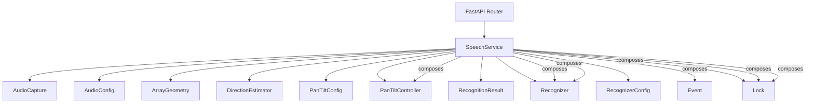
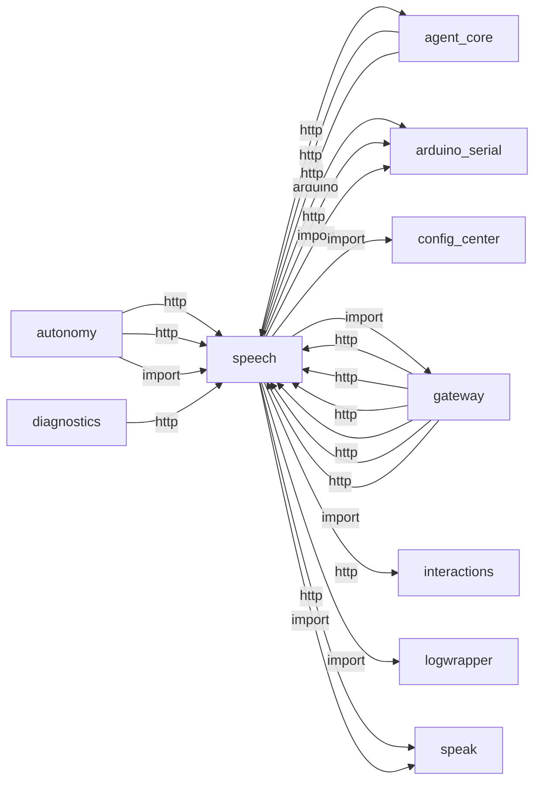
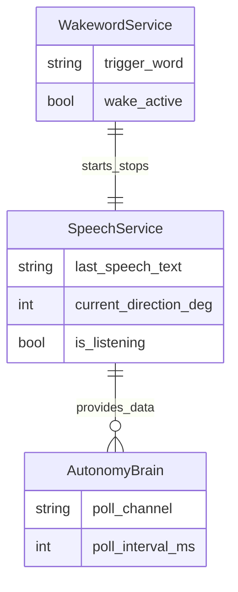
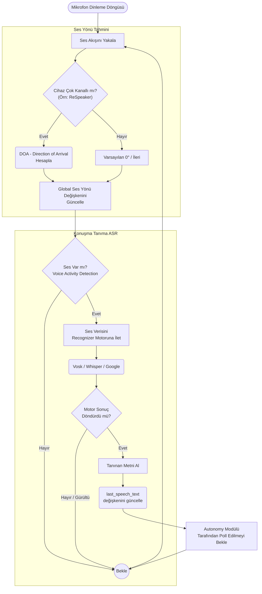

# speech

> **Çok kanallı ASR, Vosk/Whisper, ses yönü (DOA)**

## Kimlik
| Alan | Değer |
| --- | --- |
| Ana sınıf | `SpeechService` |
| Giriş noktası | `create_app()` |
| Orkestratör | `SpeechService` |
| Ana dosya | `modules/speech/xSpeechService.py` |
| Katman | Ses/Dil |
| Port | 8082 |
| Arduino | Hayır |
| Sınıf sayısı | 10 |
| Endpoint sayısı | 9 |

## İsimlendirilmiş Bileşenler (Sınıflar)

#### `AudioCapture` — `modules/speech/services/audio_capture.py`
- **Görev:** Singleton audio capture supporting multiple broadcast subscribers.
- **Kalıtım:** —
- **Oluşturduğu bileşenler:** `AudioConfig`, `Lock`
- **Metodlar:** `merge_config()`, `start()`, `stop()`, `stream()`

#### `AudioConfig` — `modules/speech/services/audio_capture.py`
- **Görev:** —
- **Kalıtım:** —
- **Oluşturduğu bileşenler:** —
- **Metodlar:** —

#### `ArrayGeometry` — `modules/speech/services/direction.py`
- **Görev:** —
- **Kalıtım:** —
- **Oluşturduğu bileşenler:** —
- **Metodlar:** —

#### `DirectionEstimator` — `modules/speech/services/direction.py`
- **Görev:** Estimate direction of arrival (azimuth) using two mics via GCC-PHAT.
- **Kalıtım:** —
- **Oluşturduğu bileşenler:** —
- **Metodlar:** `estimate()`

#### `PanTiltConfig` — `modules/speech/services/pan_tilt.py`
- **Görev:** —
- **Kalıtım:** —
- **Oluşturduğu bileşenler:** —
- **Metodlar:** —

#### `PanTiltController` — `modules/speech/services/pan_tilt.py`
- **Görev:** Minimal pan controller with slew limiting and callback sender.
- **Kalıtım:** —
- **Oluşturduğu bileşenler:** `PanTiltConfig`, `Event`
- **Metodlar:** `start()`, `stop()`, `set_target()`, `status()`

#### `RecognitionResult` — `modules/speech/services/recognizer.py`
- **Görev:** —
- **Kalıtım:** —
- **Oluşturduğu bileşenler:** —
- **Metodlar:** —

#### `Recognizer` — `modules/speech/services/recognizer.py`
- **Görev:** —
- **Kalıtım:** —
- **Oluşturduğu bileşenler:** `RecognizerConfig`
- **Metodlar:** `run()`, `finalize()`, `recognize_pcm()`

#### `RecognizerConfig` — `modules/speech/services/recognizer.py`
- **Görev:** —
- **Kalıtım:** —
- **Oluşturduğu bileşenler:** —
- **Metodlar:** —

#### `SpeechService` — `modules/speech/xSpeechService.py`
- **Görev:** High-level facade to run audio capture and speech recognition.
- **Kalıtım:** —
- **Oluşturduğu bileşenler:** `Event`, `Lock`, `Lock`, `Recognizer`, `PanTiltController`, `Lock`, `Recognizer`
- **Metodlar:** `set_stt_suppressed()`, `is_stt_suppressed()`, `start()`, `clear_utterance_buffer()`, `finalize_stt()`, `start_background()`, `stop()`, `listen_once()`, `last_angle()`, `listening()`, `track_start()`, `track_stop()`


## API — Endpoint → Handler → Servis

| HTTP | Path | Handler | Çağırdığı servis | Açıklama |
| --- | --- | --- | --- | --- |
| GET | `/speech/status` | `status()` | `is_stt_suppressed()` | — |
| POST | `/speech/start` | `start()` | `clear_utterance_buffer()`, `start_background()`, `stop()`, `track_start()` | — |
| POST | `/speech/stop` | `stop()` | `stop()`, `track_start()`, `track_status()`, `track_stop()` | — |
| GET | `/speech/last` | `last_result()` | `set_stt_suppressed()`, `track_start()`, `track_status()`, `track_stop()` | — |
| GET | `/speech/direction` | `direction()` | `set_stt_suppressed()`, `track_start()`, `track_status()`, `track_stop()` | — |
| POST | `/speech/track/start` | `track_start()` | `set_stt_suppressed()`, `track_start()`, `track_status()`, `track_stop()` | — |
| POST | `/speech/track/stop` | `track_stop()` | `set_stt_suppressed()`, `track_status()`, `track_stop()` | — |
| GET | `/speech/track/status` | `track_status()` | `set_stt_suppressed()`, `track_status()` | — |
| POST | `/speech/stt/suppress` | `stt_suppress()` | `set_stt_suppressed()` | — |

## Config Bölümleri
- `server`
- `audio`
- `recognition`
- `direction`

## Dış İlişkiler (Bu modül → diğerleri)

| Hedef modül | Bağlantı tipi | Detay | Neden |
| --- | --- | --- | --- |
| [[agent_core]] | http | calls path `/agent/speech/interrupt` | `speech` HTTP ile `agent_core` modülüne erişir: Ses tanıma (ASR) pipeline'ına istek gönderir. |
| [[arduino_serial]] | arduino | Arduino serial / contract kullanımı | Ses yönü (DOA) veya buzzer geri bildirimi için Arduino'ya komut gönderir. |
| [[arduino_serial]] | http | calls path `/arduino/request` | Ses yönü (DOA) veya buzzer geri bildirimi için Arduino'ya komut gönderir. |
| [[arduino_serial]] | import | contract | Ses yönü (DOA) veya buzzer geri bildirimi için Arduino'ya komut gönderir. |
| [[config_center]] | import | agent_yaml_loader | `speech` → `config_center`: config/agent.yaml dosyasından ayar okur. |
| [[gateway]] | import | url | `speech` içinde `url` import edilir; `gateway` modülünün yeteneğini kullanır (FastAPI API bootstrapper, tüm modülleri mount eder). |
| [[interactions]] | http | calls path `/interactions/event` | `speech` HTTP ile `interactions` modülüne erişir: Sistem olayı veya LED efekti tetikler. |
| [[logwrapper]] | import | init_logging | `speech` → `logwrapper`: Merkezi WebSocket log yayınına bağlanır. |
| [[speak]] | http | calls path `/speak/stop` | ASR sonrası geri bildirim veya onay cümlelerini TTS ile okutabilir. |
| [[speak]] | import | services | ASR sonrası geri bildirim veya onay cümlelerini TTS ile okutabilir. |

## Gelen İlişkiler (Diğerleri → bu modül)

| Kaynak modül | Bağlantı tipi | Detay | Neden |
| --- | --- | --- | --- |
| [[agent_core]] | http | calls path `/speech/interrupt` | `agent_core` → `speech`: Ses tanıma (ASR) pipeline'ına istek gönderir. |
| [[agent_core]] | http | exposes/routes to `/speech/interrupt` | `agent_core` → `speech`: Ses tanıma (ASR) pipeline'ına istek gönderir. |
| [[autonomy]] | http | calls path `/speech/start` | `autonomy` → `speech`: Ses tanıma (ASR) pipeline'ına istek gönderir. |
| [[autonomy]] | http | calls path `/speech/stop` | `autonomy` → `speech`: Ses tanıma (ASR) pipeline'ına istek gönderir. |
| [[autonomy]] | import | services | `autonomy` kod içinde `speech` modülünü import eder (`services`) — Çok kanallı ASR, Vosk/Whisper, ses yönü (DOA). |
| [[diagnostics]] | http | calls path `/speech/status` | `diagnostics` → `speech`: Ses tanıma (ASR) pipeline'ına istek gönderir. |
| [[gateway]] | http | calls path `/speech/status` | `gateway` → `speech`: Ses tanıma (ASR) pipeline'ına istek gönderir. |
| [[gateway]] | http | calls path `/speech/start` | `gateway` → `speech`: Ses tanıma (ASR) pipeline'ına istek gönderir. |
| [[gateway]] | http | calls path `/speech/stop` | `gateway` → `speech`: Ses tanıma (ASR) pipeline'ına istek gönderir. |
| [[gateway]] | http | calls path `/speech/last` | `gateway` → `speech`: Ses tanıma (ASR) pipeline'ına istek gönderir. |
| [[gateway]] | http | calls path `/speech` | `gateway` → `speech`: Ses tanıma (ASR) pipeline'ına istek gönderir. |
| [[gateway]] | import | xSpeechService | `gateway` kod içinde `speech` modülünü import eder (`xSpeechService`) — Çok kanallı ASR, Vosk/Whisper, ses yönü (DOA). |
| [[gateway]] | import | api | `gateway` kod içinde `speech` modülünü import eder (`api`) — Çok kanallı ASR, Vosk/Whisper, ses yönü (DOA). |
| [[logwrapper]] | http | calls path `/speech/direction` | `logwrapper` → `speech`: Ses tanıma (ASR) pipeline'ına istek gönderir. |
| [[logwrapper]] | http | calls path `/speech/last` | `logwrapper` → `speech`: Ses tanıma (ASR) pipeline'ına istek gönderir. |
| [[wakeword]] | import | services | Wake kelime algılandığında ASR pipeline'ını başlatır. |
| [[wakeword]] | registry | registry dependency: speech, arduino_serial | Wake kelime algılandığında ASR pipeline'ını başlatır. |

## İç Mimari (otomatik çıkarım)



## Modül Etkileşim Haritası



### Mimari diyagram 1


### Mimari diyagram 2


---

# Tam Kaynak Arşivi

### `modules/speech/README.md` (174 satır)

```markdown
# Speech Module (Offline I2S + DoA + Tracking)

Raspberry Pi 5 üzerindeki I2S/ALSA mikrofonlardan ses alır, Vosk ile tamamen offline konuşma tanıma yapar, iki mikrofonla ses geliş yönünü (DoA) hesaplar ve pan-tilt izleme için hedef açı üretebilir.

## Özellikler
- I2S/ALSA yakalama (sounddevice/PortAudio)
- Offline ASR (Vosk) – internet gerekmez
- İsteğe bağlı WebRTC VAD ön filtresi
- Çift mikrofonla yön tayini (GCC-PHAT, -90°..+90°)
- Sinyal kararlılığı için enerji eşiği, ölü bant, yumuşatma, slew-rate sınırı
- Pan-tilt izleme döngüsü ve kolay donanım entegrasyonu (callback)
- FastAPI ile servis; modül olarak import edilebilir

## Kurulum
1) Bağımlılıklar (Python)
    - sounddevice (PortAudio/ALSA)
    - vosk
    - fastapi, uvicorn (API için)
    - (opsiyonel) webrtcvad — VAD kullanacaksanız

2) Sistem gereksinimleri
    - RPi’de ALSA/PortAudio. I2S mikrofonun `arecord -l` veya `sd.query_devices()` ile görünmesi gerekir.

3) Vosk model(ler)i
    - Modeller: https://alphacephei.com/vosk/models
    - Örnek: `modules/speech/models/vosk-tr/`
    - Ya `recognition.model_path` ile tam yol verin ya da `recognition.language` seçin, otomatik eşleme kullansın.

## Hızlı Başlangıç
### Kütüphane
```python
from modules.speech.xSpeechService import SpeechService
svc = SpeechService()
svc.start_background(on_result=lambda r: print(r))
```

### CLI
```powershell
python -m modules.speech.xSpeechService --listen-once
# veya API
python -m modules.speech.xSpeechService --api --config config/agent.yaml
```

### Servis (FastAPI)
```python
from fastapi import FastAPI
from modules.speech.xSpeechService import SpeechService
from modules.speech.api import get_router

svc = SpeechService()
app = FastAPI()
app.include_router(get_router(svc))
```

## HTTP API Uç Noktaları
- POST `/speech/start` – Arka planda dinlemeyi başlatır
- POST `/speech/stop` – Dinlemeyi durdurur
- GET `/speech/last` – Son kısmi/nihai tanıma sonucu `{ text, final, confidence }`
- GET `/speech/direction` – Son hesaplanan açı `{ angle }` (yoksa 503)
- POST `/speech/track/start` – Pan-tilt izlemeyi başlatır
- POST `/speech/track/stop` – Pan-tilt izlemeyi durdurur
- GET `/speech/track/status` – `{ active, current, target, min, max, tracking, angle }`

## Yapılandırma (config/agent.yaml -> speech) – Referans
Dosya: config/agent.yaml içindeki speech bölümü

Not: Speech modülü artık modül içi config/config.yml okumaz.

### server
- `host`: API servis adresi (vars: `0.0.0.0`)
- `port`: API portu (vars: `8082`)

### audio
- `device`: ALSA cihaz adı veya index (null=default)
- `samplerate`: Önerilen 16000 (VAD için 8/16/32/48k geçerli)
- `channels`: 1=mono, 2=stereo (DoA için 2 gerekir)
- `dtype`: PCM formatı (vars: `int16`)
- `frame_ms`: Çerçeve süresi ms (vars: 30)

### recognition
- `language`: Dil kodu (tr, en, en-us, de, es, fr, ...)
- `model_path`: Mutlak/bağıl model klasörü (dilden önceliklidir)
- `language_models`: Dil -> model klasör eşlemesi (bağıl yollar modül köküne göre çözülür)
- `samplerate`: Vosk örnekleme hızı (vars: 16000)
- `max_alternatives`: 0=kapalı; >0 ise alternatif hipotez sayısı
- `vad.enabled`: true/false – WebRTC VAD ön filtresi
- `vad.aggressiveness`: 0..3 – 3 en agresif
- `vad.hangover_ms`: Konuşma bittikten sonra tutulacak süre (ms)

Davranışlar:
- `model_path` verilirse kullanılır; verilmezse `language` ile `language_models` üzerinden otomatik seçilir.
- Stereo giriş DoA için kullanılır, ASR için akış dahili olarak mono’ya indirgenir.

### direction
- `enabled`: true/false – Yön tahmini (stereo şart)
- `mic_distance_m`: Mikrofonlar arası mesafe (m)
- `control.invert_direction`: Sol/Sağ kablolama ters ise işareti çevirir
- `control.deadband_deg`: Ölü bant (küçük değişimleri yok say)
- `control.smoothing_alpha`: 0..1 EMA düşük geçiş filtresi
- `control.slew_deg_per_s`: Saniyedeki azami açı değişimi
- `control.energy_threshold`: RMS eşiği; altındaysa açı güncellenmez

Yön hesaplama: GCC-PHAT ile örnek gecikme (TDoA) bulunur, geometriyle -90..+90° aralığına dönüştürülür, ardından kontrol filtreleri uygulanır.

### pan_tilt
- `enabled`: true/false – Kontrolcü hazır (takip ayrı bayraktır)
- `center_deg`: Nötr pan açısı (genelde 90)
- `min_deg` / `max_deg`: Çalışma sınırları
- `slew_deg_per_s`: Azami yaklaşım hızı
- `update_hz`: Gönderim döngüsü frekansı

Takip mantığı: Takip açıkken hedef pan = `center_deg + angle`. Slew limitiyle akıcı güncellenir ve `sender` callback’i ile donanıma iletilir.

## CLI Bayrakları
- `--config <path>`: Farklı bir config dosyası kullan
- `--listen-once`: İlk nihai sonucu alıp çıkar
- `--api`: FastAPI sunucusunu konfigdeki host/port ile çalıştır

## Donanım Entegrasyonu (Pan-Tilt)
`PanTiltController`, açıları `sender(angle_deg)` callback’i ile iletir. Varsayılan sender log yazar. Donanıma bağlamak için `xSpeechService.py` içindeki `_send_pan` fonksiyonunu seri/HTTP vb. ile değiştirin.

Örnek (seri):
- Arduino: “PAN:<deg>\n” formatını dinlesin.
- Python: `_send_pan` içinde seri porta yazın (pyserial ile).

## Sorun Giderme
- `sounddevice not available`: `pip install sounddevice`; RPi’de ALSA cihazlarını doğrulayın.
- `Vosk model directory not found`: `recognition.model_path` veya `language_models` yolu hatalı.
- `VAD enabled but 'webrtcvad' is not installed`: `pip install webrtcvad` (opsiyonel).
- `/speech/direction` 503: Stereo yok veya yön henüz hesaplanmadı.

## Örnek Konfig (özet)
```yaml
server:
   host: 0.0.0.0
   port: 8082

audio:
   samplerate: 16000
   channels: 2
   frame_ms: 30

recognition:
   language: tr
   language_models:
      tr: models/vosk-tr
   vad:
      enabled: false

direction:
   enabled: true
   mic_distance_m: 0.06
   control:
      invert_direction: false
      deadband_deg: 3.0
      smoothing_alpha: 0.3
      slew_deg_per_s: 120.0
      energy_threshold: 1000

pan_tilt:
   enabled: true
   center_deg: 90
   min_deg: 0
   max_deg: 180
   slew_deg_per_s: 120
   update_hz: 20
```

## Notlar
- Mono girişte yön tahmini otomatik devre dışıdır; tanıma çalışmaya devam eder.
- DoA açısı pozitifse sağ, negatifse sol kabul edilir; `invert_direction` kablo yönünü telafi eder.

## Gateway ile Kullanım
Gateway çalışırken `speech` API uçları tek portta `/speech/*` altında sunulur.
```

### `modules/speech/__init__.py` (20 satır)

```python
"""Speech module package.

Provides audio capture from I2S/ALSA devices and offline speech recognition.
Follows DryCode principles and can be used as library or run as a service.
"""

from . import config_loader

__all__ = [
    "config_loader",
    "xSpeechService",
]


def __getattr__(name: str):
    if name == "xSpeechService":
        from .xSpeechService import SpeechService as xSpeechService  # noqa: N811

        return xSpeechService
    raise AttributeError(f"module {__name__!r} has no attribute {name!r}")
```

### `modules/speech/api/__init__.py` (3 satır)

```python
from .router import get_router

__all__ = ["get_router"]
```

### `modules/speech/api/router.py` (205 satır)

```python
from __future__ import annotations
from fastapi import APIRouter
import requests
import threading
import logging
import time
from threading import Timer, Lock
from typing import TYPE_CHECKING

from modules.speech.services.wake_phrase import contains_wakeword, strip_wakewords

if TYPE_CHECKING:
    from modules.speech.xSpeechService import SpeechService

logger = logging.getLogger("speech.api")

_GATEWAY_BASE = "http://127.0.0.1:8080"


def _gw(path: str) -> str:
    return f"{_GATEWAY_BASE.rstrip('/')}/{path.lstrip('/')}"


def _barge_in_urls() -> tuple[str, ...]:
    return (
        _gw("/speak/stop"),
        _gw("/agent/speech/interrupt"),
        _gw("/speech/start"),
    )


def _notify_autonomy():
    try:
        requests.post(_gw("/autonomy/interaction"), timeout=0.1)
    except Exception:
        pass


def _push_interaction_event(event_type: str):
    try:
        requests.post(
            _gw("/interactions/event"),
            json={"type": event_type},
            timeout=0.1,
        )
    except Exception:
        pass

def _emit_speech_event(name: str):
    threading.Thread(target=_push_interaction_event, args=(name,), daemon=True).start()


def _barge_in_for_wakeword() -> None:
    for url in _barge_in_urls():
        try:
            requests.post(url, json={}, timeout=0.25)
        except Exception:
            pass
    logger.info("Wakeword barge-in: stopped TTS and opened listening")


def get_router(service: SpeechService, gateway_base_url: str = "") -> APIRouter:
    global _GATEWAY_BASE
    if gateway_base_url:
        _GATEWAY_BASE = str(gateway_base_url).rstrip("/")
    router = APIRouter()

    @router.get("/speech/status")
    async def status():
        return {
            "listening": service.listening,
            "model_ready": getattr(service, "recognizer", None) is not None,
            "stt_suppressed": bool(getattr(service, "is_stt_suppressed", lambda: False)()),
        }

    last: dict | None = {"text": None, "language": getattr(service, "source_language", "tr"), "ts": 0.0}
    last_nonempty_text = ""
    last_partial_text = ""
    last_partial_ts = 0.0
    speaking = False
    speaking_lock = Lock()

    def _mark_speaking(active: bool) -> bool:
        nonlocal speaking
        with speaking_lock:
            if active:
                if speaking:
                    return False
                speaking = True
                return True
            if not speaking:
                return False
            speaking = False
            return True

    def _schedule_speech_end(delay: float = 0.5):
        def _end():
            if _mark_speaking(False):
                _emit_speech_event("speech.end")
        timer = Timer(delay, _end)
        timer.daemon = True
        timer.start()

    def _cb(r):
        nonlocal last, last_partial_text, last_partial_ts, last_nonempty_text
        if hasattr(service, "is_stt_suppressed") and service.is_stt_suppressed():
            return
        text = (r.text or "").strip()
        language = getattr(service, "source_language", "tr")
        if r.is_final and hasattr(service, "finalize_stt"):
            text, language = service.finalize_stt(text or last_nonempty_text)
        if text:
            last_nonempty_text = text
        if text and contains_wakeword(text):
            remainder = strip_wakewords(text)
            if r.is_final or len(remainder.split()) < 2:
                threading.Thread(target=_barge_in_for_wakeword, daemon=True).start()
        last = {
            "text": text or last_nonempty_text or None,
            "final": r.is_final,
            "confidence": r.confidence,
            "language": language,
            "ts": time.time(),
        }
        # STT logs should be visible even when downstream modules (e.g. ollama)
        # are offline; log both partial and final recognition results.
        if r.is_final:
            if text:
                logger.info("STT >>> %s (lang=%s)", text, language)
            else:
                logger.debug("stt final empty")
            last_partial_text = ""
        else:
            now = time.time()
            # Throttle partial logs to avoid log spam but keep visibility.
            if text and (text != last_partial_text or (now - last_partial_ts) >= 0.35):
                logger.info("STT (partial) >>> %s", text)
                last_partial_text = text
                last_partial_ts = now

        if r.is_final and (text or last_nonempty_text):
            threading.Thread(target=_notify_autonomy, daemon=True).start()
            if _mark_speaking(True):
                _emit_speech_event("speech.start")
            _schedule_speech_end()

    @router.post("/speech/start")
    async def start():
        was_listening = service.listening
        logger.info("speech start requested (was_listening=%s)", was_listening)
        if hasattr(service, "clear_utterance_buffer"):
            service.clear_utterance_buffer()
        service.start_background(on_result=_cb)
        logger.info("speech start handled (listening=%s)", service.listening)
        if not was_listening:
            _emit_speech_event("speech.listen.start")
        return {"ok": True, "listening": service.listening}

    @router.post("/speech/stop")
    async def stop():
        service.stop()
        _emit_speech_event("speech.listen.end")
        if _mark_speaking(False):
            _emit_speech_event("speech.end")
        return {"ok": True, "listening": service.listening}

    @router.get("/speech/last")
    async def last_result():
        return last or {}

    @router.get("/speech/direction")
    async def direction():
        angle = service.last_angle if hasattr(service, "last_angle") else None
        if angle is None:
            return {"ok": False, "angle": None}
        return {"ok": True, "angle": angle}

    @router.post("/speech/track/start")
    async def track_start():
        try:
            service.track_start()
            return {"ok": True}
        except Exception as e:
            return {"ok": False, "error": str(e)}

    @router.post("/speech/track/stop")
    async def track_stop():
        try:
            service.track_stop()
            return {"ok": True}
        except Exception as e:
            return {"ok": False, "error": str(e)}

    @router.get("/speech/track/status")
    async def track_status():
        return service.track_status()

    @router.post("/speech/stt/suppress")
    async def stt_suppress(body: dict | None = None):
        enabled = bool((body or {}).get("enabled", True))
        if hasattr(service, "set_stt_suppressed"):
            service.set_stt_suppressed(enabled)
        return {"ok": True, "suppressed": enabled}

    return router
```

### `modules/speech/architecture_speech.md` (75 satır)

```markdown
# Speech Modülü Mimarisi

Speech modülü (`modules/speech`), mikrofon verisini alarak konuşma tanıma (ASR/STT) işlemi yapar ve sesin geliş yönünü (direction) tahmin eder.

## 🏗️ İş Akışı ve Karar Mekanizmaları (Flowchart)



## 🔄 İlişkisel Etkileşimler (Veri Akışı)


## ⚙️ Detaylı Karar Mantığı (if/else)

1. **Dinleme Durumu (Enable/Disable)**
   - **`if`** `is_listening == False`: Sensör mikrofonu okumayı bırakmaz ama STT (Speech-to-Text) motoruna göndermez (CPU tasarrufu).
   - Bu durum genelde `Wakeword` modülü tarafından yönetilir (Wakeword duyulunca `is_listening = True` yapılır).
2. **Ses Yönü Hesaplaması (DOA)**
   - **`if`** donanım özel 4-mikrofonlu bir array ise (ReSpeaker gibi), sesin gecikme farklarından (TDOA) açısı hesaplanır (`0 - 360` derece).
   - Bu veri `Autonomy` tarafından saniyede bir poll edilir. **`if`** açı değişimi eski açıdan 15 dereceden fazlaysa, Autonomy kafayı o yöne çevirir.
3. **Kısa/Gürültü Filtrelemesi**
   - **`if`** `len(text.strip()) < 3`: Sadece tek hecelik gürültüler veya öksürükler metin olarak kabul edilmez, silinir.
```

### `modules/speech/config/README.md` (9 satır)

```markdown
# Speech Config

Bu dosya yalnızca konuşma modülünün ayarlarını içerir.

- server.host / server.port: FastAPI servis adresi
- audio.*: ALSA/I2S cihaz ve örnekleme ayarları
- recognition.*: Vosk modeli ve seçenekleri

Varsayılanlar bu dizindeki `config.yml` içinde bulunur; servis başlatılırken harici bir yol ile override edilebilir.
```

### `modules/speech/config/config.yml` (49 satır)

```yaml
# Speech module configuration

server:
  host: 0.0.0.0
  port: 8082

audio:
  device: plughw:0,0     # ALSA device (from `arecord -l`) - set to card 0, device 0
  samplerate: 16000
  channels: 2            # two I2S mics for direction estimation
  dtype: int16
  frame_ms: 30

recognition:
  # You can set either language or model_path. If model_path is missing, language will be used to auto-pick a model.
  source_language: en          # legacy fallback when auto_language is off
  language: en                 # primary Vosk model (en)
  default_language: en
  auto_language: true          # detect tr/en from transcript; report in /speech/last
  auto_switch_model: true      # dual-decode utterance with vosk-en and pick best transcript
  dual_decode_margin: 0.35     # EN wins when en_score > tr_score + margin
  utterance_buffer_sec: 20
  model_path: null             # explicit path overrides language mapping
  # Optional per-language mapping to override defaults
  language_models:
    tr: models/vosk-tr
    en: models/vosk-en
    en-us: models/vosk-en-us
    de: models/vosk-de
    es: models/vosk-es
    fr: models/vosk-fr
  samplerate: 16000
  max_alternatives: 0
  input_gain: 3.0

  vad:
    enabled: false             # enable WebRTC VAD pre-filter
    aggressiveness: 2          # 0-3 (3 = most aggressive)
    hangover_ms: 300           # keep audio after speech end (ms)

direction:
  enabled: true
  mic_distance_m: 0.06
  control:
    invert_direction: false   # reverse sign if L/R wiring swapped
    deadband_deg: 3.0         # ignore small changes
    smoothing_alpha: 0.3      # 0..1 low-pass for angle
    slew_deg_per_s: 120.0     # max change per second
    energy_threshold: 1000    # min RMS energy to update angle
```

### `modules/speech/config_loader.py` (16 satır)

```python
from __future__ import annotations
import os
from copy import deepcopy
from typing import Any, Dict
from modules.config_center.agent_yaml_loader import load_agent_config, require_dict_section


def load_config(override_path: str | os.PathLike | None = None) -> Dict[str, Any]:
    """Load speech config from central config/agent.yaml.

    Strict mode: module-local config.yml is not used.
    """
    explicit = override_path or os.getenv("SPEECH_CONFIG")
    root_cfg = load_agent_config(explicit)
    section = require_dict_section(root_cfg, "speech")
    return deepcopy(section)
```

### `modules/speech/models/README.md` (20 satır)

```markdown
# Vosk Models

Buraya Vosk offline model klasörünü yerleştirin.

**Otomatik kurulum (Pi):**

```bash
python tools/install_vosk_tr.py
```

SSL hatası (`CERTIFICATE_VERIFY_FAILED`) alırsanız:

```bash
sudo apt update && sudo apt install -y ca-certificates
python tools/install_vosk_tr.py
# veya acil:
python tools/install_vosk_tr.py --insecure
```

Manuel: `vosk-model-small-tr-0.3` klasörünü `vosk-tr` adına kopyalayın (0.22 artık yayımlanmıyor).
```

### `modules/speech/requirements.txt` (5 satır)

```text
sounddevice>=0.4.6
vosk>=0.3.45
fastapi>=0.110.0
uvicorn>=0.23.0
webrtcvad>=2.0.10 ; python_version>='3.8'  # optional
```

### `modules/speech/services/__init__.py` (4 satır)

```python
from .audio_capture import AudioCapture
from .recognizer import Recognizer, RecognitionResult

__all__ = ["AudioCapture", "Recognizer", "RecognitionResult"]
```

### `modules/speech/services/audio_capture.py` (197 satır)

```python
from __future__ import annotations
import logging
import queue
import threading
import time
from dataclasses import dataclass
from typing import Dict, Iterable, Optional, Any

try:
    import sounddevice as sd
except Exception:
    sd = None
try:
    import alsaaudio
except Exception:
    alsaaudio = None

logger = logging.getLogger("speech.audio")

# GLOBAL SINGLETON for all audio capture to ensure zero contention
_SINGLE_CAPTURE_INSTANCE: Optional["AudioCapture"] = None
_INSTANCE_LOCK = threading.Lock()

def get_shared_capture(cfg: Dict) -> "AudioCapture":
    """Shared mic for wakeword + speech. Later callers may upgrade device/rate if unset."""
    global _SINGLE_CAPTURE_INSTANCE
    with _INSTANCE_LOCK:
        if _SINGLE_CAPTURE_INSTANCE is None:
            _SINGLE_CAPTURE_INSTANCE = AudioCapture(cfg)
        else:
            _SINGLE_CAPTURE_INSTANCE.merge_config(cfg)
        return _SINGLE_CAPTURE_INSTANCE

def release_shared_capture(inst: "AudioCapture") -> None:
    # In this simplified singleton model, we don't actually stop it unless explicitly told.
    pass

@dataclass
class AudioConfig:
    device: Any = None
    samplerate: int = 16000
    channels: int = 1
    dtype: str = "int16"
    frame_ms: int = 30

class AudioCapture:
    """Singleton audio capture supporting multiple broadcast subscribers."""

    def __init__(self, cfg: Dict):
        self.cfg = AudioConfig(
            device=cfg.get("device"),
            samplerate=int(cfg.get("samplerate", 16000)),
            channels=int(cfg.get("channels", 1)),
            dtype=str(cfg.get("dtype", "int16")),
            frame_ms=int(cfg.get("frame_ms", 30)),
        )
        self._subscribers: list[queue.Queue] = []
        self._lock = threading.Lock()
        self._stream = None
        self._stopped = False
        self._alsa_thread = None
        self._pcm = None

    def merge_config(self, cfg: Dict) -> None:
        """Apply non-default audio fields from a later module (e.g. wakeword plughw)."""
        if not isinstance(cfg, dict):
            return
        audio = cfg.get("audio", cfg)
        if not isinstance(audio, dict):
            return
        dev = audio.get("device")
        if dev is not None and str(dev).strip():
            self.cfg.device = dev
        if audio.get("samplerate") is not None:
            self.cfg.samplerate = int(audio.get("samplerate", self.cfg.samplerate))
        if audio.get("channels") is not None:
            self.cfg.channels = int(audio.get("channels", self.cfg.channels))

    def _callback(self, indata, frames, time, status):
        if status:
            logger.warning("Audio status: %s", status)
        data = bytes(indata)
        with self._lock:
            for q in self._subscribers:
                try:
                    q.put_nowait(data)
                except queue.Full:
                    pass

    def start(self):
        with self._lock:
            if self._stream is not None or self._alsa_thread is not None:
                return

            blocksize = int(self.cfg.samplerate * self.cfg.frame_ms / 1000)
            
            # Try sounddevice (PortAudio)
            if sd is not None:
                # 1. Try explicit device
                devs_to_try = [self.cfg.device, None] # Try configured, then default
                for dev in devs_to_try:
                    try:
                        # Convert numeric string to int
                        actual_dev = dev
                        if isinstance(dev, str) and dev.isdigit():
                            actual_dev = int(dev)
                        
                        self._stream = sd.InputStream(
                            device=actual_dev,
                            channels=self.cfg.channels,
                            samplerate=self.cfg.samplerate,
                            dtype=self.cfg.dtype,
                            callback=self._callback,
                            blocksize=blocksize,
                        )
                        self._stream.start()
                        self._stopped = False
                        logger.info("Audio capture started (portaudio): %s @ %d Hz", actual_dev if actual_dev is not None else "default", self.cfg.samplerate)
                        return
                    except Exception as exc:
                        logger.warning("sounddevice attempt failed for device %s: %s", dev, exc)

            # Fallback: pyalsaaudio
            if alsaaudio is not None:
                try:
                    fmt = alsaaudio.PCM_FORMAT_S16_LE if self.cfg.dtype == 'int16' else alsaaudio.PCM_FORMAT_S32_LE
                    dev_name = str(self.cfg.device) if self.cfg.device is not None else "default"
                    
                    self._pcm = alsaaudio.PCM(
                        type=alsaaudio.PCM_CAPTURE,
                        device=dev_name,
                        channels=self.cfg.channels,
                        rate=self.cfg.samplerate,
                        format=fmt,
                        periodsize=max(64, blocksize)
                    )

                    def _alsa_reader():
                        self._stopped = False
                        try:
                            while not self._stopped:
                                length, data = self._pcm.read()
                                if length > 0 and data:
                                    b_data = bytes(data)
                                    with self._lock:
                                        for q in self._subscribers:
                                            try: q.put_nowait(b_data)
                                            except: pass
                        finally:
                            if self._pcm:
                                self._pcm.close()
                                self._pcm = None

                    self._alsa_thread = threading.Thread(target=_alsa_reader, daemon=True)
                    self._alsa_thread.start()
                    logger.info("Audio capture started (ALSA fallback): %s @ %d Hz", dev_name, self.cfg.samplerate)
                    return
                except Exception as exc:
                    logger.warning("ALSA fallback failed: %s", exc)

            raise RuntimeError("No working audio backend could be started.")

    def stop(self):
        with self._lock:
            self._stopped = True
            if self._stream:
                try:
                    self._stream.stop()
                    self._stream.close()
                finally:
                    self._stream = None
            if self._pcm:
                try:
                    self._pcm.close()
                finally:
                    self._pcm = None
            self._alsa_thread = None
            logger.info("Audio capture stopped")

    def stream(self) -> Iterable[bytes]:
        q = queue.Queue(maxsize=50)
        with self._lock:
            self._subscribers.append(q)
        
        try:
            if self._stream is None and self._alsa_thread is None:
                self.start()
            
            while not self._stopped:
                try:
                    yield q.get(timeout=1.0)
                except queue.Empty:
                    continue
        finally:
            with self._lock:
                if q in self._subscribers:
                    self._subscribers.remove(q)
```

### `modules/speech/services/direction.py` (50 satır)

```python
from __future__ import annotations
import math
import numpy as np
from dataclasses import dataclass
from typing import Iterable, Optional


@dataclass
class ArrayGeometry:
    mic_distance_m: float = 0.06  # distance between two mics (meters)
    sound_speed: float = 343.0    # m/s


class DirectionEstimator:
    """Estimate direction of arrival (azimuth) using two mics via GCC-PHAT.

    Expects interleaved int16 stereo frames (L,R,L,R,...) at given sample_rate.
    Returns azimuth in degrees (-90..+90) where + is to the right of mic0.
    """

    def __init__(self, sample_rate: int, geometry: Optional[ArrayGeometry] = None):
        self.fs = sample_rate
        self.geom = geometry or ArrayGeometry()
        self.max_delay = int(self.geom.mic_distance_m / self.geom.sound_speed * self.fs)  # samples

    def _gcc_phat(self, sig, ref, interp=1):
        n = sig.shape[0] + ref.shape[0]
        SIG = np.fft.rfft(sig, n=n)
        REF = np.fft.rfft(ref, n=n)
        R = SIG * np.conj(REF)
        R /= np.abs(R) + 1e-15
        cc = np.fft.irfft(R, n=(n * interp))
        max_shift = int(self.max_delay * interp)
        cc = np.concatenate((cc[-max_shift:], cc[:max_shift+1]))
        shift = np.argmax(np.abs(cc)) - max_shift
        return shift / float(interp)

    def estimate(self, frame_bytes: bytes) -> float:
        data = np.frombuffer(frame_bytes, dtype=np.int16)
        if data.size % 2 != 0:
            data = data[:-1]
        # de-interleave
        L = data[0::2].astype(np.float32)
        R = data[1::2].astype(np.float32)
        delay = self._gcc_phat(L, R)
        # clamp to physical max delay
        delay = max(-self.max_delay, min(self.max_delay, delay))
        tau = delay / self.fs  # seconds
        angle = math.degrees(math.asin(max(-1.0, min(1.0, tau * self.geom.sound_speed / self.geom.mic_distance_m))))
        return float(angle)
```

### `modules/speech/services/pan_tilt.py` (84 satır)

```python
from __future__ import annotations
import logging
import threading
import time
from dataclasses import dataclass
from typing import Callable, Optional, Dict

logger = logging.getLogger("speech.pan_tilt")


@dataclass
class PanTiltConfig:
    enabled: bool = False
    center_deg: float = 90.0
    min_deg: float = 0.0
    max_deg: float = 180.0
    slew_deg_per_s: float = 120.0
    update_hz: float = 20.0


class PanTiltController:
    """Minimal pan controller with slew limiting and callback sender.

    sender: Callable[[float], None] is invoked with absolute pan angle (deg).
    Default sender logs; replace with hardware integration (e.g., serial or API).
    """

    def __init__(self, cfg: Dict, sender: Optional[Callable[[float], None]] = None):
        self.cfg = PanTiltConfig(
            enabled=bool(cfg.get("enabled", False)),
            center_deg=float(cfg.get("center_deg", 90.0)),
            min_deg=float(cfg.get("min_deg", 0.0)),
            max_deg=float(cfg.get("max_deg", 180.0)),
            slew_deg_per_s=float(cfg.get("slew_deg_per_s", 120.0)),
            update_hz=float(cfg.get("update_hz", 20.0)),
        )
        self._sender = sender or (lambda ang: logger.info("pan-> %.1f deg", ang))
        self._target = self.cfg.center_deg
        self._current = self.cfg.center_deg
        self._thr: Optional[threading.Thread] = None
        self._stop = threading.Event()
        self._active = False

    def start(self):
        if self._active:
            return
        self._stop.clear()
        self._active = True
        self._thr = threading.Thread(target=self._run, daemon=True)
        self._thr.start()

    def stop(self):
        self._stop.set()
        self._active = False

    def set_target(self, angle_deg: float):
        # clamp
        angle = max(self.cfg.min_deg, min(self.cfg.max_deg, angle_deg))
        self._target = angle

    def status(self) -> Dict:
        return {
            "active": self._active,
            "current": self._current,
            "target": self._target,
            "min": self.cfg.min_deg,
            "max": self.cfg.max_deg,
        }

    def _run(self):
        dt = 1.0 / max(1.0, self.cfg.update_hz)
        max_slew = self.cfg.slew_deg_per_s
        last = time.time()
        while not self._stop.is_set():
            now = time.time()
            dt = max(1e-3, now - last)
            last = now
            max_step = max_slew * dt if max_slew > 0 else float('inf')
            err = self._target - self._current
            if abs(err) > 1e-3:
                step = max(-max_step, min(max_step, err))
                self._current += step
                self._sender(self._current)
            time.sleep(1.0 / max(1.0, self.cfg.update_hz))
```

### `modules/speech/services/recognizer.py` (167 satır)

```python
from __future__ import annotations
import json
import logging
import os
from dataclasses import dataclass
from typing import Dict, Iterable, Iterator, Optional
from pathlib import Path

# Lazy-loaded native backends. Keep imports deferred to runtime paths to avoid
# importing heavy/native libs during plain module import and smoke tests.
webrtcvad = None  # type: ignore
Model = None  # type: ignore
KaldiRecognizer = None  # type: ignore

logger = logging.getLogger("speech.recognizer")


@dataclass
class RecognitionResult:
    text: str
    is_final: bool
    confidence: Optional[float] = None


@dataclass
class RecognizerConfig:
    # language or model_path can be provided. model_path takes precedence.
    language: Optional[str] = None
    model_path: Optional[str] = None
    language_models: Dict[str, str] | None = None
    samplerate: int = 16000
    max_alternatives: int = 0
    vad_enabled: bool = False
    vad_aggressiveness: int = 2
    vad_hangover_ms: int = 300


class Recognizer:
    def __init__(self, cfg: Dict):
        self.cfg = RecognizerConfig(
            language=cfg.get("language"),
            model_path=cfg.get("model_path"),
            language_models=cfg.get("language_models"),
            samplerate=int(cfg.get("samplerate", 16000)),
            max_alternatives=int(cfg.get("max_alternatives", 0)),
            vad_enabled=bool(cfg.get("vad", {}).get("enabled", False)),
            vad_aggressiveness=int(cfg.get("vad", {}).get("aggressiveness", 2)),
            vad_hangover_ms=int(cfg.get("vad", {}).get("hangover_ms", 300)),
        )
        self._model = None
        self._rec = None
        self._vad = None
        # Resolve model path relative to module root when not absolute (if provided)
        if self.cfg.model_path and not os.path.isabs(self.cfg.model_path):
            module_root = Path(__file__).resolve().parents[1]  # .../modules/speech
            resolved = module_root / self.cfg.model_path
            self.cfg.model_path = str(resolved)

    def _resolve_model_path(self) -> str:
        if self.cfg.model_path:
            return str(self.cfg.model_path)
        lang = (self.cfg.language or "tr").lower()
        mapping = self.cfg.language_models or {
            "tr": "models/vosk-tr",
            "en": "models/vosk-en",
            "en-us": "models/vosk-en-us",
            "de": "models/vosk-de",
            "es": "models/vosk-es",
            "fr": "models/vosk-fr",
        }
        return mapping.get(lang, mapping.get("en", "models/vosk-en"))

    def _ensure_model(self):
        global Model, KaldiRecognizer, webrtcvad
        if Model is None or KaldiRecognizer is None:
            try:
                from vosk import Model as _Model, KaldiRecognizer as _KaldiRecognizer  # type: ignore
            except Exception as exc:
                raise RuntimeError(
                    "vosk is not available. Install with 'pip install vosk' and download an offline model."
                ) from exc
            Model = _Model
            KaldiRecognizer = _KaldiRecognizer
        if self._model is None:
            model_path = self._resolve_model_path()
            # resolve relative to module root
            if not os.path.isabs(model_path):
                module_root = Path(__file__).resolve().parents[1]
                model_path = str((module_root / model_path).resolve())
            if not os.path.isdir(model_path):
                raise FileNotFoundError(f"Vosk model directory not found: {model_path}")
            self._model = Model(model_path)
        if self._rec is None:
            self._rec = KaldiRecognizer(self._model, self.cfg.samplerate)
            if self.cfg.max_alternatives:
                self._rec.SetMaxAlternatives(self.cfg.max_alternatives)
        if self.cfg.vad_enabled:
            if webrtcvad is None:
                try:
                    import webrtcvad as _webrtcvad  # type: ignore
                except Exception as exc:
                    raise RuntimeError(
                        "VAD enabled but 'webrtcvad' is not installed. Install with 'pip install webrtcvad'."
                    ) from exc
                webrtcvad = _webrtcvad
            if self._vad is None:
                self._vad = webrtcvad.Vad(self.cfg.vad_aggressiveness)

    def run(self, stream: Iterable[bytes]) -> Iterator[RecognitionResult]:
        self._ensure_model()
        hangover_frames = 0
        # 20ms step size for VAD, samples->bytes: int16 -> *2
        vad_step_bytes = int(self.cfg.samplerate * 0.02) * 2
        for chunk in stream:
            data = chunk
            if self._vad:
                voiced_any = False
                # iterate over 20ms frames
                for i in range(0, len(data), vad_step_bytes):
                    frame = data[i:i + vad_step_bytes]
                    if len(frame) < vad_step_bytes:
                        break
                    try:
                        if self._vad.is_speech(frame, self.cfg.samplerate):
                            voiced_any = True
                            break
                    except Exception:
                        voiced_any = True
                        break
                if not voiced_any:
                    if hangover_frames > 0:
                        hangover_frames -= 1
                    else:
                        continue
                else:
                    # Set hangover to ~vad_hangover_ms/20ms frames
                    hangover_frames = max(hangover_frames, max(1, int(self.cfg.vad_hangover_ms / 20)))

            if self._rec.AcceptWaveform(data):
                res = json.loads(self._rec.Result())
                yield RecognitionResult(text=res.get("text", ""), is_final=True, confidence=res.get("confidence"))
            else:
                partial = json.loads(self._rec.PartialResult()).get("partial", "")
                if partial:
                    yield RecognitionResult(text=partial, is_final=False)

    def finalize(self) -> Optional[RecognitionResult]:
        if self._rec is None:
            return None
        data = json.loads(self._rec.FinalResult())
        text = data.get("text", "")
        conf = data.get("confidence")
        return RecognitionResult(text=text, is_final=True, confidence=conf)

    def recognize_pcm(self, pcm: bytes) -> str:
        """One-shot decode of a mono PCM16 utterance buffer."""
        if not pcm:
            return ""
        self._ensure_model()
        rec = KaldiRecognizer(self._model, self.cfg.samplerate)
        if self.cfg.max_alternatives:
            rec.SetMaxAlternatives(self.cfg.max_alternatives)
        step = max(4000, int(self.cfg.samplerate * 0.02) * 2)
        for i in range(0, len(pcm), step):
            rec.AcceptWaveform(pcm[i : i + step])
        data = json.loads(rec.FinalResult())
        return str(data.get("text", "") or "").strip()
```

### `modules/speech/services/stt_language.py` (154 satır)

```python
from __future__ import annotations

import logging
import re
from typing import Optional, Tuple

from modules.speech.services.recognizer import Recognizer

logger = logging.getLogger("speech.stt_language")

_TR_CHARS = set("çğıöşüÇĞİÖŞÜ")
_EN_STOPWORDS = frozenset({
    "the", "a", "an", "is", "are", "was", "were", "be", "been", "being",
    "have", "has", "had", "do", "does", "did", "will", "would", "could",
    "should", "may", "might", "must", "shall", "can", "need",
    "to", "of", "in", "for", "on", "with", "at", "by", "from",
    "what", "which", "who", "how", "all", "some", "not", "and", "but", "if", "or",
    "i", "you", "he", "she", "it", "we", "they", "my", "your", "me",
    "please", "hello", "hi", "thanks", "thank", "sorry", "about", "tell",
    "introduce", "yourself", "help", "yes", "no",
})


def _detect_language(text: str, *, default: str) -> str:
    from modules.speak.services.lang_detect import detect_text_language

    return detect_text_language(text, default=default)


def _transcript_score(text: str, target_lang: str) -> float:
    """Score how well a transcript matches the target language."""
    value = str(text or "").strip()
    if not value:
        return 0.0
    words = re.findall(r"[a-zA-Z']+", value.lower())
    if not words:
        return 0.0

    tr_chars = sum(1 for ch in value if ch in _TR_CHARS)
    en_hits = sum(1 for w in words if w in _EN_STOPWORDS)
    detected = _detect_language(value, default="tr")

    if target_lang == "en":
        score = en_hits * 0.45
        if detected == "en":
            score += 3.0
        if tr_chars == 0:
            score += 1.2
        if tr_chars >= 2 and en_hits < 2:
            score -= 2.5
        if len(words) >= 3 and tr_chars == 0:
            score += 0.8
        return score

    score = 1.0 if detected == "tr" else 0.4
    score += tr_chars * 0.35
    score += min(en_hits, 2) * 0.1
    if detected == "en" and tr_chars == 0 and en_hits >= 3:
        score -= 1.5
    return score


def resolve_stt_text_and_language(
    text: str,
    pcm: bytes,
    *,
    primary: Recognizer,
    secondary: Optional[Recognizer],
    primary_lang: str = "tr",
    secondary_lang: str = "en",
    default_language: str = "tr",
    auto_switch_model: bool = True,
    dual_decode_margin: float = 0.6,
) -> Tuple[str, str]:
    """Pick TR or EN transcript by dual-decoding utterance audio when possible."""
    primary_text = str(text or "").strip()
    if not primary_text and not pcm:
        return "", default_language

    if not auto_switch_model or secondary is None:
        lang = _detect_language(primary_text, default=default_language) if primary_text else default_language
        return primary_text, lang

    secondary_text = ""
    if pcm:
        try:
            secondary_text = str(secondary.recognize_pcm(pcm) or "").strip()
        except FileNotFoundError:
            logger.warning(f"{secondary_lang.upper()} Vosk model missing; keeping primary transcript only")
        except Exception as exc:
            logger.debug("secondary STT failed: %s", exc)

    if not secondary_text:
        lang = _detect_language(primary_text, default=default_language) if primary_text else default_language
        return primary_text, lang

    if not primary_text:
        lang = _detect_language(secondary_text, default=default_language)
        logger.info("STT language=%s (primary empty, secondary only)", lang)
        return secondary_text, lang

    # Map the outputs to the expected tr/en variables based on the language configuration
    if primary_lang.startswith("tr"):
        tr_text = primary_text
        en_text = secondary_text
    else:
        tr_text = secondary_text
        en_text = primary_text

    tr_score = _transcript_score(tr_text, "tr")
    en_score = _transcript_score(en_text, "en")
    en_words = re.findall(r"[a-zA-Z']+", en_text.lower())
    en_stop_hits = sum(1 for w in en_words if w in _EN_STOPWORDS)
    tr_chars_in_tr = sum(1 for ch in tr_text if ch in _TR_CHARS)

    pick_en = en_score > tr_score + dual_decode_margin
    # Favor English if the English model produces stop words, to prevent TR hallucination
    if not pick_en and en_stop_hits >= 2 and en_score >= tr_score - 0.15:
        if tr_chars_in_tr == 0 or en_score >= tr_score:
            pick_en = True
    if not pick_en and en_stop_hits >= 1 and tr_chars_in_tr >= 2 and en_score > tr_score:
        pick_en = True

    if pick_en:
        lang = _detect_language(en_text, default=default_language)
        logger.info(
            "STT picked vosk-en (tr_score=%.2f en_score=%.2f tr=%r en=%r)",
            tr_score,
            en_score,
            tr_text[:48],
            en_text[:48],
        )
        return en_text, "en" if lang != "tr" else lang

    lang = _detect_language(tr_text, default=default_language)
    if tr_score >= en_score:
        logger.info(
            "STT picked vosk-tr (tr_score=%.2f en_score=%.2f tr=%r en=%r)",
            tr_score,
            en_score,
            tr_text[:48],
            en_text[:48],
        )
        return tr_text, lang
    
    lang = _detect_language(en_text, default=default_language)
    logger.info(
        "STT picked vosk-en (fallback) (tr_score=%.2f en_score=%.2f tr=%r en=%r)",
        tr_score,
        en_score,
        tr_text[:48],
        en_text[:48],
    )
    return en_text, "en" if lang != "tr" else lang
```

### `modules/speech/services/wake_phrase.py` (17 satır)

```python
from __future__ import annotations

WAKE_PHRASES = ("hey sentrybot", "hey sentry", "sentrybot", "sentry")


def contains_wakeword(text: str) -> bool:
    lowered = str(text or "").strip().lower()
    if not lowered:
        return False
    return any(phrase in lowered for phrase in WAKE_PHRASES)


def strip_wakewords(text: str) -> str:
    lowered = str(text or "").strip().lower()
    for phrase in WAKE_PHRASES:
        lowered = lowered.replace(phrase, " ")
    return " ".join(lowered.split())
```

### `modules/speech/tests/test_smoke.py` (20 satır)

```python
import os


def test_imports():
    import modules.speech as speech
    assert hasattr(speech, "xSpeechService")


def test_config_load():
    from modules.speech.config_loader import load_config
    cfg = load_config()
    assert "audio" in cfg and "recognition" in cfg


def test_service_init():
    if os.environ.get("SKIP_VOSK", "1") == "1":
        return
    from modules.speech.xSpeechService import SpeechService
    svc = SpeechService()
    assert svc is not None
```

### `modules/speech/tests/test_stt_language.py` (60 satır)

```python
from __future__ import annotations

from unittest.mock import MagicMock

from modules.speak.services.tts import TextToSpeech
from modules.speech.services.stt_language import resolve_stt_text_and_language


def test_resolve_stt_keeps_turkish_on_primary() -> None:
    primary = MagicMock()
    text, lang = resolve_stt_text_and_language(
        "bugün hava nasıl",
        b"",
        primary=primary,
        secondary=None,
        default_language="tr",
    )
    assert lang == "tr"
    assert text == "bugün hava nasıl"


def test_resolve_stt_picks_en_over_tr_garbage() -> None:
    secondary = MagicMock()
    secondary.recognize_pcm.return_value = "please introduce yourself"
    text, lang = resolve_stt_text_and_language(
        "parayı entrika görsel",
        b"\x00\x01" * 200,
        primary=MagicMock(),
        secondary=secondary,
        default_language="tr",
    )
    assert lang == "en"
    assert "introduce" in text.lower()
    secondary.recognize_pcm.assert_called_once()


def test_piper_locks_voice_from_explicit_language() -> None:
    tts = TextToSpeech(
        {
            "engine": "piper",
            "language": "tr",
            "piper": {
                "voice": "tr",
                "auto_language": True,
                "lock_session_language": True,
                "language_voices": {"tr": "tr", "en": "glados"},
                "model_path": "data/piper_models/tr_TR-dfki-medium/tr_TR-dfki-medium.onnx",
                "voices": {
                    "tr": {"model_path": "data/piper_models/tr_TR-dfki-medium/tr_TR-dfki-medium.onnx"},
                    "glados": {"model_path": "data/piper_models/en-glados-medium/glados_piper_medium.onnx"},
                },
            },
        }
    )
    voice = tts._resolve_piper_voice_key(
        "Merhaba nasılsın",
        tts._base_cfg,
        {"language": "en"},
    )
    assert voice == "glados"
```

### `modules/speech/tests/test_wake_phrase.py` (14 satır)

```python
from __future__ import annotations

from modules.speech.services.wake_phrase import contains_wakeword, strip_wakewords


def test_contains_wakeword() -> None:
    assert contains_wakeword("hey sentrybot")
    assert contains_wakeword("Hey Sentry, what is up")
    assert not contains_wakeword("merhaba nasılsın")


def test_strip_wakewords() -> None:
    assert strip_wakewords("hey sentrybot please help") == "please help"
    assert strip_wakewords("hey sentrybot") == ""
```

### `modules/speech/xSpeechService.py` (403 satır)

```python
from __future__ import annotations
import argparse
import logging
import struct
from threading import Event, Lock
try:
    import audioop
except Exception:
    audioop = None
    # Don't fail import; we'll degrade direction/downmix functionality and log at runtime.
from typing import Optional, Callable, Iterable
import copy

from modules.speech.config_loader import load_config
from modules.speech.services.audio_capture import AudioCapture, get_shared_capture, release_shared_capture
from modules.speech.services.recognizer import Recognizer, RecognitionResult
from modules.speech.services.stt_language import resolve_stt_text_and_language
from modules.speech.services.direction import DirectionEstimator
from modules.speech.services.pan_tilt import PanTiltController
from modules.arduino_serial.contract import build_set_servo_cmd, SERVO_INDEX_PAN
from fastapi import FastAPI
from typing import TYPE_CHECKING

if TYPE_CHECKING:
    from modules.speech.api import get_router  # type: ignore

try:
    from modules.logwrapper import init_logging as _init_global_logging  # type: ignore
    _init_global_logging()
except Exception:
    pass

logger = logging.getLogger("speech")


def _downmix_stereo_pcm(chunk: bytes, dtype: str = "int16") -> bytes:
    """Downmix interleaved stereo PCM to mono without requiring audioop.

    Supports int16 and a best-effort int32->int16 conversion.
    """
    if not chunk:
        return chunk
    dt = (dtype or "int16").lower()
    if dt == "int32":
        # int32 interleaved stereo -> mix -> int16
        if len(chunk) < 8:
            return b""
        n = len(chunk) // 4
        vals = struct.unpack("<" + "i" * n, chunk[: n * 4])
        mono = []
        for i in range(0, len(vals) - 1, 2):
            mixed = (vals[i] + vals[i + 1]) // 2
            mono.append(int(max(-32768, min(32767, mixed >> 16))))
        if not mono:
            return b""
        return struct.pack("<" + "h" * len(mono), *mono)

    # Default: int16
    if len(chunk) < 4:
        return b""
    n = len(chunk) // 2
    vals = struct.unpack("<" + "h" * n, chunk[: n * 2])
    mono = []
    for i in range(0, len(vals) - 1, 2):
        mono.append((int(vals[i]) + int(vals[i + 1])) // 2)
    if not mono:
        return b""
    return struct.pack("<" + "h" * len(mono), *mono)


def _apply_gain_pcm16(chunk: bytes, gain: float) -> bytes:
    if not chunk or gain == 1.0:
        return chunk
    if len(chunk) < 2:
        return chunk
    n = len(chunk) // 2
    vals = struct.unpack("<" + "h" * n, chunk[: n * 2])
    out = []
    g = float(gain)
    for v in vals:
        s = int(v * g)
        if s > 32767:
            s = 32767
        elif s < -32768:
            s = -32768
        out.append(s)
    return struct.pack("<" + "h" * len(out), *out)


class SpeechService:
    """High-level facade to run audio capture and speech recognition."""

    def __init__(self, config_path: Optional[str] = None):
        self.cfg = load_config(config_path)
        self._stop_event = Event()
        self._listening = False
        self._listen_lock = Lock()
        self._result_lock = Lock()
        self._on_result_cb: Optional[Callable[[RecognitionResult], None]] = None
        self._thread = None
        self.capture = get_shared_capture(self.cfg.get("audio", {}))
        rec_cfg = self.cfg.get("recognition", {}) or {}
        self.recognizer = Recognizer(rec_cfg)
        self.source_language = str(rec_cfg.get("source_language") or rec_cfg.get("language") or "tr")
        self._default_language = str(rec_cfg.get("default_language") or self.source_language or "tr")
        self._auto_language = bool(rec_cfg.get("auto_language", True))
        self._auto_switch_model = bool(rec_cfg.get("auto_switch_model", True))
        self._dual_decode_margin = float(rec_cfg.get("dual_decode_margin", 0.6))
        self._utterance_pcm = bytearray()
        self._max_utterance_bytes = int(
            rec_cfg.get("utterance_buffer_sec", 20) or 20
        ) * int(rec_cfg.get("samplerate", 16000) or 16000) * 2
        self._secondary_recognizer: Optional[Recognizer] = None
        if self._auto_language and self._auto_switch_model:
            alt_cfg = copy.deepcopy(rec_cfg)
            alt_lang = "tr" if self.source_language.startswith("en") else "en"
            alt_cfg["language"] = alt_lang
            alt_cfg.pop("model_path", None)
            try:
                self._secondary_recognizer = Recognizer(alt_cfg)
                # Pre-warm secondary Vosk model so dual-decode works on first utterance
                try:
                    self._secondary_recognizer._ensure_model()
                    logger.info(f"{alt_lang.upper()} Vosk model pre-loaded for dual-decode STT")
                except Exception as warm_exc:
                    logger.warning(f"{alt_lang.upper()} Vosk model pre-warm failed (will lazy-load): {warm_exc}")
            except Exception as exc:
                logger.warning(f"{alt_lang.upper()} Vosk model unavailable for auto STT: {exc}")
        self._stt_input_gain = float(rec_cfg.get("input_gain", 1.0))
        # Direction estimator (optional, needs stereo)
        dir_cfg = self.cfg.get("direction", {})
        self.direction_enabled = bool(dir_cfg.get("enabled", False)) and self.capture.cfg.channels >= 2
        self._direction = DirectionEstimator(self.capture.cfg.samplerate) if self.direction_enabled else None
        self._last_angle = None
        # Pan-tilt controller (optional)
        pt_cfg = self.cfg.get("pan_tilt", {})
        self._pan = PanTiltController(pt_cfg, sender=self._send_pan)
        self._tracking = False
        self._stt_suppressed = False
        self._stt_suppress_lock = Lock()

    def set_stt_suppressed(self, suppressed: bool) -> None:
        with self._stt_suppress_lock:
            self._stt_suppressed = bool(suppressed)

    def is_stt_suppressed(self) -> bool:
        with self._stt_suppress_lock:
            return bool(self._stt_suppressed)

    def start(self, on_result: Optional[Callable[[RecognitionResult], None]] = None) -> None:
        """Start capturing and recognition in the same thread using a generator pipeline.

        For production, consider running capture in its own thread and feeding a queue.
        """
        with self._listen_lock:
            if self._listening:
                return
            self._listening = True
        if on_result is not None:
            with self._result_lock:
                self._on_result_cb = on_result
        self._stop_event.clear()
        try:
            stream: Iterable[bytes] = self.capture.stream()
            for result in self.recognizer.run(self._direction_wrapper(stream)):
                if self.is_stt_suppressed():
                    continue
                cb = None
                with self._result_lock:
                    cb = self._on_result_cb
                if cb:
                    cb(result)
                if self._stop_event.is_set():
                    break
        except Exception as exc:
            logger.warning("speech degraded: recognizer stopped (%s)", exc)
        finally:
            with self._listen_lock:
                self._listening = False

    def _direction_wrapper(self, stream):
        if not self._direction:
            yield from stream
            return
        # Control parameters
        ctrl = (self.cfg.get("direction", {}) or {}).get("control", {})
        invert = bool(ctrl.get("invert_direction", False))
        deadband = float(ctrl.get("deadband_deg", 0.0))
        alpha = float(ctrl.get("smoothing_alpha", 0.0))
        slew = float(ctrl.get("slew_deg_per_s", 0.0))
        energy_th = float(ctrl.get("energy_threshold", 0.0))
        last_out = None
        last_ts = None
        for chunk in stream:
            try:
                # Energy gate (RMS)
                import math, time
                # 16-bit PCM
                rms = 0.0
                if len(chunk) >= 2:
                    import struct
                    count = len(chunk) // 2
                    if count:
                        vals = struct.unpack('<' + 'h'*count, chunk[:count*2])
                        # use mono mix for energy
                        step = 2 if self.capture.cfg.channels >= 2 else 1
                        acc = 0.0
                        n = 0
                        for i in range(0, len(vals), step):
                            acc += (vals[i])*(vals[i])
                            n += 1
                        if n:
                            rms = math.sqrt(acc / n)

                if energy_th and rms < energy_th:
                    # energy too low; don't update angle
                    pass
                else:
                    angle = self._direction.estimate(chunk)
                    if invert:
                        angle = -angle
                    # deadband vs last_out
                    if last_out is not None and abs(angle - last_out) < deadband:
                        angle = last_out
                    # smoothing
                    if last_out is not None and 0.0 < alpha < 1.0:
                        angle = alpha * angle + (1 - alpha) * last_out
                    # slew-rate limit
                    now = time.time()
                    if last_out is not None and last_ts is not None and slew > 0:
                        dt = max(1e-3, now - last_ts)
                        max_step = slew * dt
                        if abs(angle - last_out) > max_step:
                            angle = last_out + (max_step if angle > last_out else -max_step)
                    self._last_angle = angle
                    # if tracking, map to absolute pan angle
                    if self._tracking:
                        center = float(self.cfg.get("pan_tilt", {}).get("center_deg", 90.0))
                        target = center + angle
                        self._pan.set_target(target)
                    last_out = angle
                    last_ts = time.time()
            except Exception:
                pass
            # Downmix to mono for recognizer if input is stereo
            if self.capture.cfg.channels >= 2:
                try:
                    if audioop is not None:
                        mono = audioop.tomono(chunk, 2, 1.0, 0.0)
                    else:
                        mono = _downmix_stereo_pcm(chunk, self.capture.cfg.dtype)
                except Exception:
                    mono = _downmix_stereo_pcm(chunk, self.capture.cfg.dtype)
                mono = _apply_gain_pcm16(mono, self._stt_input_gain)
                self._append_utterance_pcm(mono)
                yield mono
            else:
                mono = _apply_gain_pcm16(chunk, self._stt_input_gain)
                self._append_utterance_pcm(mono)
                yield mono

    def _append_utterance_pcm(self, mono: bytes) -> None:
        if not mono or not self._auto_language:
            return
        self._utterance_pcm.extend(mono)
        overflow = len(self._utterance_pcm) - self._max_utterance_bytes
        if overflow > 0:
            del self._utterance_pcm[:overflow]

    def clear_utterance_buffer(self) -> None:
        self._utterance_pcm.clear()

    def finalize_stt(self, text: str) -> tuple[str, str]:
        """Apply language detection and optional EN Vosk re-decode."""
        if not self._auto_language:
            return str(text or "").strip(), self._default_language
        pcm = bytes(self._utterance_pcm)
        self.clear_utterance_buffer()
        resolved_text, resolved_lang = resolve_stt_text_and_language(
            text,
            pcm,
            primary=self.recognizer,
            secondary=self._secondary_recognizer,
            primary_lang=self.recognizer.cfg.language if hasattr(self.recognizer, 'cfg') and getattr(self.recognizer.cfg, 'language', None) else "tr",
            secondary_lang=self._secondary_recognizer.cfg.language if self._secondary_recognizer and hasattr(self._secondary_recognizer, 'cfg') and getattr(self._secondary_recognizer.cfg, 'language', None) else "en",
            default_language=self._default_language,
            auto_switch_model=self._auto_switch_model,
            dual_decode_margin=self._dual_decode_margin,
        )
        self.source_language = resolved_lang
        return resolved_text, resolved_lang

    def start_background(self, on_result: Optional[Callable[[RecognitionResult], None]] = None) -> None:
        import threading

        if on_result is not None:
            with self._result_lock:
                self._on_result_cb = on_result
        with self._listen_lock:
            if self._listening and self._thread is not None and self._thread.is_alive():
                return
        t = threading.Thread(target=self.start, kwargs={"on_result": None}, daemon=True)
        with self._listen_lock:
            self._thread = t
        t.start()

    def stop(self) -> None:
        self._stop_event.set()
        release_shared_capture(self.capture)
        with self._listen_lock:
            self._listening = False

    def listen_once(self, timeout_sec: float = 5.0) -> Optional[RecognitionResult]:
        """Listen until first final result or timeout."""
        res: Optional[RecognitionResult] = None
        def _cb(r: RecognitionResult):
            nonlocal res
            if r.is_final and not res:
                res = r
                self.stop()
        self.start_background(on_result=_cb)
        self._stop_event.wait(timeout=timeout_sec)
        return res

    @property
    def last_angle(self) -> float | None:
        return self._last_angle

    @property
    def listening(self) -> bool:
        with self._listen_lock:
            return self._listening

    # Pan-tilt controls
    def track_start(self) -> None:
        self._tracking = True
        self._pan.start()

    def track_stop(self) -> None:
        self._tracking = False
        self._pan.stop()

    def track_status(self):
        st = self._pan.status()
        st["tracking"] = self._tracking
        st["angle"] = self._last_angle
        return st

    # Hardware send stub: replace with Arduino/driver integration
    def _send_pan(self, angle_deg: float) -> None:
        # Send to Arduino via HTTP (Gateway)
        # We use a simple requests call here, but in production consider async client or keeping a session
        try:
            import requests
            from modules.gateway.url import gateway_url, resolve_gateway_base_url

            url = gateway_url(resolve_gateway_base_url(), "/arduino/request")
            payload = build_set_servo_cmd(SERVO_INDEX_PAN, int(angle_deg))
            requests.post(url, json=payload, params={"timeout": 0.1}, timeout=0.2)
        except Exception as e:
            logger.debug(f"Failed to send pan: {e}")


def create_app(config_path: str | None = None) -> FastAPI:
    """FastAPI app factory for the speech module."""
    service = SpeechService(config_path)
    app = FastAPI()
    from modules.speech.api import get_router  # local import to avoid circular
    app.include_router(get_router(service))
    return app


# CLI Entrypoint
def main():
    parser = argparse.ArgumentParser(description="Speech input service")
    parser.add_argument("--config", type=str, default=None, help="Path to config.yml")
    parser.add_argument("--listen-once", action="store_true", help="Listen once and print the result")
    parser.add_argument("--api", action="store_true", help="Run FastAPI server using config server.host/port")
    args = parser.parse_args()

    logging.basicConfig(level=logging.INFO)

    if args.api:
        # Lazy import to avoid uvicorn dependency when not used
        import uvicorn  # type: ignore
        cfg = load_config(args.config)
        host = str(cfg.get("server", {}).get("host", "0.0.0.0"))
        port = int(cfg.get("server", {}).get("port", 8082))
        uvicorn.run(create_app(args.config), host=host, port=port, log_config=None)
        return

    service = SpeechService(args.config)
    if args.listen_once:
        result = service.listen_once()
        print(result)
    else:
        def printer(r: RecognitionResult):
            logger.info("%s", r)
        service.start(on_result=printer)


if __name__ == "__main__":
    main()
```
