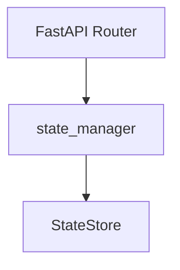
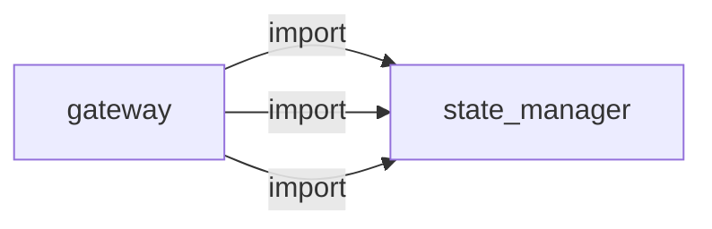
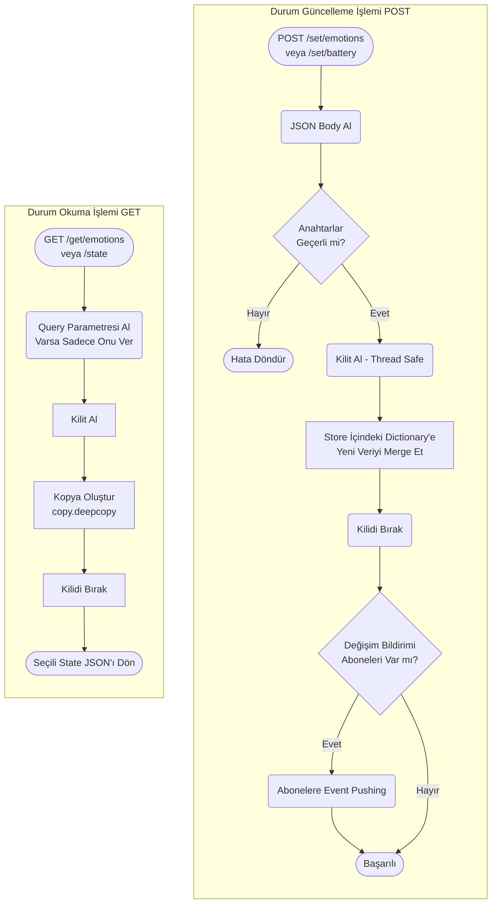
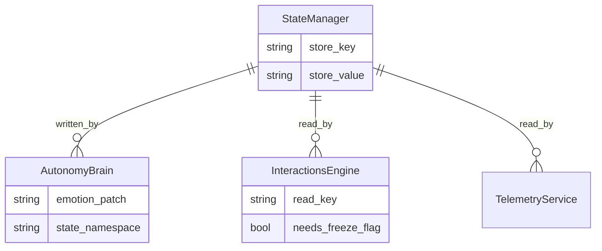

# state_manager

> **Thread-safe global durum deposu, pub/sub**

## Kimlik
| Alan | Değer |
| --- | --- |
| Ana sınıf | `—` |
| Giriş noktası | `—` |
| Orkestratör | `—` |
| Ana dosya | `—` |
| Katman | Çekirdek |
| Port | — |
| Arduino | Hayır |
| Sınıf sayısı | 1 |
| Endpoint sayısı | 5 |

## İsimlendirilmiş Bileşenler (Sınıflar)

#### `StateStore` — `modules/state_manager/services/store.py`
- **Görev:** —
- **Kalıtım:** —
- **Oluşturduğu bileşenler:** `Lock`
- **Metodlar:** `get()`, `update()`, `set_value()`, `set_operational()`, `set_emotions()`


## API — Endpoint → Handler → Servis

| HTTP | Path | Handler | Çağırdığı servis | Açıklama |
| --- | --- | --- | --- | --- |
| GET | `/healthz` | `healthz()` | — | — |
| GET | `/get` | `get_state()` | — | — |
| POST | `/set` | `set_state()` | — | — |
| POST | `/set/operational` | `set_operational()` | — | — |
| POST | `/set/emotions` | `set_emotions()` | — | — |

## Config Bölümleri
- `server`
- `defaults`
- `persistence`

## Dış İlişkiler (Bu modül → diğerleri)

| Hedef modül | Bağlantı tipi | Detay | Neden |
| --- | --- | --- | --- |


## Gelen İlişkiler (Diğerleri → bu modül)

| Kaynak modül | Bağlantı tipi | Detay | Neden |
| --- | --- | --- | --- |
| [[gateway]] | import | config_loader | `gateway` kod içinde `state_manager` modülünü import eder (`config_loader`) — Thread-safe global durum deposu, pub/sub. |
| [[gateway]] | import | services | `gateway` kod içinde `state_manager` modülünü import eder (`services`) — Thread-safe global durum deposu, pub/sub. |
| [[gateway]] | import | api | `gateway` kod içinde `state_manager` modülünü import eder (`api`) — Thread-safe global durum deposu, pub/sub. |

## İç Mimari (otomatik çıkarım)



## Modül Etkileşim Haritası



### Mimari diyagram 1


### Mimari diyagram 2


---

# Tam Kaynak Arşivi

### `modules/state_manager/README.md` (17 satır)

```markdown
# State Manager

Global durum ve duygular için hafif bir depolama ve API.

Bu modül robotun ortak state katmanıdır. Modlar, duygular, operasyonel bayraklar ve özel anahtarlar burada tutulur; böylece servisler aynı veriyi paylaşır ve restart sonrası state kaybolmaz.

## Ne İşe Yarar?
- State'i sqlite veya json backend ile kalıcı hale getirir.
- Temel alanları ve özel anahtarları tek bir API üzerinden günceller.
- Diğer modüllere ortak durum kaynağı sağlar.

## API
- GET `/state/healthz`
- GET `/state/get`
- POST `/state/set/operational` `{ value: string }`
- POST `/state/set/emotions` `{ values: string[] }`
- POST `/state/set/<key>` `{ value: any }`
```

### `modules/state_manager/__init__.py` (1 satır)

```python
"""Global state manager: operational and emotional state store with API."""
```

### `modules/state_manager/api/__init__.py` (1 satır)

```python
# api namespace
```

### `modules/state_manager/api/router.py` (39 satır)

```python
from __future__ import annotations
from typing import Dict, Any, List
from fastapi import APIRouter

from ..services.store import StateStore


def get_router(store: StateStore) -> APIRouter:
    r = APIRouter(prefix="/state", tags=["state"])

    @r.get("/healthz")
    def healthz():
        return {"ok": True}

    @r.get("/get")
    def get_state():
        return store.get()

    @r.post("/set")
    def set_state(body: Dict[str, Any]):
        if not isinstance(body, dict):
            return {"ok": False, "error": "body must be an object"}
        store.update(body)
        return {"ok": True}

    @r.post("/set/operational")
    def set_operational(body: Dict[str, Any]):
        store.set_operational(str(body.get("value", "idle")))
        return {"ok": True}

    @r.post("/set/emotions")
    def set_emotions(body: Dict[str, Any]):
        vals = body.get("values", [])
        if not isinstance(vals, list):
            vals = [str(vals)]
        store.set_emotions([str(v) for v in vals])
        return {"ok": True}

    return r
```

### `modules/state_manager/architecture_state_manager.md` (69 satır)

```markdown
# State Manager Modülü Mimarisi

State Manager modülü (`modules/state_manager`), SentryBOT platformundaki birbiriyle izole çalışan mikroservislerin (Vision, Speech, Autonomy, Arduino vs.) ortak durum (global state) verilerini, örneğin anlık pil seviyesi, genel duygu (emotion) durumu, kilit/donma bayraklarını sakladığı, dağıtık sistemlerdeki "Redis" benzeri in-memory Data Store yapısıdır.

## 🏗️ İş Akışı ve Karar Mekanizmaları (Flowchart)

Diğer tüm modüller bu servise GET/POST atarak durumu yazar veya sorgular.


## 🔄 İlişkisel Etkileşimler (Veri Akışı)


## ⚙️ Detaylı Karar Mantığı (if/else)

1. **Thread/Concurrency (Eşzamanlılık) Kilidi**
   - Gateway aynı anda 10 farklı module API hizmeti verirken (aynı anda hem Telemetry veriyi okuyor, hem de Autonomy veriyi düzeltiyor olabilir). Python dictionary'leri thread-safe olmadığından, her okuma ve yazma kararı önce `threading.Lock()` alır (`with self.store_lock:`). Aksi takdirde robot state bozulması "Race Condition" yaşar.
   - **`if`** Okuma ise, kilit anında tüm sözlüğün derin kopyası oluşturulup kilitten çıkılır (diğer thread'leri bekletmemek için).
2. **Varsayılan Değerler ve Kısmi Güncelleme (Partial Merge)**
   - API'ye (örneğin `/set/emotions`) sadece `{"happiness": 90}` gelirse;
   - Sistem **`if`** mevcut bir "emotions" anahtarı varsa öncelikle bunu alır `{"fear":10, "curiosity":50...}`, üzerine sadece `happiness`'i yazar, geri kalanı korur. (Komple ezme/overwrite yapmaz). Sonrasında kaydeder.
   - Tüm yazılım parçaları kararlarını almadan önce (Örn: Vision kişi selamlarken "Robotun modu uygun mu?") önce bu servisi sorar. Yorgunsa (`energy < 20`) selamlama iptal edilebilir.
```

### `modules/state_manager/config/config.yml` (9 satır)

```yaml
server:
  host: 0.0.0.0
  port: 8093
defaults:
  operational: idle
  emotions: []
persistence:
  type: sqlite
  path: modules/state_manager/data/state.sqlite3
```

### `modules/state_manager/config_loader.py` (14 satır)

```python
from __future__ import annotations
from pathlib import Path
from typing import Any, Dict
import yaml

_DEFAULT_CFG_PATH = Path(__file__).parent / "config" / "config.yml"


def load_config(path: str | None = None) -> Dict[str, Any]:
    p = Path(path) if path else _DEFAULT_CFG_PATH
    if not p.exists():
        p = _DEFAULT_CFG_PATH
    with open(p, "r", encoding="utf-8") as f:
        return yaml.safe_load(f) or {}
```

### `modules/state_manager/services/__init__.py` (1 satır)

```python
# namespace for state services
```

### `modules/state_manager/services/store.py` (138 satır)

```python
from __future__ import annotations
from pathlib import Path
from typing import Dict, Any, List
import json
import sqlite3
import threading


def _project_root() -> Path:
    return Path(__file__).resolve().parents[3]


class StateStore:
    def __init__(
        self,
        defaults: Dict[str, Any] | None = None,
        persistence: Dict[str, Any] | None = None,
    ) -> None:
        self._lock = threading.Lock()
        self._state: Dict[str, Any] = defaults.copy() if defaults else {"operational": "idle", "emotions": []}

        cfg = persistence or {}
        self._persist_type = str(cfg.get("type", "memory")).strip().lower()
        self._persist_path = self._resolve_path(str(cfg.get("path", "modules/state_manager/data/state.sqlite3")))
        self._sqlite_conn: sqlite3.Connection | None = None

        if self._persist_type == "sqlite":
            self._init_sqlite()
            self._load_from_sqlite()
        elif self._persist_type == "json":
            self._load_from_json()

    def __del__(self) -> None:
        if self._sqlite_conn is not None:
            try:
                self._sqlite_conn.close()
            except Exception:
                pass

    @staticmethod
    def _resolve_path(path: str) -> Path:
        p = Path(path)
        if p.is_absolute():
            return p
        return (_project_root() / p).resolve()

    def _init_sqlite(self) -> None:
        self._persist_path.parent.mkdir(parents=True, exist_ok=True)
        self._sqlite_conn = sqlite3.connect(str(self._persist_path), check_same_thread=False)
        cur = self._sqlite_conn.cursor()
        cur.execute(
            """
            CREATE TABLE IF NOT EXISTS state (
                key TEXT PRIMARY KEY,
                value_json TEXT NOT NULL
            )
            """
        )
        self._sqlite_conn.commit()

    def _load_from_sqlite(self) -> None:
        if self._sqlite_conn is None:
            return
        try:
            cur = self._sqlite_conn.cursor()
            cur.execute("SELECT key, value_json FROM state")
            rows = cur.fetchall()
            if not rows:
                self._persist_locked()
                return
            loaded: Dict[str, Any] = {}
            for key, value_json in rows:
                try:
                    loaded[str(key)] = json.loads(value_json)
                except Exception:
                    continue
            if loaded:
                self._state.update(loaded)
        except Exception:
            # Keep in-memory defaults if db is unreadable.
            pass

    def _load_from_json(self) -> None:
        if not self._persist_path.exists():
            self._persist_locked()
            return
        try:
            data = json.loads(self._persist_path.read_text(encoding="utf-8"))
            if isinstance(data, dict):
                self._state.update(data)
        except Exception:
            pass

    def _persist_locked(self) -> None:
        if self._persist_type == "memory":
            return

        if self._persist_type == "sqlite" and self._sqlite_conn is not None:
            cur = self._sqlite_conn.cursor()
            for key, value in self._state.items():
                cur.execute(
                    "INSERT OR REPLACE INTO state(key, value_json) VALUES (?, ?)",
                    (str(key), json.dumps(value, ensure_ascii=True)),
                )
            self._sqlite_conn.commit()
            return

        if self._persist_type == "json":
            self._persist_path.parent.mkdir(parents=True, exist_ok=True)
            self._persist_path.write_text(
                json.dumps(self._state, ensure_ascii=True, indent=2),
                encoding="utf-8",
            )

    def get(self) -> Dict[str, Any]:
        with self._lock:
            return {**self._state}

    def update(self, patch: Dict[str, Any]) -> None:
        with self._lock:
            for key, value in patch.items():
                self._state[str(key)] = value
            self._persist_locked()

    def set_value(self, key: str, value: Any) -> None:
        with self._lock:
            self._state[str(key)] = value
            self._persist_locked()

    def set_operational(self, val: str) -> None:
        with self._lock:
            self._state["operational"] = val
            self._persist_locked()

    def set_emotions(self, vals: List[str]) -> None:
        with self._lock:
            self._state["emotions"] = list(vals)
            self._persist_locked()
```

### `modules/state_manager/tests/test_smoke.py` (8 satır)

```python
from __future__ import annotations

from modules.state_manager.xStateService import create_app


def test_create_app():
    app = create_app()
    assert app is not None
```

### `modules/state_manager/xStateService.py` (24 satır)

```python
from __future__ import annotations
from fastapi import FastAPI

from .config_loader import load_config
from .services.store import StateStore
from .api.router import get_router


def create_app(config_path: str | None = None) -> FastAPI:
    cfg = load_config(config_path)
    store = StateStore(
        defaults=cfg.get("defaults", {}),
        persistence=cfg.get("persistence", {}),
    )
    app = FastAPI(title="State Manager")
    app.state.store = store  # type: ignore[attr-defined]
    app.include_router(get_router(store))
    return app


if __name__ == "__main__":
    import uvicorn
    cfg = load_config(None)
    uvicorn.run(create_app(), host=str(cfg["server"]["host"]), port=int(cfg["server"]["port"]))
```
