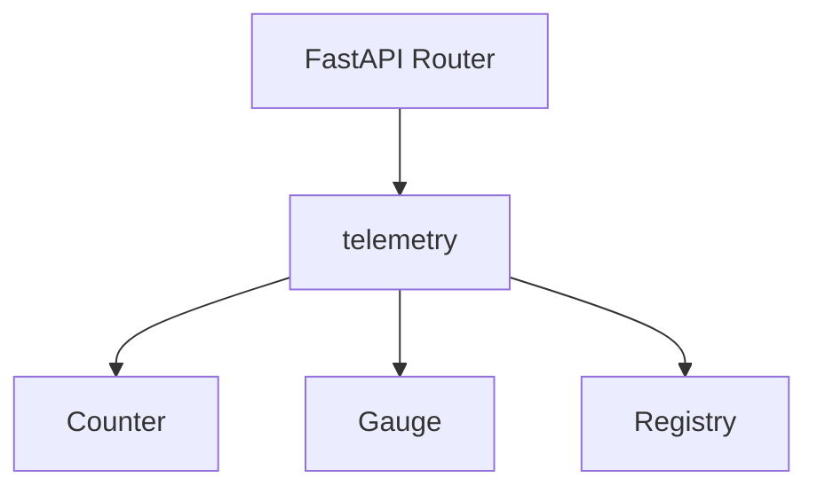
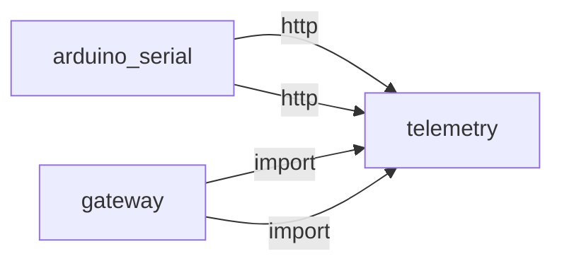
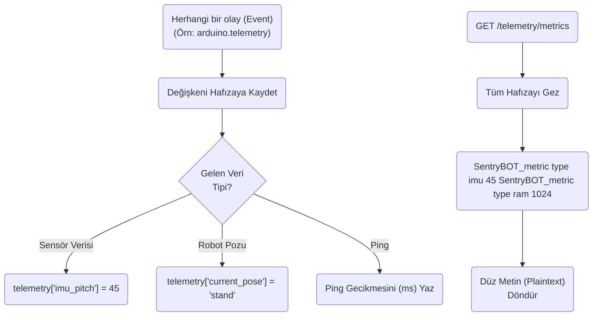
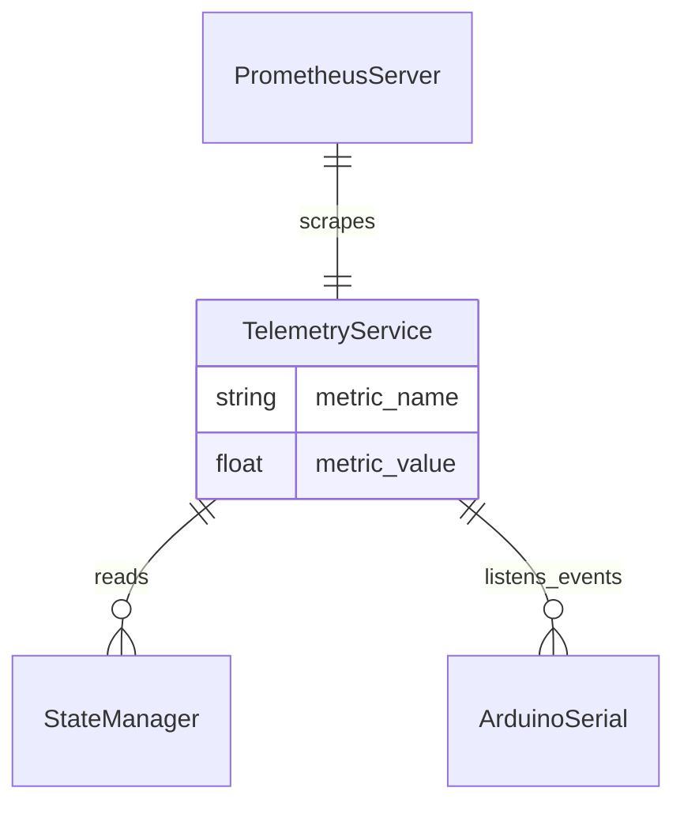

# telemetry

> **Prometheus formatında metrik toplama**

## Kimlik
| Alan | Değer |
| --- | --- |
| Ana sınıf | `—` |
| Giriş noktası | `create_app()` |
| Orkestratör | `—` |
| Ana dosya | `modules/telemetry/xTelemetryService.py` |
| Katman | Arka Plan |
| Port | — |
| Arduino | Hayır |
| Sınıf sayısı | 3 |
| Endpoint sayısı | 3 |

## İsimlendirilmiş Bileşenler (Sınıflar)

#### `Counter` — `modules/telemetry/services/metrics.py`
- **Görev:** —
- **Kalıtım:** —
- **Oluşturduğu bileşenler:** `Lock`
- **Metodlar:** `inc()`, `value()`

#### `Gauge` — `modules/telemetry/services/metrics.py`
- **Görev:** —
- **Kalıtım:** Counter
- **Oluşturduğu bileşenler:** —
- **Metodlar:** `set()`

#### `Registry` — `modules/telemetry/services/metrics.py`
- **Görev:** —
- **Kalıtım:** —
- **Oluşturduğu bileşenler:** —
- **Metodlar:** `counter()`, `gauge()`, `render_prometheus()`


## API — Endpoint → Handler → Servis

| HTTP | Path | Handler | Çağırdığı servis | Açıklama |
| --- | --- | --- | --- | --- |
| GET | `/healthz` | `healthz()` | — | — |
| GET | `/metrics` | `metrics()` | — | — |
| POST | `/events` | `events()` | — | — |

## Config Bölümleri
- `server`
- `exporter`

## Dış İlişkiler (Bu modül → diğerleri)

| Hedef modül | Bağlantı tipi | Detay | Neden |
| --- | --- | --- | --- |


## Gelen İlişkiler (Diğerleri → bu modül)

| Kaynak modül | Bağlantı tipi | Detay | Neden |
| --- | --- | --- | --- |
| [[arduino_serial]] | http | exposes/routes to `/telemetry/start` | `arduino_serial` `telemetry` modülünün HTTP API'sine istek atar (exposes/routes to `/telemetry/start`). |
| [[arduino_serial]] | http | exposes/routes to `/telemetry/stop` | `arduino_serial` `telemetry` modülünün HTTP API'sine istek atar (exposes/routes to `/telemetry/stop`). |
| [[gateway]] | import | api | `gateway` kod içinde `telemetry` modülünü import eder (`api`) — Prometheus formatında metrik toplama. |
| [[gateway]] | import | config_loader | `gateway` kod içinde `telemetry` modülünü import eder (`config_loader`) — Prometheus formatında metrik toplama. |

## İç Mimari (otomatik çıkarım)



## Modül Etkileşim Haritası



### Mimari diyagram 1


### Mimari diyagram 2


---

# Tam Kaynak Arşivi

### `modules/telemetry/README.md` (8 satır)

```markdown
# Telemetry Module

Hafif metrik ve olay yayın modülü. `/telemetry/metrics` Prometheus uyumlu metin çıktısı sağlar.

## API
- GET `/telemetry/healthz`
- GET `/telemetry/metrics`
- POST `/telemetry/events` `{ type: string, ... }`
```

### `modules/telemetry/__init__.py` (1 satır)

```python
"""Telemetry module: basic metrics and events (lightweight)."""
```

### `modules/telemetry/api/__init__.py` (1 satır)

```python
# api namespace
```

### `modules/telemetry/api/router.py` (27 satır)

```python
from __future__ import annotations
from typing import Dict, Any
from fastapi import APIRouter, Response

from ..services.metrics import REGISTRY


def get_router(cfg: Dict[str, Any]) -> APIRouter:
    r = APIRouter(prefix="/telemetry", tags=["telemetry"])

    @r.get("/healthz")
    def healthz():
        return {"ok": True}

    @r.get("/metrics")
    def metrics() -> Response:
        return Response(REGISTRY.render_prometheus(), media_type="text/plain; version=0.0.4")

    @r.post("/events")
    def events(ev: Dict[str, Any]):
        # minimal counter for event types
        t = ev.get("type", "unknown")
        REGISTRY.counter(f"events_total").inc(1)
        REGISTRY.counter(f"event_{t}_total").inc(1)
        return {"ok": True}

    return r
```

### `modules/telemetry/architecture_telemetry.md` (48 satır)

```markdown
# Telemetry Modülü Mimarisi

Telemetry modülü (`modules/telemetry`), robotun çalışma zamanı sensör verilerini (IMU pitch/roll, ultrasonik mesafe, RAM, CPU durumu) Promethus tarzı grafik araçları veya canlı grafiker ekranlar için toplayan (aggregator) ve dışarı yayınlayan motor modülüdür.

## 🏗️ İş Akışı ve Karar Mekanizmaları (Flowchart)


## 🔄 İlişkisel Etkileşimler (Veri Akışı)


## ⚙️ Detaylı Karar Mantığı (if/else)

1. **Sürekli Dinleme (Event Listener)**
   - Telemetry saniyede bir Arduino'ya gidip "IMU verin kaç?" diye sormaz (Bu çok fazla trafik yaratır).
   - Onun yerine Arduino tarafı (eğer aktifse) seri porttan `<TLM> ...` formatında JSON fırlatır. Gateway veya Interactions bunu yakalayıp global Event atar (`arduino.telemetry.tick`).
   - Bu modül arka planda bu event gelince `telemetry_dict` değişkenini günceller.
2. **Prometheus Tip Çeviricisi**
   - Prometheus metrikleri sadece "Sayı" (Float/Int) kabul eder.
   - **`if`** hafızadaki değer metin ise (`current_pose = 'sit'`), onu metrik olarak çeviremeyeceği için Prometheus'a eklemez.
```

### `modules/telemetry/config/config.yml` (5 satır)

```yaml
server:
  host: 0.0.0.0
  port: 8097
exporter:
  type: builtin  # builtin|none
```

### `modules/telemetry/config_loader.py` (14 satır)

```python
from __future__ import annotations
from pathlib import Path
from typing import Any, Dict
import yaml

_DEFAULT_CFG_PATH = Path(__file__).parent / "config" / "config.yml"


def load_config(path: str | None = None) -> Dict[str, Any]:
    p = Path(path) if path else _DEFAULT_CFG_PATH
    if not p.exists():
        p = _DEFAULT_CFG_PATH
    with open(p, "r", encoding="utf-8") as f:
        return yaml.safe_load(f) or {}
```

### `modules/telemetry/services/__init__.py` (1 satır)

```python
# namespace for telemetry services
```

### `modules/telemetry/services/metrics.py` (59 satır)

```python
from __future__ import annotations
from typing import Dict
import threading


class Counter:
    def __init__(self, name: str, doc: str = "") -> None:
        self.name = name
        self.doc = doc
        self._value = 0.0
        self._lock = threading.Lock()

    def inc(self, n: float = 1.0) -> None:
        with self._lock:
            self._value += n

    @property
    def value(self) -> float:
        with self._lock:
            return self._value


class Gauge(Counter):
    def set(self, v: float) -> None:
        with self._lock:
            self._value = v


class Registry:
    def __init__(self) -> None:
        self.counters: Dict[str, Counter] = {}
        self.gauges: Dict[str, Gauge] = {}

    def counter(self, name: str, doc: str = "") -> Counter:
        if name not in self.counters:
            self.counters[name] = Counter(name, doc)
        return self.counters[name]

    def gauge(self, name: str, doc: str = "") -> Gauge:
        if name not in self.gauges:
            self.gauges[name] = Gauge(name, doc)
        return self.gauges[name]

    def render_prometheus(self) -> str:
        lines: list[str] = []
        for g in self.gauges.values():
            if g.doc:
                lines.append(f"# HELP {g.name} {g.doc}")
            lines.append(f"# TYPE {g.name} gauge")
            lines.append(f"{g.name} {g.value}")
        for c in self.counters.values():
            if c.doc:
                lines.append(f"# HELP {c.name} {c.doc}")
            lines.append(f"# TYPE {c.name} counter")
            lines.append(f"{c.name} {c.value}")
        return "\n".join(lines) + "\n"


REGISTRY = Registry()
```

### `modules/telemetry/tests/test_smoke.py` (8 satır)

```python
from __future__ import annotations

from modules.telemetry.xTelemetryService import create_app


def test_create_app():
    app = create_app()
    assert app is not None
```

### `modules/telemetry/xTelemetryService.py` (18 satır)

```python
from __future__ import annotations
from fastapi import FastAPI

from .config_loader import load_config
from .api.router import get_router


def create_app(config_path: str | None = None) -> FastAPI:
    cfg = load_config(config_path)
    app = FastAPI(title="Telemetry Service")
    app.include_router(get_router(cfg))
    return app


if __name__ == "__main__":
    import uvicorn
    cfg = load_config(None)
    uvicorn.run(create_app(), host=str(cfg["server"]["host"]), port=int(cfg["server"]["port"]))
```
