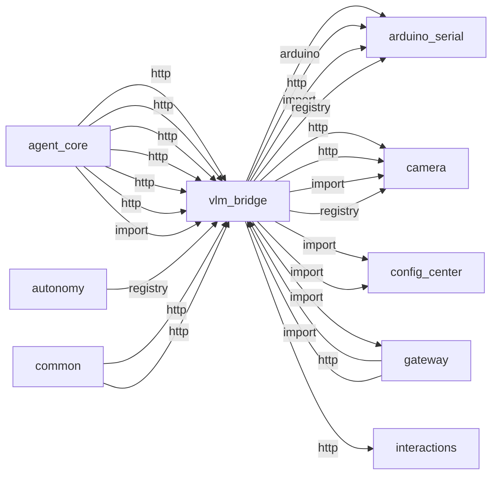
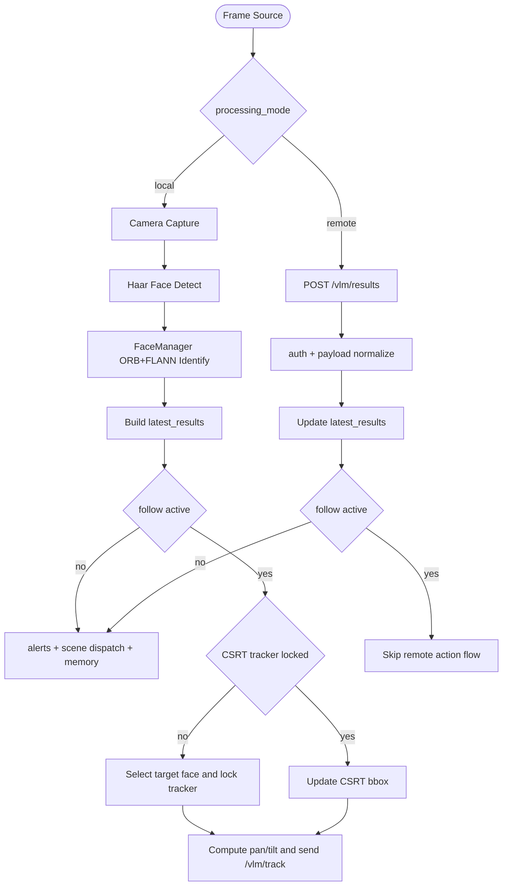

# vlm_bridge

> **OpenCV yüz algılama, ORB/FLANN eşleme, CSRT takip, remote VLM**

## Kimlik
| Alan | Değer |
| --- | --- |
| Ana sınıf | `VisionProcessor` |
| Giriş noktası | `create_app()` |
| Orkestratör | `VisionProcessor` |
| Ana dosya | `modules/vlm_bridge/xVlmBridgeService.py` |
| Katman | Algı |
| Port | 8101 |
| Arduino | Evet (pan/tilt) |
| Sınıf sayısı | 33 |
| Endpoint sayısı | 32 |

## İsimlendirilmiş Bileşenler (Sınıflar)

#### `VisionActionDispatcher` — `modules/vlm_bridge/services/action_dispatcher.py`
- **Görev:** Parses semantic descriptions and forwards action tags to Autonomy.
- **Kalıtım:** —
- **Oluşturduğu bileşenler:** —
- **Metodlar:** `emit_scene()`

#### `FaceManager` — `modules/vlm_bridge/services/face_manager.py`
- **Görev:** OpenCV ORB + FLANN tabanli hafif yuz tanima yoneticisi.
- **Kalıtım:** —
- **Oluşturduğu bileşenler:** `ORB_create`, `FlannBasedMatcher`
- **Metodlar:** `load_faces()`, `save_faces()`, `register_face()`, `identify_face_with_score()`, `identify_face()`

#### `GoogleVLMClient` — `modules/vlm_bridge/services/google_vlm_client.py`
- **Görev:** Gemini multimodal client with the same surface as :class:`OllamaVLMClient`.
- **Kalıtım:** —
- **Oluşturduğu bileşenler:** `GoogleAIStudioClient`, `Lock`
- **Metodlar:** `analyze_frame()`, `ask_about_scene()`, `is_available()`, `get_stats()`

#### `HeadCommand` — `modules/vlm_bridge/services/head_control_arbiter.py`
- **Görev:** —
- **Kalıtım:** —
- **Oluşturduğu bileşenler:** —
- **Metodlar:** `expired()`

#### `HeadControlArbiter` — `modules/vlm_bridge/services/head_control_arbiter.py`
- **Görev:** Thread-safe head movement arbiter with priority and clamping.
- **Kalıtım:** —
- **Oluşturduğu bileşenler:** `Lock`
- **Metodlar:** `set_move_callback()`, `request_move()`, `move()`, `lock_source()`, `unlock()`, `current_position()`, `get_status()`

#### `OllamaVLMClient` — `modules/vlm_bridge/services/ollama_vlm_client.py`
- **Görev:** HTTP client for remote Ollama VLM inference.
- **Kalıtım:** —
- **Oluşturduğu bileşenler:** `Lock`
- **Metodlar:** `analyze_frame()`, `ask_about_scene()`, `is_available()`, `get_stats()`

#### `PeopleMemory` — `modules/vlm_bridge/services/people_memory.py`
- **Görev:** Per-person chat history and last-summary memory.
- **Kalıtım:** —
- **Oluşturduğu bileşenler:** —
- **Metodlar:** `append_chat()`, `set_summary()`, `get_person()`, `list_people()`

#### `PersonIdentityManager` — `modules/vlm_bridge/services/person_identity.py`
- **Görev:** Manages person recognition, relationship levels, and persistence.
- **Kalıtım:** —
- **Oluşturduğu bileşenler:** `Lock`
- **Metodlar:** `recognize()`, `remember_person()`, `update_relationship()`, `append_conversation_note()`, `set_owner()`, `get_person()`, `get_by_id()`, `list_people()`, `get_owner()`, `is_owner()`, `add_note()`, `save()`

#### `PersonMemoryRecord` — `modules/vlm_bridge/services/person_identity.py`
- **Görev:** —
- **Kalıtım:** —
- **Oluşturduğu bileşenler:** —
- **Metodlar:** `to_dict()`, `from_dict()`

#### `VisionProcessor` — `modules/vlm_bridge/services/processor.py`
- **Görev:** YOLO'suz VLM Bridge isleyici.
- **Kalıtım:** —
- **Oluşturduğu bileşenler:** `Event`, `Lock`, `SemanticDescriber`, `PeopleMemory`, `VisionActionDispatcher`, `Lock`, `PersonIdentityManager`, `VisualContextCache`, `FaceManager`
- **Metodlar:** `get_modes()`, `get_mode_categories()`, `set_mode_categories()`, `list_profiles()`, `set_modes()`, `apply_mode_profile()`, `set_processing_mode()`, `get_realtime_profile_status()`, `apply_realtime_profile()`, `set_track_callback()`, `start_follow()`, `stop_follow()`

#### `SemanticDescriber` — `modules/vlm_bridge/services/semantic_describer.py`
- **Görev:** —
- **Kalıtım:** —
- **Oluşturduğu bileşenler:** —
- **Metodlar:** `build_prompt()`, `llm_summarize()`, `fallback_summary()`, `personalize()`, `describe()`

#### `xArduinoSerialService` — `modules/vlm_bridge/services/stub.py`
- **Görev:** —
- **Kalıtım:** —
- **Oluşturduğu bileşenler:** —
- **Metodlar:** `start()`, `request()`

#### `VisionEventBus` — `modules/vlm_bridge/services/vision_event_bus.py`
- **Görev:** Thread-safe publish/subscribe bus for vision events.
- **Kalıtım:** —
- **Oluşturduğu bileşenler:** `Lock`
- **Metodlar:** `subscribe()`, `subscribe_all()`, `unsubscribe()`, `publish()`, `event_count()`, `get_stats()`

#### `VisionSampler` — `modules/vlm_bridge/services/vision_sampler.py`
- **Görev:** Decides whether a VLM call should be triggered right now.
- **Kalıtım:** —
- **Oluşturduğu bileşenler:** —
- **Metodlar:** `should_call_vlm()`, `request_user_question()`, `record_call()`, `time_since_last_call()`, `get_stats()`

#### `PersonContext` — `modules/vlm_bridge/services/visual_context.py`
- **Görev:** Represents a single person detected in the current frame.
- **Kalıtım:** —
- **Oluşturduğu bileşenler:** —
- **Metodlar:** `to_dict()`

#### `VisionFrameContext` — `modules/vlm_bridge/services/visual_context.py`
- **Görev:** Complete visual understanding of a single moment.
- **Kalıtım:** —
- **Oluşturduğu bileşenler:** —
- **Metodlar:** `to_dict()`, `has_people()`, `has_hazards()`, `has_owner()`, `get_owner()`, `get_highest_priority_person()`

#### `VisualContextCache` — `modules/vlm_bridge/services/visual_context.py`
- **Görev:** Thread-safe cache for the latest visual context.
- **Kalıtım:** —
- **Oluşturduğu bileşenler:** `Lock`
- **Metodlar:** `update()`, `get_latest()`, `get_latest_dict()`, `get_history()`, `age_s()`, `previous_scene_id()`, `clear()`


## API — Endpoint → Handler → Servis

| HTTP | Path | Handler | Çağırdığı servis | Açıklama |
| --- | --- | --- | --- | --- |
| POST | `/track` | `track()` | — | — |
| POST | `/follow/start` | `follow_start()` | — | — |
| POST | `/follow/stop` | `follow_stop()` | — | — |
| GET | `/follow/status` | `follow_status()` | — | — |
| GET | `/mode` | `get_mode()` | — | — |
| GET | `/profile` | `get_profile()` | — | — |
| POST | `/profile/switch` | `switch_profile()` | — | — |
| GET | `/modes/categories` | `get_mode_categories()` | — | — |
| POST | `/modes/categories` | `patch_mode_categories()` | — | — |
| POST | `/mode` | `set_mode()` | — | — |
| POST | `/ocr` | `ocr_endpoint()` | — | Trigger a one-off analysis of the current view (local mode). |
| POST | `/analyze` | `analyze_snapshot()` | — | Trigger a one-off analysis of the current view (local mode). |
| POST | `/blind/start` | `start_blind_mode()` | — | Enable continuous blind mode description. |
| POST | `/blind/stop` | `stop_blind_mode()` | — | Disable blind mode. |
| GET | `/video_feed` | `video_feed()` | — | Stream video with annotations (local mode only). |
| GET | `/results/latest` | `latest_results()` | — | External processor posts detection results. |
| POST | `/results` | `ingest_results()` | — | External processor posts detection results. |
| POST | `/faces/register` | `register_face()` | — | Register the face currently visible in the camera. |
| GET | `/faces` | `list_faces()` | — | List known faces. |
| POST | `/memory/chat` | `memory_chat()` | — | Append a chat line to a person's memory (for Ollama chat integration). |
| GET | `/memory/person` | `memory_get()` | — | Return the latest cached VisionFrameContext if available. |
| GET | `/memory/people` | `memory_list()` | — | Return the latest cached VisionFrameContext if available. |
| GET | `/context/latest` | `get_context_latest()` | — | Return the latest cached VisionFrameContext if available. |
| POST | `/context/refresh` | `refresh_context()` | — | Trigger a fresh VLM analysis of the current camera frame. |
| POST | `/ask` | `ask_vlm()` | — | Ask the VLM a question about the current camera view. |
| POST | `/person/remember` | `remember_person()` | — | Save or update a person in the identity memory. |
| POST | `/person/relationship` | `update_person_relationship()` | — | Update a person's relationship or recognition level. |
| GET | `/person/{name}` | `get_person()` | — | Retrieve a person's memory record. |
| GET | `/people` | `list_people()` | — | List all people in the identity memory. |
| POST | `/focus/person` | `focus_person()` | — | Request the robot to look at a specific person. |
| POST | `/follow/owner/start` | `owner_follow_start()` | — | Enable owner-specific follow mode (higher priority). |
| GET | `/head/status` | `head_status()` | — | Return the current head servo position. |

## Config Bölümleri
- `server`
- `vision`
- `visual_context`
- `vision_llm`
- `person_identity`
- `remote`
- `remote_multimodal`
- `robot`
- `ollama`
- `llm`
- `speak`
- `translation`
- `actions`

## Dış İlişkiler (Bu modül → diğerleri)

| Hedef modül | Bağlantı tipi | Detay | Neden |
| --- | --- | --- | --- |
| [[arduino_serial]] | arduino | Arduino serial / contract kullanımı | Pan/tilt servo takibi için Arduino komutları gönderir. |
| [[arduino_serial]] | http | calls path `/arduino/request` | Pan/tilt servo takibi için Arduino komutları gönderir. |
| [[arduino_serial]] | import | contract | Pan/tilt servo takibi için Arduino komutları gönderir. |
| [[arduino_serial]] | registry | registry dependency: camera, arduino_serial, ollama | Pan/tilt servo takibi için Arduino komutları gönderir. |
| [[camera]] | http | calls path `/camera/video` | MJPEG/frame kaynağı olarak kamera stream'ini kullanır. |
| [[camera]] | http | calls path `/camera/healthz` | MJPEG/frame kaynağı olarak kamera stream'ini kullanır. |
| [[camera]] | import | services | MJPEG/frame kaynağı olarak kamera stream'ini kullanır. |
| [[camera]] | registry | registry dependency: camera, arduino_serial, ollama | MJPEG/frame kaynağı olarak kamera stream'ini kullanır. |
| [[config_center]] | import | agent_yaml_loader | `vlm_bridge` → `config_center`: config/agent.yaml dosyasından ayar okur. |
| [[config_center]] | import | gemini_model | `vlm_bridge` içinde `gemini_model` import edilir; `config_center` modülünün yeteneğini kullanır (Merkezi config okuma/yazma, hot-reload). |
| [[gateway]] | import | url | `vlm_bridge` içinde `url` import edilir; `gateway` modülünün yeteneğini kullanır (FastAPI API bootstrapper, tüm modülleri mount eder). |
| [[interactions]] | http | calls path `/interactions/event` | `vlm_bridge` HTTP ile `interactions` modülüne erişir: Sistem olayı veya LED efekti tetikler. |
| [[logwrapper]] | import | init_logging | `vlm_bridge` → `logwrapper`: Merkezi WebSocket log yayınına bağlanır. |
| [[ollama]] | http | calls path `/ollama/chat` | Remote VLM veya scene caption için LLM'e danışır. |
| [[ollama]] | import | services | Remote VLM veya scene caption için LLM'e danışır. |
| [[ollama]] | import | config_loader | Remote VLM veya scene caption için LLM'e danışır. |
| [[ollama]] | registry | registry dependency: camera, arduino_serial, ollama | Remote VLM veya scene caption için LLM'e danışır. |
| [[social_db]] | import | get_default | Yüz tanıma sonuçlarını kişi kaydına yazar. |
| [[social_db]] | import | SocialDB | Yüz tanıma sonuçlarını kişi kaydına yazar. |

## Gelen İlişkiler (Diğerleri → bu modül)

| Kaynak modül | Bağlantı tipi | Detay | Neden |
| --- | --- | --- | --- |
| [[agent_core]] | http | calls path `/vlm/track` | Görsel araçlar ve vision context için VLM köprüsüne bağlanır. |
| [[agent_core]] | http | calls path `/vlm/ask` | Görsel araçlar ve vision context için VLM köprüsüne bağlanır. |
| [[agent_core]] | http | calls path `/vlm/follow/owner/start` | Görsel araçlar ve vision context için VLM köprüsüne bağlanır. |
| [[agent_core]] | http | calls path `/vlm/follow/stop` | Görsel araçlar ve vision context için VLM köprüsüne bağlanır. |
| [[agent_core]] | http | calls path `/vlm/focus/person` | Görsel araçlar ve vision context için VLM köprüsüne bağlanır. |
| [[agent_core]] | http | calls path `/vlm/person/remember` | Görsel araçlar ve vision context için VLM köprüsüne bağlanır. |
| [[agent_core]] | import | services | Görsel araçlar ve vision context için VLM köprüsüne bağlanır. |
| [[autonomy]] | registry | registry dependency: ollama, speak, vlm_bridge, arduino_serial | Görsel bağlam ve yüz tanıma verisi alır. |
| [[common]] | http | calls path `/vlm/context/latest` | `common` `vlm_bridge` modülünün HTTP API'sine istek atar (calls path `/vlm/context/latest`). |
| [[common]] | http | calls path `/vlm/results/latest` | `common` `vlm_bridge` modülünün HTTP API'sine istek atar (calls path `/vlm/results/latest`). |
| [[gateway]] | http | calls path `/vlm` | `gateway` `vlm_bridge` modülünün HTTP API'sine istek atar (calls path `/vlm`). |
| [[gateway]] | import | config_loader | `gateway` kod içinde `vlm_bridge` modülünü import eder (`config_loader`) — OpenCV yüz algılama, ORB/FLANN eşleme, CSRT takip, remote VLM. |
| [[gateway]] | import | services | `gateway` kod içinde `vlm_bridge` modülünü import eder (`services`) — OpenCV yüz algılama, ORB/FLANN eşleme, CSRT takip, remote VLM. |
| [[gateway]] | import | api | `gateway` kod içinde `vlm_bridge` modülünü import eder (`api`) — OpenCV yüz algılama, ORB/FLANN eşleme, CSRT takip, remote VLM. |
| [[logwrapper]] | http | calls path `/vlm/results/latest` | `logwrapper` `vlm_bridge` modülünün HTTP API'sine istek atar (calls path `/vlm/results/latest`). |

## İç Mimari (otomatik çıkarım)

```mermaid
flowchart TB
    API[FastAPI Router] --> VisionProcessor[VisionProcessor]
    VisionProcessor --> VisionActionDispatcher[VisionActionDispatcher]
    VisionProcessor --> FaceManager[FaceManager]
    VisionProcessor --> GoogleVLMClient[GoogleVLMClient]
    VisionProcessor --> HeadCommand[HeadCommand]
    VisionProcessor --> HeadControlArbiter[HeadControlArbiter]
    VisionProcessor --> OllamaVLMClient[OllamaVLMClient]
    VisionProcessor --> PeopleMemory[PeopleMemory]
    VisionProcessor --> PersonIdentityManager[PersonIdentityManager]
    VisionProcessor --> PersonMemoryRecord[PersonMemoryRecord]
    VisionProcessor --> VisionProcessor[VisionProcessor]
    VisionProcessor -->|composes| Event[Event]
    VisionProcessor -->|composes| Lock[Lock]
    VisionProcessor -->|composes| SemanticDescriber[SemanticDescriber]
    VisionProcessor -->|composes| PeopleMemory[PeopleMemory]
    VisionProcessor -->|composes| VisionActionDispatcher[VisionActionDispatcher]
    VisionProcessor -->|composes| Lock[Lock]
    VisionProcessor -->|composes| PersonIdentityManager[PersonIdentityManager]
    VisionProcessor -->|composes| VisualContextCache[VisualContextCache]
```



## Modül Etkileşim Haritası



### Mimari diyagram 1


---

# Tam Kaynak Arşivi

### `modules/vlm_bridge/README.md` (79 satır)

```markdown
# VLM Bridge Module

Kamera akışını işleyen yerel (Pi5) veya uzak (dizüstü / sunucu) görüntü işleme pipeline sonucunu robota ve diğer modüllere köprüler.

Bu modül artık yalnızca görüntü köprülemekle kalmaz; farklı görsel iş yüklerini ayrı modlar halinde yönetebilir. Böylece pahalı işlemler ihtiyaca göre kapatılabilir.

## Modlar
- **local**: Pi5 üzerinde OpenCV yüz algılama + ORB/FLANN yüz tanıma + CSRT takip çalışır.
- **remote**: Harici cihaz video akışını işler, sonuçları köprüye POST eder. Pi üzerinde ağır model yüklenmez.

config/agent.yaml içindeki vlm_bridge.vision.processing_mode: local|remote ile seçilir.

## Endpoints
- `POST /vlm/track { head_tilt, head_pan, drive? }` : Arduino "track" komutu.
- `POST /vlm/follow/start?person=<name?>` : Yüz takip modunu başlatır (CSRT lock).
- `POST /vlm/follow/stop` : Yüz takip modunu durdurur.
- `GET /vlm/follow/status` : Takip durumu, hedef kişi ve aktif bbox.
- `POST /vlm/analyze` : Tek kare analiz (yalnızca local).
- `GET  /vlm/video_feed` : Annotated MJPEG akışı (yalnızca local).
- `GET  /vlm/results/latest` : Son işlenen karedeki nesne/kişi listesi (autonomy vb. modüller bu uçtan beslenebilir).
- `POST /vlm/results` : Uzak işlemciden obje/kisi tespiti sonuçları (remote veya her iki mod). Header: `X-Auth-Token`.
- `POST /vlm/blind/start` / `stop` : Görme engelli modu açıklama.
- `POST /vlm/faces/register` / `GET /vlm/faces` : Yüz kayıt & liste (local).
- `POST /vlm/memory/chat` : `{ person, text, role? }` kişi hafızasına sohbet satırı ekler.
- `GET  /vlm/memory/person?person=Alice` : kişinin hafızası (son özet + sohbetler).
- `GET  /vlm/memory/people` : hafızada kayıtlı isimler.
- `POST /vlm/mode` : Çalışma modları arasında geçiş (objects/people/ocr/depth...)

## Mod Yönetimi Ne Yapar?
- `objects`, `people`, `faces`, `depth`, `ocr`, `hazards`, `semantic_scene` gibi alt yetenekleri ayrı ayrı açıp kapatır.
- Görme engelli modu gibi davranışlar yalnızca ilgili mod aktifse çalışır.
- Ağır iş yüklerini kapatarak CPU ve gecikme baskısını azaltır.

### /vlm/results Payload Örneği
```json
{
  "frame_id": 123,
  "timestamp": 1733123123.12,
  "objects": [
    {"label": "person", "confidence": 0.91, "bbox": [10,20,180,400], "distance_m": 1.6, "name": "Alice"},
    {"label": "chair", "confidence": 0.78, "bbox": [220,100,320,360]}
  ]
}
```

## Güvenlik
- `remote.auth_token` yapılandırıldıysa `X-Auth-Token` eşleşmelidir.
- `remote.accept_results: false` ile dış sonuç kabulü kapatılabilir.

## Blind Mode (Assistive)
Aktifken semantik sahne özeti (Ollama varsa LLM tabanlı) ve kişilere özel selam gönderir. Uzak modda gelen sonuçlar üzerinden de çalışır.

## VLM LLM Kaynağı
- VLM Bridge config kaynağı config/agent.yaml içindeki vlm_bridge bölümüdür.
- endpoint, agent.ollama_base_url değerinden türetilir ve /api/chat olarak normalize edilir.
- Tek model politikası zorunludur: qwen3.5:9b.
- Provider yalnızca ollama olabilir.
- Geriye dönük olarak `ollama.endpoint` değeri `.../api/generate` ise eski doğrudan generate akışı da desteklenir.

## LLM Action Dispatch
- `config.actions.endpoint`: Genelde `http://<autonomy>/autonomy/apply_actions`. Boşsa özellik kapanır.
- `config.actions.default_apply`: `true` iken her tespit turu için semantik özet oluşturulur, `[cmd:*]` ve `[[lights …]]` etiketleri otomatik olarak Autonomy’ye iletilir.
- `config.actions.timeout`: HTTP post için saniye cinsinden bekleme süresi (varsayılan 1.5).

`VisionActionDispatcher` sınıfı semantik ifadeleri `modules.ollama.services.tags.extract_llm_tags` ile parse eder; örneğin “`Selam [cmd:head_nod] [[lights palette=sunset_gold intensity=0.7]]`” metni servo nod ve LED paletine dönüştürülür. Autonomy bu webhook’u aldığında `ResponseTagMixin` fiziksel aksiyonları uygular, konuşma gerekirse `speak` sahasıyla tetiklenir.

## Çalıştırma
- Bağımsız: `python -m modules.vlm_bridge.xVlmBridgeService`
- Gateway ile: `python -m modules.gateway.xGatewayService` ve `include.vlm_bridge: true`

## Gelecek Genişletmeler
- Derinlik / mesafe için stereo / mono depth entegrasyonu (remote).
- Metin okuma (OCR) sonuç formatı genişletmesi: `objects[].text` alanı.
- Tehlike uyarıları için tür eşik konfigürasyonu.
- Duygusal durum geri bildirimi: `interactions` modülü ile LED / ses.

### Liveliness Starter (opsiyonel)
`modules/vlm_bridge/tools/liveliness_starter.py` basit heartbeat ve idle lookaround döngüsü sağlar.
Gateway açıkken çalıştırılabilir ve `interactions` ile `vlm/track` uçlarını kullanır.
```

### `modules/vlm_bridge/__init__.py` (9 satır)

```python
from __future__ import annotations

def create_app(*args, **kwargs):
	# Lazy import to avoid package import-time failures during gateway bootstrap.
	from .xVlmBridgeService import create_app as _create_app  # type: ignore
	return _create_app(*args, **kwargs)


__all__ = ["create_app"]
```

### `modules/vlm_bridge/api/router.py` (552 satır)

```python
from __future__ import annotations
from fastapi import APIRouter, BackgroundTasks, HTTPException, Request
from typing import Optional, Any
import logging
import requests
from modules.arduino_serial.contract import build_track_cmd

_GATEWAY_BASE = "http://127.0.0.1:8080"


def _gw(path: str) -> str:
    return f"{_GATEWAY_BASE.rstrip('/')}/{path.lstrip('/')}"


def _notify_autonomy():
    try:
        requests.post(_gw("/autonomy/interaction"), timeout=0.1)
    except Exception:
        pass


def _request_arduino(payload: dict, timeout: float = 1.0) -> dict:
    resp = requests.post(
        _gw("/arduino/request"),
        json=payload,
        params={"timeout": float(timeout)},
        timeout=max(0.2, float(timeout) + 0.2),
    )
    if resp.status_code != 200:
        raise RuntimeError(f"gateway arduino request failed: HTTP {resp.status_code}")
    data = resp.json()
    if not isinstance(data, dict):
        raise RuntimeError("gateway arduino response is not JSON object")
    return data


def get_router(
    processor: Any,
    ardu: Optional[Any] = None,
    gateway_base_url: str = "",
) -> APIRouter:
    global _GATEWAY_BASE
    if gateway_base_url:
        _GATEWAY_BASE = str(gateway_base_url).rstrip("/")
    r = APIRouter(
        prefix="/vlm",
        tags=["vlm"],
        responses={404: {"description": "Not found"}},
    )

    @r.post("/track", tags=["control"], summary="Pan/Tilt tracking control")
    def track(head_tilt: float, head_pan: float, drive: int | None = None, background_tasks: BackgroundTasks = None):
        if background_tasks:
            background_tasks.add_task(_notify_autonomy)
            
        payload = build_track_cmd(head_tilt=head_tilt, head_pan=head_pan, drive=(int(drive) if drive is not None else None))
        try:
            data = _request_arduino(payload, timeout=1.0)
            resp = data.get("resp") if isinstance(data, dict) and "resp" in data else data
            return {"ok": bool(resp.get("ok", False)), "resp": resp}
        except Exception as e:
            return {"ok": False, "error": str(e)}

    @r.post("/follow/start", tags=["control"], summary="Start face follow mode")
    def follow_start(person: str | None = None):
        if not processor:
            raise HTTPException(status_code=503, detail="Vision processor not initialized")
        if not hasattr(processor, "start_follow"):
            raise HTTPException(status_code=503, detail="Vision processor missing follow interface")
        result = processor.start_follow(person=person)
        return result if isinstance(result, dict) else {"ok": True}

    @r.post("/follow/stop", tags=["control"], summary="Stop face follow mode")
    def follow_stop():
        if not processor:
            raise HTTPException(status_code=503, detail="Vision processor not initialized")
        if not hasattr(processor, "stop_follow"):
            raise HTTPException(status_code=503, detail="Vision processor missing follow interface")
        result = processor.stop_follow()
        return result if isinstance(result, dict) else {"ok": True}

    @r.get("/follow/status", tags=["control"], summary="Face follow state")
    def follow_status():
        if not processor:
            raise HTTPException(status_code=503, detail="Vision processor not initialized")
        if not hasattr(processor, "follow_status"):
            raise HTTPException(status_code=503, detail="Vision processor missing follow interface")
        result = processor.follow_status()
        return result if isinstance(result, dict) else {"active": False}

    @r.get("/mode", tags=["control"], summary="Get active mode/profile flags")
    def get_mode():
        if not processor:
            raise HTTPException(status_code=503, detail="Vision processor not initialized")
        modes = processor.get_modes() if hasattr(processor, "get_modes") else {}
        profiles = processor.list_profiles() if hasattr(processor, "list_profiles") else []
        return {
            "ok": True,
            "processing_mode": getattr(processor, "processing_mode", "unknown"),
            "modes": modes,
            "profiles": profiles,
        }

    @r.get("/profile", tags=["control"], summary="Get realtime latency profile")
    def get_profile():
        if not processor:
            raise HTTPException(status_code=503, detail="Vision processor not initialized")
        if hasattr(processor, "get_realtime_profile_status"):
            return processor.get_realtime_profile_status()
        return {"ok": False, "error": "profile control not available"}

    @r.post("/profile/switch", tags=["control"], summary="Switch realtime latency profile")
    def switch_profile(body: dict):
        if not processor:
            raise HTTPException(status_code=503, detail="Vision processor not initialized")
        mode = str((body or {}).get("mode", "")).strip().lower()
        if not mode:
            raise HTTPException(status_code=400, detail="mode required")
        if hasattr(processor, "apply_realtime_profile"):
            return processor.apply_realtime_profile(mode)
        return {"ok": False, "error": "profile control not available"}

    @r.get("/modes/categories", tags=["control"], summary="Get hierarchical mode categories")
    def get_mode_categories():
        if not processor:
            raise HTTPException(status_code=503, detail="Vision processor not initialized")
        if not hasattr(processor, "get_mode_categories"):
            raise HTTPException(status_code=501, detail="mode_categories not supported")
        return {"ok": True, "mode_categories": processor.get_mode_categories()}

    @r.post("/modes/categories", tags=["control"], summary="Patch hierarchical mode categories")
    def patch_mode_categories(body: dict):
        if not processor:
            raise HTTPException(status_code=503, detail="Vision processor not initialized")
        if not hasattr(processor, "set_mode_categories"):
            raise HTTPException(status_code=501, detail="mode_categories not supported")
        if not isinstance(body, dict):
            raise HTTPException(status_code=400, detail="body must be object")
        return processor.set_mode_categories(body)

    @r.post("/mode", tags=["control"], summary="Set processing mode and/or mode flags")
    def set_mode(body: dict):
        if not processor:
            raise HTTPException(status_code=503, detail="Vision processor not initialized")
        if not isinstance(body, dict):
            raise HTTPException(status_code=400, detail="body must be object")

        out: dict = {"ok": True}

        processing_mode = body.get("processing_mode")
        if processing_mode is not None and hasattr(processor, "set_processing_mode"):
            out["processing_mode"] = processor.set_processing_mode(str(processing_mode))

        profile = body.get("profile")
        if profile is not None and hasattr(processor, "apply_mode_profile"):
            out["profile"] = processor.apply_mode_profile(str(profile))

        modes = body.get("modes")
        if isinstance(modes, dict) and hasattr(processor, "set_modes"):
            out["modes_update"] = processor.set_modes(modes)

        out["modes"] = processor.get_modes() if hasattr(processor, "get_modes") else {}
        out["processing_mode_current"] = getattr(processor, "processing_mode", "unknown")
        return out

    @r.post("/ocr", tags=["analysis"], summary="Run OCR on current frame via remote multimodal server")
    def ocr_endpoint(body: dict | None = None):
        if not processor:
            raise HTTPException(status_code=503, detail="Vision processor not initialized")
        if not hasattr(processor, "run_ocr_remote"):
            raise HTTPException(status_code=501, detail="OCR proxy not available")
        body = body or {}
        languages = body.get("languages") if isinstance(body, dict) else None
        if isinstance(languages, (list, tuple)):
            languages = [str(x).strip() for x in languages if str(x).strip()]
        else:
            languages = None
        return processor.run_ocr_remote(frame=None, languages=languages)

    @r.post("/analyze", tags=["analysis"], summary="Analyze single frame (local)")
    def analyze_snapshot():
        """Trigger a one-off analysis of the current view (local mode)."""
        if not processor:
            raise HTTPException(status_code=503, detail="Vision processor not initialized")
        if not processor.is_local_camera_available():
            raise HTTPException(status_code=503, detail="camera_unavailable")
        results = processor.analyze_snapshot()
        return {"results": results}

    @r.post("/blind/start", tags=["assistive"], summary="Start assistive blind mode")
    def start_blind_mode():
        """Enable continuous blind mode description."""
        if not processor:
             raise HTTPException(status_code=503, detail="Vision processor not initialized")
        if not getattr(processor, "_camera_hardware_available", False):
            raise HTTPException(status_code=503, detail="camera_disabled")

        processor.blind_mode_enabled = True
        processor.start_stream_processing()
        return {"status": "Blind mode started"}

    @r.post("/blind/stop", tags=["assistive"], summary="Stop assistive blind mode")
    def stop_blind_mode():
        """Disable blind mode."""
        if not processor:
             raise HTTPException(status_code=503, detail="Vision processor not initialized")
        
        processor.blind_mode_enabled = False
        # We don't necessarily stop the stream if other things need it, 
        # but for now we can stop it to save resources if nothing else uses it.
        # processor.stop_stream_processing() 
        return {"status": "Blind mode stopped"}

    @r.get("/video_feed", tags=["stream"], summary="Annotated MJPEG stream (local)")
    def video_feed():
        """Stream video with annotations (local mode only)."""
        if not processor:
            raise HTTPException(status_code=503, detail="Vision processor not initialized")
        if processor.processing_mode != "local":
            raise HTTPException(status_code=400, detail="Video feed not available in remote mode")
        processor.start_stream_processing()
        from fastapi.responses import StreamingResponse
        return StreamingResponse(processor.generate_frames(), media_type="multipart/x-mixed-replace; boundary=frame")

    @r.get("/results/latest", tags=["remote"], summary="Get last cached detections")
    def latest_results(limit: int = 10):
        if not processor:
            raise HTTPException(status_code=503, detail="Vision processor not initialized")
        if not hasattr(processor, "latest_results"):
            raise HTTPException(status_code=503, detail="Vision processor missing latest_results interface")
        limit = max(0, int(limit))
        results = list(getattr(processor, "latest_results", []) or [])
        if limit:
            results = results[:limit]
        return {"results": results, "count": len(results)}

    @r.post("/results", tags=["remote"], summary="Ingest remote detection results")
    def ingest_results(request: Request, payload: dict):
        """External processor posts detection results.

        Expected JSON: {"objects": [...], "frame_id": int?, "timestamp": float?}
        Security: X-Auth-Token header must match config remote.auth_token.
        """
        if not processor:
            raise HTTPException(status_code=503, detail="Vision processor not initialized")
        if not hasattr(processor, "config") or not hasattr(processor, "ingest_remote_results"):
            raise HTTPException(status_code=503, detail="Vision processor missing remote ingestion interface")

        cfg_remote = processor.config.get("remote", {})
        if not cfg_remote.get("accept_results", True):
            raise HTTPException(status_code=403, detail="Remote result ingestion disabled")

        auth_required = cfg_remote.get("auth_token")
        provided = request.headers.get("X-Auth-Token")
        if auth_required and auth_required != "changeme" and auth_required != provided:
            raise HTTPException(status_code=401, detail="Invalid auth token")

        objects = payload.get("objects", [])
        summary = processor.ingest_remote_results(objects)
        return {"ok": True, "summary": summary}

    @r.post("/faces/register", tags=["faces"], summary="Register current face with name")
    def register_face(name: str):
        """Register the face currently visible in the camera."""
        if not processor:
             raise HTTPException(status_code=503, detail="Vision processor not initialized")
        
        if not processor.face_manager:
             raise HTTPException(status_code=501, detail="Face recognition not available")
        logger = logging.getLogger("vlm_bridge.api.router")

        # Primary attempt: use processor's current frame (requires stream running)
        try:
            success = processor.register_face_from_current_frame(name)
        except Exception as e:
            logger.debug("register_face primary attempt failed: %s", e)
            success = False

        if success:
            return {"status": "success", "message": f"Registered face for {name}"}

        # Fallback: attempt one-shot capture directly from camera (no stream required)
        try:
            import cv2
            cap = cv2.VideoCapture(processor.camera_source)
            if cap.isOpened():
                ret, frame = cap.read()
                cap.release()
                if ret and frame is not None:
                    try:
                        ok = processor.face_manager.register_face(name, frame)
                        if ok:
                            return {"status": "success", "message": f"Registered face for {name} (one-shot)"}
                    except Exception as e:
                        logger.debug("register_face one-shot encoding failed: %s", e)
        except Exception as e:
            logger.debug("register_face fallback capture failed: %s", e)

        return {"status": "failed", "message": "No face detected or encoding failed"}

    @r.get("/faces", tags=["faces"], summary="List known faces")
    def list_faces():
        """List known faces."""
        if not processor or not processor.face_manager:
            return {"faces": []}
        return {"faces": processor.face_manager.known_face_names}

    @r.post("/memory/chat", tags=["memory"], summary="Append chat to person's memory")
    def memory_chat(person: str, text: str, role: str = "assistant"):
        """Append a chat line to a person's memory (for Ollama chat integration)."""
        if not processor:
            raise HTTPException(status_code=503, detail="Vision processor not initialized")
        processor.record_chat(person, text, role)
        return {"ok": True}

    @r.get("/memory/person", tags=["memory"], summary="Get person memory record")
    def memory_get(person: str):
        if not processor:
            raise HTTPException(status_code=503, detail="Vision processor not initialized")
        rec = processor.memory.get_person(person)
        return {"person": person, "record": rec}

    @r.get("/memory/people", tags=["memory"], summary="List people in memory")
    def memory_list():
        if not processor:
            raise HTTPException(status_code=503, detail="Vision processor not initialized")
        return {"people": processor.memory.list_people()}

    # -----------------------------------------------------------------
    # Living Vision Agent endpoints
    # -----------------------------------------------------------------

    @r.get("/context/latest", tags=["vision"], summary="Get latest visual context cache")
    def get_context_latest():
        """Return the latest cached VisionFrameContext if available."""
        if not processor:
            raise HTTPException(status_code=503, detail="Vision processor not initialized")
        if not processor.has_vision_context():
            return {"available": False, "context": None, "reason": "no_vision_context"}
        ctx = processor.get_latest_visual_context()
        if ctx is None:
            return {"available": False, "context": None, "reason": "No context cached yet"}
        return {"available": True, "context": ctx}

    @r.post("/context/refresh", tags=["vision"], summary="Refresh visual context (trigger VLM analysis)")
    def refresh_context():
        """Trigger a fresh VLM analysis of the current camera frame."""
        if not processor:
            raise HTTPException(status_code=503, detail="Vision processor not initialized")
        if not processor.is_local_camera_available():
            return {"ok": False, "context_available": False, "context": None, "reason": "camera_unavailable"}

        if hasattr(processor, "refresh_visual_context"):
            ctx = processor.refresh_visual_context()
        else:
            ctx = processor.get_latest_visual_context()
        return {"ok": True, "context_available": ctx is not None, "context": ctx}

    @r.post("/ask", tags=["vision"], summary="Ask the VLM a question about the current scene")
    def ask_vlm(body: dict):
        """Ask the VLM a question about the current camera view."""
        if not processor:
            raise HTTPException(status_code=503, detail="Vision processor not initialized")
        
        question = body.get("question", "").strip()
        if not question:
            raise HTTPException(status_code=400, detail="question required")
        if not processor.is_local_camera_available():
            return {"ok": False, "answer": "Kamera görüntüsü şu an kullanılamıyor.", "reason": "camera_unavailable"}

        # Try to get current frame first
        frame = None
        with processor._frame_lock:
            if processor._latest_raw_frame is not None:
                frame = processor._latest_raw_frame.copy()
        
        # If no current frame from stream, try one-shot capture
        if frame is None and not processor._is_http_camera_source():
            try:
                import cv2
                cap = cv2.VideoCapture(processor.camera_source)
                if cap.isOpened():
                    ret, frame = cap.read()
                    cap.release()
                    if not ret:
                        frame = None
            except Exception:
                pass
        
        if frame is None:
            return {"ok": False, "answer": "Kamera görüntüsü alınamadı.", "reason": "no_frame"}
        
        # Call VLM if available
        if processor.vlm_client:
            try:
                answer = processor.vlm_client.ask_about_scene(frame, question, force=True)
                if answer:
                    if hasattr(processor, "refresh_visual_context"):
                        processor.refresh_visual_context(question=question)
                    return {"ok": True, "answer": answer}
            except Exception:
                pass
        
        return {"ok": False, "answer": "VLM sistemi şu an kullanılamıyor.", "reason": "vlm_unavailable"}

    @r.post("/person/remember", tags=["vision"], summary="Remember/store person with relationship")
    def remember_person(body: dict):
        """Save or update a person in the identity memory."""
        if not processor:
            raise HTTPException(status_code=503, detail="Vision processor not initialized")
        if not processor.person_identity:
            raise HTTPException(status_code=501, detail="Person identity system not available")
        
        name = body.get("name", "").strip()
        relationship = body.get("relationship", "known")
        recognition_level = body.get("recognition_level", 2)
        
        if not name:
            raise HTTPException(status_code=400, detail="name required")
        
        rec = processor.person_identity.remember_person(
            name, relationship=relationship, recognition_level=int(recognition_level)
        )
        return {
            "ok": True,
            "person_id": rec.person_id,
            "name": rec.name,
            "recognition_level": rec.recognition_level,
            "relationship": rec.relationship,
        }

    @r.post("/person/relationship", tags=["vision"], summary="Update person's relationship/recognition level")
    def update_person_relationship(body: dict):
        """Update a person's relationship or recognition level."""
        if not processor:
            raise HTTPException(status_code=503, detail="Vision processor not initialized")
        if not processor.person_identity:
            raise HTTPException(status_code=501, detail="Person identity system not available")
        
        person_id = body.get("person_id", "").strip()
        name = body.get("name", "").strip()
        relationship = body.get("relationship", "")
        recognition_level = body.get("recognition_level", -1)
        
        if not person_id and not name:
            raise HTTPException(status_code=400, detail="person_id or name required")
        
        # Support lookup by either person_id or name
        if name and not person_id:
            # Try to find by name
            records = processor.person_identity._records
            for rec in records.values():
                if rec.name.lower() == name.lower():
                    person_id = rec.person_id
                    break
        
        if person_id:
            rec = processor.person_identity._records.get(person_id)
            if rec:
                if relationship:
                    rec.relationship = relationship
                if recognition_level >= 0:
                    rec.recognition_level = min(5, max(0, int(recognition_level)))
                processor.person_identity._save_unlocked()
                return {"ok": True, "person_id": rec.person_id, "name": rec.name}
        
        return {"ok": False, "error": "person not found"}

    @r.get("/person/{name}", tags=["vision"], summary="Get person memory record by name")
    def get_person(name: str):
        """Retrieve a person's memory record."""
        if not processor:
            raise HTTPException(status_code=503, detail="Vision processor not initialized")
        if not processor.person_identity:
            raise HTTPException(status_code=501, detail="Person identity system not available")
        
        rec = processor.person_identity.recognize(name)
        if rec is None:
            return {"ok": False, "error": "person not found"}
        return {"ok": True, "person": rec.to_dict() if hasattr(rec, "to_dict") else rec}

    @r.get("/people", tags=["vision"], summary="List all remembered people")
    def list_people():
        """List all people in the identity memory."""
        if not processor:
            raise HTTPException(status_code=503, detail="Vision processor not initialized")
        if not processor.person_identity:
            return {"people": []}
        
        people = []
        for rec in processor.person_identity._records.values():
            people.append({
                "person_id": rec.person_id,
                "name": rec.name,
                "recognition_level": rec.recognition_level,
                "relationship": rec.relationship,
                "seen_count": rec.seen_count,
                "last_seen": rec.last_seen,
            })
        return {"people": people}

    @r.post("/focus/person", tags=["vision"], summary="Focus head on specific person")
    def focus_person(body: dict):
        """Request the robot to look at a specific person."""
        if not processor:
            raise HTTPException(status_code=503, detail="Vision processor not initialized")
        
        name = body.get("name", "").strip()
        if not name:
            raise HTTPException(status_code=400, detail="name required")
        
        if hasattr(processor, "latest_results"):
            for item in list(getattr(processor, "latest_results", []) or []):
                if str(item.get("name", "")).strip().lower() == name.lower():
                    bbox = item.get("bbox") or []
                    if len(bbox) == 4:
                        try:
                            x1, y1, x2, y2 = [int(v) for v in bbox]
                            cx = int((x1 + x2) / 2)
                            cy = int((y1 + y2) / 2)
                            pan = max(35, min(145, int(90 + ((cx - 320) / 320) * 45)))
                            tilt = max(65, min(125, int(90 + ((cy - 240) / 240) * 30)))
                            if hasattr(processor, "head_arbiter") and processor.head_arbiter is not None:
                                from modules.vlm_bridge.services.head_control_arbiter import HeadCommand
                                result = processor.head_arbiter.request_move(
                                    HeadCommand(pan=float(pan), tilt=float(tilt), source="agent_core", priority=65, ttl_s=1.0)
                                )
                                return {"ok": bool(result.get("ok")), "focus_target": name, "head": result}
                            processor._send_track(pan=pan, tilt=tilt, drive=0)
                            return {"ok": True, "focus_target": name, "pan": pan, "tilt": tilt}
                        except Exception:
                            pass
        return {"ok": False, "error": "person_not_visible", "focus_target": name}

    @r.post("/follow/owner/start", tags=["vision"], summary="Start owner follow mode")
    def owner_follow_start():
        """Enable owner-specific follow mode (higher priority)."""
        if not processor:
            raise HTTPException(status_code=503, detail="Vision processor not initialized")
        
        result = processor.start_follow(person="owner")
        return result if isinstance(result, dict) else {"ok": True}

    @r.get("/head/status", tags=["vision"], summary="Get current head (pan/tilt) position")
    def head_status():
        """Return the current head servo position."""
        if processor and hasattr(processor, "head_arbiter") and processor.head_arbiter is not None:
            return processor.head_arbiter.get_status()
        return {"pan": 90, "tilt": 90}

    return r
```

### `modules/vlm_bridge/architecture_vlm_bridge.md` (83 satır)

```markdown
# VLM Bridge Modulu Mimarisi

VLM Bridge modulu (modules/vlm_bridge), goruntu tarafinda iki farkli calisma modelini yonetir:

- local: OpenCV ile yuz algilama + ORB/FLANN eslestirme + CSRT takip
- remote: dis istemciden gelen sonucu /vlm/results ile kabul etme

Ana hedef, "beni takip et" komutunda genel obje hattina degil dogrudan yuz kilidi ve takip akimina gecmektir.

## Is Akisi


## Bilesenler ve Sorumluluklar

- VisionProcessor:
    - kamera yakalama ve analiz dongusu
    - takip durum makinesi: start_follow, stop_follow, follow_status
    - CSRT lock/update ve pan-tilt surus cikisi
- FaceManager:
    - yuz ROI cikarma (Haar)
    - ORB descriptor uretimi
    - FLANN knn match + ratio test
    - descriptor tabanli kisiyi tanima/kayit
- PeopleMemory:
    - kisi bazli sohbet gecmisi ve ozet
- SemanticDescriber + VisionActionDispatcher:
    - local/remote sonuclari semantik metne cevirme
    - Autonomy apply_actions hattina etiketli aksiyon aktarma

## Takip Davranişi

1. follow/start cagrisi geldiginde takip modu aktif edilir.
2. Hedef kisi verilirse once o isimle eslesen yuz aranir; verilmezse ilk uygun yuz secilir.
3. CSRT kilidi kurulduktan sonra her dongude bbox merkezi hesaplanir.
4. Merkez sapmasi pan/tilt kazancina cevrilir ve limitler icinde kirpilir.
5. Komut cikisi once callback ile gateway/arduino hattina, callback yoksa /vlm/track endpointine gider.
6. Tracker ard arda kaybolursa lock dusurulur ve yeniden kilit aranir.

## If Else Karar Ozetleri

- if follow aktif degilse:
    - normal sahne akisi (alert, blind mode, action dispatch) calisir.
- if follow aktifse:
    - oncelik yuz kilidi + CSRT surdurmeye verilir.
    - remote ingest ile gelen genel obje aksiyonlari bastirilir.
- if target kisi taninmiyorsa:
    - takip auto aday secimi ile devam eder.
- if tanimli kisi ve cooldown uygunsa:
    - kisi etkileşimi/selamlama akisi tetiklenir.

## Veri ve Kalicilik

- faces.json:
    - kisi -> ORB descriptor listesi
- people_memory.json:
    - kisi -> sohbet satirlari, son ozet, last_seen

Bu yapiyla modül, YOLO veya face_recognition bagimliligi olmadan hafif bir yuz odakli takip ve kisi hafizasi sunar.
```

### `modules/vlm_bridge/config/config.yml` (163 satır)

```yaml
server:
  host: 0.0.0.0
  port: 8101

vision:
  processing_mode: remote  # local | remote — remote until camera attached
  hybrid_local_capture: false
  # camera_source can be device index (0) or gateway camera stream URL
  camera_source: "http://127.0.0.1:8080/camera/video"  # Gateway camera MJPEG feed (Pi camera safe path)
  max_camera_wait_attempts: 5  # stop polling gateway camera when unavailable
  confidence_threshold: 0.5
  face_match:
    ratio_test: 0.78
    min_good_matches: 5
    min_score: 0.08
  follow:
    enabled: false
    track_interval_s: 0.12
    pan_gain_deg: 50
    tilt_gain_deg: 32
    center_pan: 90
    center_tilt: 90
    min_pan: 35
    max_pan: 145
    min_tilt: 65
    max_tilt: 125
    max_lost_frames: 18
  blind_mode:
    enabled: false
    interval_seconds: 5.0
  # Backward-compatible flat layout. New code should consult `mode_categories`
  # below for routing decisions (local | remote | onsensor).
  modes:
    objects: true      # routed remote/onsensor; YOLO removed from local
    people: true
    faces: true
    depth: false        # remote heavy model (e.g. MiDaS) for fallback
    ocr: true           # text reading via remote OCR backend
    hazards: true       # hazard detection
    semantic_scene: true
  # Hierarchical categorization. Modes listed under `local` should be runnable
  # on-device with no GPU. Remote routes through the remote multimodal server.
  # Onsensor routes through IMX500 / Pi AI Camera.
  mode_categories:
    local:
      face_match: true            # ORB descriptor + bookkeeping only
      visual_logger: true          # frame ring + screenshot only
    remote:
      objects: true                # YOLO / VLM detection on remote GPU
      people: true                 # detection + age/emotion + face id
      faces: true                  # remote face matching
      ocr: true                    # PaddleOCR / EasyOCR / Tesseract (remote server)
      hazards: true
      semantic_scene: true
      depth: false                 # heavy model, keep disabled by default
    onsensor:
      tiny_detect: false           # SSD MobileNet on IMX500
      tiny_pose: false             # PoseNet on IMX500 (optional)
  # Optional shorthand for the triple routing layers (merged into mode_categories)
  local_modes:
    face_match: true
    visual_logger: true
  remote_modes:
    objects: true
    people: true
    faces: true
    ocr: true
    hazards: true
    semantic_scene: true
  disabled_modes:
    depth: true                    # keep MiDaS/depth off until explicitly re-enabled
  alerts:
    classes: ["person"]
    distance_threshold_m: 1.2
    announce_interval_s: 8.0
  personalization:
    known_people:
      Alice:
        greeting: "Hoş geldin Alice, seni gördüğüme sevindim."
      Bob:
        greeting: "Selam Bob, bugün nasıl hissediyorsun?"
    greet_cooldown_s: 30
  liveliness:
    heartbeat_interval_s: 30
    idle_lookaround_s: 60

# Visual context caching
visual_context:
  enabled: true
  cache_history_size: 5
  importance_threshold: 0.3  # Only speak about contexts with importance >= this

# Living Vision Agent configuration
vision_llm:
  enabled: true
  base_url: "http://REMOTE_OLLAMA:11434"  # Remote Ollama HTTP API
  model: "qwen3-vl:8b"                    # Q4 quantized, ~5GB VRAM on 24GB GPU
  timeout_s: 18
  max_image_width: 640
  jpeg_quality: 70
  min_interval_s: 4
  active_question_timeout_s: 15
  num_predict: 256                         # JSON çıktı için yeterli, hız kazancı
  num_ctx: 2048                            # VLM context (image tokens dominate)

person_identity:
  store_path: "modules/vlm_bridge/data/person_identity.json"
  recognition_levels:
    0: "unknown"
    1: "seen_before"
    2: "familiar"
    3: "friend"
    4: "family"
    5: "owner"
  owner_name: ""  # Will be set by remember_person tool

remote:
  auth_token: "changeme"  # Set a secure token in production or override
  accept_results: true     # Allow POST /vlm/results ingestion

remote_multimodal:
  enabled: false
  endpoint: "http://PC_IP:8091/vision/analyze"
  ocr_endpoint: "http://PC_IP:8091/vision/ocr"  # remote OCR backend
  timeout_s: 6.0
  ocr_timeout_s: 10.0
  auth_token: "changeme"
  ocr_languages: ["en", "tr"]

robot:
  host: "localhost"  # Change to Robot IP when running remotely

ollama:
  endpoint: "http://localhost:8080/ollama/chat"
  model: "qwen3.5:9b"
  timeout: 10.0
  num_predict: 100

llm:
  provider: "ollama"                 # ollama | google_ai_studio
  single_model_mode: true             # true => ollama.model, VLM ve agent icin ortak model
  primary_model: "qwen3.5:9b"
  clm_fallback_enabled: false
  clm_fallback_model: ""   # primary model uygun degilse fallback kullanilmaz
  fallback_on_missing_model: false
  fallback_on_error: false

# Not:
# - Tek model politikasinda VLM primary model tum sohbet/agent akislarina kaynaklik eder.
# - Google provider secilirse VLM bridge llm_client, ollama modulu provider ayarini referans alir.

speak:
  endpoint: "http://localhost:8083/speak/say"
translation:
  enabled: false
  endpoint: "http://localhost:8080/ollama/translate"
  source_lang: auto
  target_lang: tr
  timeout: 1.5
actions:
  endpoint: "http://localhost:8080/autonomy/apply_actions"
  default_apply: true
  timeout: 1.5
```

### `modules/vlm_bridge/config_loader.py` (273 satır)

```python
from __future__ import annotations

import os
from pathlib import Path
from typing import Any, Dict, Optional

from modules.config_center.agent_yaml_loader import deep_merge, load_agent_config, require_dict_section
from modules.config_center.gemini_model import DEFAULT_GEMINI_MODEL

DEFAULT_CONFIG: Dict[str, Any] = {
    "server": {"host": "0.0.0.0", "port": 8101},
    "vision": {
        "processing_mode": "remote",
        "camera_source": "http://127.0.0.1:8080/camera/video",
        "blind_mode": {"enabled": False, "interval_seconds": 5.0},
        "confidence_threshold": 0.5,
        "face_match": {
            "ratio_test": 0.72,
            "min_good_matches": 10,
            "min_score": 0.15,
        },
        "follow": {
            "enabled": True,
            "track_interval_s": 0.12,
            "pan_gain_deg": 50,
            "tilt_gain_deg": 32,
            "center_pan": 90,
            "center_tilt": 90,
            "min_pan": 35,
            "max_pan": 145,
            "min_tilt": 65,
            "max_tilt": 125,
            "max_lost_frames": 18,
        },
    },
    "remote": {
        "auth_token": "changeme",
        "accept_results": True,
    },
    "llm": {
        "provider": "ollama",
        "single_model_mode": True,
        "primary_model": "qwen3.5:9b",
        "clm_fallback_enabled": False,
        "clm_fallback_model": "",
        "fallback_on_missing_model": False,
        "fallback_on_error": False,
    },
    "ollama": {
        "endpoint": "http://localhost:8080/ollama/chat",
        "model": "qwen3.5:9b",
        "timeout": 12.0,
        "num_predict": 160,
    },
    "vision_llm": {
        "enabled": True,
        "provider": "ollama",
    },
    "google_ai_studio": {
        "api_key": "",
        "model": DEFAULT_GEMINI_MODEL,
        "base_url": "https://generativelanguage.googleapis.com",
        "request_timeout": 45.0,
    },
    "speak": {
        "endpoint": "http://localhost:8083/speak/say",
    },
    "actions": {
        "endpoint": "http://localhost:8080/autonomy/apply_actions",
        "default_apply": False,
        "timeout": 1.5,
    },
}

_REQUIRED_OLLAMA_MODEL = "qwen3.5:9b"
_GOOGLE_PROVIDERS = frozenset({"google", "google_ai_studio", "gemini"})


def _to_float(raw: Any, fallback: float) -> float:
    try:
        return float(raw)
    except (TypeError, ValueError):
        return fallback


def _normalize_ollama_base_url(raw: Any) -> str:
    value = str(raw or "").strip().rstrip("/")
    if not value:
        return ""
    lowered = value.lower()
    for suffix in ("/api/chat", "/api/generate", "/api/tags", "/ollama/chat"):
        if lowered.endswith(suffix):
            return value[: -len(suffix)].rstrip("/")
    return value


def _to_vlm_chat_endpoint(raw: Any) -> str:
    endpoint = str(raw or "").strip()
    if not endpoint:
        return ""
    lower = endpoint.rstrip("/").lower()
    if lower.endswith("/api/tags"):
        return endpoint[: -len("/api/tags")] + "/api/chat"
    if lower.endswith("/api/chat") or lower.endswith("/api/generate") or lower.endswith("/ollama/chat"):
        return endpoint
    if endpoint.startswith("http://") or endpoint.startswith("https://"):
        return endpoint.rstrip("/") + "/api/chat"
    return endpoint


def _resolve_agent_cfg_path(base_dir: Optional[str]) -> Optional[str]:
    if not base_dir:
        return None

    base = Path(base_dir)
    if base.is_file():
        return str(base)

    return str(base / "config" / "agent.yaml")


def _pick_model(agent_cfg: Dict[str, Any], llm_cfg: Dict[str, Any], ollama_cfg: Dict[str, Any]) -> str:
    for candidate in (
        agent_cfg.get("model"),
        llm_cfg.get("model"),
        llm_cfg.get("primary_model"),
        ollama_cfg.get("model"),
    ):
        text = str(candidate or "").strip()
        if text:
            return text
    return ""


def _enforce_google_policy(cfg: Dict[str, Any], root_cfg: Dict[str, Any]) -> Dict[str, Any]:
    root_agent = require_dict_section(root_cfg, "agent")
    root_llm = require_dict_section(root_cfg, "llm")
    root_google = root_cfg.get("google_ai_studio", {})
    if not isinstance(root_google, dict):
        root_google = {}

    model = (
        str(root_google.get("model", "")).strip()
        or _pick_model(root_agent, root_llm, {})
        or DEFAULT_GEMINI_MODEL
    )
    google_timeout = _to_float(
        root_google.get("request_timeout", root_agent.get("request_timeout", 45.0)),
        45.0,
    )

    llm_cfg = cfg.setdefault("llm", {})
    ollama_cfg = cfg.setdefault("ollama", {})
    vision_cfg = cfg.setdefault("vision_llm", {})
    google_cfg = cfg.setdefault("google_ai_studio", {})

    llm_cfg["provider"] = "google_ai_studio"
    llm_cfg["single_model_mode"] = True
    llm_cfg["primary_model"] = model
    llm_cfg["model"] = model
    llm_cfg["clm_fallback_enabled"] = False
    llm_cfg["clm_fallback_model"] = ""
    llm_cfg["fallback_on_missing_model"] = False
    llm_cfg["fallback_on_error"] = False

    vlm_root = require_dict_section(root_cfg, "vlm_bridge")
    vlm_ollama = vlm_root.get("ollama", {}) if isinstance(vlm_root.get("ollama"), dict) else {}
    explicit_endpoint = str(vlm_ollama.get("endpoint", "")).strip()
    ollama_cfg["endpoint"] = _to_vlm_chat_endpoint(
        explicit_endpoint or "http://127.0.0.1:8080/ollama/chat"
    )
    ollama_cfg["model"] = model
    ollama_cfg["timeout"] = _to_float(ollama_cfg.get("timeout", 12.0), 12.0)

    vision_cfg["enabled"] = bool(vision_cfg.get("enabled", True))
    vision_cfg["provider"] = "google_ai_studio"

    google_cfg.update(
        {
            **root_google,
            "model": model,
            "request_timeout": google_timeout,
        }
    )
    cfg["google_ai_studio"] = google_cfg
    cfg["llm"] = llm_cfg
    cfg["ollama"] = ollama_cfg
    cfg["vision_llm"] = vision_cfg
    return cfg


def _enforce_ollama_policy(cfg: Dict[str, Any], root_cfg: Dict[str, Any]) -> Dict[str, Any]:
    root_agent = require_dict_section(root_cfg, "agent")
    root_llm = require_dict_section(root_cfg, "llm")
    root_ollama = require_dict_section(root_cfg, "ollama")

    model = _pick_model(root_agent, root_llm, root_ollama) or _REQUIRED_OLLAMA_MODEL
    if model != _REQUIRED_OLLAMA_MODEL:
        raise ValueError(
            f"Ollama profile requires model '{_REQUIRED_OLLAMA_MODEL}', got '{model}'"
        )

    base_url = _normalize_ollama_base_url(
        root_agent.get("ollama_base_url")
        or root_llm.get("base_url")
        or root_ollama.get("base_url")
        or os.getenv("AGENT_OLLAMA_BASE_URL")
        or "http://127.0.0.1:11434"
    )
    if not base_url:
        raise ValueError("agent.ollama_base_url is required")

    llm_cfg = cfg.setdefault("llm", {})
    ollama_cfg = cfg.setdefault("ollama", {})
    vision_cfg = cfg.setdefault("vision_llm", {})

    llm_cfg["provider"] = "ollama"
    llm_cfg["single_model_mode"] = True
    llm_cfg["primary_model"] = _REQUIRED_OLLAMA_MODEL
    llm_cfg["model"] = _REQUIRED_OLLAMA_MODEL
    llm_cfg["clm_fallback_enabled"] = False
    llm_cfg["clm_fallback_model"] = ""
    llm_cfg["fallback_on_missing_model"] = False
    llm_cfg["fallback_on_error"] = False

    vlm_root = require_dict_section(root_cfg, "vlm_bridge")
    vlm_ollama = vlm_root.get("ollama", {}) if isinstance(vlm_root.get("ollama"), dict) else {}
    explicit_endpoint = str(vlm_ollama.get("endpoint", "")).strip()
    ollama_cfg["endpoint"] = _to_vlm_chat_endpoint(explicit_endpoint or base_url)
    ollama_cfg["model"] = _REQUIRED_OLLAMA_MODEL
    ollama_cfg["timeout"] = _to_float(
        ollama_cfg.get("timeout", root_ollama.get("request_timeout", 12.0)),
        12.0,
    )

    vision_cfg["provider"] = str(vision_cfg.get("provider", "ollama")).strip().lower() or "ollama"
    if vision_cfg.get("base_url") in (None, ""):
        vision_cfg["base_url"] = base_url

    cfg["ollama"] = ollama_cfg
    cfg["llm"] = llm_cfg
    cfg["vision_llm"] = vision_cfg
    return cfg


def _enforce_policy(cfg: Dict[str, Any], root_cfg: Dict[str, Any]) -> Dict[str, Any]:
    root_llm = require_dict_section(root_cfg, "llm")
    provider = str(root_llm.get("provider", "ollama")).strip().lower() or "ollama"
    if provider in _GOOGLE_PROVIDERS:
        return _enforce_google_policy(cfg, root_cfg)
    return _enforce_ollama_policy(cfg, root_cfg)


def load_config(base_dir: Optional[str] = None, overrides: Optional[Dict[str, Any]] = None) -> Dict[str, Any]:
    agent_cfg_path = _resolve_agent_cfg_path(base_dir)
    root_cfg = load_agent_config(agent_cfg_path)
    vlm_cfg = require_dict_section(root_cfg, "vlm_bridge")

    cfg: Dict[str, Any] = deep_merge(DEFAULT_CONFIG, vlm_cfg)
    if overrides:
        cfg = deep_merge(cfg, {k: v for k, v in overrides.items() if v is not None})

    root_google = root_cfg.get("google_ai_studio", {})
    if isinstance(root_google, dict) and root_google:
        cfg["google_ai_studio"] = deep_merge(
            cfg.get("google_ai_studio", {}) if isinstance(cfg.get("google_ai_studio"), dict) else {},
            root_google,
        )

    cfg = _enforce_policy(cfg, root_cfg)
    from modules.gateway.url import gateway_base_from_agent_cfg, rewrite_loopback_urls

    return rewrite_loopback_urls(cfg, gateway_base_from_agent_cfg(root_cfg))
```

### `modules/vlm_bridge/requirements.txt` (5 satır)

```text
opencv-python
numpy
requests
fastapi
uvicorn
```

### `modules/vlm_bridge/services/action_dispatcher.py` (53 satır)

```python
from __future__ import annotations
"""LLM action dispatch helper for VLM Bridge."""

import logging
from typing import Any, Dict, List

import requests

try:  # pragma: no cover - optional dependency during tests
    from modules.ollama.services.tags import extract_llm_tags  # type: ignore
except Exception:  # pragma: no cover
    extract_llm_tags = None  # type: ignore

logger = logging.getLogger("vlm_bridge.actions")


class VisionActionDispatcher:
    """Parses semantic descriptions and forwards action tags to Autonomy."""

    def __init__(self, endpoint: str, timeout: float = 1.5, enabled: bool = False) -> None:
        self.endpoint = (endpoint or "").strip()
        self.timeout = timeout
        self.enabled = enabled and bool(self.endpoint)

    def emit_scene(self, semantic_describer, results: List[Dict[str, Any]]) -> None:
        if not self.enabled or not results or semantic_describer is None:
            return
        try:
            prompt = semantic_describer.describe(results)
        except Exception as exc:
            logger.debug("Semantic describe failed: %s", exc)
            return
        self._emit_from_text(prompt)

    def _emit_from_text(self, prompt: str) -> None:
        if not self.enabled or not prompt or extract_llm_tags is None:
            return
        cleaned, parsed = extract_llm_tags(prompt)
        if not parsed:
            return
        payload = {
            "text": cleaned,
            "raw": prompt,
            "actions": parsed,
            "speak": False,
        }
        try:
            requests.post(self.endpoint, json=payload, timeout=self.timeout)
        except Exception as exc:  # pragma: no cover - network
            logger.debug("Vision action dispatch failed: %s", exc)


__all__ = ["VisionActionDispatcher"]
```

### `modules/vlm_bridge/services/cascade_loader.py` (82 satır)

```python
from __future__ import annotations

import hashlib
import logging
import os
import tempfile
from typing import Optional

import cv2

_CASCADE_FILENAME = "haarcascade_frontalface_default.xml"


def _is_ascii_path(path: str) -> bool:
    try:
        path.encode("ascii")
        return True
    except UnicodeEncodeError:
        return False


def _copy_to_ascii_temp(src_path: str, logger: logging.Logger) -> Optional[str]:
    if not src_path or not os.path.exists(src_path):
        return None

    try:
        with open(src_path, "rb") as f:
            raw = f.read()
    except Exception as exc:
        logger.warning("Failed to read cascade source file: %s", exc)
        return None

    digest = hashlib.sha1(raw).hexdigest()[:12]
    temp_dir = os.path.join(tempfile.gettempdir(), "sentrybot_cv")
    os.makedirs(temp_dir, exist_ok=True)
    dst_path = os.path.join(temp_dir, f"{digest}_{_CASCADE_FILENAME}")

    if not os.path.exists(dst_path):
        try:
            with open(dst_path, "wb") as f:
                f.write(raw)
        except Exception as exc:
            logger.warning("Failed to write cascade fallback file: %s", exc)
            return None

    return dst_path


def _load_cascade(path: str):
    cascade = cv2.CascadeClassifier(path)
    if cascade is not None and not cascade.empty():
        return cascade
    return None


def load_frontal_face_cascade(logger: Optional[logging.Logger] = None):
    """Load frontal face cascade with a Windows non-ASCII path fallback."""
    log = logger or logging.getLogger("vlm_bridge.cascade")
    source_path = os.path.join(cv2.data.haarcascades, _CASCADE_FILENAME)

    candidate_paths = []
    if _is_ascii_path(source_path):
        candidate_paths.append(source_path)
    else:
        fallback_path = _copy_to_ascii_temp(source_path, log)
        if fallback_path:
            candidate_paths.append(fallback_path)
        # Keep original path as last resort.
        candidate_paths.append(source_path)

    for candidate in candidate_paths:
        try:
            cascade = _load_cascade(candidate)
            if cascade is not None:
                if candidate != source_path:
                    log.info("Loaded Haar cascade via ASCII fallback path: %s", candidate)
                return cascade
        except Exception as exc:
            log.debug("Cascade load failed for '%s': %s", candidate, exc)

    log.warning("Could not load Haar cascade from: %s", source_path)
    return cv2.CascadeClassifier()
```

### `modules/vlm_bridge/services/face_manager.py` (296 satır)

```python
from __future__ import annotations

import json
import logging
import os
from typing import Any, Dict, List, Optional, Tuple

import cv2
import numpy as np

try:
    from .cascade_loader import load_frontal_face_cascade
except Exception:
    from modules.vlm_bridge.services.cascade_loader import load_frontal_face_cascade  # type: ignore

logger = logging.getLogger("vlm_bridge.face_manager")


class FaceManager:
    """OpenCV ORB + FLANN tabanli hafif yuz tanima yoneticisi.

    Not:
    - Bu sinif dlib/face_recognition gerektirmez.
    - Kayitli her kisi icin ORB descriptor seti JSON dosyasina yazilir.
    """

    def __init__(
        self,
        data_dir: str = "data",
        filename: str = "faces.json",
        ratio_test: float = 0.72,
        min_good_matches: int = 10,
        min_score: float = 0.15,
        social_db: Optional[object] = None,
    ):
        self.data_dir = data_dir
        self.faces_file = os.path.join(data_dir, filename)
        self.ratio_test = float(ratio_test)
        self.min_good_matches = int(min_good_matches)
        self.min_score = float(min_score)

        if social_db is None:
            try:
                from modules.social_db import get_default as _social_default  # type: ignore

                social_db = _social_default()
            except Exception:
                social_db = None
        self._social_db = social_db

        self.known_face_names: List[str] = []
        self._known_descriptors: Dict[str, np.ndarray] = {}

        self._ensure_data_dir()
        self._cascade = load_frontal_face_cascade(logger)
        self._orb = cv2.ORB_create(nfeatures=700)
        self._flann = cv2.FlannBasedMatcher(
            dict(algorithm=6, table_number=6, key_size=12, multi_probe_level=1),
            dict(checks=64),
        )

        self.load_faces()

    def _ensure_data_dir(self) -> None:
        os.makedirs(self.data_dir, exist_ok=True)

    def _to_gray(self, image: np.ndarray) -> Optional[np.ndarray]:
        if image is None or not hasattr(image, "shape"):
            return None
        try:
            if len(image.shape) == 2:
                gray = image
            elif len(image.shape) == 3 and image.shape[2] >= 3:
                gray = cv2.cvtColor(image, cv2.COLOR_BGR2GRAY)
            else:
                return None
            return cv2.equalizeHist(gray)
        except Exception:
            return None

    def _extract_largest_face_roi(self, image: np.ndarray) -> Optional[np.ndarray]:
        gray = self._to_gray(image)
        if gray is None:
            return None

        try:
            faces = self._cascade.detectMultiScale(
                gray,
                scaleFactor=1.12,
                minNeighbors=5,
                minSize=(56, 56),
            )
        except Exception:
            faces = []

        if faces is None or len(faces) == 0:
            return None

        x, y, w, h = max(faces, key=lambda f: int(f[2]) * int(f[3]))
        x1 = max(0, int(x))
        y1 = max(0, int(y))
        x2 = min(gray.shape[1], int(x + w))
        y2 = min(gray.shape[0], int(y + h))
        if x2 <= x1 or y2 <= y1:
            return None
        return image[y1:y2, x1:x2].copy()

    def _extract_descriptor(self, face_roi: np.ndarray) -> Optional[np.ndarray]:
        gray = self._to_gray(face_roi)
        if gray is None:
            return None
        try:
            gray = cv2.resize(gray, (160, 160), interpolation=cv2.INTER_AREA)
        except Exception:
            return None
        _kp, desc = self._orb.detectAndCompute(gray, None)
        if desc is None or len(desc) == 0:
            return None
        return desc.astype(np.uint8)

    def _best_match(self, descriptor: np.ndarray) -> Tuple[str, float, int]:
        best_name = "Unknown"
        best_score = 0.0
        best_good = 0

        for name, known_desc in self._known_descriptors.items():
            if known_desc is None or len(known_desc) == 0:
                continue
            try:
                pairs = self._flann.knnMatch(descriptor, known_desc, k=2)
            except Exception:
                continue

            good = 0
            total = 0
            for pair in pairs:
                if len(pair) < 2:
                    continue
                m, n = pair
                total += 1
                if m.distance < self.ratio_test * n.distance:
                    good += 1

            if total <= 0:
                continue
            score = good / float(total)
            if score > best_score or (abs(score - best_score) < 1e-6 and good > best_good):
                best_name = name
                best_score = score
                best_good = good

        return best_name, best_score, best_good

    def load_faces(self) -> None:
        self.known_face_names = []
        self._known_descriptors = {}

        if self._social_db is not None:
            try:
                rows = self._social_db.face_descriptors.list_all_by_kind("orb")
            except Exception as exc:
                logger.warning("face_descriptors load from social_db failed: %s", exc)
                rows = []
            for _pid, row in rows:
                try:
                    rows_n = int(row.get("rows") or 0)
                    cols_n = int(row.get("cols") or 32)
                    blob = bytes(row.get("blob") or b"")
                    if not blob or cols_n <= 0:
                        continue
                    arr = np.frombuffer(blob, dtype=np.uint8)
                    if rows_n <= 0:
                        rows_n = max(1, arr.size // max(1, cols_n))
                    arr = arr.reshape(rows_n, cols_n)
                    if arr.ndim != 2 or arr.shape[1] != 32:
                        continue
                    name = str(row.get("display_name") or row.get("canonical_name") or "").strip()
                    if not name:
                        continue
                    self._known_descriptors[name] = arr
                except Exception:
                    continue
            self.known_face_names = sorted(self._known_descriptors.keys())
            logger.info("Loaded %d known faces from social_db.", len(self.known_face_names))
            return

        if not os.path.exists(self.faces_file):
            logger.info("No existing faces file found.")
            return

        try:
            with open(self.faces_file, "r", encoding="utf-8") as f:
                raw = json.load(f) if os.path.getsize(self.faces_file) > 0 else {}
        except Exception as exc:
            logger.warning("Failed to load faces file: %s", exc)
            return

        if not isinstance(raw, dict):
            logger.warning("Faces file format invalid, expected dict.")
            return

        for name, item in raw.items():
            desc_list = None
            if isinstance(item, dict):
                desc_list = item.get("descriptors")
            elif isinstance(item, list):
                desc_list = item

            if not isinstance(desc_list, list) or not desc_list:
                continue

            try:
                arr = np.array(desc_list, dtype=np.uint8)
                if arr.ndim != 2 or arr.shape[1] != 32:
                    continue
                self._known_descriptors[str(name)] = arr
                self.known_face_names.append(str(name))
            except Exception:
                continue

        logger.info("Loaded %d known faces.", len(self.known_face_names))

    def save_faces(self) -> None:
        if self._social_db is not None:
            try:
                for name, desc in self._known_descriptors.items():
                    arr = desc.astype(np.uint8)
                    rec = self._social_db.persons.upsert(name=name)
                    pid = str(rec.get("id") or "")
                    if not pid:
                        continue
                    self._social_db.face_descriptors.replace_for_person(
                        person_id=pid,
                        kind="orb",
                        blob=arr.tobytes(),
                        rows=int(arr.shape[0]),
                        cols=int(arr.shape[1]),
                        score=1.0,
                    )
                logger.info("Faces persisted to social_db.")
            except Exception as exc:
                logger.error("Failed to persist faces to social_db: %s", exc)
            return

        data: Dict[str, Dict[str, List[List[int]]]] = {}
        for name, desc in self._known_descriptors.items():
            data[name] = {"descriptors": desc.astype(np.uint8).tolist()}

        try:
            with open(self.faces_file, "w", encoding="utf-8") as f:
                json.dump(data, f, ensure_ascii=False, indent=2)
            logger.info("Faces saved successfully.")
        except Exception as exc:
            logger.error("Failed to save faces: %s", exc)

    def register_face(self, name: str, image: np.ndarray) -> bool:
        if not name or not str(name).strip():
            return False

        roi = self._extract_largest_face_roi(image)
        if roi is None:
            logger.warning("No face found in image.")
            return False

        desc = self._extract_descriptor(roi)
        if desc is None:
            logger.warning("Could not extract ORB descriptor for face.")
            return False

        person = str(name).strip()
        self._known_descriptors[person] = desc
        self.known_face_names = sorted(self._known_descriptors.keys())
        self.save_faces()
        logger.info("Registered/updated face: %s", person)
        return True

    def identify_face_with_score(self, image: np.ndarray) -> Tuple[str, float]:
        if not self._known_descriptors:
            return "Unknown", 0.0

        roi = self._extract_largest_face_roi(image)
        if roi is None:
            roi = image

        desc = self._extract_descriptor(roi)
        if desc is None:
            return "Unknown", 0.0

        best_name, best_score, best_good = self._best_match(desc)
        if best_good < self.min_good_matches or best_score < self.min_score:
            return "Unknown", float(best_score)
        return best_name, float(best_score)

    def identify_face(self, image: np.ndarray) -> str:
        name, _score = self.identify_face_with_score(image)
        return name
```

### `modules/vlm_bridge/services/google_vlm_client.py` (162 satır)

```python
"""Google AI Studio (Gemini) vision client for scene analysis."""

from __future__ import annotations

import logging
import threading
import time
from typing import Any, Dict, Optional

logger = logging.getLogger("vlm_bridge.google_vlm")

try:
    from .ollama_vlm_client import (
        _QUESTION_PROMPT_TR,
        _SCENE_PROMPT_TR,
        _parse_vlm_json,
        _resize_and_encode,
    )
except Exception:
    from modules.vlm_bridge.services.ollama_vlm_client import (  # type: ignore
        _QUESTION_PROMPT_TR,
        _SCENE_PROMPT_TR,
        _parse_vlm_json,
        _resize_and_encode,
    )


class GoogleVLMClient:
    """Gemini multimodal client with the same surface as :class:`OllamaVLMClient`."""

    def __init__(self, config: Optional[Dict[str, Any]] = None) -> None:
        from modules.ollama.services.clients import GoogleAIStudioClient, _sanitize_google_api_key

        cfg = config or {}
        google_cfg = cfg.get("google_ai_studio", {}) if isinstance(cfg.get("google_ai_studio"), dict) else cfg

        api_key = _sanitize_google_api_key(google_cfg.get("api_key", ""))
        if not api_key:
            import os

            api_key = _sanitize_google_api_key(os.environ.get("GOOGLE_API_KEY", ""))
        if not api_key:
            raise RuntimeError("Google AI Studio vision selected but api_key is missing")

        from modules.config_center.gemini_model import DEFAULT_GEMINI_MODEL

        model = str(google_cfg.get("model", cfg.get("model", DEFAULT_GEMINI_MODEL))).strip() or DEFAULT_GEMINI_MODEL
        base_url = str(
            google_cfg.get("base_url", "https://generativelanguage.googleapis.com")
        ).strip()
        timeout = float(google_cfg.get("request_timeout", cfg.get("timeout_s", 45.0)))

        self._client = GoogleAIStudioClient(
            api_key=api_key,
            model=model,
            base_url=base_url,
            request_timeout=timeout,
        )
        self.model = model
        self.timeout = timeout
        self.max_image_width = int(cfg.get("max_image_width", 640))
        self.jpeg_quality = int(cfg.get("jpeg_quality", 70))
        self.min_interval_s = float(cfg.get("min_interval_s", 5.0))
        self.num_predict = int(cfg.get("num_predict", 256))

        self._lock = threading.Lock()
        self._in_flight = False
        self._last_call: float = 0.0
        self._call_count = 0
        self._error_count = 0

    def analyze_frame(
        self,
        frame,
        *,
        custom_prompt: str = "",
        force: bool = False,
    ) -> Optional[Dict[str, Any]]:
        now = time.time()
        with self._lock:
            if self._in_flight:
                return None
            if not force and (now - self._last_call) < self.min_interval_s:
                return None
            self._in_flight = True
            self._last_call = now

        try:
            image_b64 = _resize_and_encode(
                frame,
                max_width=self.max_image_width,
                jpeg_quality=self.jpeg_quality,
            )
        except Exception as exc:
            logger.warning("Frame encoding failed: %s", exc)
            with self._lock:
                self._in_flight = False
            return None

        prompt = custom_prompt or _SCENE_PROMPT_TR
        start = time.time()
        try:
            text = self._client.generate_with_image(
                prompt,
                image_b64,
                options={"temperature": 0.3},
            )
            if not text:
                return None
            result = _parse_vlm_json(text)
            result["_latency_ms"] = round((time.time() - start) * 1000, 1)
            self._call_count += 1
            return result
        except Exception as exc:
            self._error_count += 1
            logger.warning("Gemini VLM analysis failed: %s", exc)
            return None
        finally:
            with self._lock:
                self._in_flight = False

    def ask_about_scene(self, frame, question: str, force: bool = True) -> Optional[str]:
        prompt = _QUESTION_PROMPT_TR.format(question=question)
        result = self.analyze_frame(frame, custom_prompt=prompt, force=force)
        if result is None:
            return None
        return result.get("raw_text") or result.get("summary") or str(result)

    def is_available(self) -> bool:
        return bool(getattr(self._client, "api_key", ""))

    def get_stats(self) -> Dict[str, Any]:
        return {
            "provider": "google_ai_studio",
            "model": self.model,
            "call_count": self._call_count,
            "error_count": self._error_count,
            "in_flight": self._in_flight,
            "last_call_age_s": round(time.time() - self._last_call, 1) if self._last_call else None,
        }


def create_vision_llm_client(config: Dict[str, Any]):
    """Factory: returns OllamaVLMClient or GoogleVLMClient based on provider."""
    vlm_cfg = config.get("vision_llm", {}) if isinstance(config.get("vision_llm"), dict) else {}
    provider = str(vlm_cfg.get("provider", "ollama")).strip().lower() or "ollama"

    if provider in {"google", "google_ai_studio", "gemini"}:
        merged = dict(vlm_cfg)
        if isinstance(config.get("google_ai_studio"), dict):
            merged["google_ai_studio"] = config["google_ai_studio"]
        return GoogleVLMClient(merged)

    try:
        from .ollama_vlm_client import OllamaVLMClient
    except Exception:
        from modules.vlm_bridge.services.ollama_vlm_client import OllamaVLMClient  # type: ignore

    return OllamaVLMClient(vlm_cfg)


__all__ = ["GoogleVLMClient", "create_vision_llm_client"]
```

### `modules/vlm_bridge/services/head_control_arbiter.py` (159 satır)

```python
"""Head control arbiter for SentryBOT.

All pan/tilt requests go through this arbiter which enforces:
* Priority ordering (safety > owner > speaker > agent > idle)
* Servo clamping (safe range)
* Rate limiting (max N commands/s)
* Deadband (suppress tiny movements)
* Smooth interpolation
* Source locking (e.g. owner follow lock)
* Duplicate suppression
"""

from __future__ import annotations

import logging
import threading
import time
from dataclasses import dataclass
from typing import Any, Callable, Dict, Optional

logger = logging.getLogger("vlm_bridge.head_arbiter")


@dataclass
class HeadCommand:
    pan: float
    tilt: float
    source: str = "autonomy"
    priority: int = 30
    ttl_s: float = 2.0
    created_at: float = 0.0

    def __post_init__(self):
        if self.created_at <= 0:
            self.created_at = time.time()

    @property
    def expired(self) -> bool:
        return time.time() > self.created_at + self.ttl_s


_SOURCE_PRIORITY = {
    "manual": 100, "safety": 95, "owner_follow": 85,
    "active_speaker": 75, "agent_core": 65, "vlm_interest": 50,
    "autonomy": 30, "idle": 20,
}


class HeadControlArbiter:
    """Thread-safe head movement arbiter with priority and clamping."""

    def __init__(self, config: Optional[Dict[str, Any]] = None) -> None:
        cfg = config or {}
        follow_cfg = cfg.get("follow", cfg)

        self.min_pan = float(follow_cfg.get("min_pan", 35))
        self.max_pan = float(follow_cfg.get("max_pan", 145))
        self.min_tilt = float(follow_cfg.get("min_tilt", 65))
        self.max_tilt = float(follow_cfg.get("max_tilt", 125))
        self.center_pan = float(follow_cfg.get("center_pan", 90))
        self.center_tilt = float(follow_cfg.get("center_tilt", 90))
        self.deadband_deg = float(follow_cfg.get("deadband_deg", 2.0))
        self.smooth_alpha = float(follow_cfg.get("smooth_alpha", 0.5))
        self.max_rate_hz = float(follow_cfg.get("max_rate_hz", 10.0))

        self._lock = threading.Lock()
        self._current_pan = self.center_pan
        self._current_tilt = self.center_tilt
        self._last_cmd_time: float = 0.0
        self._last_pan_sent: float = self.center_pan
        self._last_tilt_sent: float = self.center_tilt
        self._source_lock: Optional[str] = None
        self._source_lock_until: float = 0.0
        self._move_fn: Optional[Callable] = None

    def set_move_callback(self, fn: Callable) -> None:
        self._move_fn = fn

    def request_move(self, cmd: HeadCommand) -> Dict[str, Any]:
        with self._lock:
            return self._evaluate(cmd)

    def move(self, pan: float, tilt: float, source: str = "autonomy", priority: int = 30) -> Dict[str, Any]:
        return self.request_move(HeadCommand(pan=pan, tilt=tilt, source=source, priority=priority))

    def lock_source(self, source: str, duration_s: float = 30.0) -> None:
        with self._lock:
            self._source_lock = source
            self._source_lock_until = time.time() + duration_s

    def unlock(self) -> None:
        with self._lock:
            self._source_lock = None
            self._source_lock_until = 0.0

    @property
    def current_position(self) -> Dict[str, float]:
        with self._lock:
            return {"pan": self._current_pan, "tilt": self._current_tilt}

    def get_status(self) -> Dict[str, Any]:
        with self._lock:
            return {
                "pan": self._current_pan, "tilt": self._current_tilt,
                "source_lock": self._source_lock,
                "lock_remaining_s": max(0, self._source_lock_until - time.time()),
            }

    def _evaluate(self, cmd: HeadCommand) -> Dict[str, Any]:
        now = time.time()
        if cmd.expired:
            return {"ok": False, "reason": "expired"}

        # Source lock check
        if self._source_lock and self._source_lock_until > now:
            locked_pri = _SOURCE_PRIORITY.get(self._source_lock, 0)
            cmd_pri = cmd.priority or _SOURCE_PRIORITY.get(cmd.source, 0)
            if cmd_pri < locked_pri and cmd.source != self._source_lock:
                return {"ok": False, "reason": "source_locked", "locked_by": self._source_lock}
        elif self._source_lock and self._source_lock_until <= now:
            self._source_lock = None

        # Rate limit
        min_interval = 1.0 / max(1, self.max_rate_hz)
        if now - self._last_cmd_time < min_interval:
            return {"ok": False, "reason": "rate_limited"}

        # Clamp
        pan = max(self.min_pan, min(self.max_pan, cmd.pan))
        tilt = max(self.min_tilt, min(self.max_tilt, cmd.tilt))

        # Deadband
        if (abs(pan - self._last_pan_sent) < self.deadband_deg and
                abs(tilt - self._last_tilt_sent) < self.deadband_deg):
            return {"ok": False, "reason": "deadband"}

        # Smooth interpolation
        pan = self._current_pan * self.smooth_alpha + pan * (1 - self.smooth_alpha)
        tilt = self._current_tilt * self.smooth_alpha + tilt * (1 - self.smooth_alpha)
        pan = max(self.min_pan, min(self.max_pan, round(pan, 1)))
        tilt = max(self.min_tilt, min(self.max_tilt, round(tilt, 1)))

        # Execute
        self._current_pan = pan
        self._current_tilt = tilt
        self._last_pan_sent = pan
        self._last_tilt_sent = tilt
        self._last_cmd_time = now

        if self._move_fn:
            try:
                self._move_fn(pan, tilt)
            except Exception as exc:
                logger.warning("Head move callback failed: %s", exc)
                return {"ok": False, "reason": "move_error", "error": str(exc)}

        return {"ok": True, "pan": pan, "tilt": tilt}

__all__ = ["HeadControlArbiter", "HeadCommand"]
```

### `modules/vlm_bridge/services/llm_client.py` (253 satır)

```python
from __future__ import annotations

import logging
import os
import time
from typing import Any, Dict, Optional

try:
    import httpx  # type: ignore
except Exception:
    httpx = None

logger = logging.getLogger("vlm_bridge.llm")

def _default_chat_endpoint() -> str:
    try:
        from modules.gateway.url import gateway_url, resolve_gateway_base_url

        return gateway_url(resolve_gateway_base_url(), "/ollama/chat")
    except Exception:
        return "http://127.0.0.1:8080/ollama/chat"
_DEFAULT_GENERATE_ENDPOINT = "http://127.0.0.1:11434/api/generate"
_CHAT_COOLDOWN_UNTIL: Dict[str, float] = {}


def _derive_chat_endpoint_from_base_url(raw: str) -> str:
    value = str(raw or "").strip()
    if not value:
        return ""
    lower = value.rstrip("/").lower()
    if lower.endswith("/api/tags"):
        return value[: -len("/api/tags")] + "/api/chat"
    if lower.endswith("/api/chat") or lower.endswith("/api/generate") or lower.endswith("/ollama/chat"):
        return value
    if value.startswith("http://") or value.startswith("https://"):
        return value.rstrip("/") + "/api/chat"
    return value


def _resolve_default_chat_endpoint() -> str:
    env_chat = str(os.getenv("VLM_OLLAMA_CHAT_ENDPOINT", "")).strip()
    if env_chat:
        return _derive_chat_endpoint_from_base_url(env_chat) or _default_chat_endpoint()

    env_base = str(
        os.getenv("AGENT_OLLAMA_BASE_URL")
        or os.getenv("OLLAMA_BASE_URL")
        or os.getenv("OLLAMA_HOST")
        or ""
    ).strip()
    if env_base:
        return _derive_chat_endpoint_from_base_url(env_base) or _default_chat_endpoint()

    try:
        from modules.vlm_bridge.config_loader import load_config as load_vlm_config  # type: ignore

        cfg = load_vlm_config()
        ollama_cfg = cfg.get("ollama", {}) if isinstance(cfg, dict) else {}
        endpoint = str(ollama_cfg.get("endpoint", "")).strip()
        if endpoint:
            return _derive_chat_endpoint_from_base_url(endpoint) or _default_chat_endpoint()
    except Exception:
        pass

    return _default_chat_endpoint()


def _normalize_endpoint(cfg: Dict[str, Any]) -> str:
    endpoint = str((cfg or {}).get("endpoint", "")).strip()
    if not endpoint:
        return _resolve_default_chat_endpoint()

    lower = endpoint.rstrip("/").lower()
    if lower.endswith("/api/tags"):
        return endpoint[: -len("/api/tags")] + "/api/chat"
    if lower.endswith("/api/chat") or lower.endswith("/api/generate") or lower.endswith("/ollama/chat"):
        return endpoint
    if endpoint.startswith("http://") or endpoint.startswith("https://"):
        return endpoint.rstrip("/") + "/api/chat"
    return endpoint


def _is_legacy_generate_endpoint(endpoint: str) -> bool:
    return endpoint.rstrip("/").endswith("/api/generate")


def _is_direct_ollama_chat_endpoint(endpoint: str) -> bool:
    return endpoint.rstrip("/").endswith("/api/chat")


def _has_real_secret(value: Any) -> bool:
    token = str(value or "").strip()
    if not token:
        return False
    lowered = token.lower()
    if lowered in {"your-google-api-key", "changeme", "replace_me", "replace-with-your-key"}:
        return False
    if "your-google-api-key" in lowered:
        return False
    return True


def _provider_hint() -> Dict[str, Any]:
    hint: Dict[str, Any] = {
        "provider": "",
        "google_key_ready": False,
    }
    try:
        from modules.ollama.config_loader import load_config as load_ollama_config  # type: ignore
    except Exception:
        return hint

    try:
        cfg = load_ollama_config(None)
    except Exception:
        return hint

    if not isinstance(cfg, dict):
        return hint

    llm_cfg = cfg.get("llm", {}) if isinstance(cfg.get("llm", {}), dict) else {}
    google_cfg = cfg.get("google_ai_studio", {}) if isinstance(cfg.get("google_ai_studio", {}), dict) else {}

    provider = str(llm_cfg.get("provider", "")).strip().lower()
    hint["provider"] = provider
    hint["google_key_ready"] = _has_real_secret(google_cfg.get("api_key"))
    return hint


def _is_in_cooldown(endpoint: str) -> bool:
    until = float(_CHAT_COOLDOWN_UNTIL.get(endpoint, 0.0))
    return until > time.time()


def _mark_cooldown(endpoint: str, seconds: float) -> None:
    _CHAT_COOLDOWN_UNTIL[endpoint] = time.time() + max(1.0, float(seconds))


def _generate_google_text(prompt: str, *, timeout: float) -> Optional[str]:
    try:
        from modules.ollama.config_loader import load_config as load_ollama_config  # type: ignore
        from modules.ollama.services.clients import create_llm_client  # type: ignore
    except Exception:
        return None

    try:
        cfg = load_ollama_config(None)
        client, _ = create_llm_client(cfg)
        client.timeout = float(timeout)
        result = client.chat(
            messages=[{"role": "user", "content": prompt}],
            options={"temperature": 0.4},
        )
        msg = result.get("message", {}) if isinstance(result, dict) else {}
        out = str(msg.get("content", "")).strip()
        return out or None
    except Exception as exc:
        logger.debug("Gemini text request failed: %s", exc)
        return None


def generate_text(
    prompt: str,
    ollama_cfg: Dict[str, Any],
    *,
    timeout: float = 5.0,
    response_lang: str = "tr",
) -> Optional[str]:
    text = str(prompt or "").strip()
    if not text:
        return None

    hint = _provider_hint()
    provider = str(hint.get("provider", "") or "").strip().lower()

    if provider in {"google", "google_ai_studio", "gemini"}:
        if bool(hint.get("google_key_ready")):
            return _generate_google_text(text, timeout=timeout)
        return None

    if httpx is None:
        return None

    endpoint = _normalize_endpoint(ollama_cfg)
    cooldown_s = float((ollama_cfg or {}).get("cooldown_on_failure_s", 30.0))

    try:
        with httpx.Client(timeout=float(timeout)) as client:
            if _is_legacy_generate_endpoint(endpoint):
                model = str((ollama_cfg or {}).get("model", "qwen3.5:9b")).strip() or "qwen3.5:9b"
                resp = client.post(
                    endpoint,
                    json={"model": model, "prompt": text, "stream": False},
                )
                if resp.status_code != 200:
                    return None
                data = resp.json()
                out = str(data.get("response", "")).strip()
                return out or None

            if _is_direct_ollama_chat_endpoint(endpoint):
                model = str((ollama_cfg or {}).get("model", "qwen3.5:9b")).strip() or "qwen3.5:9b"
                num_predict = int((ollama_cfg or {}).get("num_predict", 100) or 100)
                resp = client.post(
                    endpoint,
                    json={
                        "model": model,
                        "messages": [{"role": "user", "content": text}],
                        "stream": False,
                        "options": {"temperature": 0.4, "num_predict": num_predict},
                    },
                )
                if resp.status_code != 200:
                    _mark_cooldown(endpoint, cooldown_s)
                    return None
                data = resp.json()
                msg = data.get("message", {}) if isinstance(data, dict) else {}
                out = str(msg.get("content", "") or data.get("response", "")).strip()
                _CHAT_COOLDOWN_UNTIL.pop(endpoint, None)
                return out or None

            chat_url = endpoint or _default_chat_endpoint()
            if _is_in_cooldown(chat_url):
                return None
            # Ollama router's chat_post currently reads scalar args as query params.
            resp = client.post(
                chat_url,
                params={
                    "query": text,
                    "apply_actions": "false",
                    "response_lang": response_lang,
                },
            )
            if resp.status_code != 200:
                _mark_cooldown(chat_url, cooldown_s)
                return None
            data = resp.json()
            out = str(data.get("answer") or data.get("text") or "").strip()
            _CHAT_COOLDOWN_UNTIL.pop(chat_url, None)
            return out or None
    except Exception as exc:
        if not _is_legacy_generate_endpoint(endpoint):
            _mark_cooldown(endpoint, cooldown_s)
        logger.debug("VLM LLM request failed: %s", exc)
        return None


def default_ollama_endpoint() -> str:
    return _resolve_default_chat_endpoint()


def default_generate_endpoint() -> str:
    return _DEFAULT_GENERATE_ENDPOINT
```

### `modules/vlm_bridge/services/ollama_vlm_client.py` (318 satır)

```python
"""Remote Ollama VLM client for SentryBOT.

Sends camera frames to a remote Ollama instance running a vision-language
model (e.g. ``qwen3-vl:8b``) and parses structured scene observations.

Design constraints:
* RPi5 only does local OpenCV; heavy VLM runs on a remote GPU server.
* We cannot install extra services on the remote — only Ollama HTTP API.
* Network traffic must be controlled: frames are resized + JPEG compressed
  before sending, and a minimum interval prevents request flooding.
* At most one in-flight VLM request at a time.
"""

from __future__ import annotations

import base64
import io
import json
import logging
import re
import threading
import time
from typing import Any, Dict, List, Optional, Tuple

logger = logging.getLogger("vlm_bridge.ollama_vlm")

# ── Defaults ──────────────────────────────────────────────────────────
_DEFAULT_BASE_URL = "http://127.0.0.1:11434"
_DEFAULT_MODEL = "qwen3-vl:8b"
_DEFAULT_TIMEOUT = 30.0
_DEFAULT_MAX_WIDTH = 640
_DEFAULT_JPEG_QUALITY = 70
_DEFAULT_MIN_INTERVAL = 5.0


def _resize_and_encode(
    frame,
    max_width: int = _DEFAULT_MAX_WIDTH,
    jpeg_quality: int = _DEFAULT_JPEG_QUALITY,
) -> str:
    """Resize an OpenCV frame and return a base64-encoded JPEG string."""
    try:
        import cv2
        import numpy as np
    except ImportError:
        raise RuntimeError("OpenCV (cv2) is required for frame encoding")

    if frame is None or not isinstance(frame, np.ndarray):
        raise ValueError("Invalid frame")

    h, w = frame.shape[:2]
    if w > max_width:
        scale = max_width / w
        new_w = max_width
        new_h = int(h * scale)
        frame = cv2.resize(frame, (new_w, new_h), interpolation=cv2.INTER_AREA)

    ok, buf = cv2.imencode(".jpg", frame, [cv2.IMWRITE_JPEG_QUALITY, jpeg_quality])
    if not ok:
        raise RuntimeError("JPEG encoding failed")

    return base64.b64encode(buf.tobytes()).decode("ascii")


def _parse_vlm_json(text: str) -> Dict[str, Any]:
    """Best-effort JSON extraction from VLM output.

    The model may wrap JSON in markdown fences or mix prose with JSON.
    We try several strategies before falling back to a text-only result.
    """
    text = text.strip()
    raw_text = text

    # Strategy 1: direct JSON parse
    try:
        parsed = json.loads(text)
        if isinstance(parsed, dict):
            parsed.setdefault("raw_text", raw_text)
            return parsed
        return {"raw_text": raw_text, "value": parsed}
    except Exception:
        pass

    # Strategy 2: extract from markdown code fences
    fence_match = re.search(r"```(?:json)?\s*\n?(.*?)\n?```", text, re.DOTALL)
    if fence_match:
        try:
            parsed = json.loads(fence_match.group(1).strip())
            if isinstance(parsed, dict):
                parsed.setdefault("raw_text", raw_text)
                return parsed
            return {"raw_text": raw_text, "value": parsed}
        except Exception:
            pass

    # Strategy 3: find first { ... } block
    brace_match = re.search(r"\{.*\}", text, re.DOTALL)
    if brace_match:
        try:
            parsed = json.loads(brace_match.group(0))
            if isinstance(parsed, dict):
                parsed.setdefault("raw_text", raw_text)
                return parsed
            return {"raw_text": raw_text, "value": parsed}
        except Exception:
            pass

    # Strategy 4: regex key-value extraction
    result: Dict[str, Any] = {"raw_text": raw_text}
    for pattern in [
        r'"(\w+)"\s*:\s*"([^"]*)"',
        r'"(\w+)"\s*:\s*(\[[^\]]*\])',
        r'"(\w+)"\s*:\s*(\d+(?:\.\d+)?)',
    ]:
        for m in re.finditer(pattern, text):
            key = m.group(1)
            val = m.group(2)
            try:
                result[key] = json.loads(val)
            except Exception:
                result[key] = val

    return result


# ── VLM scene analysis prompt ────────────────────────────────────────
_SCENE_PROMPT_TR = (
    "Sen bir robotun göz sistemisin. Kameranın gördüğü sahneyi analiz et.\n"
    "JSON formatında yanıt ver. Şu alanları doldur:\n"
    "{\n"
    '  "summary": "Sahnenin kısa Türkçe özeti (2-3 cümle)",\n'
    '  "objects": [{"label": "nesne adı", "distance_m": tahmini_mesafe}],\n'
    '  "people": [{"name": "bilinmiyorsa Unknown", "appearance": "kısa açıklama", "distance_m": tahmini}],\n'
    '  "hazards": [{"type": "tehlike türü", "severity": "low|medium|high", "distance_m": tahmini}],\n'
    '  "interesting": ["dikkat çekici detaylar"],\n'
    '  "recommended_focus": {"type": "person|object|hazard", "reason": "neden odaklanmalı"}\n'
    "}\n"
    "Sadece JSON döndür, başka açıklama ekleme. Türkçe yaz."
)

_QUESTION_PROMPT_TR = (
    "Sen bir robotun göz sistemisin. Kameranın gördüğü sahneyi analiz et "
    "ve şu soruyu yanıtla:\n\n"
    "Soru: {question}\n\n"
    "Türkçe, doğal ve kısa yanıt ver. Görmediğin şeyi tahmin etme, "
    "\"göremiyorum\" de."
)


class OllamaVLMClient:
    """HTTP client for remote Ollama VLM inference.

    Thread-safe; enforces at most one in-flight request.
    """

    def __init__(self, config: Optional[Dict[str, Any]] = None) -> None:
        cfg = config or {}
        self.base_url = str(cfg.get("base_url", _DEFAULT_BASE_URL)).rstrip("/")
        self.model = str(cfg.get("model", _DEFAULT_MODEL))
        self.timeout = float(cfg.get("timeout_s", _DEFAULT_TIMEOUT))
        self.max_image_width = int(cfg.get("max_image_width", _DEFAULT_MAX_WIDTH))
        self.jpeg_quality = int(cfg.get("jpeg_quality", _DEFAULT_JPEG_QUALITY))
        self.min_interval_s = float(cfg.get("min_interval_s", _DEFAULT_MIN_INTERVAL))
        self.num_predict = int(cfg.get("num_predict", 256))
        self.num_ctx = int(cfg.get("num_ctx", 2048))

        self._lock = threading.Lock()
        self._in_flight = False
        self._last_call: float = 0.0
        self._call_count: int = 0
        self._error_count: int = 0

    # ── Public API ────────────────────────────────────────────────────

    def analyze_frame(
        self,
        frame,
        *,
        custom_prompt: str = "",
        force: bool = False,
    ) -> Optional[Dict[str, Any]]:
        """Send a frame to the remote VLM for scene analysis.

        Args:
            frame: OpenCV numpy array (BGR).
            custom_prompt: Override the default scene analysis prompt.
            force: Bypass minimum interval check.

        Returns:
            Parsed JSON dict, or None if rate-limited / error.
        """
        now = time.time()

        with self._lock:
            if self._in_flight:
                logger.debug("VLM call skipped: request already in flight")
                return None
            if not force and (now - self._last_call) < self.min_interval_s:
                logger.debug("VLM call skipped: rate limit (%.1fs remaining)",
                             self.min_interval_s - (now - self._last_call))
                return None
            self._in_flight = True
            self._last_call = now

        try:
            image_b64 = _resize_and_encode(
                frame,
                max_width=self.max_image_width,
                jpeg_quality=self.jpeg_quality,
            )
        except Exception as exc:
            logger.warning("Frame encoding failed: %s", exc)
            with self._lock:
                self._in_flight = False
            return None

        prompt = custom_prompt or _SCENE_PROMPT_TR
        start = time.time()

        try:
            result = self._call_ollama(prompt, image_b64)
            latency = (time.time() - start) * 1000
            if result:
                result["_latency_ms"] = round(latency, 1)
                self._call_count += 1
                logger.info("VLM analysis completed in %.0fms", latency)
            return result
        except Exception as exc:
            self._error_count += 1
            logger.warning("VLM analysis failed: %s", exc)
            return None
        finally:
            with self._lock:
                self._in_flight = False

    def ask_about_scene(
        self,
        frame,
        question: str,
        force: bool = True,
    ) -> Optional[str]:
        """Ask a specific question about what the camera sees.

        Returns natural language answer string.
        """
        prompt = _QUESTION_PROMPT_TR.format(question=question)
        result = self.analyze_frame(frame, custom_prompt=prompt, force=force)
        if result is None:
            return None
        # For question mode, we expect raw text not JSON
        return result.get("raw_text") or result.get("summary") or str(result)

    def is_available(self) -> bool:
        """Quick health check against the remote Ollama server."""
        try:
            import requests
            resp = requests.get(f"{self.base_url}/api/tags", timeout=3.0)
            return resp.status_code == 200
        except Exception:
            return False

    def get_stats(self) -> Dict[str, Any]:
        return {
            "base_url": self.base_url,
            "model": self.model,
            "call_count": self._call_count,
            "error_count": self._error_count,
            "in_flight": self._in_flight,
            "last_call_age_s": round(time.time() - self._last_call, 1) if self._last_call else None,
        }

    # ── Internal ──────────────────────────────────────────────────────

    def _call_ollama(self, prompt: str, image_b64: str) -> Optional[Dict[str, Any]]:
        """Make the actual HTTP request to Ollama /api/chat."""
        import requests

        payload = {
            "model": self.model,
            "messages": [
                {
                    "role": "user",
                    "content": prompt,
                    "images": [image_b64],
                }
            ],
            "stream": False,
            "options": {
                "temperature": 0.3,
                "num_predict": self.num_predict,
                "num_ctx": self.num_ctx,
            },
        }

        resp = requests.post(
            f"{self.base_url}/api/chat",
            json=payload,
            timeout=self.timeout,
        )
        resp.raise_for_status()
        data = resp.json()

        # Extract text content
        content = ""
        if isinstance(data, dict):
            msg = data.get("message", {})
            if isinstance(msg, dict):
                content = str(msg.get("content", ""))
            elif isinstance(data.get("response"), str):
                content = data["response"]

        if not content:
            return None

        return _parse_vlm_json(content)


__all__ = ["OllamaVLMClient"]
```

### `modules/vlm_bridge/services/people_memory.py` (123 satır)

```python
from __future__ import annotations
import json
import os
import time
from typing import Dict, List, Any, Optional

class PeopleMemory:
    """Per-person chat history and last-summary memory.

    Single-responsibility wrapper. When a :class:`modules.social_db.SocialDB`
    instance is registered as the process default (or supplied via constructor),
    writes go through the shared SQLite store; otherwise the legacy JSON path
    is used for backward compatibility.
    """

    def __init__(
        self,
        data_dir: str = "data",
        filename: str = "people_memory.json",
        social_db: Optional[object] = None,
    ):
        self.path = os.path.join(data_dir, filename)
        self.data: Dict[str, Any] = {}
        os.makedirs(data_dir, exist_ok=True)
        if social_db is None:
            try:
                from modules.social_db import get_default as _social_default  # type: ignore

                social_db = _social_default()
            except Exception:
                social_db = None
        self._social_db = social_db
        if self._social_db is None:
            self._load()

    def _load(self):
        if os.path.exists(self.path):
            try:
                with open(self.path, "r", encoding="utf-8") as f:
                    self.data = json.load(f)
            except Exception:
                self.data = {}

    def _save(self):
        try:
            with open(self.path, "w", encoding="utf-8") as f:
                json.dump(self.data, f, ensure_ascii=False, indent=2)
        except Exception:
            pass

    def _resolve_pid(self, person: str) -> Optional[str]:
        if self._social_db is None:
            return None
        try:
            rec = self._social_db.persons.upsert(name=str(person))
            return str(rec.get("id") or "") or None
        except Exception:
            return None

    def append_chat(self, person: str, role: str, text: str):
        if self._social_db is not None:
            pid = self._resolve_pid(person)
            if pid:
                try:
                    self._social_db.chat_episodes.append(
                        person_id=pid, role=str(role or "user"), text=str(text or "")
                    )
                except Exception:
                    pass
            return
        rec = self.data.setdefault(person, {"chats": [], "last_summary": None, "last_seen": None})
        rec["chats"].append({"ts": time.time(), "role": role, "text": text})
        rec["last_seen"] = time.time()
        self._save()

    def set_summary(self, person: str, summary: str):
        if self._social_db is not None:
            pid = self._resolve_pid(person)
            if pid:
                try:
                    self._social_db.moments.add_or_boost(
                        person_id=pid,
                        text=str(summary or ""),
                        salience=0.7,
                        kind="summary",
                    )
                except Exception:
                    pass
            return
        rec = self.data.setdefault(person, {"chats": [], "last_summary": None, "last_seen": None})
        rec["last_summary"] = {"ts": time.time(), "text": summary}
        self._save()

    def get_person(self, person: str) -> Optional[Dict[str, Any]]:
        if self._social_db is not None:
            pid = self._resolve_pid(person)
            if not pid:
                return None
            try:
                chats = self._social_db.chat_episodes.recent_for_person(pid, limit=64)
                summaries = self._social_db.moments.top_for_person(pid, limit=1)
                return {
                    "chats": [
                        {"ts": float(c.get("ts") or 0.0), "role": c.get("role"), "text": c.get("text")}
                        for c in chats
                    ],
                    "last_summary": (
                        {"ts": float(summaries[0].get("updated_at") or 0.0), "text": summaries[0].get("text", "")}
                        if summaries
                        else None
                    ),
                }
            except Exception:
                return None
        return self.data.get(person)

    def list_people(self) -> List[str]:
        if self._social_db is not None:
            try:
                return [str(r.get("display_name") or r.get("canonical_name") or "") for r in self._social_db.persons.list_all()]
            except Exception:
                return []
        return list(self.data.keys())
```

### `modules/vlm_bridge/services/person_identity.py` (357 satır)

```python
"""Extended person identity and memory for SentryBOT.

Wraps existing PeopleMemory and FaceManager with recognition levels (0-5),
relationship tracking, and persistent JSON storage.

Recognition levels:
  0 = unknown
  1 = seen before (low confidence)
  2 = familiar / recurring
  3 = friend
  4 = family / inner circle
  5 = owner
"""

from __future__ import annotations

import json
import logging
import os
import threading
import time
import uuid
from dataclasses import asdict, dataclass, field
from typing import Any, Dict, List, Optional

logger = logging.getLogger("vlm_bridge.person_identity")

_DEFAULT_STORE = os.path.join(
    os.path.dirname(os.path.abspath(__file__)), "..", "data", "person_identity.json"
)

RECOGNITION_LABELS = {
    0: "unknown",
    1: "seen_before",
    2: "familiar",
    3: "friend",
    4: "family",
    5: "owner",
}

RELATIONSHIP_TYPES = frozenset({
    "owner", "family", "friend", "known", "stranger", "unknown",
})


@dataclass
class PersonMemoryRecord:
    person_id: str = field(default_factory=lambda: uuid.uuid4().hex[:10])
    name: str = "Unknown"
    recognition_level: int = 0
    relationship: str = "unknown"
    face_descriptors: List[Dict[str, Any]] = field(default_factory=list)
    appearance_notes: List[str] = field(default_factory=list)
    voice_notes: List[str] = field(default_factory=list)
    conversation_notes: List[str] = field(default_factory=list)
    last_seen: str = ""
    first_seen: str = ""
    seen_count: int = 0
    trust_score: float = 0.0
    owner_priority: bool = False
    extra: Dict[str, Any] = field(default_factory=dict)

    def to_dict(self) -> Dict[str, Any]:
        return asdict(self)

    @classmethod
    def from_dict(cls, d: Dict[str, Any]) -> "PersonMemoryRecord":
        known = {f.name for f in cls.__dataclass_fields__.values()}
        filtered = {k: v for k, v in d.items() if k in known}
        return cls(**filtered)


class PersonIdentityManager:
    """Manages person recognition, relationship levels, and persistence.

    Thread-safe. Wraps existing FaceManager/PeopleMemory without breaking them.

    When a :class:`modules.social_db.SocialDB` instance is supplied (or registered
    as the process default), writes are persisted to the shared SQLite store
    instead of the legacy JSON file. The in-memory cache mirrors the database
    rows for fast reads.
    """

    def __init__(
        self,
        store_path: str = "",
        face_manager: Optional[Any] = None,
        people_memory: Optional[Any] = None,
        social_db: Optional[Any] = None,
    ) -> None:
        self._store_path = store_path or _DEFAULT_STORE
        self._face_manager = face_manager
        self._people_memory = people_memory
        if social_db is None:
            try:
                from modules.social_db import get_default as _social_default  # type: ignore

                social_db = _social_default()
            except Exception:
                social_db = None
        self._social_db = social_db
        self._lock = threading.Lock()
        self._records: Dict[str, PersonMemoryRecord] = {}
        self._name_index: Dict[str, str] = {}  # name.lower() -> person_id
        self._load()

    # ── Public API ────────────────────────────────────────────────────

    def recognize(
        self, name: str, confidence: float = 0.0, face_score: float = 0.0,
    ) -> PersonMemoryRecord:
        """Look up or create a person record by name."""
        with self._lock:
            name_key = name.strip().lower() if name else "unknown"
            pid = self._name_index.get(name_key)
            if pid and pid in self._records:
                rec = self._records[pid]
                rec.seen_count += 1
                rec.last_seen = time.strftime("%Y-%m-%dT%H:%M:%S")
                if confidence > 0:
                    rec.trust_score = min(1.0, rec.trust_score * 0.9 + confidence * 0.1)
                if face_score > 0:
                    rec.face_descriptors.append({
                        "score": float(face_score),
                        "ts": time.strftime("%Y-%m-%dT%H:%M:%S"),
                    })
                    if len(rec.face_descriptors) > 50:
                        rec.face_descriptors = rec.face_descriptors[-50:]
                self._auto_upgrade_level(rec)
                self._save_unlocked()
                return rec

            # New person
            rec = PersonMemoryRecord(
                name=name.strip() if name else "Unknown",
                recognition_level=0,
                relationship="unknown",
                first_seen=time.strftime("%Y-%m-%dT%H:%M:%S"),
                last_seen=time.strftime("%Y-%m-%dT%H:%M:%S"),
                seen_count=1,
                trust_score=min(1.0, confidence),
            )
            self._records[rec.person_id] = rec
            if name_key != "unknown":
                self._name_index[name_key] = rec.person_id
            self._save_unlocked()
            return rec

    def remember_person(
        self, name: str, relationship: str = "", recognition_level: int = -1,
    ) -> PersonMemoryRecord:
        """Store or update a person's relationship and level."""
        with self._lock:
            name_key = name.strip().lower()
            pid = self._name_index.get(name_key)
            if pid and pid in self._records:
                rec = self._records[pid]
            else:
                rec = PersonMemoryRecord(
                    name=name.strip(),
                    first_seen=time.strftime("%Y-%m-%dT%H:%M:%S"),
                    last_seen=time.strftime("%Y-%m-%dT%H:%M:%S"),
                )
                self._records[rec.person_id] = rec
                self._name_index[name_key] = rec.person_id

            if relationship and relationship in RELATIONSHIP_TYPES:
                rec.relationship = relationship
            if recognition_level >= 0:
                rec.recognition_level = max(0, min(5, recognition_level))
            if rec.recognition_level >= 5:
                rec.owner_priority = True
                rec.relationship = "owner"

            self._save_unlocked()
            return rec

    def update_relationship(
        self, person_id: str, relationship: str = "", recognition_level: int = -1,
    ) -> Optional[PersonMemoryRecord]:
        with self._lock:
            rec = self._records.get(person_id)
            if not rec:
                return None
            if relationship and relationship in RELATIONSHIP_TYPES:
                rec.relationship = relationship
            if recognition_level >= 0:
                rec.recognition_level = max(0, min(5, recognition_level))
            if rec.recognition_level >= 5:
                rec.owner_priority = True
                rec.relationship = "owner"
            self._save_unlocked()
            return rec

    def append_conversation_note(self, person_id: str, text: str) -> bool:
        with self._lock:
            rec = self._records.get(person_id)
            if not rec:
                return False
            line = str(text or "").strip()
            if not line:
                return False
            rec.conversation_notes.append(line)
            if len(rec.conversation_notes) > 100:
                rec.conversation_notes = rec.conversation_notes[-100:]
            if self._social_db is not None:
                try:
                    self._social_db.chat_episodes.append(
                        person_id=person_id,
                        role="note",
                        text=line,
                    )
                except Exception as exc:
                    logger.debug("chat_episodes append failed: %s", exc)
                return True
            self._save_unlocked()
            return True

    def set_owner(self, name: str) -> PersonMemoryRecord:
        """Manually assign owner status to a person."""
        return self.remember_person(name, relationship="owner", recognition_level=5)

    def get_person(self, name: str) -> Optional[PersonMemoryRecord]:
        with self._lock:
            pid = self._name_index.get(name.strip().lower())
            if pid:
                return self._records.get(pid)
            return None

    def get_by_id(self, person_id: str) -> Optional[PersonMemoryRecord]:
        with self._lock:
            return self._records.get(person_id)

    def list_people(self) -> List[Dict[str, Any]]:
        with self._lock:
            return [r.to_dict() for r in self._records.values()]

    def get_owner(self) -> Optional[PersonMemoryRecord]:
        with self._lock:
            for rec in self._records.values():
                if rec.owner_priority or rec.recognition_level >= 5:
                    return rec
            return None

    def is_owner(self, name: str) -> bool:
        rec = self.get_person(name)
        return rec is not None and rec.recognition_level >= 5

    def add_note(self, name: str, note: str, category: str = "appearance") -> None:
        with self._lock:
            pid = self._name_index.get(name.strip().lower())
            rec = self._records.get(pid) if pid else None
            if not rec:
                return
            target = getattr(rec, f"{category}_notes", None)
            if isinstance(target, list):
                target.append(note)
                if len(target) > 20:
                    target[:] = target[-20:]
            self._save_unlocked()

    # ── Internal ──────────────────────────────────────────────────────

    def _auto_upgrade_level(self, rec: PersonMemoryRecord) -> None:
        """Auto-promote recognition level based on seen_count."""
        if rec.recognition_level >= 5:
            return
        if rec.seen_count >= 50 and rec.recognition_level < 2:
            rec.recognition_level = 2
        elif rec.seen_count >= 10 and rec.recognition_level < 1:
            rec.recognition_level = 1

    def _load(self) -> None:
        if self._social_db is not None:
            try:
                rows = self._social_db.persons.list_all()
            except Exception as exc:
                logger.warning("Failed to read persons from social_db: %s", exc)
                rows = []
            for row in rows:
                rec = PersonMemoryRecord(
                    person_id=str(row.get("id") or ""),
                    name=str(row.get("display_name") or "Unknown"),
                    recognition_level=int(row.get("recognition_level") or 0),
                    relationship=str(row.get("relationship") or "unknown"),
                    seen_count=int(row.get("seen_count") or 0),
                    trust_score=float(row.get("trust_score") or 0.0),
                    owner_priority=bool(row.get("owner_priority")),
                )
                extra = row.get("extra") if isinstance(row.get("extra"), dict) else {}
                if isinstance(extra, dict):
                    rec.appearance_notes = list(extra.get("appearance_notes", []))
                    rec.voice_notes = list(extra.get("voice_notes", []))
                    rec.first_seen = str(extra.get("first_seen", "") or "")
                    rec.last_seen = str(extra.get("last_seen", "") or "")
                    rec.extra = {k: v for k, v in extra.items() if k not in {"appearance_notes", "voice_notes", "first_seen", "last_seen"}}
                if rec.person_id:
                    self._records[rec.person_id] = rec
                    name_key = rec.name.strip().lower()
                    if name_key and name_key != "unknown":
                        self._name_index[name_key] = rec.person_id
            logger.info("Loaded %d person records from social_db", len(self._records))
            return

        try:
            if os.path.exists(self._store_path):
                with open(self._store_path, "r", encoding="utf-8") as f:
                    data = json.load(f)
                if isinstance(data, dict):
                    for pid, d in data.items():
                        if isinstance(d, dict):
                            rec = PersonMemoryRecord.from_dict(d)
                            rec.person_id = pid
                            self._records[pid] = rec
                            name_key = rec.name.strip().lower()
                            if name_key and name_key != "unknown":
                                self._name_index[name_key] = pid
                logger.info("Loaded %d person records from %s", len(self._records), self._store_path)
        except Exception as exc:
            logger.warning("Failed to load person identity store: %s", exc)

    def _save_unlocked(self) -> None:
        if self._social_db is not None:
            try:
                for rec in self._records.values():
                    extra = dict(rec.extra or {})
                    extra.setdefault("appearance_notes", list(rec.appearance_notes))
                    extra.setdefault("voice_notes", list(rec.voice_notes))
                    extra.setdefault("first_seen", rec.first_seen)
                    extra.setdefault("last_seen", rec.last_seen)
                    self._social_db.persons.upsert(
                        name=rec.name,
                        person_id=rec.person_id,
                        recognition_level=int(rec.recognition_level),
                        relationship=str(rec.relationship),
                        is_owner=bool(rec.owner_priority) or int(rec.recognition_level) >= 5,
                        owner_priority=bool(rec.owner_priority),
                        trust_score=float(rec.trust_score),
                        extra_patch=extra,
                    )
            except Exception as exc:
                logger.warning("Failed to persist persons to social_db: %s", exc)
            return

        try:
            os.makedirs(os.path.dirname(self._store_path), exist_ok=True)
            data = {pid: r.to_dict() for pid, r in self._records.items()}
            with open(self._store_path, "w", encoding="utf-8") as f:
                json.dump(data, f, ensure_ascii=False, indent=2)
        except Exception as exc:
            logger.warning("Failed to save person identity store: %s", exc)

    def save(self) -> None:
        with self._lock:
            self._save_unlocked()

__all__ = ["PersonIdentityManager", "PersonMemoryRecord", "RECOGNITION_LABELS"]
```

### `modules/vlm_bridge/services/processor.py` (1812 satır)

```python
from __future__ import annotations

import logging
import os
import threading
import time
import base64
from datetime import datetime
from typing import Any, Callable, Dict, Generator, List, Optional, Tuple

import cv2
import requests

try:
    from .face_manager import FaceManager
except Exception:
    try:
        from modules.vlm_bridge.services.face_manager import FaceManager
    except Exception:
        FaceManager = None  # type: ignore

try:
    from .cascade_loader import load_frontal_face_cascade
except Exception:
    from modules.vlm_bridge.services.cascade_loader import load_frontal_face_cascade  # type: ignore

try:
    from .semantic_describer import SemanticDescriber
except Exception:
    from modules.vlm_bridge.services.semantic_describer import SemanticDescriber  # type: ignore

try:
    from .people_memory import PeopleMemory
except Exception:
    from modules.vlm_bridge.services.people_memory import PeopleMemory  # type: ignore

try:
    from .action_dispatcher import VisionActionDispatcher
except Exception:
    from modules.vlm_bridge.services.action_dispatcher import VisionActionDispatcher  # type: ignore

try:
    from .llm_client import generate_text
except Exception:
    from modules.vlm_bridge.services.llm_client import generate_text  # type: ignore

try:
    from .person_identity import PersonIdentityManager
except Exception:
    try:
        from modules.vlm_bridge.services.person_identity import PersonIdentityManager
    except Exception:
        PersonIdentityManager = None  # type: ignore

try:
    from .visual_context import VisionFrameContext, VisualContextCache
except Exception:
    try:
        from modules.vlm_bridge.services.visual_context import VisionFrameContext, VisualContextCache
    except Exception:
        VisionFrameContext = None  # type: ignore
        VisualContextCache = None  # type: ignore

try:
    from .ollama_vlm_client import OllamaVLMClient
except Exception:
    try:
        from modules.vlm_bridge.services.ollama_vlm_client import OllamaVLMClient
    except Exception:
        OllamaVLMClient = None  # type: ignore

try:
    from .vision_sampler import VisionSampler
except Exception:
    VisionSampler = None  # type: ignore

try:
    from .vision_event_bus import (
        VisionEventBus,
        EVENT_HAZARD_DETECTED,
        EVENT_NEW_PERSON,
        EVENT_OWNER_SEEN,
        EVENT_SCENE_CHANGED,
        EVENT_VLM_RESULT_READY,
    )
except Exception:
    VisionEventBus = None  # type: ignore
    EVENT_HAZARD_DETECTED = "hazard_detected"
    EVENT_NEW_PERSON = "new_person"
    EVENT_OWNER_SEEN = "owner_seen"
    EVENT_SCENE_CHANGED = "scene_changed"
    EVENT_VLM_RESULT_READY = "vlm_result_ready"

try:
    from .head_control_arbiter import HeadControlArbiter, HeadCommand
except Exception:
    HeadControlArbiter = None  # type: ignore
    HeadCommand = None  # type: ignore

try:
    from modules.camera.services.onsensor_bus import OnSensorEventBus, OnSensorSnapshot  # type: ignore
except Exception:
    OnSensorEventBus = None  # type: ignore
    OnSensorSnapshot = None  # type: ignore


logger = logging.getLogger("vlm_bridge")


def _create_csrt_tracker() -> Optional[Any]:
    if hasattr(cv2, "TrackerCSRT_create"):
        try:
            return cv2.TrackerCSRT_create()
        except Exception:
            pass
    legacy = getattr(cv2, "legacy", None)
    if legacy is not None and hasattr(legacy, "TrackerCSRT_create"):
        try:
            return legacy.TrackerCSRT_create()
        except Exception:
            pass
    return None


def _clamp(value: int, low: int, high: int) -> int:
    return max(low, min(high, value))


class VisionProcessor:
    """YOLO'suz VLM Bridge isleyici.

    Yerelde:
    - OpenCV Haar face detect
    - OpenCV ORB+FLANN ile kimliklendirme
    - CSRT ile takip

    Uzakta:
    - /vlm/results ile gelen sonuclari cache'ler.
    """

    def __init__(self, config: Dict[str, Any]):
        try:
            from modules.gateway.url import resolve_gateway_base_url, rewrite_loopback_urls

            self._gateway_base = resolve_gateway_base_url(config)
            config = rewrite_loopback_urls(config, self._gateway_base)
        except Exception:
            self._gateway_base = "http://127.0.0.1:8080"
        self.config = config
        vision_cfg = config.get("vision", {}) if isinstance(config, dict) else {}

        self.processing_mode = str(vision_cfg.get("processing_mode", "remote")).strip().lower()
        self.hybrid_local_capture = bool(vision_cfg.get("hybrid_local_capture", False))
        self._camera_hardware_available = False
        self.camera_source = vision_cfg.get("camera_source", 0)
        self._max_camera_wait_attempts = max(1, int(vision_cfg.get("max_camera_wait_attempts", 5)))
        self._camera_gave_up = False
        self._context_max_age_s = max(5.0, float(vision_cfg.get("context_max_age_s", 45.0)))
        self.conf_threshold = float(vision_cfg.get("confidence_threshold", 0.5))

        raw_modes = vision_cfg.get("modes", {}) if isinstance(vision_cfg.get("modes", {}), dict) else {}
        self.mode_flags: Dict[str, bool] = {
            "objects": bool(raw_modes.get("objects", True)),
            "people": bool(raw_modes.get("people", True)),
            "faces": bool(raw_modes.get("faces", True)),
            "depth": bool(raw_modes.get("depth", False)),
            "ocr": bool(raw_modes.get("ocr", False)),
            "hazards": bool(raw_modes.get("hazards", True)),
            "semantic_scene": bool(raw_modes.get("semantic_scene", True)),
        }
        raw_categories = vision_cfg.get("mode_categories", {}) if isinstance(vision_cfg.get("mode_categories", {}), dict) else {}
        def _bool_map(section: Dict[str, Any]) -> Dict[str, bool]:
            return {str(k): bool(v) for k, v in (section or {}).items()}
        self.mode_categories: Dict[str, Dict[str, bool]] = {
            "local": _bool_map(raw_categories.get("local", {"face_match": True, "visual_logger": True})),
            "remote": _bool_map(raw_categories.get("remote", {
                "objects": self.mode_flags["objects"],
                "people": self.mode_flags["people"],
                "faces": self.mode_flags["faces"],
                "ocr": self.mode_flags["ocr"],
                "hazards": self.mode_flags["hazards"],
                "semantic_scene": self.mode_flags["semantic_scene"],
                "depth": self.mode_flags["depth"],
            })),
            "onsensor": _bool_map(raw_categories.get("onsensor", {"tiny_detect": False, "tiny_pose": False})),
        }
        # Optional ergonomics buckets (backward compatible aliases for mode_categories)
        lm = vision_cfg.get("local_modes")
        rm = vision_cfg.get("remote_modes")
        om = vision_cfg.get("onsensor_modes") or vision_cfg.get("sensor_modes")
        if isinstance(lm, dict):
            for key, value in lm.items():
                if key in self.mode_categories["local"]:
                    self.mode_categories["local"][key] = bool(value)
        if isinstance(rm, dict):
            for key, value in rm.items():
                if key in self.mode_categories["remote"]:
                    self.mode_categories["remote"][key] = bool(value)
        if isinstance(om, dict):
            for key, value in om.items():
                if key in self.mode_categories["onsensor"]:
                    self.mode_categories["onsensor"][key] = bool(value)
        disabled = vision_cfg.get("disabled_modes") or {}
        if isinstance(disabled, dict):
            for key, value in disabled.items():
                if not bool(value):
                    continue
                for cat_name, bucket in list(self.mode_categories.items()):
                    if key in bucket:
                        bucket[key] = False
                if key in self.mode_flags:
                    self.mode_flags[key] = False
        self.mode_profiles: Dict[str, Dict[str, bool]] = {
            "balanced": dict(self.mode_flags),
            "people_focus": {
                "objects": False,
                "people": True,
                "faces": True,
                "depth": False,
                "ocr": False,
                "hazards": True,
                "semantic_scene": True,
            },
            "objects_focus": {
                "objects": True,
                "people": False,
                "faces": False,
                "depth": False,
                "ocr": False,
                "hazards": True,
                "semantic_scene": True,
            },
            "assistive": {
                "objects": True,
                "people": True,
                "faces": True,
                "depth": bool(raw_modes.get("depth", False)),
                "ocr": bool(raw_modes.get("ocr", False)),
                "hazards": True,
                "semantic_scene": True,
            },
            "minimal": {
                "objects": False,
                "people": False,
                "faces": False,
                "depth": False,
                "ocr": False,
                "hazards": False,
                "semantic_scene": False,
            },
        }

        self._face_cascade = load_frontal_face_cascade(logger)

        self.face_manager = None
        if self.processing_mode == "local" and FaceManager is not None:
            try:
                face_match_cfg = vision_cfg.get("face_match", {}) if isinstance(vision_cfg.get("face_match", {}), dict) else {}
                self.face_manager = FaceManager(
                    ratio_test=float(face_match_cfg.get("ratio_test", 0.72)),
                    min_good_matches=int(face_match_cfg.get("min_good_matches", 10)),
                    min_score=float(face_match_cfg.get("min_score", 0.15)),
                )
            except Exception as exc:
                logger.warning("FaceManager init failed: %s", exc)

        self._stop_event = threading.Event()
        self._capture_thread: Optional[threading.Thread] = None
        self._inference_thread: Optional[threading.Thread] = None

        self._frame_lock = threading.Lock()
        self._latest_raw_frame: Optional[Any] = None
        self._latest_annotated_frame: Optional[bytes] = None

        self.latest_results: List[Dict[str, Any]] = []
        self.blind_mode_enabled = bool(vision_cfg.get("blind_mode", {}).get("enabled", False))
        self.last_blind_announcement = 0.0
        self.last_alert_announcement = 0.0
        self._last_person_greet: Dict[str, float] = {}

        # Follow mode state (face lock + CSRT)
        follow_cfg = vision_cfg.get("follow", {}) if isinstance(vision_cfg.get("follow", {}), dict) else {}
        self._follow_cfg = {
            "enabled": bool(follow_cfg.get("enabled", True)),
            "track_interval_s": float(follow_cfg.get("track_interval_s", 0.12)),
            "pan_gain_deg": float(follow_cfg.get("pan_gain_deg", 50.0)),
            "tilt_gain_deg": float(follow_cfg.get("tilt_gain_deg", 32.0)),
            "center_pan": int(follow_cfg.get("center_pan", 90)),
            "center_tilt": int(follow_cfg.get("center_tilt", 90)),
            "min_pan": int(follow_cfg.get("min_pan", 35)),
            "max_pan": int(follow_cfg.get("max_pan", 145)),
            "min_tilt": int(follow_cfg.get("min_tilt", 65)),
            "max_tilt": int(follow_cfg.get("max_tilt", 125)),
            "max_lost_frames": int(follow_cfg.get("max_lost_frames", 18)),
        }
        self._follow_active = False
        self._follow_target: Optional[str] = None
        self._follow_tracker: Optional[Any] = None
        self._follow_lost_frames = 0
        self._follow_last_track_ts = 0.0
        self._follow_current_bbox: Optional[Tuple[int, int, int, int]] = None
        self._track_callback: Optional[Callable[..., Any]] = None

        self.semantic = SemanticDescriber(config)
        self.memory = PeopleMemory()

        # Living Vision Agent components
        if PersonIdentityManager is not None:
            person_data_path = vision_cfg.get("person_identity_store", "")
            self.person_identity = PersonIdentityManager(
                store_path=person_data_path,
                face_manager=self.face_manager,
                people_memory=self.memory,
            )
        else:
            self.person_identity = None
            logger.warning("PersonIdentityManager not available")

        if VisualContextCache is not None:
            vctx_cfg = config.get("visual_context", {}) if isinstance(config.get("visual_context", {}), dict) else {}
            max_hist = max(1, int(vctx_cfg.get("cache_history_size", 5)))
            self.visual_context_cache = VisualContextCache(max_history=max_hist)
        else:
            self.visual_context_cache = None
            logger.warning("VisualContextCache not available")

        # Remote VLM client (Ollama or Google AI Studio)
        vlm_cfg = config.get("vision_llm", {}) if isinstance(config.get("vision_llm", {}), dict) else {}
        if vlm_cfg.get("enabled", True):
            try:
                try:
                    from .google_vlm_client import create_vision_llm_client
                except Exception:
                    from modules.vlm_bridge.services.google_vlm_client import create_vision_llm_client  # type: ignore

                self.vlm_client = create_vision_llm_client(config)
                provider = str(vlm_cfg.get("provider", "ollama"))
                logger.info(
                    "[vlm_bridge] Vision LLM client initialized (%s): %s",
                    provider,
                    getattr(self.vlm_client, "model", "unknown"),
                )
            except Exception as exc:
                logger.warning("VLM client init failed: %s", exc)
                self.vlm_client = None
        else:
            self.vlm_client = None
            logger.info("[vlm_bridge] Remote VLM client disabled or unavailable")

        mm_cfg = config.get("remote_multimodal", {}) if isinstance(config.get("remote_multimodal", {}), dict) else {}
        self.remote_mm_enabled = bool(mm_cfg.get("enabled", False))
        self.remote_mm_endpoint = str(mm_cfg.get("endpoint", "http://127.0.0.1:8091/vision/analyze")).strip()
        self.remote_mm_timeout_s = float(mm_cfg.get("timeout_s", 6.0))
        self.remote_mm_auth_token = str(mm_cfg.get("auth_token", "")).strip()
        default_ocr_endpoint = self.remote_mm_endpoint.replace("/vision/analyze", "/vision/ocr") if self.remote_mm_endpoint else ""
        self.remote_mm_ocr_endpoint = str(mm_cfg.get("ocr_endpoint", default_ocr_endpoint)).strip()
        self.remote_mm_ocr_timeout_s = float(mm_cfg.get("ocr_timeout_s", 10.0))
        ocr_langs = mm_cfg.get("ocr_languages", ["en", "tr"])
        if isinstance(ocr_langs, (list, tuple)):
            self.remote_mm_ocr_languages = [str(x).strip() for x in ocr_langs if str(x).strip()]
        else:
            self.remote_mm_ocr_languages = ["en", "tr"]

        actions_cfg = config.get("actions", {}) if isinstance(config, dict) else {}
        endpoint = str(actions_cfg.get("endpoint", "http://localhost:8080/autonomy/apply_actions"))
        timeout = float(actions_cfg.get("timeout", 1.5))
        enabled = bool(actions_cfg.get("default_apply", False))
        self.action_dispatcher = VisionActionDispatcher(endpoint=endpoint, timeout=timeout, enabled=enabled)
        self.vision_sampler = VisionSampler(vlm_cfg) if VisionSampler is not None else None
        self.event_bus = VisionEventBus() if VisionEventBus is not None else None
        self.head_arbiter = HeadControlArbiter(self._follow_cfg) if HeadControlArbiter is not None else None
        if self.head_arbiter is not None:
            self.head_arbiter.set_move_callback(lambda pan, tilt: self._send_track(int(pan), int(tilt), 0))

        if self.processing_mode == "local":
            logger.info("[vlm_bridge] Local mode: OpenCV face recognition + CSRT tracking active")
        else:
            logger.info("[vlm_bridge] Remote mode: waiting for /vlm/results payloads")

        self._onsensor_bus: Optional[Any] = None
        self._onsensor_unsub: Optional[Callable[[], None]] = None
        self._onsensor_lock = threading.Lock()
        self._latest_onsensor: Optional[Any] = None

        # Runtime realtime profiles for VLM bridge latency tuning.
        self._realtime_profiles: Dict[str, Dict[str, Any]] = {
            "fast": {
                "vlm_timeout_s": 14.0,
                "vlm_min_interval_s": 4.0,
                "vlm_num_predict": 220,
                "follow_track_interval_s": 0.10,
            },
            "normal": {
                "vlm_timeout_s": 20.0,
                "vlm_min_interval_s": 5.0,
                "vlm_num_predict": 320,
                "follow_track_interval_s": 0.12,
            },
        }
        self._active_realtime_profile = "fast"

    def get_modes(self) -> Dict[str, bool]:
        return dict(self.mode_flags)

    def get_mode_categories(self) -> Dict[str, Dict[str, bool]]:
        """Return the hierarchical (local | remote | onsensor) mode map."""
        return {
            "local": dict(self.mode_categories.get("local", {})),
            "remote": dict(self.mode_categories.get("remote", {})),
            "onsensor": dict(self.mode_categories.get("onsensor", {})),
        }

    def set_mode_categories(self, updates: Dict[str, Dict[str, Any]]) -> Dict[str, Any]:
        """Patch the hierarchical mode map. ``updates`` is keyed by category."""
        changed: Dict[str, Dict[str, bool]] = {}
        for category, payload in (updates or {}).items():
            if category not in self.mode_categories or not isinstance(payload, dict):
                continue
            for key, value in payload.items():
                if key in self.mode_categories[category]:
                    self.mode_categories[category][key] = bool(value)
                    changed.setdefault(category, {})[key] = self.mode_categories[category][key]
        return {"ok": True, "changed": changed, "mode_categories": self.get_mode_categories()}

    def list_profiles(self) -> List[str]:
        return sorted(self.mode_profiles.keys())

    def set_modes(self, updates: Dict[str, Any]) -> Dict[str, Any]:
        changed: Dict[str, bool] = {}
        for key, value in updates.items():
            if key in self.mode_flags:
                self.mode_flags[key] = bool(value)
                changed[key] = self.mode_flags[key]
        return {"ok": True, "changed": changed, "modes": self.get_modes()}

    def apply_mode_profile(self, name: str) -> Dict[str, Any]:
        profile = self.mode_profiles.get(str(name).strip().lower())
        if not profile:
            return {"ok": False, "error": "unknown_profile", "profiles": self.list_profiles()}
        self.mode_flags.update(profile)
        return {"ok": True, "profile": str(name).strip().lower(), "modes": self.get_modes()}

    def set_processing_mode(self, mode: str) -> Dict[str, Any]:
        m = str(mode or "").strip().lower()
        if m not in {"local", "remote"}:
            return {"ok": False, "error": "invalid_mode", "allowed": ["local", "remote"]}
        if m == self.processing_mode:
            return {"ok": True, "processing_mode": self.processing_mode}

        if m == "remote":
            self.stop_stream_processing()
            self.processing_mode = "remote"
            return {"ok": True, "processing_mode": self.processing_mode}

        if not self._camera_hardware_available:
            return {
                "ok": False,
                "error": "camera_disabled",
                "processing_mode": self.processing_mode,
            }

        # switch remote -> local
        self.processing_mode = "local"
        self.start_stream_processing()
        return {"ok": True, "processing_mode": self.processing_mode}

    def get_realtime_profile_status(self) -> Dict[str, Any]:
        active = self._active_realtime_profile
        return {
            "ok": True,
            "active": active,
            "profiles": sorted(self._realtime_profiles.keys()),
            "settings": dict(self._realtime_profiles.get(active, {})),
        }

    def apply_realtime_profile(self, mode: str) -> Dict[str, Any]:
        key = str(mode or "").strip().lower()
        profile = self._realtime_profiles.get(key)
        if not profile:
            return {
                "ok": False,
                "error": "unknown_profile",
                "profiles": sorted(self._realtime_profiles.keys()),
            }

        self._active_realtime_profile = key
        applied: Dict[str, Any] = {}

        if self.vlm_client is not None:
            if "vlm_timeout_s" in profile:
                self.vlm_client.timeout = float(profile["vlm_timeout_s"])
                applied["vlm_timeout_s"] = self.vlm_client.timeout
            if "vlm_min_interval_s" in profile:
                self.vlm_client.min_interval_s = float(profile["vlm_min_interval_s"])
                applied["vlm_min_interval_s"] = self.vlm_client.min_interval_s
            if "vlm_num_predict" in profile and hasattr(self.vlm_client, "num_predict"):
                self.vlm_client.num_predict = int(profile["vlm_num_predict"])
                applied["vlm_num_predict"] = self.vlm_client.num_predict

        if "follow_track_interval_s" in profile:
            self._follow_cfg["track_interval_s"] = float(profile["follow_track_interval_s"])
            applied["follow_track_interval_s"] = self._follow_cfg["track_interval_s"]

        return {"ok": True, "active": key, "applied": applied}

    # -----------------------------------------------------------------
    # Public control API
    # -----------------------------------------------------------------
    def set_track_callback(self, callback: Callable[..., Any]) -> None:
        self._track_callback = callback

    def start_follow(self, person: Optional[str] = None) -> Dict[str, Any]:
        if not self._follow_cfg.get("enabled", True):
            return {"ok": False, "error": "follow mode disabled"}

        self._follow_active = True
        self._follow_target = str(person).strip() if person else None
        self._follow_tracker = None
        self._follow_lost_frames = 0
        self._follow_current_bbox = None

        if self.processing_mode == "local":
            if not self._camera_hardware_available:
                return {"ok": False, "error": "camera_disabled"}
            self.start_stream_processing()

        status = self.follow_status()
        status["ok"] = True
        return status

    def stop_follow(self) -> Dict[str, Any]:
        self._follow_active = False
        self._follow_target = None
        self._follow_tracker = None
        self._follow_lost_frames = 0
        self._follow_current_bbox = None
        return {"ok": True, **self.follow_status()}

    def follow_status(self) -> Dict[str, Any]:
        return {
            "active": bool(self._follow_active),
            "target": self._follow_target,
            "tracking": bool(self._follow_tracker is not None),
            "bbox": list(self._follow_current_bbox) if self._follow_current_bbox else None,
            "mode": self.processing_mode,
        }

    # -----------------------------------------------------------------
    # Streaming lifecycle
    # -----------------------------------------------------------------
    def set_camera_hardware_available(self, available: bool) -> None:
        """Set whether live camera hardware is mounted and enabled on the gateway."""
        self._camera_hardware_available = bool(available)
        if not self._camera_hardware_available:
            self._camera_gave_up = False

    def _needs_local_capture(self) -> bool:
        hybrid = self.hybrid_local_capture and self.processing_mode == "remote"
        return self.processing_mode == "local" or hybrid

    def has_vision_context(self) -> bool:
        """True when remote ingest or VLM cache has usable vision data."""
        try:
            ctx = self.get_latest_visual_context()
            if ctx is not None:
                return True
        except Exception:
            pass
        return bool(self.latest_results)

    def is_local_camera_available(self) -> bool:
        """True when a live camera frame can be captured (local or hybrid mode)."""
        if not self._camera_hardware_available:
            return False
        if not self._needs_local_capture():
            return False
        if self._is_http_camera_source():
            ready = self._http_camera_ready()
            if ready and self._camera_gave_up:
                self._camera_gave_up = False
            return ready and not self._camera_gave_up
        if self._camera_gave_up:
            return False
        with self._frame_lock:
            if self._latest_raw_frame is not None:
                return True
        thread = self._capture_thread
        return thread is not None and thread.is_alive()

    def is_camera_input_available(self) -> bool:
        """Backward-compatible alias for live camera availability checks."""
        return self.is_local_camera_available()

    def start_stream_processing(self) -> None:
        if not self._needs_local_capture():
            logger.debug("start_stream_processing() ignored in remote-only mode")
            return
        if not self._camera_hardware_available:
            logger.info("start_stream_processing skipped: camera hardware not available")
            return
        self._camera_gave_up = False
        if self._capture_thread and self._capture_thread.is_alive():
            return

        self._stop_event.clear()
        self._capture_thread = threading.Thread(target=self._capture_loop, daemon=True)
        self._capture_thread.start()

        if self.processing_mode == "local":
            self._inference_thread = threading.Thread(target=self._inference_loop, daemon=True)
            self._inference_thread.start()
            logger.info("Vision processing started (OpenCV face mode)")
        else:
            self._inference_thread = threading.Thread(target=self._hybrid_vlm_loop, daemon=True)
            self._inference_thread.start()
            logger.info("Vision hybrid capture started (remote infer + local frames)")

    def _hybrid_vlm_loop(self) -> None:
        """Capture-only remote mode: periodic Living Vision refresh from local frames."""
        interval = max(4.0, float(getattr(getattr(self, "vision_sampler", None), "min_interval_s", 5.0)))
        while not self._stop_event.is_set():
            try:
                self._maybe_sample_vlm(list(self.latest_results))
            except Exception:
                pass
            time.sleep(interval)

    def stop_stream_processing(self) -> None:
        if self.processing_mode != "local" and not self.hybrid_local_capture:
            return
        self._stop_event.set()
        if self._capture_thread:
            self._capture_thread.join(timeout=2.0)
        if self._inference_thread:
            self._inference_thread.join(timeout=2.0)
        logger.info("Vision processing stopped")

    def _is_http_camera_source(self) -> bool:
        src = self.camera_source
        return isinstance(src, str) and src.lower().startswith(("http://", "https://"))

    def _camera_probe_url(self) -> Optional[str]:
        if not self._is_http_camera_source():
            return None
        src = str(self.camera_source)
        if "/camera/video" in src:
            return src.replace("/camera/video", "/camera/healthz")
        return src

    def _http_camera_ready(self) -> bool:
        probe = self._camera_probe_url()
        if not probe:
            return True
        try:
            resp = requests.get(probe, timeout=0.35)
        except Exception:
            return False
        if resp.status_code != 200:
            return False
        if probe.endswith("/camera/healthz"):
            try:
                payload = resp.json()
                if isinstance(payload, dict) and "ok" in payload:
                    return bool(payload.get("ok"))
            except Exception:
                return False
        return True

    def _capture_loop(self) -> None:
        cap: Optional[Any] = None
        open_fail_count = 0

        while not self._stop_event.is_set():
            if cap is None or not cap.isOpened():
                if cap is not None:
                    try:
                        cap.release()
                    except Exception:
                        pass

                if self._is_http_camera_source() and not self._http_camera_ready():
                    open_fail_count += 1
                    if open_fail_count >= self._max_camera_wait_attempts:
                        if not self._camera_gave_up:
                            self._camera_gave_up = True
                            logger.warning(
                                "Camera source unavailable after %d attempts (%s); pausing capture retries",
                                self._max_camera_wait_attempts,
                                self.camera_source,
                            )
                        time.sleep(3.0)
                        if self._http_camera_ready():
                            open_fail_count = 0
                            self._camera_gave_up = False
                            logger.info("Camera source recovered: %s", self.camera_source)
                        continue
                    if open_fail_count == 1 or open_fail_count == self._max_camera_wait_attempts:
                        logger.info(
                            "Camera source not ready yet: %s (attempt=%d/%d), waiting...",
                            self.camera_source,
                            open_fail_count,
                            self._max_camera_wait_attempts,
                        )
                    time.sleep(1.0)
                    continue

                cap = cv2.VideoCapture(self.camera_source)
                if not cap.isOpened():
                    open_fail_count += 1
                    if open_fail_count >= self._max_camera_wait_attempts:
                        if not self._camera_gave_up:
                            self._camera_gave_up = True
                            logger.warning(
                                "Could not open camera source after %d attempts: %s; pausing retries",
                                self._max_camera_wait_attempts,
                                self.camera_source,
                            )
                        time.sleep(3.0)
                        open_fail_count = 0
                        continue
                    if open_fail_count == 1 or open_fail_count == self._max_camera_wait_attempts:
                        logger.warning(
                            "Could not open camera source: %s (attempt=%d/%d), retrying...",
                            self.camera_source,
                            open_fail_count,
                            self._max_camera_wait_attempts,
                        )
                    time.sleep(1.0)
                    continue

                open_fail_count = 0
                logger.info("Camera source connected: %s", self.camera_source)

            ok, frame = cap.read()
            if not ok or frame is None:
                logger.warning("Failed to read frame, reconnecting camera source...")
                time.sleep(0.6)
                try:
                    cap.release()
                except Exception:
                    pass
                cap = None
                continue

            with self._frame_lock:
                self._latest_raw_frame = frame

            time.sleep(0.003)

        if cap is not None:
            try:
                cap.release()
            except Exception:
                pass

    def _inference_loop(self) -> None:
        while not self._stop_event.is_set():
            frame = None
            with self._frame_lock:
                if self._latest_raw_frame is not None:
                    frame = self._latest_raw_frame.copy()

            if frame is None:
                time.sleep(0.08)
                continue

            parsed_results, annotated = self._analyze_frame(frame, enable_follow=True)
            if self._onsensor_active():
                extras = self._onsensor_object_results()
                if extras:
                    parsed_results = list(parsed_results) + extras
            self.latest_results = parsed_results

            # Continuous "living vision": let the sampler decide when to refresh
            # the richer VLM scene context (idle cadence + scene-change driven).
            self._maybe_sample_vlm(parsed_results)

            # Follow aktifken VLM sahne aksiyonu / tehlike anonsu bastirilir,
            # odak yuz kilidi ve takip akisinda kalir.
            self._handle_person_interactions(parsed_results)
            if not self._follow_active:
                self._evaluate_alerts(parsed_results)
                if parsed_results and self.mode_flags.get("semantic_scene", True):
                    self.action_dispatcher.emit_scene(self.semantic, parsed_results)
                if self.blind_mode_enabled and parsed_results:
                    self._handle_blind_mode(parsed_results)

            ok, buf = cv2.imencode(".jpg", annotated)
            if ok:
                with self._frame_lock:
                    self._latest_annotated_frame = buf.tobytes()

            time.sleep(0.05)

    # -----------------------------------------------------------------
    # Living-vision sampling
    # -----------------------------------------------------------------
    @staticmethod
    def _scene_signature(parsed_results: List[Dict[str, Any]]) -> frozenset:
        sig = set()
        for r in parsed_results or []:
            if isinstance(r, dict):
                sig.add((str(r.get("label", "")), str(r.get("name", ""))))
        return frozenset(sig)

    def _scene_change_score(self, parsed_results: List[Dict[str, Any]]) -> float:
        sig = self._scene_signature(parsed_results)
        prev = getattr(self, "_last_scene_signature", None)
        self._last_scene_signature = sig
        if prev is None:
            return 0.0
        union = prev | sig
        if not union:
            return 0.0
        churn = prev ^ sig
        return len(churn) / len(union)

    def _person_signals(self, parsed_results: List[Dict[str, Any]]) -> Tuple[bool, bool]:
        """Derive (owner_seen, new_person) from the current detections."""
        owner_seen = False
        new_person = False
        seen = getattr(self, "_seen_person_names", set())
        current: set = set()
        for r in parsed_results or []:
            if not isinstance(r, dict):
                continue
            name = str(r.get("name") or "").strip()
            if not name or name.lower() == "unknown":
                continue
            current.add(name)
            rel = str(r.get("relationship") or "").lower()
            level = r.get("recognition_level")
            if rel in {"owner", "family"} or (isinstance(level, (int, float)) and level >= 5):
                owner_seen = True
            if name not in seen:
                new_person = True
        # Bound the memory so a long session doesn't accumulate stale names.
        self._seen_person_names = (seen | current) if len(seen) < 64 else set(current)
        return owner_seen, new_person

    def _hazard_signal(self, parsed_results: List[Dict[str, Any]]) -> bool:
        """Lightweight proximity-hazard check mirroring alert thresholds."""
        alerts_cfg = getattr(self, "config", {}).get("vision", {}).get("alerts", {})
        if not alerts_cfg or not getattr(self, "mode_flags", {}).get("hazards", True):
            return False
        classes = {str(c) for c in alerts_cfg.get("classes", [])}
        dist_thr = float(alerts_cfg.get("distance_threshold_m", 1.0))
        for r in parsed_results or []:
            if not isinstance(r, dict):
                continue
            dist = r.get("distance_m")
            if str(r.get("label") or "") in classes and isinstance(dist, (int, float)) and float(dist) <= dist_thr:
                return True
        return False

    def _maybe_sample_vlm(self, parsed_results: List[Dict[str, Any]]) -> None:
        sampler = getattr(self, "vision_sampler", None)
        if sampler is None:
            return
        if getattr(self, "_vlm_refresh_inflight", False):
            return
        score = self._scene_change_score(parsed_results)
        owner_seen, new_person = self._person_signals(parsed_results)
        hazard = self._hazard_signal(parsed_results)
        # Treat a large scene churn spike as sudden motion in the field of view.
        sudden_motion = score >= max(getattr(self, "_sudden_motion_threshold", 0.7), sampler.scene_change_threshold + 0.25)
        is_bored = bool(getattr(self, "_is_bored", False))
        try:
            should = sampler.should_call_vlm(
                scene_change_score=score,
                follow_mode_active=bool(getattr(self, "_follow_active", False)),
                owner_seen=owner_seen,
                new_person=new_person,
                hazard_detected=hazard,
                sudden_motion=sudden_motion,
                is_bored=is_bored,
            )
        except Exception:
            return
        if not should:
            return
        sampler.record_call()
        self._vlm_refresh_inflight = True
        threading.Thread(target=self._background_context_refresh, daemon=True).start()

    def _background_context_refresh(self) -> None:
        try:
            context = self.refresh_visual_context()
            if context is not None and self.event_bus is not None:
                self.event_bus.publish(EVENT_SCENE_CHANGED, {"context": context})
                self.event_bus.publish(EVENT_VLM_RESULT_READY, {"context": context})
        except Exception:
            pass
        finally:
            self._vlm_refresh_inflight = False

    # -----------------------------------------------------------------
    # Core analysis
    # -----------------------------------------------------------------
    def _analyze_frame(self, frame: Any, enable_follow: bool) -> Tuple[List[Dict[str, Any]], Any]:
        boxes: List[Tuple[int, int, int, int]] = []
        tracked_box = None
        onsensor_active = self._onsensor_active()

        if enable_follow and self._follow_active:
            tracked_box = self._update_tracker(frame)
            if tracked_box is not None:
                boxes = [tracked_box]
            else:
                if onsensor_active:
                    boxes = self._onsensor_boxes_for_label(frame.shape, "person")
                if not boxes:
                    boxes = self._detect_face_boxes(frame)
        else:
            if onsensor_active:
                boxes = self._onsensor_boxes_for_label(frame.shape, "person")
            if not boxes:
                boxes = self._detect_face_boxes(frame)

        parsed: List[Dict[str, Any]] = []
        annotated = frame.copy()
        for idx, bbox in enumerate(boxes):
            x1, y1, x2, y2 = bbox
            if x2 <= x1 or y2 <= y1:
                continue
            face_roi = frame[y1:y2, x1:x2]
            name = "Unknown"
            conf = 0.5
            if self.face_manager is not None:
                try:
                    if hasattr(self.face_manager, "identify_face_with_score"):
                        name, score = self.face_manager.identify_face_with_score(face_roi)
                        conf = max(0.0, min(1.0, float(score)))
                    else:
                        name = self.face_manager.identify_face(face_roi)
                        conf = 0.9 if name != "Unknown" else 0.5
                except Exception as exc:
                    logger.debug("face identify failed: %s", exc)

            distance = self._estimate_face_distance_m(y2 - y1)
            tracked = bool(tracked_box is not None and idx == 0)
            parsed.append(
                {
                    "label": "person",
                    "confidence": round(conf, 3),
                    "bbox": [x1, y1, x2, y2],
                    "distance_m": distance,
                    "name": name,
                    "tracked": tracked,
                }
            )

            color = (0, 220, 0)
            if name != "Unknown":
                color = (255, 100, 40)
            if tracked:
                color = (60, 180, 255)
            cv2.rectangle(annotated, (x1, y1), (x2, y2), color, 2)
            label = name if name != "Unknown" else "person"
            tag = f"{label} {conf:.2f}"
            if distance is not None:
                tag += f" {distance:.1f}m"
            if tracked:
                tag += " [CSRT]"
            cv2.putText(
                annotated,
                tag,
                (x1, max(14, y1 - 8)),
                cv2.FONT_HERSHEY_SIMPLEX,
                0.5,
                color,
                2,
            )

        if enable_follow and self._follow_active:
            if self._follow_tracker is None and parsed:
                self._lock_tracker_from_candidates(frame, parsed)
            self._drive_follow(parsed, frame.shape)

        if not self.mode_flags.get("people", True):
            parsed = []
        elif not self.mode_flags.get("faces", True):
            for item in parsed:
                item["name"] = "Unknown"

        return parsed, annotated

    def _detect_face_boxes(self, frame: Any) -> List[Tuple[int, int, int, int]]:
        if self._face_cascade is None or self._face_cascade.empty():
            return []
        try:
            gray = cv2.cvtColor(frame, cv2.COLOR_BGR2GRAY)
            gray = cv2.equalizeHist(gray)
            faces = self._face_cascade.detectMultiScale(
                gray,
                scaleFactor=1.12,
                minNeighbors=5,
                minSize=(56, 56),
            )
        except Exception:
            return []

        out: List[Tuple[int, int, int, int]] = []
        h, w = frame.shape[:2]
        for (x, y, fw, fh) in faces:
            x1 = _clamp(int(x), 0, w - 1)
            y1 = _clamp(int(y), 0, h - 1)
            x2 = _clamp(int(x + fw), 0, w)
            y2 = _clamp(int(y + fh), 0, h)
            if x2 > x1 and y2 > y1:
                out.append((x1, y1, x2, y2))
        return out

    def _estimate_face_distance_m(self, box_h: int) -> Optional[float]:
        # Basit pinhole tahmini (yaklasik): face_h_real~0.24m, focal_px~600
        if box_h <= 0:
            return None
        distance = (0.24 * 600.0) / float(box_h)
        return round(float(distance), 2)

    def _update_tracker(self, frame: Any) -> Optional[Tuple[int, int, int, int]]:
        if self._follow_tracker is None:
            return None
        try:
            ok, box = self._follow_tracker.update(frame)
        except Exception:
            ok, box = False, None

        if not ok or box is None:
            self._follow_lost_frames += 1
            if self._follow_lost_frames >= int(self._follow_cfg.get("max_lost_frames", 18)):
                self._follow_tracker = None
                self._follow_current_bbox = None
            return None

        self._follow_lost_frames = 0
        x, y, w, h = [int(v) for v in box]
        x1, y1, x2, y2 = x, y, x + w, y + h
        self._follow_current_bbox = (x1, y1, x2, y2)
        return self._follow_current_bbox

    def _lock_tracker_from_candidates(self, frame: Any, results: List[Dict[str, Any]]) -> None:
        target_idx = 0
        target_name = str(self._follow_target or "").strip().lower()
        if target_name:
            for i, res in enumerate(results):
                name = str(res.get("name") or "").strip().lower()
                if name and name == target_name:
                    target_idx = i
                    break
        else:
            for i, res in enumerate(results):
                if str(res.get("name") or "") not in ("", "Unknown"):
                    target_idx = i
                    break

        bbox = results[target_idx].get("bbox") or []
        if len(bbox) != 4:
            return
        x1, y1, x2, y2 = [int(v) for v in bbox]
        tracker = _create_csrt_tracker()
        if tracker is None:
            return

        try:
            ok = tracker.init(frame, (x1, y1, x2 - x1, y2 - y1))
        except Exception:
            ok = False
        if not ok:
            return

        self._follow_tracker = tracker
        self._follow_lost_frames = 0
        self._follow_current_bbox = (x1, y1, x2, y2)

    def _drive_follow(self, results: List[Dict[str, Any]], frame_shape: Tuple[int, ...]) -> None:
        if not self._follow_active or not results:
            return

        now = time.time()
        if now - self._follow_last_track_ts < float(self._follow_cfg.get("track_interval_s", 0.12)):
            return

        # Takipte once tracker bbox, yoksa secili hedef kisinin bbox'i kullanilir.
        selected = None
        if self._follow_current_bbox is not None:
            for res in results:
                b = res.get("bbox") or []
                if len(b) == 4 and tuple(int(v) for v in b) == self._follow_current_bbox:
                    selected = res
                    break
        if selected is None:
            target = str(self._follow_target or "").strip().lower()
            if target:
                for res in results:
                    name = str(res.get("name") or "").strip().lower()
                    if name == target:
                        selected = res
                        break
        if selected is None:
            selected = results[0]

        bbox = selected.get("bbox") or []
        if len(bbox) != 4:
            return
        x1, y1, x2, y2 = [int(v) for v in bbox]
        h, w = frame_shape[:2]
        cx = (x1 + x2) * 0.5
        cy = (y1 + y2) * 0.5

        dx_norm = ((cx - (w * 0.5)) / max(1.0, w * 0.5))
        dy_norm = ((cy - (h * 0.5)) / max(1.0, h * 0.5))

        pan = int(round(float(self._follow_cfg.get("center_pan", 90)) + dx_norm * float(self._follow_cfg.get("pan_gain_deg", 50.0))))
        tilt = int(round(float(self._follow_cfg.get("center_tilt", 90)) + dy_norm * float(self._follow_cfg.get("tilt_gain_deg", 32.0))))

        pan = _clamp(pan, int(self._follow_cfg.get("min_pan", 35)), int(self._follow_cfg.get("max_pan", 145)))
        tilt = _clamp(tilt, int(self._follow_cfg.get("min_tilt", 65)), int(self._follow_cfg.get("max_tilt", 125)))

        if self.head_arbiter is not None and HeadCommand is not None:
            source = "owner_follow" if str(self._follow_target or "").lower() in {"owner", "emir"} else "active_speaker"
            priority = 85 if source == "owner_follow" else 75
            self.head_arbiter.request_move(
                HeadCommand(pan=float(pan), tilt=float(tilt), source=source, priority=priority, ttl_s=1.0)
            )
        else:
            self._send_track(pan=pan, tilt=tilt, drive=0)
        self._follow_last_track_ts = now

    def _send_track(self, pan: int, tilt: int, drive: int = 0) -> None:
        if self._track_callback is not None:
            try:
                self._track_callback(head_pan=float(pan), head_tilt=float(tilt), drive=int(drive))
                return
            except Exception as exc:
                logger.debug("track callback failed: %s", exc)

        try:
            from modules.gateway.url import gateway_url

            requests.post(
                gateway_url(self._gateway_base, "/vlm/track"),
                params={"head_pan": float(pan), "head_tilt": float(tilt), "drive": int(drive)},
                timeout=0.25,
            )
        except Exception:
            pass

    # -----------------------------------------------------------------
    # API-compatible helpers
    # -----------------------------------------------------------------
    def generate_frames(self) -> Generator[bytes, None, None]:
        while True:
            frame = None
            with self._frame_lock:
                frame = self._latest_annotated_frame

            if frame:
                yield (
                    b"--frame\r\n"
                    b"Content-Type: image/jpeg\r\n\r\n" + frame + b"\r\n"
                )
            time.sleep(0.05)

    def analyze_snapshot(self) -> List[Dict[str, Any]]:
        if self.processing_mode != "local":
            return [{"error": "Local analysis disabled in remote mode"}]

        if self._is_http_camera_source():
            frame = None
            with self._frame_lock:
                if self._latest_raw_frame is not None:
                    frame = self._latest_raw_frame.copy()
            if frame is None:
                return [{"error": "No frame available yet"}]
            results, _annotated = self._analyze_frame(frame, enable_follow=False)
            return results

        cap = cv2.VideoCapture(self.camera_source)
        if not cap.isOpened():
            return [{"error": "Could not open camera"}]
        ok, frame = cap.read()
        cap.release()
        if not ok or frame is None:
            return [{"error": "Failed to capture frame"}]

        results, _annotated = self._analyze_frame(frame, enable_follow=False)
        return results

    def register_face_from_current_frame(self, name: str) -> bool:
        if not self.face_manager or self.processing_mode != "local":
            return False
        frame = None
        with self._frame_lock:
            if self._latest_raw_frame is not None:
                frame = self._latest_raw_frame.copy()
        if frame is None and not self._is_http_camera_source():
            try:
                cap = cv2.VideoCapture(self.camera_source)
                if cap.isOpened():
                    ok, snap = cap.read()
                    cap.release()
                    if ok and snap is not None:
                        frame = snap
            except Exception:
                pass
        if frame is None:
            return False
        return bool(self.face_manager.register_face(name, frame))

    # -----------------------------------------------------------------
    # Remote ingestion
    # -----------------------------------------------------------------
    def ingest_remote_results(self, objects: List[Dict[str, Any]]) -> Dict[str, Any]:
        # Follow modunda uzak VLM nesne akisi bastirilir.
        if self._follow_active:
            return {"count": 0, "skipped": "follow_active"}

        normalized: List[Dict[str, Any]] = []
        for o in objects:
            if not isinstance(o, dict):
                continue
            label = o.get("label") or o.get("name") or "unknown"
            conf = float(o.get("confidence", o.get("conf", 0.0)) or 0.0)
            bbox = o.get("bbox") or o.get("box") or []
            distance = o.get("distance_m") if o.get("distance_m") is not None else o.get("distance")
            normalized.append(
                {
                    "label": label,
                    "confidence": conf,
                    "bbox": bbox,
                    "distance_m": distance,
                    "name": o.get("name", "Unknown"),
                    "emotion": str(o.get("emotion") or o.get("face_emotion") or "").strip(),
                }
            )

        if not self.mode_flags.get("objects", True):
            normalized = [r for r in normalized if str(r.get("label", "")).lower() == "person"]
        if not self.mode_flags.get("people", True):
            normalized = [r for r in normalized if str(r.get("label", "")).lower() != "person"]
        if not self.mode_flags.get("faces", True):
            for item in normalized:
                item["name"] = "Unknown"

        self.latest_results = normalized
        self._evaluate_alerts(normalized)
        self._handle_person_interactions(normalized)
        # Remote mode has no local inference loop, so drive continuous perception
        # (living-vision sampling) here too — otherwise the default `remote`
        # processing mode would never refresh scene context on its own.
        self._maybe_sample_vlm(normalized)
        if self.blind_mode_enabled and normalized:
            self._handle_blind_mode(normalized)
        if normalized and self.mode_flags.get("semantic_scene", True):
            self.action_dispatcher.emit_scene(self.semantic, normalized)
        return {"count": len(normalized)}

    def record_chat(self, person: str, text: str, role: str = "assistant") -> None:
        self.memory.append_chat(person, role, text)

    # -----------------------------------------------------------------
    # Living Vision Agent: Context and VLM Integration
    # -----------------------------------------------------------------

    def attach_onsensor_bus(self, bus: Any) -> None:
        """Subscribe to an on-sensor (IMX500) event bus.

        The processor caches the most recent snapshot and prefers IMX500 boxes
        over Haar when ``mode_categories.onsensor.tiny_detect`` is enabled.
        """
        if bus is None:
            return
        if self._onsensor_unsub is not None:
            try:
                self._onsensor_unsub()
            except Exception:
                pass
            self._onsensor_unsub = None
        self._onsensor_bus = bus
        if hasattr(bus, "subscribe"):
            try:
                self._onsensor_unsub = bus.subscribe(self._on_sensor_snapshot)
            except Exception as exc:
                logger.debug("onsensor subscribe failed: %s", exc)

    def detach_onsensor_bus(self) -> None:
        if self._onsensor_unsub is not None:
            try:
                self._onsensor_unsub()
            except Exception:
                pass
            self._onsensor_unsub = None
        self._onsensor_bus = None

    def _on_sensor_snapshot(self, snapshot: Any) -> None:
        with self._onsensor_lock:
            self._latest_onsensor = snapshot

    def _latest_onsensor_snapshot(self) -> Optional[Any]:
        with self._onsensor_lock:
            return self._latest_onsensor

    def _onsensor_active(self) -> bool:
        if self._onsensor_bus is None:
            return False
        flags = self.mode_categories.get("onsensor", {})
        return bool(flags.get("tiny_detect", False))

    def _onsensor_boxes_for_label(self, frame_shape: Tuple[int, ...], label: str) -> List[Tuple[int, int, int, int]]:
        snap = self._latest_onsensor_snapshot()
        if snap is None:
            return []
        max_age = 1.5
        try:
            if (time.time() - float(getattr(snap, "ts", 0.0))) > max_age:
                return []
        except Exception:
            return []
        h, w = frame_shape[:2]
        boxes: List[Tuple[int, int, int, int]] = []
        for det in getattr(snap, "detections", []) or []:
            if str(getattr(det, "label", "")).strip().lower() != label.strip().lower():
                continue
            bbox = getattr(det, "bbox_xyxy_norm", None)
            if not bbox or len(bbox) != 4:
                continue
            x1n, y1n, x2n, y2n = [float(v) for v in bbox]
            if max(x2n, y2n) <= 1.5:
                x1 = int(_clamp(int(x1n * w), 0, w - 1))
                y1 = int(_clamp(int(y1n * h), 0, h - 1))
                x2 = int(_clamp(int(x2n * w), 0, w))
                y2 = int(_clamp(int(y2n * h), 0, h))
            else:
                x1 = int(_clamp(int(x1n), 0, w - 1))
                y1 = int(_clamp(int(y1n), 0, h - 1))
                x2 = int(_clamp(int(x2n), 0, w))
                y2 = int(_clamp(int(y2n), 0, h))
            if x2 > x1 and y2 > y1:
                boxes.append((x1, y1, x2, y2))
        return boxes

    def _onsensor_object_results(self) -> List[Dict[str, Any]]:
        snap = self._latest_onsensor_snapshot()
        if snap is None:
            return []
        results: List[Dict[str, Any]] = []
        for det in getattr(snap, "detections", []) or []:
            label = str(getattr(det, "label", "")).strip()
            if not label or label.lower() == "person":
                continue
            bbox = list(getattr(det, "bbox_xyxy_norm", []) or [])
            results.append(
                {
                    "label": label,
                    "confidence": float(getattr(det, "score", 0.0) or 0.0),
                    "bbox": bbox,
                    "distance_m": None,
                    "name": "",
                    "source": "imx500",
                }
            )
        return results

    def _grab_frame(self) -> Optional[Any]:
        with self._frame_lock:
            if self._latest_raw_frame is not None:
                return self._latest_raw_frame.copy()
        if self._is_http_camera_source():
            return None
        try:
            cap = cv2.VideoCapture(self.camera_source)
            if cap.isOpened():
                ok, snap = cap.read()
                cap.release()
                if ok and snap is not None:
                    return snap
        except Exception:
            pass
        return None

    def _encode_frame_b64(self, frame: Any, quality: int = 80) -> Optional[str]:
        try:
            ok, buf = cv2.imencode(".jpg", frame, [cv2.IMWRITE_JPEG_QUALITY, int(quality)])
            if not ok:
                return None
            return base64.b64encode(buf.tobytes()).decode("ascii")
        except Exception:
            return None

    def run_ocr_remote(self, frame: Optional[Any] = None, languages: Optional[List[str]] = None) -> Dict[str, Any]:
        """Forward an OCR request to the remote multimodal server.

        Pulls the latest frame if ``frame`` is not provided. Returns a JSON-able
        dict that mirrors the remote ``/vision/ocr`` response, with explicit
        ``ok`` and ``error`` fields when the remote backend is disabled.
        """
        if not self.mode_categories.get("remote", {}).get("ocr", False) and not self.mode_flags.get("ocr", False):
            return {"ok": False, "error": "ocr_mode_disabled"}
        if not self.remote_mm_enabled:
            return {"ok": False, "error": "remote_multimodal_disabled"}
        endpoint = self.remote_mm_ocr_endpoint
        if not endpoint:
            return {"ok": False, "error": "remote_ocr_endpoint_missing"}

        target_frame = frame if frame is not None else self._grab_frame()
        if target_frame is None:
            return {"ok": False, "error": "no_frame_available"}
        image_b64 = self._encode_frame_b64(target_frame, quality=80)
        if not image_b64:
            return {"ok": False, "error": "frame_encode_failed"}

        langs = languages or self.remote_mm_ocr_languages
        payload: Dict[str, Any] = {"image_b64": image_b64}
        if langs:
            payload["languages"] = list(langs)
        headers: Dict[str, str] = {}
        if self.remote_mm_auth_token:
            headers["X-Auth-Token"] = self.remote_mm_auth_token
        try:
            resp = requests.post(
                endpoint,
                json=payload,
                headers=headers,
                timeout=self.remote_mm_ocr_timeout_s,
            )
        except Exception as exc:
            return {"ok": False, "error": f"remote_call_failed: {exc}"}
        if resp.status_code != 200:
            return {"ok": False, "error": f"remote_http_{resp.status_code}"}
        try:
            data = resp.json()
        except Exception as exc:
            return {"ok": False, "error": f"remote_json_failed: {exc}"}
        if not isinstance(data, dict):
            return {"ok": False, "error": "remote_payload_invalid"}
        data.setdefault("ok", True)
        return data

    def _remote_requested_tasks(self) -> List[str]:
        remote = self.mode_categories.get("remote", {})
        tasks: List[str] = []
        for key in ("objects", "people", "faces", "ocr", "hazards", "semantic_scene", "depth"):
            if bool(remote.get(key, False)):
                tasks.append(key)
        return tasks

    def _call_remote_multimodal(self, frame: Any) -> Optional[Dict[str, Any]]:
        if not self.remote_mm_enabled or not self.remote_mm_endpoint:
            return None
        try:
            ok, buf = cv2.imencode(".jpg", frame, [cv2.IMWRITE_JPEG_QUALITY, 75])
            if not ok:
                return None
            image_b64 = base64.b64encode(buf.tobytes()).decode("ascii")
            payload: Dict[str, Any] = {"image_b64": image_b64}
            requested = self._remote_requested_tasks()
            if requested:
                payload["requested_tasks"] = requested
            headers = {}
            if self.remote_mm_auth_token:
                headers["X-Auth-Token"] = self.remote_mm_auth_token
            resp = requests.post(
                self.remote_mm_endpoint,
                json=payload,
                headers=headers,
                timeout=self.remote_mm_timeout_s,
            )
            if resp.status_code != 200:
                return None
            data = resp.json()
            if isinstance(data, dict):
                return data
        except Exception as exc:
            logger.debug("remote multimodal call failed: %s", exc)
        return None

    def _context_from_remote_multimodal(self, mm: Dict[str, Any], question: str = "") -> Dict[str, Any]:
        people = list(mm.get("people", []) or [])
        objects = list(mm.get("objects", []) or [])
        hazards = list(mm.get("hazards", []) or [])
        summary = str(mm.get("summary", "")).strip()
        interpretation = str(mm.get("persona_interpretation", "")).strip() or summary
        importance = float(mm.get("importance_score", 0.55 if hazards else 0.4))
        return {
            "timestamp": datetime.utcnow().isoformat(),
            "summary": summary,
            "objects": objects,
            "people": people,
            "hazards": hazards,
            "interesting_events": list(mm.get("interesting_events", []) or []),
            "recommended_focus": dict(mm.get("recommended_focus", {}) or {}),
            "importance_score": min(1.0, max(0.0, importance + (0.1 if question else 0.0))),
            "raw_vlm_observation": str(mm.get("raw_text", "")),
            "persona_interpretation": interpretation,
        }

    def get_latest_visual_context(self) -> Optional[Dict[str, Any]]:
        """Return the latest cached visual context (if available)."""
        if self.visual_context_cache is None:
            return None
        if self.visual_context_cache.age_s > self._context_max_age_s:
            return None
        ctx = self.visual_context_cache.get_latest()
        if ctx is None:
            fallback = self._build_context_from_results(self.latest_results)
            if fallback is None:
                return None
            self.update_visual_context(fallback)
            ctx = self.visual_context_cache.get_latest()
            if ctx is None:
                return None
        return ctx.to_dict()

    def refresh_visual_context(self, question: str = "") -> Optional[Dict[str, Any]]:
        """Capture/refresh the latest context using VLM when possible."""
        frame = None
        with self._frame_lock:
            if self._latest_raw_frame is not None:
                frame = self._latest_raw_frame.copy()

        # 1) Preferred path: remote multimodal server (PC-side inference stack)
        if frame is not None and self.remote_mm_enabled:
            mm_result = self._call_remote_multimodal(frame)
            if isinstance(mm_result, dict) and mm_result.get("ok", True):
                context = self._context_from_remote_multimodal(mm_result, question=question)
                self.update_visual_context(context)
                # Keep latest_results in sync so existing flows continue to work.
                merged_results = []
                for p in context.get("people", []):
                    if isinstance(p, dict):
                        merged_results.append(
                            {
                                "label": "person",
                                "name": p.get("name", "Unknown"),
                                "confidence": float(p.get("confidence", 0.0) or 0.0),
                                "bbox": p.get("bbox", []),
                                "distance_m": p.get("distance_m"),
                            }
                        )
                for o in context.get("objects", []):
                    if isinstance(o, dict):
                        merged_results.append(o)
                if merged_results:
                    self.latest_results = merged_results
                latest = self.get_latest_visual_context()
                if latest is not None:
                    return latest

        if frame is not None and self.vlm_client is not None:
            vlm_result = self.vlm_client.analyze_frame(frame, force=bool(question))
            if isinstance(vlm_result, dict):
                context = {
                    "timestamp": datetime.utcnow().isoformat(),
                    "summary": str(vlm_result.get("summary", "")),
                    "objects": list(vlm_result.get("objects", []) or []),
                    "people": list(vlm_result.get("people", []) or []),
                    "hazards": list(vlm_result.get("hazards", []) or []),
                    "interesting_events": list(vlm_result.get("interesting", []) or vlm_result.get("interesting_events", []) or []),
                    "recommended_focus": dict(vlm_result.get("recommended_focus", {}) or {}),
                    "importance_score": 0.6 if question else 0.4,
                    "raw_vlm_observation": str(vlm_result.get("raw_text", "")),
                    "persona_interpretation": str(vlm_result.get("summary", "")),
                }
                self.update_visual_context(context, is_user_question=bool(question))
                latest = self.get_latest_visual_context()
                if latest is not None:
                    return latest

        fallback = self._build_context_from_results(self.latest_results)
        if fallback is not None:
            self.update_visual_context(fallback, is_user_question=bool(question))
            return self.get_latest_visual_context()
        return None

    def _build_context_from_results(self, results: List[Dict[str, Any]]) -> Optional[Dict[str, Any]]:
        if not results:
            return None
        people = []
        objects = []
        for item in results:
            if str(item.get("label", "")).lower() == "person":
                people.append(
                    {
                        "track_id": "",
                        "person_id": "",
                        "name": item.get("name", "Unknown"),
                        "recognition_level": 0 if item.get("name", "Unknown") == "Unknown" else 2,
                        "relationship": "unknown",
                        "confidence": float(item.get("confidence", 0.0) or 0.0),
                        "bbox": list(item.get("bbox", [0, 0, 0, 0])),
                        "distance_m": item.get("distance_m"),
                        "gaze_priority": 0.4,
                        "last_seen": datetime.utcnow().isoformat(),
                        "is_follow_target": bool(item.get("tracked", False)),
                        "appearance_notes": "",
                        "emotion": str(item.get("emotion", "") or "").strip(),
                    }
                )
            else:
                objects.append(item)
        summary = f"{len(people)} kişi ve {len(objects)} nesne algılandı."
        return {
            "timestamp": datetime.utcnow().isoformat(),
            "summary": summary,
            "objects": objects,
            "people": people,
            "hazards": [],
            "interesting_events": [],
            "recommended_focus": {"type": "person" if people else "none", "target_id": "", "reason": "latest_detection"},
            "importance_score": 0.5 if people else 0.3,
            "raw_vlm_observation": summary,
            "persona_interpretation": summary,
        }

    def update_visual_context(
        self,
        context: Optional[Dict[str, Any]],
        *,
        is_user_question: bool = False,
        is_scene_change: bool = True,
    ) -> None:
        """Update the cached visual context (typically called by VLM after processing).

        Importance is (re)derived from the scene content via ``compute_importance``
        instead of trusting the caller's hardcoded guess, so hazards/owner/novelty
        actually drive how loudly the robot reacts.
        """
        if self.visual_context_cache is None or context is None:
            return
        try:
            # Reconstruct from dict if needed
            if hasattr(self.visual_context_cache, 'set_context'):
                self.visual_context_cache.set_context(context)
            else:
                # Direct assignment if it's a VisualContextCache
                from .visual_context import VisionFrameContext, PersonContext, compute_importance
                vfc = VisionFrameContext(
                    timestamp=context.get("timestamp", ""),
                    summary=context.get("summary", ""),
                    objects=context.get("objects", []),
                    people=[PersonContext(**p) if isinstance(p, dict) else p for p in context.get("people", [])],
                    hazards=context.get("hazards", []),
                    interesting_events=context.get("interesting_events", []),
                    recommended_focus=context.get("recommended_focus", {}),
                    importance_score=context.get("importance_score", 0.0),
                    raw_vlm_observation=context.get("raw_vlm_observation", ""),
                    persona_interpretation=context.get("persona_interpretation", ""),
                )
                prev_id = getattr(self.visual_context_cache, "previous_scene_id", "")
                derived = compute_importance(
                    vfc,
                    is_user_question=is_user_question,
                    is_scene_change=is_scene_change,
                    is_follow_active=bool(getattr(self, "_follow_active", False)),
                    previous_scene_id=prev_id,
                )
                # Keep the stronger of caller-supplied vs derived so an explicit
                # high-priority refresh (e.g. user question) is never down-graded.
                vfc.importance_score = max(float(context.get("importance_score", 0.0) or 0.0), derived)
                context["importance_score"] = vfc.importance_score
                self.visual_context_cache.update(vfc)
        except Exception as exc:
            logger.debug("Failed to update visual context: %s", exc)

    # -----------------------------------------------------------------
    # Interaction / alert layer
    # -----------------------------------------------------------------
    def _handle_blind_mode(self, results: List[Dict[str, Any]]) -> None:
        now = time.time()
        interval = float(self.config.get("vision", {}).get("blind_mode", {}).get("interval_seconds", 5.0))
        if now - self.last_blind_announcement < interval:
            return
        if not results:
            return

        text = self.semantic.describe(results)
        for r in results:
            name = r.get("name")
            if name and name != "Unknown":
                self.memory.set_summary(name, text)

        self._send_tts(text)
        self.last_blind_announcement = now

    def _send_tts(self, text: str) -> None:
        out_text = str(text or "")
        tcfg = self.config.get("translation", {}) if isinstance(self.config.get("translation", {}), dict) else {}
        if out_text and bool(tcfg.get("enabled", False)):
            endpoint = str(tcfg.get("endpoint", "http://localhost:8080/ollama/translate"))
            source_lang = str(tcfg.get("source_lang", "auto"))
            target_lang = str(tcfg.get("target_lang", "tr"))
            timeout = float(tcfg.get("timeout", 1.5))
            try:
                resp = requests.post(
                    endpoint,
                    params={"text": out_text, "source_lang": source_lang, "target_lang": target_lang},
                    timeout=timeout,
                )
                if resp.status_code == 200:
                    data = resp.json()
                    if isinstance(data, dict) and data.get("ok") and data.get("text"):
                        out_text = str(data.get("text"))
            except Exception as exc:
                logger.debug("vlm_bridge translation failed: %s", exc)

        url = self.config.get("speak", {}).get("endpoint") or "http://localhost:8083/speak/say"
        try:
            requests.post(url, json={"text": out_text}, timeout=1.0)
        except Exception as exc:
            logger.debug("Failed to send TTS: %s", exc)

    def _evaluate_alerts(self, results: List[Dict[str, Any]]) -> None:
        vision_cfg = self.config.get("vision", {})
        alerts_cfg = vision_cfg.get("alerts", {})
        if not alerts_cfg or not self.mode_flags.get("hazards", True):
            return

        classes = {str(c) for c in alerts_cfg.get("classes", [])}
        dist_thr = float(alerts_cfg.get("distance_threshold_m", 1.0))
        announce_interval = float(alerts_cfg.get("announce_interval_s", 10.0))
        now = time.time()
        if now - self.last_alert_announcement < announce_interval:
            return

        hazards = []
        for r in results:
            lbl = str(r.get("label") or "")
            dist = r.get("distance_m")
            if lbl in classes and isinstance(dist, (int, float)) and float(dist) <= dist_thr:
                hazards.append((lbl, float(dist)))
        if not hazards:
            return

        parts = [f"{lbl} {dist:.1f}m" for lbl, dist in hazards]
        self._send_tts("Dikkat yakın tehlike: " + ", ".join(parts))
        self._emit_emotion("alert")
        if self.event_bus is not None:
            self.event_bus.publish(EVENT_HAZARD_DETECTED, {"hazards": parts})
        self.last_alert_announcement = now

    def _emit_emotion(self, emotion: str) -> None:
        try:
            from modules.gateway.url import gateway_url

            requests.post(
                gateway_url(self._gateway_base, "/interactions/event"),
                json={"type": f"autonomy.{emotion}"},
                timeout=0.5,
            )
        except Exception:
            pass

    def _handle_person_interactions(self, results: List[Dict[str, Any]]) -> None:
        vision_cfg = self.config.get("vision", {})
        if not self.mode_flags.get("people", True):
            return

        greet_cooldown = float(vision_cfg.get("personalization", {}).get("greet_cooldown_s", 30))
        now = time.time()
        for r in results:
            name = r.get("name")
            if not name or name == "Unknown":
                continue
            if self.person_identity is not None:
                rec = self.person_identity.recognize(
                    name=str(name),
                    confidence=float(r.get("confidence", 0.0) or 0.0),
                    face_score=float(r.get("confidence", 0.0) or 0.0),
                )
                r["person_id"] = rec.person_id
                r["recognition_level"] = rec.recognition_level
                r["relationship"] = rec.relationship
                if rec.recognition_level >= 5 and self.event_bus is not None:
                    self.event_bus.publish(EVENT_OWNER_SEEN, {"name": rec.name, "person_id": rec.person_id})
                elif rec.seen_count <= 2 and self.event_bus is not None:
                    self.event_bus.publish(EVENT_NEW_PERSON, {"name": rec.name, "person_id": rec.person_id})
            last = self._last_person_greet.get(name, 0.0)
            if now - last < greet_cooldown:
                continue

            greeting = self._build_greeting(name)
            if greeting:
                self._send_tts(greeting)
            self._emit_emotion("excited")
            self.memory.append_chat(name, role="system", text=f"Greeted: {greeting}")

            follow = self._ollama_followup(name)
            if follow:
                self._send_tts(follow)
                self.memory.append_chat(name, role="assistant", text=follow)

            self._last_person_greet[name] = now

    def _build_greeting(self, name: str) -> Optional[str]:
        p_cfg = self.config.get("vision", {}).get("personalization", {})
        known = p_cfg.get("known_people", {})
        if name in known:
            return known[name].get("greeting")
        return f"Merhaba {name}, seni gordugume sevindim."

    def _ollama_followup(self, name: str) -> Optional[str]:
        rec = self.memory.get_person(name) or {}
        last_sum = (rec.get("last_summary") or {}).get("text")
        prompt = (
            f"{name} ile karsilastin. {('Ozet: ' + last_sum) if last_sum else ''} "
            "Turkce sicak ve dogal bir karsilama yap. 2 cumle kur; "
            "ilk cumle samimi selamlama, ikinci cumle baglama uygun kisa bir takip sorusu olsun."
        )
        llm_cfg = self.config.get("ollama", {}) if isinstance(self.config.get("ollama", {}), dict) else {}
        timeout = float(llm_cfg.get("timeout", 4.0))
        return generate_text(prompt, llm_cfg, timeout=timeout, response_lang="tr")
```

### `modules/vlm_bridge/services/semantic_describer.py` (82 satır)

```python
from __future__ import annotations
"""Scene semantic description and personalization layer.

Bu katman robotu daha "canlı" hissettirmek için algılanan objeleri,
kişileri ve tehlikeleri doğal dile çevirir. Ollama varsa kullanır;
yoksa kurallı basit bir özet üretir.
"""

import time
import logging
from typing import List, Dict, Any, Optional

logger = logging.getLogger("vlm_bridge.semantic")

try:
    from .llm_client import generate_text
except Exception:
    from modules.vlm_bridge.services.llm_client import generate_text  # type: ignore

class SemanticDescriber:
    def __init__(self, config: Dict[str, Any]):
        self.config = config
        self.last_llm_call = 0.0
        self.llm_interval_s = 5.0

    def build_prompt(self, objects: List[Dict[str, Any]]) -> str:
        parts = []
        for o in objects:
            lbl = o.get("label") or o.get("name") or "unknown"
            dist = o.get("distance_m")
            name = o.get("name")
            if name and name != "Unknown":
                lbl = name
            if dist:
                parts.append(f"{lbl} ~{dist}m")
            else:
                parts.append(lbl)
        scene_line = ". ".join(parts)
        return (
            "Sen bir arkadaş canlısı robot sensörüsün. Türkçe cevap ver. "
            "Sahneyi 2-3 cümlede anlat: önce genel durum, sonra önemli kişi/nesneler ve mümkünse mesafe bilgisi. "
            "Sıcak ve empatik ol ama tek cümleye düşme. "
            f"Algılanan: {scene_line}."
        )

    def llm_summarize(self, objects: List[Dict[str, Any]]) -> Optional[str]:
        now = time.time()
        if now - self.last_llm_call < self.llm_interval_s:
            return None
        self.last_llm_call = now
        prompt = self.build_prompt(objects)
        llm_cfg = self.config.get("ollama", {}) if isinstance(self.config.get("ollama", {}), dict) else {}
        timeout = float(llm_cfg.get("timeout", 5.0))
        return generate_text(prompt, llm_cfg, timeout=timeout, response_lang="tr")

    def fallback_summary(self, objects: List[Dict[str, Any]]) -> str:
        counts = {}
        for o in objects:
            lbl = o.get("label") or o.get("name") or "unknown"
            counts[lbl] = counts.get(lbl, 0) + 1
        parts = [f"{c} {n}" for n, c in counts.items()]
        return "Etrafımda " + ", ".join(parts) + " görüyorum." if parts else "Etrafta belirgin bir şey yok."

    def personalize(self, text: str, objects: List[Dict[str, Any]]) -> str:
        p_cfg = self.config.get("vision", {}).get("personalization", {})
        known_people = p_cfg.get("known_people", {})
        greetings = []
        for o in objects:
            name = o.get("name")
            if name and name in known_people:
                g = known_people[name].get("greeting")
                if g:
                    greetings.append(g)
        if greetings:
            text = " ".join(greetings) + " " + text
        return text

    def describe(self, objects: List[Dict[str, Any]]) -> str:
        llm_text = self.llm_summarize(objects)
        if not llm_text:
            llm_text = self.fallback_summary(objects)
        return self.personalize(llm_text, objects)
```

### `modules/vlm_bridge/services/stub.py` (5 satır)

```python
class xArduinoSerialService:
    def start(self) -> None:
        pass
    def request(self, obj, timeout=1.0):
        return {"ok": False, "error": "stub"}
```

### `modules/vlm_bridge/services/vision_event_bus.py` (91 satır)

```python
"""Vision event bus for SentryBOT.

Central pub/sub for visual events so multiple subsystems (Autonomy,
AgentCore, HeadControlArbiter) can react without tight coupling.
"""

from __future__ import annotations

import logging
import threading
from typing import Any, Callable, Dict, List

logger = logging.getLogger("vlm_bridge.event_bus")

# Standard event types
EVENT_PERSON_SEEN = "person_seen"
EVENT_OWNER_SEEN = "owner_seen"
EVENT_NEW_PERSON = "new_person"
EVENT_HAZARD_DETECTED = "hazard_detected"
EVENT_SCENE_CHANGED = "scene_changed"
EVENT_VLM_RESULT_READY = "vlm_result_ready"
EVENT_FOLLOW_START = "follow_start"
EVENT_FOLLOW_STOP = "follow_stop"
EVENT_PERSON_LOST = "person_lost"

ALL_EVENTS = frozenset({
    EVENT_PERSON_SEEN, EVENT_OWNER_SEEN, EVENT_NEW_PERSON,
    EVENT_HAZARD_DETECTED, EVENT_SCENE_CHANGED, EVENT_VLM_RESULT_READY,
    EVENT_FOLLOW_START, EVENT_FOLLOW_STOP, EVENT_PERSON_LOST,
})

EventHandler = Callable[[str, Dict[str, Any]], None]


class VisionEventBus:
    """Thread-safe publish/subscribe bus for vision events."""

    def __init__(self) -> None:
        self._lock = threading.Lock()
        self._subscribers: Dict[str, List[EventHandler]] = {}
        self._global_subscribers: List[EventHandler] = []
        self._event_count: int = 0

    def subscribe(self, event_type: str, handler: EventHandler) -> None:
        with self._lock:
            self._subscribers.setdefault(event_type, []).append(handler)

    def subscribe_all(self, handler: EventHandler) -> None:
        with self._lock:
            self._global_subscribers.append(handler)

    def unsubscribe(self, event_type: str, handler: EventHandler) -> None:
        with self._lock:
            handlers = self._subscribers.get(event_type, [])
            if handler in handlers:
                handlers.remove(handler)

    def publish(self, event_type: str, data: Dict[str, Any] = None) -> None:
        data = data or {}
        data["event_type"] = event_type
        self._event_count += 1

        with self._lock:
            handlers = list(self._subscribers.get(event_type, []))
            global_handlers = list(self._global_subscribers)

        for handler in handlers + global_handlers:
            try:
                handler(event_type, data)
            except Exception as exc:
                logger.warning("Event handler error for '%s': %s", event_type, exc)

    @property
    def event_count(self) -> int:
        return self._event_count

    def get_stats(self) -> Dict[str, Any]:
        with self._lock:
            return {
                "total_events": self._event_count,
                "subscribers": {k: len(v) for k, v in self._subscribers.items()},
                "global_subscribers": len(self._global_subscribers),
            }


__all__ = [
    "VisionEventBus",
    "EVENT_PERSON_SEEN", "EVENT_OWNER_SEEN", "EVENT_NEW_PERSON",
    "EVENT_HAZARD_DETECTED", "EVENT_SCENE_CHANGED", "EVENT_VLM_RESULT_READY",
    "EVENT_FOLLOW_START", "EVENT_FOLLOW_STOP", "EVENT_PERSON_LOST",
]
```

### `modules/vlm_bridge/services/vision_sampler.py` (81 satır)

```python
"""VLM sampling strategy for SentryBOT.

Decides *when* to trigger a remote VLM call based on events.
"""

from __future__ import annotations

import logging
import time
from typing import Any, Dict, Optional

logger = logging.getLogger("vlm_bridge.vision_sampler")


class VisionSampler:
    """Decides whether a VLM call should be triggered right now."""

    def __init__(self, config: Optional[Dict[str, Any]] = None) -> None:
        cfg = config or {}
        self.min_interval_s = float(cfg.get("min_interval_s", 5.0))
        self.scene_change_threshold = float(cfg.get("scene_change_threshold", 0.35))
        self.max_idle_interval_s = float(cfg.get("max_idle_interval_s", 60.0))
        self.suppress_during_follow = bool(cfg.get("suppress_during_follow", True))
        self._last_call_time: float = 0.0
        self._call_count: int = 0
        self._pending_user_question: bool = False

    def should_call_vlm(
        self, *, new_person: bool = False, owner_seen: bool = False,
        scene_change_score: float = 0.0, user_question: bool = False,
        hazard_detected: bool = False, sudden_motion: bool = False,
        is_bored: bool = False, follow_mode_active: bool = False,
    ) -> bool:
        now = time.time()
        elapsed = now - self._last_call_time
        mandatory = user_question or hazard_detected or self._pending_user_question

        if not mandatory and elapsed < self.min_interval_s:
            return False
        if follow_mode_active and self.suppress_during_follow and not mandatory:
            return False
        if user_question or self._pending_user_question:
            self._pending_user_question = False
            return True
        if hazard_detected:
            return True
        if owner_seen and elapsed > self.min_interval_s:
            return True
        if new_person and elapsed > self.min_interval_s:
            return True
        if sudden_motion and elapsed > self.min_interval_s * 1.5:
            return True
        if scene_change_score >= self.scene_change_threshold and elapsed > self.min_interval_s:
            return True
        if is_bored and elapsed > self.max_idle_interval_s:
            return True
        if elapsed > self.max_idle_interval_s * 2:
            return True
        return False

    def request_user_question(self) -> None:
        self._pending_user_question = True

    def record_call(self) -> None:
        self._last_call_time = time.time()
        self._call_count += 1

    @property
    def time_since_last_call(self) -> float:
        if self._last_call_time <= 0:
            return float("inf")
        return time.time() - self._last_call_time

    def get_stats(self) -> Dict[str, Any]:
        return {
            "call_count": self._call_count,
            "time_since_last_s": round(self.time_since_last_call, 1),
            "pending_user_question": self._pending_user_question,
        }

__all__ = ["VisionSampler"]
```

### `modules/vlm_bridge/services/visual_context.py` (241 satır)

```python
"""Visual context model and cache for SentryBOT VLM Bridge.

Standardises the scene understanding data shared across all modules.
The ``VisualContextCache`` holds the latest analysed context so that
Agent Core tools and Autonomy can query it instantly without waiting
for a new VLM round-trip.
"""

from __future__ import annotations

import logging
import threading
import time
import uuid
from dataclasses import asdict, dataclass, field
from typing import Any, Dict, List, Optional

logger = logging.getLogger("vlm_bridge.visual_context")


# ── Data models ───────────────────────────────────────────────────────

@dataclass
class PersonContext:
    """Represents a single person detected in the current frame."""

    track_id: str = ""
    person_id: str = ""
    name: str = "Unknown"
    recognition_level: int = 0  # 0-5
    relationship: str = "unknown"  # owner|family|friend|known|stranger|unknown
    confidence: float = 0.0
    bbox: List[int] = field(default_factory=lambda: [0, 0, 0, 0])  # x1,y1,x2,y2
    distance_m: Optional[float] = None
    gaze_priority: float = 0.0
    last_seen: str = ""
    is_follow_target: bool = False
    appearance_notes: str = ""
    emotion: str = ""

    def to_dict(self) -> Dict[str, Any]:
        return asdict(self)


@dataclass
class VisionFrameContext:
    """Complete visual understanding of a single moment."""

    timestamp: str = ""
    scene_id: str = field(default_factory=lambda: uuid.uuid4().hex[:8])
    summary: str = ""
    objects: List[Dict[str, Any]] = field(default_factory=list)
    people: List[PersonContext] = field(default_factory=list)
    hazards: List[Dict[str, Any]] = field(default_factory=list)
    interesting_events: List[Dict[str, Any]] = field(default_factory=list)
    recommended_focus: Dict[str, Any] = field(default_factory=dict)
    importance_score: float = 0.0
    raw_vlm_observation: str = ""
    persona_interpretation: str = ""

    # Metadata
    source: str = "local"  # local | vlm | cached
    latency_ms: float = 0.0

    def to_dict(self) -> Dict[str, Any]:
        d = asdict(self)
        d["people"] = [p.to_dict() if isinstance(p, PersonContext) else p for p in self.people]
        return d

    @property
    def has_people(self) -> bool:
        return bool(self.people)

    @property
    def has_hazards(self) -> bool:
        return bool(self.hazards)

    @property
    def has_owner(self) -> bool:
        return any(p.recognition_level >= 5 for p in self.people if isinstance(p, PersonContext))

    def get_owner(self) -> Optional[PersonContext]:
        for p in self.people:
            if isinstance(p, PersonContext) and p.recognition_level >= 5:
                return p
        return None

    def get_highest_priority_person(self) -> Optional[PersonContext]:
        if not self.people:
            return None
        valid = [p for p in self.people if isinstance(p, PersonContext)]
        if not valid:
            return None
        return max(valid, key=lambda p: (p.recognition_level, p.gaze_priority))


# ── Importance scoring ────────────────────────────────────────────────

_IMPORTANCE_WEIGHTS = {
    "owner_present": 0.4,
    "new_person": 0.3,
    "hazard_detected": 0.8,
    "user_question": 0.6,
    "scene_change": 0.3,
    "known_person": 0.2,
    "idle_curiosity": 0.1,
}

_IMPORTANCE_PENALTIES = {
    "repeated_scene": -0.4,
    "low_confidence": -0.2,
    "follow_mode_active": -0.15,
}


def compute_importance(
    ctx: VisionFrameContext,
    *,
    is_user_question: bool = False,
    is_scene_change: bool = False,
    is_follow_active: bool = False,
    previous_scene_id: str = "",
) -> float:
    """Compute importance score (0.0 – 1.0) for a context snapshot."""
    score = 0.0

    if ctx.has_owner:
        score += _IMPORTANCE_WEIGHTS["owner_present"]
    if ctx.has_hazards:
        score += _IMPORTANCE_WEIGHTS["hazard_detected"]
    if is_user_question:
        score += _IMPORTANCE_WEIGHTS["user_question"]
    if is_scene_change:
        score += _IMPORTANCE_WEIGHTS["scene_change"]

    for p in ctx.people:
        if isinstance(p, PersonContext):
            if p.recognition_level == 0 and p.name == "Unknown":
                score += _IMPORTANCE_WEIGHTS["new_person"]
            elif p.recognition_level >= 2:
                score += _IMPORTANCE_WEIGHTS["known_person"]

    if not ctx.has_people and not ctx.has_hazards and not is_user_question:
        score += _IMPORTANCE_WEIGHTS["idle_curiosity"]

    # Penalties
    if previous_scene_id and ctx.scene_id == previous_scene_id:
        score += _IMPORTANCE_PENALTIES["repeated_scene"]
    if is_follow_active:
        score += _IMPORTANCE_PENALTIES["follow_mode_active"]

    avg_conf = 0.0
    valid_people = [p for p in ctx.people if isinstance(p, PersonContext)]
    if valid_people:
        avg_conf = sum(p.confidence for p in valid_people) / len(valid_people)
        if avg_conf < 0.3:
            score += _IMPORTANCE_PENALTIES["low_confidence"]

    return max(0.0, min(1.0, score))


# ── Thread-safe cache ─────────────────────────────────────────────────

class VisualContextCache:
    """Thread-safe cache for the latest visual context.

    Usage::

        cache = VisualContextCache()
        cache.update(new_context)
        latest = cache.get_latest()  # instant return
    """

    def __init__(self, max_history: int = 5) -> None:
        self._lock = threading.Lock()
        self._latest: Optional[VisionFrameContext] = None
        self._history: List[VisionFrameContext] = []
        self._max_history = max(1, int(max_history))
        self._update_count = 0
        self._last_update: float = 0.0

    def update(self, ctx: VisionFrameContext) -> None:
        """Store a new context snapshot."""
        with self._lock:
            if self._latest is not None:
                self._history.append(self._latest)
                if len(self._history) > self._max_history:
                    self._history = self._history[-self._max_history:]
            self._latest = ctx
            self._update_count += 1
            self._last_update = time.time()

    def get_latest(self) -> Optional[VisionFrameContext]:
        """Return the most recent context (or None)."""
        with self._lock:
            return self._latest

    def get_latest_dict(self) -> Dict[str, Any]:
        """Return the most recent context as a JSON-safe dict."""
        with self._lock:
            if self._latest is None:
                return {"available": False, "context": None}
            return {
                "available": True,
                "context": self._latest.to_dict(),
                "age_s": round(time.time() - self._last_update, 2),
                "update_count": self._update_count,
            }

    def get_history(self, limit: int = 3) -> List[Dict[str, Any]]:
        with self._lock:
            items = list(self._history[-limit:])
        return [c.to_dict() for c in items]

    @property
    def age_s(self) -> float:
        with self._lock:
            if self._last_update <= 0:
                return float("inf")
            return time.time() - self._last_update

    @property
    def previous_scene_id(self) -> str:
        with self._lock:
            if self._history:
                return self._history[-1].scene_id
            return ""

    def clear(self) -> None:
        with self._lock:
            self._latest = None
            self._history.clear()
            self._update_count = 0


__all__ = [
    "PersonContext",
    "VisionFrameContext",
    "VisualContextCache",
    "compute_importance",
]
```

### `modules/vlm_bridge/tests/conftest.py` (45 satır)

```python
"""Pytest configuration for vlm_bridge tests.

Mock cv2 and numpy to avoid Python 3.14 compatibility issues during import.
These mocks are scoped to this test module only.
"""

import sys
from unittest.mock import MagicMock


class _SafeNumPyMock(MagicMock):
    """Mock numpy that doesn't break isinstance() checks.
    
    Pytest and other libraries check for numpy bool types with isinstance(),
    which requires the mock to provide a real type object, not a MagicMock.
    """
    
    def __getattr__(self, name):
        # Return None for type-like attributes so isinstance() doesn't fail
        if name == 'bool_':
            return type(None)  # Return a real type instead of MagicMock
        return super().__getattr__(name)


def pytest_configure(config):
    """Configure pytest before test collection.
    
    Mock cv2 and numpy at the session level to prevent import errors
    when VisionProcessor is imported during test collection.
    """
    if 'cv2' not in sys.modules:
        sys.modules['cv2'] = MagicMock()
    if 'numpy' not in sys.modules:
        sys.modules['numpy'] = _SafeNumPyMock()


def pytest_unconfigure(config):
    """Clean up mocks after all tests complete.
    
    Remove the mocks so they don't interfere with other test modules.
    """
    # Remove mocks to allow other tests to import real libraries if needed
    sys.modules.pop('cv2', None)
    sys.modules.pop('numpy', None)
```

### `modules/vlm_bridge/tests/test_action_dispatcher.py` (68 satır)

```python
from __future__ import annotations

from pathlib import Path
import sys

import pytest

ROOT = Path(__file__).resolve().parents[3]
if str(ROOT) not in sys.path:
    sys.path.append(str(ROOT))

from modules.vlm_bridge.services.action_dispatcher import VisionActionDispatcher  # noqa: E402


class DummySemantic:
    def __init__(self, text: str) -> None:
        self.text = text

    def describe(self, results):
        assert results  # ensure we pass detections
        return self.text


def test_emit_scene_dispatches(monkeypatch):
    dispatcher = VisionActionDispatcher("http://localhost:8080/autonomy/apply_actions", timeout=0.1, enabled=True)

    monkeypatch.setattr(
        "modules.vlm_bridge.services.action_dispatcher.extract_llm_tags",
        lambda prompt: (prompt.replace("[cmd:head_nod]", ""), {"commands": ["head_nod"]}),
        raising=False,
    )

    captured = {}

    def fake_post(url, json, timeout):  # type: ignore[override]
        captured["url"] = url
        captured["json"] = json
        captured["timeout"] = timeout

    monkeypatch.setattr(
        "modules.vlm_bridge.services.action_dispatcher.requests.post",
        fake_post,
    )

    dispatcher.emit_scene(DummySemantic("Selam [cmd:head_nod]"), [{"label": "person"}])

    assert captured["url"].endswith("/apply_actions")
    assert captured["json"]["actions"]["commands"] == ["head_nod"]
    assert captured["json"]["text"].strip() == "Selam"
    assert captured["timeout"] == pytest.approx(0.1)


def test_emit_scene_noop_when_disabled(monkeypatch):
    dispatcher = VisionActionDispatcher("http://localhost", timeout=0.1, enabled=False)

    called = False

    def fake_post(*args, **kwargs):  # type: ignore[override]
        nonlocal called
        called = True

    monkeypatch.setattr(
        "modules.vlm_bridge.services.action_dispatcher.requests.post",
        fake_post,
    )

    dispatcher.emit_scene(DummySemantic("Hi"), [{"label": "car"}])
    assert called is False
```

### `modules/vlm_bridge/tests/test_camera_gating.py` (57 satır)

```python
from __future__ import annotations

import importlib.util

import pytest


def _cv2_importable() -> bool:
    try:
        import cv2  # noqa: F401

        return True
    except Exception:
        return False


_cv2_missing = not _cv2_importable()


@pytest.mark.skipif(_cv2_missing, reason="cv2 not installed")
def test_stream_not_started_when_camera_hardware_unavailable():
    from modules.vlm_bridge.services.processor import VisionProcessor

    proc = VisionProcessor({"vision": {"processing_mode": "local"}})
    proc.set_camera_hardware_available(False)
    proc.start_stream_processing()
    assert proc._capture_thread is None


@pytest.mark.skipif(_cv2_missing, reason="cv2 not installed")
def test_remote_mode_does_not_claim_local_camera_available():
    from modules.vlm_bridge.services.processor import VisionProcessor

    proc = VisionProcessor({"vision": {"processing_mode": "remote", "hybrid_local_capture": False}})
    proc.set_camera_hardware_available(False)
    assert proc.is_local_camera_available() is False


@pytest.mark.skipif(_cv2_missing, reason="cv2 not installed")
def test_set_processing_mode_local_blocked_without_hardware():
    from modules.vlm_bridge.services.processor import VisionProcessor

    proc = VisionProcessor({"vision": {"processing_mode": "remote"}})
    proc.set_camera_hardware_available(False)
    out = proc.set_processing_mode("local")
    assert out.get("ok") is False
    assert out.get("error") == "camera_disabled"
    assert proc.processing_mode == "remote"


@pytest.mark.skipif(_cv2_missing, reason="cv2 not installed")
def test_has_vision_context_uses_latest_results():
    from modules.vlm_bridge.services.processor import VisionProcessor

    proc = VisionProcessor({"vision": {"processing_mode": "remote"}})
    proc.latest_results = [{"label": "person", "name": "Ali"}]
    assert proc.has_vision_context() is True
```

### `modules/vlm_bridge/tests/test_config_loader.py` (90 satır)

```python
from __future__ import annotations

from pathlib import Path
import pytest

from modules.vlm_bridge.config_loader import load_config


def test_vlm_config_loader_uses_agent_yaml_and_derives_chat_endpoint(tmp_path: Path):
    agent_cfg = tmp_path / "agent.yaml"
    agent_cfg.write_text(
        """
agent:
  model: qwen3.5:9b
  ollama_base_url: "http://10.33.250.169:11434"
llm:
  provider: ollama
  model: qwen3.5:9b
ollama:
  base_url: "http://10.33.250.169:11434"
  model: qwen3.5:9b
vlm_bridge:
  ollama:
    timeout: 9.5
  llm:
    provider: ollama
""".strip(),
        encoding="utf-8",
    )

    cfg = load_config(base_dir=str(agent_cfg))

    assert cfg["ollama"]["endpoint"] == "http://10.33.250.169:11434/api/chat"
    assert cfg["ollama"]["model"] == "qwen3.5:9b"
    assert float(cfg["ollama"]["timeout"]) == 9.5
    assert cfg["llm"]["provider"] == "ollama"
    assert cfg["llm"]["single_model_mode"] is True


def test_vlm_config_loader_accepts_google_provider(tmp_path: Path):
    agent_cfg = tmp_path / "agent.yaml"
    agent_cfg.write_text(
        """
agent:
  model: gemini-3-flash-preview
llm:
  provider: google_ai_studio
google_ai_studio:
  model: gemini-3-flash-preview
  request_timeout: 30
ollama:
  base_url: "http://127.0.0.1:11434"
  model: qwen3.5:9b
vlm_bridge:
  llm:
    provider: google_ai_studio
  vision_llm:
    provider: google_ai_studio
""".strip(),
        encoding="utf-8",
    )

    cfg = load_config(base_dir=str(agent_cfg))
    assert cfg["llm"]["provider"] == "google_ai_studio"
    assert cfg["vision_llm"]["provider"] == "google_ai_studio"
    assert cfg["ollama"]["model"] == "gemini-3-flash-preview"


def test_vlm_config_loader_rejects_non_qwen3_5_9b_model(tmp_path: Path):
    agent_cfg = tmp_path / "agent.yaml"
    agent_cfg.write_text(
        """
agent:
  model: llama3.1:8b
  ollama_base_url: "http://127.0.0.1:11434"
llm:
  provider: ollama
  model: llama3.1:8b
ollama:
  base_url: "http://127.0.0.1:11434"
  model: llama3.1:8b
vlm_bridge:
  llm:
    provider: ollama
""".strip(),
        encoding="utf-8",
    )

    with pytest.raises(ValueError):
        load_config(base_dir=str(agent_cfg))
```

### `modules/vlm_bridge/tests/test_living_vision_context_fallback.py` (51 satır)

```python
import threading

from modules.vlm_bridge.services.processor import VisionProcessor
from modules.vlm_bridge.services.visual_context import VisualContextCache


def test_timeout_returns_cached_visual_context_fallback():
    proc = VisionProcessor.__new__(VisionProcessor)
    proc.visual_context_cache = VisualContextCache()
    proc.latest_results = [{"label": "person", "name": "Unknown", "confidence": 0.4, "bbox": [1, 1, 10, 10], "tracked": False}]
    proc._frame_lock = threading.Lock()
    proc._latest_raw_frame = None
    proc.vlm_client = None
    proc._context_max_age_s = 45.0
    proc.remote_mm_enabled = False

    # bind methods from class
    ctx = VisionProcessor.refresh_visual_context(proc, question="ne görüyorsun?")
    assert ctx is not None
    assert "summary" in ctx
    assert "importance_score" in ctx


def test_agent_core_get_visual_context_returns_latest_context():
    proc = VisionProcessor.__new__(VisionProcessor)
    proc.visual_context_cache = VisualContextCache()
    proc.latest_results = []
    proc._frame_lock = threading.Lock()
    proc._latest_raw_frame = None
    proc.vlm_client = None
    proc._context_max_age_s = 45.0

    VisionProcessor.update_visual_context(
        proc,
        {
            "timestamp": "now",
            "summary": "oda",
            "objects": [],
            "people": [],
            "hazards": [],
            "interesting_events": [],
            "recommended_focus": {"type": "none"},
            "importance_score": 0.3,
            "raw_vlm_observation": "oda",
            "persona_interpretation": "oda sakin",
        },
    )
    latest = VisionProcessor.get_latest_visual_context(proc)
    assert latest is not None
    assert latest.get("summary") == "oda"
```

### `modules/vlm_bridge/tests/test_living_vision_identity_and_control.py` (66 satır)

```python
import tempfile
import time


def test_low_confidence_person_not_owner():
    from modules.vlm_bridge.services.person_identity import PersonIdentityManager

    with tempfile.TemporaryDirectory() as td:
        store = f"{td}/people.json"
        mgr = PersonIdentityManager(store_path=store)
        rec = mgr.remember_person("TestUser", relationship="known", recognition_level=1)
        assert rec.recognition_level == 1
        assert mgr.is_owner("TestUser") is False


def test_person_memory_persists_across_restart():
    from modules.vlm_bridge.services.person_identity import PersonIdentityManager

    with tempfile.TemporaryDirectory() as td:
        store = f"{td}/people.json"
        mgr1 = PersonIdentityManager(store_path=store)
        mgr1.remember_person("Emir", relationship="owner", recognition_level=5)
        mgr1.save()

        mgr2 = PersonIdentityManager(store_path=store)
        rec = mgr2.get_person("Emir")
        assert rec is not None
        assert rec.recognition_level == 5
        assert rec.relationship == "owner"


def test_remember_person_updates_recognition_level():
    from modules.vlm_bridge.services.person_identity import PersonIdentityManager

    with tempfile.TemporaryDirectory() as td:
        store = f"{td}/people.json"
        mgr = PersonIdentityManager(store_path=store)
        mgr.remember_person("Alice", relationship="known", recognition_level=2)
        rec = mgr.remember_person("Alice", relationship="friend", recognition_level=3)
        assert rec.recognition_level == 3
        assert rec.relationship == "friend"


def test_duplicate_pan_tilt_commands_suppressed():
    from modules.vlm_bridge.services.head_control_arbiter import HeadControlArbiter

    arb = HeadControlArbiter({"deadband_deg": 3, "max_rate_hz": 1000})
    first = arb.move(100, 95, source="manual", priority=100)
    time.sleep(0.01)
    second = arb.move(96, 93, source="manual", priority=100)
    assert first["ok"] is True
    assert second["ok"] is False
    assert second["reason"] == "deadband"


def test_follow_mode_does_not_spam_vlm_calls():
    from modules.vlm_bridge.services.vision_sampler import VisionSampler

    sampler = VisionSampler({"min_interval_s": 5, "suppress_during_follow": True})
    should = sampler.should_call_vlm(
        new_person=True,
        follow_mode_active=True,
        user_question=False,
        hazard_detected=False,
    )
    assert should is False
```

### `modules/vlm_bridge/tests/test_living_vision_vlm_client.py` (56 satır)

```python
import threading
import time


def test_vlm_json_parse_fallback_works():
    from modules.vlm_bridge.services.ollama_vlm_client import _parse_vlm_json

    text = "Sonuc:\n```json\n{\"summary\":\"oda\",\"objects\":[]}\n```"
    parsed = _parse_vlm_json(text)

    assert parsed.get("summary") == "oda"
    assert "raw_text" in parsed


def test_concurrent_vlm_calls_are_deduplicated():
    from modules.vlm_bridge.services.ollama_vlm_client import OllamaVLMClient

    client = OllamaVLMClient(
        {
            "base_url": "http://127.0.0.1:11434",
            "model": "qwen3-vl:8b",
            "min_interval_s": 0,
        }
    )

    def fake_call(_prompt, _image_b64):
        time.sleep(0.08)
        return {"summary": "ok", "raw_text": "ok"}

    def fake_encode(_frame, max_width=640, jpeg_quality=70):
        return "ZmFrZQ=="

    # monkeypatch without pytest fixture dependency
    import modules.vlm_bridge.services.ollama_vlm_client as mod

    old_call = client._call_ollama
    old_encode = mod._resize_and_encode
    client._call_ollama = fake_call
    mod._resize_and_encode = fake_encode
    try:
        results = []

        def worker():
            results.append(client.analyze_frame(frame=object(), force=True))

        t1 = threading.Thread(target=worker)
        t2 = threading.Thread(target=worker)
        t1.start()
        t2.start()
        t1.join()
        t2.join()
    finally:
        client._call_ollama = old_call
        mod._resize_and_encode = old_encode

    assert sum(1 for r in results if r is not None) == 1
```

### `modules/vlm_bridge/tests/test_llm_client.py` (264 satır)

```python
from __future__ import annotations

from modules.vlm_bridge.services.llm_client import generate_text


class _DummyResponse:
    def __init__(self, status_code: int, payload: dict):
        self.status_code = status_code
        self._payload = payload

    def json(self):
        return self._payload


class _DummyClient:
    def __init__(self, recorder: dict, response: _DummyResponse, timeout: float):
        self.recorder = recorder
        self.response = response
        self.timeout = timeout

    def __enter__(self):
        self.recorder["timeout"] = self.timeout
        return self

    def __exit__(self, exc_type, exc, tb):
        return False

    def post(self, url, json=None, params=None):
        self.recorder["url"] = url
        self.recorder["json"] = json
        self.recorder["params"] = params
        return self.response


def test_generate_text_legacy_generate_endpoint(monkeypatch):
    recorder = {}

    class _Httpx:
        @staticmethod
        def Client(timeout):
            return _DummyClient(
                recorder,
                _DummyResponse(200, {"response": "kisa ozet"}),
                timeout,
            )

    monkeypatch.setattr("modules.vlm_bridge.services.llm_client.httpx", _Httpx, raising=False)
    monkeypatch.setattr(
        "modules.vlm_bridge.services.llm_client._provider_hint",
        lambda: {"provider": "ollama", "google_key_ready": True},
        raising=False,
    )

    out = generate_text(
        "sahneyi ozetle",
        {"endpoint": "http://localhost:11435/api/generate", "model": "qwen3.5:9b"},
        timeout=3.0,
    )

    assert out == "kisa ozet"
    assert recorder["url"].endswith("/api/generate")
    assert recorder["json"]["model"] == "qwen3.5:9b"
    assert recorder["params"] is None


def test_generate_text_gateway_chat_endpoint(monkeypatch):
    recorder = {}

    class _Httpx:
        @staticmethod
        def Client(timeout):
            return _DummyClient(
                recorder,
                _DummyResponse(200, {"answer": "merhaba"}),
                timeout,
            )

    monkeypatch.setattr("modules.vlm_bridge.services.llm_client.httpx", _Httpx, raising=False)
    monkeypatch.setattr(
        "modules.vlm_bridge.services.llm_client._provider_hint",
        lambda: {"provider": "ollama", "google_key_ready": True},
        raising=False,
    )
    from modules.vlm_bridge.services import llm_client as _llm
    _llm._CHAT_COOLDOWN_UNTIL.clear()

    out = generate_text(
        "sahneyi ozetle",
        {"endpoint": "http://localhost:8080/ollama/chat"},
        timeout=2.5,
        response_lang="tr",
    )

    assert out == "merhaba"
    assert recorder["url"].endswith("/ollama/chat")
    assert recorder["json"] is None
    assert recorder["params"]["apply_actions"] == "false"
    assert recorder["params"]["response_lang"] == "tr"


def test_generate_text_skips_chat_when_google_key_missing(monkeypatch):
    called = {"post": 0}

    class _Httpx:
        @staticmethod
        def Client(timeout):
            class _C:
                def __enter__(self):
                    return self

                def __exit__(self, exc_type, exc, tb):
                    return False

                def post(self, url, json=None, params=None):
                    called["post"] += 1
                    return _DummyResponse(200, {"answer": "olmamalı"})

            return _C()

    monkeypatch.setattr("modules.vlm_bridge.services.llm_client.httpx", _Httpx, raising=False)
    monkeypatch.setattr(
        "modules.vlm_bridge.services.llm_client._provider_hint",
        lambda: {"provider": "google_ai_studio", "google_key_ready": False},
        raising=False,
    )

    out = generate_text("deneme", {"endpoint": "http://localhost:8080/ollama/chat"})

    assert out is None
    assert called["post"] == 0


def test_generate_text_skips_direct_ollama_endpoint_when_google_provider(monkeypatch):
    called = {"post": 0}

    class _Httpx:
        @staticmethod
        def Client(timeout):
            class _C:
                def __enter__(self):
                    return self

                def __exit__(self, exc_type, exc, tb):
                    return False

                def post(self, url, json=None, params=None):
                    called["post"] += 1
                    return _DummyResponse(200, {"message": {"content": "olmamalı"}})

            return _C()

    monkeypatch.setattr("modules.vlm_bridge.services.llm_client.httpx", _Httpx, raising=False)
    monkeypatch.setattr(
        "modules.vlm_bridge.services.llm_client._provider_hint",
        lambda: {"provider": "google_ai_studio", "google_key_ready": True},
        raising=False,
    )

    out = generate_text(
        "deneme",
        {"endpoint": "http://remote-ollama-host:11434/api/chat", "model": "qwen3.5:9b"},
    )

    assert out is None
    assert called["post"] == 0


def test_generate_text_chat_uses_cooldown_after_failure(monkeypatch):
    recorder = {"post_calls": 0}

    class _Httpx:
        @staticmethod
        def Client(timeout):
            class _C:
                def __enter__(self):
                    return self

                def __exit__(self, exc_type, exc, tb):
                    return False

                def post(self, url, json=None, params=None):
                    recorder["post_calls"] += 1
                    return _DummyResponse(500, {})

            return _C()

    monkeypatch.setattr("modules.vlm_bridge.services.llm_client.httpx", _Httpx, raising=False)
    monkeypatch.setattr(
        "modules.vlm_bridge.services.llm_client._provider_hint",
        lambda: {"provider": "ollama", "google_key_ready": True},
        raising=False,
    )
    from modules.vlm_bridge.services import llm_client as _llm
    _llm._CHAT_COOLDOWN_UNTIL.clear()

    cfg = {
        "endpoint": "http://localhost:8080/ollama/chat",
        "cooldown_on_failure_s": 60,
    }
    first = generate_text("ilk", cfg)
    second = generate_text("ikinci", cfg)

    assert first is None
    assert second is None
    assert recorder["post_calls"] == 1


def test_generate_text_direct_api_chat_uses_model_payload(monkeypatch):
    recorder = {}

    class _Httpx:
        @staticmethod
        def Client(timeout):
            return _DummyClient(
                recorder,
                _DummyResponse(200, {"message": {"content": "dogrudan chat"}}),
                timeout,
            )

    monkeypatch.setattr("modules.vlm_bridge.services.llm_client.httpx", _Httpx, raising=False)
    monkeypatch.setattr(
        "modules.vlm_bridge.services.llm_client._provider_hint",
        lambda: {"provider": "ollama", "google_key_ready": True},
        raising=False,
    )

    out = generate_text(
        "sahneyi ozetle",
        {"endpoint": "http://remote-ollama-host:11434/api/chat", "model": "qwen3.5:9b"},
        timeout=2.0,
    )

    assert out == "dogrudan chat"
    assert recorder["url"].endswith("/api/chat")
    assert recorder["json"]["model"] == "qwen3.5:9b"
    assert recorder["json"]["messages"][0]["role"] == "user"


def test_generate_text_normalizes_api_tags_to_api_chat(monkeypatch):
    recorder = {}

    class _Httpx:
        @staticmethod
        def Client(timeout):
            return _DummyClient(
                recorder,
                _DummyResponse(200, {"message": {"content": "normalized"}}),
                timeout,
            )

    monkeypatch.setattr("modules.vlm_bridge.services.llm_client.httpx", _Httpx, raising=False)
    monkeypatch.setattr(
        "modules.vlm_bridge.services.llm_client._provider_hint",
        lambda: {"provider": "ollama", "google_key_ready": True},
        raising=False,
    )

    out = generate_text(
        "deneme",
        {"endpoint": "http://remote-ollama-host:11434/api/tags", "model": "qwen3.5:9b"},
    )

    assert out == "normalized"
    assert recorder["url"].endswith("/api/chat")
```

### `modules/vlm_bridge/tests/test_smoke.py` (32 satır)

```python
from __future__ import annotations


def test_gateway_url_helper_for_vlm_clients():
    from modules.gateway.url import gateway_url, patch_service_endpoints

    base = "http://127.0.0.1:9090"
    assert gateway_url(base, "/vlm/ask") == "http://127.0.0.1:9090/vlm/ask"
    patched = patch_service_endpoints({"vlm": "http://localhost:8080/vlm"}, base)
    assert patched["vlm"] == "http://127.0.0.1:9090/vlm"


def test_camera_gave_up_blocks_local_vision():
    """Mirror VisionProcessor.is_camera_input_available local-path without importing cv2."""
    processing_mode = "local"
    is_http = False
    camera_gave_up = True
    latest_frame = None
    capture_alive = False

    available = True
    if str(processing_mode).strip().lower() == "local":
        if is_http:
            available = False
        elif camera_gave_up:
            available = False
        elif latest_frame is not None:
            available = True
        else:
            available = capture_alive

    assert available is False
```

### `modules/vlm_bridge/tests/test_vision_sampler_wiring.py` (132 satır)

```python
"""Verifies the VisionSampler is wired into the processor's living-vision loop."""

from __future__ import annotations

import time

from modules.vlm_bridge.services.processor import VisionProcessor
from modules.vlm_bridge.services.vision_sampler import VisionSampler


class _FakeBus:
    def __init__(self):
        self.events = []

    def publish(self, event_type, data=None):
        self.events.append((event_type, data))


def _bare_processor():
    proc = VisionProcessor.__new__(VisionProcessor)
    proc.vision_sampler = VisionSampler({"min_interval_s": 0.0, "scene_change_threshold": 0.3})
    proc.event_bus = _FakeBus()
    proc._follow_active = False
    proc._vlm_refresh_inflight = False
    proc._last_scene_signature = None
    return proc


def test_scene_change_score_detects_churn():
    proc = _bare_processor()
    # first observation establishes a baseline -> no change
    assert proc._scene_change_score([{"label": "person", "name": "A"}]) == 0.0
    # same scene -> no churn
    assert proc._scene_change_score([{"label": "person", "name": "A"}]) == 0.0
    # a new object appears -> non-zero churn
    score = proc._scene_change_score([{"label": "person", "name": "A"}, {"label": "cup", "name": ""}])
    assert score > 0.0


def test_sampler_triggers_background_refresh_and_publishes():
    proc = _bare_processor()
    calls = {"n": 0}

    def _fake_refresh(question: str = ""):
        calls["n"] += 1
        return {"summary": "a room"}

    proc.refresh_visual_context = _fake_refresh  # type: ignore[assignment]

    # establish baseline then introduce a strong scene change
    proc._maybe_sample_vlm([])
    proc._maybe_sample_vlm([{"label": "person", "name": "X"}, {"label": "dog", "name": ""}])

    # background refresh runs on a daemon thread
    for _ in range(50):
        if calls["n"] > 0 and not proc._vlm_refresh_inflight:
            break
        time.sleep(0.02)

    assert calls["n"] >= 1
    published = {evt for evt, _ in proc.event_bus.events}
    assert "scene_changed" in published
    assert "vlm_result_ready" in published


def test_follow_mode_suppresses_sampling():
    proc = _bare_processor()
    proc._follow_active = True
    proc.refresh_visual_context = lambda question="": {"summary": "x"}  # type: ignore[assignment]
    proc._maybe_sample_vlm([])
    proc._maybe_sample_vlm([{"label": "person", "name": "Y"}])
    time.sleep(0.1)
    assert proc.event_bus.events == []


def test_owner_seen_triggers_sampling_even_without_scene_churn():
    proc = _bare_processor()
    calls = {"n": 0}
    proc.refresh_visual_context = lambda question="": (calls.__setitem__("n", calls["n"] + 1) or {"summary": "owner"})  # type: ignore

    # An owner-level recognition should warrant a VLM look despite zero churn
    # (same signature on the second call -> scene_change_score == 0).
    owner_det = [{"label": "person", "name": "Emir", "recognition_level": 6}]
    proc._maybe_sample_vlm(owner_det)
    proc._maybe_sample_vlm(owner_det)

    for _ in range(50):
        if calls["n"] > 0 and not proc._vlm_refresh_inflight:
            break
        time.sleep(0.02)
    assert calls["n"] >= 1


def test_person_signals_flags_owner_and_new_person():
    proc = _bare_processor()
    owner, new = proc._person_signals([{"name": "Emir", "relationship": "owner"}])
    assert owner is True and new is True
    # second sighting of same name -> no longer "new"
    _, new_again = proc._person_signals([{"name": "Emir", "relationship": "owner"}])
    assert new_again is False


def test_hazard_signal_respects_distance_threshold():
    proc = _bare_processor()
    proc.config = {"vision": {"alerts": {"classes": ["knife"], "distance_threshold_m": 1.0}}}
    proc.mode_flags = {"hazards": True}
    assert proc._hazard_signal([{"label": "knife", "distance_m": 0.5}]) is True
    assert proc._hazard_signal([{"label": "knife", "distance_m": 2.0}]) is False
    assert proc._hazard_signal([{"label": "cup", "distance_m": 0.1}]) is False


def test_remote_ingest_drives_living_vision_sampling():
    proc = _bare_processor()
    proc.processing_mode = "remote"
    proc.mode_flags = {}
    proc.blind_mode_enabled = False
    proc.config = {}
    sampled = {"calls": []}
    proc._maybe_sample_vlm = lambda results: sampled["calls"].append(results)  # type: ignore
    proc._evaluate_alerts = lambda r: None  # type: ignore
    proc._handle_person_interactions = lambda r: None  # type: ignore

    class _Dispatcher:
        def emit_scene(self, *a, **k):
            pass

    proc.action_dispatcher = _Dispatcher()
    proc.semantic = object()

    proc.ingest_remote_results([{"label": "person", "name": "Z", "confidence": 0.8}])
    assert len(sampled["calls"]) == 1
    assert sampled["calls"][0][0]["label"] == "person"
```

### `modules/vlm_bridge/tests/test_visual_importance.py` (50 satır)

```python
"""Visual context importance is derived from scene content, not hardcoded."""

from __future__ import annotations

from modules.vlm_bridge.services.processor import VisionProcessor
from modules.vlm_bridge.services.visual_context import VisualContextCache


def _proc_with_cache():
    proc = VisionProcessor.__new__(VisionProcessor)
    proc.visual_context_cache = VisualContextCache(max_history=3)
    proc._follow_active = False
    return proc


def test_hazard_scene_scores_higher_than_empty_scene():
    proc = _proc_with_cache()

    proc.update_visual_context({"summary": "empty room", "people": [], "objects": [], "hazards": []})
    empty = proc.visual_context_cache.get_latest().importance_score

    proc.update_visual_context(
        {"summary": "knife nearby", "people": [], "objects": [],
         "hazards": [{"label": "knife", "distance_m": 0.4}]}
    )
    hazard = proc.visual_context_cache.get_latest().importance_score

    assert hazard > empty
    assert hazard >= 0.7  # hazard weight dominates


def test_owner_present_raises_importance():
    proc = _proc_with_cache()
    proc.update_visual_context(
        {"summary": "owner here", "objects": [], "hazards": [],
         "people": [{"name": "Emir", "recognition_level": 6, "confidence": 0.9}]}
    )
    score = proc.visual_context_cache.get_latest().importance_score
    assert score >= 0.4


def test_caller_high_importance_is_not_downgraded():
    proc = _proc_with_cache()
    # An empty scene would derive low importance, but an explicit user question
    # must keep a high floor.
    proc.update_visual_context(
        {"summary": "nothing", "people": [], "objects": [], "hazards": [], "importance_score": 0.9},
        is_user_question=True,
    )
    assert proc.visual_context_cache.get_latest().importance_score >= 0.9
```

### `modules/vlm_bridge/tools/liveliness_starter.py` (48 satır)

```python
from __future__ import annotations
"""Liveliness Starter

Gateway altında çalışan modüllerle basit bir canlılık döngüsü:
- Heartbeat: periyodik calm olayı (interactions)
- Idle lookaround: küçük pan/tilt salınım (vlm/track)

Bu script üretim için hafiftir; Scheduler modülü ile entegre edilmesi önerilir.
"""
import time
import math
import requests

INTERACTIONS_EVENT = "http://localhost:8080/interactions/event"
VLM_TRACK = "http://localhost:8080/vlm/track"

def heartbeat(interval_s: float = 30.0):
    try:
        requests.post(INTERACTIONS_EVENT, json={"type": "autonomy.calm"}, timeout=0.5)
    except Exception:
        pass
    time.sleep(interval_s)

def lookaround(t: float):
    # Small sinusoidal pan/tilt movement
    pan = 90 + 10 * math.sin(t / 5.0)
    tilt = 90 + 5 * math.cos(t / 7.0)
    try:
        requests.post(VLM_TRACK, params={"head_pan": pan, "head_tilt": tilt}, timeout=0.5)
    except Exception:
        pass

def run():
    t = 0.0
    last_heartbeat = 0.0
    hb_interval = 30.0
    look_interval = 3.0
    while True:
        now = time.time()
        if now - last_heartbeat > hb_interval:
            heartbeat(0.0)
            last_heartbeat = now
        lookaround(t)
        t += look_interval
        time.sleep(look_interval)

if __name__ == "__main__":
    run()
```

### `modules/vlm_bridge/tools/remote_vision_client.py` (81 satır)

```python
"""Remote Vision Client (YOLO'suz)

Harici bir makinede calisir:
- Robot kamera akisini alir.
- OpenCV Haar ile yuz/insan adayi bulur.
- Sonuclari robot uzerindeki /vlm/results endpointine yollar.

Not:
- Bu ornek yalnizca hafif bir feeder'dir.
- Nesne siniflandirma icin harici bir VLM pipeline baglanabilir.
"""

from __future__ import annotations

import time
from typing import Any, Dict, List

import cv2
import requests

VLM_BRIDGE_URL = "http://ROBOT_IP:8099/vlm/results"  # Degistir
AUTH_TOKEN = "changeme"  # vlm_bridge remote.auth_token ile ayni
CAMERA_FEED = "http://ROBOT_IP:8080/camera/video"  # Gateway kamera MJPEG stream


def open_mjpeg(url: str):
    return cv2.VideoCapture(url)


def _detect_faces(frame) -> List[Dict[str, Any]]:
    cascade = cv2.CascadeClassifier(
        cv2.data.haarcascades + "haarcascade_frontalface_default.xml"
    )
    if cascade.empty():
        return []

    gray = cv2.cvtColor(frame, cv2.COLOR_BGR2GRAY)
    gray = cv2.equalizeHist(gray)
    faces = cascade.detectMultiScale(gray, scaleFactor=1.12, minNeighbors=5, minSize=(56, 56))

    out: List[Dict[str, Any]] = []
    for (x, y, w, h) in faces:
        out.append(
            {
                "label": "person",
                "name": "Unknown",
                "confidence": 0.6,
                "bbox": [int(x), int(y), int(x + w), int(y + h)],
            }
        )
    return out


def run_loop() -> None:
    cap = open_mjpeg(CAMERA_FEED)
    if not cap.isOpened():
        raise RuntimeError("Kamera akisi acilamadi")

    while True:
        ok, frame = cap.read()
        if not ok or frame is None:
            time.sleep(1.0)
            continue

        objects = _detect_faces(frame)
        payload = {"objects": objects, "timestamp": time.time()}
        try:
            requests.post(
                VLM_BRIDGE_URL,
                json=payload,
                headers={"X-Auth-Token": AUTH_TOKEN},
                timeout=1.0,
            )
        except Exception:
            pass

        time.sleep(0.06)


if __name__ == "__main__":
    run_loop()
```

### `modules/vlm_bridge/xVlmBridgeService.py` (53 satır)

```python
from __future__ import annotations
from fastapi import FastAPI

try:
    from .config_loader import load_config
    from .api.router import get_router
    from .services.processor import VisionProcessor
except (ImportError, ModuleNotFoundError) as rel_exc:
    # Try absolute package path as fallback (handles different import contexts)
    try:
        from modules.vlm_bridge.config_loader import load_config
        from modules.vlm_bridge.api.router import get_router
        from modules.vlm_bridge.services.processor import VisionProcessor
    except (ImportError, ModuleNotFoundError) as abs_exc:
        raise ImportError(
            f"Failed to import vlm_bridge modules. relative={rel_exc!r}; absolute={abs_exc!r}"
        ) from abs_exc

# Optional central logging
try:
    from modules.logwrapper import init_logging as _init_global_logging  # type: ignore
    _init_global_logging()
except Exception:
    pass


def create_app(config_path: str | None = None) -> FastAPI:
    cfg = load_config(config_path)
    
    # Initialize Vision Processor
    processor = VisionProcessor(cfg)
    
    app = FastAPI()
    app.include_router(get_router(processor))
    
    # Store processor in app state for access if needed
    app.state.processor = processor
    
    @app.on_event("startup")
    async def startup_event():
        # Optionally start stream if configured to auto-start
        pass

    @app.on_event("shutdown")
    async def shutdown_event():
        processor.stop_stream_processing()

    return app

if __name__ == "__main__":
    import uvicorn
    cfg = load_config()
    uvicorn.run(create_app(), host=str(cfg["server"]["host"]), port=int(cfg["server"]["port"]), log_config=None)
```
