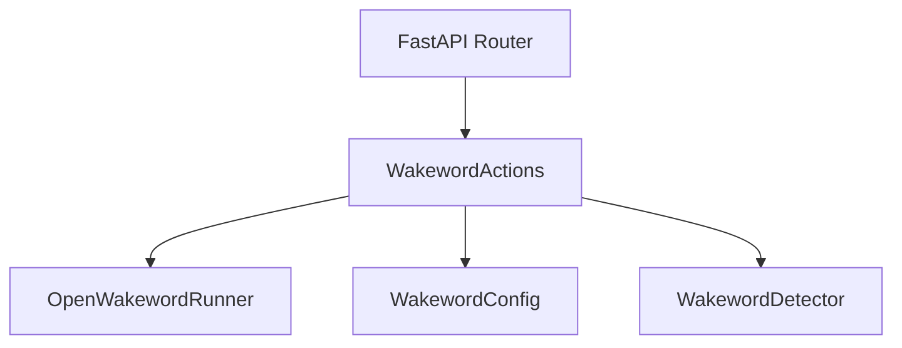
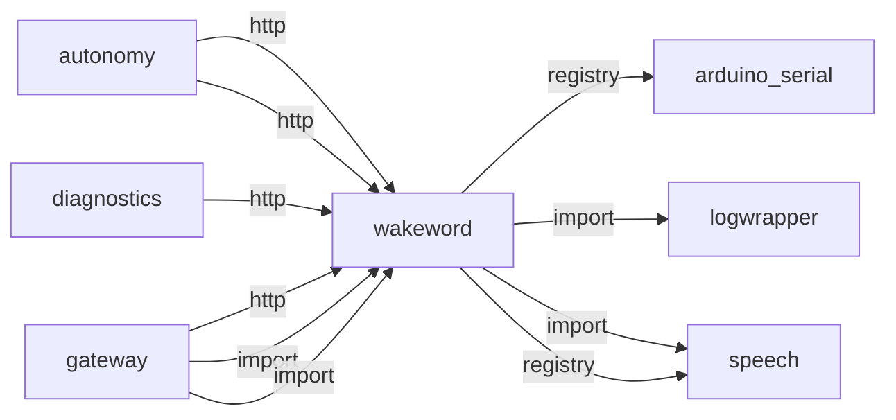
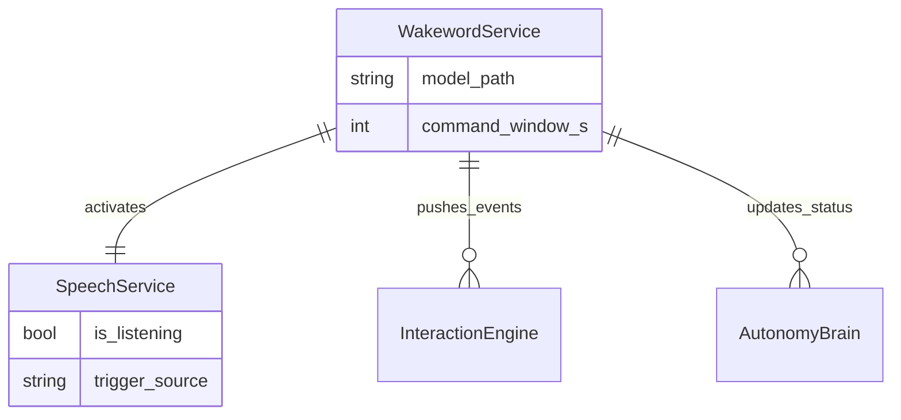
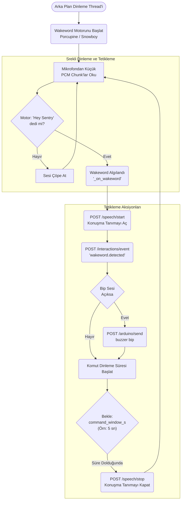

# wakeword

> **"Hey Sentry" sürekli dinleme (Porcupine/Snowboy)**

## Kimlik
| Alan | Değer |
| --- | --- |
| Ana sınıf | `WakewordActions` |
| Giriş noktası | `create_app()` |
| Orkestratör | `OpenWakewordRunner` |
| Ana dosya | `modules/wakeword/xWakewordService.py` |
| Katman | Ses/Dil |
| Port | — |
| Arduino | Evet (buzzer) |
| Sınıf sayısı | 5 |
| Endpoint sayısı | 4 |

## İsimlendirilmiş Bileşenler (Sınıflar)

#### `OpenWakewordRunner` — `modules/wakeword/services/openwakeword_runner.py`
- **Görev:** —
- **Kalıtım:** —
- **Oluşturduğu bileşenler:** —
- **Metodlar:** `run()`

#### `WakewordConfig` — `modules/wakeword/services/wakeword_detector.py`
- **Görev:** —
- **Kalıtım:** —
- **Oluşturduğu bileşenler:** —
- **Metodlar:** —

#### `WakewordDetector` — `modules/wakeword/services/wakeword_detector.py`
- **Görev:** —
- **Kalıtım:** —
- **Oluşturduğu bileşenler:** `WakewordConfig`
- **Metodlar:** `match()`

#### `WakewordActions` — `modules/wakeword/xWakewordService.py`
- **Görev:** —
- **Kalıtım:** —
- **Oluşturduğu bileşenler:** —
- **Metodlar:** `interrupt_robot_speech()`, `start_speech()`, `stop_speech()`, `emit_event()`, `has_final_speech()`

#### `WakewordService` — `modules/wakeword/xWakewordService.py`
- **Görev:** Continuously listen for a wakeword and start/stop speech recognition.
- **Kalıtım:** —
- **Oluşturduğu bileşenler:** `Event`, `Lock`, `WakewordDetector`, `WakewordActions`, `Recognizer`, `OpenWakewordRunner`, `Recognizer`
- **Metodlar:** `start()`, `start_background()`, `stop()`, `listening()`, `status()`


## API — Endpoint → Handler → Servis

| HTTP | Path | Handler | Çağırdığı servis | Açıklama |
| --- | --- | --- | --- | --- |
| GET | `/wakeword/healthz` | `healthz()` | `start_background()`, `status()`, `stop()` | — |
| GET | `/wakeword/status` | `status()` | `start_background()`, `status()`, `stop()` | — |
| POST | `/wakeword/start` | `start()` | `start_background()`, `stop()` | — |
| POST | `/wakeword/stop` | `stop()` | `stop()` | — |

## Config Bölümleri
- `server`
- `audio`
- `recognition`
- `wakeword`
- `openwakeword`
- `actions`

## Dış İlişkiler (Bu modül → diğerleri)

| Hedef modül | Bağlantı tipi | Detay | Neden |
| --- | --- | --- | --- |
| [[arduino_serial]] | registry | registry dependency: speech, arduino_serial | Algılama anında buzzer/LED geri bildirimi tetikler. |
| [[logwrapper]] | import | init_logging | `wakeword` → `logwrapper`: Merkezi WebSocket log yayınına bağlanır. |
| [[speech]] | import | services | Wake kelime algılandığında ASR pipeline'ını başlatır. |
| [[speech]] | registry | registry dependency: speech, arduino_serial | Wake kelime algılandığında ASR pipeline'ını başlatır. |

## Gelen İlişkiler (Diğerleri → bu modül)

| Kaynak modül | Bağlantı tipi | Detay | Neden |
| --- | --- | --- | --- |
| [[autonomy]] | http | calls path `/wakeword/start` | `autonomy` `wakeword` modülünün HTTP API'sine istek atar (calls path `/wakeword/start`). |
| [[autonomy]] | http | calls path `/wakeword/stop` | `autonomy` `wakeword` modülünün HTTP API'sine istek atar (calls path `/wakeword/stop`). |
| [[diagnostics]] | http | calls path `/wakeword/status` | `diagnostics` `wakeword` modülünün HTTP API'sine istek atar (calls path `/wakeword/status`). |
| [[gateway]] | http | calls path `/wakeword/status` | `gateway` `wakeword` modülünün HTTP API'sine istek atar (calls path `/wakeword/status`). |
| [[gateway]] | import | xWakewordService | `gateway` kod içinde `wakeword` modülünü import eder (`xWakewordService`) — "Hey Sentry" sürekli dinleme (Porcupine/Snowboy). |
| [[gateway]] | import | api | `gateway` kod içinde `wakeword` modülünü import eder (`api`) — "Hey Sentry" sürekli dinleme (Porcupine/Snowboy). |

## İç Mimari (otomatik çıkarım)



## Modül Etkileşim Haritası



### Mimari diyagram 1


### Mimari diyagram 2


---

# Tam Kaynak Arşivi

### `modules/wakeword/README.md` (61 satır)

```markdown
# Wakeword Module

Lightweight wakeword detector that keeps speech recognition off until a wakeword is detected.

## Behavior
- Always-on wakeword listener using Vosk ASR.
- When a wakeword is detected, it starts speech recognition for a short window.
- When the window ends (or a final command is received), speech recognition stops.

## Quick Start
### Python
```python
from modules.wakeword import WakewordService
svc = WakewordService()
svc.start_background()
```

### CLI / API
- Run: `python -m modules.wakeword.xWakewordService --api`
- Status: GET `/wakeword/status`
- Start: POST `/wakeword/start`
- Stop: POST `/wakeword/stop`

## Configuration
See config file at `modules/wakeword/config/config.yml`.

## Notes
- Supports Vosk-based wakeword detection or OpenWakeWord inference.
- For OpenWakeWord, configure `openwakeword.model_paths` and set `wakeword.engine: openwakeword`.
- Uses the `actions` section to call speech/interactions endpoints.
- This module is designed to be mounted inside the Gateway.

## Training a custom verifier (your own voice)
If you want the wakeword system to be stricter for *your* voice, train an OpenWakeWord custom verifier using your recorded positive and negative samples.

1) Prepare folders:

```
wakeword_data/positive   # your voice samples saying the wakeword (16kHz, mono WAV)
wakeword_data/negative   # other speech/noise (16kHz, mono WAV)
```

2) Train verifier locally (PC):

```powershell
# Activate virtualenv then run:
C:/path/to/venv/Scripts/python.exe -m pip install openwakeword
C:/path/to/venv/Scripts/python.exe modules/wakeword/tools/train_verifier.py --positive wakeword_data/positive --negative wakeword_data/negative --out modules/wakeword/models/verifier.joblib --base-model alexa
```

3) Configure wakeword module to use verifier:

Edit `modules/wakeword/config/config.yml` and set `openwakeword.verifier_path: "models/verifier.joblib"` and `wakeword.engine: openwakeword`.

4) Restart gateway/wakeword and test.

Note: For full custom model training (new ONNX models) use the openWakeWord training notebooks (recommended for production-quality models).

## References
- Speech module: audio capture and recognition pipeline.
- Interactions module: event bus for wakeword signals.
```

### `modules/wakeword/__init__.py` (3 satır)

```python
from .xWakewordService import WakewordService

__all__ = ["WakewordService"]
```

### `modules/wakeword/api/__init__.py` (3 satır)

```python
from .router import get_router

__all__ = ["get_router"]
```

### `modules/wakeword/api/router.py` (30 satır)

```python
from __future__ import annotations
from fastapi import APIRouter
from typing import TYPE_CHECKING

if TYPE_CHECKING:
    from modules.wakeword.xWakewordService import WakewordService


def get_router(service: "WakewordService") -> APIRouter:
    router = APIRouter()

    @router.get("/wakeword/healthz")
    async def healthz():
        return {"ok": True}

    @router.get("/wakeword/status")
    async def status():
        return service.status()

    @router.post("/wakeword/start")
    async def start():
        service.start_background()
        return {"ok": True, "listening": service.listening}

    @router.post("/wakeword/stop")
    async def stop():
        service.stop()
        return {"ok": True, "listening": service.listening}

    return router
```

### `modules/wakeword/architecture_wakeword.md` (71 satır)

```markdown
# Wakeword Modülü Mimarisi

Wakeword modülü (`modules/wakeword`), arka planda sürekli olarak dinleyerek robotun aktivasyon kelimesini (örn: "Hey Sentry", "Alexa", "Jarvis") algılayan düşük güç tüketimli bir tetikleyicidir.

## 🏗️ İş Akışı ve Karar Mekanizmaları (Flowchart)



## 🔄 İlişkisel Etkileşimler (Veri Akışı)


## ⚙️ Detaylı Karar Mantığı (if/else)

1. **Dinleme Aktivasyonu (`_on_wakeword()`)**
   - Wakeword duyulduğunda, **`if`** `command_window_s > 0` (dinleme penceresi yapılandırılmışsa):
     - `Speech` motoruna bağlanarak metin dönüştürmeyi (ASR) aktif hale getirir. (Bu sayede mikrofon her saniye buluta / CPU ağır modellere ses yollamaz, sadece wakeword'den sonraki 5 saniye STT çalışır).
   - Ayrıca robotun uyandığını belli etmek için `Interactions` modülüne bir event basar. (Bu da LED'leri mavi yakıp söndürür).
2. **Kapatma Zamanlayıcısı (Timeout)**
   - `threading.Timer` başlatılır.
   - **`if`** 5 saniye içinde başka bir komut verilirse (Autonomy metni çoktan aldıysa) motor kapanır.
   - **`else`**: Süre dolsa bile komut bitmemişse bile acımasızca `Speech/Stop` çağrısı yaparak batarya ve CPU'yu korur.
```

### `modules/wakeword/config/README.md` (47 satır)

```markdown
# Wakeword Config

This file documents the default configuration for the wakeword module.

## server
- host: API bind address
- port: API bind port

## audio
- device: ALSA device name or index (null = default)
- samplerate: audio sample rate
- channels: audio channels (1 = mono)
- dtype: PCM dtype (int16)
- frame_ms: frame size in ms

## recognition
- language: model language code
- model_path: optional explicit model path
- language_models: per-language model mapping (relative to module root)
- samplerate: Vosk sample rate
- max_alternatives: number of alternates
- vad.enabled: WebRTC VAD toggle
- vad.aggressiveness: 0..3
- vad.hangover_ms: VAD hangover time

Note: relative model paths are resolved against the wakeword module directory.

## wakeword
- engine: wakeword engine (openwakeword | vosk)
- words: list of wakeword phrases
- trigger_on_partial: allow partial results to trigger
- min_confidence: minimum confidence for final results
- cooldown_sec: minimum seconds between triggers

## openwakeword
- model_paths: list or map of models (label -> path)
- threshold: trigger threshold
- smooth_window: moving average window for scores

## actions
- speech_start_url: POST start speech recognition
- speech_stop_url: POST stop speech recognition
- speech_last_url: GET last speech result
- interactions_event_url: POST interaction events
- listen_window_sec: how long to keep speech on after wakeword
- stop_on_final: stop on first final result
- poll_interval_ms: polling interval for speech_last_url
```

### `modules/wakeword/config/config.yml` (68 satır)

```yaml
server:
  host: 0.0.0.0
  port: 8084

audio:
  device: plughw:0,0
  samplerate: 16000
  channels: 2
  dtype: int16
  frame_ms: 30

recognition:
  language: tr
  # point to speech module's model to reuse existing download
  model_path: ../speech/models/vosk-tr
  language_models:
    tr: models/vosk-tr
    en: models/vosk-en
    en-us: models/vosk-en-us
  samplerate: 16000
  max_alternatives: 0
  vad:
    enabled: true
    aggressiveness: 2
    hangover_ms: 300

wakeword:
  engine: "openwakeword"  # openwakeword | vosk
  words:
    - "hey sentry"
    - "sentry"
  trigger_on_partial: true
  min_confidence: 0.0
  cooldown_sec: 3.0

openwakeword:
  # model_paths can be a list or a map: {label: path}
  model_paths:
    - models/hey_sentribot.onnx
  inference_framework: onnx
  threshold: 0.25
  smooth_window: 3
  input_gain: 3.0
  # Print a periodic score probe in INFO logs (0 disables)
  log_every_n_chunks: 100
  # Runner input channel count. If omitted, xWakewordService injects audio.channels.
  input_channels: 2
  auto_calibration:
    enabled: true
    duration_sec: 12.0
    min_samples: 120
    percentile: 99.5
    margin: 0.0007
    min_threshold: 0.20
    max_threshold: 0.40
  verifier_path: null  # optional path to verifier joblib trained with train_verifier.py

actions:
  speech_start_url: "@gateway/speech/start"
  speech_stop_url: "@gateway/speech/stop"
  speak_stop_url: "@gateway/speak/stop"
  agent_interrupt_url: "@gateway/agent/speech/interrupt"
  speech_last_url: "@gateway/speech/last"
  interactions_event_url: "@gateway/interactions/event"
  listen_window_sec: 8.0
  min_listen_before_final_sec: 1.5   # ignore early finals (often the wakeword itself)
  stop_on_final: true
  poll_interval_ms: 200
```

### `modules/wakeword/config_loader.py` (21 satır)

```python
from __future__ import annotations
import os
from pathlib import Path
from typing import Any, Dict
import yaml

_DEF_CFG_PATH = Path(__file__).parent / "config" / "config.yml"


def load_config(override_path: str | os.PathLike | None = None) -> Dict[str, Any]:
    """Load YAML config for the wakeword module.

    Priority: override_path > WAKEWORD_CONFIG env > default config.yml
    """
    cfg_env = os.getenv("WAKEWORD_CONFIG")
    cfg_path = Path(override_path or cfg_env) if (override_path or cfg_env) else _DEF_CFG_PATH
    if not cfg_path.exists():
        raise FileNotFoundError(f"Config file not found: {cfg_path}")
    with open(cfg_path, "r", encoding="utf-8") as f:
        data = yaml.safe_load(f) or {}
    return data
```

### `modules/wakeword/services/__init__.py` (4 satır)

```python
from .wakeword_detector import WakewordDetector
from .openwakeword_runner import OpenWakewordRunner

__all__ = ["WakewordDetector", "OpenWakewordRunner"]
```

### `modules/wakeword/services/openwakeword_runner.py` (317 satır)

```python
from __future__ import annotations
import logging
import time
from collections import deque
import importlib
from pathlib import Path
from typing import Dict, Iterable, Optional

try:
    import numpy as np  # type: ignore
except Exception:
    np = None  # type: ignore

try:
    from openwakeword.model import Model as OpenWakeWordModel  # type: ignore
except Exception:
    OpenWakeWordModel = None  # type: ignore

logger = logging.getLogger("wakeword.openwakeword")
# Reduce noisy debug output by default; change to DEBUG when troubleshooting explicitly.
try:
    logger.setLevel(logging.INFO)
except Exception:
    pass


def _as_float(value) -> Optional[float]:
    try:
        return float(value)
    except Exception:
        return None


def _score_value(value) -> Optional[float]:
    if value is None:
        return None
    if isinstance(value, (list, tuple)):
        if not value:
            return None
        return _as_float(value[-1])
    try:
        import numpy as _np  # type: ignore

        if isinstance(value, _np.ndarray):
            if value.size == 0:
                return None
            return _as_float(value.reshape(-1)[-1])
    except Exception:
        pass
    return _as_float(value)


def _resolve_model_paths(model_paths) -> Dict[str, str]:
    module_root = Path(__file__).resolve().parents[1]

    def _abs_path(path: str) -> str:
        p = Path(path)
        if not p.is_absolute():
            p = (module_root / p).resolve()
        return str(p)

    resolved: Dict[str, str] = {}
    if isinstance(model_paths, dict):
        for label, path in model_paths.items():
            if isinstance(path, str) and path:
                resolved[str(label)] = _abs_path(path)
        return resolved
    if isinstance(model_paths, list):
        for path in model_paths:
            if isinstance(path, str) and path:
                abs_path = _abs_path(path)
                label = Path(abs_path).stem
                resolved[label] = abs_path
        return resolved
    if isinstance(model_paths, str) and model_paths:
        abs_path = _abs_path(model_paths)
        resolved[Path(abs_path).stem] = abs_path
    return resolved


class OpenWakewordRunner:
    def __init__(self, cfg: dict):
        if OpenWakeWordModel is None or np is None:
            raise RuntimeError("openwakeword and numpy are required for openwakeword engine")
        # openwakeword package resources preflight (some wheels/environments miss these files)
        try:
            ow_pkg = importlib.import_module("openwakeword")
            pkg_dir = Path(getattr(ow_pkg, "__file__", "")).resolve().parent
            required = pkg_dir / "resources" / "models" / "melspectrogram.onnx"
            if not required.exists():
                raise RuntimeError(
                    f"openwakeword runtime resource missing: {required}. "
                    "Reinstall openwakeword or use wakeword.engine=vosk."
                )
        except RuntimeError:
            raise
        except Exception as exc:
            raise RuntimeError(f"openwakeword preflight failed: {exc}")
        model_paths = _resolve_model_paths(cfg.get("model_paths"))
        if not model_paths:
            raise ValueError("openwakeword.model_paths is required")
        self._labels = list(model_paths.keys())
        inference_framework = str(cfg.get("inference_framework", "onnx")).strip().lower() or "onnx"
        # Instantiate model in a backward/forward-compatible way.
        # Prefer kwargs so inference_framework maps correctly even when
        # upstream uses a permissive (*args, **kwargs) constructor.
        paths_list = list(model_paths.values())
        model_ctor = OpenWakeWordModel

        def _try_ctor(kwargs=None, args=None):
            kwargs = kwargs or {}
            args = args or []
            try:
                return model_ctor(*args, **kwargs)
            except TypeError as e:
                # Pass the TypeError up for outer handling/logging
                raise

        # Preferred: explicit wakeword_models + inference_framework
        tried = []
        last_exc = None
        candidates = [
            {'kwargs': {'wakeword_models': paths_list, 'inference_framework': inference_framework}},
            {'kwargs': {'model_paths': paths_list, 'inference_framework': inference_framework}},
            {'kwargs': {'models': paths_list, 'inference_framework': inference_framework}},
            {'kwargs': {'wakeword_models': paths_list}},
            {'args': [paths_list]},
        ]

        for cand in candidates:
            try:
                if 'kwargs' in cand:
                    self._model = _try_ctor(kwargs=cand['kwargs'])
                else:
                    self._model = _try_ctor(args=cand.get('args'))
                logger.info("openwakeword model instantiated using candidate: %s", list(cand.keys()))
                last_exc = None
                break
            except Exception as exc:
                last_exc = exc
                tried.append((cand, str(exc)))

        if last_exc is not None:
            # All attempts failed — surface a helpful error message
            logger.debug("openwakeword ctor attempts: %s", tried)
            raise RuntimeError(f"openwakeword model instantiation failed: {last_exc}")
        self._threshold = float(cfg.get("threshold", 0.5))
        self._smooth_window = int(cfg.get("smooth_window", 3))
        self._input_channels = max(1, int(cfg.get("input_channels", 1)))
        self._input_gain = float(cfg.get("input_gain", 1.0))
        self._log_every_n_chunks = max(0, int(cfg.get("log_every_n_chunks", 200)))
        self._chunk_counter = 0
        # Automatic threshold calibration using startup ambient noise profile.
        cal_cfg = cfg.get("auto_calibration", {}) or {}
        self._auto_calibration_enabled = bool(cal_cfg.get("enabled", True))
        self._calibration_duration_sec = float(cal_cfg.get("duration_sec", 12.0))
        self._calibration_min_samples = max(20, int(cal_cfg.get("min_samples", 120)))
        self._calibration_percentile = float(cal_cfg.get("percentile", 99.5))
        self._calibration_margin = float(cal_cfg.get("margin", 0.0007))
        self._calibration_min_threshold = float(cal_cfg.get("min_threshold", 0.0012))
        self._calibration_max_threshold = float(cal_cfg.get("max_threshold", self._threshold))
        self._calibration_started_ts = time.time()
        self._calibration_scores: list[float] = []
        self._calibration_done = not self._auto_calibration_enabled
        self._score_history: Dict[str, deque] = {}
        if self._auto_calibration_enabled:
            logger.info(
                "openwakeword auto-calibration enabled: duration=%.1fs min_samples=%d pctl=%.2f margin=%.6f",
                self._calibration_duration_sec,
                self._calibration_min_samples,
                self._calibration_percentile,
                self._calibration_margin,
            )
        # optional verifier
        self._verifier = None
        verifier_path = cfg.get("verifier_path")
        if verifier_path:
            try:
                import pickle
                p = Path(verifier_path)
                if not p.exists():
                    # try relative to module
                    p = Path(__file__).resolve().parents[1] / verifier_path
                if p.exists():
                    with open(p, "rb") as f:
                        self._verifier = pickle.load(f)
            except Exception:
                logger.debug("failed to load verifier: %s", verifier_path)

    def run(self, stream: Iterable[bytes]) -> Iterable[str]:
        for chunk in stream:
            label = self._infer_chunk(chunk)
            if label:
                yield label

    def _infer_chunk(self, chunk: bytes) -> Optional[str]:
        if not chunk:
            return None
        self._chunk_counter += 1
        try:
            # Robustly handle different PCM widths and interleaved stereo.
            # Prefer int16, but fall back to int32 and downscale if needed.
            audio = None
            # try int16 view
            try:
                audio16 = np.frombuffer(chunk, dtype=np.int16)
                if audio16.size > 0:
                    audio = audio16
            except Exception:
                audio = None
            # fallback to int32 -> convert to int16
            if audio is None or audio.size == 0:
                if len(chunk) % 4 == 0:
                    try:
                        audio32 = np.frombuffer(chunk, dtype=np.int32)
                        # convert by shifting to 16-bit range
                        audio = (audio32 >> 16).astype(np.int16)
                    except Exception:
                        audio = None
            if audio is None or audio.size == 0:
                # last resort: try int16 again (best-effort)
                try:
                    audio = np.frombuffer(chunk, dtype=np.int16)
                except Exception:
                    logger.debug("openwakeword: failed to interpret audio chunk bytes")
                    return None
            # Downmix only when input is configured as stereo/multi-channel.
            if self._input_channels >= 2 and audio.size >= 2:
                ch0 = audio[0::self._input_channels].astype(np.int32)
                ch1 = audio[1::self._input_channels].astype(np.int32)
                if ch1.size:
                    audio = ((ch0 + ch1) // 2).astype(np.int16)
                else:
                    audio = ch0.astype(np.int16)

            # Software gain for low-level digital mics.
            if self._input_gain != 1.0 and audio.size:
                boosted = audio.astype(np.float32) * float(self._input_gain)
                audio = np.clip(boosted, -32768.0, 32767.0).astype(np.int16)

            scores = self._model.predict(audio)
            logger.debug("openwakeword predict raw scores: %s", scores)
        except Exception as exc:
            logger.debug("openwakeword inference failed: %s", exc)
            return None
        if not isinstance(scores, dict):
            logger.debug("openwakeword: predict did not return dict, got: %s", type(scores))
            return None
        best_label = None
        best_score = 0.0
        for name, value in scores.items():
            score = _score_value(value)
            if score is None:
                continue
            history = self._score_history.setdefault(name, deque(maxlen=max(1, self._smooth_window)))
            history.append(score)
            smoothed = sum(history) / len(history)
            if smoothed > best_score:
                best_score = smoothed
                best_label = name
        logger.debug("openwakeword smoothed best=%s score=%s threshold=%s", best_label, best_score, self._threshold)

        if self._auto_calibration_enabled and not self._calibration_done:
            self._calibration_scores.append(float(best_score))
            elapsed = time.time() - self._calibration_started_ts
            enough_time = elapsed >= self._calibration_duration_sec
            enough_samples = len(self._calibration_scores) >= self._calibration_min_samples
            if enough_time and enough_samples:
                try:
                    noise_p = float(np.percentile(np.asarray(self._calibration_scores, dtype=np.float32), self._calibration_percentile))
                except Exception:
                    noise_p = max(self._calibration_scores) if self._calibration_scores else 0.0
                calibrated = noise_p + self._calibration_margin
                calibrated = max(self._calibration_min_threshold, calibrated)
                calibrated = min(self._calibration_max_threshold, calibrated)
                old_threshold = self._threshold
                self._threshold = float(calibrated)
                self._calibration_done = True
                logger.info(
                    "openwakeword auto-calibration done: samples=%d elapsed=%.1fs noise_p=%.6f threshold %.6f -> %.6f",
                    len(self._calibration_scores),
                    elapsed,
                    noise_p,
                    old_threshold,
                    self._threshold,
                )
            else:
                # Do not trigger wakeword during calibration window.
                return None

        if self._log_every_n_chunks and (self._chunk_counter % self._log_every_n_chunks == 0):
            if self._auto_calibration_enabled and not self._calibration_done:
                logger.info(
                    "openwakeword probe(calibrating): best=%s score=%.4f threshold=%.4f samples=%d",
                    best_label,
                    best_score,
                    self._threshold,
                    len(self._calibration_scores),
                )
            else:
                logger.debug("openwakeword probe: best=%s score=%.4f threshold=%.4f", best_label, best_score, self._threshold)
        if best_label and best_score >= self._threshold:
            # optional verifier step
            if self._verifier is not None:
                try:
                    # extract features for verifier using model internals
                    feats = self._model.preprocessor.get_features(self._model.model_inputs.get(best_label))
                    # The verifier expects flattened features per its training pipeline
                    ok = bool(self._verifier.predict([feats.flatten()])[0])
                    if not ok:
                        return None
                except Exception:
                    # on error, fall back to unlverified accept
                    pass
            logger.info("openwakeword accepted: %s (score=%s)", best_label, best_score)
            return best_label
        return None
```

### `modules/wakeword/services/wakeword_detector.py` (43 satır)

```python
from __future__ import annotations
from dataclasses import dataclass
from typing import List, Optional


def _normalize(text: str) -> List[str]:
    return [t for t in text.lower().strip().split() if t]


@dataclass
class WakewordConfig:
    words: List[str]
    trigger_on_partial: bool
    min_confidence: float
    cooldown_sec: float


class WakewordDetector:
    def __init__(self, cfg: dict):
        words = [w for w in (cfg.get("words") or []) if isinstance(w, str) and w.strip()]
        self.cfg = WakewordConfig(
            words=words,
            trigger_on_partial=bool(cfg.get("trigger_on_partial", True)),
            min_confidence=float(cfg.get("min_confidence", 0.0)),
            cooldown_sec=float(cfg.get("cooldown_sec", 2.0)),
        )
        self._word_tokens = [
            _normalize(w) for w in self.cfg.words if _normalize(w)
        ]

    def match(self, text: str) -> Optional[str]:
        if not text:
            return None
        tokens = _normalize(text)
        if not tokens:
            return None
        for idx, w_tokens in enumerate(self._word_tokens):
            if not w_tokens:
                continue
            for i in range(0, len(tokens) - len(w_tokens) + 1):
                if tokens[i:i + len(w_tokens)] == w_tokens:
                    return self.cfg.words[idx]
        return None
```

### `modules/wakeword/tests/test_smoke.py` (4 satır)

```python
def test_wakeword_smoke_import():
    from modules.wakeword import WakewordService
    svc = WakewordService
    assert svc is not None
```

### `modules/wakeword/xWakewordService.py` (349 satır)

```python
from __future__ import annotations
import argparse
import logging
import os
from pathlib import Path
import threading
import time
from threading import Event, Lock
from typing import Optional

try:
    import requests  # type: ignore
except Exception:
    requests = None  # type: ignore

try:
    import audioop
except Exception:
    audioop = None

from fastapi import FastAPI

from modules.wakeword.config_loader import load_config
from modules.wakeword.services.wakeword_detector import WakewordDetector
from modules.wakeword.services.openwakeword_runner import OpenWakewordRunner
from modules.speech.services.audio_capture import AudioCapture, get_shared_capture, release_shared_capture
from modules.speech.services.recognizer import Recognizer, RecognitionResult
from modules.speech.services.wake_phrase import strip_wakewords

try:
    from modules.logwrapper import init_logging as _init_global_logging  # type: ignore
    _init_global_logging()
except Exception:
    pass

logger = logging.getLogger("wakeword")


def _now() -> float:
    return time.time()


def _post_json(url: str, payload: dict | None = None, timeout: float = 0.2) -> None:
    if not url or requests is None:
        return
    try:
        requests.post(url, json=payload or {}, timeout=timeout)
    except Exception as exc:
        logger.debug("wakeword http post failed: %s", exc)


def _normalize_command_text(text: str, wakeword: str = "") -> str:
    lowered = strip_wakewords(str(text or ""))
    extra = str(wakeword or "").strip().lower()
    if extra:
        lowered = lowered.replace(extra, " ").strip()
    return " ".join(lowered.split())


def _is_wakeword_only(text: str, wakeword: str = "") -> bool:
    return len(_normalize_command_text(text, wakeword)) < 2


def _get_json(url: str, timeout: float = 0.2) -> dict:
    if not url or requests is None:
        return {}
    try:
        resp = requests.get(url, timeout=timeout)
        if resp.status_code == 200:
            return resp.json() if resp.headers.get("content-type", "").startswith("application/json") else {}
    except Exception:
        return {}
    return {}


def _resolve_model_paths(rec_cfg: dict) -> dict:
    cfg = dict(rec_cfg or {})
    module_root = Path(__file__).resolve().parent
    model_path = cfg.get("model_path")
    if model_path and not os.path.isabs(str(model_path)):
        cfg["model_path"] = str((module_root / str(model_path)).resolve())
    language_models = cfg.get("language_models")
    if isinstance(language_models, dict):
        resolved = {}
        for lang, path in language_models.items():
            if isinstance(path, str) and not os.path.isabs(path):
                resolved[lang] = str((module_root / path).resolve())
            else:
                resolved[lang] = path
        cfg["language_models"] = resolved
    return cfg


class WakewordActions:
    def __init__(self, cfg: dict):
        self.speech_start_url = str(cfg.get("speech_start_url", ""))
        self.speech_stop_url = str(cfg.get("speech_stop_url", ""))
        self.speech_last_url = str(cfg.get("speech_last_url", ""))
        self.interactions_event_url = str(cfg.get("interactions_event_url", ""))
        self.listen_window_sec = float(cfg.get("listen_window_sec", 8.0))
        self.min_listen_before_final_sec = float(cfg.get("min_listen_before_final_sec", 1.5))
        self.stop_on_final = bool(cfg.get("stop_on_final", True))
        self.poll_interval_ms = int(cfg.get("poll_interval_ms", 200))
        self.speak_stop_url = str(cfg.get("speak_stop_url", "http://localhost:8080/speak/stop"))
        self.agent_interrupt_url = str(
            cfg.get("agent_interrupt_url", "http://localhost:8080/agent/speech/interrupt")
        )

    def interrupt_robot_speech(self) -> None:
        _post_json(self.speak_stop_url)
        _post_json(self.agent_interrupt_url)

    def start_speech(self) -> None:
        _post_json(self.speech_start_url)

    def stop_speech(self) -> None:
        _post_json(self.speech_stop_url)

    def emit_event(self, event_type: str, wakeword: str) -> None:
        if not self.interactions_event_url:
            return
        _post_json(self.interactions_event_url, {"type": event_type, "wakeword": wakeword})

    def has_final_speech(self, since_ts: float | None = None, wakeword: str = "") -> bool:
        if not self.speech_last_url:
            return False
        data = _get_json(self.speech_last_url)
        if not data.get("final"):
            return False
        text = str(data.get("text", "")).strip()
        if not text:
            return False
        if since_ts is not None:
            try:
                if float(data.get("ts", 0.0)) < float(since_ts):
                    return False
            except Exception:
                return False
        if _is_wakeword_only(text, wakeword):
            return False
        return True


class WakewordService:
    """Continuously listen for a wakeword and start/stop speech recognition."""

    def __init__(self, config_path: Optional[str] = None):
        self.cfg = load_config(config_path)
        self._stop_event = Event()
        self._listening = False
        self._lock = Lock()
        self._last_trigger_ts = 0.0
        self._active_window = False
        self._thread: Optional[threading.Thread] = None
        self._degraded_reason: Optional[str] = None

        self.capture = get_shared_capture(self.cfg.get("audio", {}))
        wake_cfg = self.cfg.get("wakeword", {})
        self.engine = str(wake_cfg.get("engine", "vosk")).lower()
        self.detector = WakewordDetector(wake_cfg)
        self._openwakeword = None
        self._recognizer = None
        if self.engine == "openwakeword":
            try:
                ow_cfg = dict(self.cfg.get("openwakeword", {}) or {})
                audio_channels = int((self.cfg.get("audio", {}) or {}).get("channels", 1))
                ow_cfg.setdefault("input_channels", audio_channels)
                self._openwakeword = OpenWakewordRunner(ow_cfg)
            except Exception as exc:
                self._degraded_reason = str(exc)
                logger.warning("wakeword openwakeword unavailable, falling back to vosk: %s", exc)
                self.engine = "vosk"
                try:
                    self._recognizer = Recognizer(_resolve_model_paths(self.cfg.get("recognition", {})))
                    self._degraded_reason = None
                except Exception as rec_exc:
                    self._degraded_reason = str(rec_exc)
        else:
            self._recognizer = Recognizer(_resolve_model_paths(self.cfg.get("recognition", {})))
        self.actions = WakewordActions(self.cfg.get("actions", {}))
        logger.info("wakeword engine=%s detector_words=%s degraded=%s", self.engine, list(self.detector.cfg.words), bool(self._degraded_reason))

    def start(self) -> None:
        with self._lock:
            if self._listening:
                return
            self._listening = True
        self._stop_event.clear()
        try:
            if self._openwakeword is None and self._recognizer is None:
                logger.warning("wakeword service running degraded: no engine available")
                self._degraded_reason = self._degraded_reason or "no wakeword engine available"
                return
            stream = self.capture.stream()
            logger.debug("wakeword listening using engine=%s; capture cfg=%s", self.engine, getattr(self.capture, 'cfg', None))
            if self.engine == "openwakeword" and self._openwakeword is not None:
                for label in self._openwakeword.run(stream):
                    if self._stop_event.is_set():
                        break
                    logger.info("openwakeword detected: %s", label)
                    self._on_wakeword(label)
            else:
                # Recognizer (Vosk) expects mono PCM. Capture may be stereo for DOA,
                # so downmix on-the-fly here without altering the original capture.
                def mono_generator(src_stream):
                    for chunk in src_stream:
                        if not chunk:
                            yield chunk
                            continue
                        try:
                            if getattr(self.capture.cfg, 'channels', None) is not None and self.capture.cfg.channels >= 2 and audioop is not None:
                                mono = audioop.tomono(chunk, 2, 1.0, 0.0)
                                logger.debug("downmixing stereo->mono, chunk_len=%d", len(chunk))
                                yield mono
                            else:
                                yield chunk
                        except Exception:
                            yield chunk

                for result in self._recognizer.run(mono_generator(stream)):
                    if self._stop_event.is_set():
                        break
                    self._handle_result(result)
        except Exception as exc:
            self._degraded_reason = str(exc)
            logger.warning("wakeword listener stopped, running degraded: %s", exc)
            if not self._stop_event.is_set():
                time.sleep(1.0)
                self._ensure_listener_restarted(retries=3, delay_sec=0.35)
        finally:
            with self._lock:
                self._listening = False

    def start_background(self) -> None:
        with self._lock:
            if self._listening:
                return
        self._thread = threading.Thread(target=self.start, daemon=True)
        self._thread.start()

    def _ensure_listener_restarted(self, retries: int = 6, delay_sec: float = 0.2) -> None:
        """Try to restart listener even if previous thread is still winding down."""
        for _ in range(max(1, retries)):
            self.start_background()
            time.sleep(max(0.05, delay_sec))
            if self.listening:
                return

    def stop(self) -> None:
        self._stop_event.set()
        with self._lock:
            self._listening = False
            self._active_window = False

    def _handle_result(self, result: RecognitionResult) -> None:
        if not result.text:
            return
        if result.is_final:
            conf = result.confidence if result.confidence is not None else 0.0
            if conf < self.detector.cfg.min_confidence:
                return
        else:
            if not self.detector.cfg.trigger_on_partial:
                return
        match = self.detector.match(result.text)
        if match:
            self._on_wakeword(match)

    def _on_wakeword(self, wakeword: str) -> None:
        now = _now()
        with self._lock:
            if now - self._last_trigger_ts < self.detector.cfg.cooldown_sec:
                return
            self._last_trigger_ts = now
            self._active_window = True
        self.actions.interrupt_robot_speech()
        logger.info("wakeword candidate: %s at %f (barge-in)", wakeword, now)
        threading.Thread(target=self._command_window, args=(wakeword,), daemon=True).start()

    def _command_window(self, wakeword: str) -> None:
        try:
            self.actions.emit_event("wakeword.detected", wakeword)
            window_started_ts = _now()
            self.actions.start_speech()
            if self.actions.listen_window_sec <= 0:
                return
            deadline = _now() + self.actions.listen_window_sec
            grace_until = window_started_ts + max(0.0, self.actions.min_listen_before_final_sec)
            while _now() < deadline:
                if (
                    _now() >= grace_until
                    and self.actions.stop_on_final
                    and self.actions.has_final_speech(window_started_ts, wakeword)
                ):
                    break
                time.sleep(max(0.05, self.actions.poll_interval_ms / 1000.0))
            self.actions.stop_speech()
        finally:
            with self._lock:
                self._active_window = False

    @property
    def listening(self) -> bool:
        with self._lock:
            return self._listening

    def status(self) -> dict:
        with self._lock:
            return {
                "listening": self._listening,
                "active_window": self._active_window,
                "last_trigger_ts": self._last_trigger_ts,
                "wakewords": list(self.detector.cfg.words),
                "engine": self.engine,
                "degraded": bool(self._degraded_reason),
                "degraded_reason": self._degraded_reason,
            }


def create_app(config_path: str | None = None) -> FastAPI:
    service = WakewordService(config_path)
    app = FastAPI()
    from modules.wakeword.api import get_router  # local import to avoid circular
    app.include_router(get_router(service))
    return app


def main():
    parser = argparse.ArgumentParser(description="Wakeword detection service")
    parser.add_argument("--config", type=str, default=None, help="Path to config.yml")
    parser.add_argument("--api", action="store_true", help="Run FastAPI server using config server.host/port")
    args = parser.parse_args()

    logging.basicConfig(level=logging.INFO)

    if args.api:
        import uvicorn  # type: ignore
        cfg = load_config(args.config)
        host = str(cfg.get("server", {}).get("host", "0.0.0.0"))
        port = int(cfg.get("server", {}).get("port", 8084))
        uvicorn.run(create_app(args.config), host=host, port=port, log_config=None)
        return

    service = WakewordService(args.config)
    service.start()


if __name__ == "__main__":
    main()
```
