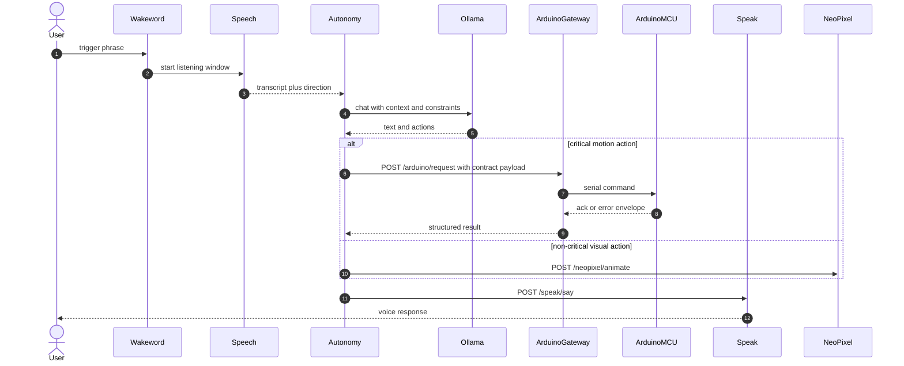

# SentryBOT Capability Supermap

Bu dokuman tum robot modullerini tek bir olceklenebilir mimari gorunumde toplar.
Amac: yetenekler, istek akislari, bagimliliklar, dayaniklilik ve genisleme noktalarini netlestirmek.

## 1) Global Mermaid Architecture (Scalable)

```mermaid
%%{init: {"flowchart": {"curve": "basis", "nodeSpacing": 45, "rankSpacing": 80}} }%%
flowchart TB
    %% Actors and external surfaces
    subgraph Actors[Actors and External Clients]
        direction LR
        OWNER[Owner or Voice User]
        WEBUI[Web UI or Operator]
        API_CLIENT[API Client or Integration]
        REMOTE_VLM[Remote VLM Provider]
    end

    %% Core platform services
    subgraph Core[Core Platform and Control Plane]
        direction LR
        GATEWAY[modules/gateway\nFastAPI entry and bootstrap]
        CONTROL_BUS((Bootstrap Bus))
        CONFIG[modules/config_center\nconfig read and reload]
        STATE[modules/state_manager\nglobal shared state]
        TELEMETRY[modules/telemetry\nmetrics export]
        DIAG[modules/diagnostics\nself test]
        SCHED[modules/scheduler\nperiodic jobs]
        OTA[modules/ota\nupdate pipeline]
        LOGWRAP[modules/logwrapper\nlog stream]
        NOTIFIER[modules/notifier\noutbound alerts]
    end

    %% Perception stack
    subgraph Perception[Perception and Ingest Layer]
        direction LR
        WAKEWORD[modules/wakeword\nkeyword trigger]
        SPEECH[modules/speech\nASR and direction]
        CAMERA[modules/camera\nvideo stream]
        VLM[modules/vlm_bridge\nvision reasoning bridge]
        HARDWARE[modules/hardware\nhost sensors and health]
        SENSE_BUS((Sense Bus))
    end

    %% Cognition and decision stack
    subgraph Cognition[Cognition and Decision Layer]
        direction LR
        AGENT_CORE[modules/agent_core\nL1 or L2 or L3 orchestration]
        INTERACTIONS[modules/interactions\nrule engine]
        DECIDE_BUS((Decision Bus))
        AUTONOMY[modules/autonomy\nsense-think-act]
        OLLAMA[modules/ollama\nLLM chat and actions]
    end

    %% Actuation and embodiment
    subgraph Actuation[Actuation and Embodiment Layer]
        direction LR
        ACT_BUS((Action Bus))
        SPEAK[modules/speak\nTTS output]
        NEOPIXEL[modules/neopixel\nlight animation]
        ANIMATE[modules/animate\npose sequence playback]
        PISERVO[modules/piservo\nPi PWM servo]
        OLED[modules/oled_faces\nSSD1306 face render]
        ARDUINO[modules/arduino_serial\ncontracted command transport]
        CALIB[modules/calibration\nservo and offset calibration]
    end

    %% Data and support
    subgraph Data[Data and Artifacts]
        direction LR
        CFG_FILE[config/agent.yaml and module config.yml]
        FACE_DB[data/faces.json]
        NEO_MAP[docs/neopixel_event_mapping.json]
        LOGS[logs]
        ASSETS[animations, face assets, prompts]
    end

    subgraph Support[Support and Dev Workflow]
        direction LR
        MUTAGEN[modules/mutagen\ncode sync workflow]
        VLM_DOC[docs/vlm_tri_layer_workflow.md]
    end

    %% Control plane fanout
    OWNER --> WAKEWORD
    WEBUI --> GATEWAY
    API_CLIENT --> GATEWAY
    REMOTE_VLM --> VLM
    GATEWAY --> CONTROL_BUS
    CONTROL_BUS --> CONFIG
    CONTROL_BUS --> STATE
    CONTROL_BUS --> TELEMETRY
    CONTROL_BUS --> DIAG
    CONTROL_BUS --> SCHED
    CONTROL_BUS --> OTA
    CONTROL_BUS --> LOGWRAP
    CONTROL_BUS --> NOTIFIER
    CONTROL_BUS --> AGENT_CORE
    CONTROL_BUS --> AUTONOMY
    CONTROL_BUS --> INTERACTIONS

    %% Sense flow
    WAKEWORD --> SPEECH
    CAMERA --> VLM
    SPEECH --> SENSE_BUS
    VLM --> SENSE_BUS
    HARDWARE --> SENSE_BUS
    SENSE_BUS --> AUTONOMY

    %% Decision loop
    AGENT_CORE --> DECIDE_BUS
    INTERACTIONS --> DECIDE_BUS
    AUTONOMY --> OLLAMA
    OLLAMA --> DECIDE_BUS
    DECIDE_BUS --> AUTONOMY

    %% Action fanout
    AUTONOMY --> ACT_BUS
    ACT_BUS --> SPEAK
    ACT_BUS --> NEOPIXEL
    ACT_BUS --> ANIMATE
    ACT_BUS --> PISERVO
    ACT_BUS --> OLED
    ACT_BUS --> ARDUINO
    ACT_BUS --> NOTIFIER
    INTERACTIONS --> NEOPIXEL
    VLM --> ARDUINO
    ANIMATE --> ARDUINO
    CALIB --> ARDUINO

    %% Data and support dependencies
    CONFIG --> CFG_FILE
    VLM --> FACE_DB
    NEO_MAP --> NEOPIXEL
    ASSETS --> OLED
    ASSETS --> AGENT_CORE
    ASSETS --> OLLAMA
    LOGWRAP --> LOGS
    TELEMETRY --> WEBUI
    MUTAGEN -.-> GATEWAY
    VLM_DOC -.-> AGENT_CORE

    %% Color-coded edges by flow family
    linkStyle 0,1,2,3,4,5,6,7,8,9,10,11,12,13,14,15 stroke:#2563eb,stroke-width:1.8px
    linkStyle 16,17,18,19,20,21 stroke:#16a34a,stroke-width:1.8px
    linkStyle 22,23,24,25,26 stroke:#d97706,stroke-width:1.8px
    linkStyle 27,28,29,30,31,32,33,34,35,36,37,38 stroke:#dc2626,stroke-width:1.8px
    linkStyle 39,40,41,42,43,44,45,46,47,48 stroke:#7c3aed,stroke-width:1.6px,stroke-dasharray:4 3
```

## 2) Wide Capability Matrix

| Module | Primary capability | Main inbound requests or triggers | Main outbound effects | Key dependencies | Scalability notes | Reliability and safety notes |
|---|---|---|---|---|---|---|
| modules/gateway | Bootstraps all modules and exposes API surface | run_robot startup, HTTP routes, include flags | Mounts routers, creates app state, service discovery | FastAPI, config loader, module includes | Keep module includes feature-flagged; split routers for horizontal API growth | Wrap include failures and continue degraded startup |
| modules/config_center | Config read/write and runtime reload policy | GET or POST config routes, admin edits | Persists yaml, emits restart or hot-reload intent | yaml parser, schema validation | Use scoped config by module to avoid global lock contention | Validate schema before write; keep backup and rollback path |
| modules/state_manager | Shared robot state and lightweight pub/sub | set/get calls from autonomy, speech, interactions | Thread-safe updates and snapshot reads | in-memory store, lock | Partition keys by domain and keep payloads compact | Always lock updates, reject malformed keys |
| modules/telemetry | Metrics collection and export | event ingests, scrape calls | Prometheus-like text metrics | state_manager, arduino events | Use pull-based scrape and metric labels to scale observability | Drop non-numeric values safely; never crash on bad metric |
| modules/diagnostics | Self-test pipeline and health aggregation | startup checks, manual self-test route | Health report, warning or critical events | hardware, camera, arduino_serial, ollama | Run checks in bounded timeouts; parallelize probes when needed | Distinguish hard-fail vs soft-fail components |
| modules/scheduler | Periodic task orchestration | startup schedules, dynamic task registration | Triggers maintenance and behavior jobs | timing library, thread execution | Keep jobs idempotent and short; dispatch long jobs async | Isolate job exceptions so scheduler loop survives |
| modules/ota | Secure update pipeline | update upload or trigger | Package validation, apply, restart | filesystem, package manager, process control | Stage updates in temp path and support delta strategy later | Verify checksum/signature; force safe-stop before swap |
| modules/logwrapper | Live log broadcasting and formatting | logger writes, websocket subscriptions | Streams logs to UI clients | logging handlers, websocket | Use ring buffer for bursty logs and many clients | Remove dead sockets immediately on disconnect |
| modules/notifier | External alert delivery | notify requests, critical events | Telegram/Discord/webhook notifications | HTTP client, secrets | Add queue and backoff for burst alerts | Rate-limit duplicates; never block control loop |
| modules/wakeword | Passive trigger detection | microphone chunks, runtime enable | opens speech window, emits wake event | wakeword engine, speech, interactions | Decouple detect loop from action dispatch | Hard timeout for command window to cap CPU use |
| modules/speech | ASR and direction extraction | wakeword start, mic stream | text transcript and direction for autonomy | recognizer backend, audio IO | Swap ASR backends by config; bounded chunk pipeline | Filter noise and short tokens; recover from backend errors |
| modules/camera | Frame capture and stream serving | camera thread start, stream clients | latest frame for VLM and UI stream | OpenCV or camera backend | Single producer and many consumers model for throughput | Auto-reopen camera on read failure |
| modules/vlm_bridge | Vision analysis bridge local or remote | frames, remote VLM POST ingest | structured scene result, follow or track actions | camera, face DB, remote model | Keep mode switch local vs remote; isolate follow state | Validate inbound remote payload and auth |
| modules/hardware | Host hardware metrics and system probes | health endpoints, periodic checks | cpu/ram/temp/i2c snapshots | psutil, platform tools | Cache expensive probe results over short windows | Treat missing probe commands as warning not crash |
| modules/agent_core | Tri-layer agent orchestration | agent step requests, context updates | routed sub-agent outputs and final response | tool registry, memory, autonomy bridge | Keep router stateless and add sub-agent sharding later | Enforce safety filter before action emission |
| modules/autonomy | Main sense-think-act behavior engine | speech text, vision events, periodic ticks | action plans to speak, lights, servo, arduino | state_manager, ollama, service client | Split mixins by domain; queue actions for backpressure | owner guard, capability checks, critical command bounds |
| modules/ollama | LLM chat and action extraction | chat prompts from autonomy or API | structured response text and action tags | ollama server, persona, memory | Add model fallback chain and per-call context budget | Parse-fail fallback path; timeout and retry policy |
| modules/interactions | Rule-based reactive behavior | metrics ticks, event queue | prioritized effect actions mostly to neopixel | hardware metrics, event API | Keep rule set declarative and priority-driven | Default safe action if no rule matches |
| modules/arduino_serial | Contracted MCU transport and safety gate | POST /arduino/request, POST /arduino/send, poll loops, heartbeat | ack/error envelopes, telemetry stream, RFID events, capability negotiation | serial transport, modules/arduino_serial/contract.py builders, payload validators | Split send/read queues, keep critical path on /request, plan pooled transport sessions and backpressure | Critical commands must use contract builders; default request timeout 0.8-1.5s; idempotent one-shot retry only |
| modules/animate | Sequence playback for body poses | animation run requests from autonomy | timed pose commands to arduino_serial | yaml animation files, arduino contract | Preload animation files and reuse parsed structures | Validate pose schema and stop on invalid step |
| modules/neopixel | LED animation and emotion color mapping | animate requests from autonomy or interactions | hardware or simulated LED effects | emotion yaml store, driver | Keep rendering backend pluggable; batch writes | Fallback to simulation when hardware driver missing |
| modules/speak | TTS synthesis and playback | say requests and tone directives | audible response through audio device | pyttsx3 or piper, ALSA | support multiple engines and cached voices | sanitize text and guard against audio backend failure |
| modules/piservo | Direct Pi PWM servo control | set angle requests or gestures | ear or local servo movements | RPi GPIO or mock | abstract pin mapping and per-board config | clamp angle and duty cycle to safe limits |
| modules/oled_faces | OLED expression rendering | state poll and interaction events | draws bitmap or animation to SSD1306 | mapper, i2c driver, assets | cache bitmaps and precompiled animation frames | deterministic fallback face for unknown events |
| modules/calibration | Manual calibration workflows | calibration start and save calls | writes offsets to config or MCU storage | arduino_serial, config store | support profile versions and export/import | lock movement during calibration session |
| modules/mutagen | Development sync workflow | developer sync commands | bidirectional file sync with robot | mutagen CLI, SSH | keep ignore rules strict to avoid noisy sync | resolve conflicts with explicit precedence policy |

## 3) Scale-Out Directions

1. Split module APIs into versioned namespaces once external integrations increase.
2. Move heavy perception and LLM calls to bounded async worker queues.
3. Add per-module health budgets and circuit-breakers in gateway routing.
4. Keep command contract as single source of truth for all MCU-bound paths.
5. Add end-to-end trace IDs from gateway through autonomy to actuation.

## 4) Deep Operational Matrix (Critical Paths)

| User intent or system scenario | Entry trigger | Module chain | Primary contracts and payload rules | Timeout and retry profile | Degraded behavior | Scale levers | Observability signals |
|---|---|---|---|---|---|---|---|
| Voice command and response | Wake phrase and speech transcript | wakeword -> speech -> autonomy -> ollama -> speak and actuation | Speech transcript payload + autonomy action blocks; action payloads must stay schema-compatible | Speech window bounded; LLM timeout bounded; no unbounded retries | If LLM unavailable, autonomy uses fallback short response and safe no-motion policy | Move ASR/LLM to worker queue; keep autonomy tick deterministic | wake_detect_count, asr_latency_ms, llm_latency_ms, autonomy_tick_ms |
| Person follow and track | Camera frame or remote VLM ingest | camera -> vlm_bridge -> autonomy -> arduino_serial | Track and servo payloads must be built from contract builders | Critical tracking over /arduino/request with bounded timeout | If tracker unstable or no target, stop follow and return neutral scan mode | Frame sampling control, tracker update frequency, remote/local mode switch | frame_drop_rate, tracker_lock_ratio, arduino_ack_latency_ms |
| Reactive ambient expression | Rule engine tick or event | interactions -> neopixel and oled_faces | Event to animation mapping tables + color palettes | Short HTTP timeout, no long retry loops | If neopixel hw absent, simulation path keeps state coherent | Cache palettes, deduplicate repeated animation requests | rule_hit_rate, animation_dispatch_count, hw_fallback_count |
| OTA upgrade | Upload and update request | ota -> diagnostics -> gateway restart | Package integrity verification before apply; safe-stop before replace | Extended operation timeout, no repeated non-idempotent retries | On checksum or signature fail, abort and keep running version | Stage updates in temp area; later add delta updates | ota_stage_duration_ms, ota_verify_fail_count |
| Calibration session | Manual calibration start | calibration -> arduino_serial -> config_center | Servo and offset payloads validated before write | Request timeout longer for physical homing; retry very limited | If movement lock active, reject calibration start | Profile-based calibration sets and import/export | calibration_apply_ms, calibration_reject_count |
| Alert fanout | Critical event or API notify | diagnostics or autonomy -> notifier | Message envelope with severity levels and target channels | Outbound webhook timeouts bounded + backoff | If channel down, log and continue control plane | Queue + rate limit by signature | notifier_send_ms, notifier_drop_count |
| Telemetry export | Scrape and event ingestion | arduino_serial and state_manager -> telemetry | Numeric metric output policy for scrape endpoints | Fast scrape response; ingestion non-blocking | Drop malformed metrics without crashing | Label strategy + low-cardinality metric names | telemetry_export_ms, telemetry_parse_fail_count |
| Live operator visibility | UI websocket open | logwrapper -> web clients | Structured log event payloads | Non-blocking broadcast with disconnect cleanup | If client disconnects, remove immediately | Ring buffer and fanout batching | ws_clients, log_broadcast_ms, dropped_log_events |

## 5) Arduino Contract and Safety Governance

This section defines the critical runtime policy for MCU-bound command families.

| Command family | Preferred route | Builder source | Default timeout | Retry policy | Capability gate | Failure response |
|---|---|---|---|---|---|---|
| set_servo | /arduino/request | modules/arduino_serial/contract.py build_* helpers | 0.8s to 1.5s | max_retries=1 only if command is idempotent | require hello.features support | hard-fail on missing capability |
| stepper | /arduino/request | contract build_* helpers | 0.8s to 1.5s | max_retries=1 idempotent only | require feature presence | hard-fail and emit diagnostic event |
| track | /arduino/request | contract build_* helpers | 0.8s to 1.5s | max_retries=1 idempotent only | require tracking-related capability | hard-fail and disable follow mode |
| pid_* | /arduino/request | contract build_* helpers | 0.8s to 1.5s | max_retries=1 idempotent only | require pid capability | hard-fail with visible telemetry flag |
| home | /arduino/request | contract build_* helpers | higher than normal operation window | generally no blind retry | require homing capability | fail-safe stop and operator warning |
| cosmetic buzzer or non-critical cue | /arduino/send allowed | contract build_* helpers | short best-effort | no retry needed | soft gate | soft-skip with log |

Policy summary:
1. New code must not handcraft raw {"cmd": ...} payloads outside contract helpers.
2. Critical motion/control commands use /arduino/request by default for ack/error visibility.
3. hello feature negotiation is mandatory for capability-based branching.
4. Missing critical capability means hard-fail; cosmetic features may soft-skip + log.

## 6) End-to-End Control Sequence (Detailed)

## 7) Suggested SLO Baselines (Operational Targets)

| Signal | Target | Notes |
|---|---|---|
| /status health response | p95 under 100ms | gateway responsiveness baseline |
| /arduino/request ack latency | p95 under 350ms (normal) | command family dependent |
| wakeword to first ASR text | p95 under 1200ms | includes speech window transition |
| autonomy tick duration | p95 under 250ms without LLM block | keep deterministic loop health |
| telemetry scrape duration | p95 under 80ms | avoid scrape-induced load |
| ws log fanout dispatch | p95 under 50ms | protect operator observability |

## 8) Module Endpoint and Config Key Index

Source note:
1. HTTP endpoints were auto-detected from module router files.
2. Some critical routes are architecture-declared contract routes exposed via gateway integration.

| Module | Endpoint surface | Config file | Top-level config keys |
|---|---|---|---|
| agent_core | POST /step, POST /route_preview, GET /world_state, GET /memory/search, GET /slam/location, GET /slam/pathfind, GET /healthz | modules/agent_core/config/config.yml | server, agent, llm, tri_layer, safety, sensor_loop, idle, memory, slam |
| animate | no direct router endpoint detected (internal service flow) | modules/animate/config/config.yml | animations_dir, default_speed, interpolate |
| arduino_serial | architecture-declared: POST /arduino/request, POST /arduino/send | modules/arduino_serial/config/config.yml | port, baudrate, timeout, write_timeout, reconnect_sec, heartbeat_ms, auto_heartbeat, request_max_retries, request_timeout_ms, telemetry, log_level, rfid |
| autonomy | POST /start, POST /stop, POST /interaction, POST /apply_actions, GET /state, GET /lights/palettes, POST /lights/palettes/{name}, DELETE /lights/palettes/{name} | modules/autonomy/config/config.yml | defaults, endpoints, behaviors, llm, speech_quiet_hours, offline_mode, vision_hooks, scenes, owner |
| calibration | no direct router endpoint detected in scan | modules/calibration/config/config.yml | server, paths |
| camera | GET /video, GET /snap, GET /healthz, POST /start, POST /stop | modules/camera/config/config.yml | backend, source, resolution, fps_target, jpeg_quality, flip, opencv, picamera2, server, logging |
| config_center | no direct router endpoint detected in scan | modules/config_center/config/config.yml | server, modules |
| diagnostics | no direct router endpoint detected in scan | modules/diagnostics/config/config.yml | server, checks |
| gateway | mounted core and module routes via bootstrap include graph | modules/gateway/config/config.yml | server, include, speech |
| hardware | no direct router endpoint detected in scan | modules/hardware/config/config.yml | server, system, gpio, i2c |
| interactions | no direct router endpoint detected in scan | modules/interactions/config/config.yml | server, adapter, monitor, hardware, tick_interval_ms, quiet_hours, thresholds, defaults, rules |
| logwrapper | GET /, POST /level | modules/logwrapper/config/config.yml | enable_console, console_level, enable_file, file_path, rotate_bytes, backup_count, json_format, buffer_size, capture_warnings, module_levels |
| mutagen | no direct router endpoint detected in scan | modules/mutagen/config/config.yml | server, mutagen |
| neopixel | architecture-declared: POST /neopixel/animate | modules/neopixel/config/config.yml | server, hardware, pi5neo, defaults, presets, presets_meta |
| notifier | architecture-declared: POST /notify/send | modules/notifier/config/config.yml | server, gateway, telegram, whatsapp_web, discord, quiet_hours |
| oled_faces | no direct router endpoint detected in scan | modules/oled_faces/config/config.yml | server, enabled, poll_interval_s, display, boot, idle_bitmap, fallback_unknown, state_map, event_map, arduino_event_map |
| ollama | architecture-declared: POST /chat | modules/ollama/config/config.yml | server, llm, ollama, google_ai_studio, persona, actions, translation |
| ota | no direct router endpoint detected in scan | modules/ota/config/config.yml | server, ota |
| piservo | architecture-declared: POST /piservo/set | modules/piservo/config/config.yml | server, left, right |
| scheduler | no direct router endpoint detected in scan | modules/scheduler/config/config.yml | server, jobs |
| speak | GET /speak/status, POST /speak/say, POST /speak/play | modules/speak/config/config.yml | server, audio_out, tts, liveliness |
| speech | GET /speech/status, GET /speech/last, GET /speech/direction, GET /speech/track/status, POST /speech/start, POST /speech/stop, POST /speech/track/start, POST /speech/track/stop | modules/speech/config/config.yml | server, audio, recognition, direction |
| state_manager | architecture-declared: GET /state, POST /set/... | modules/state_manager/config/config.yml | server, defaults, persistence |
| telemetry | architecture-declared: GET /telemetry/metrics | modules/telemetry/config/config.yml | server, exporter |
| vlm_bridge | architecture-declared: POST /vlm/results, POST /vlm/track | modules/vlm_bridge/config/config.yml | server, vision, remote, robot, ollama, llm, speak, translation, actions |
| wakeword | GET /wakeword/healthz, GET /wakeword/status, POST /wakeword/start, POST /wakeword/stop | modules/wakeword/config/config.yml | server, audio, recognition, wakeword, openwakeword, actions |

## 9) Endpoint Request/Response Templates

Template note:
1. These are operational examples for integration planning.
2. Exact schemas should follow module validators and contract builders.

### 9.1 agent_core

| Endpoint | Request template | Success response template | Error response template |
|---|---|---|---|
| POST /step | {"input":"hello", "context":{}} | {"ok":true, "reply":"...", "actions":[]} | {"ok":false, "error":"validation_error"} |
| POST /route_preview | {"input":"scan room", "hints":["vlm_bridge"]} | {"ok":true, "route":["vlm_bridge","autonomy"]} | {"ok":false, "error":"route_unavailable"} |
| GET /world_state | none | {"ok":true, "world_state":{}} | {"ok":false, "error":"state_unavailable"} |
| GET /memory/search | query: q=owner | {"ok":true, "results":[...]} | {"ok":false, "error":"query_invalid"} |
| GET /slam/location | none | {"ok":true, "location":{"x":0.0,"y":0.0}} | {"ok":false, "error":"slam_not_ready"} |
| GET /slam/pathfind | query: to=kitchen | {"ok":true, "path":[...]} | {"ok":false, "error":"path_not_found"} |
| GET /healthz | none | {"ok":true, "status":"healthy"} | {"ok":false, "status":"degraded"} |

### 9.2 autonomy

| Endpoint | Request template | Success response template | Error response template |
|---|---|---|---|
| POST /start | {} | {"ok":true, "running":true} | {"ok":false, "error":"already_running"} |
| POST /stop | {} | {"ok":true, "running":false} | {"ok":false, "error":"not_running"} |
| POST /interaction | {"text":"merhaba", "source":"speech"} | {"ok":true, "queued":true} | {"ok":false, "error":"invalid_payload"} |
| POST /apply_actions | {"actions":[{"type":"speak","text":"..."}]} | {"ok":true, "applied":1} | {"ok":false, "error":"action_rejected"} |
| GET /state | none | {"ok":true, "state":{}} | {"ok":false, "error":"state_error"} |
| GET /lights/palettes | none | {"ok":true, "palettes":{}} | {"ok":false, "error":"palette_error"} |
| POST /lights/palettes/{name} | {"colors":["#00ffaa","#0055ff"]} | {"ok":true, "name":"focus"} | {"ok":false, "error":"palette_invalid"} |
| DELETE /lights/palettes/{name} | none | {"ok":true, "deleted":true} | {"ok":false, "error":"palette_not_found"} |

### 9.3 camera

| Endpoint | Request template | Success response template | Error response template |
|---|---|---|---|
| GET /video | none | multipart stream | {"ok":false, "error":"camera_unavailable"} |
| GET /snap | none | image bytes or {"ok":true,"path":"..."} | {"ok":false, "error":"snapshot_failed"} |
| GET /healthz | none | {"ok":true, "camera":"ready"} | {"ok":false, "camera":"down"} |
| POST /start | {} | {"ok":true, "capturing":true} | {"ok":false, "error":"start_failed"} |
| POST /stop | {} | {"ok":true, "capturing":false} | {"ok":false, "error":"stop_failed"} |

### 9.4 speech

| Endpoint | Request template | Success response template | Error response template |
|---|---|---|---|
| GET /speech/status | none | {"ok":true, "is_listening":true} | {"ok":false, "error":"service_down"} |
| GET /speech/last | none | {"ok":true, "text":"..."} | {"ok":false, "error":"no_data"} |
| GET /speech/direction | none | {"ok":true, "deg":90} | {"ok":false, "error":"direction_unavailable"} |
| GET /speech/track/status | none | {"ok":true, "tracking":false} | {"ok":false, "error":"track_state_error"} |
| POST /speech/start | {} | {"ok":true, "is_listening":true} | {"ok":false, "error":"start_failed"} |
| POST /speech/stop | {} | {"ok":true, "is_listening":false} | {"ok":false, "error":"stop_failed"} |
| POST /speech/track/start | {"target":"person"} | {"ok":true, "tracking":true} | {"ok":false, "error":"track_start_failed"} |
| POST /speech/track/stop | {} | {"ok":true, "tracking":false} | {"ok":false, "error":"track_stop_failed"} |

### 9.5 wakeword

| Endpoint | Request template | Success response template | Error response template |
|---|---|---|---|
| GET /wakeword/healthz | none | {"ok":true, "engine":"ready"} | {"ok":false, "engine":"down"} |
| GET /wakeword/status | none | {"ok":true, "active":true} | {"ok":false, "error":"status_error"} |
| POST /wakeword/start | {} | {"ok":true, "active":true} | {"ok":false, "error":"start_failed"} |
| POST /wakeword/stop | {} | {"ok":true, "active":false} | {"ok":false, "error":"stop_failed"} |

### 9.6 speak

| Endpoint | Request template | Success response template | Error response template |
|---|---|---|---|
| GET /speak/status | none | {"ok":true, "engine":"piper"} | {"ok":false, "error":"engine_unavailable"} |
| POST /speak/say | {"text":"Merhaba", "tone":"neutral", "engine":"piper"} | {"ok":true, "spoken":true} | {"ok":false, "error":"tts_failed"} |
| POST /speak/play | {"file":"alert.wav"} | {"ok":true, "played":true} | {"ok":false, "error":"file_not_found"} |

### 9.7 logwrapper

| Endpoint | Request template | Success response template | Error response template |
|---|---|---|---|
| GET / | none | {"ok":true, "ws":"/logs/stream"} | {"ok":false, "error":"stream_unavailable"} |
| POST /level | {"module":"autonomy", "level":"INFO"} | {"ok":true, "updated":true} | {"ok":false, "error":"invalid_level"} |

### 9.8 architecture-declared integration endpoints

| Endpoint | Request template | Success response template | Error response template |
|---|---|---|---|
| POST /arduino/request | {"payload":"built_by_contract_helper", "timeout_ms":1200} | {"ok":true, "ack":true, "data":{}} | {"ok":false, "error":"timeout_or_nack"} |
| POST /arduino/send | {"payload":"built_by_contract_helper"} | {"ok":true, "sent":true} | {"ok":false, "error":"send_failed"} |
| POST /neopixel/animate | {"name":"breathe", "emotions":["joy"], "speed":1.0} | {"ok":true, "running":true} | {"ok":false, "error":"animation_invalid"} |
| POST /notify/send | {"title":"Diag", "message":"High temp", "level":"WARNING"} | {"ok":true, "delivered":true} | {"ok":false, "error":"channel_unreachable"} |
| POST /chat | {"text":"Nasilsin", "persona":"sentry", "apply_actions":false} | {"ok":true, "text":"...", "actions":[]} | {"ok":false, "error":"llm_unavailable"} |
| POST /piservo/set | {"side":"left", "angle":95} | {"ok":true, "applied":true} | {"ok":false, "error":"range_invalid"} |
| GET /state | none | {"ok":true, "state":{}} | {"ok":false, "error":"state_unavailable"} |
| POST /set/emotions | {"joy":0.8, "fear":0.1} | {"ok":true, "updated":true} | {"ok":false, "error":"key_invalid"} |
| GET /telemetry/metrics | none | text/plain metrics | {"ok":false, "error":"export_failed"} |
| POST /vlm/results | {"frame_id":"123", "objects":[...]} | {"ok":true, "ingested":true} | {"ok":false, "error":"payload_invalid"} |
| POST /vlm/track | {"target":"person", "bbox":[x,y,w,h]} | {"ok":true, "tracking":true} | {"ok":false, "error":"track_invalid"} |
