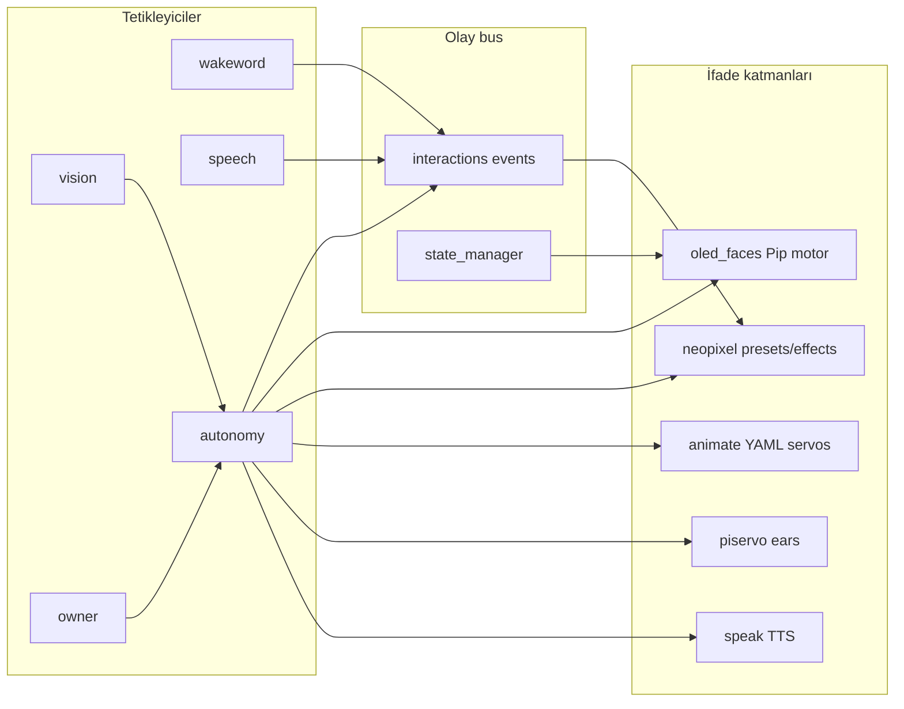

# SentryBOT — Robot İfade Haritası (Unified Expression Map)

Tek referans: bir olay tetiklendiğinde **OLED yüz**, **NeoPixel LED**, **servo animasyon** ve **kulak (piservo)** nasıl davranır.

Kaynak CSV: [`robot_expression_map.csv`](robot_expression_map.csv)  
NeoPixel detay: [`neopixel_event_mapping.csv`](neopixel_event_mapping.csv)  
Pip upstream: [`vendor/esp-bridge-mcp-robot`](../vendor/esp-bridge-mcp-robot) → `src/modules/espbridge/eyes/`

## Mimari akış



## Katman sorumlulukları

| Katman | Modül | Ne yapar |
|--------|-------|----------|
| OLED yüz | `oled_faces` | Pip motor: mood / gesture / activity (`services/eyes/`) |
| LED | `neopixel` | Preset + effect (jewel + stick segmentler) |
| Servo gövde | `animate` | YAML animasyonlar → Arduino `set_pose` |
| Kulak | `piservo` | Duygu ile GPIO PWM kulak pozisyonu |
| Ses | `speak` | TTS + liveliness LED senkronu |
| Orkestrasyon | `autonomy` | Scene steps: event + preset + anim + speak |
| Kural motoru | `interactions` | Event → NeoPixel HTTP kuralları |

## Pip motor senkronu

SentryBOT göz motoru upstream [esp-bridge-mcp-robot](https://github.com/WhoIsMrSentry/esp-bridge-mcp-robot) fork'udur.

```bash
python3 tools/sync_pip_eyes_catalog.py
```

| Katalog | SentryBOT | Upstream-only (port adayı) |
|---------|-----------|----------------------------|
| moods | 32 (+ `smoking` robot özel) | — (tam senkron) |
| gestures | 24 (+ body language) | 12 ortak Pip blinks/gaze |
| activities | 15 (upstream tam set) | — (tam senkron) |

## Örnek olay paketleri

### Wakeword
- **OLED:** `listening` activity
- **NeoPixel:** `TWINKLE` jewel + `BREATHE` base
- **Servo:** head pan/tilt (autonomy scene)
- **Neden:** Kullanıcı dikkatini çek; dinlemeye hazır ol

### Konuşma
- **speech.start:** OLED `thinking` + NeoPixel `PULSE`
- **speech.end:** OLED `normal` + NeoPixel `COMET`
- **speak liveliness:** konuşma süresince `interactions/effect` (ayrı kanal)

### Autonomy body language
| Olay | OLED | NeoPixel | Servo |
|------|------|----------|-------|
| `autonomy.blink` | gesture `blink` | `RANDOM_BLINK` | `blink` |
| `autonomy.look_around` | activity `scanning` | `COMET` | `look_around` |
| `autonomy.stretch` | gesture `look_up` | `WAVE` | `stretch` |
| `autonomy.laugh` | gesture `laugh` | — | — |
| `autonomy.smoke` | gesture `smoke` | — | — (robot özel) |

### Duygu (emotion)
| Duygu | OLED | NeoPixel | Servo |
|-------|------|----------|-------|
| joy | `happy` | preset `emotion_joy` | `look_around` |
| curiosity | `attentive` | preset `emotion_curiosity` | `vision_focus` |
| fear | `scared` | preset `emotion_fear` | — |
| tired | `tired` | preset `emotion_tired` | `stretch` |
| sadness | `sad` | preset `emotion_sad` | tilt down |

Config: `modules/oled_faces/config/config.yml` (`emotion:*` keys) + `modules/autonomy/config/config.yml` (`scenes.emotion_*`)

## ESP32 köprü vs Pip

| Bileşen | `esp_link` + `arduino/firmware/esp_bridge` | Pip `esp-bridge-mcp-robot` |
|---------|---------------------------------------------|----------------------------|
| Rol | Mega UART köprüsü, `/esp/send` HTTP | BLE desk robot, MCP `face` tool |
| OLED | — | ESP32 veya emülatör |
| SentryBOT kullanımı | Pi → ESP → Mega NDJSON | Pi I2C OLED (`oled_faces`) |

Bu iki sistem **farklı donanım** içindir; göz motoru kodu paylaşılır, iletişim katmanı paylaşılmaz.

## Güncelleme prosedürü

1. `cd vendor/esp-bridge-mcp-robot && git pull`
2. `python3 tools/sync_pip_eyes_catalog.py`
3. Gerekirse upstream-only mood/activity port et → `modules/oled_faces/services/eyes/`
4. `docs/robot_expression_map.csv` satır ekle/güncelle
5. `python3 .sentrybot/tools/generate_module_ai_assets.py`

## Manuel tetikleme (otonomi gerekmez)

Tüm motor girdileri `expand_config()` ile `event_map`'e otomatik kayıt olur:

| Yol | Örnek |
|-----|-------|
| Event bus | `activity:debugging`, `gesture:nod`, `emotion:chill` |
| HTTP event | `POST /oled_faces/event` → `{"type": "activity:deploying"}` |
| HTTP manual | `POST /oled_faces/manual` → `{"mode": "animation", "name": "glitch"}` |
| Agent hooks | `agent.debugging`, `agent.deploying`, `agent.chill` (config.yml) |
| Katalog | `GET /oled_faces/catalog` — tüm isimler + event anahtarları |

Legacy kısa adlar: `debug`, `deploy`, `build`, `test`, `ping`, `wait`, `glitch` → `resolve_animation()`.
