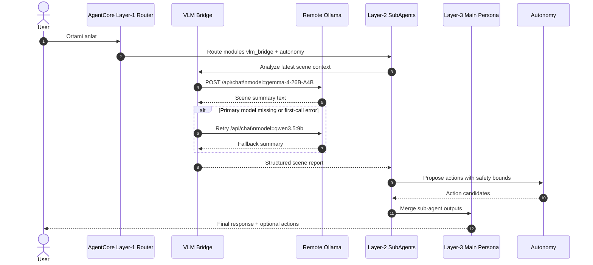

# VLM + Tri-Layer Agent Workflow

Bu dokuman, VLM-oncelikli 3 katmanli agent akisinin nasil calistigini ornek bir senaryo ile ozetler.

- Primary model: `qwen3.5:9b`
- Fallback model: `qwen3.5:9b`
- Remote Ollama endpoint semasi: `http://<remote-ollama-host>:11434/api/chat`

## Sequence Diagram (Ornek Senaryo)

## Kisa Notlar

1. Layer-1 sadece yonlendirme yapar, agir isleme girmez.
2. Layer-2 sub-agentlar dar kapsamli tool set ile calisir.
3. Layer-3 ana persona tek bir tutarli cevap uretir.
4. Endpoint `/api/tags` gelirse istemci bunu otomatik `/api/chat` olarak normalize eder.
