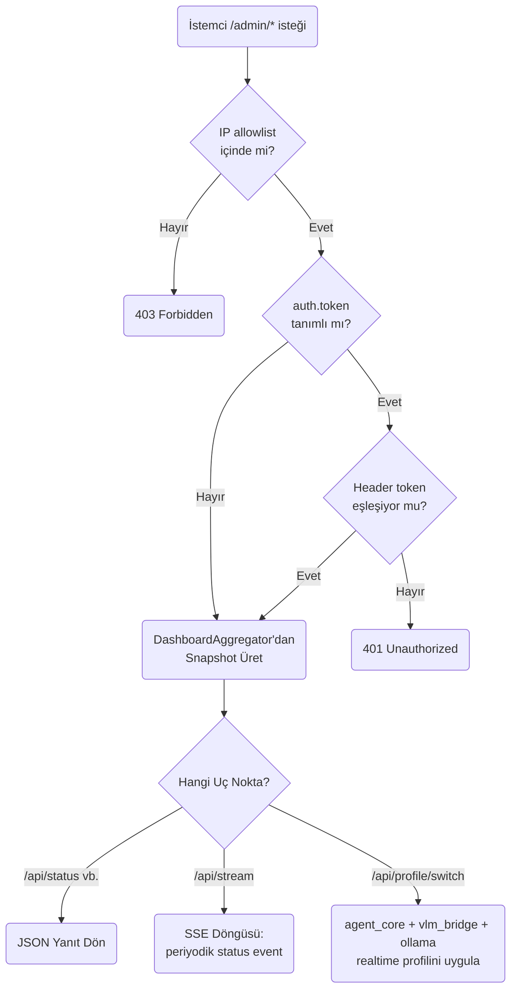
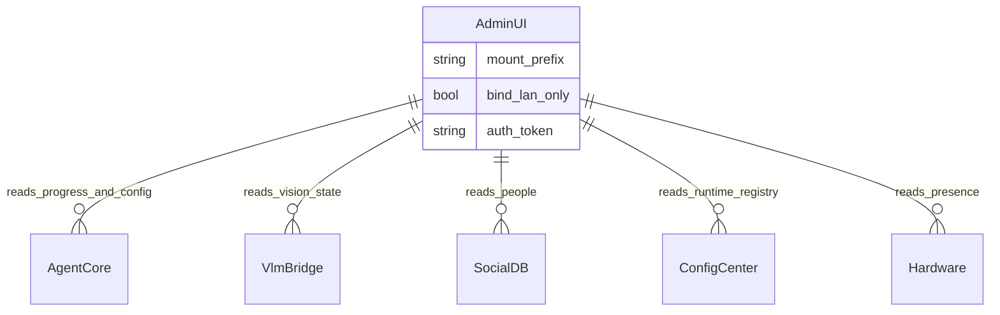

# Admin UI Modülü Mimarisi

Admin UI modülü (`modules/admin_ui`), robotun tüm alt sistemlerinin (autonomy, vlm_bridge, social_db, config_center, donanım) anlık durumunu tek bir LAN-only panelde toplayan ve realtime profil değişimini tetikleyen izleme/yönetim yüzeyidir. Kendi başına bir servis başlatmaz; `mount()` ile bir host FastAPI uygulamasına (gateway) eklenir.

## 🏗️ İş Akışı ve Karar Mekanizmaları (Flowchart)

## 🔄 İlişkisel Etkileşimler (Veri Akışı)

## ⚙️ Detaylı Karar Mantığı (if/else)

1. **LAN Filtresi Önce, Token Sonra**
   - `_require_lan` her uç noktada ilk kontrol edilir; `bind_lan_only` `false` değilse ve istemci IP'si (veya `X-Forwarded-For`) `allowed_networks` içinde değilse istek `403` ile reddedilir.
   - LAN kontrolünden geçen isteklerde, **`if`** `auth.token` config'te boşsa token kontrolü tamamen atlanır (yerel/güvenilir ağlarda sürtünmesiz kullanım); doluysa `X-Admin-Token` (veya yapılandırılmış header) eşleşmelidir, aksi halde `401`.
2. **Savunmacı Aggregator**
   - `DashboardAggregator` hiçbir state tutmaz; her çağrıda `started` sözlüğündeki canlı referanslara bakar. **`if`** bir alt sistem (örn. `vlm_bridge`) henüz başlatılmadıysa veya `None` ise, ilgili snapshot fonksiyonu hata fırlatmak yerine `{"available": False}` gibi güvenli varsayılanlar döner — tek bir bozuk alt sistem tüm paneli çökertmez.
3. **Realtime Profil Değişimi Çok Adımlı**
   - `POST /api/profile/switch` çağrısı; **`if`** `agent_core` mevcut ve `apply_realtime_profile` destekliyorsa doğrudan uygulanır. Ardından **`if`** `vlm_bridge` mevcutsa aynı mod ona da uygulanır. Son olarak profildeki `ollama_num_predict` alanı varsa, gateway üzerinden `/ollama/runtime/num_predict` çağrısı best-effort olarak yapılır (hata olsa bile diğer adımlar geri alınmaz).
4. **Statik Dosya Guard'ı**
   - `/ui/{path}` uç noktası, istenen dosyanın `_STATIC_DIR` dışına çıkmasını (`../` ile dizin gezinmesini) `relative_to()` kontrolüyle engeller; **`if`** yol statik dizinin dışına çıkarsa `404` döner.
