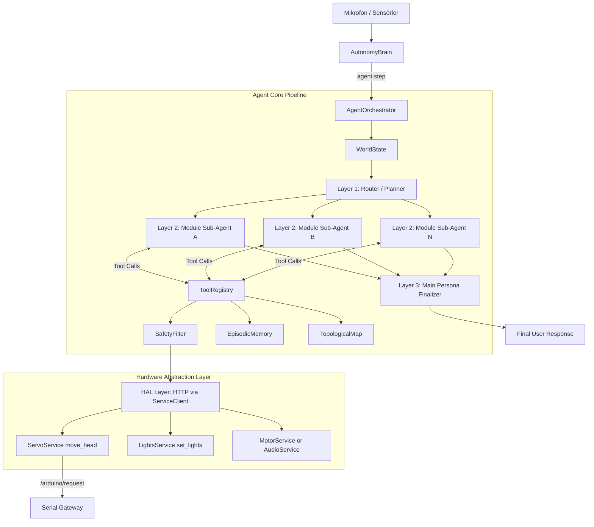

# Agent Core — Mimari Dokümantasyon

## Genel Bakış

Agent Core, SentryBOT'un otonom karar verme, cevreyi algilama ve tool kullanma katmanidir.
Yeni surumde mimari **3 katmanli agent** modeline tasinmistir:

1. Router/Planner katmani
2. Modul bazli Sub-Agent katmani
3. Main Persona (final cevap) katmani

Bu uc katman da tek Ollama modeli uzerinden calisir, sadece sorumluluklari farklidir.

## Modül Yapısı

```
modules/agent_core/
├── xAgentCoreService.py      # Servis başlatıcı
├── config_loader.py          # config.yml okuyucu
├── config/
│   └── config.yml            # Modül ayarları
├── services/
│   ├── __init__.py           # Re-export proxy
│   ├── agent.py              # Ana orkestratör (Native ReAct Loop)
│   ├── safety_filter.py      # Donanım güvenlik sınırlayıcı (servolar vb.)
│   ├── memory.py             # SQLite epizodik bellek (Kalıcı bellek)
│   ├── slam.py               # Topolojik harita + BFS yol bulma
│   ├── tools.py              # LLM araç tanımları (10 adet Native Tool)
│   ├── world_state.py        # Sensör durumu (Pil, ultrasonik vb.)
│   ├── sensor_loop.py        # Arka plan sensör okuyucu (Thread)
│   ├── idle_behavior.py      # Boşta kalma nefes efekti
│   └── tri_layer.py          # Router + sub-agent profil tanimlari
├── architecture_agent_core.md# Mimari dokümantasyon
└── README.md                 # Genel bilgi
```

## Veri Akisi (Tri-Layer Agent Flow)



## Modüller Arası Etkileşim

| Modül | Agent Core ile İlişki |
|---|---|
| `autonomy` | Agent Core'u baslatir ve `agent.step()` cagrilarini yonetir. |
| `ollama` | Uc katmanin da ortak LLM backend'idir (tek model stratejisi). |
| `hardware` | Tool cagrilari SafetyFilter sonrasinda ServiceClient uzerinden gider. |
| `camera` / `vlm_bridge` | Gorsel baglami sub-agent katmanina saglar. |
| `speech` / `speak` / `wakeword` | Ses giris-cikis ve uyandirici akislarina domain uzmanligi verir. |
| `gateway` | Agent Core API endpoint'lerini dis sisteme acar. |

## Tasarım Kararları

### Neden Tri-Layer + Native Tool Calling?
Eski tek-katmanli tool loop, farkli domain sorumluluklarini ayni promptta biriktiriyordu.
Yeni yapida router istegi domain sub-agent'lara boler, final persona katmani ise tek bir tutarli cevap uretir.
Bu sayede:
- Modul bazli uzmanlasma artar.
- Prompt karmaşasi azalir.
- Tek model kullanildigi icin operasyonel maliyet ve deployment sadeligi korunur.
