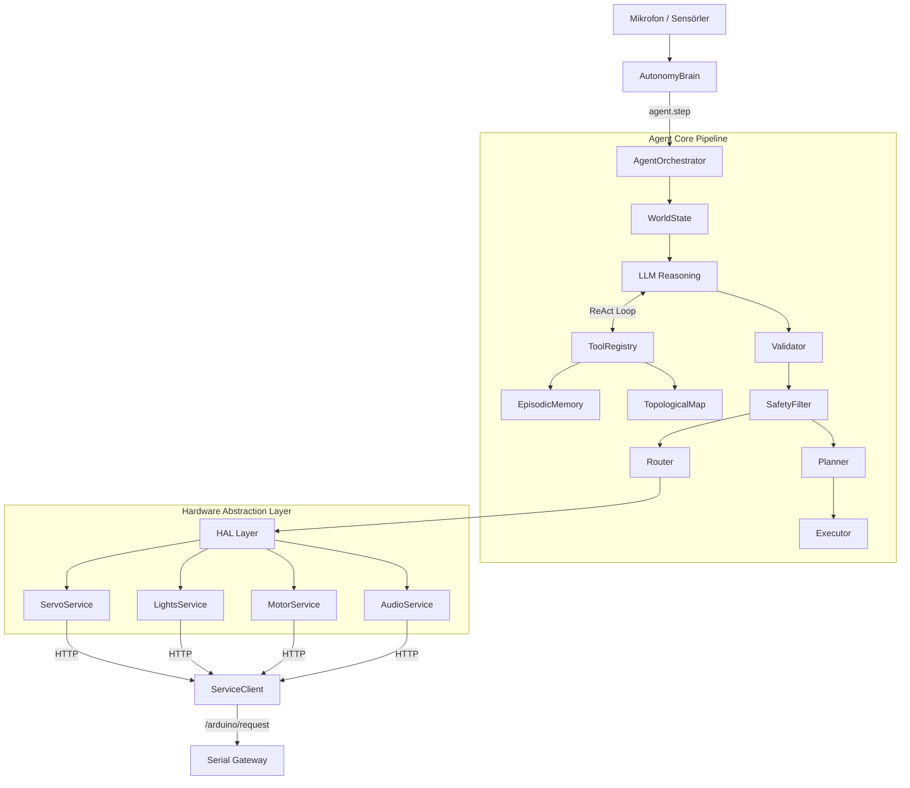

# Agent Core — Mimari Dokümantasyon

## Genel Bakış

Agent Core, SentryBOT'un otonom karar verme, planlama ve çevre etkileşim katmanıdır. AutonomyBrain içine subsistem olarak entegre olur ve mevcut Mixin mimarisini bozmaz.

## Modül Yapısı

```
modules/agent_core/
├── xAgentCoreService.py      # Servis başlatıcı
├── config_loader.py           # config.yml okuyucu
├── config/
│   └── config.yml             # Modül ayarları
├── services/
│   ├── __init__.py            # Re-export proxy
│   ├── agent.py               # Ana orkestratör (ReAct Loop)
│   ├── validator.py           # JSON şema doğrulayıcı
│   ├── safety_filter.py       # Donanım güvenlik sınırlayıcı
│   ├── planner.py             # Plan → görev kuyruğu dönüştürücü
│   ├── executor.py            # Durum makinesi (State Machine)
│   ├── router.py              # 22 aksiyon tipi → HAL yönlendirici
│   ├── memory.py              # SQLite epizodik bellek
│   ├── slam.py                # Topolojik harita + BFS yol bulma
│   ├── tools.py               # LLM araç tanımları (4 araç)
│   ├── world_state.py         # Chrono-farkındalık + sensör durumu
│   ├── sensor_loop.py         # Arka plan sensör okuyucu (Thread)
│   └── idle_behavior.py       # Boşta kalma nefes efekti
├── architecture_agent_core.md # Mimari dokümantasyon
└── README.md                  # Genel bilgi
```

## Veri Akışı



## Modüller Arası Etkileşim

| Modül | Agent Core ile İlişki |
|---|---|
| `autonomy` | Agent Core'u başlatır ve `agent.step()` çağırır |
| `ollama` | `ServiceClient.chat()` üzerinden dolaylı kullanılır |
| `hardware` | HAL servisleri burada yaşar, Agent Core'un fiziksel arayüzüdür |

## Tasarım Kararları

### Neden ServiceClient üzerinden HTTP?
Proje microservice mimarisi kullanıyor. Agent Core doğrudan donanım sürücüsü kullanmaz — tüm donanım erişimi `ServiceClient` HTTP çağrıları üzerinden yapılır. Bu sayede modüller arası bağımlılık azalır ve her servis bağımsız test edilebilir.

### Neden AutonomyBrain'i değiştirmedik?
AutonomyBrain zaten çalışan bir Mixin mimarisi içeriyor. Agent Core bunu bozmak yerine içine subsistem olarak eklendi. Bu sayede sistemin stabilitesi korunurken yeni yetenekler eklenebildi.
