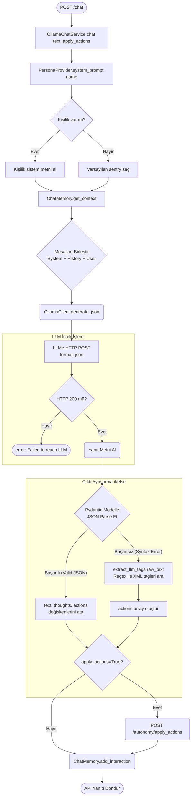
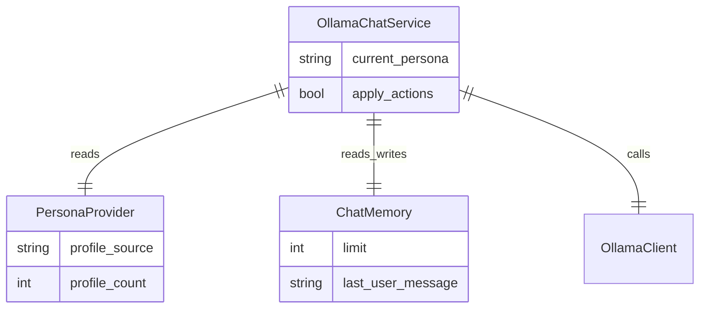

# Ollama Modülü Mimarisi

Ollama modülü (`modules/ollama`), robotun yerel LLM (Büyük Dil Modeli) ile olan tüm metinsel etkileşimlerini yönetir. Kişilik yapılandırmalarını uygular ve çıktıların donanım tarafından anlaşılabilecek (JSON) formatta üretilmesini garantiler.

## 🏗️ İş Akışı ve Karar Mekanizmaları (Flowchart)

Sohbetin nasıl gerçekleştiğini, sistem promptunun nasıl oluşturulduğunu ve yapılamayan/hatalı JSON formatlı çıktıların nasıl yedek (fallback) bir ayrıştırıcıya (`extract_llm_tags`) düştüğünü gösteren diyagram:

## 🔄 İlişkisel Etkileşimler (Veri Akışı)

## ⚙️ Detaylı Karar Mantığı (if/else)

1. **`PersonaProvider.system_prompt(name)`**
   - **`if`** ilgili kişilik YAML dosyası mevcutsa (örn: `sentry.yml`), içerik okunup (isim, stil, kısıtlamalar) bir metne dönüştürülür.
   - **`else`**: Basit bir fallback "Sen bir asistansın" promptu döner.
2. **`OllamaClient` Bağlantısı Hata Yönetimi**
   - **`try/except`**: HTTP isteği sırasında sunucu kapalıysa veya zaman aşımı olursa (Ollama yüklü değilse), sistem çökmez, geriye `None` ve log bilgisi döner.
3. **Pydantic Fallback Sistemi**
   - LLM'ler her zaman düzgün JSON üretmeyebilir (özellikle küçük modeller).
   - **`if`** `json.loads(response)` patlarsa veya Pydantic model doğrulaması geçemezse:
     - Düz metin (`raw_text`) kabul edilir.
     - **`extract_llm_tags(text)`** modülü devreye girer. XML stili `<speak>...</speak>`, `<lights effect="breathe">...</lights>` etiketlerini `regex` (düzenli ifadeler) ile bulur ve bunları zorla `actions` JSON dizisine çevirir. Kalan metin `text` (kullanıcıya görünen) kısmı olur.
4. **`apply_actions` Kararı**
   - `chat` fonksiyonu çağrılırken `apply_actions=True` verilmişse (genelde Autonomy Brain yapıyor), Ollama modülü JSON çıktısını alıp doğrudan uygulamasını istemek için Autonomy servisine HTTP POST atar. Eğer `False` ise (sadece metin sorulmuşsa / API'den deneniyorsa) hiçbir motor hareketine dönüşmez, sadece metin döner.
