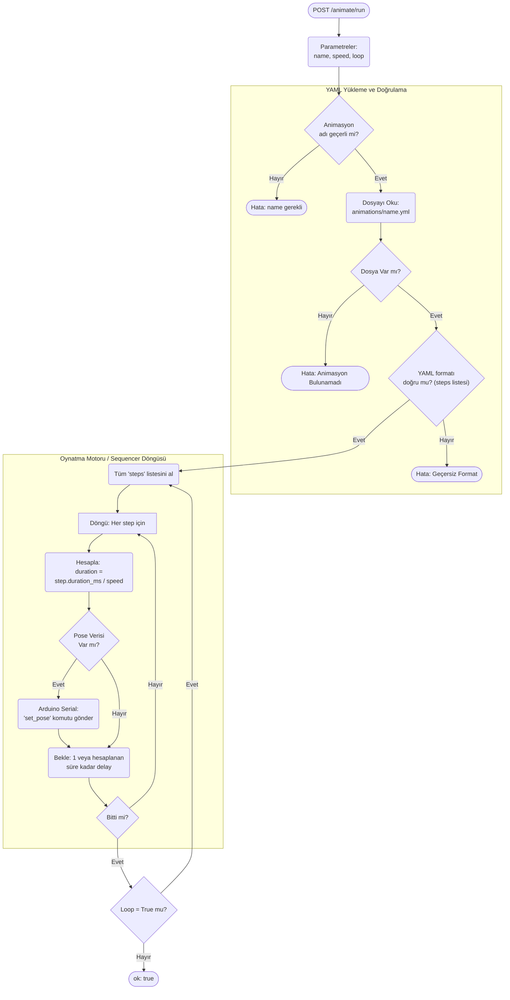
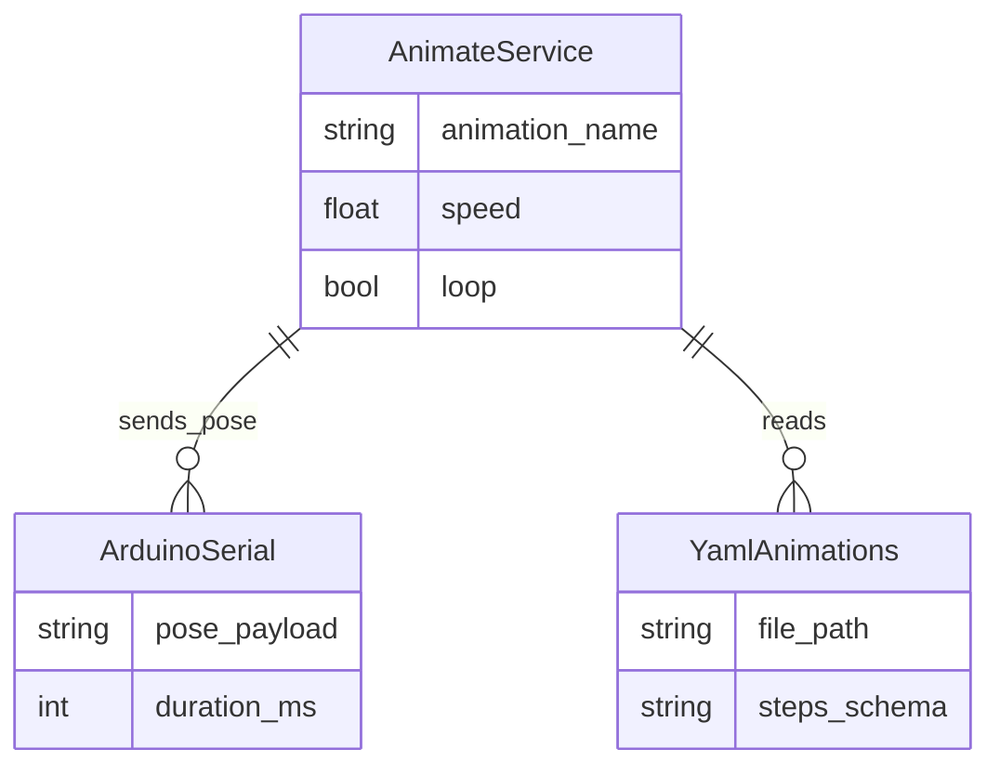

# Animate Modülü Mimarisi

Animate modülü (`modules/animate`), robotun karmaşık gövde/kafa hareketlerini (animasyonlarını) zamanlanmış servo pozisyonlarına bölen ve bunları YAML dosyalarından okuyarak Arduino'ya aktaran sıralayıcı (sequencer) motordur.

## 🏗️ İş Akışı ve Karar Mekanizmaları (Flowchart)

Bir servo animasyonunun yüklenme, hız/tempo ayarı (speed) ve Arduino'ya iletilme adım (step) if/else mantığı:

## 🔄 İlişkisel Etkileşimler (Veri Akışı)

## ⚙️ Detaylı Karar Mantığı (if/else)

1. **Güvenlik (Directory Traversal Koruması)**
   - API'ye dışarıdan `name=../../../etc/passwd` gibi zararlı şeyler gelebilir.
   - **`if`** `os.path.abspath` animasyon dizininin dışına taşıyorsa, dosya okumasını derhal reddeder. Sadece `modules/animate/animations/` altındaki `.yml` dosyalarını işler.
2. **Değişken Hız Katsayısı (Speed Multiplier)**
   - Autonomy beyni animasyon çağırırken robotun o anki duygu durumuna göre `speed` katsayısı gönderir (Örn mutluysa x1.2 hızlı, üzgünse x0.5 yavaş).
   - Motor, YAML'da yazan saf `duration_ms` değerini alır ve `(duration_ms / speed)` yaparak yeni bekleme süresini (timeout delay) hesaplar. Arduino'ya da hareketin ne kadar sürede tamamlanacağını (`duration`) bu yeni hesapla gönderir ki servo aniden seğirmesin, pürüzsüz ("smooth") gitsin.
3. **Loop ve Non-Blocking Çalışma**
   - Animasyonlar robotun beynini 10 saniye boyunca kilitlememelidir. Bu yüzden `run_animation` tetiklendiğinde Python arkada yeni bir `threading.Thread` başlatıp bu sleep/döngü işini ayrıştırır ve HTTP yanıtını anında döner `{"ok": True}`. Robot konuşurken veya başka iş yaparken servolar hareket etmeye devam eder.
