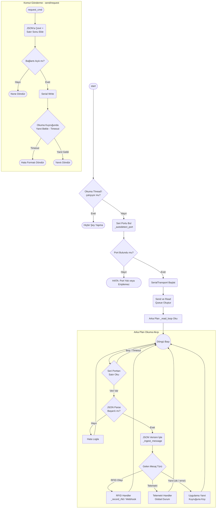
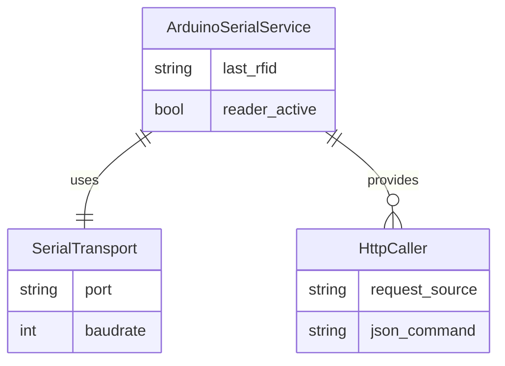

# Arduino Serial Modülü Mimarisi

Arduino Serial modülü (`modules/arduino_serial`), Raspberry Pi/Jetson ile Arduino Mega arasındaki düşük seviyeli iletişimi NDJSON (Newline Delimited JSON) protokolü üzerinden yönetir.

## 🏗️ İş Akışı ve Karar Mekanizmaları (Flowchart)

Aşağıdaki diyagram, seri portun nasıl başlatıldığını, arka plandaki okuma döngüsünü, ve gelen/giden JSON mesajlarının nasıl filtrelendiğini (if/else) gösterir:

## 🔄 İlişkisel Etkileşimler

## ⚙️ Detaylı Karar Mantığı (if/else)

1. **`_autodetect_port(fallback_port)`**
   - **`if`** fallback `AUTO` ise: PySerial `list_ports` ile mevcut cihazları tara.
     - **İç `for` döngüsü**: `/dev/ttyUSB`, `/dev/ttyACM` önekli portları (RPi/Linux), veya `COM` önekli portları (Windows) bul. Bulursa ilkini kullan.
   - **`else`**: Belirtilen spesifik portu kullan.
   - Eğer port bulunamazsa veya cihaz hatalıysa sisteme uyarı ver (`logger.error`).
2. **`request(obj, timeout)` (Senkron Çağrı Mantığı)**
   - Arduino'ya istek gönderilir.
   - Öncesinde yanıt kuyruğu temizlenir (Eski okunmamış çöpleri temizlemek için `Empty` exception alana kadar döngü çalışır).
   - **`while`**: `timeout` süresince `_lines` kuyruğunu bekle.
     - **`if`** doğru formatta cevap gelirse dön, yoksa döngüde beklemeye devam et.
     - Zaman aşımı olursa (Arduino yanıt vermedi), otomatik `{"error": "timeout"}` simüle edip döndür.
3. **RFID Yetkilendirmesi (`authorize_rfid`)**
   - **`if`** `uid` parametresi verilmişse: Normalizasyon yapılır (`F3-A1...` -> `F3A1...`), kuyruklar temizlenir ve UID özel bir değişkende 5 saniye boyunca (window) tutulur, bu sürede gelen aynı UID okumaları gözden kaçmaması içindir.
