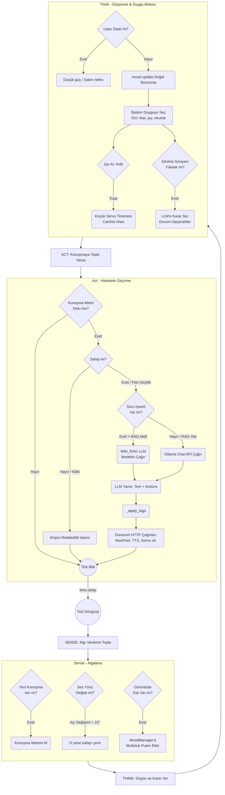

# Autonomy (Brain) Modülü Mimarisi

Autonomy modülü (`modules/autonomy`), SentryBOT'un beyni olarak işlev gören en kritik modüldür. "Algıla -> Düşün -> Hareket Et" (Sense -> Think -> Act) döngüsünü sürekli çalıştırarak robotun yaşam belirtilerini (nefes alma, sıkılma), duygu durum değişikliklerini (MoodManager) ve kendisine yönelik dışarıdan gelen (ses, görüntü) komutlara vereceği tepkileri yönetir.

## 🏗️ İş Akışı ve Karar Mekanizmaları (Sense-Think-Act Döngüsü)



## 🔄 İlişkisel Etkileşimler (Mixin Mimarisi)

Autonomy modülü çok büyük olduğu için Python'un `Mixin` desenleriyle alt parçalara bölünmüştür:

```mermaid
classDiagram
    class AutonomyBrain {"+dict state<br>        +MoodManager mood<br>        +ServiceClient client<br>        +start<br>        +_loop<br>        +_sense<br>        +_think<br>        +_react_to_speech"}
    
    class VisionMixin {"+_poll_vision<br>        +_handle_vision_greeting"}
    
    class VocalMixin {"+_speak_with_mood_text<br>        +_apply_speech_tone"}
    
    class ResponsesMixin {"+_apply_llm_response_actions<br>        +_handle_lights_block<br>        +_resolve_emotion_palette"}
    
    class OwnerGuardMixin {"+check_owner_lock<br>        +temporarily_trust_user"}
    
    class TimelineMixin {"+_log_conversation<br>        +_build_timeline_summary"}
    
    class ServiceClient {"+move_head<br>        +chat<br>        +play_sound<br>        +... (25 metod)"}

    AutonomyBrain <|-- VisionMixin
    AutonomyBrain <|-- VocalMixin
    AutonomyBrain <|-- ResponsesMixin
    AutonomyBrain <|-- OwnerGuardMixin
    AutonomyBrain <|-- TimelineMixin
    AutonomyBrain *-- ServiceClient
```

## ⚙️ Detaylı Karar Mantığı (if/else ve Threshold'lar)

1. **Baskın Duygu Seçimi (MoodManager)**
   Dört sürekli duygu ekseni (0-100 değerleri): `happiness`, `energy`, `curiosity`, `fear`.
   - **`if`** `fear > 50`: Robot direkt korku moduna geçer (titreme animasyonu, kırmızı ışıklar).
   - **`elif`** `happiness > 70`: Mutlu (neopixel "joy" paleti, hızlı servo).
   - **`elif`** `happiness < 30`: Üzgün (neopixel "sadness" paleti, yavaş servo).
   - **`elif`** `curiosity > 80`: Robot sıkılmıştır, LLM agentic kararına düşer.
   - **`elif`** `energy < 20`: Yorgunluk modu başlar (yavaş nefes alma, esneme - `_stretch_fallback`).
   - **`else`**: Nötr/Normal mod (breathe animasyonu "neutral").
2. **Kişi Algılandığı Zaman (Vision_Mixin)**
   - **`if`** Sensör yeni bir isim okursa (`vision results`): `mood.happiness += 10`, `mood.energy += 10`. Bu geçici bir sevinç/canlanma katar.
   - Eğer kişi veritabanından tanınıyorsa (örn: "Ahmet"): TTS ile `"Hoşgeldin Ahmet"` sentezlenir.
3. **Sahip Kilit Sistemi (Owner_Guard_Mixin)**
   - Sistem config'de `require_owner` seçeneği varsa:
   - **`if`** Vision veya RFID ile Sahibin (`g_lastOwnerUid`) varlığı algılanmamışsa VEYA geçici süre (`timeout`) dolmuşsa:
     - Gelen konuşmaya yanıt üretilmez, TTS ile "Buna yetkim yok, sahibi bekliyorum" denir. Göz rengi kırmızı ("disapproval") paletinde yakılır.
4. **Agentic Karar Motoru (`_make_agentic_decision`)**
   - Robot belli bir süre boş kalırsa (`curiosity` çok yüksek seviyeye çıkarsa):
   - Arka planda LLM'e şu Prompt gönderilir: *"Robot boş kaldı, ne yapsın? Olası aksiyonlar: STRETCH, BLINK, SIGH, LOOK_AROUND, MONOLOGUE. Birini seç."*
   - Gelen yanıta göre bir `switch/case` (if/elif zinciri) işletilir:
     - Dönen yapı `STRETCH` ise -> Servo ile kollar ve baş esneme hareketi yapar.
     - Dönen yapı `SIGH` ise -> Kafa aşağı eğilir ve yavaş bir inleme sesi çıkarır.
     - Dönen yapı `MONOLOGUE` ise -> Ollama'dan kısa felsefi/komik bir kendi kendine konuşma cümlesi istenir ve TTS'e basılır.
