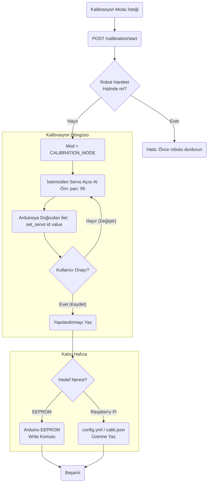

# Calibration Modülü Mimarisi

Calibration modülü (`modules/calibration`), robotun fiziksel eklentilerini (özellikle servolarını) ayarlamak ve bu ayarlamaları kalıcı hafızaya (EEPROM veya JSON) kaydetmekten sorumludur. Genellikle web üzerinden veya Arduino boot evresinde tetiklenir.

## 🏗️ İş Akışı ve Karar Mekanizmaları (Flowchart)



## 🔄 İlişkisel Etkileşimler (Veri Akışı)

```mermaid
erDiagram
    CalibrationService ||--|| ArduinoSerial : controls
    CalibrationService ||--o{"ConfigManager : updates
    
    CalibrationService {
        start_matrix
        save_offsets"}
```

## ⚙️ Detaylı Karar Mantığı (if/else)

1. **Güvenlik / Movement Lock**
   - **`if`** AutonomyBrain şu an aktif bir `ACT` döngüsü yürütüyorsa veya uyku modunda değilse, kalibrasyon istekleri robotun dengesini bozmamak için reddedilir.
2. **Kayıt Yeri Kararı**
   - Gelenekte IMU (Denge) offsetleri Arduino üzerindeki EEPROM'a donanım seviyesinde kaydedilir ki Raspberry Pi çökse bile Arduino ayarı saniyesinde okusun.
   - Ancak İleri Kinematik (IK) diz ve bilek servo merkez ayarları Pi üzerindeki YAML/JSON kalibrasyon dosyasına yazılır. **`if`** `type == 'imu'`, `eeprom_save` çağrılır. **`else`**, dosya kaydı yapılır.
