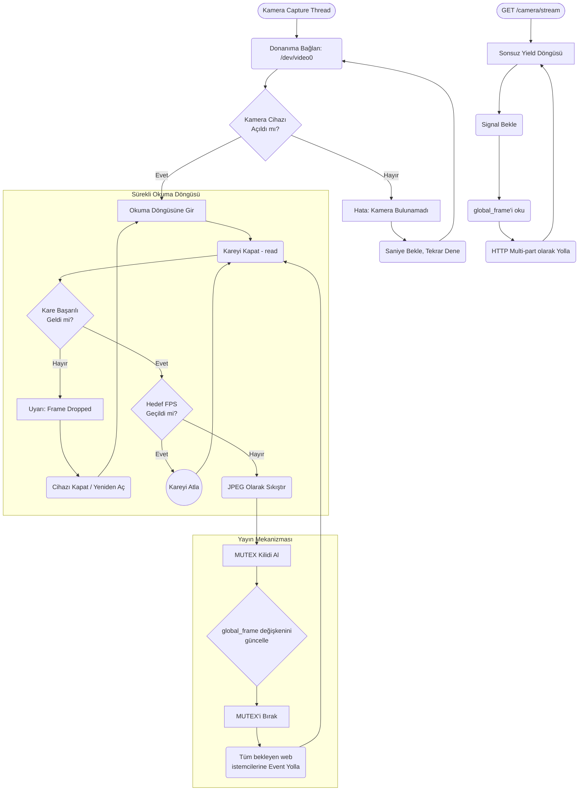

# Camera Modülü Mimarisi

Camera modülü (`modules/camera`), cihaza bağlı olan kameradan (veya V4L2 cihazından) sürekli görüntü akışını sağlayan ve bunu MJPEG formatında API üzerinden ağa / diğer modüllere sunan donanım bağdaştırıcısıdır.

## 🏗️ İş Akışı ve Karar Mekanizmaları (Flowchart)

Kamera thread'inin nasıl çalıştığını, çökme anında donanımı nasıl resetlediğini (`retry`) ve web üzerinden nasıl görüntülendiğini (MJPEG Streaming) gösteren mantık:



## 🔄 İlişkisel Etkileşimler (Veri Akışı)

```mermaid
erDiagram
    CameraCapture ||--o{"WebClients : streams_to
    VisionBridge ||--|| CameraCapture : polls_latest_frame
    
    CameraCapture {
        bytes current_frame 'Son başarılı JPEG'
                threading.Event frame_ready
                start
                stop"}
    
    VisionBridge {fetch_frame_for_yolo}
```

## ⚙️ Detaylı Karar Mantığı (if/else)

1. **Donanım Çökmesini İyileştirme (Auto-Recovery)**
   - Kameralar fiziksel kablo veya yoğun akım sebebiyle anlık kopmalar yaşayabilir.
   - **`while` loop içinde `if not ret`**: Eğer `cv2.VideoCapture` `False` sonuç döndürürse yazılım çökmez. Hemen `cap.release()` yaparak kamera buffer'ını boşaltır, 2 saniye `time.sleep()` atar ve tekrar (`cap = cv2.VideoCapture(0)`) başlatmayı dener. Bu sistemin "robot devrilse bile" kurtarılabilir olmasını sağlar.
2. **Yayın Modeli (Publisher - Subscriber)**
   - API'ye (örneğin Web tarayıcısı `/camera/stream` adresine girdiğinde) bağlanmış birden fazla kullanıcı veya modül olabilir.
   - Her istek için ayrı ayrı kameradan okuma YAPILMAZ (USB veriyolunu kitler).
   - Bunun yerine tek bir ana thread, kamerayı okur ve bellekteki (RAM) `global_frame` adlı bayte array'ini (**`if`** `mutex.acquire()` kilitleri içinde) ezerek günceller.
    - Okumak isteyen herkes sadece RAM'den okur, böylece RPi 10 cihaza birden yayın yapabilir (CPU tabanlı MJPEG multicast). Görüntü işleme (VLM Bridge) de bu RAM adresindeki son resmi çeker.
