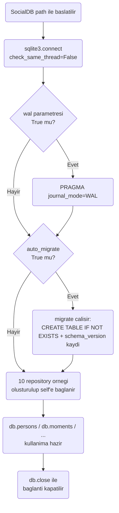
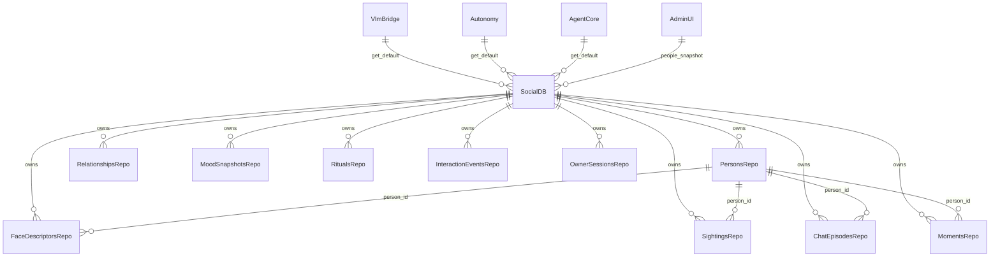

# Social DB Modülü Mimarisi

Social DB modülü (`modules/social_db`), robotun kişi tanıma, ilişki hafızası, sohbet geçmişi ve mood/etkileşim telemetrisini tek bir SQLite dosyasında (WAL modlu, thread-safe) birleştiren veri katmanıdır. HTTP yüzeyi yoktur; `vlm_bridge`, `autonomy`, `agent_core`, `config_center` ve `admin_ui` tarafından kütüphane olarak içe aktarılır.

## 🏗️ İş Akışı ve Karar Mekanizmaları (Flowchart)

## 🔄 İlişkisel Etkileşimler (Veri Akışı)

## ⚙️ Detaylı Karar Mantığı (if/else)

1. **Tek Paylaşımlı Bağlantı + Kilit**
   - `SocialDB`, `check_same_thread=False` ile açılan tek bir `sqlite3.connect` bağlantısını `threading.RLock` arkasında paylaşır. **`if`** birden fazla thread aynı anda yazmaya çalışırsa, `execute`/`transaction` çağrıları kilidi sırayla alır; SQLite seviyesinde `BEGIN IMMEDIATE` ile yazma çakışmaları engellenir.
2. **Canonical İsim ile Tekilleştirme**
   - `PersonsRepo.upsert`, ismi `_canon()` ile (strip + lowercase) normalize eder. **`if`** aynı `canonical_name` zaten varsa mevcut kayıt güncellenir (seen_count artırılabilir); **değilse** yeni `person_id` (`uuid4` kısaltması) ile satır eklenir — aynı kişi için birden fazla kayıt oluşmaz.
3. **Idempotent Migrasyon**
   - `_migrate()` tüm DDL'i `CREATE TABLE IF NOT EXISTS` ile çalıştırır ve `schema_version` tablosuna `INSERT OR IGNORE` yapar. **`if`** modül tekrar tekrar başlatılırsa (örn. testte veya servis restart'ında) migrasyon zararsızca tekrarlanabilir ve mevcut veriye dokunmaz.
4. **Süreç Geneli Varsayılan Örnek**
   - `get_default()` / `set_default()`, modüller arası tekil `SocialDB` paylaşımını sağlar. **`if`** hiçbir modül henüz `set_default()` çağırmadıysa, `get_default()` `None` döner ve çağıran taraflar (örn. `agent_core.tools.search_social_memory`) bunu zarifçe "Social memory unavailable." mesajına çevirir; bir alt sistemin sosyal hafızayı kullanamaması sistemin geri kalanını engellemez.
