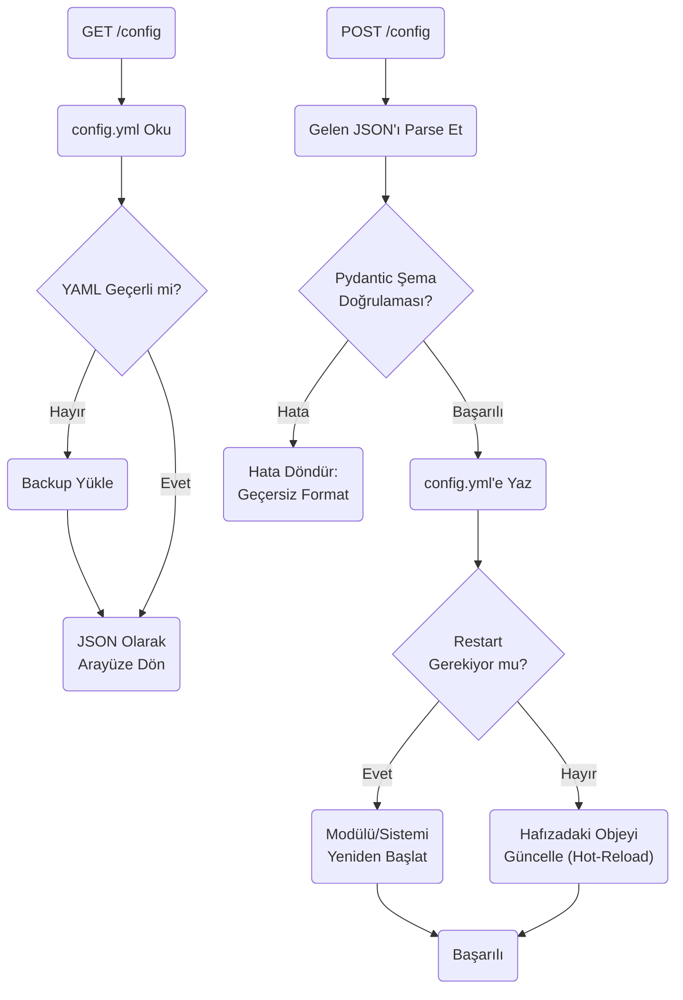
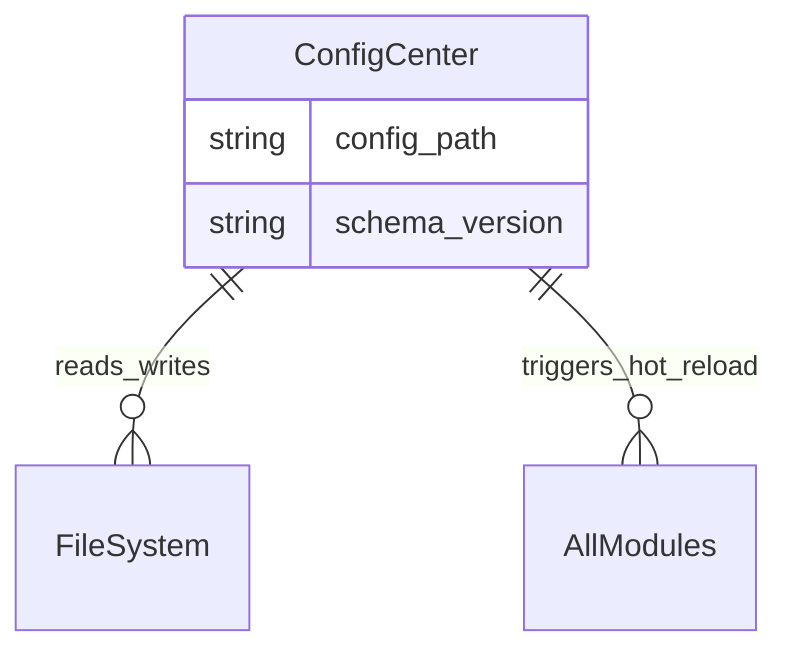

# Config Center Modülü Mimarisi

Config Center modülü (`modules/config_center`), sistemdeki tüm `config.yml` ve `.json` yapılandırma dosyalarının okunup, doğrulanıp (validate) anlık olarak değiştirilmesini sağlayan yönetim panelinin arka yüzüdür.

## 🏗️ İş Akışı ve Karar Mekanizmaları (Flowchart)

## 🔄 İlişkisel Etkileşimler (Veri Akışı)

## ⚙️ Detaylı Karar Mantığı (if/else)

1. **Şema Doğrulaması (Validation)**
   - Pydantic modelleri devreye girer. **`if`** `volume` parametresi (0-100) aralığı yerine "yüz" veya `-50` gelmişse, sistem bunu `config.yml` dosyasına yazmayı reddeder. Böylece botun başlamama riski ortadan kalkar.
2. **Hot Reload vs Restart (Soğuk/Sıcak Yenileme)**
   - Bazı ayarlar değiştikten sonra anında geçerli olur (Örn: konuşma hızı, otonomi algı hassasiyeti). Bunlar için ram üzerindeki sınıfların property değerleri ezilir (`Hot-reload`).
   - Fakat seri haberleşme portu, baudrate, kamera backend'i (OpenCV -> PiCamera) gibi derin değişiklikler varsa, **`if`** `key in REQUIRED_RESTART_KEYS`: Gateway'e yeniden başlama (restart) sinyali atılır.
