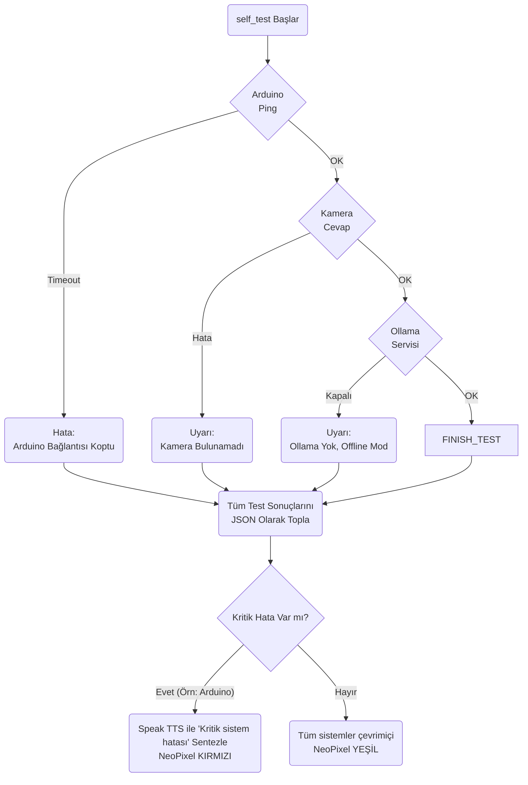
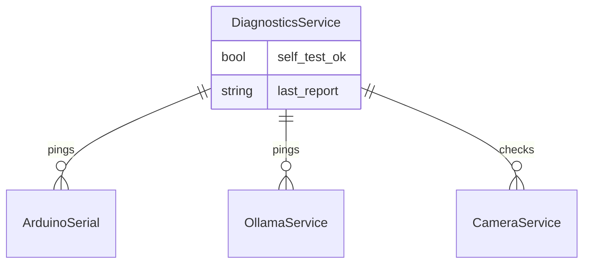

# Diagnostics Modülü Mimarisi

Diagnostics modülü (`modules/diagnostics`), robotun açılış evresinde (POST - Power On Self Test) ve çalışma sırasında periyodik olarak donanım/yazılım bileşenlerinin sağlığını test eden modüldür.

## 🏗️ İş Akışı ve Karar Mekanizmaları (Flowchart)

## 🔄 İlişkisel Etkileşimler (Veri Akışı)

## ⚙️ Detaylı Karar Mantığı (if/else)

1. **Boot Sırası Hata (POST)**
   - Boot esnasında `run_self_test` çağrılır. Testlerin paralel yapılması sistemin donmasını engeller.
   - **`if`** Ollama/AI bağlantısı gibi modüller düşerse (çökerse) bu `CRITICAL` (Kritik) bir hata sayılmaz, sadece `WARNING` üretir. Çünkü robot çevrimdışı komutları ve hareketleri yapmaya devam edebilir (fallback fallback).
   - **`if`** Arduino (Motor denetleyici) seriyoldan düşerse bu `CRITICAL` hatadır, çünkü robotun kasları (servoları ve adım motorları) işlevini yitirmiştir, dengesini kaybedebilir. Anında kırmızı alarm verir ve donanım denge koruma (`E-STOP`) komutu yollar.
