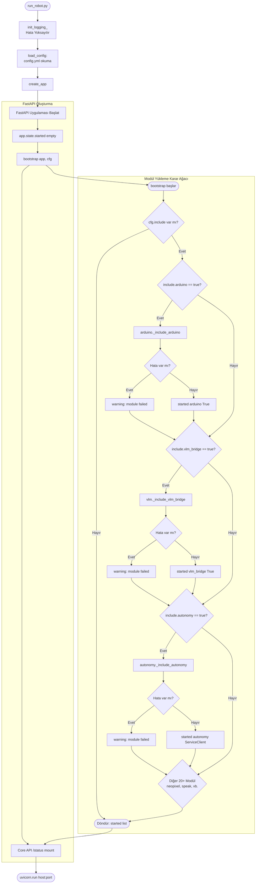
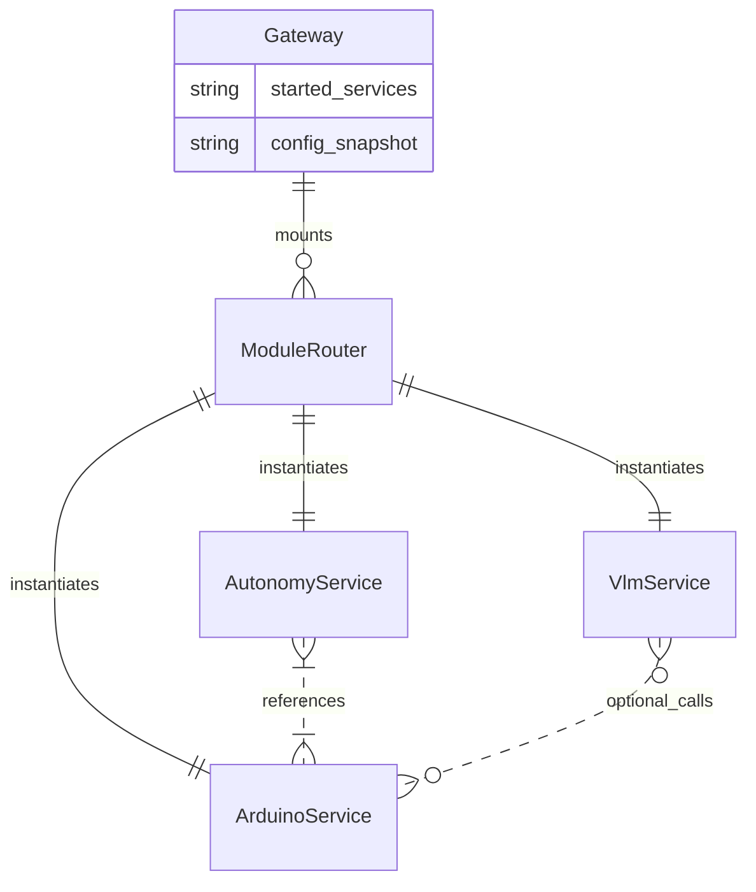

# Gateway Modülü Mimarisi

Gateway modülü (`modules/gateway`), SentryBOT'un tüm mikroservislerini tek bir FastAPI uygulamasında birleştiren merkezi başlatıcı (bootstrap) katmanıdır.

## 🏗️ İş Akışı ve Karar Mekanizmaları (Flowchart)

Aşağıdaki diyagram, uygulamanın nasıl başlatıldığını ve konfigürasyondaki `include` bayraklarının (if/else) nasıl değerlendirildiğini gösterir:

## 🔄 İlişkisel Etkileşimler (Veri Akışı)

Gateway yapısal olarak veri işlemez, modüllerin rotalarını API ağacına ekler. Veri bağlantıları şöyledir:

## ⚙️ Detaylı Karar Mantığı (if/else)

1. **`create_app(config_path)`**
   - **`if`** `config_path` verilmemişse, varsayılan `modules/gateway/config/config.yml` kullanılır.
   - **`try`** modül başlatma (`bootstrap`), **`except`** hatayı yut (uygulama çökmesin).
2. **`bootstrap(app, cfg)`**
   - **Yardımcı Fonksiyon `_try(fn, name)`**: 
     - İçine gönderilen lambda fonksiyonu (modül router'ını bağlayan kod) çalıştırılır.
     - **`except Exception`**: Eğer modül içindeki bir import veya bağlanma hatası (ör. donanım eksikliği) başlatmayı engellerse, sistemi durdurmaz (`logger.warning`), uygulamanın kalanı çalışmaya devam eder.
    - Modül yükleme öncelik sırası: Güvenli olması açısından donanım iletişimi (`arduino`) en önce, üzerine inşa edilen modüller (`autonomy`, `vlm`) daha sonra eklenir.
