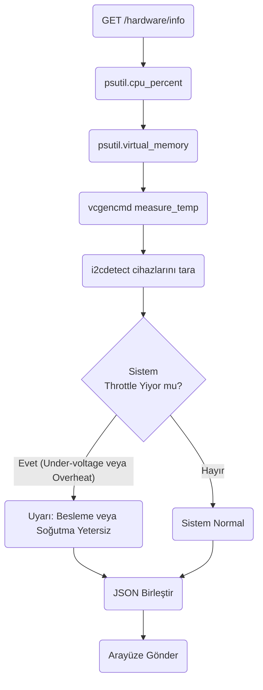
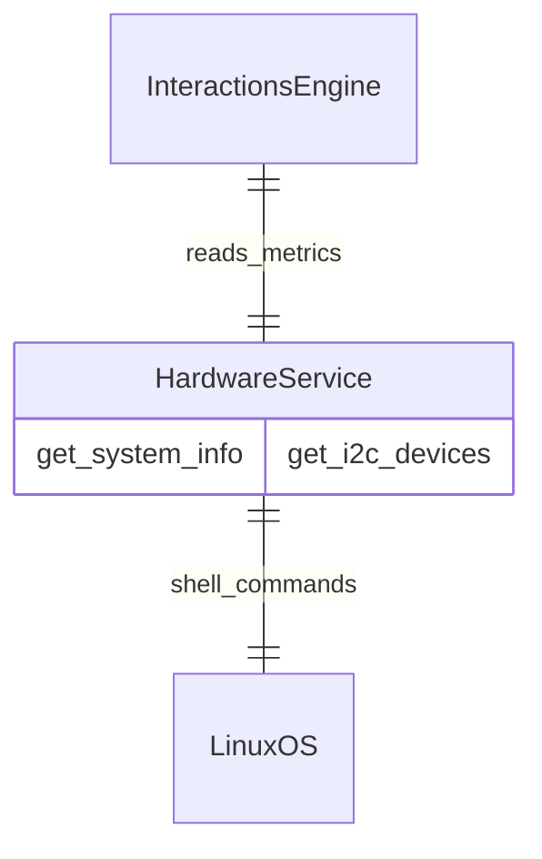

# Hardware Modülü Mimarisi

Hardware modülü (`modules/hardware`), yazılımın doğrudan erişebileceği işletim sistemi, GPIO, I2C, bellek (RAM) ve disk durumu gibi alt seviye (low-level) Raspberry Pi/Jetson donanım bilgilerini okur ve API'ye sunar.

## 🏗️ İş Akışı ve Karar Mekanizmaları (Flowchart)

## 🔄 İlişkisel Etkileşimler (Veri Akışı)

## ⚙️ Detaylı Karar Mantığı (if/else)

1. **İşletim Sistemi Çapraz Platform Mantığı**
   - Robotun kodları geliştirici bir bilgisayarda (Windows/Mac) çalıştırıldığında birçok donanımsal komut (örneğin `vcgencmd measure_temp`) çökecektir.
   - Bu modülde **`try / except`** blokları, komutun çalışıp çalışmadığını algılar. Eger `vcgencmd` komutu mevcut değilse, sistem çökmez, sıcaklık değeri olarak `-1` döner.
2. **Throttling Kontrolü (Aşırı Isınma ve Güç)**
   - Raspberry Pi'nin `get_throttled` komutu onaltılık (hex) bir bayrak döner (örneğin `0x50000`).
   - Bitwise (`&`) maskelemesi ile **`if`** `throttled & 0x1`: düşük voltaj (under-voltage), **`if`** `throttled & 0x2`: hız düşürme (CPU freq cap) olduğu anlaşılır ve Web Arayüzü/Diagnostik modülleri için `True/False` bayrakları JSON içine giydirilir.
