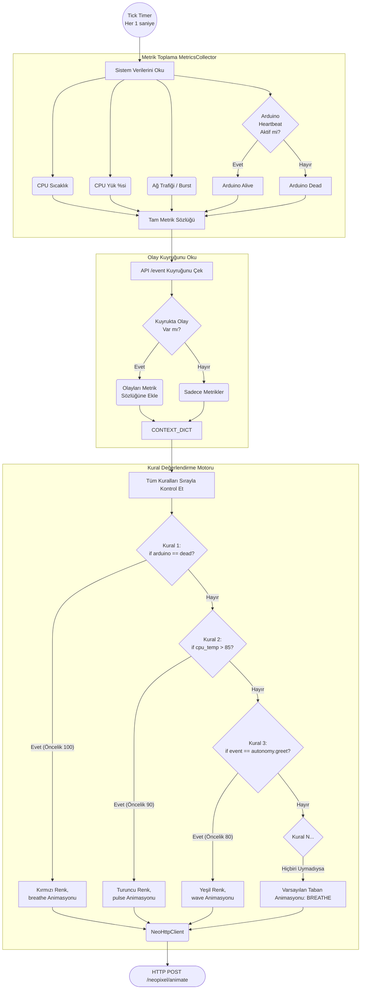

# Interactions Modülü Mimarisi

Interactions modülü (`modules/interactions`), robotun pasif ve anlık tepkilerini kural tabanlı (rule-based) olarak yöneten arka plan motorudur. CPU sıcaklığı yükseldiğinde ışıkları kırmızı yapma, internet üzerinden yoğun indirme yaparken gözleri "Yükleniyor (wave)" animasyonuna sokma veya dışarıdan rastgele olaylar geldiğinde LED'leri tetikleme işlerinden sorumludur.

## 🏗️ İş Akışı ve Karar Mekanizmaları (Flowchart)

Sistemin her 1-2 saniyede bir ölçüm (metrik) alarak kuralları sırayla (if/else zinciri gibi) nasıl değerlendirdiğini gösteren diyagram:



## 🔄 İlişkisel Etkileşimler (Veri Akışı)

```mermaid
erDiagram
    InteractionEngine ||--|| MetricsCollector : uses
    InteractionEngine ||--|| NeoHttpClient : calls
    EventAPI ||--o{"InteractionEngine : pushes_events
    
    MetricsCollector {
        get_cpu_temperature
                get_network_bytes
                get_cpu_load"}

    InteractionEngine {"list rules '(priority, condition, action)'
                tick"}

    NeoHttpClient {"string url 'localhost:8080/neopixel'
                play_animation_name__color"}
```

## ⚙️ Detaylı Karar Mantığı (if/else)

1. **MetricsCollector Ölçümleri (Eşiğe Bağlı if'ler)**
   - **`if`** `psutil` kullanılarak CPU sıcaklığı ölçülür, RPi üzerindeki termal sensör okunur.
   - **Ağ Burst Tespiti:** **`if`** `(net_current - net_previous) > 5MB/s`: O anki tick için `network_burst = True` bayrağı açılır. Bu sayede robot yüksek veri indirirken gözler hareketlenir (wave/chase).
2. **Kural Değerlendirme Mekanizması (Rule Engine)**
   Sistem hardcode büyük if-else yığınlarını engellemek için `rules` listesi tutar. Her kural `priority` (öncelik, yüksekten düşüğe), `condition_func` (boolean dönen lambda) ve `action_dict` içerir.
   - **Döngü (Taranan Kurallar)** (örn `rules.sort(key=priority, reverse=True)`):
     - **`if`** `condition_func(context) == True`: Bu eylemi seç ve diğer alt öncelikli kuralları okumayı bırak (`break`).
     - Yüksek öncelikler: Sistem hataları (Arduino bağlantısı kopuk), kritik durumlar (CPU aşırı sıcak).
     - Orta öncelikler: Anlık dış olaylar (`autonomy.greet`, `vision.person_detected`).
     - Düşük öncelikler: Normal donanım etkinlikleri (CPU yükü hafif yüksek, Ağ indiriliyor).
     - **Hiçbir Kural Uymadı (Default/Else):** `BREATHE` animasyonunu ve `neutral` duygu paletini gönderir. Robot bekleme halinde yavaşça nefes alır.
3. **HTTP İsteğinde Statefulness Zekası**
   - **`if`** Seçilen eylem (animasyon + renk) bir önceki tick ile BİREBİR AYNI ise hiçbir HTTP çağrısı yapılmaz. Bu sayede sistemi boşuna ağ istekleriyle yormaz, sadece değişim anında bildirir.
